# 高级函数式编程的模式

我们可能已经熟悉了来自面向对象编程的概念——模式。模式是常见问题的常见解决方案。每当你在项目之间重复遇到问题时，解决方案也倾向于重复。相似的问题以相似的方式解决。因此，这些解决方案成为广泛接受的模式。

函数式编程也有自己的模式。由于它有其独特的问题和挑战，它也将有其独特的解决方案。在本章中，我们将讨论常见函数式编程问题的解决方案。

在本章中，我们将涵盖以下主题：

+   模态转换器

+   标签无最终状态

+   类型级编程

# 模态转换器

模态转换器是纯函数式编程的一个重要模式，它允许我们组合效果类型。现在让我们详细讨论一下。

# 效果类型的专业化

我们已经讨论了效果类型在纯函数式编程中的普遍性以及它们用于抽象副作用。你可能也注意到这些类型非常专业化，这意味着我们几乎有一个副作用和效果类型之间的一对一映射。例如，应用程序返回 null 的能力由 `Option` 效果类型表示。`Option` 对于这种 null 情况来说很好。然而，当它被用来模拟错误和异常时，表现并不好。这是因为它没有保留失败性质的信息。

一个适合模拟可能失败的计算的数据类型是 `Either`。然而，如果你尝试用 `Either` 模拟返回 null 的计算，你会发现这个数据类型对于这些目的来说是多余的。这是因为每当有一个不返回值的计算时，你仍然需要从它返回某些东西。在错误场景中，我们可能已经做了以下操作：

```java
def foo(x: Int): Option[Int] =
  if (x < 0) None
  else Some(math.sqrt(x))
```

然而，在相同的场景下，如果你使用 `Either`，你会返回什么？如果正确的结果应该由 `Right` 模拟，我们应该用 `Left` 模拟一个空的结果：

```java
def foo(x: Int): Either[???, Int] =
  if (x < 0) Left(???)
  else Right(math.sqrt(x))
```

然而，`Left` 也应该包含一个值。我们在 `Left` 中返回什么？我们最好的选择是返回一个明确表示计算没有产生任何结果的字符串：

```java
def foo(x: Int): Either[String, Int] =
  if (x < 0) Left("Can't take square root of a negative value")
  else Right(math.sqrt(x))
```

如你所见，在这个例子中，`Either` 的这种用法相当牵强。这意味着我们有一个副作用非常细粒度的情况，每个副作用都有自己的表示效果类型。这对于 Scala 来说是一个自然的情况，对于任何强类型语言来说也是如此。你的类型系统与副作用越匹配，你就可以越容易地模拟出副作用。

这也意味着当我们有多个副作用时，我们需要考虑我们将如何展示和组合它们。

# 具有多个副作用的应用

现代应用程序追求异步。这意味着每当您需要计算任何东西，而且可能需要很长时间，您不会以同步的方式计算。也就是说，您不会等待计算产生结果。相反，您以非阻塞的方式编程。这意味着您将计算调度到未来的某个时间点，并等待结果。

# 异步

考虑一个例子，一个网络服务器负责处理来自一个管理在线论坛的 Web 应用的 HTTP 请求。假设这些请求需要用数据库中所有论坛帖子的数据来响应。这意味着为了回复任何给定的 HTTP 请求，我们首先需要从数据库中获取所需的数据。解决方案可能如下所示：

```java
def handle(request: Request): Response = {
  val posts: List[Post] = allPosts()
  respond(posts)
}
```

在前面的例子中，类型和方法声明如下：

```java
type Request
type Response
type Post

def allPosts(): List[Post]

def respondA: Response
```

然而，这并不是我们的应用程序需要完成的唯一任务。考虑一下，我们的论坛是私有的，这意味着在给用户访问论坛之前，我们需要对用户进行认证。

现在，一种流行的认证方式是使用云认证解决方案。这意味着人们不需要在服务器端自己实现认证机制，而是将其外包给某些提供商。这种机制被称为**认证即服务**（**AaaS**）。许多公司提供现成的服务，您可以在应用程序中使用这些服务进行认证。这种方法有很多好处，因为您不需要浪费时间实现认证逻辑，它不仅包括密码认证，还包括社交认证和复杂的安全机制，如双因素认证。

然而，如果我们使用基于云的认证解决方案，这意味着每次用户尝试登录时，我们很可能需要联系云。现代认证方法，如 JWT，意味着无状态认证。可以生成一个 JSON 标签，用户可以将其传递给服务器，服务器可以使用加密机制验证其真实性。因此，您不需要保持状态来认证一个人。然而，即使在这种情况下，您很可能还需要联系您的基于云的认证平台，以获取您使用的密钥以及验证用户确实存在于他们的数据库中。

所有这些与我们的函数式编程示例有什么关系？这里要注意的是，我们需要接触网络。联系云的操作是一个长时间运行的操作。暂时假设这个操作是以同步方式完成的，如下所示：

```java
def handle(request: Request): Response = {
  val userToken: Token = request.token
  val authenticated: Boolean = authenticate(userToken)

  if (authenticated) {
    val posts: List[Post] = allPosts()
    respond(posts)
  }
  else respond("You are not authorized to perform this action")
}
```

以下声明被添加到我们的环境中：

```java
type Token
type Request <: { def token: Token }

def authenticate(token: Token): Boolean
```

在前面的代码片段中，我们询问基于云的认证服务用户是否有权限执行该操作，如果有，我们回复论坛帖子。

想象一下服务器在高负载下的情况。立即，关于处理`HTTP`请求可以使用的线程数量的问题浮现出来。同样，还有一个问题，那就是一个网络服务器可以多快地处理任何给定的请求。假设我们有四个线程在处理任务。再想象一下，处理一个给定的请求大约需要一秒钟，因为涉及到与数据库和基于云的认证服务的联系延迟。服务器能承受多大的负载？

如果负载超过每秒四个请求，服务器将开始耗尽线程。想象一下服务器同时处理四个请求。这意味着分配给处理 HTTP 请求的四个线程将忙一秒钟。因此，服务器在处理完这四个请求之前将无法处理进一步的请求。这意味着，例如，如果有五个请求同时到达，前四个将在一秒钟内处理，第五个将需要两秒钟来处理。这是因为它将不会开始，直到前四个请求被处理。

处理这个请求的线程大多数时间实际上并没有做什么。在第一次调用云认证解决方案时，大部分的处理时间是在等待服务器回复。随后，当它调用数据库时，大部分时间是在等待数据库回复。如果线程大部分时间都在等待回复，这意味着处理器没有做任何有用的事情，它有一些空闲的功率和容量来处理其他任务，比如可能处理其他传入的请求。

正是这种推理使得同步处理方式在为高负载设计的应用程序中不可取。一个替代方案是异步方法。在异步方法中，每当有长时间运行的计算时，你使用异步原语将其调度到线程池中，例如，使用`Future`。然后，你指定任务完成后要做什么。异步应用程序的技巧是从不阻塞的异步原语构建。例如，从数据库请求信息的操作不应该涉及阻塞或等待响应，即使在未来的线程中也不行。关键是发起请求的线程在请求发出后可以自由地做其他任务，而且没有其他事情要做。

目标是利用非阻塞 API 来执行 HTTP 请求和对数据库的请求，这样你的线程，在 Java 世界中相当重型的原语，就不会阻塞，也不会等待响应，也不会浪费，相反，它们应该做些有用的事情。

异步风格的应用程序处理程序看起来如下：

```java
def allPosts(): Future[List[Post]]

def authenticate(token: Token): Future[Boolean]

def handle(request: Request): Future[Response] =
  for {
    authenticated <- authenticate(request.token)
    response <- 
```

```java
      if (authenticated) allPosts.map(respond)
      else Future { respond("You are not authorized to perform this
      action") }
  } yield response
```

处理单个请求仍然需要大约一秒钟的时间，因为你在请求外部资源时体验到的延迟仍然存在。然而，现在服务器在高负载下将表现得更好。这是因为线程本身不会在整个一秒钟内等待单个请求。相反，对他们来说，唯一算得上时间的是他们实际工作的时间，而不是他们等待外部资源回复的时间。

例如，如果给定请求的真实处理时间，即线程实际工作而不等待回复的时间，是 10 毫秒，那么单个线程每秒可以接受和处理 100 个请求。

前面的讨论描述了为什么在实践中你可能需要异步的副作用和回调编程。并且异步性是一个你可能想要隐藏在某种原语背后的副作用。

然而，异步性并不是你在编写 HTTP 处理器时想要抽象掉的唯一副作用。你可能还想抽象的另一个副作用是错误的副作用。现在，让我们详细讨论这个副作用。

# 错误的副作用

在前面的例子中，我们看到了事情并不总是顺利。事情可能在多个层面上出错。因此，当我们连接到云认证服务时，连接本身可能会出错。例如，服务器响应超时。或者，你的应用程序凭证错误，你最终无法访问你想要访问的云认证服务的功能。

当联系数据库时，也可能出错。例如，你可能无法与数据库建立连接。或者，由于某种原因，数据不在数据库中，或者数据格式不正确。

最后，应用程序的业务逻辑允许出现错误。这种情况发生在请求服务器数据的人没有权限查看他们请求的数据时。在这种情况下，我们需要回复一个错误消息而不是他们请求的数据：

```java
if (authenticated) allPosts.map(respond)
else Future { respond("You are not authorized to perform this action") }
```

这里讨论的所有情况都是明确的证据，表明我们这里有一个潜在的错误的副作用。通常，我们会将这个副作用抽象成一个效果类型。然后，我们会使用`flatMap`函数来组合这些计算。然而，我们已经有了一个效果类型，`Future`，它抽象掉了请求处理的异步性。我们如何在这里引入另一个副作用呢？

首先，应该注意的是`Future`本身提供了一种错误报告的能力。然而，这是一个与`Future`实现相关的细节。完全可能想象异步原语提供异步抽象，但不捕获其内部发生的错误。所以在这里，我们将把情况看作是`Future`没有提供错误处理能力。

处理这种情况的一个简单方法是将计算返回一个`Future`的`Either`结果。例如，对数据库和云服务的查询将如下所示：

```java
def allPosts(): Future[Either[String, List[Post]]]

def authenticate(token: Token): Future[Either[String, Boolean]]
```

在前面的代码中，我们将副作用一层层堆叠。这在实践中会工作吗？原则上，可以想象一个在`Future`下返回`Either`的计算。让我们看看我们将如何结合其他复杂情况使用它。之前，我们使用`flatMap`函数按顺序组合计算。在嵌套副作用的情况下，这种组合将如何看起来？

```java
for {
  authenticated <- authenticate(request.token)
  response <- 
    if (authenticated) allPosts.map(respond)
    else Future { Left("You are not authorized to perform this action") }
} yield response
```

上述代码无法编译。错误如下：

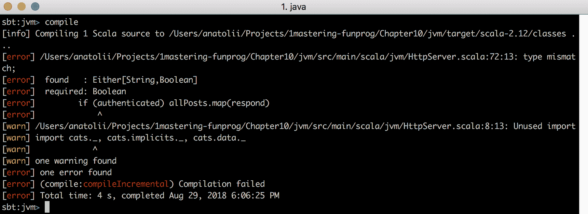

如您所见，编译器指出我们在期望`Boolean`的位置使用了`Either`。因此，上面代码片段中的`authenticated`变量是`Either`而不是`Boolean`。然而，为什么我们会在 Monadic 流中处理`Either`？难道 Monadic 流的目的不是抽象效果类型，以便我们能够直接处理计算值，而不必担心效果类型吗？

实际上，我们可以用`flatMap`重写前面的示例，以提高可读性：

```java
authenticate(request.token).flatMap { authenticated =>
  if (authenticated) allPosts.map(respond)
  else Future { Left("You are not authorized to perform this action") }
}
```

现在我们来检查所有涉及值的签名和类型。首先，让我们检查我们正在调用`flatMap`的类型，`Future[Either[/*...*/]]`。之后，我们就像处理从云认证服务检索的用户对象一样处理结果。然而，让我们再次看看`Future`定义的`flatMap`的签名：

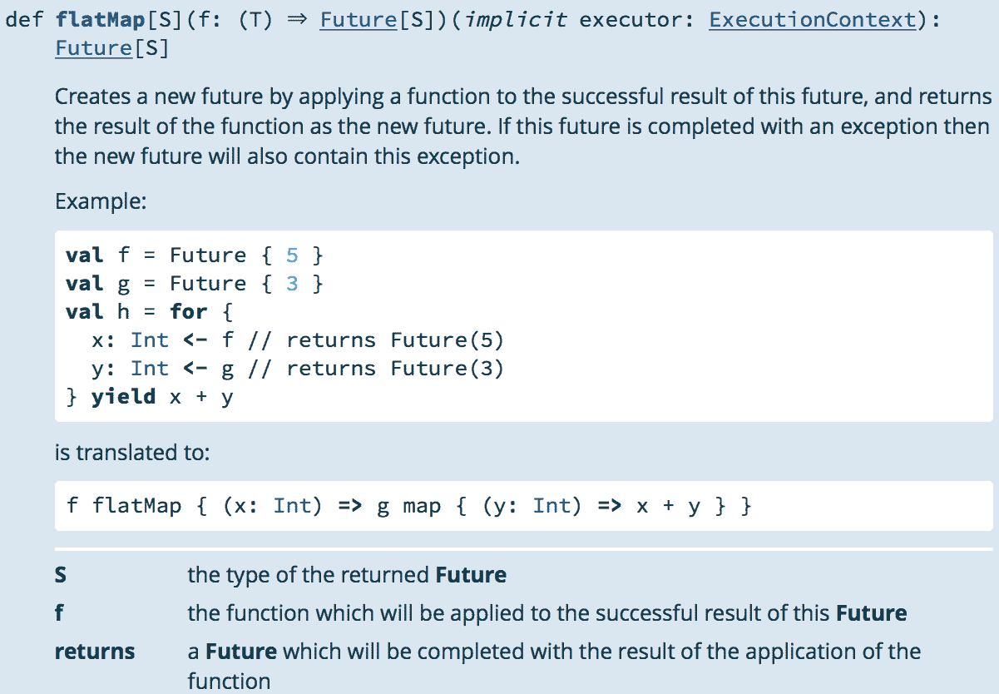

因此，该函数已经有一个熟悉的签名：`A => Future[B]`。那么`A`是什么？它是`Future`的类型参数。我们特定的`Future`的类型参数是什么？这个类型参数是`Either[String, User]`。

这意味着`flatMap`并没有给我们用户对象，而是`Either`。利用这个信息，我们可以修改示例：

```java
def handle(request: Request): Future[Either[String, Response]] =
  authenticate(request.token).flatMap {
    case Right(authenticated) if authenticated =>
      allPosts.map { eitherPosts =>
        eitherPosts.map(respond)
      }

    case Right(authenticated) if !authenticated =>
      Future { Left("You are not authorized to perform this action") }

    case Left(error) => Future(Left(error))
  }
```

在这里，我们手动从`Either`中提取结果值。立即，我们可以说有些地方非常不对，需要修正。这种感觉不对是因为我们之前讨论过，拥有 Monadic 流和`flatMap`函数的目的是抽象效果类型。然而，在这里，我们需要明确地处理它们。

# Monadic Transformers

这里的问题是 `flatMap` 函数是在 Future 上定义的。它对 Future 的类型参数一无所知。它可以是你能想象到的任何东西。实现没有对类型参数施加任何约束。这也意味着它对这个类型签名及其属性一无所知。因此，对于 Future 的 `flatMap` 函数的默认实现，无论是作为 Monad 还是 Future，都没有意识到 Future 的类型参数可能是另一个效果类型。所以，当我们以前面讨论的方式堆叠我们的效果类型时，只有最顶层的效应类型在调用 `flatMap` 函数时会被抽象化。

这种行为是不自然的。我们没有得到我们期望的结果。我们期望得到什么？我们期望不仅副作用会被展开，而且其内部副作用也会被展开。

当我们遇到嵌套的效果类型，并且期望它们被视为一个效果时，我们需要使用 Monad Transformers。

Monad Transformers 实际上是一种模式，可以用来定义已存在效果类型的可堆叠版本。例如，让我们看看在 `cats` 库中如何为 `Either` 类型定义这样的 Monad Transformer：

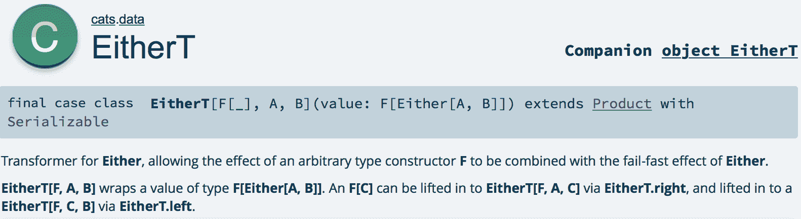

让我们看看这个 Monad Transformer 的签名，以了解它是什么。首先，注意这个案例类的类型参数。与普通 `Either` 的两个类型参数不同，我们这里有三个类型参数。第一个参数是一个 `F[_]` 效果类型，最后两个参数是普通的左右类型。这个效果类型正是赋予这个 Monad Transformer 可堆叠性的原因。因此，我们可以通过将这些效果类型泵入类型变量来与其他效果类型堆叠。注意 `EitherT` 构造函数的参数。该参数具有 `F[Either[A, B]]` 类型。

让我们设想在前面的例子中，变量效果类型是 `Future`。那么，`EitherT` 的值将是 `Future[Either[A, B]]`。这正是我们在前面的例子中尝试堆叠这两种效果类型时所拥有的签名。

因此，这个模式本质上是在效果类型的朴素堆叠之上构建的。然而，这里我们定义了一个专门用于堆叠的案例类。它是如何工作的，以及它是如何允许我们组合效果类型的？

首先，让我们看看这个数据类型是如何定义 `flatMap` 函数的：

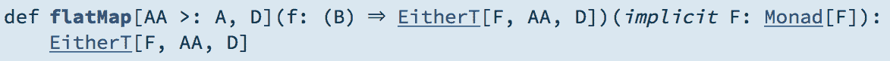

正如我们在前面的截图中所看到的，这个方法接受一个作为参数的延续函数，这是我们已知的内容。然而，请注意延续函数的第一个参数。在这里它是`B`。`B`是`Either`的`Right`值的类型。`Either`被包裹在`F`类型下。所以，如果我们打算使用`EitherT`而不是`Future`和`Either`的简单组合，我们最终会得到一个`flatMap`函数，它正好是我们所寻找的。

然而，请注意，这个函数隐式地依赖于一个用于副作用类型的 Monad。这意味着为了从`EitherT`中提取结果，我们需要知道如何从你与之组合的效果类型中提取结果：

```java
def flatMapAA >: A, D(implicit F: Monad[F]): EitherT[F, AA, D] =
  EitherT(F.flatMap(value) {
    case l @ Left(_) => F.pure(l.rightCast)
    case Right(b) => f(b).value
  })

```

因此，武装自己使用`EitherT`，让我们重写之前的例子：

```java
def handle(request: Request): EitherT[Future, String, Response] =
  for {
    authenticated <- authenticate(request.token)
      .ensure("You are not authorized to perform this action")(identity)
    posts <- allPosts()
    response = respond(posts)
  } yield response
```

如你所见，我们现在所有的计算都是基于组合效果类型定义的。此外，我们能够保持我们的 Monadic 流程不变，这意味着我们不需要担心手动提取副作用计算的结果。

如果你查看`EitherT`的文档，你会看到它还为你提供了一组其他便利方法，你可以在嵌套效果类型的设置中使用这些方法。

# 模式泛化

显然，我们之前讨论的模式并不特定于`EitherT`。这是我们处理效果类型时经常会遇到的事情。这不仅仅关于`Future`和`Either`，而是关于组合两个独立类型。

由于这个任务从效果类型到效果类型都是重复的，它被泛化为一个模式。这个模式是这样的。首先，你选择一个你希望可以与其他任意效果类型组合的效果类型。然后，你定义这个类型的替代组合版本。这样，对于`Either`，我们已经定义了一个可组合的版本，即`EitherT`。

之后，你需要定义给定效果类型的所有必要的类型类，这可以根据你需要使其工作的任何内容进行选择，包括你打算与该效果类型组合的效果类型的类型类。

如果你查看 cats 库的数据包，你会发现它有其他一些以字母`T`结尾的效果。这些是针对相应效果类型的 Monad Transformers 的实现。

在你的工具箱中拥有 Monad Transformers 的重要性在于，现在你能够像使用乐高积木一样从现有的效果类型构建效果类型。这大大增加了你的灵活性；现在你不需要定义专门的效果类型来表达你想要捕获的副作用。如果这些副作用可以表示为几个其他副作用的组合，你可以使用 Transformers 创建组合效果类型并在你的应用程序中使用它。

我们观察了两种效果类型的组合。但，你不仅限于两种效果类型的组合。实际上，这种模式足以将任何数量的效果类型组合成一个。例如，这样的组合可能看起来是这样的：

```java
type Config
type Ef[A] = ReaderT[EitherT[Future, String, ?], Config, A]
```

由于 `ReaderT` 期望其第一个参数是一个效果类型 `F[_]`，我们通过问号——`EitherT[Future, String, ?]`——手动在 `EitherT` 中创建一个**空位**。这种语法不是 Scala 的标准语法，而是来自在项目的 `build.sbt` 中导入的 Kind Projector 插件：

```java
addCompilerPlugin("org.spire-math" %% "kind-projector" % "0.9.4")
```

类型签名中的 `?` 在类型签名中创建了一个未绑定的类型变量，它可以用来给类型赋予 `F[_]` 的形状。

`ReaderT[EitherT[Future, String, ?], Config, A]` 是一种 Transformer 表达方式，用于表示以下类型：

```java
Config => Future[Either[String, A]]
```

因此，当我们谈论 Monad Transformers 模式时，首先和最重要的是我们在谈论灵活性。然而，这并不是唯一可以提供额外灵活性的模式，当你在纯函数式方式编写程序时。接下来，我们将看看无标签最终。

# 无标签最终

无标签最终（Tagless Final）是高级函数式编程中的一种流行模式，可以用来抽象那些你事先不知道且无法预测的能力和副作用。通常，了解其工作原理和为什么有用的最佳方式是查看一些示例。

# 基于能力编程

想象你正在编写一个需要在多个环境中执行的应用程序。在现实世界中，这样的场景很常见。一个很好的例子是移动应用程序。你可以拥有多个移动平台。然而，你希望将你的应用程序发布到所有这些平台上。现有的平台之间差异很大。通常，为每个平台单独重新实现你的应用程序是非常繁琐的。因此，你希望编写一次应用程序，并使其能够在当前所有存在的平台上运行。

另一个例子是编写应针对广泛配置工作的服务器端软件。例如，相同的服务器端软件针对不同的数据库执行。关系型数据库不同，适用于一个数据库的过程可能不适用于另一个数据库。

在所有上述场景中，你希望应用程序的业务逻辑不受你运行代码的系统特性的影响。在面向对象编程中，处理此类问题的标准方法是通过应用外观（Facade）模式。你声明一个接口，列出所有你需要从应用程序应该运行的底层系统中获取的能力。之后，对于每个特定的系统，你将为该接口提供一个实现。

从这次讨论中需要注意的关键点是能力。你的应用程序依赖于某些能力。它是根据指定这些能力的接口公开的方法构建的。这个想法也在无标记最终模式中得到了重申。

为了使模式更容易理解，让我们来一个简单的应用程序示例，这个应用程序依赖于某些能力。第一个将是从系统的数据存储中读取资源。资源是一个广泛的概念，可能包括一个文件系统上的文件，在其他环境中通过网络访问数据，或者访问存储在数据库和其他环境中的数据。另一个能力将是通知能力，这意味着应用程序能够通知最终用户它正在使用从存储中检索到的数据进行的工作。

给定这两个能力，我们可以编写一系列处理应用程序。一旦我们抽象掉了读取和通知的效果，我们就可以根据这些效果构建一个处理应用程序。

我们应该如何以函数式的方式定义这样的能力？什么最有意义？之前，我们讨论了类型类的想法。我们还注意到，类型类非常类似于工具箱，这意味着它为你提供了一组你可以用于特定目的的工具。这种类比非常适合我们存储能力的案例。在某种程度上，能力也是工具，工具可以组合成工具箱。因此，我们可以定义一个类型类，其中包含我们需要的所有能力，如下所示：

```java
trait Capabilities[F[_]] {
  def resourceA: F[A]
  def notify(target: String, text: String): F[Unit]
}
```

注意，我们为`f`效果类型定义了类型类。由于我们正在函数式范式下工作，而且能力很可能会产生副作用，我们将通过一些我们可能事先不知道的效果类型来描述这些副作用。

接下来，我们可以用类型类提供的这些能力来定义一个应用程序。想象一下，我们将借助我们的能力来检索的资源是一些在线购物销售的报告：

```java
Name,Price
Bread,2
Butter,4
Cabbage,3
Water,2
```

考虑到这份文档每天都会更新，我们应用程序的目标是计算一天内业务所赚取的金额，并通知所有者关于收入的情况。我们可以这样实现：

```java
def income[F[_]](implicit M: Monad[F], C: Capabilities[F]): F[Unit] =
  for {
    contents <- C.resource("sales.csv")
    total = contents
      .split("\n").toList.tail // Collection of lines, drop the CSV header
      .map { _.split(",").toList match // List[Double] - prices of each
       of the entries
        { case name :: price :: Nil => price.toDouble }
      }
      .sum
    _ <- C.notify("admin@shop.com", s"Total income made today: $total")
  } yield ()
```

注意，前面的方法是如何根据`F`效果类型及其子类来定义的。注意，我们事先并不知道我们将使用哪种效果类型。然而，我们知道这个效果类型必须具备哪些能力——就是我们之前定义的能力，但我们还需要一个 Monad。这是因为我们需要按顺序组合我们在自定义类型类中定义的能力。然后，我们根据我们的能力来定义我们的应用程序。

在这里需要注意的一个重要事项是，我们的能力是如何在与其他类型类相同的语言中定义的。这意味着，潜在地，我们拥有`cats`库或任何其他函数式编程库的全部功能。

这就是无标签最终模式与门面模式不同的地方。在门面模式中，你有接口，这些接口隐藏了平台特定的复杂功能，这些功能你并不关心。然而，这就是全部。每次我们调用这样的能力时，我们都会得到你请求的结果，没有其他。

在无标签最终模式中，每次调用能力方法时，你都会在效果类型下得到一个结果。效果类型是一种具有某些属性的数据结构。你可能无法控制能力返回的确切结果，因为它具有系统特定性。然而，你控制着返回此结果的数据结构。所涉及的数据结构由类型参数指定。不同的数据结构具有不同的能力。在其他函数中，当我们指定我们隐式需要 Monad 时，我们陈述了关于我们将要工作的结构的一些内容。我们可以声明我们的效果类型应该是顺序可组合的。同样，通过指定对其他 cats 类型类的隐式依赖，我们可以声明我们对数据结构的其他要求。

这种对我们正在工作的数据结构的控制使我们能够控制我们的计算如何组合。因此，在门面模式中，只有平台特定的能力本身被抽象化，仅此而已。然而，在无标签最终模式中，不仅计算被抽象化，而且我们在`f`效果类型下组合程序的方式也被抽象化。

现在，一旦我们有了抽象程序的组合，一个合理的问题就是我们如何实际上在不同的环境中运行它？

# 实现方式

为了在给定的环境中运行此应用程序，我们需要指定我们将要工作的效果类型。除了目标效果类型之外，我们还需要找到我们函数所需的全部隐式依赖的实现。无标签最终模式的美丽之处在于，只要我们能提供此环境以及我们选择的效果类型的隐式依赖实现，我们就可以在任意环境中运行该函数。

第一步是指定效果类型。一个好的选择是 Future，因为它是一种并发原语，能够表示广泛的计算。因此，当效果类型设置为 Future 时，我们的方法调用将如下所示：

```java
import scala.concurrent.{ Future, Await }
import scala.concurrent.ExecutionContext.Implicits.global
import scala.concurrent.duration.Duration

import cats._, cats.implicits._

/*...*/
Await.result(income[Future], Duration.Inf) // Block so that the application does not exit prematurely
```

然而，前面的代码将无法编译，因为我们还没有为 Future 实现`Capabilities`类型类。

现在我们讨论我们需要的能力时，我们需要问自己我们正在哪个环境中工作。记住，能力抽象了不同环境之间的不同操作。首先，让我们想象我们正在一个普通的桌面环境和一个命令行应用程序场景中工作。在这种情况下，我们的检索资源能力将仅仅是读取一个标准目录中给定名称的文件。我们的通知能力将输出打印到命令行：

```java
implicit val capabilities: Capabilities[Future] = new Capabilities[Future] {
  import java.io.File
  import org.apache.commons.io.FileUtils

  def resource(name: String): Future[String] =
    Future { FileUtils.readFileToString(new File(name)) }

  def notify(target: String, text: String): Future[Unit] =
    Future { println(s"Notifying $target: $text") }
}
```

我们使用 Apache Commons IO 库方便地读取文件，我们在并发原语 future 下做所有的事情，因为这是我们应用程序的要求。注意，所有关于通知和读取文件的技术细节都集中在那个类型类中，以至于我们只能在类型类的范围内导入`File`和`FileUtils`类，而不能在整个文件的范围内导入。

一旦我们将前面的应用程序运行在给定的文件上，我们将收到以下输出：

```java
Notifying admin@shop.com: Total income made today: 11.0
```

如果我们现在需要在一个使用数据库存储数据的环境中运行应用程序怎么办？如果通知是通过电子邮件而不是通过命令行完成的怎么办？没问题，我们仍然可以使用同一个应用程序。然而，我们将需要为此环境提供一个自定义的能力实现：

```java
implicit val anotherEnvironmentCapabilities: Capabilities[Future] = new Capabilities[Future] {
  def resource(name: String): Future[String] = ???
  def notify(target: String, text: String): Future[Unit] = ???
}
```

在前面的代码中，我们通过桩（stubs）实现了类型类，因为实现数据库查询逻辑和电子邮件通知逻辑可能相当繁琐。然而，我们的应用程序现在可以编译了。所以，如果你替换前面类型类中的数据库查询和电子邮件分发的实现，你也将能够成功运行应用程序。由于这个实现超出了本书的范围，并且不会对 Tagless Final 模式的讨论带来任何价值，所以我们不会在这里提供实现。

以类似的方式，我们能够为几乎任何你可以想象的平台提供实现。

你也可以用外观模式（Facade pattern）做得很好。那么，Tagless Final 模式比外观模式更强大在哪里？为什么你会选择它而不是面向对象模式？讨论 Tagless Final 模式的力量时的关键细节是注意到我们的应用程序不仅依赖于能力类型类，还依赖于 Monad 类型类。那么，这如何比外观模式带来更多的力量？让我们看看。

# 执行语义抽象

能力类型类与`Monad`类型类处于同等地位。`Monad`类型类定义了您如何顺序组合计算。有句话说，单子是函数式编程的分号。人们为什么会这么说？分号在面向对象编程中扮演什么角色？在常规的命令式编程中，分号是一个分隔一个语句与另一个语句的符号。分号的意义是，一个语句应该在另一个语句之后执行。在某种意义上，您可以将分号视为两个计算顺序组合的运算符。

`flatMap`函数在函数式编程世界中正是为此目的而设计的。`flatMap`定义了如何顺序组合两个计算。因此，这使得它成为函数式编程中的分号。此外，在本书的早期，我们探讨了单子流模式。我们知道单子流在底层依赖于`flatMap`来表示顺序组合的函数式代码。这种方式与命令式分号非常相似。

这对于我们讨论无标签最终模式的优点有何重要意义？关键在于，依赖于外观（Facade）的应用通常不会依赖于任何类似于单子（Monad）的东西。

这意味着您可以在不同的环境中用不同的外观（Facade）替换您的应用程序。然而，您永远无法改变您语句顺序执行的语义。

让我们通过一个例子来看看它是如何工作的。假设我们需要在执行前面的应用程序时进行日志记录。我们该如何实现这一点？我们可以提供一个自定义的`Monad`实现，其中包含其`flatMap`函数，顺序组合运算符被重载以记录我们所需的所有内容：

```java
implicit val logMonad: Monad[Future] = new Monad[Future] {
  def flatMapA, B(f: (A) ⇒ Future[B]): Future[B] =
    fa.flatMap { x =>
      println(s"Trace of the Future's result: $x")
      f(x) }
```

您可以通过显式地将`income`方法指向要使用的类型类来运行应用程序：

```java
Await.result(incomeFuture, Duration.Inf) // Block so that the application does not exit prematurely
```

输出结果将如下所示：

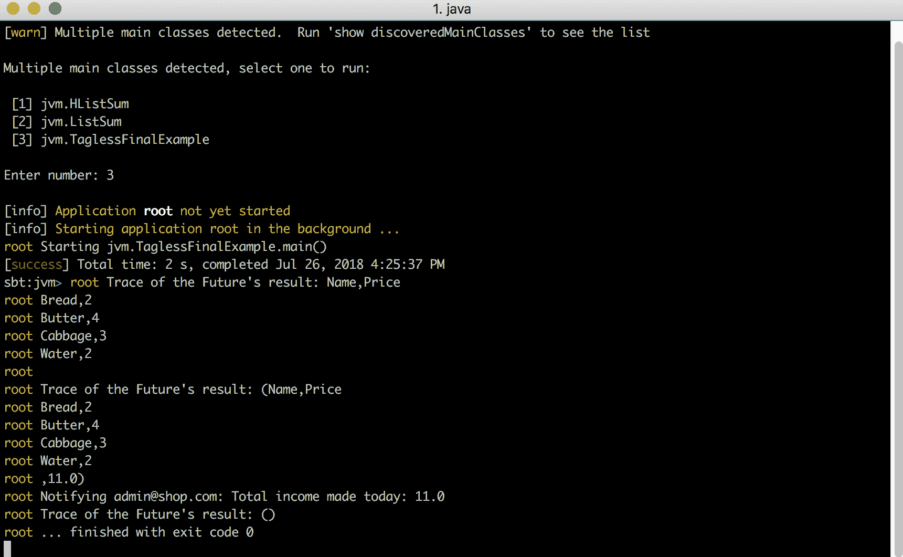

在这里，我们能够覆盖序列组合的语义。

在命令式世界中能否实现类似的效果？让我们看看前面的例子如何使用外观（Facade）模式实现：

```java
trait Capabilities {
  def resource(name: String): String
  def notify(target: String, text: String): Unit
}

def income(c: Capabilities): Unit = {
  val contents = c.resource("sales.csv")
  val total = contents
    .split("\n").toList.tail // Collection of lines, drop the CSV header
    .map { _.split(",").toList match // List[Double] - prices of each of the entries
      { case name :: price :: Nil => price.toDouble }
    }
    .sum
  c.notify("admin@shop.com", s"Total income made today: $total")
}
```

在前面的代码中，我们有一个接口，方法`income`依赖于执行计算的类型类。

我们无法覆盖序列组合，因为唯一的控制点在于接口。我们无法控制计算是如何执行以及如何相互组合的。

但为什么在函数式世界中可以做到这一点，而在命令式世界中却不行？是什么使得函数式方法如此特别，使我们能够进行这种组合语义的抽象？

# 计算作为值

当讨论副作用和抽象时，我们提到函数式编程追求纯净性。每当有计算带有副作用时，我们都会将这个计算具体化为某个值。在这里，这个值是`Future`。我们所有的计算都被具体化为 Future。并且我们可以使用为其定义的运算符来组合`Future`。

在命令式世界中，我们无法执行类似的计算组合，因为计算并没有被具体化为值。在命令式世界中，我们无法随意操作计算，因为那里计算并不是一个实体。我们无法引用计算，至少没有明显的方法。当然，在 Java 中，我们可以将计算放在 Runnable 接口下。然而，这将相当繁琐。在函数式世界中，Monads 在顺序组合中无处不在。所有东西都是通过`flatMap`来组合的。在 Java 中，将所有东西都包裹在 Runnable 中会引入过多的架构开销，所以这并不值得。

然而，有人可能会争论 Future 并不纯净。每当实例化 Future 时，我们都会给出一个启动计算的指令。是否存在一个更强的无标记最终模式版本，为我们提供更多的表达能力？

# Free Monad

Free Monad 模式是 Tagless Final 模式的更强版本。实际上，自由对象是来自抽象代数的一个结构。因此，这个名字来源于这个领域。

这个模式的适用范围相当有限，很可能在刚开始纯函数式编程时，我们不会遇到任何对这种模式的真实需求。所以在这里我们不会深入探讨 Free Monad。然而，我们将一般性地描述它是如何工作的。

基本上，Free Monad 背后的想法是，所有的计算都变成了一个值。这个想法是，每当定义我们的应用程序时，它实际上并没有执行自己，而是构建了一个描述我们可以稍后运行的抽象语法树。然后执行它就是我们的责任。

这个模式相当重量级，所以前面的例子只是概述了它。另一个需要注意的事情是，无论何时我们需要应用 Free Monad 模式，我们仍然可以利用 Tagless Final 模式。在这里，我们看到了定义一个自定义的 Monad 实现如何有助于注入自定义功能，例如日志记录。同样的想法可以用来构建我们的应用程序的树。通常，顺序组合的意义是依次运行一个语句。很容易想象一个顺序组合的实现，其中语句不是依次执行，而是被具体化为树节点，并注入到一个代表应用程序的树中。记住，`flatMap`完全控制着如何继续计算。所以想象一个`flatMap`函数不运行语句而是使用它们来构建一个树是完全正常的。

我们为什么想要使用 Free Monad 模式呢？这里的想法是能够对多个解释器运行计算。一个具体的例子来自用于处理 SQL 的`doobie`库。在 Doobie 中，一个 SQL 语句可以写成以下形式：

```java
sql"""select * from customers where id = $id""")
```

在这里，我们使用字符串插值，这是 Scala 的一个特性，允许我们在编译时从字符串生成对象。

执行这个语句之后，我们将对该对象进行几次调用，以指定我们想要对 SQL 语句执行的操作，例如我们是否想要查询或更新数据库。例如，如果我们想要查询数据库，我们可以做以下操作：

```java
sql"""select * from customers where id = $id""")
  .query[User].unique.transact(tr)
```

当从编程语言处理 SQL 时，一个常见的任务是尽可能提供安全性，在调用数据库时。例如，我们可能想要回答我们的查询是否形成正确的问题。我们可能想要有一个完整的测试套件，其中包含我们正在使用的所有查询，并测试它们以检查它们是否形成正确，以及它们的返回类型是否是我们预期的。

内部，Doobie 使用自由对象来表示其 SQL 查询，这意味着它们只是指定对数据库执行的计算的数据结构。由于它只是计算的描述而不是计算本身，我们可以运行它或对它做任何其他事情。我们可能想要做的事情之一是检查它是否满足某些规则。这是在 Doobie 中完成的。在这里，我们可以运行我们的查询，要么是对查询数据库的解释器，要么是检查它们的正确性。

所以基本上，在这种情况下，当我们有一个可能想要在不同的解释器上运行的计算，或者我们可能想要传递并修改其他计算时，我们可能想要使用 Free Monad。

应该提醒一点，这个模式相当重量级，如果没有充分的理由，就不应该使用它，否则在架构方面的开销将会相当高。

说到应用程序的安全性，如果你尽可能在编译时执行尽可能多的计算，你就可以达到很高的安全性和稳定性。编程到类型类的基本原则是拥有一个强大的编译器，它具有强大的类型系统，能够为你注入适当的类型类。这样的强大编译器能否被用来执行不仅仅是注入能力和类型类到你的计算中呢？让我们在下一节进入类型级编程的世界。

# 类型级编程

编译器的任务是把你编写的程序从一套指令翻译成另一套指令。在高级语言中，你将易于阅读和编写的高级指令翻译成易于机器执行的低级指令。

由于编译器需要将一套符号转换成另一套符号，它构建了你正在编写的程序的一些内部模型。从某种意义上说，我们可以认为编译器理解了程序，这里的“理解”有特定的定义。

如果编译器以某种方式构建内部模型或理解你的程序，我们也可以利用编译器的力量来让编译器检查程序的正确性。我们可以让编译器强制执行某些风格或保证，你的程序必须遵守。我们已经看到了`annotation.tailrec`的例子。注解的目的是指示编译器检查注解函数并确保它具有某些保证。具体来说，编译器检查函数是否是尾递归的。

为了确保程序的正确性，我们可能会使用强类型语言，并在类型中编码程序的保证和语义。类型是编译器所知的，因此它可以对这些类型执行某些检查。例如，它可以确保你向函数提供了正确的类型参数，因为它知道函数的输入类型。因此，在强类型语言中，你不再可能犯向函数传递错误类型参数的错误。

强大的编译器检查程序中的错误的优势在于你能够在编译时捕获更多的错误。一般来说，在编译时捕获的错误更容易调试和修复。如果在运行时发生错误，这意味着它没有立即被发现。你可能会将应用程序发布给最终用户，对于特别棘手的错误，可能需要数月甚至数年才能被发现。一旦被发现，你需要自己调查整个代码库中的错误行为，并尝试重现它，以便修复它。

编译时错误立即显现。当你编译代码时，你会确切地看到你出错的地方。因此，确保编译器尽可能多地捕获错误是一个明显的优势。

我们能否进一步推动我们的编译器？让我们看看 Scala 中类型级编程的一个例子。它被称为类型级编程，因为我们旨在尽可能在类型中编码关于我们程序的各种保证。这样，这些保证在编译时进行检查。

# 异构列表的简单实现

考虑我们有以下列表：

```java
val list: List[Any] = List(0, 2.0, "3", Fraction(4, 2))
```

因此，在前面的列表中，我们有不同类型的元素，因此我们被迫将此列表声明为`List[Any]`。`Fraction`是为了我们的示例定义的，如下所示：

```java
case class Fraction(numerator: Int, denominator: Int)
```

注意，在前面的列表中，每个元素都可以表示为一个浮点数。它们有不同的类型，但可以在所有这些类型上定义某些共同的行为。由于元素之间非常相似，我们可能想要对它们执行一个共同的操作。例如，我们可能想要找到列表中所有数字的总和：

```java
val sum = list.map {
  case x: Int => x.toDouble
  case x: Double => x
  case x: String => x.toDouble
  case Fraction(n, d) => n / d.toDouble
}.sum
```

注意，我们无法立即求和所有元素，因为列表的类型是`List[Any]`。我们只能加起来由数字组成的列表。因此，我们将我们的列表映射为`List[Double]`。然后，我们在这个列表上调用相同的方法，这是由 Scala 集合框架定义的所有数值集合的标准方法。

在下面的截图中，我们可以看到程序的输出：

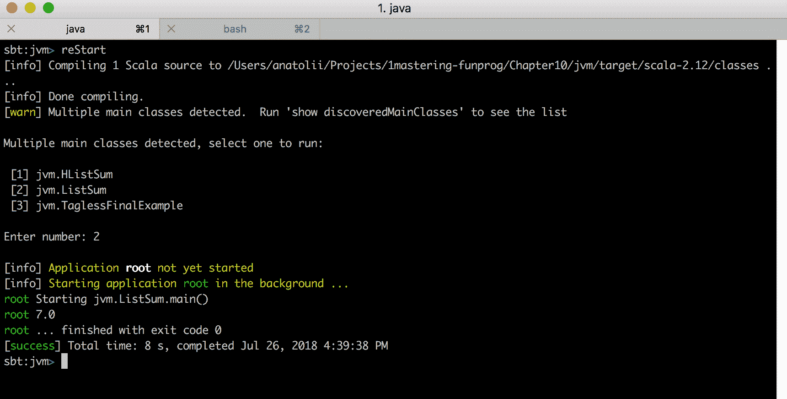

然而，请注意`map`方法的主体。`map`方法的主体实际上是一个部分函数。部分函数是一个不保证能够处理其定义在整个域上的整个函数。让我们看看`map`函数的签名，如下所示：

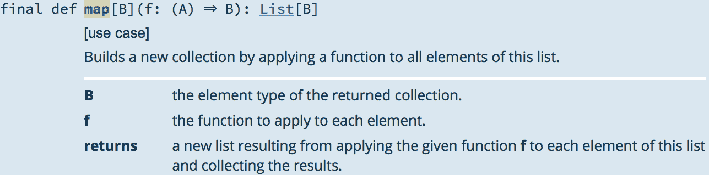

在前面的截图里，你可以看到它期望从列表元素的类型到某种其他类型`B`的函数。我们元素的类型是任何类型。然而，我们传递给函数的函数是一个部分函数，这意味着它只能处理 Scala 中所有可能对象的一个子集。

部分函数的问题在于它们是在运行时计算的。这意味着，如果你忘记在部分函数中指定某个子句，你将在运行时发现这一点，此时应用程序将抛出一个匹配错误，表示部分函数无法处理其输入。让我们模拟这种情况：

```java
val sum = list.map {
  case x: Int => x.toDouble
  case x: Double => x
  case x: String => x.toDouble
  // case Fraction(n, d) => n / d.toDouble
}.sum
```

我们已经注释掉了我们用于映射列表的部分函数中的一个`case`子句。如果我们运行这个应用程序会发生什么？请看以下内容：

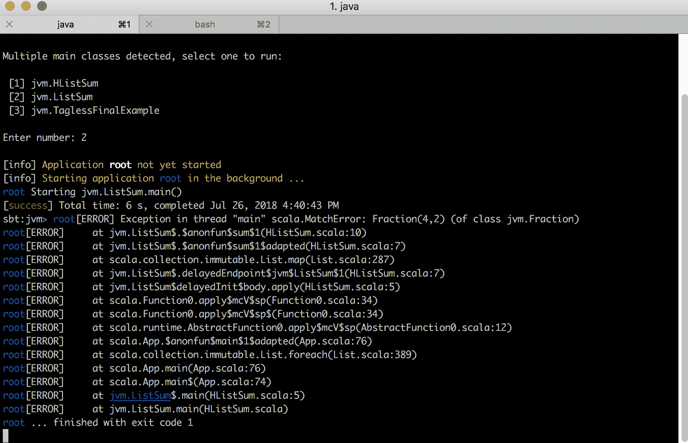

如你所见，抛出了一个异常。程序编译成功，然而，当我们尝试运行它时，我们遇到了异常。这意味着在运行时出了问题。有没有办法让编译器跟踪这些错误，并在编译时处理它们？

# 异构列表问题的类型级解决方案

解决这个问题的策略是将我们想要拥有的保证编码到类型中。我们将利用高度发展的隐式解析机制来强制执行对特定类型的保证。一般想法是，通过一个隐式值来表示保证。如果我们需要关于我们程序的一定保证，我们使我们的程序隐式依赖于代表这个保证的值。

但问题是，如果编译器找不到程序所依赖的任何隐式值，应用程序将无法编译。因此，通过使程序依赖于代表我们保证的隐式值，并确保这些值仅在保证得到满足的情况下存在于作用域中，我们可以确保编译器不会编译不满足这些保证的程序。

然而，首先，我们需要类型。前面的`List[Any]`解决方案对我们应用程序来说不好，因为编译器没有关于列表元素精确类型的信息。相反，我们可以定义一个称为异构列表的数据结构。这个新列表的代码如下：

```java
package jvm
/*...*/
sealed trait HList {
  def :::H: H ::: this.type = jvm.:::(h, this)
}
case class :::+H, +T <: HList extends HList {
  override def toString() = s"$head ::: $tail"
}
trait HNil extends HList
case object HNil extends HNil

```

在上面，`jvm`是这个书中 JVM 示例实现的包。

异构列表是一种递归数据结构。如果你看一下`:::`值，这个`case`类由头部和尾部组成。头部可以是任何你喜欢的，而尾部必须是另一个异构列表的实例。递归数据类型的终端情况是`HNil`。

这里是如何在您的应用程序中定义此类列表的方法：

```java
val hlist: String ::: Int ::: Fraction ::: HNil =
  "1" ::: 2 ::: Fraction(3, 4) ::: HNil
```

注意这个列表如何知道每个参数的类型。此外，注意在 Scala 中，我们可以利用中缀表示法，这允许我们使用类型名称作为运算符。看看以下类型：

```java
String ::: Int ::: Fraction ::: HNil
```

它等价于以下标准表示法：

```java
:::[String, :::[Int, :::[Fraction, HNil]]]
```

这是一种语法糖，用于简化所谓的代数数据类型。代数数据类型是以类型安全的方式由其他数据类型组成的类型。

接下来，我们如何定义一个将在异构列表上计算总和的应用程序？之前，在一个部分函数示例中，我们看到了另一个编译时安全性的问题。在这里，我们希望将某些保证纳入我们的代码。我们希望编译器检查这些保证。你希望施加哪些保证？首先，我们需要确保我们的列表可以被映射到一个所有元素都是双精度浮点数的列表。之前，我们使用只运行在运行时的部分函数来完成这个任务。在这里，我们同意使用隐式来指定关于我们应用程序的保证。因此，我们的求和方法可以这样：

```java
def sumSimpleL <: HList(implicit m: MapToDouble[L]): Double
```

`MapToDouble`是我们刚刚提出的一个类型类。类型类的任务是转换一个异构列表，使其所有元素都是双精度浮点数。请注意，我们向这个类型类传递一个类型参数。它是`L`类型，它扩展了异构列表。`L`扩展了异构列表，是一个代数数据类型，这意味着它是一个复合数据类型，由这个列表中所有元素的类型组成。这意味着在编译时，类型类将知道这个异构列表中所有元素的类型，这意味着我们可以定义类型类，使得如果列表的成员不能转换为双精度浮点数，我们就无法解析它。

这些是我们需要的所有保证吗？原则上，一旦我们有一个保证，并且有一种方法将我们的异构列表转换为双精度浮点数列表，递归遍历数据结构并求和所有值可能并不困难。所以，使用`MapToDouble`类型类的求和方法只能实现如下：

```java
def sumSimpleL <: HList(implicit m: MapToDouble[L]): Double = {
  val mapped: m.Result = m.map(hlist)
  def loop(l: HList): Double = l match {
    case :::(h: Double, t) => h + loop(t)
    case HNil => 0
  }
  loop(mapped)
}
```

注意，我们再次使用部分函数来抽象异构列表的递归数据结构中的值。一旦我们达到`HNil`，我们就终止我们的或问题。然而，我们之前已经论证过，部分函数是糟糕的，因为它们可能在运行时失败。因此，了解我们如何避免在这里使用部分函数是有教育意义的。

因此，让我们介绍一个新的类型类，它负责在异构列表上计算求和。我们可以这样做：

```java
def sumL <: HList, LR <: HList(implicit m: MapToDouble.Aux[L, LR], s: Sum[LR]): Double =
  s.sum(m.map(hlist))
```

因此，我们将我们的映射能力和求和能力外包给刚刚讨论过的类型类。然而，`MapToDouble`类型类末尾的`Aux`是什么意思？还有，那个新添加到求和函数类型中的`LR`类型参数是什么？

基本上，`LR`是这个列表通过`MapToDouble`映射的类型。所以，对于以下类型的列表：

```java
String ::: Int ::: Fraction ::: HNil
```

这个类型将是以下这样：

```java
Double ::: Double ::: Double ::: HNil
```

在前面的代码中，你可以看到辅助模式。它的全部要点在于我们不知道`LR`类型变量，而是依赖 Scala 编译器来计算它。编译器通过隐式解析`MapToDouble`类型类来计算`LR`类型。总体来说，Scala 编译器能够利用隐式机制来计算整个类型，并将结果存储在类型参数变量中，然后，我们可以在其他类型类的隐式解析中重用它。因此，我们使用这种由辅助机制计算出的类型来解析`Sum`类型类。

如果我们事先知道所有的元素都是双精度浮点数，为什么还需要计算`HList`类型呢？我们可能知道元素的类型，但仍然需要编译器的帮助来知道将多少个双精度浮点数堆叠到结果`HList`中。记住，`HList`存储了每个元素的类型，所以如果我们说所有的元素都是双精度浮点数，我们仍然需要知道列表的长度来构建它。在这里，编译器能够帮助我们完成这个任务。

那么，辅助模式究竟是如何工作的，编译器又是如何能够计算新类型的呢？为了回答这个问题，让我们继续到我们类型类的定义。让我们从`MapToDouble`类型类开始：

```java
trait MapToDouble[L <: HList] {
  type Result <: HList
  def map(l: L): Result
}
```

注意，类型类有两个成员。第一个是`Result`类型，它表示将给定的异构列表映射为所有成员都是双精度浮点数的结果类型。然后，我们有执行自身`map`操作的方法。注意，`MapToDouble`只有一个类型参数`L`。

`Result`类型是一个抽象类型，这意味着它取决于类型类的实现来定义它。我们很快就会看到如何利用这种能力来计算结果类型。

抓住问题的关键在于，从技术上讲，结果类型并没有反映在类型类的类型中。这意味着，每当我们需要这个类型类，对于某种`L`类型，我们都可以这样解决它：

```java
type L = String ::: Int ::: Fraction ::: HNil
val mapper: MapToDouble[L] = implicitly[MapToDouble[L]]
```

在前面的代码中，隐式方法定义如下：

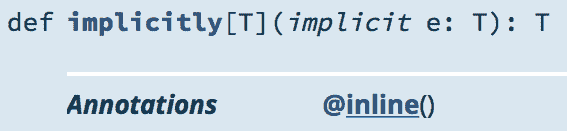

所以基本上，这个方法是一个用于解决特定类型隐式值的实用工具。

注意，当我们请求对这个类型类的隐式依赖时，我们没有指定结果类型，这意味着我们在解决它们的隐式依赖时不需要知道这个类型。现在，想象一下，如果你的类型类定义如下：

```java
trait MapToDoubleNoAux[L <: HList, Result <: HList] {
  def map(l: L): Result
}
```

现在，有了前面定义的类型类，我们不再能够不知道它将要计算的结果就解决它。实际上，我们除了以下方式外没有其他方法来引用这个类型类：

```java
type In = String ::: Int ::: Fraction ::: HNil
type Out = Double ::: Double ::: Double ::: HNil
val mapper: MapToDoubleNoAux[In, Out] = implicitly[MapToDoubleNoAux[In, Out]]
```

由于类型类有两个类型参数，我们必须提供这两个参数。我们可能知道第一个类型参数，因为它存在于我们的程序中，在我们的`HList`的类型中。我们的异构列表类型是由编译器在我们构造列表时为我们构建的。然而，将这个列表转换为双精度浮点数列表的结果目前对编译器来说并不清楚。我们必须提供它来解决隐式依赖。因此，我们被迫自己计算它。

有没有一种方法可以让编译器计算，类似于它在构造列表时计算列表类型的方式？为此，我们有辅助模式。

辅助模式如下所示：

```java
object MapToDouble {
  type Aux[L <: HList, LR <: HList] = MapToDouble[L] { type Result = LR }
  /*...*/
}
```

因此，这仅仅是我们类型类伴随对象中的一个类型定义。请注意，在这里我们正在使用结构化类型来定义我们的辅助类型。前面的程序表明，`Aux`类型的`MapToDouble`将包含一个类型成员`Result`，并将其设置为某个类型变量。

问题是，我们仍然能够在一个单一的`Aux`类型中捕获对我们有意义的两个类型变量，即输入和输出类型。然而，当我们尝试隐式解析类型类时，我们不再必须知道这两个类型。

因此，我们可以隐式地依赖于`Aux`类型，编译器在不知道第二个类型参数的情况下解析此类型：

```java
def sumL <: HList, LR <: HList(implicit m: MapToDouble.Aux[L, LR], s: Sum[LR]): Double
```

在这种情况下，解析将如下进行：

1.  编译器将推断第一个类型参数`L`。它将通过查看输入参数来推断它。所以，你不需要明确提供它。

1.  它将开始隐式解析。首先，我们需要`MapToDouble.Aux`。此类型扩展为`MapToDouble[L] { type Result = LR }`类型。

1.  编译器将解释为解析`MapToDouble`类型，其第一个类型参数必须是`L`。`Aux`类型的第二个类型参数是未知的，但这不是问题，因为我们之前讨论过，编译器不需要它来解析类型类。然而，这个第二个类型参数有一个名称，并且绑定到某个类型，这是我们将要解析的类型类的一个成员。因此，编译器将从`MapToDouble`的`Result`类型中推断这个第二个类型参数。

1.  在解析了这个类型类之后，我们现在有了`LR`类型参数。现在我们可以将其用作下一个隐式解析的输入——即`Sum[LR]`的解析。

前面的逻辑之所以有效，以及编译器不需要`MapToDouble.Aux`的第二个类型参数`LR`的原因如下。`MapToDouble`类型的类型不包括第二个类型参数`LR`，而`MapToDouble.Aux`是`MapToDouble`的一个别名。`L`是`MapToDouble`的类型参数，这是编译器解析类型类所需的所有信息。如果你这么想，在隐式解析某个东西或指定某个变量的类型时，你不需要明确指定这个变量的成员。由于第二个类型参数是待解析对象的成员，我们在解析类型时不需要知道它。

辅助模式用于捕获类型类中的结构化成员类型，并将其作为可以从方法签名隐式组中引用的类型参数。

所以基本上，这全部关于在调用时将我们不知道的类型作为类型类的结构成员，而不是这些类型类的类型参数。这样，我们将不知道并且需要计算的类型将不会是类型类签名中的成员。因此，我们可以在不知道其成员类型的情况下解决这些类型类。所以，我们可以在隐式解析时间上计算这些类型，利用代数数据类型原理。我们将在下面的代码片段中看到我们如何确切地使用隐式解析机制来计算这些类型。

这就是我们的函数如何应用于异构列表：

```java
val s = sum(hlist)
println(s"Sum of $hlist is $s")
```

运行程序后的输出如下：

```java
Sum of 1 ::: 2 ::: Fraction(3,4) ::: HNil is 3.75
```

接下来，让我们看看隐式机制是如何解决我们需要的所有依赖的。

# 隐式解析的递归性

让我们大致了解一下 `MapToDouble` 伴生对象的成员看起来是什么样子：

```java
object MapToDouble {
  type Aux[L <: HList, LR <: HList] = MapToDouble[L] { type Result = LR }
  def applyL <: HList = m

  implicit def hconsH, T <: HList, TR <: HList: Aux[H ::: T, Double ::: TR]

  implicit def hnil[H <: HNil]: MapToDouble.Aux[H, HNil]
}
```

所以正如你所看到的，我们有一个辅助类型，以及 `apply` 函数定义，这些是类型类模式中常见的。我们还有两个隐式成员，它们为 `hlist` 定义了 `MapToDouble` 类型类的实现。由于 `hlist` 有两种可能的实例，所以我们有两种可能的 `MapToDouble` 实现，分别是 `:::` 和 `HNil`。

注意这两个隐式值所具有的隐式依赖。首先，`hnil` 不依赖于任何东西。让我们看看它的主体：

```java
implicit def hnil[H <: HNil]: MapToDouble.Aux[H, HNil] = new MapToDouble[H] {

  type Result = HNil
  def map(h: H) = HNil
}
```

映射一个空异构列表的结果只是另一个空异构列表。这是因为我们没有可以映射的内容。

`hcons` 然而，有隐式依赖。正如你在前面的例子中看到的，它隐式地依赖于两个其他类型类：`ToDouble` 和 `MapToDouble`。正如你所看到的，`ToDouble` 是由 `H` 类型参数化的。`H` 类型是我们异构列表的头部类型。任何异构列表都是根据其头部类型和尾部类型定义的。

所有这些隐式依赖的含义是，如果我们能够将其头部转换为双精度浮点数，并且如果我们能够将其尾部映射为双精度浮点数列表，那么我们就能将任何非空异构列表转换为双精度浮点数列表。`ToDouble` 类型类的定义如下：

```java
trait ToDouble[T] {
  def toDouble(t: T): Double
}
```

关于这些隐式依赖的一个关键点是它们是递归的。`hcons` 本身是 `MapToDouble.Aux` 类型。但是，为了生成这个 `MapToDouble`，我们还需要对于所讨论的异构列表的尾部有 `MapToDouble`。

由于 Scala 编译器能够递归地解析隐式依赖，我们能够使一个类型的一个隐式依赖递归地依赖于同一类型的隐式依赖。在这里需要注意的，就像任何其他递归一样，是确保它能够终止。这意味着，在递归的每一步，我们必须在某种定义的意义上更接近递归的终止情况。在我们的情况下，递归的终止情况是`HNil`。并且，在每一步中，我们都会为比前一个列表少一个元素的异构列表解析`MapToDouble`类型类，因为我们只取尾部而不取头部。这保证了递归将终止。

现在，让我们看看`hcons`的实现：

```java
implicit def hconsH, T <: HList, TR <: HList: Aux[H ::: T, Double ::: TR] = new MapToDouble[H ::: T] {

  type Result = Double ::: TR
  def map(l: H ::: T): Double ::: TR =
    td.toDouble(l.head) ::: md.map(l.tail)
}
```

`map`函数的主体是用`ToDouble`类型类定义的，该类型类将头部转换为双精度浮点数，然后使用`MapToDouble`类型类将尾部转换为双精度浮点数。

以类似的方式，我们可以定义我们将要使用的`Sum`类型类，以便计算包含所有双精度浮点数的异构列表的总和：

```java
trait Sum[L] {
  def sum(l: L): Double
}

object Sum {
  def applyL <: HList = s

  implicit def hconsT <: HList: Sum[Double ::: T] =
    { (l: Double ::: T) => l.head + st.sum(l.tail) }

  implicit def hnil[H <: HNil]: Sum[H] =
    { (x: HNil) => 0 }
}
```

在伴随对象中，我们也有两种递归隐式解析的情况——一种是终止情况，另一种是非终止情况。终止情况是`hnil`，非终止情况是`hcons`。终止情况很简单，因为如果我们取一个空列表，它的总和总是`0`，因为在这个列表中没有元素。然而，如果我们有一个非空列表，我们计算其总和的能力取决于我们计算其尾部总和的能力。如果我们能够根据其隐式依赖通知计算其尾部的总和，我们就可以计算尾部的总和，并将头部的值加到它上面。

最后，我们还没有讨论的最后一块是`ToDouble`类型类的实现：

```java
trait ToDouble[T] {
  def toDouble(t: T): Double
}

object ToDouble {
  def applyT = t

  implicit def double: ToDouble[Double] = identity
  implicit def int : ToDouble[Int ] = _.toDouble
  implicit def string: ToDouble[String] = _.toDouble

  implicit def fraction: ToDouble[Fraction] =
    f => f.numerator / f.denominator.toDouble
}
```

如我们所见，`ToDouble`类型类为我们将要实际使用的每个类型都实现了。

使用类型类方法和类型级计算而不是简单地使用递归函数进行递归模式匹配的好处是什么？答案是编译时安全性。记得在本章开头，我们是如何论证在递归模式匹配的情况下，如果我们忘记对一个单个实例执行模式匹配，我们只有在运行时才会发现我们的错误吗？让我们看看在类型级计算的情况下，如果我们未能指定一个情况会发生什么。

类型级计算场景中模式匹配的等价物是`ToDouble`类型类的实现。如果你看一下它们，它们指定了如何精确地将每种类型转换。让我们看看如果我们注释掉我们需要的实现之一会发生什么：

```java
implicit def double: ToDouble[Double] = identity
implicit def int : ToDouble[Int ] = _.toDouble
implicit def string: ToDouble[String] = _.toDouble

// implicit def fraction: ToDouble[Fraction] =
// f => f.numerator / f.denominator.toDouble
```

现在，让我们看看当我们运行程序时会发生什么：

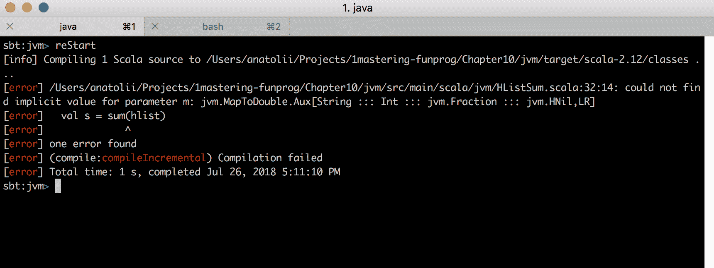

这次错误是一个编译时错误，因此应用程序甚至没有编译。然而，请注意错误信息相当晦涩难懂。接下来，我们将看看如何调试这类编译时信息。类型级计算在高级语言如 Scala 中引发了一种全新的编程风格，因此了解如何在当前环境中处理编译时错误是至关重要的。

# 调试类型级计算

目前，类型级计算代表了现代编程技术的最前沿。这项技术相当实验性，因此，它还没有太多关于全面错误信息和调试工具的支持。

因此，前面的错误信息可以通过利用代数数据类型逐步调试。这意味着你需要追踪递归的每一步，并确保每一步中的每个隐式类型都正确解决。在某个时刻，你会到达解决产生错误的地方，然后你可以看到哪个情况产生了错误。

这些检查可以使用 Scala 中的`implicitly`关键字来完成。使用`implicitly`函数进行调试的过程可能如下所示：

```java
implicitly[MapToDouble[String ::: Int ::: Fraction ::: HNil]]
implicitly[MapToDouble[Int ::: Fraction ::: HNil]]
implicitly[MapToDouble[Fraction ::: HNil]]
implicitly[ToDouble[Fraction]]
```

前面程序编译的输出将如下所示：

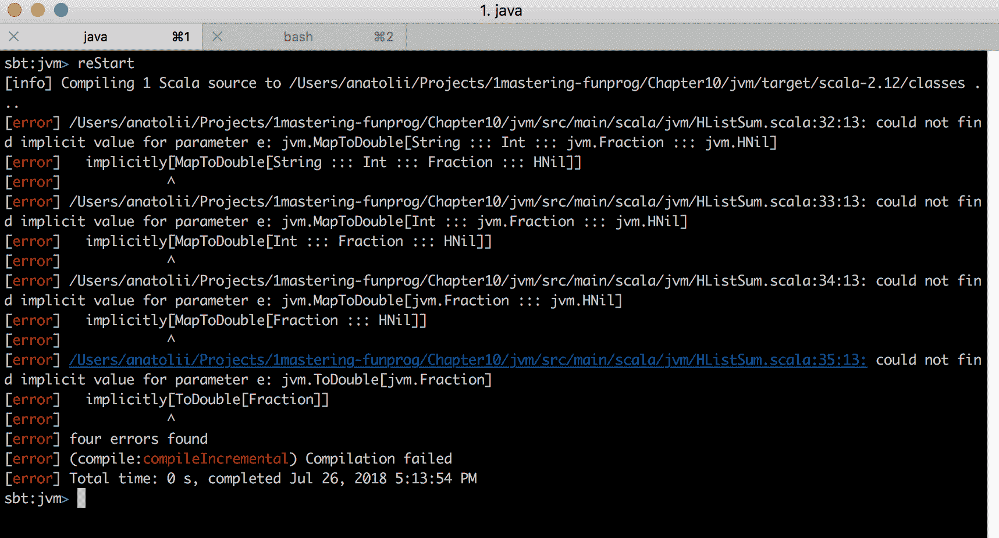

因此，错误是由于编译器无法找到分数的隐式`ToDouble`类型类。注意，随着每个语句的执行，我们通过减小我们的`HList`代数类型的大小逐渐缩小搜索空间。在每一步中，我们都在查看错误是否会显现。最后，我们到达了`implicitly[ToDouble[Fraction]]`，并意识到在作用域中没有这样的隐式类型类实现。请注意，所有前面的错误都发生在编译时。

类型级计算的现状可能不如你期望的那么好。然而，你应该记住这项技术仍然是实验性的。Scala 本身是一种语言，是实验新技术的游乐场。所以，主要的要点是这项新技术通过利用类型系统和隐式解析的力量，将运行时错误纳入编译时范围，从而在类型方面为你的程序指定某些保证。在未来，随着这些技术的更广泛采用，可以合理地预期这些技术将获得更好的工具支持。

# 类型级编程库

就像在 Scala 中，`cats`是一个纯函数式编程库一样，存在一些库可以简化 Scala 中的类型级编程。其中一个这样的库是`Shapeless`。实际上，`Shapeless`是和`cats`相同的生态系统的一部分。它提供了一系列类和类型，包括异构列表类型，这些类型有助于在类型级别上进行一些高级的纯函数式编程。

这种方法值得有一本自己的书，因此我们在这章中不会深入探讨。如果您想了解更多关于这种方法的信息，请查阅`Shapeless`的官方文档和学习资源。

# 摘要

在本章中，我们学习了高级函数式编程的模式。

首先，我们探讨了 Monad Transformers。这些用于构建复合效果类型。给定两个描述各自副作用的自独立效果类型，您可以将它们堆叠在一起以获得一个组合类型。

之后，我们探讨了无标签最终模式。主要好处是，当您有一个单一的业务逻辑实现可以针对不同的效果系统运行以获得不同的语义时，可以实现控制反转。

最后，我们学习了函数式编程中类型级别计算的模式。这些模式的主要好处是，它们允许您以类型的形式对程序进行编码，并在编译时检查这些保证。这种检查可以通过类型级别计算的机制实现，例如 Scala 的隐式转换解析，或者任何允许类型级别编程的类似机制。

到目前为止，我们讨论的纯函数式编程技术强大且具有前景，但在工业界尚未得到广泛应用。当前并发的实际标准是 actor 模型。在接下来的章节中，我们将探讨它。下一章，我们将从模型的介绍开始。

# 问题

1.  解释 Monad Transformers 的好处。

1.  解释无标签最终模式的好处。

1.  解释类型级别计算的好处。
