# Actor 模型简介

在上一章中，我们讨论了现代编程语言中高级函数式编程的模式和技术。然而，你可能已经注意到，我们总是处理顺序编程的情况。我们离真正的并行性最近的一次是在讨论 Applicative 类型类时。

在本章中，我们将更深入地探讨现代并行性的功能性解决方案。以下是我们将在本章中涉及的主题：

+   并行性解决方案概述

+   传统模型在监视器上的同步

+   作为传统模型的替代的 actor 模型

# 并行性解决方案概述

如果你记得，Applicative 类型类为我们提供了一个定义并行计算的抽象。它与`Monad`类相对立，后者是定义顺序计算的抽象。

在第八章的*类型类*部分，*基本类型类及其用法*中，我们推理出需要 Applicatives 来提供一个原始定义独立计算的机制。并行性也可以通过 Applicative 来建模。然而，正是这种独立性的理念是这个类型类背后的推动力。

并行性和并发性需要不同的方法。它们引发了在顺序编程中通常不会遇到的问题，并且这些问题有它们自己的技术，以便可以在面向对象编程中解决。然而，这些技术比常规的面向对象和命令式编程更容易出错，也更难以推理。因此，设计了一系列其他技术来简化并发软件的开发过程。

到目前为止，我们仍然不能说我们已经找到了并行和并发编程的理想方法。每当涉及到并发时，编程比单线程情况下的编程要困难得多，即使在使用最现代的技术和方法的情况下。现代系统往往是分布式的，对这类系统的可扩展性有很高的要求。这意味着在现代世界中，一个应用程序通常必须在多个机器上运行，这些机器可能位于世界的不同部分。此外，对这类系统的可扩展性也有要求。可扩展性意味着，无论何时添加额外的处理能力，例如将额外的机器添加到集群中，现有的程序都必须在这些新机器上无缝运行，而无需你编写额外的编程代码。基本上，可扩展性意味着软件必须在任何数量的机器上运行得和单台机器上一样好。

显然，在这种情况下，混乱是不可避免的。到目前为止，我们还没有一个单一的解决方案来解决分布式容错和高可用系统上下文中出现的问题。在 20 世纪，人们试图创造方法和数学理论来解决这一问题。在这里，我们主要谈论的是一类称为进程演算的数学理论。进程演算是精确针对使用数学逻辑和数学定律描述并发发生的进程的一组数学理论。进程演算的一些著名例子包括**通信进程代数**（**ACP**），它在 Scala 中有 SubScript 的实现（见[subscript-lang.org](http://subscript-lang.org/)），pi-演算，**通信系统演算**（**CCS**）。人们试图将这些理论付诸实践。然而，今天，我们无法说任何给定的理论都能深入且方便地解决现代程序员面临的整个问题范围。

此外，近年来，已经开发了一系列专门针对并发和并行应用程序开发的工程方法。其中一种方法就是响应式编程。这种方法主要基于以流、数据源和汇的形式构建你的应用程序。这种类型的在数据流密集型应用程序的上下文中非常有用，这意味着有大量数据不断从一个应用程序的部分移动到另一个部分。

这种响应式编程的一个实际应用是事件密集型应用程序。例如，许多移动应用程序依赖于事件传播和对事件的响应。这意味着描述这类应用程序的好策略是关于数据流和数据源进行推理，以及将数据作为应用程序的一等公民进行反应。通常，这类应用程序会用回调和事件响应来描述。然而，以流的形式进行推理为你提供了一套适当的抽象工具。在上一章中，我们看到了当我们频繁遇到错误和副作用时，将它们作为程序的一等公民并明确地推理它们，对于调试应用程序和减少错误发生的可能性非常有帮助。

在这里也是同样的情况——当我们有一个数据事件密集型的应用程序时，以流的形式进行推理可以非常有益。针对广泛的编程语言，已经实现了一系列这种方法的实现。

然而，以事件流和响应式编程的方式进行编程并不总是你所希望的。确实，某些事件和数据处理密集型的应用程序可以用数据流来描述是合理的。但这并不总是如此。

正如我们之前讨论的，已经开发出各种理论和方法来解决并行编程的困难。其中一些可以被视为更功能性的。例如，一些 Scala 函数式编程库，如`Cats`或`ScalaZ`，提供了一些原语以允许并发和并行编程。其中一些方法具有更面向对象的特点。例如，之前提到的一些进程演算往往具有相当多的面向对象精神，这意味着它们引入了一些与面向对象编程中的对象非常相似的原语。一些理论和方法位于函数式编程和面向对象编程的边缘，无法明确归类为任何这些方法的成员。例如，这可以是编程的响应式方法。尽管它在函数上投入很大，并使用 Lambda 演算来组合这些函数，但权衡通常是类型安全。

并发编程理论和方法的数量意味着这个主题非常具有推测性。通常情况下，对某个应用程序有效的技术和理论可能不会对另一个应用程序表现出同样的效果。因此，有必要指出本书对这个话题的立场。在这本书中，我们采取了一种实用主义的方法来处理函数式编程，这意味着本书的目的是为你提供一个工具集，以函数式的方式解决实际问题。到目前为止，最实用且最好的并行编程方法之一是演员模型。虽然从函数式编程的角度来看，它可能不是最优雅的模式，因为它仍然缺乏令人满意的类型安全，但它是一种高度可扩展且在实际中表现良好的方法。在本章中，我们将研究并行应用程序的演员方法，并了解如何使用基于演员的现代技术，借助演员模型来编写实际的并行和可扩展的应用程序。

然而，在我们深入讨论演员模型及其实际应用之前，有必要了解并行编程所面临的全部挑战，以及它们如何在传统的面向对象编程模型和传统方法中得到解决。因此，首先，让我们来看看传统的并行编程方法，即带有同步和监视器的多线程。

# 传统模型在监视器上的同步

并发场景发生在你有两个或更多操作并行执行时，这种并行性可以是真正的并行或模拟的并行。真正的并行是指你的应用程序在两个不同的 CPU 核心上并行执行，如下所示：

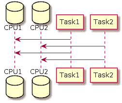

模拟并行性是指所有并行任务都在同一处理器核心上执行，但是处理器会不时地在任务之间切换。每个任务都由所谓的原子操作组成——最小的任务，直到完成不能被中断。处理器可以从一个任务中获取一定数量的原子操作，然后执行来自另一个任务的一定数量的原子任务：

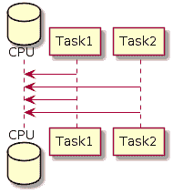

当你编写一个并行应用程序时，你经常会遇到需要任务之间相互通信的情况。这种情况可能发生的一种情况是，你的并发任务需要访问某种资源，这种资源可以是应用程序的外部或内部资源，它不是线程安全的。在这种情况下，他们需要协调对这种资源的访问。在这里，我们遇到了并行编程中的一个非常重要的概念，那就是线程安全。线程安全的资源可以从任何数量的线程并行访问，而不必担心是否会出现错误。然而，非线程安全的资源必须一次从一侧访问。一个典型的线程安全资源是不可变数据结构。一个典型的非线程安全资源是共享可变状态。

如果你从多个线程访问非线程安全的资源，可能会发生什么问题？考虑写入文件的例子。假设你正在为在线商店编写一个应用程序，该应用程序旨在以某种格式生成商品列表。假设你需要从 CSV 格式的文件中读取商品列表，然后以某种方式转换它们：

```java
Name,Price
TV Set,100
iPhone 8,300
Samsung Galaxy S5,300
MacBook Pro,2500
MacBook Air,1500
```

考虑你需要使用我们已学过的`Circe`库以 JSON 格式输出相同的商品：

```java
{"Name":"TV Set","Price":100}
{"Name":"iPhone 8","Price":300}
{"Name":"Samsung Galaxy S5","Price":300}
{"Name":"MacBook Pro","Price":2500}
{"Name":"MacBook Air","Price":1500}
```

还要考虑你想要并行执行此操作。你需要做的是将 CSV 文件的每一行转换为某种 JSON 输出。然后，我们需要将此输出写入输出文件。在这里，我们有一系列相互依赖的操作。每一行的转换都是独立于任何其他行的任何其他转换的。因此，我们可能想要从两个线程并行执行这些任务。因此，一个线程将处理列表的前半部分，而另一个线程将处理列表的后半部分。

将输出到文件的过程可以模拟为一种特定的交易，如下所示：

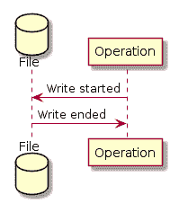

在前面的图中，你可以看到我们执行了打开文件以供写入的操作，然后执行某些原子操作将数据写入文件，最后关闭文件。为了简单起见，将字符串`Hello`写入文件的过程可能看起来不像以下这样：

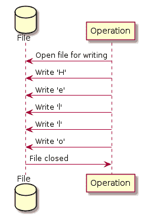

在前面的图中，我们可以看到整个事务不是原子的。它由原子操作组成，在我们的例子中是写入单个字符。这里应该注意的是，前面的例子只是一个例子。不同的写入逻辑实现可能会以不同的方式实现事务过程，因此前面的原子操作可能并不适用于所有环境。然而，前面的例子很好地说明了这一点，因为大多数实现仍然使用原子操作以非线程安全的方式将数据写入文件。整个写入事务不是原子的。

让我们考虑如果我们尝试从两个不同的线程向同一个文件写入会发生什么：

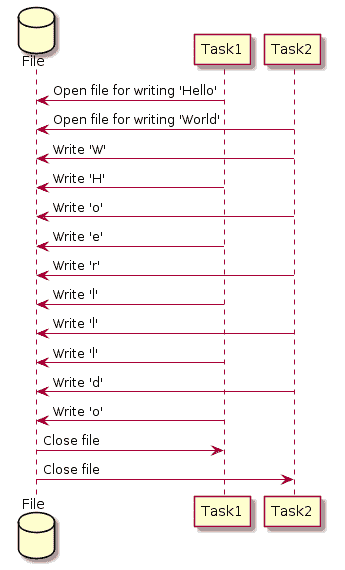

所以，正如你所看到的，我们没有关于每个事务的原子任务执行顺序的任何保证。因此，当前面的场景发生时，你最终会在文件中得到以下输出：

```java
WHoerllldo
```

这就是我们所说的操作或资源不是线程安全的含义。这意味着它只能由单个线程与源一起工作。使用相同资源从两个线程中工作可以按照以下方式实现：

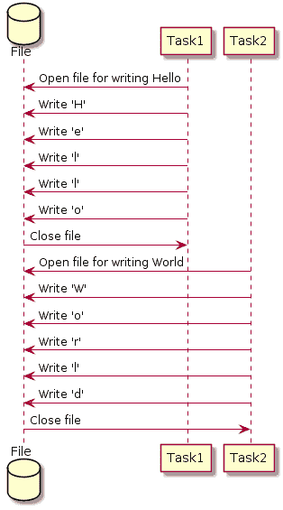

因此，很明显，前面的两个线程必须意识到彼此以及它们应该执行的顺序。更确切地说，我们应该以某种方式确保一次只有一个线程可以访问共享资源。换句话说，我们需要以某种方式同步线程。

# 同步

可以用来同步线程的最简单方法被称为同步。它在语言级别上实现，并且是大多数编程语言中的标准构造。

理念是这样的。你的某些编程代码块可以被设置为受保护的，这意味着除非满足某个条件，否则线程无法执行这些代码。这个条件就是所谓的监视器的所有权。因此，一个线程可以拥有某些监视器。在 JVM 环境中，监视器可以是任何对象。因此，在 JVM 级别上，我们可以声明一个线程拥有一个监视器。线程可以自行决定是否获取和释放监视器的所有权。另一个规则是，监视器一次只能被一个线程持有。当一个线程想要获取已被另一个线程持有的监视器时，那么这个线程必须等待直到监视器被释放并再次可用。

之前提到的框架可以用来同步线程之间的交互。你可以按照以下方式操作。每当有一个资源不是线程安全的，并且需要从多个线程中访问时，我们可以通过使用`synchronized`关键字来保护代码，即在 Java 或 Scala 的情况下。这可以按照以下方式实现：

```java
val target = new File("sample.txt")
 target.synchronized {
   FileUtils.writeStringToFile(target, "Hello World", "utf8")
}
```

上述代码是在某个线程的上下文中执行的。每个指令都是按顺序在线程中执行的。当线程遇到`synchronized`关键字时，它会尝试获取相关的对象作为监视器。如果这个对象被其他线程拥有，那么这个线程就会进入睡眠模式。这意味着它什么也不做，直到被通知监视器被释放并且可以由它获取。一旦监视器可用，它就会被这个线程获取。现在，这个线程有保证，在它自己持有之前，不会有其他线程获取相同的监视器。然后，这个线程在`synchronized`块中执行代码。

代码执行后，当前线程会释放监视器。执行语义如下：

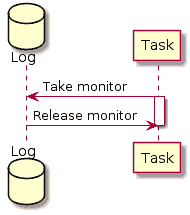

理论上，上述方法看起来不错。然而，在这种场景下可能会遇到一些严重的问题。这些问题非常难以调试，并且现代编译器无法检测到这些问题。这类问题的存在要求有一个更好的推理和定义并发及并行应用的框架。接下来，让我们看看这些问题是什么。

# 传统模型的难题——竞态条件和死锁

当涉及多个资源时，问题开始出现。例如，考虑对上述程序进行轻微修改的版本。在先前的例子中，我们必须将计算结果写入文件。考虑在执行计算的同时，我们还需要在日志文件中跟踪它们所做的工作。这种做法在现实世界的场景中对于调试目的可能是有用的。

因此，计划如下。首先，整个输入文件被读入程序内存。在我们的当前场景中，线程是异构的，这意味着它们有不同的任务要完成。同构线程通常更容易处理，因为它们的行为相似，并且从同一个地方控制。然而，在现实世界中并不总是这样。所以，让我们考虑具有以下任务的线程。第一个线程将负责将 CSV 转换为 JSON，就像先前的例子一样。此外，它必须将转换过程报告到日志文件中。另一个线程将执行不同的任务。让它计算有关文件的某些统计数据，例如，在线商店所交易的所有商品的平均价格。

让我们看看这样一个程序如何在传统的同步场景中实现。在深入这个例子之前，让我们定义一些在例子中会使用的方便方法和值。你需要以下导入：

```java
import scala.collection.JavaConverters._

import java.io.File
import java.nio.charset.Charset

import org.apache.commons.io.FileUtils
```

对于文件操作，我们将使用 Apache Commons IO 库。必须在`build.sbt`中声明对这个库的依赖：

```java
libraryDependencies += "commons-io" % "commons-io" % "2.6"
```

方便的方法如下：

```java
// Files we will be working with
   val input = new File("goods.csv" )
   val log = new File("log.txt" )
   val output = new File("goods.json")

// Encoding for the file I/O operations
   val encoding = "utf8"

// Convenience method to construct threads
   def makeThread(f: => Unit): Thread =
    new Thread(new Runnable {
      override def run(): Unit = f
    })

// Convenience method to write log
   def doLog(l: String): Unit = {
     FileUtils.write(
       log
     , l + "\n"
     , encoding
     , true // Append to the file rather than rewrite it
     )
     println(s"Log: $l") // Trace console output
   }

// Convenience method to read the input file
   def readInput(): List[(String, Int)] =
     FileUtils.readLines(input, encoding).asScala.toList.tail
```

```java
       .map(_.split(',').toList match {
         case name :: price :: Nil => (name, price.toInt)
       })
```

阶段设置完毕后，让我们继续到示例。首先，让我们看看负责将 CSV 转换为 JSON 的第一个线程。在这个线程中，你可能想要做的第一件事是打开我们将要工作的文件并将其读取到列表中：

```java
val csv2json: Thread = makeThread {
  val inputList: List[(String, Int)] =
    input.synchronized {
      val result = readInput()
/*...*/
```

由于文件不是线程安全的资源，我们首先需要做的事情是对文件进行监控。在读取此文件后，我们可能想要向日志报告操作已成功执行。因此，我们可能想要对日志文件进行监控并报告操作如下：

```java
log.synchronized {
  doLog(s"Read ${result.length} lines from input")
}
```

注意，在完成报告后，日志文件的监控会立即释放。所以，`inputListcode`看起来如下所示：

```java
val inputList: List[(String, Int)] =
  input.synchronized {
    val result = readInput()
    log.synchronized {
      doLog(s"Read ${result.length} lines from input")
    }
    result
  }
```

读取文件完成后，我们对输入文件的每一行执行转换操作，然后将结果写入输出文件：

```java
val json: List[String] =
  inputList.map { case (name, price) =>
    s"""{"Name": "$name", "Price": $price}""" }

FileUtils.writeLines(output, json.asJava)
```

因此，第一个线程的整个代码如下所示：

```java
val csv2json: Thread = makeThread {
  val inputList: List[(String, Int)] =
    input.synchronized {
      val result = readInput()
      log.synchronized {
        doLog(s"Read ${result.length} lines from input")
      }
      result
    }

  val json: List[String] =
    inputList.map { case (name, price) =>
      s"""{"Name": "$name", "Price": $price}""" }

  FileUtils.writeLines(output, json.asJava)
}
```

现在，让我们看看另一条线程。它的任务是计算我们输入文件中的某些统计数据。更确切地说，我们可以对商品的所有价格进行某种聚合函数的计算。例如，我们可能考虑计算集合的平均值、最大值和最小值。然而，我们也可能想要配置这条线程以计算我们想要的精确指标：

```java
def statistics(avg: Boolean = true, max: Boolean = false, min: Boolean = false): Thread
```

如你所见，我们能够指定需要计算的确切指标。一个合理的步骤是在做任何事情之前将此信息报告到日志文件中：

```java
log.synchronized {
  doLog(s"Computing the following stats: avg=$avg, max=$max, min=$min")
}
```

在这里我们首先做的事情是对日志文件进行监控并报告指标。接下来我们需要做的事情是实际上读取文件：

```java
val inputList: List[(String, Int)] = log.synchronized {
  doLog(s"Computing the following stats: avg=$avg, max=$max, min=$min")
  val res = input.synchronized { readInput() }
  doLog(s"Read the input file to compute statistics on it")
  res
}
```

由于我们还需要向日志报告文件已成功读取的事实，我们决定在文件成功读取后释放日志监控。注意，报告指标的片段是如何被整合到`inputList`代码中的，这样统计和“读取输入文件”报告都可以在同一个`synchronized`代码块下完成。

读取输入文件后，我们能够根据用户指定的参数在此输入文件上计算所需的指标如下：

```java
val prices: List[Int] = inputList.map(_._2)
def reportMetrics(name: String, value: => Double): Unit = {
  val result = value
  log.synchronized { doLog(s"$name: $result") }
}

if (avg) reportMetrics("Average Price", prices.sum /
  prices.length.toDouble)
if (max) reportMetrics("Maximal Price", prices.max)
if (min) reportMetrics("Minimal Price", prices.min)
```

因此，`statistics`线程的整个代码将如下所示：

```java
def statistics(avg: Boolean = true, max: Boolean = false, min: Boolean = false): Thread = makeThread {
  val inputList: List[(String, Int)] = log.synchronized {
    doLog(s"Computing the following stats: avg=$avg, max=$max, min=$min")
    val res = input.synchronized { readInput() }
    doLog(s"Read the input file to compute statistics on it")
    res
  }

  val prices: List[Int] = inputList.map(_._2)
  def reportMetrics(name: String, value: => Double): Unit = {
    val result = value
    log.synchronized { doLog(s"$name: $result") }
  }

  if (avg) reportMetrics("Average Price", prices.sum / prices.length.toDouble)
  if (max) reportMetrics("Maximal Price", prices.max)
  if (min) reportMetrics("Minimal Price", prices.min)
}
```

如果你与第一个线程并行运行此线程会发生什么？

```java
csv2json.start()
statistics(true, true, true).start()
```

你可能会注意到，有时程序会挂起并且变得无响应。这种情况被称为**死锁**。

基本上，这里的问题是两个线程正在争夺资源。这是一个关于哪个线程先获取哪个监控器的竞争条件。第一个线程获取输入文件的监控器，然后获取日志的监控器。然后，它释放锁的监控器，然后释放输入文件的监控器：

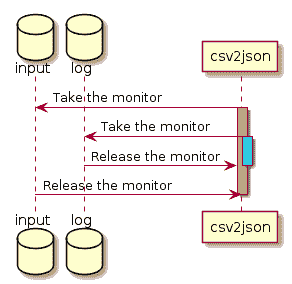

在前面的图中，橙色条表示在输入监视器下执行的代码。蓝色条表示在日志监视器下的代码。在这个特定案例中，蓝色代码也拥有输入监视器，因为它在执行期间尚未释放。

相比之下，第二个线程以不同的顺序执行这些操作。首先，它锁定日志文件。然后，它锁定输入文件，接着释放输入文件的锁，最后才释放日志文件的锁：

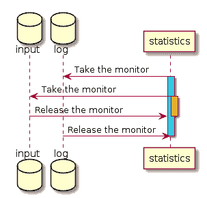

两个线程依赖于相同的一组资源，它们获取这些资源的顺序没有定义。这意味着它们将竞争这些资源，当你多次运行程序时，资源获取的顺序将在每次运行中不同。

让我们看看一个应用程序运行良好的案例：

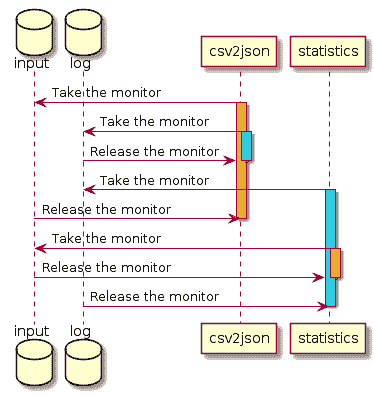

在前面的图中，第一个线程首先锁定输入监视器，然后锁定日志监视器，但之后，第二个线程试图锁定日志，但为时已晚。因此，它被迫等待其他线程完成。第一个线程已经获得了它所依赖的所有锁，因此它成功完成。完成之后，它释放了它拥有的所有监视器，第二个线程就可以获取它们。

现在，让我们看看应用程序如何以及为什么会出现死锁：

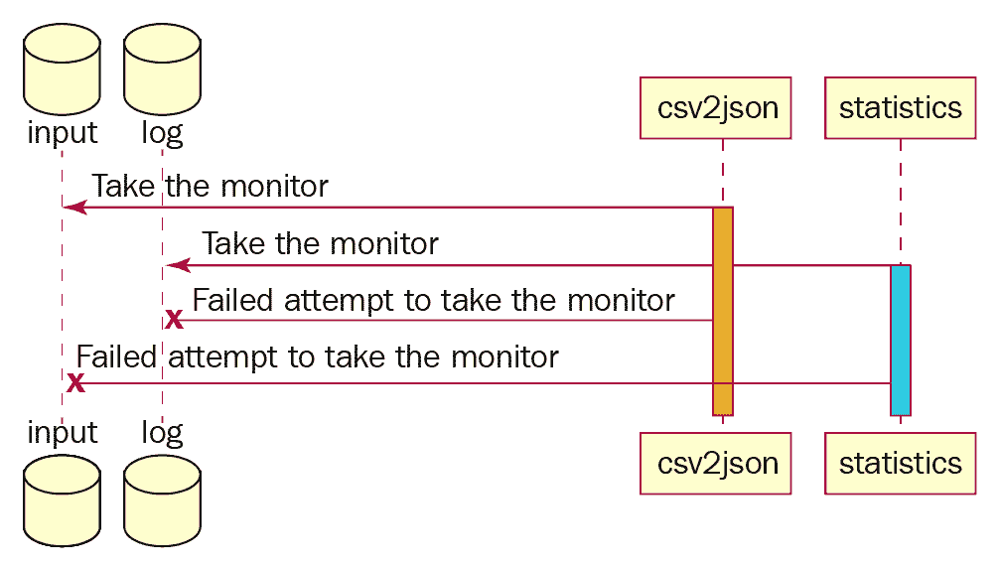

因此，在上面的例子中，第一个线程锁定输入文件的监视器。与之相伴，第二个线程锁定日志文件的监视器。之后，为了继续执行，第一个线程需要日志文件的监视器，但它无法获取它，因为第二个线程已经锁定了它，因此它被迫等待。

第二个线程需要输入文件的监视器才能继续执行。然而，它无法获取它，因为它被第一个线程拥有，因此它也必须等待。这意味着我们最终陷入了一个状态，其中两个线程都无法继续执行，直到另一个线程完成，因此两个线程都不会完成。这种情况被称为死锁。

一个快速的解决方案可能是让线程以相同的顺序获取监视器。例如，如果第一个线程先锁定输入文件监视器，然后锁定日志文件监视器，我们可能希望对第二个线程也强制执行相同的顺序。因此，第二个线程将如下所示：

```java
def statisticsSafe(avg: Boolean = true, max: Boolean = false, min: Boolean = false): Thread = makeThread {
 val inputList: List[(String, Int)] = input.synchronized {
 log.synchronized {
 doLog(s"Computing the following stats: avg=$avg, max=$max, min=$min")
 val res = readInput()
 doLog(s"Read the input file to compute statistics on it")
 res
 }
 }

  val prices: List[Int] = inputList.map(_._2)
  def reportMetrics(name: String, value: => Double): Unit = {
    val result = value
    log.synchronized { doLog(s"$name: $result") }
  }

  if (avg) reportMetrics("Average Price", prices.sum / prices.length.toDouble)
  if (max) reportMetrics("Maximal Price", prices.max)
  if (min) reportMetrics("Minimal Price", prices.min)
}
```

粗体中的代码块与`statistics`线程定义相比所做的更改。现在，第一个获取输入文件监视器的人将保证完成执行。这是因为，在先前的应用中，除非你已经拥有了输入文件的监视器，否则不可能获取日志文件的监视器。所以，第一个获取输入文件监视器的人将保证能够获取相同的日志文件监视器。

短期内这个修复可能有效。然而，你可能已经注意到它并不是最优的。在先前的例子中，我们有一个相当简单的情况。我们只有两个线程和它们依赖的两个资源。这种简单的设置在现实世界中不太可能发生。现实世界中的应用可能包含数十个线程，并依赖于数十个资源。此外，调试先前的复杂性也很棘手。如果只有两个线程能够产生这种复杂性并且需要大量的脑力去分析和找出问题，想象一下这种复杂性在现实世界设置中会如何增长。

这正是为什么标准同步方法在长期内对并行编程来说并不实用的原因。它作为编程的低级模型是不错的，这样人们可以在其之上构建一些高级原语。然而，我们在实践中无法有效地使用它。这些问题与线程和并发应用程序提供了创造更新、更稳健的推理并发编程方法动机。我们在本章开头简要讨论了一些这些方法。现在，让我们更详细地谈谈 actor 模型。

# 将 actor 模型作为传统模型的替代

处理先前讨论的复杂性的最流行方法之一是并发编程的 actor 方法。如果你仔细查看先前的例子，你会注意到它们的一个特点，那就是全局推理。每当有多个线程需要相互通信时，我们就被迫一起对它们进行推理。因此，我们不能单独考虑一个线程，而忽略其他线程。

正如我们之前看到的，解决死锁问题的方法是改变第二个线程中获取监视器的顺序，使其与第一个线程中的顺序相匹配。基本上，当我们处于第二个线程的作用域内时，我们被迫考虑到第一个线程中进行的操作。

全局推理给程序员的思维带来了心理负担。本书的一个核心观点是，纯函数式编程旨在通过减少对程序推理的范围来减轻程序员的思维负担。

在并发编程的背景下，我们如何处理全局作用域和共享可变状态作为线程间通信手段的问题？演员模型会提供一组抽象来确保，无论何时你在编写并行应用程序，你都能忘记你正在一个并发环境中工作。演员模型背后的核心点，它被创造出来的中心思想，以及它存在的原因，就是让你的程序在并发环境中就像你正在处理一个单线程应用程序一样，这意味着你不再需要考虑以线程安全的方式获取监视器或访问资源。

演员模型通过提供一组抽象和一组必须遵循的约定来实现这一点，作为模型的一部分。演员模型的核心抽象，不出所料，是一个演员。可以大致将演员视为一个线程。它不一定是一对一映射到线程上；实际上，它是一个更轻量级的原语，你可能会有成千上万的演员。它们并发性的管理是通过抽象来实现的。然而，正确思考演员的方式是，它们是演员模型中的并发原语。

一个演员可以拥有某些资源，如果它确实拥有，则保证没有其他演员拥有或访问这些资源。例如，如果一个演员有一个文件的引用，则保证没有其他演员有相同引用的同一文件，因此它无法写入或读取该文件。如果它需要访问另一个演员拥有的资源，它需要请求拥有该资源的演员代表这个演员执行所需的操作。由于所有非线程安全或资源上的操作都是由一个且仅有一个演员完成的，并且演员是顺序和单线程实体，因此在这种情况下不会出现任何非线程安全的行为。

一个演员如何向另一个演员请求执行一个动作？这是通过消息来完成的。每个演员都有一个所谓的**邮箱**。邮箱是一个存储所有发送给这个演员的通信的地方。在演员模型中，一个通信单元就是一个消息。只要消息符合演员模型的约束条件，它可以包含任何内容，我们将在后面讨论这些约束条件。邮箱是一个队列。因此，许多并行运行并发送消息的演员的消息可能会到达单个演员，并且它们将被排序到一个单一的顺序队列中。演员保证一次只处理一个消息。所以，它的工作方式是演员在其邮箱上等待邮件。然后，它一次处理一封信，并按顺序处理。

关于如何具体处理收到的邮件，一种方法是在演员的体内通过对其不同类型收到的邮件的反应来定义。因此，对于演员能够处理的每种邮件类型，它定义了一个函数，这个函数应该在信件到达演员时执行。

# 重新审视死锁示例

到目前为止，我们只是粗略地看了演员模型。我们还没有学习任何关于演员模型的实际实现。然而，看看我们之前的例子是如何实现的，以便我们摆脱所面临的复杂性，可能会有所帮助。

首先，我们讨论了演员模型中的并发原语。在前面的例子中，并发原语是执行某些操作的两个线程。因此，将我们需要执行的从两个线程映射到演员模型中的两个演员是合理的。所以现在，我们有了两个演员。一个演员应该从 CSV 生成 JSON，另一个演员应该对 CSV 文件进行一些统计分析。

在前面的例子中，我们有两个需要处理的文件和两个需要访问这两个文件线程。演员模型要求只有一个演员必须拥有一个给定的资源。所以，如果第一个演员需要资源，第二个演员就不能拥有它。在我们的情况下，第一个和第二个演员需要处理输入文件和日志文件。我们应该如何处理这种情况？我们应该如何使其符合演员模型？

解决方案是两个演员都不应该拥有这个资源。相反，我们应该创建一个第三演员，该演员负责运行涉及这些资源的操作。然后，每当我们需要对结果进行操作时，我们向该演员发送消息，要求执行所需的操作。

由于我们的演员，让我们称其为进程管理器，控制着对输入文件和日志文件的访问，我们必须期待其他演员提出的相关于这个资源的操作请求。换句话说，我们还需要定义对它可能收到的所有可能消息的反应。因此，我们需要考虑其他演员可能提出的哪种操作请求。我们可以考虑以下请求：

+   首先，我们获取输入文件。这条消息是请求读取输入文件并将其作为不可变集合发送回请求的演员。在两个演员之间共享不可变资源是完全可以接受的，因为不可变资源是线程安全的。

+   其次，我们可能期待一个写入日志文件的请求。在收到这个请求后，资源管理器演员将对日志文件执行写入操作，写入的信息是发送给它的消息。

一旦我们有了资源管理器演员，我们可以像这样表达示例：

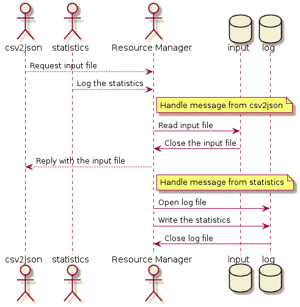

现在，执行实际工作的前两个演员是根据消息和与资源管理器的通信来定义的。第一个演员要求进程管理器发送一个输入文件给它。在收到资源管理器的响应后，它开始其操作，并且每当它执行需要记录日志的重大操作时，它将日志消息发送给资源管理器。在这种情况下没有采取监控，因为所有资源都由单个演员拥有。所有其他演员并没有直接调用它们——它们只是要求资源演员代表它们执行操作。

第二个演员与其自身有相似的情况。首先，它向资源管理器发送一条包含它将要计算的统计信息的日志消息。其次，它从资源管理器请求输入文件。最后，在作为单独的消息收到输入文件后，它执行计算，并在需要记录日志时联系我们的资源管理器。

没有演员需要采取监控或与其他演员同步以确保非线程安全资源可以安全使用。它们都由单个演员拥有，并且这个单个演员从它自己的单个线程中依次与它们一起工作。其他演员发送给它的消息可能并行到达，但它们将在单个邮箱中汇总，并且不会立即处理。资源演员根据自己的节奏、自己的时间处理消息，只要底层系统分配了资源和处理时间。保证这个演员一次处理一条消息，并且不会并行处理两条消息。因此，我们大大提高了线程安全性。

注意，在前面的图中，我们有一个会导致标准同步模型中死锁的场景。第一个演员需要访问文件，然后需要访问日志，第二个演员需要访问日志然后是文件。在本章之前，我们讨论了这种情况下产生死锁的可能性。在这里，死锁不再可能，因为资源由单个演员控制。

# 摘要

在本章中，我们对演员模型的动机和背后的想法进行了简要概述。我们看到了如何用演员模型可能的样子来表示应用程序的架构。在下一章中，我们将更深入地探讨模型，并了解如何在实践中使用它。我们将学习一些我们可以立即在我们的项目中使用的模型的实际实现和框架。

# 问题

1.  同步模型是如何在同步并行计算中工作的？

1.  死锁是如何发生的？描述一个可能导致死锁的场景。

1.  演员模型的主要抽象和约束是什么？

1.  行为模型是如何帮助防止在同步模型下通常出现的问题的？
