# 第十二章：实践中的 Actor 模型

在上一章中，我们开始探讨 actor 模型作为 Scala 中可用的一种并发模型。在第九章，*纯函数式编程库*中，我们看到了如何使用 IO 及其提供的基础设施来解决异步和多线程编程的挑战。然而，这种技术仍然没有得到广泛的应用。在实践中，当你在 Scala 中处理多线程、并发和异步时，你将需要在现实场景中处理更健壮的库。

在本章中，我们将探讨以下主题：

+   Akka 概述

+   定义、创建和消息传递 actor

+   与 actor 系统一起工作

# Akka 概述

Akka 是 actor 模型的实现，我们在上一章中讨论了其在工业应用中的目的。如果 Cats 效应专注于对新技术的实验和尝试，那么 Akka 则专注于为行业提供解决大规模问题的工具。当然，我们也可以期待 Cats 达到那个水平，然而，如果你打算在现实世界中用 Scala 处理并发和异步，你很可能会遇到 Akka。

本书的目的在于让你熟悉在现实场景中需求旺盛的函数式编程的现代技术。由于并发和异步编程无处不在，我们将讨论最广泛使用的工具来应对其挑战。我们将从查看 Akka 构建的基础原则开始。

# Akka 原理

Akka 的核心抽象是 actor。actor 是一个可以接收和向其他 actor 发送消息的实体。

Actors 是轻量级的并发原语。类似于你可以在 cats 中有数百万个 Fibres，你可以在 Akka 中有数百万个 actors。这是因为它们利用异步并提供在标准 Java 虚拟机线程之上的抽象。通过利用 JVM 的资源，你可以在单台机器上并行运行数百万个 actors。

Akka 在设计时就考虑了可扩展性。该库不仅为你提供了 actor 本身的抽象。类似于 cats 有针对各种特定函数式编程情况的库基础设施，Akka 也有大量针对异步编程特殊情况的库。你将在这个库中遇到一个 HTTP 服务器，这是一个允许你与位于不同机器上的 actors 进行通信的基础设施。

Actors 模型的目的在于为你提供一个并发框架，这将减少你的心理负担，并允许构建健壮和可扩展的软件。

为了克服并发编程带来的挑战，Akka 对程序员施加了一系列相当严格的限制。只有遵循这些限制，人们才能从模型中受益。重要的是要记住，actor 模型强加的规则不是由编译器编码和执行的。所以，遵循它们的责任在于你。随意打破它们是很容易的。重要的是要记住，如果你这样做，你可能会遇到比没有 actor 模型时更大的麻烦。

# 封装

并发编程的一个问题是共享可变状态。Akka 通过提供一种限制来消除这个问题，即无法将 actor 作为普通对象访问。这意味着你的业务逻辑没有单个变量来存储 actor。因此，不可能通过普通面向对象的方式访问 actor 上定义的值。

通过代理类型——`ActorRef`s——将 actor 暴露给外部世界。Akka 库定义了这种类型，并且只允许在 actor 上执行安全操作。

如果你想对 actor 做些什么，你应该通过这个代理来做。此外，你不会将 actor 作为普通的 Java 或 Scala 对象实例化。你不会在它上面调用构造函数。相反，你将指示`ActorSystem`来实例化它。有了这些约束，就变得不可能通过任何其他方式接受 actor 的数据，除了通过消息传递。

# 消息传递

每个 actor 都有一个邮箱，任何其他消息都可以发送到那里。Akka 保证消息一次由 actor 处理，不会发生并发处理。实际上，actor 模型提供了一种保证，即一次只有一个线程可以访问 actor 的内部状态。然而，请记住，遵循 actor 模型的责任在于程序员。通过在 actor 中产生额外的线程（例如使用`Future`）来打破模型是很容易的，从而破坏单一线程访问保证。

在存在其他方便的并发库，如 Future 的情况下，这种限制是强制执行的。Akka 与 Scala Future 紧密协作。重要的是要记住，未来（futures）是从其他线程开始和工作的。所以，当你开始在 Akka 中启动一个 Future 时，你就失去了对 actor 状态的单一线程访问保证。如果你继续这条路，你需要指定同步并利用 JVM 为你提供的监控机制。这是一个反模式，它破坏了 Akka 的初衷，在 actor 编程中是绝对禁止的。

记住，只有当你遵循其规则时，模型才会帮助你，而且没有任何东西可以强制你这样做。

# 不泄露可变状态

当使用 Akka 进行编程时，你必须注意的另一件事是 actor 的可变状态的泄露。还记得之前的原则，即不能有超过一个线程访问 actor 的内部状态吗？好吧，如果你将一个由一个 actor 拥有的可变对象的引用发送给另一个 actor，这个对象可能同时被两个线程并行访问。如果你将可变状态泄露给其他 actor，你可能会遇到比从 actor 启动 Future 时更糟糕的头痛。在启动 Future 的情况下，至少你可以控制那个 Future 和它启动的线程；你可以定义一些监视器和协议来访问 actor 的状态。当然，你不应该这样做，但在理论上，这是可能的。

然而，如果你从一个 actor 向另一个 actor 泄露了一个可变状态的引用，你将无法控制该 actor 如何使用它。

再次强调，这个规则不是由 Akka 强制执行的。在 Akka 中，你可以将任何对象作为消息传递给另一个 actor。这包括可变引用。因此，你应该意识到这种可能性，并积极避免它。

# 容错性和监督

Akka 在设计时考虑了弹性和容错性。这意味着如果一个 actor 因为异常而失败，它将有一个定义良好的方式自动重启并恢复其状态。Akka 将 actor 组织成层次结构，父 actor 负责其子 actor 的性能。所以，如果一个子 actor 失败了，它的父 actor 应该负责重启它。理念是外部世界不应该受到 actor 下属问题的干扰。如果出现问题，解决这个问题的责任在管理者，而不是进一步升级问题。而且当子 actor 重启时，它应该能够恢复到它失败时的状态。

# 消息保证

Akka 被设计成可以在集群中、通过网络进行部署。这意味着你对于消息的传递保证比在单个 JVM 应用程序中要少。如果你从一个计算机上的 actor 向世界另一端的 actor 发送消息，你不能保证这个消息会被传递。

因此，由 Akka 实现的 actor 模型要求你在构建应用程序时不要对消息传递有任何保证。你的应用程序必须能够应对无法传递消息的情况。

然而，Akka 为你提供了关于从 actor 到 actor 的消息传递顺序的保证。这意味着如果你从一个 actor 发送一个消息在另一个消息之前，你可以确信这个消息也会在第二个消息之前到达。

在学习前面的理论之后，最好的做法是看看它在实际中的应用情况。接下来，我们将讨论一个依赖于 Akka 提供的众多功能的例子。我们将随着遇到这些功能来学习它们。

# 异步

记得我们讨论 IO 时，强调了异步和非阻塞计算的重要性吗？底层操作系统的线程是稀缺的，在一个高负载的系统上，你需要很好地利用它们。阻塞并不是线程的明智利用方式。

我们已经讨论过，你不应该从当前 actor 调用其他线程。这样做的原因是为了防止多个线程访问当前 actor 的可变状态。我们已经讨论过，每次我们需要处理某些事情时，我们都将处理作为消息调度给当前 actor。

因此，为了强制单线程处理，你可能会倾向于在消息处理逻辑上阻塞一个 future，如下所示：

```java
Await.ready(future, 3 seconds)
```

然而，这会阻塞底层线程。阻塞将一个执行此操作的 actor 变成了一个重量级的并发原语。如果你在高负载应用的环境中使用它，它会快速消耗系统并发资源。这里的理由与我们在讨论 IO 时相同。总之：不要阻塞你的并发原语，因为线程是稀缺的。如果你需要等待某些异步计算的结果以继续当前计算，确保计算完成时向该 actor 发送消息，在当前 actor 上注册一个处理程序，说明任务完成后要做什么，并释放当前线程。

# 定义、创建和消息传递 actor

Actor 被定义为从 Akka 库中的`Actor`类继承的类：

```java
class HelloWorld extends Actor {
```

Actor 公开以下抽象 API：

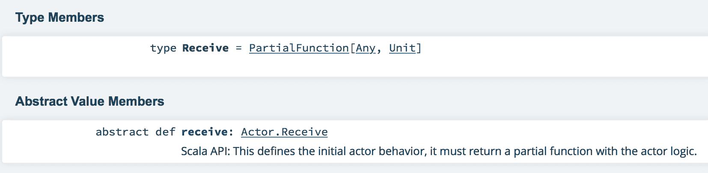

`Actor`中唯一抽象的方法是`receive`方法。Akka 在 actor 需要处理传入消息时调用此方法。它返回一个从`Any`到`Unit`的偏函数。这意味着它能够处理来自所有对象域的消息，并且它应该在处理此消息时产生一些副作用，这由`Unit`返回类型表示。该函数是一个偏函数，这意味着它只能处理 actor 感兴趣的部分`Any`输入域。

当你定义一个 actor 时，你重写此方法来定义 actor 必须做什么：

```java
val log = Logging(context.system, this)

def receive = {
  case Ping ⇒ log.info("Hello World")
}
```

消息定义如下：

```java
case object Ping
```

因此，当 actor 收到 ping 消息时，它将输出`hello world`字符串到日志。我们可以通过以下函数来构建日志：

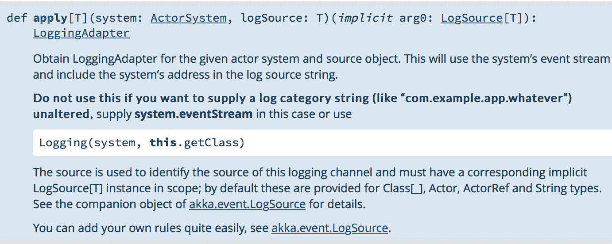

此函数定义在以下对象上：

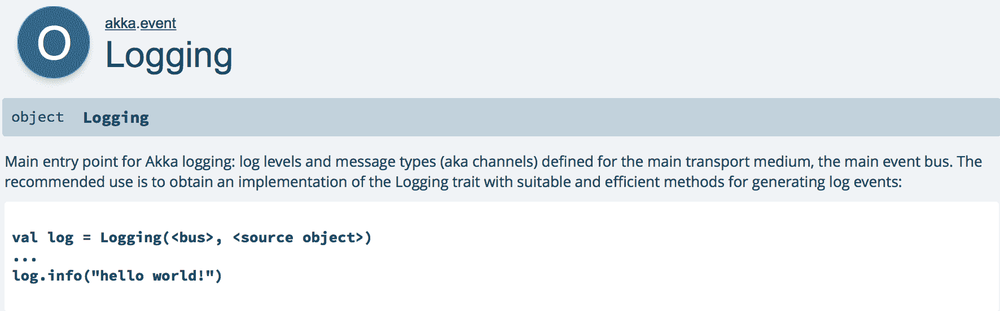

Akka 所依赖的一种抽象是事件系统。事件可以用来跟踪演员状态的变化，并在失败的情况下将其恢复到之前的状态。从某种意义上说，日志记录也是一个事件流，因此 Akka 为你提供了一个详尽的日志基础设施，它还与其通用事件系统集成。在构建记录器时，你需要提供为其定义的`ActorSystem`以及当前演员的引用。然后你将能够正确地显示日志消息，同时指定当前演员。

注意，在这里，为了构建记录器，我们正在访问在演员上定义的其他 API。我们正在调用上下文方法和其成员系统方法。因此，接下来，让我们看看演员公开的 API。

`Actor`类的所有具体成员可以分为几个组。

# 回调

以下方法属于回调组：

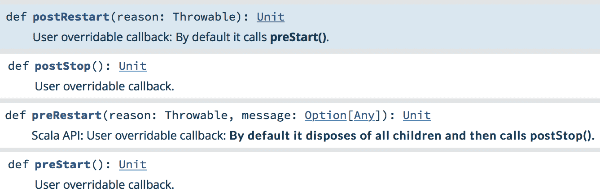

Akka 框架在不同情况下会调用这些回调。例如，`postStop`在演员停止后调用。`preStart`在演员开始前调用。`preRestart`在演员重启前调用，`afterRestart`在演员重启后调用。重启回调接受一个`reason`参数。`reason`是由于此演员需要重启而导致的异常。它也是 Akka 的容错策略的一部分。在构建您的演员时，您应该考虑到这种重启的可能性。

最后，当演员收到它无法处理的任何消息时，会调用`unhandled`方法：

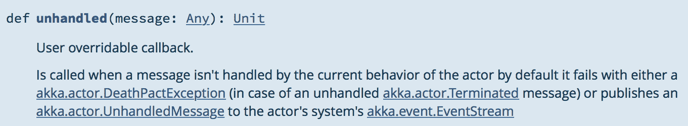

记住，我们讨论过`receive`方法返回一个部分函数。这意味着它只在其域类型的一部分上定义。因此，每当演员收到它无法处理的任何消息时，就会调用未处理的回调。

# 监督

此外，Actor 提供的容错策略的一部分是`supervisorStrategy`方法：

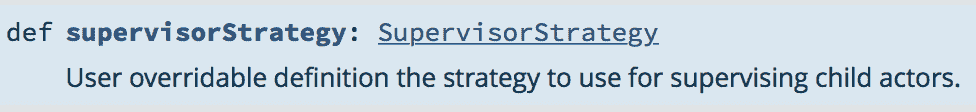

您可以重写此方法以提供不同的方式来监督其子演员。监督是观察子演员的生命周期并在重要事件上采取行动的概念，例如当演员因异常失败时。在 Akka 中，父演员应该监督子演员。监督策略定义如下：


如您所见，为此类定义了两个子类，并且文档建议您不要实现额外的子类，因为不正确的实现可能导致错误的行为：

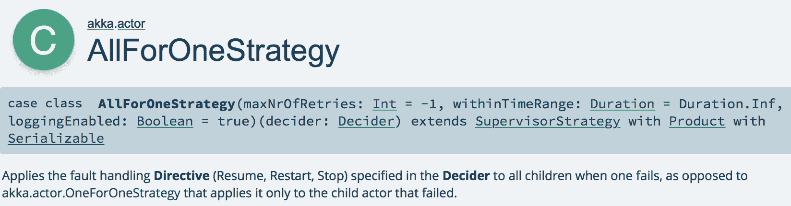

`AllForOneStrategy`如果其中一个子演员失败，将对所有子演员应用给定的操作：

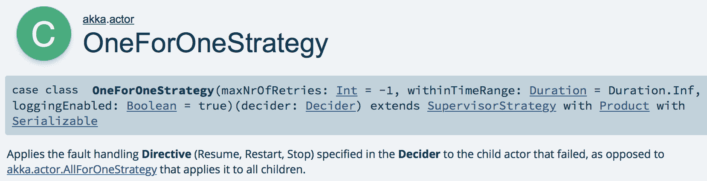

`OneForOneStrategy`将只对失败的子演员应用操作。

注意，这两种策略都是通过定义如何处理失败子代的情况的各种参数来参数化的。其中一个参数是 `Decider`：

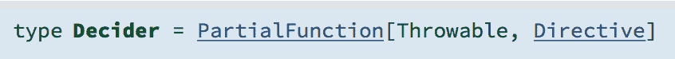

`Decider` 类型是从 `Throwable` 到 `Directive` 的部分函数。它接受在演员中发生的 `Throwable`（可以是 `Exception` 或 `Error`），`Decider` 的任务是向演员系统提供如何处理这个异常的信息。

`Directive` 定义了在给定异常下对演员应该做什么：

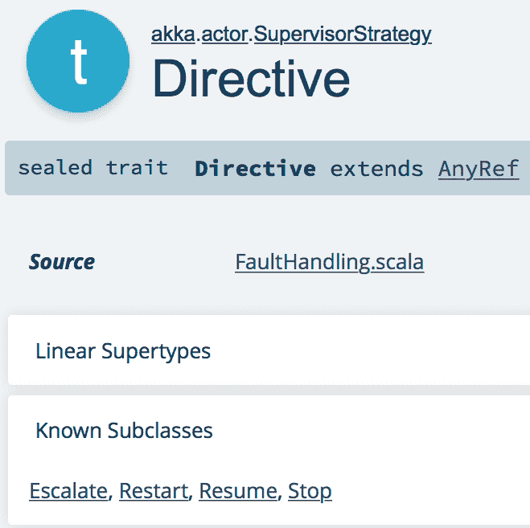

`Directive` 特质有四个子类。`Escalate` 指令将异常提升到监督演员的父母。因此，当子代失败时，父母也会失败，并将依赖于自己的父母来处理异常。

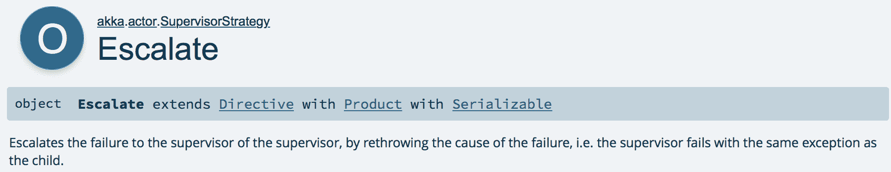

`Restart` 指令将丢弃失败的演员，并在其位置创建一个新的演员：

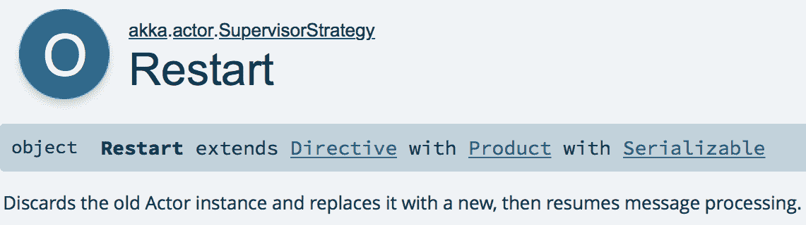

`Resume` 指令将指示发生异常的演员继续处理消息：

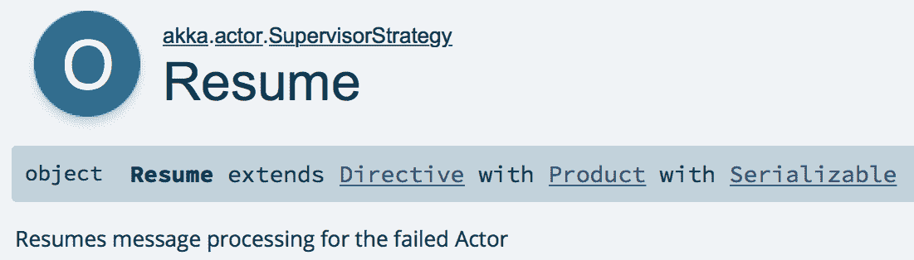

异常将被忽略，并且不会采取任何行动来处理它。子演员将继续像之前一样执行。

最后，`Stop` 指令将停止当前演员，而不会在其位置启动另一个演员。

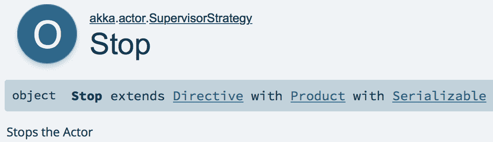

前面的基础设施为你提供了构建层次结构的能力，其中父母负责孩子的正常运行。这种方法提供了关注点的分离，并允许一定程度的地方推理。这意味着演员系统尽可能早地处理失败，而不是将它们传播到层次结构中。

层次结构也为你提供了一种抽象度量的方式，因为你不再关心特定演员的子代，你可以将特定演员视为对其请求执行的任务负责的单一点。单一点的责任类似于在组织中，你有一个单个人负责一个部门，并且每当你需要部门做某事时，你都会与负责人交谈。你期望他们能妥善管理部门。Akka 就是以这种方式构建的。无论何时你有疑虑，你都会有一个演员负责这个疑虑。它可能或可能没有子演员来帮助它处理这个疑虑，然而，作为一个外部观察者，你不需要意识到这些因素。你不需要关心这些下属发生的错误。当然，前提是这些错误可以定位到特定的部门。如果错误比部门能处理的更严重，它就会向上传播到链中。

# 上下文和参考

除了给你控制演员如何响应各种生命周期事件的回调之外，演员还有一个用于管理其执行上下文的 API：

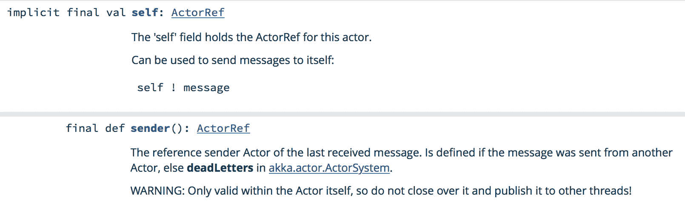

演员对其自身的 `ActorRef` 和发送者演员有引用。这些引用应该从 `receive` 方法中访问。通过它们，你可以与发送者演员以及作为 `ActorRefs` 的此演员进行交互。这意味着你可以向这些演员发送消息，并执行通常作为外部观察者会做的事情。

除了引用之外，演员还有一个 `context` 引用，它提供了关于演员执行上下文的信息和控制：

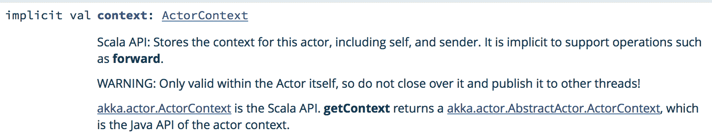

`ActorContext` 提供了在处理消息时可能有用的各种 API。

# 管理演员层次结构

管理演员层次结构的核心概念是 `ActorContext` 类型。它定义如下：

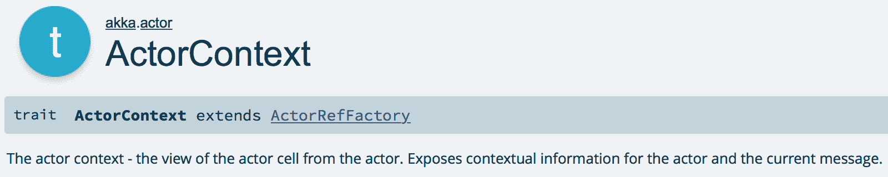

`ActorContext` 允许你在演员的层次结构上执行各种操作。例如，你可以使用 `actorOf` 方法创建新的演员，该方法定义如下：

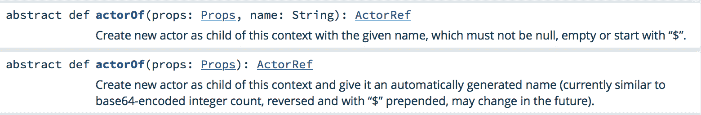

因此，使用 `ActorContext`，你可以创建此演员的子演员。我们将在稍后讨论演员系统时详细介绍使用 `Props` 对象创建新演员的确切步骤。

当前演员能够通过 `child` 和 `children` 方法访问它创建的子演员：

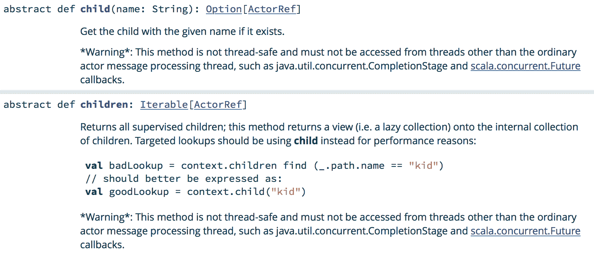

同样，你可以访问此演员的父演员：

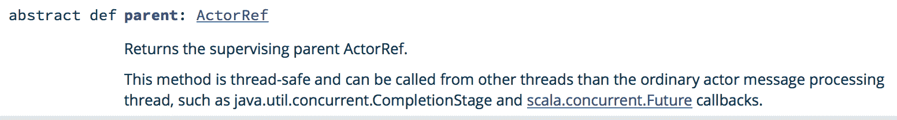

`ActorSystem` 是演员的集合：

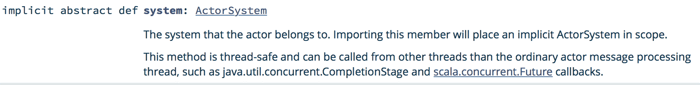

我们将在 *创建演员* 部分稍后讨论演员系统，但就目前而言，你应该了解 `ActorSystem` 可以从 `ActorContext` 访问。

# 管理生命周期

Akka 上下文为你提供了管理演员生命周期的各种方法：

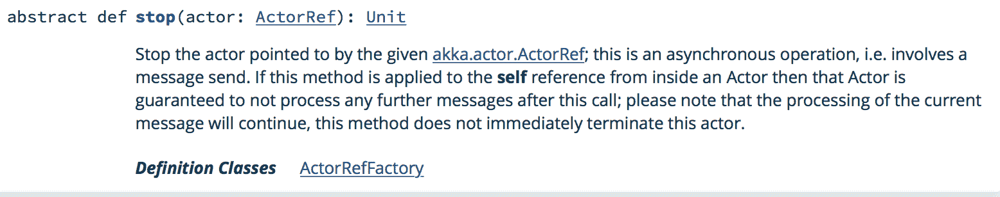

你可以停止此演员或其他演员使用 `ActorContext`。基于演员的编程中的一种常见模式如下：

```java
context stop self
```

上述习语通常用于终止已完成工作且没有更多事情要做的演员。

演员可以改变其行为。演员的行为由其 `receive` 方法定义：

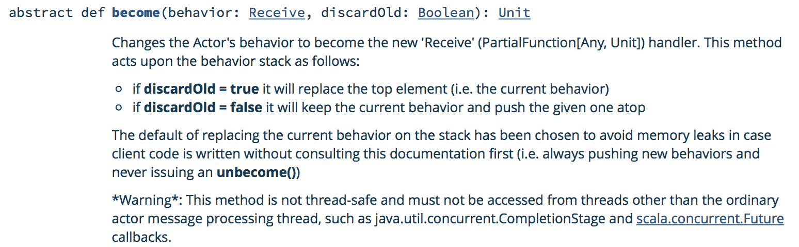

然而，作为处理消息的一部分，你可能想要改变演员处理消息的方式。为此，你可以使用 `become` 方法。

演员会记住你覆盖的过去行为，并将它们保存在堆栈中。这意味着你可以调用 `unbecome` 方法从堆栈中弹出当前行为并使用之前的行为：

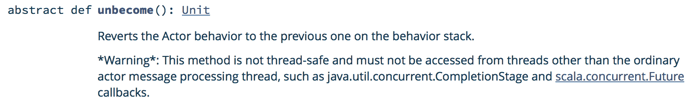

# 监督

一个演员可以监视另一个演员的生命周期事件：

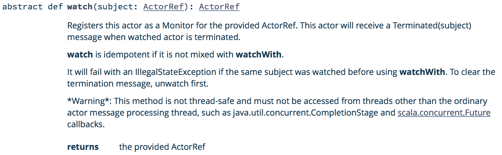

当您需要此演员意识到另一个演员何时终止时，您可以指示它使用演员上下文来监视那个演员。当那个演员终止时，监督演员将收到一个`Terminated`消息。您可以像处理接收到的任何其他消息一样注册`Terminated`消息的处理程序。

# 创建演员

所有的演员都属于某个`ActorSystem`，这是一个演员的层次结构：

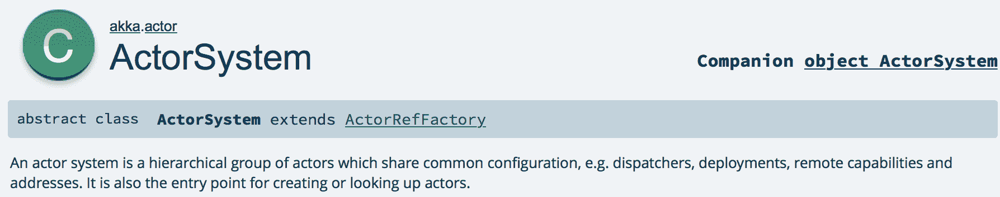

创建新演员时最重要的方法如下：

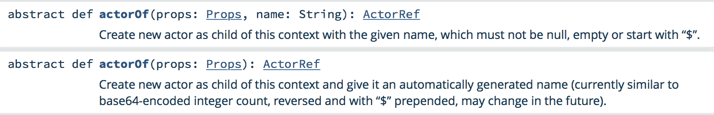

每个演员都是通过在演员系统或演员上下文中调用名为`actorOf`的方法来创建的。您可以使用其伴随者对象 API 创建演员系统本身：

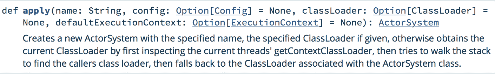

当调用此方法时，您可以指定此系统的名称。您还可以指定定义演员系统行为某些方面的配置。配置是一个放置在`CLASSPATH`环境变量指定的路径下的文件。`CLASSPATH`是让 JVM 程序知道它使用的类所在位置的标准方式。例如，在一个 SBT 项目中，您可以在项目根目录下的以下路径放置配置文件：`src/main/resources/application.conf`。在这个配置文件中，例如，我们可以禁用所谓的死信的日志记录——为不存在的演员发送的消息：

```java
akka.log-dead-letters=0
```

配置非常灵活，并赋予您一定程度的控制权，以确定您的演员系统如何执行。有关更多信息，请参阅 Akka 关于配置的文档。

您还可以指定`ActorSystem`将要使用哪个执行上下文来运行其演员。正如我们在讨论 IO 时讨论的那样，对于并发库，我们需要一种方式来指定库应该使用哪种线程策略。最后，您可以为`ActorSystem`提供一个类加载器，它将被用于解析配置等操作。所有这些参数都是可选的。如果您没有指定其中一个，Akka 将使用合理的默认值。

现在，让我们看看我们如何运行我们的 Hello World 示例：

```java
val system = ActorSystem()
val helloWorld = system.actorOf(Props[HelloWorld], "hello-world")
helloWorld ! Ping
```

首先，我们创建`ActorSystem`。我们创建一个`HelloWorld`演员。我们不调用其构造函数。我们通过使用`Props`对象来这样做。我们在`Props`类型参数中指定我们将要创建的类。我们还指定要创建的演员的名称。`Props`是一个如下定义的案例类：


其伴随者还定义了一组方便的方法来创建`Props`：

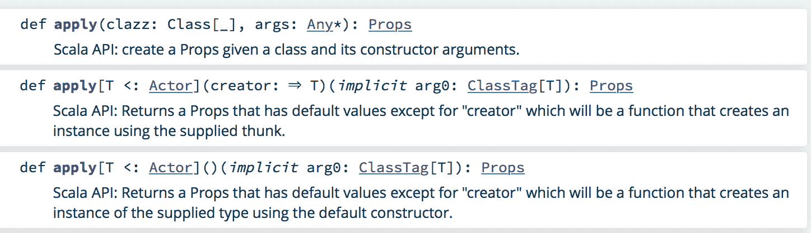

在我们使用`Props`的帮助下创建演员后，我们可以向这个演员发送消息。我们使用`ActorRef`定义的`!`运算符来这样做。

# 演员参数

普通类可以有接受参数的构造函数，这些参数可以用来参数化生成的实例。同样，可以使用`Props`工厂方法的替代版本来创建具有构造函数参数的演员。

假设我们有一个演员，其构造函数接受参数：

```java
class HelloName(name: String) extends Actor {
  val log = Logging(context.system, this)

  def receive = {
    case "say-hello" ⇒ log.info(s"Hello, $name")
  }
}
```

前面的演员指定了它在输出时将要问候的人的名字。同时，注意它如何接受一个字符串作为消息。这是为了表明你可以向演员发送任何对象作为消息。

当你有一个接受构造函数参数的演员时，一个标准做法是在演员的伴生对象中声明一个`Props`工厂方法：

```java
object HelloName {
  def props(name: String): Props =
    Props(classOf[HelloName], name)
}
```

这种方法抽象掉了创建此演员所需的`Props`。现在，你可以按照以下方式构建此演员并使用它：

```java
val system = ActorSystem("hello-custom")
val helloPerson = system.actorOf(HelloName.props("Awesome Person"), "hello-name")
val helloAlien = system.actorOf(HelloName.props("Alien Invaders"), "hello-aliens")
helloPerson ! "say-hello"
helloAlien ! "say-hello"
helloAlien ! "random-msg"
```

输出如下：

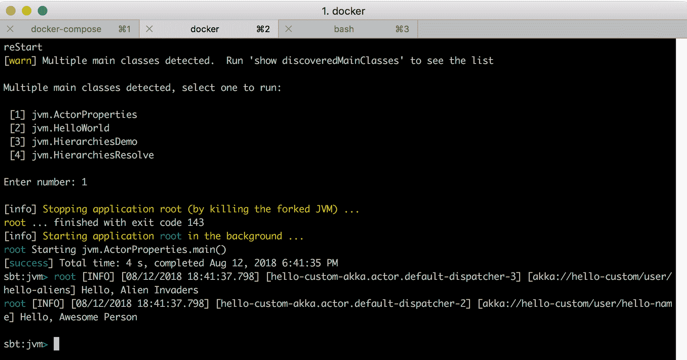

# 与演员系统一起工作

演员模型的优势在于演员轻量级，这意味着你可以在单个普通计算机上运行的 JVM 上使用数百万个演员。大多数时候，你不会使用单个演员，而是使用多个演员。这需要一个模型来处理多个演员。

在 Akka 中，演员以分层树的形式组织——这意味着每个演员都有一个父演员，并且可以有多个子演员。接下来，我们将查看一个稍微复杂一点的例子，该例子将展示演员在分层中的工作方式。

# 任务规范

假设我们需要有多个演员，它们都将问候消息输出到日志中的给定名字。假设还需要从最终用户那里抽象出系统中存在多个演员的事实。我们将通过创建一个单一的监督演员来实现这一点，该演员将负责执行所有子演员的执行。子演员将是向日志输出问候消息的演员，而父演员将是一个代表他们的管理者。

协议将如下所示。首先，创建一个`GreetingsManager`演员。然后，你将发送一个`SpawnGreeters`消息来生成所需数量的问候演员。这些生成的问候演员必须覆盖我们已有的演员。这种覆盖是通过停止之前的演员并创建新的演员来完成的。

接下来，用户向管理演员发送一个`SayHello`消息，这将指示其所有子演员向日志执行输出。然而，在管理演员没有生成任何子演员的情况下，我们将输出一个错误，要求用户首先生成演员。

# 实现

让我们从定义`Greeter`演员开始，因为它更简单：

```java
class Greeter extends Actor {
  val log = Logging(context.system, this)

  def receive = {
    case SayHello(name) => log.info(s"Greetings to $name")
    case Die =>
      context stop self
      sender ! Dead
  }
}
```

演员将接受一个参数化的问候消息，该参数指定演员应该问候的名字。在接收到此消息后，它将执行日志输出。

`Greeter` 角色有其他角色停止它的手段。我们已经讨论过，任务的一个要求是管理角色应该能够终止现有的演员以创建新的演员。这可以通过向这个 `Greeter` 角色发送消息来实现。

那条消息将使用 `context stop self` 模式，并将使用 `Dead` 消息向发送者角色报告它已经死亡。请注意，`context stop self` 只在处理完当前消息后才会终止 `self` 角色一次。因此，`sender ! Dead` 代码将在角色仍然存活时执行。角色将在处理完 `Die` 消息后终止。

我们使用案例类作为消息在角色之间进行通信，因为它们在模式匹配方面很方便。整个协议如下所示：

```java
case class SpawnGreeters(n: Int)
case class SayHello(name: String)
case class Execute(f: () => Unit)
case object JobDone
case class GreetersResolution(result: Try[ActorRef])
case class GreetersTerminated(result: List[Any])
case object GreetersCreationAuthorised
case object Die
case object Dead
```

我们将在遇到每个消息时介绍它。

此外，请注意 Akka 有一个内置的消息可以用来停止角色。每次你向一个角色发送 `PoisonPill` 时，它的默认行为是终止自己：

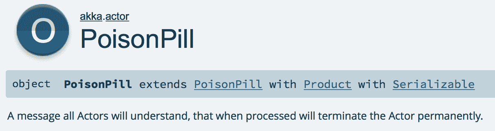

我们在这里不使用 `PoisonPill` 的原因是因为它与我们将要使用的模式不太兼容。

接下来，让我们开始处理 `GreetingsManager` 角色吧：

```java
class GreetingsManager extends Actor {
  val log = Logging(context.system, this)

  def baseReceive: Receive = {
    case SpawnGreeters(n) =>
      log.info("Spawning {} greeters", n)
      resolveGreeters()
      context become spawningGreeters(sender, n)

    case msg@SayHello(_) =>
      resolveGreeters()
      context become sayingHello(sender, msg)
  }

  def receive = baseReceive
/*To be continued...*/
}
```

`receive` 方法被设置为 `baseReceive`。我们不直接在 `receive` 下定义角色暴露的 API 的原因是我们打算利用 `context become` 功能来改变角色的行为。`context become` 可以用来覆盖 `receive` 方法的功能。每个新的行为都将在这个角色的内部作为单独的方法实现，以便于切换。

`baseReceive` 方法使角色能够处理两个 API 消息：`SpawnGreeters` 和 `SayHello`。它们将管理底层的问候者并指示它们执行输出。

注意，这两个方法都遵循一个模式。首先，它们可以选择性地执行日志输出，然后调用 `resolveGreeters` 方法，最后使用 `context become` 模式来改变当前角色的行为。

对这两条消息的反应取决于 `Greeter` 角色是否被创建。如果它们没有被创建，那么在 `SpawnGreeters` 消息的情况下，我们将像往常一样创建它们。在 `SayHello` 的情况下，我们将输出一个错误，因为我们无法操作，因为没有问候者。

如果有子角色，在 `SpawnGreeter` 的情况下，我们将终止所有子角色以创建新的角色。在 `SayHello` 的情况下，我们将指示子角色将问候输出到日志。

在原则上，你可以从 actor 内部的可变变量中跟踪所有子 actor 的状态。因此，每次你创建一个子 actor 时，你都会将其引用保存到 actor 内部的集合中。这样，你将能够快速检查我们是否已经定义了子 actor。

然而，在这个例子中，我们将探讨如何使用内置的 actor-hierarchy-management API 来检查子 actor。

该 API 是异步和基于消息的。我们已经讨论过，对于 actor 来说，非阻塞至关重要。它们是轻量级的并发原语，线程稀缺，因此，为了保持 actor 轻量级，我们需要确保它们尽可能少地使用线程。因此，我们不能在子查询操作上阻塞。策略是请求子 actor，注册监听器以作为 actor 消息的反应来响应，并释放 actor 正在使用的线程来执行此策略。

这种策略就是你在`baseReceive`示例中看到的内容。`resolveGreeters`方法启动了子 actor 的解析，结果将以消息的形式返回给 actor。我们将改变此 actor 的`receive`实现以处理此消息。

一旦收到适当的响应，这些新行为将执行请求的功能。我们为`SpawnGreeters`和`SayHello`消息分别设置了不同的行为。注意，我们还通过当前消息的原始发送者和他们提供的数据来参数化这些行为。因此，当我们准备好时，我们将能够执行响应请求，并通知请求者此请求的成功执行。

让我们看看`resolveGreeters`函数是如何实现的：

```java
def greeterFromId(id: Any) = s"greeter-$id"

def resolveGreeters() =
  context.actorSelection(greeterFromId("*")).resolveOne(1 second)
    .transformWith {
      case s@Success(_) => Future.successful(s)
      case f@Failure(_) => Future.successful(f)
    }
    .map(GreetersResolution) pipeTo self
```

`actorSelection` API 的文档如下：

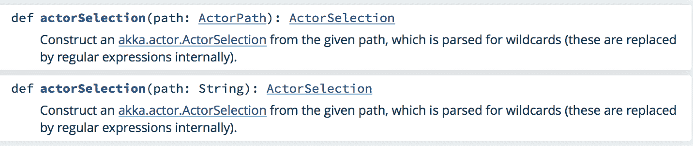

在 Akka 中，每个 actor 都有一个名称和它所属的父 actor 链。每个 actor 也有一个名称。这允许你通过它们的路径来识别 actor。例如，让我们再次看看我们的 hello world 应用程序的输出：

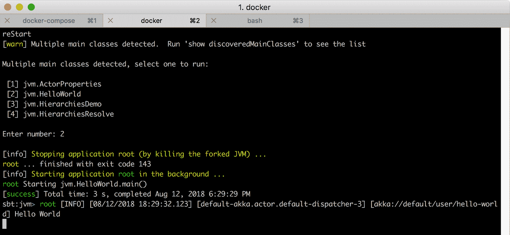

日志提供了当前 actor 的路径，用方括号括起来：

```java
akka://default/user/hello-world
```

在 Akka 中，你可以通过它们的路径来查询 actor。你可以查询 actor 的整个切片，并向 actor 的整个集合发送消息。

因此，actor 选择函数是一个接受 actor 路径的函数，该路径可以包含通配符以同时查询多个 actor，并且它将在 Future 下返回 actor 选择。

Actor 选择为你提供了在普通`ActorRef`上的一些能力。然而，对于`resolveGreeters`函数，我们的目标是检查 greeters 是否存在。这可以通过调用`resolveOne`函数并观察它是否返回成功的 Future 或失败的 Future 来实现。

`resolveOne` 方法接受超时作为参数，并生成一个将导致从你选择的演员集合中随机选择一个演员的 Future。如果选择为空，它将失败。

之后，我们有一个 Akka 的 Future 互操作模式。这个模式被称为管道模式，在我们的例子中，它遵循我们将暂时忽略的 Future 的某些转换：

```java
/*...*/
  .map(GreetersResolution) pipeTo self
```

`pipeTo` 方法通过 Rich Wrapper 可在演员引用上使用：

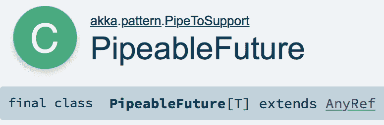

它注入的 API 如下所示：

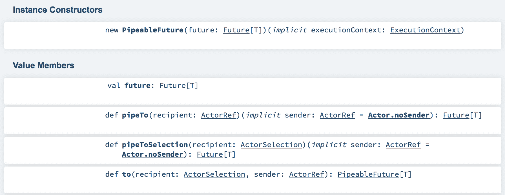

如我们之前所讨论的，从一个演员中调用 Future 是一种反模式。每当这个演员依赖于异步计算时，你需要确保这个计算在终止时向这个演员发送消息，并定义如何处理来自演员的消息。Akka 为 Future 定义了这样一个模式——管道模式。这个模式确保在 Future 完成后，消息将被发送到指定的演员。

在我们的例子中，我们请求 `actorSelection` 的结果，并安排一个带有此解析结果的消息发送到当前演员。

我们在模式之前进行的转换是必要的，以确保失败的 Future 也会向当前演员发送消息：

```java
.transformWith {
  case s@Success(_) => Future.successful(s)
  case f@Failure(_) => Future.successful(f)
}
.map(GreetersResolution)
```

最后，我们使用 map 方法将这个 Future 的结果封装成我们想要发送给演员的消息。

让我们通过一个小示例来看看 `actorSelection` 在实际中的工作方式。考虑以下添加到基本处理器的案例子句：

```java
case "resolve" =>
  val selection = context.actorSelection(greeterFromId("*"))
  selection.resolveOne(1 second).onComplete { res =>
    log.info(s"Selection: $selection; Res: $res") }
```

我们现在的演员管理器能够接收一个 `resolve` 字符串作为消息，在此之后，它将对所有当前问候者进行演员选择并将结果放入日志中。

我们可以如下运行解析：

```java
implicit val timeout: Timeout = 3 seconds
val system = ActorSystem("hierarchy-demo")
val gm = system.actorOf(Props[this.GreetingsManager], "greetings-manager")

Await.ready(for {
  _ <- Future { gm ! "resolve" }
  _ <- gm ? SpawnGreeters(10)
  _ <- (1 to 10).toList.traverse(_ => Future { gm ! "resolve" })
} yield (), 5 seconds)
```

我们在这里使用 Future Monadic 流程。这是因为，在某些情况下，在继续之前，我们将等待演员系统的响应。让我们逐行查看示例。

首先，我们向当前演员发送一个 `resolve` 消息：

```java
_ <- Future { gm ! "resolve" }
```

`?` 操作符是由 Akka 中的以下 Rich Wrapper 注入的。

```java
_ <- gm ? SpawnGreeters(10)
```

接下来，我们有一个 ask 模式：

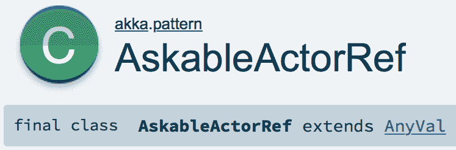

这里是它注入的 API：

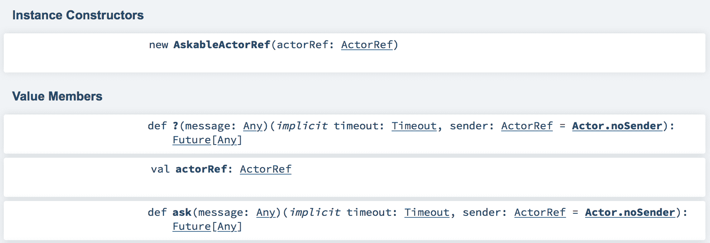

这个模式向一个演员引用发送消息，就像普通的 `!` 操作符一样。然而，它还期望演员对当前演员做出响应。响应消息在 Future 下返回。在底层，这个 ask 方法创建了一个临时子演员，实际上是将消息发送给原始收件人。如果收件人响应这个临时演员，响应将作为 Future 的结果可用。

我们使用 ask 模式，因为我们希望暂停示例的执行，直到管理者报告演员已成功创建。这个示例的第一行模拟了问候管理器没有子演员的情况。在第二行，我们创建子演员并等待它们被创建。下一行将测试如何对非空选择进行演员选择：

```java
_ <- (1 to 10).toList.traverse(_ => Future { gm ! "resolve" })
```

这一行，我们向问候管理器发送了 10 个解决消息。程序执行的输出结果如下：

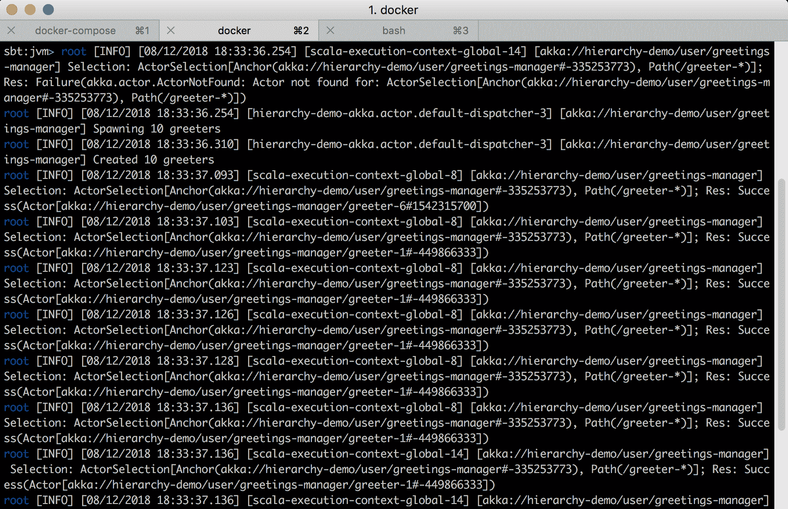

结果是非确定性的。这意味着每次我们向演员发送消息时，我们都不确定哪个演员会被返回。注意，最初返回的是 ID 为`6`的问候者，而在后续调用中，返回的是 ID 为`1`的问候者。

现在，让我们看看这个模式如何与应用程序的其他部分协同工作。首先，让我们探索`SayHello`消息处理示例。在调用`resolveGreeters`之后，我们使用`context become`模式来改变演员处理消息的方式，并将新的`receive`函数设置为`sayingHello`。让我们看看`sayingHello`是如何定义的：

```java
def sayingHello(requester: ActorRef, msg: Any): Receive = {
  case GreetersResolution(Failure(_)) =>
    log.error("There are no greeters. Please create some first with SpawnGreeters message.")
    context become baseReceive
    requester ! JobDone

  case GreetersResolution(Success(_)) =>
    log.info(s"Dispatching message $msg to greeters")
    context.actorSelection(greeterFromId("*")) ! msg
    context become baseReceive
    requester ! JobDone
}
```

`sayingHello`将响应`GreeterResolution`消息。这正是我们从刚才讨论的`Greeter`函数的结果中发送的消息。该消息的定义如下：

```java
case class GreetersResolution(result: Try[ActorRef])
```

因此，该消息的有效负载有两种情况——成功和失败。我们有一个没有注册问候者的失败情况：

```java
case GreetersResolution(Failure(_)) =>
  log.error("There are no greeters. Please create some first with SpawnGreeters message.")
  context become baseReceive
  requester ! JobDone
```

在这种情况下，我们记录一个错误，说明没有问候者。然后，我们将演员的接收逻辑切换回基本状态，并向原始请求者报告工作已完成，以便它知道演员系统已经完成了对请求的处理，以防请求者需要等待此类事件：

```java
case GreetersResolution(Success(_)) =>
  log.info(s"Dispatching message $msg to greeters")
  context.actorSelection(greeterFromId("*")) ! msg
  context become baseReceive
  requester ! JobDone
```

在问候者成功解决的情况下，我们使用演员选择逻辑选择问候者，并将消息发送到这个选择。最后，我们将回到基本处理逻辑，并向请求者报告工作已完成。

现在，让我们看看孵化问候者的逻辑是如何工作的：

```java
def spawningGreeters(requester: ActorRef, numGreeters: Int): Receive = {
  case GreetersResolution(Failure(_)) =>
    self ! GreetersCreationAuthorised

  case GreetersResolution(Success(_)) =>
    log.warning(s"Greeters already exist. Killing them and creating the new ones.")
    context.children
      .filter(c => raw"greeter-\d".r.unapplySeq(c.path.name).isDefined)
      .toList.traverse(_ ? Die)
      .map(GreetersTerminated) pipeTo self

  case GreetersTerminated(report) =>
    log.info(s"All greeters terminated, report: $report. Creating the new ones now.")
    self ! GreetersCreationAuthorised

  case GreetersCreationAuthorised =>
    (1 to numGreeters).foreach { id =>
      context.actorOf(Props[Greeter], greeterFromId(id)) }
    log.info(s"Created $numGreeters greeters")
    requester ! JobDone
    context become baseReceive
}
```

该方法需要一个请求者演员和要创建的问候者数量。让我们看看消息处理器：

```java
case GreetersResolution(Failure(_)) =>
  self ! GreetersCreationAuthorised
```

如果没有注册子演员，我们向自己发送一个`GreetersCreationAuthorised`消息，指定创建问候者是安全的。我们需要这种授权，因为有时创建新的问候者并不安全——即当当前演员仍有旧的问候者存活时。在这种情况下，我们可能会遇到我们想要避免的命名冲突：

```java
case GreetersResolution(Success(_)) =>
  log.warning(s"Greeters already exist. Killing them and creating the new ones.")
  context.children
    .filter(c => raw"greeter-\d".r.unapplySeq(c.path.name).isDefined)
    .toList.traverse(_ ? Die)
    .map(GreetersTerminated) pipeTo self
```

如果解决结果是成功的，我们必须首先杀死这个演员的问候者。我们向日志输出一条警告消息，指定我们将要杀死现有的问候者。之后，我们从演员上下文中获取子代。"children"为我们提供了这个演员所有子代的迭代器。然后我们将使用正则表达式按名称过滤演员：

```java
c => raw"greeter-\d".r.unapplySeq(c.path.name).isDefined
```

上面，`raw`是必需的，这样`\`就不会被视为转义字符，而是按字面意思解释。"r"将调用它的字符串转换为正则表达式对象——这个 API 是 Scala 核心库的一部分。"unapplySeq"尝试将其调用的正则表达式与作为参数传递给它的字符串进行匹配。如果匹配成功，该方法返回`Some`，否则返回`None`。有关更多信息，请参阅`scala.util.matching.Regex`的 Scala 核心 API。

如果我们还有其他子代，只有遵循特定命名约定的问候者会被选中。在这个例子中，我们没有其他子代。然而，仍然是一个好主意来识别目标子代。

在我们过滤出要杀死的演员后，我们向他们发送终止消息：

```java
.toList.traverse(_ ? Die)
```

我们在`traverse`方法的主体中再次使用 ask 模式来产生一个 Future。问候者演员将响应一条消息，报告他们已被终止。这允许我们异步阻塞执行，一旦所有问候者都死亡，再继续。我们可以通过使用 ask 模式跟踪单个演员的终止，然后使用`traverse`方法将返回的 Futures 组合成一个 Future 来实现这一点。一旦所有演员都终止，这个 Future 将成功。

最后，我们将 Future 的内容包装到`GreetersTerminated`消息中。接下来，让我们看看`GreetersTerminated`分支：

```java
case GreetersTerminated(report) =>
  log.info(s"All greeters terminated, report: $report. Creating the new ones now.")
  self ! GreetersCreationAuthorised
```

我们将终止报告输出到日志，并发送授权消息到`self`以开始创建问候者的过程：

```java
case GreetersCreationAuthorised =>
  (1 to numGreeters).foreach { id =>
    context.actorOf(Props[Greeter], greeterFromId(id)) }
  log.info(s"Created $numGreeters greeters")
  requester ! JobDone
  context become baseReceive
```

`GreetersCreationAuthorised`是一个分支，只有当创建新的问候者是安全的时候才会执行。它将从循环中创建新的问候者：

```java
(1 to numGreeters).foreach { id =>
  context.actorOf(Props[Greeter], greeterFromId(id)) }
```

在这里，`actorOf`的第二个参数定义如下：

```java
def greeterFromId(id: Any) = s"greeter-$id"
```

接下来，我们通知请求者创建问候者的工作已完成。最后，我们将上下文切换回`baseReceive`。现在，让我们编写一个测试程序来看看示例是如何工作的：

```java
implicit val timeout: Timeout = 3 seconds
val system = ActorSystem("hierarchy-demo")
val gm = system.actorOf(Props[this.GreetingsManager], "greetings-manager")

def printState(childrenEmpty: Boolean, isHelloMessage: Boolean) =
  Future { println(s"\n=== Children: ${if (childrenEmpty) "empty" else "present"}, " +
    s"Message: ${if (isHelloMessage) "SayHello" else "SpawnGreeters"}") }

Await.ready(for {
  _ <- printState(true, true)
  _ <- gm ? SayHello("me")

  _ <- printState(true, false)
  _ <- gm ? SpawnGreeters(3)

  _ <- printState(false, false)
  _ <- gm ? SpawnGreeters(3)

  _ <- printState(false, true)
  _ <- gm ? SayHello("me")
} yield (), 5 seconds)
```

我们首先向一个空的问候者管理器发送一条问候消息。然后，我们用相应的消息生成问候者。然后我们再次发送`SpawnGreeters`消息，看看问候者管理器将首先杀死现有的问候者，然后才生成新的问候者。最后，我们再次发送`SayHello`消息。

我们有两个消息和两个可能的状态，即管理者的孩子问候者的可能状态。这给我们提供了四种可能的组合。示例中的每条消息都检查这些情况中每一个的行为。注意，我们是如何使用询问模式来异步阻塞执行流程，直到演员响应已完成操作。这确保了我们不会过早地发送消息。

消息的输出如下所示：

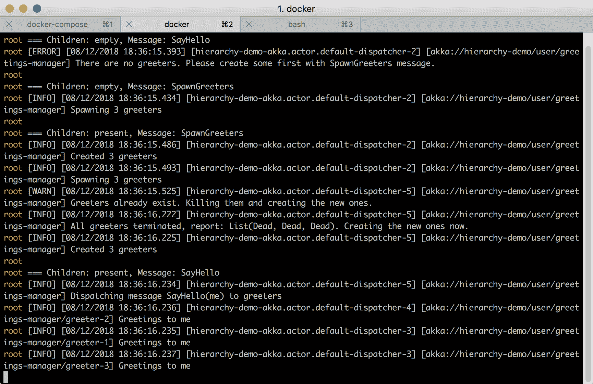

# 摘要

在本章中，我们讨论了 Akka 框架，它是 Scala 中面向演员编程的事实标准。我们学习了如何创建新的演员，如何定义它们，以及如何运行基于演员的应用程序。我们看到了演员是如何组织成演员系统，以及它们如何在层次结构中协同工作的。此外，我们还简要讨论了 Akka 为与演员和未来对象一起工作提供的模式。

在下一章中，我们将通过查看使用此模型实现的示例应用程序，来了解演员模型在实际中的应用。

# 问题

1.  Akka 实现中的演员模型原则是什么？

1.  你如何在 Akka 中定义一个演员？

1.  你如何创建一个新的演员？

1.  你如何向演员发送消息？

1.  询问模式是什么？你如何使用它？

1.  管道模式是什么？你如何使用它？
