# 用例 - 并行网络爬虫

在上一章中，我们讨论了 actor 模型以及你可以用来用 actor 编程的框架。然而，actor 模型是一种范式，就像函数式编程一样。原则上，如果你从一个语言中了解了 actor 模型，即使另一个语言没有支持 actor 模型的框架，你仍然可以使用它。这是因为 actor 模型是一种关于并行计算推理的方法，而不是一些特定语言的工具集。

这种状态，就像函数式编程一样，有其自身的优点和缺点。优点是，如果你依赖于概念，那么你就不依赖于语言。一旦你了解了某个概念，你就可以在任何编程语言中使用它，并且能够使用它们。然而，学习曲线很陡峭。正是因为它全部关于范式和方法，仅仅安装一个库并浏览其文档后就开始使用，就像许多其他类似库或通用语言那样，是不够的。由于它全部关于范式转变，你需要付出一些学习努力来理解范式以及如何在实践中使用它。

在上一章中，我们建立了一套基于 actor 模型提供的工具集的理论基础，并讨论了 actor 模型的主要概念以及如何在实践中使用它。然而，由于它是一套理念而非仅仅是一个库，因此有必要培养对它工作原理的直觉。培养对新范式直觉的最好方法就是查看一些实际例子，这些例子将展示这个范式在实际中的应用。

因此，在本章中，我们将探讨 actor 模型可以应用的一个实际例子。我们将探讨网络爬虫的例子。

在本章中，我们将涵盖以下主题：

+   问题陈述

+   顺序解决方案

+   使用 Akka 的并行解决方案

# 问题陈述

在本章中，我们将解决构建网络爬虫的问题。网络爬虫在索引和搜索网络领域非常重要。

# 网络的图结构

所有网站都可以想象成页面的图。每个页面都包含一些 HTML 标记和内容。作为内容的一部分，大多数网页都包含指向其他页面的链接。由于链接是用来从一个页面跳转到另一个页面的，因此我们可以将网络可视化为一个图。我们可以将链接可视化为从节点到节点的边。

给定整个互联网的这种模型，我们可以解决在网络上搜索信息的问题：

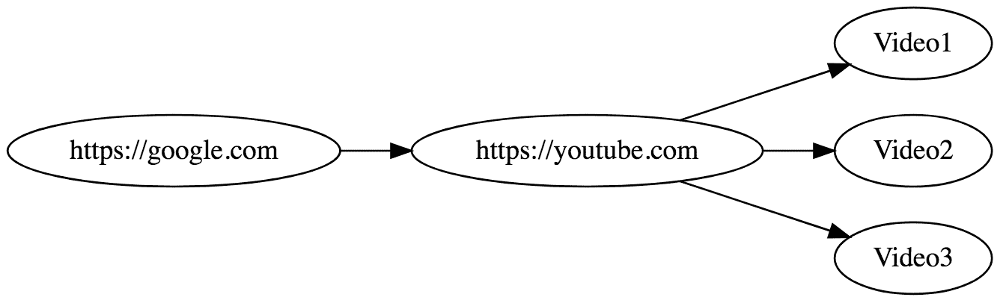

我们在讨论搜索引擎面临的问题。搜索引擎的目标是索引存储在网上的信息，并设计算法，根据最终用户的查询高效地找到所需的页面——图中的节点。索引这些节点以及将用户请求与节点中存储的信息匹配所需的算法很复杂，我们不会在本章中讨论它们。通常，这些算法涉及高级机器学习和自然语言处理解决方案来理解和评估页面中存储的内容。机器学习和自然语言处理领域的最聪明的大脑在为像 Google 这样的公司处理搜索任务。

因此，在本章中，我们将讨论一个搜索引擎也面临但更容易解决的问题。在索引存储在网上的信息之前，需要收集这些信息。收集信息是一项遍历所有页面图并存储内容到数据库中的任务。网络爬虫的任务正是从某个节点开始遍历图，通过链接跟随到其他节点。在本章的示例中，我们不会将网站信息存储到数据库中，而是将重点放在网络爬虫任务上。

# 从图中收集信息

从图中收集信息可以表示如下：

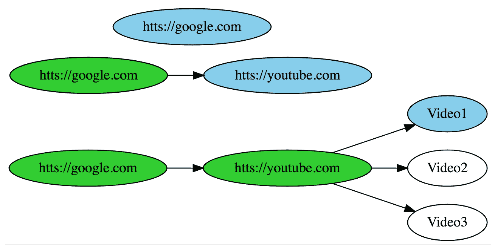

在前面的示意图中，蓝色节点是当前正在处理的节点，绿色节点是已经处理过的节点，白色节点是尚未处理的节点。这个前面的任务可以如下实现：

1.  指定您希望从哪个 URL 开始，即遍历将开始的起始节点。

1.  爬虫将通过向其发出`GET`请求来访问 URL，并接收一些 HTML：

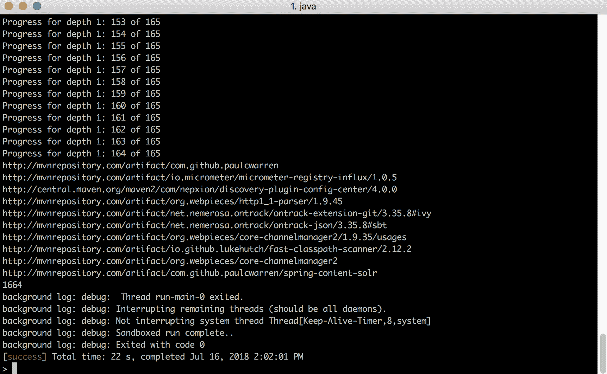

1.  在接收到此 HTML 文本后，爬虫将提取当前节点的边缘——指向其他节点的链接。这些链接在 HTML 标记中定义良好。它们被指定如下：

```java
<a herf="link_address">link_text</a>
```

因此，一旦我们有了 HTML 标记，我们就可以查找与先前模式匹配的内容。之后，我们可能想要将页面上展示的所有链接收集到一个单独的集合结构中，例如，一个列表。一旦我们有了这个，我们可能想要对当前节点链接的每个节点递归地执行相同的操作。

# 任务并行性

之前选择这个任务作为本章的例子，因为它本质上是可以并行化的。基本上，每当您有一系列相互之间不依赖的任务时，将任务并行化可能是一个好主意。在我们的例子中，前面的任务可以很好地被构想为一组独立的操作。单个操作单元是访问 URL 的任务，抽象出所有通过该 URL 页面链接的其他节点，然后对这些 URL 递归地执行相同的任务。

这使得我们的爬虫示例非常适合并行 actor 应用。对于每个 URL 运行所有这些任务可能是非常耗时的，因此应用一些策略到任务上会更为高效。即使在单核 CPU 计算机上，即使大多数任务以模拟并行方式处理，操作仍然会比顺序情况高效数十倍。这是因为从互联网或`GET`请求请求 HTML 时涉及大量的等待。

在接下来的图中，您可以看到一个从单个线程执行过程的请求示例：

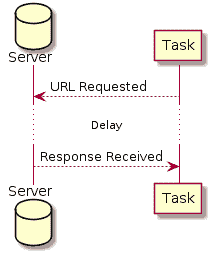

所以，如您所见，线程发出请求，然后等待响应的产生。根据您自己的浏览经验，您很容易地说，有时一个网站的响应可能需要几秒钟才能到达。所以本质上，这些秒数将会被线程浪费，因为它将在这个任务上阻塞，而此时处理器将无法做任何有用的工作。

即使您只有一个核心，即使您只有模拟并行化的选择，如果当一个线程等待请求到达时，另一个线程发出请求或处理已经到达的响应，处理器仍然可以更有效地被利用。

如您从图中可以看出，请求的发出效率要高得多，而且当一个线程等待请求并休眠时，处理器正忙于处理其他有实际工作要做的线程：

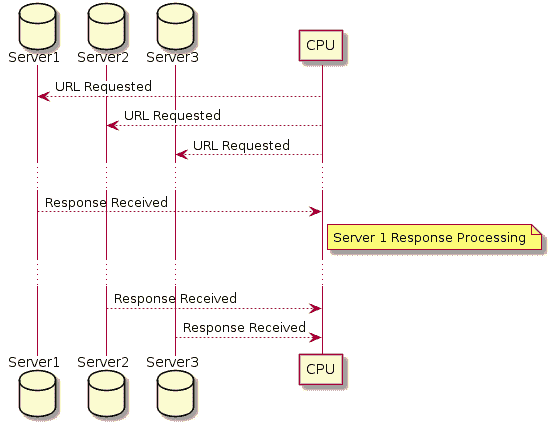

通常，这种阻塞情况可能非常常见。例如，您可能有一些操作需要等待数据库给出响应，或者等待外部世界传来的消息。所以即使在模拟并行的情况下，这些情况也可以大大加快速度。不用说，大多数现代机器都在多核的环境中工作，这将极大地加快执行速度。

现在我们已经知道了任务的精确规格，并且我们知道了为什么并行化这个任务是有意义的，让我们动手看看一些实际的实现。然而，在我们深入到基于 actor 的任务实现的细节之前，让我们首先看看如何顺序地实现它，这样我们就有了一个基准来工作。

# 顺序解决方案

首先，让我们看看一旦构建了这个解决方案，我们希望如何使用它。同时，让我们看看我们期望从解决方案中得到的确切输出：

```java
val target = new URL("http://mvnrepository.com/")
val res = fetchToDepth(target, 1)
 println(res.take(10).mkString("\n"))
 println(res.size)
```

在前面的代码中，我们执行以下操作。首先，我们希望能够用 Java 原生 URL 对象来定义我们的 URL。在这个例子中，我们使用 Maven 仓库网站作为爬取目标。[mvnrepository.com](http://mvnrepository.com)是一个提供对所有 Maven 包进行简单搜索的网站。

之后，我们调用`fetchToDepth`。这是应该为我们实际工作的方法，并实际爬取网站以获取链接。作为第一个参数，我们提供一个我们想要处理的 URL。作为第二个参数，我们提供一个你想要搜索的图的深度。

深度的概念是为了避免无限递归。网络是一个非常互联的地方。因此，当我们从一个节点开始，并开始递归地进入与之相连的节点时，到达终端节点（即没有进一步链接的节点）可能需要非常长的时间。对于大多数网站来说，这样的查找可能是无限的，或者需要不合理的时间来完成。因此，我们希望限制我们的查找深度。其语义是，对于算法搜索的每个边，深度将减少一个。一旦深度达到零，算法将不会尝试跟随任何进一步的边。

函数执行的结果将是一个集合。确切地说，是从该网站收集到的链接集合。然后，我们取出前 10 个链接并将它们输出到标准输出，每行一个链接。同时，我们输出系统成功提取的总链接数。我们不打印所有链接，因为会有太多。

我们希望得到以下输出：


接下来，让我们探索前面目标的顺序实现。让我们看看`fetchToDepth`：

```java
def fetchToDepth(url: URL, depth: Int, visited: Set[URL] = Set()): Set[URL]
```

如您所见，该函数接受三个参数。其中两个是我们之前已经见过并在我们的示例 API 使用中讨论过的。第三个是爬虫已经访问过的 URL 集合。为什么我们会有这样一个集合？为什么爬虫需要它？如果我们不存储所有已访问链接的集合，它会如何表现？

实际上，任何类似的图遍历情况都必须存储相同的集合。这里的问题是图中存在循环。

在下面的图中，您可以看到在网页爬虫应用程序中如何出现具有循环的图：

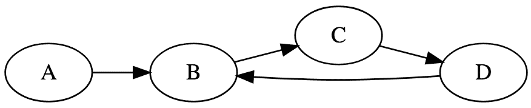

仅当网站**A**引用网站**B**，然后网站**B**又引用网站**A**时，才会出现循环。如果图中存在循环，那么如果我们的遍历算法在不跟踪已访问节点的情况下尝试遍历它，那么它可能会进入无限循环。因此，我们需要跟踪已访问的节点。在`fetchToDepth`函数中要做的第一件事就是获取指定的 URL：

```java
val links = fetch(url).getOrElse(Set())
```

我们使用以下函数来获取指定的 URL：

```java
def fetch(url: URL): Option[Set[URL]] = Try {
  Jsoup.connect(url.toString)
    .get
    .getElementsByAttribute("href")
    .asScala.map( h => new URL(url, h.attr("href")) ).toSet
}.toOption
```

`fetch`函数是一个接收 URL 并输出`Option[Set[URL]]`的函数，这是包含此页面链接的数据结构。

在这个函数内部，除了副作用之外，并没有真正值得注意的事情发生。我们使用`Try`来捕获错误的副作用。然后，我们将`Try`转换为`Option`，因为我们对错误类型不感兴趣，如下所述。

这个函数的逻辑很简单。我们使用一个流行的 Java 库，称为`Jsoap`，来连接给定的 URL，发出 GET 请求，检索所有具有包含链接的`href`属性的元素，然后通过提取它们的链接来映射结果元素。

逻辑被封装在`Try`中，稍后将其转换为`Option`。为什么会有这样一个涉及`Try`和`Option`的系统？正如我们在本书的第一部分所学，`Try`和`Option`都是效果类型。效果类型背后的整个想法是抽象掉可能发生的某些副作用。由于我们的业务逻辑被封装在`Try`效果中，因此`Try`抽象掉的一些副作用可能会在这个逻辑中发生。

`Try`抽象掉了错误或异常的可能性。实际上，当我们向远程服务器发出请求时，可能会发生很多错误。例如，请求可能会超时，我们可能会失去互联网连接，或者服务器可能会返回错误的状态码。

在大规模数据处理的情况下，一些数据节点不可避免地会循环。这意味着在执行之前讨论的爬取操作时，我们可以几乎肯定有时它会失败。如果你设计了一个没有考虑到这种错误的函数，会发生什么？很可能会遇到异常，并在数据集中途失败。这就是为什么容错性是这类系统的一个关键属性。

在前面的例子中，容错是通过将错误的可能性封装在`Try`效果类型中实现的。这里要注意的另一件事不仅是`Try`类型，还有它被转换成了`Option`。`Option`表示一个函数可能或可能不产生结果。在从`Try`转换为`Option`的上下文中，如果`Try`是成功的尝试，它会被映射到`Some`；如果它是失败的，它会被映射到`None`。在失败的情况下，当我们把`Try`转换为`Option`时，一些关于已发生错误的详细信息会丢失。这一事实反映了我们不在乎可能发生的错误类型的态度。

这种态度需要进一步解释，因为它通常在我们有意丢弃数据的地方都会出现。我们讨论过，在这种大量数据处理中，错误是不可避免的。当然，如果您的算法能够优雅地捕获和处理它将遇到的错误中的大多数，那将是件好事，然而，这并不总是可能的。算法最终会遇到错误这一事实是无法避免的，因为算法不是在处理一些虚拟数据，而是在处理现实世界的网站。无论何时您处理现实世界的数据，错误都是生活的事实，您无法计划处理发生的每一个可能的错误。

因此，构建一个肯定会遇到错误的程序的正确方式是容错。这意味着我们构建程序时，就像它肯定会遇到错误一样，并计划从任何错误中恢复，而不实际指定错误类型。我们在这里将`Try`转换为`Option`的事实反映了我们对错误的态度。这种态度是，我们不在乎执行过程中可能发生的哪种错误，我们只关心错误可能发生。

容错是 Akka 设计的基本原则之一。Akka 是以容错和弹性为前提构建的，这意味着演员被设计成肯定会遇到错误，Akka 为您提供了一个框架来指定如何从它们中恢复。

现在让我们回到`fetchToDepth`方法中的`fetch`行，看看这种态度在我们的示例逻辑中是如何具体体现的：

```java
fetch(url).getOrElse(Set())
```

让我们回到我们的`fetchToDepth`示例。在我们对一个给定的 URL 执行影响语句之后，我们也在它上面执行了一个`getOrElse`调用。`getOrElse`是 Scala `Option`上定义的一个方法，其签名如下：

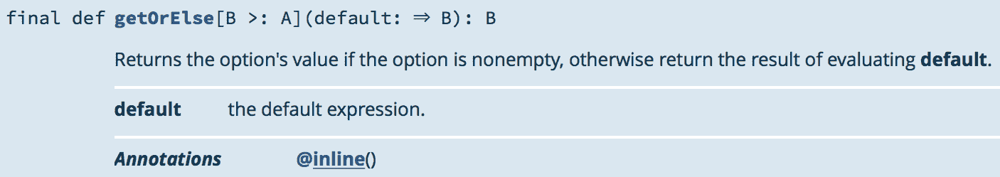

所以基本上，这个方法试图从`Option`中提取一个值。如果值不在`Option`中，它将输出方法提供的默认值。`getOrElse`等同于以下代码：

```java
type A
val opt: Option[A]
val default: A

opt match {
  case Some(x) => x
  case None => default
}
```

因此，现在我们已经从给定的链接中提取了一组链接。让我们现在看看在我们的顺序示例中它是如何遍历的：

```java
if (depth > 0) links ++ links
 .filter(!visited(_))
 ./*...*/
```

在前面的代码中，你可以看到`fetchToDepth`方法中的代码块。首先，我们检查深度是否大于`0`。之前我们讨论了如何通过指定深度约束来避免无限执行。

在`if`检查之后的第一个语句是当前链接累加器，即`links`变量，它与一些更大的右侧语句合并。在上面的代码片段中，只展示了这个语句的一部分，我们将一步一步地讨论它。整体来看，这个语句递归地将`fetchToDepth`应用于`links`集合中的所有链接。

这意味着`++`操作符的右侧从我们检索到的集合中获取每个链接，并提取其页面中存在的所有链接。这必须递归地完成。但首先，我们需要清理当前链接的所有抽象 URL 集合，以确保它不包含我们之前访问过的链接。这是为了解决图中循环的问题：

```java
.toList
.zipWithIndex
```

接下来，我们通过调用`toList`和`zipWithIndex`方法进一步转换得到的集合。基本上，这两个方法是为了日志记录目的而需要的。在数据处理操作中，你希望有一些报告来跟踪操作。在我们的案例中，我们希望给每个将要访问的链接分配一个数字 ID，并将我们正在访问具有给定 ID 的链接的事实记录到标准输出中。`zipWithIndex`的签名如下：

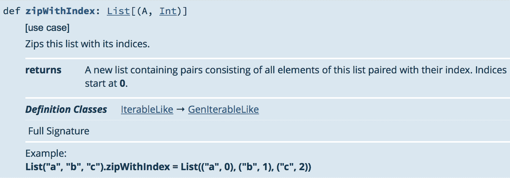

所以基本上，一个元素列表`A`变成了一个`A`和`Int`对的列表：

```java
.foldLeft(Set[URL]()) { case (accum, (next, id)) =>
 println(s"Progress for depth $depth: $id of ${links.size}")
 accum ++ (if (!accum(next)) fetchToDepth(next, depth - 1, accum) else Set())
 }
```

在前面的代码中，你可以看到实际执行每个给定 URL 处理的逻辑。我们使用了一个`foldLeft`方法。让我们看看它的签名：

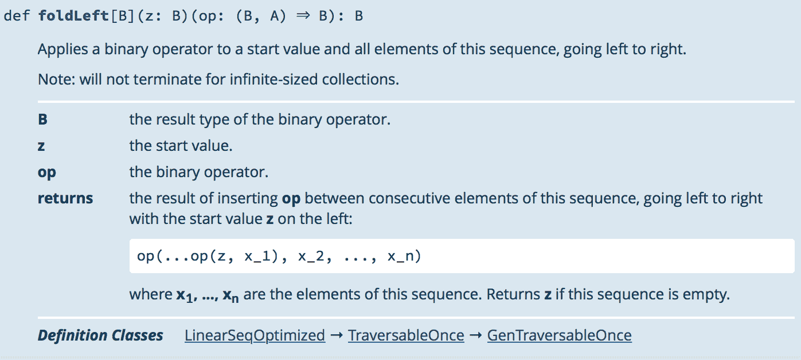

基本上，这个方法将你的整个集合折叠成一个单一值。为了更简单地说明其用法，考虑以下代码块：

```java
(1 to 10).toList.foldLeft(0) { (total, nextElement) => total + nextElement }
```

所以基本上，我们从一个空的累加器开始，并指定在作用域内给定一个累积值时对每个元素要做什么。列表的后续每个元素都必须添加到累加器中。

回到我们的`fetchToDepth`示例，使用`foldLeft`的理由如下。最终，我们有一个链接集合，并且对于这个集合的每个元素，我们需要计算它链接到的 URL 集合。然而，我们感兴趣的是包含我们刚刚调用的所有 URL 的所有链接的合并集合。因此，这个例子类似于整数加法的例子。只不过在这里，我们是在一组链接集合上计算并集。

现在我们来看看作为`foldLeft`第二个参数传递的代码块。首先，我们执行一个日志语句。然后，我们执行计算属于当前 URL 的链接的步骤。然后，我们将这些链接添加到组合累加器中。

注意，在实际上爬取链接之前，我们执行一个检查，看看它是否已经包含在累加器中。只有当它不包含在当前累加器中时，才会进行爬取。这个检查用于防止重复工作。如果链接已经包含在累加器中，这意味着它已经被算法处理过了，因为这是一个图的深度优先遍历。所以我们不需要再次处理它。

此外，请注意，我们使用对 `fetchToDepth` 函数的递归调用进行处理，深度减少一个：

```java
else links
```

最后，如果深度为 `0`，我们将返回从当前页面提取的链接集合。这意味着我们将在此处停止算法。

`fetchToDepth` 函数的完整代码如下：

```java
def fetchToDepth(url: URL, depth: Int, visited: Set[URL] = Set()): Set[URL] = {
    val links = fetch(url).getOrElse(Set())

    if (depth > 0) links ++ links
      .filter(!visited(_))
      .toList
      .zipWithIndex
      .foldLeft(Set[URL]()) { case (accum, (next, id)) =>
        println(s"Progress for depth $depth: $id of ${links.size}")
        accum ++ (if (!accum(next)) fetchToDepth(next, depth - 1, accum) else Set())
      }
      .toSet
    else links
  }
```

接下来，让我们讨论一下对前面问题的并行解决方案可能的样子。

# 使用 Akka 的并行解决方案

在解决并行化我们的爬虫的问题之前，让我们讨论我们将如何处理它的策略。

# 策略

我们将使用演员树来建模创建演员系统的难题。这是因为任务本身自然形成了一个树。

我们已经讨论了所有互联网上的链接和页面如何构成一个图。然而，在我们的例子中，我们还讨论了在处理和遍历这个图时两个不希望出现的情况——循环和工作重复。所以，如果我们已经访问了一个特定的节点，我们就不会再访问它了。

这意味着在处理时，我们的图变成了一个树。这意味着当你从子节点向下遍历时，你不能从子节点到达父节点。这个树可能看起来如下：

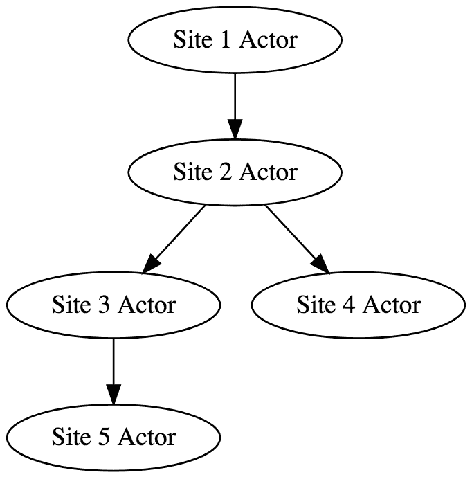

我们将与根级节点进行通信。所以基本上，我们将向此节点发送一个我们将从其开始爬取的链接，然后此演员将爬取它。一旦从这个链接中提取出所有链接，它将为每个这样的链接生成一个子演员，该子演员将对该链接执行相同的操作。这是一个递归策略。

这些工作演员将向其父演员报告结果。最底层演员的结果将通过树形结构传播到顶层演员。

在这个实现中，请注意我们并没有限制我们对演员的使用。每个链接都由一个专门的演员处理，我们并不真正关心将生成多少演员。这是因为演员是非常轻量级的原语，你不应该害怕慷慨地生成演员。

让我们看看如何实现这个策略。

# 实现

首先，让我们看看我们想要的 API 及其用法：

```java
val system = ActorSystem("PiSystem")
val root = system actorOf Worker.workerProps

(root ? Job(new URL("http://mvnrepository.com/"), 1)).onSuccess {
  case Result(res) =>
  println("Crawling finished successfully")
  println(res.take(10).mkString("\n"))
  println(res.size)

}
```

在前面的代码中，你可以看到并行化演员应用程序的主要方法。正如你所看到的，我们创建了一个演员系统和根级别的工人演员。想法是将所有处理演员表示为一个单一的类，`Worker`。单个工人的任务是处理单个 URL 并产生额外的工人来处理从中提取的链接。

接下来，你可以看到一个查询演员的示例。首先，我们有以下这一行：

```java
(root ? Job(new URL("http://mvnrepository.com/"), 1)).onSuccess {
```

通常，你使用 `!` 操作符向演员发送消息。然而，这里我们使用 `?`，因为我们正在使用询问模式。本质上，`?` 是向演员发送消息并等待它以另一个消息响应的行为。普通的 `!` 返回 `Unit`，然而，`?` 询问模式返回一个可能响应的 `Future`：

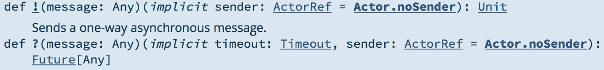

因此，本质上，我们向根演员发送一个 `Job` 消息，并且我们期望在 `Future` 中得到一些响应。

`Job` 是一个普通的案例类，它指定了我们将要抓取的 URL 以及将要下探的深度。这两个参数的语义与顺序示例中的相同。

之后，我们在 `Future` 上调用 `onSuccess` 方法来设置回调。所以，一旦结果到达我们的位置，我们将向标准输出报告。

现在，让我们看看工作演员是如何实现以及它是如何工作的：

```java
def receive = awaitingForTasks
```

在前面的代码中，`receive` 方法是用另一个称为 `awaitingForTasks` 的方法实现的。这是因为我们打算根据发送给演员的消息更改 `receive` 的实现。基本上，我们的演员将处于几个状态，在这些状态下它将接受不同的消息集合并以不同的方式对它们做出反应，但想法是将每个状态封装在单独的回调方法中，然后在这些回调的实现之间切换。

让我们看看演员的默认状态，`awaitingForTasks`：

```java
def awaitingForTasks: Receive = {
 case Job(url, depth, visited) =>
 replyTo = Some(sender)

 val links = fetch(url).getOrElse(Set()).filter(!visited(_))
 buffer = links
/*...*/
```

`awaitingForTasks` 指定了当演员接收到 `Job` 消息时应该如何反应。消息应该告诉演员开始以特定深度爬取某个 URL。此外，正如你所看到的，我们将所有已访问的节点存储在 `visited` 集合中。`Visited` 是所有已访问 URL 的集合，它的语义和动机与顺序示例中的相同，以避免重复不必要的操作。

之后，我们设置了 `replyTo` 变量。它指定了任务的发送者，该发送者有兴趣接收我们爬取的结果。

在设置这个变量之后，我们开始爬取过程。首先，我们使用从顺序示例中已经熟悉的 `fetch` 方法来获取给定 URL 页面上所有存在的链接集合，并过滤掉我们已访问的链接。

之后，类似于我们的顺序示例，我们检查深度是否允许进一步下降，如果允许，我们将按照以下方式执行链接的递归处理：

```java
if (depth > 0) {
  println(s"Processing links of $url, descending now")

  children = Set()
  answered = 0

  for { l <- links } dispatch(l, depth - 1, visited ++ buffer)
  context become processing
}
```

首先，我们将定义一个空的子演员集合，这样我们就可以跟踪它们的处理情况，并根据子演员的状态变化来控制我们自己的状态。例如，我们必须知道何时确切地向请求演员报告工作结果。这必须在所有子演员完成工作后只做一次。

此外，我们将 `answered` 变量设置为 `0`。这是一个跟踪成功回复此演员处理结果的演员数量的变量。想法是，一旦这个指标达到 `children` 大小，我们将用处理结果回复 `replyTo` 演员最有趣的方法是 `dispatch`：

```java
def dispatch(lnk: URL, depth: Int, visited: Set[URL]): Unit = {
  val child = context actorOf Worker.workerProps
  children += child
  child ! Job(lnk, depth, visited)
}
```

因此，`dispatch` 创建一个新的工作演员并将其添加到所有子演员的集合中，最后，它们被要求对一个给定的 URL 执行处理工作。为每个单独的 URL 初始化一个单独的工作演员。

最后，让我们关注一下 `Job` 子句中的 `context become processing` 行。本质上，`context become` 是一个切换此演员 `receive` 实现的方法。之前，我们有一个 `awaitingForTasks` 的实现。然而，现在我们将它切换到 `processing`，我们将在本章中进一步讨论。

但在讨论它之前，让我们看看我们的 `if` 语句的 `else` 分支：

```java
else {
 println(s"Reached maximal depth on $url - returning its links only")
 sender ! Result(buffer)
 context stop self
}
```

因此，正如我们所见，一旦达到一定的深度，我们将返回收集到的链接到请求演员的缓冲区中。

现在，让我们看看演员的 `processing` 状态：

```java
def processing: Receive = {
  case Result(urls) =>
    replyTo match {
      case Some(to) =>
        answered += 1
        println(s"$self: $answered actors responded of ${children.size}")
        buffer ++= urls
        if (answered == children.size) {
          to ! Result(buffer)
          context stop self
        }

      case None => println("replyTo actor is None, something went wrong")
    }
}
```

如您所见，一旦这个演员成为处理演员，它将响应 `Result` 消息，并且它将停止响应 `Job` 消息。这意味着一旦您向演员发送了 `Job` 消息并且它开始处理它，它将不再接受任何其他工作请求。

在 `processing` 的主体中，我们确保 `replyTo` 演员被设置。原则上，一旦我们达到这个点，它应该始终被设置。然而，`replyTo` 是一个 `Option`，处理可选性的好方法是有一个 `match` 语句，该语句明确检查这个 `Option` 是否已定义。你永远不知道这样的程序中可能会出现什么错误，所以最好是安全第一。

`processing` 的逻辑如下。`Result` 是一个应该从其子演员到达此演员的消息。首先，我们将回答此演员的演员数量增加。我们通过 `answered += 1` 来做这件事。

在一些调试输出之后，我们将子演员发送给此演员的有效负载添加到此演员收集的所有链接集合中——`buffer ++ = urls`。

最后，我们检查所有子演员是否都已回复。我们通过检查`answered`计数器是否等于所有子演员的大小来实现这一点。如果是，我们就向请求的演员发送我们收集的链接，`to ! Result(buffer)`，然后最终停止此演员，因为它没有其他事情可做，`context stop self`。

运行此演员系统的结果如下：

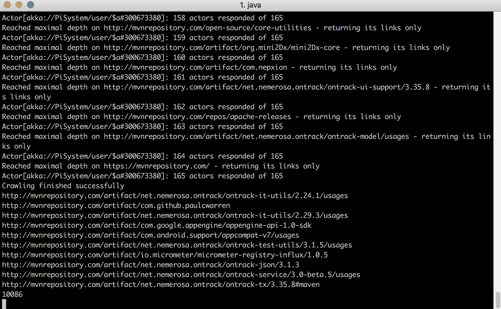

# 注意事项

与基于同步的应用程序相比，虽然演员应用程序编写和推理更为方便，但它们仍然比普通的顺序应用程序复杂得多。在本节中，我们将讨论一些应用程序的注意事项。

# 访问过的链接

这里最具影响力的注意事项是跟踪已访问演员的局部性。如果你还记得，在顺序示例中，我们使用`foldLeft`函数来累积每个 URL 处理的结果，并且我们始终有一个完整、最新的所有 URL 列表，这是整个应用程序收集的。这意味着递归爬取调用总是对应用程序迄今为止收集的内容有一个全面的了解。

在图中，我们看到一个使用`foldLeft`进行处理的顺序示例：

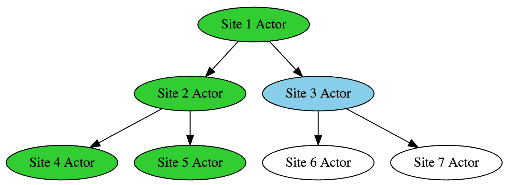

所有已处理的节点都用绿色突出显示，当前 URL 用蓝色突出显示。当前 URL 包含之前收集的所有链接列表。因此，它不会处理它们。这种情况是可能的，因为处理是顺序进行的。

然而，以下图中描述的并行示例情况则不同：

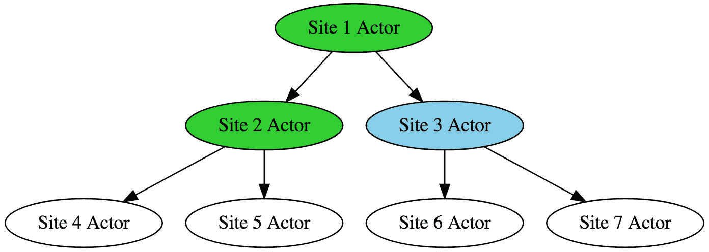

在前面的图中，蓝色部分显示了当前节点。绿色节点是当前节点所了解的所有节点。请注意，尽管它了解其兄弟节点，但它并不了解处理这些兄弟节点的结果。这是因为处理是并行的。在顺序示例中，我们有一个从左到右的深度优先树遍历。然而，在并行示例中，子节点是相互并行处理的。这意味着一个节点可能了解其兄弟节点的信息。然而，它将不会了解从其兄弟节点收集的结果。这是因为这些结果是在此节点计算其自身结果的同时并行收集的。而且我们不知道哪个节点会先完成。这意味着前面的应用程序在消除冗余工作方面并不理想。

存储演员访问过的所有链接的问题是一个经典的共享可变资源问题。在演员模型中解决这个问题的一个方案是创建一个单独的演员，该演员有一个列表，列出了所有已经访问过且不需要进一步访问的链接。因此，在通过树下降之前，每个演员都应该就是否处理某些链接的问题咨询该演员。

你应该考虑的另一个注意事项是容错性。

# 容错性

为了使示例简单，在并行示例中，我们使用了来自顺序示例的`fetch`函数来获取某个 URL 的内容：

```java
val links = fetch(url).getOrElse(Set()).filter(!visited(_))
```

这个函数返回`Option`的动机是为了在顺序示例中的容错性——如果结果无法计算，我们返回`None`。然而，在演员设置中，Akka 为你提供了一个框架来指定如果演员失败时应该做什么。所以原则上，我们可以进一步改进我们的示例，使用一个专门的`fetch`函数，这个函数能够完美地抛出异常。然而，你可能想要指定演员级别的逻辑，比如如何重启自身以及如何通过这种紧急情况保持其状态。

# 计数响应的演员

在示例中，我们计算了响应演员的子演员数量，以确定何时演员准备好对其父演员做出响应：

```java
answered += 1
// ...
if (answered == children.size) {
  to ! Result(buffer)
  context stop self
}
```

这种场景可能会产生某些不希望的结果。首先，这意味着系统响应所需的时间等于最深和最慢的链接被解决和处理所需的时间。

这种推理背后的逻辑如下。`processing`回调确定何时认为处理树中的一个节点已完成：

```java
if (answered == children.size)
```

因此，一个节点完成，当且仅当其最慢的子节点完成。然而，我们应该记住，我们正在处理现实世界的处理，我们不应该忘记现实世界中可能发生的所有副作用。我们讨论的第一个副作用是失败和错误。我们通过设计我们的应用程序以具有容错性来处理这种副作用。另一个副作用是时间。仍然可能存在一些页面需要非常长的时间才能获取。因此，我们绝不能忘记这种副作用可能发生，并且可能需要制定策略来应对这种副作用。

一种直观的策略是超时。就像在容错性的情况下，每当一块数据处理时间过长时，我们可以丢弃这块数据。想法是，我们仍然有足够的数据，对于许多应用来说，并不需要 100%地召回所有目标数据。

具体来说，你可能想安排一个消息发送到当前演员。在收到此消息后，演员将立即将其所有结果发送回`replyTo`演员并终止自己，以便它不会对任何后续消息做出反应。对此类消息的反应可能是递归地杀死所有子演员，因为它们不再需要存在，因为它们将无法通过父演员报告此错误数据。另一种策略可能是递归地将此超时消息传播到子演员，而不会立即杀死它们。然后，子演员将立即返回它们已经完成的任何进度并终止。

# 现实世界的副作用

在本小节中，我们已经看到了两种副作用的实例——错误和时间。现实世界的本质是，你往往不知道会遇到哪些副作用。

这些副作用可能包括限制发送到特定域的请求数量的必要性，因为某些网站倾向于阻止发送过多请求的实体，或者我们可能想使用代理服务器来访问其他方式无法访问的网站。某些网站可能通过 Ajax 存储和检索数据，常规的抓取技术通常不起作用。

所有这些场景都可以建模为它们自己的副作用。当与实际应用一起工作时，始终要考虑你特定场景中可能出现的副作用。

一旦你决定了将要遇到什么，你就能决定如何处理和抽象副作用。你可以使用的工具包括演员系统的内置功能，或者我们在本书前半部分讨论的纯函数编程的能力。

# 概述

在本章中，我们探讨了使用 Akka 开发应用程序。首先，我们开发了一个针对该问题的顺序解决方案。然后，我们确定了该解决方案的独立子任务，并讨论了如何并行化它们。最后，我们使用 Akka 设计了一个并行解决方案。

此外，我们还讨论了在开发此类应用时可能会遇到的一些注意事项。其中大部分都与可能发生的副作用有关，以及构建并行应用时演员模型特有的特殊性。
