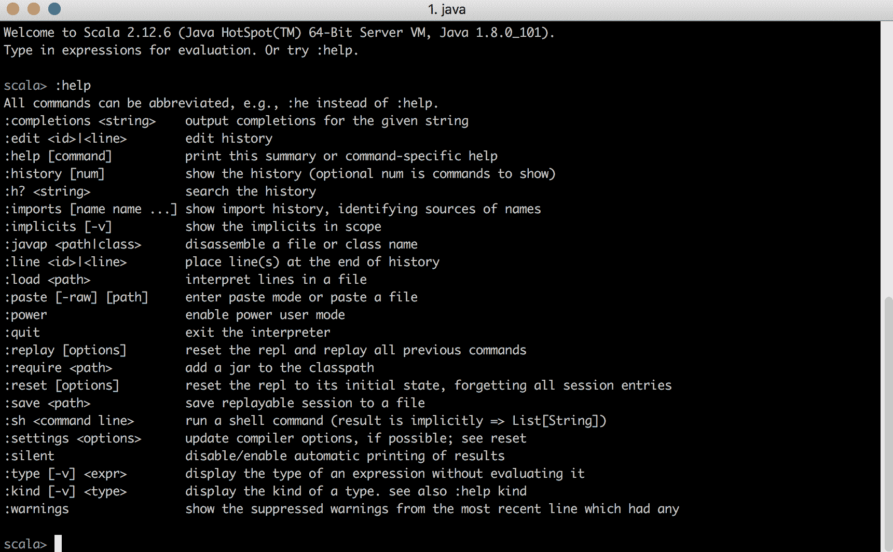

# 第十四章：Scala 简介

本书广泛使用 Scala 作为其主要示例语言。在本章中，我们将简要概述语言基础。首先，我们将从将其作为示例语言的动机开始。

本章涵盖以下主题：

+   使用 Scala 的动机

+   变量和函数

+   控制结构

+   继承模型

本章旨在为本书的其余部分提供一个快速介绍，不应被视为 Scala 的完整教程。

# 使用 Scala 的动机

本书使用 Scala 作为示例语言的主要动机如下。首先，Scala 是一种函数式语言。这意味着它支持迄今为止开发的所有函数式编程风格。选择 Scala 的另一个原因是它是专门为面向对象程序员设计的。Scala 将自己定位在面向对象和函数式语言之间。这意味着来自面向对象世界的程序员可以使用 Scala 作为面向对象语言。这有助于从面向对象风格的过渡。实际上，Scala 经常被用作没有分号的 Java，这意味着你可以用与以前编写 Java 程序相同的方式编写 Scala 程序。上述原因极大地促进了新程序员的过渡。此外，Scala 还具有非常强大的函数式编程机制。因此，你可以像在 Haskell 中一样编写函数式程序。

我们甚至可以说 Scala 比 Haskell 更强大，因为在某些情况下，面向对象的方法是绝对必要的。你可以访问整个 JVM 基础设施，这意味着你可以轻松地从 Scala 使用任何 Java 库。该基础设施非常成熟且面向行业。不幸的是，你不能对 Haskell 说同样的话，因为 Haskell 比 JVM 语言更不适用于生产环境。像 Haskell 这样的纯函数式语言在生产环境中使用。然而，它们在依赖管理或编译工具等基础设施方面不如 Scala 成熟。尽管你可以在 Scala 中使用所有来自 Java 的面向对象库，但 Scala 还有一系列本机库，这些库也是生产就绪的，可以促进纯函数式编程风格。

值得注意的是，Scala 是一种实验性语言。这意味着它经常被用作测试计算机科学新功能和研究的游乐场。这意味着作为 Scala 程序员，你可以获得前沿的研究成果。结合对 JVM 的访问，你将获得一个理想工具，在开发实际软件的同时，提升你在计算机科学领域的知识。

简而言之，所有这些都意味着在使用 Scala 时，你可以使用广泛风格的组合，从传统的面向对象方法到前沿的函数式编程研究。这使得它成为这本书示例的绝佳语言。

# Scala 架构

首先，让我们看看为 Scala 开发的架构。首先让我们看看 Scala 解释器。

# Scala 解释器

尽管 Scala 是一种编译型语言，但它有自己的解释器。它是标准语言分发的组成部分，如果你安装了 Scala，你将能够访问它。请参阅 [`www.scala-lang.org/`](https://www.scala-lang.org/) 了解安装 Scala 的说明。

你可以通过简单地输入 `scala` 命令从命令行访问解释器。

在这个解释器中，你可以运行 Scala 表达式，并实时获取它们的评估结果。除了普通表达式外，你还可以运行解释器特定的表达式来调整它。这类表达式通常以冒号后跟关键字开始。要访问所有相关 Scala 解释器表达式的列表，请输入以下命令：

```java
:help 
```

上述命令的输出如下：



# SBT 构建工具

SBT 是 Scala 的构建工具。它是一个专门为 Scala 开发的专用构建工具。可以将 Scala 与 Gradle 或 Maven 集成，实际上，这是许多团队更愿意选择的做法。SBT 应该是简单的，但实际上，它恰恰相反。如果你决定使用 SBT 作为你的 Scala 构建工具，请注意它拥有复杂的架构，并且文档并不完善。

然而，它相当强大。它允许你使用 Scala 语言的一个子集编写构建描述。这意味着你的构建脚本本身就是 Scala 程序。这不是 Gradle 或 Maven 等构建工具所提供的东西。

对于这本书，我们不需要熟悉 SBT。这本书的示例 GitHub 仓库使用 SBT，因此你需要对这款软件有一些基本的了解才能运行示例。然而，在这本书中，我们没有在功能编程至关重要的部分介绍 SBT。如果你想更熟悉这个工具，请参阅 SBT 的官方文档。

# 变量和函数

Scala 语言的骨架是变量和函数。

变量的定义如下：

```java
scala> var foo = 3
foo: Int = 3
```

变量使用 `var` 关键字定义，后跟变量名，然后是你要分配给变量的值。

使用上述方式定义的变量是可变的。这意味着一旦它们被赋值，你就可以修改它们：

```java
scala> var foo = 3
foo: Int = 3

scala> foo = 20
foo: Int = 20
```

然而，纯函数式编程倡导者反对这种风格。由于 Scala 将自己定位为纯函数式和面向对象风格的混合体，它提供了一种定义不可变变量的方法：

```java
scala> val bar = 3
bar: Int = 3
```

现在，如果你尝试修改这个变量，你将得到一个编译时错误：

```java
scala> val bar = 3
bar: Int = 3

```

```java
scala> bar = 20
<console>:12: error: reassignment to val
       bar = 20
```

除了所有这些之外，Scala 还具有类似函数的语法：

```java
scala> def square(x: Int) = x * x
square: (x: Int)Int

scala> square(10)
res0: Int = 100

scala> square(2)
res1: Int = 4
```

因此，一个函数就像一个值。然而，它可以由参数化，并且每次调用时都会评估。一个普通值只评估一次。

值可以通过 `lazy` 属性来修改，使其进行惰性评估：

```java
scala> val x = { println("x value is evaluated now"); 10 }
x value is evaluated now
x: Int = 10

scala> lazy val x = { println("x value is evaluated now"); 10 }
x: Int = <lazy>

scala> x
x value is evaluated now
res2: Int = 10
```

当你以这种方式找到时，它不会立即评估，而是在第一次调用时评估。从某种意义上说，它类似于函数，因为它不会立即评估。然而，函数每次调用时都会被评估，而值则不同。

在前面的代码中，它们的定义都没有指定返回类型。然而，Scala 是一种强类型语言。编译器知道所有变量的类型。Scala 的编译器功能强大，它可以在广泛的情况下推断值和变量的类型，因此你不需要显式提供它们。所以，在前面的代码中，编译器推断出值、变量和函数的类型。

你可以显式指定你希望变量拥有的类型如下：

```java
scala> var x: Int = 5
x: Int = 5

scala> var x: String = 4
<console>:11: error: type mismatch;
 found : Int(4)
 required: String
       var x: String = 4
                       ^

scala> val x: Int = 5
x: Int = 5

scala> def square(x: Int): Int = x * x
square: (x: Int)Int
```

此外，请注意，当你通过 Scala 解释器运行没有显式类型指定的代码时，结果将知道其类型。

# 控制结构

类似于大多数现代编程语言，Scala 语言有一系列控制结构；例如，用于分支和循环。这些控制结构包括 `if`、`while`、`for` 和模式匹配。

# 如果和 While

`if` 和 `while` 的实现方式与其他任何编程语言相同：

```java
scala> val flag = true
flag: Boolean = true

scala> if (flag) {
     | println("Flag is true")
     | }
Flag is true

scala> if (!flag) {
     | println("Flag is false")
     | } else {
     | println("Flag is true")
     | }
Flag is true

scala> var x: Int = 0
x: Int = 0

scala> while (x < 5) {
     | x += 1
     | println(s"x = $x")
     | }
x = 1
x = 2
x = 3
x = 4
x = 5
```

注意，在这些结构中，如果结构体是一个单独的表达式，你可以选择性地省略花括号：

```java
scala> if (flag) println("Flag is true")
Flag is true
```

这是在 Scala 的许多地方都可以做到的事情。无论你在哪里有一个由单个表达式组成的主体，你都可以省略围绕这个表达式的花括号。然而，这个规则有一些例外。

# For

`for` 语句稍微有些不寻常。实际上，`for` 语句是 `foreach`、`map` 和 `flatMap` 方法应用的一种语法糖。例如，看看以下表达式：

```java
scala> val list = 0 to 3
list: scala.collection.immutable.Range.Inclusive = Range 0 to 3

scala> val result =
     | for {
     |   e <- list
     |   list2 = 0 to e
     |   e2 <- list2
     | } yield (e, e2)
result: scala.collection.immutable.IndexedSeq[(Int, Int)] = Vector((0,0), (1,0), (1,1), (2,0), (2,1), (2,2), (3,0), (3,1), (3,2), (3,3))

scala> println(result.mkString("\n"))
(0,0)
(1,0)
(1,1)
(2,0)
(2,1)
(2,2)
(3,0)
```

```java
(3,1)
(3,2)
(3,3)
```

前面的 `for` 表达式展开为以下方法应用：

```java
scala> val result = list.flatMap { e =>
     | val list2 = 0 to e
     | list2.map { e2 => (e, e2) }
     | }
result: scala.collection.immutable.IndexedSeq[(Int, Int)] = Vector((0,0), (1,0), (1,1), (2,0), (2,1), (2,2), (3,0), (3,1), (3,2), (3,3))
```

因此，基本上，如果一个类型定义了前面代码中指定的方法，你可以用 `for` 结构来编写应用程序。例如，如果你使用一个定义了 `map`、`flatMap` 和 `foreach` 的 `Option` 类型，你可以编写如下程序：

```java
scala> val opt1 = Some(3)
opt1: Some[Int] = Some(3)

scala> val opt2 = Some(2)
opt2: Some[Int] = Some(2)

scala> val opt3: Option[Int] = None
opt3: Option[Int] = None

scala> val res1 =
     | for {
     |   e1 <- opt1
     |   e2 <- opt2
     | } yield e1 * e2
res1: Option[Int] = Some(6)

scala> val res2 =
     | for {
     |   e1 <- opt1
     |   e3 <- opt3
     | } yield e1 * e3
res2: Option[Int] = None
```

在 Scala 中，`for` 结构不被称为循环，而是一种 Monadic 流。这是由于函数式编程中 `map` 和 `flatMap` 函数的特殊意义。

# 模式匹配

Scala 中的特殊结构包括部分函数和模式匹配。例如，你可以按照以下方式编写表达式：

```java
scala> val str = "Foo"
str: String = Foo

scala> str match {
     | case "Bar" => println("It is a bar")
     | case "Foo" => println("It is a foo")
     | }
It is a foo
```

更复杂的模式匹配也是可能的。例如，给定一个列表，我们可以匹配其头部和尾部，或者其头部和第二个参数及其尾部：

```java
scala> val list = List(1, 2, 3, 4, 5)
list: List[Int] = List(1, 2, 3, 4, 5)

scala> list match {
     | case e1 :: e2 :: rest => e1 + e2
     | }
<console>:13: warning: match may not be exhaustive.
It would fail on the following inputs: List(_), Nil
       list match {
       ^
res10: Int = 3
```

实际上，我们可以使用所谓的提取器在几乎任何东西上执行模式匹配。例如，可以匹配自定义数据类型，如下所示：

```java
scala> class Dummy(x: Int) { val xSquared = x * x }
defined class Dummy

scala> object square {
     | def unapply(d: Dummy): Option[Int] = Some(d.xSquared)
     | }
defined object square

scala> new Dummy(3) match {
     | case square(s) => println(s"Square is $s")
     | }
Square is 9
```

模式匹配的语义是，在运行时，环境将对相关数据类型调用`unapply`函数，并查看该函数是否返回某些结果或是否为`None`。如果在选项中返回了某些结果，则该结果用于填充模式匹配子句中的变量。否则，该模式被认为没有匹配。

# 部分函数

前面的模式匹配语句与 Scala 中部分函数的概念非常接近。与模式匹配语句有它们可以处理的特定案例域并抛出异常处理所有其他情况一样，部分函数是在它们输入域的一部分上定义的。例如，前面的`match`语句可以转换为部分函数，如下所示：

```java
scala> val findSquare: PartialFunction[Any, Int] = {
     | case x: Int => x * x
     | case square(s) => s
     | }
findSquare: PartialFunction[Any,Int] = <function1>

scala> findSquare(2)
res12: Int = 4

scala> findSquare(new Dummy(3))
res13: Int = 9

scala> findSquare("Stuff")
scala.MatchError: Stuff (of class java.lang.String)
  at scala.PartialFunction$$anon$1.apply(PartialFunction.scala:255)
  at scala.PartialFunction$$anon$1.apply(PartialFunction.scala:253)
  at $anonfun$1.applyOrElse(<console>:13)
  at scala.runtime.AbstractPartialFunction.apply(AbstractPartialFunction.scala:34)
  ... 28 elided
```

# 继承模型

Scala 具有许多面向对象的功能。这意味着它支持面向对象编程的核心继承概念。此外，由于 Scala 编译到 Java 虚拟机，为了 Java 互操作性，它必须支持与 Java 相同的模型。

# 类

Scala 中的类与它们的 Java 对应物具有类似的语义。它们如下定义：

```java
scala> :paste
// Entering paste mode (ctrl-D to finish)

class Dummy(constructorArgument: String) {
  var variable: Int = 0
  val value: String = constructorArgument * 2
  def method(x: Int): String = s"You gave me $x"
}

// Exiting paste mode, now interpreting.

defined class Dummy

scala> new Dummy("Foo")
res15: Dummy = Dummy@1a2f7e20

scala> res15.variable
res16: Int = 0

scala> res15.value
res17: String = FooFoo

scala> res15.method(2)
res18: String = You gave me 2
```

此外，还可以在 Scala 中定义所谓的案例类。这些类用于表示产品类型，即在一个数据类型中将多个类型绑定在一起。例如，可以定义一个用于`User`域对象的案例类，如下所示：

```java
scala> case class User(id: Int, name: String, passwordHash: String)
defined class User
```

正如其名称所示，情况类主要用于模式匹配。当你定义一个情况类时，编译器会自动为该类生成提取器，以便可以在模式匹配中使用，如下所示：

```java
scala> val user = User(1, "dummyuser123", "d8578edf8458ce06fbc5bb76a58c5ca4")
user: User = User(1,dummyuser123,d8578edf8458ce06fbc5bb76a58c5ca4)

scala> user match {
     | case User(id, name, hash) => println(s"The user $name has id $id and password hash $hash")
     | }
The user dummyuser123 has id 1 and password hash d8578edf8458ce06fbc5bb76a58c5ca4
```

此外，编译器为情况类生成方便的`toString`、`equals`和`hashCode`方法：

```java
scala> user.toString
res20: String = User(1,dummyuser123,d8578edf8458ce06fbc5bb76a58c5ca4)

scala> val user2 = User(user.id, user.name, user.passwordHash)
user2: User = User(1,dummyuser123,d8578edf8458ce06fbc5bb76a58c5ca4)

scala> user.equals(user2)
res21: Boolean = true

scala> user.hashCode
res22: Int = -363163489

scala> user2.hashCode
res23: Int = -363163489
```

情况类在建模领域时特别有用。

# 特质

Scala 中面向对象接口的概念封装在一个特质中。与接口类似，特质可以有抽象成员。然而，与 Java 接口不同，特质也可以有具体成员。这些成员将被注入到实现类中：

```java
scala> :paste
// Entering paste mode (ctrl-D to finish)

trait Foo {
  def saySomething = println("I am inherited from Foo")
}

// Exiting paste mode, now interpreting.

defined trait Foo
```

就像在 Java 中一样，Scala 类可以实现多个特质。然而，由于 Scala 中的特质可以有具体成员，因此需要一个允许这种情况的新继承模型。

在 Scala 中，实现了一个所谓的线性化模型。这意味着每当一个类从多个特质继承时，它们将被组织成一个清晰的序列，这决定了继承的优先级。例如，考虑以下继承情况：

```java
scala> :paste
// Entering paste mode (ctrl-D to finish)

trait Foo {
  def saySomething = println("I am inherited from Foo")
}

trait Bar {
  def saySomething = println("I am inherited from Bar")
}

class Dummy extends Foo with Bar {
  override def saySomething = super.saySomething
}

// Exiting paste mode, now interpreting.

defined trait Foo
defined trait Bar
defined class Dummy

scala> new Dummy().saySomething
I am inherited from Bar
```

在这种情况下，`Bar`特质将优先于`Foo`特质。这允许您从多个特质中继承，并了解它们将被应用的精确顺序。

# 单例对象

在 Scala 中，无法使一个类具有静态成员。然而，静态成员的概念存在于 Java 中。由于 Scala 编译到 JVM，它需要一种方式来模拟这个概念。在 Scala 中，使用单例对象的概念来模拟静态成员：

```java
scala> :paste
// Entering paste mode (ctrl-D to finish)

object Foo {
  def say = println("I am Foo")
}

// Exiting paste mode, now interpreting.

defined object Foo

scala> Foo.say
I am Foo
```

在前面的代码中，我们可以直接通过其名称调用单例对象的成员，而无需实例化它或对其进行其他操作。这是因为它是一个由我们的`object`语句构建的独立完整对象。它在整个 JVM 中只有一个实例存在。

单例对象的概念可以用来模拟 Java 中的静态成员。在 Scala 中，有一个所谓的特质的伴生对象或类的概念。对于任何特质或类，如果您定义了一个与问题实体同名的对象，它就被认为是它的伴生对象。这个类的所有静态成员都被定义为这个单例对象的成员。这允许您在对象和类型之间进行清晰的分离。您不再能够在不实例化它的情况下调用类的成员。

# 摘要

在本章中，我们对 Scala 编程语言进行了简要概述，本书中的示例都是用 Scala 实现的。首先，我们通过 Scala 支持广泛的编程风格这一事实来激发使用 Scala 作为示例语言。

接下来，我们查看了一下 Scala 与其他语言的不同之处。请记住，本节旨在对语言进行简要概述，如果您想了解更多关于 Scala 的信息，请使用更全面的教程。
