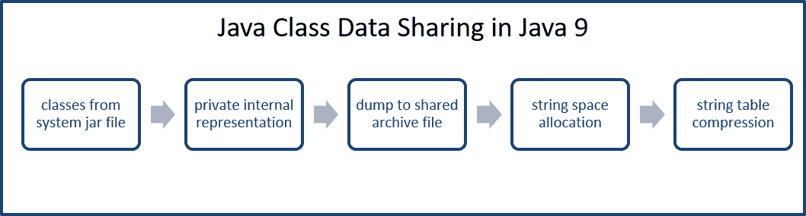

# 发现 Java 9

Java 9 代表了一个主要版本，包括对 Java 平台的大量内部更改。这些内部更改共同为 Java 开发者提供了一组巨大的新可能性，其中一些来自开发者的请求，另一些来自 Oracle 启发的增强。在本章中，我们将回顾 26 个最重要的更改。每个更改都与一个**JDK 增强提案**（**JEP**）相关。JEPs 被索引并托管在[openjdk.java.net/jeps/0](http://openjdk.java.net/jeps/0)。您可以访问此网站以获取有关每个 JEP 的更多信息。

JEP 项目是 Oracle 对开源、开源创新和开源标准的支持的一部分。虽然可以找到其他开源 Java 项目，但 OpenJDK 是 Oracle 唯一支持的项目。

在本章中，我们将介绍 Java 平台的变化。这些变化具有几个令人印象深刻的含义，包括：

+   堆空间效率

+   内存分配

+   编译过程改进

+   类型测试

+   注解

+   自动化的运行时编译器测试

+   改进的垃圾收集

# 改进的竞争锁 [JEP 143]

JVM 使用堆空间为类和对象分配内存。每当创建一个对象时，JVM 都会在堆上分配内存。这有助于促进 Java 的垃圾收集，释放不再有引用的对象之前使用的内存。Java 栈内存略有不同，通常比堆内存小得多。

JVM 在管理多个线程共享的数据区域方面做得很好。它将一个监控器与每个对象和类关联；这些监控器有由单个线程在任何时候控制的锁。这些由 JVM 控制的锁本质上是在给控制线程提供对象的监控器。

那么，什么是竞争锁？当一个线程正在等待当前已锁定对象的队列中时，它被说是在竞争该锁。以下图表展示了这种竞争的高级视图：


如前图所示，任何等待的线程在对象释放之前都不能使用已锁定的对象。

# 改进目标

JEP 143 的一般目标是提高 JVM 管理锁定 Java 对象监控的总体性能。对竞争锁的改进全部在 JVM 内部进行，不需要任何开发者采取行动即可从中受益。总体改进目标与更快操作相关。这包括：

+   更快的监控进入

+   更快的监控退出

+   更快的通知

通知是当对象锁定状态改变时调用的`notify()`和`notifyAll()`操作。测试这种改进不是一件容易的事情。任何级别的更高效率都是受欢迎的，因此这种改进是我们即使没有容易观察到的测试也可以感激的。

# 分段代码缓存 [JEP 197]

分段代码缓存 JEP（197）的升级已完成，并导致执行时间更快、更高效。这一变化的核心是将代码缓存分为三个不同的段——非方法、分析和非分析代码。

代码缓存是 Java 虚拟机存储生成的本地代码的区域。

所述的上述代码缓存段将包含特定类型的编译代码。正如您在以下图中可以看到的，代码堆区域根据编译代码的类型进行了分段：


# 内存分配

包含非方法代码的代码堆是用于 JVM 内部代码的，由一个 3MB 的固定内存块组成。其余的代码缓存内存平均分配给分析代码和非分析代码段。您可以通过命令行命令来控制这一点。

以下命令可以用来定义非方法编译代码的代码堆大小：

```java
-XX:NonMethodCodeCodeHeapSize
```

以下命令可以用来定义分析编译方法的代码堆大小：

```java
-XX:ProfiledCodeHeapSize
```

以下命令可以用来定义非分析编译方法的代码堆大小：

```java
-XX:NonProfiledCodeHeapSize
```

这个 Java 9 特性确实可以改善 Java 应用程序的效率。它还影响了使用代码缓存的其他进程。

# 智能 Java 编译，第二阶段 [JEP 199]

JDK 增强提案 199 旨在改进代码编译过程。所有 Java 开发者都应该熟悉用于将源代码编译成字节码的**javac**工具，该工具由 JVM 用于运行 Java 程序。**智能 Java 编译**，也称为 Smart Javac 和**sjavac**，在 javac 进程周围添加了一个*智能*包装器。也许 sjavac 添加的核心改进是只重新编译必要的代码。在这个上下文中，必要的代码是指自上次编译周期以来已更改的代码。

如果开发者只在小项目上工作，这个增强可能不会让他们感到兴奋。然而，考虑到在中等和大型项目中您必须不断重新编译代码时效率的巨大提升，开发者可以节省的时间就足以让他们接受 JEP 199。

这将如何改变您编译代码的方式？可能不会，至少目前不会。Javac 将仍然是默认的编译器。虽然 sjavac 在增量构建方面提供了效率，但 Oracle 认为它没有足够的稳定性成为标准编译工作流程的一部分。

您可以在此处阅读有关智能 javac 包装器工具的更多信息：[`cr.openjdk.java.net/~briangoetz/JDK-8030245/webrev/src/share/classes/com/sun/tools/sjavac/Main.java-.html`](http://cr.openjdk.java.net/~briangoetz/JDK-8030245/webrev/src/share/classes/com/sun/tools/sjavac/Main.java-.html)。

# 解决 Lint 和 Doclint 警告 [JEP 212]

如果你对 Java 中的 Lint 或 Doclint 不熟悉，请不要担心。正如标题所示，它们是向 javac 报告警告的来源。让我们逐一看看：

+   **Lint** 分析 javac 的字节码和源代码。Lint 的目标是识别被分析代码中的安全漏洞。Lint 还可以提供关于可扩展性和线程锁定问题的见解。Lint 还有更多功能，其总体目的是节省开发者的时间。

你可以在这里了解更多关于 Lint 的信息：[`en.wikipedia.org/wiki/Lint_(software)`](https://en.wikipedia.org/wiki/Lint_(software))。

+   **Doclint** 与 Lint 类似，但特定于 javadoc。Lint 和 Doclint 都在编译过程中报告错误和警告。JEP 212 的重点是解决这些警告。当使用核心库时，不应该有任何警告。这种思维方式导致了 JEP 212，它已在 Java 9 中得到解决并实现。

可以在 [`bugs.openjdk.java.net`](https://bugs.openjdk.java.net) JDK Bug 系统中查看 Lint 和 Doclint 警告的完整列表。

# javac 的分层归因 [JEP 215]

JEP 215 代表了对 javac 类型检查方案的优化工作。让我们首先回顾一下 Java 8 中类型检查是如何工作的；然后我们将探讨 Java 9 中的变化。

在 Java 8 中，多态表达式的类型检查由一个**推测性归因**工具处理。

推测性归因是类型检查的一种方法，它是 javac 编译过程的一部分。它有显著的计算开销。

使用推测性归因方法进行类型检查是准确的，但效率不高。这些检查包括参数位置，在递归、多态、嵌套循环和 Lambda 表达式中测试时，速度会呈指数级下降。因此，JEP 215 的目标是将类型检查方案改为创建更快的结果。使用推测性归因的结果本身并没有不准确，只是生成速度不够快。

与 Java 9 一起发布的新方法使用分层归因工具。此工具为所有方法调用中的参数表达式实现分层类型检查方法。还允许方法重写。为了使此新方案工作，为以下列出的每种方法参数类型创建了新的结构类型：

+   Lambda 表达式

+   多态表达式

+   常规方法调用

+   方法引用

+   钻石实例创建表达式

JEP 215 对 javac 的更改比本节中突出显示的更复杂。除了更高效的 javac 和节省时间之外，对开发者的直接影响并不立即显现。

# 注解管道 2.0 [JEP 217]

Java 注解指的是位于你的 Java 源代码文件中的特殊类型元数据。它们不会被 javac 移除，这样它们就可以在运行时对 JVM 可用。

注释看起来类似于 JavaDocs 引用，因为它们以 `@` 符号开头。有三种类型的注释。让我们逐一检查：

+   最基本的注释形式是 **标记** 注释。这些是独立的注释，唯一的组件是动画的名称。以下是一个示例：

```java
        @thisIsAMarkerAnnotation
        public double computeSometing(double x, double y) 
        {
          // do something and return a double
        }
```

+   第二种注释类型是包含 *单个值* 或数据片段的注释。正如您在以下代码中所见，以 `@` 符号开头的注释后面跟着包含数据的括号：

```java
        @thisIsAMarkerAnnotation (data="compute x and y 
         coordinates")
        public double computeSometing(double x, double y) 
        {
          // do something and return a double
        }
```

编码单值注释类型的一种替代方法是省略 `data=` 组件，如下面的代码所示：

```java
        @thisIsAMarkerAnnotation ("compute x and y coordinates")
        public double computeSometing(double x, double y) 
        {
          // do something and return a double
        }
```

+   第三种注释类型是当存在 *多个数据组件* 时。在这种类型的注释中，不能省略 `data=` 组件。以下是一个示例：

```java
        @thisIsAMarkerAnnotation (data="compute x and y 
         coordinates", purpose="determine intersecting point")
         public double computeSometing(double x, double y) 
         {
           // do something and return a double
         }
```

那么，Java 9 中有哪些变化？要回答这个问题，我们需要回顾一下 Java 8 中引入的一些变化，这些变化影响了 Java 注释：

+   Lambda 表达式

+   重复的注释

+   Java 类型注释

这些与 Java 8 相关的更改影响了 Java 注释，但并没有导致 javac 处理它们的方式发生变化。有一些硬编码的解决方案允许 javac 处理新的注释，但它们效率不高。此外，这种编码（硬编码解决方案）难以维护。

因此，JEP 217 专注于重构 javac 注释管道。这次重构完全是 javac 内部的，因此它不应该对开发者明显。

# 新的版本字符串方案 [JEP 223]

在 Java 9 之前，发布号没有遵循行业标准版本控制——**语义版本控制**。例如，在撰写本文时，最后四个 JDK 发布版本是：

+   JDK 8 更新 131

+   JDK 8 更新 121

+   JDK 8 更新 112

**语义版本控制** 使用主版本、次版本、补丁版本（0.0.0）的方案：

**主要** 相当于引入了不向后兼容的新 API 变更。

**次要** 指的是添加的功能是向后兼容的。

**补丁** 指的是向后兼容的错误修复或小更改。

Oracle 已经接受了 Java 9 及以后的语义版本控制。对于 Java，Java 版本号的前三个元素将使用 **主要-次要-安全** 方案：

+   **主要**：包含一组重大新功能的重大版本

+   **次要**：向后兼容的修订和错误修复

+   **安全**：被认为对提高安全性至关重要的修复

JEP 223 的这一描述可能会让版本控制方案看起来很基础。相反，已经制定了一套非常详细的规则和实践来管理未来的版本号。为了展示其复杂性，请看以下示例：

```java
    1.9.0._32.b19
```

# 自动生成运行时编译器测试 [JEP 233]

Java 可以说是最常用的编程语言，并且运行在日益多样化的平台上。这加剧了在高效方式下运行针对编译器的测试的问题。JEP 233 的目的是创建一个可以自动化运行时编译器测试的工具。

创建的工具首先生成一组随机的 Java 源代码和/或字节码。生成的代码将具有三个关键特征：

+   语法正确

+   语义正确

+   使用允许重用相同随机生成代码的随机种子

随机生成的源代码将被保存在以下目录中：

```java
    hotspot/test/testlibrary/jit-tester
```

这些测试用例将被存储以供以后重用。可以从`j-treg`目录或从工具的 makefile 中运行。重新运行保存的测试的好处之一是测试系统的稳定性。

# 测试由 Javac 生成的类文件属性[JEP 235]

缺乏或不足的创建类文件属性测试的能力是 JEP 235 背后的动力。目标是确保 javac 完全且正确地创建类文件的属性。这表明即使某些属性没有被类文件使用，所有类文件都应该生成一个完整的属性集。还需要有一种方法来测试类文件是否正确创建，特别是关于文件的属性。

在 Java 9 之前，没有测试类文件属性的方法。运行类并测试代码以获得预期或期望的结果是测试 javac 生成的类文件最常用的方法。这种技术不足以测试以验证文件的属性。

类文件属性有三个类别——JVM 使用的属性、可选属性和 JVM 未使用的属性。

JVM 使用的属性包括：

+   `BootstrapMethods`

+   `Code`

+   `ConstantValue`

+   `Exceptions`

+   `StackMapTable`

可选属性包括：

+   `Deprecated`

+   `LineNumberTable`

+   `LocalVariableTable`

+   `LocalVariableTypeTable`

+   `SourceDebugExtension`

+   `SourceFile`

JVM 未使用的属性包括：

+   `AnnotationDefault`

+   `EnclosingMethod`

+   `InnerClasses`

+   `MethodParameters`

+   `RuntimeInvisibleAnnotations`

+   `RuntimeInvisibleParameterAnnotations`

+   `RuntimeInvisibleTypeAnnotations`

+   `RuntimeVisibleAnnotations`

+   `RuntimeVisibleParameterAnnotations`

+   `RuntimeVisibleTypeAnnotations`

+   `Signature`

+   `Synthetic`

# 在 CDS 存档中存储内部字符串[JEP 250]

存储和访问字符串到和从**类数据共享**（**CDS**）存档的方法效率低下，耗时过多，且浪费内存。以下图表说明了 Java 在 CDS 存档中存储内部字符串的方法：


低效源于当前的存储架构。特别是当 **类数据共享** 工具将类倾倒到共享存档文件中时，包含 `CONSTANT_String` 项的常量池具有 UTF-8 字符串表示形式。

UTF-8 是一个 8 位可变长度字符编码标准。

# 问题

在当前使用 UTF-8 的情况下，字符串必须转换为字符串对象，即 `java.lang.String` 类的实例。这种转换是按需进行的，可能会导致系统变慢和不必要的内存使用。处理时间非常短，但内存使用不能忽视。每个内部字符串中的字符至少需要 3 字节内存，可能还需要更多。

一个相关问题是存储的字符串对所有 JVM 进程不可访问。

# 解决方案

CDS 存档现在在堆上为字符串分配特定空间：



字符串空间是通过共享字符串表、哈希表和去重来映射的。

去重是数据压缩技术，它可以消除存档中的重复信息。

# 为模块化准备 JavaFX UI 控件和 CSS API [JEP 253]

JavaFX 是一套允许设计和开发媒体丰富的图形用户界面的包。JavaFX 应用程序为开发者提供了一个创建一致界面的强大 API。**层叠样式表**（**CSS**）可以用来自定义界面。JavaFX 的一个优点是编程和界面设计任务可以轻松分离。

# JavaFX 概述

有一个叫做 Scene Builder 的出色的可视化脚本工具，它允许你通过拖放和属性设置来创建图形用户界面。Scene Builder 生成必要的 FXML 文件，这些文件被你的 **集成开发环境**（**IDE**）如 NetBeans 所使用。

这里是一个使用 Scene Builder 创建的示例 UI：


此外，这是 Scene Builder 创建的 FXML 文件：

```java
    <?xml version="1.0" encoding="UTF-8"?>

    <?import java.lang.*?>
    <?import java.util.*?>
    <?import javafx.scene.control.*?>
    <?import javafx.scene.layout.*?>
    <?import javafx.scene.paint.*?>
    <?import javafx.scene.text.*?>

    <AnchorPane id="AnchorPane" maxHeight="-Infinity"
     maxWidth="-Infinity" minHeight="-Infinity"
     minWidth="-Infinity" prefHeight="400.0" prefWidth="600.0"

     >
     <children>
       <TitledPane animated="false" collapsible="false"
        layoutX="108.0" layoutY="49.0" text="Sample">
       <content>
         <AnchorPane id="Content" minHeight="0.0" minWidth="0.0"
          prefHeight="180.0" prefWidth="200.0">
         <children>
           <CheckBox layoutX="26.0" layoutY="33.0" 
            mnemonicParsing="false" prefWidth="94.0" 
            text="CheckBox" />
           <ColorPicker layoutX="26.0" layoutY="65.0" />
           <Hyperlink layoutX="26.0" layoutY="103.0"
            text="Hyperlink" />
           <Label alignment="CENTER" layoutX="14.0" layoutY="5.0" 
            prefWidth="172.0" text="This is a Label"
            textAlignment="CENTER">
            <font>
              <Font size="14.0" />
            </font>
           </Label>
           <Button layoutX="81.0" layoutY="146.0" 
            mnemonicParsing="false" text="Button" />
         </children>
         </AnchorPane>
       </content>
       </TitledPane>
     </children>
    </AnchorPane>
```

# Java 9 的影响

在 Java 9 之前，JavaFX 控件以及 CSS 功能只能通过接口内部 API 由开发者访问。Java 9 的模块化使得内部 API 不可访问。因此，JEP 253 被创建来定义公共 API，而不是内部 API。

这是一项比看起来更大的任务。以下是一些作为此 JEP 部分采取的行动：

+   将 javaFX 控件皮肤从内部移动到公共 API (`javafx.scene.skin`)

+   确保 API 一致性

+   生成详尽的 javadoc

以下类已从内部包移动到公共 `javafx.scene.control.skin` 包：

| `AccordionSkin` | `ButtonBarSkin` | `ButtonSkin` | `CellSkinBase` |
| --- | --- | --- | --- |
| `CheckBoxSkin` | `ChoiceBoxSkin` | `ColorPickerSkin` | `ComboBoxBaseSkin` |
| `ComboBoxListViewSkin` | `ComboBoxPopupControl` | `ContextMenuSkin` | `DateCellSkin` |
| `DatePickerSkin` | `HyperLinkSkin` | `LabelSkin` | `LabeledSkinBase` |
| `ListCellSkin` | `ListViewSkin` | `MenuBarSkin` | `MenuButtonSkin` |
| `MenuButtonSkinbase` | `NestedTableColumHeader` | `PaginationSkin` | `ProgressBarSkin` |
| `ProgressIndicatorSkin` | `RadioButtonSkin` | `ScrollBarSkin` | `ScrollPaneSkin` |
| `SeparatorSkin` | `SliderSkin` | `SpinnerSkin` | `SplitMenuButtonSkin` |
| `SplitPaneSkin` | `TabPaneSkin` | `TableCellSkin` | `TableCellSkinBase` |
| `TableColumnHeader` | `TableHeaderRow` | `TableHeaderSkin` | `TableRowSkinBase` |
| `TableViewSkin` | `TableViewSkinBase` | `TextAreaSkin` | `TextFieldSkin` |
| `TextInputControlSkin` | `TitledPaneSkin` | `ToggleButtonSkin` | `TooBarSkin` |
| `TooltipSkin` | `TreeCellSkin` | `TreeTableCellSkin` | `TreeTableRowSkin` |
| `TreeTableViewSkin` | `TreeViewSkin` | `VirtualContainerBase` | `VirtualFlow` |

公共的`javafx.css`包现在有额外的类：

+   `CascadingStyle.java:public class CascadingStyle implements Comparable<CascadingStyle>`

+   `CompoundSelector.java:final public class CompoundSelector extends Selector`

+   `CssError.java:public class CssError`

+   `Declaration.java:final public class Declaration`

+   `Rule.java:final public class Rule`

+   `Selector.java:abstract public class Selector`

+   `SimpleSelector.java:final public class SimpleSelector extends Selector`

+   `Size.java:final public class Size`

+   `Style.java:final public class Style`

+   `Stylesheet.java:public class Stylesheet`

+   `CssParser.java:final public class CssParser`

# 紧凑字符串 [JEP 254]

字符串数据类型是几乎所有 Java 应用程序的重要部分。虽然 JEP 254 的目标是使字符串更节省空间，但它采取了谨慎的态度，以确保现有的性能和兼容性不会受到负面影响。

# Java 9 之前的状态

在 Java 9 之前，字符串数据存储为字符数组。每个字符需要 16 位。确定大多数 String 对象可以用仅 8 位，即 1 个字节的存储来存储。这是因为大多数字符串由拉丁-1 字符组成。

ISO Latin-1 字符集是一个单字节字符编码集。

# Java 9 的新特性

从 Java 9 开始，字符串现在使用字节数组和编码引用的标志字段内部表示。

# 将选定的 Xerces 2.11.0 更新合并到 JAXP [JEP 255]

Xerces 是一个用于在 Java 中解析 XML 的库。它在 2010 年底更新到 2.11.0，因此 JEP 255 的目标是更新 JAXP 以包含 Xerces 2.11.0 的变化。

JAXP 是 Java 的 XML 处理 API。

在 Java 9 之前，JDK 关于 XML 处理的最新更新基于 Xerces 2.7.1。基于 Xerces 对 JDK 7 的一些额外更改，2.10.0。JEP 255 是基于 Xerces 2.11.0 的 JAXP 的进一步改进。

Xerces 2.11.0 支持以下标准：

+   XML 1.0，第四版

+   XML 1.0，第二版中的命名空间

+   XML 1.1，第二版

+   XML 1.1，第二版中的命名空间

+   XML 包含 1.0，第二版

+   **文档对象模型** (**DOM**)

    +   第 3 级

        +   核心

        +   加载 & 保存

    +   第 2 级

        +   核心

        +   事件

+   遍历 & 范围

+   元素遍历，第一版

+   简单 XML API 2.0.2

+   **Java XML 处理 API** (**JAXP**) 1.4

+   XML 流式处理 API 1.0

+   XML 模式 1.0

+   XML 模式 1.1

+   XML 模式定义语言

JDK 已更新以包含以下 Xerces 2.11.0 类别：

+   目录解析器

+   数据类型

+   文档对象模型第 3 级

+   XML 模式验证

+   XPointer

Java 9 中未更改 JAXP 的公共 API。

# 将 JavaFX/Media 更新到 GStreamer 的新版本 [JEP 257]

JavaFX 用于创建桌面和 Web 应用程序。JavaFX 是为了取代 Swing 作为 Java 的标准 GUI 库而创建的。`Media` 类，`javafx.scene.media.Media`，用于实例化表示媒体资源的对象。JavaFX/Media 指的是以下类：

```java
    public final class Media extends java.lang.Object
```

此类提供对媒体资源的引用数据。`javafx.scene.media` 包为开发人员提供了将媒体集成到他们的 JavaFX 应用程序中的能力。JavaFX/Media 使用 GStreamer 管道。

GStreamer 是一个多媒体处理框架，可用于构建从多种不同格式获取媒体并处理后以选定格式导出的系统。

JEP 257 的目的是确保 JavaFX/Media 更新到 GStreamer 的最新版本，以确保稳定性、性能和安全保证。

# HarfBuzz 字体布局引擎 [JEP 258]

在 Java 9 之前，布局引擎用于处理字体复杂性；具体来说，是指那些具有超出常见拉丁字体渲染行为的字体。Java 使用统一客户端界面，也称为 ICU，作为默认文本渲染工具。ICU 布局引擎已被弃用，并在 Java 9 中被 HarfBuzz 字体布局引擎所取代。

HarfBuzz 是一个 **OpenType** 文本渲染引擎。此类布局引擎具有提供脚本感知代码的特性，以帮助确保文本按预期布局。

OpenType 是一种 HTML 格式化字体格式规范。

从 ICU 布局引擎到 HarfBuzz 字体布局引擎的变更动力是 IBM 决定停止支持 ICU 布局引擎。因此，JDK 已更新以包含 HarfBuzz 字体布局引擎。

# Windows 和 Linux 上的 HiDPI 图形 [JEP 263]

JEP 263 专注于确保屏幕组件的清晰度，相对于显示器的像素密度。以下术语与该 JEP 相关，并附带以下列出的描述信息：

+   **DPI 可知应用程序**：一个能够检测和缩放图像以适应显示特定像素密度的应用程序

+   **DPI 不可知应用程序**：一个不尝试检测和缩放图像以适应显示特定像素密度的应用程序

+   **HiDPI 图形**: 每英寸高点数图形

+   **视网膜显示器**：这个术语由苹果公司创造，指的是至少每英寸 300 像素密度的显示器

向用户显示图形，无论是图像还是图形用户界面组件，通常具有至关重要的性能。以高质量显示这些图像可能有些问题。计算机监视器的 DPI 有很大的变化。开发显示器的三种基本方法如下：

+   开发不考虑潜在不同显示尺寸的应用程序。换句话说，创建一个 DPI 无感知的应用程序。

+   开发一个对 DPI 敏感的应用程序，该程序可以选择性地使用给定显示器的预渲染图像大小。

+   开发一个对 DPI 敏感的应用程序，该程序能够正确地缩放图像以适应应用程序运行的特定显示器。

显然，前两种方法都有问题，并且原因不同。在第一种方法中，没有考虑用户体验。当然，如果应用程序是为具有无预期像素密度变化的特定显示器开发的，那么这种方法可能是可行的。

第二种方法需要在设计和开发端进行大量工作，以确保为每个预期的显示密度创建并程序化实现图像。除了大量的工作外，应用程序的大小将不必要地增加，并且没有考虑到新的和不同的像素密度。

第三种方法是为具有高效和有效缩放功能的应用程序创建一个对 DPI 敏感的应用程序。这种方法效果很好，并且已经在 Mac 视网膜显示器上得到证明。

在 Java 9 之前，自动缩放和尺寸调整已经在 Java 中实现，用于 Mac OS X 操作系统。这种功能在 Java 9 中添加到了 Windows 和 Linux 操作系统。

# Marlin 图形渲染器 [JEP 265]

JEP 265 在 Java 2D API 中将 Pisces 图形光栅化器替换为 Marlin 图形渲染器。此 API 用于绘制 2D 图形和动画。

目标是用一个效率更高且没有质量损失的光栅化器/渲染器替换 Pisces。这个目标在 Java 9 中实现了。一个预期的附带好处是包括一个开发者可访问的 API。以前，与 AWT 和 Java 2D 接口的方式是内部的。

# Unicode 8.0.0 [JEP 267]

Unicode 8.0.0 于 2015 年 6 月 17 日发布。JEP 267 专注于更新相关 API 以支持 Unicode 8.0.0。

# Unicode 8.0.0 中的新内容

Unicode 8.0.0 增加了近 8000 个字符。以下是发布的高亮内容：

+   Ahom 语脚本（印度泰阿洪语）

+   Arwi，泰米尔语（阿拉伯语）

+   切罗基符号

+   CJK 统一表意文字

+   表情符号以及肤色符号修饰符

+   格鲁吉亚拉里货币符号

+   lk 语言（乌干达）

+   Kulango 语言（科特迪瓦）

# Java 9 中的更新类

为了完全符合新的 Unicode 标准，更新了几个 Java 类。以下列出的类在 Java 9 中更新，以符合新的 Unicode 标准：

+   `java.awt.font.NumericShaper`

+   `java.lang.Character`

+   `java.lang.String`

+   `java.text.Bidi`

+   `java.text.BreakIterator`

+   `java.text.Normalizer`

# 为关键部分预留栈区域 [JEP 270]

JEP 270 的目标是减轻在执行关键部分时由于栈溢出而产生的问题。这种缓解措施采取了预留额外线程栈空间的形式。

# Java 9 之前的状况

当 JVM 被要求在一个没有足够栈空间且没有权限分配额外空间的线程中执行数据计算时，它会抛出`StackOverflowError`。这是一个异步异常。当方法被调用时，JVM 也可以同步地抛出`StackOverflowError`异常。

当方法被调用时，会使用一个内部过程来报告栈溢出。虽然当前的架构足以报告错误，但调用应用程序没有足够的空间轻松地从错误中恢复。这可能会给开发人员和用户带来更多的不便。如果在关键的计算操作期间抛出了`StackOverflowError`，数据可能会被损坏，导致更多的问题。

虽然这些问题的原因并非唯一，但`ReentrantLock`类的受影响状态是导致不理想结果的一个常见原因。这个问题在 Java 7 中很明显，因为`ConcurrentHasMap`代码实现了`ReentrantLock`类。`ConcurrentHasMap`代码在 Java 8 中进行了修改，但对于`ReentrantLock`类的任何实现，问题仍然存在。类似的问题超出了仅仅使用`ReentrantLock`类的情况。

以下图表提供了`StackOverflowError`问题的广泛概述：


在下一节中，我们将探讨如何解决 Java 9 中的这个问题。

# Java 9 新增功能

在 Java 9 中，通过 JEP 270 的更改，关键部分将自动获得额外的空间，以便它可以完成其执行而不会遭受`StackOverflowError`。这基于额外的空间分配需求很小。JVM 已经进行了必要的更改，以允许此功能。

当 JVM 在执行关键部分时，实际上会延迟`StackOverflowError`，或者至少尝试这样做。为了利用这个新架构，方法必须使用以下注解：

```java
    jdk.internal.vm.annotation.ReservedStackAccess
```

当一个方法有这个注解并且存在`StackOverflowError`条件时，会授予临时访问预留内存空间。这个新过程在高度抽象的层面上可以表示如下：


# 语言定义的对象模型的动态链接 [JEP 276]

通过 JEP 276 增强了 Java 互操作性。必要的 JDK 更改已做出，以允许来自多种语言的运行时链接器在单个 JVM 实例中共存。这个更改适用于高级操作，正如您所期望的。一个相关的高级操作示例是读取或写入具有访问器和修改器等元素的属性。

高级操作适用于未知类型的对象。它们可以使用`INVOKEDYNAMIC`指令调用。以下是一个在编译时未知对象类型时调用对象属性示例：

```java
    INVOKEDYNAMIC "dyn:getProp:age"
```

# 概念证明

Nashorn 是一个轻量级、高性能的 JavaScript 运行时，允许在 Java 应用程序中嵌入 JavaScript。这是为 Java 8 创建的，并取代了基于 Mozilla Rhino 的先前 JavaScript 脚本引擎。Nashorn 已经具有这种功能。它提供任何未知类型对象上的高级操作之间的链接，例如`obj.something`，它产生以下结果：

```java
    INVOKEDYNAMIC "dyn.getProp.something"
```

动态链接器立即启动，并在可能的情况下提供适当的实现。

# G1 中巨大对象的附加测试 [JEP 278]

Java 平台长期受欢迎的功能之一是幕后垃圾回收。JEP 278 的焦点是创建 G1 垃圾回收器的附加 WhiteBox 测试，作为对巨大对象的特性。

WhiteBox 测试是一个用于查询 JVM 内部的 API。WhiteBox 测试 API 在 Java 7 中引入，并在 Java 8 和 Java 9 中进行了升级。

G1 垃圾回收器工作得非常好，但仍有提高效率的空间。G1 垃圾回收器的工作方式是首先将堆分成大小相等的区域，如下所示：


G1 垃圾回收器的问题在于如何处理巨大对象。

在垃圾回收的上下文中，巨大对象是指占据堆上多个区域的对象。

巨大对象的问题在于，如果它们占据了堆上任何区域的一部分，剩余的空间就无法为其他对象分配。在 Java 9 中，WhiteBox API 通过四种新方法进行了扩展：

+   用于阻止完全垃圾回收并启动并发标记的方法。

+   可以访问单个 G1 垃圾回收器堆区域的方法。对这些区域的访问包括属性读取，例如区域的当前状态。

+   直接访问 G1 垃圾回收器内部变量的方法。

+   可以确定巨大对象是否位于堆上以及它们位于哪些区域的方法。

# 改进测试失败故障排除 [JEP 279]

对于做很多测试的开发者来说，JEP 279 值得一读。Java 9 中添加了额外的功能，以自动收集信息以支持故障排除测试失败以及超时。在测试期间收集可用的诊断信息，可以为开发者和工程师提供更精确的日志和其他输出。

在测试的上下文中，有两种基本类型的信息——环境和过程。

# 环境信息

在运行测试时，测试环境信息对于故障排除工作可能很重要。这些信息包括以下内容：

+   CPU 负载

+   磁盘空间

+   I/O 负载

+   内存空间

+   打开的文件

+   打开的套接字

+   运行的进程

+   系统事件

+   系统消息

# Java 进程信息

在测试过程中，还有与 Java 进程直接相关的信息。这些包括：

+   C 栈

+   核心转储

+   小型转储

+   堆统计信息

+   Java 栈

有关此概念的更多信息，请阅读关于 JDK 回归测试工具（jtreg）的内容。

# 优化字符串连接 [JEP 280]

JEP 280 是 Java 平台的一个有趣增强。在 Java 9 之前，字符串连接被 javac 翻译成`StringBuilder :: append`链。这是一种次优的翻译方法，通常需要`StringBuilder`预分配大小。

增强改变了由 javac 生成的字符串连接字节码序列，使其使用`INVOKEDYNAMIC`调用。增强的目的是提高优化并支持未来的优化，而无需重新格式化 javac 的字节码。

有关`INVOKEDYNAMIC`的更多信息，请参阅 JEP 276。

使用`INVOKEDYNAMIC`调用`java.lang.invoke.StringConcatFactory`允许我们使用类似于 lambda 表达式的方法，而不是使用 StringBuilder 的逐步过程。这导致字符串连接处理更加高效。

# HotSpot C++单元测试框架 [JEP 281]

HotSpot 是 JVM 的名称。这个 Java 增强旨在支持为 JVM 开发 C++单元测试。以下是此增强功能的部分、非优先级列表的目标：

+   命令行测试

+   创建适当的文档

+   调试编译目标

+   框架弹性

+   IDE 支持

+   单独和隔离的单元测试

+   个性化测试结果

+   与现有基础设施集成

+   内部测试支持

+   正面和负面测试

+   短时间执行测试

+   支持所有 JDK 9 构建平台

+   测试编译目标

+   测试排除

+   测试分组

+   需要初始化 JVM 的测试

+   与源代码位于同一位置的测试

+   平台相关代码的测试

+   编写和执行单元测试（对于类和方法）

这个增强功能是可扩展性增加的证据。

# 在 Linux 上启用 GTK 3 [JEP 283]

GTK+，正式称为 GIMP 工具箱，是一个跨平台工具，用于创建 **图形用户界面**（**GUI**）。该工具由其 API 可访问的小部件组成。JEP 283 的重点是确保在开发具有图形组件的 Java 应用程序时，GTK 2 和 GTK 3 在 Linux 上得到支持。该实现支持使用 JavaFX、AWT 和 Swing 的 Java 应用程序。

我们可以使用 JavaFX、AWT 和 Swing 创建 Java 图形应用程序。以下表格总结了这三个方法与 GTK 的关系，在 Java 9 之前：

| **方法** | **备注** |
| --- | --- |
| JavaFX |

+   使用动态 GTK 函数查找

+   通过 JFXPanel 与 AWT 和 Swing 交互

+   使用 AWT 打印功能

|

| AWT |
| --- |

+   使用动态 GTK 函数查找

|

| Swing |
| --- |

+   使用动态 GTK 函数查找

|

因此，为了实现这个 JEP，需要做出哪些改变？对于 JavaFX，有三个具体的变化：

+   为 GTK 2 和 GTK 3 添加了自动测试

+   添加了动态加载 GTK 2 的功能

+   添加了对 GTK 3 的支持

对于 AWT 和 Swing，实施了以下更改：

+   为 GTK 2 和 GTK 3 添加了自动测试

+   `AwtRobot` 已迁移到 GTK 3

+   `FileChooserDilaog` 已更新以兼容 GTK 3

+   添加了动态加载 GTK 3 的功能

+   Swing GTK LnF 已修改以支持 GTK 3

Swing GTK LnF 是 Swing GTK look and feel 的缩写。

# 新的 HotSpot 构建系统 [JEP 284]

在 Java 9 之前，Java 平台使用的构建系统充满了重复代码、冗余和其他低效之处。基于 build-infra 框架，构建系统已被重新设计以适应 Java 9。在此上下文中，infra 是基础设施的缩写。JEP 284 的总体目标是升级构建系统，使其简化。具体目标包括：

+   利用现有的构建系统

+   可维护的代码

+   最小化重复代码

+   简化

+   支持未来增强

您可以在本网站上了解更多关于 Oracle 基础设施框架的信息：[`www.oracle.com/technetwork/oem/frmwrk-infra-496656.html`](http://www.oracle.com/technetwork/oem/frmwrk-infra-496656.html)

# 摘要

在本章中，我们介绍了 Java 平台的一些令人印象深刻的新特性，特别关注 javac、JDK 库和各种测试套件。内存管理改进，包括堆空间效率、内存分配和改进的垃圾收集，代表了一组强大的 Java 平台增强。关于编译过程的改变，以提高效率，也是我们章节的一部分。我们还介绍了重要的改进，如编译过程、类型测试、注解和自动运行时编译器测试。

在下一章中，我们将探讨 Java 9 中引入的几个小的语言增强。
