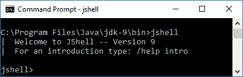
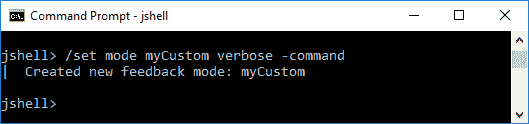

# 尝试 Java Shell

在上一章中，我们探讨了如何将 Java 9 之前的应用程序迁移到新的 Java 平台。我们检查了可能导致您当前应用程序在 Java 9 上运行出现问题的几个问题。我们从对 Project Jigsaw 的回顾开始，然后探讨了模块如何适应新的 Java 平台。我们为您提供了使 Java 8 代码与 Java 9 一起工作的见解和流程。具体来说，我们提供了迁移规划的建议，分享了 Oracle 关于迁移的建议，并分享了您在开始使用 Java 9 时可以使用的工具。

在本章中，我们将首次了解 Java 9 中的新命令行工具，**读取-评估-打印循环**（也称为 **REPL**），即 **Java Shell**（**JShell**）。我们将从有关此工具、读取-评估-打印循环概念的基本信息开始，然后进入用于 JShell 的命令和命令行选项。我们将采用实践者的方法来审查 Java Shell，并包括您可以自己尝试的示例。

本章涵盖了以下主题：

+   什么是 JShell？

+   开始使用 JShell

+   JShell 的实际用途

+   与脚本一起工作

# 什么是 JShell？

JShell 是 Java 9 中引入的新工具。它是一个交互式读取-评估-打印循环工具，用于评估以下 Java 编程语言组件——声明、语句和表达式。它有自己的 API，因此可以由外部应用程序使用。

读取-评估-打印循环通常被称为 REPL，取自短语中每个单词的首字母。它也被称为语言外壳或交互式顶层。

JShell 的引入是 **Java Enhancement Program**（**JEP**）222 的结果。以下是关于 Java Shell 命令行工具的 JEP 的声明目标：

+   促进快速调查

+   促进快速编码

+   提供编辑历史记录

之前列出的快速调查和编码包括语句和表达式。令人印象深刻的是，这些语句和表达式不需要是方法的一部分。此外，变量和方法也不需要是类的一部分，这使得此工具特别灵活。

此外，以下列出的功能被包括进来，使 JShell 更易于使用，并使您使用 JShell 的时间尽可能高效：

+   Tab-completion

+   语句末尾分号的自动完成

+   导入自动完成

+   定义自动完成

# 开始使用 JShell

JShell 是一个位于 `/bin` 文件夹中的命令行工具。此工具的语法为 `jshell <options> <load files>`。正如您所看到的，此工具有多个可用的选项：


您已经看到了 `-h` 选项，我们通过 `jshell -h` 执行了它。这提供了 JShell 选项的列表。

要登录 JShell，你只需使用`jshell`命令。你会看到命令窗口中的提示符相应地改变：



退出 shell 就像输入`/exit`一样简单。一旦进入 JShell，你可以输入以下任何命令：

| **命令** | **功能** |
| --- | --- |

| `/drop` | 使用此命令通过`name`或`id`引用删除源条目。以下是语法：

```java
    /drop <name or id>
```

|

| `/edit` | 使用此命令，你可以使用`name`或`id`引用来编辑源条目。以下是语法：

```java
    /edit <name or id>
```

|

| `/env` | 此强大命令允许你查看或更改评估上下文。以下是语法：

```java
    /env [-class-path <path>] [-module-path <path>]
     [-add-modules <modules]
```

|

| `/exit` | 此命令用于退出 JShell。语法很简单，只需输入`/exit`，没有可选的选项或参数。 |
| --- | --- |
| `/history` | 历史命令提供了你输入的历史记录。语法很简单，只需输入`/history`，没有可选的选项或参数。 |
| `/<id>` | 此命令通过引用`id`重新运行之前的代码片段。以下是语法：`/<id>`你也可以通过引用第*n*个之前的代码片段来运行特定的代码片段，使用`/-<n>`。 |
| `/imports` | 你可以使用此命令列出导入的项目。语法是`/imports`，它不接受任何选项或参数。 |

| `/list` | 此命令将列出你输入的源代码。以下是语法：

```java
    /list [<name or id> &#124; -all &#124; -start]
```

|

| `/methods` | 此命令列出所有声明的方法以及它们的签名。以下是语法：

```java
    /methods [<name or id> &#124; -all &#124; -start]
```

|

| `/open` | 使用此命令，你可以将文件作为源输入打开。以下是语法：

```java
    /open <file>
```

|

| `/reload` | 重新加载命令允许你重置并重新播放相关历史记录。以下是语法：

```java
    /reload [-restore] [-quiet]  [-class-path 
     <path>] [-module-path <path>]
```

|

| `/reset` | 此命令重置 JShell。以下是语法：

```java
    /reset [-class-path <path>] [-module-path 
     <path>] [-add-modules <modules]
```

|

| `/save` | 此命令将代码片段源保存到你指定的文件中。以下是语法：

```java
    /save [-all &#124; -history &#124; -start] <file>
```

|

| `/set` | 此命令用于设置 JShell 的配置信息。以下是语法：

```java
    /set editor &#124; start &#124; feedback &#124; mode &#124; prompt &#124; 
     truncation &#124; format
```

|

| `/types` | 此命令简单地列出声明的类型。以下是语法：

```java
    /types [<name or id> &#124; -all &#124; -start]
```

|

| `/vars` | 此命令列出所有声明的变量以及它们的值。以下是语法：

```java
    /vars [<name or id> &#124; -all &#124; -start]
```

|

| `/!` | 此命令将重新运行最后一个代码片段。语法很简单，只需输入`/!` |
| --- | --- |

列出的几个命令使用了术语**代码片段**。在 Java 9 和 JShell 的上下文中，代码片段是以下之一：

- 类声明

- 表达式

- 字段声明

- 导入声明

- 接口声明

- 方法声明

在 JShell 中输入`/help`或`/?`命令将提供可以在 shell 中使用的完整命令和语法列表。该列表如下所示：


`/help`命令对于初学者特别有帮助。正如以下截图所示，我们可以通过简单地输入`/help intro`命令来获取 JShell 的介绍：


如果你经常使用 JShell，你可能从以下列出的一个或多个快捷键中受益。你可以在 JShell 内部使用`/help shortcuts`命令在任何时候列出这些快捷键：


你可以通过在 JShell 中使用`/help`命令后跟你想获取更多帮助的命令来从 JShell 内部获得额外的帮助。例如，输入`/help reload`提供了关于`/reload`命令的详细信息。该信息如下：


# JShell 的实际用途

无论你是新开发者、经验丰富的开发者，还是刚刚接触 Java，你都会发现 JShell 非常有用。在本节中，我们将探讨 JShell 的一些实际用途。具体来说，我们将涵盖：

+   反馈模式

+   列出你的资产

+   在 JShell 中编辑

# 反馈模式

命令行工具通常为了不使屏幕过于拥挤或成为开发者的麻烦，会提供相对稀疏的反馈。JShell 除了给开发者提供创建自定义模式的能力外，还有几种反馈模式。

如以下截图所示，有四种反馈模式--`concise`、`normal`、`silent`和`verbose`。在这里，我们没有提供任何参数就输入了`/set feedback`命令，以列出反馈模式以及确定当前的反馈模式。输出第一行显示了将模式设置为当前设置模式的命令行命令和参数集。因此，在以下截图中，当前的反馈模式设置为`verbose`，其他三种模式被列出：


我们可以在启动 JShell 时包含一个选项来指定我们第一次进入 JShell 时想要进入的模式。以下是命令行选项：

| **命令行命令和选项** | **反馈模式** |
| --- | --- |
| `jshell -q` | `concise` |
| `jshell -n` | `normal` |
| `jshell -s` | `silent` |
| `jshell -v` | `verbose` |

你会注意到我们使用`-q`来表示`concise`模式，而不是`-c`。`-c`选项具有`-c<flag>`语法，用于将`<flag>`传递给编译器。

最好的方法是使用示例来回顾反馈模式之间的差异。从`normal`模式开始，我们将执行命令行命令来完成以下顺序的反馈演示：

1.  创建一个变量。

1.  更新变量的值。

1.  创建一个方法。

1.  更新该方法。

1.  运行该方法。

要开始我们的第一次测试，我们将在`jshell>`提示符下执行`/set feedback normal`命令，这将把 JShell 的反馈模式设置为`normal`。进入`normal`反馈模式后，我们将输入必要的命令来运行我们的演示：


在进入`normal`反馈模式后，我们输入了`int myVar = 3`并收到了`myVar ==> 3`作为反馈。在我们的下一个命令中，我们更改了相同变量的值，并收到了相同的新值输出。我们的下一个语句`void quickMath() {System.out.println("Your result is " + (x*30 + 19));}`使用了未声明的变量，您可以看到结果是两部分的反馈——一部分指示方法已创建，另一部分通知该方法在未声明变量声明之前不能被调用。接下来，我们将方法更改为包含`myVar`变量，反馈报告了方法已被修改。我们的最后一步是使用`quickMath();`运行该方法，结果正如我们所预期的。

让我们在`concise`模式下尝试相同的反馈演示：


如您从前面的截图中所见，`concise`反馈模式为我们提供了更少的反馈。我们创建和修改了变量，但没有收到任何反馈。当我们创建具有未声明变量的方法时，我们收到了与`normal`模式相同的反馈。我们更新了方法而没有确认或其他反馈。

我们下一次使用反馈演示将在`silent`模式下：


当我们进入`silent`反馈模式时，正如您可以从前面的截图看到的那样，JShell 提示符从`jshell>`变为`->`。当我们创建`myVar`变量、修改`myVar`变量或创建`quickMath()`方法时，没有提供任何反馈。我们故意创建`quickMath()`方法来使用未声明的变量。因为我们处于`silent`反馈模式，所以我们没有得到方法有未声明变量的通知。基于这种缺乏反馈的情况，我们运行了该方法，但没有提供任何输出或反馈。接下来，我们更新了方法以包含已声明的`myVar`变量，然后再次运行了该方法。

`silent`反馈模式可能看起来没有意义，因为没有提供任何反馈，但这个模式有很大的实用性。使用`silent`模式可能适合管道线或简单地当您想最小化终端输出量时。例如，您可以使用隐式的`System.out.println`命令包含特定的、条件性的输出。

我们上一次使用反馈演示是在`verbose`反馈模式下。这种反馈模式，正如其名称所暗示的，提供了最多的反馈。以下是我们的测试结果：


在我们的反馈演示中，使用`verbose`反馈模式，我们收到了更多反馈以及更美观的反馈格式。

# 创建自定义反馈模式

虽然内部反馈模式（`normal`、`concise`、`silent`和`verbose`）不能修改，但您可以创建自己的自定义反馈模式。这个过程的第一步是复制一个现有模式。以下示例演示了如何使用`/set mode myCustom verbose -command`命令字符串将`verbose`模式复制到`myCustom`模式：



我们使用`-command`选项以确保我们会收到命令反馈。您可以使用`/set`命令以及以下屏幕截图中所列出的选项之一来更改您的反馈模式：


例如，让我们通过截断设置来了解它强制指定每行输出显示多少个字符。使用`/set truncation`命令，如以下屏幕截图所示，显示了当前的截断设置：


如您所见，我们的`myCustom`反馈模式的截断为`80`。我们将使用`/set truncation myCustom 60`命令将其更改为`60`，然后使用`/set truncation`命令进行验证：


如您在前一个屏幕截图中所见，我们的`myCustom`反馈模式的截断已成功从继承自`verbose`模式的`80`更改为`60`，这是基于我们使用`/set truncation myCustom 60` JShell 命令的结果。

# 列出资产

有几个 JShell 命令方便列出您创建的资产。使用上一节中的反馈演示，我们执行了`/vars,` `/methods`和`/list`命令，分别提供变量、方法和所有源列表：


我们还可以使用`/list -all`命令和选项组合来查看 JShell 导入了哪些包。如以下屏幕截图所示，JShell 导入了几个使我们在 shell 中的工作更方便的包，节省了我们不得不在我们的方法中导入这些标准包的时间：


如果您只想列出启动导入，可以使用`/list -start`命令和选项组合。如以下屏幕截图所示，每个启动导入都有一个"`s`"前缀，并且是按数字顺序排列的：


# 在 JShell 中编辑

JShell 不是一个功能齐全的文本编辑器，但在 shell 中您可以做几件事情。本节为您提供了编辑技巧，分为修改文本、基本导航、历史导航和高级编辑命令。

# 修改文本

默认的文本编辑/输入模式是您输入的文本将出现在当前光标位置。当您想要删除文本时，您有几种选项可供选择。以下是一个完整的列表：

| **删除操作** | **PC 键盘组合** | **Mac 键盘组合** |
| --- | --- | --- |
| 删除当前光标位置的字符 | *Delete* | *Delete* |
| 删除光标左侧的字符 | *Backspace* | *Backspace* |
| 从光标位置删除到行尾 | *Ctrl* + *K* | *Cmd* + *K* |
| 从光标位置删除到当前单词的末尾 | *Alt* + *D* | *Alt*/*Opt* + *D* |
| 从光标位置删除到前一个空白字符 | *Ctrl* + *W* | *Cmd* + *W* |
| 在光标位置粘贴最近删除的文本 | *Ctrl* + *Y* | *Cmd* + *Y* |
| 当使用 *Ctrl* + *Y*（或 Mac 上的 *Cmd* + *Y*）时，您将能够使用 *Alt* + *Y* 键盘组合来循环浏览之前删除的文本 | *Alt* + *Y* | *Alt*/*Opt* + *Y* |

# 基本导航

虽然在 JShell 内部的导航控制与大多数命令行编辑器相似，但有一个基本导航控制列表是有帮助的：

| **键/键组合** | **导航操作** |
| --- | --- |
| *左箭头* | 向后移动一个字符 |
| *右箭头* | 向前移动一个字符 |
| *上箭头* | 向后移动一行，通过历史记录 |
| *下箭头* | 向前移动一行，通过历史记录 |
| *Return* | 输入（提交）当前行 |
| *Ctrl* + *A* (Mac 上的 *cmd* - *A*) | 跳转到当前行的开头 |
| *Ctrl* + *E* (Mac 上的 *cmd* - *E*) | 跳转到当前行的末尾 |
| *Alt* + *B* | 向后跳转一个单词 |
| *Alt* + *F* | 向前跳转一个单词 |

# 历史导航

JShell 记录您输入的片段和命令。它维护这个历史记录，以便您可以重用已经输入的片段和命令。要循环浏览片段和命令，您可以按住 *Ctrl* 键（Mac 上的 *cmd*），然后使用上下箭头键，直到看到您想要的片段或命令。

# 高级编辑命令

还有更多编辑选项，包括搜索功能、宏的创建和使用等。JShell 的编辑器基于 JLine2，这是一个用于解析控制台输入和编辑的 Java 库。您可以在以下网址了解更多关于 JLine2 的信息：[`github.com/jline/jline2/wiki/JLine-2.x-Wiki`](https://github.com/jline/jline2/wiki/JLine-2.x-Wiki)。

# 处理脚本

到目前为止，您已经直接从键盘输入数据到 JShell。您还可以处理 JShell 脚本，这些脚本是一系列 JShell 命令和片段。格式与其他脚本格式相同，每行一个命令。

在本节中，我们将查看启动脚本，检查如何加载脚本，如何保存脚本，然后以使用 JShell 的高级脚本结束。

# 启动脚本

每次启动 JShell 时，都会加载启动脚本。这也发生在使用 `/reset`、`/reload` 和 `/env` 命令时。

默认情况下，JShell 使用 DEFAULT 启动脚本。如果你想使用不同的启动脚本，只需使用 `/set start <script>` 命令。以下是一个示例--`/set start MyStartupScript.jsh`。或者，你可以在命令提示符中使用 `jshell --start MyStartupScript.jsh` 命令来启动 JShell 并加载 `MyStartupScript.jsh` JShell 启动脚本。

当你使用带有 `-retain` 选项的 `/set start <script>` 命令时，你是在告诉 JShell 在你下次启动 JShell 时使用新的启动脚本。

# 加载脚本

在 JShell 中加载脚本可以通过以下方法之一完成：

+   你可以使用 `/open` 命令，并带上脚本名称作为参数。例如，如果我们的脚本名称是 `MyScript`，我们会使用 `/open MyScript`。

+   加载脚本的第二种方法是使用命令提示符中的 `jshell MyScript.jsh`。这将启动 JShell 并加载 `MyScript.jsh` JShell 脚本。

# 保存脚本

除了在外部编辑器中创建 JShell 脚本外，我们还可以在 JShell 环境中创建它们。采用这种方法时，你需要使用 `/save` 命令来保存你的脚本。正如以下截图所示，`/save` 命令至少需要一个文件名参数：


`/save` 命令有三个可用的选项：

+   `-all` 选项可以用来将所有代码片段的源代码保存到指定的文件中。

+   `-history` 选项保存自 JShell 启动以来输入的所有命令和代码片段的顺序历史。JShell 能够执行此操作，表明它维护着你输入的所有内容的记录。

+   `-start` 选项将当前启动定义保存到指定的文件中。

# 使用 JShell 进行高级脚本编写

JShell 的限制是什么？你可以用这个工具做很多事情，而你实际上只受限于你的想象力和编程能力。

让我们看看一个可以用来从 JShell 脚本编译和运行 Java 程序的高级代码库：

```java
    import java.util.concurrent.*
    import java.util.concurrent.*
    import java.util.stream.*
    import java.util.*

    void print2Console(String thetext) 
    { 
      System.out.println(thetext); 
      System.out.println("");
    }

    void runSomeProcess(String... args) throws Exception 
    { 
      String theProcess = 
        Arrays.asList(args).stream().collect(
         Collectors.joining(" ")); 
        print2Console("You asked me to run: '"+theProcess+"'"); 
        print2Console(""); 
        ProcessBuilder compileBuilder = new 
          ProcessBuilder(args).inheritIO(); 
        Process compileProc = compileBuilder.start(); 
        CompletableFuture<Process> compileTask =
         compileProc.onExit(); 
        compileTask.get();
    }

    print2Console("JShell session launched.")
    print2Console("Preparing to compile Sample.java. . . ")

    // run the Java Compiler to complete Sample.java
    runSomeProcess("javac", "Sample.java")
    print2Console("Compilation complete.")
    print2Console("Preparing to run Sample.class...")

    // run the Sample.class file
    runSomeProcess("java", "Sample")
    print2Console("Run Cycle compete.")

    // exit JShell
    print2Console("JShell Termination in progress...)
    print2Console("Session ended.")

    /exit
```

如此脚本所示，我们创建了一个 `runSomeProcess()` 方法，并可以使用它显式地编译和运行外部 Java 文件。

# 概述

在本章中，我们探讨了 JShell，Java 9 的新读-求值-打印循环命令行工具。我们从关于该工具的简介开始，并仔细研究了读-求值-打印循环的概念。我们花了大量时间回顾 JShell 命令和命令行选项。我们的内容涵盖了反馈模式、资产列表和壳中编辑的实际指南。我们还获得了使用脚本的实践经验。

在下一章中，我们将探讨 Java 9 的新默认垃圾回收器。具体来说，我们将探讨默认垃圾回收、已弃用的垃圾回收组合，并检查垃圾回收日志。
