# 第八章：使用 JMH 进行微基准测试的应用

在上一章中，我们深入回顾了**垃圾回收**，包括对象生命周期、垃圾回收算法、垃圾回收选项以及与垃圾回收相关的方法。我们简要地看了 Java 8 中垃圾回收的升级，并专注于新 Java 9 平台的变化。我们对 Java 9 中的垃圾回收进行了探索，包括默认垃圾回收、已弃用的垃圾回收组合、统一的垃圾回收日志以及即使在 Java 9 之后仍然存在的垃圾回收问题。

在本章中，我们将探讨如何使用**Java 微基准工具**（**JMH**）编写性能测试，这是一个用于编写针对**Java 虚拟机**（**JVM**）基准的 Java 工具库。我们将使用 Maven 和 JMH 来帮助说明使用新 Java 9 平台进行微基准测试的强大功能。

具体来说，我们将涵盖以下主题：

+   微基准测试概述

+   使用 Maven 进行微基准测试

+   基准测试选项

+   避免微基准测试陷阱的技术

# 微基准测试概述

微基准测试用于测试系统的性能。这与宏观基准测试不同，宏观基准测试在不同的平台上运行测试以比较效率和进行后续分析。在微基准测试中，我们通常针对一个系统上的特定代码片段进行测试，例如一个方法或循环。微基准测试的主要目的是在我们的代码中识别优化机会。

基准测试有多种方法，我们将专注于使用 JMH 工具。那么，为什么要进行基准测试呢？开发者并不总是关心性能问题，除非性能是一个明确的要求。这可能导致部署后的意外，如果微基准测试作为开发过程的一部分进行，这些意外本可以避免。

微基准测试发生在过程的几个阶段。如图所示，该过程涉及设计、实现、执行、分析和增强：

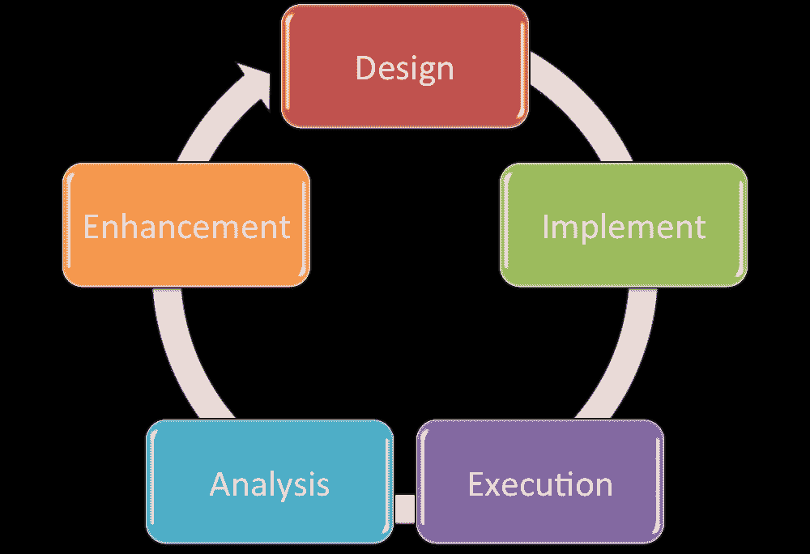

在**设计**阶段，我们确定我们的目标和相应地设计微基准测试。在**实现**阶段，我们编写微基准测试，然后在**执行**阶段实际运行测试。有了微基准测试的结果，我们在**分析**阶段解释和分析结果。这导致在**增强**阶段对代码进行改进。一旦我们的代码被更新，我们重新设计微基准测试，调整实现，或者直接进入**执行**阶段。这是一个循环过程，直到我们达到目标中确定的性能优化。

# 使用 JMH 的方法

Oracle 的文档表明，最理想的 JMH 使用案例是使用依赖于应用程序 JAR 文件的 Maven 项目。他们还建议，微基准测试应通过命令行进行，而不是在**集成开发环境**（**IDE**）内进行，因为这可能会影响结果。

Maven，也称为 Apache Maven，是一个项目管理和理解工具，我们可以用它来管理我们的应用程序项目构建、报告和文档。

要使用 JMH，我们将使用字节码处理器（注解）来生成基准代码。我们使用 Maven 存档来启用 JMH。

为了测试 JMH，我们需要一个支持 Maven 和 Java 9 的 IDE。如果您还没有 Java 9 或支持 Java 9 的 IDE，您可以按照下一节中的步骤进行操作。

# 安装 Java 9 和具有 Java 9 支持的 Eclipse

您可以从 JDK 9 早期访问构建页面下载并安装 Java 9——[`jdk.java.net/9/`](http://jdk.java.net/9/)。

安装 Java 9 后，下载 Eclipse 的最新版本。在撰写本书时，那是 Oxygen。以下是相关链接——[`www.eclipse.org/downloads/`](https://www.eclipse.org/downloads/)。

下一步是在您的 IDE 中启用 Java 9 支持。启动 Eclipse Oxygen 并选择帮助 | Eclipse Marketplace...，如图所示：

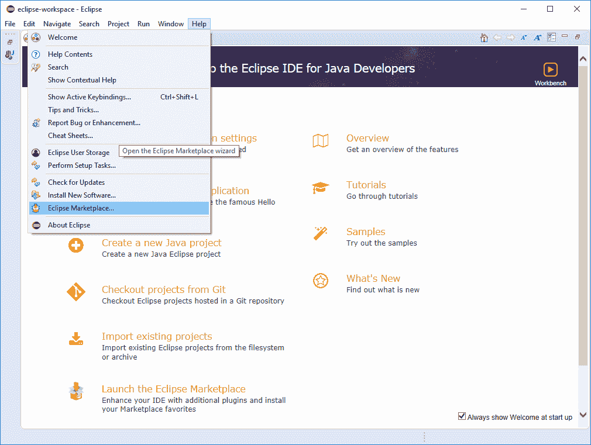

当 Eclipse Marketplace 对话框窗口打开时，使用搜索框搜索`Java 9 支持`。如图所示，您将看到一个安装按钮：

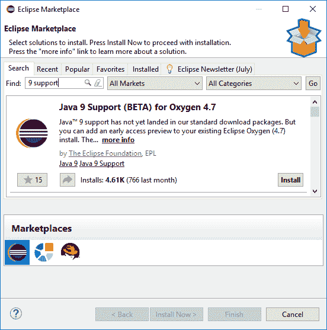

在安装过程中，您将需要接受许可协议，并在完成后，您将需要重新启动 Eclipse。

# 实践实验

现在我们已经将 Eclipse 更新为支持 Java 9，您可以运行快速测试以确定 JMH 是否在您的开发计算机上工作。首先，创建一个新的 Maven 项目，如图所示：

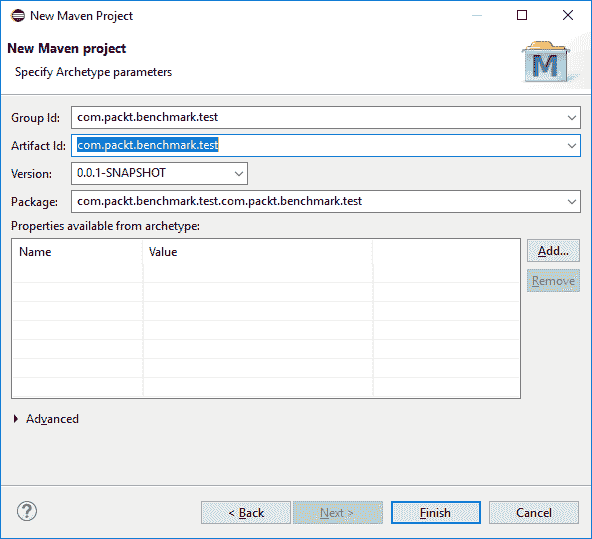

接下来，我们需要添加一个依赖项。我们可以通过直接编辑`pom.xml`文件来实现，以下是相应的代码：

```java
    <dependency>
      <groupId>org.openjdk.jmh</groupId>
      <artifactId>jmh-core</artifactId>
      <version>0.1</version>
    </dependency>
```

或者，我们可以使用依赖项标签页，在对话框窗口中输入数据，如图所示。使用此表单将更新`pom.xml`文件中的上述代码：

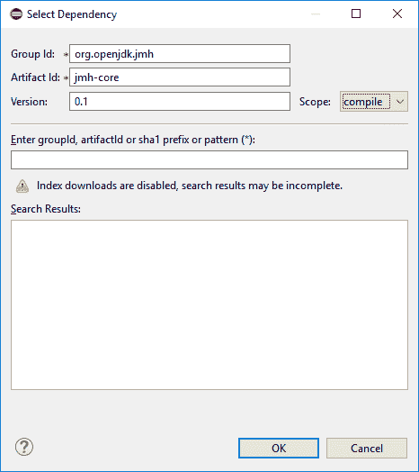

接下来，我们需要编写一个包含 JMH 方法的类。这只是一个初始测试，以确认我们最近更新的开发环境。以下是您可以用于测试的示例代码：

```java
    package com.packt.benchmark.test.com.packt.benchmark.test;

    import org.open.jdk.jmh.Main;

    public class Test 
    {

      public static void main(String[] args)
      {
        Main.main(args);
      }
    }
```

现在，我们可以编译并运行我们的非常简单的测试程序。结果在控制台标签页中提供，或者如果您使用的是命令行，则是实际的控制台。以下是您将看到的内容：

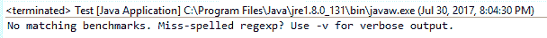

你可以看到程序运行得足够好，足以让我们知道 JMH 正在工作。当然，正如输出所示，没有设置基准。我们将在下一节中处理这个问题。

# 使用 Maven 进行微基准测试

开始使用 JMH 的一个方法是通过 JMH Maven 原型。第一步是创建一个新的 JMH 项目。在我们的系统命令提示符中，我们将输入`mvn`命令，后面跟着一系列参数来创建一个新的 Java 项目和必要的 Maven `pom.xml`文件：

```java
mvn archetype:generate -DinteractiveMode=false -DarchetypeGroupId=org.openjdk.jmh -DarchetypeArtifactId=jmh -java-benchmark-archetype -DgroupId=com.packt -DartifactId=chapter8-benchmark -Dversion=1.0
```

一旦你输入`mvn`命令和前面的详细参数，你将通过终端看到报告给你的结果。根据你的使用水平，你可能会看到来自[`repo.maven.apache.org/maven2/org/apache/mave/plugins`](https://repo.maven.apache.org/maven2/org/apache/mave/plugins)和其他类似仓库站点的大量下载。

你还会看到一个信息部分，它会告诉你关于项目构建过程的信息：

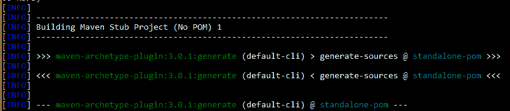

很可能还会从[`repo.maven.apache.org`](https://repo.maven.apache.org)仓库下载额外的插件和其他资源。然后，你将看到一个信息反馈组件，它会让你知道项目正在批量模式下生成：

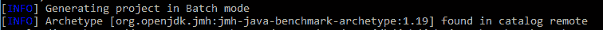

最后，你将看到一个参数集和一个说明，表明你的项目构建成功。正如以下示例所示，整个过程不到 21 秒就完成了：

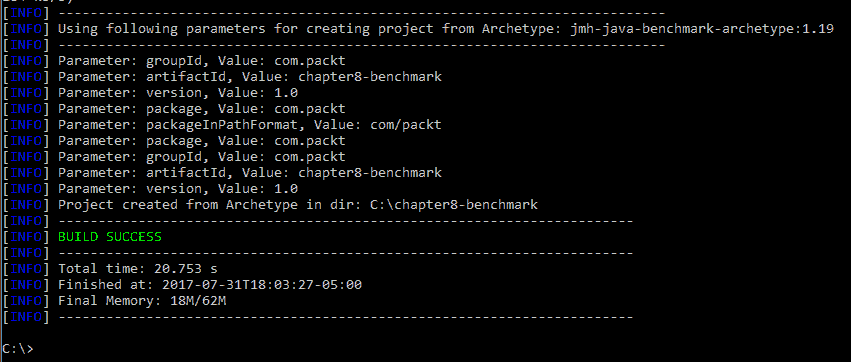

将根据我们在`-DartifactId`选项中包含的参数创建一个文件夹。在我们的例子中，我们使用了`-DartifactId=chapter8-benchmark`，Maven 创建了一个`chapter8-benchmark`项目文件夹：


你将看到 Maven 创建了`pom.xml`文件以及一个源（`src`）文件夹。在该文件夹中，位于`C:\chapter8-benchmark\src\main\java\com\packt`的子目录结构下是`MyBenchmark.java`文件。Maven 为我们创建了一个基准类：


这是 JMH Maven 项目创建过程中创建的`MyBenchmark.java`类的内容：

```java
    /*
     * Copyright (c) 2014, Oracle America, Inc.
     * All rights reserved.
     *
     * Redistribution and use in source and binary forms, with or 
       without
     * modification, are permitted provided that the following 
       conditions are met:
     *
     * * Redistributions of source code must retain the above
         copyright notice,
     * this list of conditions and the following disclaimer.
     *
     * * Redistributions in binary form must reproduce the above 
         copyright
     * notice, this list of conditions and the following
       disclaimer in the
     * documentation and/or other materials provided with the 
       distribution.
     *
     * * Neither the name of Oracle nor the names of its 
         contributors may be used
     * to endorse or promote products derived from this software 
       without
     * specific prior written permission.
     *
     * THIS SOFTWARE IS PROVIDED BY THE COPYRIGHT HOLDERS AND 
       CONTRIBUTORS "AS IS"
     * AND ANY EXPRESS OR IMPLIED WARRANTIES, INCLUDING, BUT NOT 
       LIMITED TO, THE
     * IMPLIED WARRANTIES OF MERCHANTABILITY AND FITNESS FOR A 
       PARTICULAR PURPOSE
     * ARE DISCLAIMED. IN NO EVENT SHALL THE COPYRIGHT HOLDER OR 
       CONTRIBUTORS BE
     * LIABLE FOR ANY DIRECT, INDIRECT, INCIDENTAL, SPECIAL, 
       EXEMPLARY, 
       OR
     * CONSEQUENTIAL DAMAGES (INCLUDING, BUT NOT LIMITED TO, 
       PROCUREMENT OF
     * SUBSTITUTE GOODS OR SERVICES; LOSS OF USE, DATA, OR PROFITS;
       OR BUSINESS
     * INTERRUPTION) HOWEVER CAUSED AND ON ANY THEORY OF LIABILITY, 
       WHETHER IN
     * CONTRACT, STRICT LIABILITY, OR TORT (INCLUDING NEGLIGENCE OR 
       OTHERWISE)
     * ARISING IN ANY WAY OUT OF THE USE OF THIS SOFTWARE, EVEN IF 
       ADVISED OF
     * THE POSSIBILITY OF SUCH DAMAGE.
     */

    package com.packt;

    import org.openjdk.jmh.annotations.Benchmark;

    public class MyBenchmark 
    {
      @Benchmark
      public void testMethod() 
      {

        // This is a demo/sample template for building your JMH 
           benchmarks. 
        //Edit as needed.
        // Put your benchmark code here.
      }
    }
```

我们下一步是修改`testMethod()`，使其有可测试的内容。以下是我们将用于基准测试的修改后的方法：

```java
    @Benchmark
    public void testMethod() 
    {
      int total = 0;
      for (int i=0; i<100000; i++)
      {
        total = total + (i * 2 );
      }
      System.out.println("Total: " + total);
    }
```

在我们的代码编辑完成后，我们将导航回项目文件夹，例如在我们的例子中，回到`C:\chapter8-benchmark`，并在命令提示符下执行`mvn clean install`。

你将看到几个仓库下载、源编译、插件安装，最后是如这里所示的成功构建指示器：

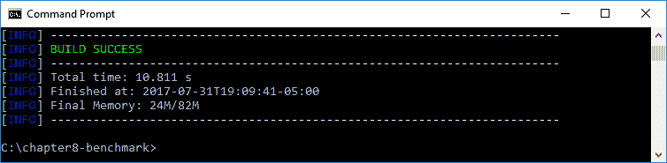

现在，你将在项目目录中看到`.classpath`和`.project`文件，以及新的`.settings`和目标子文件夹：


如果你导航到`\target`子文件夹，你会看到我们的`benchmarks.jar`文件已被创建。这个 JAR 文件包含我们运行基准测试所需的内容。

我们可以在 IDE 中更新我们的`MyBenchmark.java`文件，例如 Eclipse。然后，我们可以再次执行`mvn clean install`来覆盖我们的文件。在初始时间之后，我们的构建将会快得多，因为不需要下载任何内容。以下是除了第一次之外构建过程的输出：

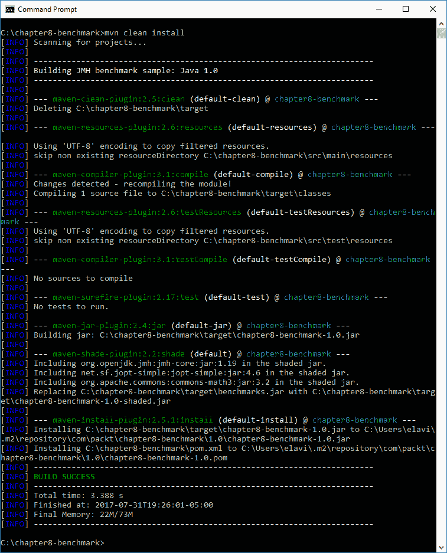

我们的最后一步是运行基准工具。我们可以使用以下命令来执行--`java -jar benchmarks.jar`。即使是针对简单代码的小型基准测试，就像我们的例子一样，基准测试可能需要一些时间来运行。可能会进行几个迭代，包括预热，以提供更简洁和有效的基准测试结果集。

我们的基准测试结果在此提供。正如你所见，测试运行了 8 分钟 8 秒：

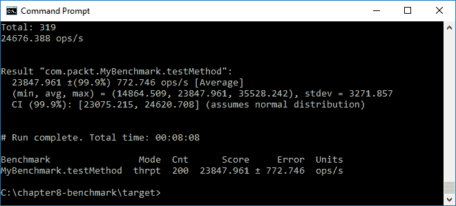

# 基准测试选项

在前面的章节中，你学习了如何运行基准测试。在本节中，我们将查看运行基准测试的可配置选项：

+   模式

+   时间单位

# 模式

我们之前章节中基准测试结果的输出包括一个**模式**列，其值为**thrpt**，它是**吞吐量**的缩写。这是默认模式，还有另外四种模式。所有 JMH 基准测试模式都列在下面，并作如下描述：

| **模式** | **描述** |
| --- | --- |
| 所有 | 测量所有其他模式，包括它们。 |
| 平均 | 此模式测量单个基准运行的平均时间。 |
| 样本时间 | 此模式测量基准测试执行时间，包括最小和最大时间。 |
| 单次射击时间 | 使用此模式，没有 JVM 预热，测试是为了确定单个基准方法运行所需的时间。 |
| 吞吐量 | 这是默认模式，测量基准测试每秒可以运行的操作数。 |

要指定要使用的基准测试模式，你需要修改你的`@Benchmark`代码行，如下所示：

```java
    @Benchmark @BenchmarkMode(Mode.All)
    @Benchmark @BenchmarkMode(Mode.Average)
    @Benchmark @BenchmarkMode(Mode.SamplmeTime)
    @Benchmark @BenchmarkMode(Mode.SingleShotTime)
    @Benchmark @BenchmarkMode(Mode.Throughput)
```

# 时间单位

为了在基准测试输出中获得更高的精确度，我们可以指定一个特定的时间单位，以下是从短到长的列表：

+   `NANOSECONDS`

+   `MICROSECONDS`

+   `MILLISECONDS`

+   `SECONDS`

+   `MINUTES`

+   `HOURS`

+   `DAYS`

为了进行此指定，我们只需将以下代码添加到我们的`@Benchmark`行：

```java
    @Benchmark @BenchmarkMode(Mode.Average) 
    @OutputTimeUnit(TimeUnit.NANOSECONDS)
```

在前面的例子中，我们指定了平均模式和纳秒作为时间单位。

# 避免微基准测试陷阱的技术

微基准测试不是每个开发者都必须担心的事情，但对于那些需要的人来说，有一些陷阱你应该注意。在本节中，我们将回顾最常见的陷阱，并提出避免它们的策略。

# 管理电力

有许多子系统可以帮助您管理功率和性能之间的平衡（即`cpufreq`）。这些系统可以改变基准测试期间的时间状态。

针对这个陷阱，有两种建议的策略：

+   在运行测试之前禁用任何电源管理系统

+   运行更长时间的基准测试

# 操作系统调度器

操作系统调度器，如 Solaris 调度器，有助于确定哪些软件进程可以访问系统资源。使用这些调度器可能导致不可靠的基准测试结果。

针对这个陷阱，有两种建议的策略：

+   优化您的系统调度策略

+   运行更长时间的基准测试

# 时间共享

时间共享系统用于帮助平衡系统资源。使用这些系统通常会导致线程启动和停止时间之间的不规则间隔。此外，CPU 负载将不会均匀，我们的基准测试数据对我们来说将不那么有用。

避免这个陷阱有两种建议的策略：

+   在运行基准测试之前测试所有代码，以确保一切按预期工作

+   使用 JMH 在所有线程启动后或所有线程停止后进行测量

# 消除死代码和常量折叠

死代码和常量折叠通常被称为冗余代码，而我们的现代编译器在消除它们方面相当出色。死代码的一个例子是永远不会被执行的代码。考虑以下示例：

```java
    . . . 

    int value = 10;

    if (value != null)
    {
      System.out.println("The value is " + value + ".");
    } else 
      {
         System.out.println("The value is null."); // This is
         a line of Dead-Code
    }

    . . . 
```

在我们前面的例子中，被识别为死代码的行永远不会被执行，因为变量的值永远不会等于 null。它在条件`if`语句评估变量之前立即被设置为`10`。

问题在于，在尝试消除死代码的过程中，基准测试代码有时会被移除。

常量折叠是在编译时约束被替换为实际结果时发生的编译器操作。编译器执行常量折叠以消除任何冗余的运行时计算。在以下示例中，我们有一个`final int`后面跟着一个基于涉及第一个`int`的数学计算的第二个`int`：

```java
    . . . 

    static final int value = 10;

    int newValue = 319 * value;

    . . . 
```

常量折叠操作会将前面代码的两行转换为以下内容：

```java
    int newValue = 3190;
```

针对这个陷阱，有一种建议的策略：

+   使用 JMH API 支持来确保您的基准测试代码不会被消除

# 运行到运行的变化

在基准测试中，有许多问题可能会极大地影响运行到运行的变化。

针对这个陷阱，有两种建议的策略：

+   在每个子系统内多次运行 JVM

+   使用多个 JMH 人员

# 缓存容量

**动态随机存取存储器**（**DRAM**）非常慢。这可能导致基准测试期间非常不同的性能结果。

针对这个陷阱，有两种建议的策略：

+   使用不同的问题集运行多个基准测试。在测试期间跟踪您的内存占用。

+   使用`@State`注解来指定 JMH 状态。此注解用于定义实例的作用域。有三个状态：

    +   `Scope.Benchmark`：实例在运行相同测试的所有线程之间共享。

    +   `Scope.Group`：每个线程组分配一个实例。

    +   `Scope.Thread`：每个线程将拥有自己的实例。这是默认状态。

# 摘要

在本章中，我们了解到 JMH 是一个用于为 JVM 编写基准测试的 Java 工具库。我们通过使用 Maven 和 JMH 来编写性能测试，帮助说明使用新 Java 9 平台进行微基准测试的流程。我们从微基准测试概述开始，然后深入探讨了使用 Maven 进行微基准测试，回顾了基准测试选项，并以一些避免微基准测试陷阱的技术作为总结。

在下一章中，我们将学习编写一个管理其他进程并利用 Java 9 平台现代进程管理 API 的应用程序。
