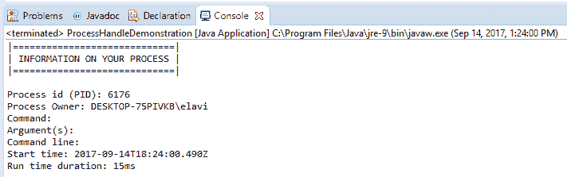
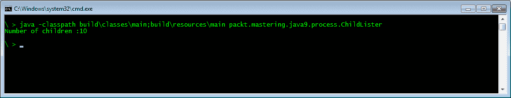
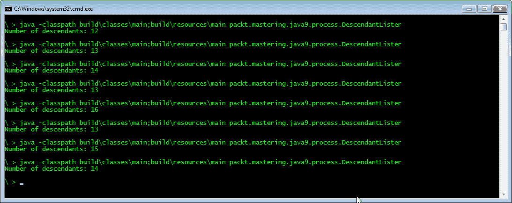
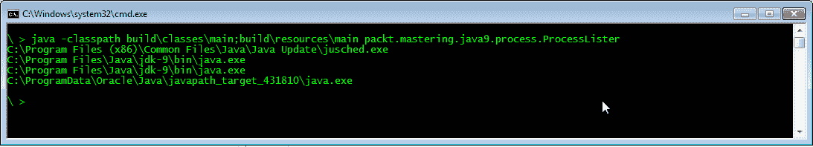

# 第九章：利用 ProcessHandle API

在上一章中，我们发现了 **Java 微基准测试工具**（**JMH**）。我们探讨了性能测试以及如何使用 JMH（Java 虚拟机基准测试的 Java 库）编写它们。我们从微基准测试的概述开始，然后查看使用 Maven 进行微基准测试，回顾基准测试选项，并以避免微基准测试陷阱的技术结束。

在本章中，我们将重点关注 `Process` 类的更新和新的 `java.lang.ProcessHandle` API。在 Java 9 之前，Java 中管理进程从未容易过，因为 Java 很少被用来自动化控制其他进程。API 缺乏一些功能，一些任务需要以系统特定的方式解决。例如，在 Java 8 中，给进程访问其自己的 **进程标识符**（**PID**）是一个不必要的困难任务。

在本章中，读者将获得编写管理其他进程并利用 Java 现代进程管理 API 的应用程序所需的所有知识。

在本章中，我们将涵盖以下主题：

+   什么是 `ProcessHandle` 接口以及如何使用它

+   如何获取当前进程的 PID

+   如何列出操作系统中运行的不同进程

+   如何有效地等待外部进程完成

+   如何终止外部进程

# 进程是什么？

在本节中，我们将回顾在 Java 应用程序编程的上下文中进程是什么。如果你已经熟悉进程，你可能考虑跳过这一节。

进程是操作系统中的执行单元。当你启动一个程序时，你就启动了一个进程。当机器启动代码时，它首先执行的是启动进程。然后，这个进程启动其他进程，这些进程成为启动进程的子进程。这些子进程可能再启动其他进程。这样，当机器运行时，就有进程树在运行。当机器执行某事时，它是在某个进程内部执行的代码中完成的。操作系统也以几个同时执行的过程运行。应用程序作为单个或多个进程执行。大多数应用程序作为单个进程运行，但以一个例子来说，Chrome 浏览器启动了几个进程来完成所有的渲染和网络通信操作，最终作为一个浏览器工作。

要更好地了解进程是什么，请在 Windows 上启动任务管理器或在 OS X 上启动活动监视器，然后点击进程标签。你将看到机器上当前存在的不同进程。使用这些工具，你可以查看进程的参数，或者你可以终止单个进程。

每个进程都有为其工作分配的内存，并且不允许它们自由访问彼此的内存。

操作系统调度执行的执行单元是一个线程。一个进程由一个或多个线程组成。这些线程由操作系统调度器调度，并在时间槽中执行。

每个操作系统都有进程标识符，这是一个标识进程的数字。在任何时候，两个进程都不能同时活跃，共享相同的 PID。当我们想要在操作系统中识别一个活动进程时，我们使用 PID。在 Linux 和其他类 Unix 操作系统中，`kill`命令用于终止进程。要传递给此程序的参数是要终止的进程的 PID。终止可以是优雅的，就像请求进程退出一样。如果进程决定不退出，它可以继续运行。程序可以准备在收到此类请求时停止。例如，Java 应用程序可以添加一个调用`Runtime.getRuntime().addShutdownHook(Thread t)`方法的`Thread`对象。传递的线程应该在进程被请求停止时启动，并且线程可以执行程序退出前必须完成的全部任务。然而，没有保证它一定会启动。这取决于实际的实现。

# 新的`ProcessHandle`接口

在 Java 9 中，有两个新的接口及其实现支持操作系统进程的处理。其中之一是`ProcessHandle`，另一个是`ProcessHandle.Info`，它是前者的嵌套接口。

`ProcessHandle`对象标识一个操作系统进程，并提供管理进程的方法。在 Java 的早期版本中，这只能通过使用 PID 来识别进程的操作系统特定方法来实现。这种方法的主要问题是 PID 仅在进程活动时是唯一的。当进程结束时，操作系统可以自由地重新使用 PID 为新进程分配。当我们只知道进程的 PID 并检查该进程是否仍在运行时，我们实际上是在检查是否存在具有该 PID 的活动进程。当我们检查时，我们的进程可能仍然存活，但当我们下次查询进程状态时，它可能是一个不同的进程。

桌面和服务器操作系统会尽可能长时间地不重复使用 PID 值。在某些嵌入式系统中，操作系统可能只使用 16 位来存储 PID。当只使用 16 位值时，PID 被重复使用的可能性更大。我们可以使用`ProcessHandle` API 来避免这个问题。我们可以接收一个`ProcessHandle`并调用`handle.isAlive()`方法。当进程结束时，此方法将返回`false`。即使 PID 被重复使用，这也同样有效。

# 获取当前进程的 PID

我们可以通过句柄访问进程的 PID。`handle.getPid()` 方法返回一个表示 PID 数值的 `Long`。由于通过句柄访问进程更安全，因此此方法的重要性有限。当我们的代码想要向某些其他管理工具提供关于自身的信息时，它可能很有用。程序创建一个以数值 PID 命名的文件是一种常见做法。可能存在某些程序不能在多个进程中运行的要求。在这种情况下，代码将自身的 PID 文件写入特定目录。如果已存在同名 PID 文件，则处理停止。如果先前的进程崩溃并终止而没有删除 PID 文件，那么系统管理员可以轻松删除该文件并启动新进程。如果程序挂起，那么如果系统管理员知道 PID，则可以轻松地杀死该死进程。

要获取当前进程的 PID，可以使用调用链 `ProcessHandle.current(). getPid()`.

# 获取进程信息

要获取关于进程的信息，我们需要访问进程的 `Info` 对象。这可以通过 `ProcessHandle` 来获取。我们通过调用 `handle.info()` 方法来返回它。

`Info` 接口定义了查询方法，用于提供关于进程的信息。这些方法是：

+   `command()` 返回一个包含用于启动进程的命令的 `Optional<String>`

+   `arguments()` 返回一个包含在命令行上用于启动进程的参数的 `Optional<String[]>`

+   `commandLine()` 返回一个包含整个命令行的 `Optional<String>`

+   `startInstant()` 返回一个 `Optional<Instant>`，它本质上表示进程启动的时间

+   `totalCpuDuration()` 返回一个 `Optional<Duration>`，它表示进程自启动以来使用的 CPU 时间

+   `user()` 返回一个包含属于该进程的用户名称的 `Optional<String>`

这些方法返回的值都是 `Optional`，因为没有保证实际操作系统或 Java 实现可以返回这些信息。然而，在大多数操作系统上，它应该可以工作，并且返回的值应该是存在的。

以下示例代码显示了给定进程的信息：

```java
    import java.io.IOException;
    import java.time.Duration;
    import java.time.Instant;
    public class ProcessHandleDemonstration
    {
      public static void main(String[] args) throws 
       InterruptedException, IOException
      {
        provideProcessInformation(ProcessHandle.current());
        Process theProcess = new
         ProcessBuilder("SnippingTool.exe").start();
        provideProcessInformation(theProcess.toHandle());
        theProcess.waitFor();
        provideProcessInformation(theProcess.toHandle());
      }
      static void provideProcessInformation(ProcessHandle theHandle)
      {
        // get id
        long pid = ProcessHandle.current().pid();
        // Get handle information (if available)
        ProcessHandle.Info handleInformation = theHandle.info();
        // Print header
        System.out.println("|=============================|");
        System.out.println("| INFORMATION ON YOUR PROCESS |");
        System.out.println("|=============================|\n");
        // Print the PID
        System.out.println("Process id (PID): " + pid);
        System.out.println("Process Owner: " + 
          handleInformation.user().orElse(""));
        // Print additional information if available
        System.out.println("Command:" + 
         handleInformation.command().orElse(""));
        String[] args = handleInformation.arguments().orElse
         (new String[]{});
        System.out.println("Argument(s): ");
        for (String arg: args) System.out.printf("\t" + arg);
        System.out.println("Command line: " + handleInformation.
         commandLine().orElse(""));
        System.out.println("Start time: " + 
         handleInformation.startInstant().
         orElse(Instant.now()).toString());
        System.out.printf("Run time duration: %sms%n",
         handleInformation.totalCpuDuration()
         .orElse(Duration.ofMillis(0)).toMillis());
      }
    }
```

以下是上述代码的控制台输出：



# 列出进程

在 Java 9 之前，我们没有获取活动进程列表的方法。随着 Java 9 的推出，现在可以通过流来获取进程。有三个方法返回 `Stream<ProcessHandle>`。一个列出子进程。另一个列出所有后代；子进程及其子进程的子进程。第三个列出所有进程。

# 列出子进程

要获取可以用来控制子进程的进程句柄流，应使用静态方法 `processHandle.children()`。这将创建由 `processHandle` 表示的进程的后代进程的快照并创建 `Stream`。由于进程是动态的，因此无法保证在代码执行期间，当我们的程序处理句柄时，所有子进程都仍然是活动的。其中一些可能已终止，我们的进程可能产生了新的子进程，可能来自不同的线程。因此，代码不应假设流中的每个 `ProcessHandle` 元素代表一个活跃且正在运行的进程。

以下程序在 Windows 中启动 10 个命令提示符，然后计算子进程的数量并将其打印到标准输出：

```java
    package packt.mastering.java9.process;

    import java.io.IOException;

    public class ChildLister {
      public static void main(String[] args) throws IOException {
        for (int i = 0; i < 10; i++) {
          new ProcessBuilder().command("cmd.exe").start();
        }
        System.out.println("Number of children :" +
         ProcessHandle.current().children().count());
      }
    }
```

执行程序将产生以下结果：



# 列出后代

列出后代与列出子进程非常相似，但如果我们调用 `processHandle.descendants()` 方法，则 `Stream` 将包含所有子进程以及这些子进程的后代进程，依此类推。以下程序以命令行参数启动命令提示符，以便它们也生成另一个终止的 `cmd.exe`：

```java
    package packt.mastering.java9.process;

    import java.io.IOException;
    import java.util.stream.Collectors;

    public class DescendantLister {
      public static void main(String[] args) throws IOException {
        for (int i = 0; i < 10; i++) {
          new ProcessBuilder().command("cmd.exe","/K","cmd").                
           start();
        }
        System.out.println("Number of descendants: " +
         ProcessHandle.current().descendants().count();
      }
    }
```

执行命令几次将导致以下非确定性的输出：



输出清楚地表明，当创建后代的 `Stream` 时，并非所有进程都是活动的。示例代码启动了 10 个进程，每个进程又启动了另一个。`Stream` 中没有 20 个元素，因为其中一些子进程在处理过程中已终止。

# 列出所有进程

列出所有进程与列出后代和子进程略有不同。方法 `allProcess()` 是静态的，并在执行时返回一个包含操作系统所有活动进程句柄的 `Stream`。

以下示例代码将看似 Java 进程的进程命令打印到控制台：

```java
    package packt.mastering.java9.process;
    import java.lang.ProcessHandle.Info;
    public class ProcessLister {
      private static void out(String format, Object... params) {
        System.out.println(String.format(format, params));
      }
      private static boolean looksLikeJavaProcess(Info info) {
        return info.command().isPresent() &&
         info.command().get().
         toLowerCase().indexOf("java") != -1;
      }

      public static void main(String[] args) {
        ProcessHandle.allProcesses().
         map(ProcessHandle::info).
         filter(info -> looksLikeJavaProcess(info)).
         forEach(
           (info) -> System.out.println(
             info.command().orElse("---"))
         );
      }

    }
```

程序的输出列出了包含字符串 `java` 的所有进程命令：



您的实际输出可能当然不同。

# 等待进程

当一个进程启动另一个进程时，它可能需要多次等待该进程，因为它需要另一个程序的结果。如果可以以某种方式组织任务结构，使得父程序可以在等待子进程完成时做其他事情，那么父进程可以在进程句柄上调用 `isAlive()` 方法。很多时候，父进程直到派生的进程完成都没有事情可做。旧应用程序实现了循环，调用 `Thread.sleep()` 方法，这样就不会过度浪费 CPU，并且不时检查进程是否仍然存活。Java 9 提供了一种更好的等待进程的方法。

`ProcessHandle`接口有一个名为`onExit`的方法，该方法返回一个`CompletableFuture`。这个类是在 Java 8 中引入的，使得在没有循环的情况下等待任务完成成为可能。如果我们有一个进程的句柄，我们可以简单地调用`handle.onExit().join()`方法来等待进程结束。返回的`CompletableFuture`对象的`get()`方法将返回最初用于创建它的`ProcessHandle`实例。

我们可以在句柄上多次调用`onExit()`方法，每次都会返回一个不同的`CompletableFuture`对象，每个对象都与同一个进程相关。我们可以在对象上调用`cancel()`方法，但它只会取消`CompletableFuture`对象，而不会取消进程，并且对由同一个`ProcessHandle`实例创建的其他`CompletableFuture`对象也没有任何影响。

# 终止进程

要终止一个进程，我们可以在`ProcessHandle`实例上调用`destroy()`方法或`destroyForcibly()`方法。这两个方法都会终止进程。`destroy()`方法预期会优雅地终止进程，执行进程关闭序列。在这种情况下，如果实际实现支持进程的优雅、正常终止，则会执行添加到运行时的关闭钩子。`destroyForcibly()`方法将强制进程终止，在这种情况下，关闭序列将不会执行。

如果由句柄管理的进程已经不活跃，那么当代码调用这些方法中的任何一个时，都不会发生任何事情。如果在调用句柄上的`onExit()`方法时创建了任何`CompletableFuture`对象，那么在进程终止后调用`destroy()`或`destroyForcefully()`方法时，它们将会完成。这意味着`CompletableFuture`对象将在进程终止完成后的一段时间后从`join()`或类似方法返回，而不是在`destroy()`或`destroyForcefully()`返回后立即返回。

还很重要的一点是，进程的终止可能取决于许多因素。如果实际等待终止另一个进程的进程没有终止另一个进程的权限，那么请求将失败。在这种情况下，方法的返回值是`false`。同样重要的是要理解，返回值为`true`并不意味着进程实际上已经终止。它只意味着操作系统已接受终止请求，操作系统将在未来的某个时刻终止进程。这实际上会很快发生，但不是瞬间发生，因此如果在`destroy()`或`destroyForcefully()`返回`true`后的一段时间内，`isAlive()`方法返回`true`，这不应感到惊讶。

`destroy()` 和 `destroyForcefully()` 之间的区别是具体实现相关。Java 标准并没有声明 `destroy()` 会终止进程并执行关闭序列。它只是 *请求终止进程*。由这个 ProcessHandle 对象表示的进程是否 *正常终止* 取决于具体实现（[`download.java.net/java/jdk9/docs/api/java/lang/ProcessHandle.html#supportsNormalTermination--`](http://download.java.net/java/jdk9/docs/api/java/lang/ProcessHandle.html#supportsNormalTermination--))*。

要了解更多关于 `ProcessHandle` 接口的信息，请访问 [`download.java.net/java/jdk9/docs/api/java/lang/ProcessHandle.html`](http://download.java.net/java/jdk9/docs/api/java/lang/ProcessHandle.html)。

这是因为某些操作系统没有实现优雅的进程终止功能。在这种情况下，`destroy()` 的实现与调用 `destroyForcefully()` 相同。接口 `ProcessHandle` 的系统特定实现必须实现 `supportsNormalTermination()` 方法，该方法仅在实现支持正常（非强制）进程终止时返回 `true`。该方法预期对所有实际调用返回相同的值，并且在 JVM 实例执行期间不应更改返回值。不需要多次调用该方法。

以下示例演示了进程启动、进程终止和等待进程终止。在我们的示例中，我们使用了两个类。第一个类演示了 `.sleep()` 方法：

```java
    package packt.mastering.java9.process; 

    public class WaitForChildToBeTerminated  
    { 
      public static void main(String[] args) 
       throws InterruptedException  
      { 
        Thread.sleep(10_000); 
      } 
    } 
```

我们示例中的第二个类调用了 `WaitForChildToBeTerminated` 类：

```java
    package packt.mastering.java9.process;

    import java.io.IOException;
    import java.util.Arrays;
    import java.util.concurrent.CompletableFuture;
    import java.util.stream.Collectors;

    public class TerminateAProcessAfterWaiting {
      private static final int N = 10;

      public static void main(String[] args)
       throws IOException, InterruptedException {  
         ProcessHandle ph[] = new ProcessHandle[N];

         for (int i = 0; i < N; i++)  
         {
           final ProcessBuilder pb = ew ProcessBuilder(). 
            command("java", "-cp", "build/classes/main",
            "packt.mastering.java9.process.
            WaitForChildToBeTerminated");
           Process p = pb.start();
           ph[i] = p.toHandle();
         }
         long start = System.currentTimeMillis();
         Arrays.stream(ph).forEach(ProcessHandle::destroyForcibly);

         CompletableFuture.allOf(Arrays.stream(ph).
          map(ProcessHandle::onExit).
          collect(Collectors.toList()).
          toArray(new CompletableFuture[ph.length])).
          join();
         long duration = System.currentTimeMillis() - start;
         System.out.println("Duration " + duration + "ms");
      }
    }
```

上述代码启动了 10 个进程，每个进程执行一个睡眠 `10` 秒的程序。然后强制销毁这些进程，更具体地说，操作系统被要求销毁它们。我们的示例将 `CompletableFuture` 数组组合成一个 `CompletableFuture`，这些 `CompletableFuture` 对象是通过各个进程的句柄创建的。

当所有进程完成后，它将打印出测量的时间（以毫秒为单位）。时间间隔从进程创建开始，直到进程创建循环完成。测量时间间隔的结束是当进程被 JVM 通过从 `join()` 方法返回时识别出来。

样本代码将睡眠时间设置为 10 秒。这是一个更明显的时间段。运行代码两次并删除销毁进程的行会导致打印输出速度大大减慢。实际上，测量和打印的经过时间也会显示终止进程有影响。

# 一个小型进程控制器应用程序

为了总结并应用我们在本章中学到的所有内容，我们来看一个示例过程控制应用程序。应用程序的功能非常简单。它从一系列配置文件中读取参数，以启动一些进程，然后如果其中任何一个停止，它会尝试重新启动该进程。

即使是从这个演示版本中，也可以创建出实际应用。你可以通过环境变量指定来扩展过程的参数集。你可以为过程添加默认目录，输入和输出重定向，甚至可以指定一个过程在不被控制应用程序终止和重启的情况下允许消耗多少 CPU。

应用程序由四个类组成。

+   `Main`：这个类包含公共静态`void main`方法，并用于启动守护进程。

+   `Parameters`：这个类包含一个过程的配置参数。在这个简单的例子中，它将只包含一个字段，即`commandLine`。如果应用程序被扩展，这个类将包含默认目录、重定向和 CPU 使用限制数据。

+   `ParamsAndHandle`：这个类实际上就是一个数据元组，它持有对`Parameters`对象的引用以及一个进程句柄。当一个进程死亡并重新启动时，进程句柄会被新的句柄替换，但`Parameters`对象的引用永远不会改变，它是配置。

+   `ControlDaemon`：这个类实现了`Runnable`接口，并作为一个独立的线程启动。

在代码中，我们将使用我们在前几节中讨论的大多数进程 API，*终止进程*，并且我们将使用大量的线程代码和流操作。理解 JVM 的线程工作对于进程管理来说也很重要。然而，当与进程 API 一起使用时，它的重要性被强调了。

# 主类

主方法从命令行参数中获取目录名称。它将此视为相对于当前工作目录的相对路径。它使用同一类中的另一个单独的方法来从目录中的文件中读取配置集，然后启动控制守护进程。以下代码是程序的`main`方法：

```java
    public static void main(String[] args) throws IOException, 
     InterruptedException  
    {
      // DemoOutput.out() simulated - implementation no shown
      DemoOutput.out(new File(".").getAbsolutePath().toString());
      if (args.length == 0)    {
        System.err.println("Usage: daemon directory");
        System.exit(-1);
      }
      Set<Parameters> params = parametersSetFrom(args[0]);
      Thread t = new Thread(new ControlDaemon(params));
      t.start();
    }
```

虽然这是一个守护进程，但我们是以普通线程而不是守护线程的方式启动它的。当一个线程被设置为守护线程时，它不会保持 JVM 存活。当所有其他非守护线程停止时，JVM 将直接退出，守护线程将被停止。在我们的情况下，我们执行的守护线程是唯一一个保持代码运行的那个。在那之后启动了，主线程就没有其他事情可做了，但 JVM 应该保持存活，直到操作员通过发出 Unix `kill`命令或按命令行上的*Control* + *C*来终止它。

使用 JDK 中新的`Files`和`Paths`类，获取指定目录中的文件列表以及从文件中获取参数非常简单：

```java
    private static Set<Parameters>  
     GetListOfFilesInDirectory(String directory) throws IOException  
    {
      return Files.walk(Paths.get(directory))
       .map(Path::toFile)
       .filter(File::isFile)
       .map(file -> Parameters.fromFile(file))
       .collect(Collectors.toSet());
    }
```

我们以 `Path` 对象的形式获取文件流，将其映射到 `File` 对象，然后如果配置目录中有目录，我们将其过滤掉，并将剩余的普通文件映射到 `Parameters` 对象，使用 `Parameters` 类的静态方法 `fromFile`。最后，我们返回一个包含这些对象的 `Set`。

# 参数类

我们的 `Parameters` 类具有一个字段和一个构造函数，如下所示：

```java
    final String[] commandLine;

    public Parameters(String[] commandLine) {
      this.commandLine = commandLine;
    }
```

参数类有两个方法。第一个方法 `getCommandLineStrings` 从属性中获取命令行字符串。这个数组包含命令和命令行参数。如果没有在文件中定义，则返回一个空数组：

```java
    private static String[] getCommandLineStrings(Properties props)  
    {
      return Optional
       .ofNullable(props.getProperty("commandLine"))
       .orElse("")
       .split("\\s+");
    }
```

第二个方法是 `static fromFile`，它从属性文件中读取属性：

```java
    public static Parameters fromFile(final File file)  
    {
      final Properties props = new Properties();
      try (final InputStream is = new FileInputStream(file)) {
        props.load(is);
      }  catch (IOException e) {
           throw new RuntimeException(e);
      }
      return new Parameters(getCommandLineStrings(props));
    }
```

如果程序处理的参数集被扩展，则此类也应进行修改。

# `ParamsAndHandle` 类

`ParamsAndHandle` 是一个非常简单的类，包含两个字段。一个用于参数，另一个是用于访问使用参数启动的进程的进程句柄：

```java
    public class ParamsAndHandle  
    {
      final Parameters params;
      ProcessHandle handle;

      public ParamsAndHandle(Parameters params,
        ProcessHandle handle) {
          this.params = params;
          this.handle = handle;
      }

      public ProcessHandle toHandle() {
        return handle;
      }
    }
```

由于该类与它所使用的 `ControlDaemon` 类紧密相关，因此没有与字段相关联的修改器或访问器。我们将这两个类视为同一封装边界内的东西。`toHandle` 方法存在是为了我们可以将其用作方法句柄，正如我们将在下一章中看到的。

# `ControlDaemon` 类

`ControlDaemon` 类实现了 `Runnable` 接口，并以一个单独的线程启动。构造函数获取从属性文件中读取的参数集，并将其转换为 `ParamsAndHandle` 对象集：

```java
    private final Set<ParamsAndHandle> handlers;

    public ControlDaemon(Set<Parameters> params) {
      handlers = params
      .stream()
      .map( s -> new ParamsAndHandle(s,null))
      .collect(Collectors.toSet());
    }
```

因为进程此时尚未启动，所以句柄都是 `null`。`run()` 方法启动进程：

```java
    @Override
    public void run() {
      try {
        for (ParamsAndHandle pah : handlers) {
          log.log(DEBUG, "Starting {0}", pah.params);
          ProcessHandle handle = start(pah.params);
          pah.handle = handle;
        }
        keepProcessesAlive();
        while (handlers.size() > 0) {
          allMyProcesses().join();
        } 
      } catch (IOException e)  
        {
          log.log(ERROR, e);
        }
    }
```

处理过程遍历参数集，并使用（在此类中稍后实现的）方法启动进程。每个进程的句柄都到达 `ParamsAndHandle` 对象。之后，调用 `keepProcessesAlive` 方法并等待进程完成。当进程停止时，它将被重启。如果无法重启，它将被从集合中移除。

`allMyProcesses` 方法（也在此类中实现）返回一个 `CompletableFuture`，当所有启动的进程都已停止时完成。在 `join()` 方法返回时，一些进程可能已经被重启。只要至少有一个进程正在运行，线程就应该运行。

使用 `CompletableFuture` 等待进程和 `while` 循环，我们使用最小的 CPU 来保持线程存活，只要至少有一个我们管理的进程正在运行，即使经过几次重启也是如此。即使这个线程大部分时间不使用 CPU 且不执行任何代码，我们也必须保持这个线程存活，以便让 `keepProcessesAlive()` 方法使用 `CompletableFutures` 来完成其工作。该方法在下面的代码片段中显示：

```java
    private void keepProcessesAlive()  
    {
      anyOfMyProcesses()
       .thenAccept(ignore -> {
         restartProcesses();
         keepProcessesAlive();
       });
    }
```

`keepProcessesAlive()` 方法调用 `anyOfMyProcesses()` 方法，该方法返回一个 `CompletableFuture`，当任何一个管理进程退出时完成。该方法安排在 `CompletableFuture` 完成时执行传递给 `thenAccept()` 方法的 lambda 表达式。lambda 表达式做两件事：

+   重启已停止的进程（可能只有一个）

+   调用 `keepProcessesAlive()` 方法

需要理解的是，此调用不是在 `keepProcessesAlive()` 方法内部执行的。这不是一个递归调用。这是一个作为 `CompletableFuture` 行动的调度。我们不是在递归调用中实现循环，因为我们可能会耗尽栈空间。当进程重启时，我们要求 JVM 执行器再次执行此方法。

需要知道的是，JVM 使用默认的 `ForkJoinPool` 来调度这些任务，并且这个池中包含守护线程。这就是为什么我们必须等待并保持方法运行的原因，因为这是唯一一个非守护线程，它可以防止 JVM 退出。

下一个方法是 `restartProcesses()`：

```java
    private void restartProcesses()  
    {
      Set<ParamsAndHandle> failing = new HashSet<>();
      handlers.stream()
       .filter(pah -> !pah.toHandle().isAlive())
       .forEach(pah -> {
         try {
           pah.handle = start(pah.params);
         } catch (IOException e) {
             failing.add(pah);
         }
       });
       handlers.removeAll(failing);
    }
```

此方法启动我们管理进程集中的进程，这些进程尚未运行。如果任何重启失败，它会从集中移除失败的进程。（请注意，不要在循环中移除它，以避免 `ConcurrentModificationException`。）

`anyOfMyProcesses()` 和 `allMyProcesses()` 方法使用了辅助的 `completableFuturesOfTheProcessesand()` 方法，并且很简单：

```java
    private CompletableFuture anyOfMyProcesses()  
    {
      return CompletableFuture.anyOf(
        completableFuturesOfTheProcesses());
    }

    private CompletableFuture allMyProcesses() {
      return CompletableFuture.allOf(
        completableFuturesOfTheProcesses());
    }
```

`completableFuturesOfTheProcesses()` 方法返回一个由当前运行的管理的进程调用它们的 `onExit()` 方法创建的 `CompletableFutures` 数组。这以紧凑且易于阅读的函数式编程风格完成，如下所示：

```java
    private CompletableFuture[] completableFuturesOfTheProcesses()  
    {
      return handlers.stream()
       .map(ParamsAndHandle::toHandle)
       .map(ProcessHandle::onExit)
       .collect(Collectors.toList())
       .toArray(new CompletableFuture[handlers.size()]);
    }
```

集合被转换为 `stream`，映射到 `ProcessHandle` 对象的 `stream`（这就是为什么在 `ParamsAndHandle` 类中需要 `toHandle()` 方法的原因）。然后，使用 `onExit()` 方法将句柄映射到 `CompletableFuture` `stream`，最后我们将其收集到一个列表中并转换为数组。

完成我们的示例应用程序的最后一个方法是以下内容：

```java
    private ProcessHandle start(Parameters params)
     throws IOException {
       return new ProcessBuilder(params.commandLine)
        .start()
        .toHandle();
    }
```

此方法使用 `ProcessBuilder` 启动进程，并返回 `ProcessHandle`，以便我们可以替换集中的旧进程并管理新进程。

# 摘要

在本章中，我们讨论了 Java 9 如何更好地帮助我们管理进程。在 Java 9 之前，从 Java 内部管理进程需要特定于操作系统的实现，并且在 CPU 使用和编码实践方面并不理想。现代 API，如 `ProcessHandle` 类，使得处理进程的几乎所有方面成为可能。我们列出了新的 API，并为每个 API 提供了简单的示例代码。在章节的后半部分，我们组合了一个整个应用程序来管理进程，其中所学的 API 得到了实际应用。

在下一章中，我们将详细探讨与 Java 9 一同发布的 Java Stack Walking API。我们将通过代码示例来说明如何使用该 API。
