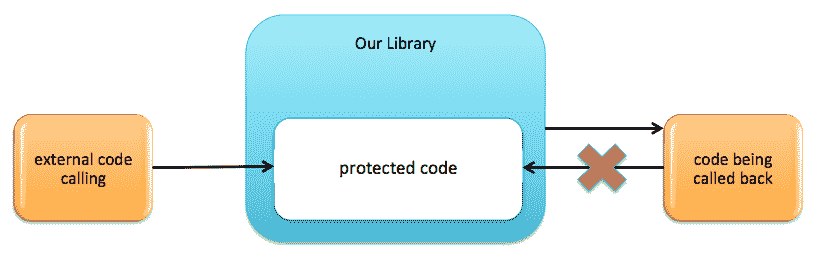
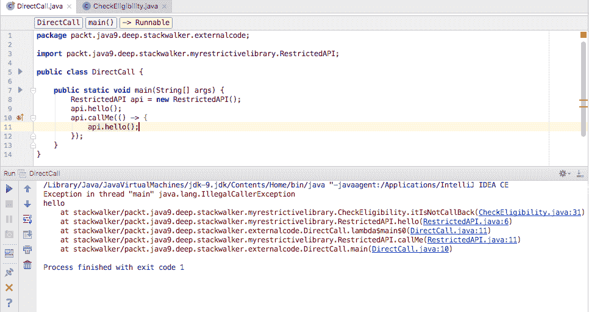

# 第十章：精细粒度堆栈跟踪

Java 9 附带了一个新的堆栈遍历 API，允许程序遍历调用栈。这是一个非常特殊的功能，普通程序很少需要。对于一些非常特殊的情况，API 可能很有用——对于由框架提供的功能。因此，如果您想要一种高效的堆栈遍历方法，该方法可以提供可筛选的堆栈跟踪信息，您将喜欢这个新的堆栈遍历 API。

API 提供了快速和优化的对调用栈的访问，实现了对单个帧的懒访问。

在本章中，我们将介绍以下主题：

+   Java 堆栈概述

+   堆栈信息的重要性

+   使用`StackWalker`

+   `StackFrame`

+   性能

# Java 堆栈概述

在我们深入研究堆栈遍历之前，让我们先从介绍 Java 堆栈开始。这是基本的堆栈信息，并不特定于堆栈遍历。

Java 运行时有一个名为 Stack 的类，可以使用它来存储对象，使用的是**后进先出**（**LIFO**）策略。

当计算算术表达式时，它们是使用堆栈来完成的。如果我们首先在我们的代码中添加*A*和*B*，则*A*会被推送到**操作数栈**，然后*B*被推送到操作数栈，最后执行加法操作，该操作从操作数栈的顶部两个元素中获取结果，并将其推送到那里，即*A* + *B*。

JVM 是用 C 语言编写的，并执行调用 C 函数和从那里返回的操作。这个调用-返回序列是通过使用本地方法栈来维护的，就像任何其他 C 程序一样。

最后，当 JVM 创建一个新的线程时，它也会分配一个包含帧的调用栈，这些帧反过来又包含局部变量、对前一个帧的引用以及对包含执行方法的类的引用。当一个方法被调用时，会创建一个新的帧。当方法完成其执行时，即返回或抛出异常时，帧会被销毁。这个栈，即 Java 虚拟机栈，是堆栈遍历 API 管理的栈。

# 堆栈信息的重要性

一般而言，当我们想要开发依赖于调用者的代码时，我们需要堆栈信息。有关调用者的信息允许我们的代码根据该信息做出决策。在一般实践中，使功能依赖于调用者不是一个好主意。影响方法行为的信息应通过参数提供。依赖于调用者的代码开发应该相当有限。

JDK 使用原生方法访问堆栈信息，这些原生方法对 Java 应用程序不可用。`SecurityManager`是一个定义应用程序安全策略的类。这个类检查反射 API 的调用者是否有权访问另一个类的非公共成员。为了做到这一点，它必须能够访问调用者类，它通过一个受保护的本地方法来实现这一点。

这是一个在不遍历堆栈的情况下实施某些安全措施的示例。我们向外部开发者开放我们的代码，让他们将其用作库。我们还调用库用户提供的类的方法，他们可能反过来调用我们的代码。有一些代码我们希望允许库用户调用，但前提是他们不是从我们的代码中调用的。如果我们不希望允许某些代码直接通过库代码访问，我们可以使用 Java 9 的模块结构，不导出包含不调用类包，以此来实现。这就是我们设置额外条件的原因，即代码对来自外部的调用者可用，除非它们是由我们的代码调用的：



另一个例子是我们想要获取对日志记录器的访问权限。Java 应用程序使用许多不同的日志记录器，日志系统通常非常灵活，可以根据实际需要切换不同日志记录器的输出。最常见的方法是为每个类使用不同的日志记录器，日志记录器的名称通常是类的名称。这种做法非常普遍，以至于日志框架甚至提供了接受类引用而不是名称的日志记录器访问方法。这本质上意味着获取日志记录器句柄的调用看起来如下：

```java
    private static final Logger LOG = Logger.getLogger(MyClass.class); 
```

当我们忘记更改获取新日志记录器调用中的类名时，从现有类创建新类可能会出现问题。这不是一个严重的问题，但很常见。在这种情况下，我们的代码将使用其他类的日志记录器，并且实际上可以工作，但在分析日志文件时可能会造成混淆。如果有一个方法可以返回名为调用者类的日志记录器，那就更好了。

让我们继续在下一两个部分中通过代码片段示例来探索堆栈信息。

# 示例 - 限制调用者

在本节中，我们开发了一个包含两个方法的示例库。`hello()` 方法将 `hello` 打印到标准输出。`callMe()` 方法接受一个 `Runnable` 参数并运行它。然而，第一个方法是受限的。它仅在调用者完全在库外部时执行。如果调用者以库调用 `Runnable` 的方式获得控制权，则会抛出 `IllegalCallerException`。API 的实现很简单：

```java
    package packt.java9.deep.stackwalker.myrestrictivelibrary; 
    public class RestrictedAPI { 
      public void hello(){ 
        CheckEligibility.itIsNotCallBack(); 
        System.out.println("hello"); 
      } 
      public void callMe(Runnable cb){ 
        cb.run(); 
      } 
    } 
```

执行资格检查的代码在一个单独的类中实现，以保持简单。我们很快就会检查那段代码，但在那之前，我们来看看我们用来启动演示的主要代码。我们用来演示功能的程序代码如下：

```java
    package packt.java9.deep.stackwalker.externalcode; 

    import
     packt.java9.deep.stackwalker.myrestrictivelibrary.RestrictedAPI; 

    public class DirectCall { 

      public static void main(String[] args) { 
        RestrictedAPI api = new RestrictedAPI(); 
        api.hello(); 
        api.callMe(() -> { 
            api.hello(); 
        }); 
      } 
    } 
```

此代码创建了我们 API 类的一个实例，然后直接调用 `hello()` 方法。它应该能正常工作并在屏幕上打印出字符 `hello`。下一行代码要求 `callMe()` 方法回调以 lambda 表达式形式提供的 `Runnable`。在这种情况下，调用将失败，因为调用者在外部，但却是从库内部被调用的。

让我们现在看看如何实现资格检查：

```java
    package packt.java9.deep.stackwalker.myrestrictivelibrary; 

    import static java.lang.StackWalker.Option.RETAIN_CLASS_REFERENCE; 

    public class CheckEligibility { 
      private static final String packageName 
        = CheckEligibility.class.getPackageName(); 

      private static boolean notInLibrary(StackWalker.StackFrame f) { 
        return !inLibrary(f); 
      } 

      private static boolean inLibrary(StackWalker.StackFrame f) { 
        return f.getDeclaringClass().getPackageName() 
         .equals(packageName); 
      } 

      public static void itIsNotCallBack() { 
        boolean eligible = StackWalker 
         .getInstance(RETAIN_CLASS_REFERENCE) 
         .walk(s -> s.dropWhile(CheckEligibility::inLibrary) 
           .dropWhile(CheckEligibility::notInLibrary) 
           .count() == 0 
         ); 
         if (!eligible) { 
           throw new IllegalCallerException(); 
         } 
      } 
    } 
```

`itIsNotCallBack()` 方法是从 `hello()` 方法中调用的一个方法。此方法创建了一个栈跟踪器并调用了 `walk()` 方法。`walk()` 方法的参数是一个 `Function`，它将 `StackFrame` 对象的 `Stream` 转换为 `walk()` 方法将返回的其他值。

首先，这个参数设置可能看起来很复杂且难以理解。返回一个提供 `StackFrame` 对象的 `Stream` 可能会更合理，而不是强迫调用者定义一个将作为参数获取此值的 `Function`。

示例代码使用 lambda 表达式来定义 `Function` 作为 `walk()` 方法的参数。lambda 表达式的参数 `s` 是流。由于此流的第一个元素是实际调用，所以我们丢弃它。因为这些调用也应该在调用者不符合条件时被拒绝，即使调用 `hello()` 方法是通过库内部的其他类和方法进行的，我们也丢弃属于 `CheckEligibility` 类包内的所有帧元素。此包是 `packt.java9.deep.stackwalker.myrestrictivelibrary`，在代码中这个字符串存储在字段 `packageName` 中。结果流只包含来自库外部的 `StackFrame` 对象。我们也丢弃这些，直到流耗尽或直到我们找到一个再次属于库的 `StackFrame`。如果所有元素都被丢弃，我们就成功了。在这种情况下，`count()` 的结果为零。如果我们找到 `StackFrame` 中的某个类属于库，这意味着外部代码是从库中调用的，在这种情况下我们必须拒绝工作。在这种情况下，变量 `eligible` 将为 `false`，并且我们抛出一个异常，如以下截图所示：



# 示例 - 获取调用者的日志记录器

要获取一个日志记录器，Java 9 有一个新的 API。使用此 API，一个模块可以为服务 `LoggerFinder` 提供一个实现，该服务反过来可以返回实现 `getLogger()` 方法的 `Logger`。这消除了库对特定日志记录器或日志记录器外观的依赖，这是一个巨大的优势。但仍然存在一个较小但仍然令人烦恼的问题，需要我们再次将类的名称作为 `getLogger()` 方法的参数写入。这个问题仍然存在。

为了避免这项繁琐的任务，我们创建了一个辅助类，该类查找调用者类并检索适合调用者类和模块的记录器。因为在这种情况下，我们不需要在堆栈跟踪中引用的所有类，我们将调用 `StackWalker` 类的 `getCallerClass()` 方法。我们在包 `packt.java9.deep.stackwalker.logretriever` 中创建了一个名为 `Labrador` 的类：

```java
    package packt.java9.deep.stackwalker.logretriever; 

    import java.lang.System.Logger; 
    import java.lang.System.LoggerFinder; 

    import static java.lang.StackWalker.Option.RETAIN_CLASS_REFERENCE; 

    public class Labrador { 
      public static Logger retrieve() { 
        final Class clazz = StackWalker 
          .getInstance(RETAIN_CLASS_REFERENCE) 
          .getCallerClass(); 
        return LoggerFinder.getLoggerFinder().getLogger( 
          clazz.getCanonicalName(), clazz.getModule()); 
      } 
    } 
```

在 Java 9 之前，解决此问题的方法是获取 `Thread` 类的 `StackTrace` 数组，并从那里查找调用者类的名称。另一种方法是扩展具有受保护方法 `getClassContext()` 的 `SecurityManager`，该方法返回堆栈上所有类的数组。这两种解决方案都会遍历堆栈并组成一个数组，尽管我们只需要数组中的一个元素。在日志检索的情况下，由于记录器通常存储在 `private static final` 字段中，因此每个类在类初始化期间只初始化一次，因此性能惩罚可能并不显著。在其他用例中，性能惩罚可能非常显著。

在我们看过两个示例之后，我们将查看 `StackWalker` 内部工作的细节。

# 使用 StackWalker

在本节中，你将更熟悉如何与 `StackWalker` 一起工作。在本节中，我们将探讨以下主题：

+   获取 `StackWalker` 实例

+   栈遍历选项

# 获取 `StackWalker` 实例

要在栈元素上执行遍历，我们需要一个栈遍历器的实例。为此，我们调用 `getInstance()` 方法。如图所示，此方法有四个重载版本：

+   `static StackWalker getInstance()`

+   `static StackWalker getInstance(StackWalker.Option option)`

+   `static StackWalker getInstance(Set<StackWalker.Option> options)`

+   `static StackWalker getInstance(Set<StackWalker.Option> options, int estimateDepth)`

第一个版本不接受任何参数，并返回一个 `StackWalker` 实例，该实例将允许我们遍历正常的栈帧。这通常是我们感兴趣的。该方法的其他版本接受 `StackWalker.Option` 值或值。枚举 `StackWalker.Option`，如名称所示，位于 `StackWalker` 类中，有三个值：

+   `RETAIN_CLASS_REFERENCE`

+   `SHOW_REFLECT_FRAMES`

+   `SHOW_HIDDEN_FRAMES`

这些 `enum` 选项具有自描述的名称，并在下一节中解释。

# RETAIN_CLASS_REFERENCE

如果我们将第一个选项 `enum` 常量 `RETAIN_CLASS_REFERENCE,` 作为 `getInstance()` 方法的参数，那么返回的实例将使我们能够访问在遍历过程中各个栈帧所引用的类。

# SHOW_REFLECT_FRAMES

`SHOW_REFLECT_FRAMES enum` 常量将生成一个包括来自某些反射调用的帧的遍历器。

# SHOW_HIDDEN_FRAMES

最后，枚举常量选项 `SHOW_HIDDEN_FRAMES` 将包括所有隐藏帧，这些帧包含反射调用以及为 lambda 函数调用生成的调用帧。

下面是一个关于反射和隐藏帧的简单演示：

```java
    package packt; 
    import static java.lang.StackWalker.Option.SHOW_HIDDEN_FRAMES; 
    import static java.lang.StackWalker.Option.SHOW_REFLECT_FRAMES; 
    public class Main { 
```

允许我们直接执行此代码的 `main()` 方法调用 `simpleCall()` 方法：

```java
    public static void main(String[] args) { 
      simpleCall(); 
    } 
```

方法 `simpleCall()` 如其名所示，只是简单地调用：

```java
    static void simpleCall() { 
      reflectCall(); 
    } 
```

链中的下一个方法稍微复杂一些。尽管这也只是调用下一个方法，但它使用反射来做到这一点：

```java
    static void reflectCall() { 
      try { 
        Main.class.getDeclaredMethod("lambdaCall", 
          new Class[0]) 
           .invoke(null, new Object[0]); 
      } catch (Exception e) { 
          throw new RuntimeException(); 
      } 
    } 
```

在下一个示例中，我们有一个使用 lambda 调用的方法：

```java
    static void lambdaCall() { 
      Runnable r = () -> { 
        walk(); 
      }; 
      r.run(); 
    } 
```

实际行走前的最后一种方法被称为 `walk()`:

```java
    static void walk() { 
      noOptions(); 
      System.out.println(); 
      reflect(); 
      System.out.println(); 
      hidden(); 
    } 
```

前面的 `walk()` 方法依次调用三个方法。这些方法非常相似，这里提供它们：

```java
    static void noOptions() { 
      StackWalker 
        .getInstance() 
        .forEach(System.out::println); 
    } 

    static void reflect() { 
      StackWalker 
        .getInstance(SHOW_REFLECT_FRAMES) 
        .forEach(System.out::println); 
    } 

    static void hidden() { 
      StackWalker 
        // shows also reflect frames 
        .getInstance(SHOW_HIDDEN_FRAMES) 
        .forEach(System.out::println); 
    } 
```

前面的三个方法将帧打印到标准输出。它们使用堆栈跟踪器的 `forEach()` 方法。以下是堆栈跟踪程序输出：

```java
stackwalker/packt.Main.noOptions(Main.java:45) 
stackwalker/packt.Main.walk(Main.java:34) 
stackwalker/packt.Main.lambda$lambdaCall$0(Main.java:28) 
stackwalker/packt.Main.lambdaCall(Main.java:30) 
stackwalker/packt.Main.reflectCall(Main.java:19) 
stackwalker/packt.Main.simpleCall(Main.java:12) 
stackwalker/packt.Main.main(Main.java:8) 
```

此输出仅包含属于我们代码中调用的帧。`main()` 方法调用 `simpleCall()`，它又调用 `reflectCall()`，然后 `reflectCall()` 调用 `lambdaCall()`，`lambdaCall()` 调用一个 lambda 表达式，该表达式调用 `walk()`，依此类推。我们没有指定任何选项并不意味着 lambda 调用会从堆栈中删除。我们执行了那个调用，因此它必须在那里。它删除的是 JVM 实现 lambda 所需要的额外堆栈帧。我们可以在下一个输出中看到，当选项是 `SHOW_REFLECT_FRAMES` 时，反射帧已经存在：

```java
stackwalker/packt.Main.reflect(Main.java:58) 
stackwalker/packt.Main.walk(Main.java:36) 
stackwalker/packt.Main.lambda$lambdaCall$0(Main.java:28) 
stackwalker/packt.Main.lambdaCall(Main.java:30) 
java.base/jdk.internal.reflect.NativeMethodAccessorImpl.invoke0(Native Method) 
java.base/jdk.internal.reflect.NativeMethodAccessorImpl.invoke(NativeMethodAccessorImpl.java:62) 
java.base/jdk.internal.reflect.DelegatingMethodAccessorImpl.invoke(DelegatingMethodAccessorImpl.java:43) 
java.base/java.lang.reflect.Method.invoke(Method.java:547) 
stackwalker/packt.Main.reflectCall(Main.java:19) 
stackwalker/packt.Main.simpleCall(Main.java:12) 
stackwalker/packt.Main.main(Main.java:8) 
```

在这种情况下，区别在于我们可以看到 `reflectCall()` 方法调用 `lambdaCall()` 方法不是直接的。`reflectCall()` 方法调用 `invoke()` 方法，它又调用另一个在另一个类中定义的同名方法，然后该方法调用 JVM 提供的本地方法 `invoke0()`。之后我们最终到达 `lambdaCall()` 方法。

在输出中我们还可以看到，这些反射调用属于 `java.base` 模块，而不是我们的 `stackwalker` 模块。

如果我们除了反射帧外还包含隐藏帧，指定选项 `SHOW_HIDDEN_FRAMES`，那么我们将看到以下输出：

```java
stackwalker/packt.Main.hidden(Main.java:52) 
stackwalker/packt.Main.walk(Main.java:38) 
stackwalker/packt.Main.lambda$lambdaCall$0(Main.java:28) 
stackwalker/packt.Main$$Lambda$46/269468037.run(Unknown Source) 
stackwalker/packt.Main.lambdaCall(Main.java:30) 
java.base/jdk.internal.reflect.NativeMethodAccessorImpl.invoke0(Native Method) 
java.base/jdk.internal.reflect.NativeMethodAccessorImpl.invoke(NativeMethodAccessorImpl.java:62) 
java.base/jdk.internal.reflect.DelegatingMethodAccessorImpl.invoke(DelegatingMethodAccessorImpl.java:43) 
java.base/java.lang.reflect.Method.invoke(Method.java:547) 
stackwalker/packt.Main.reflectCall(Main.java:19) 
stackwalker/packt.Main.simpleCall(Main.java:12) 
stackwalker/packt.Main.main(Main.java:8) 
```

这包括 JVM 用于执行 lambda 调用的额外隐藏帧。此外，还包括反射帧。

# 关于枚举常量的最后思考

我们还可以指定多个选项，给出一个选项集。最简单的方法是使用 `java.util.Set` 接口的静态 `of()` 方法。这样，`RETAIN_CLASS_REFERENCE` 选项可以与 `SHOW_REFLECT_FRAMES` 选项或 `SHOW_HIDDEN_FRAMES` 选项组合。

虽然技术上可以将 `SHOW_REFLECT_FRAMES` 和 `SHOW_HIDDEN_FRAMES` 作为选项集组合，但这样做实际上并没有任何优势。后者包括前者，所以两者的组合与后者完全相同。

# 访问类

当我们想在堆栈遍历期间访问类对象时，我们必须指定`RETAIN_CLASS_REFERENCE`选项。尽管`StackFrame`接口定义了`getClassName()`方法，可以使用它通过`Class.forName()`方法访问具有该名称的类，但这样做并不能保证`StackFrame`对象引用的类是由与调用`Class.forName()`的代码相同的类加载器加载的。在某些特殊情况下，我们可能会遇到两个不同类加载器加载的两个具有相同名称的不同类。

如果在创建`StackWalker`实例时没有使用选项，则其他返回类对象的方法将抛出`UnsupportedOperationException`异常。这样，就不能在`StackFrame`上使用`getDeclaringClass()`，在`StackWalker`上使用`getCallerClass()`。

# 步骤方法

`StackWalker`定义了`forEach()`方法，该方法期望一个`Consumer`（最好是 lambda 表达式形式），它会对堆栈跟踪中的每个元素进行调用。`Consumer`方法的参数是一个`StackFrame`对象。

虽然`Stream`接口也定义了一个名为`forEach`的方法，并且`walk()`方法将一个`Stream`对象传递给作为参数的`Function`，但我们不应混淆这两个方法。`StackWalker`的`forEach()`方法是一个更简单、大多数情况下效果较差的方法，用于遍历堆栈跟踪的所有元素。

在大多数情况下，这种方法效果较差，因为它迫使`StackWalker`实例获取堆栈跟踪的所有元素，以便`forEach()`方法可以遍历每个元素到末尾。如果我们知道我们不会遍历堆栈跟踪到末尾，我们应该使用`walk()`方法，它以懒惰的方式访问堆栈，从而为性能优化留出更多空间。

`StackWalker`类有一个`walk()`方法，这是定义其作为遍历者的方法。该方法接受一个由`StackWalker`调用的`Function`。`walk()`方法的返回值将是`Function`返回的对象。`Function`的参数是一个`Stream<StackFrame>`，它传递堆栈帧。第一个帧是包含`walk()`方法调用的帧，下一个是调用`walk()`方法的调用方法的帧，依此类推。

可以使用`Function`根据从流中来的`StackFrame`对象计算一些值，并决定调用者是否有资格调用我们的代码。

在回顾了需要`Function`作为参数的`walk()`方法后，你可能会想，为什么它如此复杂。我们可能希望我们能直接从`StackWalter`实例中获取`Stream<StackFrame>`。最简单的方法是将流从`Function`返回。考虑以下示例：

```java
    // EXAMPLE OF WHAT NOT TO DO!!!! 
    public static void itIsNotCallBack() { 
      Stream<StackWalker.StackFrame> stream = 
        StackWalker 
          .getInstance(RETAIN_CLASS_REFERENCE) 
          .walk(s -> s); 
      boolean eligible = // YOU GET EXCEPTION!!!! 
        stream.dropWhile(CheckEligibility::inLibrary) 
          .dropWhile(CheckEligibility::notInLibrary) 
          .count() == 0; 
      if (!eligible) { 
        throw new IllegalCallerException(); 
      } 
    } 
```

我们所做的是简单地从 walker 调用中直接返回流，并在之后遍历它执行相同的计算。我们的结果是返回一个`IllegalStateException`异常，而不是执行资格检查。

原因在于`StackWalker`的实现高度优化。它不会复制整个堆栈以提供流源信息。它从实际的、活动的堆栈工作。为了做到这一点，它必须确保在流使用期间堆栈不会被修改。这与我们在迭代集合时更改集合可能会得到的`ConcurrentModificationException`非常相似。如果我们把流传递到调用栈中，然后想要从中获取`StackFrame`，由于我们从属于它的方法返回了，流将尝试从已经消失的堆栈帧中获取信息。这样，`StackWalker`不会对整个堆栈进行快照，而是从实际的堆栈工作，并且必须确保它需要的堆栈部分不会改变。我们可能从`Function`中调用方法，这样我们可以在调用链中深入挖掘，但在流使用期间我们不能向上移动。

也不要尝试玩其他技巧，比如扩展`StackWalker`类。你不能。它是一个`final`类。

# StackFrame

在前面的章节中，我们遍历了`StackFrame`元素，并提供了示例代码片段，但没有花时间更仔细地检查它。`StackFrame`是定义在`StackWalker`类内部的一个接口。它定义了访问器，以及一个可以将信息转换为`StackTraceElement`的转换器。

接口定义的访问器如下：

+   `getClassName()`将返回由`StackFrame`表示的方法的类的二进制名称。

+   `getMethodName()`将返回由`StackFrame`表示的方法名。

+   `getDeclaringClass()`将返回由`StackFrame`表示的方法的类。如果在创建`StackWalker`实例时没有使用`Option.RETAIN_CLASS_REFERENCE`，则该方法将抛出`UnsupportedOperationException`。

+   `getByteCodeIndex()`获取包含由`StackFrame`表示的方法执行点的代码数组的索引。在查找由命令行工具`javap`提供的反汇编 Java 代码时，使用此值可能有助于调试。此值的程序化使用仅对具有直接访问代码字节码的应用程序有价值，例如 java 代理或运行时生成字节码的库。如果方法是本地的，该方法将返回一个负数。

+   `getFileName()`返回由`StackFrame`表示的方法定义的源文件名。

+   `getLineNumber()`返回源代码的行号。

+   `isNativeMethod()`如果`StackFrame`表示的方法是本地的，则返回`true`，否则返回`false`。

`StackFrame`不提供任何访问方法所属对象的方法。你不能访问由`StackFrame`表示的方法的参数和局部变量，也没有其他方法可以完成这个任务。这是很重要的。这样的访问会过于侵入性，并且是不可能的。

# 性能

如果不查看性能考虑因素，我们对`StackWalker`的覆盖就不会完整。

`StackWalker`高度优化，不会创建大量未使用的内存结构。这就是为什么我们必须使用传递给`walker()`方法作为参数的`Function`的原因。这也是为什么`StackTrace`在创建时不会自动转换为`StackTraceElement`的原因。这只有在查询特定`StackTraceElement`的方法名和行号时才会发生。理解这一点很重要，因为这个转换需要相当多的时间，如果它被用于代码中的某些调试目的，那么它不应该被留下。

为了使`StackWalker`更快，我们可以提供一个关于我们将要处理的`StackFrame`元素数量的估计。如果我们不提供这样的估计，JDK 当前实现将使用预先分配的八个`StackFrame`对象，当这些用完时，JDK 将分配更多的。JDK 将根据我们的估计分配元素的数量，除非我们估计的值大于 256。在这种情况下，JDK 将使用 256。

# 摘要

在本章中，我们学习了如何使用`StackWalker`并提供了示例代码。我们对 API 的详细审查包括了不同的使用场景、选项和信息。我们解释了 API 的复杂性，并分享了如何以及如何不使用该类。我们以一些用户必须注意的相关性能问题结束。

在我们接下来的章节中，我们将涵盖十几个被纳入 Java 9 平台的 Java 增强提案。这些重点变更将覆盖广泛的工具和 API 更新，旨在使使用 Java 开发更加容易，并能够创建优化的 Java 应用程序。我们将探讨新的 HTTP 客户端、Javadoc 和 Doclet API 的变更、新的 JavaScript 解析器、JAR 和 JRE 的变更、新的 Java 级别 JVM 编译器接口、对 TIFF 图像的支持、平台日志记录、XML 目录支持、集合、新的平台特定桌面功能，以及方法处理和弃用注解的增强。
