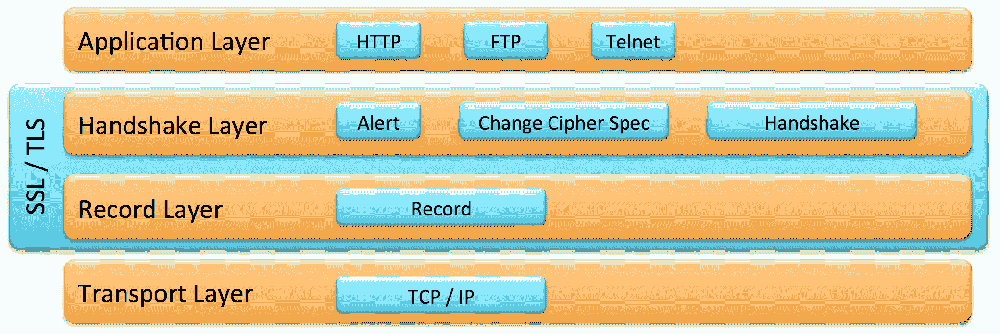
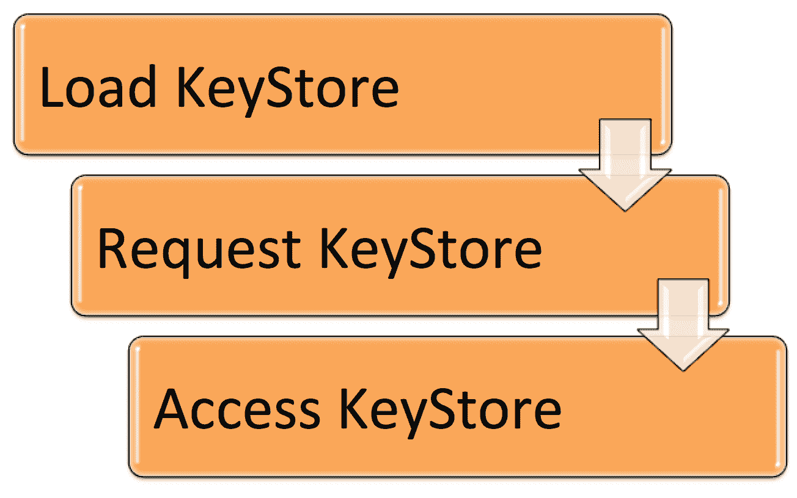
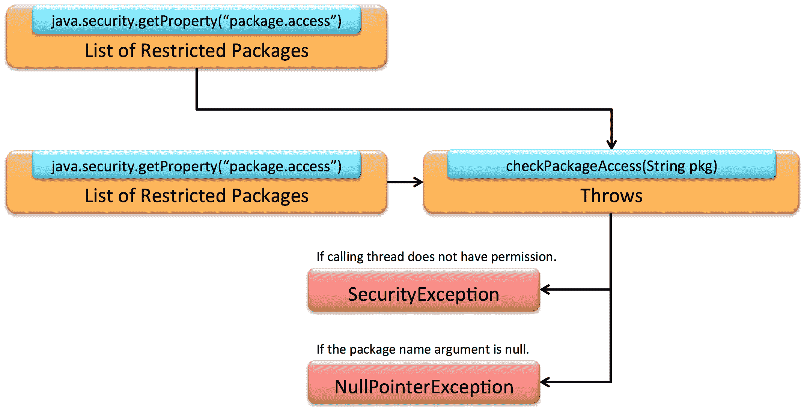
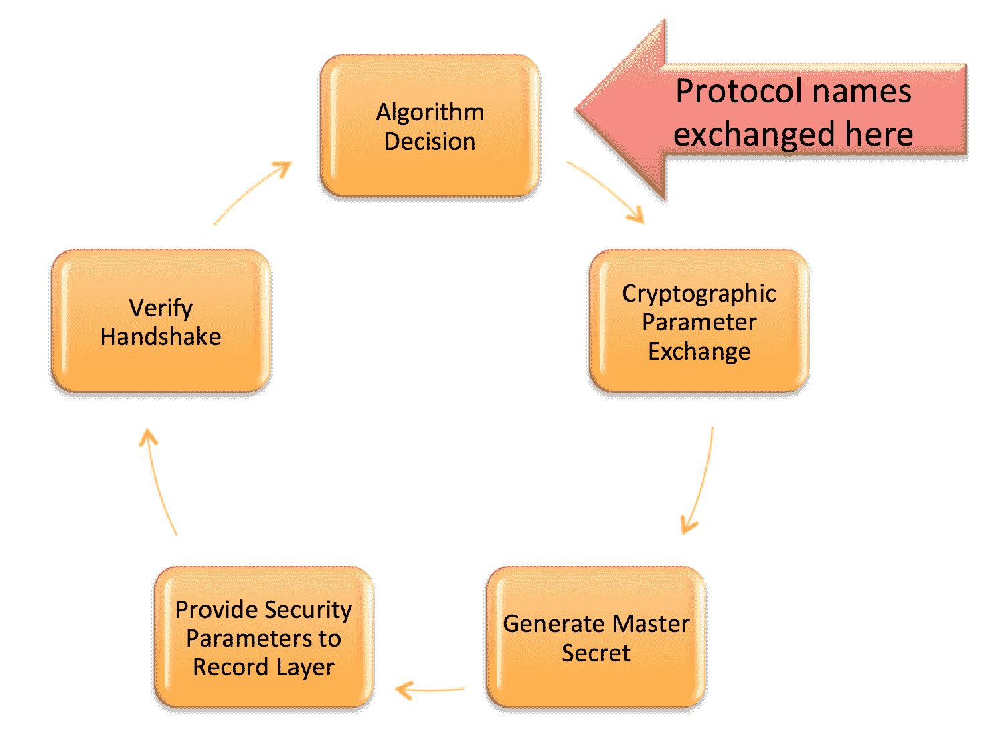
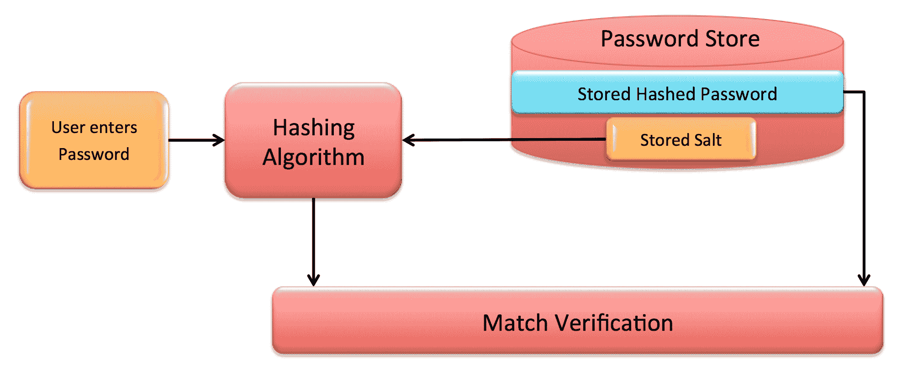
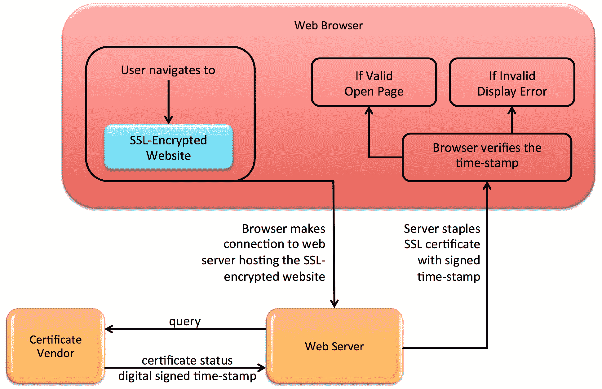

# 安全增强

在上一章中，我们介绍了 Java 9 平台引入的并发增强。我们深入探讨了并发，既作为 Java 的核心概念，也作为 Java 9 的系列增强。我们还探讨了支持响应式编程的 `Flow` 类 API，这是 Java 9 中的新概念。此外，我们还探讨了 Java 9 中引入的并发增强和新 Spin-Wait 指令。

在本章中，我们将查看对 JDK 进行的一些涉及安全性的小改动。这些改动的大小并不反映它们的显著性。Java 9 平台引入的安全增强为开发者提供了编写和维护比以前更安全的应用程序的能力。

具体来说，在本章中，我们将回顾以下内容领域：

+   数据报传输层安全

+   创建 PKCS12 密钥库

+   提高安全应用程序性能

+   TLS 应用层协议协商扩展

+   利用 CPU 指令进行 GHASH 和 RSA

+   TLS 的 OCSP 钩子

+   基于 DRBG 的 `SecureRandom` 实现

# 数据报传输层安全

**数据报传输层安全**（**DTLS**），是一种通信协议。该协议为基于数据报的应用提供一层安全。DTLS 允许安全通信，并基于 **传输层安全**（**TLS**）协议。嵌入式安全有助于确保消息不被伪造、篡改或窃听。

让我们回顾一下相关术语：

+   **通信协议**：一组规则，用于规范信息的传输。

+   **数据报**：一个结构化传输单元。

+   **窃听**：对传输中的数据包进行未检测到的监听。

+   **伪造**：发送伪造发送者的数据包。

+   **网络数据包**：用于传输的格式化数据单元。

+   **干扰**：在发送者发送数据包后和预期接收者接收它们之前更改数据包。

+   **TLS 协议**：最常见的网络安全协议。例如，使用 IMPA 和 POP 进行电子邮件。

DTLS Java 增强提案 219 旨在为 DTLS 版本 1.0 和 1.2 创建 API。

在接下来的章节中，我们将查看 DTLS 的每个版本，1.0 和 1.2，然后回顾对 Java 9 平台的改变。

# DTLS 协议版本 1.0

DTLS 协议版本 1.0 于 2006 年建立，为数据报协议提供通信安全。以下是基本特征：

+   允许客户端/服务器应用程序通信，但不允许：

    +   窃听

    +   干扰

    +   消息伪造

+   基于 TLS 协议

+   提供安全保证

+   DLS 协议的数据报语义得到保留

以下图表说明了 **传输层**在 **SSL/TLS** 协议层和每层协议的整体架构中的位置：



DTLS 协议版本 1.0 提供了详细的规范，主要覆盖领域如下：

+   密码：

    +   反重放分组密码

    +   新的密码套件

    +   标准或空流密码

+   拒绝服务对策

+   握手：

    +   消息格式

    +   协议

    +   可靠性

+   消息：

    +   分片和重组

    +   无损消息

    +   大小

    +   超时和重传

    +   数据包丢失

+   **路径最大传输单元**（**PMTU**）发现

+   记录层

+   记录有效载荷保护

+   重新排序

+   重放检测

+   传输层映射

# DTLS 协议版本 1.2

DTLS 协议版本 1.2 于 2012 年 1 月发布，由**互联网工程任务组**（**IETF**）版权所有。本节分享了代码示例，说明了 1.2 版本中的变化。

以下代码说明了 TLS 1.2 握手消息头。此格式支持：

+   消息分片

+   消息丢失

+   重新排序

```java
    // Copyright (c) 2012 IETF Trust and the persons identified as
       authors of the code. All rights reserved.

    struct 
    {
      HandshakeType msg_type;
      uint24 length;
      uint16 message_seq;                           // New field
      uint24 fragment_offset;                       // New field
      uint24 fragment_length;                       // New field
      select (HandshakeType) 
      {
        case hello_request: HelloRequest;
        case client_hello:  ClientHello;
        case hello_verify_request: HelloVerifyRequest;  // New type
        case server_hello:  ServerHello;
        case certificate:Certificate;
        case server_key_exchange: ServerKeyExchange;
        case certificate_request: CertificateRequest;
        case server_hello_done:ServerHelloDone;
        case certificate_verify:  CertificateVerify;
        case client_key_exchange: ClientKeyExchange;
        case finished: Finished;
      } body;
    } Handshake;
```

本节中展示的代码来自 DTLS 协议文档，并按照 IETF 的《关于 IETF 文档的法律条款》在此重新发布。

记录层包含我们打算发送到记录中的信息。信息最初在`DTLSPlaintext`结构内部，然后，在握手发生后，记录被加密，并可以通过通信流发送。记录层的格式在 1.2 版本中增加了新字段，并在代码注释中用`// 新字段`标注如下：

```java
    // Copyright (c) 2012 IETF Trust and the persons identified
       as authors of the code. All rights reserved.

    struct 
    {
      ContentType type;
      ProtocolVersion version;
      uint16 epoch;                                 // New field
      uint48 sequence_number;                       // New field
      uint16 length;
      opaque fragment[DTLSPlaintext.length];
    } DTLSPlaintext;

    struct 
    {
       ContentType type;
       ProtocolVersion version;
       uint16 epoch;                                 // New field
       uint48 sequence_number;                       // New field
       uint16 length;
       opaque fragment[DTLSCompressed.length];
    } DTLSCompressed;

    struct 
    {
       ContentType type;
       ProtocolVersion version;
       uint16 epoch;                                 // New field
       uint48 sequence_number;                       // New field
       uint16 length;
       select (CipherSpec.cipher_type) 
       {
          case block:  GenericBlockCipher;
          case aead:   GenericAEADCipher;             // New field
       } fragment;
    } DTLSCiphertext;
```

最后，以下是更新的握手协议：

```java
    // Copyright (c) 2012 IETF Trust and the persons identified
       as authors of the code. All rights reserved.

    enum {
      hello_request(0), client_hello(1),
       server_hello(2),
      hello_verify_request(3),                       // New field
      certificate(11), server_key_exchange (12),
      certificate_request(13), server_hello_done(14),
      certificate_verify(15), client_key_exchange(16),
      finished(20), (255) } HandshakeType;

      struct {
        HandshakeType msg_type;
        uint24 length;
        uint16 message_seq;                            // New field
        uint24 fragment_offset;                        // New field
        uint24 fragment_length;                        // New field
        select (HandshakeType) {
          case hello_request: HelloRequest;
          case client_hello:  ClientHello;
          case server_hello:  ServerHello;
          case hello_verify_request: HelloVerifyRequest;  // New field
          case certificate:Certificate;
          case server_key_exchange: ServerKeyExchange;
          case certificate_request: CertificateRequest;
          case server_hello_done:ServerHelloDone;
          case certificate_verify:  CertificateVerify;
          case client_key_exchange: ClientKeyExchange;
          case finished: Finished;
        } body; } Handshake;

      struct {
        ProtocolVersion client_version;
        Random random;
        SessionID session_id;
        opaque cookie<0..2⁸-1>;                          // New field
        CipherSuite cipher_suites<2..2¹⁶-1>;
        CompressionMethod compression_methods<1..2⁸-1>; } ClientHello;

      struct {
        ProtocolVersion server_version;
        opaque cookie<0..2⁸-1>; } HelloVerifyRequest;
```

# Java 9 中的 DTLS 支持

Java 9 对 DTLS API 的实现是传输无关且轻量级的。API 的设计考虑如下：

+   读取超时将不会被管理

+   实现将使用单个 TLS 记录进行每个封装/解封装操作

+   应用程序，而不是 API，将需要：

    +   确定超时值

    +   组装乱序应用程序数据

DTLS 是一种在将数据传递到传输层协议之前，用于保护应用层数据的协议。DTLS 是加密和传输实时数据的好解决方案。应谨慎行事，以确保我们不会在我们的应用程序实现中引入漏洞。以下是在 Java 9 应用程序中实现 DTLS 的具体安全考虑：

+   实现 DTLS v1.2，因为这是 Java 9 支持的最新版本。

+   避免使用**RSA**加密。如果必须使用 RSA，请为您的私钥添加额外的安全性，因为这是 RSA 的弱点。

+   使用 192 位或更多位时，请使用**椭圆曲线迪菲-赫尔曼**（**ECDH**）匿名密钥协商协议。192 位值基于**国家标准与技术研究院**（**NIST**）的建议。

+   强烈推荐使用**带关联数据的认证加密**（**AEAD**），这是一种加密形式。AEAD 为加密和解密的数据提供真实性、机密性和完整性保证。

+   在实现握手重协商时，始终实现`renegotiation_info`扩展。

+   在所有使用通信协议的 Java 应用程序中建立**前向安全性**（**FS**）功能。实现 FS 确保当长期加密密钥受到损害时，过去的会话加密密钥不会受到损害。理想情况下，在需要传输数据最高安全性的 Java 应用程序中，将使用**完美前向安全性**（**PFS**），其中每个密钥仅对单个会话有效。

# 创建 PKCS12 密钥存储

Java 9 平台为密钥存储提供了增强的安全性。为了欣赏 Java 增强提案 229 带来的变化，我们将默认创建 PKCS12 密钥存储，首先我们将回顾密钥存储的概念，查看`KeyStore`类，然后查看这些变化。

# 密钥存储简介

`KeyStore`的概念相对简单。它本质上是一个数据库文件，或者数据存储文件，用于存储公钥证书和私钥。`Keystore`将存储在`/jre/lib/security/cacerts`文件夹中。正如您将在下一节中看到的那样，这个数据库是由 Java 的`java.security.KeyStore`类方法管理的。

`KeyStore`功能包括：

+   包含以下之一条目类型：

    +   私钥

    +   公钥证书

+   每个条目都有唯一的别名字符串名称

+   每个密钥的密码保护

# Java 密钥存储（JKS）

`java.security.KeyStore`类是加密密钥和证书的存储设施。此类扩展`java.lang.Object`，如下所示：

```java
    public class KeyStore extends Object
```

`KeyStore`管理三种类型的条目，每个条目都实现了`KeyStore.Entry`接口，这是`KeyStore`类提供的三个接口之一。条目实现定义在以下表中：

| **实现** | **描述** |
| --- | --- |
| `KeyStore.PrivateKeyEntry` |

+   包含`PrivateKey`并可以以受保护格式存储它

+   包含公钥的证书链

|

| `KeyStore.SecretKeyEntry` |
| --- |

+   包含`SecretKey`并可以以受保护格式存储它

|

| `KeyStore.TrustedCertifcateEntry` |
| --- |

+   包含来自外部源的单个公钥`Certificate`

|

此类自 Java 平台 1.2 版本以来就是其中的一部分。它有一个构造函数，三个接口，六个子类，以及几个方法。构造函数定义如下：

```java
    protected KeyStore(KeyStoreSpi keyStoresSpi,
     Provider provider, String type)
```

`KeyStore`类包含以下接口：

+   `public static interface KeyStore.Entry`:

    +   此接口作为`KeyStore`条目类型的标记，不包含任何方法。

+   `public static interface KeyStore.LoadStoreParameter`:

    +   此接口作为加载和存储参数的标记，并具有以下返回 null 或用于保护`KeyStore`数据的参数的方法：

        +   `getProtectionParameter()`

+   `public static interface KeyStore.ProtectionParameter`:

    +   此接口作为`KeyStore`保护参数的标记，不包含任何方法。

`java.security.KeyStore`类还包含以下列出的六个嵌套类。

# Builder

当您想要延迟`KeyStore`的实例化时使用`KeyStore.Builder`类：

```java
    public abstract static class KeyStore.Builder extends Object
```

此类提供了实例化`KeyStore`对象所需的信息。该类具有以下方法：

+   `public abstract KeyStore getKeyStore() throws KeyStoreException`

+   `public abstract KeyStore.ProtectionParameter getProjectionParameter(String alias) throws KeyStoreException`

+   `newInstance`的三种选项：

    +   `public static KeyStore.Builder newInstance(KeyStore keyStore, KeyStore.ProtectionParameter protectionParameter)`

    +   `public static KeyStore.Builder newInstance(String type, Provider provider, File file, KeyStore.ProtectionParameter protection)`

    +   `public static KeyStore.Builder newInstance(String type, Provider provider, KeyStore.ProtectionParameter protection)`

# `CallbackHandlerProtection`类

`KeyStore.CallbackHandlerProtection`类的定义如下：

```java
    public static class KeyStore.CallbackHandlerProtection extends
     Object implements KeyStore.ProtectionParameter
```

此类提供了一个`ProtectionParameter`来封装一个`CallbackHandler`，并具有以下方法：

```java
    public CallbackHandler getCallbackHandler()
```

# `PasswordProtection`类

`KeyStore.PasswordProtection`类的定义如下：

```java
    public static class KeyStore.PasswordProtection extends Object 
     implements KeyStore.ProtectionParameter, Destroyable
```

此调用提供了一个基于密码的`ProtectionParameter`实现。该类具有以下方法：

+   `public void destroy() throws DestroyFailedException`:

    +   此方法清除密码

+   `public char[] getPassword()`:

    +   返回密码的引用

+   `public boolean isDestroyed()`:

    +   如果密码已被清除，则返回 true

# `PrivateKeyEntry`类

`KeyStore.PrivateKeyEntry`类的定义如下：

```java
    public static final class KeyStore.PrivateKeyEntry extends
     Object implements KeyStore.Entry
```

这创建了一个条目来保存`PrivateKey`及其对应的`Certificate`链。此类具有以下方法：

+   `public Certificate getCertificate()`:

    +   从`Certificate`链中返回**端实体**`Certificate`

+   `public Certificate[] getCertificateChain()`:

    +   返回`Certificate`链作为`Certificates`数组

+   `public PrivateKey getPrivateKey()`:

    +   返回当前条目的`PrivateKey`

+   `public String toString()`:

    +   返回`PrivateKeyEntry`作为`String`

# `SecretKeyEntry`类

`KeyStore.SecretKeyEntry`类的定义如下：

```java
    public static final class KeyStore.SecretKeyEntry extends
     Object implements KeyStore.Entry
```

此类包含一个`SecretKey`并具有以下方法：

+   `public SecretKey getSecretKey()`:

    +   返回条目的`SecretKey`

+   `public String toString()`:

    +   返回`SecretKeyEntry`作为`String`。

# `TrustedCertificateEntry`类

`KeyStore.TrustedCertificateEntry`类的定义如下：

```java
    public static final class KeyStore.TrustedCertificateEntry extends
     Object implements KeyStore.Entry
```

此类包含一个受信任的`Certificate`，并具有以下方法：

+   `public Certificate getTrustedCertificate()`:

    +   返回条目的受信任`Certificate`

+   `public String toString()`:

    +   返回条目的受信任`Certificate`作为`String`

使用此类的关键是理解流程。首先，我们必须使用`getInstance`方法加载`KeyStore`。接下来，我们请求访问`KeyStore`实例。然后，我们可以读取和写入`Object`：



以下代码片段显示了加载-请求-访问实现：

```java
    . . . 

    try {
      // KeyStore implementation will be returned for the default type
      KeyStore myKS = KeyStore.getInstance(KeyStore.getDefaultType());

      // Load
      myKS.load(null, null);

      // Instantiate a KeyStore that holds a trusted certificate
      TrustedCertificateEntry myCertEntry =
        new TrustedCertificateEntry(generateCertificate());

      // Assigns the trusted certificate to the "pack.pub" alias
      myKS.setCertificateEntry("packt.pub",
       myCertEntry.getTrustedCertificate());

      return myKS;
    } 
    catch (Exception e) {
      throw new AssertionError(e);
    }
  }
  . . .
```

# Java 9 中的 PKCS12 默认设置

在 Java 9 之前，默认的`KeyStore`类型是**Java 密钥库**（**JKS**）。Java 9 平台现在使用 PKCS 作为默认的`KeyStore`类型，更具体地说，是 PKCS12。

**PKCS**是**公钥加密标准**的缩写。

与 JKS 相比，此 PKCS 更改提供了更强的加密算法。正如你所期望的，JDK 9 仍然与 JKS 兼容，以支持先前开发的系统。

# 提高安全应用性能

Java 增强提案 232，标题为*提高安全应用性能*，专注于在安装了安全管理器的应用程序运行时的性能改进。安全管理者可能导致处理开销和低于理想的应用程序性能。

这是一项令人印象深刻的任务，因为当前在运行安全管理者时的 CPU 开销估计会导致 10-15%的性能下降。完全移除 CPU 开销是不切实际的，因为运行安全管理者需要一些 CPU 处理。尽管如此，本提案（JEP-232）的意图是尽可能减少开销百分比。

这项工作导致了以下优化，每个优化将在后续章节中详细说明：

+   安全策略强制执行

+   权限评估

+   哈希码

+   包检查算法

# 安全策略强制执行

JDK 9 使用`ConcurrentHashMap`将`ProtectionDomain`映射到`PermissionCollection`。`ConcurrentHashMap`通常用于应用程序中的高并发。它具有以下特性：

+   线程安全

+   进入映射不需要同步

+   快速读取

+   写入使用锁

+   无对象级别锁定

+   在非常细粒度的级别上锁定

`ConcurrentHashMap`类定义如下：

```java
    public class ConcurrentHashMap<K, V> extends AbstractMap<K, V> 
     implements ConcurrentMap<K, V>, Serializable
```

在前面的类定义中，`K`指的是哈希图维护的键的类型，而`V`表示映射值的类型。有一个`KeySetView`子类和几个方法。

与强制执行安全策略相关的有三个额外的类--`ProtectionDomain`、`PermissionCollection`和`SecureClassLoader`：

+   `ProtectionDomain`类用于封装一组类，以便可以授予域权限。

+   `PermissionCollection`类表示一组权限对象。

+   `SecureClassLoader`类扩展了`ClassLoader`类，为定义具有系统策略检索权限的类提供了额外的功能。在 Java 9 中，此类使用`ConcurrentHashMap`以增加安全性。

# 权限评估

在权限评估的类别下，进行了三项优化：

+   `identifyPolicyEntries` 列表之前有用于同步的策略提供者代码。在 JDK 9 中已删除此代码。

+   `PermissionCollection` 条目现在存储在 `ConcurrentHashMap` 中。它们之前在 `Permission` 类中作为 `HashMap` 存储。

+   权限现在存储在 `PermissionCollection` 子类的并发集合中。

# `java.Security.CodeSource` 包

哈希码是一个对象生成的数字，存储在哈希表中以实现快速存储和检索。Java 中的每个对象都有一个哈希码。以下是哈希码的一些特性和规则：

+   在运行进程中的相等对象具有相同的哈希码

+   哈希码可能在执行周期之间发生变化

+   不应将哈希码用作键

Java 9 平台包括对 `java.security.CodeSource` 的 `hashCode` 方法的修改，以优化 DNS 查询。这些操作可能会很耗时，因此使用代码源 URL 的字符串版本来计算哈希码。

`CodeSource` 类的定义如下：

```java
    public class CodeSource extends Object implements Serializable
```

此类有以下方法：

+   `public boolean equals(Object obj)`: 如果对象相等，则返回 `true`。这覆盖了 `Object` 类中的 `equals` 方法。

+   `public final Certificate[] getCertificates()`: 返回证书数组。

+   `public final CodeSigner[] getCodeSigners()`: 返回与 `CodeSource` 关联的代码签名者的数组。

+   `public final URL getLocation()`: 返回 URL。

+   `public int hashCode()`: 返回当前对象的哈希码值。

+   `public boolean implies(CodeSource codesource)`: 如果给定的代码源满足以下标准，则返回 `true`：

    +   不为空

    +   对象的证书不为空

    +   对象的位置不为空

+   `public String toString()`: 返回包含 `CodeSource` 信息的 `String`，包括位置和证书。

# 包检查算法

当运行带有安全策略管理器的应用程序时，Java 9 的最终性能改进以 `java.lang.SecurityManager` 包增强的形式出现。具体来说，修改了 `checkPackageAccess` 方法的包检查算法。

`java.lang.SecurityManager` 类允许应用程序在特定操作上实现安全策略。该类的 `public void checkPackageAccess(String pkg)` 方法从 `getProperty` 方法接收一个逗号分隔的受限包列表。如图所示，根据评估结果，`checkPackageAccess` 方法可能会抛出两种异常之一：



# TLS 应用层协议协商扩展

Java Enhancement Proposal 244 简单地增强了 `javax.net.ssl` 包，使其支持 **传输层安全性**（**TLS**）**应用层协议协商**（**ALPN**）扩展。此扩展允许 TLS 连接进行应用协议协商。

# TLS ALPN 扩展

ALPN 是 TLS 扩展，可用于在安全连接中使用时协商要实现的协议。ALPN 代表了一种高效的协议协商方式。如图所示，TLS 握手有五个基本步骤：


# javax.net.ssl 包

`java.net.ssl`包包含与安全套接字包相关的类。这使我们能够使用 SSL 作为示例，以可靠地检测网络字节流中引入的错误。它还提供了加密数据以及提供客户端和服务器身份验证的能力。

此包包括以下接口：

+   `public interface HandshakeCompletedListener extends EventListener`

+   `public interface HostnameVerifier`

+   `public interface KeyManager`

+   `` `public interface ManagerFactoryParameters` ``

+   `public interface SSLSession`

+   `public interface SSLSessionBindingListener extends EventListener`

+   `public interface SSLSessionContext`

+   `public interace TrustManager`

+   `public interface X509KeyManager extends KeyManager`

+   `public interface X509TrustManager extends TrustManager`

`java.net.ssl`包还有以下子类：

+   `public class CertPathTrustManagerParameters extends Object implements ManagerFactoryParameters`

+   `public abstract class ExtendedSSLSession extends Object implements SSLSession`

+   `public class HandshakeCompleteEvent extends EventObject`

+   `public abstract class HttpsURLConnection extends HttpURLConnection`

+   `public class KeyManagerFactory extends Object`

+   `public abstract class KeyManagerFactorySpi`

+   `public class KeyStoreBuilderParameters extends Object implements ManagerFactoryParameters`

+   `public class SSLContext extends Object`

+   `public abstract class SSLContextSpi extends Object`

+   `public abstract class SSLEngine extends Object`

+   `public class SSLEngineResult extends Object`

+   `public class SSLParameters extends Object`

+   `public final class SSLPermission extends BasicPermission`

+   `public abstract class SSLServerSocket extends ServerSocket`

+   `public abstract class SSLServerSocketFactory extends ServerSocketFactory`

+   `public class SSLSessionBindingEvent extends EventObject`

+   `public abstract class SSLSocket extends Socket`

+   `public abstract class SSLSocketFactory extends SocketFactory`

+   `public class TrustManagerFactory extends Object`

+   `` `public abstract class TrustManagerFactorySpi extends Object` ``

+   `public abstract class X509ExtendedKeyManager extends Object implements X509KeyManager`

+   `public abstract class X509ExtendedTrustManager extends Object implements x509TrustManager`

# java.net.ssl 包扩展

Java 9 平台中`java.net.ssl`包的改变是现在它支持 TLS ALPN 扩展。这个改变的益处包括：

+   TLS 客户端和服务器现在可以使用多个应用层协议，这些协议可能使用也可能不使用相同的传输层端口

+   ALPN 扩展允许客户端优先选择它支持的应用层协议

+   服务器可以选择客户端协议和 TLS 连接

+   支持 HTTP/2

以下插图之前已作为 TLS 握手的五个基本步骤展示。更新为 Java 9 并在此处展示，该插图表明客户端和服务器之间共享了协议名称：



一旦收到客户端的应用层协议列表，服务器可以选择服务器首选的交集值，并外部扫描初始明文 `ClientHellos` 并选择一个 ALPN 协议。应用程序服务器将执行以下操作之一：

+   选择任何支持的协议

+   判断 ALPN 值（远程提供和本地支持）是互斥的

+   忽略 ALPN 扩展

与 ALPN 扩展相关的其他关键行为：

+   服务器可以更改连接参数

+   SSL/TLS 握手开始后，应用程序可以查询是否已选择 ALPN 值

+   SSL/TLS 握手结束后，应用程序可以回顾使用了哪个协议

`ClientHello` 是 TLS 握手的第一个消息。它具有以下结构：

```java
    struct {
      ProtocolVersion client_version;
      Random random;
      SessionID session_id;
      CipherSuite cipher_suites<2..2¹⁶-1>;
      CompressionMethod compression_methods<1..2⁸-1>;
      Extension extensions<0..2¹⁶-1>;
    } ClientHello;
```

# 利用 CPU 指令进行 GHASH 和 RSA

Java 增强提案（JEP）246 的自描述标题 **Leverage CPU Instructions for GHASH and RSA**，对其目标提供了深刻的见解。此 JEP 的目的是提高加密操作的性能，特别是 GHASH 和 RSA。Java 9 通过利用最新的 SPARC 和 Intel x64 CPU 指令实现了性能提升。

此增强功能不需要在 Java 9 平台上添加或修改新的或修改后的 API。

# 散列

**Galois HASH**（**GHASH**）和 **Rivest-Shamir-Adleman**（**RSA**）是加密系统散列算法。散列是从文本字符串生成的固定长度字符串或数字。算法，特别是散列算法，被设计成结果散列无法逆向工程。我们使用散列存储带有盐生成的密码。

在密码学中，盐是作为散列函数输入的随机数据，用于生成密码。盐有助于防止彩虹表攻击和字典攻击。

以下图形说明了散列工作的基本原理：


如您所见，散列算法将明文和盐输入其中，生成新的散列密码和盐，并将盐存储起来。以下是带有示例输入/输出的相同图形，以演示其功能：


验证过程，以下图表从用户输入其明文密码开始。散列算法将明文与存储的盐重新散列。然后，将生成的散列密码与存储的密码进行比较：



# TLS 的 OCSP stapling

**在线证书状态协议** (**OCSP**) 钩钉是一种检查数字证书撤销状态的方法。评估 SSL 证书有效性的 OCSP 钩钉方法被认为是既安全又快捷的。通过允许 Web 服务器提供其有机证书的有效性信息，而不是从证书发行商请求验证信息的更长时间过程，实现了确定速度。

**在线证书状态协议** (**OCSP**) 钩钉之前被称为 **传输层安全性** (**TLS**) 证书状态请求扩展。

# OCSP 钩钉入门

OCSP 钩钉过程涉及多个组件和有效性检查。以下图形说明了 OCSP 钩钉过程：



如您所见，过程始于用户尝试通过浏览器打开 SSL 加密的网站。浏览器查询 Web 服务器以确保 SSL 加密的网站具有有效的证书。Web 服务器查询证书的供应商，并提供了证书状态和数字签名的时戳。Web 服务器将这两个组件（证书状态和数字签名的时戳）组合在一起，并将其返回给请求的浏览器。然后，浏览器可以检查时戳的有效性，并决定是否显示 SSL 加密的网站或显示错误。

# Java 9 平台更改

Java 增强提案 249，**TLS 的 OCSP 钩钉**，通过 TLS 证书状态请求扩展实现 OCSP 钩钉。OCSP 钩钉检查 X.509 证书的有效性。

X.509 证书是使用 X509 **公钥基础设施** (**PKI**) 的数字证书。

在 Java 9 之前，证书有效性检查（实际上，是检查证书是否已被撤销）可以在客户端启用，并且具有以下低效性：

+   OCSP 响应者性能瓶颈

+   多次传递导致的性能下降

+   如果在客户端执行 OCSP 检查，则会导致额外的性能下降

+   当浏览器未连接到 OCSP 响应者时，会出现错误的 **失败**

+   OCSP 响应者遭受拒绝服务攻击的易感性

新的 TLS OCSP 钩钉包括以下针对 Java 9 平台的系统属性更改：

+   `jdk.tls.client.enableStatusRequestExtension`:

    +   默认设置：true

    +   启用 `status_request` 扩展

    +   启用 `status_request_v2` 扩展

    +   启用从服务器处理 `CertificateStatus` 消息

+   `jdk.tls.server.enableStatusRequestExtension`:

    +   默认设置：false

    +   启用服务器端 OCSP 钩钉支持

+   `jdk.tls.stapling.responseTimeout`:

    +   默认设置：5000 毫秒

    +   控制服务器分配的最大时间以获取 OCSP 响应

+   `jdk.tls.stapling.cacheSize`:

    +   默认设置：256

    +   控制缓存条目的最大数量

    +   可以将最大值设置为零以消除上限

+   `jdk.tls.stapling.cacheLifetime`:

    +   默认设置：3600 秒（1 小时）

    +   控制缓存响应的最大生存期

    +   可以将值设置为零以禁用缓存生存期

+   `jdk.tls.stapling.responderURI`:

    +   默认设置：无

    +   可以设置默认 URI 以证书不包含 **Authority Info Access** （**AIA**）扩展

    +   除非设置 `jdk.tls.stapling.Override` 属性，否则不会覆盖 AIA 扩展

+   `jdk.tls.stapling.respoderOverride`:

    +   默认设置：false

    +   允许通过 `jdk.tls.stapling.responderURI` 提供的属性覆盖 AIA 扩展值

+   `jdk.tls.stapling.ignoreExtensions`:

    +   默认设置：false

    +   禁用 `status_request` 或 `status_request_v2` TLS 扩展中指定的 OCSP 扩展转发。

`status_request` 和 `status_request_v2` TLS 欢迎扩展现在由客户端和服务器端 Java 实现支持。

# 基于 DRBG 的 `SecureRandom` 实现

在 Java 9 之前，JDK 有两种生成安全随机数的方法。一种方法是用 Java 编写的，基于 SHA1 的随机数生成，并不十分强大。另一种方法是平台相关的，并使用预配置的库。

**确定性随机位生成器**（**DRBG**）是生成随机数的方法。它已获得美国商务部下属的 **国家标准与技术研究院**（**NIST**）的批准。DRBG 方法包括用于生成安全随机数的现代和更强的算法。

Java 增强提案 273，**基于 DRBG 的 SecureRandom 实现**旨在实现三种特定的 DRBG 机制。这些机制如下列出：

+   `Hash_DRBG`

+   `HMAC_DRBG`

+   `CTR_DRBG`

您可以在 [`nvlpubs.nist.gov/nistpubs/SpecialPublications/NIST.SP.800-90Ar1.pdf`](http://nvlpubs.nist.gov/nistpubs/SpecialPublications/NIST.SP.800-90Ar1.pdf) 上了解每个 DRBG 机制的具体信息

这里是三个新的 API：

+   `SecureRandom`: 新方法允许使用以下列出的可配置属性配置 `SecureRandom` 对象：

    +   播种

    +   重新播种

    +   随机位生成

+   `SecureRandomSpi`: 实现新的 `SecureRandom` 方法

+   `SecureRandomParameter`: 新接口，以便将输入传递到新的 `SecureRandom` 方法

# 摘要

在本章中，我们探讨了 JDK 中涉及安全性的几个小但重要的变化。Java 9 平台中的特色安全增强功能为开发者提供了编写和维护实现安全性的应用程序的独特能力。具体来说，我们涵盖了 DTLS、密钥库、提高安全应用程序性能、TLS 应用层协议协商扩展、利用 CPU 指令进行 GHASH 和 RSA、TLS 的 OCSP 撕贴以及基于 DRBG 的 `SecureRandom` 实现。

在下一章中，我们将探讨 Java 9 中使用的新的命令行标志以及各种命令行工具的变更。我们的内容将包括使用新的命令行选项和标志来管理 Java JVM 运行时和编译器。
