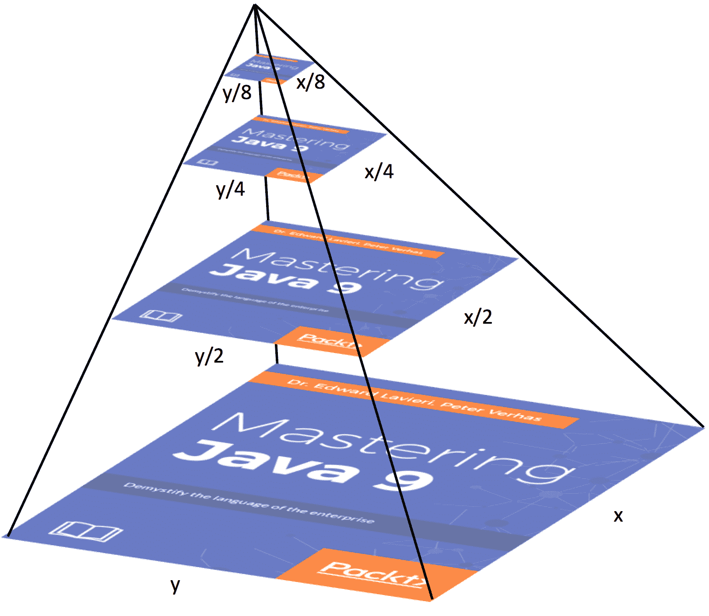

# 最佳实践在 Java 9 中

在上一章中，我们探讨了 Java 9 中有关命令行标志的几个更改。具体来说，我们涵盖了统一的 JVM 日志、编译器控制、新的诊断命令、移除 HPROF 堆分析代理、移除**Java 堆分析工具**（**JHAT**）、命令行标志参数验证以及为旧平台版本编译的能力。

在本章中，我们将关注 Java 9 平台提供的附加实用程序的最佳实践。具体来说，我们将涵盖：

+   支持 UTF-8

+   Unicode 7.0.0

+   Linux/AArch64 端口

+   多分辨率图像

+   常见区域数据存储库

# 支持 UTF-8

**Unicode 转换格式-8**（**UTF-8**）是一个字符集，它使用一到四个 8 位字节封装所有 Unicode 字符。它是 Unicode 的字节编码形式。UTF-8 自 2009 年以来一直是编码网页的主要字符集。以下是 UTF-8 的一些特性：

+   可以编码所有 1,112,064 个 Unicode 代码点

+   使用一到四个 8 位字节

+   占据了几乎所有网页的近 90%

+   与 ASCII 向后兼容

+   可逆

普遍使用 UTF-8 强调了确保 Java 平台完全支持 UTF-8 的重要性。这种思维方式导致了 Java 增强提案 226，**UTF-8 属性资源包**。在 Java 9 应用程序中，我们有指定具有 UTF-8 编码的属性文件的能力。Java 9 平台包括对`ResourceBundle` API 的更改以支持 UTF-8。

让我们看看 Java 9 之前的`ResourceBundle`类，然后是 Java 9 平台对该类所做的更改。

# `ResourceBundle`类

以下类为开发者提供了从资源包中隔离特定区域资源的能力。这个类显著简化了本地化和翻译：

```java
    public abstract class ResourceBundle extends Object
```

创建资源包需要一种有目的的方法。例如，让我们想象我们正在创建一个将支持商业应用程序的多种语言的资源包。我们的按钮标签，以及其他事项，将根据当前的区域设置显示不同。因此，在我们的例子中，我们可以为我们的按钮创建一个资源包。我们可以称它为`buttonResources`。然后，对于每个区域设置，我们可以创建一个`buttonResource_<identifier>`。以下是一些示例：

+   `buttonResource_ja`：用于日语

+   `buttonResource_uk`：用于英国英语

+   `buttonResource_it`：用于意大利语

+   `buttonResource_lh`：用于立陶宛语

我们可以使用与我们的基本包相同的名称的资源包。因此，`buttonResource`将包含我们的默认包。

要获取特定区域的对象，我们调用`getBundle`方法。以下是一个示例：

```java
    . . . 

    ResourceBundle = buttonResource =
     ResourceBundle.getBundle("buttonResource", currentLocale);

    . . . 
```

在接下来的几节中，我们将通过查看其嵌套类、字段和构造函数以及包含的方法来检查`ResourceBundle`类。

# 嵌套类

与 `ResourceBundle` 类相关联的一个嵌套类是 `ResourceBundle.Control` 类。它提供了当使用 `ResourceBundle.getBundle` 方法时使用的回调方法：

```java
    public static class ResourceBundle.Control extends Object
```

`ResourceBundle.Control` 类有以下字段：

+   `public static final List<String> FORMAT_CLASS`

+   `public static final List<String> FORMAT_DEFAULT`

+   `public static final List<String> FORMAT_PROPERTIES`

+   `public static final long TTL_DONT_CACHE`

+   `public static final long TTL_NO_EXPIRATION_CONTROL`

该类有一个单独的空构造函数和以下方法：

+   `getCandidateLocales()`:

```java
      public List<Locale> getCandidateLocales(String baseName,
       Locale locale)
```

| **组件** | **详细信息** |
| --- | --- |
| 抛出 | `NullPointerException`（如果 `baseName` 或 `locale` 为 null） |
| 参数 | `baseName`: 一个完全限定的类名`locale`: 期望的区域设置 |
| 返回 | 候选区域设置列表 |

+   `getControl()`:

```java
      public static final ResourceBundle.Control getControl(
       List<String> formats)
```

| **组件** | **详细信息** |
| --- | --- |
| 抛出 | `IllegalArgumentException`（如果 `formats` 未知）`NullPointerException`（如果 `formats` 为 null） |
| 参数 | `formats`: 这些是 `ResourceBundle.Control.getFormats` 方法将返回的格式 |
| 返回 | 支持指定格式的 `ResourceBundle.Control` |

+   `getFallbackLocale()`:

```java
      public Locale getFallbackLocale(String baseName, Locale locale)
```

| **组件** | **详细信息** |
| --- | --- |
| 抛出 | `NullPointerException`（如果 `baseName` 或 `locale` 为 null） |
| 参数 | `baseName`: 一个完全限定的类名`locale`: 使用 `ResourceBundle.getBundle` 方法无法找到的期望区域设置 |
| 返回 | 回退区域设置 |

+   `getFormats()`:

```java
      public List<String> getFormats(String baseName)
```

| **组件** | **详细信息** |
| --- | --- |
| 抛出 | `NullPointerException`（如果 `baseName` 为 null） |
| 参数 | `baseName`: 一个完全限定的类名 |
| 返回 | 包含其格式的字符串列表，以便可以加载资源包 |

+   `getNoFallbackControl()`:

```java
      public static final ResourceBundle.Control   
      getNoFallbackControl(List<String> formats)
```

| **组件** | **详细信息** |
| --- | --- |
| 抛出 | `IllegalArgumentException`（如果 `formats` 未知）`NullPointerException`（如果 `formats` 为 null） |
| 参数 | `formats`: 这些是 `ResourceBundle.Control.getFormats` 方法将返回的格式 |
| 返回 | 支持指定格式且没有回退区域设置的 `ResourceBundle.Control` |

+   `getTimeToLive()`:

```java
      public long getTimeToLive(String baseName, Locale locale)
```

| **组件** | **详细信息** |
| --- | --- |
| 抛出 | `NullPointerException`（如果 `baseName` 为 null） |
| 参数 | `baseName`: 一个完全限定的类名`locale`: 期望的区域设置 |
| 返回 | 从缓存时间偏移的零或正毫秒数 |

+   `needsReload()`:

```java
      public boolean needsReload(String baseName, Locale locale,
       String format, ClassLoader loader, ResourceBundle bundle,
       long loadTime)
```

| **组件** | **详细信息** |
| --- | --- |

| 抛出 | `NullPointerException`（如果以下列出的任何参数为 null）:

+   `baseName`

+   `locale`

+   `format`

+   `loader`

+   `bundle`

|

| 参数 | `baseName`: 一个完全限定的类名`locale`: 期望的区域设置`format`: 资源包格式`loader`: 应用于加载包的 `ClassLoader``bundle`: 过期的包`loadTime`: 包被添加到缓存的时间 |
| --- | --- |
| 返回 | `true`/`false` 以指示是否需要重新加载过期的包 |

+   `newBundle()`:

```java
      public ResourceBundle newBundle(String baseName, Locale locale,
       String format, ClassLoader loader, boolean reload)
```

| **组件** | **详细信息** |
| --- | --- |

| 抛出 | `ClassCastException`（如果加载的类无法转换为 `ResourceBundle`）`ExceptionInInitializerError`（如果初始化失败）`IllegalAccessException`（如果类或构造函数不可访问）`IllegalArgumentException`（如果格式未知）`InstantiationException`（如果类实例化失败）`IOException`（资源读取错误）`NullPointerException`（如果以下列出的任何参数为 null）:|

+   `baseName`

+   `locale`

+   `format`

+   `loader`

`SecurityException`（如果拒绝访问新实例）|

| 参数 | `baseName`：完全限定的类名`locale`：期望的区域设置`format`：资源包格式`loader`：用于加载包的 `ClassLoader``reload`：表示资源包是否过期的 `true`/`false` 标志 |
| --- | --- |
| 返回 | 资源包的实例 |

+   `toBundleName()`:

```java
      public String toBundleName(String baseName, Locale locale)
```

| **组件** | **详细信息** |
| --- | --- |
| 抛出 | `NullPointerException`（如果 `baseName` 或 `locale` 为 null） |
| 参数 | `baseName`：完全限定的类名`locale`：期望的区域设置 |
| 返回 | 包名 |

+   `toResourceName()`:

```java
      public final String toResourceName(String bundleName,
       String suffix)
```

| **组件** | **详细信息** |
| --- | --- |
| 抛出 | `NullPointerException`（如果 `bundleName` 或 `suffix` 为 null） |
| 参数 | `bundleName`：包名`suffix`：文件名的后缀 |
| 返回 | 转换后的资源名称 |

# 字段和构造函数

`ResourceBundle` 类有一个字段，如下所述：

```java
    protected Resourcebundle parent
```

当找不到指定的资源时，`getObject` 方法会通过父包进行搜索。

`ResourceBundle` 类的构造函数如下所示：

```java
    public ResourceBundle()
    {
    }
```

# 方法

`ResourceBundle` 类有 18 个方法，每个方法都如下所述：

+   `clearCache()`:

```java
      public static final void clearCache()
```

| **组件** | **详细信息** |
| --- | --- |
| 抛出 | 无 |
| 参数 | 无 |
| 返回 | 无 |

```java
      public static final void clearCache(ClassLoader loader)
```

| **组件** | **详细信息** |
| --- | --- |
| 抛出 | `NullPointerException`（如果加载器为 null） |
| 参数 | `loader`：类加载器 |
| 返回 | 无 |

+   `containsKey()`:

```java
      public boolean containsKey(String key)
```

| **组件** | **详细信息** |
| --- | --- |
| 抛出 | `NullPointerException`（如果 `key` 为 null） |
| 参数 | `key`：资源键 |
| 返回 | 根据 `ResourceBundle` 或父包中是否存在键返回 `true`/`false` |

+   `getBundle()`:

```java
      public static final ResourceBundle getBundle(String baseName)
```

| **组件** | **详细信息** |
| --- | --- |
| 抛出 | `MissingResourceException`（如果未找到提供的 `baseName` 的资源包）`NullPointerException`（如果 `baseName` 为 null） |
| 参数 | `baseName`：完全限定的类名 |
| 返回 | 基于 `baseName` 和默认区域设置的资源包 |

```java
      public static final ResourceBundle getBundle(String baseName,
       Resourcebundle.Control control)
```

| **组件** | **详细信息** |
| --- | --- |
| 抛出 | `IllegalArgumentException`（如果传递的控制操作不当）`MissingResourceException`（如果未找到提供的 `baseName` 的资源包）`NullPointerException`（如果 `baseName` 为 null） |
| 参数 | `baseName`：完全限定的类名`control`：控制提供信息以便加载资源包 |
| 返回值 | 基于给定的 `baseName` 和默认区域设置的资源包 |

```java
      public static final ResourceBundle getBundle(String baseName,
       Locale locale)
```

| **组件** | **详细信息** |
| --- | --- |
| 抛出 | `MissingResourceException`（如果找不到提供的 `baseName` 的资源包）`NullPointerException`（如果 `baseName` 或 `locale` 为 null） |
| 参数 | `baseName`: 完整的类名`locale`: 所需的区域设置 |
| 返回值 | 基于给定的 `baseName` 和 `locale` 的资源包 |

```java
      public static final ResourceBundle getBundle(String baseName,
       Locale targetLocale, Resourcebundle.Control control)
```

| **组件** | **详细信息** |
| --- | --- |
| 抛出 | `IllegalArgumentException`（如果传递的控制执行不当）`MissingResourceException`（如果在任何区域设置中找不到提供的 `baseName` 的资源包）`NullPointerException`（如果 `baseName`、`control` 或 `locale` 为 null） |
| 参数 | `baseName`: 完整的类名`control`: 控制提供信息以便资源包可以加载`targetLocale`: 所需的区域设置 |
| 返回值 | 基于给定的 `baseName` 和 `locale` 的资源包 |

```java
      public static final ResourceBundle getBundle(String baseName,
       Locale locale, ClassLoader loader)
```

| **组件** | **详细信息** |
| --- | --- |
| 抛出 | `MissingResourceException`（如果在任何区域设置中找不到提供的 `baseName` 的资源包）`NullPointerException`（如果 `baseName`、`loader` 或 `locale` 为 null） |
| 参数 | `baseName`: 完整的类名`locale`: 所需的区域设置`loader`: 类加载器 |
| 返回值 | 基于给定的 `baseName` 和 `locale` 的资源包 |

```java
      public static final ResourceBundle getBundle(String baseName,
       Locale targetLocale, ClassLoader loader,
       ResourceBundle.Control control)
```

| **组件** | **详细信息** |
| --- | --- |
| 抛出 | `IllegalArgumentException`（如果传递的控制执行不当）`MissingResourceException`（如果在任何区域设置中找不到提供的 `baseName` 的资源包）`NullPointerException`（如果 `baseName`、`control`、`loader` 或 `targetLocale` 为 null） |
| 参数 | `baseName`: 完整的类名`control`: 提供信息以便资源包可以加载的控制`loader`: 类加载器`targetLocale`: 所需的区域设置 |
| 返回值 | 基于给定的 `baseName` 和 `locale` 的资源包 |

+   `getKeys()`:

```java
      public abstract Enumeration<String> getKeys()
```

| **组件** | **详细信息** |
| --- | --- |
| 抛出 | 无 |
| 参数 | 无 |
| 返回值 | `ResourceBundle` 和父资源包中的键的枚举 |

+   `getLocale()`:

```java
      public Locale getLocale()
```

| **组件** | **详细信息** |
| --- | --- |
| 抛出 | 无 |
| 参数 | 无 |
| 返回值 | 当前资源包的 `locale` |

+   `getObject()`:

```java
      public final Object getObject(String key)
```

| **组件** | **详细信息** |
| --- | --- |
| 抛出 | `MissingResourceException`（如果找不到提供的键的资源）`NullPointerException`（如果 `key` 为 null） |
| 参数 | `key`: 这是所需对象的键 |
| 返回值 | 提供的键的对象 |

+   `getString()`:

```java
      public final String getString(String key)
```

| **组件** | **详细信息** |
| --- | --- |
| 抛出 | `ClassCastException`（如果找到的对象不是键）`MissingResourceException`（如果找不到提供的键的资源）`NullPointerException`（如果 `key` 为 null） |
| 参数 | `key`: 这是所需 `String` 的键 |
| 返回值 | 提供的键的 `String` |

+   `getStringArray()`:

```java
      public final String[] getStringArray(String key)
```

| **组件** | **详细信息** |
| --- | --- |
| 抛出 | `ClassCastException`（如果找到的对象不是 `String` 数组）`MissingResourceException`（如果找不到提供的键的资源）`NullPointerException`（如果 `key` 为 null） |
| 参数 | `key`：这是所需 `String` 数组的键 |
| 返回 | 提供的键的 `String` 数组 |

+   `handleGetObject()`:

```java
      protected abstract Object handleGetObject(String key)
```

| **组件** | **详细信息** |
| --- | --- |
| 抛出 | `NullPointerException`（如果 `key` 为 null） |
| 参数 | `key`：所需 `Object` 的键 |
| 返回 | 给定键的对象 |

+   `handleKeySet()`:

```java
      protected Set<String> handleKeySet()    
```

| **组件** | **详细信息** |
| --- | --- |
| 抛出 | 无 |
| 参数 | 无 |
| 返回 | `ResourceBundle` 中的键集合 |

+   `keySet()`:

```java
      public Set<String> keySet()
```

| **组件** | **详细信息** |
| --- | --- |
| 抛出 | 无 |
| 参数 | 无 |
| 返回 | `ResourceBundle` 及其父包中的键集合 |

+   `setParent()`:

```java
      protected void setParent(ResourceBundle parent)
```

| **组件** | **详细信息** |
| --- | --- |
| 抛出 | 无 |
| 参数 | `parent`：当前包的父包 |
| 返回 | 无 |

# Java 9 的变化

基于 ISO-8859-1 的属性文件格式之前由 Java 平台支持。该格式不易支持转义字符，尽管它确实提供了一个适当的转义机制。使用 ISO-8859-1 需要在文本字符及其转义形式之间进行转换。

Java 9 平台包括一个修改后的 `ResourceBundle` 类，默认文件编码设置为 UTF-8 而不是 ISO-8859-1。这节省了应用程序进行上述转义机制转换所需的时间。

# Unicode 7.0.0

Java 增强提案 227，标题为 Unicode 7.0，是为了表明需要更新适当的 API 以支持 Unicode 7.0 版本。该版本的 Unicode 于 2014 年 6 月 16 日发布。在 Java 9 之前，Unicode 6.2 版本是支持的最新版本。

你可以在官方规范页面上了解更多关于**Unicode 7.0.0 版本**的信息：[`unicode.org/versions/Unicode7.0.0/`](http://unicode.org/versions/Unicode7.0.0/).

在本书出版时，最新的 Unicode 标准是 10.0.0 版本，于 2017 年 6 月 20 日发布。有趣的是，Java 9 平台将支持 Unicode 7.0.0 版本，但不支持 Unicode 标准的较新版本 10.0.0。除了这里列出的两个 Unicode 规范之外，从 7.0.0 版本开始，以下内容将不会由 Java 9 平台实现：

+   **Unicode 技术标准 #10**（**UTS #10**）

    +   Unicode 排序算法：如何比较 Unicode 字符串的详细信息

+   **Unicode 技术标准 #46**（**UTS #46**）

    +   **Unicode 国际化域名应用**（**IDNA**）**兼容处理**：对文本大小写和域名变体的全面映射

Java 9 平台变化的核心，针对 Unicode 7.0.0 版本的支持，包括以下 Java 类：

+   `java.lang package`

    +   Character

    +   String

+   `java.text.package`

    +   Bidi

    +   BreakIterator

    +   Normalizer

让我们快速查看这些类中的每一个，以帮助我们巩固对 Unicode 7.0.0 支持对 Java 9 平台广泛影响的了解。

# `java.lang` 包

`java.lang.package` 提供了在几乎所有 Java 应用程序中使用的根本类。在本节中，我们将探讨 `Character` 和 `String` 类。

`Character` 类：

```java
    public final class Character extends Object implements
     Serializable, Comparable<Character>
```

这是自 Java 第一个版本以来一直存在的许多核心类之一。`Character` 类的对象由一个类型为 `char` 的单个字段组成。

`String` 类：

```java
    public final class String extends Object implements
     Serializable, Comparable<String>, CharSequence
```

字符串，另一个起源于核心的类，是不可变的字符字符串。

将 `Character` 和 `String` 类修改为支持 Unicode 的新版本，即 Java 9 的 7.0，是帮助保持 Java 作为顶级编程语言的重要一步。

# `java.text` 包

`Bidi`、`BreakIterator` 和 `Normalizer` 类不像 `Character` 和 `String` 类那样广泛使用。以下是这些类的简要概述。

`Bidi` 类：

```java
    public final class Bidi extends Object
```

此类用于实现 Unicode 的双向算法。这用于支持阿拉伯语或希伯来语。

关于 *Unicode 双向算法* 的具体信息，请访问 [`unicode.org/reports/tr9/`](http://unicode.org/reports/tr9/).

`BreakIterator` 类：

```java
    public abstract class BreakIterator extends Object
     implements Cloneable
```

此类用于查找文本边界。

`Normalizer` 类：

```java
    public final class Normalizer extends Object
```

此方法包含两个方法：

+   `isNormalized`：用于确定给定序列的 `char` 值是否已规范化

+   `normalize`：将一系列 `char` 值规范化

# 附加重要性

如前所述，JDK 8 支持 Unicode 6.2。版本 6.3 于 2013 年 9 月 30 日发布，以下列出了一些亮点：

+   双向行为改进

+   改进了 Unihan 数据

+   更好的希伯来语支持

版本 7.0.0，于 2014 年 6 月 16 日发布，引入了以下更改：

+   增加了 2,834 个字符

    +   对阿塞拜疆语、俄语和德语方言的支持增加

    +   图形符号

    +   几个国家和地区的史前脚本

+   Unicode 双向算法更新

+   近 3,000 个新的粤语发音条目

+   对印度语脚本属性的重大改进

Unicode 版本 6.3 和 7.0.0 的巨大变化强调了 Java 9 平台支持 7.0.0 而不是 6.2（如 Java 8）的重要性。

# Linux/AArch64 端口

**Java 增强提案 237**（**JEP 237**）的唯一目标是移植 JDK 9 到 Linux/AArch64。为了了解这对我们作为 Java 9 开发者意味着什么，让我们简要谈谈硬件。

ARM 是一家英国公司，已经超过三十年在创造计算核心和架构。他们的原始名称是 **Acorn RISC Machine** (**ARM**)，其中 **RISC** 代表 **Reduced Instruction Set Computing**。在某个阶段，他们将其名称更改为 **Advanced RISC Machine** (**ARM**)，最终变为 ARM Holdings 或简称为 ARM。他们向其他公司许可其架构。ARM 报告称，已经制造了超过 1000 亿个 ARM 处理器。

在 2011 年晚些时候，ARM 推出了一种名为 ARMv8 的新 ARM 架构。这个架构包括一个可选的 64 位架构 AArch64，正如你所期望的，它带来了一个新的指令集。以下是 AArch64 功能的简略列表：

+   A64 指令集：

    +   31 个通用 64 位寄存器

    +   专用零或栈指针寄存器

    +   能够接受 32 位或 64 位参数

+   高级 SIMD (NEON) - 增强：

    +   32 个 128 位寄存器

    +   支持双精度浮点数

    +   AES 加密/解密和 SHA-1/SHA-2 哈希

+   新的异常系统

Oracle 在识别这种架构为需要在新的 Java 9 平台上支持方面做得很好。据说新的 AArch64 架构基本上是一个全新的设计。JDK 9 已成功移植到 Linux/AArch64，以下是一些实现：

+   模板解释器

+   C1 JIT 编译器

+   C2 JIT 编译器

关于 C1 和 C2 JIT 编译器的信息，请参阅第十四章，*命令行标志*。

# 多分辨率图像

Java 增强提案 251 的目的是创建一个新的 API，该 API 支持多分辨率图像。具体来说，允许一个多分辨率图像封装同一图像的多个分辨率变体。这个新的 API 将位于 `java.awt.image` 包中。以下图表显示了多分辨率如何将不同分辨率的图像集封装到一个单独的图像中：



这个新的 API 将使开发者能够检索所有图像变体或检索特定分辨率的图像。这是一组强大的功能。`java.awt.Graphics` 类将用于从多分辨率图像中检索所需的变体。

这里是 API 的快速浏览：

```java
    package java.awt.image;

    public interface MultiResolutionImage  
    {
      Image getResolutionVariant(float destinationImageWidth,
       float destinationImageHeight);

      public List <Image> getResolutionVariants();
    }
```

如前述代码示例所示，API 包含 `getResolutionVariant` 和 `getResolutionVariants`，分别返回一个 `Image` 和图像列表。由于 `MultiResolutionImage` 是一个接口，我们需要一个抽象类来实现它。

# 常见区域数据存储库 (CLDR)

Java 增强提案 252 默认使用 CLDR 区域数据，默认实现从 Unicode 通用区域数据存储库使用区域数据的决策。CLDR 是许多支持多种语言的软件应用程序的关键组件。它被誉为最大的区域数据存储库，并被苹果、谷歌、IBM 和微软等大量大型软件提供商使用。CLDR 的广泛应用使其成为区域数据的非官方行业标准存储库。在 Java 9 平台中将它作为默认存储库进一步巩固了其在软件行业标准中的地位。

有趣的是，CLDR 已经是 JDK 8 的一部分，但不是默认库。在 Java 8 中，我们必须通过设置系统属性来启用 CLDR，如下所示：

```java
    java.locale.providers=JRE,CLDR
```

因此，在 Java 9 中，我们不再需要启用 CLDR，因为它将是默认存储库。

Java 9 平台中还有其他区域数据存储库。它们按默认查找顺序列在这里：

1.  **通用区域数据存储库**（**CLDR**）。

1.  COMPAT - 之前是 JRE。

1.  **服务提供者接口**（**SPI**）。

要更改查找顺序，我们可以更改`java.locale.providers`设置，如下所示：

```java
    java.locale.providers=SPI,COMPAT,CLDR
```

在前面的示例中，`SPI`将首先出现，然后是`COMPAT`，最后是`CLDR`。

# 摘要

在本章中，我们关注了 Java 9 平台提供的附加实用工具的最佳实践。具体来说，我们涵盖了 UTF-8 属性文件、Unicode 7.0.0、Linux/AArch64 端口、多分辨率图像和通用区域数据存储库。

在下一章，我们最后一章，我们将通过展望 Java 10 可以期待的内容来探讨 Java 平台的未来方向。
