# 第一章. 业务流程建模 - 桥接业务与技术

“所有业务都做 IT”（信息技术）。这是我最近看到的一条非常出色但具有未来意义的推文。近年来，信息技术对商业的影响是压倒性的。它们就像我们宇宙中的两个大型星系，相互碰撞和融合。这种合并的当前状态可以用一个词来定义 - 协作。业务人员与信息技术（IT）人员协作，并使用 IT 服务不断改进和提供具有商业可行性和盈利性的产品/服务给他们的客户。

协作本质上需要有效的沟通，**业务流程建模**恰好适合这种场景。业务流程建模并不新鲜；业务人员一直在使用它。模型是在脑海中开发的，然后，它们被写成文本或以图表的形式描绘出来。随着 IT 拥抱业务，这些模型演变成了标准的流程图和活动图。然而，存在模糊性；业务作为需求提供的图表和文本被技术人员解释，他们有自己的表示、架构模型、需求文档和设计。这是重复的工作和人员，通常在业务利益相关者和信息技术人员之间有一系列的会议，他们进行谈判，并就业务需求达成结论。在这种背景下，业务流程建模带来了哪些改进？业务流程建模引入了业务和信息技术人员之间的共同成果的概念。

业务模型由业务分析师准备并与技术人员共享。他们协作并改进模型，最终达成一个可执行的成果。此外，技术人员如往常一样通过自动化他们的参与来减少工作量；也就是说，我们正在大量转向软件系统，在这些系统中，业务人员可以配置业务流程并执行它，而无需信息技术人员的干预。

总结这一哲学，让我们跳到更大的背景，讨论**业务流程管理**（**BPM**）的细节。本章涵盖了以下概念：

+   业务流程管理概念

+   标准 - 业务流程模型和符号（BPMN 2.0）

+   BPM 在行业中的应用案例

+   BPM 世界中的设计模式

+   jBPM 的简要介绍

+   业务逻辑集成平台，更全面的视角

# 业务流程管理

BPM 涉及业务流程的设计、建模、执行、监控和优化。一个帮助完全实现这些目标的专用软件系统被称为**业务流程管理系统**（**BPMS**）。实际上，在业务中使用的 IT 基础设施的大部分实际上都是业务流程的一部分或几部分，BPMS 应该具备管理业务管理流程完整生命周期的能力。此外，jBPM 提供了一个完整的 BPMS。

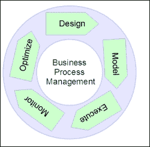

业务流程由一组活动组成，这些活动组织起来以完成特定的业务目标，这些目标从*创建产品*到*提供服务*不等。业务流程模型还提供了业务流程的视觉表示。业务流程中的活动（也称为任务）通过连接来表示业务流程的执行流程；此外，这些活动还可以进行分类。

jBPM 通过其流程设计器帮助用户定义和建模业务流程。实际上，业务用户可以在线设计业务流程，高效的版本控制和历史记录功能有助于使建模业务流程的活动协作化。还提供了在运行时模拟业务流程可能行为的方法。jBPM 还提供了在业务变更规定流程改进时将流程定义迁移到更新版本的能力。

定义的业务流程模型部署到 BPM 软件中，在这些流程定义的实例被创建以执行流程。jBPM 提供了执行业务流程的能力，并具有完整的操作管理功能，如跟踪、控制和维护所有流程实例的生命周期历史记录。

## 人机交互管理

在解释 BPMS 时，我们需要详细讨论的一个重要概念是**人机交互管理**（**HIM**）。构成业务流程的活动可以广泛地分为**自动**和**手动**。自动活动是指可以在没有任何人工干预的情况下由软件系统完成的活动。例如，在银行交易流程中，客户必须提供交易详情，如需要转账的银行账户号码和要存入的金额。这是一项手动活动。相比之下，如果需要将短信警报作为流程的一部分发送到客户的手机，则不需要人工干预；软件可以检索与客户账户注册的移动电话号码并自动发送短信。短信警报是银行交易流程中的自动活动。

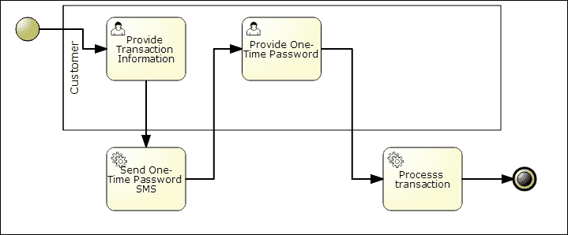

因此，人类任务实际上是业务流程中的人类交互，或者从更广泛的角度来看，是与现有软件系统的人类交互。通常，人类活动是在软件系统之外执行的物理任务，其结果或结论随后作为输入输入到软件系统中。从系统的角度来看，我们可以这样说，相关的人类活动将为业务流程提供输入，并且存在业务流程只有在手动决策之后才能继续的场景。例如，在银行交易业务流程中，客户必须提供一个一次性密码才能继续流程。

**人类交互管理系统**（**HIMS**）应具备处理人类活动生命周期的能力，这包括通知与该活动相关的用户、从用户那里收集信息或结果，以及跟踪任务的历史记录。从人类交互中收集的信息用于流程执行和决策制定。jBPM 具有内置的人类任务服务，并且可以与其他任何 HIMS 集成。jBPM 的内置人类任务服务符合 WS-Human Task 规范。

jBPM 还提供了一种表单建模功能，帮助业务分析师设计可以附加到 jBPM 用户任务的用户界面表单，通过这些表单可以收集关于用户任务完成情况（如果有）的信息。

## 业务活动监控

**业务活动监控**（**BAM**）为业务活动提供在线监控能力，并使企业能够通过切割和重组活动事件数据来得出关键性能指标。BAM 指的是一种通用的软件系统，可以监控业务流程，但将 BAM 与基于 BPM 的软件系统结合相对容易且强大。通常，BAM 软件具有使用仪表板显示业务数据的能力，使业务用户能够创建关于性能指标和趋势分析的客户报告和图表。

jBPM 核心引擎存储流程和任务历史记录，并提供 API 以执行 BAM 操作。此外，jBPM 工具集包括仪表板构建器，使用户能够从业务流程历史记录中创建自定义仪表板。

考虑一个银行交易流程，其中客户从其账户向另一个账户进行交易。通过分析流程历史记录日志，业务用户可以创建关于一天中交易量最大的高峰时段的趋势分析报告。这种分析可用于优化相关的 IT 成本。

另一个更常见的应用场景是，通过避免流程瓶颈来优化业务流程。流程瓶颈可能由各种问题引起，包括资源短缺（人员供应不足）或系统表现不佳。资源短缺问题可能相当明显，但系统效率低下可能并不明显。例如，假设在银行交易流程中的**一次性密码**（**OTP**）活动经常延迟。假设它需要超过一分钟，这会促使用户再次执行交易（或使用重发选项），导致客户不满。这也导致了通过发送多个 OTP 造成的资源浪费；换句话说，延迟的 OTP 会进一步混淆客户，银行也失去了其信誉。这些问题通常是在勤奋的客户通知银行这些问题时被注意到的。BAM 可以使这些问题的修正更加主动，从而提高客户满意度。

## 业务流程模拟

业务流程模拟为业务用户提供了一种能力，让他们能够看到他们创建的业务流程模型在运行时会如何工作。模拟是一个与建模紧密相关的术语。模型设计者真的很希望有一个模拟器来测试他的模型并了解其模型的运行时影响。业务流程模拟是分析业务流程运行行为的能力。它有助于优化业务流程模型的质量、性能和资源利用。

将业务流程模拟与测试这些流程的更常规模型进行比较，我们发现用户在将它们部署到**质量保证**（**QA**）环境中后，必须手动测试这些流程。进一步来说，为了实现自动化验证，用户将不得不依赖程序员编写自动化测试用例。在这两种情况下，验证过程都没有与建模过程本地执行，延迟的结果意味着需要进行迭代以进行修正，这增加了流程改进的成本。

业务流程模拟为业务用户提供了一种能力，让他们能够看到他们创建的业务流程模型在运行时会如何工作。用户可以提供模拟信息，这包括过程输入、中断以及用于模拟模式的资源信息。在执行模拟的过程中，软件会收集关于运行过程的统计信息，用户可以通过分析这些信息来优化他们的业务模型。

jBPM 是 **Business Process Simulation Interchange Standard** (**BPSim**) 的早期采用者和实施者。BPSim 提供了一个标准规范，允许使用计算机可解释的表示或元模型来分析业务流程模型。使用 jBPM，最终用户可以通过流程设计器提供模拟的元数据，并执行模拟以查看执行路径和与各种执行路径相关的性能指标。

# 业务流程模型和符号

**业务流程模型和符号** (**BPMN**) 是广泛接受的业务流程建模标准，并为在 **业务流程图** (**BPD**) 中指定业务流程提供了一个图形符号。它基于与 **统一建模语言** (**UML**) 的活动图非常相似的流程图技术。BPMN 由 **对象管理组** (**OMG**) 维护，当前版本为 2.0（2011 年 3 月发布）。

BPMN 的主要目标是提供一个标准符号，便于业务利益相关者理解。这些包括创建和改进流程的业务分析师、负责实施这些流程的技术开发人员以及监控和管理流程的运营经理。因此，BPMN 作为一种通用语言，弥合了业务流程设计和实施之间经常出现的沟通差距。BPMN 还作为组织之间为了实现共同商业目标而合作的沟通媒介，以共享功能流程和程序。

BPMN 与其他流程定义标准（如 **Business Process Execution Language** (**BPEL**)）之间的主要区别之一是 BPMN 支持人类交互。人类交互支持为业务流程建模提供了完整性，因为人类是任何商业组织中的主要参与者。作为一个视觉编程符号的规范，BPMN 对业务流程模型元素的图表表示给予了极大的重视。因此，BPMN 图表的读者可以轻松识别基本元素类型并理解业务流程。BPMN 符合性确保了共同的视觉表示，尽管它允许在不会大幅改变图表的基本外观和感觉的情况下进行变化。

BPMN 2.0 规范的详细说明可在规范文档中找到。

### 注意

BPMN 规范文档可在 [`www.bpmn.org/`](http://www.bpmn.org/) 找到。

符合标准 BPMN 规范定义了四种类型的符合性：

+   **流程建模一致性**：声称符合一致性的工具必须支持 BPMN 核心元素、人类交互、池和消息流。

+   **流程执行符合性**：声称符合一致性的工具必须支持并解释规范中所述的操作语义和活动生命周期。

+   **BPEL 流程执行一致性**：一种特殊的流程执行一致性，支持 BPMN 映射到 WS-BPEL。

+   **编排建模一致性**：声称一致性的工具必须支持编排图及其元素。编排图侧重于不同群体在活动中的协作以及它们之间的消息流。

jBPM 实现部分声明了前两种一致性，即流程建模一致性和流程执行一致性。尽管 jBPM 支持流程建模中的所有核心元素，但它不支持规范中描述的所有元素。

## 核心元素

BPMN 图的主要组成部分，BPMN 元素，可以广泛地分为五类：

+   **流程对象**：这些对象定义了业务流程的行为

+   **数据**：这代表与业务流程相关的数据

+   **连接对象**：这些对象用于将流程对象连接到彼此

+   **泳道**：这是用来分类流程对象的

+   **工件**：这些提供了关于流程的额外信息

### 流程对象

流程对象是 BPMN 的核心；它们用于定义业务流程将如何表现。以下是一些主要的流程对象类型：

+   **事件**：事件是在业务流程过程中发生的事情。这些事件影响模型的流程，通常对业务流程有触发和影响。一些事件示例包括开始、停止和错误。开始事件触发流程实例的开始，并使用显式触发器、消息或计时器来触发。事件可以是来自流程的信号（抛出）或等待事件（捕获）。

+   **活动**：活动是在业务流程中执行的动作。它们可以是原子的（称为任务）或复合的（子流程）。活动的一个例子是用户任务或服务任务。用户任务表示人类交互，动作必须手动执行以完成此任务。任务可以在触发时完成，也可以等待完成（等待状态）；例如，服务任务被触发并完成，而人类任务被触发并等待用户完成动作。

+   **网关**：网关用作业务流程中执行路径的分支、合并、分叉和连接的控制。一个例子是并行网关，它可以用来将执行路径分割成多个输出分支，所有输出分支同时激活。并行网关也可以用来合并分支；它们等待所有输入分支完成，然后触发输出流程。

### 数据

业务流程执行会产生数据；例如，在银行交易流程中，交易详情是用户关于交易提供的数据。这些数据必须保存或传输到另一个活动以进行进一步处理。以下元素是 BPMN 中数据建模的核心。

+   **数据对象**：数据对象是作为业务活动的一部分创建的数据。它们可用于信息目的，以表明活动产生了此类数据。

+   **数据输入**：数据输入指定活动完成所需的数据。例如，在银行交易流程中，发送 OTP 的任务需要客户的详细信息来发送短信。因此，此活动的输入是从先前活动的输出或从与流程实例全局关联的数据映射而来的。

+   **数据输出**：数据输出是活动产生的数据，必须映射到全局流程变量或作为后续活动的输入。

+   **数据存储**：数据存储为活动提供一个机制，用于检索或更新超出流程范围持久存储的信息。

### 连接对象

流程对象通过连接对象相互连接。以下是一些连接对象的类型：

+   **序列流**：序列流是用于表示连接的基本元素。它用于连接流程对象并定义活动的执行顺序。

+   **消息流**：消息流用于表示跨越组织边界的信息流（组织内的活动组或部门，或用户的角色）。

+   **关联**：关联用于表示数据或文物与流程对象的关联。

### 泳道

泳道是一种组织和分类活动的视觉机制，是使用 BPMN 的跨职能图表的基础。它们代表一个组织、一个角色或一个系统。它们基本上有以下两种类型：

+   **池**：池表示活动的更高层次分类。例如，组织可以表示为一个池。池由多个泳道组成。泳道的例子可以是组织内的部门。

+   **泳道**：泳道表示池内的分类。泳道包含流程对象、连接对象和文物。

### 文物

文物是图形表示，提供关于流程或流程内元素的支持信息。它们不会干扰流程流程；换句话说，我们可以从流程执行的角度说它们是不透明的。BPMN 规范中声明的文物基本类型如下：

+   **分组**：分组构造可以用来逻辑地分组任意一组流程对象，以表明它们逻辑上属于一起

+   **文本标注**：文本标注可以用来将额外的文档与 BPMN 图中的任何元素关联起来

下面的图中展示了银行交易流程，其中事件、活动、数据对象、流道和网关的核心元素被标注出来：

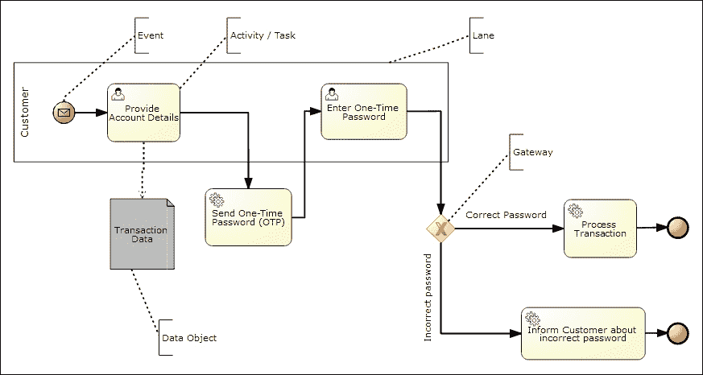

# 在行业中应用的业务流程管理

BPM 通常用于以下情况成立的行业：

+   业务流程是分布式的，跨越多个应用程序或软件系统

+   该流程涉及必须维护和随时间更新的复杂规则

+   需要通过监控现有活动来持续改进业务流程

+   业务是通过多个利益相关者的协作完成的

考虑到上述考虑因素，我们可以将业务流程管理（BPM）应用于任何以流程为导向的领域，例如医疗保健、保险、销售点、供应链管理以及银行和金融服务。一个功能齐全的 BPM 系统为新产品/服务提供或改进流程的组织在周转时间方面提供了巨大的优势。

考虑到本书的范围，我们可以在接下来的章节中简要介绍一些领域。这些用例的详细研究将在后续章节中进行，并且这些用例将在整本书中用于解释 jBPM 的各个方面。

## 供应链管理

供应链是一系列相互关联的业务流程和业务伙伴，它管理着从设计点到将产品和服务交付给最终客户的过程中的商品和信息流。供应链为组织提供了一个协调良好的渠道，以将他们的产品和服务交付给最终客户。供应链通常包括以下内容：

+   **供应商**：他们提供原材料。

+   **制造商**：他们制造产品。

+   **分销商**：他们将产品分销给零售商销售。

+   **零售商**：他们向最终客户销售产品。

+   **客户**：他们购买并使用产品。因此，供应链是多个功能单元的协作，这些组可以属于同一组织或来自不同的业务单元。以成本效益的方式协调工作和满足最终用户期望是一个挑战，并且归因于供应链管理系统。正如你所看到的，该领域本质上是面向流程的，有很多复杂的规则和法规管理流程的每个阶段，并且这是应用完整 BPM 系统的最佳匹配领域。

在供应链领域可以提及的一些流程如下：

+   **制造流程管理**：这涉及产品的制造和/或服务的提供

+   **订单管理**：这满足了客户在订单履行方面的要求

+   **客户服务管理**：这提供有关产品可用性、发货日期和订单状态的现实信息

订单管理是供应链领域的核心流程。下图中描述的流程是一个简单的流程，但其目的是为了展示业务流程带来的便利和清晰性，尤其是对跨职能业务流程而言。从流程图本身来看，任何外行人都可以理解组织中的跨职能单元以及当然的流程。因此，用户，无论是业务分析师还是运营用户，都可以更容易地理解整体情况，从而提高整体沟通和效率。

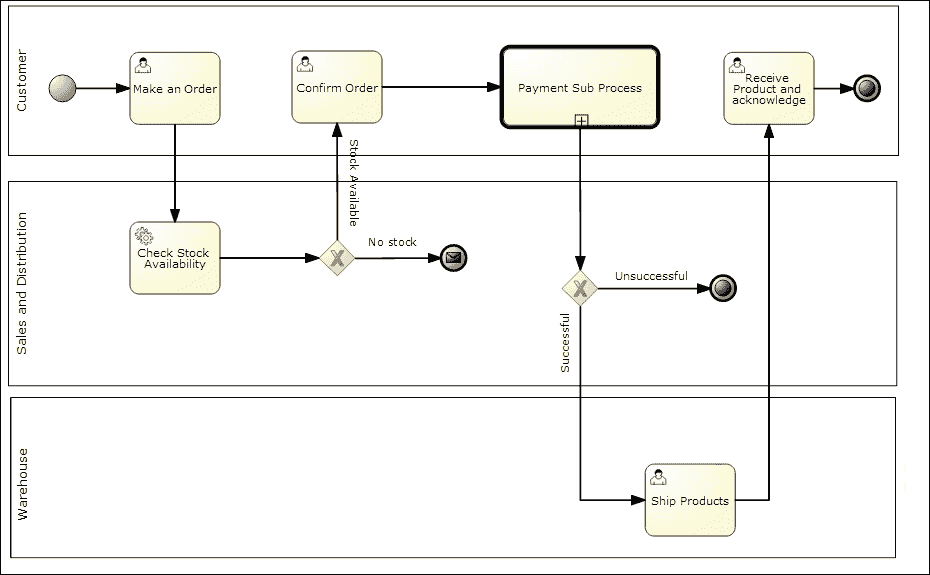

支付是一项活动，但其规模和复杂性相当于一个独立的过程。此外，如果我们应用责任规则，支付需要被明确抽象为一个可以跨组织流程复用的独立过程，以便处理支付。因此，我们可以做出设计决策，将支付作为一个子过程，这可以降低复杂性，更好地处理异常情况，并实现可重用性。

在这个特定的流程中，我还想让您注意的一个点是**无库存**中的停止事件；在流程终止中嵌入了一条消息。这可以用作向另一个组织流程处理无库存情况的信号；例如，在这种情况下，**无库存**将是触发需求管理流程的信号事件。

## 银行和金融服务

银行是另一个 BPM 应用广泛的领域。BPM 使银行能够自动化其业务流程，如账户开设、贷款处理、支付和交易。在银行业务领域，流程的可见性和对法规的遵守至关重要。银行持续对其流程和服务进行创新性改变，BPMS 为他们提供了快速适应流程改进计划的能力。

与银行相关的典型业务流程如下：

+   账户开设和维护

+   贷款处理

+   支付和交易处理

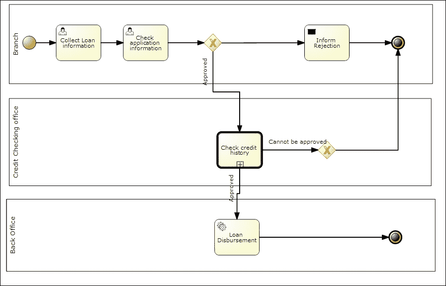

前面的图显示了贷款处理的简化版本，类似于供应链管理领域的示例流程。它带来的清晰性是显而易见的。然而，在银行业务领域，更重要的是 BPM 向业务用户提供的灵活性、自动化和智能选项。业务用户可以定义流程并对其进行修改，从而为市场推广带来敏捷性；自动化帮助用户成功遵守法规合规；基于活动监控的分析帮助银行组织减少欺诈并提升客户体验。

# 业务流程建模中的设计模式

设计模式是对其相应领域内常见问题的解决方案。业务流程模型试图通过使用一组标准元素来映射通用业务流程和程序。下面提供的设计模式是针对业务流程建模中某些常见问题的解决方案。

本节重点介绍在业务流程建模领域中确定的设计模式。理解这些模式将有助于您在使用 BPMS 尝试映射问题时轻松识别解决方案。以下列表中的模式可以在 jBPM 设计工具提供的模式模板中找到。

## 顺序

顺序是业务流程建模中最基本的模式，通过它可以将要依次执行的任务建模。

jBPM 通过使用序列流连接器连接任务来支持这一点，这些连接器提供了任务的顺序排列。

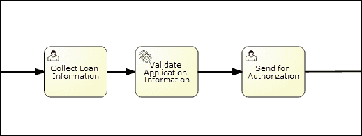

前面的图示说明了银行领域贷款处理的一部分，它代表了一个顺序模式问题。收集贷款信息、验证和发送授权等活动必须按顺序执行；这些活动可以被分配给单独的人类用户，甚至可以分配给系统自动化任务。

## 并行分割

并行分割模式用于将执行分支分割成超过两个分支，使得每个输出分支都并行执行。

jBPM 通过使用并行网关来支持并行分割模式，其中所有输出分支同时激活。

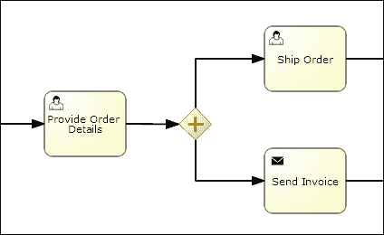

前面的图示展示了订单履行过程中的一个场景，其中适用并行分割模式。在订单处理过程中，在提供订单详情、发货和发票发送之后，支付可能成为并行处理路径。这里的并行分割模式正好适用，可以解决问题。

## 同步

同步模式是并行分割设计模式的另一端；它以这种方式合并两个或更多分支，即合并后的分支只有在所有要加入的输入分支执行完毕后才会运行。

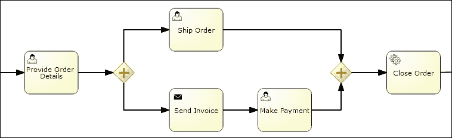

前面的图示展示了并行分割模式的示例延续，在完成发货和支付并行处理路径之后，有一个关闭订单的活动需要执行。请注意，关闭订单活动必须在支付和发货活动完成后才能执行。

## 简单合并

简单合并模式提供了一种将两个或更多分支合并到流程定义中的单个执行路径的方法。这在有两条或多条路径到达一组共同活动的情况下特别有用。我们可以通过使用简单合并模式来避免重复这些共同的活动集。

在 jBPM 中，可以通过使用 XOR 或排他网关来实现单合并，该网关在触发输出流程之前等待一个输入分支完成。

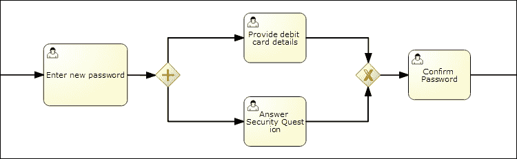

前面的示例流程，处理在线银行客户更改密码的问题，非常适合简单合并的问题陈述。如图所示，为确保安全，用户有两个选择，要么提供借记卡详情，要么回答安全问题。在提供这两种选项中的任何一种之后，都会进行密码确认。排他网关（在**确认密码**活动之前）在完成任何并行活动后为确认密码活动提供控制。

## 排他选择

排他选择模式提供了一种将分支发散到多个分支（或执行路径）的解决方案，这样在完成输入分支后，执行流程会根据分支条件精确地转交给一个分支。

在 jBPM 中，可以使用基于数据的排他（XOR）网关来实现这种模式。XOR 网关根据提供的分支条件将执行分支到恰好一个分支。

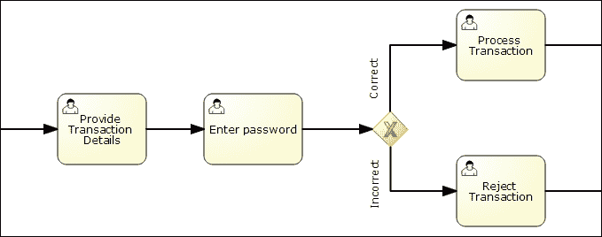

上一图说明了排他选择的场景。示例是制作在线交易流程的一部分。在根据排他网关的条件进行验证后输入密码，然后选择继续的路径。这种模式类似于流程图中的决策框。

## 隐式终止

隐式终止模式使用户能够从任何分支终止流程。流程引擎验证已完成的工作项并决定流程的终止。这很大程度上避免了混乱，否则我们必须以这种方式设计流程，即这些路径在单个终止点汇合。随着流程中路径数量的增加，这种设计的复杂性也会增加。

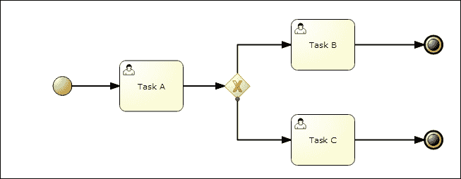

上一图显示了一个有两个终止点或终止事件附加的流程。在这里，无论是**任务 B**完成之后还是**任务 C**完成之后，流程都会终止。

如果 BPMN 实现不支持隐式终止，用户可以通过将路径合并到公共终止点来实现终止，这被称为显式终止。以下图显示了显式终止：

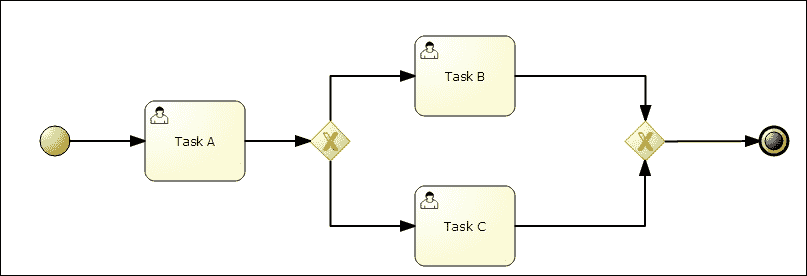

参考前面的图，我们可以看到使用网关来实现一个共同的终止点。前两种情况下流程执行的结果是相同的，但第二种解决方案（显式终止）更复杂。

## 延迟选择

延迟选择使业务流程能够在与操作环境的交互基础上选择路径。执行控制等待在决策网关中；选择第一个任务启动的路径作为执行路径。

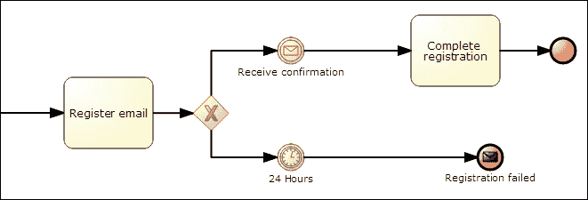

前面的图显示了在线银行场景中延迟选择模式的实现。该流程是为了使客户能够将其电子邮件与其账户关联，以接收更新、账户报表等。注册后，将向客户发送电子邮件至注册的客户 ID 以完成注册。如果客户在指定的时间内（此处为**24 小时**）没有响应，则注册失败。

## 无同步的多重实例

通过使用**多重实例**（**MI**）功能，我们可以创建一个任务的多个实例。这些实例彼此独立。在多个实例执行之后，不需要同步执行流程，这与合并不同。

jBPM 允许我们建模一个多重实例子流程，可以用来实现 MI 模式。以下图示了一个示例：

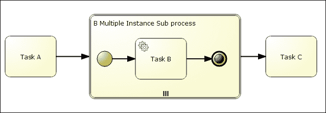

在执行**任务 A**之后，**任务 B**的执行是通过使用定义**B 多重实例子流程**的集合表达式来完成的。根据集合表达式中提供的项目数量执行**任务 B**的多个实例。**任务 C**在**任务 B**（或**任务 B**的实例）执行完成之前执行。这种模式特别适用于需要以*fire-and-forget*方式运行多个任务的情况。

例如，在一个流程中，我们必须向一组用户（例如事件的订阅者）发送电子邮件。在这里，集合表达式将是订阅者的列表。多重实例任务（发送电子邮件任务）将向每个订阅者发送电子邮件。

## 同步合并

同步合并提供了一种控制合并分支执行流程的方式。当所有传入的“活跃”分支都完成后，执行流程才会合并。

jBPM 通过使用包容网关来实现这种模式。包容网关在分裂时，根据分支条件激活一个或多个分支。在合并时，它等待所有活跃的传入分支完成。

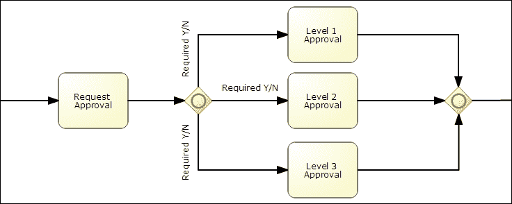

前面的流程说明了同步合并场景。根据审批级别的条件，可能需要一或多个审批级别。第二个包容网关确保在所有活动审批完成后才进行到下一个活动的控制。

### 任意循环

随意循环模式以非结构化的方式解决了在流程模型中重复任务的需求，无需显式构造，如循环运算符。这种模式有助于以可视化的格式表示需要循环的流程模型。

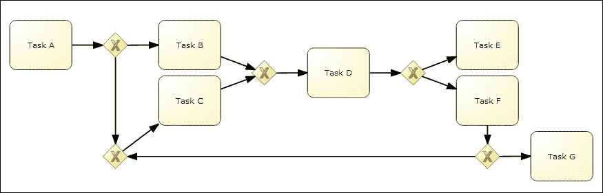

前面的图示表明，可以使用连接器和网关循环连接任务。

# 介绍 jBPM

jBPM 是一个开源的 BPM 套件，拥有完整的工具栈，支持从建模和执行到业务流程的管理和维护的各个方面。它是在 Apache License 2.0 许可下发布的，并由 JBoss 社区开发和积极支持。

工具栈专注于服务于以下两种类型的用户：

+   模拟应用程序并使用应用程序的业务用户

+   帮助业务用户使模型可执行并使应用程序完全功能化的技术人员

下面的图将为您提供 jBPM 工具栈及其提供的功能集的整体视图。我们将简要讨论功能组件。每个组件的详细讨论将在后续章节中呈现。

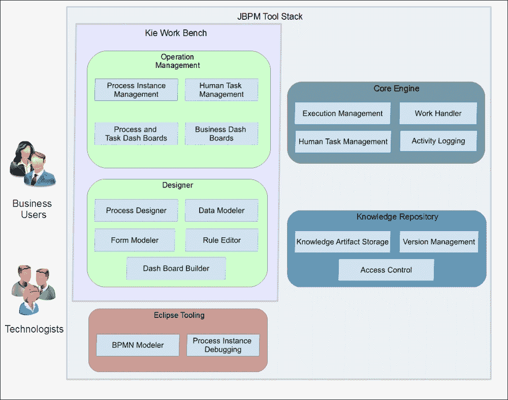

## KIE 工作台

Kie 是“知识即一切”的缩写，Kie 工作台是 Drools 世界中所有工具的组合，用于捕获和管理知识。它结合了项目编写、数据模型、规则、决策表、测试服务、流程编写、流程运行时执行、流程模拟和人工任务管理等功能。

Kie 工作台提供了一个 Web 前端和完整的集成环境，用于执行所有 BPM 相关活动。它使用户管理大量工具变得更加容易。其底层架构高度模块化，并且您可以将此功能集的每个部分独立集成到您的 Web 应用程序中，前提是它符合 UberFire 标准。

### 注意

UberFire 是一个基于 Web 的工作台框架，灵感来源于 Eclipse RPC。它是基于插件的，运行时是 UberFire 兼容插件的组合。

更多信息，请参阅 [`www.uberfireframework.org/docs/`](http://www.uberfireframework.org/docs/)。

Kie 工作台的重要性在于它还提供了一种哲学、一个指南和一个过程，用于开发基于知识的系统。它指导您以结构化的方式开发基于知识的系统。

知识生命周期，正如社区所称呼的，是由以下步骤组成的循环：

1.  **发现**：推动您公司业务所需的企业知识。

1.  **作者**：正式化您的业务知识。

1.  **部署**：了解如何配置您的环境。

1.  **工作**：减少文书工作。

1.  **改进**：提升您的业务性能。

知识生命周期显示了 JBoss 社区在提供现成、基于知识的应用程序开发环境方面的成熟度。

### 流程设计器

流程设计器是一个基于 Web 的丰富用户界面，允许我们建模符合 BPMN2 规范的业务流程。其目标是提供一个直观的工作台，使业务和技术用户都可以建模和模拟可执行的业务流程。

### 运营管理

建模的输出是可执行的业务流程。管理工具允许用户管理流程的执行、监控执行并报告执行情况。

jBPM 提供基于 Web 的工具，用于流程管理、监控和报告。实际上，基于 Web 的工具使用核心引擎 API。这些 API 通过**表示状态转移**（**REST**）、**Java 消息服务**（**JMS**）和**上下文与依赖注入**（**CDI**）接口公开，以便它们可以与其他企业级软件系统集成。

## Eclipse 工具集

虽然作为一个 BPM 套件，jBPM 专注于面向业务用户，提供大量基于 Web 的工具，但社区坚定地保持脚踏实地，为依赖于构建复杂业务功能的技术用户提供明确的工具。

基于 Eclipse 的工具集是一组 Eclipse IDE 的插件，允许技术用户将 jBPM 环境集成到软件开发环境中。Eclipse 工具集提供以下功能：

+   创建新 jBPM 项目的向导

+   BPMN 2.0 流程的图形模型器

+   运行时支持（用于选择要使用的 jBPM 运行时）

+   调试：在执行过程中可以检查和可视化正在运行的流程的当前状态

+   流程实例视图，提供显示所有正在运行的流程实例及其状态的详细信息

+   显示审计日志的审计视图

+   与 Kie 工作台存储库同步，使 Eclipse 工具集用户和基于 Web 的用户之间能够协作

## 核心引擎

jBPM 的核心是一个用 Java 构建的业务流程执行引擎。它轻量级且易于嵌入任何 Java 应用程序作为依赖项（作为依赖库）。核心引擎被设计为一个基于标准的、可插拔的、高度可扩展的组件。它支持本地的 BPMN 2.0 规范。

## 知识库

知识库是我们存储所有流程定义和相关工件的地方。BPM 是一个持续的过程；业务流程持续演变，跟踪更新的流程并提供多个流程版本非常重要。jBPM 使用 Drools Guvnor 作为知识库，并提供以下功能：

+   流程和相关工件（如流程、规则、数据模型和表单）的持久化存储

+   部署选定的流程

+   认证和授权

+   知识工件分类和搜索

+   场景测试以确保我们在更新流程时不会破坏任何东西

+   用于业务流程协作开发的特性，如评论和变更通知

# 业务逻辑集成平台

同样重要的是要理解 jBPM 是 JBoss 提供的**业务逻辑集成平台**（**BLIP**）的一部分，该平台包括以下内容：

+   Drools Guvnor（业务规则管理器）

+   Drools Expert（规则引擎）

+   jBPM（流程管理）

+   Drools Fusion（事件处理/时态推理）

一起，它们为企业解决方案的知识型应用开发和管理的完整解决方案。

BILP 可以被视为一个快速企业应用开发平台，从该平台中，应用可以通过建模规则、业务流程流程、事件、数据模型和表单来构建，几乎不需要技术用户的帮助。技术和其工具具有双重焦点：它们明确服务于业务用户，使这些用户能够通过建模直接表达需求，并帮助他们参与应用开发过程，在技术用户的指导下，使模型完全功能化，并实现具有所有品质（非功能性需求）的软件应用。

BLIP 将以下三个范式集成到业务语言驱动的应用中：

+   **业务规则**：这代表业务域中的知识

+   **业务流程**：这代表在业务域中执行的活动

+   **事件流处理**：这将为知识添加时态推理

这些范式虽然作为三个不同的流开发，从定义本身就可以明显看出，但在业务解决方案的背景下是相互关联的。难怪在大多数解决方案架构中，这三个构成了业务建模的基石。

这些范式集成到一个统一平台中，其中一个模块的所有功能都被其他模块利用。Drools Expert 中的决策（从知识库）能力被 Drools Fusion 使用；Drools Fusion 的事件处理能力可以被 BPM 套件 jBPM 使用；而 jBPM 则使用 Drools Expert 内部执行业务规则任务。

下图展示了这种集成以及平台中模块之间的交互。Drools Guvnor 用于设计流程、事件、规则和相关工件；存储它们；并提供集成测试设施。作为一个集成平台，BLIP 允许规则、流程和事件之间的交互。

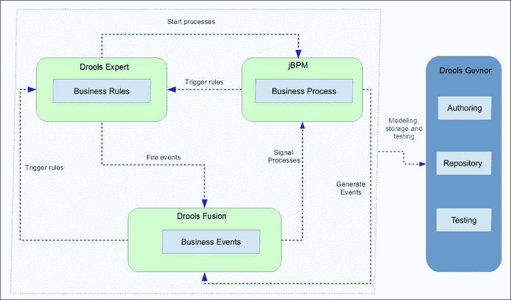

如前图所示：

+   **Drools Expert**可以根据其规则推理启动业务流程或创建事件

+   **Drools Fusion**可以根据事件传入的模式基于其时间推理能力触发规则或信号流程；而 jBPM 可以作为其活动之一触发规则或根据业务活动生成事件

我们已经讨论了 jBPM 的概述；现在，让我们在接下来的章节中简要讨论平台中的其他组件。

## Drools Guvnor

我们已经在 jBPM 的核心概念部分讨论了知识库，而你猜对了，jBPM 使用 Drools Guvnor 作为其知识库。

Drools Guvnor 提供以下功能：

+   为知识工件（如流程定义、规则定义、事件和相关工件）提供辅助编写

+   对使用这些工件进行访问控制和安全保护

+   版本管理

+   辅助部署和分发工件到运行时环境

+   集成测试

## Drools Expert

Drools Expert 是一个规则引擎。知识以规则的形式存储在知识库中，这些规则是在声明性语言**Drools 规则语言**（**DRL**）中定义的。该引擎将传入的数据或事实与这些规则匹配，以做出决策并执行与推理/决策相关的操作。

## Drools Fusion

Drools Fusion 是一个事件处理引擎，用于从多个流或事件云中检测和选择感兴趣的事件（业务兴趣）。Fusion 与 Drools Expert 紧密集成。

Drools Fusion 提供以下功能：

+   时间推理，它允许基于事件的时间因素定义和推理业务规则

+   对推理中要采取的行动进行调度和延迟

## 协同工作

既然我们已经讨论了工具，我们现在可以继续可视化这些工具如何协同工作，以创建一个完全由规则驱动的业务解决方案。以下图提供了使用这些工具的可能的解决方案架构的鸟瞰图。

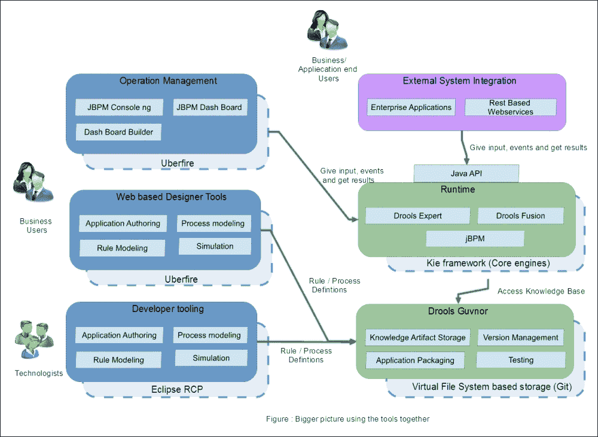

一起，它们使业务分析师能够通过将业务场景映射到流程定义、决策的规则定义以及包括时间逻辑在内的规则来编写和管理应用程序。

1.  设计工具使业务分析师能够将解决方案所需的业务场景映射到规则、流程、事件或相关工件。

1.  应用程序/用户可以通过使用 jBPM 提供的操作管理工具与解决方案进行交互，或者他们可以使用 RESTful Web 服务接口从他们自己的应用程序中访问它。

1.  运行时集成了业务处理、规则推理和时间推理能力，以推断决策并为业务场景采取行动。

1.  知识库模块提供应用程序的存储、版本管理、部署和测试。

从前面的图中，我想强调的另一件重要事情是个体工具所使用的平台技术。用于流程设计和操作管理的基于 Web 的用户界面是使用 UberFire 框架开发的；基于 Eclipse 的工具是基于 Eclipse RCP；运行时是基于 Kie 框架；而 Guvnor 是基于基于虚拟文件系统存储的，默认使用 Git。关于这些平台技术的细节，以及如何定制和扩展 jBPM，将在第七章 *定制和扩展 jBPM* 中讨论。

红帽还提供了一种商业支持的版本，称为 Red Hat JBoss BPM Suite。

# 摘要

本章的目标是给你展示 BPM 世界的全景。我们探讨了基本概念、标准、模式、BPM 在工业中应用的使用案例及其益处。我们还探讨了 jBPM 工具栈和 BLIP 的更大图景。这些概念和工具将在本书的后续章节中详细讨论。

在下一章中，我们将讨论如何安装 jBPM 工具栈并使用 jBPM 创建我们的第一个以业务流程为中心的应用程序。
