# 第二章. 构建您的第一个 BPM 应用程序

让我们现在使用 jBPM 工具栈构建我们的第一个 BPM 应用程序。本章将指导您了解以下主题：

+   安装 jBPM 工具栈

+   破解默认安装配置

+   建模和部署 jBPM 项目

+   在独立 Java 项目中嵌入 jBPM

向本书目标迈进的一步，本章为您提供了 jBPM 工具栈的动手灵活性，并提供了有关破解配置和探索的信息。

# 安装 jBPM 工具栈

jBPM 发布版附带一个安装 zip 文件，其中包含 jBPM 环境的基本要素和用于构建演示运行时的工具，以便轻松手动管理 jBPM 运行时环境。

下载 jBPM：

1.  访问 [`jboss.org/jbpm`](http://jboss.org/jbpm) | **下载** | **下载 jBPM 6.2.0.Final** | **jbpm-6.2.0.Final-installer-full.zip**.

    使用最新稳定版本。本书内容遵循 6.2.0 版本的发布。

1.  解压并提取安装程序内容，您将找到一个 `install.html` 文件，其中包含用于安装具有内置项目的演示 jBPM 运行的辅助文档。

### 注意

jBPM 安装需要安装 JDK 1.6+ 并将其设置为 `JAVA_HOME`，安装工具使用 ANT 脚本（ANT 版本 1.7+）完成。

安装工具基本上是一个 ANT 脚本，这是一种简单的安装方法，并且可以轻松定制。要操作工具，ANT 脚本由作为工具命令的 ANT 目标组成。以下图将使您更容易理解脚本中可用的相关 ANT 目标。每个框代表一个 ANT 目标，并帮助您管理环境。基本目标包括安装、启动、停止和清理环境。

要运行 `ANT` 目标，请安装 ANT 1.7+，导航到安装文件夹（通过使用您的操作系统中的 shell 或命令行工具），然后使用以下命令运行目标：

```java
ant <targetname>

```

### 提示

**下载示例代码**

您可以从 [`www.packtpub.com`](http://www.packtpub.com) 下载示例代码文件，该网站包含您购买的所有 Packt 出版物的示例代码。如果您在其他地方购买了这本书，您可以访问 [`www.packtpub.com/support`](http://www.packtpub.com/support) 并注册，以便将文件直接通过电子邮件发送给您。

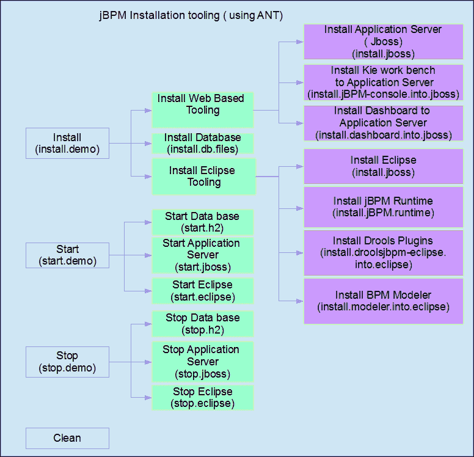

jBPM 安装程序附带一个默认的演示环境，它使用基本的 H2 数据库作为其持久化存储。jBPM 的持久化使用 Hibernate 完成；这使得 jBPM 能够支持包括以下列表中的数据库在内的多种流行数据库：

### 注意

Hibernate 或 Hibernate ORM 是一个对象关系映射框架，并被 jBPM 用于将数据持久化到关系数据库。更多详情，请参阅 [`hibernate.org/`](http://hibernate.org/).

| 支持的数据库 | 详情 |
| --- | --- |
| DB2 | [`www-01.ibm.com/software/in/data/db2/`](http://www-01.ibm.com/software/in/data/db2/) |
| Apache Derby | [`db.apache.org/derby/`](https://db.apache.org/derby/) |
| H2 | [`www.h2database.com/html/main.html`](http://www.h2database.com/html/main.html) |
| HSQL 数据库引擎 | [`hsqldb.org/`](http://hsqldb.org/) |
| MySQL | [`www.mysql.com/`](https://www.mysql.com/) |
| Oracle | [`www.oracle.com/database/`](https://www.oracle.com/database/) |
| PostgreSQL | [`www.postgresql.org/`](http://www.postgresql.org/) |
| 微软 SQL 服务器数据库 | [`www.microsoft.com/en-in/server-cloud/products/sql-server/`](http://www.microsoft.com/en-in/server-cloud/products/sql-server/) |

对于安装演示，请使用以下命令：

```java
ant install.demo

```

安装命令将`安装`网络工具和 Eclipse 工具，这些工具对于建模和操作 jBPM 是必需的。

```java
ant start.demo

```

此命令将启动应用程序服务器（JBoss），其中包含部署了网络工具（Kie 工作台和仪表板）和所有已安装插件的 Eclipse 工具。

### 注意

请参考`install.html`，安装器存档中包含的安装文档，以了解安装过程中可能出现的常见错误；它将指导您找到解决方案。安装文档相当详细；请参阅它以获得对安装过程的更深入了解。

安装到此结束！现在，JBoss 应用程序服务器应该正在运行，并且 Kie 工作台和仪表板构建器已部署。

您现在可以通过使用以下 URL 访问 Kie 工作台演示环境，并使用名为`admin`的演示管理员用户和密码`admin`进行登录：

`http://localhost:8080/jbpm-console`。

## 定制安装

演示安装是一个沙盒环境，它允许轻松安装，并减少了您从获取发布版到能够使用堆栈进行操作之间的时间。尽管这非常必要，但您完成初始设置并认真对待 jBPM 时，可能希望安装一个更接近生产环境的 jBPM 环境。我们可以为此目的定制安装程序。以下各节将指导您了解可用的定制选项。

### 更改数据库供应商

jBPM 演示沙盒环境使用嵌入式 H2 数据库作为持久化存储。jBPM 为 MySQL、PostgreSQL 等更广泛使用的数据库提供开箱即用的支持。按照以下步骤实现使用这些数据库的 jBPM 安装：

1.  更新安装根目录下可用的`build.properties`文件，以选择所需的数据库而不是 H2。默认情况下，MySQL 和 PostgreSQL 的配置可用。对于其他数据库的支持，在配置之前请检查 hibernate 文档。

1.  更新`db/jbpm-persistence-JPA2.xml`，并将`hibernate.dialect`属性更新为我们数据库供应商的适当 Hibernate 方言。

1.  在我们打算部署 jBPM 网络工具的应用服务器中安装相应的 JDBC 驱动程序。

### 手动安装数据库模式

默认情况下，数据库模式是通过使用 Hibernate 自动生成功能自动创建的。然而，如果我们想手动安装数据库模式，相应的 DDL 脚本在`db\ddl-scripts`目录中可供所有主要数据库供应商使用。

# 创建您的第一个 jBPM 项目

jBPM 提供了一种非常结构化的方式来创建项目。这种结构考虑了为拥有多个部门的大型组织创建和维护应用程序。这种结构推荐使用，因为它是一种干净且安全的方式来管理业务流程工件。以下图像详细说明了 jBPM 网络工具（或 Kie 工作台）中项目的组织结构。

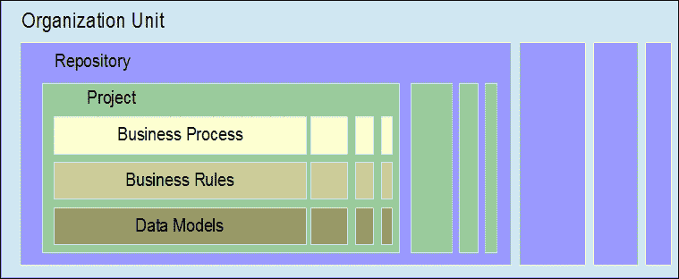

jBPM 工作台假设一个组织有一个业务流程管理套件。一个组织可以有多个组织单元，这些组织单元内部将包含多个项目，并形成项目的根，正如其名称所暗示的，它代表了一个组织的部分。这种分类可以在任何商业组织中可视化，有时也被称为部门。在理想的分类中，这些组织单元将在功能上不同，因此将包含不同的业务流程。使用工作台，我们可以创建多个组织单元。

下一个分类是存储库。存储库是存储业务模型工件，如业务流程、业务规则和数据模型的地方。存储库可以映射到组织内的一个功能分类，如果这些存储库运行多个项目，则可以设置多个存储库；这些项目工件的处理必须相互隔离（例如，出于安全考虑）。

在一个存储库中，我们可以创建一个项目，在一个项目中，我们可以定义和建模业务流程工件。这种结构和抽象对于管理和维护基于 BPM 的应用程序非常有用。

现在我们来详细说明这些步骤。

安装完成后，您需要登录到 Kie 工作台。现在，正如之前解释的，我们可以创建一个项目。因此，第一步是创建一个组织单元：

1.  通过菜单栏逐级点击，进入**作者** | **管理** | **组织单元** | **管理组织单元**。

    这将带您进入组织单元管理器屏幕；在这里，我们可以看到已存在的组织单元和存储库及其关联列表。

1.  点击**添加**以创建一个组织单元，并给出组织单元的名称以及负责管理组织单元项目的用户。创建您的第一个 jBPM 项目

1.  现在，我们可以添加一个仓库，通过菜单进行导航，并转到**创建** | **管理** | **仓库** | **新建仓库**。

1.  现在，为仓库提供名称，选择组织单元，并创建仓库。创建您的第一个 jBPM 项目

创建仓库会导致（内部）创建一个 Git 仓库。工作台中 Git 仓库的默认位置是`$WORKING_DIRECTORY/.niogit`，可以通过以下系统属性进行修改：`-Dorg.uberfire.nio.git.dir`。

1.  现在，我们可以为组织单元创建一个项目。转到**创建** | **项目创建** | **项目资源管理器**。现在，从项目分类的面包屑中选择您的组织单元（这里为**Mastering-jBPM**）。创建您的第一个 jBPM 项目

1.  点击**新建项**并选择**项目**。现在，我们可以通过输入相关项目名称来创建项目。创建您的第一个 jBPM 项目

1.  这将带您进入以下图中所示的新项目向导：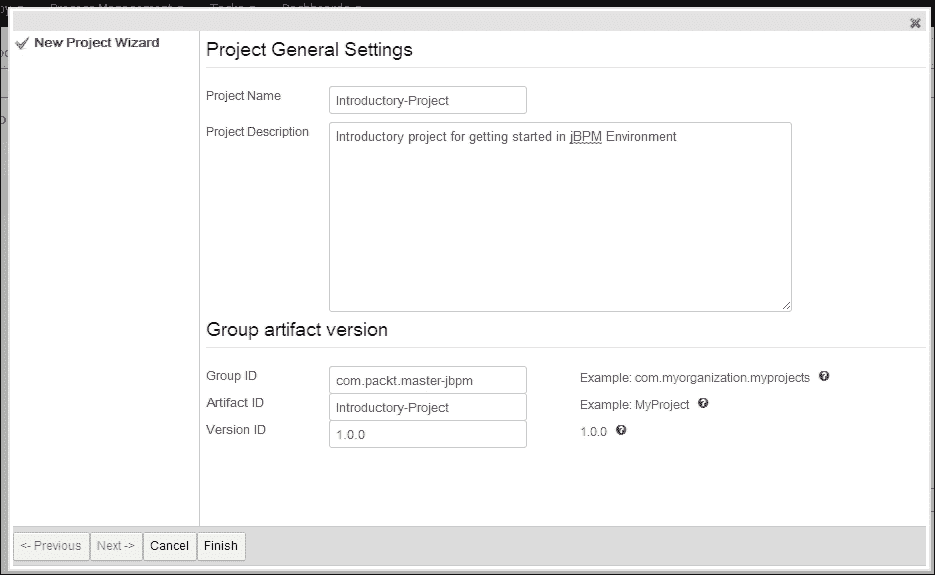

1.  这提供了项目名称和项目简要总结的详细信息，更重要的是，提供了项目组 ID、工件 ID 和版本 ID。此外，**完成**新项目的创建。

对于那些了解 Maven 及其工件结构的您，现在应该已经对项目是如何构建的有所了解。是的！创建的项目是一个 Maven 模块，并且作为单个模块部署。我们将在接下来的章节中详细介绍这一点。

## 业务流程建模

因此，我们准备好使用 jBPM 创建我们的第一个业务流程模型。

1.  转到**新建项** | **业务流程**。业务流程建模

    为业务流程提供名称；在这里，我们尝试创建一个非常原始的流程作为示例。

1.  现在，工作台将显示用于建模业务流程的过程模型器。如果您认为需要更多空间进行建模，请点击工具栏中的缩放按钮（以下图像中用红色突出显示）：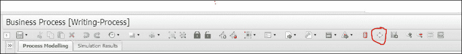

基本上，工作台可以分为五个部分：

+   工具栏（在顶部）：它为您提供了一组用于可视建模和保存模型的工具。

+   对象库（在画布的左侧）：它为您提供所有标准 BPMN 构造图块，您可以将它们拖放到画布上以创建模型。

+   工作区（在中间）：您获得一个工作区或画布，您可以在上面绘制流程模型。画布非常直观；如果您点击一个对象，它将显示围绕它的工具集，以绘制下一个或引导到下一个对象。

+   属性（在画布的右侧）：它提供了与业务流程及其每个构造关联的所有属性的属性值。

+   问题（在底部）：它显示了您当前正在建模的业务流程中的错误。验证是在保存时进行的，并且我们有自动保存选项的设置。

以下截图显示了包含所有描述部分的流程模型器：

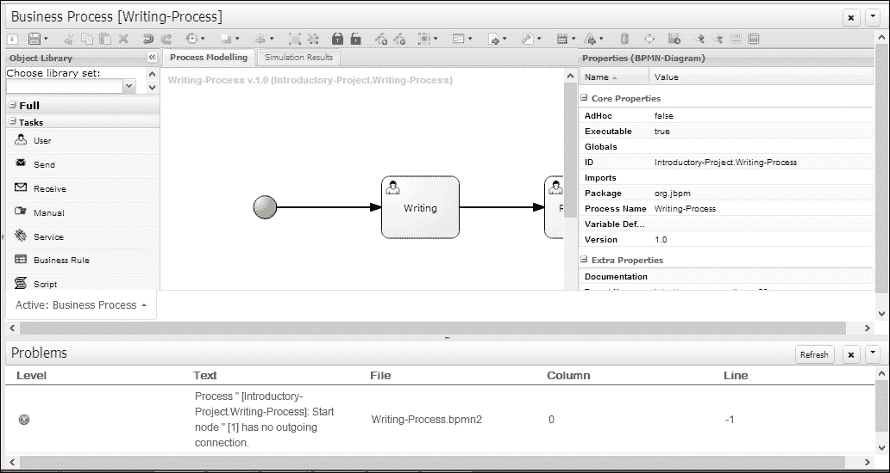

因此，我们可以开始建模我们的第一个流程。我扮演一个希望建模内容写作简单流程的业务分析师的角色。这是一个非常简单的流程，只有两个任务，一个是写作的人工作业，另一个是审查。

我们可以通过转到**属性**面板并设置演员来附加与任务关联的演员。在这个例子中，为了简单起见，我将它设置为**admin**，即默认用户。

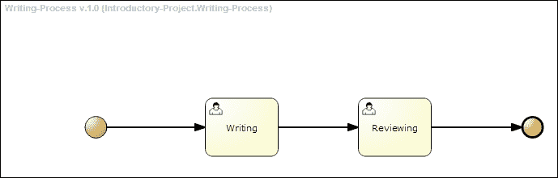

现在，我们可以通过使用**保存**按钮来保存项目；它会要求输入一个签入注释，这将为刚刚保存的流程版本提供注释。流程建模是一个持续的过程，如果正确使用，签入注释可以帮助我们跟踪流程更新的目标。

## 构建和部署项目

即使创建的项目规模很小，只是一个示例项目，这也是完全功能性的！是的，我们已经完成了一个业务流程，其功能将非常有限，但即使功能有限（如果有），它也可以部署和运行。

前往**工具** | **项目编辑器**，然后点击**构建 & 部署**，如图所示：


要查看列出的部署，请转到**部署** | **部署**以查看**部署单元**，如图所示：

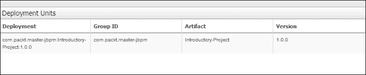

这显示了 jBPM 作为使用业务流程的快速应用构建器的有效性。我们可以在几分钟内创建、建模和部署一个项目。

## 运行第一个流程

在这里，我们开始使用 jBPM 进行操作管理。现在，我们假设自己是操作员工的角色。我们已经部署了一个流程，需要创建一个流程实例并运行它。

1.  前往**流程管理** | **流程定义**。我们可以在下面的截图中看到已部署的流程定义的详细信息：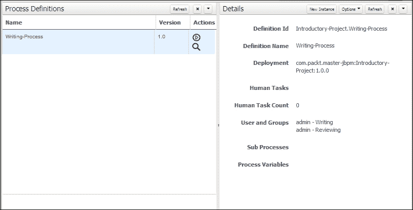

1.  点击**新建实例**并启动流程。这将启动一个流程实例。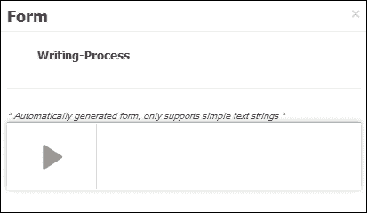

1.  前往**流程管理** | **流程实例**以查看流程实例的详细信息并对流程实例执行生命周期操作。

    示例编写流程包含两个人工任务。在流程实例启动时，Write 任务分配给管理员。可以通过任务管理功能管理分配的任务。

1.  前往**任务** | **任务列表**：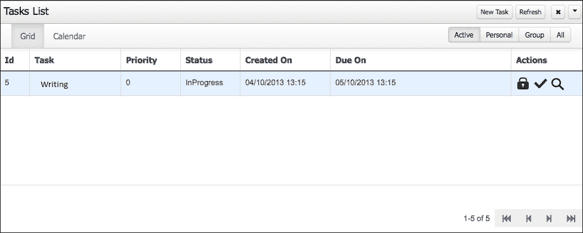

在**任务列表**中，我们可以查看人工任务的详细信息，并执行人工任务的生命周期操作，如分配、委派、完成和取消任务。

# 在独立 Java 应用程序中嵌入 jBPM

jBPM 的核心引擎是一组轻量级库，可以嵌入到任何 Java 独立应用程序中。这为企业架构师提供了在现有应用程序中包含 jBPM 并利用 BPM 功能的灵活性。

本节将介绍如何以编程方式启动运行时引擎和启动流程实例，并将指导您编写 BPMN 流程的自动化测试。

## 使用 Eclipse 工具建模业务流程

运行安装脚本后，jBPM 将安装 Web 工具和 Eclipse 工具。Eclipse 工具基本上包括以下内容：

+   jBPM 项目向导：帮助您轻松创建 jBPM 项目

+   jBPM 运行时：选择 jBPM 运行时版本的一种简单方法；这会将特定版本的 jBPM 的库集与项目关联

+   BPMN 模型器：用于建模 BPMN 流程

+   Drools 插件：在 Eclipse 中提供调试和操作管理功能

## 使用 Eclipse 创建 jBPM 项目

Eclipse Web 工具位于安装根目录中。启动 Eclipse 并创建一个新的 jBPM Maven 项目：

1.  前往**文件** | **新建项目** | **jBPM 项目**（Maven）。

1.  提供项目名称和位置详细信息；现在，jBPM 项目向导将执行以下操作：

    +   为您创建一个默认的 jBPM 项目，并设置完整的初始配置

    +   附加所有运行时库

    +   创建一个示例项目

    +   为业务流程设置单元测试环境

1.  以下截图显示了 jBPM 项目向导。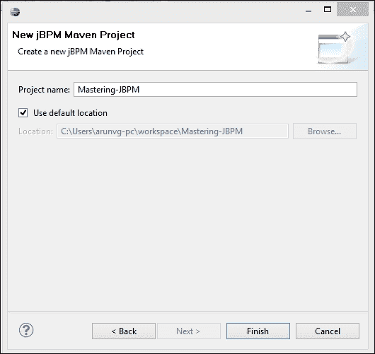

1.  Eclipse 工作台与 Web 工具工作台相当相似；以下是一个截图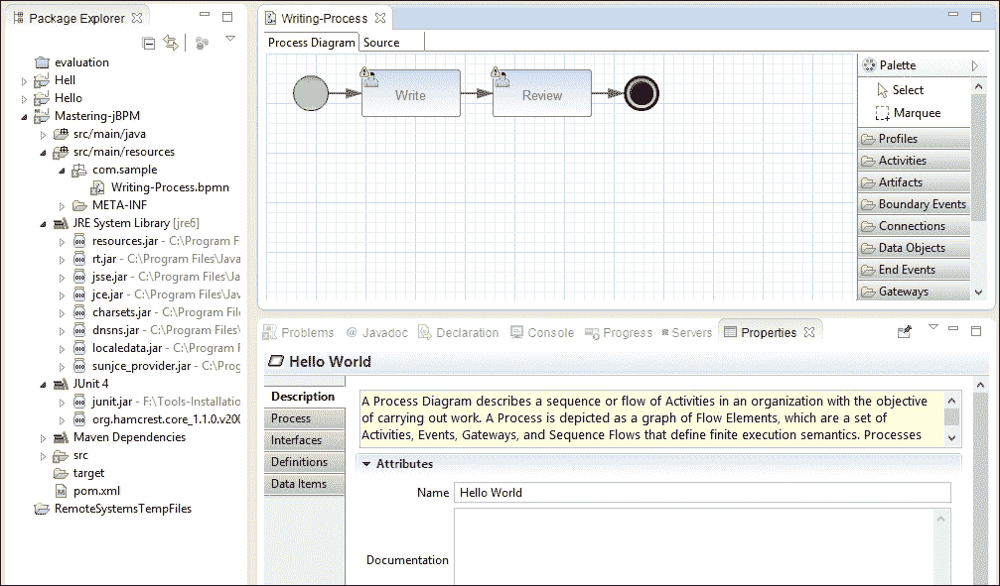

与 Web 工具类似，它包含工具箱、工作区、显示 BPMN 构造图元的调色板以及属性浏览器。

我们可以通过转到**新建项目向导**并选择**jBPM** | **BPMN2 流程**来创建一个新的 BPMN 流程。输入流程文件名并点击**完成**；这将创建一个默认的 BPMN2 模板文件。BPMN2 模型器通过从调色板拖放 BPMN 构造并使用工具集连接它们来帮助可视化建模流程。

## 以编程方式部署流程

对于以编程方式部署和运行业务流程，您必须遵循以下步骤：

### 注意

**KIE** 是 **知识即一切** 的缩写。

1.  **创建知识库**：创建 Kie 服务，它是一个中心，提供对 Kie 提供的服务访问：

    ```java
    KieServices ks = KieServices.Factory.get();
    ```

    使用 Kie 服务，创建 Kie 容器，它是知识库的容器：

    ```java
    KieContainer kContainer = ks.getKieClasspathContainer();
    ```

    使用输入名称创建并返回知识库：

    ```java
    KieBase kbase = kContainer.getKieBase("kbase");
    ```

1.  **创建运行时管理器**：运行时管理器通过知识会话和任务服务管理运行时构建，为流程和用户任务创建一个可执行的环境。

    创建用于创建持久化服务、与存储层通信的 JPA 实体管理器工厂：

    ```java
    EntityManagerFactory emf = Persistence.createEntityManagerFactory(
    "org.jbpm.persistence.jpa");
    ```

    创建运行时构建器，它是用于创建运行时环境的 `dsl` 风格辅助工具：

    ```java
    RuntimeEnvironmentBuilder builder = RuntimeEnvironmentBuilder.Factory.get()
    .newDefaultBuilder().entityManagerFactory(emf)
    .knowledgeBase(kbase);
    ```

    使用运行时环境，创建运行时管理器：

    ```java
    RuntimeManager RuntimeManager = RuntimeManagerFactory.Factory.get()
    .newSingletonRuntimeManager(builder.get(), "com.packt:introductory-sample:1.0");
    ```

1.  **创建运行时引擎**：使用运行时管理器，创建一个完全初始化并准备好运行的运行时引擎：

    ```java
    RuntimeEngine engine = manager.getRuntimeEngine(null);
    ```

1.  **启动过程**：使用运行时管理器，创建一个知识会话并启动过程：

    ```java
    KieSession ksession = engine.getKieSession();
    ksession.startProcess("com.sample.bpmn.hello");
    ```

    这将创建并启动一个流程实例。

    从运行时管理器，我们还可以访问人工任务服务并与其 API 交互。

    前往 **窗口** | **显示视图** | **其他** | **Drools** | **流程实例** 以查看创建的流程实例：

    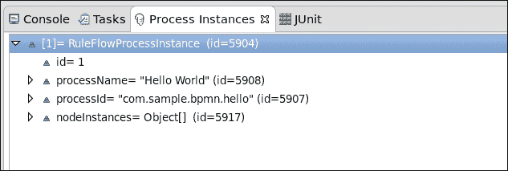

## 编写自动化测试用例

jBPM 运行时附带一个测试实用工具，它作为自动化测试用例的单元测试框架。单元测试框架使用并扩展了 JUnit 测试框架的功能，基本上提供了 JUnit 生命周期方法和在测试执行后测试和拆除运行时管理器的 jBPM 运行时环境。辅助方法管理知识库和知识会话，获取工作项处理器和断言以断言流程实例和各个阶段。

为了创建 JUnit 测试用例，创建一个扩展 `org.jbpm.test.JbpmJUnitBaseTestCase` 的类

我们可以使用前面的步骤初始化 jBPM 运行时，并使用 `org.jbpm.test.JbpmJUnitBaseTestCase` 提供的辅助方法进行断言。

例如，我们可以如下断言过程的完成：

```java
assertProcessInstanceCompleted(processInstance.getId(), ksession);
```

介绍性示例项目的代码附在此书的下载中。

# 变更管理 – 更新已部署的流程定义

我们已经建模了一个业务流程并将其部署；应用程序最终用户将通过使用业务流程来创建流程实例并实现他们的目标。现在，随着组织的演变，我们需要对流程进行更改；例如，组织决定增加一个部门。因此，我们必须更新相关的业务流程。

在技术上，在 jBPM 中，我们无法在已部署的流程定义中进行更新；我们需要有一个解决方案。jBPM 建议三种流程迁移策略。

+   **进行**：我们将介绍新的流程定义并淘汰旧的定义。淘汰应由应用程序处理，以确保所有对流程的实例调用都重定向到新的流程定义。

+   **终止**：现有的流程被终止，我们可以使用更新的流程定义重新启动流程实例。如果更改与流程实例的状态不兼容，我们必须非常小心地处理这种方法。这可能会根据您的流程定义的复杂程度表现出突然的行为。

+   **转移**：流程实例迁移到新的流程定义；也就是说，流程实例的状态和活动实例应该进行映射。jBPM 提供的开箱即用的支持提供了一个通用的流程升级 API，可以作为示例使用。

这些策略将在以下章节中详细讨论并举例说明。

# 摘要

本章将为您带来 jBPM 的“Hello world”动手实践体验。随着您的 jBPM 安装准备就绪，我们现在可以深入探讨 jBPM 功能组件的细节。

通过本章，我们结束了《精通 jBPM》的入门章节。在接下来的章节中，我们将详细讨论流程设计器、运营管理和核心引擎架构。
