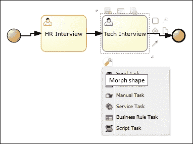

# 第三章：使用流程设计器

在前面的章节中，我们介绍了 BPM 的概念，并概述了 jBPM 工具栈及其家族，通过一些实际操作经验来构建我们的第一个 jBPM 应用程序。接下来的四章将详细说明我们迄今为止讨论的每个 jBPM 组件，而剩余的章节将指导你如何定制 jBPM，将其集成到应用程序架构中，并部署一个生产就绪的 BPM 应用程序。

对于一个手头有应用程序需求的分析师来说，第一步将是设计和建模业务流程。这一步通常并不直接，除了业务流程本身之外，还涉及多个工件。本章将带我们经历设计一个包含所有礼仪的业务流程的旅程，并将模拟业务流程以了解设计好的业务流程在运行时环境中的行为。

本章将指导你完成以下内容：

+   使用 BPM 进行业务流程建模

+   数据对象建模

+   在 BPM 活动中使用脚本和逻辑

+   建模与人类活动相关联的用户界面表单，以便从人类参与者那里获取输入

+   模拟业务流程以了解其运行时特性

+   使用基于 Web 和 Eclipse 的工具来处理同一个项目，以及业务用户和技术人员之间的协作

我们将讨论如何通过使用基于 Web 的流程设计器来完成上述操作。也讨论了基于 Eclipse 的工具，但只是简要介绍，仅突出建模操作中的差异。

# 基于 Web 的工具

基于 Web 的 jBPM 工具是 Drools Guvnor 知识库提供的用户界面框架的扩展。该框架提供了一个平台来创建、维护和运行基于知识的应用程序的多个知识资产。jBPM 扩展（命名为 jBPM-WB，即 jBPM 工作台的简称）利用平台的功能来创建和维护应用程序，并利用平台的能力提供与业务流程相对应的知识资产的用户交互。这种抽象有助于 jBPM 工作台轻松集成家族中其他软件的资产，并为业务逻辑集成平台创建一个集成开发环境。

在本节中，我们将关注 jBPM 中知识资产（即业务流程定义、流程和任务表单以及数据模型）的资产编辑器。

## 流程建模

jBPM 提供的流程设计器是一个集成环境，用于设计、验证和模拟业务流程。以下屏幕截图突出了流程设计器的六个不同部分：

jBPM 流程设计器的一部分

它们如下所示：

+   **1**: 对象库

+   **2**: 流程画布

+   **3**: 属性编辑器

+   **4**: 工具栏

+   **5**：问题可视化屏幕

+   **6**：元数据

以下各部分将在以下子节中详细介绍。

### 对象库

**对象库**是构建业务流程所使用的构造的调色板。**对象库**主要包含符合 BPMN 的构造。该库按下拉菜单排列，构造类别作为标题。创建业务流程的用户可以从调色板中选择一个构造，并将其拖放到流程画布中。以下截图显示了默认对象：

除了 BPMN 构造之外，对象库还包含工作流模式。我们已在第一章*业务流程建模 – 连接业务与技术*中讨论了这些工作流模式，它们是常见过程设计场景的解决方案模板。

开发者可以选择通过添加扩展和自定义任务来自定义对象库；我们将在专门用于定制的章节中讨论这些内容。

### 流程画布

流程画布是我们的工作区；我们通过拖放对象库提供的 BPMN 构造，连接和自定义它们来创建业务流程。流程设计器帮助我们创建一个技术上可部署的业务流程，并通过排列和放置对象、调整对象大小和更改颜色模式来建模图表的美学。以下截图显示了使用流程设计器设计的示例业务流程：

一个有用的工具，社区将变形菜单称为流程画布中的一个伟大功能。一旦拖放并选择对象，我们就可以在对象周围看到一个工具菜单。菜单中可用的工具将因对象而异。有三个菜单，分别位于对象的顶部、底部和右侧；它们具有独特的工具集合。

菜单的右侧部分包含帮助用户主要在流程上工作的工具，而无需始终依赖对象库的拖放功能。用户可以向画布中添加任务或网关对象，包括连接器，添加附件，或添加数据对象。以下截图突出了菜单的右侧部分。

菜单的顶部部分包含以下实用工具：

+   将任务添加到流程字典（这将在本章后续部分详细讨论）

+   查看**节点源**，有助于查看对象的 BPMN 源

以下截图显示了突出显示的顶部菜单和**节点源**窗口的视图，该窗口显示了任务对象的源。

底部菜单包含将 BPMN 对象转换为类似对象的工具。例如，我们放置了一个服务任务，必须将其更改为人类任务。我们必须删除任务，用另一个任务替换它，并恢复到它的连接。使用此功能，点击工具图标后，我们将获得可以交换的对象列表，通过选择另一个对象，我们可以更改对象。这是一个方便的工具，尤其是在维护一个非常大的业务流程流时。

以下图像显示了任务元素上可交换对象的菜单：

### 属性编辑器

除了业务流程图的可见部分外，业务流程中的每个对象都有可以自定义的属性。例如，在人类任务中，我们必须分配一个参与者或一个组。**属性**编辑器帮助设计师设置这些细节。通过选择对象可以获得每个对象的**属性**编辑器面板。为了设置流程级别的属性，我们必须点击画布本身。

属性编辑器面板有以下四个部分：

+   **核心属性**：核心属性部分包含对特定 BPMN 元素至关重要的属性。

+   **额外属性**：正如其名所示，这些属性是除了核心属性之外的非强制属性。例如，任务的文档。

+   **图形设置**：可以更改以改善业务流程美感的属性。设计师将具有更改背景、边框、字体颜色和字体大小的灵活性。

+   **模拟属性**：模拟属性是创建流程模拟所需的设置。这些属性的详细信息将在*流程模拟*部分讨论。

前面的截图显示了流程的属性编辑器，显示了 BPMN 流程的核心、额外和模拟属性。

每个 BPMN 结构和其目的的核心和额外属性在第五章*BPMN 结构*中详细说明。

### 工具栏

工具栏包含一组辅助工具，有助于创建和维护业务流程。大多数工具对于任何流程图编辑器（如剪切、粘贴、保存、重命名、删除和缩放）都是通用的，并提供高级功能，如表单建模和流程模拟。

大多数工具从其名称本身就可以轻易理解，可能不需要详细讨论。我们将在以下部分讨论需要关注的特定功能。

### 问题可视化

在我们继续设计业务流程时，了解我们业务流程中的语法和语义错误非常重要。问题部分显示了我们的应用程序中的这些错误。

以下截图显示了刚刚开始的一个 BPMN 流程中的错误；也就是说，它只包含一个起始节点。错误表明起始节点没有出向连接，并且流程没有结束节点：

为用户提供的另一个条款是可视化特定流程中的问题。此条款将编辑器切换到验证模式。可以从工具栏访问（参见图表），点击**开始验证**将显示流程中的错误列表：

此外，如果错误在特定的对象中，该对象将被突出显示。点击突出显示的对象以获取错误列表。

设计师通过将业务流程与一组预配置的规则进行验证来显示这些错误；这些规则是可以定制的。（请参阅第七章，*定制和扩展 jBPM*以获取定制技术）。

### 元数据选项卡

**元数据**选项卡显示了业务流程的详细信息作为一个工件。它包含有关创建和修改该工件的用户、工件格式等信息。此外，还有一个关于工件的讨论条款，这在我们有较大的分布式团队的业务分析师创建和管理业务流程的场景中非常有用。

## 数据对象建模

业务领域建模的一部分是识别问题域中的所有实体、实体之间的关系及其属性。与这些实体相关的数据通常通过业务流程进行收集、更新和删除。因此，这些实体成为我们业务流程的一部分。

例如，**客户**是一个几乎在每一个业务领域都会出现的数据实体，客户创建（添加客户的过程）是一个非常常见的业务流程。JBPM 提供了数据建模功能，这些实体可以作为数据对象创建并包含在业务流程中。

让我们通过一个例子来讨论数据建模。我们考虑一个非常原始的客户创建流程，其中包含一个用于捕获客户详情的人工任务和一个用于调用客户创建服务的服务任务。以下图像显示了正在讨论的业务流程。

要使用流程设计器创建`Customer`数据对象，请按照以下步骤操作：

1.  登录到工作台。

1.  前往**创建** | **项目创建** | **工具** | **数据模型器**，然后点击**创建**按钮。以下屏幕将弹出：

1.  要创建客户数据对象，提供一个标识符、标签和包名以唯一标识此数据对象。

好吧，正如您可能已经注意到的，还有一个名为**超类**的（可选）字段。这需要在 jBPM 数据对象设计的技术方面进行一些解释。

我们建模的数据对象被创建为一个具有我们指定的属性并作为其依赖项包含在应用程序中的 Java 对象。超类指向 Java 的继承特性，我们可以在数据对象具有父子关系的情况下使用此特性。

在创建数据对象后，我们可以使用**创建新字段**选项（见以下截图）来添加与数据对象对应的属性。以下截图显示了添加到**客户**数据对象的**名称**、**年龄**和**性别**属性：

保存数据对象。现在，我们必须在业务流程中利用这个数据对象。

在业务流程中，我们有一个人类任务，它将客户信息作为输入并映射到任务输出集中。为了做到这一点，在流程设计器中，将客户对象添加为人类任务输入和输出集中的**类型**。

以下截图显示了**捕获客户详情**人类任务的属性编辑器，其中使用了客户数据对象：

## 表单建模

继续讨论我们关于原始客户创建的例子，下一个问题将是如何为人类任务（捕获客户信息）提供用户界面。表单建模为此场景提供了一个解决方案。业务分析师可以设计一个表单，用于捕获与任务相关的信息。

要精确一点，通过表单收集的数据被映射到人类任务的数据输出集中。当我们运行**创建客户**业务流程时，“捕获客户信息”任务被分配给一个参与者（或一组），并将出现在收件箱中。为了完成任务，用户必须将详细信息输入到由引擎根据表单模型渲染的用户界面中。

### 创建表单

因此，让我们探索如何为业务流程中包含的任务建模表单。

1.  在**创建客户**流程中，选择**捕获客户****信息**任务。

1.  在突出显示的工具菜单中，顶部包含编辑相关表单的工具。点击该工具，并选择图形建模；这带我们到表单建模屏幕：

对于建模表单，首先，我们必须创建数据来源，其中我们定义数据输入集到表单变量的映射以及表单变量到数据输出集的映射。在这种情况下，我们必须映射客户变量的数据输入和数据输出。

我们必须填写**Id**、**Input Id**和**Output Id**字段，并选择表单的渲染颜色。此外，我们必须选择表单必须表示的数据模型，然后单击**添加数据持有者**以将数据模型添加为表单的数据来源。

以下截图显示了添加客户数据来源后的表单建模屏幕：

现在，我们可以建模表单的外观和感觉。为此，我们选择**按来源添加字段**选项卡，其中列出了数据来源，并将客户数据对象中附加的字段添加到表单画布中（如下截图所示）。

选择一个字段，使用工具栏编辑字段属性，并在表单中移动字段，以改善美观。

### 设置字段属性

对于表单中包含的每个字段，我们都可以指定一组属性，这些属性决定了其运行时行为和布局。

要使用**属性**面板（如下截图所示），选择字段，然后在工具菜单中单击编辑按钮。

属性包括以下内容：

+   用于验证数据完整性的属性

+   输入文本的大小

+   支持的最大字符数

+   是否必填

+   只读或非只读

+   是否为密码字段

+   用正则表达式表示的数据模式

+   用于指定外观和感觉的属性

+   标签和字段的 CSS 样式

+   如果数据类型有多个用户界面，则字段的类型；例如，字符串可以捕获在字段或文本区域中，或通过使用富文本编辑器

+   用于数据绑定的属性

+   用于提高可用性的属性

+   设置默认值

+   使用公式推断值

以下截图显示了字符串类型数据的**属性**编辑器：

### 设置默认值

在数据输入屏幕中，一种通用的可用性和生产力提升技术是为字段提供默认值。表单模型器通过使用 Java 和**XPath**表达式支持此功能。

### 注意

XPath 是一种查询语言，可用于选择 XML 文档中的节点。请参阅[`en.wikipedia.org/wiki/XPath`](http://en.wikipedia.org/wiki/XPath)。

假设在我们创建客户过程的示例中，我们必须将字段**性别**的默认值设置为**男性**，假设在问题域中男性客户比女性客户多。因此，在属性编辑器的**默认值公式**字段中，我们可以使用以下截图中的表达式：

另一个常见的场景是将日期字段默认设置为当前日期。

### 推断字段值

在数据录入屏幕中，我们还需要的一个功能是基于其他字段的值填充某些字段的值。例如，如果我们正在捕获产品的信息（比如说，一台笔记本电脑），将会有多个成本组件，如价格、税值和折扣。产品的总成本是从这三个组件中得出的。因此，我们可以通过使用一个 XPath 表达式来设置计算总成本的公式，该表达式引用了价格、税值和折扣字段（见以下截图）。

使字段只读即可完成这个技巧。

### 子表单

在一个表单中，通常包含多个部分。例如，在捕获客户信息时，我们还需要捕获地址信息。此外，有两种类型的地址：一种是永久地址，另一种是通信地址。考虑到表单设计中的可重用性，建模这种场景最优雅的方式是创建一个单独的地址表单，并在**客户**表单中包含两次。

表单模型器通过使用一个名为子表单的功能来支持这种场景，其中我们可以在一个表单中包含另一个表单。为了实现这一点，我们必须创建**地址表单**，并且必须转到**客户表单**的**按类型添加字段**选项卡，添加**简单子表单**，并将**默认表单**的属性选择为已创建的**Address.form**：

### 多个子表单

另一个要求是在表单中拥有相同项目的多个对象。考虑订单管理流程的场景。我们必须捕获订单信息。一个订单通常由两部分组成：一部分是订单本身，包含有关请求者是谁以及何时提出请求的信息，另一部分是请求的项目，包括产品和订购的数量。这可能有很多；也就是说，请求者可能在订单中有多个项目。捕获这些细节的典型表单将如以下截图所示：

此外，点击**添加订单项**后，我们将得到一行订单项。

我们如何在表单模型器中建模这种场景？

按照子表单的方法进行。为订单和项目创建数据模型。为订单和项目创建表单。在**订单表单**中，使用**多个子表单**表单类型。

如果我们选择**多个子表单**的属性编辑器，我们将获得许多选项来改善表单的外观和感觉，控制可以在表单中看到哪些操作，等等。尝试一下，感受一下它的效果。

## 处理模拟

到目前为止，我们已经讨论了很多关于业务流程建模以及 jBPM 为此提供的辅助工具。现在，我们可以将建模的流程部署以了解其运行时特性。等等！我们不是还需要分析和验证业务流程的特性吗？JBPM 提供了分析建模业务流程运行时特性的工具，这被称为业务流程模拟。

流程模拟帮助我们做到以下几方面：

+   通过预执行优化业务流程设计

+   理解参与业务流程的人类角色的资源利用率

+   通过预测和分析理解业务流程的性能特性

+   通过最小化变化引起的错误来持续改进业务流程设计

我们可以通过使用如下图像所示的示例业务流程流程来继续讨论流程模拟。流程流程描述了一个在线交易的业务流程，包括收集客户信息、发送一次性密码和验证密码。选择此流程设计进行说明的考虑是为了有多个流程路径：

### 流程路径

流程路径功能帮助流程设计者看到业务流程中所有可能的路径组合。这将帮助我们理解我们使用的逻辑中存在的任何缺陷。

我们可以从如下截图所示的设计工具栏中访问**流程路径**工具：

选择**流程路径**菜单；它将计算并列出流程流程可能采取的路径。选择其中一条路径，然后点击**显示路径**以在流程画布中突出显示：

前面的截图显示了带有高亮路径的流程。这个工具在设计复杂业务流程时特别有用。

### 模拟参数

除了业务流程中可用的信息外，流程模拟引擎还需要一些参数输入；这些参数共同描述或定义了业务流程模拟的场景。为创建场景而需要捕获的参数因业务流程中业务流程元素类型的不同而异。例如，我们需要捕获与模拟资源利用相关的人类任务的工作时间。

可以使用属性编辑器更改模拟属性，并在选择不同的流程元素时发生变化。以下截图显示了显示人类任务（**提供一次性密码**）的模拟属性的属性编辑器：

下文详细说明了为各种流程元素必须设置的模拟参数。

#### 流程级别参数

流程级别的模拟属性如下：

+   `baseTimeunit`：在模拟场景中使用的单位时间。所有表示时间的值都将被视为以该单位表示，除非在本地覆盖。

+   `baseCurrencyUnit`: 在模拟场景中使用的基准货币单位，使用 ISO 4217（三位字母代码）标准表示。例如，美元表示为**USD**。与`baseTimeUnit`类似，所有表示货币的值都将被视为以该单位表示，除非在本地覆盖。

### 注意

ISO 4217 是一个国际标准，旨在为货币的表示提供国际上认可的标准代码。

#### 任务级参数

任务级模拟属性如下：

+   `unitCost`（标记为每时间单位成本）：这是执行任务必须支付的每时间单位成本。成本以`baseTimeUnit`的`baseCurrencyUnit`属性数量表示，默认值为零。

+   `distributionType`：这指定了在场景中执行多个业务流程实例期间此任务的处理时间的统计分布。

jBPM 支持的统计分布类型如下：

+   **均匀分布**：均匀分布或矩形分布对所有处理时间最小值和最大值之间的值具有相同的概率

+   **正态分布**：它是自然界中常见的一种分布，表示为对称的钟形曲线，由处理时间的平均值和标准差值指定

+   **泊松分布**：用于估计给定时间内的到达次数，由平均处理时间指定

    ### 注意

    要深入了解分布类型，请尝试理解概率分布；参见[`en.wikipedia.org/wiki/Probability_distribution`](http://en.wikipedia.org/wiki/Probability_distribution)。

+   `staffAvailability`：可用于任务的资源数量，默认设置为 1。此参数仅适用于人工任务。

+   `workingHours`: 人力资源的工作时间。此参数也仅适用于手动（人工）任务。

#### 流元素参数

附属于序列流的模拟属性是*概率*，即控制传递到此元素的概率。这附属于序列流过程元素。如果我们为从网关发出的两个序列流中的每一个指定 50%的概率值，这意味着两个序列流发生的概率是相等的。

### 运行模拟

现在，我们已经讨论了设置模拟属性，我们可以运行模拟。菜单与**流程路径**一起在流程设计工具栏中可用：

我们将被提示提供有关要模拟的实例数量和过程模拟之间的间隔等详细信息。模拟过程是异步的，一旦完成，模拟标签页将填充模拟结果。

### 模拟结果

模拟的总结信息位于模拟标签页的右侧。这包含模拟信息和用于在不同级别（如过程、过程元素和路径）导航模拟结果的层次结构。以下截图显示了示例过程的总结信息：

结果部分内容丰富，提供了多种类型的图表供选择，以多种方式表示数据。在那里尝试不同的选项。以下是在模拟结果中包含的主要数据集：

**过程模拟结果**：如果我们选择查看执行结果的过程（从显示的层次结构中），我们可以查看以下内容：

+   **执行时间结果**：这显示了执行的最大值、最小值和平均值。

+   **活动实例**：这显示了在模拟期间创建的活动（任务）实例。

+   **总成本**：显示业务流程预计成本的最小值、最大值和平均值。

+   以下图像显示了在线交易业务过程的执行时间结果：

+   **过程元素级模拟结果**：选择层次结构中的每个过程元素以显示过程元素级模拟结果。对于服务任务，这基本上显示了执行时间的最小值、最大值和平均值。此外，对于人工任务，它还显示了资源分配细节、资源等待时间以及成本因素。

+   **路径模拟结果**：路径模拟结果显示了路径被执行的次数及其百分比贡献。

# 基于 Eclipse 的工具

在本章的前几节中，我们专注于使用 jBPM 提供的基于 Web 的工具建模过程和实用工具。基于 Web 的工具主要面向业务分析师。业务分析师能否独立创建应用程序？我们必须承认我们还没有达到那里，但当然，只剩下几个差距就可以达到那个目标。在今天的课程中，我们需要技术人员的帮助来创建一个完全功能的应用程序。

jBPM 工具将这一现实考虑在内，以更新的 Eclipse 工具的形式，帮助开发者创建 jBPM 应用程序或与业务分析师团队合作完成应用程序。

## 导入使用基于 Web 的工具创建的项目

在本章中，我们讨论了如何使用 Eclipse 工具集创建 jBPM 项目。在这里，我们将讨论如何将过程设计器中创建的项目（可能由业务分析师角色的人创建）导入 Eclipse 并继续工作。

jBPM 中知识库的默认实现使用 Git，这是一个广泛使用的源代码管理系统。因此，当我们使用基于 Web 的工具集创建项目时，实际上是在 Git 中创建项目。Git 支持人们并行工作于一个项目，这个功能可以用于基于 Web 的工具集用户和 Eclipse 工具集用户之间的协作工作。

因此，首先，我们应该知道 jBPM 用作示例项目知识库的 Git 存储库位置：

1.  登录基于 Web 的工具集，并转到**项目创作** | **管理**菜单。将显示一个存储库和项目的列表。

1.  选择我们想要的项目，我们可以看到 Git 存储库 URL。将有两个 URL 可用：一个使用**git**协议，另一个用于**ssh**协议。本节的截图如下：

1.  使用可用的工具复制 URL。

1.  打开 Eclipse（与 jBPM 安装一起安装）。

1.  转到**文件** | **导入** | **从 Git 导入项目**，点击**下一步**，选择**URL**，然后点击**下一步**。我们将看到以下截图所示的窗口。

1.  输入 ssh URL 和认证详情：

1.  按照向导操作并完成项目导入；在 Eclipse 的**包资源管理器**中，我们将看到导入的项目。项目结构是 Java 项目的 Maven 项目结构。探索一下，我们可以看到我们创建的数据对象、表单和业务流程：

## 流程建模

基于 Eclipse 的工具集包含一个用于建模业务流程的 BPMN 图编辑器。该编辑器提供了与基于 Web 的过程设计器类似的功能。它由一个画布组成，我们可以在此画布上直观地展示业务流程，**画布**，它充当 BPMN 对象库，以及用于设置每个 BPMN 元素属性的属性编辑器。以下截图展示了 BPMN 图编辑器：

我们不会详细讨论编辑器的功能，因为它们与基于 Web 的工具集所解释的功能类似。

## 数据对象建模

对于数据对象建模，jBPM 不提供任何可视建模工具，但在创建数据对象时内部生成的源代码提供给开发用户。此源代码是 Java 代码，对象以**纯 Java 对象**（**POJO**）的形式表示，并使用知识 API 的注解进行装饰。

以下截图显示了在流程设计器中创建的 `Order.java`，用于在流程设计器中创建的 `Order` 数据对象：

## 表单建模

与数据对象建模类似，开发人员工具不包括任何用于表单建模的视觉工具，但作为开发者可以修改的原始文件。

扩展名为 `.form` 的文件包含表单内的属性，而扩展名为 `.ftl`（指 FreeMarker 模板文件）的文件包含表单的布局信息。

### 注意

关于 FreeMarker 模板的更多详细信息，请参阅 [`en.wikipedia.org/wiki/FreeMarker`](http://en.wikipedia.org/wiki/FreeMarker)。

## 流程模拟

对于流程模拟没有可用的工具，开发者必须依赖单元测试用例和调试工具来分析流程的运行时特性。

### 注意

关于编写单元测试用例和处理实例的视图在 第二章 的 *编写自动化测试用例* 部分进行讨论，*构建您的第一个 BPM 应用程序*。

## 保存更改到知识库

在基于 Web 的工具中，保存的工件将在知识库中反映出来。在 Eclipse 基础上的工具在此方面略有不同。保存的文件将仅反映在我们的本地文件系统中；为了与知识库（此处为 Git 仓库）同步，我们可以使用 Eclipse 工具进行提交并将更改推送到 Git 仓库。

1.  右键单击项目（**包资源管理器**），然后转到 **团队** | **提交**。它将带您到以下截图所示的提交屏幕。

1.  选择要移动到存储库的工件，提供提交信息，并使用 **提交和推送** 按钮将更改推送到知识库：

# 摘要

本章重点介绍了可用于流程设计的工具，并详细介绍了 Web 和基于 Eclipse 的工具中可用的各种功能，分别针对商业用户和技术人员。本章还帮助用户了解如何在流程设计中协同使用 Web 和基于 Eclipse 的工具。

现在，我们已经相当详细地讨论了流程设计，让我们在下一章中探索可用于运营管理的工具。

此外，第五章，*BPMN 构造* 可以被视为流程设计的扩展，其中我们将详细讨论可以包含在业务流程中的每个 BPMN 构造。
