# 第五章。BPMN 构造

为了分类 BPMN 软件工具提供的支持级别，BPMN 标准定义了“一致性类别”如下：

+   **流程建模一致性**：此类包括 BPMN 核心元素、流程、协作和对话图。它定义了包含有限视觉元素（描述性）、扩展建模元素（分析性）以及建模执行流程所需元素（通用可执行）的子类。

+   **流程执行一致性**：它要求软件工具支持 BPMN 的操作语义。

+   **编排建模一致性**：编排建模一致性类别包括 BPMN 核心元素和协作与编排图。

### 注意

jBPM 支持大部分的通用可执行类别，并增加了额外的扩展。请查阅 jBPM 6.2 用户指南的第六章，*核心架构*，以了解该主题的见解。

jBPM 在 jBPM 5 版本中引入了 BPMN 2.0 规范的实现，包括图形符号（元素视觉表示）和 XML 序列化，简化了开发者和业务团队之间交换流程定义的任务（就基于 Eclipse 的 BPMN 编辑器和基于 Web 的流程设计器互操作性而言）。

其他 jBPM BPMN 显著特性如下：

+   遵循 BPMN 流程执行语义（“通用可执行”子类规范）

+   BPMN **DI**（代表**图互操作性**）规范用于存储图信息

+   BPMN 输入/输出映射规范

在第一章，*业务流程建模 – 连接业务与技术*中，我们已经对主要的 BPMN 概念、构造和建模模式进行了概述。我们选择本章的主题，不是为了提供 BPMN 建模或参考指南，而是为了提供一个实际的、以示例驱动的解释，说明 jBPM 支持的所有 BPMN 构造，同时不隐藏其背后的技术细节。

在本章中，我们将讨论以下内容：

+   BPMN 构造背后的概念

+   如何在业务流程中使用它（示例）

+   使用 BPMN 构造的最佳实践

# 参数、变量和数据

大多数情况下，业务流程是数据驱动的流程：任务处理变量，规则处理事实；在没有处理来自外部系统、用户输入和其他来源的变量、参数、对象和状态的情况下，不会要求你绘制 BPMN 图形。大多数 jBPM 构造在无数据的情况下都是无用的。让我们澄清基本概念：

+   **参数**：这些是通过 API 从用户那里传入的数据输入。用户可以在流程创建期间、在人工任务完成时或向 Web 服务调用中的服务任务传递参数。

+   **变量**：变量是存在于单个流程实例作用域内的对象。变量可以直接在流程实例结构内部创建（例如，脚本活动和数据对象）或从另一个作用域中的其他变量（数据输入/输出映射）映射而来，例如，从主流程到子流程，从流程到人工任务等。

+   **全局变量**：在单个 Kie 工作会话中跨不同流程实例共享的静态变量。

+   **事实**：可以添加到 Kie 会话中的数据，然后更新或删除（撤回）。从技术上讲，这些信息通过名为**入口点**的通道插入到会话中，并根据 Drools 业务规则进行评估以激活。Drools 议程管理规则激活和触发机制。

### 注意

请参阅 Drools 参考文档以获取有关事实、规则、入口点、议程以及 Drools 规则引擎的一般信息的更多详细信息：[`docs.jboss.org/drools/release/6.2.0.Final/drools-docs/html`](https://docs.jboss.org/drools/release/6.2.0.Final/drools-docs/html)。Drools 和 jBPM 是互补的项目，它们可以很好地集成在一起。

变量和全局变量通过在运行时提供给 jBPM 结构的上下文类型隐式引用来访问：

+   `ProcessContext`（`kcontext`）：这为您提供了访问变量的权限

+   `KieRuntime`（`kcontext.getKieRuntime()`）：这为您提供了访问全局和事实的权限

除了实现`java.io.Serialization`接口外，对参数、变量和全局类类型没有实现约束。实际上，记住 jBPM 使用的是标准的内存序列化机制（`readObject`/`writeObject`）。当我们启用持久化时，它还具备一个额外的自定义对象序列化机制，用于会话和流程实例的存储和检索（参见第七章中的*序列化*，*定制和扩展 jBPM*）。此外，当存在用于审计和记录的持久化流程变量（`VARIABLEINSTANCELOG`表）时，jBPM 通过调用流程变量的`toString()`方法来存储这些值。

### 提示

jBPM 在其任何架构表中都不提供开箱即用的流程变量持久化。我们需要实现我们的专用变量序列化策略（我们将在第七章中介绍变量持久化，*定制和扩展 jBPM*）。

# 顺序流

顺序流程是流程中两个元素之间的连接器。它表示执行流程。顺序流程可以可选地定义一个条件（条件顺序流程）。引擎始终评估任务节点的输出顺序流程：如果条件评估为真，则引擎选择并遵循该顺序流程；没有定义条件的顺序流程始终由引擎跟随。一个**菱形**连接器（见附录 B

示例测试类：

```java
com.packt.masterjbpm6.SequenceTest
```

示例流程：

```java
sequenceflows.bpmn
```

描述：该测试创建了一个具有`Order`变量和不同成本值的流程实例。由于将`jbpm.enable.multi.con`系统属性设置为`TRUE`，该流程允许执行多个（此处有两个）从单个脚本活动发散的条件顺序流程。如果订单成本超过 10，则选择第一条顺序流程，而当订单成本≤10 时，则选择第二条顺序流程。

# 网关

网关是允许您在流程中创建分支的元素。从概念上讲，这些分支可以是发散或汇聚的。您可以建模不同类型的业务流程顺序流程的行为：条件分支（包含和排除）、分支、合并和连接。

让我们先回顾一下即将在下一节中讨论的关键网关概念和实际示例：

+   分支（分裂）表示流程分为两个或更多应逻辑并行（并发）执行的路径：由于实现原因，jBPM 永远不会并发（在线程级别）执行并行流程，而是始终顺序执行，一次一步

+   并联（或同步）指的是将两个或更多并行路径合并为一条路径

+   分支（或决策）是控制流可以采取一个或多个替代路径的点

+   合并指的是两个或更多替代顺序流程路径合并为单个顺序流程路径的过程点

因此，网关**方向**属性定义如下：

+   **未指定**：可能具有多个输入和输出连接

+   **混合**：多个输入和输出连接

+   **汇聚**：多个输入连接和仅一个输出连接

+   **分支**：只有一个入连接和多个出序列流

未指定和混合方向尚未实现

让我们看看这些 BPM 概念如何转换为 jBPM 建模元素。

## 并行（AND）网关

此网关允许我们进入多个执行路径或连接多个执行路径。当用于分支序列流（分支或 AND 分裂）时，所有出分支同时激活。当连接并行分支（汇聚或 AND 连接）时，它等待所有入分支完成后再移动到出序列流。当需要在任何特定顺序同时执行许多活动时，必须使用此网关。

示例测试类：

```java
com.packt.masterjbpm6.gateway.GatewayParallelTest
```

示例流程：

```java
gateway_parallel.bpmn
```

描述：计划路线脚本任务计算订单配送路线，而**准备原料**人工任务向订单物料清单中添加一些马苏里拉奶酪。关闭**完成**脚本任务在所有出流完成后显示结果。

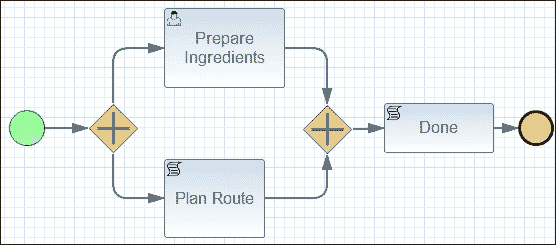

## 条件分支

这些网关引入了*条件表达式*。与每个出/入序列流链接的条件表达式在过程执行期间使用过程数据（基于数据的网关）进行评估。可选地，可以将网关的一个出路径标记为**默认流**（其条件被忽略）：只有当其他路径流都无法选择时，才会采取此路径。默认（序列）流在以下图像中以斜杠标记进行视觉标记：

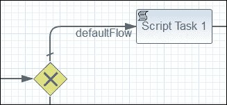

在排他和包含网关元素中支持“默认流”属性。

### Drools

我们在第一部分简要介绍了 Drools 事实和规则。基于 Drools 表达式的条件分支与事实一起工作，但不与过程变量一起工作。如果我们想在网关结构中利用 Drools 表达式功能，我们必须将过程变量作为 Drools 事实插入，例如，给定过程变量`order`：

```java
Order order = new Order();
order.setNote("urgent");
order.setCost(110);
```

从过程定义内部（通过脚本任务、**退出**脚本等），我们插入以下事实：

```java
kcontext.getKnowledgeRuntime().insert(order);
```

或者，我们可以通过以下 API 来实现：

```java
  ksession.insert(order);
  ksession.fireAllRules();
```

## 排他（XOR）网关

它用于在过程中建模一个决策。不能采取多条路径；路径是互斥的，因此得名。如果有多个序列流具有评估为真的条件，则选择在 XML 中定义的第一个路径以继续过程。在排他网关中，所有出序列流都应该定义条件。默认序列流是此规则的例外。

示例测试类：

```java
com.packt.masterjbpm6.gateway.GatewayExclusiveTest
```

示例流程：

```java
gateway_exclusive.bpmn
```

描述：对于成功的披萨配送，采取不同的路径；当其他条件不满足时，选择默认路径。

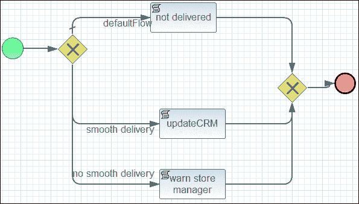

## 包含（OR）网关

一个包容网关是业务流程的分支点。与排他网关不同，包容网关可以触发多个输出流并在并行中执行它们（例如并行网关）。因此，在分支行为中，网关将始终评估所有输出序列流条件，无论它是否已经有一个满足的输出流（与排他网关不同）。在合并行为的情况下，网关将等待直到所有进入的激活序列流都到达它（合并）。当我们需要根据某些条件分叉执行并在之后重新连接它们时，我们通常可以在一对拆分/合并网关中使用此结构（参见以下示例）。

示例测试类：

```java
com.packt.masterjbpm6.gateway.GatewayInclusiveTest
```

示例流程：

```java
gateway_inclusive.bpmn
```

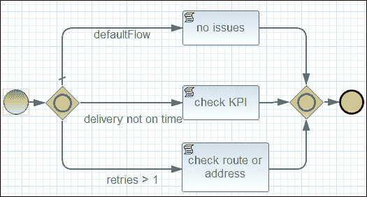

描述：为了评估订单交付状态，采取了多条不同的路径；`testIssues` 测试被设置成使流程同时采取**未按时交付**（`deliveryDate` > `dueDate`）和**重试次数 > 1**的路径。当其他条件不满足时，选择默认路径（参见`testNoIssues`测试）。

## 基于事件的网关

基于事件的网关与排他网关类似，但网关触发是基于事件发生而不是条件评估。当我们的流程到达基于事件的网关时，我们将必须等待直到发生某些事情。一个特定的事件，通常是收到消息，决定了将要采取的路径。基本上，决策是由另一个不可见于流程的数据的演员做出的。此网关始终是一个分支网关，并且必须至少有一个事件附加。

示例测试类：

```java
com.packt.masterjbpm6.gateway.GatewayEventAndTaskTest
```

示例流程：

```java
gateway_event_and_task.bpmn
```

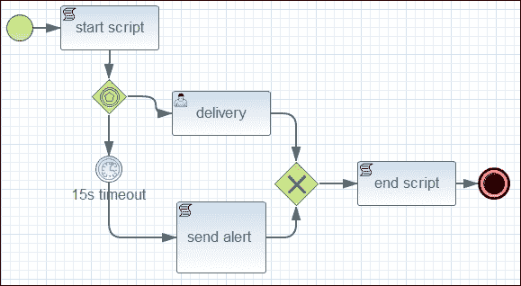

描述：事件网关附加了一个计时器；当计时器到期时，将执行**发送警报**脚本，使流程终止。

### 实例化网关

实例化网关是一种特殊的事件网关，它一收到附加的事件就触发流程实例化。"实例化"选项（截至 jBPM 6.2，此选项仅在 jBPM Eclipse 插件中可用）将网关配置为没有输入连接的分支网关：这为您提供了通过事件实例化流程的方法，例如计时器到期或捕获信号事件（参见以下章节中的计时器和信号）。jBPM 不支持没有输入连接的纯实例化网关：您始终必须将其链接到"无"启动事件（参见以下图示）或流程编译将失败（报错"缺少输入连接"）。

示例测试类：

```java
com.packt.masterjbpm6.gateway.GatewayEventTest
```

示例流程：

```java
gateway_event.bpmn
```

描述：根据从外部（API 调用）发送的事件，不同的路径会被采取（`testCustomerPhoneCallEvent`和`testDeliveredEvent`方法）；如果在 15 秒内没有捕获到事件，计时器会触发（`testTimerExpired`方法）。请注意，捕获事件都会将信号数据（一个随机生成的`orderid`字符串）传递给过程参数`orderid`，该参数随后会在脚本任务中打印出来。

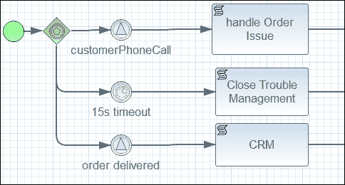

## 复杂网关

此网关可用于建模复杂的同步行为。构造选项在设计师级别可用，但 jBPM 没有对此结构进行实现。

# 事件

事件是用于在过程生命周期中建模发生的事情的元素。BPMN 2.0 定义了两个主要的事件类别：**捕获**和**抛出**事件。

+   **捕获**：此事件表示过程执行中的暂停点：一旦流程达到捕获事件节点，它将停止在等待状态，等待特定触发器发生。

+   **抛出**：此事件表示生成事件的动作。当过程执行达到事件构造时，会执行一个动作并触发一个触发器。对于此抛出事件，根据事件类型，可能存在匹配的捕获事件，也可能不存在，即发送信号（抛出）/捕获信号或发送错误（抛出）/捕获错误。另一方面，补偿抛出事件没有对应的捕获事件，而计时器事件始终是捕获事件。

事件还可以根据其他标准进行分类：

+   事件可以出现在过程的开始（开始事件）、过程中（中间事件）或过程的结束（结束事件）。

+   事件可以是通用的，或者是以下预定义类型之一：基于时间的、基于消息的、基于信号的、基于规则的、基于异常的等等。

+   事件可以位于序列流内，也可以附加在活动的边界上（边界事件）。

+   事件可以退出当前过程执行，也可以不退出。

### 注意

在我们开始之前的一个注意事项：

为了便于阅读，我们将通过按事件类型（开始、边界、结束）分组事件，然后展示每种事件类型（信号、消息、计时器等）支持的变体（捕获/抛出和开始/中间/边界/结束）。

对于更多信息以及完整的 jBPM 结构参考（按与您在 Eclipse BPMN 建模工具调色板和 KIE 控制台调色板中找到的相同方式排序），请参阅附录 B，*jBPM BPMN 结构参考*。

## 开始事件

开始事件定义了过程开始的位置（以及方式）；开始事件是仅捕获事件。当特定的开始事件触发器被触发（计时器、消息、信号等）时，过程开始。我们现在将看到无开始事件；其他开始事件类型将在各自的章节中讨论。

支持的开始事件有：无、消息、定时器、升级、条件、错误、补偿、信号

### 无开始事件

最简单的开始事件形式是无开始事件。从技术上讲，这意味着启动流程实例的触发器未指定；换句话说，引擎不知道何时启动流程实例。启动流程的唯一方法是通过对 Kie 会话引用调用`startProcess`方法。

```java
ProcessInstancestartProcess(String processId, Map<String, Object> parameters);
```

## 结束事件

结束事件旨在表达流程或子流程的结束，并且它们总是抛出事件。当流程执行到达结束事件节点时，将抛出相关的事件类型。一个流程定义可以定义一个或多个结束事件。在本节中，我们将看到“无”和“终止”结束事件；其他结束事件类型将在各自的章节中讨论。

支持的结束事件有：无、消息、升级、错误、取消、补偿、信号、终止

### （无）结束事件

无结束事件不会抛出任何事件，引擎只是结束当前流程实例的序列流执行。如果没有更多的活动序列流或没有其他要执行的操作（活动），则流程实例完成。

### 终止结束事件

终止结束事件将流程实例带到完成状态；所有挂起的任务、活动序列流和子流程都将被中止。

## 边界事件

边界事件是事件（总是捕获），它们以图形方式附加到活动（包括子流程）的边界（参见以下图）。事件注册为某种类型的触发器（参见以下支持的边界事件），并且仅在附加活动的执行范围内做出反应，根据事件类型略有不同。如果事件被触发，它可以选择取消附加到其上的活动（通过其`cancelActivity`属性），并执行事件的输出序列流。边界事件在附加活动启动时被激活；换句话说，它们绑定到活动实例的生命周期。当引擎流程执行路径离开活动时，所有附加的边界事件都将被停用，并且它们的触发将被取消。

支持的边界事件有：条件、错误、升级、消息、信号、定时器

请参阅*边界消息事件*部分以获取一个工作示例。

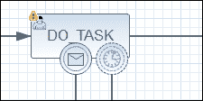

## 信号事件

信号是一种通用、简单的通信形式，例如消息（见下文）。我们可以使用信号来同步和交换信息。捕获信号可能没有对应的抛出信号构造。它也可以从外部源（API）以编程方式发送。与其它事件（错误事件）不同，如果捕获到信号，它不会被消耗。如果有两个活动中间捕获事件在同一信号事件名称上触发，这两个事件都会被触发，即使它们属于不同的流程实例和定义。如果发送了信号，但没有为该事件注册捕获信号，则该事件会丢失。

### 范围

信号可以在同一流程的不同部分或广播流程（跨所有流程实例的范围）之间具有可见性，或者针对特定的流程实例。你可以在流程实例中抛出一个信号事件，其他具有不同流程定义的流程实例可以对此事件做出反应。请记住，这种行为（更广泛的或更窄的信号范围）可能会受到创建你的 Kie 会话时选择的 *运行时策略* 的影响（该主题在 第六章，*核心架构* 中讨论）。

### 信号 ID 和信号名称提示

你可能会在创建/修改 BPMN 流程中的流程信号时注意到与信号相关的一些问题，这些流程是在 KIE jBPM 控制台编辑器和 Eclipse BPMN 模型器之间共享的。生成的 BPMN 有所不同，这可能会导致错误和意外的行为。

当从 Eclipse BPMN 编辑器创建流程定义时，信号被分配一个内部 ID，其形式为：`Signal_{number}`。因此，实际使用的信号 ID 与你在 `Signal` 属性编辑器中看到的相同信号 ID，而不是流程定义面板（信号列表表）中用户指定的信号名称。在针对 `org.kie.api.runtime.KieSession.sendSignal` 方法编码时，请记住这个额外的信号名称引用。

```java
<bpmn2:signal id="Signal_1" name="customerPhoneCall"/>
<bpmn2:signalEventDefinition id="SignalEventDefinition_1" signalRef="Signal_1"/>
```

因此，使用 Eclipse 生成的流程，必须使用 `Signal_1` ID 与 API 一起使用。

```java
<bpmn2:signal id="customerPhoneCall" name="customerPhoneCall"/>
<bpmn2:signalEventDefinition id="_05nSUW_YEeSWR_CUOywjGQ" signalRef="customerPhoneCall"/>
```

使用从 jBPM Web 控制台编辑器生成的流程，信号 ID 等于名称属性；使用 API 时必须使用 `customerPhoneCall`。

### 信号数据映射

信号可以携带可选的对象数据；对于每个触发的捕获信号，你可以获取这个信号数据并将其映射到流程变量。当使用 jBPM Web 设计师操作时，为了成功将信号数据映射到流程变量，你必须配置 **DataOutput** 信号并将其命名为 **event**，正如你在以下屏幕截图中所见。图片显示了 `start_signal.bpmn` 流程信号事件的 数据映射（见 *Start* *Signal event* 部分的详细事件数据映射示例）。

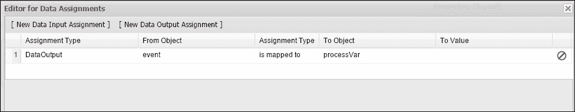

这是一个非常灵活的机制。通过在信号中传递数据，您可以轻松地更新过程变量、传递额外信息或更改过程流程。

### 开始信号事件

使用命名的开始信号，我们可以通过编程方式启动流程实例。该信号可以通过使用中间信号抛出事件或通过 API（`sendSignal`方法）在现有流程实例内部触发。在这两种情况下，所有具有相同名称的信号开始事件的流程定义都将启动。您可以在单个流程定义中拥有多个开始信号事件。

示例测试类：

```java
com.packt.masterjbpm6.event.StartTest (method testSignalStart)
```

示例流程：

```java
start_signal.bpmn
```

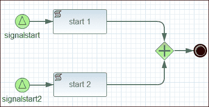

描述：发送不同的开始信号事件以创建不同的流程实例。信号数据映射到流程变量（请参见前一小节中对事件数据映射的解释）。

### 中间信号事件

中间捕获信号事件捕获从抛出中间信号或通过 API 调用（`KieSession`或`ProcessInstance.sendSignal`）发送的信号，并继续流程实例流程。捕获信号没有传入连接。

### 边界信号事件

请参阅*边界事件*部分。

### 结束信号事件

这种信号事件在流程完成时发送。它可以是一种方便的方式来跟踪整个系统中的流程实例完成情况。

## 消息事件

消息事件引用一个名称，并且可以选择性地包含有效负载。与信号不同，消息事件始终针对单个捕获消息。为了使消息流正常工作，捕获和抛出消息的名称必须完全相同。让我们指出消息和信号之间的一些区别：

+   在 BPMN 图中，消息流程通过连接发送者和接收者来绘制，而信号永远不会在图中直接连接。抛出和捕获信号仅通过它们的名称隐式连接。

+   消息应在同一流程实例中抛出/捕获；信号没有这种限制。消息仅在流程实例范围内工作，是点对点链接。一个信号可以从一个流程实例传播到多个流程实例（广播范围）。

### 消息数据映射

请参阅*信号数据映射*部分。

### 开始消息事件

开始消息事件用于在捕获消息的直接后果中启动流程实例；一个流程可以拥有多个消息开始事件。这允许我们通过简单地更改消息事件名称来选择流程创建方法（请参见以下图像）。确保消息事件名称在所有加载的流程定义中是唯一的，以避免不希望的过程创建。

### 小贴士

当从 API（`sendSignal`）发送消息时，我们必须在消息名称前加上`Message-`字符串前缀。

消息开始事件仅支持顶层流程，而不支持嵌入式子流程。

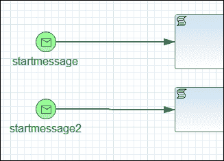

### 中间消息事件

如果流程正在等待消息，它将暂停直到消息到达，或者改变异常处理的流程。要使用抛出消息，必须有一个捕获消息事件来捕获消息。它可以是消息中间事件或消息开始事件。

### 边界消息事件

以下示例展示了通过将两个边界事件（计时器和消息）附加到人工任务来执行任务取消和消息数据传递。计时器将`cancel activity`属性设置为`FALSE`，而消息将其设置为`TRUE`。边界消息事件将事件数据映射到流程变量，以便记录由测试类发送的抛出（外部）消息传递的取消原因。

示例测试类：

```java
com.packt.masterjbpm6.event.BoundaryTest (method testBoundaryWithCancel)
```

示例流程：

```java
boundary.bpmn
```

描述：创建了一个包含人工任务的流程。计时器事件的职责是每 15 秒循环并过期，调用脚本任务“超时警告”（其计时器表达式为`15s###15s`，且未标记为“取消活动”；因此，当计时器触发时，任务不会被取消）。当用户继续进行测试（测试类要求用户按下一个键以继续）时，会发送一个消息（`sendSignal`），触发流程消息边界事件，并取消活动（因为边界消息事件启用了“取消活动”标志）。请注意，消息是由我们的测试类发送的，其中包含一些数据，作为任务取消的原因（`"cancelled by ADMIN"`）：

```java
sendSignal("Message-messageCancelService", "cancelled by ADMIN");
```

边界消息（`id=messageCancelService`）捕获发送的消息，并将绑定到流程变量**reason**的消息事件数据通过**取消日志**脚本任务打印到标准输出。

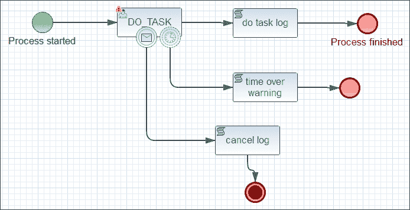

### 结束消息事件

在流程结束时向特定流程发送消息。

### jBPM 抛出消息实现

jBPM 抛出消息的默认实现只是一个占位符。您必须提供自己的 WorkItemHandler 定义，并将其以`Send Task`的名称注册到 jBPM 运行时，提供一个到工作 Kie 会话的钩子（以下代码片段中通过`ksession`标识）：

```java
SendMessageTaskHandler messagehandler = new SendMessageTaskHandler();
messagehandler.setKnowledgeRuntime(ksession);
ksession.getWorkItemManager().registerWorkItemHandler("Send Task",messagehandler);
```

### 备注

在本章中，您将找到对“workItem”和“workItem handler and manager”的多次引用。这些都是 jBPM 组件的一部分，允许您定义一个自定义 Java 类并将其与引擎运行时中特定的流程活动类型绑定。每次引擎激活此活动类型时，您的处理程序将被调用并传递控制权。请参阅第七章，*自定义和扩展 jBPM*以获取详细说明和示例。

从自定义 workItemHandler，您然后可以发送信号：

```java
public void executeWorkItem(WorkItemworkItem, WorkItemManager manager) {
ksession.signalEvent("Message-startmessage", "processdata");
```

示例测试类：

```java
com.packt.masterjbpm6.event.StartTest (method testMessageStartFromMessageThrow)
```

示例流程：

```java
start_message_catch.bpmn, start_message_throw.bpmn
```

描述：创建的流程通过自定义 WorkItemHandler 发送消息，启动`start_message_catch`流程的新实例（通过开始消息事件）。

## 计时器事件

计时器事件是在满足计时器构造表达式时触发的事件；计时器属性如下：

+   **时间持续时间**：单个触发延迟值（例如：10 m，25 s）。

+   **计时器周期**：要评估的时间表达式。它可以是字符串（基于间隔的 20 s 或 5 m###35 s，其中第一个值是初始延迟，第二个值是重复触发的延迟），字符串`cron`表达式，或流程变量。在 JBPM 6.x 的情况下，它还可以是 ISO-8601 格式的日期。

+   **计时器周期语言**：可以是默认间隔（空值和时间持续时间设置）或`cron`。

### 开始计时器事件

开始计时器事件用于在给定时间创建流程实例。它可以用于应该只启动一次的流程和应该按特定时间间隔启动的流程。请注意以下要点：

+   子流程不能有开始计时器事件。

+   一旦流程部署，就会注册一个开始计时器事件。无需调用`startProcessInstance` API。

+   当部署带有开始计时器事件的流程的新版本时，对应旧计时器的作业将被移除。

### 中间计时器事件

此事件仅是一个捕获事件。计时器值触发输出序列流的执行。您可以使用计时器来插入通用延迟或超时序列流执行；例如，您可以为管理人工任务完成截止日期添加计时器（请参阅*基于事件的网关*部分示例，其中计时器以这种方式操作）。

### 边界计时器事件

请参阅*边界消息事件*部分以获取示例。

## 错误事件

错误事件用于模拟业务异常。它们由在活动执行过程中可能生成的异常触发。中间抛出/捕获错误事件不适用。

### 边界错误事件

此边界错误事件必须附加到活动上。当错误事件触发时，活动总是被取消，并采取错误事件的输出序列流。

示例测试类：

```java
com.packt.masterjbpm6.event.ErrorTest (method testBoundaryErrors)
```

示例流程：

```java
errorboundary.bpmn
```

描述：两个不同的边界错误事件附加到不同`errorCode`属性（`FileNotFoundException`或`RuntimeException`）上注册的同用户任务；错误处理器记录异常消息。根据传递给过程参数（`triggerexceptionflag`）的值，用户任务在完成时抛出不同的异常（`onExit`脚本），这触发了适当的边界错误事件。

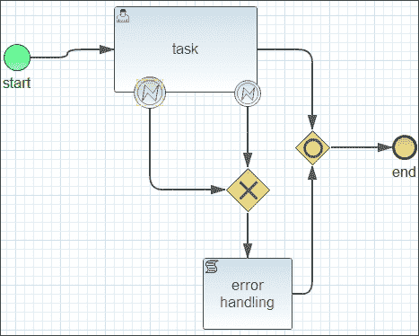

流程以一个变量启动，其值影响要抛出的异常类型：

```java
Map<String, Object> params = new HashMap<String, Object>();
// "1" for a runtime exception; "2" for a FileNotFoundException
String trigger = "1";
params.put("triggerexceptionflag", trigger);
ProcessInstance processInstance = ksession.startProcess("errorboundary", params);
```

用户任务的`onExit`脚本评估流程变量并相应地抛出异常：

```java
String trigger=(String)context.getVariable ("triggerexceptionflag");
if (trigger.equals ("1"))
{
throw new RuntimeException("a runtime exception");
}
else
{
throw new FileNotFoundException("a filenotfoundexception exception");
}
```

引擎根据抛出的异常触发适当的边界错误事件；实际上，事件必须配置为将`errorCode`属性设置为异常类名：`java.lang.RuntimeException`（参见以下截图）。

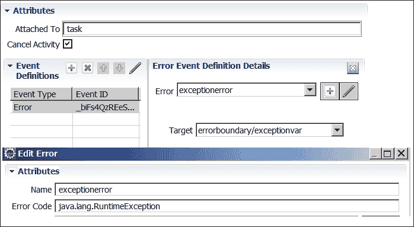

注意，边界错误可以将异常绑定到流程变量。在示例中，该变量（`exceptionvar`）通过脚本任务记录到控制台：

```java
Throwable exc=(Throwable )context.getVariable ("exceptionvar");
System.out.println("log error message:"+exc.getMessage());
```

### 错误开始事件

错误开始事件只能用于触发事件子流程，不能用于启动流程实例。这是您可以考虑在错误异常激活替代子流程时使用的一个功能。

### 错误结束事件

当流程执行达到错误结束事件时，当前执行路径结束并抛出一个错误事件。此错误由匹配的中间边界错误事件或子流程开始错误事件捕获。如果没有找到错误事件，则抛出异常。

以下示例使用错误结束事件通过其错误开始事件触发一个子流程。

示例测试类：

```java
com.packt.masterjbpm6.event.ErrorEndTest (method testSubprocessStartError)
```

示例流程：

```java
errorsubprocess.bpmn
```

描述：主要流程特征包括一个人类任务和一个错误结束事件，该事件通过错误开始事件触发一个嵌入的子流程脚本任务。

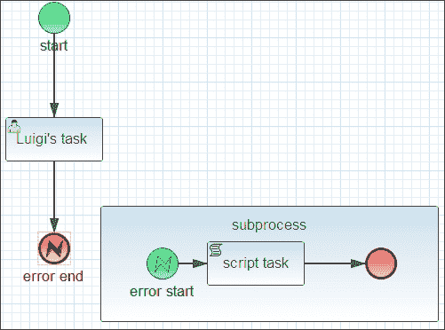

## 补偿

复杂的业务流程可能涉及多个异构的参与者和系统，例如现代事务系统、遗留系统（非事务性）和 Web 服务。为了保持业务一致性，当出现故障且没有事务性协议可用时，这些系统可能需要您通过调用某些专用 API 或其他方式执行程序性纠正操作。补偿是后处理操作，试图补救（而不是正确撤销或回滚）由操作产生的效果。

我们想强调的是，jBPM 的补偿不是事务性功能或`try`/`catch`错误机制。补偿是 BPM 业务功能，它将活动建模为已完成的活动的补偿对应物。

这里是常见的步骤，这些步骤发生在补偿事件期间（参见以下流程示例图以获取序列的视觉参考）。

+   一个活动（A1），其边界连接到补偿事件（E1）已完成

+   在流程中某处抛出一个补偿事件（E2）

+   补偿事件（E1）捕获 E2

+   jBPM 激活与 E1 相连的补偿处理程序（A2）。

引擎不知道补偿活动将做什么，因为补偿业务逻辑的定义取决于开发者。

### 中间补偿事件

抛出补偿事件（E2）和边界补偿事件（E1）通过相同的事件名称隐式连接（我们已经在信号和消息中看到过这一点）。我们之前对边界事件的解释仍然适用：当补偿事件（E2）被触发时，边界补偿事件（E1）会通过调用标记有典型补偿**FastBackward**样式的关联补偿活动（A2）来做出反应。

### 边界补偿事件

补偿边界事件（E1）必须仅通过直接关联线引用一个补偿处理程序（A2）。补偿边界事件仅在活动（A1）完成时被激活（与默认边界事件行为不同，事件激活取决于活动启动状态）。补偿捕获事件（E1）在父流程实例完成或补偿事件本身被触发后将被移除。如果补偿边界事件附加到多实例子流程，将为每个实例创建一个补偿事件监听器。jBPM 似乎不支持此最后功能。

### 补偿活动

此活动（也称为补偿处理程序）直接连接到触发边界补偿事件，并且不能有出序列流。

示例测试类：

```java
com.packt.masterjbpm6.event.CompensationTest (method testCompensationEvent)
```

示例流程：

```java
compensateorder.bpmn
```

描述：我们使用这个示例过程来解释典型的补偿“工作流程”，因此你应该已经熟悉它。让我们再补充一点，当人工任务（**H1**）完成并且`cancelOrder`变量评估为“y”时，会抛出补偿事件。这激活了排他网关序列流，从而触发事件（**E2**）。这激活了边界补偿事件（**E1**），进而调用**取消订单**脚本任务（A2）。**取消订单**任务充当“补偿”活动。

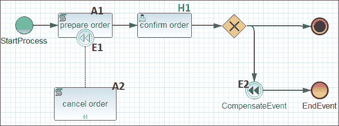

### 使用信号触发补偿

jBPM 通过使用信号（通用（隐式）和特定补偿处理）提供额外的触发流程实例内补偿的方法。**隐式**补偿触发流程实例的所有补偿处理程序：

```java
ksession.signalEvent("Compensation",
  CompensationScope.IMPLICIT_COMPENSATION_PREFIX
    + "compensateorder", pi.getId());
```

你必须使用补偿信号类型，并将信号数据传递为一个字符串，该字符串是通过连接`CompensationScope`类常量和流程定义 ID 生成的：

```java
"implicit:compensateorder"
```

**特定**补偿在流程实例内触发特定的补偿处理程序。你必须传递附加到边界补偿事件的活动节点 ID，以及流程实例 ID：

```java
ksession.signalEvent("Compensation", "_2", pi.getId());
```

我们的示例流程脚本任务 XML 元素如下：

```java
<bpmn2:scriptTask id="_2" name="prepare order" scriptFormat="http://www.java.com/java">
```

### 小贴士

在流程定义级别不需要定义新的信号事件。

对于工作示例，请参考以下内容：

示例测试类：

```java
com.packt.masterjbpm6.event.CompensationTest (methods testGlobalCompensationWithSignal and testSpecificCompensationWithSignal respectively).
```

## 结束补偿事件

结束补偿事件的工作方式与中间事件相同（请参阅示例流程图）。抛出补偿结束事件（**E1**），并触发补偿处理程序（**A1**）。此类事件在需要执行流程结束时的维护或补救业务逻辑时很有用，但仅当您的有界活动（**S1**）处于完成状态时。请注意，实际上，正如我们之前强调的，补偿处理程序仅在子进程（**S1**）已经处于完成状态时启动。

示例测试类：

```java
com.packt.masterjbpm6.event.CompensationTest (method testSubprocessCompensationEndEvent)
```

示例流程：

```java
compensateendsubprocess.bpmn
```

描述：该流程有一个带有附加边界补偿事件（**E2**）的**子进程**（**S1**）。子进程触发抛出补偿结束事件（**E1**）。补偿边界捕获事件（**E2**）调用补偿处理程序（**A1**），该处理程序将流程变量回滚到初始值。

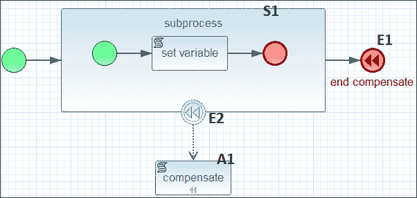

### 多实例补偿

附加到多实例子进程的补偿捕获事件尚未实现。有关多实例活动的详细信息，请参阅*子进程*部分。

## 升级

升级，根据机构、组织或公司的普遍政策，指的是工作人员与其职责之间现有的关系。升级事件的产生表明存在需要将业务流程流转转向不同用户组的条件。例如，如果收到超过一定价格阈值的订单，则必须由高级别用户（例如，经理）执行审批任务；否则，也可以由职员用户审批。

在 jBPM 6.2.0 的情况下，升级事件似乎部分实现，目前尚不清楚在此阶段支持 BPMN 规范的哪一部分。您可以通过截止日期和通知（请参阅*用户任务*部分）部分克服升级事件的缺乏。

## 条件事件

条件事件是 jBPM 的功能扩展。它们由对用户提供的 Drools 规则和事实属性的评估触发。支持条件开始和边界事件。

示例测试类：

```java
com.packt.masterjbpm6.event.ConditionalTest (method testSubprocessStartError)
```

示例流程：

```java
conditional.bpmn
```

描述：当事实订单笔记属性匹配“紧急”时，主过程开始；如果订单成本 > 100，则取消以下脚本任务**ordercost**。

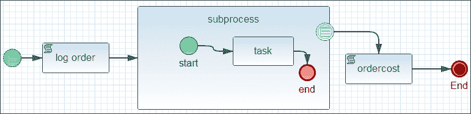

# 活动

活动是在业务过程中执行的工作单元；它可以是最小单元或非最小单元（复合活动、调用活动或子进程）。活动可以是任务、调用活动或子进程类型。

## 任务

任务是可以包含在流程中的最小原子活动单元。通常，任务的执行者可以是使用基于 UI 的应用程序、参与的外部服务或一组通用业务语句的最终用户（称为人类）。任务有其局部作用域，可以从其容器接受输入参数并返回输出参数。

### 用户任务

用户任务用于模拟需要由人类行动者完成的工作。当流程执行到达用户任务节点时，将在为该任务定义的行动者（或组）的工作列表中创建一个新的任务实例（行动者和组属性）。人类任务可以根据对任务本身采取的操作和定义的人类角色过渡到几个不同的状态，并涉及人类利益相关者。

#### 人类角色

人类角色定义了个人或一组行动者可以对任务执行的操作。让我们回顾为人类任务活动定义的角色：

+   **任务发起者**：创建任务实例的人。根据任务是如何创建的，任务发起者可能没有定义。

+   **实际所有者**：拥有并执行任务的人。任务始终有一个实际所有者。

+   **潜在所有者**：被分配任务以便他们可以声称并完成的人。潜在所有者可以通过声称任务而成为实际所有者。

+   **排除所有者**：行动者可能无法过渡为实际或潜在所有者，他们可能无法保留或开始任务。

+   **业务管理员**：由于他们是每个任务的潜在所有者，业务管理员可以执行与任务用户相同的操作。jBPM 提供了一个默认的业务管理员用户（管理员）和组（管理员）。

#### 状态转换

任务保持在**已创建**状态，直到它被激活。当任务只有一个潜在所有者时，它将过渡到**已保留**状态（分配给单个实际行动者）；否则，它将过渡到**就绪**状态；此状态表示任务可以被其潜在所有者之一所声称。一旦被声称，任务将过渡到**已保留**状态，将潜在所有者提升为实际所有者行动者。此时，该行动者可以开始处于**就绪**或**已保留**状态的任何任务，并使其过渡到**进行中**状态。**进行中**状态表示任务正在被处理。如果行动者完成了工作，任务将过渡到**完成**状态。如果工作的完成出现错误（异常），任务将被置于**失败**状态。或者，用户可以释放任务，将其返回到**就绪**状态。不允许从**完成**状态和**失败**状态进行转换。

### 注意

关于任务状态转换的详细信息，请参阅 Oasis 在[`docs.oasis-open.org`](http://docs.oasis-open.org)发布的 Web 服务 – 人类任务（WS-HumanTask）规范。

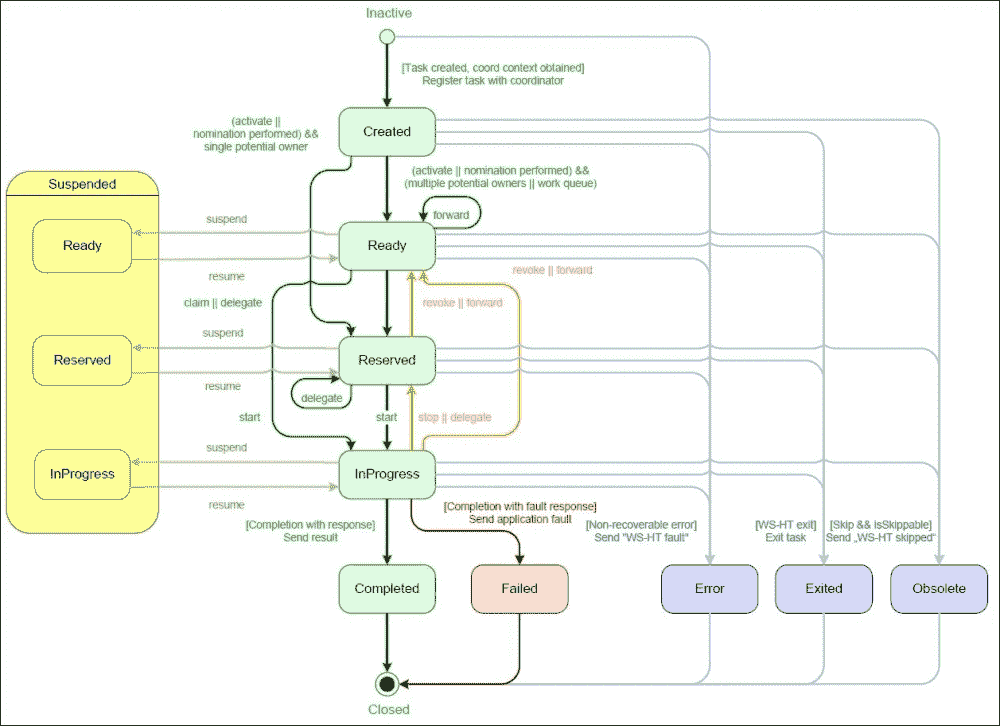

状态转换

#### 截止日期和升级

jBPM 中任务截止日期的概念与任务开始-完成时间间隔持续时间相关联；截止日期与任务升级相关联：任务升级可能存在于任务重分配或任务通知操作中。任务截止日期是在任务到期日期上计算的：当任务开始时重置，当任务在允许的时间边界内完成时到期。截止日期在`DEADLINE`表中物理存储，而通知存储在`NOTIFICATION`表集中。

### 注意

重分配和通知属性编辑器仅在 KIE Web 流程编辑器中可用。

#### 任务重分配

任务重分配是 jBPM 机制，允许您通过设置特定规则来更改任务所有权，这些规则基于任务状态转换和截止时间表达式，例如：“如果 Luigi（一个命名的任务 actor）在 60 秒内没有开始任务，则将任务实例重新分配给 Mario。”指定的用户被新用户替换为任务的可能所有者。结果的重分配规则语法如下：

```java
[users:mario|groups:]@[60s]@not-started
```

您可以在单个任务实例上定义多个重分配规则。

任务事件类型条件可以是`not-started`和`not-completed`。

BPMN XML 任务参数是`NotStartedReassign`和`NotCompletedReassign`。重分配信息由引擎持久化到`REASSIGNMENT`和`REASSIGNMENT_POTENTIALOWNERS`表中。

示例测试类：

```java
com.packt.masterjbpm6.activity.TaskTest (testReassign method)
```

示例流程：

```java
reassign.bpmn
```

描述：主流程启动，任务分配给 Luigi。重分配规则指出“如果 Luigi（命名任务 actor）在 60 秒内没有开始他的任务，则任务应分配给 Mario。”

#### 通知

通知是在任务截止日期到期时提醒某人（actor，group）的操作。默认的 jBPM 通知是基于电子邮件的，默认电子邮件配置是从`userinfo.properties`和`email.properties`文件中读取的。`userinfo.properties`文件以下列形式列出用户/组信息：

```java
entityId=email:locale:displayname:[member,member]
```

例如，对于一个类型为 actor 的实体，我们有：

```java
nino=nino@domain.com:en-UK:nino
```

成员数据是可选的，用于列出属于一个组织实体的组成员。

### 注意

请参阅官方 jBPM 6.2 文档以获取配置细节。

BPMN XML 任务参数是`NotStartedNotify`和`NotCompletedNotify`。

以下是一个`NotStartedNotify`参数值的示例：

```java
from:mario|tousers:simo|togroups:|replyTo:|subject:warning|body:the task has not been started in 10s !@10s@not-started
```

#### 委派

委托是设置任务潜在所有者的过程。实际所有者、潜在所有者或业务管理员可以将任务委派给另一个用户，将该用户添加到潜在所有者列表中（如果尚未添加）并使其成为任务所有者。任务可以在处于活跃状态（就绪、保留或进行中）时被委派，并过渡到保留状态，其`skippable`属性可以标记为`true`（目标演员/所有者可以跳过任务）。委派后，任务的状态和参数将不会改变。

#### 转发

任务转发是潜在所有者对一个活跃任务执行的过程，他将自己替换在潜在所有者列表中，将任务传递给另一个人。潜在所有者只能在就绪状态下转发任务。如果任务处于保留或进行中状态，任务将再次过渡到就绪状态。

#### 暂停/恢复

任务可以在其任何活跃状态（就绪、保留或进行中）中被暂停，过渡到暂停状态。暂停状态有子状态来指示任务的原始状态。当恢复时，任务将返回到暂停前的原始状态。

#### 跳过

在处理人类任务或业务管理员的工作中，利益相关者可能决定一个任务不再需要，因此跳过此任务。这使得任务过渡到废弃状态。只有当在任务配置期间指定了此功能时，才能跳过任务（`skippable`属性）。

对于委托、转发和跳过以及暂停/恢复的示例，请查看测试类：

```java
com.packt.masterjbpm6.task.TaskTest (methods testDelegateReadyStateAndSkip, testForwardAndSkip, testSuspendAndResume)
```

示例流程：

```java
delegate_forward.bpmn
```

描述：主流程启动，并将一个人类任务保留给 Luigi。测试方法检查任务委托、转发和暂停/恢复。

#### 发布

一个任务可以被当前所有者发布为一个人类任务，使其可供其他潜在所有者使用。从具有实际所有者（保留或进行中）的活跃状态，任务可以被释放并过渡到就绪状态。与任务关联的任务数据保持不变。

如果一个任务当前处于进行中状态，实际所有者可以停止它，将其过渡到保留状态。与任务关联的业务数据以及其实际所有者保持不变。

### 脚本任务

脚本任务是一个自动活动。当流程执行到达脚本任务时，将执行相应的脚本。可以通过执行上下文（`kcontext`变量）访问的所有流程变量都可以在脚本中引用。它具有以下属性：

+   它由业务流程引擎执行

+   脚本定义在引擎支持的语言中（Java 或 MVEL）

+   脚本任务执行总是立即的

+   脚本任务在脚本执行后过渡到完成状态

### 注意

对于完整的 MVEL 参考，请访问[`mvel.codehaus.org/`](http://mvel.codehaus.org/)。

示例测试类：

```java
com.packt.masterjbpm6.activity.ScriptTaskTest
```

示例流程：

```java
script.bpmn
```

描述：流程脚本活动更新流程变量`order`的描述属性：

```java
Order order=(Order)kcontext.getVariable ("order");
order.setNote ("order modified");
```

### 服务任务

服务任务指示服务提供者要自动执行的工作。通常，所有需要在引擎外部执行的工作都应该设计为服务任务。jBPM 支持两种类型的服务任务实现：普通 Java 类和 Web 服务。服务任务由名为**服务任务**的 WorkItemHandler 实现支持。

参数如下：

+   `接口`: Java 类名称或 WSDL WebService 服务接口

+   `操作`: Java 方法名称或 WSDL WebService 操作

+   `参数`: 调用方法名称

+   `ParameterType`: 调用方法的参数类型（仅支持 1 个参数）

+   `模式`（仅限 WS）: `SYNC`（默认），`ASYNC`或`ONEWAY`

对于 Java 类型的服务任务，jBPM 使用 Java 反射通过使用`接口`参数加载 Java 类类型，实例化它，并使用`参数`提供的值调用指定的方法（通过`操作`和`ParameterType`搜索）。仅支持具有单个参数的方法签名，并且调用方法的结果映射到活动`结果`输出参数。

`模式`参数仅适用于 Web 服务，并描述了请求必须执行的方式：

+   **同步（SYNC）**: 发送请求并在继续之前等待响应

+   **异步（ASYNC）**: 发送请求并使用回调获取响应

+   **单向（Oneway）**: 发送请求而不阻塞（忽略响应）

Web 服务运行时利用 Apache CXF 框架的“动态客户端”功能在运行时生成 Java 类。

### 注意

请访问[`cxf.apache.org/docs/dynamic-clients.html`](http://cxf.apache.org/docs/dynamic-clients.html)获取官方参考文档。

服务任务对于快速原型设计非常有用，但当涉及到复杂的外部服务集成时，它在满足常见开发需求方面存在不足：多个参数传递、额外的 Web 服务配置等。

以下示例演示了如何通过添加自定义工作项处理器来覆盖标准的 jBPM 服务任务组件。请注意，然而，由于任务接口是在 jBPM 工作项处理器的配置文件中定义的，因此无法从流程设计器中更改自定义服务任务处理器的输入/输出参数。

### 注意

工作项处理器在第七章*自定义和扩展 jBPM*中进行了详细解释。

示例测试类：

```java
com.packt.masterjbpm6.test.ServiceTaskTest
```

示例流程：

```java
servicetask.bpmn
```

描述：第一个测试（`testJavaServiceTask`）使用标准 Java 服务任务（接口：`ServiceJavaTask`，操作：`processOrder`，参数：`order`，参数类型：`Order`）启动过程。服务任务更改订单的 note 字段并将其返回到主过程，其脚本活动将更改跟踪到控制台。第二个测试（`testJavaCustomServiceTask`）具有自定义服务任务处理程序（`PacktServiceTaskHandler`），它覆盖默认处理程序并处理订单参数，使用特定值设置其`note`属性。

### 规则任务

（业务）规则任务使我们能够执行规则并从嵌入的规则引擎（Drools）获取输出。请记住，可以通过使用全局变量或 Drools 会话事实来共享过程变量与规则任务。

示例类：

```java
com.packt.masterjbpm6.task.RuleTaskTest
```

示例知识工件：

```java
rule.bpmn, rule.drl
```

描述：主过程启动，当订单成本大于 100 时触发规则任务，结果将订单的`note`属性更改为`URGENT`。查看`rule.drl`文件：

```java
global StringBuffer newnote;
global com.packt.masterjbpm6.pizza.model.Order orderglobal;

rule "checkorder" ruleflow-group "masterRuleGroup"
    when
        $o: com.packt.masterjbpm6.pizza.model.Order (cost>100)
    then
    {
      System.out.println ("checkorder triggered");
      String desc="big order ! (cost="+$o.getCost()+")";
      orderglobal.setNote("URGENT");
      newnote.append (desc);
    }
End
```

将`order`变量（`cost > 100`）插入到知识会话中，以激活当`Order (cost > 100)`触发时的规则；请参阅`RuleTaskTest.testRule()`方法：

```java
ksession.insert(order);
```

当使用共享的`orderglobal`变量获取结果时：

```java
ksession.setGlobal("orderglobal", order);
```

### 发送/接收任务

发送/接收任务是一般用途的消息任务，因为它们不提供默认实现。它们作为工作项处理，实现者必须通过`WorkItemHandler`接口提供工作实现，并将其注册到 jBPM 的`WorkItemManager`。

接收任务的`workItem`名称必须是**接收任务**。**接收任务**通过`messageRef`属性引用消息 ID；处理程序通过`MessageId`参数接收消息 ID 值。

发送任务的`workItem`名称必须是**发送任务**。**发送任务**通过`messageRef`属性引用消息 ID；为了额外的参考，请检查中间消息事件。

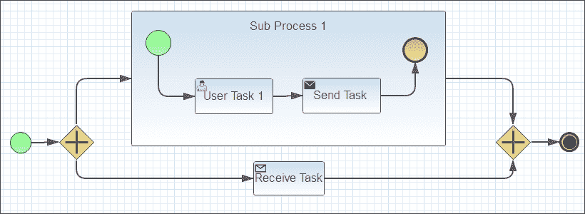

示例类

```java
com.packt.masterjbpm6.task.TaskTest (method testSendReceive)
```

示例过程工件：

```java
send_receive.bpmn
```

描述：子过程发送任务将数据传递给父过程的接收任务。测试注册了两个自定义工作项处理程序，发送任务和接收任务通过全局过程变量共享消息。

### 手动任务

手动任务定义了一个需要在引擎外部执行的任务。它用于模拟由利益相关者执行且不与系统交互的工作；引擎对任务一无所知，也不需要知道。没有用户界面或系统可用于手动任务完成。对于引擎来说，手动任务被管理为一个透传活动。它从过程执行到达的那一刻开始继续。

### 临时（自定义或无）任务

自定义任务是一个空的、通用的、非专业的工作单元。实施者被要求为任务提供 WorkItemHandler 实现，并将其注册到 WorkItemManager

```java
Void registerWorkItemHandler(String workItemName, WorkItemHandler handler);
```

### 注意

请参阅第七章，*自定义和扩展 jBPM*，以获取关于 WorkItemHandler 架构的详细章节。

处理程序已注册给所有具有给定工作项名称的工作项，并且每当流程激活具有该名称的节点时都会被调用。此外，工作项名称必须与任务元素的`taskname`属性匹配。WorkItemHandler 负责完成或终止任务实例。

请参阅*条件*事件部分以获取一个工作示例。

#### 异步任务

现在，我们将更详细地研究自定义任务的一些特殊用法。在第四章，*作业管理*中，我们介绍了新的 jBPM 执行器服务和 KIE 控制台的作业调度功能。自定义任务可以方便地配置，以指导执行器通过在后台安排执行作业以异步方式调用面向服务的组件。负责作业提交的 jBPM 处理程序是`org.jbpm.executor.impl.wih.AsyncWorkItemHandler`（更多内容请参阅第七章，*自定义和扩展 jBPM*）。

### 提示

jBPM 流程设计器允许你在工作项处理节点上切换`wait-for-completion`标志。此标志并不反映处理调用同步/异步的本质。但它确实告诉引擎通过事件监听器评估处理结果，并使用任务输出映射将它们映射回流程上下文变量。如果该标志设置为 false，则自定义任务结果将被忽略。

我们可以通过以下方式配置一个异步任务：

+   指定`async`作为任务`taskName`属性

+   添加一个名为`CommandClass`的数据输入参数，并将完全限定的 Java 类名分配给调度

+   （可选）添加一个名为`Retries`的数据输入参数，它告诉执行器执行应该重试多少次（默认=3）

### 注意

第四章，*管理作业和异步命令执行*详细说明了如何编写`Command`类。

我们讨论的示例将我们的`AsyncTaskCommand`设置为`CommandClass`，启动执行器服务，并注册 AyncWorkItemHandler。

示例类：

```java
com.packt.masterjbpm6.task.AsyncTaskTest
```

示例流程工件：

```java
asynctaskprocess.bpmn
```

## 调用活动任务

调用活动任务是一种通用方法，通过指定它们的 ID（`bpmn2:callActivity`的`calledElement`属性）或`Name`（`calledElementByName`）来重用现有的、外部定义的业务结构（流程）。执行被调用元素的同步/异步（`waitForCompletion=true`）或独立（`independent=true`）。只有当`waitForCompletion`为`true`时，才能将`independent`设置为`false`。

所有这些属性都很容易设置，就像往常一样，通过 jBPM Eclipse 插件或 KIE 流程编辑器；为了参考目的，我们从流程定义中提取了`callActivity`构造的相关 XML：

```java
<bpmn2:callActivity drools:waitForCompletion="true" drools:independent="true" name="CallActivity" calledElement="callactivitySubprocess">
```

下图显示了左侧的主流程和从调用活动节点“缩放”出来的`callactivitySub1`流程：

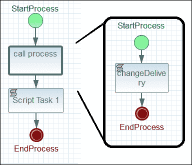

被调用构造支持，就像其他活动节点（任务）一样，从调用进程到被调用进程的数据输入和输出映射，正如我们将在以下示例中看到的那样。

示例类：

```java
com.packt.masterjbpm6.task.CallactivityTaskTest (testIndependentSubprocess method)
```

示例流程工件：

```java
callactivity.bpmn (parent process), callactivitySub1.bpmn (subprocess called by the callActivity construct)
```

描述：启动主流程并执行`callActivity`；主流程将流程顺序变量传递给`callActivity`。`callActivity`子流程修改顺序变量并将其返回给调用流程定义。

作为旁注，如果我们检查`PROCESSINSTANCELOG`表，我们可以看到两个流程实例（主流程和被调用流程）的记录；它们的父子关系通过`PARENTPROCESSINSTACEID`列保存；它显示**callactivitySubprocess**是**callactivityprocess**的子流程。这是当`callActivity`具有`independent=true`和`waitforcompletion=true`属性时的输出。

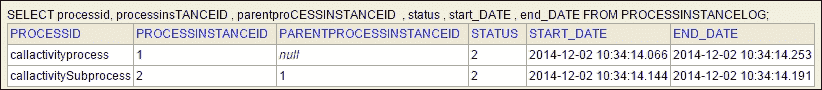

让我们看看另一个示例，看看独立属性是如何影响被调用子进程的。

示例类：

```java
com.packt.masterjbpm6.task.CallactivityTaskTest (method testAbortProcess)
```

示例流程工件：

```java
callactivityabort.bpmn (parent process), callactivitysubprocessabort.bpmn (subprocess called by the call activity construct)
```

描述：启动`callactivityabort`流程，并执行`callActivity`（`independent=false`）。被`callActivity`引用的子进程（`callactivitysubprocessabort`）包含一个人类任务，因此它停止以进行用户交互。这给我们提供了在父流程实例上发出（参见测试类代码）`abortProcessInstance`的时间。将`independent`标志设置为`FALSE`强制`callActivity`（即等待的子进程）在主流程实例的上下文中终止；当标志设置为`TRUE`时，`callActivity`不受影响（参见上一个示例）。

这是当终止具有`independent=false`属性的父流程实例时的输出。注意，两个流程实例的状态都是`3`（已终止）。

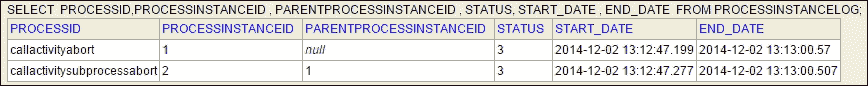

## 子进程

如其名所示，子过程是包含在其他流程中的流程。它可以包含活动、事件、网关等，形成一个**框装**的流程，它是封装流程的一部分。子过程可以完全定义在父流程内（嵌入的子过程）或可以通过 ID 或名称属性通过调用活动元素链接。您可以通过调用活动在不同多个流程定义之间链接子过程，重用常见的流程元素组（活动、网关等）。嵌入的子过程结构可以具有多实例功能（参见多实例部分）。然而，使用子过程确实会施加以下约束：

+   顺序流不能跨越子过程边界

+   流程变量必须映射为输入和/或输出

在设计器级别，子过程可以被展开或折叠，以便隐藏或显示其细节。

### 临时子过程

当多个任务可以按任意顺序选择和执行（因为未指定或未知），并且它们之间没有执行依赖关系时，通常使用临时子过程。任务可能有未知的依赖关系，最常见的是因为它们是动态的，并且由人类用户根据具体情况管理。即使某些任务根本未执行，子过程也可以完成。临时子过程表示为带有波浪线（˜）标记的子过程。

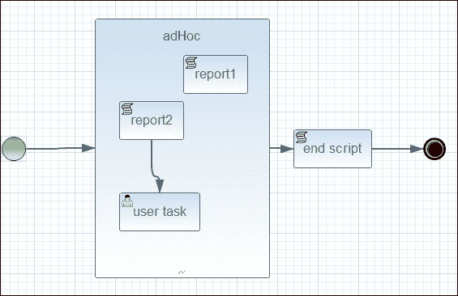

jBPM 的临时子过程实现似乎相当不完整。在退出子过程实例时似乎存在一些问题。用户可以通过使用`signal`方法并引用活动名称来启动临时子过程活动：

```java
ksession.signalEvent("report1", null, processInstance.getId());
```

由于它们的性质，临时子过程难以设计，在现实的结构化业务流程中作用不大；然而，在这里，我们为您提供了一个您可以调整和实验的示例：

示例类：

```java
com.packt.masterjbpm6.task.AdHocSubprocessTest
```

示例流程工件：

```java
adhocsubprocess.bpmn
```

描述：该临时子过程有 2 个脚本活动和 1 个人工任务。脚本任务被信号触发，人工任务被完成。

## 多个实例

此结构可用于创建可重用子过程定义的多个实例以及嵌入的子过程。传递输入参数集合作为实例化循环。jBPM 将为集合中的每个元素创建一个循环流程的实例。以下图显示了包含嵌入的多实例子过程（**Log pizzas**，平行符号表示它是一个多实例过程）和子过程属性。循环输入是流程变量`list`，循环实例参数（集合项）是`item`类型的`Pizza`。`item`变量在实例化子过程的范围内可见。

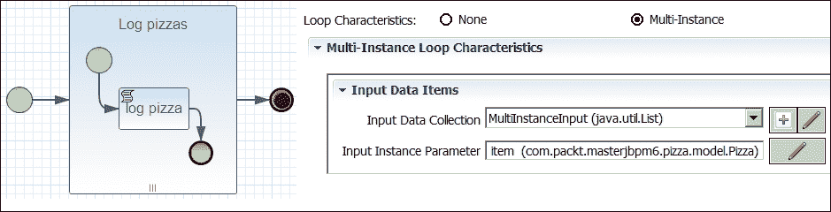

示例类：

```java
com.packt.masterjbpm6.task.MultiInstanceTest
```

示例流程工件：

```java
multiinstance.bpmn
```

描述：该流程通过传递一个披萨变量`list`创建：

```java
List<Pizza> myList = new ArrayList<Pizza>();
myList.add(new Pizza(PizzaType.getType(Types.MARGHERITA), "margherita"));
myList.add(new Pizza(PizzaType.getType(Types.NAPOLI), "assorreta!"));
params.put("list", myList);
ProcessInstance processInstance = ksession.startProcess("multiinstance", params);
```

随后，创建了两个子进程实例，每个实例都传递了循环的`item`变量（一个`Pizza`实例）。子进程脚本活动仅打印披萨描述，然后子进程退出。

```java
System.out.println("pizza desc " + item.getDesc());
```

## 车道

车道是一个用于在流程定义中分组活动的分区框状元素。车道可以用来直观地指出不同的分组任务分配。例如，你可以将车道想象为一个公司部门（IT、商业管理等等）中所有员工都有（或多或少）相同的职责。jBPM 会尝试将同一车道内的所有任务分配给同一用户（为用户保留任务）。例如，如果一个车道上有几个任务，那么完成第一个任务的用户将被分配到车道上的其他任务。通常，将相同的组 ID 分配给同一车道上的所有任务是很方便的。

示例类：

```java
com.packt.masterjbpm6.task.LaneTest
```

示例流程工件：

```java
lane.bpmn
```

描述：**task1**和**task2**（在**车道**）活动分配给`pizzerianapoli`组，而**Mario's Task**分配给演员 Mario。**taskNotInLane**也分配给`pizzerianapoli`，但它不在**车道**上。

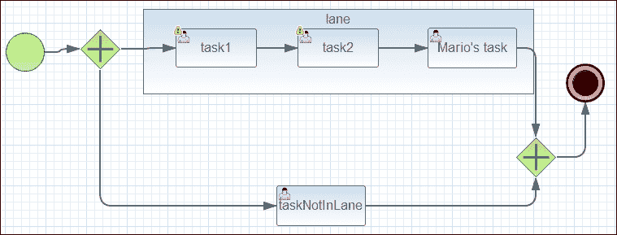

在流程启动后，演员 Luigi（属于`pizzerianapoli`组；参见`LaneUserCallBack`类）在列表上有 2 个任务（**task1**和**taskNotInLane**）。在他完成 task1 后，他自动获得 task2 活动（状态=**已保留**），而**taskNotInLane**的状态保持不变（**就绪**）。

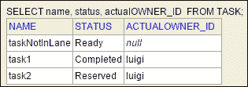

## 数据对象

数据对象是 BPMN 结构，表示活动需要或产生数据的方式。数据对象可以与一个或多个活动直接关联，为该活动提供输入或目标输出。

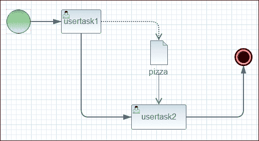

示例类：

```java
com.packt.masterjbpm6.task.DataObjectTest
```

示例流程工件：

```java
data-object.bpmn
```

描述：task1 和 task2 活动共享相同的数据对象（披萨类类型）；第一个任务生成披萨，然后作为第二个任务的输入。

# 摘要

在本章中，我们检查了 jBPM BPMN 结构，提供了动手操作的示例、技巧，并在可能的情况下，提供了一些关于 jBPM 内部机制的细节。本章的目的不是成为 BPMN 教程或 BPMN 最佳实践建模指南，我们建议选择更合适的书籍和大量的实际操作。在下一章中，我们将通过几个实际示例介绍 jBPM 子系统 API：新的 Kie API、运行时引擎、人类任务服务和持久化引擎。
