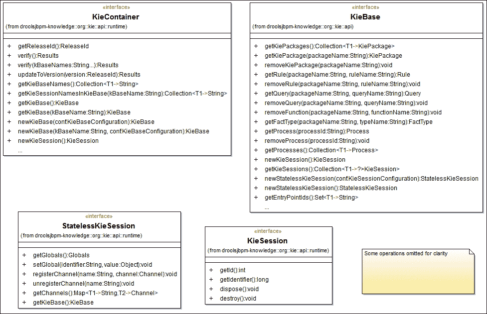
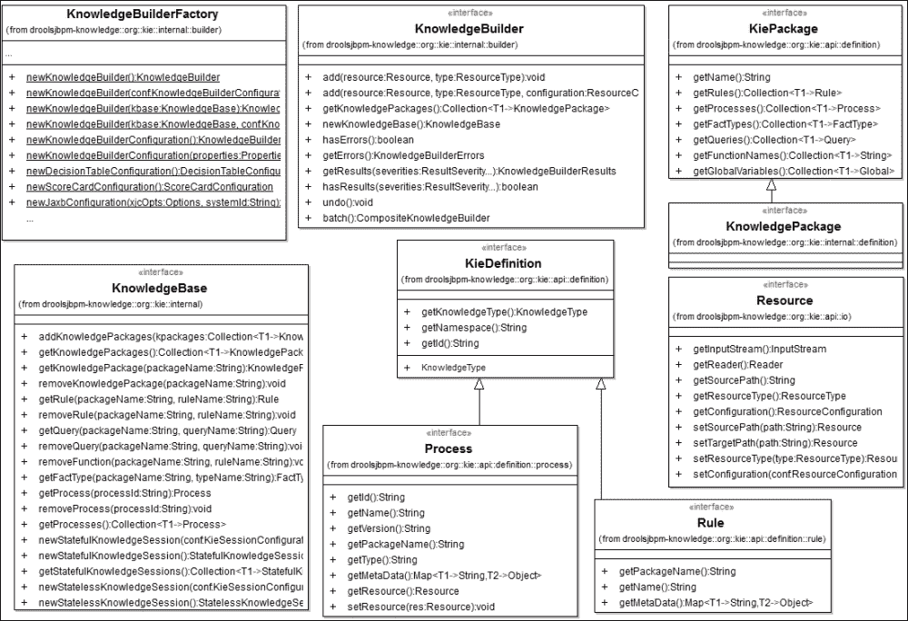
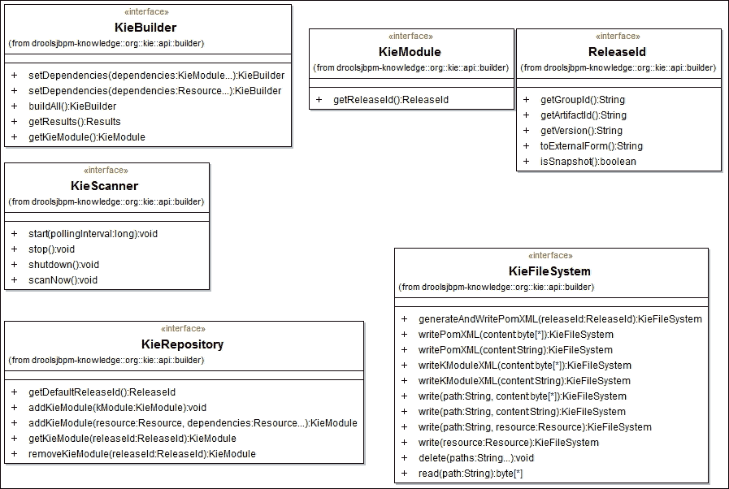
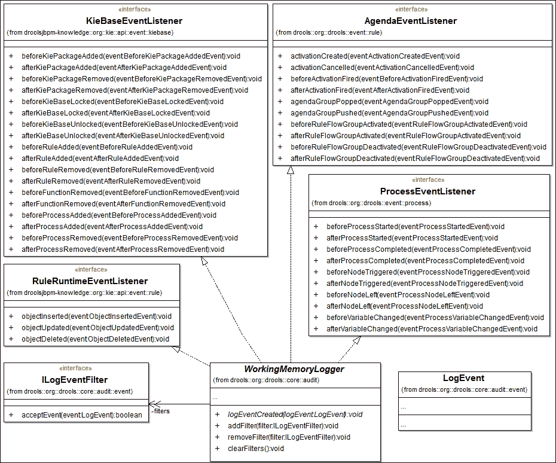
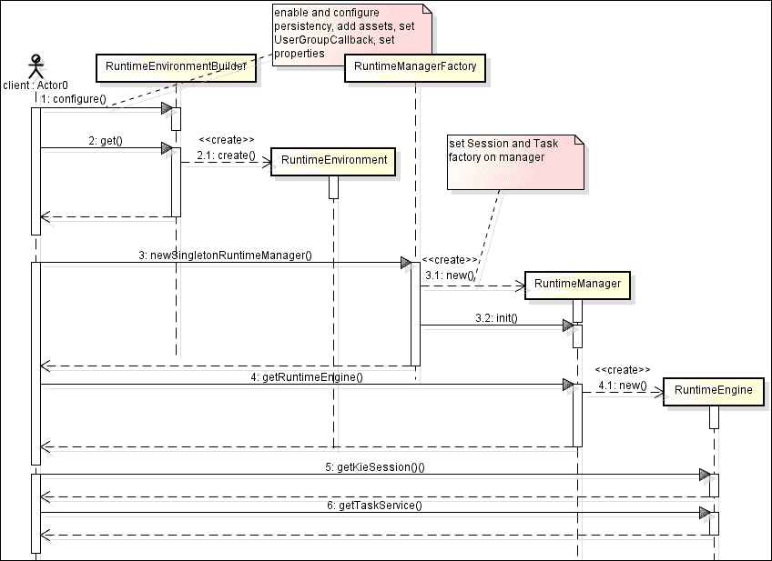
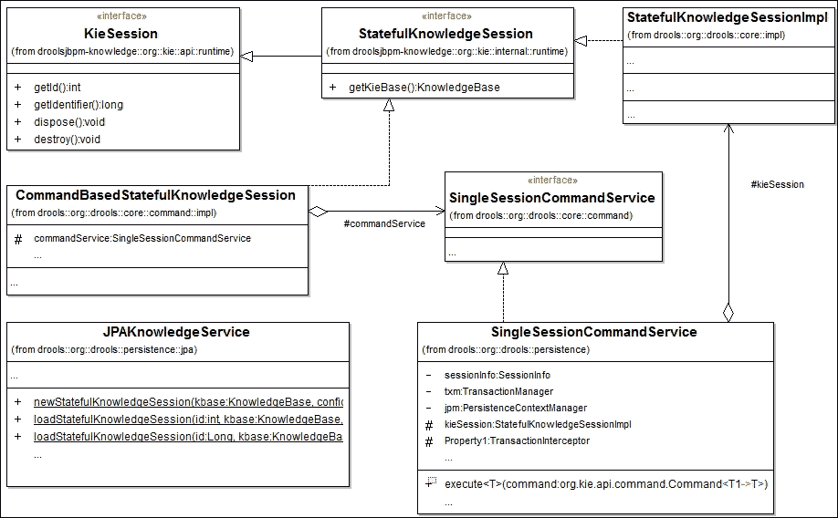
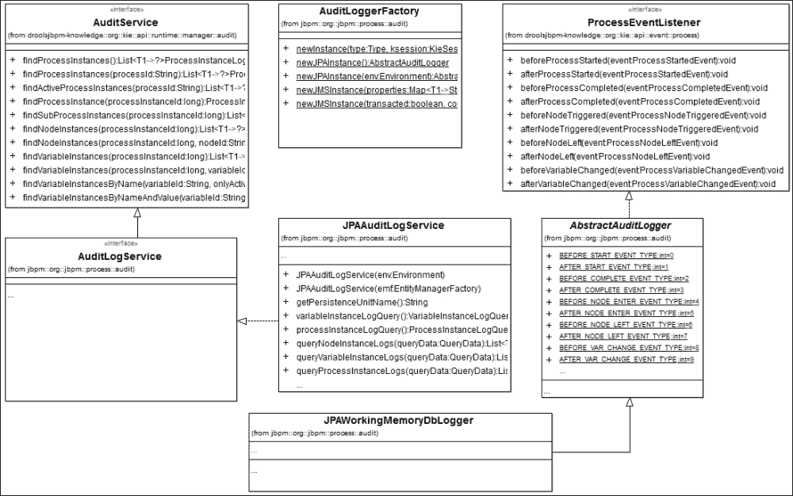
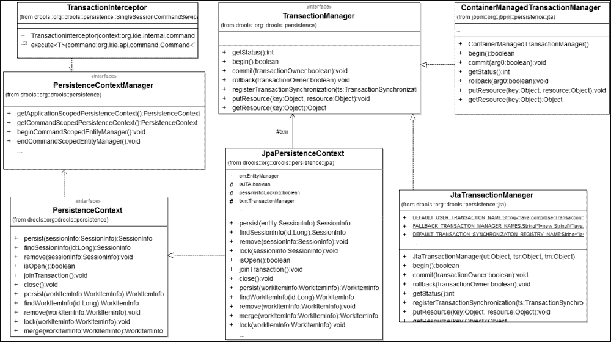

# 第六章。核心架构

第一章，*业务流程建模 – 连接业务与技术*，为你提供了对新的 KIE 平台和 jBPM 工具栈组件的概述。这一章将向你展示 jBPM 是如何构建的，以及它的组件和子系统是什么，它将通过 jBPM 的源代码，用示例说明如何利用其模块化系统提供的灵活性。

本章我们将涵盖的主题列表如下：

+   核心 API

+   运行时引擎

+   人类任务服务

+   持久性和事务

+   历史日志

# KIE API

新的 KIE API 产生于提供新的公共软件服务层和为经过良好评估的 Red Hat 项目（主要是 Drools 和 jBPM）提供集成 IDE（工作台）的需求。通过 KIE API，添加了几个功能，以简化这些平台与多个环境的集成：JMS、Rest、SOAP、CDI、Spring、Seam、OSGi 和纯 Java 应用程序。

**droolsjbpm-integration** 额外项目（托管在 [`github.com/droolsjbpm/droolsjbpm-integration`](https://github.com/droolsjbpm/droolsjbpm-integration)）提供了各种环境和技术的集成包。

我们在第四章中预览了一些新的 KIE 概念，*运营管理*（基于 Maven 的部署、KieModule、`kmodule.xml` 文件和 KieScanner），因此你应该准备好深入探讨这个主题。你还将找到，作为我们示例的配套支持，特定 KIE 组件关系的类图，这应该有助于你更清晰地了解 KIE 内部组织结构。

### 注意

[`www.kiegroup.org`](http://www.kiegroup.org) 是所有 KIE 技术的门户。

## KieServices

KieServices 是一个线程安全的单例，充当服务工厂。它提供了对主要 KIE 组件和服务的较高层次访问。

可以通过以下方式通过其工厂获取 KieServices 引用：

```java
KieServices ks = KieServices.Factory.get();
```

主要的 KIE API 服务如下：

+   **KieContainer**：这本质上是对 KieModule 和它定义的 KieBase(s) 的包装；它可以编译和验证 KieBase 并生成新的 KieSession(s)。

+   **KieRepository**：这是一个管理 KieModules 的仓库，抽象出模块源；它可以是安装在 Maven 仓库中的模块，也可以是用户通过编程创建并添加的模块。

+   **KieScanner**：这是一个 Maven 仓库工件扫描器。

+   **KieBuilder**：这是一个从其源文件集开始编译和构建 KieModule 的辅助工具。

+   **KieResources**：这是一个从各种 I/O 源（类路径、URL 等）创建专用资源的工厂。

+   **KieLoggers**：这是一个用于会话的日志配置器。

+   **KieStoreServices**：这是一个存储服务，用于管理 jBPM 和 Drools 运行时状态的可持久性。

+   **KieMarshallers**：Marshalling 提供了一个可定制的序列化架构、实用类和策略。我们将在 第七章 *定制和扩展 jBPM* 中描述 jBPM 灵活的 marshalling 架构。

让我们先讨论与 jBPM 运行时配置和设置相关的 KIE API 组件，因为所有您的知识工件在运行时都代表了业务流程执行引擎的构建基础。

### 注意

接下来的部分不属于 KieServices 这一部分的逻辑分组，因为它们都是 KIE 一等公民（类）并且可以在不考虑 KieServices 工厂类的情况下使用和创建。您可以在 `jbpm-misc` 项目中找到本章的完整源代码示例。

## KieContainer – KIE 模块和 KieBase(s)

`KieContainer` 已经专门设计来处理 KIE 模块并解决其依赖关系（其他 KIE 模块或 Maven 化的 JAR），即使是通过远程 Maven 仓库。与较老的 jBPM 版本相比，这在知识模块共享和管理能力方面是一个巨大的改进。虽然 KIE 模块是一个收集一组业务工件和静态资源的集合，但组织 KieBase 和 KieSession 定义以及为用户提供获取它们的新现成引用的工具的责任在于 KieContainer。

### 注意

您可以在 `KieContainerTest` 类中找到示例。

`KieContainer` 可以使用 Java 类路径或用户提供的 ClassLoader 来检测、加载和包装现有的 `KieModule`：

```java
KieContainer kContainer = ks.getKieClasspathContainer();
```

`getKieClasspathContainer()` 函数返回包装了当前类路径中找到的 `KieBase` 的 `KieContainer`（通过解析可用的 `kmodule.xml` 文件创建）。

在 第四章 *运营管理* 中，我们讨论了新的 Maven 仓库集成功能。`KieContainer` 能够从 Maven 仓库加载 KieModule，给定其 Maven **GroupId-ArtifactId-Version**（**GAV**）；如下使用 `ReleaseId` 类：

```java
// create the Maven GAV wrapper
ReleaseId releaseId = ks.newReleaseId("com.packt.masterjbpm6", "pizzadelivery", "1.0-SNAPSHOT");
// then create the container to load the existing module
KieContainer kieContainer = ks.newKieContainer(releaseId);
```

通过将 KIE 客户端仓库服务投入使用，该容器还能够根据其 Maven GAV 动态更新其定义，从不同的 KIE 模块开始。因此，所有现有的 KieBase 资产和 KieSession 定义都将逐步更新（并且缓存的类定义将被较新的定义替换）。

```java
ReleaseId newReleaseId = ks.newReleaseId("com.packt.masterjbpm6", "pizzadelivery", "1.1-SNAPSHOT"); 
// update the container with the KIE module identified by its GAV
Results result = kieContainer.updateToVersion (newReleaseId);
if (result.hasMessages (Level.ERROR))
{
List<Message> errors= result.getMessages(Level.ERROR);
```

KieBase（知识库）是 KieModule 的构建块。`KieBase` 类作为 KieModule 知识定义的存储库，并作为 KIE 会话的字典。它包含 Drools 规则、流程、模型等。默认情况下，这些工件在 KIE 项目的 `resources` 根目录中搜索，但您可以设置 `packages` 属性以在不同的文件夹中搜索，例如（`kmodule.xml` 的摘录）：

```java
<kbase name="kbase" packages="com.packt.masterjbpm6.event">
```

这将加载来自`resources/com/packt/masterjbpm6/event`项目文件夹的工件。

你的 KieModule 必须始终至少有一个命名的 KieBase（即其`name`属性必须设置）；或者，如果你决定使用默认的（即不知道其名称而创建的）KieBase，则在你的`kmodule.xml`中完全省略`<kbase>`元素定义，或者使`kmodule.xml`为空。

### 小贴士

没有底层 KieBase 的 KieSession 没有太多意义。在用户没有指定的情况下，KIE 运行时为你提供了一个默认的 KieBase。这个默认的 KieBase 是具有`packages="*"`属性的 KieBase，这意味着它定义了包含在所有模块包中的所有资产。

KieBase 由 KieContainer 创建，支持继承（包含）和多重定义：

+   **包含**：属于“包含的 KieBase”的所有知识工件都被添加到“包含的 KieBase”中；例如，所有`kbaseold`资源都被添加到`kbasenew` KieBase 中：

    ```java
    <kbase name="kbase" includes="kbaseold"
    packages="com.packt.masterjbpm6.process">
        <ksession name="ksession" />
    </kbase>
    ```

包含的 KieBase 必须已经可用（定义它的 KieModule 必须已部署）或本地定义（相同的`kmodule.xml`文件）。在第四章中，*运营管理*（ManagedVesuvio 存储库示例）中，Napoli KieModule 的 kbase 包含 Vesuvio 的 kbase，以便重用其外部过程定义作为子过程；让我们通过查看它们的 Kie 模块定义来澄清。

Napoli `kbase`定义如下（仅相关部分）：

```java
<kbase name="kbase-napoli" default="true" packages="*" includes="kbase-vesuvio">
```

Vesuvio `kbase`定义如下（仅相关部分）：

```java
<kbase name="kbase-vesuvio" default="false" packages="*">
```

注意，为了使 KIE 拾取主 kbase（`kbase-napoli`），我们将`kbase-vesuvio` kbase 的`default`属性设置为`false`。

+   **多重定义**：可以在单个 KieModule 内部定义多个 KieBase（和 KieSession）：

    ```java
    <kbase name="kbase" includes="kbaseold"
    packages="com.packt.masterjbpm6.process">
        <ksession name="ksession" />
    </kbase>
    <kbase name="kbaseold" packages="com.packt.masterjbpm6.event">
        <ksession name="ksession2" />
    </kbase>
    ```

一旦定义了 KieBase，就可以创建一个有状态的 KieSession（默认的或命名的，通过传递其`name`属性）。

```java
KieSession kieSession=kieContainer.newKieSession ("ksession");
```

每个 KieSession 都与一个单独的 KieBase 配对：KieContainer 实际上将会话创建委托给其 KieBase。

### 注意

KieBase 和 KieSession 支持许多声明性配置设置，你可以将其添加到你的`kmodule.xml`文件中；请参阅 jBPM 6.2 参考文档。

以下类图显示了在处理容器时必须处理的主体类（会话将在下一节中讨论）。



## KIE 构建器 API

很可能你已经使用过`KnowledgeBuilderFactory`和`KnowledgeBuilder`来设置`KnowledgeBase`：KnowledgeBuilder 解析知识源文件（处理`bpmn`文件、Drools `.drl`规则等），并将它们转换为 KnowledgeBase 可以使用的知识包。资源通过类型（`ResourceType`枚举）进行标识和添加。KnowledgeBase 已弃用，但`KieBase`实际上是由`KnowledgeBaseImpl`实现的。

KIE API 提供了专门用于管理 KieModule 的工具：文件创建和资源组装、模块依赖管理、构建和部署到 Maven 仓库。以下类图显示了主要构建相关类（仅作快速参考）。



### 注意

您可以在 `KieBuilderTest` 和 `KieResourceTest` 类中找到示例。

### KieResources

资源是一个知识元素（流程、规则等）或资源的合同表示，或者可以间接用于加载 Kie 模块的资源（例如：`kmodule.xml` 的路径）。

`KieResources` 工厂简化了以 `org.kie.api.io.Resource` 形式处理对象的任务；例如：

```java
Resource res=ks.getResources().newFileSystemResource (new File("/jbpm-constructs/target/classes/"));
```

此资源表示包含 KIE 模块的路径。

### KieModule

虽然 KieContainer 代表一个抽象，但 KieModule 的本质是基于业务资产文件（资源）：KieModule 是定义一组 KieBase 类所需的所有资源的容器。

### 小贴士

模块项目的源结构必须符合 Maven 项目的标准布局（如 `src/main/resources`）。

+   `pom.xml` 定义 KieModule Maven GAV

+   `kmodule.xml` 声明 KieBase、KieSession 及其属性

+   知识工件

KieModule 通过 `pom.xml` 文件跟踪来自其他 Kie 模块和其他普通 JAR 存档的模块依赖项。

### KieBuilder

KieBuilder 允许您通过添加资源和管理配置文件（通过一系列模型类，即元模型）来构建 KieModule，这些模型类代表关键的 KieModule 组件：

+   `KieModuleModel`: 一个 KieModule 抽象

+   `KieBaseModel`: 一个 KieBase 抽象

+   `KieSessionModel`: 一个 KieSession 抽象

基于内存的文件系统类（`KieFileSystem`）帮助您创建/编写 KIE 模块文件（`pom.xml` 和 `kmodule.xml`）。以下类图显示了 `KieBuilder` 和相关类（详情见后）。



让我们通过一个实际例子来看 KIE 元模型创建和使用，以便从头开始在一个 Maven 仓库中设置和安装一个 KIE 模块（包括依赖项）。

您可以在 `KieBuilderTest` 类（`testBuilderWithModels`）中找到完整的示例。

```java
KieServices ks = KieServices.Factory.get();
// create the KIE module model
KieModuleModel kmodule = ks.newKieModuleModel();
// create the KieBase model
KieBaseModel kieBaseModel = kmodule.newKieBaseModel("KBase");
// create the KieSession model
KieSessionModel ksession1 = kieBaseModel.newKieSessionModel("KSession").setDefault(true);
KieFileSystem kfs = ks.newKieFileSystem();
ReleaseId rid = ks.newReleaseId("com.packt.masterjbpm6", "pizzaDeliveryNew ", "1.0");
// generate pom.xml file
kfs.generateAndWritePomXML(rid);
// and write the <kmodule> xml file
kfs.writeKModuleXML(kmodule.toXML());
```

当您的文件集准备就绪时，将 `KieFileSystem`（内容）传递给构建器：

```java
KieBuilder kieBuilder = ks.newKieBuilder(kfs);

// add dependencies (here, we put jar Files as Resources but you
// can use one or more KieModule too)
Resource dependencyRes = ks.getResources().newFileSystemResource(new File("c:/temp/pizzadelivery-1.0.jar "));
kieBuilder.setDependencies(dependencyRes);
```

我们现在可以执行“构建”。构建会编译所有模块知识包和 Java 类，验证配置文件（pom.xml 和 kmodule.xml），最后将模块安装到本地 KIE 仓库中：

```java
kieBuilder.buildAll();
if (kieBuilder.getResults().hasMessages(Level.ERROR)) {

}
```

以编程方式创建 KieModule 意味着你必须以文件方式创建对象，例如：

```java
  String myprocess= "<?xml version=\"1.0\" encoding=\"UTF-8\"?> \n <definitions id=\"Definition\"\n" +

kfs.write("src/main/resources/process.bpmn", myprocess);
```

运行时将根据您的 KieModule 文件系统结构创建文件。

## 仓库和扫描器

如我们之前所指出的，Maven 仓库是新 Kie 架构的一个重要组成部分：仓库服务允许您通过内部 KIE 仓库管理模块安装和依赖解析：

```java
KieServices ks = KieServices.Factory.get();
KieRepository kr = ks.getRepository();
```

要将模块添加到 KIE 仓库存储，你必须提供 `kmodule.xml` 文件的路径或构建的 KIE 模块 JAR 文件的路径：

```java
Resource kieresource= ks.getResources().newFileSystemResource(new File("c:/Users/simo/git/masterjbpm6/pizzadelivery/target/classes/"));
// or 
ks.getResources().newFileSystemResource(new File("c:/Users/simo/git/masterjbpm6/pizzadelivery/target/pizzadelivery-1.0.jar"));
// add to the KIE repo
KieModule kModule = kr.addKieModule(kieresource);
// load and use the module
KieContainer kContainer = ks.newKieContainer(kproj.getReleaseId());
```

`addKieModule` 方法接受可选的模块资源依赖项（再次，以 `kmodule.xml` 路径或 JAR 存档的路径的形式）。

从仓库加载一个模块就像以下这样简单：

```java
ReleaseId releaseId = ks.newReleaseId("com.packt.masterjbpm6", "pizzadelivery", "1.0-SNAPSHOT");
KieModule kModule=kr.getKieModule(releaseId);
```

仓库服务封装了内部 Maven KIE 仓库服务以及我们接下来将要看到的 `KieScanner` 服务。

### KieScanner

**KieScanner** 是一个用于 Maven 仓库（本地和远程）的监控器，用于自动检测给定的 KieModule 是否有更新的发布版本：在这种情况下，如果找到模块的新部署的工件，扫描器会更新 KieContainer 以反映更改的定义（KieBase、KieSession 等）。KIE 模块 KieBase(s) 会被重新构建，并且所有从 KieContainer 创建的新 KieSessions 都将使用更新的 KIE 模块定义。

扫描器可以执行阻塞式扫描更新（`scanNow()` 方法），在（最终）更新过程完成后返回，或者执行后台扫描过程（`start(long pollingInterval)` 和 `stop()` 方法）。

```java
KieServices ks = KieServices.Factory.get();
ReleaseId releaseId = ks.newReleaseId("com.packt.masterjbpm6", "pizzadelivery", "1.0-SNAPSHOT");
KieContainer kieContainer = ks.newKieContainer(releaseId);
// bind the scanner to the container
KieScanner scanner = ks.newKieScanner(kieContainer);
// synchronous scanner
scanner.scanNow();
```

### 小贴士

扫描器仅在配对的 KieContainer 的模块 Maven 版本（其 GAV 中的 V）不是固定版本时才工作。只有具有 SNAPSHOT、LATEST 或 RELEASE 限定符的版本，或范围版本的模块才会被处理。有关更多信息，请参阅 Maven 版本参考。

扫描操作执行以下操作：

+   构建新的 Kie 模块，寻找错误。

+   更新旧的模块依赖项。

+   更新旧的模块资产，编译它们，并重新构建模块知识库。

+   如果没有检测到构建错误，则将更新的模块添加到 KIE 模块仓库。

如果知识库正在使用新的或更新的类，则将其完全重新创建；否则，其资源将增量更新。过时的知识库和会话（其定义已被删除）将从 Kie 容器中删除。关于扫描器的一般建议是极其谨慎，并针对每个案例进行评估。

示例 `KieScannerTest` 类为你提供了两个测试方法：

+   `testScannerUpdateNewSession`：通过创建一个新会话并验证更新过程变量返回的值与原始定义不同，来验证扫描过程后 Kie 模块流程定义是否得到更新。

+   `testScannerSameSessionAfterUpdate`：验证扫描后，现有的会话是否继续使用其旧流程定义，而新的 KIE 会话则获取更新的流程定义。

扫描仪在之前的 jBPM 知识库更新机制（KnowledgeAgent）上是一个很好的改进，因为它与 Maven 紧密集成，并为实现者提供了以资产为导向的编程风格来处理 KIE 模块、Kie 项目源和资产。这一重大改进使 jBPM 更适合典型的敏捷、精益开发环境。只需想想当你与**持续集成**（**CI**）、部署和自动化测试工具集成时的可能性。你可能有一个扫描器进程，它会检查你的夜间构建 Maven 仓库主干，使用你资产的最新开发版本更新你的 KIE 模块，并触发你的自动化测试套件。

### 注意

KieScanner API 实现和实用类属于`kie-ci`项目（[`github.com/droolsjbpm/drools/tree/master/kie-ci`](https://github.com/droolsjbpm/drools/tree/master/kie-ci)）。

扫描仪 API 还提供了一个 Maven 辅助类，该类管理工件查找和部署到系统 Maven 仓库：

```java
MavenRepository repo = MavenRepository.getMavenRepository();
List<DependencyDescriptor> dependencies = repo.getArtifactDependecies("com.packt.masterjbpm6:pizzadelivery:1.0");
Artifact module = repo.resolveArtifact(ks.newReleaseId(
  "com.packt.masterjbpm6", "pizzadelivery", "1.0"));
```

`KieScannerTest` jUnit 测试类测试扫描器和构建 API。它为`pizzadelivery` KieModule 创建并部署了一个新版本（`buildModuleForScannerUpdate`方法），然后启动扫描器更新过程（`testScannerUpdate()`方法）。

## KieLoggers

KieLoggers 工厂允许你创建审计日志记录器，它产生在特定 KIE 会话执行期间发生的所有事件的日志跟踪。以下类型的日志记录器可用：

+   **基于文件的日志记录器**：以默认`.log`扩展名的文件日志记录器；以 XML 序列化格式跟踪事件：

    ```java
    KieRuntimeLogger logger = loggers.newFileLogger(ksession, "c:/temp/kielogger");
    ```

    查看`KieLoggersTest.testLoggers`方法以获取完整示例。

+   **基于控制台的日志记录器**：将日志跟踪到标准输出：

    ```java
    KieRuntimeLogger logger = loggers.newConsoleLogger(ksession);
    ```

    在运行`testRuleWithConsoleLogger`方法时，你可以看到 Drools 事实的插入和 Drool 规则的触发：

    ```java
    13:31:03.459 [main] INFO  o.d.c.a.WorkingMemoryConsoleLogger - OBJECT ASSERTED value:com.packt.masterjbpm6.pizza.model.Order@12e13d86 factId: 1

    13:31:03.708 [main] INFO  o.d.c.a.WorkingMemoryConsoleLogger - BEFORE RULEFLOW GROUP ACTIVATED group:masterRuleGroup[size=1]
    13:31:03.724 [main] INFO  o.d.c.a.WorkingMemoryConsoleLogger - BEFORE ACTIVATION FIRED rule:checkorder activationId:checkorder [1] declarations: $o=com.packt.masterjbpm6.pizza.model.Order@12e13d86 ruleflow-group: masterRuleGroup
    ```

+   线程日志记录器：与基于文件的日志记录器相同，但以异步方式执行对文件的写入；它具有设置写入（刷新）间隔周期的选项，例如：

    ```java
    // update the log file every 5 seconds
    KieRuntimeLogger logger = loggers.newThreadedFileLogger(ksession, "c:/temp/kie_threaded", 5000);
    ```

    查看`testRuleWithThreadedLogger`示例以获取完整示例。

日志类扩展`WorkingMemoryLogger`，该类实现了所有可用的事件监听器接口：`Process`、`Agenda`、`Rule`和（KIE）知识库。由于会生成多个事件，你可以使用以下方法控制事件过滤：`addFilter`、`removeFilter`以及传递一个实现`ILogEventFilter`的类。我们可以在`kmodule.xml`文件中直接声明和配置 KieSession 日志记录器，例如：

```java
<ksession

<fileLogger id="filelogger" file="mysession.log" threaded="true" interval="10" />
<consoleLogger id="consolelog" />
</ksession>
```

以下类图显示了日志记录器和事件监听器接口：



## KieStoreServices

`org.kie.api.persistence.jpa.KieStoreServices` 是一个定义 KIE 会话持久化服务合约的接口。它的默认实现是 `org.drools.persistence.jpa.KnowledgeStoreServiceImpl` 类。让我们看看如何使用 `KieStoreServices` 通过会话 ID 恢复 KIE 会话。以下示例是 `StorageTest.testRuleWithStorageServer` 方法的摘录。它展示了如何安全地从持久化存储中加载您的 Kie 会话并一致地执行业务流程。

```java
KieServices ks = KieServices.Factory.get();
KieStoreServices storeservice = ks.getStoreServices();
KieContainer kContainer = ks.getKieClasspathContainer();
KieBase kbase = kContainer.getKieBase("kbase");
// initialize the Session Environment with EMF and the TM
Environment env = EnvironmentFactory.newEnvironment();
    env.set(EnvironmentName.ENTITY_MANAGER_FACTORY, super.getEmf());

// current Bitronix transaction manager
  env.set(EnvironmentName.TRANSACTION_MANAGER,
    TransactionManagerServices.getTransactionManager());
// create the session
  ksession = storeservice.newKieSession(kbase, null, env);
// perform the Rule task test
  testRule();
  long id = ksession.getIdentifier();
// dispose the session
  ksession.dispose();
// reload the session given its ID
  KieSession loadedsession = storeservice.loadKieSession(id, kbase, null,env);
// check it is the same session
  assertEquals(id, loadedsession.getIdentifier());
// rerun the test on the loaded session
ksession = loadedsession;
  testRule();
```

# 运行时管理器服务和引擎

`RuntimeManager` 的引入是为了简化 `KieBase` (`KnowledgeBase`) 和 `KieSession` (`KnowledgeSession`) 的配置。其主要职责是根据预定义的策略管理和创建 `RuntimeEngine` 实例（见 *运行时策略* 部分）。

`org.kie.api.runtime.manager.RuntimeEngine` 是进入引擎服务的入口点；其主要目的是为用户提供预配置和即用型引擎组件：

+   KieSession

+   TaskService

+   AuditService

`org.kie.api.runtime.manager.RuntimeManager` 解除了用户从典型样板代码开发中的负担；它为流程设置执行环境（将 KieSession 和任务服务包装到 RuntimeEngine 中）并管理以下 Drools 服务：

+   **Scheduler service**：调度服务管理基于计时器的作业执行（我们已在 第四章，*运营管理* 和 第五章，*BPMN 构造* 中使用 *Async task* 的 *BPMN 构造* 中见过）

+   **TimerService**：为会话实现计时器服务

运行时管理器在会话上注册以下项目：

+   流程工作项处理器（也包括默认的 `human task` 工作项处理器，它负责管理任务节点）

+   全局变量

+   事件监听器

## 运行时策略

`RuntimeManager` 实现了一个运行时策略，允许您选择如何管理您的 KieSession 生命周期；让我们看看可用的策略：

+   **Singleton（默认 jBPM 策略）**：运行时管理仅一个共享的 `RuntimeEngine` 实例（只有一个 Kie 会话是活动状态并共享）

+   **PerProcessInstance**：管理器为每个流程实例使用一个专用的 Kie 会话；Kie 会话生命周期跨越流程实例的持续时间

+   **PerRequest**：调用 `getRuntimeEngine()` 方法返回一个新的 `RuntimeEngine` 实例（每次都创建一个新的 Kie 会话和任务服务）

`RuntimeManager` 必须从 `RuntimeManagerFactory` 创建，根据选择的运行时策略（`newSingletonRuntimeManager()`、`newPerRequestRuntimeManager()` 或 `newPerProcessInstanceRuntimeManager()`）调用其专用工厂方法，并传递 `org.kie.api.runtime.manager.RuntimeEnvironment` 的实例。

### 选择正确的策略

您应主要根据您的业务和系统规范选择正确的运行时策略。需求可能限制您保持隔离的 jBPM 会话工作内存（例如，每个流程实例一个会话）；换句话说，每个会话拥有自己的规则、事实和对象。这在需要低资源竞争和高吞吐量的高度并发系统中是可能的。

相反，单例策略管理一个线程安全的会话（具有同步访问）。这在高度并发的环境（如 Web）中可能导致性能问题，但也会允许所有 jBPM 共享功能（所有流程之间共享事实和全局变量，整个工作内存中的信号作用域等）。这些都是对问题的一般见解，您应根据系统和功能需求评估自己的策略的优缺点。

## RuntimeEnvironment 类

此类封装了`RuntimeManager`所需的环境配置；我们通过使用`RuntimeEnvironmentBuilder`辅助类来实例化它：

```java
// preconfigured environment with disabled persistence
RuntimeEnvironmentBuilder builder=RuntimeEnvironmentBuilder.Factory.get()
      .newDefaultInMemoryBuilder();
// with enabled persistence: emf is your EntityManagerFactory
RuntimeEnvironmentBuilder.Factory.get().newDefaultBuilder().entityMan agerFactory(emf).persistence(true);
```

`RuntimeEnvironmentBuilderFactory`有多个辅助方法，旨在创建预配置的专用`RuntimeEnvironmentBuilder`，使其能够持久化，基于类路径 KIE 容器（`kmodule.xml`），基于 KIE 模块（JAR 文件）等。由于构建器封装了所有配置细节，它公开了执行以下操作的方法：

+   添加资产（BPMN 流程、Drools 规则等）

+   设置自定义`UsergroupCallback`

+   设置知识库（如果您的`RuntimeEnvironmentBuilder`不是 KIE 模块类路径构建器）

+   设置实体管理器工厂以启用 JPA 持久性

    ```java
    RuntimeManagerFactory managerFactory = RuntimeManagerFactory.Factory.get();

    // pass the RuntimeEnvironment we get from the EnvironmentBuilder
    RuntimeManager rtManager=managerFactory.newSingletonRuntimeManager (builder.get());
    ```

运行时管理器通过唯一标识符识别。运行时不会接受创建具有与另一个活动`RuntimeManager`相同 id 的`RuntimeManager`。以下图表显示了在运行时初始化期间发生的交互，以及涉及主要 KIE 组件的交互：



## 运行时上下文

`RuntimeManager`可以处理上下文信息以查找特定的`RuntimeEngine`实现，具体取决于所选策略；上下文作为`org.kie.api.runtime.manager.Context`通用接口实现的传递：

+   `EmptyContext`：与 Singleton 或 PerRequest RuntimeManager 一起使用的上下文；不使用特定信息

+   `CorrelationKeyContext`：与 PerProcessInstance RuntimeManager 一起使用，通过使用流程实例关联键来查找`RuntimeEngine`

+   `ProcessInstanceIdContext`：与 PerProcessInstance RuntimeManager 一起使用，通过使用流程实例 ID 来查找`RuntimeEngine`（以及 Kie 会话）

    ```java
    RuntimeEngine engine = rtManager.getRuntimeEngine(EmptyContext.get());
    // we can now get the initialized services
    KieSession ksession = engine.getKieSession();
    TaskService taskService = engine.getTaskService();
    ```

为了避免资源泄漏，强烈建议在工作会话结束时销毁`RuntimeManager`，例如：

```java
rtManager.close();
```

# KieSession

KieSession 是一个有状态的会话，它在与引擎的多个交互过程中维护其会话状态。这是与引擎交互的最佳方式。会话是从 KieContainer、KieBase 或配置的运行时引擎创建的，它始终委托给 KieBase，但提供了选择会话运行时策略的灵活性。

根据持久性的启用情况，会话按以下方式创建：

+   **内存会话**: 与会话和引擎状态相关的所有数据都保存在内存中，并在引擎重启时丢失

+   **JTA 会话**: 通过 JPA EntityManager 和 JTA 事务管理器持久化会话

要创建一个新的（有状态的）KieSession，我们配置环境并使用 `JPAKnowledgeService`：

```java
Environment env = KnowledgeBaseFactory.newEnvironment();
EntityManagerFactory emf= Persistence.createEntityManagerFactory( "com.packt.masterjbpm6.persistenceunit" ));
env.set( EnvironmentName.ENTITY_MANAGER_FACTORY,emf);
env.set( EnvironmentName.TRANSACTION_MANAGER,
bitronix.tm.TransactionManagerServices.getTransactionManager());

StatefulKnowledgeSession ksession = JPAKnowledgeService.newKieSession( kbase, null, env );
```

示例使用 **Bitronix 事务管理器**（**BTM**）（更多关于此内容在 *持久性和事务* 部分）。

返回的 `StatefulKnowledgeSession` 是 `CommandBaseStatefulKnowledgeSession` 类型，它使用 `SingleSessionCommandService` 类型的命令服务装饰会话实现（`StatefulKnowldgeSessionImpl`）（参见以下类图）。

`SingleSessionCommandService` 通过 `TransactionInterceptor` 类透明地管理通过 JPA `SessionInfo` 实体类的有状态会话的持久性。

## 无状态 KieSession

无状态 KIE 会话是有状态会话的包装器，运行时在单个命令执行期间创建和销毁它，以便它不维护会话状态并且不能持久化。

## 全局变量

KieSession 管理全局变量；全局变量是用于将信息传递到引擎的对象，可以在流程或规则中使用。全局变量在所有流程和规则实例之间共享。让我们看看 KieSession 方法可以如何处理它们：

+   `getGlobals()`: 返回内部的全局变量解析器

+   `getGlobal (String)`: 根据其标识符返回全局对象

+   `setGlobal(String, Object)`: 设置全局对象并为其分配一个标识符

以下类图显示了会话类的详细信息：



## 命令执行器接口

所有 KIE 会话（无状态和有状态）都实现了 `CommandExecutor` 接口，这是一个服务，允许您执行单个命令或命令批处理。让我们看看其中的一些：

+   **进程/任务**: `CompleteWorkItemCommand`, `AbortWorkItemCommand`, `StartProcessCommand` 等等

+   **Drools 规则**: `FireAllRulesCommand`, `GetFactHandleCommand` 等等

+   **运行时**: `GetGlobalCommand`, `SetGlobalCommand` 等等

通常，你会调用高级 jBPM API 方法（使用会话或任务服务引用），但有时，使用命令类进行批量、调度或管理操作可能很方便。所有命令类都支持 XML 绑定，归功于标准注解（`@XmlRootElement`、`@XmlAttribute`、`@XmlElement`等），因此可以轻松序列化或远程传递。可以使用`CommandFactory`创建命令，或者简单地实例化特定的命令类，然后通过调用会话的`execute`方法执行它。

让我们现在看看如何从以下代码中创建和执行这些命令：

```java
// create the command and execute
Command startProcess= CommandFactory.newStartProcess ("pizzadelivery");
ksession.execute(startProcess);
```

或者，你也可以自己实例化该命令：

```java
GetProcessInstanceCommand getProcessInstanceCommand = new GetProcessInstanceCommand();
getProcessInstanceCommand.setProcessInstanceId( processInstance.getId());
ProcessInstance processInstance = ksession.execute( getProcessInstanceCommand );
```

### 批量执行

会话支持通过专门的`BatchExecutionCommand`执行一批命令。在这里，我们通过使用三个不同的命令（参见`CommandsTaskTest.testRuleWithCommand`方法）重写了第五章的`RuleTaskTest`测试类，*BPMN 结构*：

```java
StringBuffer orderdesc = new StringBuffer();
List<Command> batchcmds = new ArrayList<Command>();
batchcmds.add(CommandFactory.newSetGlobal("newnote", orderdesc));
Order order = new Order();
order.setCost(200);
batchcmds.add(CommandFactory.newInsert(order));
batchcmds.add(CommandFactory.newSetGlobal("orderglobal", order));
batchcmds.add(CommandFactory.newStartProcess("rule"));
ExecutionResults results = ksession.execute(CommandFactory .newBatchExecution(batchcmds));
```

`BatchExecutionCommand`按照它们被添加的确切顺序执行列出的命令：

```java
List<Command> pizzabatchcmds = new ArrayList<Command>();
pizzabatchcmds.add(CommandFactory.newStartProcess("pizzadelivery"));
pizzabatchcmds.add(CommandFactory.newStartProcess("pizzadelivery"));
ksession.execute(CommandFactory.newBatchExecution(pizzabatchcmds));
```

注意，`BatchExecutionCommand`，像所有命令类一样，支持序列化，因此你可以远程执行它或轻松地将其持久化以进行计划处理。

### 小贴士

即使`CompositeCommand`也可以顺序执行多个命令，但它只支持人类任务命令（继承自`TaskCommand`）。此命令由任务服务内部使用（参见*人类任务服务*部分）。

## 事件监听器

KIE 会话可以注册多个针对不同类型事件通知的专用监听器：

+   **流程**：`ProcessEventListener`与流程实例执行相关（我们在*KieLoggers*部分看到了`ProcessEventListener`）。

+   **规则**：`RuleRuntimeEventListener`用于与事实相关的事件。

+   **议程**：`AgendaEventListener`用于与 Drools 议程相关的事件。议程是 Drools 组件，用于跟踪规则激活（规则匹配）和规则动作执行。

通过提供这些接口之一的自定义实现，你可以获取过滤后的会话事件。

### 注意

从`KieLoggers`服务获取的所有日志类都扩展了抽象的`WorkingMemoryLogger`类，该类实现了前面的三个接口。我们将在*审计和日志历史记录*部分看到更多关于事件和审计的内容。

我们可以在`kmodule.xml`文件中声明性注册监听器：

```java
<ksession name="ksession">
<listeners>
<ruleRuntimeEventListener type="com.packt.masterjbpm6.RuntimeEventlistener" />
<agendaEventListener type="com.packt.masterjbpm6.AgendaEventlistener" />
<processEventListener type="com.packt.masterjbpm6.ProcessEventlistener" />
</listeners>
</ksession>
```

## 通道

通道是可以在你的 jBPM 应用程序和引擎之间建立的通信管道，通过你的 KIE 工作会话。它们的主要目的是允许将对象从会话工作内存发送到通用的外部过程或函数。

让我们看看基础知识：你必须实现`org.kie.api.runtime.Channel`接口，并将其与会话注册，为通道分配一个名称：

```java
public class RulesAppChannel implements Channel {
    // handle the channel object sent
public void send(Object object) {

    }
  }
ksession.registerChannel("appChannel", new RulesAppChannel());
```

该通道可以用来通知 jBPM 应用程序，例如，规则执行如下：

```java
when
        $o: com.packt.masterjbpm6.pizza.model.Order (cost>100)
    then
    {

      channels["appChannel"].send("urgent!");
    }
```

可以通过调用会话来检索现有通道的列表：

```java
  Map <String, Channel> channels=ksession.getChannels();
```

检查`ChannelsTaskTest.testRuleWithChannel()`方法以获取一个工作示例。

# 人类任务服务

我们在上一章介绍了人类任务；我们描述了人类任务状态转换、任务规则分配以及利益相关者执行的任务操作。

您可以从`RuntimeEngine`（`getTaskService()`方法）获取`org.kie.api.task.TaskService`任务服务，这是一个服务包装器；任务服务由`RuntimeManager`创建并包装到`RuntimeEngine`（及其底层会话）中，它使用`TakServiceFactory`：

```java
InternalTaskService internalTaskService = (InternalTaskService) taskServiceFactory.newTaskService();
```

用于实例化`TaskService`的工厂如下：

+   `LocalTaskServiceFactory`：用于非 CDI 环境

工厂使用以下引用配置任务服务：

+   `EntityManagerFactory`实例（从`RuntimeEnvironment`获取）。

+   `UserGroupCallback`（从`RuntimeEnvironment`获取）。如果没有提供自定义的`UserGroupCallback`实现，则使用默认的`MvelUserGroupCallbackImpl`；它从`jbpm-human-task-core-6.2.0.Final.jar`（`org\jbpm\services\task\identity`包）加载`UserGroupsAssignmentsOne.mvel`文件。

+   注册任务事件监听器（`TaskLifeCycleEventListener`接口的实例）。

+   `TaskDeadlinesService`：此服务负责管理为任务定义的截止日期以及触发通知（我们在第五章中讨论了升级和通知，*BPMN 构造*）。

工厂还在环境级别上共享以下内容：

+   默认的`DefaultUserInfo`实例（如果存在，则从类路径中的`userinfo.properties`文件加载数据）

任务服务通过命令来执行所有常见的任务操作；命令通过`CommandService`执行。让我们来看看这个服务类及其内部工作细节。

## 命令服务

运行时管理器创建了两种不同的`TaskService`类型：

+   `CommandBasedTaskService`：默认的任务服务实现

+   `SynchronizedTaskService`：一个同步的任务服务实例，它包装了`CommandBasedTaskService`。它使用单例运行时策略创建

`CommandBaseTaskService`将 API 执行委托给其内部的`CommandService`执行器。这是命令执行器，它执行所有任务 API 调用，就像在 KIE 会话中一样（例如，请参阅专门的*命令执行器接口*部分）：

```java
public void start(long taskId, String userId) {
  executor.execute(new CompositeCommand<Void>(
    new StartTaskCommand(taskId, userId),
    new CancelDeadlineCommand(taskId, true, false)));
}
```

例如，启动（任务）方法作为由两个任务命令特殊化构建的`CompositeCommand`执行：

+   `StartTaskCommand`：通过改变状态、在监听器上触发事件等方式执行任务启动操作

+   `CancelDeadlineCommand`: 取消此任务启动事件的匹配截止日期（如果有）（参见 第五章 中的 *截止日期和升级* 和 *通知* 部分）

`CompositeCommand` 首先执行可变参数 `commands` 中的命令，然后执行 `mainCommand` 命令。其构造函数签名如下：

```java
public CompositeCommand(TaskCommand<T> mainCommand, TaskCommand<?>...commands) { 

}
```

## TaskCommand 和 UserGroupCallback

所有任务命令都继承自 `UserGroupCallbackTaskCommand` 类；它们在 `execute` 方法上调用特定的父类方法，以触发对 `ORGANIZATIONALENTITY` 数据库表的更新。

### TaskContext 命令

在实例化时，每个任务命令都从 `CommandExecutor` 获得了 `TaskContext`；上下文职责如下：

+   提供一个 `JPATaskPersistenceContext` 实例，该实例处理所有数据库相关操作

+   触发任务生命周期相关事件

+   为命令提供核心任务相关服务

提供的主要任务服务如下：

+   **实例服务** (`TaskInstanceService`): 核心服务，它根据任务生命周期实现了 WS Human Task 规范

+   **查询服务** (`TaskQueryService`): 它返回只读任务实例信息，例如分配给用户的任务列表、给定任务的潜在所有者等

+   **内容服务** (`TaskContentService`): 它管理任务内容数据（输入和输出）

+   **截止日期服务** (`TaskDeadlineService`): 它管理任务截止日期的调度

+   **附件服务** (`TaskAttachmentService`): 它处理任务附件管理

+   **管理服务** (`TaskAdminService`): 它提供标准任务生命周期操作之外的操作，例如任务删除和任务存档

任务可以被删除（实际上是从 jBPM 持久存储中删除，使其对用户分配不可用），但只有在它们被标记为“存档”之后。

## 事务和拦截器

TaskService CommandService 由 `TaskCommandExecutorImpl` 类实现，在初始化期间，它被 `org.jbpm.services.task.persistence.TaskTransactionInterceptor` 拦截器装饰。拦截器将命令服务的每个 `execute` 方法调用封装在由 Drools `JtaTransactionManager` 管理的事务边界之间。

## 通知服务

在 第五章 中，我们讨论了人类任务升级和通知功能。jBPM 通知服务依赖于电子邮件消息；因此，为了成功工作，它需要以下条件：

+   配置正确的邮件会话

+   定义了一个 `UserInfo` 类实例；这提供了用户的电子邮件地址以供通知

jBPM 通过 **Java 命名和目录接口** (**JNDI**) 查找来加载邮件会话；您可以通过 `org.kie.mail.session` 系统属性设置 JNDI 名称，或者，作为替代，在您的应用程序服务器中提供 JNDI 名称 `mail/jbpmMailSession`。

如果没有找到 JNDI 资源，jBPM 将回退到从类路径加载的普通 `email.properties` 文件。

该文件定义了以下属性（提供了示例值）：

```java
mail.smtp.host=localhost
mail.smtp.port=2345
mail.from=alerts@packt.com
mail.replyto=replyTo@packt.com
```

我们在第五章，*BPMN 构造*中介绍了 `UserInfo` 类。

## TaskFluent 类

`TaskFluent` 类是一个辅助类，它允许您方便地配置和创建一个新的 `Task` 实例，并通过任务服务将其添加到持久存储（参见 `FluentTest` 测试类）：

```java
TaskFluent fluent = new TaskFluent();
fluent.setName("adhoc Human Task");
fluent.addPotentialUser("Luigi").setAdminUser("Administrator");
Task task = fluent.getTask();
// add the task
long taskid = taskService.addTask(task, new HashMap<String, Object>());
```

### 提示

WS-HumanTask 规范定义了管理员的角色，即可以管理任务的生命周期，即使他可能没有被列为任务潜在的所有者。在 jBPM 6 之前的版本中，jBPM 默认创建了一个“管理员”用户。

`addTask` 操作要求您至少添加一个潜在的业务管理员（通过 `setAdminUser()` 或 `setAdminGroup()` 方法）。业务管理员实体（用户或组）由运行时通过当前的 `UserGroupCallback` 进行验证，以检查其是否存在。要检查业务管理员是否是任务潜在的所有者，请搜索 `PEOPLEASSIGNMENTS_BAS` jBPM 数据库表。

为了简化测试配置，我们所有的 jUnit 测试类都配置了自定义用户回调，这使得所有用户都能通过（参见 `MyUserCallback` 类），因此“管理员”、“老板”或任何其他名称都没有区别。

运行时将评估任务分配及其截止日期，并将存储任务数据；引擎将任务分配给初始状态 `CREATED`。

`FluentTest` 示例展示了如何在流程定义范围之外（临时任务）以编程方式创建、添加、分配、启动和完成新任务。

`TaskFluent` 允许您将一个新任务附加到给定的流程实例。由于新任务没有传入/传出连接，这可能用途有限，但它非常适合临时流程（参见第五章，*BPMN 构造*），例如：

```java
  ftask.setWorkItemId("default-singleton");
  ftask.setProcessId(PROCESS_ID);
  ftask.setProcessInstanceId(processinstance.getId());
  ftask.setProcessSessionId(ksession.getId());
```

# 审计和历史日志

审计是引擎让用户配置与运行时流程执行相关的事件收集和检索的能力。我们在第四章，*运营管理*中介绍了审计和 BAM，现在，我们将看看如何利用引擎服务在各个级别实现审计。

当启用持久性时，可以从 `RuntimeEngine` 中借用现成的预配置 `AuditService`（由 `JPAAuditLogService` 实现），它返回来自三个标准 jBPM 审计数据库表（`ProcessInstanceLog`、`NodeInstanceLog` 和 `VariableInstanceLog`）的流程、节点和变量运行时审计数据（参见类图）。审计服务在每个日志条目上使用 `OwnerID` 属性进行标记，该属性与其 RuntimeManager 的唯一标识符相匹配。

```java
AuditLogService auditservice=engine.getAuditLogService();
List<ProcessInstanceLog> pizzadeliveryLogs= auditservice.findActiveProcessInstances("pizzadelivery");
```

这种 AuditService 的使用方法（基本上作为一个查询服务）是一个适合 BAM 或历史分析的好解决方案；然而，如果我们想实时收集审计数据，我们必须在 KIE 会话中注册一个监听器（参见*事件监听器*部分或下一部分）。

## AuditLoggerFactory

此工厂可以创建可用的 JPA-或 JMS 启用审计日志器（参见以下类图）：

+   **JPA**: 一个同步日志器，默认情况下在引擎 JTA 事务边界之间持久化审计事件

+   **JMS**: 面向 JMS 队列集成的异步日志器

记住，日志器必须绑定到 KieSession 才能开始记录：

```java
  ksession.addEventLister(listener);
```

我们可以通过向直接实例化的（无工厂）`JPAAuditLogService`提供自定义的`EntityManagerFactory`，并可选地选择一个审计策略，来在 JPA 日志器上设置不同的`EntityManager`：

```java
EntityManagerFactory emf = Persistence.createEntityManagerFactory("com.packt.masterjbpm6.persist enceunitApp");
AuditLogService logService = new JPAAuditLogService(emf, PersistenceStrategyType.STANDALONE_LOCAL);
```

这使我们能够将引擎日志服务适配到我们的持久层配置和事务管理：本地实体管理器和 JTA。此策略的主要目的是指导 jBPM 在不同应用程序环境中进行审计时管理事务。

KIE 审计策略如下：

+   **KIE_SESSION**: 当你仅使用 KieSession 的实体管理器时，请选择此策略（默认行为）

+   **STANDALONE_LOCAL**: 当你的应用程序在 KieSession 作用域之外使用实体管理器时，请选择此策略

+   **STANDALONE_JTA**: 与前一个策略相同，但使用`java:comp/UserTransaction`或`java:jboss/UserTransaction`来解析事务（仅适用于应用服务器）

我们在以下类图中展示了相关的类：



## 自定义日志器

要实现审计事件的自定义日志记录，你必须扩展`AbstractAuditLogger`类或为`ProcessEventListener`接口提供一个新实现。

支持的审计事件如下：

```java
Process:
   BEFORE_START_EVENT_TYPE = 0;
   AFTER_START_EVENT_TYPE = 1;
   BEFORE_COMPLETE_EVENT_TYPE = 2;
   AFTER_COMPLETE_EVENT_TYPE = 3;
Nodes:
   BEFORE_NODE_ENTER_EVENT_TYPE = 4;
   AFTER_NODE_ENTER_EVENT_TYPE = 5;
   BEFORE_NODE_LEFT_EVENT_TYPE = 6;
   AFTER_NODE_LEFT_EVENT_TYPE = 7;
Variables:
   BEFORE_VAR_CHANGE_EVENT_TYPE = 8;
   AFTER_VAR_CHANGE_EVENT_TYPE = 9;
```

事件以以下`ProcessEvent`实现类形式传递：`ProcessNodeEvent`、`ProcessStartedEvent`、`ProcessCompletedEvent`和`ProcessVariableChangedEvent`。为了将传入的已类型化事件转换为日志 JPA 实体类（即`VariableInstanceLog`），你可以使用一个辅助类（`DefaultAuditEventBuilderImpl`）：

```java
AuditEventBuilder builder = new DefaultAuditEventBuilderImpl();
VariableInstanceLog variablelog = (VariableInstanceLog) builder.buildEvent(event);
// get process variable properties: processId, var. name and value
String processId= variablelog.getProcessId();
String variableId=variablelog.getVariableId();
String value= variablelog.getValue();
// persist
em.persist (variablelog);
```

# 持久性和事务

jBPM 引擎的默认持久化机制基于 JPA 2/Hibernate 实现。每个引擎操作（启动流程、启动任务、完成任务等）都在事务的作用域内运行。`TransactionInterceptor`标记每个命令执行，并最终根据所使用的事务管理（**容器管理事务**（**CMT**）或用户事务**Bean 管理事务**（**BMT**）），将 EntityManager 引擎注册到当前事务中。我们已经通过`CommandService`和拦截器架构看到了会话和任务持久化的工作方式。

默认的引擎持久化配置归结为引擎持久化单元（在 `persistence.xml` 文件配置中定义）以及通常在应用服务器级别的 JTA 数据源定义。jBPM 不对定义的实体管理器数量施加任何限制；你显然可以在你的应用程序中定义多个持久化单元，并使多个实体管理器与 jBPM 实体管理器共存。你可以为 jBPM 和你的应用程序持久化层使用单个数据库（单个实体管理器），或者使用专门的 jBPM 数据库（和实体管理器），并使引擎参与你的业务应用程序事务。

### 注意

第八章, *与企业架构集成 jBPM*，的 jBPM 6.2 用户指南详细解释了事务的配置和使用。

## 使用 Bitronix 进行本地事务

我们将看到一个使用本地事务的完整的 jBPM 持久化示例配置。Bitronix 是一个开源的事务管理器框架；它支持 JTA API 和**扩展架构**（**XA**）协议，非常适合需要直接持久化配置的所有情况。所需的配置步骤如下：

1.  创建数据源（池化）：数据源将被绑定到 `jdbc/localjbpm-ds` JNDI 名称如下：

    ```java
    PoolingDataSource pds = new PoolingDataSource();
    pds.setUniqueName("jdbc/localjbpm-ds");
    pds.setClassName(LrcXADataSource.class.getName());
    pds.setMaxPoolSize(5);
    pds.setAllowLocalTransactions(true);
    pds.getDriverProperties().put("user","sa");
    pds.getDriverProperties().put("password","");
    pds.getDriverProperties().put("url","jdbc:h2:tcp://localhost /~/jbpm-db;MVCC=TRUE");
    pds.getDriverProperties().put("driverClassName","org.h2.Driv er");
    pds.init();
    ```

1.  在你的类路径资源中创建 `jndi.properties` 文件，其中包含以下代码：

    ```java
    java.naming.factory.initial=bitronix.tm.jndi.BitronixInitialContextFactory
    ```

    这使得 Bitronix 上下文工厂初始化环境并将事务服务对象绑定到默认 JNDI 名称，特别是以下名称：

    +   用户事务管理器位于 `java:comp/UserTransaction`

    +   事务同步注册表位于 `java:comp/TransactionSynchronizationRegistry`

1.  编辑你的 `persistence.xml` 文件，指定 Bitronix 数据源名称如下：

    ```java
    <persistence-unit name="localjbpm-persistenceunit"
        transaction-type="JTA">
    <provider>org.hibernate.ejb.HibernatePersistence</provider>
    <!--  match the bitronix datasource uniqueName -->
    <jta-data-source>jdbc/localjbpm-ds</jta-data-source>
    ```

1.  现在，你可以按照以下方式创建你的 `EntityManagerFactory`：

    ```java
    EntityManagerFactory emf =Persistence.createEntityManagerFactory("localjbpm- persistenceunit");
    ```

### 管理事务

jBPM 为企业的应用程序提供了一个现成的交易服务，它能够从调用应用程序开始参与现有的事务，因此，在发生错误的情况下（例如，自定义工作项处理器抛出异常或流程节点脚本失败），引擎事务将被标记为回滚，并将异常发送给调用者。

让我们看看一个常见的例子，**实体管理器**（**EM**）和 jBPM（由 Bitronix 管理）是如何一起工作的（请参阅 `AuditTxTest` 测试类）：

```java
AuditEntity audit = new AuditEntity();
audit.setDesc("startAudit1");
UserTransaction ut;
try {
  ut = (UserTransaction) new InitialContext()
      .lookup("java:comp/UserTransaction");
  ut.begin();
  em.joinTransaction();
  em.persist(audit);
// start process
  ProcessInstance pi = ksession.startProcess("auditTxProcess");
// new application database insert
  AuditEntity auditproc = new AuditEntity();
  auditproc.setDesc("Audit1:process started");
  em.persist(auditproc);
// commit both process instance and audit entity
  ut.commit();
```

## 锁定

默认使用的 JPA 事务锁定方案是乐观的。如果你需要切换到悲观锁定模式，请将你的 `org.kie.api.runtime.Environment` 实例中的以下参数设置为 `TRUE`：

```java
EnvironmentName.USE_PESSIMISTIC_LOCKING
```

这迫使引擎在实体上保持锁（锁定类型为 `LockModeType.PESSIMISTIC_FORCE_INCREMENT`），以确保对象没有被修改。



# 摘要

在本章中，我们对核心引擎组件和服务进行了广泛的探索，并未忽视一些引擎内部实现细节。现在您应该能够理解引擎是如何工作的，以及当您使用特定引擎功能时“幕后”发生了什么。

下一章将介绍引擎定制和扩展过程，以便将 jBPM 系统功能调整到您的解决方案。
