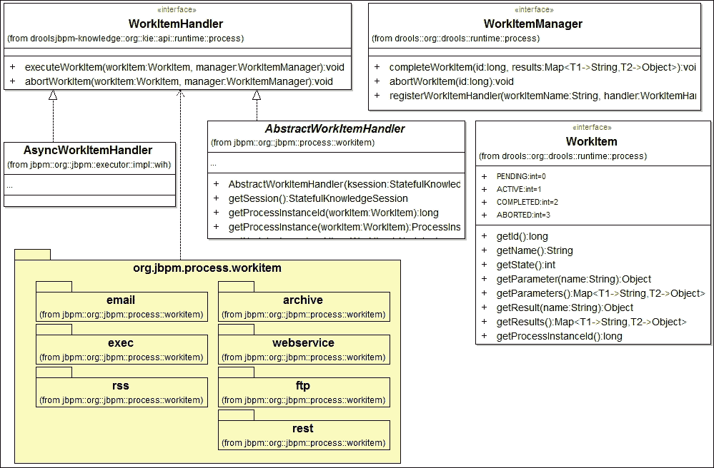
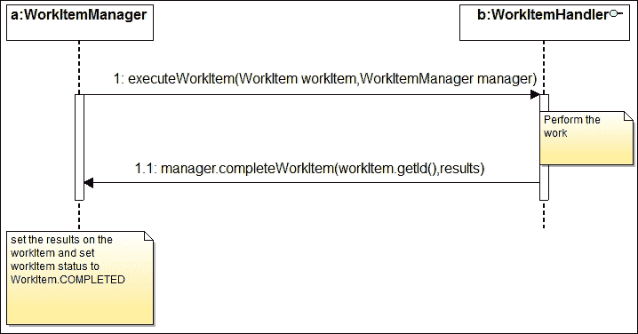
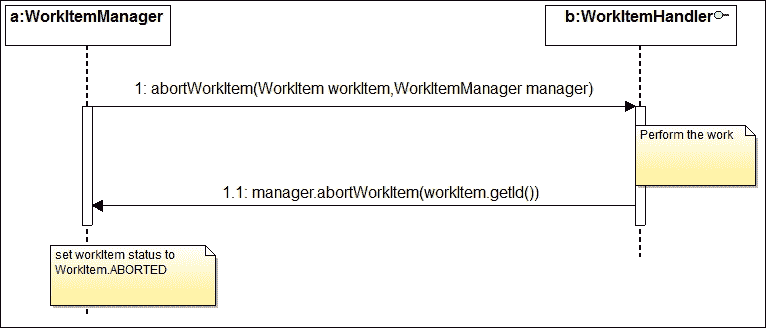
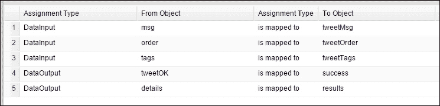
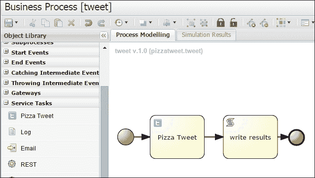
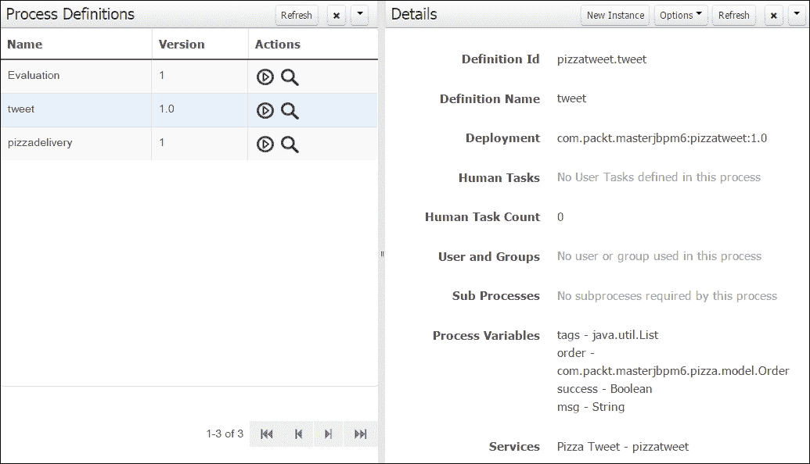
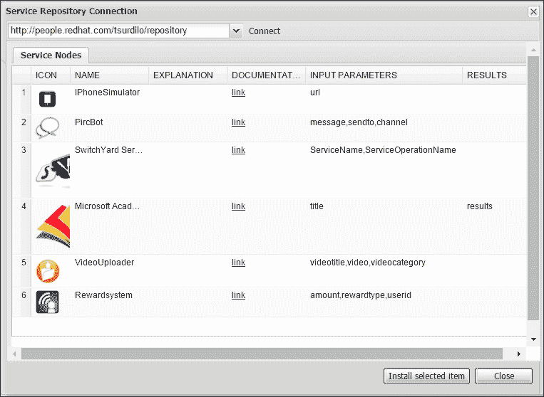
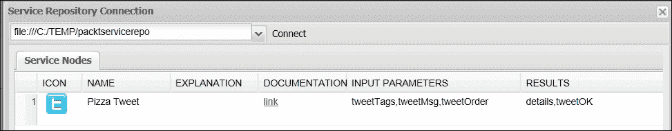
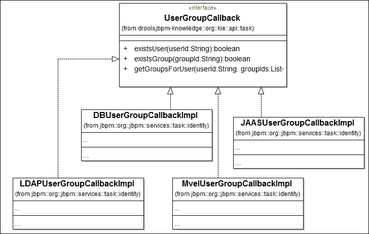
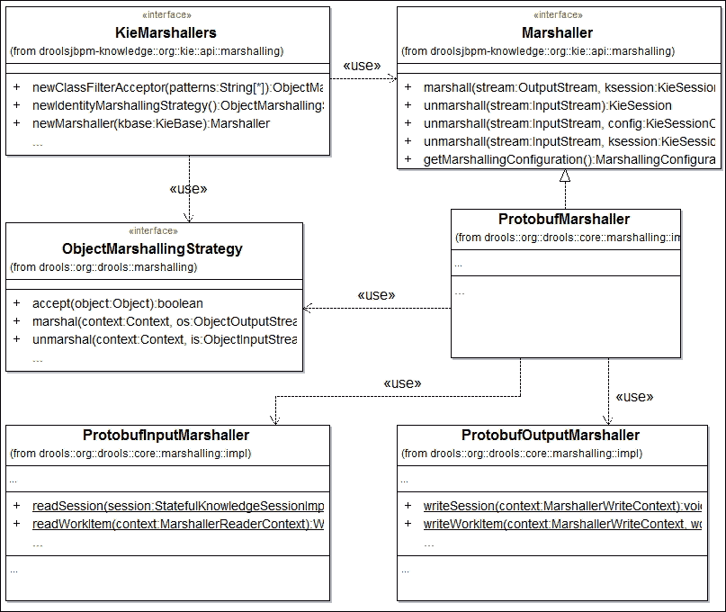

# 第七章。定制和扩展 jBPM

本章详细介绍了 jBPM 的扩展点。并非每个 jBPM 用户都使用整个工具栈。用户将需要定制/扩展 jBPM 以适应其解决方案架构。本章将向您展示如何定制和扩展 jBPM 的功能。

本章将涵盖的主题列表如下：

+   领域特定流程

+   编写您的自定义工作项处理程序

+   定制流程设计器

+   扩展变量持久性

+   扩展用户管理

# 自定义流程节点

在第五章中，我们介绍了 jBPM 的一个功能，该功能允许您将特定的 Java 类实现绑定到特定流程任务节点类型的执行：发送/接收任务、服务任务和临时任务。

这类**可扩展**的任务节点通常被称为**自定义工作项**，在流程幕后执行实际工作的实现类被称为**工作项处理程序**。这种架构使得 jBPM 在适应特定领域时更加灵活，无论是从功能还是工具 UI 方面。让我们首先回顾 jBPM 工作项和处理程序的基本知识。

## 工作项和处理程序

jBPM 将工作项定义为在流程范围内定义但可以在引擎外部执行的工作单元；特别是：

+   它接受一组参数

+   它执行某些操作

+   它可以可选地返回一个结果

工作项只是工作单元的抽象定义，在 jBPM 中有几种具体的、实用的实现，例如：人工任务、sendMessage 任务等。除了强制实现`org.kie.api.runtime.process.WorkItemHandler`接口外，引擎对工作项处理程序没有限制。

引擎运行时通过`WorkItemManager.registerWorkItemHandler(String workItemName, WorkItemHandler handler)`方法指示绑定新的处理程序实现，其中`workItemName`参数必须匹配自定义节点名称，因为它作为处理程序键。

jBPM 本身广泛使用处理程序，如`LocalHTWorkItemHandler`（工作项名称`Human Task`）、`WebServiceWorkItemHandler`（工作项名称`WebService`）或`RESTWorkItemHandler`（名称`Rest`）。此功能有效地简化了引擎定制过程，使用户能够增强（或替换）jBPM 功能。您可以在`jpbm-workitems-6.2.0.Final.jar`库中找到几个 jBPM 工作项处理程序类（有关类图中的包详细信息，请参阅以下内容）。



`AsyncWorkItemHandler`（我们在第五章的*异步任务*部分讨论过）可以在`jpbm-executor-6.2.0.Final.jar`库中找到。

### 生命周期

工作项状态转换如下：`ACTIVE`、`PENDING`、`COMPLETED`和`ABORTED`。

WorkItemHandler 调用序列相当简单（见以下交互图），当处理程序调用完成或中止时，引擎再次接管控制，流程执行继续。处理程序必须实现两个方法：

+   `executeWorkItem`: 工作项管理器调用`executeMethod`处理程序，并在`executeMethod`结束时，处理程序必须调用管理器上的回调方法`completeWorkItem`（可选地传递输出参数）：

+   `abortWorkItem`: 此方法在取消或错误事件发生后被调用。处理程序必须执行清理操作（如有必要）并通过`abortWorkItem`方法调用管理器，该方法指示管理器将工作项设置为**已中止**状态：

#### 可缓存和可关闭接口

jBPM 6.2 引入了一个新功能，允许用户通过实现以下接口方法钩入工作项处理程序的生命周期：

+   `org.kie.internal.runtime.Closeable.close()`: 在 WorkItemManager（和会话）释放时调用。在这里，您可以执行典型的维护工作（释放资源、关闭连接等）。

+   `org.kie.internal.runtime.Cacheable.close()`: 当 jBPM 内部缓存管理器关闭/释放时调用。通过实现`Cacheable`接口，我们使我们的 Workitem 处理程序定义能够被 jBPM 缓存。

### 小贴士

RuntimeManager 内部缓存了多个配置的对象类定义以优化初始化和启动时间：事件监听器、全局变量、序列化策略、Workitem 处理程序等。

对于`Closeable`接口的示例，请参阅以下段落中讨论的 PizzaTweet 处理程序实现。

## 处理程序在行动

工作项定制可以看作是一个两步过程：

1.  **代码实现和运行时注册**：使处理程序实现可供运行时引擎使用，以便在引擎达到自定义节点类型时触发处理程序执行

1.  **设计器定制**：启用从 UI 界面（流程设计器）使用自定义节点的功能

在深入一个详细示例（`pizzatweet`项目）之前，让我们看看工作项架构的基本知识，并回顾我们可以注册处理程序的三种不同方式：通过直接使用 API 注册、通过设置`kmodule.xml`文件以及通过添加处理程序配置文件。

### 直接处理程序注册

将处理程序实现注册到您的引擎会话中最简单、最直接的方法是直接调用 Kie 会话的 WorkItemManager：

```java
// register MyWorkItemHandler for all ad hoc(None) task
ksession.getWorkItemManager().registerWorkItemHandler("task", new MyWorkItemHandler());
```

这为你提供了很大的灵活性；你不需要定义额外的配置文件或属性（更多内容将在下一节中介绍），并且你可以在执行过程中自由地初始化你的处理程序所需的一切。这是单元测试时的首选方式，尤其是在替换或定义系统工作项处理程序（`human task`、`service` 或 `task`）时，因为你不需要调整 Kie 控制台以将新节点类型添加到 **服务任务** 菜单，这对于正确设计流程定义是强制性的。

### 声明性 kmodule.xml 处理程序配置

如果你的项目是 Kie 模块，并且你需要一种声明性、非硬编码的方式来定义处理程序，可以将 `<workItemHandlers>` 元素添加到 `kmodule.xml` 文件中，如下所示：

```java
<kbase name="kbase" >
<ksession name="ksession">
<workItemHandlers>
  <workItemHandler name="pizzatweet" type="com.packt.masterjbpm6.pizzahandlers.PizzaTweetHandler"
</workItemHandlers>

</ksession>
```

### 处理程序配置文件

当你需要添加新的自定义节点类型时，将你的处理程序实现列出在标准处理程序配置文件中是首选和标准的方式：`CustomWorkItemHandlers.conf` 文件。

此文件必须包含处理程序实现类的构造函数以及将用于注册的工作项名称；以下是一个示例，即 jBPM 6.2 伴随的默认配置文件：

```java
[
  "Log": new org.jbpm.process.instance.impl.demo.SystemOutWorkItemHandler(),
  "WebService": new org.jbpm.process.workitem.webservice.WebServiceWorkItemHandler(kse ssion),
  "Rest": new org.jbpm.process.workitem.rest.RESTWorkItemHandler(),
  "Service Task" : new org.jbpm.process.workitem.bpmn2.ServiceTaskHandler(ksession)
]
```

此文件使用 MVEL 表达式语言编写，并由 jBPM 控制台运行时从 `jbpm-console.war\WEB-INF\classes\META-INF` 文件夹加载；请注意，文件名被添加到名为 `drools.session.conf` 的同级文件中，其内容如下：

```java
drools.workItemHandlers = CustomWorkItemHandlers.conf
```

### 小贴士

注意，通过定义一个接受 `ksession` 参数的构造函数，从系统默认处理程序定义（`Web Service` 和 `Service Task`）中，KieSession 将在运行时自动注入到你的处理程序实例中。

同样的属性 `drools.workItemHandlers` 用于加载处理程序配置文件，例如，在 `KieSessionConfiguration` 初始化期间，如下所示：

```java
// create the session configuration
Properties props = new Properties();
props.setProperty("drools.workItemHandlers", "MyWorkItemHandlers.conf");
KieSessionConfigurationconfig = KieServices.Factory.get().newKieSessionConfiguration (props);
   // create the session
KieSessionksession = kbase.newKieSession(config, EnvironmentFactory.newEnvironment());
```

或者，使用运行时构建类（有关运行时类的详细信息，请参阅第六章 [Chapter 6. Core Architecture]，*核心架构*），你可以有如下所示：

```java
RuntimeEnvironmentBuilder.Factory.get().newDefaultBuilder()
   .addConfiguration("drools.workItemHandlers", "MyWorkItemHandlers.conf");
```

`.conf` 文件在 `META-INF/` 类路径或 `user.home` 系统文件夹中搜索。

### 小贴士

该属性支持多个用空格分隔的条目，如下所示：

```java
addConfiguration("drools.workItemHandlers", "MyWorkItemHandlers.conf OtherWorkItemHandlers.conf");
```

### 处理程序定义文件

定义 WorkItemHandler 流程定义节点属性的文件是工作项定义文件（具有 `.WID` 扩展名），它使用 MVEL 表达式语言编写。

当处于 **项目创作** 模式时，KIE 控制台会在你的项目 `resources` 文件夹中创建一个默认的 `WorkDefinitions.wid` 文件，该文件定义了 `email`、`log`、`webservice` 和 `rest` 处理程序，其自定义节点可以在流程设计器调色板的服务任务菜单下找到。额外的资源（自定义节点图标）在 `global` 文件夹中创建。

在这里，您定义自定义节点属性和工作项抽象定义：`name`（用作处理程序的关键字），其参数（输入），结果参数（输出），`displayName`（用于节点的标签），以及节点图标资源。让我们看看我们的`PizzaTweet`自定义节点（我们将在示例部分讨论这个话题）：

```java
[
    [
    "name" : "pizzatweet",
    "parameters" : [
  "tweetMsg": new StringDataType (),
  "tweetTags" : new ListDataType (),
  "tweetOrder" : new ObjectDataType
("com.packt.masterjbpm6.pizza.model.Order")
    ],
    "results" : [
       "details" : new ObjectDataType("java.util.Map"),
   "tweetOK": new BooleanDataType()
    ],
    "displayName" : "Pizza Tweet",
    "icon" : "../../../global/defaultservicenodeicon.png"
 ]
```

`"参数"`和`"结果"`属性是类型化参数（名称-类型对）的映射。

+   `parameters`：定义工作项的输入参数集

+   `results`：定义输出参数集

允许参数的类型是 Drool 核心类型类所支持的类型：`StringDataType`、`IntegerDataType`、`FloatDataType`、`BooleanDataType`、`EnumDataType`、`ObjectDataType`、`ListDataType`和`UndefinedDataType`。`ObjectDataType`封装一个类型，而`ListDataType`封装`java.util.List`。

## 工作项处理程序实现

您的处理程序必须实现`org.kie.api.runtime.process.WorkItemHandler`接口或扩展`AbstractWorkItemHandler`抽象类。这个类在您的处理程序需要从流程或其节点获取运行时信息时提供了一组有用的辅助方法。

### 处理输入参数

处理程序可以使用`WorkItem.getParameter(String name)`方法读取输入参数。输入参数由引擎运行时在评估您的节点数据输入集映射时传递。

### 将结果返回给流程

处理程序返回对象（`"results"”）定义为参数集合。每个属性名称必须与`DataOutputSet`节点设置中的数据输出参数匹配（例如："details"和"tweetOK"），例如：

```java
Map<String, Object> operationresults = new HashMap<String, Object>();
  operationresults.put("twitterCode", "200");
  results.put("details", operationresults);
  results.put("tweetOK", Boolean.TRUE);
```

`details`和`tweetOk`键必须与节点数据输出参数名称（参见*流程和任务参数映射*部分的截图）以及工作项处理程序的`"results"`属性相匹配：

```java
    "results" : [
      "details" : new ObjectDataType("java.util.Map"),
      "tweetOK": new BooleanDataType()
    ]
```

## PizzaTweet 示例

示例引导您通过定义和安装一个完整的可工作示例项目，该项目包含一个自定义的工作项，该工作项向 Twitter 发送消息（为了清晰，未实现 Twitter API 集成）。

### 注意

您可以在 Red Hat jBPM 服务仓库中找到一个 Twitter 处理程序实现：[`people.redhat.com/kverlaen/repository/Twitter/`](http://people.redhat.com/kverlaen/repository/Twitter/)。

主要项目（`pizzatweet` KIE 模块）包含流程定义和 WID 文件，并且它依赖于在`pizzamodel`项目中定义的自定义类型（一个普通的实用 JAR）。这些类型也被`PizzaTweetHandler`处理程序（在`pizzahandlers`项目中定义，另一个普通 JAR）用作参数类型。

### 主要项目（KIE 模块）

主要项目依赖于两个供应商项目：`pizzamodel`和`pizzahandlers`。由于这两个项目不是 KIE 模块，并且不需要 KIE 运行时进行额外处理（它们不包含 jBPM 资源），我们已经将它们的 Maven 依赖范围设置为`provided`（参见`pom.xml` PizzaTweet 项目文件）。这加快了我们的主要 KIE 模块的 Maven 构建；实际上，`kie-mave-plugin`仅在它们的 Maven 范围是`runtime`或`compile`时搜索 KIE 模块依赖项。

Maven 的 KIE 插件（`kie-maven-plugin`）是构建 KIE 模块的首选方式。它确保所有模块业务资源在编译时有效，并且模块可以在运行时成功加载。请确保您始终在 KIE 模块的`pom.xml`文件中设置了`kie-maven-plugin`（参见以下`PizzaTweet` `pom.xml`摘录）：

```java
<dependency>
  <groupId>com.packt.masterjbpm6</groupId>
  <artifactId>pizzamodel</artifactId>
  <version>1.0.0-SNAPSHOT</version>
 <scope>provided</scope>
</dependency>
<dependency>
  <groupId>com.packt.masterjbpm6</groupId>
  <artifactId>pizzahandlers</artifactId>
  <version>1.0.0-SNAPSHOT</version>
 <scope>provided</scope>
</dependency>

<build>
  <plugins>
 <plugin>
 <groupId>org.kie</groupId>
 <artifactId>kie-maven-plugin</artifactId>
 <version>6.2.0.Final</version>
 <extensions>true</extensions>
 </plugin>
  </plugins>
</build>
```

### 流程和任务参数映射

在上一节（处理器定义文件）介绍了`pizzatweet`自定义任务定义之后，现在让我们看看它如何与流程定义相匹配。流程定义很容易理解；它包含自定义推文任务和一个作为调试步骤的脚本任务。流程变量（`msg`、`order`和`tags`）映射到自定义任务输入参数，而结果参数（`tweetOK`、`details`）映射回流程变量（`success`和`results`）。以下截图显示了`Pizza Tweet`自定义节点（参见`PizzaTweet`流程定义）的**分配**属性面板：



推文任务完成后，执行脚本任务。如前所述，它只是将更新的流程变量输出到控制台供您查看。现在我们将查看两个依赖项目（处理器和模型）。

### 处理器项目（pizzahandlers）

此项目仅包含处理器实现（`PizzaTweetHandler`类），负责发送推文。为了部署依赖的`pizzahandlers`处理器项目，我们必须执行 Maven 的“clean build install”。然后，JAR 文件将被安装到您的系统 Maven 仓库中。

### 小贴士

确保所有实现类和所需依赖项也存在于应用程序 war（在这种情况下，war 是我们的 KIE 控制台 war）的类路径上，例如，通过将所需的 JAR 文件复制到`/lib`文件夹中。

### 模型项目（pizzamodel）

模型项目定义了流程定义变量和处理项目参数的 Java 类型。为了部署依赖的`pizzamodel`项目，我们必须执行 Maven 的“clean build install”。因此，JAR 文件被安装到您的系统 Maven 仓库中，以便在运行时依赖项解析时可用。

### IDE 自定义

为了配置 KIE 工作台（业务流程编辑器）工具并能够在流程编辑器中使用我们的自定义节点，我们必须创建一个工作项处理程序文件。我们在 `WEB-INF\classes\META-INF\PACKTworkItemHandlers.conf` 文件（在 `jbpm-console deployment` 文件夹中）中添加以下内容：

```java
[
   "pizzatweet": new com.packt.masterjbpm6.pizzahandlers.PizzaTweetHandler(ksession)
]
```

然后，我们通过将我们的自定义处理程序 `.conf` 文件名添加到 `drools.workItemHandlers` 属性中，编辑 `WEB-INF\classes\META-INF\drools.session.conf` 文件。这样，两个文件中的处理程序定义都被加载。请注意，处理程序配置文件名必须由空格分隔：

```java
drools.workItemHandlers = CustomWorkItemHandlers.conf PACKTworkItemHandlers.conf
```

### 小贴士

`drools.session.conf` 文件在 KIE 控制台初始化期间被选中并读取；有关更多详细信息，请参阅 *处理程序配置文件* 部分。

将安装的 `pizzahandlers-1.0.0-SNAPSHOT.jar` 和 `pizzamodel-1.0.0-SNAPSHOT.jar` 文件复制到 jBPM 控制台的 `WEB-INF\lib` 文件夹中（例如，`wildfly-8.1.0.Final\standalone\deployments\jbpm-console.war\WEB-INF\lib`）。这使得自定义 Java 类型和处理程序类对 Kie 控制台可用（需要重启 jBoss）。请注意，Pizza Tweet（名称：pizzatweet）自定义任务节点现在显示在对象库的 **服务任务** 部分中：



### 控制台测试运行

截至 jBPM 6.2.0 版本发布，KIE 控制台在让我们测试我们的流程方面帮助不大，因为生成的任务表单不支持自动处理复杂类型参数（我们的流程接受 `Order` 类型的输入参数）；我们无法轻松从这里创建新的流程实例。

### 注意

jBPM 用户指南（第十三章，表单）解释了与 KIE 控制台表单模型器一起提供的功能（[`docs.jboss.org/jbpm/v6.2/userguide/chap-formmodeler.html`](http://docs.jboss.org/jbpm/v6.2/userguide/chap-formmodeler.html)），并提供了有关如何创建自定义人类任务表单和启动流程表单的有用说明。

然而，在离开控制台之前，让我们检查流程是否可以成功部署而不会出现任何问题。从 **工具**/**项目详情** 视图中转到 `pizzatweet` 项目，并执行 **构建 & 部署**。流程定义已注册到运行时，我们应该能在 **流程管理/流程定义** 选项卡中看到它。



### 独立测试运行

从 `PizzaTwitter` 项目获取 `PizzaTweetTest` 测试类并运行（JUnit）的 `newTweet` 方法：

```java
// boilerplate code omitted for clarity;
// register the handler
session.getWorkItemManager().registerWorkItemHandler("pizzatweet", newPizzaTweetHandler(session));
// init parameters

// start the process
ProcessInstanceinstance = session.startProcess("pizzatweet.tweet", params);
```

控制台打印以下文本；首先，我们有以下处理程序日志跟踪：

```java
PizzaTweetHandler.executeWorkItem
PizzaTweetHandler.order=order: note=urgent cost=15.0
```

然后，我们有脚本任务日志跟踪，显示以下处理程序结果：

```java
tweet success:true
twitterCode:200
```

在处理程序本地测试完成后，我们可以继续前进并与开发团队共享；这就是服务仓库发挥作用的地方。

## 服务仓库

jBPM 赋予我们向公共服务仓库添加任何处理器的功能；这些是一组处理器定义，可以通过 HTTP 或本地（文件协议）访问，以便与其他开发者共享处理器。

在撰写本书时，KIE 工作台支持两个仓库：[`people.redhat.com/kverlaen/repository`](http://people.redhat.com/kverlaen/repository) 和 [`people.redhat.com/tsurdilo/repository`](http://people.redhat.com/tsurdilo/repository)。另一个仓库服务可在 [`docs.jboss.org/jbpm/v6.2/repository/`](http://docs.jboss.org/jbpm/v6.2/repository/) 找到。这些仓库托管了多个处理器定义；其中一些是外部定义的处理器（这意味着实现 JAR 文件物理上托管在仓库中），而其他处理器已在 jBPM 运行时中定义（例如，Java、REST 和转换处理器），仓库仅发布扩展处理器定义（`.WID`）文件。服务仓库可通过业务流程编辑器中的**连接到服务仓库**按钮访问。在这里，您可以看到一个示例仓库内容对话框窗口：



我们将看到如何设置一个额外的自定义本地服务仓库。

### 注意

关于服务仓库的更多详细信息，请参阅 jBPM 6.2 用户指南的第二十一章“特定领域流程”（服务仓库部分）。

### 自定义服务仓库

服务仓库基本上是一个包含处理器的文件夹结构。文件夹结构和要加载的内容由一组`index.conf`文件指定。请参阅书中源代码中包含的`repo.rar`示例。

在本地文件夹（例如，`c:/temp/packtservicerepo`）中为我们的仓库创建一个文件夹结构，包含`pizzatweet`处理器文件夹；在处理器文件夹内，我们添加增强的`pizzatweet.wid`文件，这基本上是一个标准的 WID 文件，具有以下附加条目：

```java
"defaultHandler" : "com.packt.masterjbpm6.pizzahandlers.PizzaTweetHandler",
"documentation" : "index.html",
"category" : "examples",
"dependencies" : [
      "file:./lib/pizzahandlers-1.0.0-SNAPSHOT.jar",
      "file:./lib/pizzamodel-1.0.0-SNAPSHOT.jar"
    ]
```

依赖路径相对于处理器文件夹（`/lib`），在那里我们复制两个 JAR 文件：包含处理器定义的 JAR 文件和定义 Java 模型的 JAR 文件。

### 注意

请参考`PizzaTweet`示例段落中关于披萨处理器和模型项目的详细信息。

值得注意的是，WID 文件必须具有处理器文件夹名称。在创建文件后，我们可以从 KIE 工作台打开服务仓库，给出以下本地文件系统路径：`file:///c:/temp/packtservicerepo`。



现在，我们可以使用**安装选定项** `:`。这会使 KIE 工作台将资产复制到内部 KIE 仓库，从而使处理器可用。

# jBPM 身份管理

在第四章中，*运营管理*，我们看到了 KIE 工作台如何通过`user.properties`和`roles.properties`文件使用基于 JAAS 的用户身份验证和 RBAC 来为 UI 功能提供功能。

jBPM 引擎在创建流程或任务操作时没有内置的身份验证或细粒度授权功能。TaskService 以及用户和组在任务操作方面的任务管理委托给`UserGroupCallback`接口的定制实现。在这里，开发者能够通过挂钩到自定义的身份管理系统或临时实现来实现自己的任务授权机制。

jBPM 提供了一套现成的、可配置的`UserGroupCallback`实现：

+   `DBUserGroupCallbackImpl`：使用 SQL 查询从数据库获取用户和组数据的实现

+   `LDAPUserGroupCallbackImpl`：LDAP 系统集成

+   `MvelUserGroupCallbackImpl`：当未指定回调时，默认的 jBPM 实现；读取并评估`UserGroupsAssignmentsOne.mvel`文件

+   `JAASUserGroupCallbackImpl`：用于容器的基于 JAAS 的实现：

## 用户回调配置

`UserGroupCallback`实现是一个单例，可以设置在创建`RuntimeEngine`时使用的环境中：

```java
// create the environment builder
RuntimeEnvironmentBuilder builder = RuntimeEnvironmentBuilder.Factory.get().newDefaultBuilder()
.userGroupCallback(usergroupcallback);
// create the manager
RuntimeManagermanager = RuntimeManagerFactory.Factory.get()
.newSingletonRuntimeManager(builder.get(), "manager");
// create the runtimeEngine (omitted)
```

### 注意

本书的所有源代码示例都使用默认的定制回调类（`MyUserCallback`：您可以在`test-common`项目中找到它）。回调由`PacktJUnitBaseTestCase`类设置，每个测试用例都从该类借用运行时引擎、会话等。

jBPM UserGroupCallback 实现依赖于`jbpm.usergroup.callback.properties`系统属性用于属性文件名，或者，作为替代，依赖于`jbpm.usergroup.callback.properties`属性文件进行自动配置。回调类可以定义一组属性；让我们回顾一下 jBPM 附带的一些类。

### DBUserGroupCallbackImpl 类

此回调具有以下四个属性（假设`users`和`groups`是定义我们的用户和组数据的表）：

+   `db.ds.jndi.name`：要使用的数据源 JNDI 名称，例如，`jdbc/jbpm-ds`。

+   `db.user.query`：用于验证用户存在的查询（区分大小写，期望在位置 1 上有一个参数），例如：

    ```java
    "select userId from users where userId = ?"
    ```

+   `db.roles.query`：查询以检查组的存在（区分大小写，期望在位置 1 上有一个参数），例如：

    ```java
    select groupId from Groups where groupId = ?"
    ```

+   `db.user.roles.query`：用于获取给定用户的组（区分大小写，期望在位置 1 上有一个参数），例如：

    ```java
    select groupId from Groups where userId = ?
    ```

### LDAPUserGroupCallbackImpl 类

此回调依赖于几个属性（参数描述）：

+   `ldap.bind.user`（如果 LDAP 服务器接受匿名访问则为可选）

+   `ldap.bind.pwd`（如果 LDAP 服务器接受匿名访问则为可选）

+   `ldap.user.ctx` (必需)，例如，`ou=Staff,dc=packt,dc=com`

+   `ldap.role.ctx` (必需)，例如，`ou=Roles,dc=packt,dc=com`

+   `ldap.user.roles.ctx` (可选；如果没有提供，将使用 `ldap.role.ctx`)

+   `ldap.user.filter` (必需)，例如，`=(uid={0})`

+   `ldap.role.filter` (必需)，例如，`(cn={0})`

+   `ldap.user.roles.filter` (必需)，例如，`(member={0})`

+   `ldap.user.attr.id` (可选；如果没有提供，将使用 `uid`)

+   `ldap.roles.attr.id` (可选；如果没有提供，将使用 `cn`)

+   `ldap.user.id.dn` (可选；用户 ID 是否为 `DN`？；指示回调在搜索角色之前查询用户 `DN`；默认为 false)

+   `ldap.search.scope` (可选；如果没有提供，将使用 `OBJECT_SCOPE`); 可能的值如下：`OBJECT_SCOPE`、`ONELEVEL_SCOPE` 和 `SUBTREE_SCOPE`

+   `java.naming.factory.initial`

+   `java.naming.security.authentication`

+   `java.naming.security.protocol`

+   `java.naming.provider.url`，例如，`ldap://localhost:10389`

# jBPM 序列化

我们已经看到，在启用持久化的情况下，引擎具有以下功能：将会话、流程、任务和变量数据保存到数据库，并且上下文中相关的对象状态数据在实体保存时进行序列化，然后在实体加载时反序列化，以便在长期内、跨系统重启的情况下保存引擎执行状态。在这里，术语 **序列化** 是因为 jBPM 序列化层使用了 Google Protobuf 框架，该框架最初用于 RPC。让我们看看默认的 jBPM 序列化是如何工作的，以及我们如何能够将我们的序列化机制钩入 jBPM。

## 序列化

`CommandService` (第六章, *核心架构*) 和相关的拦截器被调用以以事务方式持久化实体；内部对象序列化阶段发生在事务内部。

在会话的保存（或更新）过程中，例如，其实例被序列化到其 `RULEBYTESARRAY` 列（`SessionInfo` 表）中，以便在重启后可以加载 `Knowledge Session` 实例。对于流程实例也是如此；其实例（包括变量、节点定义、泳道等）被序列化到 `PROCESSINSTANCEBYTEARRAY`（`ProcessInstanceInfo` 表）。任务数据被序列化到 `WORKITEMBYTEARRAY`（`WorkItemInfo` 表）。

实际执行序列化任务的引擎类分别是`SessionMarshallingHelper`和`ProtobufProcessMarshaller`；这些类由`ProtobufMarshaller`类内部封装，该类通过写入处理程序（`ProtobufOutputMarshaller`）和输入处理程序（`ProtobufInputMarshaller`）管理操作。稍后显示的类图展示了这些类以及`KieMarshallers`（我们在第六章中介绍了它，*核心架构*）如何融入画面。它只是一个默认的 marshaller 和策略实例的工厂。`策略`是控制变量序列化过程的类。

### 变量持久化

jBPM 没有提供现成的流程和任务变量持久化到 ER 模型的功能，这主要是出于性能原因。主要缺点是您不能通过流程变量的值来搜索流程实例。为了添加此类功能，您必须为`JPAPlaceholderResolverStrategy`策略提供实现（我们将在稍后讨论它）。

## 策略

正如我们刚才看到的，默认的 jBPM 序列化过程将结果写入数据库的字节。这可能对我们应用程序的兴趣有限，但幸运的是，jBPM 提供了工具，通过控制变量（至少）序列化的方式来挂钩此机制，通过使用或添加所谓的策略。

在序列化过程中，实际上，jBPM 将流程和任务变量的序列化委托给策略类；jBPM 附带了一些现成的策略：

+   `org.drools.core.marshalling.impl.SerializablePlaceholderResolverStrategy`：在实现`Serializable`接口的对象上提供默认的 Java 序列化。jBPM 默认将此策略添加到启用策略列表中。

+   `org.drools.persistence.jpa.marshaller.JPAPlaceholderResolverStrategy`：一种将变量作为实体在 JPA 持久化存储之间进行管理的策略。

+   `org.jbpm.document.marshalling.DocumentMarshallingStrategy`：此策略管理`org.jbpm.document.Document`类型参数的序列化。文档参数类型在 KIE 表单模型器中用作上传文件参数。这些功能在`jbpm-document-6-2-0.Final.jar`中可用。

jBPM 同时支持多个策略；它按照配置会话时给出的顺序（责任链模式）依次调用它们（更多内容将在下一节中介绍）。每个策略（`ObjectMarshallingStrategy`）必须指定它处理的对象（`accept`方法）并提供`marshal`和`unmarshal`方法（请参阅前面的类图）。

现在让我们通过一个使用 jBPM `JPAPlaceholderResolverStrategy` 的实际示例来查看如何配置策略，以便将我们的流程和任务变量持久化到我们的领域数据库表中。请参阅 `jbpm-marshalling` 示例项目以获取一个有效的 marshalling 示例。

## 配置 marshalling 策略

`jbpm-marshalling` 示例包含一个流程定义（`rule_marshall.bpmn`），它使用实体类作为流程变量和任务参数。我们希望引擎透明地将我们的领域变量（`OrderEntity` 类）持久化到一个新的领域数据库表（`ORDERENTITY` 表）中。必须将 OrderEntity 实体类添加到我们的持久化单元中（检查 `persistence.xml` 项目），例如：

```java
<class>com.packt.masterjbpm6.pizza.model.entity.OrderEntity</class >
```

我们通过向用于创建 KieSession 的环境中传递一个 `ObjectMarshallingStrategy` 数组来设置 marshalling 策略；在下面的示例（`MarshallTest` 示例类）中，我们配置了 `JPAPlaceholderResolverStrategy` 和 `SerializablePlaceholderResolverStrategy` 策略（有关详细信息，请参阅第六章中的*RuntimeManager 和引擎*部分，*核心架构*）。

```java
RuntimeEnvironmentBuilder builder = RuntimeEnvironmentBuilder.Factory.get().newDefaultBuilder();
builder.entityManagerFactory(super.getEmf())
builder.addEnvironmentEntry(
  EnvironmentName.OBJECT_MARSHALLING_STRATEGIES,
  new ObjectMarshallingStrategy[] {
    new CustomJPAPlaceholderResolverStrategy (super.getEmf()),
    new SerializablePlaceholderResolverStrategy(
    ClassObjectMarshallingStrategyAcceptor.DEFAULT)});
```

注意，我们提供了一个扩展的 `CustomJPAPlaceholderResolverStrategy`；这个类扩展并委托所有功能到默认的 `JPAPlaceholderResolverStrategy`，并在 marshalling 过程中通过向控制台发送相关信息添加了一些日志功能。其构造函数接受 `EntityManagerFactory`，它是由与引擎使用相同的持久化单元创建的。这意味着我们的实体表将位于同一个引擎数据库模式中。`ClassObjectMarshallingStrategyAcceptor` 实例（用于 `SerializablePlaceholderResolverStrategy`）执行接受（过滤）对象实例的逻辑。请记住，始终将 `SerializablePlaceholderResolverStrategy` 策略作为最后一个策略添加，因为它是由引擎使用的。



## 持久化变量

`MarshallTest` 类继承自 `RuleTaskTest`（请参阅第五章中的*规则开始事件*部分，*BPMN 构造*）；它设置一个全局会话变量，然后创建一个流程，传递两个参数，即一个普通的 `Order` 实例和一个 `OrderEntity` 实例，这些实例随后被传递给用户任务。在用户任务完成之后，业务规则被触发，并评估全局会话变量。

如果我们运行示例 jUnit 测试，我们可以看到在触发人工任务之前，我们的策略类的 `marshall` 方法被调用多次：

```java
18:19:42.757 [main] accepted com.packt.masterjbpm6.pizza.model.entity.OrderEntity object: [OrderEntity Id: null desc= First order amount=20.0]
18:19:42.757 [main] marshal com.packt.masterjbpm6.pizza.model.entity.OrderEntity object: [OrderEntity Id: null desc= First order amount=20.0]
18:19:42.788 [main] accepted com.packt.masterjbpm6.pizza.model.entity.OrderEntity object: [OrderEntity Id: 1 desc= First order amount=20.0]
18:19:42.788 [main] marshal com.packt.masterjbpm6.pizza.model.entity.OrderEntity object: [OrderEntity Id: 1 desc= First order amount=20.0]
18:19:44.318 [main] accepted com.packt.masterjbpm6.pizza.model.entity.OrderEntity object: [OrderEntity Id: 1 desc= First order amount=20.0]
18:19:44.318 [main] marshal com.packt.masterjbpm6.pizza.model.entity.OrderEntity object: [OrderEntity Id: 1 desc= First order amount=20.0]
18:19:44.350 [main] accepted com.packt.masterjbpm6.pizza.model.entity.OrderEntity object: [OrderEntity Id: 1 desc= First order amount=20.0]
18:19:44.350 [main] marshal com.packt.masterjbpm6.pizza.model.entity.OrderEntity object: [OrderEntity Id: 1 desc= First order amount=20.0]
```

订单实体首先被插入，然后更新了多次；在数据库表中，我们可以看到我们的记录。


维护实体状态在这些调用之间的一致性是策略的责任。在任务完成后，`unmarshall` 方法被调用两次：第一次是在工作项在完成前从数据库中加载时，第二次是在从会话中加载流程实例时：

```java
luigi is executing task User Task 1
18:27:00.220 [main] unmarshalcom.packt.masterjbpm6.pizza.model.entity.OrderEntity object: [OrderEntity Id: 1 desc= First order amount=20.0]
18:27:00.251 [main] unmarshalcom.packt.masterjbpm6.pizza.model.entity.OrderEntity object: [OrderEntity Id: 1 desc= First order amount=20.0]
```

# 摘要

jBPM 是一款开放且可配置的软件。在本章中，我们回顾了平台的核心特性，这些特性在定制 jBPM 系统以满足特定应用需求时通常会被扩展：领域流程和自定义 BPMN 节点、流程和任务变量的自定义持久化，以及基于自定义实现或遗留系统的人事授权。下一章将为用户提供实际的 jBPM 解决方案。
