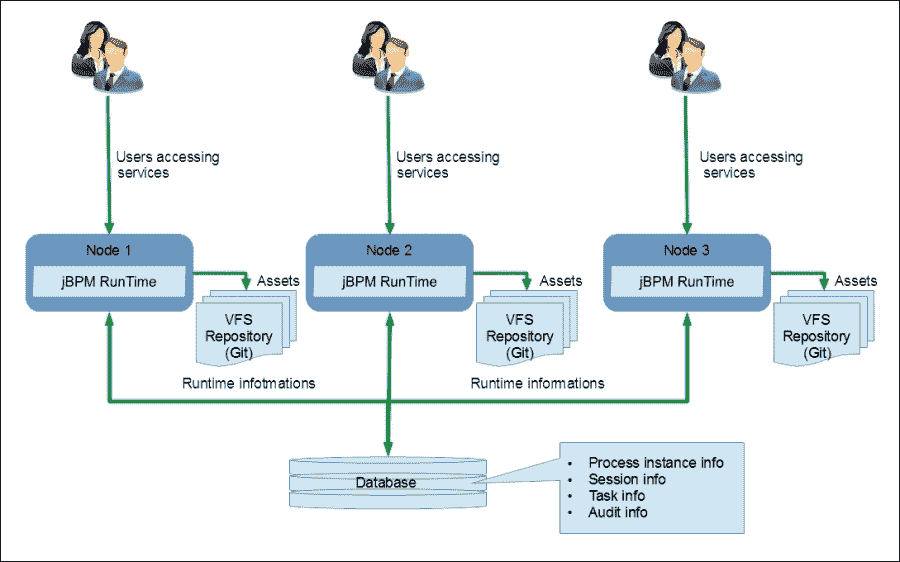
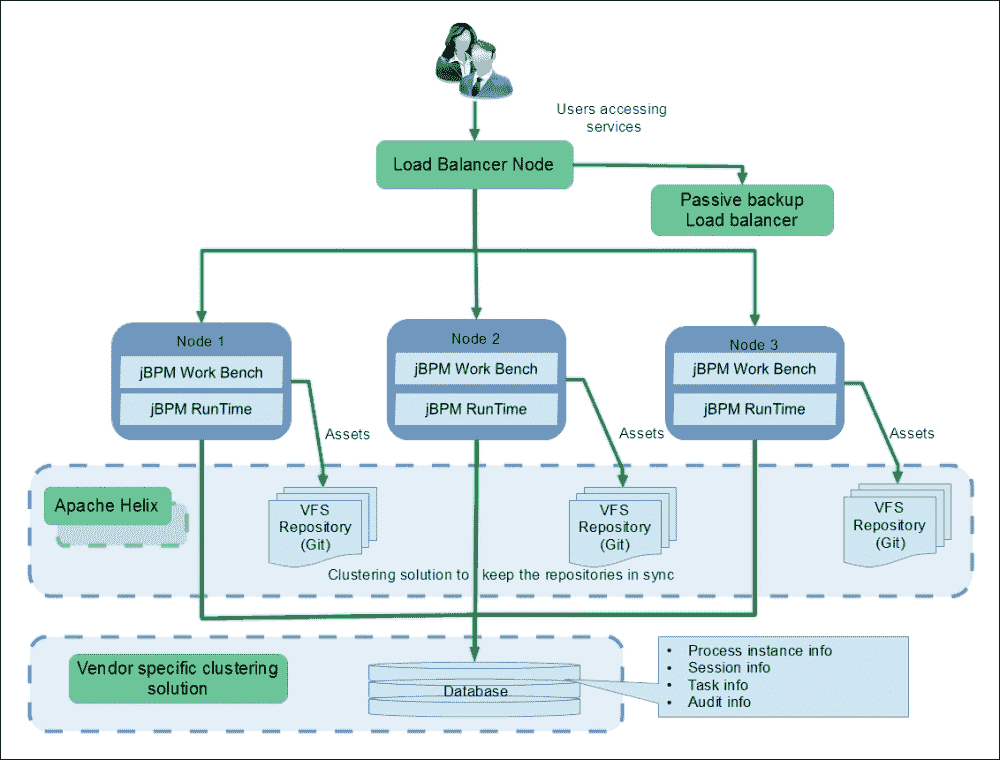
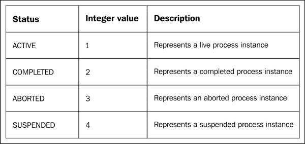

# 第九章。生产中的 jBPM

在前面的章节中，我们探讨了 jBPM 的各种功能方面，也看到了我们如何扩展和定制 jBPM 以添加更多功能。现在，是生产时间了，应用被其利益相关者看待的角度发生了变化。

现在的重要问题不是功能特性，而是非功能特性。人们考虑的是应用程序的稳定性和弹性，而不是它提供的灵活性。人们思考的是应用程序如何快速且成本效益地进行扩展，以便为更多用户提供服务，以及服务的延迟如何不那么关键。

应用程序的韧性受到考验。jBPM 是现成的生产软件，在本章中，我们将讨论 jBPM 中可用的各种设施，使其符合生产软件的要求。本章的结构基于在生产中必须注意的系统的主要品质。

我们将讨论以下主题：

+   如何进行扩展

+   如何使应用程序安全

+   如何满足可用性要求

+   如何将新的更改纳入系统

+   系统如何处理运行时错误

# 可扩展性

可扩展性可以描述为系统以受控和成本效益的方式处理不断增长的服务提供量的能力。在 BPM 系统中，有两个主要的使用场景可能会引发扩展的需求。

+   扩展建模设施，即工作台

+   调整流程运行时间，这是应用程序的最终用户与之交互的部分

扩展应用程序通常涉及两种方法：

+   **垂直扩展**：这是通过向提供服务的服务器添加资源来实现的

+   **水平扩展**：这是通过添加多个服务器来提供相同的服务来实现的

垂直扩展在实现上涉及较少的复杂性，因为它要求提高硬件（通常是）并配置应用程序以使用这些资源。然而，垂直扩展通常受到在构建资源时成本和技术限制的限制。在 jBPM 的背景下，可以添加的资源包括内存、处理器核心和辅助存储机制。jBPM 不提供现成的功能来明确地适应这些资源改进，但通过利用 jBPM 使用的底层平台，如 jBPM 部署的应用服务器和运行应用服务器的 JVM，可以带来吞吐量和性能的提升。

在本书的范围内，显然横向扩展需要更好的方法，接下来的几节将纯粹专注于 jBPM 功能的横向扩展。

## 扩展业务流程建模设施

扩展建模工具意味着增加可以同时执行建模的用户数量。用户可以选择用于建模的 Web 工具或 Eclipse 工具，并且可能存在建模用户创建单个应用程序或多个应用程序的场景。

考虑到先前的因素和约束，提高建模工作台服务吞吐量的最明显方法就是增加提供服务的单元数量。因此，我们增加了服务器，并跳转到面对集群的典型问题。每个服务器都有一个独立的资产库，如果用户协作创建相同的应用程序，我们需要确保库中的资产始终同步。

jBPM 作为资产库提供的开箱即用功能是基于 Git 的**虚拟文件系统**（**VFS**），为了保持文件系统同步，jBPM 建议使用 Apache Helix，一个集群管理框架。

以下图表展示了此场景中的部署架构：


Apache Helix 充当集群管理解决方案，将所有服务器注册到集群中并启用仓库的同步。

Helix 内部使用 Apache ZooKeeper 来管理系统状态并管理节点之间的通知。

VFS 集群配置的详细信息已在 jBPM 用户指南中明确提供；请参阅它以获取配置详情。

Apache Helix 提供了一套功能，使我们能够开发一个容错性强、可扩展的分布式系统。更多详情请参阅[`helix.apache.org/Architecture.html`](http://helix.apache.org/Architecture.html)。

## 扩展流程运行时

当我们谈论扩展任何软件应用时，它涉及到增加系统容量以服务越来越多的用户交互。在基于 BPM 的应用中，随着用户交互的增加，业务流程的复杂性和内容也会增加，从而增加了系统的容量。

### 因素和考虑事项

以下部分强调了确定系统部署架构所涉及的因素，并讨论了 jBPM 架构在满足这些日益增长需求时所做的考虑。

#### 进程数量/进程实例

是的，这是一个明显的因素：作为应用程序一部分的流程定义数量以及从这些流程定义创建的流程实例数量都会使用系统容量。流程定义存储在资产库中，我们已经在*扩展业务流程建模设施*部分讨论了这一点，但流程定义的增加会导致系统需要管理的流程实例数量增加。反之亦然，即相对较少的流程定义但大量的流程实例。

流程实例携带流程执行的状态，默认情况下在内存中。然而，在运行时状态可用性至关重要的实际场景中，这并不是一个选项，因此 jBPM 提供了将流程实例持久化到数据库的机制。在我们讨论的上下文中，我们必须注意，随着流程实例数量的增加，我们必须做以下事情：

+   增加数据库的容量

+   增加内存的容量

以下图显示了示意图部署架构，其中包含多个具有复制 VFS 存储库用于资产存储的 jBPM 运行时实例以及一个集中式数据库用于存储运行时信息：



#### 用户交互的数量

用户与流程运行时的交互包括以下内容：

+   与流程引擎的交互以启动流程（创建流程实例）或向已启动的流程实例发送信号

+   与任务服务交互以处理人工任务的生命周期方法

### 注意

另一种可能性是与特定领域的异步工作项的交互，这需要自己的容量规划。

通过专用的 KieSession API 与流程引擎交互，并带有特定的约束；即只能通过创建流程实例的 Kie 会话与流程实例进行交互。每次交互都需要创建它的 Kie 会话实例，jBPM 提供了多种策略来处理流程交互的扩展。jBPM 允许你在创建运行时管理器时选择策略，该管理器随后用于访问运行时引擎并创建用于交互的会话。

#### 运行时管理器的种类

+   **单例策略**：

    通过选择此策略，我们选择维护单个运行时实例和单个 Kie 会话以处理所有交互。这是最简单的策略，并且对于低负载和中负载最有利。

    单例策略可以通过以下方式编程选择：

    ```java
    RuntimeManagerFactory.Factory.get().newSingletonRuntimeManager(runtimeEnvironment);
    ```

    此外，如果您使用 jBPM 控制台（KIE 工作台），您可以配置`<runtime-strategy>`部署描述符标签为`SINGLETON`。以下是一个示例部署描述符：

    ```java
    <deployment-descriptor xsi:schemaLocation="http://www.jboss.org/jbpm deployment-descriptor.xsd" >
      <persistence-unit>org.jbpm.domain</persistence-unit>
      <audit-persistence-unit>org.jbpm.domain</audit-persistence-unit>
      <audit-mode>JPA</audit-mode>
      <persistence-mode>JPA</persistence-mode>
      <runtime-strategy>SINGLETON</runtime-strategy>
      <marshalling-strategies/>
      <event-listeners/>
      <task-event-listeners/>
      <globals/>
      <work-item-handlers/>
      <environment-entries/>
      <configurations/>
      <required-roles/>
    </deployment-descriptor>
    ```

    `SINGLETON`是 jBPM 控制台中的默认策略。

    ### 注意

    我们可以通过在服务器启动时使用 Java 选项来覆盖默认的部署描述符，如下所示：`Dorg.kie.deployment.desc.location=file:/application/configuration/deployment-descriptor.xml`。

+   **按请求策略**：

    提供了一个新的运行时管理器实例，并为请求范围创建了会话并维护。

    这种策略是无状态的，非常适合水平扩展 jBPM 流程运行时实例，但流程中的功能仅限于无状态事实，不允许除了启动流程之外的用户交互。

    我们可以在创建运行时期间通过以下代码程序化地选择按请求策略：

    ```java
    RuntimeManagerFactory.Factory.get().newPerRequestRuntimeManager(runtimeEnvironment);
    ```

    此外，对于 jBPM 控制台，部署描述符可以定制如下：

    ```java
    <?xml version="1.0" encoding="UTF-8" standalone="yes"?>
    <deployment-descriptor xsi:schemaLocation="http://www.jboss.org/jbpm deployment-descriptor.xsd" >
      <runtime-strategy>PER_REQUEST</runtime-strategy>
    </deployment-descriptor>
    ```

+   **按流程实例策略**：

    这是考虑到系统可扩展性和开销之间的权衡而采取的最先进策略。正如其名所示，ksession 会粘附在流程实例上，只要流程实例存在，ksession 就会存在。它没有 singleton 策略中的可扩展性约束，尽管它有较高的开销，但它没有开销限制，并且不像按请求策略那样可扩展。因此，按流程实例策略位于上述两种策略的中间，并且在大多数使用 jBPM 的情况下使用。

    我们可以在创建运行时期间通过以下代码行程序化地选择按流程实例策略：

    ```java
    RuntimeManagerFactory.Factory.get().newPerProcessInstanceRuntimeManager(runtimeEnvironment);
    ```

    此外，对于 jBPM 控制台，部署描述符被定制如下：

    ```java
    <?xml version="1.0" encoding="UTF-8" standalone="yes"?>
    <deployment-descriptor xsi:schemaLocation="http://www.jboss.org/jbpm deployment-descriptor.xsd" >
      <runtime-strategy>PER_PROCESS_INSTANCE</runtime-strategy>
    </deployment-descriptor>
    ```

#### 任务服务

任务服务是管理人工任务服务的专用组件。可以通过人工任务与应用程序进行交互。jBPM 提供了一个基于 WS-Human Task 规范的默认人工任务服务实现。任务服务客户端轻量级，与我们所选择的运行时管理器策略相匹配，并且所有客户端共享相同的数据库；因此，人工任务的扩展与为运行时管理器选择的策略以及数据库存储容量的增加保持同步。

#### 计时器事件数量

计时器事件的功能是通过调度服务实现的。jBPM 提供了多个调度服务的实现。基于 Quartz 调度器的实现适合生产环境。Quartz 调度器支持集群模式，提供高可用性和可扩展性，它通过在节点之间的共享数据库中维护它所处理调度（或作业）的数据或状态来实现。

### 注意

Quartz 是一个开源的作业调度库，可以集成到 Java 应用程序中。Quartz 可以用于创建计划任务，并提供对 JTA 事务和集群的支持。有关更多详细信息，请参阅 [`quartz-scheduler.org/`](http://quartz-scheduler.org/)。

可以通过提供 `quartz` 定义文件的绝对路径来启用 Quartz 调度程序，相对于 `org.quartz.properties` 系统属性。

以下提供了一个示例 `quartz` 定义文件，该文件配置用于与 PostgreSQL 数据库一起使用。

```java
#============================================================================
# Configure Main Scheduler Properties
#============================================================================

org.quartz.scheduler.instanceName = jBPMClusteredScheduler
org.quartz.scheduler.instanceId = AUTO

#============================================================================
# Configure ThreadPool
#============================================================================

org.quartz.threadPool.class = org.quartz.simpl.SimpleThreadPool
org.quartz.threadPool.threadCount = 5
org.quartz.threadPool.threadPriority = 5

#============================================================================
# Configure JobStore
#============================================================================

org.quartz.jobStore.misfireThreshold = 60000

org.quartz.jobStore.class=org.quartz.impl.jdbcjobstore.JobStoreCMT
org.quartz.jobStore.driverDelegateClass=org.quartz.impl.jdbcjobstore.PostgreSQLDelegate
org.quartz.jobStore.useProperties=false
org.quartz.jobStore.dataSource=managedDS
org.quartz.jobStore.nonManagedTXDataSource=notManagedDS
org.quartz.jobStore.tablePrefix=QRTZ_
org.quartz.jobStore.isClustered=true
org.quartz.jobStore.clusterCheckinInterval = 20000
#============================================================================
# Configure Datasources
#============================================================================
org.quartz.dataSource.managedDS.jndiURL=jboss/datasources/psjbpmDS
org.quartz.dataSource.notManagedDS.jndiURL=jboss/datasources/quartzNotManagedDS
```

### 注意

当使用 Quartz 调度程序时，作为先决条件，我们必须创建 Quartz 用于持久化其作业数据的数据库模式。与 Quartz 分发版一起提供的数据库脚本（jBPM 使用 Quartz 1.8.5。DB 脚本）通常位于 `QUARTZ_HOME/docs/dbTables`。

可以通过在运行环境中对 `GlobalSchedulerService` 进行配置来程序化地配置调度程序服务：

```java
RuntimeEnvironmentBuilder.Factory.get()
  .newDefaultBuilder().entityManagerFactory(emf)
  .knowledgeBase(kbase).schedulerService(globalSchedulerService);
```

在这里，`globalSchedulerService` 对象是 `org.jbpm.process.core.timer.GlobalSchedulerService` 的实现，而 Quartz 实现是 `org.jbpm.process.core.timer.impl.QuartzSchedulerService`。

# 可用性

应用程序或系统的可用性可以被视为它提供服务的总时间与它预期提供服务的总时间的比率。系统可用性受多种因素的影响，从硬件/软件故障导致的系统故障到维护和升级的已知停机时间。

通过使用故障转移机制，在应用程序中实现高可用性，该机制使得系统在发生故障后能够恢复到其服务提供状态。一个更优化的系统会考虑备份机制，在故障情况下可以立即切换，从而提高可用性。可以通过滚动升级进行计划维护以确保高可用性。这些解决方案通常以部署架构的形式表示，根据软件解决方案而变化，并考虑非功能性需求中的权衡。

下图展示了可以应用于 jBPM 工作台和运行时的示例部署架构，该架构可以满足高可用性和高吞吐量场景。该架构通过拥有所有数据的持久化、分布式存储和具有被动备份的负载均衡器来考虑故障转移机制，以确保在部分故障（节点故障）时切换节点。jBPM 不提供此部署架构中所需的所有组件，但必须获取第三方软件并进行集成。我们将在后续章节中讨论这些组件的适用性。



## 对工作台适用性

考虑工作空间的可用性时，我们需要考虑以下两点：

+   基于 Web 的用户界面建模的可用性

+   在建模期间创建资产的存储库的可用性

提供基于网页的用户界面的服务托管在应用服务器上，其可用性指的是应用服务器提供的可用性配置。通常，这些配置是以基于负载均衡器的故障转移机制的形式存在，当提供服务的节点失败时，负载均衡器会将流量切换到另一个节点，并且故障转移机制确保节点将在一定时间范围内恢复，以提供完整的潜在吞吐量。

资产存储在虚拟文件系统中，默认情况下，它是一个基于 Git 的仓库。正如我们在*扩展业务流程建模设施*部分所讨论的，基于 Git 的仓库可以集群化，并且资产可以同步。因此，即使一个节点失败，最新的资产也将从其他节点恢复。

## 对流程持续改进的适用性

从使用建模设施开发的应用程序的角度来看，应用程序流程可以持续改进。流程的新版本可以通过两种方式部署到 jBPM 运行时。

+   流程的新版本可以作为新的流程定义部署，旧版本可以通过从知识库中移除它来退役，这样就不会部署这个流程版本的新实例。然而，这种方法绝对不能处理现有的流程实例。它们应该被允许继续使用早期版本，或者应该被终止并重新处理。选择方法的决策应根据这些流程定义所处理的企业场景逐案处理。

+   使用 jBPM 提供的流程迁移设施。然而，该设施仅限于非冲突的流程更改。

因此，流程升级不是一个非常顺利的过程，需要谨慎处理。此外，为了实现可用性，升级必须在低流量期间进行，或者我们必须进行滚动升级。

## 对流程运行时的适用性

流程运行时的可用性包括与流程实例交互的服务，如流程实例生命周期和用户交互。类似于我们关于工作台设施的讨论，有两件事情我们需要考虑：

+   流程实例交互的可用性

+   流程实例数据的可用性

对于流程实例交互的可用性，我们需要有一个负载均衡机制，在节点失败时可以将一个节点的流量切换到另一个节点。此外，我们需要能够将流程实例数据持久化到非易失性存储中以便故障转移。正如在*扩展流程运行时*部分所讨论的，jBPM 支持在关系数据库中持久化运行时信息。

大多数流行的关系型数据库都内置了对集群存储的支持，以确保可用性。这可以用来确保持久化流程实例数据可以具有高度可用性。

# 安全

在此上下文中，安全或应用程序安全是指保护 jBPM 提供的服务和数据免受未经授权的访问（身份验证），同时确保用户可以访问授权给他们的服务和数据集（授权）。

在 BPM 系统中，我们必须考虑的另一个重要方面是为所有用户交互提供不可否认性。jBPM 通过提供所有运行时数据更改的审计日志功能来支持这一点。

### 注意

不可否认性确保用户不能否认在系统中执行的动作或操作。

## 保护应用程序资产访问

jBPM 通常部署在应用程序服务器中，使用 JEE 兼容的标准，即**Java 认证和授权服务**（**JAAS**），来提供应用程序安全。应用程序服务器提供这项服务以及一个注册用户的机制。

用来保存应用程序资产的默认资产存储库是 Git 存储库。此外，Git 存储库确保由它处理的存储库更改（无论是文件的添加还是文件更改）仅允许授权人员执行。

对通过工作台登录的用户进行身份验证，以及通过 Eclipse 对存储库进行更改的用户必须使用 SSH。

工作台用户管理支持以下角色：

+   **管理员**：具有完全访问权限的角色。扮演管理员角色的用户管理 BPMS。

+   **分析师**：可以进行建模并关联业务分析师以创建流程、规则、实体、表单等的角色。

+   **开发者**：承担从业务分析师那里传递流程工件的角色，并使用后端服务和处理器开发完全可执行的代码。

+   **业务用户**：通过使用任务管理功能执行操作管理的角色。被分配此角色的人是应用程序的最终用户，他们利用应用程序提供的功能。

+   **仅查看用户**：可以查看流程及其性能统计信息的角色，是统计仪表板的初级用户。

以安装在 JBoss 应用程序服务器（现更名为 WildFly）中的 jBPM 为例，它提供了`add-user`等实用工具来添加用户并分配他们的角色。

## 保护流程运行时

下面的子节详细说明了保护流程运行时的规定，即保护特定于操作管理的操作。

### 专门针对人工任务的安全

工作台仅允许授权人员访问上一节中讨论的流程运行时功能。除了流程管理访问之外，在流程定义的每个部分中，每个人工任务都分配给一个用户或一个角色（组）。

在使用包括流程模型器在内的整个 jBPM 软件套件的环境中，我们可以通过使用应用程序服务器的功能添加更多角色或组到系统中来驱动此操作。在嵌入式模式下，jBPM 提供了一个实现特定于应用程序的访问安全机制的扩展点。

可以通过实现`org.kie.api.task.UserGroupCallback`接口并嵌入验证用户执行任务权限的应用特定逻辑来完成此扩展。为了实现此集成，我们需要实现以下特定方法：

```java
boolean existsUser(String userId)
```

此接口方法用于确定附加到任务的用户是否有效。为了与我们的应用程序集成，我们可以通过使用用于身份验证的逻辑或服务来实现此方法。

```java
boolean existsGroup(String groupId)
```

此接口方法用于解决附加到任务的组或角色是否有效。

```java
List<String> getGroupsForUser(String userId,List<String> groupIds, List<String> allExistingGroupIds)
```

这用于解决对用户有效的组（或角色）。

可以通过使用`HumanTaskService`工厂将`userGroupCallback`接口实现附加到流程运行时。执行此操作的代码片段如下：

```java
UserGroupCallBack userGroupCallBack= new CustomUserGroupCallback();
TaskService taskService = HumanTaskServiceFactory.newTaskServiceConfigurator().entityManagerFactory(emf).userGroupCallback(userGroupCallBack).getTaskService();
```

此机制的优势在于，我们不受 jBPM 提供的用户管理功能的限制，可以开发自己的。此外，jBPM 提供了一组预构建的`userGroupCallBack`函数，可以在生产中使用：

+   `org.jbpm.services.task.identity.LDAPUserGroupCallbackImpl`，正如其名称所示，可以用于配置与您的 LDAP 服务。

+   `org.jbpm.services.task.identity.JAASUserGroupCallbackImpl`，正如其名称所示，可以用于配置与您的 JAAS 标准特定用户认证机制，这些机制在应用程序服务器环境中广泛使用。jBPM 为 Oracle WebLogic、IBM WebSphere 和 JBoss 应用程序服务器提供了适配器。

### 注意

LDAP（代表轻量级目录访问协议）是一个开放标准，在小型和中型组织中广泛用于在服务和系统之间共享用户信息。

### 审计日志

在使用 BPM 的业务领域，过程定义了业务本身。使用这些过程，组织中的多个系统和人员相互交互。在任何组织中，关于由人或系统执行的动作的争议都很常见。从应用安全的角度来看，这些场景通过不可抵赖机制来解决，这些机制确保没有任何用户或系统能够否认这些动作。审计日志是广泛使用的不可抵赖机制之一，其中系统上执行的每个动作都被存储，并随后用于解决争议或分析争议的根本原因。另一个优点是，我们可以使用这些数据来分析和找出业务流程的性能和质量指标。

审计日志帮助我们检索有关过程实例发生情况、发生时间以及谁触发了它的信息。

jBPM 提供了一个通用的审计日志机制，全面覆盖业务流程的生命周期。审计日志以三个数据模型存储：

+   **过程实例日志**：存储与过程实例生命周期交互对应的数据，例如，过程实例的启动、停止或终止过程实例。使用实例日志的属性，我们可以回溯过程定义、过程版本、过程实例、用户身份等信息，这些信息与生命周期变更相关。

+   **节点实例日志**：存储与过程中节点生命周期对应的数据。节点通常指业务过程中的活动。这些数据的属性帮助我们回溯到过程定义、过程版本、过程实例、用户身份、时间以及发生此事件的工作项。

+   **变量实例日志**：存储与过程实例中过程变量变化对应的数据。

以下表格列出了审计日志数据模型中可用的数据：

| 过程实例日志 |
| --- |
| **字段** | **类型** | **描述** |
| ID | BIGINT(20) | 日志表的身份标识 |
| 持续时间 | BIGINT(20) | 事件发生时过程实例的生命周期 |
| 结束日期 | DATETIME | 表示过程实例结束的时间，仅适用于过程实例停止或终止的情况 |
| 外部 ID | VARCHAR(255) | 为从域数据中识别过程实例提供的标识符 |
| 用户身份 | VARCHAR(255) | 启动过程实例的用户身份。 |
| 结果 | VARCHAR(255) | 过程信息的结果，主要用于存储信息，如错误代码，以防因错误事件导致过程停止 |
| 父过程实例 ID | BIGINT(20) | 父过程实例的标识符 |
| 过程 ID | VARCHAR(255) | 过程定义的标识符 |
| 流程实例 ID | BIGINT(20) | 流程实例的唯一标识符 |
| 流程名称 | VARCHAR(255) | 流程定义的名称 |
| 流程版本 | VARCHAR(255) | 流程定义的版本 |
| 开始日期 | DATETIME | 流程实例启动的日期 |
| 状态 | INT(11) | 前表提供了该字段的可能值及其含义 |
| **节点实例日志** |
| **字段** | **类型** | **描述** |
| ID | BIGINT(20) | 唯一标识符 |
| 连接 | VARCHAR(255) | 导致此节点实例的序列流的标识符 |
| 日志日期 | DATETIME | 触发节点的日期 |
| 外部 ID | VARCHAR(255) | 与流程实例相关联的外部标识符 |
| 节点实例 ID | VARCHAR(255) | 节点实例的标识符 |
| 节点名称 | VARCHAR(255) | 来自流程定义的节点名称 |
| 节点类型 | BIGINT(20) | 节点或活动的类型，例如，服务任务 |
| 流程 ID | VARCHAR(255) | 该节点所属的流程定义的标识符 |
| 流程实例 ID | BIGINT(20) | 该节点所属的流程实例的标识符 |
| 类型 | INT(11) | 指示日志是在进入还是退出时更新 |
| 工作项 ID | BIGINT(20) | 该节点引用的工作项的标识符 |
| **变量实例日志** |
| **字段** | **类型** | **描述** |
| ID | BIGINT(20) | 唯一标识符 |
| 日志日期 | DATETIME | 该变量变化发生的时间 |
| 外部 ID | VARCHAR(255) | 与流程实例相关联的外部标识符 |
| 旧值 | VARCHAR(255) | 变量的前一个值 |
| 流程 ID | VARCHAR(255) | 定义中的流程 ID |
| 流程实例 ID | BIGINT(20) | 流程实例标识符 |
| 值 | VARCHAR(255) | 变量的当前值 |
| 变量 ID | VARCHAR(255) | 标识符，变量名 |
| 变量实例 ID | VARCHAR(255) | 在复合节点级别定义变量时的附加信息，用于区分顶层和嵌套层变量 |

除了用于安全之外，这些日志信息可以用来分析流程和组织的各种性能指标。仪表板构建者可以用来从这些日志中构建报告。

# 可维护性

系统的可维护性可以被视为一个衡量指标，用来确定修复操作可以多么容易地执行。当我们说到修复时，我们需要讨论以下内容：

+   在部署系统中修复问题的容易程度（如果有）

+   系统的改进以适应不断变化的企业需求

+   应对部署环境中的基础设施变化

在我们考虑的系统中，业务逻辑的变化更为频繁。因此，从可维护性的角度来看，主要因素之一是提高流程可执行性的容易程度。这是 jBPM 的一项优势；正如我们在前面的章节中已经讨论过的，jBPM 提供了一个完整的建模、模拟和部署工具环境。从这个角度来看，参与者，即业务分析师和开发者，可以使用这些工具来建模、模拟、测试和部署流程变更。

另一个方面是 jBPM 在生产环境中部署和维护的基础设施或环境。jBPM 支持多种部署架构，如第八章整合 jBPM 与企业架构所述，默认情况下，它侧重于在 JEE 环境中的部署，其中它部署在一个 JEE 应用程序容器内部，持久数据存储在传统的关系型数据库中。

系统的架构基于以下标准：

+   基于 BPMN 的建模

+   基于 BPsim 的模拟

+   基于 WS-HT 的人类任务

+   基于 JPA 的持久性

+   基于 JTA 的事务管理

优势在于 jBPM 可以轻松地适应我们当前的 生产环境，并且随着环境的演变，jBPM 也随之发展，其开发社区在 企业中间件架构中发挥着积极的作用。对标准和系统模块化的遵守确保了我们的客户不会陷入供应商锁定场景，系统的一部分可以轻松替换。

在前面的章节中，我们已经解释了本节所讨论功能的“如何”。

# 容错性

容错性表示在系统发生一个或多个故障时能够以预测方式运行的能力。在基于 Java 的应用程序中，这些故障是通过异常处理机制来管理的。jBPM 也不例外；它使用异常处理方法来实现容错性。

## 流程定义中的异常处理

我们可以使用 BPMN 元素来指定业务流程中发生和处理的机制，如下所示：

+   可以使用错误事件来指定意外情况的发生。与 Java 编程相比，这类似于抛出错误。

+   可以使用补偿来指定当发生错误时应该做什么；这类似于 Java 程序中的 catch 操作结构。

在流程级别使用异常处理的优势在于，异常场景在流程中是可见的，从而使得对这些场景的监控和分析更加容易，从而有助于流程的持续改进。

## 针对特定领域流程的异常处理

当我们定义新的自定义工作项处理程序，这些处理程序在流程中形成自定义、业务特定的活动时，我们可以指定处理异常场景的机制。jBPM 默认提供以下装饰器来处理活动中的异常场景：

+   `SignallingTaskHandlerDecorator`：这个装饰器在活动的生命周期方法中捕获异常，并使用可配置的事件通知流程实例。这些事件可以在流程定义中被捕获，并采取后续行动。这个装饰器可以在将工作项处理程序注册到会话时指定。

    例如：

    ```java
    String eventType = "Mail-Service-failed";
    SignallingTaskHandlerDecorator signallingTaskWrapper = new SignallingTaskHandlerDecorator
    (MailServiceHandler.class, eventType); signallingTaskWrapper.setWorkItemExceptionParameterName
    (ExceptionService.exceptionParameterName);
    ksession.getWorkItemManager().registerWorkItemHandler
    ("Mail Task", signallingTaskWrapper);
    ```

    在这个示例中，我们通过使用`MailServiceHandler.class`注册一个发送邮件的处理程序，并在异常场景下，将`"Mail-Service-Failed"`事件通知给流程实例。

+   `LoggingTaskHandlerDcorator`：这个装饰器在日志机制活动的生命周期方法中捕获异常。这个特性可以在不那么关键的区域使用，其中流程异常在日志中只是一个警告。

# 摘要

在本章中，我们讨论了 jBPM 的非功能性特征，这些特征对于基于 BPM 构建生产就绪的应用至关重要。此外，我们还讨论了使用 jBPM 满足各种需求和配置的示例部署架构，以及可用于在 jBPM 系统中包含某些特性的定制选项。
