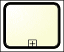
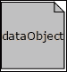
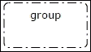
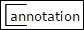

# 附录 B. jBPM BPMN 构造参考

本附录是 jBPM 支持的 BPMN 构造的快速参考。对于完整的 BPMN 2.0 指南，请参阅对象管理组提供的规范和指南，网址为[`www.bpmn.org`](http://www.bpmn.org)。您还可以参考本书的第五章，*BPMN 构造*，以深入了解 jBPM 构造的示例驱动讨论。为了便于索引和搜索，本参考将构造描述为在 KIE 流程定义编辑器中显示和分组的。

# 任务

一个任务代表需要执行的动作。

## 用户

+   **BPMN 元素**：`<bpmn2:userTask>`.

+   **描述**：需要与 UI 或程序化 API 进行人工交互的任务。

+   **配置**：使用`Actors`或`Groups`将任务分配给用户。使用`Assignments`、`DataInputSet`和`DataOutputSet`属性将任务参数映射到封装的流程实例。

## 发送

+   **BPMN 元素**：`<bpmn2:sendTask>`

+   **描述**：用于发送消息操作的通用任务

+   **配置**：`MessageRef`属性是`message`元素（`bpmn2:message`）ID 属性的键，必须在流程范围内定义

### 注意

它需要一个自定义的 WorkItemHandler，并使用*send*键进行注册。

## 接收

+   **BPMN 元素**：`<bpmn2:receiveTask>`

+   **描述**：用于接收消息操作的通用任务

+   **配置**：`MessageRef`属性是`message`元素（`bpmn2:message`）ID 属性的键，必须在流程范围内定义

### 注意

它需要一个自定义的 WorkItemHandler，并使用*receive*键进行注册。

## 手动

+   **BPMN 元素**：`<bpmn2:manualTask>`

+   **描述**：其目的是记录必须手动执行的动作，并且可以被引擎忽略的任务

## 服务

+   **BPMN 元素**：`<bpmn2:serviceTask>`.

+   **描述**：支持 Java 或 SOAP WebService 调用的服务任务。

+   **配置**：使用`ServiceImplementation`、`ServiceInterface`和`ServiceOperation`属性配置可调用的服务/类。对于 Web 服务实现，需要在全局范围（流程导入）中导入 WSDL URL。

## 业务规则

+   **BPMN 元素**：`<bpmn2:businessRuleTask>`

+   **描述**：执行 Drool 规则的任务

+   **配置**：使用`Ruleflow Group`属性选择定义所需执行规则集的规则组名称

## 脚本

+   **BPMN 元素**：`<bpmn2:scriptTask>`

+   **描述**：执行 Java 或 MVEL 脚本的任务

+   **配置**：使用`On Entry Actions`、`On Exit Actions`和`Script language`属性

## 无

+   **BPMN 元素**: `<bpmn2:task>`

+   **描述**: 临时任务

+   **配置**: 你必须使用 *task* 键注册一个 WorkItemHandler

# 子流程

子流程表示一组协同执行流程一部分的任务。

## 可重用

+   **BPMN 元素**: `<bpmn2:callActivity>`.

+   **描述**: 允许你调用定义在当前流程之外的流程。

+   **配置**: 使用 `CalledElement`、`Independent` 和 `WaitForCompletion` 来配置要调用的现有流程定义及其调用方式：作为调用过程的一部分或作为一个新流程实例（`Independent`），以同步或异步方式（`WaitForCompletion`）。使用 `Assignments`、`DataInputSet` 和 `DataOutputSet` 将变量从/到调用过程映射。

## 多实例

+   **BPMN 元素**: `<bpmn2:subProcess>`

+   **描述**: 允许你循环（创建一组元素的多个实例）

+   **配置**: 使用 `CollectionExpression`、`Variable Definitions` 和 `Variable Name` 来配置循环并将变量分配给循环内部传递

## 临时

+   **BPMN 元素**: `<bpmn2:adHocSubProcess>`

+   **描述**: 允许你定义一个无结构的子流程定义

+   **配置**: `AdHoc ordering` 属性告诉引擎以并行或顺序方式执行多实例子流程

## 嵌入

+   **BPMN 元素**: `<bpmn2:subProcess>`

+   **描述**: 允许你定义一个嵌入式的流程定义（不可从其他流程定义中重用）

+   **配置**: `变量定义` 允许你在子流程范围内配置变量

## 事件

+   **BPMN 元素**: `<bpmn2:subProcess>`

+   **描述**: 允许你定义一个可以由特定事件（例如，`Signal`）触发并在异步方式下执行的嵌入子流程

+   **配置**: 无特定配置要求

# 开始事件

+   **BPMN 元素**: `<bpmn2:startEvent>` 以及定义事件类型的子元素，如图所示：

+   **描述**: 作为流程触发器，只能是一个捕获事件。

支持的开始事件如下（参见前述图像，从左到右）：

+   **无**

+   **消息**: `<bpmn2:messageEventDefinition>`

+   **计时器**: `<bpmn2:timerEventDefinition>`

+   **升级**: `<bpmn2:escalationEventDefinition>`

+   **条件**: `<bpmn2:conditionalEventDefinition>`

+   **错误**: `<bpmn2:errorEventDefinition>`

+   **补偿**: `<bpmn2:compensationEventDefinition>`

+   **信号**: `<bpmn2:signalEventDefinition>`

# 结束事件

+   **BPMN 元素**: `<bpmn2:endEvent>` 以及定义事件类型的子元素，如图所示：

+   **描述**: 作为流程触发器，只能是一个抛出事件。

支持的结束事件如下（参见前面的图像，从左到右）：

+   **无**

+   **消息**

+   **升级**

+   **错误**

+   **取消**：`<bpmn2:cancelEventDefinition>`

+   **补偿**

+   **信号**

+   **终止**：`<bpmn2:terminateEventDefinition>`

# 捕获中间事件

+   **BPMN 元素**：`<bpmn2:intermediateCatchEvent>` 和一个定义事件类型的子元素（参见前一个事件列表）

+   **描述**：捕获匹配抛出事件的触发事件

支持的事件如下（参见前面的图像，从左到右）：

+   **消息**：可以是边界事件

+   **计时器**：可以是边界事件

+   **升级**：可以是边界事件

+   **条件**：可以是边界事件

+   **错误**：可以是边界事件

+   **补偿**：可以是边界事件

+   **信号**：可以是边界事件

# 抛出中间事件

+   **BPMN 元素**：`<bpmn2:intermediateThrowEvent>`

+   **描述**：抛出事件触发的事件

支持的事件如下（参见前面的图像，从左到右）：

+   消息

+   升级

+   信号

# 网关

网关控制流程的流向。

## 基于数据的排他（XOR）

+   **BPMN 元素**：`<bpmn2:exclusiveGateway>`

+   **描述**：用于选择替代序列流

## 基于事件的网关

+   **BPMN 元素**：`<bpmn2:eventBasedGateway>`

+   **描述**：用于在某个事件发生时触发序列流

## 并行

+   **BPMN 元素**：`<bpmn2:parallelGateway>`

+   **描述**：用于创建所有路径都评估的并行序列流

## 包容

+   **BPMN 元素**：`<bpmn2:inclusiveGateway>`

+   **描述**：用于创建所有路径都评估的替代流

# 数据对象

+   **BPMN 元素**：`<bpmn2:dataObject>`

+   **描述**：数据对象向读者显示在活动中需要或产生的数据

# 游泳道

游泳道表示根据流程任务对流程参与者或角色的分组。

## 通道

+   **BPMN 元素**：`<bpmn2:lane>`

+   **描述**：用于根据用户或用户组组织组内的活动

# 艺术品

艺术品是用于文档目的的有用元素。

## 组

+   **BPMN 元素**：`<bpmn2:group>`

+   **描述**：组将不同的活动视觉上排列在一起；它不影响图表中的流向

## 注释

+   **BPMN 元素**：`<bpmn2:annotation>`

+   **描述**：注释用于向图表的读者提供可理解的注释/描述
