# 介绍 WebDriver 和 Web 元素

在本章中，我们将简要介绍 Selenium，其各种组件，例如 Appium，然后继续探讨网页的基本组件，包括各种类型的 Web 元素。我们将学习不同的方法在网页上定位 Web 元素并对它们执行各种用户操作。本章将涵盖以下主题：

+   Selenium 测试工具的各个组件

+   使用 Maven 和 TestNG 在 Eclipse 中设置项目

+   在网页上定位 Web 元素

+   可以在 Web 元素上执行的操作

Selenium 是一套广泛使用的工具，用于自动化浏览器。它主要用于测试应用程序，但其用途不仅限于测试。它还可以用于执行屏幕抓取和在浏览器窗口中自动化重复性任务。Selenium 支持所有主要浏览器的自动化，包括 Google Chrome、Mozilla Firefox、Microsoft Internet Explorer 和 Edge、Apple Safari 和 Opera。Selenium 3.0 现在是 W3C 标准的一部分，并得到主要浏览器供应商的支持。

# Selenium 测试工具

Selenium 3.0 提供了三个重要的工具：Selenium WebDriver、Selenium 服务器和 Selenium IDE。每个工具都提供创建、调试和运行在支持的浏览器和操作系统上的测试的功能。让我们详细探讨每个工具。

# Selenium WebDriver

Selenium WebDriver 是 Selenium RC（远程控制）的继任者，已被官方弃用。Selenium WebDriver 使用 JSON-Wire 协议（也称为客户端 API）接受命令，并将它们发送到由特定驱动程序类（如 ChromeDriver、FirefoxDriver 或 IEDriver）启动的浏览器。这是通过特定于浏览器的浏览器驱动程序实现的。它按照以下顺序工作：

1.  驱动程序监听来自 Selenium 的命令

1.  它将这些命令转换为浏览器的原生 API

1.  驱动程序接收原生命令的结果，并将结果发送回 Selenium：

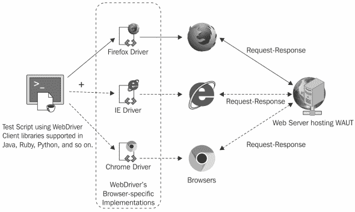

我们可以使用 Selenium WebDriver 执行以下操作：

+   创建健壮的基于浏览器的回归自动化

+   在许多浏览器和平台上缩放和分发脚本

+   使用您喜欢的编程语言创建脚本

Selenium WebDriver 提供了一套特定于语言的绑定（客户端库），用于驱动浏览器。WebDriver 附带了一组更好的 API，通过其实现类似于面向对象编程，满足了大多数开发者的期望。WebDriver 正在一段时间内积极开发，你可以看到许多与 Web 以及移动应用程序的先进交互。

Selenium 客户端 API 是一种特定于语言的 Selenium 库，它为 Java、C#、Python、Ruby 和 JavaScript 等编程语言提供了一致的 Selenium API。这些语言绑定允许测试启动 WebDriver 会话并与浏览器或 Selenium 服务器通信。

# Selenium 服务器

Selenium 服务器允许我们在远程机器上运行的浏览器实例上并行运行测试，从而将测试负载分散到多台机器上。我们可以创建一个 Selenium Grid，其中一个服务器作为 Hub 运行，管理节点池。我们可以配置我们的测试以连接到 Hub，然后 Hub 获取一个空闲的节点，该节点与我们需要运行的测试所需的浏览器相匹配。Hub 有一个节点列表，提供对浏览器实例的访问，并允许测试像负载均衡器一样使用这些实例。Selenium Grid 通过集中管理不同类型的浏览器、它们的版本和操作系统配置，使我们能够在多台机器上并行执行测试。

# Selenium IDE

Selenium IDE 是一个 Firefox 插件，允许用户以 *Selenese* 格式记录、编辑、调试和回放测试，该格式是在 Selenium 核心版本中引入的。它还提供了将测试转换为 Selenium RC 或 Selenium WebDriver 格式的功能。我们可以使用 Selenium IDE 执行以下操作：

+   使用记录和回放创建快速简单的脚本，或在探索性测试中使用它们

+   创建脚本以辅助自动化辅助的探索性测试

+   创建宏以在网页上执行重复性任务

由于 Firefox 55 从 XPI 格式迁移到 WebExtension 格式后，Selenium IDE for Firefox 停止工作，并且目前不再维护。

# Selenium 2 和 Selenium 3 之间的区别

在我们进一步深入探讨 Selenium 3 之前，让我们先了解 Selenium 2 和 Selenium 之间的区别。

# 处理浏览器

由于 Selenium WebDriver 已被接受为 W3C 标准，Selenium 3 对浏览器实现带来了一系列变化。现在，所有主要的浏览器厂商都支持 WebDriver 规范，并提供了必要的功能以及浏览器。例如，微软推出了 EdgeDriver，苹果支持 SafariDriver 实现。我们将在本书的后续部分看到一些这些变化。

# 拥有更好的 API

随着 W3C 标准的 WebDriver 提供了一套更好的 API，这些 API 通过类似于面向对象编程的实现来满足大多数开发者的期望。

# 拥有开发支持和高功能

WebDriver 正在积极开发中，并且现在根据 W3C 规范得到了浏览器厂商的支持；您可以看到许多与网页以及移动应用的高级交互，例如文件处理和触摸 API。

# 使用 Appium 测试移动应用

在 Selenium 3 中引入的一个主要区别是引入了 `Appium` 项目。原本属于 Selenium 2 的移动测试功能现在已移至一个名为 Appium 的独立项目中。

`Appium` 是一个开源的移动自动化框架，用于使用 JSON-Wire 协议和 Selenium WebDriver 在 iOS 和 Android 平台上测试原生、混合和 Web 移动应用程序。`Appium` 替换了 Selenium 2 中的 iPhoneDriver 和 AndroidDriver API，这些 API 用于测试移动 Web 应用程序。

`Appium` 允许使用和扩展现有的 Selenium WebDriver 框架来构建移动测试。因为它使用 Selenium WebDriver 来驱动测试，所以我们可以使用任何编程语言为 Selenium 客户端库创建测试。

# 使用 Java 在 Eclipse 中设置 Maven 和 TestNG 的项目

Selenium WebDriver 是一个帮助您自动化浏览器的库。然而，当用于测试和构建测试框架或用于非测试目的自动化浏览器时，需要更多。您需要一个集成开发环境（**IDE**）或代码编辑器来创建一个新的 Java 项目，并添加 Selenium WebDriver 和其他依赖项以构建测试框架。

在 Java 开发社区中，Eclipse 是一个广泛使用的 IDE，以及 IntelliJ IDEA 和 NetBeans。Eclipse 为 Selenium WebDriver 测试开发提供了一个功能丰富的环境。

除了 Eclipse，Apache Maven 还提供了对测试项目生命周期的管理支持。Maven 用于定义项目结构、依赖项、构建和测试管理。

我们可以使用 Eclipse 和 Maven 从单个窗口构建我们的 Selenium WebDriver 测试框架。使用 Maven 的另一个重要好处是，我们可以通过配置 pom.xml 文件来获取所有 Selenium 库文件及其依赖项。Maven 在构建项目时会自动从存储库下载必要的文件。

在本节中，我们将学习如何配置 Eclipse 和 Maven 以进行 Selenium WebDriver 测试开发。本书中的大部分代码都是在 Eclipse 和 Maven 中开发的。

您需要 Eclipse 和 Maven 来设置测试开发环境。从 [`maven.apache.org/download.html`](http://maven.apache.org/download.html) 下载并设置 Maven。遵循 Maven 下载页面上的说明（请参阅页面上的安装说明部分）。

从 [`eclipse.org/downloads/`](https://eclipse.org/downloads/) 下载并设置 Eclipse IDE for Java Developers。

除了 Eclipse 和 Maven，我们还将使用 TestNG 作为项目的测试框架。TestNG 库将帮助我们定义测试用例、测试夹具和断言。我们需要通过 Eclipse Marketplace 安装 TestNG 插件。

让我们按照以下步骤配置 Eclipse 和 Maven 以使用 Selenium WebDriver 开发测试：

1.  启动 Eclipse IDE。

1.  通过选择 Eclipse 主菜单中的文件 | 新建 | 其他来创建一个新的项目。

1.  在“新建”对话框中，选择 Maven | Maven 项目，如图所示，然后点击“下一步”：

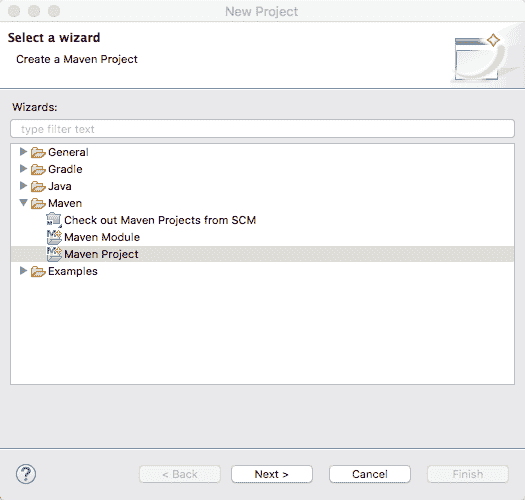

1.  新建 Maven 项目对话框将显示。选择创建简单项目（跳过存档选择）复选框，然后点击下一步按钮，如图所示：

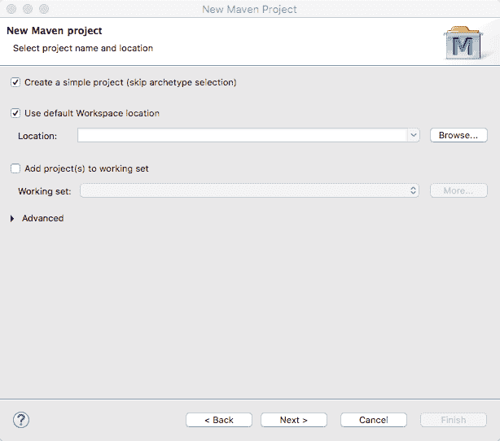

1.  在新建 Maven 项目对话框中，在组 ID:文本框中输入***com.example***，在工件 ID:文本框中输入***chapter1***。您还可以添加一个名称和描述。点击完成按钮，如图所示：

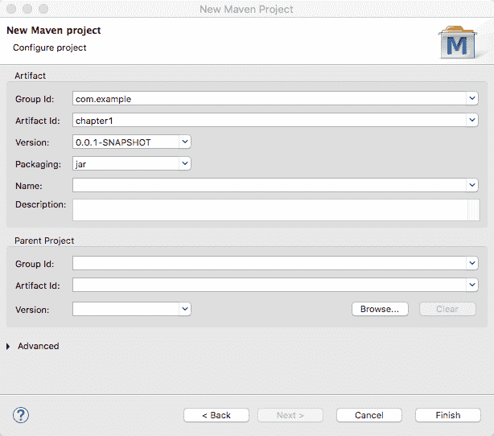

1.  Eclipse 将创建名为***chapter1***的项目，其结构（在包资源管理器中）类似于以下截图所示：

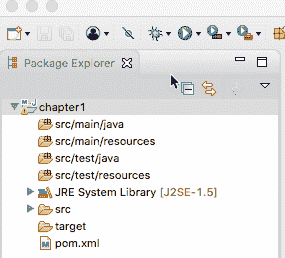

1.  从包资源管理器中选择 pom.xml。这将打开编辑器区域中的 pom.xml 文件，并打开**概览**选项卡。选择位于概览选项卡旁边的**pom.xml**选项卡，如图所示：

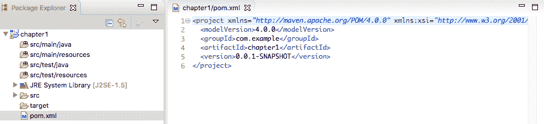

1.  将以下代码片段中突出显示的 Selenium WebDriver 和 TestNG 依赖项添加到 pom.xml 中的`project`节点之间：

```java
<properties>
 <java.version>1.8</java.version>
 <selenium.version>3.13.0</selenium.version>
 <testng.version>6.13.1</testng.version>
 <maven.compiler.version>3.7.0</maven.compiler.version> </properties>

<dependencies>
 <dependency>
 <groupId>org.seleniumhq.selenium</groupId>
 <artifactId>selenium-java</artifactId>
 <version>${selenium.version}</version>
 </dependency>
 <dependency>
 <groupId>org.testng</groupId>
 <artifactId>testng</artifactId>
 <version>${testng.version}</version>
 </dependency>
</dependencies>

<build>
 <plugins>
 <plugin>
 <groupId>org.apache.maven.plugins</groupId>
 <artifactId>maven-compiler-plugin</artifactId>
 <version>${maven.compiler.version}</version>
 <configuration>
 <source>${java.version}</source>
 <target>${java.version}</target>
 </configuration>
 </plugin>
 </plugins>
</build>
```

1.  在包资源管理器中选择***src/test/java***，然后右键单击以显示菜单。选择新建 | 其他，如图所示：

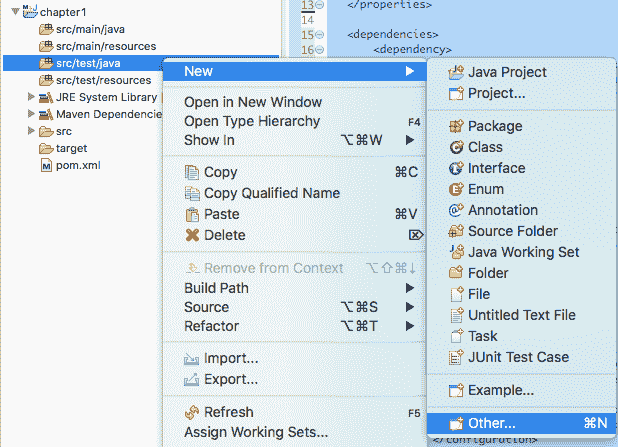

1.  从选择向导对话框中选择 TestNG | TestNG 类，如图所示：

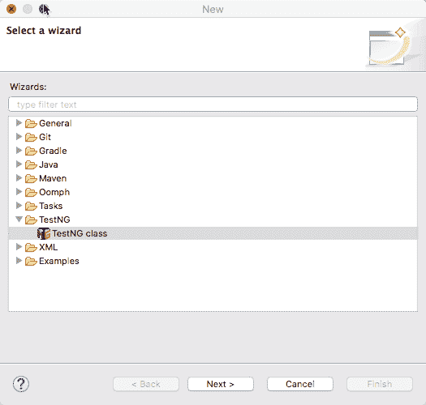

1.  在新 TestNG 类对话框中，在源文件夹:字段中输入***/chapter1/src/test/java***。在包名:字段中输入 com.example。在类名:字段中输入 NavigationTest。选择@BeforeMethod 和@AfterMethod 复选框，并在 XML 套件文件:字段中添加`src/test/resources/suites/testng.xml`。点击完成按钮：

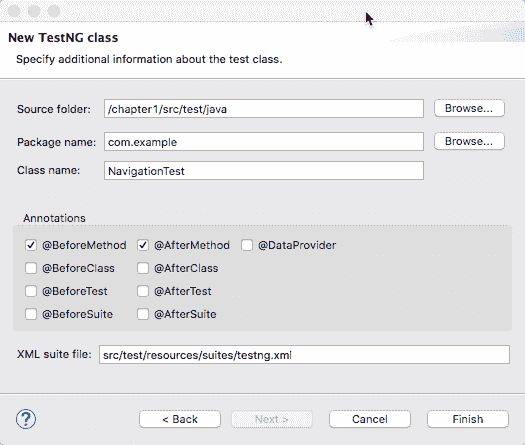

1.  这将在 com.example 包中创建名为***NavigationTest.java***的类，并使用 TestNG 注解如`@Test`、`@BeforeMethod`和`@AfterMethod`，以及`beforeMethod`和`afterMethod`方法：

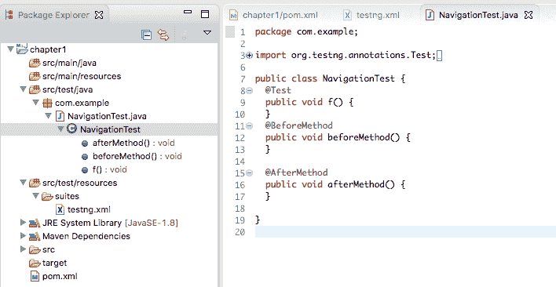

1.  使用以下代码修改`NavigationTest`类：

```java
package com.example;
import org.openqa.selenium.WebDriver;
import org.openqa.selenium.chrome.ChromeDriver;
import org.testng.Assert;
import org.testng.annotations.*;

public class NavigationTest {

    WebDriver driver;

    @BeforeMethod
    public void beforeMethod() {

        // set path of Chromedriver executable
        System.setProperty("webdriver.chrome.driver",
                "./src/test/resources/drivers/chromedriver");

        // initialize new WebDriver session
        driver = new ChromeDriver();
    }

    @Test
    public void navigateToAUrl() {
        // navigate to the web site
        driver.get("http://demo-store.seleniumacademy.com/");
        // Validate page title
        Assert.assertEquals(driver.getTitle(), "Madison Island");
    }
    @AfterMethod
    public void afterMethod() {

        // close and quit the browser
        driver.quit();
    }
}
```

在前面的代码中，添加了三个方法作为`NavigationTest`类的一部分。我们还声明了一个`WebDriver driver;`实例变量，我们将在测试中稍后使用它来启动浏览器并导航到网站。

`beforeMethod()`方法，被`@BeforeMethod` TestNG 注解标记，将在测试方法之前执行。它将设置 Google Chrome 所需的*chromedriver*可执行文件的路径。然后使用`ChromeDriver()`类实例化 driver 变量。这将启动屏幕上的新 Google Chrome 窗口。

下一个方法，`navigateToAUrl()`，被`@Test`注解标记的是测试方法。我们将通过 WebDriver 接口的`get()`方法传递应用程序的 URL。这将导航到浏览器中的网站。我们将通过调用 TestNG 的`Assert.assertEquals`方法和 WebDriver 接口的`getTitle()`方法来检查页面标题。

最后，`afterMethod()`被`@AfterMethod` TestNG 注解标记，将关闭浏览器窗口。

我们需要从 [`sites.google.com/a/chromium.org/chromedriver/downloads`](https://sites.google.com/a/chromium.org/chromedriver/downloads) 下载并复制 chromedriver 可执行文件。根据您计算机上安装的 Google Chrome 浏览器版本以及操作系统下载适当的版本。将可执行文件复制到`/src/test/resources/drivers`文件夹中。

要运行测试，请在代码编辑器中右键单击并选择“运行 As | TestNG 测试”，如下截图所示：

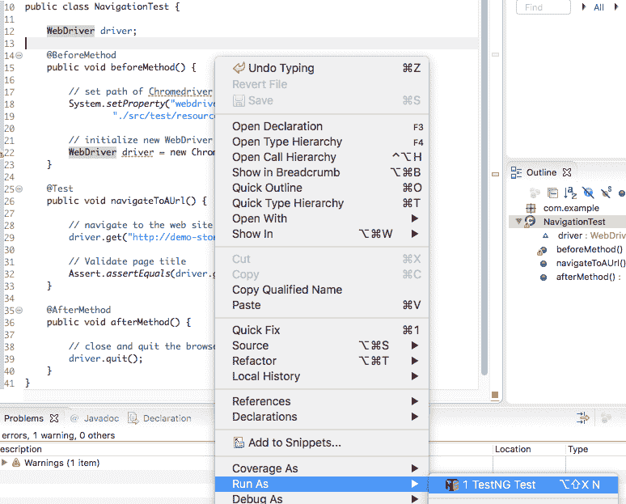

这将启动一个新的 Google Chrome 浏览器窗口并导航到该网站。测试将验证页面标题，并在测试结束时关闭浏览器窗口。TestNG 插件将在 Eclipse 中显示结果：

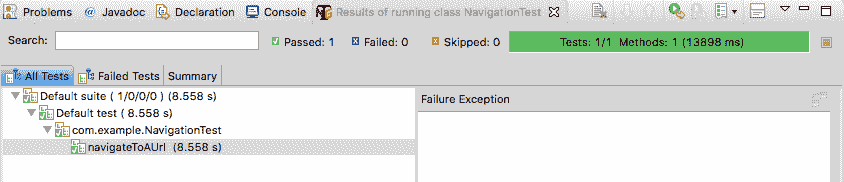

您可以从您在 [`www.packtpub.com`](http://www.packtpub.com) 的账户下载您购买的所有 Packt 书籍的示例代码文件。如果您在其他地方购买了这本书，您可以访问 http://www.packtpub.com/support 并注册，以便将文件直接通过电子邮件发送给您。示例代码也托管在 [`github.com/PacktPublishing/Selenium-WebDriver-3-Practical-Guide-Second-Edition`](https://github.com/PacktPublishing/Selenium-WebDriver-3-Practical-Guide-Second-Edition)

# WebElements

一个网页由许多不同类型的 HTML 元素组成，例如链接、文本框、下拉按钮、主体、标签和表单。在 WebDriver 的上下文中，这些元素被称为 WebElements。这些元素共同构成了网页的用户功能。例如，让我们看看一个网站登录页面的 HTML 代码：

```java
<html>
<body>
    <form id="loginForm">
        <label>Enter Username: </label>
        <input type="text" name="Username"/>
        <label>Enter Password: </label>
        <input type="password" name="Password"/>
        <input type="submit"/>
    </form>
    <a href="forgotPassword.html">Forgot Password ?</a>
</body>
</html>
```

在前面的 HTML 代码中，存在不同类型的 WebElements，例如 `<html>`、`<body>`、`<form>`、`<label>`、`<input>` 和 `<a>`，这些元素共同构成了一个网页，为用户提供登录功能。让我们分析以下 WebElement：

```java
<label>Enter Username: </label>
```

在这里，`<label>`是 WebElement 标签的开始标签。`Enter Username:`是`label`元素上的文本。最后，`</label>`是结束标签，表示 WebElement 的结束。

类似地，再取另一个 WebElement：

```java
<input type="text" name="Username"/>
```

在前面的代码中，`type`和`name`是具有`text`和`Username`值的`input` WebElement 的属性。

使用 Selenium 进行 UI 自动化主要涉及在网页上定位这些 Web 元素并对其执行用户操作。在本章的其余部分，我们将使用各种方法来定位 Web 元素并对其执行相关的用户操作。

# 使用 WebDriver 定位 Web 元素

让我们从自动化演示应用程序主页上的搜索功能开始这一部分，该应用程序的主页地址为[`demo-store.seleniumacademy.com/`](http://demo-store.seleniumacademy.com/)，这涉及到导航到主页，在文本框中输入搜索文本，并执行搜索。以下是相应的代码：

```java
import org.openqa.selenium.By;
import org.openqa.selenium.WebDriver;
import org.openqa.selenium.WebElement;
import org.openqa.selenium.chrome.ChromeDriver;
import org.testng.annotations.AfterMethod;
import org.testng.annotations.BeforeMethod;
import org.testng.annotations.Test;

import static org.assertj.core.api.AssertionsForClassTypes.assertThat;

public class SearchTest {

    WebDriver driver;

    @BeforeMethod
    public void setup() {
        System.setProperty("webdriver.chrome.driver",
                "./src/test/resources/drivers/chromedriver");
        driver = new ChromeDriver();
        driver.get("http://demo-store.seleniumacademy.com/");
    }

    @Test
    public void searchProduct() {
        // find search box and enter search string
        WebElement searchBox = driver.findElement(By.name("q"));
        searchBox.sendKeys("Phones");
        WebElement searchButton = 
 driver.findElement(By.className("search-button"));
        searchButton.click();
        assertThat(driver.getTitle())
                .isEqualTo("Search results for: 'Phones'");
    }

    @AfterMethod
    public void tearDown() {
        driver.quit();
    }
}
```

如您所见，以下有三点新内容被突出显示：

```java
WebElement searchBox = driver.findElement(By.name("q"));
```

它们是`findElement()`方法、`By.name()`方法和`WebElement`接口。`findElement()`和`By()`方法指示 WebDriver 在网页上定位一个`WebElement`，一旦找到，`findElement()`方法就返回该元素的`WebElement`实例。使用`WebElement`接口中声明的各种方法在返回的`WebElement`上执行操作，如点击和输入，这些方法将在下一节中详细讨论。

# `findElement`方法

在 UI 自动化中，定位元素是在对它执行任何用户操作之前的第一个步骤。WebDriver 的`findElement()`方法是在网页上定位元素的一种便捷方式。根据 WebDriver 的 Javadoc([`selenium.googlecode.com/git/docs/api/java/index.html`](http://seleniumhq.github.io/selenium/docs/api/java/index.html))，该方法的声明如下：

```java
WebElement findElement(By by)
```

因此，`findElement()`方法的输入参数是`By`实例。`By`实例是一种定位`WebElement`的机制。有八种不同的方式可以在网页上定位一个`WebElement`。我们将在本章后面看到这八种方法。

`findElement()`方法的返回类型是表示网页实际 HTML 元素或组件的`WebElement`实例。该方法返回第一个满足定位机制条件的`WebElement`。从那时起，此`WebElement`实例将作为该组件的句柄。测试脚本开发者可以通过此返回的`WebElement`实例对该组件采取适当的操作。

如果 WebDriver 找不到元素，它将抛出一个名为`NoSuchElementException`的运行时异常，调用类或方法应该处理此异常。

# `findElements`方法

对于在网页上找到符合相同定位条件的多元素，可以使用`findElements()`方法。该方法返回一个包含通过给定定位机制找到的 Web 元素的列表。`findElements()`方法的声明如下：

```java
java.util.List findElements(By by)
```

输入参数与 `findElement()` 方法相同，它是一个 `By` 类的实例。区别在于返回类型。这里，如果没有找到元素，则返回空列表；如果有多个满足定位机制的 WebElements 存在，则将它们全部以列表形式返回给调用者。

# 使用开发者工具检查元素

在我们开始探索如何在页面上查找元素以及使用什么定位机制之前，我们需要查看页面的 HTML 代码，以了解文档对象模型（**DOM**）树，页面显示的元素定义了哪些属性或属性，以及应用程序如何通过浏览器使用为页面编写的 HTML 代码来渲染视觉元素。它使用其他资源，包括 JavaScript、CSS 和图像，来决定这些元素的外观、感觉和行为。

下面是演示应用程序的登录页面示例以及用于在浏览器中渲染此页面的 HTML 代码，如图下所示：


我们需要能够以结构化和易于理解的方式显示页面 HTML 代码的工具。现在几乎所有浏览器都提供了开发者工具来检查页面结构和相关资源。

# 使用 Mozilla Firefox 检查页面和元素

Mozilla Firefox 的新版本提供了内置的方式来检查页面和元素。要检查页面上的元素，将鼠标移至所需元素上并右键点击以打开弹出菜单。选择**检查元素**选项，如图下所示：

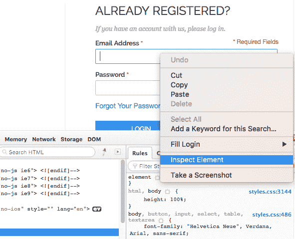

这将显示带有突出显示所选元素的 HTML 代码的树格式检查器标签页，如图下所示：

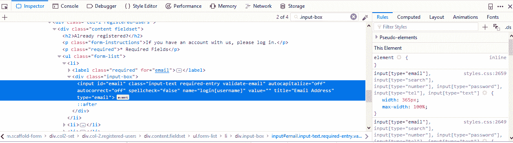

使用检查器，我们还可以使用检查器部分显示的搜索框验证 XPath 或 CSS 选择器。只需输入 XPath 或 CSS 选择器，检查器就会突出显示与表达式匹配的元素，如图下所示：

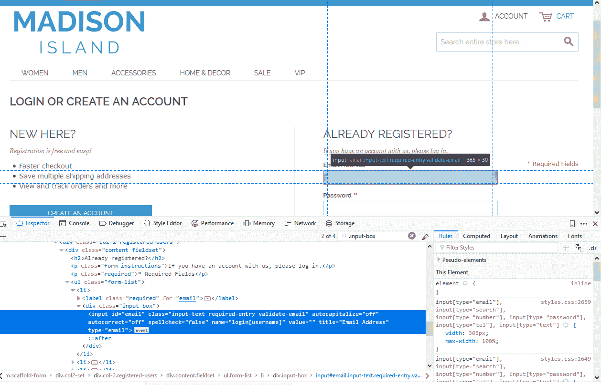

开发者工具还提供了各种其他调试功能。它还会为元素生成 XPath 和 CSS 选择器。为此，在树中选择所需的元素，右键点击，并从弹出菜单中选择复制 > XPath 或复制 > CSS 路径选项，如图下所示：

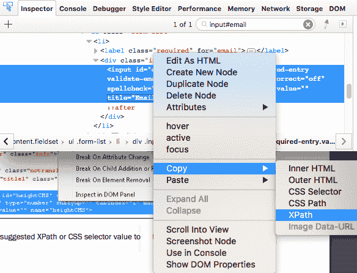

这会将建议的 XPath 或 CSS 选择器值粘贴到剪贴板，以便稍后与 `findElement()` 方法一起使用。

# 使用开发者工具在 Google Chrome 中检查页面和元素

与 Mozilla Firefox 类似，Google Chrome 也提供了一个内置功能来检查页面和元素。我们可以将鼠标悬停在页面上的一个所需元素上，右键单击以打开弹出菜单，然后选择“检查元素”选项。这将打开浏览器中的开发者工具，显示与 Firefox 类似的信息，如下面的截图所示：


与 Firefox 类似，我们也可以在 Google Chrome 开发者工具中测试 XPath 和 CSS 选择器。在元素标签页中按*Ctrl + F*（在 Mac 上使用*Command + F*）。这将显示一个搜索框。只需输入*XPath*或*CSS Selector*，匹配的元素将在树中突出显示，如下面的截图所示：

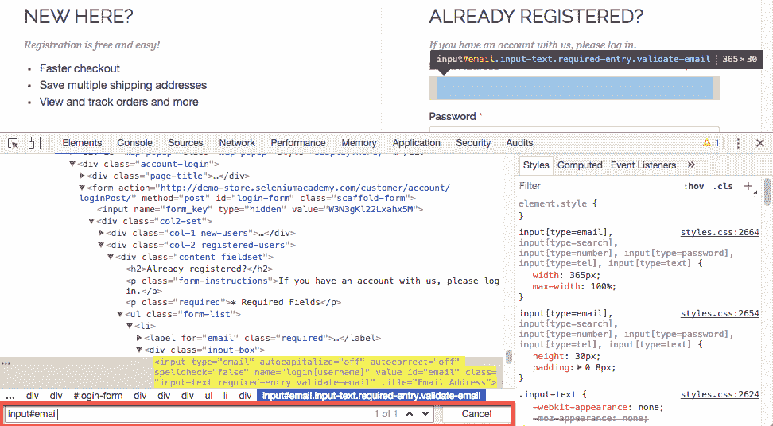

Chrome 开发者工具还提供了一个功能，您可以通过在树中右键单击所需的元素并从弹出菜单中选择“复制 XPath”选项来获取元素的 XPath。

与 Mozilla Firefox 和 Google Chrome 类似，您将在任何主要浏览器中找到类似的开发者工具，包括 Microsoft Internet Explorer 和 Edge。

浏览器开发者工具在测试脚本开发过程中非常有用。这些工具可以帮助您找到需要交互的元素的位置详情，作为测试的一部分。这些工具解析页面代码，并以层次树的形式显示信息。

网页上的 WebElements 可能不会声明所有属性。选择用于在网页上唯一标识 WebElement 的属性的测试脚本的开发者。

# 使用`By`定位机制

`By`是通过`findElement()`方法或`findElements()`方法传递给定位机制，以在网页上获取相应的 WebElement（s）。有八种不同的定位机制；也就是说，有八种不同的识别方式

在网页上的 HTML 元素。它们通过 ID、Name、ClassName、TagName、LinkText、PartialLinkText、XPath 和 CSS Selector 定位。

# `By.id()`方法

在网页上，每个元素都通过一个 ID 属性唯一标识，该属性是可选的。ID 可以由 Web 应用程序的开发者手动分配，或者由应用程序动态生成。动态生成的 ID 可以在每次页面刷新或一段时间内更改。现在，考虑搜索框的 HTML 代码：

```java
<input id="search" type="search" name="q" value="" class="input-text required-entry" maxlength="128" placeholder="Search entire store here..." autocomplete="off">
```

在前面的代码中，搜索框的`id`属性值为`search`。

让我们看看如何使用 ID 属性作为定位机制来查找搜索框：

```java
@Test
public void byIdLocatorExample() {
    WebElement searchBox = driver.findElement(By.id("search"));
    searchBox.sendKeys("Bags");
    searchBox.submit();
    assertThat(driver.getTitle())
            .isEqualTo("Search results for: 'Bags'");
}
```

在前面的代码中，我们使用了`By.id()`方法和搜索框的`id`属性值来查找元素。

在这里，尝试使用`By.id`标识符，并使用名称值（即`q`）而不是`id`值（即`search`）。将第三行修改如下：

```java
WebElement searchBox = driver.findElement(By.id("q")); 
```

测试脚本将无法抛出异常，如下所示：

```java
Exception in thread "main" org.openqa.selenium.NoSuchElementException: Unable to locate element: {"method":"id","selector":"q"}
```

WebDriver 无法通过`id`找到值为`q`的元素。因此，它抛出一个异常，表示`NoSuchElementException`。

# By.name()方法

如前所述，网页上的每个元素都有许多属性。名称就是其中之一。例如，搜索框的 HTML 代码如下：

```java
<input id="search" type="search" name="q" value="" class="input-text required-entry" maxlength="128" placeholder="Search entire store here..." autocomplete="off">
```

在这里，`name`是搜索框的许多属性之一，其值为`q`。如果我们想在测试脚本中识别这个搜索框并在其中设置值，代码将如下所示：

```java
@Test
public void searchProduct() {
    // find search box and enter search string
    WebElement searchBox = driver.findElement(By.name("q"));
    searchBox.sendKeys("Phones");
    searchBox.submit();
    assertThat(driver.getTitle())
            .isEqualTo("Search results for: 'Phones'");
}
```

如果您观察第四行，这里使用的定位机制是`By.name`，名称是`q`。那么这个名称是从哪里来的呢？如前所述，是浏览器开发者工具帮助我们获取按钮名称的。启动开发者工具并使用检查元素小部件来获取元素的属性。

# By.className()方法

在讨论`className()`方法之前，我们必须稍微谈谈样式和 CSS。网页上的每个 HTML 元素通常都是由网页开发者或设计师进行样式的。并不是每个元素都必须有样式，但它们通常都有，以便使页面对最终用户更具吸引力。

因此，为了将样式应用于一个元素，它们可以直接在元素标签中声明，或者放在一个单独的文件中，称为 CSS 文件，并可以通过`class`属性在元素中引用。例如，按钮的样式属性可以在 CSS 文件中声明如下：

```java
.buttonStyle{
    width: 50px;
    height: 50px;
    border-radius: 50%;
    margin: 0% 2%;
}
```

现在，这种样式可以按照以下方式应用于网页中的按钮元素：

```java
<button name="sampleBtnName" id="sampleBtnId" class="buttonStyle">I'm Button</button>
```

因此，`buttonStyle`被用作按钮元素的`class`属性的值，并继承 CSS 文件中声明的所有样式。现在，让我们在我们的主页上尝试这个操作。我们将尝试使用按钮的类名来让 WebDriver 识别搜索按钮并点击它。

首先，为了获取搜索按钮的类名，正如我们所知，我们将使用开发者工具来获取它。获取后，将定位机制更改为`By.className`，并在其中指定类属性值。相应的代码如下：

```java
@Test
public void byClassNameLocatorExample() {
    WebElement searchBox = driver.findElement(By.id("search"));
    searchBox.sendKeys("Electronics");
    WebElement searchButton = 
            driver.findElement(By.className("search-button"));
    searchButton.click();
    assertThat(driver.getTitle())
            .isEqualTo("Search results for: 'Electronics'");
}
```

在前面的代码中，我们通过传递类属性值给`By.className`定位机制来使用`By.className`定位机制。

有时，一个元素的`class`属性可能会有多个值。例如，以下 HTML 片段中搜索按钮的`class`属性指定了`button`和`search-button`值：

```java
<button type="submit" title="Search" class="button search-button"><span><span>Search</span></span></button>
```

我们必须使用`class`属性的某个值与`By.className`方法一起使用。在这种情况下，我们可以使用`button`或`search-button`中的任何一个，只要它能唯一标识元素即可。

# By.linkText()方法

如其名所示，`By.linkText`定位机制只能用来识别 HTML 链接。在我们开始讨论如何使用 WebDriver 通过链接文本来识别链接元素之前，让我们看看 HTML 链接元素的样子。HTML 链接元素在网页上使用`<a>`标签表示，这是锚点标签的缩写。一个典型的锚点标签看起来像这样：

```java
<a href="http://demo-store.seleniumacademy.com/customer/account/" title="My Account">My Account</a>
```

在这里，`href`是链接到另一个页面，当你点击链接时，你的网络浏览器会带你到那里。所以，浏览器渲染的前面的 HTML 代码看起来是这样的：


这个**我的账户**是链接文本。所以`By.linkText`定位机制使用这个文本在锚点标签上以识别 WebElement。代码看起来是这样的：

```java
@Test
public void byLinkTextLocatorExample() {
    WebElement myAccountLink = 
            driver.findElement(By.linkText("MY ACCOUNT"));
    myAccountLink.click();
    assertThat(driver.getTitle())
            .isEqualTo("Customer Login");
}
```

在这里，使用`By.linkText`定位机制来识别**我的账户**链接。

`linkText`和`partialLinkText`方法是区分大小写的。

# `By.partialLinkText()`方法

`By.partialLinkText`定位机制是`By.linkText`定位器的扩展。如果你不确定整个链接文本或者只想使用链接文本的一部分，你可以使用这个定位器来识别链接元素。所以，让我们修改之前的例子，只使用链接的部分文本；在这种情况下，我们将使用网站页脚中的隐私政策链接中的 Privacy：


代码看起来是这样的：

```java
@Test
public void byPartialLinkTextLocatorExample() {
    WebElement orderAndReturns = 
            driver.findElement(By.partialLinkText("PRIVACY"));
    orderAndReturns.click();
    assertThat(driver.getTitle())
            .isEqualTo("Privacy Policy");
}
```

如果有多个链接的文本包含*隐私*这个词，会发生什么？这是一个关于`findElement()`方法而不是定位器的问题。记得我们之前讨论`findElement()`方法时，它只会返回它遇到的第一个 WebElement。如果你想找到所有包含*隐私*的链接文本的 WebElement，请使用`findElements()`方法，它将返回所有这些元素的列表。

如果你认为你需要所有满足定位机制条件的 WebElement，请使用 WebDriver 的`findElements()`方法。

# `By.tagName()`方法

通过标签名定位元素与之前我们看到的定位机制略有不同。例如，在主页面上，如果你使用`button`标签名搜索元素，它将导致多个 WebElements，因为主页面上有九个按钮。因此，在尝试使用标签名定位元素时，始终建议使用`findElements()`方法而不是`findElement()`方法。

让我们看看当搜索主页上链接数量时的代码看起来是什么样子：

```java
@Test
public void byTagNameLocatorExample() {

    // get all links from the Home page
    List<WebElement> links = driver.findElements(By.tagName("a"));

    System.out.println("Found links:" + links.size());

    // print links which have text using Java 8 Streams API
    links.stream()
            .filter(elem -> elem.getText().length() > 0)
            .forEach(elem -> System.out.println(elem.getText()));
}
```

在前面的代码中，我们使用了 `By.tagName` 定位机制和 `findElements()` 方法，它返回所有链接的列表，即页面上定义的 `a` 锚标签。在第五行，我们打印了列表的大小，然后只打印了提供文本的链接文本。我们使用 Java 8 Stream API 通过调用 `getText()` 方法来过滤元素列表并输出文本值。这将生成以下输出：

```java
Found links:88
 ACCOUNT
 CART
 WOMEN
 ...
```

# By.xpath() 方法

WebDriver 使用 **XPath** 来识别网页上的 WebElement。在我们看到它是如何做到这一点之前，让我们快速看一下 XPath 的语法。XPath 是 XML 路径的简称，是用于搜索 XML 文档的查询语言。我们网页的 HTML 也是 XML 文档的一种形式。因此，为了在 HTML 页面上识别一个元素，我们需要使用特定的 XPath 语法：

+   根元素被标识为 `//`。

+   要识别所有 div 元素，语法将是 `//div`。

+   要识别位于 div 元素内的链接标签，语法将是 `//div/a`。

+   要识别所有具有标签的元素，我们使用 `*`。语法将是 `//div/*`。

+   要识别从根元素向下三个级别的所有 div 元素，我们可以使用 `//*/*/div`。

+   要识别特定元素，我们使用这些元素的属性值，例如 `//*/div/a[@id='attrValue']`，这将返回锚元素。该元素位于根元素内部的第三个级别，并且具有 `id` 值为 `attrValue`。

因此，我们需要将 XPath 表达式传递给 `By.xpath` 定位机制，以便它能够识别我们的目标元素。

现在，让我们看看代码示例以及 WebDriver 如何使用这个 XPath 来识别元素：

```java
@Test
public void byXPathLocatorExample() {
    WebElement searchBox = 
            driver.findElement(By.xpath("//*[@id='search']"));
    searchBox.sendKeys("Bags");
    searchBox.submit();
    assertThat(driver.getTitle())
            .isEqualTo("Search results for: 'Bags'");
}
```

在前面的代码中，我们正在使用 `By.xpath` 定位机制并将 WebElement 的 XPath 传递给它。

使用 XPath 的一个缺点是它在时间上代价很高。对于要识别的每个元素，WebDriver 实际上都会扫描整个页面，这非常耗时，而且过多地在测试脚本中使用 XPath 会使执行速度变得非常慢。

# By.cssSelector() 方法

`By.cssSelector()` 方法在用法上与 `By.xpath()` 方法类似，但区别在于它比 `By.xpath` 定位机制稍微快一些。以下是一些常用的语法，用于识别元素：

+   要使用具有 `#flrs` ID 的 div 元素来识别一个元素，我们使用 `#flrs` 语法

+   要识别子锚元素，我们使用 `#flrs > a` 语法，这将返回链接元素

+   要使用其属性来识别锚元素，我们使用 `#flrs > a[a[href="/intl/en/about.html"]]` 语法

让我们尝试修改之前使用 XPath 定位机制的代码，以使用 `cssSelector` 机制：

```java
@Test
public void byCssSelectorLocatorExample() {
    WebElement searchBox = 
            driver.findElement(By.cssSelector("#search"));
    searchBox.sendKeys("Bags");
    searchBox.submit();
    assertThat(driver.getTitle())
            .isEqualTo("Search results for: 'Bags'");
}
```

上述代码使用了 `By.cssSelector` 定位机制，它使用搜索框的 css 选择器 `ID`。

让我们看看一个稍微复杂一点的例子。我们将尝试在主页上识别“关于我们”：

```java
@Test
public void byCssSelectorLocatorComplexExample() {

    WebElement aboutUs =
            driver.findElement(By
                    .cssSelector("a[href*='/about-magento-demo-store/']"));

    aboutUs.click();

    assertThat(driver.getTitle())
            .isEqualTo("About Us");
}
```

前面的代码使用了 `cssSelector()` 方法来找到由其 `href` 属性标识的锚元素。

# 与 WebElements 交互

在上一节中，我们看到了如何通过使用不同的定位方法在网页上定位 WebElements。在这里，我们将看到可以在 WebElement 上执行的所有不同用户操作。不同的 WebElements 将有不同的操作可以执行。例如，在一个文本框元素中，我们可以输入一些文本或清除已经输入的文本。同样，对于按钮，我们可以点击它，获取它的尺寸等，但我们不能在按钮中输入文本，对于链接，我们也不能在它里面输入文本。所以，尽管所有操作都列在了一个 WebElement 接口中，但使用目标元素支持的操作是测试脚本开发者的责任。如果我们尝试在 WebElement 上执行错误操作，我们不会看到任何异常或错误抛出，也不会看到任何操作被执行；WebDriver 会静默忽略这些操作。

现在，让我们通过查看它们的 Javadocs 和代码示例，逐个分析每个操作。

# 获取元素属性和属性

在本节中，我们将学习从 WebElement 接口检索值和属性的各种方法。

# `getAttribute()` 方法

`getAttribute` 方法可以在所有 WebElements 上执行。记住，我们在 WebElements 部分已经看到了 WebElement 的属性。HTML 属性是 HTML 元素的修饰符。它们通常是出现在元素起始标签中的键值对。例如：

```java
  <label name="Username" id="uname">Enter Username: </label>
```

在前面的代码中，`name` 和 `id` 是属性或属性键，而 `Username` 和 `uname` 是属性值。

`getAttribute()` 方法的 API 语法如下：

```java
java.lang.String getAttribute(java.lang.String name)
```

在前面的代码中，输入参数是 `String`，它是属性的名称。返回类型仍然是 `String`，它是属性的值。

现在，让我们看看如何使用 WebDriver 获取一个 WebElement 的所有属性。在这里，我们将使用示例应用程序中的搜索框。这个元素看起来是这样的：

```java
<input id="search" type="search" name="q" value="" class="input-text required-entry" maxlength="128" placeholder="Search entire store here..." autocomplete="off">
```

我们将使用 WebDriver 列出这个 WebElement 的所有属性。相应的代码如下：

```java
@Test
public void elementGetAttributesExample() {
    WebElement searchBox = driver.findElement(By.name("q"));
    System.out.println("Name of the box is: "
            + searchBox.getAttribute("name"));
    System.out.println("Id of the box is: " + searchBox.getAttribute("id"));
    System.out.println("Class of the box is: "
            + searchBox.getAttribute("class"));
    System.out.println("Placeholder of the box is: "
            + searchBox.getAttribute("placeholder"));
}
```

在前面的代码中，最后四行代码使用了 `getAttribute()` 方法来获取 WebElement 搜索框的 `name`、`id`、`class` 和 `placeholder` 属性的属性值。前面代码的输出将是以下内容：

```java
 Name of the box is: q
 Id of the box is: search
 Class of the box is: input-text required-entry
 Placeholder of the box is: Search entire store here...
```

回到上一节中的 `By.tagName()` 方法，如果通过定位机制 `By.tagName` 的搜索结果超过一个，你可以使用 `getAttribute()` 方法进一步筛选结果，并到达你确切想要的目标元素。

# `getText()` 方法

`getText` 方法可以从所有 WebElement 中调用。如果元素上包含任何文本，它将返回可见文本，否则将返回无内容。`getText()` 方法的 API 语法如下：

```java
java.lang.String getText()
```

前述方法没有输入参数，但如果可用的任何内容都会返回 WebElement 的可见 `innerText` 字符串，否则将返回空字符串。

以下代码用于获取示例应用程序主页上存在的站点通知元素上的文本：

```java
@Test
public void elementGetTextExample() {
    WebElement siteNotice = driver.findElement(By
            .className("global-site-notice"));

    System.out.println("Complete text is: "
            + siteNotice.getText());
}
```

前述代码使用 `getText()` 方法来获取站点通知元素上的文本，它返回以下内容：

```java
Complete text is: This is a demo store. Any orders placed through this store will not be honored or fulfilled.
```

# `getCssValue()` 方法

`getCssValue` 方法可以在所有 WebElement 上调用。此方法用于从 WebElement 中获取 CSS 属性值。CSS 属性可以是 `font-family`、`background-color`、`color` 等。当您想通过测试脚本验证应用于您的 WebElement 的 CSS 样式时，这非常有用。`getCssValue()` 方法的 API 语法如下：

```java
java.lang.String getCssValue(java.lang.String propertyName)
```

在前述代码中，输入参数是 CSS 属性名称的字符串值，返回类型是分配给该属性名称的值。

以下是一个代码示例，用于检索搜索框中文本的 `font-family`：

```java
@Test
public void elementGetCssValueExample() {
    WebElement searchBox = driver.findElement(By.name("q"));
    System.out.println("Font of the box is: "
            + searchBox.getCssValue("font-family"));
}
```

前述代码使用 `getCssValue()` 方法来查找搜索框中可见文本的 `font-family`。方法的输出如下：

```java
Font of the box is: Raleway, "Helvetica Neue", Verdana, Arial, sans-serif
```

# `getLocation()` 方法

`getLocation` 方法可以在所有 WebElement 上执行。这用于获取元素在网页上渲染的相对位置。这个位置是相对于网页的左上角计算的，其中 (x, y) 坐标假定为 (0, 0)。如果您的测试脚本尝试验证网页布局，此方法将非常有用。

`getLocation()` 方法的 API 语法如下：

```java
Point getLocation()
```

前述方法显然不接受任何输入参数，但返回类型是包含元素 (x, y) 坐标的 `Point` 类。

以下代码用于检索搜索框的位置：

```java
WebElement searchBox = driver.findElement(By.name("q"));
System.out.println("Location of the box is: "
        + searchBox.getLocation());
```

前述代码的输出是搜索框的 (x, y) 位置，如下截图所示：

```java
Location of the box is: (873, 136)
```

# `getSize()` 方法

`getSize` 方法也可以在所有可见的 HTML 组件上调用。它将返回渲染的 WebElement 的宽度和高度。`getSize()` 方法的 API 语法如下：

```java
Dimension getSize()
```

前述方法不接受任何输入参数，返回类型是一个名为 `Dimension` 的类实例。这个类包含目标 WebElement 的宽度和高度。以下代码用于获取搜索框的宽度和高度：

```java
WebElement searchBox = driver.findElement(By.name("q"));
System.out.println("Size of the box is: "
        + searchBox.getSize());
```

前述代码的输出是搜索框的宽度和高度，如下截图所示：

```java
Size of the box is: (281, 40) 
```

# `getTagName()` 方法

`getTagName`方法可以从所有 WebElements 中调用。这将返回 WebElement 的 HTML 标签名。例如，在以下 HTML 代码中，按钮是 HTML 元素的标签名：

```java
<button id="gbqfba" class="gbqfba" name="btnK" aria-label="Google Search">
```

在前面的代码中，按钮是 HTML 元素的标签名。

`getTagName()`方法的 API 语法如下：

```java
java.lang.String getTagName()
```

上述方法的返回类型是`String`，它返回目标元素的标签名。

以下代码返回搜索按钮的标签名：

```java
@Test
public void elementGetTagNameExample() {
    WebElement searchButton = driver.findElement(By.className("search-button"));
    System.out.println("Html tag of the button is: "
            + searchButton.getTagName());
}
```

前述代码使用`getTagName()`方法获取搜索按钮元素的标签名。代码的输出符合预期：

```java
Html tag of the button is: button
```

# 对 WebElements 执行操作

在上一节中，我们看到了如何检索 WebElements 的值或属性。在本节中，我们将看到如何对 WebElements 执行操作，这是自动化中最关键的部分。让我们探索 WebElement 接口中可用的各种方法。

# `sendKeys()`方法

`sendKeys`操作适用于`textbox`或`textarea`HTML 元素。这用于将文本输入到文本框中。这将模拟用户键盘，并将文本输入到 WebElements 中，就像用户一样。`sendKeys()`方法的 API 语法如下：

```java
void sendKeys(java.lang.CharSequence...keysToSend)
```

前述方法的输入参数是要输入到元素中的`CharSequence`文本。此方法不返回任何内容。现在，让我们看看如何使用`sendKeys()`方法在搜索框中输入搜索文本的代码示例：

```java
@Test
public void elementSendKeysExample() {
    WebElement searchBox = driver.findElement(By.name("q"));
    searchBox.sendKeys("Phones");
    searchBox.submit();
    assertThat(driver.getTitle())
            .isEqualTo("Search results for: 'Phones'");
}
```

在前面的代码中，`sendKeys()`方法用于在网页的文本框元素中输入所需文本。这就是我们处理普通键的方式，但如果你想要输入一些特殊键，例如*退格键、回车键、制表键*或*Shift 键*，我们需要使用 WebDriver 的一个特殊枚举类，名为`Keys`。使用`Keys`枚举，你可以在输入到 WebElement 时模拟许多特殊键。

现在让我们看一些代码示例，它使用*Shift*键在搜索框中输入大写文本：

```java
@Test
public void elementSendKeysCompositeExample() {
    WebElement searchBox = driver.findElement(By.name("q"));
    searchBox.sendKeys(Keys.chord(Keys.SHIFT,"phones"));
    searchBox.submit();
    assertThat(driver.getTitle())
            .isEqualTo("Search results for: 'PHONES'");
}
```

在前面的代码中，`Keys`枚举的`chord()`方法用于输入键，同时指定的文本作为输入给文本框。在你的环境中尝试这个示例，以查看所有输入的文本都是大写的。

# `clear()`方法

清除操作类似于`sendKeys()`方法，适用于`textbox`和`textarea`元素。这用于使用`sendKeys()`方法擦除在 WebElement 中输入的文本。这可以通过使用`Keys.BACK_SPACE`枚举实现，但 WebDriver 已经提供了一个简单的方法来清除文本。`clear()`方法的 API 语法如下：

```java
void clear()
```

此方法不接收任何输入，也不返回任何输出。它只是在目标文本输入元素上执行。

现在，让我们看看如何清除搜索框中输入的文本。相应的代码示例如下：

```java
@Test
public void elementClearExample() {
    WebElement searchBox = driver.findElement(By.name("q"));
    searchBox.sendKeys(Keys.chord(Keys.SHIFT,"phones"));
    searchBox.clear();
}
```

我们使用了 WebElement 的 `clear()` 方法在搜索框中输入 `phones` 后清除文本。

# `submit()` 方法

`submit()` 操作可以在 `Form` 或 `Form` 元素内的元素上执行。这是用来将网页表单提交给托管 web 应用的服务器的。`submit()` 方法的 API 语法如下：

```java
void submit()
```

前面的方法不接收任何输入参数，也不返回任何内容。但是，当这个方法在一个不在表单内的 WebElement 上执行时，会抛出 `NoSuchElementException`。

现在，让我们看一个在搜索页面上提交表单的代码示例：

```java
@Test
public void elementSubmitExample() {
    WebElement searchBox = driver.findElement(By.name("q"));
    searchBox.sendKeys(Keys.chord(Keys.SHIFT,"phones"));
    searchBox.submit();
}
```

在前面的代码中，接近结尾的部分是使用 `submit()` 方法将搜索表单提交给应用程序服务器。现在，尝试在一个元素上执行 `submit()` 方法，比如 About 链接，它不是任何表单的一部分。我们应该看到会抛出 `NoSuchElementException`。所以，当你在一个 WebElement 上使用 `submit()` 方法时，请确保它属于 `Form` 元素。

# 检查 WebElement 状态

在前面的章节中，我们学习了如何检索值和在对 WebElements 执行操作。现在，我们将了解如何检查 WebElement 的状态。我们将探讨检查 WebElement 是否在浏览器窗口中显示、是否可编辑，以及如果 WebElement 是单选按钮或复选框，我们可以确定它是选中还是未选中的方法。让我们看看如何使用 WebElement 接口中的可用方法。

# `isDisplayed()` 方法

`isDisplayed` 操作验证元素是否在网页上显示，并且可以在所有 WebElements 上执行。`isDisplayed()` 方法的 API 语法如下：

```java
boolean isDisplayed()
```

前面的方法返回一个 `Boolean` 值，指定目标元素是否在网页上显示。以下是对搜索框是否显示的验证代码，在这种情况下显然应该返回 true：

```java
@Test
public void elementStateExample() {
    WebElement searchBox = driver.findElement(By.name("q"));
    System.out.println("Search box is displayed: "
            + searchBox.isDisplayed());
}
```

前面的代码使用了 `isDisplayed()` 方法来确定元素是否在网页上显示。前面的代码对搜索框返回 `true`：

```java
Search box is displayed: true
```

# `isEnabled()` 方法

`isEnabled` 操作验证元素是否在网页上启用，并且可以在所有 WebElements 上执行。`isEnabled()` 方法的 API 语法如下：

```java
boolean isEnabled()
```

前面的方法返回一个 `Boolean` 值，指定目标元素是否在网页上启用。以下是对搜索框是否启用的验证代码，在这种情况下显然应该返回 true：

```java
@Test
public void elementStateExample() {
    WebElement searchBox = driver.findElement(By.name("q"));
    System.out.println("Search box is enabled: "
            + searchBox.isEnabled());
}
```

前面的代码使用了 `isEnabled()` 方法来确定元素是否在网页上启用。前面的代码对搜索框返回 true：

```java
Search box is enabled: true 
```

# `isSelected()` 方法

如果一个元素在网页上被选中，`isSelected`方法返回一个`boolean`值，并且只能在单选按钮、选择框中的选项和复选框 WebElement 上执行。在其他元素上执行时，它将返回`false`。`isSelected()`方法的 API 语法如下：

```java
boolean isSelected()
```

前一个方法返回一个`Boolean`值，指定目标元素是否在网页上被选中。以下代码用于验证搜索框是否在搜索页面上被选中：

```java
@Test
public void elementStateExample() {
    WebElement searchBox = driver.findElement(By.name("q"));
    System.out.println("Search box is selected: "
            + searchBox.isSelected());
}
```

前一个代码使用了`isSelected()`方法。对于搜索框，它返回`false`，因为这不是单选按钮、选择框中的选项或复选框。前一个代码对搜索框返回`false`：

```java
Search box is selected: false
```

要选择复选框或单选按钮，我们需要调用`WebElement.click()`方法，该方法切换元素的状态。我们可以使用`isSelected()`方法来查看它是否被选中。

# 摘要

在本章中，我们简要概述了 Selenium 测试工具和 WebDriver、WebElement 的架构。我们学习了如何使用 Eclipse、Maven 和 TestNG 设置测试开发环境。这将为我们使用 Selenium 构建测试框架提供基础。然后，我们看到了如何定位元素以及可以对其执行的操作。这是自动化 Web 应用程序时最重要的方面。在本章中，我们使用了 ChromeDriver 来运行我们的测试。在下一章中，我们将学习如何配置和运行 Mozilla Firefox、Microsoft IE 和 Edge 以及 Apple Safari 上的测试。

# 问题

1.  对错：Selenium 是一个浏览器自动化库吗？

1.  Selenium 提供了哪些不同类型的定位机制？

1.  对错：使用`getAttribute()`方法，我们也可以读取 CSS 属性吗？

1.  我们可以在一个 WebElement 上执行哪些操作？

1.  我们如何确定复选框是被选中还是未选中？

# 更多信息

您可以通过以下链接获取更多关于本章涵盖主题的信息：

+   在[`www.w3.org/TR/webdriver/`](https://www.w3.org/TR/webdriver/)阅读 WebDriver 规范。

+   在《精通 Selenium WebDriver》一书中，由 Mark Collin 著，Packt Publishing 出版，您可以了解更多关于在*第一章，创建更快的反馈循环*中使用 TestNG 和 Maven 的内容。

+   在《Selenium 测试工具食谱》第 2 版中，由 Unmesh Gundecha 著，Packt Publishing 出版的书中，您可以了解更多关于元素交互的内容，包括第二章“寻找元素”和第三章“与元素一起工作”。
