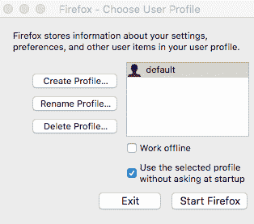
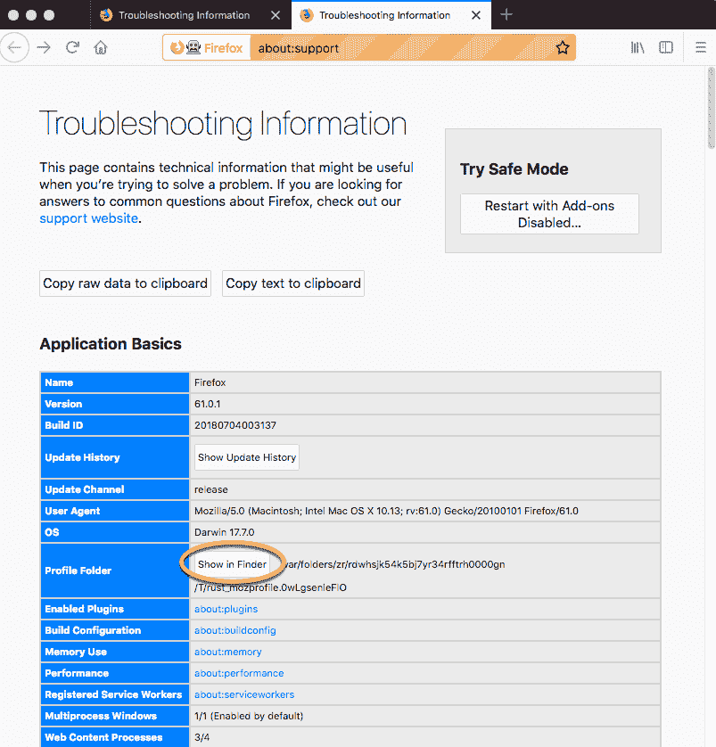
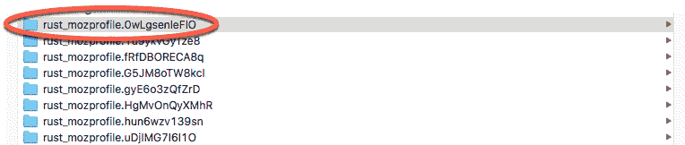
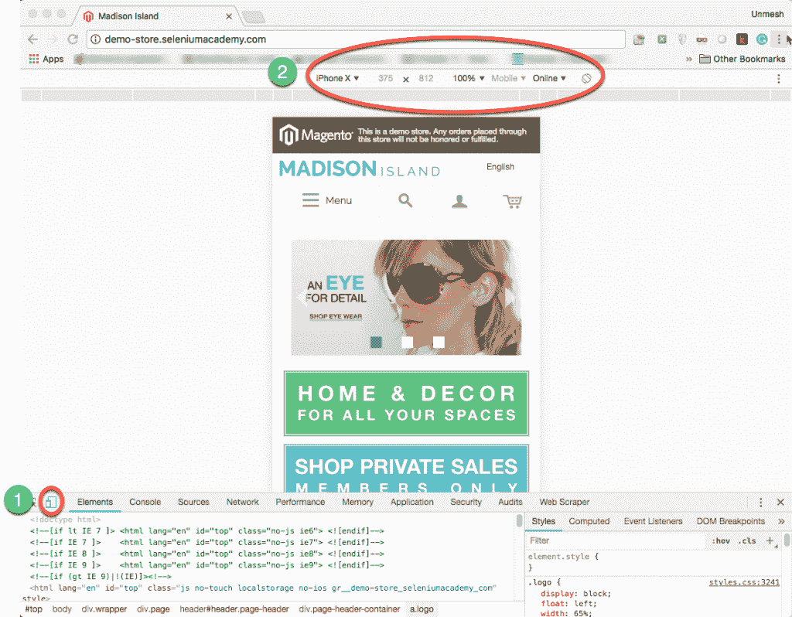
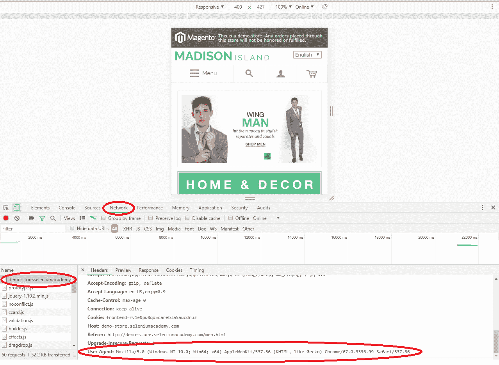
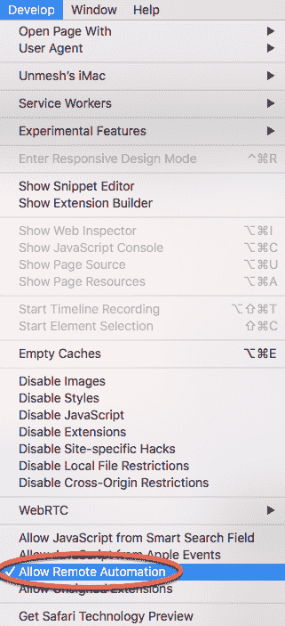

# 第二章：可用的不同 WebDriver。

上一章介绍了 Selenium WebDriver 架构和 WebDriver 接口。我们使用 ChromeDriver 和 Google Chrome 创建了一个简单的测试。在本章中，我们将探讨 Mozilla Firefox、Microsoft Internet Explorer、Microsoft Edge 和 Safari 的 WebDriver 实现。随着 WebDriver 成为 W3C 规范，所有主要浏览器供应商现在都原生支持 WebDriver。在本章中，我们将探讨以下内容：

+   使用针对 Mozilla Firefox、Google Chrome、Microsoft Internet Explorer 和 Edge 以及 Apple Safari 的特定驱动程序实现。

+   使用浏览器选项类以 Headless 模式执行测试并使用自定义配置文件。

+   使用 Google Chrome 进行移动仿真。

# Firefox 驱动程序。

Selenium 3.0 中对 Firefox Driver 的实现进行了更改。从 Firefox 版本 47.0 开始，我们需要使用一个单独的驱动程序，该驱动程序将与 Firefox 浏览器交互，类似于 ChromeDriver。新的 Firefox 驱动程序称为 Geckodriver。

Geckodriver 提供了由 W3C WebDriver 协议描述的 HTTP API，用于与 Gecko 浏览器（如 Firefox）通信。它通过充当本地和远程端之间的代理，将调用转换为 Firefox 远程协议（Marionette）。

# 使用 GeckoDriver。

在本节中，我们将了解如何配置和使用**Geckodriver**在 Firefox 测试中。首先，我们需要从[`github.com/mozilla/geckodriver/releases`](https://github.com/mozilla/geckodriver/releases)下载**Geckodriver**可执行文件。

根据您计算机上安装的 Firefox 版本以及操作系统，下载适当的**Geckodriver**版本。将可执行文件复制到`/src/test/resources/drivers`文件夹中。

我们将使用在第一章中创建的搜索测试，并修改测试以使用**Geckodriver**。为此，我们需要修改`setup()`方法，在`webdriver.gecko.driver`属性中提供**Geckodriver**二进制文件的路径，并实例化`FirefoxDriver`类：

```java
public class SearchTest {

    WebDriver driver;

    @BeforeMethod
    public void setup() {

 System.setProperty("webdriver.gecko.driver",
                "./src/test/resources/drivers/geckodriver.exe");

 driver = new FirefoxDriver();
        driver.get("http://demo-store.seleniumacademy.com/");
    }

    @Test
    public void searchProduct() {

        // find search box and enter search string
        WebElement searchBox = driver.findElement(By.name("q"));

        searchBox.sendKeys("Phones");

        WebElement searchButton =
                driver.findElement(By.className("search-button"));

        searchButton.click();

        assertThat(driver.getTitle())
                .isEqualTo("Search results for: 'Phones'");
    }

    @AfterMethod
    public void tearDown() {
        driver.quit();
    }
}   
```

现在执行测试，你将在控制台中看到**Geckodriver**正在运行：

```java
1532165868138 geckodriver INFO geckodriver 0.21.0
1532165868147 geckodriver INFO Listening on 127.0.0.1:36466
```

它将启动一个新的 Firefox 窗口并执行测试。在执行结束后，Firefox 窗口将被关闭。

# 使用 Headless 模式。

Headless 模式是使用 Selenium WebDriver 进行自动化测试时运行 Firefox 的一种非常有用的方式。在 Headless 模式下，Firefox 运行得像正常一样，只是你看不到 UI 组件。这使得 Firefox 运行更快，测试运行更高效，尤其是在 CI（持续集成）环境中。

我们可以通过配置`FirefoxOptions`类以 Headless 模式运行 Selenium 测试，如下面的代码片段所示：

```java
@BeforeMethod
public void setup() {

    System.setProperty("webdriver.gecko.driver",
            "./src/test/resources/drivers/geckodriver 2");

 FirefoxOptions firefoxOptions = new FirefoxOptions();
    firefoxOptions.setHeadless(true);

    driver = new FirefoxDriver(firefoxOptions); 
    driver.get("http://demo-store.seleniumacademy.com/");
}
```

在前面的代码中，我们首先创建了一个`FirefoxOptions`类的实例，调用`setHeadless()`方法，将值设置为`true`以在无头模式下启动 Firefox 浏览器。您将看到一个长消息，表明浏览器实例已在无头模式下启动，如下面的控制台输出所示：

```java
1532194389309 geckodriver INFO geckodriver 0.21.0
1532194389317 geckodriver INFO Listening on 127.0.0.1:21734
1532194390907 mozrunner::runner INFO Running command: "/Applications/Firefox.app/Contents/MacOS/firefox-bin" "-marionette" "-headless" "-foreground" "-no-remote" "-profile" "/var/folders/zr/rdwhsjk54k5bj7yr34rfftrh0000gn/T/rust_mozprofile.DmJCQRKVVRs6"
 *** You are running in headless mode.
```

在执行过程中，您将不会在屏幕上看到 Firefox 窗口，但测试将在无头模式下执行。

# 理解 Firefox 配置文件

Firefox 配置文件是 Firefox 浏览器用来存储所有密码、书签、设置和其他用户数据的文件夹。Firefox 用户可以创建任意数量的配置文件，并使用不同的自定义设置。根据 Mozilla 的说法，以下是可以存储在配置文件中的不同属性：

+   书签和浏览历史

+   密码

+   站点特定首选项

+   搜索引擎

+   个人词典

+   自动完成历史

+   下载历史

+   Cookies

+   DOM 存储

+   安全证书设置

+   安全设备设置

+   下载操作

+   插件 MIME 类型

+   存储会话

+   工具栏自定义

+   用户样式

要创建、重命名或删除配置文件，您必须执行以下步骤：

1.  打开 Firefox 配置文件管理器。为此，在命令提示符终端中，导航到 Firefox 的安装目录；通常，如果您在 Windows 上，它位于**程序文件**中。导航到可以找到`firefox`二进制文件的位置，并执行以下命令：

```java
      /path/to/firefox -p
```

它将打开配置文件管理器，看起来如下面的截图所示：



注意，在执行上述命令之前，您需要确保关闭所有当前运行的 Firefox 实例。

1.  使用“创建配置文件...”按钮创建另一个配置文件，使用“重命名配置文件...”按钮重命名现有配置文件，使用“删除配置文件...”按钮删除一个。

因此，回到我们的 WebDriver，每次我们创建一个`FirefoxDriver`实例时，都会创建一个临时配置文件，并由 WebDriver 使用。要查看当前正在使用的 Firefox 实例的配置文件，请转到帮助 | 故障排除信息。

这将启动特定 Firefox 实例的所有详细信息，其中配置文件是其中的一部分。它看起来类似于以下截图：



前一个截图中的突出显示的椭圆形显示了配置文件文件夹。单击“显示文件夹”按钮；它应该打开与当前 Firefox 实例对应的配置文件位置。现在，让我们使用我们的 FirefoxDriver 启动一个 Firefox 浏览器实例，并验证其配置文件位置。

让我们使用以下代码启动 Firefox 浏览器：

```java
public class FirefoxProfile { 
 public static void main(String... args) {
 System.setProperty("webdriver.gecko.driver",
 "./src/test/resources/drivers/geckodriver 2");
 FirefoxDriver driver = new FirefoxDriver(); 
 driver.get("http://www.google.com"); 
 }
}
```

这将启动一个浏览器实例。现在，导航到帮助 | 故障排除信息，一旦信息被启动，点击显示文件夹按钮。这将打开当前 WebDriver 的配置文件目录。每次您使用 Firefox Driver 启动 Firefox 实例时，它都会为您创建一个新的配置文件。如果您向上移动一个目录级别，您将看到 FirefoxDriver 创建的配置文件，如下面的截图所示：



所有的前述文件夹对应于 FirefoxDriver 启动的每个 Firefox 实例。

到目前为止，我们已经看到了 Firefox 配置文件是什么以及 WebDriver 如何在每次启动浏览器时创建一个。现在，让我们看看我们如何使用 WebDriver API 创建自己的自定义配置文件。以下是一个使用 WebDriver 库创建自己的 Firefox 配置文件的代码示例，并设置您希望浏览器拥有的选项，覆盖 FirefoxDriver 提供的选项：

```java
public class FirefoxCustomProfile {
    public static void main(String... args) {

        System.setProperty("webdriver.gecko.driver",
                "./src/test/resources/drivers/geckodriver 2");

        FirefoxProfile profile = new FirefoxProfile(); 
 FirefoxOptions firefoxOptions = new FirefoxOptions();
        firefoxOptions.setProfile(profile); 
 FirefoxDriver driver = new FirefoxDriver(firefoxOptions);
        try {
            driver.get("http://www.google.com");
        } finally {
            driver.quit();
        }
    }
}
```

在前面的代码中，`FirefoxProfile` 是一个类，它被实例化以创建一个用于从测试中启动的 Firefox 浏览器的自定义配置文件。现在，拥有该类的实例后，我们可以在其中设置各种选项和偏好设置，我们将在稍后讨论。首先，`FirefoxProfile` 有两个构造函数的重载版本。一个创建一个空配置文件并根据需求对其进行塑形。这在前面的代码中可以看到。第二个版本从一个现有的配置文件目录创建配置文件实例，如下所示：

```java
public FirefoxProfile(java.io.File profileDir)
```

在这里，`profileDir` 输入参数是现有配置文件的目录位置。配置文件目录是我们前面看到的截图中的目录。让我们讨论一些我们可以对 Firefox 浏览器进行的有趣的自定义设置。

# 将扩展添加到 Firefox

在本节中，我们将看到如何使用配置文件扩展我们的 Firefox 浏览器以获得一些额外的功能。每当 WebDriver 启动一个新的 Firefox 浏览器时，它会在磁盘上创建一个新的配置文件，而这个配置文件不包含安装的任何 Firefox 扩展。我们将使用配置文件在 WebDriver 创建 Firefox 浏览器实例时添加扩展。

现在，让我们使用 `FirefoxProfile` 提供的 `addExtension()` 方法更改配置文件。此方法用于向 Firefox 浏览器添加扩展。

以下是该方法的 API 语法：

```java
public void addExtension(java.io.File extensionToInstall) throws java.io.IOException
```

输入参数是要安装到 Firefox 浏览器上的 XPI 文件。如果 WebDriver 在指定位置找不到该文件，它将引发 `IOException`。以下代码是覆盖默认配置文件并扩展 Firefox 浏览器以拥有名为 Xpath Finder 的扩展的代码：

```java
public class FirefoxCustomProfile {
    public static void main(String... args) {

        System.setProperty("webdriver.gecko.driver",
                "./src/test/resources/drivers/geckodriver 2");

        FirefoxProfile profile = new FirefoxProfile();
        profile.addExtension(
 new File("./src/test/resources/extensions/xpath_finder.xpi"));

        FirefoxOptions firefoxOptions = new FirefoxOptions();
        firefoxOptions.setProfile(profile);

        FirefoxDriver driver = new FirefoxDriver(firefoxOptions);
        try {
            driver.get("http://www.google.com");
        } finally {
            //driver.quit();
        }
    }
}
```

现在，如果您看到由 FirefoxDriver 启动的 Firefox 浏览器，您将发现 Xpath Finder 扩展已安装在其上。在控制台日志中，您将看到一个消息指示扩展已被添加到浏览器中：

**1532196699704 addons.xpi-utils DEBUG 新增扩展 xPathFinder@0.9.3 已安装到 app-profile**

# 存储和检索配置文件

我们还可以将浏览器的配置文件信息写入 JSON 文件，然后使用相同的配置文件实例化新的浏览器。`FirefoxProfile`类提供了一个方法来将配置文件信息导出为 JSON。以下是其 API 语法：

```java
public String toJson()
```

输出或返回类型是一个包含 JSON 信息的 String。

现在，要创建具有相同配置文件的浏览器，`FirefoxProfile`类提供了一个静态方法，它接受 JSON 字符串作为输入。以下是其 API 语法：

```java
public static FirefoxProfile fromJson(java.lang.String json) throws java.io.IOException
```

这是一个`FirefoxProfile`类中的静态方法，它接受一个 JSON 字符串来创建一个配置文件。以下是其代码示例：

```java
FirefoxProfile profile = new FirefoxProfile();
profile.addExtension(
        new File("./src/test/resources/extensions/xpath_finder.xpi"));
String json = profile.toJson();
FirefoxOptions firefoxOptions = new FirefoxOptions();
firefoxOptions.setProfile(FirefoxProfile.fromJson(json));

```

在前面的代码中，我们已经将配置文件导出为 JSON 字符串。在你的测试用例中，你可以将这个 JSON 信息写入到文件中并存储它。稍后，你可以使用`FirefoxOptions`读取 JSON 文件并从中创建`FirefoxDriver`。

# 处理 Firefox 首选项

到目前为止，我们已经了解了 Firefox 配置文件，以及我们如何为 Firefox Driver 创建自己的自定义配置文件。现在，让我们看看我们如何在创建的配置文件中设置我们的首选项以及 FirefoxDriver 将它们存储在哪里。

根据 Mozilla 的说法，Firefox 首选项是任何可以由用户设置的值或定义的行为。这些值被保存到首选项文件中。如果你通过导航到帮助 | 故障排除信息并点击显示文件夹按钮来打开配置文件目录，你会看到两个首选项文件：`prefs.js`和`user.js`。所有用户首选项都在 Firefox 应用程序启动时写入到`prefs.js`文件中。用户可以覆盖这些值以选择他们的值，并且它们存储在`user.js`文件中。对于特定首选项的`user.js`中的值优先于为该特定首选项设置的其它所有值。因此，你的 FirefoxDriver 会为你覆盖 Firefox 在`user.js`文件中的所有默认首选项。当你添加一个新的首选项时，FirefoxDriver 会将它写入到`user.js`首选项文件中，Firefox 浏览器会相应地表现。

在配置文件目录中打开`user.js`文件。以下是由 FirefoxDriver 默认为你设置的所有首选项列表：

```java
user_pref("app.normandy.api_url", "");
user_pref("app.update.auto", false);
user_pref("app.update.enabled", false);
user_pref("browser.EULA.3.accepted", true);
user_pref("browser.EULA.override", true);
user_pref("browser.displayedE10SNotice", 4);
user_pref("browser.dom.window.dump.enabled", true);
user_pref("browser.download.manager.showWhenStarting", false);
user_pref("browser.laterrun.enabled", false);
user_pref("browser.link.open_external", 2);
user_pref("browser.link.open_newwindow", 2);
user_pref("browser.newtab.url", "about:blank");
user_pref("browser.newtabpage.enabled", false);
user_pref("browser.offline", false);
user_pref("browser.reader.detectedFirstArticle", true);
user_pref("browser.safebrowsing.blockedURIs.enabled", false);
user_pref("browser.safebrowsing.downloads.enabled", false);
user_pref("browser.safebrowsing.enabled", false);
user_pref("browser.safebrowsing.malware.enabled", false);
user_pref("browser.safebrowsing.passwords.enabled", false);
user_pref("browser.safebrowsing.phishing.enabled", false);
user_pref("browser.search.update", false);
user_pref("browser.selfsupport.url", "");
user_pref("browser.sessionstore.resume_from_crash", false);
user_pref("browser.shell.checkDefaultBrowser", false);
user_pref("browser.showQuitWarning", false);
user_pref("browser.snippets.enabled", false);
user_pref("browser.snippets.firstrunHomepage.enabled", false);
user_pref("browser.snippets.syncPromo.enabled", false);
user_pref("browser.startup.homepage", "about:blank");
user_pref("browser.startup.homepage_override.mstone", "ignore");
user_pref("browser.startup.page", 0);
user_pref("browser.tabs.closeWindowWithLastTab", false);
user_pref("browser.tabs.warnOnClose", false);
user_pref("browser.tabs.warnOnOpen", false);
user_pref("browser.uitour.enabled", false);
user_pref("browser.usedOnWindows10.introURL", "about:blank");
user_pref("browser.warnOnQuit", false);
user_pref("datareporting.healthreport.about.reportUrl", "http://%(server)s/dummy/abouthealthreport/");
user_pref("datareporting.healthreport.documentServerURI", "http://%(server)s/dummy/healthreport/");
user_pref("datareporting.healthreport.logging.consoleEnabled", false);
user_pref("datareporting.healthreport.service.enabled", false);
user_pref("datareporting.healthreport.service.firstRun", false);
user_pref("datareporting.healthreport.uploadEnabled", false);
user_pref("datareporting.policy.dataSubmissionEnabled", false);
user_pref("datareporting.policy.dataSubmissionPolicyAccepted", false);
user_pref("datareporting.policy.dataSubmissionPolicyBypassNotification", true);
user_pref("devtools.errorconsole.enabled", true);
user_pref("dom.disable_open_during_load", false);
user_pref("dom.ipc.reportProcessHangs", false);
user_pref("dom.max_chrome_script_run_time", 30);
user_pref("dom.max_script_run_time", 30);
user_pref("dom.report_all_js_exceptions", true);
user_pref("extensions.autoDisableScopes", 10);
user_pref("extensions.blocklist.enabled", false);
user_pref("extensions.checkCompatibility.nightly", false);
user_pref("extensions.enabledScopes", 5);
user_pref("extensions.installDistroAddons", false);
user_pref("extensions.logging.enabled", true);
user_pref("extensions.shield-recipe-client.api_url", "");
user_pref("extensions.showMismatchUI", false);
user_pref("extensions.update.enabled", false);
user_pref("extensions.update.notifyUser", false);
user_pref("focusmanager.testmode", true);
user_pref("general.useragent.updates.enabled", false);
user_pref("geo.provider.testing", true);
user_pref("geo.wifi.scan", false);
user_pref("hangmonitor.timeout", 0);
user_pref("javascript.enabled", true);
user_pref("javascript.options.showInConsole", true);
user_pref("marionette.log.level", "INFO");
user_pref("marionette.port", 51549);
user_pref("network.captive-portal-service.enabled", false);
user_pref("network.http.phishy-userpass-length", 255);
user_pref("network.manage-offline-status", false);
user_pref("network.sntp.pools", "%(server)s");
user_pref("offline-apps.allow_by_default", true);
user_pref("plugin.state.flash", 0);
user_pref("prompts.tab_modal.enabled", false);
user_pref("security.csp.enable", false);
user_pref("security.fileuri.origin_policy", 3);
user_pref("security.fileuri.strict_origin_policy", false);
user_pref("services.settings.server", "http://%(server)s/dummy/blocklist/");
user_pref("signon.rememberSignons", false);
user_pref("startup.homepage_welcome_url", "");
user_pref("startup.homepage_welcome_url.additional", "about:blank");
user_pref("toolkit.networkmanager.disable", true);
user_pref("toolkit.startup.max_resumed_crashes", -1);
user_pref("toolkit.telemetry.enabled", false);
user_pref("toolkit.telemetry.prompted", 2);
user_pref("toolkit.telemetry.rejected", true);
user_pref("toolkit.telemetry.server", "https://%(server)s/dummy/telemetry/");
user_pref("webdriver_accept_untrusted_certs", true);
user_pref("webdriver_assume_untrusted_issuer", true);
user_pref("xpinstall.signatures.required", false);
user_pref("xpinstall.whitelist.required", false);

```

这个 Firefox Driver 将它们视为`冻结首选项`，不允许测试脚本开发者更改它们。然而，前面列表中有一些首选项是 FirefoxDriver 允许你更改的，我们很快就会看到。

# 设置首选项

现在我们将学习如何设置我们自己的偏好。作为一个例子，我们将看到如何更改浏览器的用户代理。这些天，许多网络应用都有一个主站以及一个移动站/m.站。应用将验证传入请求的用户代理，并决定是否作为普通站或移动站的服务器。因此，为了从你的笔记本电脑或桌面浏览器测试你的移动站，你只需更改你的用户代理。让我们看一个代码示例，我们可以使用 FirefoxDriver 更改我们 Firefox 浏览器的 user-agent 偏好，并向 Facebook 主页发送请求。但在那之前，让我们看看 FirefoxProfile 类提供的`setPreference()`方法：

```java
public void setPreference(java.lang.String key, String value)
```

输入参数是`key`，它是一个字符串，代表你的偏好，`value`必须设置为该偏好。

前面的方法有两个其他重载版本，其中一个如下所示：

```java
public void setPreference(java.lang.String key, int value)
```

这里是另一个重载版本：

```java
public void setPreference(java.lang.String key,boolean value)
```

现在，使用前面的`setPreference()`方法，我们将尝试使用以下代码更改我们浏览器的用户代理：

```java
public class SettingPreferences {
    public static void main(String... args) {

        System.setProperty("webdriver.gecko.driver",
                "./src/test/resources/drivers/geckodriver 2");

        FirefoxProfile profile = new FirefoxProfile();
        profile.setPreference("general.useragent.override",
         "Mozilla/5.0 (iPhone; CPU iPhone OS 11_0 like Mac OS X) " + 
 "AppleWebKit/604.1.38 (KHTML, like Gecko) Version/11.0 " + 
 "Mobile/15A356 Safari/604.1");
        FirefoxOptions firefoxOptions = new FirefoxOptions();
        firefoxOptions.setProfile(profile);
        FirefoxDriver driver = new FirefoxDriver(firefoxOptions);
        driver.get("http://facebook.com");
    }
}
```

在`setPreference()`方法的先前代码中，`general.useragent.override`被设置为偏好的名称，第二个参数是那个偏好的值，它代表 iPhone 用户代理。现在打开这个特定 Firefox 实例的`user.js`文件，你会看到这个偏好的条目。你应该在你的`user.js`文件中使用以下偏好：

```java
user_pref("general.useragent.override", "Mozilla/5.0 (iPhone; CPU iPhone OS 11_0 like Mac OS X) AppleWebKit/604.1.38 (KHTML, like Gecko) Version/11.0 Mobile/15A356 Safari/604.1");
```

除了这个之外，你还会观察到 Facebook 主页的移动版本已经被提供给你。

# 理解冻结偏好

现在，让我们回到之前看到的`user.js`中包含的冻结偏好列表。Firefox Driver 认为测试脚本开发者不需要处理这些偏好，并且不允许更改这些值。让我们选择一个冻结偏好，并尝试在我们的代码中更改其值。以`browser.shell.checkDefaultBrowser`偏好为例，FirefoxDriver 实现者认为应该将其设置为`false`，这样 Firefox 浏览器就不会在执行测试用例时询问你是否要将 Firefox 设置为默认浏览器（如果尚未设置）。最终，你不需要在测试脚本中处理这个弹出窗口本身。除了将偏好值设置为`false`之外，FirefoxDriver 的实现者还认为应该冻结这个值，这样用户就不会更改这些值。这就是为什么这些偏好被称为冻结偏好。现在，如果你尝试在测试脚本中修改这些值会发生什么？让我们看一个代码示例：

```java
public class FirefoxFrozenPreferences {
    public static void main(String... args) {

        System.setProperty("webdriver.gecko.driver",
                "./src/test/resources/drivers/geckodriver 2");

        FirefoxProfile profile = new FirefoxProfile();
        profile.setPreference("browser.shell.checkDefaultBrowser", true);

        FirefoxOptions firefoxOptions = new FirefoxOptions();
        firefoxOptions.setProfile(profile);

        FirefoxDriver driver = new FirefoxDriver(firefoxOptions);
        driver.get("http://facebook.com");
    }
}
```

现在你执行代码时，你会立即看到一个异常，表示不允许覆盖这些值。以下是你将看到的异常堆栈跟踪：

```java
Exception in thread "main" java.lang.IllegalArgumentException: Preference browser.shell.checkDefaultBrowser may not be overridden: frozen value=false, requested value=true
```

这就是 FirefoxDriver 强制设置了一些不希望被修改的偏好设置。然而，有一些冻结列表中的偏好设置，FirefoxDriver 允许通过代码进行修改。为此，它明确地在 `FirefoxProfile` 类中暴露了方法。这些豁免的偏好设置用于处理 SSL 证书和原生事件。在这里，我们将看到如何覆盖 SSL 证书的偏好设置。

让我们用一个代码示例来尝试覆盖默认的 Firefox 行为，以处理 SSL 证书。`FirefoxProfile` 类有两个方法来处理 SSL 证书；第一个方法如下：

```java
public void setAcceptUntrustedCertificates(boolean acceptUntrustedSsl)
```

这让 Firefox 知道是否接受不受信任的 SSL 证书。默认情况下，它被设置为 true，即 Firefox 接受不受信任的 SSL 证书。第二个方法如下：

```java
public void setAssumeUntrustedCertificateIssuer(boolean untrustedIssuer)
```

这让 Firefox 假设不受信任的证书是由不受信任或自签名的证书代理签发的。默认情况下，Firefox 假设签发者是受信任的。这种假设在测试测试环境中的应用程序时特别有用，同时使用生产环境的证书。

预设的 `webdriver_accept_untrusted_certs` 和 `webdriver_assume_untrusted_issuer` 这两个选项与 SSL 证书相关。现在，让我们创建一个 Java 代码来修改这两个值的设置。默认情况下，这些值被设置为 true，如 `user.js` 文件所示。让我们用以下代码将它们标记为 false：

```java
public static void main(String... args) {

    System.setProperty("webdriver.gecko.driver",
            "./src/test/resources/drivers/geckodriver 2");

    FirefoxProfile profile = new FirefoxProfile();

 profile.setAssumeUntrustedCertificateIssuer(false);
    profile.setAcceptUntrustedCertificates(false);

    FirefoxOptions firefoxOptions = new FirefoxOptions();
    firefoxOptions.setProfile(profile);

    FirefoxDriver driver = new FirefoxDriver(firefoxOptions);
    driver.get("http://facebook.com");
}
```

在这里，我们将值设置为 false，现在如果我们打开 Firefox 实例的配置目录中的 `user.js` 文件，你会看到值被设置为 false，如下所示：

```java
user_pref("webdriver_accept_untrusted_certs", false);
user_pref("webdriver_assume_untrusted_issuer", false);
```

# Chrome 驱动器

ChromeDriver 的工作方式与 Geckodriver 类似，并实现了 W3C WebDriver 协议。我们在第一章中看到了如何设置和使用 ChromeDriver。在本节中，我们将关注 ChromeDriver 选项，以在无头模式下运行测试，使用移动仿真，以及使用自定义配置文件。

# 使用无头模式

与 Firefox 类似，我们可以使用 ChromeDriver 在无头模式下运行测试。这使得 Chrome 测试运行得更快，测试运行得更有效率，尤其是在 CI（持续集成）环境中。

我们可以通过配置 `ChromeOptions` 类来在无头模式下运行 Selenium 测试，如下面的代码片段所示：

```java
@BeforeMethod
public void setup() {
 System.setProperty("webdriver.chrome.driver",
 "./src/test/resources/drivers/chromedriver");

 ChromeOptions chromeOptions = new ChromeOptions();
 chromeOptions.setHeadless(true); 
 driver = new ChromeDriver(chromeOptions);

 driver.get("http://demo-store.seleniumacademy.com/");

}
```

在前面的代码中，我们首先创建了一个 `ChromeOptions` 类的实例，调用 `setHeadless()` 方法，将值传递为 `true` 以在无头模式下启动 Chrome 浏览器。在执行过程中，你将不会在屏幕上看到 Chrome 窗口，但测试将在无头模式下执行。

# 使用移动仿真进行移动网页应用测试

Chrome 浏览器允许用户通过 DevTools 在桌面版 Chrome 中模拟移动设备上的 Chrome，例如 Pixel 2、Nexus 7、iPhone 或 iPad。以下截图显示了我们的示例应用程序在 iPhone 的 Chrome 中的显示方式。我们可以在 Chrome 浏览器中使用以下步骤开始移动模拟：

1.  在 Chrome 浏览器中导航到示例网络应用程序：


1.  打开开发者工具。选择蓝色移动设备图标，然后选择设备。在这个例子中，我们选择了 iPhone X。Chrome 浏览器将根据所选设备重新加载：



移动模拟功能允许开发人员和测试人员快速测试网站在移动设备上的显示效果，无需实际设备，从而加快开发过程。

我们还可以通过配置 ChromeOptions 来使用移动模拟进行 Selenium WebDriver 测试。让我们修改搜索测试以在 Google Pixel 2 上进行测试：

```java
@BeforeMethod
public void setup() {

    System.setProperty("webdriver.chrome.driver",
            "./src/test/resources/drivers/chromedriver");

    Map<String, Object> deviceMetrics = new HashMap<>();
    deviceMetrics.put("width", 411);
    deviceMetrics.put("height", 823);
    deviceMetrics.put("pixelRatio", 3.0);

    Map<String, Object> mobileEmulation = new HashMap<>();
    mobileEmulation.put("deviceMetrics", deviceMetrics);
    mobileEmulation.put("userAgent", "Mozilla/5.0 (Linux; Android 8.0.0;" +
            "Pixel 2 XL Build/OPD1.170816.004) AppleWebKit/537.36 (KHTML, like Gecko) " +
            "Chrome/67.0.3396.99 Mobile Safari/537.36");

    ChromeOptions chromeOptions = new ChromeOptions();
    chromeOptions.setExperimentalOption("mobileEmulation", mobileEmulation);

    driver = new ChromeDriver(chromeOptions);
    driver.get("http://demo-store.seleniumacademy.com/");

}
```

上述代码将在执行期间启用 Chrome 中的移动模拟，并加载网站的移动版本。这是通过首先使用 Java HashMap 配置设备指标（如宽度和高度）来完成的。在这个例子中，我们配置了 `deviceMetrics` hashmap，如下面的代码所示：

```java
Map<String, Object> deviceMetrics = new HashMap<>();
    deviceMetrics.put("width", 411);
    deviceMetrics.put("height", 823);
    deviceMetrics.put("pixelRatio", 3.0);

```

接下来，我们需要创建另一个名为 `mobileEmulation` 的 hashmap，它将包含 `deviceMetrics` 和 `userAgent` 字符串。`userAgent` 字符串指定了应使用哪个移动设备，例如 Pixel 2 XL，以及渲染引擎版本：

```java
 Map<String, Object> mobileEmulation = new HashMap<>();
    mobileEmulation.put("deviceMetrics", deviceMetrics);
    mobileEmulation.put("userAgent", "Mozilla/5.0 (Linux; Android 8.0.0;" +
            "Pixel 2 XL Build/OPD1.170816.004) AppleWebKit/537.36 (KHTML, like Gecko) " +
            "Chrome/67.0.3396.99 Mobile Safari/537.36");
```

最后，我们需要将 `mobileEmulation` hashmap 传递给 `ChromeOptions` 类，并调用传递 `mobileEmulation` hashmap 的 `setExperimentalOption()` 方法：

```java
ChromeOptions chromeOptions = new ChromeOptions();
chromeOptions.setExperimentalOption("mobileEmulation", mobileEmulation);

driver = new ChromeDriver(chromeOptions);
```

这将加载应用程序的移动版本，Selenium 将像往常一样运行测试。

在配置移动设备后，我们可以获取 `userAgent` 字符串。转到 Chrome 开发者工具中的网络标签。重新加载页面，从列表中选择第一个请求，并从“头部”标签复制“User-Agent”键的值，如下面的截图所示：



我们可以使用 `setExperimentalOptions()` 方法和 `ChromeOptions` 类设置多个 Chrome 预设。

# 添加 Chrome 扩展程序

与 Firefox 类似，我们可以通过指定扩展程序的位置向 Chrome 浏览器添加扩展程序。我们可以使用 `ChromeOptions` 类添加**打包**（.crx 文件）或**未打包**（文件夹）扩展程序。

要添加一个**打包**扩展程序，我们需要调用 `addExtension()` 方法：

```java
ChromeOptions chromeOptions = new ChromeOptions();
chromeOptions.addExtensions(new File("/path/to/extension.crx"));
ChromeDriver driver = new ChromeDriver(chromeOptions);
```

要添加一个**未打包**扩展程序，我们需要使用 `addArguments()` 方法，该方法将在启动 Chrome 二进制文件时读取指定的文件夹以加载扩展程序。操作如下：

```java
ChromeOptions chromeOptions = new ChromeOptions();
chromeOptions.addArguments("load-extension=/path/to/extension");
ChromeDriver driver = new ChromeDriver(chromeOptions);

```

类似地，您可以使用 Chrome 选项向您的 Chrome 浏览器添加更多扩展程序、参数和二进制文件。

# InternetExplorerDriver

为了在 Internet Explorer 浏览器上执行测试脚本，您需要 WebDriver 的 InternetExplorerDriver。类似于 Google Chrome 和 Firefox，我们需要从 [`www.seleniumhq.org/download/`](https://www.seleniumhq.org/download/) 下载 Internet Explorer 的 **IEDriver 服务器**可执行文件。

然后，IEDriver 服务器使用其 IEThreadExplorer 类，该类是用 C++ 编写的，通过组件对象模型框架来驱动 IE 浏览器。

# 为 IE 浏览器编写第一个测试脚本

现在您已经准备好编写在 Internet Explorer 浏览器上运行的测试脚本。以下是如何实例化 InternetExplorerDriver 的代码：

```java
public class SearchTest {

    WebDriver driver;

    @BeforeMethod
    public void setup() {

 System.setProperty("webdriver.ie.driver",
                "./src/test/resources/drivers/IEDriverServer.exe");

        driver = new InternetExplorerDriver();
        driver.get("http://demo-store.seleniumacademy.com/");
    }

    @Test
    public void searchProduct() {

        // find search box and enter search string
        WebElement searchBox = driver.findElement(By.name("q"));

        searchBox.sendKeys("Phones");

        WebElement searchButton =
                driver.findElement(By.className("search-button"));

        searchButton.click();

        assertThat(driver.getTitle())
                .isEqualTo("Search results for: 'Phones'");
    }

    @AfterMethod
    public void tearDown() {
        driver.quit();
    }
}
```

# 理解 IEDriver 功能

在本节中，我们将讨论一些 InternetExplorerDriver 的重要功能。这是我们设置 IEDriver 功能以忽略安全域的地方。代码如下：

```java
DesiredCapabilities ieCapabilities = DesiredCapabilities .internetExplorer(); ieCapabilities.setCapability(InternetExplorerDriver.INTRODUCE_FLAK INESS_BY_IGNORING_SECURITY_DOMAINS,true);
```

与 `INTRODUCE_FLAKINESS_BY_IGNORING_SECURITY_DOMAINS` 类似，IEDriver 有许多其他功能。以下是一个列表，解释了为什么使用它：

| **功能** | **要设置的值** | **目的** |
| --- | --- | --- |
| 初始浏览器 URL | URL，例如，[`www.google.com`](https://www.google.com) | 此功能使用 URL 值设置驱动程序在打开浏览器时应导航到的浏览器。 |
| 通过忽略安全域来引入易变性 | 是或否 | 这定义了 IEDriverServer 是否应该忽略浏览器安全域设置。 |
| 使用原生事件 | 是或否 | 这告诉 IEDriver 服务器在执行鼠标或键盘操作时是使用原生事件还是 JavaScript 事件。 |
| 需要窗口焦点 | 是或否 | 如果设置为 True，IE 浏览器窗口将获得焦点。这在执行原生事件时特别有用。 |
| 启用持久悬停 | 是或否 | 如果设置为 True，IEDriver 将持续触发鼠标悬停事件。这在克服 IE 处理鼠标悬停事件的问题上尤为重要。 |
| 确保 IE 会话清洁 | 是或否 | 如果为 True，它将清除 IE 所有实例的所有 cookies、缓存、历史记录和保存的表单数据。 |
| 通过服务器设置 IE 代理 | 是或否 | 如果为 True，则使用 IEDriver 服务器上的代理服务器设置。如果为 False，则使用 WindowsProxyManager 来确定代理服务器。 |

# Edge 驱动

Microsoft Edge 是与 Microsoft Windows 10 一起推出的最新网络浏览器。Microsoft Edge 是最早实现 W3C WebDriver 标准的浏览器之一，并为 Selenium WebDriver 提供了内置支持。

与 Internet Explorer 类似，为了在 Microsoft Edge 浏览器上执行测试脚本，我们需要使用 EdgeDriver 类和一个独立的 Microsoft WebDriver 服务器可执行文件。Microsoft WebDriver 服务器由 Microsoft Edge 开发团队维护。更多信息请参阅 [`docs.microsoft.com/en-gb/microsoft-edge/webdriver`](https://docs.microsoft.com/en-gb/microsoft-edge/webdriver)。

# 编写 Edge 浏览器的第一个测试脚本

让我们设置 Microsoft WebDriver 服务器并创建一个测试，用于测试 Microsoft Edge 浏览器上的搜索功能。我们需要在 Windows 10 上下载并安装 Microsoft WebDriver 服务器（[`developer.microsoft.com/en-us/microsoft-edge/tools/webdriver/`](https://developer.microsoft.com/en-us/microsoft-edge/tools/webdriver/))）：

```java
public class SearchTest {

    WebDriver driver;

    @BeforeMethod
    public void setup() {

        System.setProperty("webdriver.edge.driver",
                "./src/test/resources/drivers/MicrosoftWebDriver.exe");

        EdgeOptions options = new EdgeOptions();
        options.setPageLoadStrategy("eager");

        driver = new EdgeDriver(options);

        driver.get("http://demo-store.seleniumacademy.com/");
    }

    @Test
    public void searchProduct() {

        // find search box and enter search string
        WebElement searchBox = driver.findElement(By.name("q"));

        searchBox.sendKeys("Phones");

        WebElement searchButton =
                driver.findElement(By.className("search-button"));

        searchButton.click();

        assertThat(driver.getTitle())
                .isEqualTo("Search results for: 'Phones'");
    }

    @AfterMethod
    public void tearDown() {
        driver.quit();
    }
}
```

Microsoft WebDriver 服务器是一个独立的可执行服务器，它实现了 WebDriver 的 JSON-wire 协议，作为测试脚本和 Microsoft Edge 浏览器之间的粘合剂。在上面的代码中，我们需要使用 `webdriver.edge.driver` 属性指定可执行文件的路径，这与我们在本章前面看到的其他浏览器配置类似。

我们还使用 `EdgeOptions` 类将页面加载策略设置为 eager：

```java
EdgeOptions options = new EdgeOptions();
options.setPageLoadStrategy("eager");
```

当导航到新的页面 URL 时，Selenium WebDriver 默认会在将控制权传递给下一个命令之前等待页面完全加载。这在大多数情况下都很好，但在需要加载大量第三方资源的页面上可能会导致长时间的等待。使用 `eager` 页面加载策略可以使测试执行更快。`eager` 页面加载策略将等待直到 `DOMContentLoaded` 事件完成，即仅下载和解析 HTML 内容，但其他资源，如图片，可能仍在加载。然而，这可能会引入元素动态加载时的不稳定性。

# Safari 驱动器

随着 Selenium 3.0 和 WebDriver 成为 W3C 标准，Apple 现在在浏览器中内置了 SafariDriver。我们不需要单独下载它。但是，为了与 Selenium WebDriver 一起使用，我们必须从 Safari 的主菜单设置 Develop | 允许远程自动化选项，如下面的截图所示：



允许远程自动化

# 编写 Safari 浏览器的第一个测试脚本

这很简单。以下是用 Safari 驱动器编写的测试脚本：

```java
public class SearchTest {

    WebDriver driver;

    @BeforeMethod
    public void setup() {

        driver = new SafariDriver();
        driver.get("http://demo-store.seleniumacademy.com/");
    }

    @Test
    public void searchProduct() {

        // find search box and enter search string
        WebElement searchBox = driver.findElement(By.name("q"));

        searchBox.sendKeys("Phones");

        WebElement searchButton =
                driver.findElement(By.className("search-button"));

        searchButton.click();

        assertThat(driver.getTitle())
                .isEqualTo("Search results for: 'Phones'");
    }

    @AfterMethod
    public void tearDown() {
        driver.quit();
    }
}
```

在上面的代码中，我们创建了一个 `SafariDriver` 类的实例，用于在 Safari 浏览器上启动和执行测试。

# 摘要

在本章中，您已经看到了 WebDriver 在行业中广泛使用的几个主要实现。我们查看了一些关键配置选项以及如何为自定义配置文件和移动仿真使用它们。每个驱动程序的基础技术是 JSONWire 协议，这是所有实现的基础。在下一章中，我们将学习如何使用 Java 8 Stream API 和 Lambda 函数与 Selenium WebDriver API。

# 问题

1.  WebDriver 成为 W3C 规范的意义是什么？

1.  对或错：WebDriver 是一个接口？

1.  哪些浏览器支持无头测试？

1.  我们如何使用 Chrome 测试移动网站？

# 更多信息

您可以查看以下链接以获取有关本章涵盖主题的更多信息：

+   在 [`www.w3.org/TR/webdriver/`](https://www.w3.org/TR/webdriver/) 阅读 WebDriver 规范

+   您可以在 [`github.com/mozilla/geckodriver`](https://github.com/mozilla/geckodriver) 找到更多关于 GeckoDriver 及其功能的信息

+   在 [`chromedriver.chromium.org/capabilities`](http://chromedriver.chromium.org/capabilities) 了解更多关于 ChromeDriver 功能的信息，以及移动仿真在 [`chromedriver.chromium.org/capabilities`](http://chromedriver.chromium.org/capabilities)

+   在 [`docs.microsoft.com/en-gb/microsoft-edge/webdriver`](https://docs.microsoft.com/en-gb/microsoft-edge/webdriver) 了解更多关于 EdgeDriver 功能的信息
