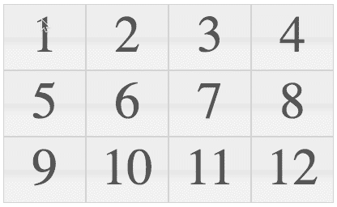
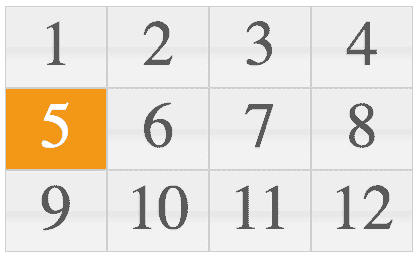
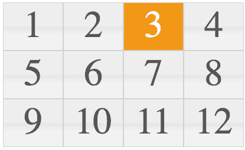
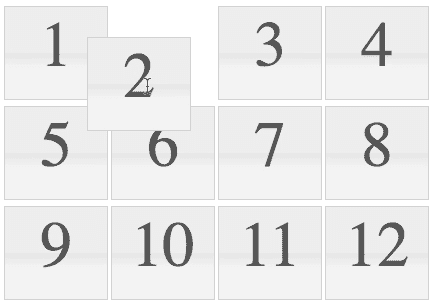
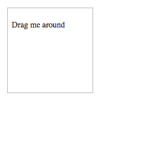
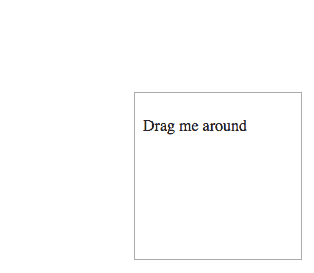
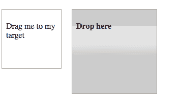
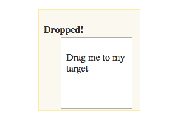
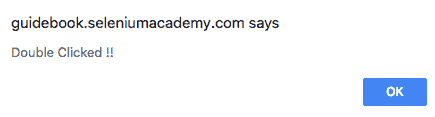
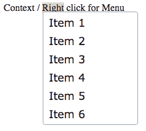

# 探索 WebDriver 的高级交互

在上一章中，我们讨论了 WebDriver 接口及其功能，包括截图、与窗口、框架、警报、cookie 和测试同步。在本章中，我们将介绍一些在 Web 元素上执行动作的高级方法。我们将学习如何使用 Selenium WebDriver 的动作 API 执行动作，包括以下内容：

+   复杂的鼠标操作，如移动鼠标、双击和拖放

+   键盘快捷键

# 理解构建和执行动作

我们知道如何执行一些基本操作，例如点击按钮和在文本框中输入文本；然而，有许多场景需要我们同时执行多个操作，例如，按住 *Shift* 键并输入大写字母的文本，以及鼠标拖放操作。

让我们看看一个简单的场景。打开 [`guidebook.seleniumacademy.com/Selectable.html`](http://guidebook.seleniumacademy.com/Selectable.html)。将出现一个编号为 1 到 12 的瓷砖框，如本截图所示：



如果你使用浏览器开发者工具检查元素，你会看到一个有序列表标签：

```java
<ol id="selectable" class="ui-selectable">
    <li class="ui-state-default ui-selectee" name="one">1</li>
    <li class="ui-state-default ui-selectee" name="two">2</li>
    <li class="ui-state-default ui-selectee" name="three">3</li>
    <li class="ui-state-default ui-selectee" name="four">4</li>
    <li class="ui-state-default ui-selectee" name="five">5</li>
    <li class="ui-state-default ui-selectee" name="six">6</li>
    <li class="ui-state-default ui-selectee" name="seven">7</li>
    <li class="ui-state-default ui-selectee" name="eight">8</li>
    <li class="ui-state-default ui-selectee" name="nine">9</li>
    <li class="ui-state-default ui-selectee" name="ten">10</li>
    <li class="ui-state-default ui-selectee" name="eleven">11</li>
    <li class="ui-state-default ui-selectee" name="twelve">12</li>
</ol>
```

如果你点击一个数字，其背景色将变为橙色。尝试选择 1、3 和 5 号瓷砖。你可以通过按住 *Ctrl* + 瓷砖 1 + 瓷砖 3 + 瓷砖 5 来完成这个操作。这涉及到执行多个动作，即持续按住 *Ctrl* 并点击瓷砖 1、3 和 5。我们如何使用 WebDriver 执行这些多个动作？以下代码演示了如何操作：

```java
@Test
public void shouldPerformCompositeAction() {

    driver.get("http://guidebook.seleniumacademy.com/Selectable.html");

    WebElement one = driver.findElement(By.name("one"));
    WebElement three = driver.findElement(By.name("three"));
    WebElement five = driver.findElement(By.name("five"));

    // Add all the actions into the Actions builder.
 Actions actions = new Actions(driver);
    actions.keyDown(Keys.CONTROL)
 .click(one)
 .click(three)
 .click(five)
 .keyUp(Keys.CONTROL);

    // Generate the composite action.
    Action compositeAction = actions.build();

    // Perform the composite action.
 compositeAction.perform();
}
```

现在，如果你查看代码，我们将介绍一个新的类名为 `Actions`。这个 `Actions` 类是用来模拟所有复杂用户事件的。使用它，测试脚本的开发者可以将所有必要的用户手势组合成一个组合动作。我们已经声明了所有要执行的动作，以实现点击数字 1、3 和 5 的功能。一旦所有动作都组合在一起，我们就将其构建成一个组合动作。`Action` 是一个接口，它只有一个 `perform()` 方法，用于执行组合动作。当我们执行测试时，1、3 和 5 号瓷砖将依次被选中。最后，5 号瓷砖将被选中，如本截图所示：



因此，要让 WebDriver 同时执行多个操作，你需要遵循一个三步过程：使用动作类的用户界面 API 将所有动作分组，然后构建组合动作，并执行动作。这个过程可以简化为两步，因为 `perform()` 方法内部会调用 `build()` 方法。所以之前的代码将看起来如下所示：

```java
@Test
public void shouldPerformAction() {

    driver.get("http://guidebook.seleniumacademy.com/Selectable.html");

    WebElement one = driver.findElement(By.name("one"));
    WebElement three = driver.findElement(By.name("three"));
    WebElement five = driver.findElement(By.name("five"));

    // Add all the actions into the Actions builder.
    Actions actions = new Actions(driver);
    actions.keyDown(Keys.CONTROL)
 .click(one)
 .click(three)
 .click(five)
 .keyUp(Keys.CONTROL);

    // Perform the action
    actions.perform();
}
```

在前面的代码中，我们直接在`Actions`实例上调用了`perform()`方法，该方法在执行之前内部调用`build()`方法来创建一个组合动作。在本章的后续部分，我们将更详细地探讨`Actions`类。所有动作基本上分为两类：基于鼠标的动作和基于键盘的动作。在接下来的章节中，我们将讨论`Actions`类中所有特定于鼠标和键盘的动作。

# 学习基于鼠标的交互

使用动作类可以执行大约八种不同的鼠标动作。我们将看到它们的语法和实际的工作示例。

# 移动偏移动作

`moveByOffset()`方法用于将鼠标从当前位置移动到网页上的另一个点。开发者可以指定鼠标需要移动的*x*轴和*y*轴的距离。当页面加载时，鼠标的初始位置通常是(0, 0)，除非页面有明确的焦点声明。

`moveByOffset()`方法的 API 语法如下：

```java
 public Actions moveByOffset(int xOffSet, int yOffSet)
```

在前面的代码中，`xOffSet`是输入参数，为 WebDriver 提供沿*x*轴移动的偏移量。正值用于将光标向右移动，负值用于将光标向左移动。

`yOffSet`是输入参数，为 WebDriver 提供沿*y*轴移动的偏移量。正值用于将光标沿*y*轴向下移动，负值用于将光标向上移动。

当`xOffSet`和`yOffSet`的值导致光标移出文档时，会抛出`MoveTargetOutOfBounds`异常。

让我们看看一个实际的工作示例。以下代码的目标是将光标移动到网页上的瓷砖 3 上：

```java
@Test
public void shouldMoveByOffSet() {

    driver.get("http://guidebook.seleniumacademy.com/Selectable.html");

    WebElement three = driver.findElement(By.name("three"));
    System.out.println("X coordinate: " + three.getLocation().getX()
            + ", Y coordinate: " + three.getLocation().getY());
 Actions actions = new Actions(driver);
    actions.moveByOffset(three.getLocation().getX() + 1, three.
 getLocation().getY() + 1);
    actions.perform();
}
```

输出将如下所示：



我们已经将坐标增加了`+1`，因为如果你在 Firebug 中观察元素，我们会有一个 1 像素的边框。边框是一个 CSS 样式属性，当应用于一个元素时，会在元素周围添加一个指定颜色的边框，并具有指定的厚度。尽管之前的代码确实将鼠标移动到了瓷砖 3 上，但我们没有意识到这一点，因为我们没有在那里执行任何操作。我们将在使用`moveByOffset()`方法和`click()`方法结合时很快看到这一点。

# 在当前位置点击动作

`click()`方法用于模拟鼠标在其当前位置的左键点击。此方法实际上并不确定点击的位置或元素。它只是在那个时间点点击任何地方。因此，此方法通常与其他动作结合使用，而不是独立使用，以创建组合动作。

`click()`方法的 API 语法如下：

`public Actions click()`。

`click()` 方法实际上并不关心它在何处执行其操作；因此，它不接受任何输入参数。让我们看看 `click()` 方法的代码示例：

```java
@Test
public void shouldMoveByOffSetAndClick() {

    driver.get("http://guidebook.seleniumacademy.com/Selectable.html");

    WebElement seven = driver.findElement(By.name("seven"));
    System.out.println("X coordinate: " + seven.getLocation().getX() +
            ", Y coordinate: " + seven.getLocation().getY());
 Actions actions = new Actions(driver);
    actions.moveByOffset(seven.getLocation().getX() + 1, seven.
 getLocation().getY() + 1).click();
    actions.perform();
}
```

在上述示例中，我们使用了 `moveByOffset()` 和 `click()` 方法的组合，将光标从点 (0, 0) 移动到第 7 个瓦片的点。因为鼠标的初始位置是 (0, 0)，所以 `moveByOffset()` 方法提供的 *x*、*y* 偏移量实际上就是第 7 个瓦片元素的位置。现在让我们尝试将光标从瓦片 1 移动到瓦片 11，然后从那里移动到瓦片 5，看看代码是如何的。在我们进入代码之前，让我们使用 Firebug 检查 `Selectable.html` 页面。以下每个瓦片的样式如下：

```java
#selectable li {
    float: left;
    font-size: 4em;
    height: 80px;
    text-align: center;
    width: 100px;
}
.ui-state-default, .ui-widget-content .ui-state-default, .ui-widgetheader .ui-state-default {
    background: url("images/ui-bg_glass_75_e6e6e6_1x400.png") repeat-x
    scroll 50% 50% #E6E6E6;
 border: 1px solid #D3D3D3;
    color: #555555;
    font-weight: normal;
}
```

在前面的样式代码中，我们关注于偏移移动的三个元素是：`height`、`width` 和 `border` 厚度。在这里，`height` 值是 `80px`，`width` 值是 `100px`，`border` 值是 `1px`。使用这三个因素来计算从一个瓦片导航到另一个瓦片的偏移量。请注意，任何两个瓦片之间的边框厚度将产生 `2 px`，即每个瓦片 `1 px`。以下使用 `moveByOffset` 和 `click()` 方法从瓦片 1 导航到瓦片 11，然后从那里导航到瓦片 5 的代码：

```java
@Test
public void shouldMoveByOffSetAndClickMultiple() {

    driver.get("http://guidebook.seleniumacademy.com/Selectable.html");

    WebElement one = driver.findElement(By.name("one"));
    WebElement eleven = driver.findElement(By.name("eleven"));
    WebElement five = driver.findElement(By.name("five"));
    int border = 1;
    int tileWidth = 100;
    int tileHeight = 80;
    Actions actions = new Actions(driver);

    //Click on One
    actions.moveByOffset(one.getLocation().getX() + border, one.getLocation().getY() + border).click();
    actions.build().perform();

    // Click on Eleven
    actions.moveByOffset(2 * tileWidth + 4 * border, 2 * tileHeight + 4 * border).click();
    actions.build().perform();

    //Click on Five
    actions.moveByOffset(-2 * tileWidth - 4 * border, -tileHeight - 2 * border).
            click();
    actions.build().perform();
}
```

# 点击 WebElement 操作

我们已经看到了如何通过计算偏移量来点击 WebElement。这个过程可能并不总是需要，尤其是当 WebElement 有自己的标识符，如名称或 ID 时。我们可以使用 `click()` 方法的另一个重载版本来直接点击 WebElement。

点击 WebElement 的 API 语法如下：

```java
public Actions click(WebElement onElement)
```

此方法的输入参数是应该执行 `click` 操作的 WebElement 实例。此方法，就像 `Actions` 类中的所有其他方法一样，将返回一个 `Actions` 实例。

现在让我们尝试修改之前的代码示例，使用 `click(WebElement)` 方法，而不是使用 `moveByOffset()` 方法，来移动到 WebElement 的位置，并使用 `click()` 方法点击它：

```java
@Test
public void shouldClickOnElement() {

    driver.get("http://guidebook.seleniumacademy.com/Selectable.html");

    WebElement one = driver.findElement(By.name("one"));
    WebElement eleven = driver.findElement(By.name("eleven"));
    WebElement five = driver.findElement(By.name("five"));
    Actions actions = new Actions(driver);

 //Click on One
    actions.click(one);
    actions.build().perform();

    // Click on Eleven
    actions.click(eleven);
    actions.build().perform();

    //Click on Five
    actions.click(five);
    actions.build().perform();
}
```

现在 `moveByOffset()` 方法已被 `click(WebElement)` 方法所取代，突然之间，复杂的坐标几何从代码中移除了。如果你是一名测试员，这又是一个推动你的开发者为 WebElement 提供标识符的好理由。

如果你观察了之前的 `moveByOffset` 和 `click` 方法的示例，所有移动鼠标和点击瓦片 1、11 和 5 的操作都是分别构建和执行的。这不是我们使用 `Actions` 类的方式。实际上，你可以将这些操作一起构建，然后执行。所以，前面的代码将变成如下所示：

```java
    @Test
    public void shouldClickOnElement() {

        driver.get("http://guidebook.seleniumacademy.com/Selectable.html");

        WebElement one = driver.findElement(By.name("one"));
        WebElement eleven = driver.findElement(By.name("eleven"));
        WebElement five = driver.findElement(By.name("five"));
        Actions actions = new Actions(driver);

 actions.click(one)
 .click(eleven)
 .click(five)
 .build().perform();
    }
```

# 在当前位置点击并保持操作

`clickAndHold()` 方法是动作类中的另一种方法，它会在元素上执行左键点击并保持，而不释放鼠标左键。当执行拖放等操作时，此方法将非常有用。这是动作类提供的 `clickAndHold()` 方法的变体之一。我们将在下一节讨论其他变体。

现在打开书中附带 的 `Sortable.html` 文件。你可以看到瓷砖可以从一个位置移动到另一个位置。现在让我们尝试将瓷砖 3 移动到瓷砖 2 的位置。完成此操作所涉及的步骤如下：

1.  将光标移动到瓷砖 3 的位置。

1.  点击并保持瓷砖 3。

1.  将光标移动到瓷砖 2 的位置。

现在，让我们看看如何使用 WebDriver 的 `clickAndHold()` 方法来实现这一点：

```java
@Test
public void shouldClickAndHold() {

    driver.get("http://guidebook.seleniumacademy.com/Sortable.html");

    Actions actions = new Actions(driver);

    //Move tile3 to the position of tile2
    actions.moveByOffset(200, 20)
 .clickAndHold()
 .moveByOffset(120, 0)
 .perform();
}
```

让我们分析以下代码行：

```java
actions.moveByOffset(200, 20)
 .clickAndHold()
 .moveByOffset(120, 0)
 .perform();
```

瓷砖的移动将类似于以下截图：



首先，我们将光标移动到瓷砖 3 的位置。然后，我们点击并保持瓷砖 3。接着，我们将光标水平移动 `120px` 到瓷砖 2 的位置。最后一行执行了所有前面的动作。现在在你的 eclipse 中执行这个操作，看看会发生什么。如果你仔细观察，瓷砖 3 并没有正确地移动到瓷砖 2 的位置。这是因为我们还没有释放左键。我们只是命令 WebDriver 进行点击并保持，但没有释放。

# 点击并保持一个 WebElement 动作

在上一节中，我们看到了 `clickAndHold()` 方法，它将在光标当前位置点击并保持一个 `WebElement`。它不关心它处理的是哪个元素。因此，如果我们想处理网页上的特定 `WebElement`，我们必须首先将光标移动到适当的位置，然后执行 `clickAndHold()` 动作。为了避免在几何上移动光标的麻烦，WebDriver 为开发者提供了 `clickAndHold()` 方法的另一个变体或重载方法，该方法接受 `WebElement` 作为输入。

API 语法如下：

```java
public Actions clickAndHold(WebElement onElement)
```

此方法的输入参数是要点击并保持的 `WebElement`。返回类型，如 `Actions` 类的所有其他方法一样，是 `Actions` 实例。现在让我们重构上一节的示例，使用此方法，如下所示：

```java
@Test
public void shouldClickAndHoldElement() {

    driver.get("http://guidebook.seleniumacademy.com/Sortable.html");

    Actions actions = new Actions(driver);
    WebElement three = driver.findElement(By.name("three"));

    //Move tile3 to the position of tile2
    actions.clickAndHold(three)
 .moveByOffset(120, 0)
 .perform();
}
```

唯一的改变是我们移除了将光标移动到 `(200, 20)` 位置的动作，并将 `WebElement` 传递给 `clickAndHold()` 方法，该方法将负责识别 `WebElement`。

# 在当前位置释放的动作

现在，在之前的示例中，我们看到了如何点击并保持一个元素。对保持的 `WebElement` 必须采取的最终动作是释放它，以便元素可以从鼠标中放下或释放。`release()` 方法是可以在 `WebElement` 上释放左鼠标按钮的方法。

`release()` 方法的 API 语法如下：`public Actions release()`。

前面的方法不接收任何输入参数，并返回 `Actions` 类实例。

现在，让我们修改前面的代码以包含 `release` 操作：

```java
@Test
public void shouldClickAndHoldAndRelease() {

    driver.get("http://guidebook.seleniumacademy.com/Sortable.html");

    WebElement three = driver.findElement(By.name("three"));
    Actions actions = new Actions(driver);

    //Move tile3 to the position of tile2
    actions.clickAndHold(three)
 .moveByOffset(120, 0)
 .release()
 .perform();
}
```

前面的代码将确保鼠标在指定位置释放。

# 在另一个 WebElement 上执行释放操作

这是 `release()` 方法的重载版本。使用它，您实际上可以在另一个 WebElement 的中间释放当前持有的 WebElement。这样，我们就不必计算目标 WebElement 从持有 WebElement 的偏移量。

API 语法如下：

```java
public Actions release(WebElement onElement)
```

前面方法的输入参数显然是目标 WebElement，其中应该放下持有的 WebElement。返回类型是 `Actions` 类的实例。

让我们修改前面的代码示例以使用此方法：

```java
@Test
public void shouldClickAndHoldAndReleaseOnElement() {

    driver.get("http://guidebook.seleniumacademy.com/Sortable.html");

    WebElement three = driver.findElement(By.name("three"));
    WebElement two = driver.findElement(By.name("two"));
    Actions actions = new Actions(driver);

    //Move tile3 to the position of tile2
    actions.clickAndHold(three)
 .release(two)
 .perform();
}
```

看看前面的代码有多简单。我们移除了所有的 `moveByOffset` 代码，并添加了接受名为 `two` 的 WebElement 作为输入参数的 `release()` 方法。

在不调用 `clickAndHold()` 方法的情况下调用 `release()` 或 `release(WebElement)` 方法将导致未定义的行为。

# 移动到元素操作

`moveToElement()` 方法是 WebDriver 的另一种方法，它帮助我们将鼠标光标移动到网页上的 WebElement。

`moveToElement()` 方法的 API 语法如下：

```java
public Actions moveToElement(WebElement toElement)
```

前面方法的输入参数是目标 WebElement，鼠标应该移动到那里。现在回到本章的 *当前位置点击并按住操作* 部分，尝试修改代码以使用此方法。以下是我们已在 *当前位置点击并按住操作* 部分编写的代码：

```java
@Test
public void shouldClickAndHold() {

    driver.get("http://guidebook.seleniumacademy.com/Sortable.html");

    Actions actions = new Actions(driver);

    //Move tile3 to the position of tile2
 actions.moveByOffset(200, 20)
 .clickAndHold()
 .moveByOffset(120, 0)
 .perform();
}
```

在前面的代码中，我们将用 `moveToElement(WebElement)` 方法替换 `moveByOffset(x, y)` 方法：

```java
@Test
public void shouldClickAndHoldAndMove() {

    driver.get("http://guidebook.seleniumacademy.com/Sortable.html");

    WebElement three = driver.findElement(By.name("three"));
    Actions actions = new Actions(driver);

    //Move tile3 to the position of tile2
    actions.moveToElement(three)
 .clickAndHold()
 .moveByOffset(120, 0)
 .perform();
}
```

在前面的代码中，我们已经移动到第 3 个瓦片，点击并按住它，然后移动到第 2 个瓦片的位置，通过指定其偏移量。如果您愿意，您可以在 `perform()` 方法之前添加 `release()` 方法。

完成相同任务可能有多种方式。这取决于用户选择最适合给定情况的方法。

# 拖放操作

可能会有很多需要拖放组件或网页上的 WebElement 的情况。我们可以通过使用到目前为止看到的大多数操作来完成。但是 WebDriver 给我们提供了一个方便的即用型方法。让我们看看它的 API 语法。

`dragAndDropBy()` 方法的 API 语法如下：

```java
public Actions dragAndDropBy(WebElement source, int xOffset,int yOffset)
```

`WebElement` 输入参数是要拖动的目标 WebElement，`xOffset` 参数是要移动的水平偏移量，而 `yOffset` 参数是要移动的垂直偏移量。

让我们看看一个代码示例。打开本书提供的 HTML 文件，`DragMe.html`。它有一个正方形框，如下面的截图所示：



您实际上可以将该矩形拖动到网页上的任何位置。让我们看看如何使用 WebDriver 实现这一点。以下是这个示例的代码：

```java
@Test
public void shouldDrag() {

    driver.get("http://guidebook.seleniumacademy.com/DragMe.html");

    WebElement dragMe = driver.findElement(By.id("draggable"));
    Actions actions = new Actions(driver);
    actions.dragAndDropBy(dragMe, 300, 200).perform();
}
```

在前面的代码中，`dragMe`是通过其`id`识别的`WebElement`，它被水平拖动`300px`和垂直拖动`200px`。以下屏幕截图显示了如何从该位置拖动元素：



# 拖动动作

`dragAndDrop()`方法与`dragAndDropBy()`方法类似。唯一的区别在于，我们不是通过偏移量移动`WebElement`，而是将其移动到目标元素上。

`dragAndDrop()`方法的 API 语法如下：

```java
public Actions dragAndDrop(WebElement source, WebElement target)
```

上述方法的输入参数是源`WebElement`和目标`WebElement`，返回类型是`Actions`类。

让我们看看一个实际工作的代码示例。打开与本书一起提供的`DragAndDrop.html`文件，其中包含两个正方形框，如图所示：



在这里，我们实际上可以将“拖动我到目标矩形”拖动到“在这里放下”矩形。试试看。让我们看看如何使用 WebDriver 实现这一点：

```java
@Test
public void shouldDragAndDrop() {

    driver.get("http://guidebook.seleniumacademy.com/DragAndDrop.html");

    WebElement src = driver.findElement(By.id("draggable"));
    WebElement trgt = driver.findElement(By.id("droppable"));
    Actions actions = new Actions(driver);
    actions.dragAndDrop(src, trgt).perform();
}
```

在前面的代码中，源和目标`WebElement`是通过它们的 ID 来识别的，并使用`dragAndDrop()`方法将一个拖动到另一个。这里，从下面的屏幕截图中的第一个正方形框被拖放到第二个框的脚本中：



# 在当前位置双击动作

接下来，我们将讨论另一种可以使用鼠标执行的动作，`doubleClick()`是 WebDriver 提供的另一种非常规方法，用于模拟鼠标的双击。这种方法，就像`click()`方法一样，有两种形式。一种是双击`WebElement`，我们将在下一节中讨论；另一种是在光标当前位置点击，这将在下面讨论。

API 语法如下：

```java
public Actions doubleClick()
```

显然，前面的方法不接收任何输入参数，因为它只是点击当前光标位置并返回一个动作类实例。让我们看看如何将前面的代码转换为使用此方法：

```java
@Test
public void shouldDoubleClick() {

    driver.get("http://guidebook.seleniumacademy.com/DoubleClick.html");

    WebElement dblClick= driver.findElement(By.name("dblClick"));
    Actions actions = new Actions(driver);
    actions.moveToElement(dblClick).doubleClick().perform();
}
```

在前面的代码中，我们使用了`moveToElement(WebElement)`方法将鼠标移动到按钮元素的位置，并在当前位置进行了双击。以下是执行样本页面上的元素双击后的输出：



# 双击`WebElement`动作

现在我们已经看到了一个在当前位置双击的方法，我们将讨论 WebDriver 提供的另一种模拟`WebElement`双击的方法。

`doubleClick()`方法的 API 语法如下：

```java
public Actions doubleClick(WebElement onElement)
```

前面方法的输入参数是要双击的目标 WebElement，返回类型是 `Actions` 类。

让我们看看这个的代码示例。打开 `DoubleClick.html` 文件，并 *单次* 点击 Click Me 按钮。你不应该看到任何动作发生。现在双击按钮；你应该看到一个提示说双击了 !!。现在我们将尝试使用 WebDriver 做同样的事情。以下是要做到这一点的代码：

```java
@Test
public void shouldDoubleClickElement() {
driver.get("http://guidebook.seleniumacademy.com/DoubleClick.html");

    WebElement dblClick = driver.findElement(By.name("dblClick"));
    Actions actions = new Actions(driver);
    actions.doubleClick(dblClick).perform();
}
```

执行上述代码后，你应该会看到一个提示对话框，说明按钮已被双击。

# 在 WebElement 上的上下文点击动作

`contextClick()` 方法，也称为 *右键点击*，在许多网页上现在相当常见。它显示一个类似于以下截图的菜单：



这个上下文菜单可以通过在 WebElement 上右键点击鼠标来访问。WebDriver 为开发者提供了一个使用 `contextClick()` 方法模拟该动作的选项。像许多其他方法一样，此方法也有两种变体。一个是点击当前位置，另一个是重载方法，点击 WebElement。让我们在这里讨论在 WebElement 上点击的上下文。

`contextClick()` 方法的 API 语法如下：

```java
public Actions contextClick(WebElement onElement)
```

输入参数显然是要右键点击的 WebElement，返回类型是 `Actions` 实例。像我们通常做的那样，现在是时候看看一个代码示例了。如果你打开 `ContextClick.html` 文件，你可以在页面上可见的文本上右键点击，它将显示上下文菜单。现在点击任何项都会弹出一个提示对话框，说明哪个项已被点击。现在让我们看看如何使用以下代码在 WebDriver 中实现这一点：

```java
@Test
public void shouldContextClick() {

    driver.get("http://guidebook.seleniumacademy.com/ContextClick.html");

    WebElement contextMenu = driver.findElement(By.id("div-context"));
    Actions actions = new Actions(driver);
    actions.contextClick(contextMenu)
 .click(driver.findElement(By.name("Item 4")))
 .perform();
}
```

在前面的代码中，我们首先使用 `contextClick()` 方法在 contextMenu WebElement 上进行了右键点击，然后从上下文菜单中点击了第 4 项。这应该会弹出一个提示对话框，说明已点击第 4 项。

# 当前位置的上下文点击动作

现在我们已经看到了在 WebElement 上进行上下文点击，现在是时候探索在当前鼠标位置上的 `contextClick()` 方法了。`contextClick()` 方法的 API 语法如下：

```java
public Actions contextClick()
```

如预期的那样，前面的方法不需要任何输入参数，并返回 `Actions` 实例。让我们看看为了使用此方法需要对前面的示例进行哪些必要的修改。以下是将代码重构以实现此目的的代码：

```java
@Test
public void shouldContextClickAtCurrentLocation() {

    driver.get("http://guidebook.seleniumacademy.com/ContextClick.html");

    WebElement contextMenu = driver.findElement(By.id("div-context"));
    Actions actions = new Actions(driver);
 actions.moveToElement(contextMenu)
 .contextClick()
 .click(driver.findElement(By.name("Item 4")))
 .perform();
}
```

前面的代码首先将光标移动到 `div-context` WebElement，然后对其进行上下文点击。

# 学习基于键盘的交互

到目前为止，我们已经看到了可以使用鼠标执行的所有动作。现在，我们需要看看`Actions`类中一些特定于键盘的动作。基本上，`Actions`类中有三种特定于键盘的不同动作，它们是`keyUp`、`keyDown`和`sendKeys`动作，每个动作都有两个重载方法。一个方法是在`WebElement`上直接执行动作，另一个方法是不考虑其上下文来执行方法。

# `keyDown`和`keyUp`动作

`keyDown()`方法用于模拟按下并保持键的动作。我们在这里引用的键是*Shift*、*Ctrl*和*Alt*键。`keyUp()`方法用于释放使用`keyDown()`方法按下的键。`keyDown()`方法的 API 语法如下：

```java
public Actions keyDown(Keys theKey) throws IllegalArgumentException
```

当传入的键不是*Shift*、*Ctrl*和*Alt*键之一时，会抛出`IllegalArgumentException`异常。`keyUp()`方法的 API 语法如下：

```java
public Actions keyUp(Keys theKey)
```

在一个键上执行`keyUp`动作，而该键上尚未执行`keyDown`动作，可能会导致一些意外的结果。因此，我们必须确保在执行`keyDown`动作之后执行`keyUp`动作。

# `sendKeys`方法

这用于在 Web 元素（如文本框、文本区域等）中输入字母数字和特殊字符键。这与`WebElement.sendKeys(CharSequence keysToSend)`方法不同，因为这个方法期望在调用之前 Web 元素已经获得焦点。`sendkeys()`方法的 API 语法如下：

```java
public Actions sendKeys(CharSequence keysToSend)
```

我们期望你使用`keyUp`、`keyDown`和`sendKeys()`方法编写一些关于这些键盘事件的测试脚本。

# 摘要

在本章中，我们学习了如何使用动作类创建一系列动作，并将它们构建成一个组合动作，通过`perform()`方法一次性执行。这样，我们可以将一系列复杂的用户动作聚合到一个单一的功能中，并一次性执行。在下一章中，我们将学习 WebDriver 事件以及如何使用 WebDriver 监听和执行高级动作。

# 问题

1.  对或错——拖放动作需要源元素和目标元素。

1.  列出我们可以使用 actions API 执行的键盘方法。

1.  哪个 actions API 方法可以帮助执行双击操作？

1.  使用 actions API，我们如何执行保存选项（即*Ctrl* + *S*）？

1.  我们如何使用 actions API 打开上下文菜单？

# 更多信息

您可以查看以下链接，了解更多关于本章所涉及主题的信息：

+   在[`github.com/SeleniumHQ/selenium/wiki/Advanced-User-Interactions`](https://github.com/SeleniumHQ/selenium/wiki/Advanced-User-Interactions)了解更多关于高级用户交互的内容

+   请参阅第四章节：*使用 Selenium API*，出自 Unmesh Gundecha 所著的《Selenium 测试工具手册》第二版，以及第六章节，*利用高级用户交互 API*，出自 Mark Collin 所著的《精通 Selenium WebDriver》，以获取更多关于动作 API 的示例。
