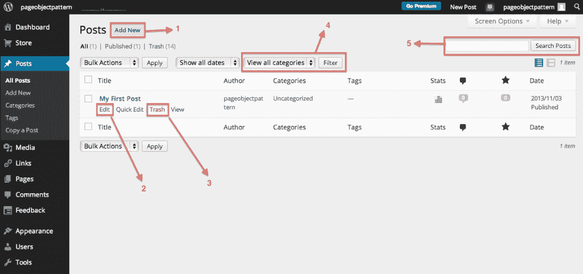
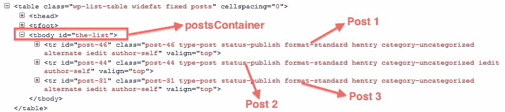

# 页面对象模式

到目前为止，我们已经看到了 WebDriver 的各种 API，并学习了如何使用它们来完成我们在测试的 Web 应用程序上的各种操作。我们创建了许多使用这些 API 的测试，并且它们会持续执行以验证应用程序。然而，随着你的测试套件的增长，你的测试和代码的复杂性也会增加。这成为了一个挑战，特别是关于你脚本和代码的可维护性。你需要设计一个可维护的、模块化的和可重用的测试代码，这样随着你添加更多的测试覆盖率，它也能扩展。在本章中，我们将探讨页面对象模式来构建一个高度可维护的测试套件。我们将涵盖以下主题：

+   页面对象模式设计是什么？

+   设计 PageObjects 的良好实践

+   页面对象模式的扩展

+   一个端到端示例

一个写得不错的测试脚本只要目标 Web 应用程序不改变就能正常工作。但是一旦你的 Web 应用程序中的一个或多个页面发生变化，作为一个测试脚本开发者，你不应该处于不得不在数百个不同地方重构你的测试脚本的位置。让我们通过一个例子更好地理解这个陈述。我们将通过在一个 WordPress 博客上工作来尝试通过这一章。在我们开始之前，我希望你创建一个 WordPress 博客([`wordpress.com/about`](http://wordpress.com/about))或者使用你现有的一个。

# 为我们的 WordPress 博客创建测试案例

在这里，我们使用了一个 WordPress 博客：[`demo-blog.seleniumacademy.com/wp/`](http://demo-blog.seleniumacademy.com/wp/)。在我们开始讨论页面对象模式之前，让我们为它创建三个测试案例。

# 测试案例 1 – 向我们的 WordPress 博客添加一篇新文章

以下测试脚本将登录我们 WordPress 博客的`Admin`门户并添加一篇新博客文章：

```java
@Test
public void testAddNewPost() {
    WebElement email = driver.findElement(By.id("user_login"));
    WebElement pwd = driver.findElement(By.id("user_pass"));
    WebElement submit = driver.findElement(By.id("wp-submit"));
    email.sendKeys("admin");
    pwd.sendKeys("$$SUU3$$N#");
    submit.click();

    // Go to AllPosts page
 driver.get("http://demo-blog.seleniumacademy.com/wp/wp-admin/edit.php");

 // Add New Post
 WebElement addNewPost = driver.findElement(By.linkText("Add New"));
 addNewPost.click();

    // Add New Post's Content
    WebElement title = driver.findElement(By.id("title"));
    title.click();
    title.sendKeys("My First Post");

    driver.switchTo().frame("content_ifr");
    WebElement postBody = driver.findElement(By.id("tinymce"));
    postBody.sendKeys("This is description");
    driver.switchTo().defaultContent();

    // Publish the Post
    WebElement publish = driver.findElement(By.id("publish"));
    publish.click();
}
```

以下是在前一段代码中执行的步骤序列：

1.  登录 WordPress `Admin`门户。

1.  前往所有文章页面。

1.  点击添加新文章按钮。

1.  通过提供标题和描述添加一篇新文章。

1.  发布文章。

# 测试案例 2 – 从我们的 WordPress 博客中删除文章

以下测试脚本将登录我们的 WordPress 博客并删除一篇现有文章：

```java
@Test
public void testDeleteAPost() {
    WebElement email = driver.findElement(By.id("user_login"));
    WebElement pwd = driver.findElement(By.id("user_pass"));
    WebElement submit = driver.findElement(By.id("wp-submit"));
    email.sendKeys("admin");
    pwd.sendKeys("$$SUU3$$N#");
    submit.click();

    // Go to AllPosts page
    driver.get("http://demo-blog.seleniumacademy.com/wp/wp-admin/edit.php");

    // Click on the post to be deleted
    WebElement post = driver.findElement(By.linkText("My First Post"));
    post.click();

    // Delete Post
    WebElement publish = driver.findElement(By.linkText("Move to Trash"));
    publish.click();
}
```

以下是在前一个测试脚本中遵循的步骤序列，以删除文章：

1.  登录 WordPress `Admin`门户。

1.  前往所有文章页面。

1.  点击要删除的文章。

1.  删除文章。

# 测试案例 3 – 计算我们 WordPress 博客上的文章数量

以下测试脚本将计算我们 WordPress 博客上当前可用的所有文章：

```java
@Test
public void testPostCount() {
    WebElement email = driver.findElement(By.id("user_login"));
    WebElement pwd = driver.findElement(By.id("user_pass"));
    WebElement submit = driver.findElement(By.id("wp-submit"));
    email.sendKeys("admin");
    pwd.sendKeys("$$SUU3$$N#");
    submit.click();

    // Count the number of posts
    driver.get("http://demo-blog.seleniumacademy.com/wp/wp-admin/edit.php");
    WebElement postsContainer = driver.findElement(By.id("the-list"));
    List postsList = postsContainer.findElements(By.
            tagName("tr"));

    Assert.assertEquals(postsList.size(), 1);
}
```

以下是在前一个测试脚本中遵循的步骤序列，以计算我们博客上当前可用的文章数量：

1.  登录`Admin`门户。

1.  前往所有文章页面。

1.  计算可用的文章数量。

在前面的三个测试脚本中，我们登录 WordPress 并执行操作，例如创建帖子、删除帖子或计算现有帖子的数量。想象一下，登录页面上的元素 ID 已经更改，我们必须在所有三个不同的测试用例中修改它；或者，如果所有帖子页面已更改，我们必须编辑所有三个测试用例以反映新的更改。如果你有 50 个测试用例，每次目标应用程序有更改时，都需要更改每个测试用例是非常困难的。为此，你需要设计一个测试框架，将你需要在测试用例中进行的更改保持在最小。PageObject 模式是一种可以用来设计你的测试框架的设计模式。

# 什么是 PageObject 模式？

每当我们为测试 Web 应用程序设计自动化框架时，我们必须接受这样一个事实：目标应用程序及其元素肯定会发生变化。一个高效的框架是一个需要最小重构来适应目标应用程序新变化的框架。让我们尝试将前面的测试场景构建到 PageObject 设计模式模型中。让我们首先开始构建登录页面的 PageObject。它应该看起来像以下这样：

```java
public class AdminLoginPage {

    WebDriver driver;
 WebElement email;
    WebElement password;
    WebElement submit; 
    public AdminLoginPage(WebDriver driver) {
        this.driver = driver;
        driver.get("http://demo-blog.seleniumacademy.com/wp/wp-admin");
        email = driver.findElement(By.id("user_login"));
        password = driver.findElement(By.id("user_pass"));
        submit = driver.findElement(By.id("wp-submit"));
    }

    public void login() {
        email.sendKeys("admin");
        password.sendKeys("$$SUU3$$N#");
        submit.click();
    }
}
```

因此，所有参与登录过程的元素都列在`AdminLoginPage`类中，并且有一个名为`login()`的方法，用于管理这些元素的填充并提交登录表单。因此，这个`AdminLoginPageobject`类将代表 WordPress 的管理登录页面，将页面上列出的所有元素作为成员变量，以及页面上可以执行的所有操作作为方法。现在，让我们看看我们需要如何重构测试用例以使用我们新创建的 PageObject。让我们考虑以下`testAddNewPost`测试用例：

```java
@Test
public void testAddNewPost() {

    AdminLoginPage admLoginPage = new AdminLoginPage(driver);
    admLoginPage.login();

    // Go to New Posts page
    driver.get("http://demo-blog.seleniumacademy.com/wp/wp-admin/edit.php");
    WebElement addNewPost = driver.findElement(By.linkText("Add New"));
            addNewPost.click();
    // Add New Post
    driver.switchTo().frame("content_ifr");
    WebElement postBody = driver.findElement(By.id("tinymce"));
    postBody.sendKeys("This is description");
    driver.switchTo().defaultContent();
    WebElement title = driver.findElement(By.id("title"));
    title.click();
    title.sendKeys("My First Post");
    WebElement publish = driver.findElement(By.id("publish"));
    publish.click();
}
```

在前面的测试用例中，登录管理页面的全部代码仅包含两行：

```java
AdminLoginPage admLoginPage = new AdminLoginPage(driver);
admLoginPage.login();
```

导航到管理员登录页面，识别元素，为元素提供值，并提交表单——所有这些操作都由 PageObject 处理。因此，从现在开始，测试用例不需要为管理员页面的任何更改进行重构。你只需更改 PageObject，所有使用此 PageObject 的测试用例将开始使用新的更改，甚至不知道它们已经发生。

现在你已经看到了 PageObject 的样子，Selenium 库提供了更多方便的方式来实现你的 PageObjects。让我们看看它们。

# 使用`@FindBy`注解

页面对象（PageObject）中的元素通过`@FindBy`注解进行标记。它用于指导 WebDriver 在页面上定位该元素。它接受定位机制（即通过`Id`、`Name`或`Class Name`）以及该定位机制下元素的值作为输入。

使用`@FindBy`注解有两种方式：

使用方式 1 如下所示：

```java
@FindBy(id="user_login")
WebElement userId;
```

使用方式 2 如下所示：

```java
@FindBy(how=How.ID, using="user_login")
WebElement userId; 
```

前两种用法指导 WebDriver 使用 ID 定位机制和`user_login`值定位元素，并将该元素分配给`userId` WebElement。在用法 2 中，我们使用了 How 枚举。这个枚举支持我们的`By`类支持的所有不同的定位机制。How 枚举中支持的枚举常量如下：

+   CLASS_NAME

+   CSS

+   ID

+   ID_OR_NAME

+   LINK_TEXT

+   NAME

+   PARTIAL_LINK_TEXT

+   TAG_NAME

+   XPATH

使用`@FindBy`注解，我们将看到我们的`AdminLoginPage`类是如何变化的：

```java
public class AdminLoginPage {

    WebDriver driver;

    @FindBy(id="user_login")
    WebElement email;

    @FindBy(id="user_pass")
    WebElement password;

    @FindBy(id="wp-submit")
    WebElement submit;

    public AdminLoginPage(WebDriver driver){
        this.driver = driver;
        driver.get("http://demo-blog.seleniumacademy.com/wp/wp-admin");
    }
    public void login(){
        email.sendKeys("pageobjectpattern@gmail.com");
        password.sendKeys("webdriver123");
        submit.click();
    }
}
```

当测试用例在构造函数中实例化前面的类时，我们使用构造函数中指定的以下代码导航到 WordPress 登录页面：

```java
driver.get("http://demo-blog.seleniumacademy.com/wp/wp-admin");
```

一旦将驱动状态设置为该页面，所有使用`FindBy`声明的元素，即`email`、`password`和`submit`，都将由 WebDriver 使用在`FindBy`注解中指定的定位机制初始化。

# 理解 PageFactory

WebDriver 库提供的另一个重要类是支持 PageObject 模式的`PageFactory`类。一旦`PageObject`类使用`FindBy`注解声明了元素，您就可以使用`PageFactory`类实例化该`PageObject`类及其元素。该类支持一个名为`initElements`的静态方法。此方法的 API 语法如下：

```java
initElements(WebDriver driver, java.lang.Class PageObjectClass)
```

现在，让我们看看如何在我们的测试用例中使用它来创建`AdminLoginPage`：

```java
public class TestAddNewPostUsingPageObjects { public static void main(String... args){
AdminLoginPage loginPage= PageFactory
.initElements(driver, AdminLoginPage.class);
loginPage.login();
```

`PageFactory`类实例化了`AdminLoginPage`类，并给它提供了驱动实例。`AdminLoginPage`页面对象将驱动实例导航到 URL（[`demo-blog.seleniumacademy.com/wp/wp-admin`](http://demo-blog.seleniumacademy.com/wp/wp-admin)，在这种情况下），然后填充所有带有`FindBy`注解的元素。

# PageObjects 设计的良好实践

因此，现在你已经看到了 PageObject 的简单实现，是时候考虑一些设计 PageObjects 的测试框架的良好实践了。

# 将网页视为服务提供商

从高层次来看，当你查看一个 Web 应用程序中的页面时，你会发现它是由各种用户服务聚合而成的。例如，如果你查看我们 WordPress 管理控制台中的所有帖子页面，它包含许多部分：



在前面的屏幕截图中，在“所有帖子”页面，用户可以执行以下五个操作：

+   添加一篇新帖子。

+   编辑选定的帖子。

+   删除选定的帖子。

+   通过分类过滤帖子。

+   在所有帖子中搜索文本。

前面的活动是所有帖子页面提供给用户的服务。因此，你的页面对象也应该为测试用例提供这些服务，这是页面对象的用户。所有帖子页面对象的代码应如下所示：

```java
public class AllPostsPage {

    WebDriver driver;
    @FindBy(id = "the-list")
    WebElement postsContainer;

    @FindBy(id = "post-search-input")
    WebElement searchPosts;

    @FindBy(id = "cat")
    WebElement viewByCategories;

    public AllPostsPage(WebDriver driver) {
        this.driver = driver;
        driver.get("http://demo-blog.seleniumacademy.com/wp/wp-admin/edit.php");
    }

    public void createANewPost(String title, String description) {
    }

    public void editAPost(String title) {
    }

    public void deleteAPost(String postTitle) {
    }

    public void filterPostsByCategory(String category) {
    }

    public void searchInPosts(String searchText) {
    }
}
```

现在，我们已经将页面上的识别服务映射到我们的页面对象的相应方法上。当测试用例想要执行一个服务时，它将从页面对象那里获得帮助来完成这个任务。

# 总是寻找隐含的服务

页面上的某些服务可以非常清楚地识别出来。还有一些服务在页面上是不可见的，但却是隐含的。例如，仅通过查看页面，我们就已经识别了五个服务。但假设你的测试用例想要知道现有帖子的数量；这个信息在所有帖子页面上是可用的，我们必须确保你的页面对象提供这个隐含服务。现在你扩展你的所有帖子页面页面对象以包含这个隐含服务，如下所示：

```java
public class AllPostsPage {

    WebDriver driver;

    @FindBy(id = "the-list")
    WebElement postsContainer;

    @FindBy(id = "post-search-input")
    WebElement searchPosts;

    @FindBy(id = "cat")
    WebElement viewByCategories;

    public AllPostsPage(WebDriver driver) {
        this.driver = driver;
        driver.get("http://demo-blog.seleniumacademy.com/wp/wp-admin/edit.php");
    }

    public void createANewPost(String title, String description) {
    }

    public void editAPost(String title) {
    }

    public void deleteAPost(String postTitle) {
    }

    public void filterPostsByCategory(String category) {
    }

    public void searchInPosts(String searchText) {
    }

 public int getAllPostsCount(){
 }
}
```

现在您的测试用例可以使用相同的页面对象来使用与所有帖子页面相关的隐含服务。

# 在页面对象中使用页面对象

将会有很多需要你在页面对象中使用页面对象的情况。让我们通过所有帖子页面上的一个场景来分析这一点。当你点击“添加新帖子”来添加新帖子时，浏览器实际上会导航到另一个页面。因此，你必须创建两个页面对象，一个用于所有帖子页面，另一个用于“添加新帖子”页面。将你的页面对象设计成模拟我们目标应用的精确行为将使事情非常清晰，并且相互独立。你可能可以通过几种不同的方式导航到“添加新帖子”页面。为“添加新帖子”页面创建一个自己的页面对象并在需要的地方使用它，将使你的测试框架遵循良好的面向对象原则，并使测试框架的维护变得容易。让我们看看在页面对象中使用页面对象会是什么样子。

# AddNewPost 页面对象

`AddNewPost`页面对象添加新帖子，如下面的代码所示：

```java
public class AddNewPostPage {

    WebDriver driver;

    @FindBy(id = "content_ifr")
    WebElement newPostContentFrame;

    @FindBy(id = "tinymce")
    WebElement newPostContentBody;

    @FindBy(id = "title")
    WebElement newPostTitle;

    @FindBy(id = "publish")
    WebElement newPostPublish;

    public AddNewPostPage(WebDriver driver) {
        this.driver = driver;
    }

    public void addNewPost(String title, String descContent) {
        newPostTitle.click();
        newPostTitle.sendKeys(title);
        driver.switchTo().frame(newPostContentFrame);
        newPostContentBody.sendKeys(descContent);
        driver.switchTo().defaultContent();
        newPostPublish.click();
    }
}
```

# AllPostsPage 页面对象

`AllPostsPage`页面对象处理`所有帖子页面`，如下面的代码所示：

```java
public class AllPostsPage {

    WebDriver driver;

    @FindBy(id = "the-list")
    WebElement postsContainer;

    @FindBy(id = "post-search-input")
    WebElement searchPosts;

    @FindBy(id = "cat")
    WebElement viewByCategories;

    @FindBy(linkText = "Add New")
    WebElement addNewPost;

    public AllPostsPage(WebDriver driver) {
        this.driver = driver;
        driver.get("http://demo-blog.seleniumacademy.com/wp/wp-admin/edit.php");
    }

    public void createANewPost(String title, String description) {
        addNewPost.click();
        AddNewPostPage newPost = PageFactory.initElements(driver,
                AddNewPostPage.class);
        newPost.addNewPost(title, description);
    }

    public void editAPost(String title) {
    }

    public void deleteAPost(String title) {
    }

    public void filterPostsByCategory(String category) {
    }

    public void searchInPosts(String searchText) {
    }

    public int getAllPostsCount() {
    }  
}
```

现在，正如你在`AllPostsPage`页面对象中看到的那样，我们在`createNewPost()`方法中实例化了`AddNewPage`页面对象。因此，我们正在使用一个页面对象来调用另一个页面对象，并尽可能使行为接近目标应用。

# 将页面对象中的方法视为服务而不是用户操作

有时可能会对哪些方法构成页面对象产生混淆。我们之前看到每个页面对象都应该包含用户服务作为其方法。但很常见的是，我们在几个测试框架中看到一些页面对象的实现，它们将用户操作作为方法。那么`用户服务`和`用户操作`之间的区别是什么？正如我们之前看到的，WordPress 管理控制台上的用户服务的一些例子如下：

+   创建新帖子

+   删除帖子

+   编辑帖子

+   在帖子中搜索

+   过滤帖子

+   计算所有现有帖子

所有的上述服务都讨论了目标应用程序的各种功能。现在，让我们看看一些`用户操作`的例子：

+   鼠标点击

+   在文本框中输入文本

+   导航到页面

+   点击复选框

+   从下拉列表中选择一个选项

之前的列表展示了页面上的`用户操作`的一些示例。这些操作在许多应用程序中都很常见。你的页面对象不是为了向测试用例提供`用户操作`，而是提供`用户服务`。因此，你的页面对象中的每个方法都应该映射到目标页面提供给用户的某个服务。为了完成一个用户服务，页面对象的方法应该包含许多`用户操作`。

几个用户操作组合在一起以完成一个用户服务。

如果你的页面对象使用用户操作而不是用户服务来提供方法，它将看起来如下；让我们看看`AddNewPage`页面对象将是什么样子：

```java
public class AddNewPost {

    WebDriver driver;

    @FindBy(id = "content_ifr")
    WebElement newPostContentFrame;

    @FindBy(id = "tinymce")
    WebElement newPostContentBody;

    @FindBy(id = "title")
    WebElement newPostTitle;

    @FindBy(id = "publish")
    WebElement newPostPublish;

    public AddNewPost(WebDriver driver) {
        this.driver = driver;
        System.out.println(driver.getCurrentUrl());
    }

    public void typeTextinTitle(String title) {
        newPostTitle.sendKeys(title);
    }

    public void clickPublishButton() {
        newPostPublish.click();
    }

    public void typeTextinContent(String descContent) {
        driver.switchTo().frame(newPostContentFrame);
        newPostContentBody.sendKeys(descContent);
    }
}
```

因此，在`AddNewPage`页面对象的代码中，我们有三个不同的方法来完成三个不同的用户操作。调用对象，现在应该调用以下方法，而不是仅仅调用`addNewPage(String title, String description)`方法：

```java
typeTextinTitle(String title)
typeTextinContent(String description)
clickPublishButton()
```

上述用户操作是三个不同的用户操作，用于完成添加新帖子用户服务。这些方法的调用者也应该记住这些用户操作需要调用的顺序；也就是说，`clickPublishButton()`方法应该始终放在最后。这给测试用例和其他试图向系统中添加新帖子的页面对象引入了不必要的复杂性。因此，用户服务将隐藏页面对象用户的大部分实现细节，并减少维护测试用例的成本。

# 动态识别一些 Web 元素

在所有的页面对象中，我们使用`@FindBy`注解初始化了我们将在对象实例化期间使用的元素。总是很好，能够识别出完成一个用户服务所需的页面上的所有元素，并将它们分配给页面对象中的成员变量。然而，并不总是能够做到这一点。例如，如果你想编辑所有帖子页面上的一个特定帖子，在页面对象初始化期间，并不强制要求将页面上的每个帖子映射到页面对象的成员变量。当你有大量帖子时，页面对象的初始化将会花费不必要的时间将帖子映射到成员变量，即使我们并不使用它们。此外，我们甚至不知道需要映射多少成员变量才能将所有帖子映射到所有帖子页面。所有帖子页面的 HTML 如下所示：



有一个通过 `the-list` 识别的根元素，其中包含 WordPress 博客中的所有帖子。在这个元素内部，我们可以看到有 Post1、Post2 和 Post3。因此，为所有三个帖子初始化你的 PageObject 不是一个最佳解决方案。你可以使用一个成员变量初始化你的 PageObject，该变量映射到根元素，并且目标帖子将在需要时从其中检索。

让我们看看 `AllPostsPage` PageObject 是如何实现其 `editPost()` 方法的，如下所示：

```java
public void editAPost(String presentTitle,
                      String newTitle, String description){
    List<WebElement> allPosts
            = postsContainer.findElements(By.className("rowtitle"));
    for(WebElement ele : allPosts){
        if(ele.getText().equals(presentTitle)){
            Actions builder = new Actions(driver);
            builder.moveToElement(ele);
            builder.click(driver.findElement(
                    By.cssSelector(".edit>a")));
            // Generate the composite action.
            Action compositeAction = builder.build();
            // Perform the composite action.
            compositeAction.perform();
            break;
        }
    }
    EditPost editPost
            = PageFactory.initElements(driver, EditPost.class);
    editPost.editPost(newTitle, description);
}
```

注意，在之前的代码中，只有根元素通过 `the-list` 被识别；包含所有帖子的“所有帖子”页面中的元素被映射到一个成员变量，在 `AllPostsPage` 页面对象中命名为 `pageContainer`。目标帖子仅在 `editAPost()` 方法中需要时才被提取。这样，你的 PageObject 初始化不需要花费太多时间，并且已经映射了所有必要的元素。

# 将页面特定的细节从测试脚本中分离出来

PageObject 模式设计的最终目的是将页面特定的细节，例如页面上的元素 ID 和我们到达应用程序中特定页面的方式，从测试脚本中分离出来。使用 PageObject 模式构建你的测试框架应该允许你保持测试脚本非常通用，并且不需要在页面实现细节更改时进行修改。最后，每当对网页进行更改时，例如登录页面，对于使用此页面的 50 个测试脚本，理想情况下需要进行的更改数量应该是 0。只需更改 PageObject 就可以处理适应所有测试的新更改。

# 理解可加载组件

可加载组件是 PageObject 模式的一个扩展。WebDriver 库中的 `LoadableComponent` 类将帮助测试用例开发者确保页面或页面组件已成功加载。这极大地减少了调试测试用例的努力。PageObject 应该扩展这个 LoadableComponent 抽象类，因此它必须提供以下两个方法的实现：

```java
protected abstract void load()
protected abstract void isLoaded() throws java.lang.Error
```

在 `load()` 和 `isLoaded()` 方法中需要加载的页面或组件确定页面或组件是否已完全加载。如果没有完全加载，它将抛出一个错误。

现在让我们修改 `AdminLoginPage` PageObject 以扩展 LoadableComponent 类，并看看它看起来如何，如下面的代码所示：

```java
public class AdminLoginPageUsingLoadableComponent extends LoadableComponent<AdminLoginPageUsingLoadableComponent> {

    WebDriver driver;

    @FindBy(id = "user_login")
    WebElement email;

    @FindBy(id = "user_pass")
    WebElement password;

    @FindBy(id = "wp-submit")
    WebElement submit;

    public AdminLoginPageUsingLoadableComponent(WebDriver driver) {
        this.driver = driver;
        PageFactory.initElements(driver, this);
    }

    public AllPostsPage login(String username, String pwd) {
        email.sendKeys(username);
        password.sendKeys(pwd);
        submit.click();
        return PageFactory.initElements(driver, AllPostsPage.class);
    }

    @Override
    protected void load() {
        driver.get("http://demo-blog.seleniumacademy.com/wp/wp-admin");
    }

    @Override
    protected void isLoaded() throws Error {
        Assert.assertTrue(driver.getCurrentUrl().contains("wp-admin"));
    }
}
```

需要加载的 URL 在 `load()` 方法中指定，而 `isLoaded()` 方法验证是否正确加载了页面。现在，你的测试用例中需要进行的更改如下：

```java
AdminLoginPageUsingLoadableComponent loginPage = new AdminLoginPageUsingLoadableComponent(driver).get();
```

`LoadableComponent` 类中的 `get()` 方法将确保通过调用 `isLoaded()` 方法来加载组件。

# 在 WordPress 的端到端示例上工作

现在我们已经了解了页面对象是什么，是时候看看一个端到端示例，该示例交互并测试 WordPress 管理控制台了。首先，我们将看到所有页面对象，然后是使用它们的测试用例。

# 查看所有页面对象

让我们先看看所有参与测试 WordPress 管理控制台的页面对象。

# `AdminLoginPage` 页面对象

`AdminLoginPage` 页面对象处理登录页面。如果目标应用中的页面有任何更改，这个对象必须进行重构，使用以下代码：

```java
package com.packt.webdriver.chapter9.pageObjects; 
import org.openqa.selenium.WebDriver;
public class AdminLoginPage {

    WebDriver driver;

    @FindBy(id = "user_login")
    WebElement email;

    @FindBy(id = "user_pass")
    WebElement password;

    @FindBy(id = "wp-submit")
    WebElement submit;

    public AdminLoginPage(WebDriver driver) {
        this.driver = driver;
        driver.get("http://demo-blog.seleniumacademy.com/wp/wp-admin");
    }

    public AllPostsPage login(String username, String pwd) {
        email.sendKeys(username);
        password.sendKeys(pwd);
        submit.click();
        return PageFactory.initElements(driver,
                AllPostsPage.class);
    }
}
```

`AdminLoginPage` 页面对象的构造函数接受 WebDriver 实例。这将允许测试框架在整个测试脚本执行过程中以及页面对象中使用相同的驱动实例；因此，浏览器和 Web 应用的状态得以保留。您将看到所有页面对象都有类似的构造函数。除了构造函数之外，`AdminLoginPage` 页面对象还提供了 `login(String username, String pwd)` 服务。这个服务允许测试脚本登录到 WordPress 博客，并返回 `AllPostsPage` 页面对象。在返回 `AllPostsPage` 页面对象的实例之前，PageFactory 页面对象将初始化 `AllPostsPage` 页面对象的所有 Web 元素。因此，登录服务的所有实现细节都隐藏在测试脚本中，它可以与 `AllPostsPage` 页面对象一起工作。

# `AllPostsPage` 页面对象

`AllPostsPage` 页面对象处理所有帖子页面，使用以下代码：

```java
public class AllPostsPage {

    WebDriver driver;

    @FindBy(id = "the-list")
    WebElement postsContainer;

    @FindBy(id = "post-search-input")
    WebElement searchPosts;

    @FindBy(id = "cat")
    WebElement viewByCategories;

    @FindBy(linkText = "Add New")
    WebElement addNewPost;

    public AllPostsPage(WebDriver driver) {
        this.driver = driver;
        driver.get("http://demo-blog.seleniumacademy.com/wp/wp-admin/edit.php");
    }

    public void createANewPost(String title, String description) {
        addNewPost.click();
        AddNewPostPage newPost = PageFactory.initElements(driver,
                AddNewPostPage.class);
        newPost.addNewPost(title, description);
    }

    public void editAPost(String presentTitle, String newTitle,
                          String description) {
        goToParticularPostPage(presentTitle);
        EditPostPage editPost = PageFactory.initElements(driver,
                EditPostPage.class);
        editPost.editPost(newTitle, description);
    }

    public void deleteAPost(String title) {
        goToParticularPostPage(title);
        DeletePostPage deletePost =
                PageFactory.initElements(driver, DeletePostPage.class);
        deletePost.delete();
    }

    public void filterPostsByCategory(String category) {
    }

    public void searchInPosts(String searchText) {
    }

    public int getAllPostsCount() {
        List<WebElement> postsList = postsContainer.findElements(By.tagName("tr"));
        return postsList.size();
    }

    private void goToParticularPostPage(String title) {
        List<WebElement> allPosts
                = postsContainer.findElements(By.className("title"));
        for (WebElement ele : allPosts) {
            if (ele.getText().equals(title)) {
                Actions builder = new Actions(driver);
                builder.moveToElement(ele);
                builder.click(driver.findElement(
                        By.cssSelector(".edit>a")));
                // Generate the composite action.
                Action compositeAction = builder.build();
                // Perform the composite action.
                compositeAction.perform();
                break;
            }
        }
    }
}
```

`AllPostsPage` 页面对象提供了六个服务：

+   创建帖子

+   编辑帖子

+   删除帖子

+   通过分类过滤帖子

+   在帖子中搜索文本

+   计算可用的帖子数量

一旦测试脚本通过 `AdminLoginPage` 页面对象的登录服务获取了这个页面对象的实例，它就可以使用这个页面对象的六个服务之一进行测试。如果实现细节有任何变化，例如导航到特定帖子或页面上 WebElement 的 ID，测试脚本实际上不必担心。修改这个页面对象将应用到 WordPress 博客上。

# `AddNewPostPage` 页面对象

`AddNewPostPage` 页面对象处理向博客添加新帖子，使用以下代码：

```java
package com.example;

import org.openqa.selenium.WebDriver;
import org.openqa.selenium.WebElement;
import org.openqa.selenium.support.FindBy;

public class AddNewPostPage {

    WebDriver driver;

    @FindBy(id = "content_ifr")
    WebElement newPostContentFrame;

    @FindBy(id = "tinymce")
    WebElement newPostContentBody;

    @FindBy(id = "title")
    WebElement newPostTitle;

    @FindBy(id = "publish")
    WebElement newPostPublish;

    public AddNewPostPage(WebDriver driver) {
        this.driver = driver;
    }

    public void addNewPost(String title, String descContent) {
        newPostTitle.click();
        newPostTitle.sendKeys(title);
        driver.switchTo().frame(newPostContentFrame);
        newPostContentBody.sendKeys(descContent);
        driver.switchTo().defaultContent();
        newPostPublish.click();
    }
}
```

`AddNewPostPage` 页面对象在 `AllPostsPage` 页面对象的 `createANewPost` 服务中被实例化。这个页面对象提供了一个名为 `addNewPost` 的服务，它接受帖子的 `title` 和 `description` 输入，并使用这些信息在博客中发布一篇新帖子。

# `EditPostPage` 页面对象

`EditPostPage` 页面对象处理编辑现有帖子，使用以下代码：

```java
package com.example;

import org.openqa.selenium.WebDriver;
import org.openqa.selenium.WebElement;
import org.openqa.selenium.support.FindBy;

public class EditPostPage {

    WebDriver driver;

    @FindBy(id = "content_ifr")
    WebElement newPostContentFrame;

    @FindBy(id = "tinymce")
    WebElement newPostContentBody;

    @FindBy(id = "title")
    WebElement newPostTitle;

    @FindBy(id = "publish")
    WebElement newPostPublish;

    public EditPostPage(WebDriver driver) {
        this.driver = driver;
        System.out.println(driver.getCurrentUrl());
    }

    public void editPost(String title, String descContent) {
        newPostTitle.click();
        newPostTitle.clear();
        newPostTitle.sendKeys(title);
        driver.switchTo().frame(newPostContentFrame);
        newPostContentBody.clear();
        newPostContentBody.sendKeys(descContent);
        driver.switchTo().defaultContent();
        newPostPublish.click();
    }
}
```

`EditPostPage` 页面对象类似于 `AddNewPostPage` 页面对象，并在 `AllPostsPage` 页面对象的 `editAPost` 服务中实例化。这提供了一个名为 `editPost` 的服务，用于编辑现有帖子。新的 `title` 和 `description` 作为输入参数传递给此服务。

# DeletePostPage 页面对象

`DeletePostPage` 页面对象通过以下代码处理删除现有帖子：

```java
package com.example;

import org.openqa.selenium.WebDriver;
import org.openqa.selenium.WebElement;
import org.openqa.selenium.support.FindBy;

public class DeletePostPage {

    WebDriver driver;

    @FindBy(linkText = "Move to Trash")
    WebElement moveToTrash;

    public DeletePostPage(WebDriver driver) {
        this.driver = driver;
        System.out.println(driver.getCurrentUrl());
    }

    public void delete() {
        moveToTrash.click();
    }
}
```

`DeletePostPage` 页面对象类似于 `AddNewPostPage` 和 `EditPostPage` 页面对象，并在 `AllPostsPage` 页面对象的 `deleteAPost` 服务中实例化。这提供了一个名为 `delete` 的服务，用于删除现有帖子。正如您所看到的，`AddNewPostPage`、`EditPostPage` 和 `DeletePostPage` 页面对象都会带您到同一个页面。因此，将这三个页面对象合并为一个提供添加、编辑和删除帖子服务的页面对象是有意义的。

# 查看测试用例

现在是时候查看使用页面对象与 WordPress 管理控制台交互的测试用例了。

# 添加新帖子

此测试用例通过以下代码处理向博客添加新帖子：

```java
package com.example;

import org.openqa.selenium.WebDriver;
import org.openqa.selenium.chrome.ChromeDriver;
import org.openqa.selenium.support.PageFactory;

import org.testng.annotations.AfterMethod;
import org.testng.annotations.BeforeMethod;
import org.testng.annotations.Test;

public class WordPressBlogTestsWithPageObject {

    WebDriver driver;
    String username = "admin";
    String password = "$$SUU3$$N#";

    @BeforeMethod
    public void setup() {

        System.setProperty("webdriver.chrome.driver",
                "./src/test/resources/drivers/chromedriver");
        driver = new ChromeDriver();
    }

    @Test
    public void testAddNewPost() {
        AdminLoginPage loginPage =
                PageFactory.initElements(driver, AdminLoginPage.class);
        AllPostsPage allPostsPage = loginPage.login(username, password);
        allPostsPage.createANewPost("Creating New Post using PageObjects",
                "Its good to use PageObjects");
    }

    @AfterMethod
    public void tearDown() {
        driver.quit();
    }

}
```

以下是在先前的测试脚本中执行的步骤序列，以测试如何将新帖子添加到 WordPress 博客中：

1.  测试脚本创建一个 ChromeDriver 实例，因为它打算测试在 Chrome 浏览器上添加新帖子到博客的场景。

1.  它创建了一个与之前步骤中创建的相同驱动实例的 `AdminLoginPage` 页面对象实例。

1.  一旦它获取到 `AdminLoginPage` 页面对象的实例，它就使用 `login` 服务登录到 WordPress 管理控制台。`login` 服务作为回报，向测试脚本提供一个 `AllPostsPage` 页面对象的实例。

1.  测试脚本使用在先前的步骤中获得的 `AllPostsPage` 页面对象的实例，使用 `All Posts page` 提供的许多服务之一。在这种情况下，它使用 `createANewPost` 服务。

# 编辑帖子

此测试用例通过以下代码处理博客中帖子的测试和编辑：

```java
@Test
public void testEditPost() {
    AdminLoginPage loginPage =
            PageFactory.initElements(driver, AdminLoginPage.class);
    AllPostsPage allPostsPage = loginPage.login(username, password);
    allPostsPage.editAPost("Creating New Post using PageObjects",
            "Editing Post using PageObjects", "Test framework low maintenance");
}
```

以下是在先前的测试脚本中执行的步骤序列，以测试如何将新帖子添加到 WordPress 博客中：

1.  它创建了一个与之前步骤中创建的相同驱动实例的 `AdminLoginPage` 页面对象实例。

1.  一旦它获取到 `AdminLoginPage` 页面对象的实例，它就使用 `login` 服务登录到 WordPress 管理控制台。`login` 服务作为回报，向测试脚本提供一个 `AllPostsPage` 页面对象的实例。

1.  测试脚本使用在先前的步骤中获得的 `AllPostsPage` 页面对象的实例，使用 All Posts 页面提供的许多服务之一。在这种情况下，它使用 `createANewPost` 服务。

# 删除帖子

此测试用例通过以下代码处理删除帖子：

```java
@Test (dependsOnMethods = "testEditPost")
public void testDeletePost() {
    AdminLoginPage loginPage =
            PageFactory.initElements(driver, AdminLoginPage.class);
    AllPostsPage allPostsPage = loginPage.login(username, password);
    allPostsPage.deleteAPost("Editing Post using PageObjects");
}
```

以下是在先前的测试脚本中执行以测试 WordPress 博客中删除帖子步骤的顺序：

1.  它创建了一个使用之前步骤中创建的相同驱动实例的`AdminLoginPage` PageObject 实例。

1.  一旦它获得了`AdminLoginPage` PageObject 的实例，它就使用`login`服务登录 WordPress 管理控制台。`login`服务作为回报，向测试脚本提供一个`AllPostsPage` PageObject 实例。

1.  测试脚本使用在上一步骤中获得的`AllPostsPage` PageObject 的实例来使用所有帖子页面提供的许多服务之一。在这种情况下，它使用了`deleteAPost`服务。

# 帖子计数

此测试用例处理博客中当前可用的帖子数量的计数，使用以下代码：

```java
@Test 
public void testCountPost() {
    AdminLoginPage loginPage =
            PageFactory.initElements(driver, AdminLoginPage.class);
    AllPostsPage allPostsPage = loginPage.login(username, password);
    Assert.assertEquals(allPostsPage.getAllPostsCount(), 1);
}
```

以下是在先前的测试脚本中执行以测试 WordPress 博客中帖子计数步骤的顺序：

1.  它创建了一个使用之前步骤中创建的驱动实例的`AdminLoginPage` PageObject 实例。

1.  一旦它获得了`AdminLoginPage` PageObject 的实例，它就使用`login`服务登录 WordPress 管理控制台。`login`服务作为回报，向测试脚本提供一个`AllPostsPage` PageObject 实例。

1.  测试脚本使用在上一步骤中获得的`AllPostsPage` PageObject 的实例来使用所有帖子页面提供的许多服务之一。在这种情况下，它使用了`getAllPostsCount`服务。

# 摘要

在本章中，我们学习了 PageObject 模式以及我们如何使用 PageObjects 实现测试框架。它具有许多优点。PageObject 模式和`LoadableComponents`类提供了一个易于适应目标应用程序更改的测试框架，而无需更改任何测试用例。我们应该始终记住，一个设计良好的测试框架总是能够适应目标应用程序的更改。在下一章中，我们将探讨使用`Appium`测试 iOS 和 Android 移动应用程序。

# 问题

1.  你如何初始化使用 PageFactory 实现的 PageObject？

1.  我们可以使用哪个类来实现验证页面是否加载的方法？

1.  @FindBy 支持哪些`By class`方法？

1.  当使用 PageFactory 时，如果你给 WebElement 变量命名与 ID 或 name 属性相同，那么你不需要使用@FindBy 注解——对还是错？

# 更多信息

你可以查看以下链接以获取有关本章涵盖主题的更多信息：

+   测试设计考虑因素：[`www.seleniumhq.org/docs/06_test_design_considerations.jsp`](https://www.seleniumhq.org/docs/06_test_design_considerations.jsp)

+   Selenium 中的自动化：PageObjectModel 和 PageFactory: [`www.toptal.com/selenium/test-automation-in-selenium-using-page-object-model-and-page-factory`](https://www.toptal.com/selenium/test-automation-in-selenium-using-page-object-model-and-page-factory)
