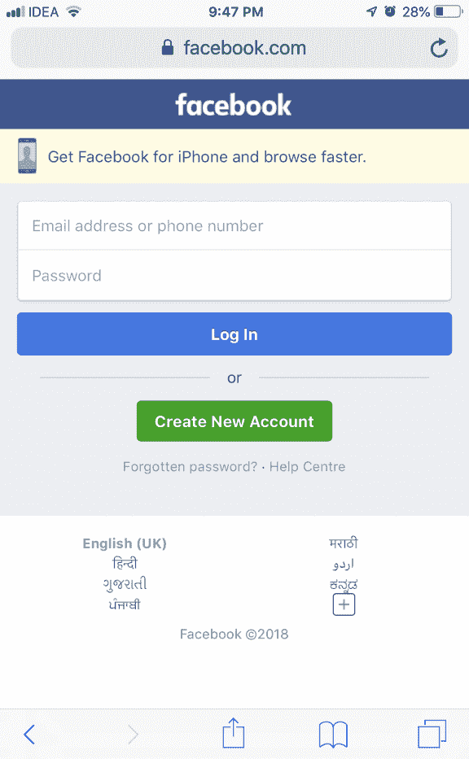
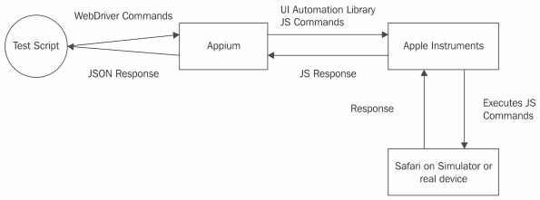
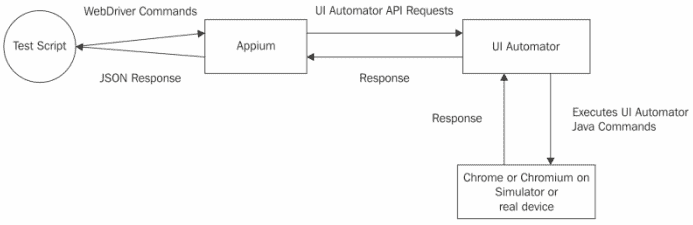
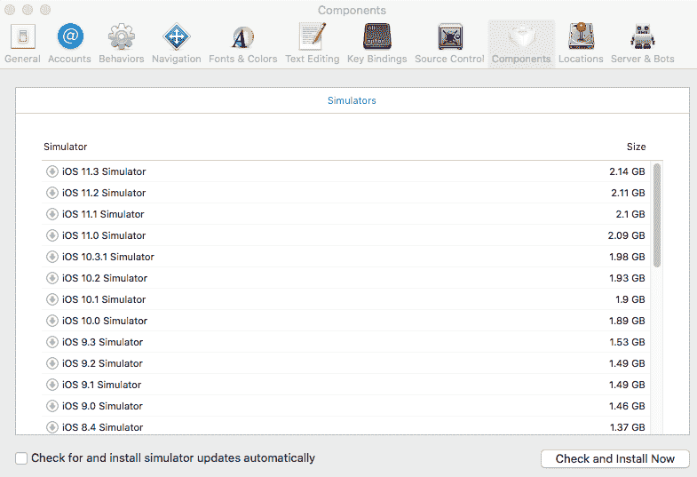
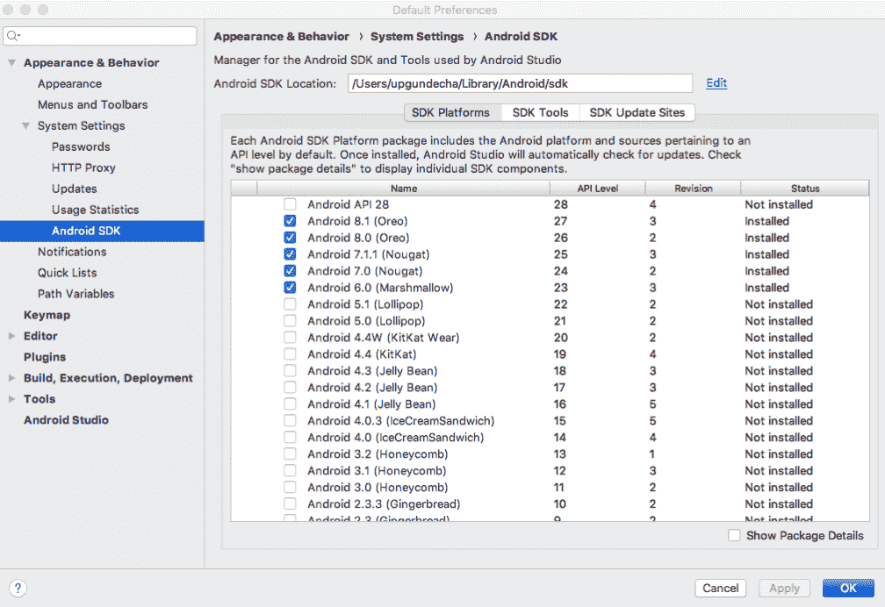
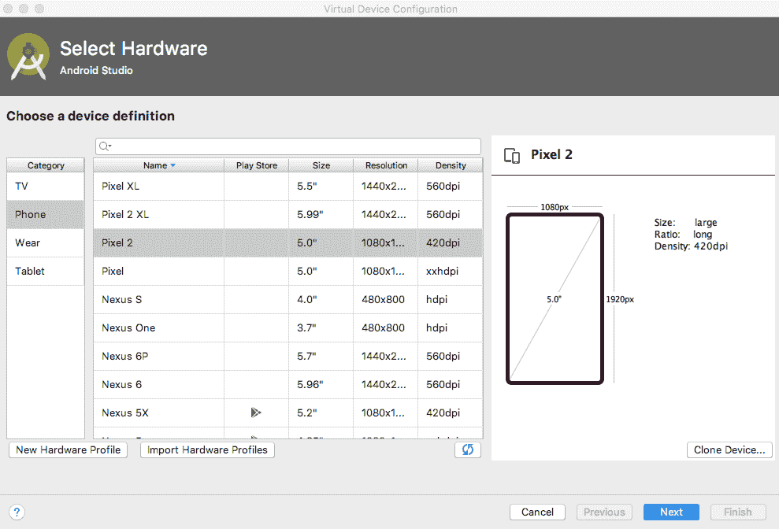
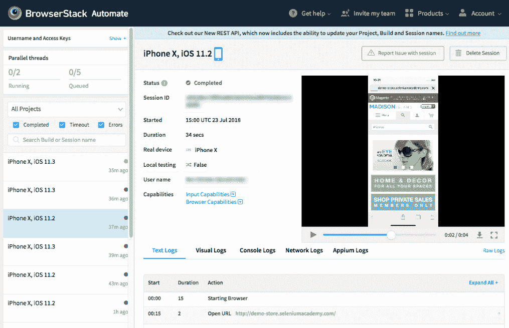

# 第十章：使用 Appium 在 iOS 和 Android 上进行移动测试

在所有前面的章节中，我们一直在处理在桌面浏览器中加载的 Web 应用程序。但随着移动用户数量的增加，今天的商业企业也必须在移动设备上为用户提供服务。在本章中，你将学习以下内容：

+   不同的移动应用程序和测试工具

+   如何使用 Selenium WebDriver 测试移动应用程序，特别是使用 Appium

+   在 Android 和 iOS 上测试移动应用程序

+   使用基于云的设备实验室进行真实设备测试

`Appium`是一个开源的移动自动化框架，用于使用 Selenium WebDriver 的 JSON 线协议在 iOS 和 Android 平台上测试移动应用程序。Appium 取代了 Selenium 2 中用于测试移动 Web 应用程序的 iPhoneDriver 和 AndroidDriver API。

# 不同形式的移动应用程序

一个应用程序可以在移动平台上以三种不同的形式到达用户：

+   **原生应用**：原生应用完全针对目标移动平台。它们使用平台支持的语言开发，并且与底层 SDK 紧密相关。对于 iOS，应用程序使用 Objective-C 或 Swift 编程语言开发，并依赖于 iOS SDK；同样，对于 Android 平台，它们使用 Java 或 Kotlin 开发，并依赖于 Android SDK。

+   **m.site**：也称为移动网站，它是你 Web 应用程序的迷你版本，在移动设备的浏览器上加载。在 iOS 设备上，它可以是 Safari 或 Chrome，在 Android 设备上，它可以是 Android 默认浏览器或 Chrome。例如，在你的 iOS 或 Android 设备上，打开你的浏览器并输入[www.facebook.com](http://www.facebook.com)。在页面加载之前，你会观察到从[www.facebook.com](http://www.facebook.com)到[m.facebook.com](http://m.facebook.com)的 URL 重定向发生。Facebook 应用程序服务器意识到请求是从移动设备发起的，并开始提供移动网站而不是桌面网站。这些 m.site 使用 JavaScript 和 HTML5 来开发，就像你的正常 Web 应用程序一样：



+   **混合应用**：混合应用是原生应用和 Web 应用的组合。当你开发原生应用时，其中一些部分会加载 HTML 网页到应用中，试图让用户感觉他们正在使用原生应用程序。它们通常在原生应用中使用 WebView 来加载网页。

现在，作为一名测试脚本开发者，你必须在各种移动设备上测试所有这些不同的应用程序。

# 可用的软件工具

为了自动化在移动设备上测试你的应用程序，有许多软件工具可供选择。以下是基于 Selenium WebDriver 构建的一些工具：

+   **Appium**：一个基于 Selenium 的跨平台和跨技术移动测试框架，适用于原生、混合和移动 Web 应用。Appium 允许使用和扩展现有的 Selenium WebDriver 框架来构建移动测试。由于它使用 Selenium WebDriver 来驱动测试，我们可以使用任何存在 Selenium 客户端库的语言来创建测试。您可以在不改变底层驱动的情况下，针对 Android 和 iOS 平台创建和执行测试脚本。Appium 还可以与 Firefox OS 平台协同工作。在本章的其余部分，我们将看到如何使用 Appium。

+   **Selendroid**：此驱动程序类似于 iOSDriver，可以在 Android 平台上执行您的原生、混合和 m.site 应用程序测试脚本。它使用 Google 提供的原生 UI Automator 库。测试脚本通过使用其最喜欢的客户端语言绑定，通过 JSON 线协议与 Selendroid 驱动程序通信。

# 使用 Appium 自动化 iOS 和 Android 测试

Appium 是一个流行的广泛使用的工具，可以用于自动化 Android 和 iOS 平台的移动应用测试。它可以用于自动化原生、m.sites 和混合应用程序。它内部使用 WebDriver 的 JSON 线协议。

# 自动化 iOS 应用程序测试

对于自动化 iOS 应用程序测试，Appium 使用 XCTest 或 UI Automation（对于较旧的 iOS 版本）：

+   **XCTest**：您可以使用 XCTest 为针对 iOS 9.3 及以上版本构建的 iOS 应用程序创建和运行单元测试、性能测试和 UI 测试。它集成了 Xcode 的测试工作流程，用于测试 iOS 应用程序。Appium 内部使用 XCTest 来自动化 iOS 应用程序。

+   **UI Automation**：对于为 iOS 9.3 及以下版本开发的测试应用程序，您需要使用 UI Automation。Appium 通过 JSON 线协议从测试脚本接收命令。Appium 将这些命令发送给 Apple Instruments，以便在模拟器或真实设备上运行的程序执行。在此过程中，Appium 将 JSON 命令转换为仪器可以理解的 UI Automation JavaScript 命令。仪器负责在模拟器或设备上启动和关闭应用程序。

Appium 作为远程 WebDriver 工作，并通过 JSON 线协议从您的测试脚本接收命令。这些命令被传递给 XCTest 或 Apple Instruments，以便在模拟器或真实设备上启动的应用程序上执行。此过程在以下图中展示：



在命令针对模拟器或设备上的您的应用程序执行后，目标应用程序会将响应发送给 XCTest 或 UI Automation Instrument，这些响应以 JavaScript 响应格式传输到 Appium。Appium 将响应转换为 Selenium WebDriver JSON 线协议响应，并将它们发送回您的测试脚本。

使用 Appium 进行 iOS 自动化测试的主要优势如下：

+   它使用 iOS 平台支持的 XCTest 或苹果公司本身提供的 UI Automation 库和仪器。

+   尽管您使用的是 JavaScript 库，但您、测试脚本开发人员和您的测试实际上并没有真正绑定到它。您可以使用自己的 Selenium WebDriver 客户端语言绑定，如 Java、Ruby 或 Python，来开发您的测试脚本。Appium 将负责将它们转换为 JavaScript。

+   您不需要修改您的原生或混合应用程序以进行测试目的。

# 自动化 Android 应用程序测试

为您的 Android 应用程序自动化测试与自动化 iOS 应用程序测试类似。除了目标平台在变化之外，您的测试脚本不会经历任何变化。以下图表显示了工作流程：



再次强调，Appium 作为远程 WebDriver，通过 JSON 协议从您的测试脚本接收命令。这些命令被传递给 Android SDK 附带的 Google UI Automator 以在模拟器或真实设备上执行。在将命令传递给 UI Automator 之前，Appium 将 JSON 命令转换为 UI Automator 可以理解的命令。这个 UI Automator 将在模拟器或真实设备上启动您的应用程序，并开始执行您的测试脚本命令。在模拟器或设备上针对您的应用程序执行命令后，目标应用程序将响应发送给 UI Automator，该响应以 UI Automator 响应格式传输到 Appium。Appium 将 UI Automator 响应转换为 Selenium WebDriver JSON 协议响应，并将它们发送回您的测试脚本。

这是帮助您理解 Appium 如何与 Android 和 iOS 设备协同工作以执行测试命令的高级架构。

# Appium 的先决条件

在我们开始讨论 Appium 的一些工作示例之前，我们需要为 iOS 和 Android 平台安装一些先决工具。我们需要为此设置 Xcode 和 Android Studio，我将展示在 macOS 上的示例。

# 设置 Xcode

为了设置 Xcode，我们将执行以下步骤：

1.  您可以从[`developer.apple.com/xcode/`](https://developer.apple.com/xcode/)下载最新的 Xcode。

1.  下载后，安装并打开它。

1.  导航到“首选项”|“组件”，以下载和安装命令行工具和 iOS 模拟器，如下面的截图所示：



如果您使用的是真实设备，您需要在设备上安装配置文件，并启用 USB 调试。

尝试启动 iPhone 模拟器并验证它是否正常工作。您可以通过导航到 Xcode | 打开开发者工具 | iOS 模拟器来启动模拟器。模拟器应该看起来与以下截图所示类似：


# 设置 Android SDK

您需要从[`developer.android.com/studio/`](https://developer.android.com/studio/)安装 Android SDK。下载并安装 Android Studio。

启动已安装的 Android Studio。现在下载任何 API 级别为 27 的 Android，并安装它。您可以通过导航到“工具 | SDK 管理器”来完成此操作。您应该会看到以下截图所示的内容：



在这里，我们正在安装 Android 8.1，其 API 级别为 27。

# 创建 Android 模拟器

如果您想在 Android 模拟器上执行测试脚本，您必须创建一个。要创建一个，我们将执行以下步骤：

1.  在 Android Studio 中，通过导航到“工具 | AVD 管理器”打开 AVD 管理器。它将启动 AVD 管理器，如下面的截图所示：


1.  通过点击“创建虚拟设备...”按钮创建一个新的虚拟设备或模拟器。你应该会看到一个窗口，它会从你那里获取所有必要的信息，如下面的截图所示：



1.  启动模拟器以查看是否创建成功。Android 虚拟设备启动可能需要几分钟。以下截图显示了已启动的 Android 模拟器：


# 安装 Appium

您可以从[`appium.io/`](http://appium.io/)下载 Appium。点击“下载 Appium”按钮以下载适用于您工作站平台的 Appium。在这里，我使用的是 Mac，因此它将下载 Appium DMG 文件。

将 Appium 复制到“应用程序”文件夹中，并尝试启动它。第一次启动时，它会要求您授权运行 iOS 模拟器，如下面的截图所示：


点击“启动服务器”按钮。默认情况下，它将在`http://localhost:4723`启动。这是你的测试脚本应指向的远程 URL。

# 自动化 iOS

现在我们已经运行了 Appium，所以让我们创建一个测试，该测试将检查 iPhone Safari 浏览器上的搜索测试。让我们使用`DesiredCapabilities`类为 Appium 提供能力，以便在 iPhone X 和 iOS 11.4 上运行测试，如下面的代码所示：

```java
public class SearchTest {

    private WebDriver driver;

    @BeforeTest
    public void setUp() throws Exception {

        // Set the desired capabilities for iOS- iPhone X
        DesiredCapabilities caps = new DesiredCapabilities();
        caps.setCapability("platformName", "iOS");
        caps.setCapability("platformVersion", "11.4");
        caps.setCapability("deviceName", "iPhone X");
        caps.setCapability("browserName", "safari");

        // Create an instance of AndroidDriver for testing on Android platform
        // connect to the local Appium server running on a different machine
        // We will use WebElement type for testing the Web application
        driver = new IOSDriver<>(new URL(
                "http://192.168.0.101:4723/wd/hub"), caps);
        driver.get("http://demo-store.seleniumacademy.com/");
    }

    @Test
    public void searchProduct() {

        WebElement lookingGlassIcon =
                driver.findElement(By
                        .cssSelector("a.skip-search span.icon"));

        lookingGlassIcon.click();

        // find search box and enter search string
        WebElement searchBox = driver.findElement(By.name("q"));

        searchBox.sendKeys("Phones");

        WebElement searchButton =
                driver.findElement(By.className("search-button"));

        searchButton.click();

        List<WebElement> searchItems = new WebDriverWait(driver, 30)
                .until(ExpectedConditions
                        .presenceOfAllElementsLocatedBy(By
                                .cssSelector("h2.product-name a")));

        assertThat(searchItems.size())
                .isEqualTo(3);

    }

    @AfterTest
    public void tearDown() throws Exception {
        // Close the browser
        driver.quit();
    }
}
```

如您所见，前面的代码与`RemoteWebDriver`的测试脚本类似，但有一些不同。以下代码描述了这些差异：

```java
DesiredCapabilities caps = new DesiredCapabilities();
caps.setCapability("platformName", "iOS");
caps.setCapability("platformVersion", "11.4");
caps.setCapability("deviceName", "iPhone X");
caps.setCapability("browserName", "safari");
```

Appium Java 客户端库提供了`IOSDriver`类，该类支持在 iOS 平台上执行测试，并使用 Appium 运行测试。然而，为了使 Appium 使用所需的平台，我们需要传递一组期望的`platformName`能力。在本文例中，我们使用了 iPhone X 模拟器。要在 iPad 上运行测试，我们可以指定 iPad 模拟器。

在真实设备上运行测试时，我们需要指定 iPhone 或 iPad 的设备功能值。Appium 将选择通过 USB 连接到 Mac 的设备。我们使用的最后一个所需功能是 browserName，它由 Appium 用于启动 Safari 浏览器。

# 自动化 Android

在 Android 上测试应用程序与在 iOS 上测试类似。对于 Android，我们将使用真实设备而不是仿真器（在 Android 社区中，仿真器被称为模拟器）。我们将使用相同的应用程序在 Android 的 Chrome 浏览器上进行测试。

在这个例子中，我使用的是三星 Galaxy S4 Android 手机。我们需要在设备上安装 Google Chrome 浏览器。如果您设备上没有预装 Google Chrome，可以在 Google 的 Play 商店获取。接下来，我们需要将设备连接到运行 Appium 服务器的机器。让我们运行以下命令以获取连接到机器的仿真器或设备的列表：

```java
./adb devices
```

`Android Debug Bridge`（ADB）是 Android SDK 中可用的命令行工具，允许您与连接到计算机的仿真器实例或实际 Android 设备进行通信。`./adb devices`命令将显示连接到主机的所有 Android 设备的列表，如下面的输出所示：

```java
List of devices attached
4df1e76f39e54f43 device
```

让我们修改为 iOS 创建的脚本，以使用 Android 功能以及 AndroidDriver 类在真实 Android 设备上执行测试，如下面的代码所示：

```java
public class MobileBmiCalculatorTest {
    private WebDriver driver;

@BeforeTest
public void setUp() throws Exception {

    // Set the desired capabilities for Android Device
    DesiredCapabilities caps = DesiredCapabilities.android();
    caps.setCapability("deviceOrientation", "portrait");
    caps.setCapability("platformVersion", "8.1");
    caps.setCapability("platformName", "Android");
    caps.setCapability("browserName", "Chrome");

    // Create an instance of AndroidDriver for testing on Android platform
    // connect to the local Appium server running on a different machine
    // We will use WebElement type for testing the Web application
    driver = new AndroidDriver<WebElement>(new URL(
            "http://192.168.0.101:4723/wd/hub"), caps);
    driver.get("http://demo-store.seleniumacademy.com/");
}
```

在前面的例子中，我们将`platformName`功能值分配给了`Android`，这将由 Appium 用于在 Android 上运行测试。由于我们想在 Android 的 Chrome 浏览器上运行测试，我们在代码的浏览器功能部分提到了 Chrome。我们做出的另一个重要更改是使用 Appium Java 客户端库中的`AndroidDriver`类。

Appium 将使用`adb`返回的设备列表中的第一个设备，如下面的截图所示。它将使用我们提到的所需功能，并在设备上启动 Chrome 浏览器并开始执行测试脚本命令。

# 使用设备云在真实设备上运行测试

Appium 支持在移动模拟器、仿真器和真实设备上进行测试。要设置一个使用真实设备的移动测试实验室，需要资本投资以及设备和基础设施的维护。手机制造商几乎每天都会发布新的手机型号和操作系统更新，而您的应用程序必须与新发布的产品兼容。

为了更快地应对这些变化并将投资降至最低，我们可以使用基于云的移动测试实验室。有许多供应商，如亚马逊网络服务、BrowserStack 和 Sauce Labs，提供基于云的实时移动设备实验室来执行测试，而不需要在前端设备上进行任何投资。您只需为测试使用的时间付费。这些供应商还允许您在他们的设备云中使用 Appium 运行自动化测试。

在本节中，我们将探索 BrowserStack，以在其实时设备云上运行测试：

1.  您需要一个带有**Automate**功能订阅的 BrowserStack 账户。您可以在[`www.browserstack.com/`](https://www.browserstack.com/)上注册一个免费试用账户。

1.  我们需要根据设备组合从 BrowserStack 获取所需的配置能力。BrowserStack 根据所选的设备和平台组合提供能力建议。请访问[`www.browserstack.com/automate/java`](https://www.browserstack.com/automate/java)并选择一个操作系统和设备：


1.  根据您的选择，BrowserStack 将使用您的用户名和访问密钥自动生成代码：


我们将不会使用步骤 3 中建议的代码，而是将测试更改为以下代码所示。请记住，您需要使用自动生成的代码中显示的用户名和访问密钥：

```java
public class SearchTest {

    private WebDriver driver;

    @BeforeTest
    public void setUp() throws Exception {

 String USERNAME = "username";
        String AUTOMATE_KEY = "access_key";
        String URL = "https://" + USERNAME + ":" 
                + AUTOMATE_KEY + "@hub-cloud.browserstack.com/wd/hub";

        // Set the desired capabilities for iPhone X
        DesiredCapabilities caps = new DesiredCapabilities();
        caps.setCapability("browserName", "iPhone");
        caps.setCapability("device", "iPhone X");
        caps.setCapability("realMobile", "true");
        caps.setCapability("os_version", "11.0");

        driver = new RemoteWebDriver(new URL(URL), caps);
        driver.get("http://demo-store.seleniumacademy.com/");
    }

    @Test
    public void searchProduct() {

        WebElement lookingGlassIcon =
                driver.findElement(By
                        .cssSelector("a.skip-search span.icon"));
        lookingGlassIcon.click();

        // find search box and enter search string
        WebElement searchBox = driver.findElement(By.name("q"));
        searchBox.sendKeys("Phones");

        WebElement searchButton =
                driver.findElement(By.className("search-button"));

        searchButton.click();

        List<WebElement> searchItems = new WebDriverWait(driver, 30)
                .until(ExpectedConditions
                        .presenceOfAllElementsLocatedBy(By
                                .cssSelector("h2.product-name a")));

        assertThat(searchItems.size())
                .isEqualTo(3);
    }

    @AfterTest
    public void tearDown() throws Exception {
        // Close the browser
        driver.quit();
    }
}
```

从您的 IDE 执行测试，它将在 BrowserStack 云中运行。您可以在 BrowserStack 仪表板中监控测试，其中将显示使用的配置能力、每个步骤的状态、控制台日志、网络日志、Appium 日志和执行的视频：



# 摘要

在本章中，我们讨论了企业如何在移动平台上接触其用户的不同方式。我们还了解了使用 Selenium WebDriver 创建的各种软件工具。最后，我们介绍了一种即将推出的软件工具，并修改了我们的测试脚本以与 iOS 和 Android 平台兼容。

在下一章中，我们将看到如何使用`TestNG`创建参数化和数据驱动的测试。这将帮助我们重用测试并提高测试覆盖率。

# 问题

1.  移动应用有哪些不同类型？

1.  Appium Java 客户端库为测试 iOS 和 Android 应用程序提供了哪些类？

1.  列出通过 USB 端口连接到计算机的 Android 设备的命令是什么？

1.  Appium 服务器默认使用哪个端口？

# 更多信息

您可以查看以下链接，获取有关本章涵盖主题的更多信息：

+   想要更多关于使用 Appium 的示例，请访问其网站和 GitHub 论坛[`appium.io/`](http://appium.io/)和[`github.com/appium/appium/tree/master/sample-code/java`](https://github.com/appium/appium/tree/master/sample-code/java)
