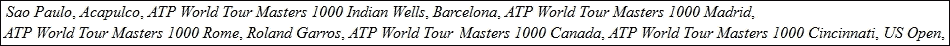

# 第一章：动态访问 JSF 应用程序数据通过表达式语言（EL 3.0）

Java **表达式语言**（**EL**）是一种紧凑且强大的机制，它使得在 JSP 和 JSF 应用程序（包括基于 JSF 的开发框架，如 PrimeFaces、ICEfaces 和 RichFaces）中实现动态通信成为可能；我们在表示层嵌入表达式以与应用程序逻辑层进行通信。EL 提供双向通信，这意味着我们可以将应用程序逻辑数据暴露给用户，同时也可以提交用户数据以进行处理。一般来说，EL 可以用来用用户数据填充 HTTP 请求，从 HTTP 响应中提取和暴露数据，更新 HTML DOM，条件处理数据等等。

### 注意

通常，EL 表达式会出现在 JSP 和 JSF 页面中，但它们也可以出现在外部，例如在`faces-config.xml`中。

在本章中，您将了解如何在网页中使用 EL 与托管 Bean 进行通信，这是 JSF 应用程序中最常见的情况。我们将涵盖以下主题：

+   EL 语法、运算符和保留字

+   EL 即时和延迟求值

+   EL 值和方法表达式

+   JSF 中的条件文本

+   编写自定义 EL 解析器

# EL 语法

在本节中，您可以了解 EL 2.2 和 3.0 语法的概述。EL 支持一些运算符和保留字。以下将简要描述这些内容（更多详情请参考 EL 规范文档([`download.oracle.com/otndocs/jcp/el-3_0-fr-eval-spec/index.html`](http://download.oracle.com/otndocs/jcp/el-3_0-fr-eval-spec/index.html))).

## EL 运算符

EL 支持以下几类运算符—算术、关系、逻辑、条件、空值，从 EL 3.0 开始增加了字符串连接、赋值和分号运算符：

| 文本 | 描述 | 符号 |
| --- | --- | --- |
| A `+` B | 加法 | `+` |
| A `-` B | 减法 | `-` |
| A `*` B | 乘法 | `*` |
| A {`div`, `/`} B | 算术运算符除法 | /, `div` |
| A {`mod`, `%`} B | 算术运算符取模 | `%`, `mod` |
| A {`and`, `&&`} B | 逻辑与 | `&&`, `and` |
| A {`or`, `&#124;&#124;`} B | 逻辑或 | `&#124;&#124;`, `or` |
| {`not`, `!`} A | 逻辑非 | `!`, `not` |
| A {`lt`, `<`} B | 关系小于 | `<`, `lt` |
| A {`gt`, `>`} `B` | 关系大于 | `>`, `gt` |
| A {`le`, `<=`} B | 关系小于等于 | `<=`, `le` |
| A {`ge`, `>=`} B | 关系大于等于 | `>=`, `ge` |
| A {`eq`, `==`} B | 等于 | `==`, `eq` |
| A {`ne`, `!=`} B | 不等于 | `!=`, `ne` |
| A `=` B | 赋值（EL 3.0） | `=` |
| A `;` B | 分号（EL 3.0） | `;` |
| A `+=` B | 字符串连接（EL 3.0） | `+=` |
| A `->` B | Lambda 表达式（EL 3.0） | `->` |
| `empty` A | 判断一个值是否为空或空值 |   |
| A `?` B `:` C | 根据 A 的评估结果评估 B 或 C。称为**三元运算符**。 | ?: |
|   | 用于编写 EL 表达式时使用 | `.` |
|   | 用于编写 EL 表达式时使用 | `[]` |

## EL 运算符优先级

符合 EL 规范，运算符的优先级从高到低，从左到右如下：

+   `[].`

+   `()`（用于改变运算符的优先级）

+   `-`（一元）`not ! empty`

+   `* / div % mod`

+   `+` `-`（二元）

+   `+=`

+   `< > <= >= lt gt le ge`

+   `== != eq ne`

+   `&& 和`

+   `|| 或`

+   `?` `:`

+   `->`（lambda 表达式）

+   `=`

+   `;`

## EL 保留字

EL 定义以下保留字：

+   `and`、`or`、`not`、`eq`、`ne`、`lt`、`gt`、`le`、`ge`、`true`（布尔字面量）、`false`（布尔字面量）、`null`、`instanceof`（用于在对象之间进行类比较的 Java 关键字）、`empty`、`div` 和 `mod`

# EL 立即和延迟评估

EL 将表达式评估为**立即**或**延迟**。

立即评估在页面首次渲染时立即返回结果。这类表达式是只读值表达式，并且它们只能存在于接受运行时表达式的标签中。它们在 `${}` 符号之后很容易识别。通常，它们用于 JSP 页面中的算术和逻辑运算。

延迟评估可以在页面生命周期不同阶段返回结果，具体取决于使用表达式的技术。JSF 可以在生命周期的不同阶段评估表达式（例如，在渲染和回传阶段），具体取决于在页面中使用表达式的方式。这类表达式可以是值表达式和方法表达式，并且它们由 `#{}` 符号标记。

### 注意

在 Facelets 中，`${}` 和 `#{}` 的行为相同。

# EL 值表达式

**值表达式**可能是使用最频繁的，它们引用对象及其属性和属性。这类表达式在运行时动态用于评估结果或设置 Bean 属性。通过值表达式，您可以轻松访问 JavaBeans 组件、集合和 Java SE 枚举类型。此外，EL 提供了一组隐式对象，可用于从不同作用域获取属性和参数值。此外，您将看到 EL 如何处理这些对象中的每一个。

### 注意

可以读取数据但不能写入的值表达式称为**右值**（`${}` 表达式始终是右值），而可以读取和写入数据的值表达式称为**左值**（`#{}` 表达式可以是右值和/或左值）。

## 引用管理 Bean

引用管理 Bean 并非一个非常有用的例子，但它是一个很好的起点。最常见的情况是，您的管理 Bean 将类似于以下代码（在这种情况下，Bean 的类名为 `PlayersBean`）:

```java
@ManagedBean
//some scope
public class PlayersBean{
...
}
```

或者，在 CDI 版本中，你的管理 Bean 将如下所示：

```java
@Named
//some scope
public class PlayersBean{
...
}
```

或者，使用显式名称，你的管理 Bean 将如下所示：

```java
@ManagedBean(name = "myPlayersBean")
//some scope
public class PlayersBean{
...
}

@Named(value = "myPlayersBean")
//some scope
public class PlayersBean{
...
}
```

现在，对于前两个例子，EL 引用`PlayersBean`管理 Bean，如下所示——名称是从完全限定类名中提取非限定类名部分，并将第一个字符转换为小写得到的：

```java
#{playersBean}
```

此外，对于接下来的两个例子，EL 使用以下显式名称：

```java
#{myPlayersBean}
```

### 注意

你应该尽可能使用 CDI Bean，因为它们比 JSF 管理 Bean 更灵活，并且因为`javax.faces.bean`的注解将在未来的 JSF 版本中弃用。因此，推荐使用 CDI Bean。

当引用的管理 Bean 在任何范围内找不到时，将返回一个`null`值。

### 小贴士

**下载示例代码**

你可以从你购买的所有 Packt 书籍的账户中下载示例代码文件。[`www.packtpub.com`](http://www.packtpub.com)。如果你在其他地方购买了这本书，你可以访问[`www.packtpub.com/support`](http://www.packtpub.com/support)并注册，以便直接将文件通过电子邮件发送给你。

## 引用管理 Bean 的属性

如人所知，管理 Bean 通常包含私有字段，这些字段可以通过 getter 和 setter 方法作为 Bean 属性访问，以及一些公共方法，这些方法利用这些属性来执行不同的逻辑任务。

可以访问这些属性的 EL 表达式包含点或方括号符号`[]`。例如，假设`PlayersBean`管理 Bean 包含以下定义的两个字段：

```java
private String playerName = "Rafael";
private String playerSurname = "Nadal";
```

EL 可以通过它们的 getter 方法访问这些字段；因此，你需要按照以下代码定义它们：

```java
public String getPlayerName() {
  return playerName;
}
public String getPlayerSurname() {
  return playerSurname;
}
```

现在，一个访问`playerName`属性的表示式可以使用点符号（`.`）来引用它，如下面的代码行所示：

```java
#{playersBean.playerName}
```

或者，这个表示式可以使用方括号符号`[]`，如下面的代码行所示：

```java
#{playersBean['playerName']}
```

### 注意

JSF 从左到右评估这个表达式。首先，它在所有可用的范围内（如请求、会话和应用）搜索`playersBean`。然后，实例化 Bean 并调用`getPlayerName`/`getPlayerSurname` getter 方法（对于布尔属性，getter 方法将命名为`is`*XXX*）。当你使用`[]`符号时，你可以使用单引号或双引号。只需记住在如下引号的情况下正确交替使用即可。

一个错误的引号（你无法在双引号内使用双引号）是：

```java
<h:outputText value="#{playersBean["playerName"]}"/>
```

一个错误的引号（你无法在单引号内使用单引号）是：

```java
<h:outputText value='#{playersBean['playerName']}'/>
```

一个正确的引号（你可以在双引号内使用单引号）是：

```java
<h:outputText value="#{playersBean['playerName']}"/>
```

一个正确的引号（你可以在单引号内使用双引号）是：

```java
<h:outputText value='#{playersBean["playerName"]}'/>
```

## 引用管理 Bean 的嵌套属性

通常，管理 Bean 使用嵌套属性。这些属性可以通过 EL 在同一个表达式中多次使用`.`和`[]`符号来访问。

例如，`PlayersBean`托管 Bean 可能代表网球运动员的一般数据，如姓名、姓氏、冠军和决赛。更详细的信息，如生日、出生地、身高和体重，可以通过名为`PlayersDetails`的不同类来表示。现在，`PlayersBean`托管 Bean 包含一个类型为`PlayersDetails`的字段，这意味着生日、出生地等成为`PlayersBean`的嵌套属性。用代码行来说，`PlayersDetails`类的相关部分如下：

```java
public class PlayerDetails {

  private Date birthday;
  private String birthplace;
  ...

  public Date getBirthday() {
    return birthday;
  }

  public String getBirthplace() {
    return birthplace;
  }
  ...
}
```

`PlayersBean`类的托管 Bean 如下：

```java
@Named
public class PlayersBean{

  private String playerName = "Rafael";
  private String playerSurname = "Nadal";
  private PlayerDetails playerDetails;

  public String getPlayerName() {
    return playerName;
  }

  public String getPlayerSurname() {
    return playerSurname;
  }

  public PlayerDetails getPlayerDetails() {
    return playerDetails;
  }
  ...
}
```

你已经知道如何使用`.`和`[]`符号表示法调用`playerName`和`playerSurname`属性。接下来，你可以使用相同的符号表示法来访问嵌套属性`birthday`和`birthplace`，如下面的代码所示：

```java
#{playersBean.playerDetails.birthday}
#{playersBean.playerDetails.birthplace}

#{playersBean['playerDetails']['birthday']}
#{playersBean['playerDetails']['birthplace']}
```

或者，你可以在同一个表达式中使用这两种符号表示法，如下面的代码所示：

```java
#{playersBean.playerDetails['birthday']}
#{playersBean.playerDetails['birthplace']}

#{playersBean['playerDetails'].birthday}
#{playersBean['playerDetails'].birthplace}
```

当然，`PlayerDetails`类可以包含其自己的嵌套属性等。在这种情况下，只需使用`.`和`[]`符号表示法来深入到对象的层次结构中，直到达到所需的属性。

在前面的表达式中，JSF 在所有可用的作用域（请求、会话、应用程序等）中搜索`playersBean`，并获取其实例。之后，它调用`getPlayerDetails`方法，并在`getPlayerDetails`方法的返回结果上调用`getBirthday`方法（对于`birthplace`属性也是如此）。

## 引用 Java SE 枚举类型

EL 可以使用字符串字面量访问 Java SE 枚举类型。例如，让我们假设在`PlayersBean`中定义了一个枚举类型，如下面的代码所示：

```java
public enum Plays {
  Left, Right
};

private Plays play;
...
play = Plays.Left;//initialization can be done in constructor
...
public Plays getPlay() {
  return play;
}
...
```

你可以轻松地输出`play`值，如下面的代码行所示：

```java
#{playersBean.play}
```

要引用`Plays`常量`Plays.Left`，使用表达式中的字符串字面量`Left`（或`Right`用于`Plays.Right`），例如，你可以测试`play`是否为`Left`或`Right`，如下面的代码所示：

```java
#{playersBean.play == 'Left'} //return true
#{playersBean.play == 'Right'}//return false
```

## 引用集合

**集合**项（数组、列表、映射、集合等）可以通过指定一个可以转换为整数或使用整数和空格的`[]`符号表示法（无需引号）的文本值从 EL 表达式中访问。

例如，假设`PlayersBean`托管 Bean 包含一个名为`titles_2013`的数组，该数组保存了 2013 年一名球员赢得的冠军。数组定义如下面的代码所示：

```java
private String[] titles_2013 = {"Sao Paulo", "Acapulco", "ATP World Tour Masters 1000 Indian Wells", "Barcelona", ...};
...
public String[] getTitles_2013() {
  return titles_2013;
}   
```

现在，你可以通过指定数组中的位置来访问数组的第一个标题，该位置是`0`：

```java
#{playersBean.titles_2013[0]}
```

这在 Java 中相当于获取或设置`titles_2013[0]`的值。

然而，有时你需要遍历数组而不是访问特定的项。这可以通过 `c:forEach` JSTL 标签（[`www.oracle.com/technetwork/java/index-jsp-135995.html`](http://www.oracle.com/technetwork/java/index-jsp-135995.html)）轻松实现。以下代码片段遍历 `titles_2013` 数组并输出每个项（这是一个相当不常见的用法，所以不要在生产环境中尝试）：

```java
<c:forEach begin="0" 
  end="${fn:length(playersBean.titles_2013)-1}" 
  var="i">
  #{playersBean.titles_2013[i]},
</c:forEach>
```

你可以将其简化如下代码所示：

```java
<c:forEach var="title" items="#{playersBean.titles_2013}">
  <i>#{title}</i>,
</c:forEach>
```

你也可以使用如下代码中所示的 `<ui:repeat>` 标签：

```java
<ui:repeat var="title" value="#{playersBean.titles_2013}">
  <i>#{title}</i>,
</ui:repeat>
```

此标签在 *Facelets 模板化* 的 *使用 <ui:repeat> 遍历* 部分的第十二章（ch12.html "Chapter 12. Facelets Templating"）中有详细说明。

你可以为每个 `List` 使用相同的方法。例如，在 `List` 的情况下，表达式 `#{playersBean.titles_2013[0]}` 在 Java 中等同于 `titles_2013.get(0)` 和 `titles_2013.set(0,` *some_value*`)`。

在类型为键值对的集合（例如，`Map`）的情况下，EL 表达式通过键来获取项。例如，让我们在 `PlayersBean` 中添加一个 `Map`，它存储了一些玩家的比赛事实。它可以定义如下代码所示：

```java
private Map<String, String> matchfacts = new HashMap<>();
...
matchfacts.put("Aces", "12");
matchfacts.put("Double Faults", "2");
matchfacts.put("1st Serve", "70%");
...

public Map<String, String> getMatchfacts() {
  return matchfacts;
}
```

现在，一个访问键为 `Aces` 的项的 EL 表达式可以写成以下代码行：

```java
#{playersBean.matchfacts.Aces}
```

### 注意

注意，此方法不支持数组或列表。例如，`#{playersBean.titles_2013.0}` 是不正确的。

当键不是一个可接受的变量名时（例如，`Double Faults`），你需要使用括号和引号，如下代码所示：

```java
#{playersBean.matchfacts["Double Faults"]}
```

## EL 隐式对象

JSF 提供了与当前请求和环境相关的几个对象。EL 提供了这些对象（称为 **隐式对象**），可以在 Facelet、servlet 或后端 bean 中在运行时访问——这些对象通过值表达式访问，并由容器管理。对于每个表达式，EL 首先检查基础值是否是这些隐式对象之一，如果不是，它将逐级检查更广泛的范围中的 beans（从请求到视图，最后到应用程序范围）。

### 注意

在 EL 中，点或方括号之前的部分被称为 **基础**，它通常表示应该位于哪个 bean 实例。第一个点或方括号之后的部分称为 **属性**，并且递归地分解成更小的部分，代表从基础获取的 bean 属性。

你可以在以下表格中看到这些对象的简要概述：

| 隐式对象 EL | 类型 | 描述 |
| --- | --- | --- |
| `#{application}` | `ServletContext` 或 `PortletContext` | 这是 `ServletContext` 或 `PortletContext` 的实例。 |
| `#{facesContext}` | `FacesContext` | 这是一个 `FacesContext` 的实例。 |
| `#{initParam}` | `Map` | 这是 `getInitParameterMap` 返回的上下文初始化参数映射。 |
| `#{session}` | `HttpSession`或`PortletSession` | 这是一个`HttpSession`或`PortletSession`的实例。 |
| `#{view}` | `UIViewRoot` | 这是指定的当前`UIViewRoot`（`UIComponent`树的根）。 |
| `#{component}` | `UIComponent` | 这是指定的当前`UIComponent`。 |
| `#{cc}` | `UIComponent` | 这是指定正在处理的复合组件。 |
| `#{request}` | `ServletRequest`或`PortletRequest` | 这是一个`ServletRequest`或`PortletRequest`的实例。 |
| `#{applicationScope}` | `Map` | 这是一个映射，用于存储由`getApplicationMap`返回的应用程序范围数据。 |
| `#{sessionScope}` | `Map` | 这是一个映射，用于存储由`getSessionMap`返回的会话范围数据。 |
| `#{viewScope}` | `Map` | 这是一个映射，用于存储由`getViewMap`返回的当前视图范围数据。 |
| `#{requestScope}` | `Map` | 这是一个映射，用于存储由`getRequestMap`返回的请求范围数据。 |
| `#{flowScope}` | `Map` | 这是一个映射，用于存储由`facesContext.getApplication().getFlowHandler().getCurrentFlowScope()`返回的流程范围数据。 |
| `#{flash}` | `Map` | 这是一个只包含“下一个”请求中存在的值的映射。 |
| `#{param}` | `Map` | 这是此请求的所有查询参数的映射视图。它由`getRequestParameterMap`返回。 |
| `#{paramValues}` | `Map` | 这是`getRequestParameterValuesMap`返回的请求参数值映射。 |
| `#{header}` | `Map` | 这是此请求所有 HTTP 头部的映射视图，由`getRequestHeaderMap`返回。 |
| `#{headerValue}` | `Map` | 这是`getRequestHeaderValuesMap`返回的请求头部值映射。映射中的每个值都是一个包含该键所有值的字符串数组。 |
| `#{cookie}` | `Map` | 这是一个映射视图，显示了由`getRequestCookieMap`返回的 HTTP Set-Cookie 头中的值。 |
| `#{resource}` | `Resource` | 这是一个指向具体资源 URL 的 JSF 资源标识符。 |

# EL 方法表达式

使用 EL 表达式，我们可以调用托管 bean 上服务器端的任意静态和公共方法。此类表达式通常存在于标签的属性中（即，在`action`或`actionListener`属性内部）并且必须使用延迟评估语法，因为方法可以在生命周期的不同阶段被调用。通常，方法被调用以响应不同类型的事件和自动页面导航。

让我们看看使用 EL 调用 bean 方法的几个示例（所有方法都在`PlayersBean`托管 bean 中定义）：

+   调用无参数的`vamosRafa_1` void bean 方法，如下面的代码所示：

    ```java
    public void vamosRafa_1(){
      System.out.println("Vamos Rafa!");
    }

    #{playersBean.vamosRafa_1()}
    ```

+   调用无参数的`vamosRafa_2` bean 方法。它返回一个字符串，如下面的代码所示：

    ```java
    public String vamosRafa_2() {
      return "Vamos Rafa!";
    }

    #{playersBean.vamosRafa_2()}
    ```

    返回的字符串`Vamos Rafa!`可以在网页上显示或用于其他目的。换句话说，表达式将被评估为这个字符串。

+   使用一个参数调用 `vamosRafa_3` Bean 方法。它返回 void，如下面的代码所示：

    ```java
    public void vamosRafa_3(String text) {
      System.out.println(text);
    }

    #{playersBean.vamosRafa_3('Vamos Rafa!')}
    ```

    注意，`String` 参数是通过使用引号传递的。

    ### 注意

    `String` 常量用单引号或双引号传递！

+   使用两个参数调用 `vamosRafa_4` Bean 方法。它返回一个字符串，如下面的代码所示：

    ```java
    public String vamosRafa_4(String name, String surname) {    
      return "Vamos " + name + " " + surname + "!";
    }

    #{playersBean.vamosRafa_4(playersBean.playerName, playersBean.playerSurname)}
    ```

    该表达式将被评估为字符串，`Vamos Rafael Nadal!`。

+   调用 `vamosRafa_5` Bean 方法进行自动导航。首先，在管理 Bean 中定义该方法以返回一个视图（结果）名称（`vamos` 是 `vamos.xhtml` 文件的视图名称），如下面的代码所示：

    ```java
    public String vamosRafa_5(){
     return "vamos";
    }
    ```

此外，从任何 JSF UI 组件的 `action` 属性中提取视图名称，如下面的代码所示：

```java
<h:form>  
  <h:commandButton action="#{playersBean.vamosRafa_5()}" value="Vamos ..." />
</h:form>
```

现在，当点击标记为 **Vamos...** 的按钮时，JSF 将解析视图名称 `vamos` 到 `vamos.xhtml` 文件。此外，JSF 将在当前目录中查找 `vamos.xhtml` 文件，并将其导航到该文件。通常，这些导航方法用于在 JSF 页面之间进行条件导航。

### 注意

我们甚至在没有参数的情况下也使用了括号来调用方法。一个特殊情况是包含 `ActionEvent` 参数的方法。这些方法应该不带括号调用，除非你完全通过传递和指定自定义参数来覆盖 `ActionEvent` 参数。

EL 表达式也可以用在 JavaScript 函数调用中。例如，当你想将 Bean 属性传递给 JavaScript 函数时，需要将它们放在引号之间，如下面的代码所示：

```java
<h:form>
  <h:commandButton type="button" value="Click Me!" onclick="infoJS('#{playersBean.playerName}', '#{playersBean.playerSurname}')"/>
</h:form>
```

这个 JavaScript 函数的代码如下所示：

```java
<script type="text/javascript">
  function infoJS(name, surname) {
    alert("Name: " + name + " Surname: " + surname);
  }
</script>
```

# JSF 中的条件文本

当你需要输出条件性文本（不包含 HTML 内容）时，可以使用 EL 三元运算符，其语法如下：

```java
boolean_test ? result_for_true : result_for_false
```

例如，你可以使用这个运算符在两个 CSS 类之间进行选择，如下面的代码所示：

```java
.red { color:#cc0000; } 
.blue { color: #0000cc; }
```

现在，你想要条件性地输出红色或蓝色文本，如下面的代码所示：

```java
<h:outputText styleClass="#{playersBean.play == 'Left' ? 'red': 'blue'}" value="#{playersBean.play}"/>
```

因此，如果 `play` 的值为 `Left`，则将使用 `red` CSS 类显示文本，如果不是 `Left`，则使用 `blue` 类。

### 注意

请记住，不建议使用 HTML 内容（出于安全原因，不要使用 `escape="false"`），并且不能省略条件的 `else` 部分。

为了更好地理解，让我们看另一个例子。记住你已经遍历了 `titles_2013` 数组，并按如下代码所示输出每个项目：

```java
<c:forEach var="title" items="#{playersBean.titles_2013}">
  <i>#{title}</i>,
</c:forEach>
```

好吧，这段代码的输出将类似于以下截图：



除了最后一个逗号外，一切看起来都正常，因为这个逗号不应该出现，因为 **US Open** 是要显示的最后一个项目。你可以通过 EL 三元运算符轻松解决这个问题，如下面的代码所示：

```java
<c:forEach var="title" items="#{playersBean.titles_2013}" varStatus="v">
  <i>#{title}</i>
  #{v.last ? '':','}
</c:forEach>
```

有时你只需要根据条件显示或隐藏文本。为此，你可以将布尔表达式作为`rendered`属性的值（所有 JSF UI 组件都有这个属性）。例如，以下代码行将仅在存在 Facebook 地址时输出玩家的 Facebook 地址：

```java
<h:outputText value="Facebook address: #{playersBean.facebook}" rendered="#{!empty playersBean.facebook}" />
```

另一个常见的情况是使用两个类型为"显示某物..."和"隐藏某物..."的按钮来显示或隐藏非 HTML 文本。例如，你可以有一个标签为**显示职业生涯奖金**的按钮和一个标签为**隐藏职业生涯奖金**的按钮。显然，当你点击第一个按钮时，你希望显示职业生涯奖金；当你点击第二个按钮时，你希望隐藏职业生涯奖金。为此，你可以使用`rendered`属性，如下面的代码所示：

```java
<h:form id="prizeFormId">
  <h:commandButton value="Show Career Prize Money">
  <f:ajax render="rnprizeid"  listener="#{playersBean.showPrizeMoney()}"/>
  </h:commandButton>
  <h:panelGrid id="rnprizeid">
    <h:outputText value="#{playersBean.prize}" rendered="#{playersBean.show_prize}">
      <f:convertNumber type="currency" currencySymbol="$" />
    </h:outputText>            
  </h:panelGrid>
  <h:commandButton value="Hide Career Prize Money">
    <f:ajax render="rnprizeid" 
            listener="#{playersBean.hidePrizeMoney()}"/>
  </h:commandButton>
</h:form>
```

两个按钮都使用 AJAX 机制和 EL 方法表达式来调用`showPrizeMoney`和`hidePrizeMoney`方法。这些方法只是修改一个名为`show_prize`的`boolean`属性值，如下面的代码所示：

```java
private boolean show_prize = false;
...
public boolean isShow_prize() {
  return show_prize;
}
...
public void showPrizeMoney(){
  this.show_prize = true;
}

public void hidePrizeMoney(){
  this.show_prize = false;
}
```

请求完成后，JSF 将重新渲染 ID 为`rnprizeid`的面板网格组件；这已在`f:ajax`标签的`render`属性中指示。如你所见，重新渲染的组件是一个包含简单`h:outputText`标签的面板，该标签根据`rendered`属性中 EL 表达式的布尔值输出`prize`属性，如下面的代码所示：

```java
private int prize = 60941937;
...
public int getPrize() {
  return prize;
}
```

显示和隐藏文本可能很有用，但不足以满足需求。通常，我们需要显示或隐藏 HTML 内容。例如，你可能需要显示或隐藏一张图片：

```java

```

这个任务可以通过将 HTML 代码嵌套在支持`rendered`属性的 Facelets `ui:fragment`标签内轻松完成，如下面的代码所示：

```java
<ui:fragment rendered="#{playersBean.show_racquet}">
  
</ui:fragment>
```

如你所见，`rendered`属性的 EL 表达式表示`PlayersBean`管理 Bean 的`boolean`属性，如下面的代码所示：

```java
private boolean show_racquet = false;
...
public boolean isShow_racquet() {
  return show_racquet;
}
```

现在，你可以让用户决定何时显示或隐藏图片。你可以轻松地修改前面的示例，添加两个标签为**显示图片**和**隐藏图片**的按钮，或者更优雅的做法是使用复选框，如下面的代码所示：

```java
...
<h:form>
  <h:selectBooleanCheckbox label="Show Image"valueChangeListener="#{playersBean.showHideRacquetPicture}">
    <f:ajax render="racquetId"/>
  </h:selectBooleanCheckbox>        
  <h:panelGroup id="racquetId">
    <ui:fragment rendered="#{playersBean.show_racquet}">
    
  </ui:fragment>    
  </h:panelGroup>
</h:form>
...
```

`showHideRacquetPicture`方法根据复选框的状态将`show_racquet`属性设置为`true`或`false`。在此方法执行后，JSF 将重新渲染`ui:fragment`标签的内容——这是通过`<h:panelGroup>`标签渲染的 HTML 内容来实现的，因为`<ui:fragment>`标签不渲染 HTML 内容；因此，它不能通过 ID 引用。以下为`showHideRacquetPicture`方法的代码：

```java
public void showHideRacquetPicture(ValueChangeEvent e){
  if(e.getNewValue() == Boolean.TRUE){
     this.show_racquet=true;
  } else {
     this.show_racquet=false;
  }
}
```

因此，我们可以得出结论，`rendered`属性可以用来有条件地输出 HTML/非 HTML 内容。用户交互和内部条件可以用来操作这个属性值。

完整的应用程序命名为`ch1_1`。

# 编写自定义 EL 解析器

通过扩展自定义隐式变量、属性和方法调用，可以测试 EL 的灵活性。这可以通过扩展 `VariableResolver` 或 `PropertyResolver` 类，或者更好的是，扩展 `ELResolver` 类来实现，这给我们提供了在不同任务中重用相同实现的能力。以下是将自定义隐式变量添加的三个简单步骤：

1.  创建一个继承自 `ELResolver` 类的自己的类。

1.  实现继承的抽象方法。

1.  在 `faces-config.xml` 中添加 `ELResolver` 类。

接下来，你将看到如何根据这些步骤通过扩展 EL 添加自定义隐式变量。在这个例子中，你想要通过 EL 直接在你的 JSF 页面中检索包含 ATP 单打排名的集合。用于访问集合的变量名将是 `atp`。

首先，你需要创建一个继承自 `javax.el.ELResolver` 类的类。这非常简单。`ATPVarResolver` 类的代码如下：

```java
public class ATPVarResolver extends ELResolver {

  private static final Logger logger = Logger.getLogger(ATPVarResolver.class.getName());
  private static final String PLAYERS = "atp";
  private final Class<?> CONTENT = List.class;
...
}
```

其次，你需要实现六个抽象方法：

+   `getValue`: 此方法定义如下：

    ```java
    public abstract Object getValue(ELContext context, Object base, Object property)
    ```

    这是 `ELResolver` 类最重要的方法。在 `getValue` 方法的实现中，如果你请求的属性名为 `atp`，你将返回 ATP 项目。因此，实现将如下：

    ```java
    @Override
    public Object getValue(ELContext ctx, Object base, Object property) {

    logger.log(Level.INFO, "Get Value property : {0}", property);

      if ((base == null) && property.equals(PLAYERS)) {
        logger.log(Level.INFO, "Found request {0}", base);    
        ctx.setPropertyResolved(true);          
        List<String> values = ATPSinglesRankings.getSinglesRankings();
        return values;
        }
      return null;
    }
    ```

+   `getType`: 此方法定义如下：

    ```java
    public abstract Class<?> getType(ELContext context, Object base,Object property)
    ```

    此方法确定我们属性的最一般可接受类型。此方法的作用域是确定调用 `setValue` 方法是否安全，不会抛出 `ClassCastException`。由于我们返回一个集合，我们可以说一般可接受类型是 `List`。`getType` 方法的实现如下：

    ```java
    @Override
    public Class<?> getType(ELContext ctx, Object base, Object property) {

      if (base != null) {
        return null;
      }

      if (property == null) {
        String message = MessageUtils.getExceptionMessageString(MessageUtils.NULL_PARAMETERS_ERROR_MESSAGE_ID, "property");
        throw new PropertyNotFoundException(message);
      }

      if ((base == null) && property.equals(PLAYERS)) {
        ctx.setPropertyResolved(true);
        return CONTENT;
      }
      return null; 
    }
    ```

+   `setValue`: 此方法定义如下：

    ```java
    public abstract void setValue(ELContext context, Object base, Object property, Object value)
    ```

    此方法尝试为给定的属性和基础设置值。对于只读变量，如 `atp`，你需要抛出 `PropertyNotWritableException` 类型的异常。`setValue` 方法的实现如下：

    ```java
    @Override
    public void setValue(ELContext ctx, Object base, Object property, Object value) {

      if (base != null) {
        return;
      }

      ctx.setPropertyResolved(false);
      if (property == null) {
        String message = MessageUtils.getExceptionMessageString(MessageUtils.NULL_PARAMETERS_ERROR_MESSAGE_ID, "property");
        throw new PropertyNotFoundException(message);
      }

      if (PLAYERS.equals(property)) {
        throw new PropertyNotWritableException((String) property);
      }
    }
    ```

+   `isReadOnly`: 此方法定义如下：

    ```java
    public abstract boolean isReadOnly(ELContext context, Object base, Object property)
    ```

    此方法如果变量是只读的则返回 `true`，否则返回 `false`。由于 `atp` 变量是只读的，所以实现很明显。此方法与 `setValue` 方法直接相关，意味着它表示是否安全调用 `setValue` 方法，而不会得到 `PropertyNotWritableException` 作为响应。`isReadOnly` 方法的实现如下：

    ```java
    @Override
    public boolean isReadOnly(ELContext ctx, Object base, Object property) {
      return true;
    }
    ```

+   `getFeatureDescriptors`: 此方法定义如下：

    ```java
    public abstract Iterator<FeatureDescriptor> getFeatureDescriptors(ELContext context, Object base
    ```

    此方法返回一组关于可以解析的变量或属性的信息（通常它被设计时工具（例如，JDeveloper 有这样的工具）用于允许表达式代码补全）。在这种情况下，你可以返回 `null`。`getFeatureDescriptors` 方法的实现如下：

    ```java
    @Override
    public Iterator<FeatureDescriptor> getFeatureDescriptors(ELContext ctx, Object base) {
      return null;
    }
    ```

+   `getCommonPropertyType`: 此方法定义如下：

    ```java
    public abstract Class<?> getCommonPropertyType(ELContext context, Object base)
    ```

    此方法返回此解析器接受的类型中最一般化的类型。`getCommonPropertyType`方法的实现如下：

    ```java
    @Override
    public Class<?> getCommonPropertyType(ELContext ctx, Object base) {
      if (base != null) {
        return null;
      }
      return String.class;
    }
    ```

### 注意

你如何知道`ELResolver`类是作为`VariableResolver`类（这两个类在 JSF 2.2 中已弃用）还是作为`PropertyResolver`类来操作？答案在于表达式的第一部分（称为基本参数），在我们的例子中是`null`（基本参数位于第一个点或方括号之前，而属性位于此点或方括号之后）。当基本参数为`null`时，`ELresolver`类作为`VariableResolver`类来操作；否则，它作为`PropertyResolver`类来操作。

`getSinglesRankings`方法（用于填充集合）是从`getValue`方法中调用的，并在以下`ATPSinglesRankings`类中定义：

```java
public class ATPSinglesRankings {

  public static List<String> getSinglesRankings(){

    List<String> atp_ranking= new ArrayList<>();

    atp_ranking.add("1 Nadal, Rafael (ESP)");
    ...              

    return atp_ranking;
  }
}
```

第三，你需要在`faces-config.xml`中使用`<el-resolver>`标签注册自定义的`ELResolver`类，并指定相应类的完全限定名。换句话说，你将`ELResolver`类添加到责任链中，这代表了 JSF 处理`ELResolvers`所使用的模式：

```java
<application>
  <el-resolver>book.beans.ATPVarResolver</el-resolver>
</application>
```

### 注意

每当需要解析一个表达式时，JSF 都会调用默认的表达式语言解析器实现。每个值表达式都由`getValue`方法在幕后进行评估。当存在`<el-resolver>`标签时，自定义解析器被添加到责任链中。EL 实现管理不同类型表达式元素的责任链中的解析器实例。对于表达式的每一部分，EL 都会遍历链，直到找到能够解析该部分的解析器。能够处理该部分的解析器会将`true`传递给`setPropertyResolved`方法；此方法在`ELContext`级别上充当一个标志。

此外，EL 实现通过`getPropertyResolved`方法在每次解析器调用后检查此标志的值。当标志为`true`时，EL 实现将重复对表达式下一部分的过程。

完成！接下来，你只需简单地以数据表的形式输出集合项，如下面的代码所示：

```java
<h:dataTable id="atpTableId" value="#{atp}" var="t">
  <h:column>
    #{t}
  </h:column>
</h:dataTable>
```

好吧，到目前为止一切顺利！现在，我们的自定义 EL 解析器返回了 ATP 排名的普通列表。但是，如果我们需要以相反的顺序排列列表项，或者需要将项转换为大写，或者需要获取一个随机列表，我们该怎么办？答案可能在于将前面的 EL 解析器适应这种情况。

首先，你需要修改`getValue`方法。此时，它返回`List`，但你需要获取`ATPSinglesRankings`类的实例。因此，按照以下代码进行修改：

```java
public Object getValue(ELContext ctx, Object base, Object property) {

  if ((base == null) && property.equals(PLAYERS)) {
    ctx.setPropertyResolved(true);
    return new ATPSinglesRankings();
  }
  return null;
}
```

此外，你还需要根据以下代码行重新定义`CONTENT`常量：

```java
private final Class<?> CONTENT = ATPSinglesRankings.class;
```

接下来，`ATPSinglesRankings`类可以包含每个情况的方法，如下面的代码所示：

```java
public class ATPSinglesRankings {

  public List<String> getSinglesRankings(){

    List<String> atp_ranking= new ArrayList<>();

    atp_ranking.add("1 Nadal, Rafael (ESP)");
    ...             

    return atp_ranking;
  }

  public List<String> getSinglesRankingsReversed(){

    List<String> atp_ranking= new ArrayList<>();

    atp_ranking.add("5 Del Potro, Juan Martin (ARG)");
    atp_ranking.add("4 Murray, Andy (GBR)");        
    ...  

    return atp_ranking;
  }

  public List<String> getSinglesRankingsUpperCase(){

    List<String> atp_ranking= new ArrayList<>();

    atp_ranking.add("5 Del Potro, Juan Martin (ARG)".toUpperCase());                        
    atp_ranking.add("4 Murray, Andy (GBR)".toUpperCase());
    ...

    return atp_ranking;
  }
...
}
```

由于 EL 解析器在 `getValue` 方法中返回 `ATPSinglesRankings` 类的实例，你可以轻松地从你的 EL 表达式中直接调用 `getSinglesRankings`、`getSinglesRankingsReversed` 和 `getSinglesRankingsUpperCase` 方法，如下所示：

```java
<b>Ordered:</b><br/>
<h:dataTable id="atpTableId1" value="#{atp.singlesRankings}"var="t">
  <h:column>#{t}</h:column>
</h:dataTable>
<br/><br/><b>Reversed:</b><br/>
<h:dataTable id="atpTableId2" value="#{atp.singlesRankingsReversed}" var="t">
  <h:column>#{t}</h:column>
</h:dataTable>
<br/><br/><b>UpperCase:</b><br/>
<h:dataTable id="atpTableId3" value="#{atp.singlesRankingsUpperCase}" var="t">
  <h:column>#{t}</h:column>
</h:dataTable>
```

用于演示自定义 `ELResolvers` 的完整应用程序包含在本章的代码包中，并命名为 `ch1_2` 和 `ch1_3`。

为了开发编写自定义解析器的最后一个示例，让我们设想以下场景：我们想要将 `ELContext` 对象作为隐式对象访问，通过编写 `#{elContext}` 而不是 `#{facesContext.ELContext}`。为此，我们可以利用前两个示例积累的知识来编写以下自定义解析器：

```java
public class ELContextResolver extends ELResolver {

  private static final String EL_CONTEXT_NAME = "elContext";

  @Override
  public Class<?> getCommonPropertyType(ELContext ctx,Object base){
    if (base != null) {
      return null;
    }
    return String.class;
  }

  @Override
  public Iterator<FeatureDescriptor> getFeatureDescriptors(ELContext ctx, Object base) {
    if (base != null) {
      return null;
  }
    ArrayList<FeatureDescriptor> list = new ArrayList<>(1);
    list.add(Util.getFeatureDescriptor("elContext", "elContext","elContext", false, false, true, 
    ELContext.class, Boolean.TRUE));
    return list.iterator();
  }

  @Override
  public Class<?> getType(ELContext ctx, Object base, Object property) {
    if (base != null) {
      return null;
    }
    if (property == null) {
      String message = MessageUtils.getExceptionMessageString(MessageUtils.NULL_PARAMETERS_ERROR_MESSAGE_ID, "property");
      throw new PropertyNotFoundException(message);
    }
    if ((base == null) && property.equals(EL_CONTEXT_NAME)) {
      ctx.setPropertyResolved(true);
    }
    return null;
  }

  @Override
  public Object getValue(ELContext ctx, Object base, Object property) {

    if ((base == null) && property.equals(EL_CONTEXT_NAME)) {
      ctx.setPropertyResolved(true);
      FacesContext facesContext = FacesContext.getCurrentInstance();
        return facesContext.getELContext();
    }
    return null;
  }

  @Override
  public boolean isReadOnly(ELContext ctx, Object base, Object property) {
    if (base != null) {
      return false;
    }
    if (property == null) {
      String message = MessageUtils.getExceptionMessageString(MessageUtils.NULL_PARAMETERS_ERROR_MESSAGE_ID, "property");
      throw new PropertyNotFoundException(message);
    }
    if (EL_CONTEXT_NAME.equals(property)) {
      ctx.setPropertyResolved(true);
      return true;
    }
    return false;
  }

  @Override
  public void setValue(ELContext ctx, Object base, Object property, Object value) {
    if (base != null) {
      return;
    }
    ctx.setPropertyResolved(false);
    if (property == null) {
      String message = MessageUtils.getExceptionMessageString(MessageUtils.NULL_PARAMETERS_ERROR_MESSAGE_ID, "property");
      throw new PropertyNotFoundException(message);
    }
    if (EL_CONTEXT_NAME.equals(property)) {
      throw new PropertyNotWritableException((String) property);
    }
  }
}
```

完整的应用程序命名为 `ch1_6`。这三个示例的目的是让你熟悉编写自定义解析器的关键步骤。在 第三章，*JSF 作用域 – 在管理 Bean 通信中的生命周期和使用*，你将看到如何编写自定义作用域的解析器。

# EL 3.0 概述

EL 3.0（JSR 341，Java EE 7 的一部分）是 EL 2.2 的一次重大提升。EL 3.0 的主要特性如下：

+   新运算符 `+`、`=` 和 `;`

+   Lambda 表达式

+   集合对象支持

+   独立环境的 API

在接下来的章节中，你将看到如何在 JSF 页面中使用 EL 3.0 特性。

## 使用赋值运算符

在类型为的表达式 `x = y` 中，赋值运算符（`=`）将 `y` 的值赋给 `x`。为了避免 `PropertyNotWritableException` 类型的错误，`x` 的值必须是一个 lvalue。以下示例展示了如何在两个简单表达式中使用此运算符：

+   `#{x = 3}` 的结果为 3

+   `#{y = x + 5}` 的结果为 8

赋值运算符是右结合的（`z = y = x` 等价于 `z = (y = x)`）。例如，`#{z = y = x + 4}` 的结果为 7。

## 使用字符串连接运算符

在类型为的表达式 `x += y` 中，字符串连接操作符（`+=`）返回 `x` 和 `y` 的连接字符串。例如：

+   `#{x += y}` 的结果为 37

+   `#{0 += 0 +=0 += 1 += 1 += 0 += 0 += 0}` 的结果为 00011000

在 EL 2.2 中，你可以使用以下代码来完成此操作：

```java
#{'0'.concat(0).concat(0).concat(1).concat(1).concat(0).concat(0).concat(0)}
```

## 使用分号运算符

在类型为的表达式 `x; y` 中，首先评估 `x`，然后丢弃其值。接下来，评估 `y` 并返回其值。例如，`#‌{x = 5; y = 3; z = x + y}` 的结果为 8。

## 探索 Lambda 表达式

Lambda 表达式可以分解为三个主要部分：参数、Lambda 操作符（`->`）和函数体。

在 Java 语言中，Lambda 表达式代表一个在匿名实现功能接口中的方法。在 EL 中，Lambda 表达式被简化为一个可以作为方法参数传递的匿名函数。

重要的是不要混淆 Java 8 lambda 表达式和 EL lambda 表达式，但为了理解下一个示例，了解 Java 8 lambda 表达式的基础知识[`docs.oracle.com/javase/tutorial/java/javaOO/lambdaexpressions.html`](http://docs.oracle.com/javase/tutorial/java/javaOO/lambdaexpressions.html)是重要的。它们的语法不同，但足够相似，在我们需要在它们之间切换时不会引起明显的困扰。

EL lambda 表达式是一个参数化的`ValueExpression`对象。EL lambda 表达式的主体是一个 EL 表达式。EL 支持几种类型的 lambda 表达式。EL lambda 表达式的最简单类型是立即调用的，例如：

+   `#{(x->x+1)(3)}`计算结果为 4

+   `#{((x,y,z)->x-y*z)(1,7,3)}`计算结果为-20

此外，我们还有已分配的 lambda 表达式。这些是通过间接调用的。例如，`#‌{q = x->x+1; q(3)}`计算结果为 4。

间接地，调用可以用来编写函数。例如，我们可以编写一个函数来计算`n mod m`（不使用`%`运算符）。以下示例计算结果为 3：

```java
#‌{modulus = (n,m) -> m eq 0 ? 0 : (n lt m ? n: (modulus(n-m, m))); modulus(13,5)}
```

我们可以从其他表达式中调用这个函数。例如，如果我们想计算两个数的最大公约数，我们可以利用前面的函数；以下示例计算结果为 5：

```java
#‌{gcd = (n,m) -> modulus(n,m) == 0 ? m: (gcd(m, modulus(n,m))); gcd(10, 15)}
```

Lambda 表达式可以作为方法的参数传递。例如，在以下示例中，你调用一个名为`firstLambdaAction`的方法——lambda 表达式从这个方法中调用：

```java
#‌{lambdaBean.firstLambdaAction(modulus = (n,m) -> m eq 0 ? 0 : (n lt m ? n: (modulus(n-m, m))))}
```

现在，`firstLambdaAction`方法如下：

```java
public Object firstLambdaAction(LambdaExpression lambdaExpression) {

  //useful in case of a custom ELContext
  FacesContext facesContext = FacesContext.getCurrentInstance();
  ELContext elContext = facesContext.getELContext();
  return lambdaExpression.invoke(elContext, 8, 3);

  //or simply, default ELContext:
  //return lambdaExpression.invoke(8, 3);
}
```

Lambda 表达式的一个强大特性是嵌套的 lambda 表达式。例如（首先，计算内部表达式为 7，然后计算外部表达式为 as，10 - 7）：`#‌{(x->x-((x,y)->(x+y))(4,3))(10)}`计算结果为 3。

你认为 EL lambda 表达式很酷吗？好吧，准备好迎接更多。真正的力量只有在我们将集合对象带入方程时才会释放出来。

### 处理集合对象

EL 3.0 通过在管道中应用操作为操作集合对象提供了强大的支持。支持集合操作的方法实现为`ELResolvers`，lambda 表达式作为这些方法的参数。

操作集合对象的主要思想是基于**流**。更准确地说，具体操作是通过调用从集合中获取的元素流的方法来完成的。许多操作返回流，这些流可以用在其他返回流的操作中，依此类推。在这种情况下，我们可以说我们有一个流链或管道。管道的入口称为**源**，管道的出口称为**终端操作**（此操作不返回流）。在源和终端操作之间，我们可能有零个或多个**中间操作**（所有这些操作都返回流）。

管道执行开始于终端操作启动时。由于中间操作是惰性评估的，它们不会保留操作的中间结果（一个例外是排序操作，它需要所有元素来排序任务）。

现在，让我们看看一些示例。我们首先声明一个集合、一个列表和一个映射——EL 包含动态构建集合、列表和映射的语法，如下所示：

```java
#‌{nr_set = {1,2,3,4,5,6,7,8,9,10}}
#‌{nr_list = [1,2,3,4,5,6,7,8,9,10]}
#‌{nr_map = {"one":1,"two":2,"three":3,"four":4,"five":5,"six":6,"seven":7,"eight":8,"nine":9,"ten":10}}
```

现在，让我们更进一步，按升序/降序对列表进行排序。为此，我们使用 `stream`、`sorted`（这类似于 SQL 的 `ORDER BY` 语句）和 `toList` 方法（后者返回一个包含源流元素的 `List`），如下面的代码所示：

```java
#‌{nr_list.stream().sorted((i,j)->i-j).toList()}
#‌{ nr_list.stream().sorted((i,j)->j-i).toList()}
```

此外，假设我们有一个名为 `LambdaBean` 的管理 Bean 中的以下列表：

```java
List<Integer> costBeforeVAT = Arrays.asList(34, 2200, 1350, 430, 57, 10000, 23, 15222, 1);
```

接下来，我们可以应用 24% 的增值税，并使用 `filter`（这类似于 SQL 的 `WHERE` 和 `GROUP BY` 语句）、`map`（这类似于 SQL 的 `SELECT` 语句）和 `reduce`（这类似于聚合函数）方法来计算超过 1,000 的总成本。这些方法的使用如下：

```java
#‌{(lambdaBean.costBeforeVAT.stream().filter((cost)-> cost gt 1000).map((cost) -> cost + .24*cost)).reduce((sum, cost) -> sum + cost).get()}
```

这些只是 EL 3.0 中使用集合对象的几个示例。本章代码包中提供了一个名为 `ch1_4` 的完整应用程序，可供下载。由于在这个应用程序中你可以看到超过 70 个示例，我建议你查看一下。此外，一个很好的示例可以在 Michael Müller 的博客上找到，网址为 [`blog.mueller-bruehl.de/web-development/using-lambda-expressions-with-jsf-2-2/`](http://blog.mueller-bruehl.de/web-development/using-lambda-expressions-with-jsf-2-2/)。

但是，如果我们想利用 lambda 表达式，但又不喜欢编写这样的表达式呢？嗯，一个解决方案可以是基于 lambda 表达式编写参数化函数，并以 JSTL 风格调用它们。例如，以下函数能够从一个 `List` 中提取子列表：

```java
#{get_sublist = (list, left, right)->list.stream().substream(left, right).toList()}
```

现在，我们可以像以下代码所示进行调用：

```java
<ui:repeat value="#{get_sublist(myList, from, to)}" var="t">
  #{t}
</ui:repeat>
```

在名为 `ch1_5` 的完整应用程序中，你可以看到一些可以与 `List`s 一起使用的参数化函数。

# 摘要

在本章中，我们了解到 EL 2.2 表达式可以用来动态访问存储在 JavaBeans 组件中的数据（读取和写入），调用任意的静态和公共方法，以及执行算术和逻辑操作。最后，我们了解到 EL 允许我们通过自定义解析器扩展其功能。从 EL 3.0 开始，我们可以利用新的运算符、lambda 表达式以及与集合对象一起工作的支持。

在阅读这本书的过程中，你将看到许多 EL 表达式在实际案例中的应用。例如，在下一章中，你将使用 EL 表达式来探索 JSF 通信功能。

欢迎在下一章中相见，我们将讨论 JSF 通信。
