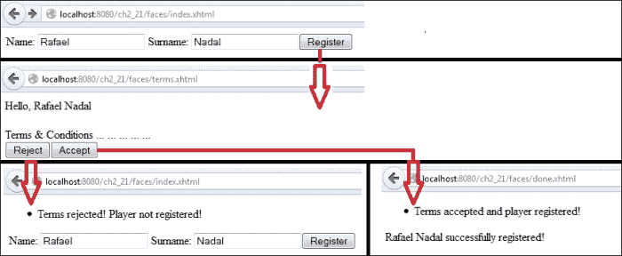

# 第二章. JSF 中的通信

通信是 JSF 应用程序的核心，也是决定此类应用程序架构的主要方面之一。从大局出发，你需要从一开始就确定主要部分以及它们将如何相互以及与最终用户进行通信。在选择了设计模式、绘制 UML 图、草拟架构和应用流程之后，是时候开始工作并开始使用表单、参数、参数、值、页面、Bean 等实现通信管道了。

幸运的是，JSF 提供了许多解决方案，以确保 JSF 组件之间以及 JSF 和 XHTML 页面、JavaScript 代码和其他第三方组件之间有一个强大且灵活的通信层。在本章中，我们将涵盖以下主题：

+   使用上下文参数

+   使用 `<f:param>` 标签传递请求参数

+   与视图参数一起工作

+   在 GET 请求中调用动作

+   使用 `<f:attribute>` 标签传递属性

+   通过动作监听器设置属性值

+   使用 Flash 范围传递参数

+   用 JSTL `<c:set>` 标签替换 `<f:param>` 标签

+   通过 Cookie 发送数据

+   与隐藏字段一起工作

+   发送密码

+   以编程方式访问 UI 组件属性

+   通过方法表达式传递参数

+   通过 `binding` 属性进行通信

# 传递和获取参数

正如你将在下一节中看到的，JSF 提供了多种方法来传递/获取参数到/从 Facelets、管理 Bean、UI 组件等。

## 使用上下文参数

上下文参数使用 `<context-param>` 标签在 `web.xml` 文件中定义。此标签允许两个重要的子标签：`<param-name>`，表示参数名称，以及 `<param-value>`，表示参数值。例如，一个用户定义的上下文参数如下所示：

```java
<context-param>
  <param-name>number.one.in.ATP</param-name>
  <param-value>Rafael Nadal</param-value>
</context-param>
```

现在，在 JSF 页面中，你可以像以下代码所示访问此参数：

```java
<h:outputText value="#{initParam['number.one.in.ATP']}"/>
<h:outputText value="#{facesContext.externalContext.initParameterMap['number.one.in.ATP']}"/>
```

在一个管理 Bean 中，可以通过 `getInitParameter` 方法访问相同的上下文参数：

```java
facesContext.getExternalContext().getInitParameter("number.one.in.ATP");
```

完整的应用程序命名为 `ch2_27`。

## 使用 `<f:param>` 标签传递请求参数

有时，你需要从 Facelet 将参数传递到管理 Bean 或另一个 Facelet。在这种情况下，你可能需要 `<f:param>` 标签，它可以用于向请求添加查询字符串名称-值对，或者简单地说，发送请求参数。通常，`<f:param>` 标签用于 `<h:commandButton>` 和 `<h:commandLink>` 标签内部，用于向管理 Bean 发送请求参数。例如，以下代码片段在表单提交时向请求添加两个参数。这些参数在 `PlayersBean` Bean 中访问；第一个参数名为 `playerNameParam`，第二个参数名为 `playerSurnameParam`。

```java
<h:form>
  Click to send name, 'Rafael' surname, 'Nadal', with f:param:
  <h:commandButton value="Send Rafael Nadal"  action="#{playersBean.parametersAction()}">
  <f:param id="playerName" name="playerNameParam" value="Rafael"/>
  <f:param id="playerSurname" name="playerSurnameParam" value="Nadal"/>
  </h:commandButton>
</h:form>
```

如你所见，当按钮被点击时，请求参数被发送并且调用`parametersAction`方法（通过`action`或`actionListener`）。当应用程序流程到达此方法时，两个请求参数已经可用于使用。你可以通过当前`FacesContext`实例访问请求参数映射，如以下代码所示来轻松提取它们：

```java
private String playerName;
private String playerSurname;
...
//getter and setter
...

public String parametersAction() {

  FacesContext fc = FacesContext.getCurrentInstance();
  Map<String, String> params = fc.getExternalContext().getRequestParameterMap();
  playerName = params.get("playerNameParam");
  playerSurname = params.get("playerSurnameParam");

  return "some_page";
}
```

这两个参数的值都存储在`playerName`和`playerSurname`托管 Bean 的属性中（这些可以进一步修改而不会影响原始参数），但你可以通过在*some_page*中使用`param` EL 保留字轻松显示参数值（记住第一章动态访问 JSF 应用程序数据")中的*EL 隐含对象*部分，*通过表达式语言(EL 3.0)动态访问 JSF 应用程序数据*，该部分解释了`param`是一个预定义变量，它引用请求参数映射）：

```java
Name: #{param.playerNameParam} 
Surname: #{param.playerSurnameParam}
```

`<f:param>`标签也可以在`<h:outputFormat>`标签内部使用，以替换消息参数；`<f:param>`用于将参数传递给 UI 组件，如下所示：

```java
<h:outputFormat value="Name: {0} Surname: {1}">
  <f:param value="#{playersBean.playerName}" />
  <f:param value="#{playersBean.playerSurname}" /> 
</h:outputFormat>
```

上述代码的输出如下：

**姓名：拉斐尔 姓氏：纳达尔**

### 注意

如果你想在设置托管 Bean 属性之后但在调用动作方法之前（如果存在的话）执行一些初始化任务（或其他操作），那么你可以定义一个带有`@PostConstruct`注解的 public void 方法。在此示例中，`init`方法将在`parametersAction`方法之前被调用，并且传递的请求参数可以通过请求映射获得。

`init`方法如下所示：

```java
@PostConstruct
public void init(){
  //do something with playerNameParam and playerSurnameParam
}
```

此示例被封装在名为`ch2_1`的应用程序中。

如果你认为在托管 Bean 中访问请求映射不是一个非常方便的方法，那么你可以使用`@ManagedProperty`，它将参数设置为托管 Bean 属性并将其值链接到请求参数：

```java
@ManagedProperty(value = "#{param.playerNameParam}")
private String playerName;
@ManagedProperty(value = "#{param.playerSurnameParam}")
private String playerSurname;
```

这些值在 Bean 构造后立即设置，并在`@PostConstruct`期间可用，但请注意，`@ManagedProperty`仅适用于由 JSF 管理的 Bean（`@ManagedBean`），而不是由 CDI 管理的 Bean（`@Named`）。

此示例被封装在名为`ch2_2`的应用程序中，该应用程序位于本章的代码包中。你可能还对名为`ch2_3`的应用程序感兴趣，它是使用`<f:param>`、`@ManagedProperty`和`@PostConstruct`的另一个示例。在此示例中，`<h:commandButton>`动作指示另一个 JSF 页面而不是托管 Bean 方法。

`<f:param>`标签可以用来在 Facelets 之间直接传递请求参数，而不涉及托管 Bean。通常，这发生在`<h:link>`标签中，如下所示：

```java
<h:link value="Send Rafael Nadal" outcome="result">
  <f:param id="playerName" name="playerNameParam" value="Rafael"/>
  <f:param id="playerSurname" name="playerSurnameParam" value="Nadal"/>               
</h:link>
```

当点击**发送拉斐尔·纳达尔**链接时，JSF 将使用包含 `result.xhtml` 文件资源名称和请求参数 `playerNameParam` 和 `playerSurnameParam` 的准备好的 URL。这两个参数在 `result.xhtml` 文件中如下显示：

```java
Name: #{param.playerNameParam} 
Surname: #{param.playerSurnameParam}
```

如果你检查浏览器地址栏中由 `<h:link>` 标签生成的 URL，你将看到如下类似的 URL：

`http://`*主机名*`/ch2_4/faces/result.xhtml?playerNameParam=Rafael&playerSurnameParam=Nadal`

此示例被包裹在名为 `ch2_4` 的应用程序中。在那个应用程序中，你还可以看到一个使用 `<h:commandButton>` 标签的示例。请注意，在这种情况下，我们需要将 `<h:commandButton>` 标签包裹在 `<h:form>` 标签中，该表单通过 POST 请求提交；因此，请求参数不再可见于 URL 中。

### 注意

`<f:param>` 标签不能通过声明性/命令性验证和/或转换来加强。你需要自己完成这个任务。

不要尝试将 `<f:param>` 标签放置在 `<h:inputText>` 标签或任何其他输入组件内部。那样根本不会起作用。

## 与视图参数一起工作

从 JSF 2.0 开始，我们可以使用一类新的参数，称为**视图参数**。这类参数由 `UIViewParameter` 类（该类扩展了 `UIInput` 类）实现，并在 Facelets 中使用 `<f:viewParam>` 标签定义。通过这个标签，我们可以声明性地将 `UIViewParameter` 类注册为父视图的元数据；这就是为什么 `<f:viewParam>` 标签嵌套在 `<f:metadata>` 标签中的原因。

从 JSF 2.0 开始，元数据概念在视图的一部分中实现，这提供了以下两个主要优势（该部分由 `<f:metadata>` 标签界定）：

+   此部分的内容在没有整个视图的情况下也是可读的

+   在初始请求时，该部分的组件在视图渲染之前可以完成不同的事情

### 注意

从 JSF 2.2 开始，元数据部分（以及随后的组件）通过一个名为 `hasMetadata` 的公共静态方法（`UIViewRoot`）检测。此方法添加在 `javax.faces.view.ViewMetadata` 中，如果存在元数据部分则返回 `true`，否则返回 `false`。除了其他好处外，使用 `<f:viewParam>` 标签的主要优势是支持 URL 书签。

为了更好地理解，让我们看看使用 `<f:viewParam>` 标签的一个简单示例。以下代码片段来自同一页面，`index.xhtml`：

```java
<f:metadata>
  <f:viewParam name="playernameparam" value="#{playersBean.playerName}"/>
  <f:viewParam name="playersurnameparam"  value="#{playersBean.playerSurname}"/> 
</f:metadata>
...
<h:body>
  You requested name: <h:outputText value="#{playersBean.playerName}"/><br/>
  You requested surname: <h:outputText value="#{playersBean.playerSurname}"/>
</h:body>
```

现在，让我们看看初始请求时发生了什么。首先，让我们关注第一段代码：在这里，JSF 通过名称（`playernameparam` 和 `playersurnameparam`）从页面 URL 中获取请求参数的值，并应用指定的转换器/验证器（这些是可选的）。在转换/验证成功后，在视图渲染之前，JSF 通过调用 `setPlayerName` 和 `setPlayerSurname` 方法（仅在 URL 中提供请求参数时调用）将 `playernameparam` 和 `playersurnameparam` 请求参数的值绑定到管理 Bean 属性 `playerName` 和 `playerSurname`。如果缺少 `value` 属性，则 JSF 将请求参数作为请求属性设置在名称 `playernameparam` 和 `playersurnameparam` 上，可通过 `#{playernameparam}` 和 `#{playersurnameparam}` 访问。

页面的初始 URL 应该类似于以下内容：

`http://`*hostname*`/ch2_5/?playernameparam=Rafael&playersurnameparam=Nadal`

在第二段代码中，显示管理 Bean 属性 `playerName` 和 `playerSurname` 的值（调用 `getPlayerName` 和 `getPlayerSurname` 方法）；它们应该反映请求参数的值。

### 注意

由于 `UIViewParameter` 类扩展了 `UIInput` 类，管理 Bean 属性仅在 **更新模型** 阶段设置。

此示例包含在名为 `ch2_5` 的应用程序中。

视图参数可以通过在 `<h:link>` 标签中使用 `includeViewParams="true"` 属性或在任何 URL 中使用 `includeViewParams=true` 请求参数包含在链接（GET 查询字符串）中。这两种情况将在下面的示例中看到。

在 `index.xhtml` 文件中，你可以有如下代码，其中通过请求参数包含视图参数：

```java
<f:metadata>
  <f:viewParam name="playernameparam" value="#{playersBean.playerName}"/>
  <f:viewParam name="playersurnameparam" value="#{playersBean.playerSurname}"/> 
</f:metadata>
...
<h:body>        
  <h:form>
    Enter name:<h:inputText value="#{playersBean.playerName}"/>
    Enter name:<h:inputText value="#{playersBean.playerSurname}"/>
  <h:commandButton value="Submit" action="results?faces-redirect=true&amp;includeViewParams=true"/>
  </h:form>               
</h:body>
```

初始 URL 可以是：

`http://`*hostname*`/ch2_6/?playernameparam=Rafael&playersurnameparam=Nadal`

视图参数，`playernameparam` 和 `playersurnameparam`，将从此 URL 中提取并绑定到管理 Bean 属性，`playerName` 和 `playerSurname`。可选地，这两个属性可以通过两个 `<h:inputText>` 标签或其它 UI 组件由用户进一步修改。如果初始 URL 不包含视图参数，则由 `<h:inputText>` 生成的字段将为空。通过 `<h:commandButton>` 标签渲染的按钮将重定向到 `results.xhtml` 页面，并将视图参数包含在新 URL 中。视图参数的值将反映相应管理 Bean 属性的值，因为表单是在以下 URL 组合之前提交的：

`http://`*hostname*`/ch2_6/faces/results.xhtml?playernameparam=Rafael&playersurnameparam=Nadal`

`results.xhtml` 文件（或 `index.xhtml` 文件指向的任何其他页面）将使用 `<f:viewParam>` 标签从 GET 请求中获取参数到绑定属性，如下面的代码所示：

```java
<f:metadata>
  <f:viewParam name="playernameparam" value="#{playersBean.playerName}"/>
  <f:viewParam name="playersurnameparam" value="#{playersBean.playerSurname}"/> 
</f:metadata>
...
<h:body>        
  You requested name: <h:outputTextvalue="#{playersBean.playerName}"/><br/>
  You requested surname: <h:outputText value="#{playersBean.playerSurname}"/>       
</h:body>
```

如果你希望使用`<h:link>`标签，并且将`includeViewParams`属性设置为`true`，那么`index.xhtml`文件将如下所示（在这种情况下，没有表单提交和 POST 请求）：

```java
<f:metadata>
  <f:viewParam name="playernameparam" value="#{playersBean.playerName}"/>            
 <f:viewParam name="playersurnameparam" value="#{playersBean.playerSurname}"/> 
</f:metadata>
...
<h:body>        
  <h:link value="Send"outcome="results?faces-redirect=true" includeViewParams="true"/>
</h:body>
```

这些示例被封装在名为`ch2_6`的应用程序中。

你可以在任何 URL 中使用`includeViewParams`请求参数，这意味着你可以在管理 Bean 中使用它，在导航链接中包含视图参数，如下所示：

```java
<f:metadata>
  <f:viewParam name="playernameparam" value="#{playersBean.playerName}"/>            
  <f:viewParam name="playersurnameparam" value="#{playersBean.playerSurname}"/> 
</f:metadata>
...
<h:body>
  <h:form>
    Enter name:<h:inputText value="#{playersBean.playerName}"/>
    Enter name:<h:inputText value="#{playersBean.playerSurname}"/>
    <h:commandButton value="Submit" action="#{playersBean.toUpperCase()}"/>
  </h:form>
</h:body>
```

操作方法如下：

```java
public String toUpperCase(){
  playerName=playerName.toUpperCase();
  playerSurname=playerSurname.toUpperCase();

  return "results?faces-redirect=true&includeViewParams=true";
}
```

完整的应用程序名为`ch2_7`，可在 Packt Publishing 网站的该章节代码包中找到。

如前所述的代码所示，`UIViewParameter`类扩展了`UIInput`类，这意味着它继承了所有属性，例如`required`和`requiredMessage`。当 URL 必须包含视图参数时，你可以使用这两个属性来确保应用程序流程得到控制，并且用户得到正确通知。以下是一个示例代码：

```java
<f:metadata>
  <f:viewParam name="playernameparam" required="true" requiredMessage="Player name required!" value="#{playersBean.playerName}"/>            
  <f:viewParam name="playersurnameparam" required="true" requiredMessage="Player surname required!" value="#{playersBean.playerSurname}"/> 
</f:metadata>
```

如果初始 URL 不包含视图参数（一个或两个），那么你将收到一条消息，报告这一事实。此示例被封装在名为`ch2_9`的应用程序中。

此外，视图参数支持细粒度的转换和验证。你可以使用`<f:validator>`和`<f:converter>`，或者从`UIInput`类继承的`validator`和`converter`属性。假设你有一个名为`PlayerValidator`的自定义验证器（其实际实现并不重要），以下是其代码：

```java
@FacesValidator("playerValidator")
public class PlayerValidator implements Validator {

  @Override
  public void validate(FacesContext context, UIComponent component, 
  Object value) throws ValidatorException {
    //validation conditions
   ...
```

然后，你可以将其附加到视图参数上，如下所示：

```java
<f:metadata>
  <f:viewParam id="nameId" name="playernameparam"  validator="playerValidator" value="#{playersBean.playerName}"/>            
  <f:viewParam id="surnameId" name="playersurnameparam" validator="playerValidator"value="#{playersBean.playerSurname}"/>         
</f:metadata>  
```

以下代码片段完成了以下任务：

+   通过名称获取请求参数的值，`playernameparam`和`playersurnameparam`

+   转换并验证（在这种情况下，验证）参数

+   如果转换和验证成功结束，则参数被设置在管理 Bean 属性中

+   任何验证失败都将导致显示一条消息

### 注意

对于自定义消息样式，你可以将`<h:message>`标签附加到`<f:viewParam>`标签上。

此示例被封装在名为`ch2_10`的应用程序中。

### 注意

如果你希望保留验证失败后的视图参数，那么你需要使用比`@RequestScoped`更广泛的范围，例如`@ViewScoped`，或者通过命令组件中的`<f:param>`标签手动保留请求参数以供后续请求使用。

有时，你可能需要一个视图参数的转换器。例如，如果你尝试从一个管理 Bean 中将`java.util.Date`参数作为视图参数传递，你可能会这样编写代码：

```java
private Date date = new Date();
...  
public String sendDate() {
  String dateAsString = new SimpleDateFormat("dd-MM-yyyy").format(date);
  return "date.xhtml?faces-redirect=true&date=" + dateAsString;
}
```

现在，在`date.xhtml`文件中，你需要将视图参数从字符串转换为`date`，为此，你可以使用以下代码中的`<f:convertDateTime>`转换器：

```java
<f:viewParam name="date" value="#{dateBean.date}">
  <f:convertDateTime pattern="dd-MM-yyyy" />
</f:viewParam>
```

当然，也可以使用自定义转换器。完整的应用程序名为`ch2_29`。

在使用 `<f:viewParam>` 标签的许多优点中，我们有一个差距。当视图参数设置在管理 Bean 属性中时，设置的值在 `@PostConstruct` 中不可用；因此，你无法直接执行初始化或预加载任务。你可以通过附加 `preRenderView` 事件监听器来快速修复这个问题，如下面的代码所示：

```java
<f:metadata>
  <f:viewParam name="playernameparam" value="#{playersBean.playerName}"/>            
  <f:viewParam name="playersurnameparam" value="#{playersBean.playerSurname}"/> 
 <f:event type="preRenderView" listener="#{playersBean.init()}"/>
</f:metadata>
```

`init` 方法如下所示：

```java
public void init() {        
  // do something with playerName and playerSurname 
}
```

### 注意

使用 `<f:viewParam>` 标签时，设置的值在 `@PostConstruct` 中不可用。你可以通过附加 `preRenderView` 事件监听器来修复这个问题，或者，如你将看到的，通过 `<f:viewAction>` 标签。

此示例包含在名为 `ch2_8` 的应用程序中。

好吧，这里还有一个我想讨论的方面。`UIViewParameter` 类 (`<f:viewParam>`) 是一个有状态的组件，它将值存储在状态中。这很好，因为即使在值不再来自页面 URL 或管理 Bean 是请求作用域的情况下，值仍然在回发中可用。因此，你只需要指示一次视图参数，而不是每次请求都要指示。但是，这种行为的缺点有几个——最显著的是在每次回发时调用设置方法（你不想在视图 Bean 中这样做）。另一个缺点是在每次回发时调用通过 `preRenderView` 事件处理器指示的方法；这可以通过以下代码中的测试来修复。完整的应用程序命名为 `ch2_28`。

```java
public void init() {        
  if (!FacesContext.getCurrentInstance().isPostback()) {
    // do something with playerName and playerSurname 
  }
}
```

可能最痛苦的缺点是在每次回发时转换和验证视图参数。显然，这不是你期望看到的行为。为了仅在页面 URL 包含请求参数时调用转换器/验证器，你需要通过编写自定义实现来修改 `UIViewParameter` 类的实现。你可以尝试编写一个无状态的 `UIViewParameter` 类或控制转换/验证调用。当然，你必须记住，修改默认实现可能会导致更多或更不可预测的缺点。作为替代方案，你可以使用 OmniFaces 的 `<o:viewParam>` 标签，它解决了这些问题。相关示例可以在 [`showcase.omnifaces.org/components/viewParam`](http://showcase.omnifaces.org/components/viewParam) 上看到。

因此，作为本节的最终结论，`<f:viewParam>` 标签用于捕获请求参数。此外，它可以与 `<h:link>` 和 `<h:button>` 标签一起使用，以发送出站请求参数，或者在非 JSF 表单中，将数据发送到使用 `<f:viewParam>` 标签的 JSF 页面，或者使 JSF 结果页面在 POST-redirect-GET 流中可书签。另一方面，`<f:viewParam>` 标签不支持 `<h:form>` 标签使用 GET 或通过 GET 请求提供对随机 JSF 页面的访问。

## 在 GET 请求上调用动作

从 JSF 2.2 开始，我们可以通过使用新的通用 **视图操作** 功能（在 Seam 2 和 3 中广为人知）来处理在 GET 请求上调用操作。这个新功能体现在 `<f:viewAction>` 标签中，它被声明为元数据面 `<f:metadata>` 的子标签。这允许视图操作成为 faces/non-faces 请求的生命周期的一部分。

在前面的章节中，我们看到了如何将自定义验证器附加到 `<f:viewParam>` 标签上以验证视图参数。当验证方法在托管 Bean 中声明而不是作为 `Validator` 接口的独立实现时，可以使用 `<f:viewAction>` 标签完成同样的事情。例如，在 `index.xhtml` 文件中，您可能有以下代码：

```java
<f:metadata>
  <f:viewParam id="nameId" name="playernameparam" value="#{playersBean.playerName}"/>            
  <f:viewParam id="surnameId" name="playersurnameparam" value="#{playersBean.playerSurname}"/>   
 <f:viewAction action="#{playersBean.validateData()}"/>
</f:metadata>
```

正如您所看到的，下面的 `validateData` 方法只是在 `PlayersBean` 中声明的一个普通方法：

```java
public String validateData() {
  //validation conditions
  return "index"; //or other page
}
```

这个示例被封装在名为 `ch2_11` 的应用程序中。

### 注意

`<f:viewAction>` 标签和 `preRenderView` 事件监听器不是相同的！

前面的说明强调了我们的下一个讨论。您可能会认为它们是相同的，因为在先前的示例中，您可以替换 `<f:viewAction>` 为 `preRenderView` 并获得相同的效果（结果）。确实，它们在某种程度上是相同的，但以下四个要点中的一些现有差异很重要，如下所示：

+   默认情况下，`preRenderView` 事件监听器在回发请求上执行，而视图操作则不会。在 `preRenderView` 事件监听器的情况下，您需要通过以下方式测试请求类型来克服这一点：

    ```java
    if (!FacesContext.getCurrentInstance().isPostback()) {
      // code that should not be executed in postback phase
    }
    ```

    例如，以下代码将尝试使用 `preRenderView` 事件监听器对集合值应用一些修改：

    ```java
    <f:metadata>
      <f:viewParam name="playernameparam" value="#{playersBean.playerName}"/>
      <f:viewParam name="playersurnameparam" value="#{playersBean.playerSurname}"/> 
      <f:event type="preRenderView" listener="#{playersBean.init()}"/>
    </f:metadata>
    ```

    `init` 方法在 `PlayersBean` 中声明，它只是将集合值转换为大写，如下面的代码所示：

    ```java
    public void init() {
      if (playerName != null) {
        playerName = playerName.toUpperCase();
      }
      if (playerSurname != null) {
        playerSurname = playerSurname.toUpperCase();
      }
    }
    ```

    接下来，当 JSF 页面渲染时，将使用大写形式的集合值，并且可以完成进一步的请求（例如，当某个按钮被点击时，您可能想调用 `#{playersBean.userAction()}` 方法）。但是，每个进一步的请求都会再次调用 `init` 方法（在 `userAction` 方法之后），因为 `preRenderView` 事件监听器在回发时执行。除非这是期望的功能，否则您需要通过编程测试回发以防止以下 `init` 方法代码被执行：

    ```java
    public void init() {
      if (!FacesContext.getCurrentInstance().isPostback()) {
        if (playerName != null) {
          playerName = playerName.toUpperCase();
        }
        if (playerSurname != null) {
          playerSurname = playerSurname.toUpperCase();
        }
       }
    }
    ```

    嗯，在 `<f:viewAction>` 标签的情况下，情况并不相同。将 `preRenderView` 事件监听器替换为 `<f:viewAction>` 标签，如下面的代码所示：

    ```java
    <f:metadata>
      <f:viewParam name="playernameparam" value="#{playersBean.playerName}"/>
      <f:viewParam name="playersurnameparam" value="#{playersBean.playerSurname}"/> 
      <f:viewAction action="#{playersBean.init()}"/>
    </f:metadata>
    ```

    `<f:viewAction>`标签支持一个名为`onPostback`的属性，默认设置为`false`，这意味着在回发请求上不会调用`init`方法。当然，如果你将其设置为`true`，那么它将起相反的作用；但是，请注意，在`preRenderView`事件监听器的情况下，`init`方法是在`userAction`方法之后调用的，而在`<f:viewAction>`标签的情况下，`init`方法是在`userAction`方法之前调用的，如下面的代码行所示：

    ```java
    <f:viewAction action="#{playersBean.init()}" onPostback="true"/>
    ```

    基于`preRenderView`事件监听器的示例被封装在名为`ch_12_1`的应用程序中，而对于`<f:viewAction>`标签，它被命名为`ch_12_2`。

+   视图操作具有导航能力，而`preRenderView`事件监听器则没有。虽然视图操作可以自然地完成导航任务，但`preRenderView`事件监听器需要基于 JSF API 进行显式导航。

    例如，如果你将前面的`init`方法修改为返回`start.xhtml`视图，那么你可能需要将其修改如下面的代码所示：

    ```java
    public String init() {
      if (playerName != null) {
        playerName = playerName.toUpperCase();
      }
      if (playerSurname != null) {
        playerSurname = playerSurname.toUpperCase();
      }
      return "start";
    }
    ```

    但是，这不会与`preRenderView`事件监听器一起工作！你需要通过返回`void`并替换返回`"start"`代码行来添加显式导航：

    ```java
    ConfigurableNavigationHandler handler = (ConfigurableNavigationHandler) FacesContext.getCurrentInstance().getApplication().getNavigationHandler();
    handler.performNavigation("start");
    ```

    如果你移除`preRenderView`事件监听器并使用`<f:viewAction>`标签代替，那么前面的`init`方法将正确导航到`start.xhtml`，而不需要显式调用导航处理程序。

    基于`preRenderView`事件监听器的示例被封装在名为`ch_13_1`的应用程序中，而对于`<f:viewAction>`标签，它被命名为`ch_13_2`。

    此外，`<f:viewAction>`标签支持声明性导航。因此，你可以在`faces-config.xml`文件中编写一个导航规则，在页面渲染之前进行查询。例如：

    ```java
    <navigation-rule>
      <from-view-id>index.xhtml</from-view-id>
      <navigation-case>
        <from-action>#{playersBean.init()}</from-action> 
        <from-outcome>start</from-outcome>
        <to-view-id>rafa.xhtml</to-view-id>
        <redirect/>
      </navigation-case>
    </navigation-rule>
    ```

    现在，将渲染`rafa.xhtml`页面而不是`start.xhtml`页面。此示例被封装在名为`ch2_13_3`的应用程序中。

+   默认情况下，视图操作是在**调用应用程序**阶段执行的。但是，通过将`immediate`属性设置为`true`，它也可以在**应用请求值**阶段执行，如下面的代码所示：

    ```java
    <f:viewAction action="#{playersBean.init()}" immediate="true"/>
    ```

+   此外，你可以使用`phase`属性指定执行动作的阶段，其值表示阶段名称作为预定义的常量。例如：

    ```java
    <f:viewAction action="#{playersBean.init()}" phase="UPDATE_MODEL_VALUES"/>
    ```

    支持的值有`APPLY_REQUEST_VALUES`、`INVOKE_APPLICATION`、`PROCESS_VALIDATIONS`和`UPDATE_MODEL_VALUES`。

### 注意

视图操作可以放置在不含其他视图参数的视图元数据面上。

## 使用`<f:attribute>`标签传递属性

当`<f:param>`标签不能满足你的需求时，也许`<f:attribute>`标签可以。这个标签允许你传递组件的属性值，或者将参数传递给组件。

例如，你可以将`<h:commandButton>`标签的属性`value`的值分配，如下面的代码所示：

```java
<h:commandButton actionListener="#{playersBean.parametersAction}">
  <f:attribute name="value" value="Send Rafael Nadal" />
</h:commandButton>
```

这将渲染一个标签为**发送拉斐尔·纳达尔**的按钮。其代码如下：

```java
<h:commandButton value="Send Rafael Nadal" actionListener="#{playersBean.parametersAction}">
```

此外，`<f:attribute>`标签可以用来向组件传递参数，如下面的代码所示：

```java
<h:commandButton actionListener="#{playersBean.parametersAction}">
  <f:attribute id="playerName" name="playerNameAttr" value="Rafael"/>               
  <f:attribute id="playerSurname" name="playerSurnameAttr" value="Nadal"/>
</h:commandButton>
```

在动作监听器方法中，你可以提取属性值，如下面的代码所示：

```java
private final static Logger logger = Logger.getLogger(PlayersBean.class.getName());
private String playerName;
private String playerSurname;
...
//getters and setters
...
public void parametersAction(ActionEvent evt) {     

  playerName = (String) evt.getComponent().getAttributes().get("playerNameAttr");
  playerSurname = (String) evt.getComponent().getAttributes().get("playerSurnameAttr");

  logger.log(Level.INFO, "Name: {0} Surname: {1}", new Object[]{playerName, playerSurname});
}
```

此示例被封装在名为`ch2_14`的应用程序中。

如果你喜欢 PrimeFaces([`primefaces.org/`](http://primefaces.org/))，那么你可能觉得下一个例子很有用。PrimeFaces 最伟大的内置组件之一是`<p:fileUpload>`标签，它可以用来上传文件。有时，除了要上传的文件外，你还需要传递一些额外的参数，例如文件的所有者的名字和姓氏。嗯，`<p:fileUpload>`标签没有提供解决方案，但`<f:attribute>`标签可能会有所帮助。以下是一个经典的带有`<f:attribute>`标签的`<p:fileUpload>`标签的代码：

```java
<h:form>  
  <p:fileUpload 
    fileUploadListener="#{fileUploadController.handleFileUpload}" 
    mode="advanced" dragDropSupport="false"  
    update="messages" sizeLimit="100000" fileLimit="3"   
    allowTypes="/(\.|\/)(gif|jpe?g|png)$/">  
  <f:attribute id="playerName" name="playerNameAttr" value="Rafael"/>               
  <f:attribute id="playerSurname" name="playerSurnameAttr" value="Nadal"/> 
  </p:fileUpload>
  <p:growl id="messages" showDetail="true"/>  
</h:form>
```

`handleFileUpload`方法负责上传特定的步骤（以下代码中省略），但它也可以访问通过`<f:attribute>`标签传递的值：

```java
public void handleFileUpload(FileUploadEvent evt) {

  //upload specific tasks, see PrimeFaces documentation

  String playerName = (String) evt.getComponent().getAttributes().get("playerNameAttr");
  String playerSurname = (String) evt.getComponent().getAttributes().get("playerSurnameAttr");

  FacesMessage msg = new FacesMessage("Successful", evt.getFile().getFileName() + " is uploaded for " + playerName + " " + playerSurname);

  FacesContext.getCurrentInstance().addMessage(null, msg);
}
```

如果你不是 PrimeFaces 的粉丝，那么你可能认为这个例子没有用，但你可能喜欢其他第三方库，比如 RichFaces、ICEFaces 和 MyFaces。你也可以将这项技术应用于其他组件库。

此示例被封装在名为`ch2_15`的应用程序中。

`<f:attribute>` 标签在动态传递参数时非常有用，特别是当与绑定到管理 Bean 的 UI 组件一起使用`binding`属性时。这非常有用，尤其是在 JSF 没有提供将参数传递给绑定 UI 组件的 getter/setter 方法的解决方案时，如下面的代码所示：

```java
<h:form>
  <h:inputText binding="#{playersBean.htmlInputText}" value="#{playersBean.playerNameSurname}">
    <f:attribute name="playerNameAttr" value="Rafael Nadal"/>
  </h:inputText>
</h:form>
```

### 注意

现在，`<h:inputText>`标签的值应包含通过`<f:attribute>`标签设置的值。请注意，仅使用唯一的属性名称，并且不要干扰（尝试覆盖）UI 组件的默认属性。

此外，`PlayersBean` 管理 Bean 的代码如下：

```java
@Named
@RequestScoped
public class PlayersBean {

  private UIInput htmlInputText= null;    

  public PlayersBean() {
  }

  public UIInput getHtmlInputText() {
    return htmlInputText;
  }

  public void setHtmlInputText(UIInput htmlInputText) {
    this.htmlInputText = htmlInputText;
  }    

  public String getPlayerNameSurname() {
 return (String) htmlInputText.getAttributes().get("playerNameAttr");
  }    
}
```

如你所见，通过这种方式传递的所有参数都可以通过父 UI 组件的`getAttributes`方法访问。

此示例被封装在名为`ch2_23`的应用程序中。

## 通过动作监听器设置属性值

`<f:setPropertyActionListener>`标签使用动作监听器（由框架创建）直接将值设置到管理 Bean 的属性中；它放置在由`ActionSource`类派生的组件中。`target`属性指示管理 Bean 属性，而`value`属性指示属性的值，如下面的代码所示：

```java
<h:commandButton value="Send Rafael Nadal 1">
  <f:setPropertyActionListener id="playerName"  target="#{playersBean.playerName}" value="Rafael"/>
  <f:setPropertyActionListener  id="playerSurname" target="#{playersBean.playerSurname}" value="Nadal"/>
</h:commandButton>
```

现在，在`PlayersBean`管理 Bean 中，调用 setter 方法并设置值；`logger`有助于查看应用程序流程和理解监听器是如何触发的，如下面的代码所示：

```java
private final static Logger logger =Logger.getLogger(PlayersBean.class.getName());
private String playerName;
private String playerSurname;

public void setPlayerName(String playerName) {
  this.playerName = playerName;
  logger.log(Level.INFO, "Player name (from setPlayerName() method: {0}", playerName);
}

public void setPlayerSurname(String playerSurname) {
  this.playerSurname = playerSurname;
  logger.log(Level.INFO, "Player surname (from setPlayerSurname() method: {0}", playerSurname);
}
```

当点击标记为**发送给拉斐尔·纳达尔 1**的按钮时，应用程序的输出将如下所示：

```java
INFO:   Player name (from setPlayerName() method: Rafael
INFO:   Player surname (from setPlayerSurname() method: Nadal
```

### 注意

请记住，动作监听器是按照它们定义的顺序执行的，这意味着`<f:setPropertyActionListener>`标签的存在可能会影响监听器被触发的顺序。

这个注释很重要！为了清楚地理解，请查看以下代码片段：

```java
<h:commandButton value="Send Rafael Nadal 2" actionListener="#{playersBean.parametersAction}">
  <f:setPropertyActionListener id="playerName" target="#{playersBean.playerName}" value="Rafael"/>
  <f:setPropertyActionListener  id="playerSurname" target="#{playersBean.playerSurname}" value="Nadal"/>
</h:commandButton>
```

以下代码是`parametersAction`方法：

```java
public void parametersAction(ActionEvent e) {        
  logger.log(Level.INFO, "Player name (from parametersAction(ActionEvent) method: {0}", playerName);
  logger.log(Level.INFO, "Player surname (from parametersAction(ActionEvent) method: {0}", playerSurname);
}
```

好吧，这段代码没有按预期工作！你可能认为设置器方法首先被调用，然后是`parametersAction`方法；因此，设置的值在动作方法中可用。但是，以下输出将证明相反：

```java
INFO:   Player name (from parametersAction() method: null
INFO:   Player surname (from parametersAction() method: null
INFO:   Player name (from setPlayerName() method: Rafael
INFO:   Player surname (from setPlayerSurname() method: Nadal
```

因此，属性是在命令动作监听器触发后设置的！为了解决这个问题，您可以使用`action`属性而不是`actionListener`：

```java
<h:commandButton value="Send Rafael Nadal 3" action="#{playersBean.parametersAction()}">
  <f:setPropertyActionListener id="playerName" target="#{playersBean.playerName}" value="Rafael"/>
  <f:setPropertyActionListener  id="playerSurname" target="#{playersBean.playerSurname}" value="Nadal"/>
</h:commandButton>
```

当然，您需要根据以下代码相应地调整`parametersAction`方法：

```java
public void parametersAction() {        
  logger.log(Level.INFO, "Player name (from parametersAction() method: {0}", playerName);
  logger.log(Level.INFO, "Player surname (from parametersAction() method: {0}", playerSurname);
}
```

现在，输出将反映以下期望的结果：

```java
INFO:   Player name (from setPlayerName() method: Rafael
INFO:   Player surname (from setPlayerSurname() method: Nadal
INFO:   Player name (from parametersAction() method: Rafael
INFO:   Player surname (from parametersAction() method: Nadal
```

这个例子被包裹在名为`ch2_16`的应用中。

## 使用 Flash 作用域传递参数

新的 JSF Flash 作用域是一个非常有用的工具，当你需要在用户视图之间传递参数而不需要在会话中存储它们时。如果你记住存储在 Flash 作用域中的变量将在重定向后可用，并在之后被消除，那么 Flash 作用域就很容易理解。这在实现 POST-redirect-GET 模式时非常有用。

为了更好地理解，让我们假设以下场景：

+   玩家（用户）需要在 ATP 网站上注册。在提供其他信息的同时，他需要输入自己的姓名和姓氏，然后点击**注册**按钮。这一步骤在`index.xhtml`页面中完成。

+   应用流程将玩家重定向到`terms.xhtml`页面。在这个页面上，用户可以看到包含他姓名和姓氏的欢迎消息，以及一些必须接受（使用**接受**按钮）或拒绝（使用**拒绝**按钮）的条款和条件。

+   如果点击了**拒绝**按钮，那么用户将被重定向到`index.xhtml`主页，并且表单注册字段将显示他之前提供的信息。此外，他还将看到一个生成的消息，声明**条款被拒绝！玩家未注册**！这是由`<h:message>`标签输出的。

+   如果点击了**接受**按钮，那么用户将被重定向到名为`done.xhtml`的页面。在这个页面上，用户将看到一个生成的消息，声明**条款已接受，玩家已注册**！以及另一个消息，声明*姓名 姓氏***已成功注册**！第一个消息由`<h:message>`标签输出，而第二个消息由`<h:outputText>`标签输出。

以下是对两种场景的截图：



显然，只有将提交的值存储在某个地方，你才能实现这个流程，因为这些值在重定向过程中不会存活。这意味着在请求作用域中使用管理 bean 不是一个有效的选择。但是，如果我们讨论新的 Flash 作用域，那么对于请求作用域 bean 来说，事情就会变得更加有利。

如果你快速查看以下名为`PlayersBean`的请求作用域 bean 的代码，将更容易理解这个想法：

```java
@Named
@RequestScoped
public class PlayersBean {

  private final static Logger logger = Logger.getLogger(PlayersBean.class.getName());
  private String playerName;
  private String playerSurname;

...

  public String addValuesToFlashAction() {

    Flash flash = FacesContext.getCurrentInstance().getExternalContext().getFlash();
    flash.put("playerName", playerName);
    flash.put("playerSurname", playerSurname);

    return "terms?faces-redirect=true";
  }

  public void pullValuesFromFlashAction(ComponentSystemEvent e) {

    Flash flash = FacesContext.getCurrentInstance().getExternalContext().getFlash();
    playerName = (String) flash.get("playerName");
    playerSurname = (String) flash.get("playerSurname");
  }

  public String termsAcceptedAction() {

    Flash flash = FacesContext.getCurrentInstance().getExternalContext().getFlash();

    flash.setKeepMessages(true);
    pullValuesFromFlashAction(null);

    //do something with firstName, lastName 
    logger.log(Level.INFO, "First name: {0}", playerName);
    logger.log(Level.INFO, "Last name: {0}", playerSurname);

    FacesContext.getCurrentInstance().addMessage(null, new FacesMessage("Terms accepted and player registered!"));
    return "done?faces-redirect=true";
  }

  public String termsRejectedAction() {

    Flash flash = FacesContext.getCurrentInstance().getExternalContext().getFlash();

    flash.setKeepMessages(true);
    pullValuesFromFlashAction(null);

    FacesContext.getCurrentInstance().addMessage(null, new FacesMessage("Terms rejected! Player not registered!"));
    return "index?faces-redirect=true";
  }
}
```

此外，看一下起始页面`index.xhtml`。其代码如下：

```java
  <h:body>
    <f:metadata> 
      <f:event type="preRenderView" listener="#{playersBean.pullValuesFromFlashAction}"/> 
    </f:metadata>
    <h:messages />  
    <h:form>                       
      Name: <h:inputText value="#{playersBean.playerName}"/>
      Surname: <h:inputText value="#{playersBean.playerSurname}"/>
     <h:commandButton value="Register" action="#{playersBean.addValuesToFlashAction()}"/>          
    </h:form>
  </h:body>
```

因此，提交过程开始于用户点击标有**注册**的按钮。JSF 将调用`addValuesToFlashAction`方法，该方法负责将提交的值放入 Flash 作用域；这将确保值在重定向到`terms.xhtml`页面时仍然存活。

如果用户拒绝条款和条件，那么他会重定向到`index.xhtml`页面。在这里，你需要用用户输入的值重新填充注册表单字段。为此，你可以使用`preRenderView`事件，该事件在渲染响应阶段通过调用`pullValuesFromFlashAction`方法从 Flash 作用域中加载值。

接下来，让我们关注`terms.xhtml`页面；其代码如下：

```java
  <h:body>
    <h:messages />  
      Hello, <h:outputText value="#{flash.keep.playerName} #{flash.keep.playerSurname}"/>    
    <br/><br/>Terms &amp; Conditions ... ... ... ... ...
    <h:form>
    <h:commandButton value="Reject" action="#{playersBean.termsRejectedAction()}" />
    <h:commandButton value="Accept" action="#{playersBean.termsAcceptedAction()}" />
    </h:form>
  </h:body>
```

首先，这个页面会显示一个欢迎信息，其中包含了输入的值。这些值是通过以下代码从 Flash 作用域中获取的：

```java
#{flash.keep.playerName}
#{flash.keep.playerSurname}
```

注意到这种方法有两个功能，如下所示：

+   它从 Flash 作用域中获取值，这也可以通过以下行完成：

    ```java
    #{flash.playerName}
    #{flash.playerSurname}
    ```

+   这告诉 JSF 在下一个请求中保持 Flash 作用域中的值。这是必需的，因为放入 Flash 作用域的值在经过一次重定向后就会被删除。当我们从`index.xhtml`页面导航到`terms.xhtml`页面时，我们已经触发了一个重定向。但是，当点击**接受**或**拒绝**按钮时，还会出现另一个重定向。

### 注意

存储在 Flash 作用域中的值在经过一次重定向后就会被删除。

此外，页面还显示了返回`index.xhtml`页面的按钮和前进到`done.xhtml`页面的按钮。**接受**按钮将调用`termsAcceptedAction`方法，该方法基本上会在重定向之间保留消息（调用`setKeepMessages`方法）并将流程重定向到`done.xhtml`页面。同样，**拒绝**按钮调用`termsRejectedAction`方法，保留 Flash 作用域中的消息，并将流程重定向到`index.xhtml`页面。

`done.xhtml`页面是通过以下代码展示的：

```java
  <h:body>
    <f:metadata> 
     <f:event type="preRenderView" listener="#{playersBean.pullValuesFromFlashAction}"/> 
    </f:metadata>
    <h:messages />  
    <h:outputText value="#{playersBean.playerName} #{playersBean.playerSurname}"/> successfully registered!
  </h:body>
```

再次使用`preRenderView`事件监听器从 Flash 作用域中获取值。

这个例子被封装在名为`ch2_21`的应用程序中。

## 用 JSTL 的`<c:set>`标签替换`<f:param>`标签

有时，JSTL `<c:set>`标签可以解决 JSF `<f:param>`标签无法解决的问题。可能你已经知道，我们可以使用`<f:param>`标签将参数传递给`<ui:include>`标签，如下所示：

```java
<ui:include src="img/rafa.xhtml">
  <f:param name="rafa" value="Rafael Nadal Page"/>,
</ui:include>
```

嗯，这种方法会引发一个问题！现在，`Rafael Nadal 页面`的值将通过 EL 在包含的页面中可用，`#{rafa}`，但不会在包含页面的托管 Bean 构造函数中可用！

是时候使用`<c:set>`标签保存情况了；因此，代码将更改为以下内容：

```java
<ui:include src="img/rafa.xhtml">
  <c:set var="rafa" value="Rafael Nadal Page" scope="request"/>,
</ui:include>
```

完成！现在，在托管 Bean 的构造函数中，值可以按照以下代码提取：

```java
public ConstructorMethod(){
  FacesContext facesContext = FacesContext.getCurrentInstance();
  HttpServletRequest httpServletRequest  = (HttpServletRequest) facesContext.getExternalContext().getRequest();
  String rafa = (String) request.getAttribute("rafa");
}
```

在第四章的*配置系统事件监听器*部分，你将看到如何处理针对 Flash 作用域的系统事件。

## 通过 cookie 发送数据

JSF 提供了一个请求 cookie 映射，可用于处理 HTTP cookies。通过 JavaScript 设置 cookie 可以轻松完成；以下是一些辅助方法：

+   设置 cookie 的 JavaScript 方法如下：

    ```java
    function setCookie(cookie_name, value, expiration_days)
    {
      var expiration_date = new Date();
      expiration_date.setDate(expiration_date.getDate() + expiration_days);
      var c_value = escape(value) + ((expiration_days == null) ? "" : "; 
      expires=" + expiration_date.toUTCString());
      document.cookie = cookie_name + "=" + c_value;
    }
    ```

    通过名称删除 cookie 的 JavaScript 方法如下：

    ```java
    function deleteCookie(cookie_name) {
      document.cookie = encodeURIComponent(cookie_name) + "=deleted; expires=" + new Date(0).toUTCString();
    }
    ```

+   通过名称提取 cookie 的 JavaScript 方法如下：

    ```java
    function getCookie(cookie_name) {
      var i, part_1, part_2;
      var cookieslist = document.cookie.split(";");
      //<![CDATA[
      for (i = 0; i < cookieslist.length; i++)
      {
        part_1 = cookieslist[i].substr(0, cookieslist[i].indexOf("="));
        part_2 = cookieslist[i].substr(cookieslist[i].indexOf("=") + 1);
        part_1 = part_1.replace(/^\s+|\s+$/g, "");
        if (part_1 == cookie_name)
        {
          return unescape(part_2);
        }
      }
      //]]>
      return "nocookie";
    }
    ```

假设你有两个名为`name`和`surname`的 cookie，如下所示：

```java
setCookie('name', 'Rafael', 1);
setCookie('surname', 'Nadal', 1);
```

JSF 可以通过以下请求 cookie 映射访问这些 cookie：

```java
Object name_cookie = FacesContext.getCurrentInstance().getExternalContext().getRequestCookieMap().get("name");
Object surname_cookie = FacesContext.getCurrentInstance().getExternalContext().getRequestCookieMap().get("surname");

//set playerName property 
if (name_cookie != null) {
  playerName = (((Cookie) name_cookie).getValue());
}

//set playerSurname property 
if (surname_cookie != null) {
  playerSurname = (((Cookie) surname_cookie).getValue());
}
```

JSF 还提供了几个用于处理 cookie 的获取器和设置器方法。这些方法如下表所示：

| 获取方法 | 设置方法 |
| --- | --- |
| `String getComment()` | `setComment(String arg)` |
| `String getDomain()` | `setDomain(String arg)` |
| `String getName()` | `setHttpOnly(boolean arg)` |
| `String getPath()` | `setPath(String arg)` |
| `String getValue()` | `setValue(String arg)` |
| `int getMaxAge()` | `setMaxAge(int arg)` |
| `boolean getSecure()` | `setSecure(boolean arg)` |
| `int getVersion()` | `setVersion(int arg)` |
| `boolean isHttpOnly()` |   |

此示例包含在名为`ch2_18`的应用程序中，可以在本章的代码包中找到。

## 处理隐藏字段

隐藏字段有时非常有用！以微妙的方式传递数据可能是处理临时数据或用户提供的应重复使用的信息的完美选择。JSF 提供了`<h:inputHidden>`标签来传递隐藏参数。以下代码将两个隐藏参数传递给托管 Bean：

```java
<h:form id="hiddenFormId">
  <h:commandButton value="Send Rafael Nadal" onclick="setHiddenValues();" action="#{playersBean.parametersAction()}"/>
  <h:inputHidden id="playerName" value="#{playersBean.playerName}"/>
 <h:inputHidden id="playerSurname" value="#{playersBean.playerSurname}"/>
</h:form>
```

通常，从 JavaScript 设置隐藏字段值是一种常见做法。当点击**发送拉斐尔·纳达尔**按钮时，名为`setHiddenValues`的 JavaScript 函数会被调用；这发生在表单提交之前。`setHiddenValues`函数的代码如下：

```java
<script type="text/javascript">
  function setHiddenValues() {
    document.getElementById('hiddenFormId:playerName').value = "Rafael";
    document.getElementById('hiddenFormId:playerSurname').value = "Nadal";
  }
</script>
```

接下来，隐藏参数在指定的管理 Bean 属性中设置，并调用 `parametersAction` 方法——设置的值已准备好使用！

此示例被封装在名为 `ch2_17` 的应用程序中，并可在本章的代码包中找到。

## 发送密码

JSF 提供了一个名为 `<h:inputSecret>` 的专用标签来渲染以下众所周知的 HTML 代码：

```java
<input type="password">
```

例如，你可以像以下代码所示使用它：

```java
<h:form>
  <h:inputSecret value="#{playersBean.playerPassword}"/>
  <h:commandButton value="Send Password" action="#{playersBean.passwordAction()}"/>
</h:form>
```

此示例被封装在名为 `ch2_19` 的应用程序中。

## 通过程序访问 UI 组件属性

使用 JSF API 从管理 Bean 访问 UI 组件属性不是一种常见的方法，但有时它可能很有用。例如，假设我们有以下表单：

```java
<h:form id="playerFormId">
  <h:inputText id="playerNameId" value="#{playersBean.playerName}"/> 
  <h:inputText id="playerSurnameId" value="#{playersBean.playerSurname}"/>
  <h:commandButton value="Process" action="#{playersBean.processAction()}"/>
</h:form>
```

现在，你想要在 `processAction` 方法中获取具有 ID 的组件 `playerNameId` 和 `playerSurnameId` 的值。此外，你想要将具有 ID 的组件 `playerNameId` 的值设置为 `RAFAEL`。通过程序（使用 JSF API），你可以这样实现：

```java
public void processAction() {

  UIViewRoot view = FacesContext.getCurrentInstance().getViewRoot();
  UIComponent uinc = view.findComponent("playerFormId:playerNameId");
  Object prev = ((UIInput) uinc).getAttributes().put("value", "RAFAEL");

  UIComponent uisc = view.findComponent("playerFormId:playerSurnameId");
  Object current = ((UIInput) uisc).getAttributes().get("value");
}
```

首先，你需要获取对 `UIViewRoot` 的访问权限，它是顶级 UI 组件——`UIComponent` 树的根。然后，你可以通过 `findComponent` 方法在 UI 组件树中通过 ID 搜索所需的 UI 组件。每个 UI 组件都提供了 `getAttributes` 方法，可以通过名称访问 UI 组件属性。此时，你可以使用 `get` 方法提取属性值，或者使用 `put` 方法设置新的属性值。

此示例被封装在名为 `ch2_20` 的应用程序中。

## 通过方法表达式传递参数

使用方法表达式传递参数是将参数作为参数传递给管理 Bean 的操作方法的优雅解决方案。例如，让我们关注以下代码片段：

```java
<h:form>
 <h:commandButton value="Send Rafael Nadal"  action="#{playersBean.parametersAction('Rafael','Nadal')}"/>
</h:form>
```

如您在以下代码中所见，`action` 属性指示一个接收两个参数的方法：

```java
private String playerName;
private String playerSurname;

//getters and setters

public String parametersAction(String playerNameArg, String playerSurnameArg) {       

  playerName = playerNameArg;
  playerSurname = playerSurnameArg;

  return "result";
}
```

以同样的方式，你可以传递数值或对象。

此示例被封装在名为 `ch2_26` 的应用程序中。

## 通过绑定属性进行通信

JSF UI 组件支持一个名为 `binding` 的属性，它很少使用，有时理解得也不够好。其含义背后的故事可以扩展到几页纸，或者总结为一些黄金法则。我们将从绑定生命周期和简要概述开始，并以在生产环境中使用时应考虑的重要规则结束。

如果我们想要定位`binding`属性进入战斗的时刻，我们可以参考 JSF 视图构建或恢复的时刻；构建/恢复视图的结果存在于组件树中。因此，在组件树可交付之前，JSF 需要检查所有`binding`属性。对于每一个，JSF 都会检查是否存在一个预存在的（预先创建的）组件。如果找到了预存在的组件，则使用它；否则，JSF 将自动创建一个新的，并将其作为参数传递给对应于该`binding`属性的 setter 方法。此外，JSF 在视图状态中添加了组件的引用。此外，回发请求（表单提交）会告诉 JSF 恢复视图，这将根据视图状态恢复组件和绑定。

现在你已经知道了`binding`属性的作用，让我们列举一些使用它的重要方面：

+   在每个请求（初始或回发）之后，JSF 都会根据`binding`属性创建组件的实例。

+   在恢复视图（回发）时，组件实例创建后，JSF 根据存储的引用填充它。

+   当你将一个组件绑定到一个 bean 属性（类型为`UIComponent`）时，实际上你绑定的是整个组件。这种绑定是一个非常罕见的使用场景，当你想要工作/公开组件在视图中不可用的方法，或者你需要以编程方式更改组件的子组件时，它可能很有用。此外，你可以更改组件的属性并实例化组件，而不是让页面作者这样做。

+   由于 JSF 在每个请求中实例化组件，因此 bean 必须在请求作用域中；否则，组件可能会在不同视图之间共享。视图作用域也可能是一个解决方案。

+   `binding`属性也用于将组件绑定到当前视图，而不需要 bean。这对于从另一个组件访问组件的状态非常有用。

+   如果没有 bean 属性绑定组件，则将组件放入 EL 作用域。这发生在组件树构建时；因此，EL 完全能够揭示在渲染阶段绑定的组件，这个阶段发生在组件树构建之后。

例如，一个`<h:dataTable>`标签有三个有用的属性：`first`、`rows`和`rowCount`。如果你将一个`<h:dataTable>`标签绑定到当前视图，那么在这个组件外部，你可以像以下代码行所示访问这些属性：

```java
<h:dataTable value="#{playersBean.dataArrayList}" binding="#{table}" var="t">
```

例如，你可以按照以下方式设置`rows`属性：

```java
#{table.rows = 3;''}
```

此外，按照以下方式显示`rowCount`和`first`属性：

```java
<h:outputText value="#{table.rowCount}"/>
<h:outputText value="#{table.first}"/>
```

完整的应用程序命名为`ch2_32`。

我们可以从一个豆子中完成相同的事情。首先，我们将`<h:dataTable>`标签绑定到类型为`HtmlDataTable`的 bean 属性，如下所示：

```java
<h:dataTable value="#{playersBean.dataArrayList}" binding="#{playersBean.table}" var="t">
```

现在，在`PlayersBean`中，我们添加以下代码：

```java
private HtmlDataTable table;
...
//getter and setter
...
public void tableAction() {
  logger.log(Level.INFO, "First:{0}", table.getFirst());
  logger.log(Level.INFO, "Row count: {0}", table.getRowCount());
  table.setRows(3);
}
```

完整的应用程序命名为`ch2_31`。

# 托管 Bean 通信

到目前为止，我们特别关注了 Facelets 和托管 Bean 之间的通信。在本节中，我们将介绍 JSF 通信的另一个重要方面——托管 Bean 之间的通信。我们将讨论以下主题：

+   将托管 Bean 注入到另一个 Bean 中

+   使用应用程序/会话映射进行托管 Bean 之间的通信

+   以编程方式访问其他托管 Bean

## 将托管 Bean 注入到另一个 Bean 中

可以使用`@ManagedProperty`将托管 Bean 注入到另一个托管 Bean 中。例如，假设你有一个会话作用域的托管 Bean，用于存储玩家名和姓氏，如下面的代码所示：

```java
@Named
@SessionScoped
public class PlayersBean implements Serializable{

  private String playerName;
  private String playerSurname;

  public PlayersBean() {
    playerName = "Rafael";
    playerSurname = "Nadal";
  }

//getters and setters
}
```

现在，假设你想从另一个名为`ProfileBean`的视图作用域 Bean 中访问这个 Bean 的属性。为此，你可以使用`@ManagedProperty`，如下面的代码所示：

```java
@ManagedBean //cannot be @Named
@ViewScoped
public class ProfileBean implements Serializable{

  private final static Logger logger = Logger.getLogger(PlayersBean.class.getName());
  @ManagedProperty("#{playersBean}")
  private PlayersBean playersBean;
  private String greetings;

  public ProfileBean() {     
  }   

  public void setPlayersBean(PlayersBean playersBean) {
    this.playersBean = playersBean;
  }        

  @PostConstruct
  public void init(){
    greetings = "Hello, " + playersBean.getPlayerName() + " " +playersBean.getPlayerSurname() + " !";
  }

  public void greetingsAction(){
    logger.info(greetings);
  }

}
```

调用`greetingsAction`方法的 Facelet 将在日志中绘制如下行：

```java
INFO:   Hello, Rafael Nadal !
```

### 注意

`@PostConstruct`方法的存在是可选的，但了解这是注入依赖最早可用的位置是好的。

此示例被封装在名为`ch2_22`的应用程序中。

如果你想要使用 CDI Bean，那么你可以像以下代码那样完成相同的事情：

```java
@Named
@ViewScoped
public class ProfileBean implements Serializable{

  @Inject
  private PlayersBean playersBean;
  private String greetings;
  ...
```

此示例被封装在名为`ch2_30`的应用程序中。

## 使用应用程序/会话映射进行托管 Bean 之间的通信

根据需要，托管 Bean 之间的通信可以通过应用程序映射或会话映射来确保，无论是在多个浏览器会话中还是在单个浏览器会话中。

使用应用程序/会话映射的优点在于，多个 Bean 可以独立于它们的作用域相互通信。首先，你需要定义一个辅助类，它提供两个静态方法，一个用于将值添加到应用程序映射中，另一个用于从应用程序映射中删除值，如下面的代码所示：

```java
public class ApplicationMapHelper {

  public static Object getValueFromApplicationMap(String key) {
    return FacesContext.getCurrentInstance().getExternalContext().getApplicationMap().get(key);
  }  

  public static void setValueInApplicationMap(String key, Object value) {
    FacesContext.getCurrentInstance().getExternalContext().getApplicationMap().put(key, value);
  }    
}
```

现在，你可以即兴创作一个简单的场景：在一个托管 Bean（请求作用域）中，将一些值放入应用程序映射中，在另一个托管 Bean（会话作用域）中获取这些值。因此，第一个 Bean 的代码如下：

```java
@Named
@RequestScoped
public class PlayersBeanSet {  

  public void playerSetAction() {     
    ApplicationMapHelper.setValueInApplicationMap("PlayersBeanSet.name", "Rafael");
    ApplicationMapHelper.setValueInApplicationMap("PlayersBeanSet.surname", "Nadal");
  }
}
```

从应用程序映射中提取这些值的托管 Bean 如下所示：

```java
@Named
@SessionScoped
public class PlayersBeanGet implements Serializable{  

  private final static Logger logger = Logger.getLogger(PlayersBeanGet.class.getName());

  public void playerGetAction() {    
    String name = String.valueOf(ApplicationMapHelper.getValueFromApplicationMap("PlayersBeanSet.name"));
    String surname = String.valueOf(ApplicationMapHelper.getValueFromApplicationMap("PlayersBeanSet.surname"));

    logger.log(Level.INFO, "Name: {0} Surname: {1}", new Object[]{name, surname});
  }
}
```

此示例被封装在名为`ch2_24`的应用程序中。

## 以编程方式访问其他托管 Bean

有时，你可能需要从一个事件监听器类或另一个托管 Bean 中访问一个托管 Bean。假设我们有一个会话作用域的托管 Bean，名为`PlayersBean`，还有一个请求作用域的托管 Bean，名为`ProfileBean`，并且你想要在`ProfileBean`中以编程方式访问`PlayersBean`。假设`PlayersBean`已经被创建，你可以通过以下方式完成此任务：

+   在`ProfileBean`内部使用`evaluateExpressionGet`方法如下：

    ```java
    FacesContext context = FacesContext.getCurrentInstance();
    PlayersBean playersBean = (PlayersBean) context.getApplication().evaluateExpressionGet(context, "#{playersBean}", PlayersBean.class);

    if (playersBean != null) {
      //call the PlayersBean method   
    } else {
      logger.info("SESSION BEAN NOT FOUND!");
    }
    ```

+   在 `ProfileBean` 中如下使用 `createValueExpression` 方法：

    ```java
    FacesContext context = FacesContext.getCurrentInstance();
    ELContext elcontext = context.getELContext();

    PlayersBean playersBean = (PlayersBean) context.getApplication().getExpressionFactory().createValueExpression(elcontext, "#{playersBean}", PlayersBean.class).getValue(elcontext);

    if (playersBean != null) {
      //call the PlayersBean method   
    } else {
      logger.info("SESSION BEAN NOT FOUND!");
    }
    ```

    为了使事情更简单，当你需要以编程方式创建一个值表达式时，你可以使用一个简单的辅助方法，并只传递表达式和类，如下所示：

    ```java
    private ValueExpression createValueExpression(String exp, Class<?> cls) {
      FacesContext facesContext = FacesContext.getCurrentInstance();
      ELContext elContext = facesContext.getELContext();
      return facesContext.getApplication().getExpressionFactory().createValueExpression(elContext, exp, cls);
    }
    ```

+   在 `ProfileBean` 中如下使用 `ELResolver`：

    ```java
    FacesContext context = FacesContext.getCurrentInstance();
    ELContext elcontext = context.getELContext();

    PlayersBean playersBean = (PlayersBean) elcontext.getELResolver().getValue(elcontext, null, "playersBean");

    if (playersBean != null) {
      //call the PlayersBean method   
    } else {
      logger.info("SESSION BEAN NOT FOUND!");
    }
    ```

### 注意

`evaluateExpressionGet` 方法是最常见的一种。

此示例被封装在名为 `ch2_25` 的应用程序中。

# 摘要

在 JSF 中，通信是其中一个最重要的方面，因为整个应用程序的流程都是围绕处理和共享 JSF 组件之间数据的能力展开的。正如你所看到的，有多种方式传递/获取参数以及从其他管理 Bean 访问管理 Bean，但选择正确的方法以获得稳健、和谐、平衡的应用程序取决于经验。本章涵盖了在 JSF 组件之间构建通信管道的广泛解决方案，但正如任何开发者都知道的，总会有需要新方法的情况！

欢迎在下一章中见到我们，我们将讨论 JSF 作用域。
