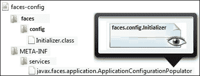

# 第四章. 使用 XML 文件和注解的 JSF 配置 – 第一部分

从 JSF 2.0 开始，不再需要创建配置文件 `faces-config.xml`。好吧，这个断言部分是正确的，因为 JSF 注解仍然没有涵盖几个配置，例如资源包、工厂、阶段监听器等。通常，JSF 注解为我们提供了足够的应用支持；然而，正如你将在本章中看到的，仍然有许多情况下 `faces-config.xml` 是必需的，或者必须在 `web.xml` 文件中添加额外的配置。

尽管如此，JSF 2.2 提供了一种程序化方法，可以用来重新生成 `faces-config.xml`，而不必使用经典方法。在本章的后面部分，你将看到如何利用这个新特性。现在，你将看到创建和配置不同类型 JSF 艺术品的混合示例。它们将被任意展示——其中一些是众所周知的，来自 JSF 1.x 和 2.0，而另一些则是新的，从 JSF 2.2 开始。由于这些配置很简单，它们可以被视为空白的文档，但将每个配置粘合到示例中更有用，并提供了一个当你需要使用它们时的良好起点。

因此，在本章中，你将了解 JSF 艺术品的配置，但你也会看到一些使用这些艺术品的示例。以下是我们将要涵盖的简要概述：

+   JSF 2.2 新命名空间

+   JSF 2.2 程序化配置

+   在 XML 中配置管理 Bean

+   使用多个配置文件

+   配置区域设置和资源包

+   配置验证器和转换器

+   配置导航

+   配置动作监听器

+   配置系统事件监听器

+   配置阶段监听器

+   使用 `@ListenerFor` 和 `@ListenersFor`

显然，我们有很多工作要做，也有很多 JSF 2.2 特性需要覆盖（例如，比之前更多的 JSF 2.2 注入），所以让我们开始吧！

# JSF 2.2 新命名空间

JSF 2.2 修改了现有的 JSF 命名空间，如下表所示：

| 命名空间 | 在 JSF 2.2 之前 | JSF 2.2 |
| --- | --- | --- |
| Faces 核心库 | `http://java.sun.com/jsf/core` | `http://xmlns.jcp.org/jsf/core` |
| HTML_BASIC | `http://java.sun.com/jsf/html` | `http://xmlns.jcp.org/jsf/html` |
| Facelets 模板 | `http://java.sun.com/jsf/facelets` | `http://xmlns.jcp.org/jsf/facelets` |
| 组合组件 | `http://java.sun.com/jsf/composite` | `http://xmlns.jcp.org/jsf/composite` |
| JSTL 核心库 | `http://java.sun.com/jsp/jstl/core` | `http://xmlns.jcp.org/jsp/jstl/core` |
| JSTL 函数 | `http://java.sun.com/jsp/jstl/functions` | `http://xmlns.jcp.org/jsp/jstl/functions` |
| 透传属性 | `http://java.sun.com/jsf/passthrough` | `http://xmlns.jcp.org/jsf/passthrough` |
| 透传元素 | `http://java.sun.com/jsf` | `http://xmlns.jcp.org/jsf` |
| `@FacesComponent` 默认命名空间 |   | `http://xmlns.jcp.org/jsf/component` |

# JSF 2.2 程序化配置

从 JSF 2.2 版本开始，我们可以通过编程方式重现`faces-config.xml`的内容和任务。起点是一个名为`populateApplicationConfiguration`的回调方法，它接受一个类型为`org.w3c.dom.Document`的单个参数——这个类属于 DOM API。基本上，一个`Document`（树节点）是 XML 文档在内存中的表示，我们可以通过添加、删除、导入或采用节点、元素和文本来操作它。对于这些操作中的每一个，都有专门的方法。对于一些 JSF 开发者来说，这个 API 可能是一些新的东西，应该学习；因此，这可能是程序化配置的缺点。

现在，让我们从回调方法中继续讨论论文。`populateApplicationConfiguration`方法由一个扩展并实现`javax.faces.application`包中找到的抽象类`ApplicationConfigurationPopulator`的类提供。为了告诉 JSF 这个类，您需要：

1.  创建一个 JAR 包（例如，`faces-config.jar`或使用任何其他名称）。

1.  在此 JAR 包中，创建一个名为`META-INF`的文件夹。

1.  在`META-INF`文件夹中，创建一个名为`services`的文件夹。

1.  在`services`文件夹中，创建一个名为`javax.faces.application.ApplicationConfigurationPopulator`的空文件。

1.  在此文件中，写入扩展并实现抽象类`ApplicationConfigurationPopulator`的类的完全限定名称。

1.  在 JAR 根目录下，放置扩展并实现抽象类`ApplicationConfigurationPopulator`的类。

完成！现在当您将此 JAR 包添加到项目的`CLASSPATH`中时，JSF 将处理它并应用找到的配置。

假设扩展并实现抽象类`ApplicationConfigurationPopulator`的类命名为`faces.config.Initializer`（您可以使用任何其他名称），那么 JAR 内容将如下截图所示：



在本章中，您将看到一些程序化示例，作为经典`faces-config.xml`的替代方案。当我们直接在 DOM 树节点上工作时，我们往往会犯一些愚蠢的错误，比如忘记添加元素的文本，或者将元素放置在不适当的位置，等等。为了在没有头痛的情况下消除这些错误，您可以编写一个简单的方法将 DOM 序列化到 XML 文件中，这可以很容易地通过视觉或使用专用工具进行调试。以下方法完成了这个任务，您将在本章的所有示例中找到它：

```java
private void serializeFacesConfig(Document document,String path) {

  FileOutputStream fileOutputStream = null;
  OutputFormat outputFormat = new OutputFormat();
  outputFormat.setIndent(5);
  outputFormat.setLineWidth(150);

  ...
  fileOutputStream = new FileOutputStream(path);

  XMLSerializer xmlSerializer = new XMLSerializer();
  xmlSerializer.setOutputFormat(outputFormat);
  xmlSerializer.setOutputByteStream((OutputStream)
                                    fileOutputStream);

  xmlSerializer.serialize(document);
...
}
```

# 在 XML 中配置托管 Bean

JSF 管理 Bean 配置从 JSF 2.0 开始得到了本质上的改进。最常见的情况是，一个管理 Bean 被注解为`@ManagedBean`，并使用另一个注解来指定 JSF 的作用域（例如，`@RequestScoped`）。但是，管理 Bean 也可以在`faces-config.xml`中进行配置，并且这种方法并没有被弃用或过时。最简单的配置包括管理 Bean 的名称、类和作用域：

```java
<managed-bean>
  <managed-bean-name>playersBean</managed-bean-name>
  <managed-bean-class>book.beans.PlayersBean</managed-bean-class>
  <managed-bean-scope>request</managed-bean-scope>
...
</managed-bean>
```

### 注意

如果需要急切初始化的管理 Bean，可以使用`<managed-bean>`标签的`eager`属性：

```java
<managed-bean eager="true">
```

可以使用`<managed-property>`标签从`faces-config.xml`中初始化管理 Bean 的属性，如下所示：

```java
<managed-property>
  <property-name>name</property-name>
  <value>Nadal</value>
</managed-property>
<managed-property>
  <property-name>surname</property-name>
  <value>Rafael</value>
</managed-property>
```

### 注意

在`<value>`标签内部，我们也可以使用 EL 表达式。例如，我们可以使用属于管理 Bean`B`的属性值来初始化管理 Bean`A`的属性。但是，重要的是要知道 JSF 不支持管理 Bean 引用的循环依赖——你不能从管理 Bean`A`引用管理 Bean`B`，反之亦然。

一个有趣的案例涉及设置一个具有上下文初始化参数值的属性。这些参数在部署描述符（`web.xml`）中配置：

```java
<context-param>
  <param-name>rafakey</param-name>
  <param-value>Vamos Rafa!</param-value>
</context-param>
```

在程序上，这些类型的参数可以通过初始化映射或通过它们的名称来提取，如下所示：

```java
FacesContext.getCurrentInstance().getExternalContext().getInitParameterMap();
FacesContext.getCurrentInstance().getExternalContext().getInitParameter(*param_name*);
```

这些参数可以通过`faces-config.xml`使用 EL 隐式对象`initParam`来访问。JSF 提供了从管理 Bean 属性中引用 EL 隐式对象的能力，如下所示：

```java
<managed-property>
  <property-name>rafakey</property-name>
  <value>#{initParam.rafakey}</value>
</managed-property>
```

从`faces-config.xml`中，我们可以初始化更复杂的属性，例如枚举和集合。考虑以下枚举：

```java
public enum Plays {
    Left, Right
    };

private Plays play;

//getters and setters
...
```

上述属性可以按照以下方式初始化：

```java
<managed-property>
  <property-name>play</property-name>
  <value>Left</value>
</managed-property>
```

在集合的情况下，我们可以轻松地初始化映射和列表。一个映射（`java.util.Map`）可以按照以下方式初始化：

```java
<managed-property>
  <property-name>matchfacts</property-name>
  <map-entries>
    <map-entry>
      <key>Aces</key>
      <value>12</value>
    </map-entry>
    <map-entry>
      <key>Double Faults</key>
      <value>2</value>
    </map-entry>
    <map-entry>
      <key>1st Serve</key>
      <value>70%</value>
    </map-entry>
  </map-entries>
</managed-property>
```

当一个列表`java.util.List`（或数组）可以按照以下方式初始化时：

```java
<managed-property>
  <property-name>titles_2013</property-name>
  <list-entries>
    <value-class>java.lang.String</value-class>
    <value>Sao Paulo</value>
    <value>Acapulco</value>
    <value>Barcelona</value>
    <value>...</value>
  </list-entries>
</managed-property>
```

### 注意

可以使用`<null-value/>`标签来使用`null`值初始化一个属性。

如果你更喜欢在 XML 描述符中配置管理 Bean（而不是使用注解），那么将它们放置在另一个描述符中而不是`faces-config.xml`中是一个好的做法。保留这个描述符用于应用程序级别的配置。例如，你可以将其命名为`faces-beans.xml`。当 JSF 检查应用程序描述符`web.xml`时，它将知道如何使用这个文件，因为它检查以下预定义的上下文参数：

```java
<context-param>
  <param-name>javax.faces.CONFIG_FILES</param-name>
  <param-value>/WEB-INF/faces-beans.xml</param-value>
</context-param>
```

现在，你可以保留`faces-config.xml`用于其他配置。

显然，使用注解而不是标签要容易得多，但有时这种方法确实非常有用。例如，你可以有一些注解管理 Bean，你想要改变它们的行为，但由于不同的原因你不能编辑源代码。在这种情况下，你可以在一个 XML 文件中编写修改，因为在运行时，XML 文件中的配置将优先于注解。

本章代码包中提供了一个名为 `ch4_12` 的完整示例。

JSF 2.2 的程序化方法可以按照以下方式重现 `ch4_12` 应用程序的配置文件：

```java
public class Initializer extends ApplicationConfigurationPopulator {

  @Override
  public void populateApplicationConfiguration (Document toPopulate) {

    String ns = toPopulate.getDocumentElement().getNamespaceURI();

    Element managedbeanEl = toPopulate.createElementNS(ns, "managed-bean");

    Element managedbeannameEl = toPopulate.createElementNS(ns, "managed-bean-name");
    managedbeannameEl.appendChild(toPopulate.createTextNode("playersBean"));
    managedbeanEl.appendChild(managedbeannameEl);

    Element managedbeanclassEl = toPopulate.createElementNS(ns, "managed-bean-class");
    managedbeanclassEl.appendChild(toPopulate.
          createTextNode("book.beans.PlayersBean"));
    managedbeanEl.appendChild(managedbeanclassEl);

    Element managedbeanscopeEl = toPopulate.
          createElementNS(ns, "managed-bean-scope");
    managedbeanscopeEl.appendChild(toPopulate.
          createTextNode("request"));
    managedbeanEl.appendChild(managedbeanscopeEl);

    Element managedproperty0El = toPopulate.
          createElementNS(ns, "managed-property");
    Element propertyNameEl = toPopulate.
          createElementNS(ns, "property-name");        
    propertyNameEl.appendChild(toPopulate.createTextNode("name"));
    Element valueNameEl = toPopulate.createElementNS(ns, "value");          
    valueNameEl.appendChild(toPopulate.createTextNode("Nadal"));
    managedproperty0El.appendChild(propertyNameEl);
    managedproperty0El.appendChild(valueNameEl);
    managedbeanEl.appendChild(managedproperty0El);
    ...
    Element managedproperty5El = toPopulate.
          createElementNS(ns, "managed-property");
    Element propertyMatchfactsEl = toPopulate.
          createElementNS(ns, "property-name");
    propertyMatchfactsEl.appendChild(toPopulate.
          createTextNode("matchfacts"));
    Element mapEntriesEl = toPopulate.
          createElementNS(ns, "map-entries");
    Element mapEntry0El = toPopulate.
          createElementNS(ns, "map-entry");
    Element key0El = toPopulate.createElementNS(ns, "key");
    key0El.appendChild(toPopulate.createTextNode("Aces"));
    Element value0El = toPopulate.createElementNS(ns, "value");
    value0El.appendChild(toPopulate.createTextNode("12"));
    mapEntry0El.appendChild(key0El);
    mapEntry0El.appendChild(value0El);
    ...
    mapEntriesEl.appendChild(mapEntry0El);
    mapEntriesEl.appendChild(mapEntry1El);
    mapEntriesEl.appendChild(mapEntry2El);
    managedproperty5El.appendChild(propertyMatchfactsEl);
    managedproperty5El.appendChild(mapEntriesEl);
    managedbeanEl.appendChild(managedproperty5El);

    Element managedproperty6El = toPopulate.
          createElementNS(ns, "managed-property");
    Element propertyTitles_2013El = toPopulate.
          createElementNS(ns, "property-name");
    propertyTitles_2013El.appendChild(toPopulate.
          createTextNode("titles_2013"));
    Element listEntriesEl = toPopulate.
          createElementNS(ns, "list-entries");
    Element valueClassEl = toPopulate.
          createElementNS(ns, "value-class");
    valueClassEl.appendChild(toPopulate.
          createTextNode("java.lang.String"));
    Element value0lEl = toPopulate.createElementNS(ns, "value");
    value0lEl.appendChild(toPopulate.createTextNode("Sao Paulo"));
    ...
    listEntriesEl.appendChild(valueClassEl);
    listEntriesEl.appendChild(value0lEl);
    listEntriesEl.appendChild(value1lEl);
    listEntriesEl.appendChild(value2lEl);
    listEntriesEl.appendChild(value3lEl);
    listEntriesEl.appendChild(nullValuelEl);
    managedproperty6El.appendChild(propertyTitles_2013El);
    managedproperty6El.appendChild(listEntriesEl);
    managedbeanEl.appendChild(managedproperty6El);

    toPopulate.getDocumentElement().appendChild(managedbeanEl);

    //serializeFacesConfig(toPopulate, "D://faces-config.xml");
  }
  ...
}
```

完整应用程序命名为 `ch4_14_1`。

# 与多个配置文件一起工作

JSF 2.0 提供了对配置资源排序的支持。我们可以使用 **部分排序**（由 `<ordering>` 标签表示）和 **绝对排序**（由 `<absolute-ordering>` 标签表示）。

### 注意

每个参与订单计划的文档都通过顶级标签 `<name>` 进行标识。

部分排序是针对单个配置文档的。我们可以使用 `<before>` 和 `<after>` 标签来指示某个文档应该在另一个文档之前或之后处理。在 `<before>` 和 `<after>` 标签内部，我们可能有 `<others/>` 标签，它表示某个文档应该在所有其他排序的文档之前（或之后）处理。

下面是一个示例，其中包含文档 `A`、`B`、`C` 和别名 `D` 的 `faces-config.xml`：

1.  文档 `C` 需要在其他文档之前执行；因此，它将被首先执行：

    ```java
    <name>C</name>
    <ordering>
      <before>
        <others/>
      </before>
    </ordering>
    ```

1.  文档 `B` 没有指定顺序；因此，它将被执行第二个：

    ```java
    <name>B</name>
    ```

1.  文档 `A` 需要在文档 `B` 之后执行；因此，它将被执行第三个：

    ```java
    <name>A</name>
    <ordering>
      <after>
        <name>B</name>
      </after>
    </ordering>
    ```

1.  文档 `D` (`faces-config.xml`) 最后执行，不需要任何排序规范。

顺序将是实现特定的配置资源，即 `C`、`B`、`A` 和 `faces-config.xml` (`D`)。

### 注意

排序过程（部分或绝对）对两个文档没有影响：相应实现（Mojarra 或 MyFaces）的默认配置资源始终首先处理，并且如果存在，`faces-config.xml` 始终最后处理。

可以使用几个阶段监听器和一些自定义消息来执行一个简单的测试。每个阶段监听器都在一个单独的文档中进行配置，并应用了一些部分排序方案。一个完整的示例可以在本章代码包中找到，并命名为 `ch4_13_1`。控制台输出将揭示部分排序的效果。

### 注意

如果一个文档有排序要求但没有名称，则排序要求将被忽略。

绝对排序是通过 `<absolute-ordering>` 标签实现的。此标签只能出现在 `faces-config.xml` 中，并为我们提供了控制配置文档处理顺序的能力。例如，我们在 `faces-config.xml` 文档（别名文档 `D`）中添加了绝对排序，如下所示：

```java
<absolute-ordering>
  <others/>
  <name>C</name>
  <name>B</name>
  <name>A</name>
</absolute-ordering>
```

并且，处理顺序是：实现特定的配置资源，`C`、`B`、`A` 和 `faces-config.xml` (`D`)。

绝对排序的完整示例命名为 `ch4_13_2`。

# 配置区域设置和资源包

包含消息的属性文件可以命名为 `PlayerMessages.properties`。当我们有几种语言的消息时，我们可以为每种语言创建一个属性文件，并相应地命名。例如，对于英语，它将是 `PlayerMessages_en.properties`，对于法语，它将是 `PlayerMessages_fr.properties`。一个方便的存储位置是在应用程序源文件夹中直接或是在子文件夹中（或者在 NetBeans 中，在 Maven Web 应用程序项目的`Other Sources`文件夹下）。资源包能够从这些文件中加载和显示消息。

资源包可以在本地或全局配置。本地资源包只为指定的页面加载属性文件。为此，使用以下 `<f:loadBundle>` 标签：

```java
<f:loadBundle basename="players.msgs.PlayerMessages" var="msg"/>
```

全局资源包为所有 JSF 页面加载属性文件。在这种情况下，我们需要在 `faces-config.xml` 中进行声明性加载：

```java
<application>
  <resource-bundle>
    <base-name>players.msgs.PlayerMessages</base-name>
    <var>msg</var>
  </resource-bundle>
</application>
```

当我们有多语言文件时，我们也必须指明区域设置。在本地，这通过在 `<f:view>` 标签中添加区域设置属性来完成，如下所示（这里我们指明法语）：

```java
<f:view locale="fr">
```

在全局上，在 `faces-config.xml` 中，我们通过 `<default-locale>` 指示默认区域设置，并通过 `<supported-locale>` 标签指示支持的区域设置列表：

```java
<application>
  <locale-config>
    <default-locale>en</default-locale> 
    <supported-locale>fr</supported-locale>
    <supported-locale>en</supported-locale>
  </locale-config>
  <resource-bundle>
    <base-name>players.msgs.PlayerMessages</base-name>
    <var>msg</var>
  </resource-bundle>
</application>
```

以编程方式，我们可以如下表示区域设置：

```java
UIViewRoot viewRoot = FacesContext.getCurrentInstance().getViewRoot();
viewRoot.setLocale(new Locale("fr"));
```

属性文件中的简单条目如下所示：

```java
HELLO = Hello from Rafael Nadal!
```

消息将使用 `msg` 变量（由 `var` 属性或 `<var>` 标签声明）显示：

```java
#{msg['HELLO']}
```

但是，消息可以比静态文本更复杂。例如，它们可以按如下方式参数化：

```java
HELLOPARAM = Hello from {0} {1}!
```

并且可以使用 `<h:outputFormat>` 标签替换参数：

```java
<h:outputFormat value="#{msg['HELLOPARAM']}">
 <f:param value="Roger" />
 <f:param value="Federer" />
</h:outputFormat>
```

但是，关于以下类型的消息怎么办：

```java
REGISTERED = You have {0} players registered!
```

当只有一个玩家时，消息如下所示：

```java
You have 1 players registered!
```

这在语法上是错误的；因此，你需要使用类似于以下模式的模式：

```java
REGISTERED = You have {0} {0, choice, 0#players|1#player|2#players} registered!
```

这将解决问题。这里使用的参数解释如下：

+   `0, choice`: 取第一个参数并根据可用的格式选择输出

+   `0#players`: 如果第一个参数包含 0（或以下），则应打印 "players"

+   `1#player`: 如果第一个参数包含 1，则应打印 "player"

+   `2#players`: 如果第一个参数包含 2（或以上），则应打印 "players"

你可以在本章节的代码包中找到名为 `ch4_4` 的完整示例。

### 注意

不要将 `<resource-bundle>` 标签与 `<message-bundle>` 标签混淆。前者用于注册自定义本地化静态文本，而后者用于注册自定义错误/信息/警告消息，这些消息由 `<h:message>` 和 `<h:messages>` 显示。

`<message-bundle>` 选项理想的使用方式如下：

```java
<message-bundle>
  players.msgs.ErrorsMessages
</message-bundle>
```

消息文件可以使用 `<f:loadBundle>` 标签加载。

# 配置验证器和转换器

数据验证是 JSF 应用程序（自 JSF 1.2 以来存在）的一个重要部分，因为它允许我们将业务逻辑与帮助我们从用户那里获取仅有效信息的繁琐检查分离。数据在*过程验证*阶段进行验证（如果将`immediate`属性设置为`true`，则此处理将在*应用请求值*阶段结束时发生）并且应在*更新模型值*阶段之前有效且准备好使用。

除了内置验证器之外，我们可以编写自己的自定义验证器。一个实现了`Validator`接口并重写`validate`方法的公共类被 JSF 识别为**验证器**。在 JSF 中有两种配置验证器的方式：使用`@FacesValidator`注解或`faces-config.xml`中的`<validator>`标签。

假设我们使用`@FacesValidator`配置了以下电子邮件验证器：

```java
 @FacesValidator(value = "emailValidator")
  public class EmailValidator implements Validator {

    @Override
    public void validate(FacesContext context, UIComponent component, Object value) throws ValidatorException {

      ...
    }
  }
}
```

### 注意

在 JSF 2.2 中，现在可以省略组件、转换器和验证器的名称，因此前面的代码将变为`@FacesValidator`。在这里，我们需要注意，当省略名称时，JSF 将使用不带包名的类名，并且首字母小写。

如果你更喜欢使用`faces-config.xml`，那么`EmailValidator`可以配置如下：

```java
<validator>
  <validator-id>emailValidator</validator-id>
  <validator-class>book.beans.EmailValidator</validator-class>
</validator>
```

现在，你可以轻松地将`validator`链接到输入组件：

```java
<h:inputText value="#{*bean property*}">
  <f:validator validatorId="emailValidator"/>
</h:inputText>
```

做这件事的另一种方法是：

```java
<h:inputText value="#{*bean property*}" validator="emailValidator"/>
```

`EmailValidator`的完整示例可以在本章的代码包中找到，命名为`ch4_3_1`。除了这个应用程序，作为一个额外的考虑，考虑两个当涉及验证器时有用的应用程序。第一个命名为`ch4_2`，需要使用`<f:attribute>`向验证器传递额外参数，另一个命名为`ch4_11`，它是使用自定义验证器和`<f:attribute>`标签验证多个字段的示例。后者也是使用`PostValidateEvent`系统事件开发的——稍后在本章的*配置系统事件监听器*部分查看。

好吧，关于 JSF 验证器的文章有很多，但只有少数讨论了 JSF 验证器中的注入。默认情况下，JSF 2.0 不支持验证器中的注入，因为只有管理 Bean 是注入目标，但有一些技巧可以将依赖注入纳入讨论。

为了获得一个可用于注入的验证器，你需要应用以下修改，这基本上将验证器转换成一个 Bean：

1.  将`@FacesValidator`注解替换为`@Named`或`@ManagedBean`（甚至可以使用 Spring 注解`@Component`）。

1.  将 Bean 放入请求作用域（使用适当的`@RequestScoped`注解）。

    ```java
    @Named(value="emailValidator")
    @RequestScoped
    public class EmailValidator implements Validator {

      @Override
      public void validate(FacesContext context, UIComponent component, Object value) throws ValidatorException {
        ...
      }
    }
    ```

1.  使用适当的 EL 表达式引用它：

    ```java
    <h:inputText value="#{*bean property*}"
                 validator="#{emailValidator.validate}" />
    ```

完成！现在，你可以在验证器中使用`@Inject`。

完整示例可以在本章的代码包中找到，命名为`ch4_3_2`。

一个更复杂的任务是使用`@EJB`注入**企业 JavaBean**（**EJB**）会话 bean。在这种情况下，我们需要从**Java 命名和目录接口**（**JNDI**）手动查找 EJB 会话 bean。当 EJB 部署在**Web 应用程序存档**（**WAR**）中时，查找通常是以下类型：

```java
java:app/*app-name*/*bean-name*[! *fully-qualified-interface-name*]
```

当 EJB 位于**企业存档**（**EAR**）中时，常见的查找类型如下：

```java
java:global/*app-name*/*module-name*/*bean-name*[! *fully-qualified-interface-name*]
```

当 EJB 部署在 WAR 中时，使用以下方法：

```java
@FacesValidator
public class EmailValidator implements Validator {

  private LoginEJBBean loginEJBBean;

  @Override
  public void validate(FacesContext context, UIComponent component, Object value) throws ValidatorException {

    try {
 loginEJBBean = (LoginEJBBean) new InitialContext().
 lookup("java:app/ch4_3_5/LoginEJBBean");
     } catch (NamingException e) {
       throw new ExceptionInInitializerError(e);
 }
...
```

当 EJB 部署在 EAR 中时，使用以下方法：

```java
@FacesValidator public class EmailValidator implements Validator {

 private LoginEJBBean loginEJBBean;

 @Override
 public void validate(FacesContext context,
        UIComponent component, Object value) throws ValidatorException {

 try {
 loginEJBBean = (LoginEJBBean) new InitialContext().
 lookup("java:global/ch4_3_6/ch4_3_6-ejb/LoginEJBBean");
     } catch (NamingException e) {
       throw new ExceptionInInitializerError(e);
 }
...
```

你可以在这个章节的代码包中找到完整的示例。部署在 WAR 中的 EJB 示例命名为`ch4_3_5`，而部署在 EAR 情况下的 EJB 命名为`ch4_3_6`。

这些方法只是将依赖注入引入验证器的一些附加方法，这似乎是 JSF 2.0 中唯一的解决方案。从 JSF 2.2 开始，注入可以在许多更多的地方实现，但正如规范所说，转换器和验证器仍然不是注入目标。这似乎将在 JSF 2.3 中可用。

与这种肯定相反，我尝试编写一个验证器并使用注入，就像它应该原生工作一样。我使用了`@Inject`如下，其中`LoginBean`是一个 CDI 应用范围 bean：

```java
@FacesValidator
public class EmailValidator implements Validator {

 @Inject
 LoginBean loginBean;

 @Override
 public void validate(FacesContext context,
        UIComponent component, Object value) throws ValidatorException {
...
```

此外，我还尝试使用`@EJB`和`@Inject`注入 EJB，其中`LoginEJBBean`是一个无状态会话 bean，如下面的代码所示：

```java
@FacesValidator
public class EmailValidator implements Validator {

 @EJB
 LoginEJBBean loginEJBBean;
 //@Inject
 //LoginEJBBean loginEJBBean;

 @Override
 public void validate(FacesContext context,
        UIComponent component, Object value) throws ValidatorException {
...
```

我必须承认，我原本期待看到注入的资源为`null`值，但令人惊讶的是，在所有情况下，一切工作都如预期般顺利。有传言称，最初，验证器和转换器的注入机制是在 JSF 2.2 中添加的，但在最后一刻因为一些测试失败而被移除。即使前面的示例工作得很好，这也并不意味着在生产中使用这种方法是一个好习惯。你最好等到 JSF 团队保证后再使用。

### 注意

如果你喜欢 OmniFaces，那么你可以使用`@Inject`和`@EJB`与`@FacesValidator`。这个伟大的功能是从版本 1.6 开始添加的（[`showcase.omnifaces.org/cdi/FacesValidator`](http://showcase.omnifaces.org/cdi/FacesValidator)）。此外，MyFaces CODI（[`myfaces.apache.org/extensions/cdi/`](http://myfaces.apache.org/extensions/cdi/））也可以作为一个解决方案，但它需要一个额外的`@Advanced`注解。

完整的示例可以在本章的代码包中找到，它们分别命名为`ch4_3_3`（Web 应用程序）和`ch4_3_4`（企业应用程序）。

当讨论**转换器**时，让我们记住，两个`UIInput`实例之间的转换发生在*处理验证*阶段（默认），可以通过将`immediate`属性设置为`true`将其移动到*应用请求值*阶段。对于`UIOutput`，转换发生在*渲染响应*阶段。

除了内置的转换器外，我们还可以编写自定义转换器。一个实现了`Converter`接口并重写了`getAsObject`和`getAsString`方法的公共类被 JSF 识别为**转换器**。在 JSF 中配置转换器有两种方式：使用`@FacesConverter`注解或`faces-config.xml`中的`<converter>`标签。

关于我们使用`@FacesConverter`配置的以下转换器（请记住，JSF 2.2 不需要`value`属性）：

```java
@FacesConverter(value="playerConverter")
public class PlayerConverter implements Converter{

 @Override
 public Object getAsObject(FacesContext context,
               UIComponent component, String value) {
   PlayerName playerName = new
          PlayerName(value.toLowerCase(), value.toUpperCase());

   return playerName;
   }

   @Override
   public String getAsString(FacesContext context,
          UIComponent component, Object value) {

   PlayerName playerName = (PlayerName)value;

   return "Mr. " + playerName.getUppercase();
   }    
}
```

如果你更喜欢使用`faces-config.xml`，则`PlayerConverter`可以配置如下：

```java
<converter>
 <converter-id>playerConverter</converter-id>
 <converter-class>book.beans.PlayerConverter</converter-class>
</converter>
```

现在，你可以轻松地将转换器链接到输入组件如下：

```java
<h:inputText value="#{*bean property*}">
 <f:converter converterId="playerConverter"/>
</h:inputText>
```

做这件事的另一种方法是：

```java
<h:inputText value="#{*bean property*}" converter="playerConverter"/>
```

此外，你可以这样写：

```java
<h:inputText value="#{*bean property*}"/>
```

如果你使用`forClass`属性配置转换器，则跳过`value`属性如下：

```java
@FacesConverter(forClass=PlayerName.class)
```

`PlayerConverter`的完整示例可以在本章的代码包中找到，并命名为`ch4_6_1`。

谈到依赖注入，将转换器作为目标与验证器的情况非常相似：

1.  将`@FacesConverter`注解替换为`@Named`和`@ManagedBean`（对于 Spring，你也可以使用`@Component`）

1.  将 Bean 放入请求作用域（使用适当的`@RequestScoped`注解）如下：

    ```java
    @Named(value="playerConverter")
    @RequestScoped
    public class PlayerConverter implements Converter{

     @Override
     public Object getAsObject(FacesContext context,
            UIComponent component, String value) {
     ...
     }

     @Override
     public String getAsString(FacesContext context,
            UIComponent component, Object value) {
     ...
     }
    }
    ```

1.  使用以下适当的 EL 表达式来引用它：

    ```java
    <h:inputText value="#{*bean property*}" converter="#{playerConverter}"/>
    ```

完整的示例可以在本章的代码包中找到，并命名为`ch4_6_2`。EJB 可以通过从 JNDI 查找 EJB 会话 Bean 来注入到转换器中。请参考示例`ch4_6_5`（EAR 中的 EJB）和`ch4_6_6`（WAR 中的 EJB）。

+   在`ch4_6_5`应用程序中的以下代码块；`RandomEJBBean`是一个无状态会话 Bean：

    ```java
    @FacesConverter(value = "playerConverter")
    public class PlayerConverter implements Converter {

     private static RandomEJBBean randomEJBBean;

      static {
          try {
            randomEJBBean = (RandomEJBBean) new InitialContext().
             lookup("java:global/ch4_6_5/ch4_6_5-ejb/RandomEJBBean");
          } catch (NamingException e) {
            throw new ExceptionInInitializerError(e);
          }
    }
    ...
    ```

+   在`ch4_6_6`应用程序中的以下代码块；`RandomEJBBean`是一个无状态会话 Bean：

    ```java
    @FacesConverter(value = "playerConverter")
    public class PlayerConverter implements Converter {

        private static RandomEJBBean randomEJBBean;

        static {
            try {
                randomEJBBean = (RandomEJBBean) new InitialContext().
                 lookup("java:app/ch4_6_6/RandomEJBBean");
            } catch (NamingException e) {
                throw new ExceptionInInitializerError(e);
            }
        }
    ...
    ```

此外，在 GlassFish 4.0 和 Mojarra 2.2.x 中，我能够成功运行两个使用转换器注入的应用程序，没有任何复杂的解决方案。请参阅示例`ch4_6_3`和`ch4_6_4`。但请记住，这种方法尚未正式采用。

# 配置导航

从 JSF 2 开始，导航变得容易得多。可以使用以下方式完成导航：

+   隐式导航

+   条件导航

+   预先导航

+   程序化导航

我们可以谈论几个小时关于 JSF 导航，但有一些黄金法则可以帮助我们在需要选择`GET`和`POST`时避免最常见的错误。了解以下内容可能很有用：

+   建议使用`GET`请求进行页面间导航、搜索表单、希望可见和可书签的 URL，以及通常对于任何幂等请求。根据规范，`GET`、`HEAD`、`PUT`、`DELETE`、`OPTIONS`和`TRACE`是幂等的。

+   对于不应可书签的请求，重复使用相同的视图（使用转发，而不是重定向）。

+   对于不应可书签但具有可书签目标的请求，使用`POST`并重定向。

## 隐式导航

**隐式导航**将导航结果解释为目标视图 ID。最简单的隐式导航情况是在你执行操作且没有指示导航时由 JSF 本身完成的。在这种情况下，JSF 将通过`HTTP POST`将表单发送回当前视图（再次渲染当前视图）。

在`faces-config.xml`中没有声明性导航的情况下，我们可以轻松编写导航情况，如下所示，其中 JSF 2 知道如何将`outcome`（或`action`值）作为目标页面名称处理：

```java
<h:outputLink value="success.xhtml">Success</h:outputLink>
<h:link value="Success" outcome="success"/>
<h:button value="Success" outcome="success"/>
<h:commandButton value="Success" action="success"/>
<h:commandLink value="Success" action="success"/>
```

### 注意

如果`success.xhtml`页面存在，则所有给定示例都将导航到该页面。`<h:outputLink>`元素将独立于 JSF 进行导航（这意味着它不与 JSF 交互）。`<h:link>`和`<h:button>`元素将通过可书签的`GET`请求进行导航，并且不能进行表单提交（正如你将看到的，这实际上是预导航）。`<h:commandButton>`和`<h:commandLink>`元素是 JSF 应用内导航的主要组件。它们触发`POST`请求并且能够进行表单提交。每次你想在 URL 中添加应用程序上下文路径（例如，通过`<h:outputLink>`生成的 URL），你可以使用 JSF 2.2 的`ExternalContext.getApplicationContextPath`方法。例如，看看以下代码：

```java
<h:outputLink value="#{facesContext.externalContext. applicationContextPath}/next.xhtml">Next</h:outputLink>
```

该声明的版本如下——得益于隐式导航，此代码不是必需的：

```java
<navigation-rule>
 <from-view-id>*</from-view-id>
 <navigation-case>               
  <from-outcome>success</from-outcome>
  <to-view-id>/success.xhtml</to-view-id>
 </navigation-case>
</navigation-rule>
```

`<h:link>`和`<h:button>`的结果在`Render Response`阶段进行评估；因此，URL 可以从相应视图的开始处直接获得。另一方面，当按钮（`<h:commandButton>`）或链接（`<h:commandLink>`）被点击时，JSF 将`action`值`success`与 XHTML 扩展名合并，并在当前页面目录中找到视图名称`success.xhtml`。

### 注意

支持通配符（"*"）来指定适用于所有页面的导航规则。对于登出页面来说可能很有用。

导航情况也可以通过一个 bean 方法进行，如下所示：

```java
<h:commandButton value="Success" action="#{playerBean.playerDone()}"/>
```

此外，`PlayerBean`方法定义如下：

```java
public String playerDone() {
 logger.log(Level.INFO, "playerDone method called ...");
 return "success";
}
```

在这些示例中，`outcome`/`action`值和目标视图 ID 相匹配。然而，`outcome`/`action`值和目标视图 ID 并不总是那么简单。即使它们没有相同的根，`outcome`/`action`值也用于确定目标视图 ID。例如，参考以下代码：

```java
<h:commandButton value="Success" action="done"/>
```

上述代码指示`done.xhtml`页面，但该页面不存在；因此，不会发生导航。我们需要在`faces-config.xml`中添加一个声明性导航规则，以便将`action`值（或通过预导航获取的`outcome`值，我们很快就会看到）`done`与目标视图 ID`success.xhtml`关联起来。此导航规则可以在以下代码中看到：

```java
<navigation-rule>
 <from-view-id>/index.xhtml</from-view-id>
 <navigation-case>               
   <from-outcome>done</from-outcome>
   <to-view-id>/success.xhtml</to-view-id>
 </navigation-case>
</navigation-rule>  
```

如果“bean”方法返回结果`done`，则导航规则将按以下方式修改：

```java
<navigation-rule>
 <from-view-id>/index.xhtml</from-view-id>
 <navigation-case>
  <from-action>#{playerBean.playerDone()}</from-action>
  <from-outcome>done</from-outcome>
  <to-view-id>/success.xhtml</to-view-id>
 </navigation-case>
</navigation-rule>
```

默认情况下，在**前进**和**重定向**之间，JSF 将通过前进机制（`HTTP POST`）从一个页面导航到另一个页面。当 JSF 接收到用户操作时，它将转发用户到指定的目标页面，这意味着浏览器显示的 URL 不会更新以反映当前目标。保持浏览器 URL 更新意味着页面重定向机制；在这种情况下，JSF 将浏览器委托发送一个单独的`GET`请求到目标页面。

你可以通过将`faces-redirect=true`参数附加到结果查询字符串中来使用页面重定向机制，如下所示：

```java
<h:commandButton value="Success" action="success?faces-redirect=true;"/>
```

或者，你可以在导航规则内部使用`<redirect/>`标签，如下所示：

```java
<navigation-rule>
 <from-view-id>/index.xhtml</from-view-id>
 <navigation-case>               
  <from-outcome>done</from-outcome>
  <to-view-id>/success.xhtml</to-view-id>
 <redirect/>
 </navigation-case>
</navigation-rule>
```

### 注意

在前进情况下，浏览器 URL 不会更新（与导航 URL 相比落后一个步骤），但只有一个请求。在重定向情况下，浏览器 URL 是更新的，但有两次请求。由于前进只需要一个请求，所以它比页面重定向更快。速度较低，但页面重定向解决了在 Post-Redirect-Get 设计模式中发现的重复表单提交问题。当然，对于`<h:link>`、`<h:button>`和`<h:outputLink>`来说并非如此。

这些示例被分组在本章代码包中的`ch4_5_1`应用程序中。

## 条件导航

**条件导航**允许我们指定选择所需导航情况的前提条件；为了接受导航情况，必须满足前提条件。为此，我们使用`<if>`标签作为`<navigation-case>`标签的子标签，并使用可以评估为布尔值的 EL 表达式；在这里，`true`值匹配导航情况。

让我们有一个简单的按钮，用于将用户登录到应用程序。这是通过以下代码完成的：

```java
<h:commandButton value="Login" action="#{playerBean.playerLogin()}"/>
```

当**登录**按钮被点击时，JSF 将调用`playerLogin`方法。此方法不会返回结果，实际上它返回`void`。在这个例子中，我们通过随机数模拟登录过程，并相应地设置布尔值`login`，如下面的代码所示：

```java
private boolean login  = false;
...
public boolean isLogin() {
 return login;
}   

public void setLogin(boolean login) {
 this.login = login;
}    

public void playerLogin() {

 Random random = new Random();
 int r = random.nextInt(10);
 if (r <= 5) {
  login = false;
  } else {
    login = true;
  }
 }
```

接下来，我们可以使用`<if>`标签来决定是否导航到`success.xhtml`页面（相当于`login`等于`true`）或导航到`failed.xhtml`页面（相当于`login`等于`false`）：

```java
<navigation-rule>
 <from-view-id>/index.xhtml</from-view-id>
 <navigation-case>
  <from-action>#{playerBean.playerLogin()}</from-action>
  <if>#{playerBean.login}</if>
  <to-view-id>/success.xhtml</to-view-id>
  <redirect/>
 </navigation-case>
 <navigation-case>
  <from-action>#{playerBean.playerLogin()}</from-action>
  <if>#{!playerBean.login}</if>
  <to-view-id>/failed.xhtml</to-view-id>
  <redirect/>
 </navigation-case>
</navigation-rule>
```

### 注意

在条件导航中，即使结果为`null`或`void`，也会评估导航情况。请注意，没有`<else>`标签或多个条件检查；因此，在这种情况下，你必须模拟一个`switch`语句。如果你想在任何情况下简单地匹配`null`结果，那么你可以使用以下类型的条件：`<if>#{true}</if>`。

此外，导航规则的顺序会影响导航流程；因此，优先考虑条件是一个好的做法。

你可以在本章代码包中找到完整的示例，名称为`ch4_5_2`。

我们可以通过将`<to-view-id>`标签的静态值替换为 EL 表达式来编写不带`<if>`标签的条件导航情况。为此，我们需要按照以下方式替换：

```java
<navigation-rule>
 <from-view-id>/index.xhtml</from-view-id>
 <navigation-case>
  <from-action>#{playerBean.playerLogin()}</from-action>  
  <to-view-id>#{playerBean.navigateHelper()}</to-view-id>
  <redirect/>
 </navigation-case>
</navigation-rule>
```

注意，这并不是真正的条件导航（因为缺少`<if>`标签）；因此，我们需要从`playerLogin`方法返回一个结果：

```java
public String playerLogin() {

 Random random = new Random();
 int r = random.nextInt(10);
 login = r > 5;        
 return "done";
}
```

当`login`属性被设置并且返回结果`done`时，JSF 将遵循前面的导航情况，并调用`navigateHelper`方法：

```java
public String navigateHelper() {
 if (!login) {
  return "failed.xhtml";
 } else {
  return "success.xhtml";
 }
}
```

在实际应用中，返回结果的方法和选择导航情况的方法可能位于不同的 bean 中。如果你考虑到你可以向决策方法传递参数，那么许多导航情况都可以解决。

你可以在本章的代码包中找到完整的示例，名称为`ch4_5_3`。

## 预先导航

**预先导航**从 JSF 2.0 开始可用。导航规则更加宽容，并且它们在`Render Response`阶段而不是`Invoke Application`阶段进行评估。

### 注意

这被称为预定导航或预先导航。当前视图 ID 和指定的结果用于确定目标视图 ID。之后，目标视图 ID 被转换为可书签 URL，并用作超链接的目标。实际上，URL 是在没有用户交互的情况下准备的。

预先导航的主要用途出现在可书签组件标签`<h:link>`和`<h:button>`中。例如，以下两个是预先导航的经典示例：

```java
<h:link value="Success" outcome="success"/>
<h:button value="Success" outcome="success"/>
```

当应用启动时，你可以检查页面的源代码，以查看在`<h:link>`的情况下，相应的 URL 是如何在 HTML 标签`<a>`中映射的，以及`<h:button>`的情况下，HTML 标签`<input type="button">`是如何映射的。即使你从未使用过这些 URL，它们也已经准备好了。

好吧，在 JSF 2.0 之前，导航规则是显式地属于`POST`请求的领域（`NavigationHandler.handleNavigation`在幕后执行这项脏活），但基于 GET 的导航和可书签支持将导航提升到了另一个灵活性和透明度的层次（例如，`ConfigurableNavigationHandler` API）。

这里有趣的部分是如何组装 URL 的查询字符串。最简单的情况是隐式查询字符串参数，如下面的代码所示：

```java
<h:link value="Done" outcome="done?id=done"/>
```

在第二章中，*JSF 中的通信*，你看到了如何使用`<f:param>`和`<f:viewParam>`构建查询字符串。

另一种方法是在导航情况中使用嵌套在`<redirect>`标签中的`<view-param>`标签。例如，我们可以在导航规则中向重定向 URL 添加查询字符串参数。让我们创建以下按钮：

```java
<h:commandButton value="Success" action="#{playerBean.playerDone()}"/>
```

此外，还有一个名为`playerDone`的愚蠢方法如下：

```java
private String player;

 public String getPlayer() {
  return player;
 }       

 public void setPlayer(String player) {
  this.player = player;
 }        

 public String playerDone() {
  player = "Rafael Nadal";
  return "done";
 }
```

现在，我们可以将`player`属性值（当然，你也可以添加任何其他值）作为重定向导航 URL 查询字符串中的参数：

```java
<navigation-rule>
 <from-view-id>/index.xhtml</from-view-id>
 <navigation-case>
  <from-action>#{playerBean.playerDone()}</from-action>
  <from-outcome>done</from-outcome>
  <to-view-id>/success.xhtml</to-view-id>
  <redirect>
   <view-param>
    <name>playerparam</name>
    <value>#{playerBean.player}</value>
   </view-param>
  </redirect>
 </navigation-case>
</navigation-rule>
```

这样的 URL 将是以下格式（注意请求参数是如何根据导航规则附加的）`http://`*主机*`:`*端口*`/`*应用名*`/faces/success.xhtml?playerparam=Rafael+Nadal`。

`playerparam`值将通过`param`隐式对象可用：

```java
#{param['playerparam']}
```

你可以在本章的代码包中找到完整的示例，名称为`ch4_5_4`。

## 程序化导航

有时，你需要直接从应用程序控制导航。JSF 提供了`NavigationHandler`和`ConfigurableNavigationHandler` API，可用于访问导航案例、自定义导航处理程序、条件导航等任务。值得注意的是，从程序化的角度来看，我们可以执行以下操作：

1.  使用以下代码获取对导航处理程序（`NavigationHandler`）的访问权限：

    ```java
    FacesContext context = FacesContext.getCurrentInstance();
    Application application = context.getApplication();
    NavigationHandler nh = application.getNavigationHandler();
    ```

1.  使用`NavigationHandler`如下调用导航案例：

    ```java
    nh.handleNavigation(*context,fromAction,outcome*);
    nh.handleNavigation(*context,fromAction,outcome,toFlowDocumentId*);
    ```

1.  使用以下代码访问`ConfigurableNavigationHandler` API：

    ```java
    ConfigurableNavigationHandler cnh = (ConfigurableNavigationHandler) FacesContext.getCurrentInstance().getApplication().getNavigationHandler();
    ```

1.  使用`ConfigurableNavigationHandler`如下调用导航案例：

    ```java
    cnh.handleNavigation(*context,fromAction,outcome*);
    cnh.handleNavigation(*context,fromAction,outcome,toFlowDocumentId*);
    ```

1.  通过以下代码根据动作表达式签名和结果检索一个`NavigationCase`对象：

    ```java
    NavigationCase case = cnh.getNavigationCase(*context,fromAction,outcome*);
    NavigationCase case = cnh.getNavigationCase(*context,fromAction,outcome, toFlowDocumentId*);
    ```

1.  将所有导航规则访问到`Map<String, Set<NavigationCase>>`中，其中键是`<from-view-id>`的值如下：

    ```java
    Map<String, Set<NavigationCase>> cases = cnh.getNavigationCases();
    ```

### 注意

从 JSF 2.2 版本开始，我们为许多类提供了**包装器**，这些包装器提供了基本实现并帮助开发者扩展这些类，仅覆盖必要的函数。其中，我们有一个名为`NavigationHandlerWrapper`的`NavigationHandler`包装类，一个名为`ConfigurableNavigationHandlerWrapper`的`ConfigurableNavigationHandler`包装类，以及一个名为`NavigationCaseWrapper`的`NavigationCase`包装类。

在第三章中，*JSF 作用域 – 生命周期和在管理 Bean 通信中的应用*，你在*流程作用域*部分看到了`ConfigurableNavigationHandler`的自定义实现，在*使用导航处理程序控制自定义作用域生命周期*部分看到了`NavigationHandler`的自定义实现。

# 配置动作监听器

动作监听器是 JSF 提供的一种处理动作事件的优秀设施。通常，动作监听器通过`actionListener`属性附加到命令按钮（`<h:commandButton>`）或命令链接（`<h:commandLink>`）。

当按钮/链接被点击时，JSF 在 *Invoke Application* 阶段调用动作监听器。请注意，如果您使用 `immediate="true"`，则动作监听器将在 *Apply Request Values* 阶段调用。作为监听器的指示方法应该是公开的，应该返回 `void`，并接受一个 `ActionEvent` 对象（此对象可以用来访问调用动作的组件），它可以执行特定任务。当其执行完成后，JSF 将调用由 `action` 属性绑定的方法（如果存在的话！）此方法负责指示导航情况。动作监听器方法可以更改动作方法返回的响应。

### 注意

作为一种实践，`actionListener` 用于在真正的业务和导航任务之前“玩一玩”，这是 `action` 的责任。因此，不要滥用 `actionListener` 来解决业务逻辑任务！

让我们用一个简单的命令按钮的例子来说明，它使用动作监听器，如下所示：

```java
<h:commandButton value="Player Listener 1"
                 actionListener="#{playerBean.playerListener}"
                 action="#{playerBean.playerDone()}"/>
```

`PlayerBean` 包含以下代码：

```java
public void playerListener(ActionEvent e) {
 logger.log(Level.INFO, "playerListener method called ...");
}

public String playerDone() {
 logger.log(Level.INFO, "playerDone method called ...");
 return "done";
}
```

好吧，日志消息揭示了调用顺序如下：

```java
INFO:   playerListener method called ...
INFO:   playerDone method called ...
```

这种类型的监听器不需要任何特殊配置。

另一种类型的监听器可以通过实现 `ActionListener` 接口并重写 `processAction` 方法来编写。在这种情况下，我们需要使用 `<f:actionListener>` 标签将动作监听器附加到命令按钮/链接：

```java
<h:commandButton value="Player Listener 2"
                 action="#{playerBean.playerDone()}">
  <f:actionListener type="book.beans.PlayerListener"/>
</h:commandButton>
```

好吧，`PlayerListener` 定义如下：

```java
public class PlayerListener implements ActionListener {

  private static final Logger logger =
        Logger.getLogger(PlayerListener.class.getName());

 @Override
 public void processAction(ActionEvent event)
                          throws AbortProcessingException {

  logger.log(Level.INFO, "Player listener class called ...");
 }            
}
```

并且，日志消息的输出结果如下：

```java
INFO:   Player listener class called ...
INFO:   playerDone method called ...
```

再次强调，这类监听器不需要任何特殊配置。

### 注意

从 JSF 2.2 开始，`ActionListener` 接口被封装在一个简单的实现中，命名为 `ActionListenerWrapper`。您需要扩展此类并重写 `getWrapped` 方法以返回封装的实例。

例如，`PlayerListener` 可以通过以下包装器调用：

```java
public class PlayerListenerW extends ActionListenerWrapper {

    PlayerListener playerListener = new PlayerListener();

    @Override
    public ActionListener getWrapped() {
        return playerListener;
    }
}
```

您甚至可以将这两个监听器组合成一个单独的命令按钮，如下所示：

```java
<h:commandButton value="Player Listener 3"
                 actionListener="#{playerBean.playerListener}"
                 action="#{playerBean.playerDone()}">
 <f:actionListener type="book.beans.PlayerListener"/>
</h:commandButton>
```

在这种情况下，日志消息如下：

```java
INFO:   playerListener method called ...
INFO:   Player listener class called ...
INFO:   playerDone method called ...
```

### 注意

好吧，这个例子给我们一个重要的规则：动作监听器在 `action` 之前被调用，并且与它们在组件内部声明的顺序相同。

## 应用程序动作监听器

到目前为止一切顺利！最后一种动作监听器被称为应用程序动作监听器。它们在应用程序级别设置，并且即使对于未明确指定任何动作监听器的命令按钮/链接，JSF 也会调用它们。这样的动作监听器可能看起来像以下代码：

```java
public class ApplicationPlayerListener implements ActionListener {

 private static final Logger logger =
         Logger.getLogger(PlayerListener.class.getName());
 private ActionListener actionListener;

 public ApplicationPlayerListener() {      
 }

 public ApplicationPlayerListener(ActionListener actionListener) {
  this.actionListener = actionListener;
 }

 @Override
 public void processAction(ActionEvent event)
                    throws AbortProcessingException {

  logger.log(Level.INFO, "Application player listener class called ...");  
  actionListener.processAction(event);
 }            
}
```

即使没有指定，此动作监听器也会为命令按钮/链接调用，如下所示：

```java
<h:commandButton value="Player Listener 4"
                 action="#{playerBean.playerDone()}" />   
```

输出结果如下：

```java
INFO:   Application player listener class called ...
INFO:   playerDone method called ...
```

在 JSF 2.2 中，我们可以通过以下方式扩展 `ActionListenerWrapper` 来编写此实现：

```java
public class ApplicationPlayerListenerW extends ActionListenerWrapper {

 private ActionListener actionListener;
 private static final Logger logger =
         Logger.getLogger(ApplicationPlayerListenerW.class.getName());

  public ApplicationPlayerListenerW(){}

  public ApplicationPlayerListenerW(ActionListener actionListener){
   this.actionListener = actionListener;
  }

  @Override
  public void processAction(ActionEvent event)
         throws AbortProcessingException {
  logger.log(Level.INFO, "Application player listener
                                 (wrapper) class called ...");
  getWrapped().processAction(event);
 }

 @Override
 public ActionListener getWrapped() {        
  return this.actionListener;
 }
}
```

### 注意

应用程序动作监听器在通过 `actionListener` 属性或 `<f:actionListener>` 标签显式设置的动作监听器之后调用。

为了被调用，这些监听器必须在`faces-config.xml`中进行配置。例如，前面的监听器可以配置如下：

```java
<application>
 <action-listener>book.beans.ApplicationPlayerListener</action-listener>
</application>
```

### 注意

当你使用应用程序动作监听器时，重要的是要记住以下几点：

+   应用程序动作监听器不能调用其他监听器。

+   应用程序动作监听器负责处理`action`属性。

+   应用程序动作监听器不能捕获来自其他监听器的事件。

你可能已经注意到动作监听器会抛出`AbortProcessingException`异常。当这个异常出现时，JSF 将直接跳转到渲染响应并忽略后续的动作监听器。错误默认情况下会被吞没，所以不要期望看到它！你可以通过改变处理异常的默认机制来让它变得可见。

你可能认为动作监听器很酷！等你看到从 JSF 2.2 开始的功能时，你就会知道了。我们可以在动作监听器类中使用注入机制来注入 CDI 管理 Bean 和 EJB。例如，以下代码中显示的简单 Bean：

```java
@Named
@RequestScoped
public class DemoBean {

    private String demo = "TEST INJECTION VALUE ...";

    public String getDemo() {
        return demo;
    }

    public void setDemo(String demo) {
        this.demo = demo;
    }
}
```

这个 Bean 可以按照以下方式注入到我们的应用程序动作监听器中：

```java
public class ApplicationPlayerListener implements ActionListener {

  @Inject
  private DemoBean demoBean;
...
```

显然，这个功能为应用程序的实现开辟了新的视角。而且，正如你将看到的，注入机制可用于许多其他在 JSF 2.0 中不支持它的 JSF 组件。

一个名为`ch4_1`的完整示例可以在本章的代码包中找到。

# 配置系统事件监听器

JSF 2.0 允许我们使用**系统事件**。这些是在请求处理生命周期中的任意点由任意对象触发的事件。由于这些事件的数量相当大，你在这里不会看到它们全部被覆盖，但接下来的五个示例应该可以阐明系统事件的基本方面。你可以在`javax.faces.event`包中找到所有这些事件。

## 使用`<f:event>`

使用系统事件监听器最简单的方法是在`<f:event>`标签的`listener`属性中传递管理 Bean 方法的名称。例如，`PostValidateEvent`是在所有组件验证完成后触发的一个系统事件。这可以用来验证多个组件。假设，用户提交了一个包含他的名字、姓氏、银行账户以及该银行账户确认（如密码，需要输入两次以确认）的表单。为了检查是否在两个字段中输入了相同的银行账户，我们可以使用`PostValidateEvent`，如下所示：

```java
<h:body>        
 <h:form id="registerForm">            
 <f:event listener="#{playersBean.validateAccount}" 
 type="postValidate" />
  ...
  <h:inputText id="bankAccountId" value="#{playersBean.bank}" 
               required="true" />
  <h:message for="bankAccountId" style="color: red;" />              
  <h:inputText id="confirmBankAccountId" 
               value="#{playersBean.cbank}" required="true" />
  <h:message for="confirmBankAccountId" style="color: red;" />
  <h:commandButton action="done" value="Send" />
 </h:form>
</h:body>
```

现在，在`PlayersBean`中，我们需要按照以下方式实现`validateAccount`方法：

```java
public void validateAccount(ComponentSystemEvent event) {

 UIComponent uis = event.getComponent();

 //obtain bank account
 String bankAccount = null;
 UIInput uiBankAccount = (UIInput) 
        uis.findComponent("bankAccountId");
 Object bankAccountObj = uiBankAccount.getLocalValue();
 if (bankAccountObj != null) {
     bankAccount = String.valueOf(bankAccountObj).trim();
 }

 //obtain bank account confirmation
 String bankAccountC = null;
 UIInput uiBankAccountC = (UIInput) 
         uis.findComponent("confirmBankAccountId");
 Object bankAccountCObj = uiBankAccountC.getLocalValue();
 if (bankAccountCObj != null) {
     bankAccountC = String.valueOf(bankAccountCObj).trim();
 }

 if ((bankAccount != null) && (bankAccountC != null)) {
      if (!bankAccount.equals(bankAccountC)) {
          FacesContext facesContext =  
               FacesContext.getCurrentInstance();
          FacesMessage facesMessage = new FacesMessage("Bank 
               account must match bank account confirmation !");

          facesMessage.setSeverity(FacesMessage.SEVERITY_ERROR);

          facesContext.addMessage(uiBankAccount.getClientId(),  
               facesMessage);
          facesContext.renderResponse();
      }
 }
}
```

完成！如果你没有提供相同的银行账户，那么你会看到相应的消息。完整的应用程序名为`ch4_7`。

## 实现系统事件监听器

处理系统事件的另一种方法基于以下步骤：

1.  实现接口`SystemEventListener`。

1.  覆盖`processEvent`和`isListenerForSource`方法。

1.  在`faces-config.xml`中配置监听器。

已注册的系统事件可以由许多种类的源（组件）触发。我们可以在`isListenerForSource`方法中排序和接受某些源。当监听器应该接收作为参数传递给它的源的事件时（通常使用`instanceof`运算符进行简单测试即可完成工作），返回`true`。当一个源被接受时，会调用`processEvent`方法，我们可以添加自定义行为。

例如，假设我们想要移除由 JSF 包含的某些资源，例如 CSS 样式表或 JS 脚本（甚至可能是第三方库添加的资源）。关于 CSS 资源，它们始终在 HTML 页面的`HEAD`部分渲染。了解这一点后，我们可以配置我们的监听器，使其在事件源是`UIViewRoot`实例时执行。进一步地，我们利用 JSF API 遍历 CSS 资源并移除其中的一些（或全部）。我们的监听器代码相当简单，如下所示：

```java
public class ResourcesListener implements SystemEventListener {

 @Override
 public void processEvent(SystemEvent event)
             throws AbortProcessingException {

  FacesContext context = FacesContext.getCurrentInstance();

  int i = context.getViewRoot().
          getComponentResources(context, "HEAD").size() - 1;

  while (i >= 0) {
   UIComponent resource = context.getViewRoot().
               getComponentResources(context, "HEAD").get(i);

   String resourceLibrary = (String)
               resource.getAttributes().get("library");
   String resourceName = (String) resource.getAttributes().get("name");

   if ((resourceLibrary.equals("default")) &&
               (resourceName.equals("css/roger.css"))) {
    context.getViewRoot().removeComponentResource
                                  (context, resource, "HEAD");
   }
  i--;
  }
 }

 @Override
 public boolean isListenerForSource(Object source) {
  return (source instanceof UIViewRoot);
 }
}
```

听众应该在`faces-config.xml`中进行配置，如下所示：

```java
<system-event-listener>
 <system-event-listener-class>
  book.beans.ResourcesListener
 </system-event-listener-class>
 <system-event-class>
  javax.faces.event.PreRenderViewEvent
 </system-event-class>
 <source-class>
  javax.faces.component.UIViewRoot
 </source-class>
</system-event-listener>
```

因此，即使最初我们写下以下代码：

```java
<h:head>
 <h:outputStylesheet library="default" name="css/rafa.css"/>
 <h:outputStylesheet library="default" name="css/roger.css"/>
</h:head>
```

JSF 将渲染以下代码：

```java
<head>
 <title></title>
 <link type="text/css" rel="stylesheet"
      href="/ch4_9_1/faces/javax.faces.resource/css/rafa.css?ln=default">
</head>
```

### 注意

`<source-class>`标签实际上是在覆盖`isListenerForSource`方法中的条件。因此，您可以从`isListenerForSource`方法中始终返回`true`并使用此标签，或者反之亦然。

您可以在本章的代码包中找到完整的示例，命名为`ch4_9_1`。

现在，让我们看看另一个例子。当某些表单输入字段无效时，一个常见的做法是将背景色设置为红色。在 JSF 2.0 中，我们可以使用以下代码来实现：

```java
.ui-invalid {
    background-color:red
}
...
<h:inputText value="#{...}" required="true" styleClass="#{not component.valid ? 'ui-invalid' : ''}" />
```

嗯，这真的很酷！但是，如果表单有几个输入字段，那么我们就必须反复重复条件，这就不那么酷了！但是，通过一点魔法，我们可以泛化这种行为。我们可以编写一个监听器，它只从`UIInput`对象执行，并根据`isValid`方法返回的结果修改它们的`styleClass`属性：

```java
public class InputValidationListener implements SystemEventListener {

 @Override
 public void processEvent(SystemEvent event)
             throws AbortProcessingException {

  UIInput inputSource = (UIInput) event.getSource();

  if(!inputSource.isValid()) {
     inputSource.getAttributes().put("styleClass", "ui-invalid");
  }
 }

 @Override
 public boolean isListenerForSource(Object source) {
  return (source instanceof UIInput);
 }    
}
```

当然，这很简单，没有什么需要解释的。实际上，关键在于配置文件，因为我们必须从众多可用事件中选择正确的事件系统。由于我们需要将无效输入字段的背景色设置为红色，正确的选择应该是`PostValidateEvent`，如下面的代码所示：

```java
<system-event-listener>
 <system-event-listener-class>
  book.beans.InputValidationListener
 </system-event-listener-class>
 <system-event-class>
  javax.faces.event.PostValidateEvent
 </system-event-class>
 <source-class>
  javax.faces.component.html.HtmlInputText
 </source-class>
</system-event-listener>
```

完成！一个功能示例可以在本章的代码包中找到，命名为`ch4_9_3`。以下列出了 JSF 2.2 对该配置的程序化反射：

```java
public class Initializer extends 
       ApplicationConfigurationPopulator {

 @Override
 public void populateApplicationConfiguration
       (Document toPopulate) {

  String ns = toPopulate.getDocumentElement().getNamespaceURI();

  Element applicationEl = toPopulate.
          createElementNS(ns, "application");
  Element systemeventlistenerEl = toPopulate.
          createElementNS(ns, "system-event-listener");
  Element systemeventlistenerclassEl = 
          toPopulate.createElementNS(ns,
          "system-event-listener-class");
  systemeventlistenerclassEl.appendChild
          (toPopulate.createTextNode
          ("book.beans.InputValidationListener"));
  Element systemeventclassEl = toPopulate.
          createElementNS(ns, "system-event-class");
  systemeventclassEl.appendChild(toPopulate.
          createTextNode("javax.faces.event.PostValidateEvent"));
  Element sourceclassEl = toPopulate.
          createElementNS(ns, "source-class");
  sourceclassEl.appendChild(toPopulate.createTextNode
          ("javax.faces.component.html.HtmlInputText"));

  systemeventlistenerEl.appendChild(systemeventlistenerclassEl);
  systemeventlistenerEl.appendChild(systemeventclassEl);
  systemeventlistenerEl.appendChild(sourceclassEl);
  applicationEl.appendChild(systemeventlistenerEl);
  toPopulate.getDocumentElement().appendChild(applicationEl);

  //serializeFacesConfig(toPopulate, "D://faces-config.xml");
 }
 ...
}
```

完整的应用程序命名为`ch4_14_2`。

### 注意

从 JSF 2.2 开始，我们可以在系统事件监听器中使用依赖注入（`@Inject`和`@EJB`）。例如，我们可以通过 CDI 豆或 EJB 会话豆的注入来传递需要从`HEAD`中移除的 CSS 资源，而不是硬编码。您可以在本章的代码包中找到一个完整的示例。这个示例命名为`ch4_9_2`。

在将 CSS 类名映射到 CDI Bean（例如`StyleResourcesBean`）或 EJB Bean（例如`StyleResourcesEJBBean`）之后，你可以使用以下任何一种注入方式：

```java
@Inject
StyleResourcesBean styleResourcesBean;    
@Inject
StyleResourcesEJBBean styleResourcesEJBBean;
@EJB
StyleResourcesEJBBean styleResourcesEJBBean;
```

### 注意

除了注入功能外，JSF 2.2 还提供了一套针对 Flash 作用域的四个全新的系统事件。这些事件是：

+   `PostKeepFlashValueEvent`: 当值保留在 Flash 中时，此事件被触发

+   `PostPutFlashValueEvent`: 当值存储在 Flash 中时，此事件被触发

+   `PreClearFlashEvent`: 在清除 Flash 之前，此事件被触发

+   `PreRemoveFlashValueEvent`: 当从 Flash 中移除值时，此事件被触发

记得在第二章中，你看到了一个基于 Flash 作用域的应用程序。在本章中，我们将编写一个系统事件监听器来监控这两个事件，即`PostKeepFlashValueEvent`和`PreClearFlashEvent`。以下是相应的代码：

```java
public class FlashListener implements SystemEventListener {

 private final static Logger LOGGER =
        Logger.getLogger(FlashListener.class.getName());

 @Override
 public void processEvent(SystemEvent event)
        throws AbortProcessingException {

 if (event.getSource() instanceof String) {
  LOGGER.log(Level.INFO, "The following parameter was added
                     in flash scope: {0}", event.getSource());
 } else if (event.getSource() instanceof Map) {
   LOGGER.info("Preparing to clear flash scope ...");
   LOGGER.info("Current content:");
   Iterator iterator = ((Map) event.getSource()).entrySet().iterator();
   while (iterator.hasNext()) {
         Map.Entry mapEntry = (Map.Entry) iterator.next();
         LOGGER.log(Level.INFO, "{0}={1}", new
                 Object[]{mapEntry.getKey(), mapEntry.getValue()});
   }
  }
 }

 @Override
 public boolean isListenerForSource(Object source) {
  return ((source instanceof String) || (source instanceof Map));
 }
}
```

不要忘记按照以下方式在`faces-config.xml`中配置监听器：

```java
<system-event-listener>
 <system-event-listener-class>
  book.beans.FlashListener
 </system-event-listener-class>
 <system-event-class>
  javax.faces.event.PostKeepFlashValueEvent
 </system-event-class>
</system-event-listener>
<system-event-listener>
 <system-event-listener-class>
  book.beans.FlashListener
 </system-event-listener-class>
 <system-event-class>
  javax.faces.event.PreClearFlashEvent  
 </system-event-class>
</system-event-listener>
```

本章代码包中提供了一个功能示例，命名为`ch4_9_4`。

### 注意

一般而言，从 JSF 2.2 版本开始，`PostRestoreStateEvent`系统事件通过`Application.publishEvent`发布，而不使`UIComponents`成为默认监听器，但仍然执行传统的树遍历。这个事件在之前的 JSF 版本中是规则的例外！

# 配置阶段监听器

如其名所示，**阶段监听器**能够监听 JSF 六个生命周期阶段中的每个阶段的开始和结束（JSF 阶段之间如何相互作用的详细图解可在附录中找到，*JSF 生命周期*）：

+   恢复视图阶段

+   应用请求值阶段

+   处理验证阶段

+   更新模型值阶段

+   调用应用程序阶段

+   渲染响应阶段

你可以通过以下三个步骤轻松捕获每个阶段的事件：

1.  实现`PhaseListener`接口。

1.  覆盖`afterPhase`、`beforePhase`和`getPhaseId`方法。

1.  在`faces-config.xml`中配置阶段监听器。

一个好的起点是一个简单但有用的`PhaseListener`，它可以用于调试阶段。如果你对查看 JSF 请求生命周期中发生的事情感到好奇，那么你可以使用这个阶段监听器，它定义如下：

```java
public class DebugPhaseListener implements PhaseListener {

    public DebugPhaseListener() {
    }

    @Override
    public void afterPhase(PhaseEvent event) {
        System.out.println("After Phase: " + event.getPhaseId());
    }

    @Override
    public void beforePhase(PhaseEvent event) {
        System.out.println("Before Phase:" + event.getPhaseId());
    }

    @Override
    public PhaseId getPhaseId() {
        return PhaseId.ANY_PHASE;
    }
}
```

最后，按照以下方式在`faces-config.xml`中配置自定义阶段监听器：

```java
<lifecycle>
 <phase-listener>book.beans.DebugPhaseListener</phase-listener>
</lifecycle>
```

现在，你可以通过不同的页面和组件来模拟不同的场景，以查看输出。一个简单的场景是一个隐式导航案例，正如你在本章代码包中的应用程序`ch4_8_3`中看到的那样。

JSF 2.2 中此配置的程序性反射如下：

```java
public class Initializer extends 
       ApplicationConfigurationPopulator {

 @Override
 public void populateApplicationConfiguration
       (Document toPopulate) {

 String ns = toPopulate.getDocumentElement().getNamespaceURI();

 Element lifecycleEl = toPopulate.createElementNS(ns, "lifecycle");
 Element phaselistenerEl = toPopulate.
         createElementNS(ns, "phase-listener");
 phaselistenerEl.appendChild(toPopulate.
         createTextNode("book.beans.DebugPhaseListener"));
 lifecycleEl.appendChild(phaselistenerEl);
 toPopulate.getDocumentElement().appendChild(lifecycleEl);

 serializeFacesConfig(toPopulate, "D://faces-config.xml");
 }
 ...
}
```

完整的应用程序命名为`ch4_14_3`。

### 注意

`getPhaseId` 方法用于确定通过监听器的阶段。为了捕获所有阶段事件，该方法需要返回 `PhaseId.ANY_PHASE`。

阶段监听器也可以用来改变组件。例如，你可以通过拦截以下 *Render Response* 阶段来根据提交的值给 `UIInput` 的背景着色：

```java
public class PlayerPhaseListener implements PhaseListener {

 @Override
 public void afterPhase(PhaseEvent event) {
 }

 @Override
 public void beforePhase(PhaseEvent event) {
  processComponents(event.getFacesContext().getViewRoot());
 }

 @Override
 public PhaseId getPhaseId() {
  return PhaseId.RENDER_RESPONSE;
 }

 private void processComponents(UIComponent root) {
  for (UIComponent child : root.getChildren()) {
      if (child.getId().equals("playerId")) {
         HtmlInputText inputText = (HtmlInputText) child;
         String value = (String) inputText.getValue();

         if (value != null) {
            if (value.equalsIgnoreCase("rafa")) {
                inputText.setStyleClass("rafa-style");
            } else if (value.equalsIgnoreCase("roger")) {
                       inputText.setStyleClass("roger-style");
            }
         }
      }
  processComponents(child);
  }
 }
}
```

完整的示例包含在本章的代码包中，名称为 `ch4_8_1`。

### 注意

从 JSF 2.2 开始，我们可以在阶段监听器中使用依赖注入（`@Inject` 和 `@EJB`）。例如，我们可以通过 CDI 容器或 EJB 会话容器的注入来传递 CSS 类或我们选择的 CSS 类对应的文本，而不是将它们硬编码。你可以在本章的代码包中找到一个完整的示例，名称为 `ch4_8_2`。

在你将 CSS 类的名称映射到一个 CDI 容器（例如，`StyleResourcesBean`）或 EJB 容器（例如，`StyleResourcesEJBBean`）之后，你可以在阶段监听器中使用以下任何一种注入方式：

```java
@Inject
StyleResourcesBean styleResourcesBean;    
@Inject
StyleResourcesEJBBean styleResourcesEJBBean;
@EJB
StyleResourcesEJBBean styleResourcesEJBBean;
```

阶段监听器可以改变许多种 JSF 艺术品，而不仅仅是 UI 组件。例如，以下阶段监听器收集所有 `FacesMessages` 并修改全局的。显然，你可以选择做其他任何事情，例如通过 ID 过滤它们或将它们保存在特殊位置。

```java
public class MsgPhaseListener implements PhaseListener {

 private static final Logger logger = 
  Logger.getLogger(MsgPhaseListener.class.getName());    

 @Override
 public void afterPhase(PhaseEvent event) {}

 @Override
 public void beforePhase(PhaseEvent event) {
  FacesContext facesContext = event.getFacesContext();
  Iterator<String> ids = facesContext.getClientIdsWithMessages();

  while (ids.hasNext()) {
    String id = ids.next();
    Iterator<FacesMessage> messages = facesContext.getMessages(id);
    while (messages.hasNext()) {
           FacesMessage message = messages.next();
           logger.log(Level.INFO, "User ID:{0} Message: {1}"
                    , new Object[]{id, message.getSummary()});
           if(id == null){
              message.setSummary(message.getSummary() + 
                            "alerted by a phase listener!");
           }
    }
  }
 }

 @Override
 public PhaseId getPhaseId() {
  return PhaseId.RENDER_RESPONSE;
 }     
}
```

完整的应用程序名称为 `ch4_15`。

# 使用 @ListenerFor 和 @ListenersFor

`@ListenerFor` 注解是从 JSF 2.0 开始提供的一个有趣的注解。这个注解允许一个组件通过组件本身作为监听器来订阅特定的事件。为此，我们需要遵循以下步骤：

1.  实现 `ComponentSystemEventListener` 接口（接口名称表明事件将始终与 `UIComponent` 实例相关联）。

1.  覆盖 `processEvent` 方法（在这里我们可以 *玩弄* 组件）。

1.  使用 `@ListenerFor` 来指示 UI 组件将要订阅的事件以及 UI 组件的源类。

例如，`UIInput` 组件可以订阅 `PostAddToViewEvent` 事件来向组件添加属性，以下是一个添加一些 CSS 到每个 `UIInput` 组件的例子：

```java
@ListenerFor(systemEventClass = PostAddToViewEvent.class, sourceClass = javax.faces.component.UIInput.class)
public class PlayerRenderer extends TextRenderer
             implements ComponentSystemEventListener {

 @Override
 public void processEvent(ComponentSystemEvent event)
              throws AbortProcessingException {

  UIInput inputSource = (UIInput) event.getComponent();
  inputSource.getAttributes().put("styleClass", "rafa-style");
 }
}
```

完整的应用程序包含在本章的代码包中，名称为 `ch4_10_1`。

`@ListenersFor` 注解允许一个组件订阅多个事件。在之前的示例中，我们已经为每个 `UIInput` 组件添加了一些 CSS。接下来，我们希望通过添加一个单独的 CSS 到无效的 `UIInput` 组件来扩展这个功能。为此，`UIInput` 组件必须订阅 `PostValidateEvent`。这种方法将帮助我们区分有效的 `UIInput` 实例和无效的 `UIInput` 实例。相应的代码如下：

```java
@ListenersFor({
  @ListenerFor(systemEventClass=PostAddToViewEvent.class,
              sourceClass = javax.faces.component.UIInput.class),
 @ListenerFor(systemEventClass=PostValidateEvent.class,
              sourceClass = javax.faces.component.UIInput.class)
})
public class PlayerRenderer extends TextRenderer
       implements ComponentSystemEventListener {

@Override
 public void processEvent(ComponentSystemEvent event)
                          throws AbortProcessingException {

  UIInput inputSource = (UIInput) event.getComponent();
  inputSource.getAttributes().put("styleClass", "rafa-style");

  if(!inputSource.isValid()){
     inputSource.getAttributes().put("styleClass", "ui-invalid");
    }
  }
}
```

完整的应用程序包含在本章的代码包中，名称为 `ch4_10_2`。

### 注意

从 JSF 2.2 版本开始，我们可以使用依赖注入功能与`@ListenerFor`/`@ListenersFor`（`@Inject`和`@EJB`）。例如，我们不再需要像之前示例那样硬编码 CSS 类，而是可以通过注入 CDI Bean 或 EJB 会话 Bean 来传递它们。你可以在本章代码包中找到一个完整的示例，名称为`ch4_10_3`。

# 摘要

嗯，这是一章相当深入的内容，但在这里我们触及了 JSF 中许多重要的方面。你学习了如何创建、扩展和配置几个主要的 JSF 2.x 组件，以及它们是如何在 JSF 2.2 中改进的，特别是依赖注入机制。

仍然有许多内容在这里没有讨论；然而，在下一章中，我们将继续这一旅程，并涵盖其他内容，例如渲染器、处理器和工厂。
