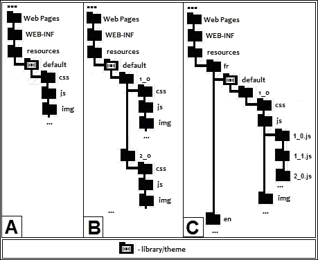
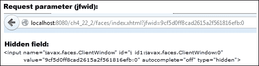

# 第五章. 使用 XML 文件和注解的 JSF 配置 – 第二部分

在本章中，我们将继续探讨更多情况下`faces-config.xml`文件将帮助我们完成不同的配置任务（当然，对于其中的一些，我们有注解的替代方案，而对于其他一些，我们需要切换到 XML 配置级别）。除了上一章中提供的示例之外，本章将进一步深入，涵盖以下更详细的任务列表：

+   配置资源处理器

+   配置视图处理器

+   覆盖 JSF 渲染

+   与客户端行为功能一起工作

+   配置全局异常处理器

+   配置渲染工厂

+   配置部分视图上下文

+   配置访问上下文

+   配置外部上下文

+   配置 Flash

+   JSF 2.2 Window ID API

+   配置生命周期

+   配置应用程序

+   配置 VDL

+   结合多个工厂的权力

# 配置资源处理器

从 JSF 2.0 开始，所有网络资源，如 CSS、JavaScript 和图像，都从名为`resources`的文件夹加载，该文件夹位于您的 Web 应用程序的根目录下，或在 JAR 文件中的`/META-INF/resources`下。`resources`文件夹下的一个文件夹被称为`library`或`theme`，它类似于客户端资源的集合。我们还可以在`library`文件夹下创建一个特殊文件夹，匹配正则表达式`\d+(_\d+)*`，以提供版本控制。在这种情况下，默认的 JSF 资源处理器将始终检索最新版本以显示。以下图显示了可以遵循的`resources`文件夹结构化方法：



在前面的图中，部分**A**描述了没有版本控制的`resources`文件夹的常见结构，而在部分**B**中，你有版本控制方法。文件夹`css`、`js`、`img`等通常表示其中文件的类型；然而，这并非强制性的。

### 注意

注意，库的名称不应表示内容类型。

部分**C**表示`resources`文件夹下支持的子文件夹的完整结构。在这种情况下，我们完全利用自动本地化和版本管理，这要求我们在`resources`文件夹下遵守以下结构，并被称为*资源标识符*（方括号`[]`表示可选部分）：

```java
[localePrefix/][libraryName/][libraryVersion/]resourceName[/resourceVersion]
```

### 注意

在 JAR 文件中打包的 face flows 的情况下，打包在`CLASSPATH`中的资源必须位于 JAR 条目名称`META-INF/flows/resourceIdentifier`下。

我们还将讨论部分**A**中提到的案例，因为这是最常用的案例。但为了完整性，您可以检查名为`ch5_12`的完整应用程序，它代表来自部分**C**（包括部分**B**）的实现案例。

因此，有了前面图中的结构，我们可以轻松地使用以下代码加载 CSS 文件（`rafa.css`）：

```java
<h:outputStylesheet library="default" name="css/rafa.css"/>
```

或者，你可以使用以下代码加载一个 JavaScript 文件（`rafa.js`）：

```java
<h:outputScript library="default" name="js/rafa.js"/>
```

或者，你可以使用以下代码加载一个图像文件（`rafa.png`）：

```java
<h:graphicImage library="default" name="img/rafa.png"/>
```

因此，这就是 JSF 默认资源处理器处理资源的方式。但如果我们不遵守这种文件夹的僵化结构，我们该怎么办？例如，如果我们有 CSS 文件位于应用程序的 web 根目录下的 `/players/css/`，或者我们想在受保护的文件夹中放置资源，例如 `WEB-INF`（`resources` 文件夹的最大缺点可能是默认情况下它里面的所有内容都可以从外部访问）。在这种情况下，没有直接可访问的 `resources` 文件夹，我们也不知道库是什么。如果我们编写如下代码，它将不会工作：

```java
<h:outputStylesheet name="rafa.css"  />
```

在可能的解决方案中，我们有编写自定义资源处理器的功能。这比听起来要简单得多，因为 JSF 提供了几个包装器（实现 `FacesWrapper`），通过仅重写我们想要影响的方法，帮助我们编写自定义处理程序和工厂。对于自定义资源处理器，我们需要执行以下步骤：

1.  扩展 `ResourceHandlerWrapper` 类。

1.  编写一个委托构造函数。JSF 会调用这个构造函数来传递标准资源处理器，我们将它包装在一个 `ResourceHandler` 实例中。我们也可以通过重写 `getWrapped` 方法来获取这个实例。

1.  重写 `createResource` 方法。在这里，我们可以对资源进行排序，并决定哪些资源应该发送到默认资源处理器，哪些资源应该发送到我们的自定义资源处理器。

以下实现基于前面的三个步骤：

```java
public class CustomResourceHandler extends
             javax.faces.application.ResourceHandlerWrapper {

 private ResourceHandler wrapped;

 public CustomResourceHandler(ResourceHandler wrapped) {
  this.wrapped = wrapped;
 }

 @Override
 public ResourceHandler getWrapped() {
  return this.wrapped;
 }

 @Override
 public Resource createResource(String resourceName, String libraryName){         

  if ((!resourceName.equals("rafa.css")) && 
      (!resourceName.equals("roger.css"))) {
       //in JSF 2.0 and JSF 2.2
       //return super.createResource(resourceName, libraryName);  
       //only in JSF 2.2
       return super.createResourceFromId
        (libraryName+"/"+resourceName);        
  } else {
       return new PlayerResource(resourceName);
  }

 }
}
```

`PlayerResource` 类是我们自定义的资源。`PlayerResource` 的主要目的是指明正确的路径 `/players/css/`，这个路径默认情况下是不被识别的。为此，我们扩展了另一个名为 `ResourceWrapper` 的包装器，并重写了 `getRequestPath` 方法，如下所示，其中除了一个调用 `getRequestPath` 之外，我们将所有调用委托给 `ResourceWrapper`：

```java
public class PlayerResource extends  
       javax.faces.application.ResourceWrapper {

 private String resourceName;

 public PlayerResource(String resourceName) {
  this.resourceName = resourceName;
 }

 @Override
 public Resource getWrapped() {
  return this;
 }

 @Override
 public String getRequestPath() {
  return "players/css/" + this.resourceName;
 }
}
```

接下来，你需要在 `faces-config.xml` 中按照以下方式配置自定义资源处理器：

```java
<application>
 <resource-handler>book.beans.CustomResourceHandler</resource-handler>
</application>
```

现在，如果你尝试加载 `rafa.css`（或 `roger.css`）文件，你可以添加以下代码行：

```java
<h:outputStylesheet name="rafa.css"/>
<h:outputStylesheet name="roger.css"/>
```

完整的应用程序名为 `ch5_1_1`，并可在本章的代码包中找到。

然而，请记住我之前说的“在可能的解决方案中...”？嗯，从 JSF 2.2 版本开始，我们可以在 `web.xml` 描述符中通过上下文参数来指定资源文件夹，如下所示（由 `ResourceHandler.WEBAPP_RESOURCES_DIRECTORY_PARAM_NAME` 字段映射）：

```java
<context-param>
 <param-name>javax.faces.WEBAPP_RESOURCES_DIRECTORY</param-name>
 <param-value>/players/css</param-value>
</context-param>
```

或者，我们可以将 `resources` 文件夹放在 `WEB-INF` 下，这样 JSF 就可以从 `WEB-INF` 内部访问它，但永远不能从外部访问：

```java
<context-param>
 <param-name>javax.faces.WEBAPP_RESOURCES_DIRECTORY</param-name>
 <param-value>/WEB-INF/resources</param-value>
</context-param>
```

本章代码包中提供了一个名为 `ch5_1_2` 的完整示例。

自定义资源处理器可以用来向链接文件（例如 CSS、JS、图片等）传递额外参数。我们可以使用这种方法来重置浏览器缓存。浏览器缓存静态资源，如 CSS、JS 和图片；因此，每次网页加载时都不会从服务器请求。我们可以通过在查询字符串中添加参数来强制这样做，表示版本号或使浏览器理解它应该从服务器而不是从缓存中加载资源。

在这种情况下，我们假设 `rafa.css` 文件位于 `/resources/default/css/` 文件夹下，并且使用以下代码加载：

```java
<h:outputStylesheet library="default" name="css/rafa.css"/>
```

此时，生成的 HTML 如下所示：

```java
<link type="text/css" rel="stylesheet" href="/ch5_1_3/faces/javax.faces.resource/css/rafa.css?ln=default" />
```

此外，我们希望获得以下类似代码：

```java
<link type="text/css" rel="stylesheet" href="/ch5_1_3/faces/javax.faces.resource/css/rafa.css?ln=default&amp;v=v4.2.1">
```

因此，我们需要按照以下方式覆盖 `createResource` 方法：

```java
@Override
public Resource createResource(String resourceName, String libraryName) {
  Resource resource = super.createResource(resourceName, libraryName);
  return new PlayerResource(resource);
}
```

此外，`PlayerResource` 负责在 `getRequestPath` 方法中添加版本参数：

```java
@Override
public String getRequestPath() {            
 String requestPath = resource.getRequestPath();

 logger.log (Level.INFO, "Initial request path is: {0}", requestPath);

 String new_version = "v4.2.1";

 if(requestPath.contains("?"))
    requestPath = requestPath + "&v=" + new_version;
 else
    requestPath = requestPath + "?v=" + new_version;

 logger.log (Level.INFO, "New request path is: {0}", requestPath);

 return requestPath;
}
```

完整的应用程序包含在名为 `ch5_1_3` 的代码包中。

当然，在实际情况下，与前面的代码不同，版本号不是硬编码的。知道 JSF 2.2 允许我们在自定义资源处理器中使用依赖注入，我们可以使用以下代码从可以充当版本跟踪系统角色的 bean 中注入参数值：

```java
public class CustomResourceHandler extends
       javax.faces.application.ResourceHandlerWrapper {

@Inject
private VersionBean versionBean;

...
@Override
public Resource createResource(String resourceName, String libraryName) {

 Resource resource = super.createResource(resourceName, libraryName);
 return new PlayerResource(resource, versionBean.getVersion());
}
...
```

完整的示例命名为 `ch5_1_4`。

### 注意

您还可以使用 JSF 的版本控制系统来使浏览器缓存失效，但您需要在库文件夹下创建正确的文件夹。 - JSF 将自动加载最新版本。像我们之前看到的那样传递参数对于许多其他事情都很有用，例如生成定制的 JS 和 CSS 响应。服务器可以访问此类参数和 JS。

浏览器缓存也可以通过 `web.xml` 描述符中的两个上下文参数（特定于 Mojarra）进行控制，如下所示：

+   `com.sun.faces.defaultResourceMaxAge`：此参数可用于设置以毫秒为单位的过期时间。

+   `com.sun.faces.resourceUpdateCheckPeriod`：此参数指定检查包含资源的 Web 应用程序工件更改的频率（以分钟为单位）。

JSF 资源处理提供了诸如缓存和加载 JAR 内的资源以及编写包含 CSS 或 JS 的自定义 UI 组件等稳固的优势，但它也有一些缺点。例如，网页设计师使用静态方法在 CSS 中添加图片，如下所示：

```java
background-image: url(*link_to_image*)
```

然而，当使用`<h:outputStyleSheet>`导入 CSS 样式表时，样式表是通过`/javax.faces.resource/*`文件夹由 FacesServlet 导入和处理的，这使得图片的相对路径不可用（在这种情况下，CSS 文件变成了 JSF 资源）。一种解决方案是使用 EL 中的资源映射器强制将图像 URL 转换为 JSF 资源，即`#{resource}`，作为`#{resource['`*library*`:`*location*`']}`。例如，在通过`<h:outputStylesheet>`加载的`rafa.css`中，我们可以使用以下代码加载`rafa.png`图像：

```java
body {
    background-image: url('#{resource["default:img/rafa.png"]}')
}
```

基于此，`<h:graphicImage>`可以按如下方式加载`rafa.png`：

```java
<h:graphicImage value="#{resource['default:img/rafa.png']}"/>
```

你可以在名为`ch5_13`的应用程序中检查这些示例。

作为替代方案，你可以使用 OmniFaces 库的`UnmappedResourceHandler`，这可以避免我们修改 CSS 文件([`showcase.omnifaces.org/resourcehandlers/UnmappedResourceHandler`](http://showcase.omnifaces.org/resourcehandlers/UnmappedResourceHandler))。此外，另一种方法是通过编写自定义的`ResourceHandler`来解决这个问题。

### 注意

从 JSF 2.2 版本开始，`ResourceResolver`已被合并到`ResourceHandler`中，并且`ResourceResolver`本身已被弃用。这两个组件在第十二章中详细描述，*Facelets 模板*。

## 以编程方式添加 CSS 和 JS 资源

有时，你可能需要通过在管理 Bean 方法中指定它们来加载 CSS 和 JS 资源。例如，以下方法以编程方式加载`rafa.css`和`rafa.js`：

```java
public void addResourcesAction() {
 FacesContext facesContext = FacesContext.getCurrentInstance();
 UIOutput rafa_css = new UIOutput();
 UIOutput rafa_js = new UIOutput();

 rafa_css.setRendererType("javax.faces.resource.Stylesheet");
 rafa_css.getAttributes().put("library", "default");
 rafa_css.getAttributes().put("name", "css/rafa.css");
 rafa_js.setRendererType("javax.faces.resource.Script");
 rafa_js.getAttributes().put("library", "default");
 rafa_js.getAttributes().put("name", "js/rafa.js");
 facesContext.getViewRoot().addComponentResource
            (facesContext, rafa_css, "head");
 facesContext.getViewRoot().addComponentResource
            (facesContext, rafa_js, "head");
}
```

完整的应用程序命名为`ch5_14`。

# 配置视图处理器

JSF 提供了一个视图处理器，可以用于处理视图。当你想要与视图交互或创建/恢复/扩展/修改视图时，它是一个非常实用的工具。在这里处理 URL 也是一个好的实践，这正是你接下来将要看到的。

### 注意

当你需要与组件一起工作时，视图处理器不是一个好的选择！即使这是可能的，视图处理器也不是为这些任务而创建的。

有时你可能需要将绝对 URL 转换为相对 URL。例如，如果你在一个反向代理后面运行应用程序，你可能需要提供相对 URL。默认情况下，浏览器将每个绝对 URL 附加到主机上，这显然是一个大问题。

为了将绝对 URL 转换为相对 URL，我们需要执行以下步骤：

+   通过扩展`ViewHandlerWrapper`类来创建一个新的视图处理器。扩展这个包装器允许我们仅覆盖所需的方法。

+   覆盖`getActionURL`和`getResourceURL`方法。

+   在`faces-config.xml`中配置视图处理器。

虽然这可能听起来有些夸张，但以下代码是自我解释的：

```java
public class URLHandler extends ViewHandlerWrapper {

 private ViewHandler baseViewHandler;

 public URLHandler(ViewHandler baseViewHandler) {
  this.baseViewHandler = baseViewHandler;
 }

 @Override
  public String getActionURL(FacesContext context, String viewId) {
   return convertToRelativeURL(context,
          baseViewHandler.getActionURL(context, viewId));
 }

 @Override
 public String getResourceURL(FacesContext context, String path) {
  return convertToRelativeURL(context,
         baseViewHandler.getResourceURL(context, path));
 }

 @Override
 public ViewHandler getWrapped() {
  return baseViewHandler;
 }

 private String convertToRelativeURL(FacesContext context,
                                                String theURL){

 final HttpServletRequest request = ((HttpServletRequest)  
                          context.getExternalContext().getRequest());
 final URI uri;
 String prefix = "";

 String string_uri = request.getRequestURI();

 try {
     uri = new URI(string_uri);
 } catch (URISyntaxException ex) {
     Logger.getLogger(URLHandler.class.getName()).
                                  log(Level.SEVERE, null, ex);
     return "";
 }

 String path = uri.getPath();
 String new_path = path.replace("//", "/");

 if (theURL.startsWith("/")) {
     int count = new_path.length() - new_path.replace("/", "").length();
     for (int i = 0; i < (count - 1); i++) {
          prefix = prefix + "/..";
     }
     if (prefix.length() > 0) {
         prefix = prefix.substring(1);
     }
 }

 return (prefix + theURL);
 }
}
```

`faces-config.xml`中所需的配置如下：

```java
...
<application>
 <view-handler>book.beans.URLHandler</view-handler>  
</application>
...
```

完整的应用程序可在名为`ch5_2_1`的代码包中找到。

如果你检查 `index.xhtml` 页面的源代码，你会注意到，对于 CSS 资源，不是使用绝对 URL，而是使用以下类型的相对 URL：

```java
<link type="text/css" rel="stylesheet" href="../ch5_2_1/faces/javax.faces.resource/css/rafa.css?ln=default">
```

完成！现在你可以运行位于反向代理后面的应用程序。

另一个有用的视图处理器是能够“吞噬”`ViewExpiredException` 异常的处理器。当用户会话过期时，会抛出此异常。通过视图处理器，我们可以通过重新创建用户视图来处理此异常。将流程重定向到特殊页面（让我们称其为 `expired.xhtml`）。

当用户会话过期时，应用程序的 `UIViewRoot` 被设置为 `null`。我们可以在 `restoreView` 方法中使用这个检查，如下所示：

```java
public class ExceptionHandler extends ViewHandlerWrapper {

 private static final Logger logger =
         Logger.getLogger(ExceptionHandler.class.getName());
 private ViewHandler baseViewHandler;

 public ExceptionHandler(ViewHandler baseViewHandler) {
        this.baseViewHandler = baseViewHandler;
 }

 @Override
 public UIViewRoot restoreView(FacesContext context, String viewId) {

  UIViewRoot root;

  root = baseViewHandler.restoreView(context, viewId);
  if (root == null) {
      logger.info("The session has expired ...
                   I will not allow ViewExpiredException ...");
      root = createView(context, viewId);

      //root = createView(context, "/expired.xhtml");
      //context.renderResponse();
  }
 return root;
 }

 @Override
 public ViewHandler getWrapped() {
  return baseViewHandler;
 }
}
```

`faces-config.xml` 中的配置如下：

```java
...
<application>
 <view-handler>book.beans.ExceptionHandler</view-handler>  
</application>
...
```

完整的应用程序包含在代码包中，名称为 `ch5_2_2`。

### 注意

从 JSF 2.2 版本开始，我们可以使用视图处理器进行依赖注入（`@Inject` 和 `@EJB`）。

# 覆盖 JSF 渲染器

`Renderer` 的主要职责包括生成适当的客户端标记，例如 HTML、WML 和 XUL，以及将来自客户端的信息转换为组件的正确类型。

JSF 提供了一套内置的渲染器，并且具有通过自定义行为扩展它们的能力。如果你考虑一个适当的解决方案来覆盖内置的渲染器，那么请执行以下步骤：

1.  扩展所需的内置渲染器（例如，`Renderer`、`TextRenderer`、`LabelRenderer`、`MessagesRenderer` 等）。

1.  覆盖内置的渲染器方法。

1.  在 `faces-config.xml` 中配置新的渲染器或使用 `@FacesRenderer` 注解。

好吧，让我们看看一些编写自定义渲染器的示例。例如，假设我们有三个属性（`player-nickname`、`player-mother-name` 和 `player-father-name`），我们想在 `<h:inputText>` 标签内使用它们。如果你尝试编写以下代码：

```java
<h:inputText value="Rafael Nadal" player-nickname="Rafa" player-mother-name="Ana Maria Parera" player-father-name="Sebastián Nadal" player-coach-name=" Toni Nadal"/>
```

然后，内置的渲染器将给出以下输出：

```java
<input id="..." name="..."
       value="Rafael Nadal" type="text">
```

显然，我们的三个属性被忽略了。我们可以通过以下方式扩展 `TextRenderer` 来修复这个问题：

```java
public class PlayerInputTextRenderer extends TextRenderer {

public PlayerInputTextRenderer(){}

@Override
 protected void getEndTextToRender(FacesContext context,
                UIComponent component, String currentValue)
                     throws java.io.IOException {

  String[] attributes = {"player-nickname",
          "player-mother-name", "player-father-name"};
  ResponseWriter writer = context.getResponseWriter();
  for (String attribute : attributes) {
       String value = (String) component.getAttributes().get(attribute);
       if (value != null) {
           writer.writeAttribute(attribute, value, attribute);
       }
  }
  super.getEndTextToRender(context, component, currentValue);
 }
}
```

完成！按照以下方式在 `faces-config.xml` 中配置新的渲染器：

```java
<application>
 <render-kit>
  <renderer>
   <component-family>javax.faces.Input</component-family>
   <renderer-type>javax.faces.Text</renderer-type>
   <renderer-class>book.beans.PlayerInputTextRenderer</renderer-class>
  </renderer>
 </render-kit>
</application>
```

现在，渲染器输入字段将如下所示：

```java
<input id="..." name="..." player-nickname="Rafa" player-mother-name="Ana Maria Parera" player-father-name="Sebastián Nadal" value="Rafael Nadal" type="text">
```

### 注意

而不是在 `faces-config.xml` 中配置自定义渲染器，我们可以使用 `@FacesRenderer` 注解，如下所示：

```java
@FacesRenderer(componentFamily="javax.faces.Input",rendererType="javax.faces.Text")
```

但，不幸的是，这不起作用。这里似乎有一个错误！

完整的示例名称为 `ch5_4_1`。

让我们再看另一个示例，以加强编写自定义渲染器的知识。下一个示例将修改内置的 `LabelRenderer` 类，在每一个 `<h:outputText>` 标签前添加一个图片，如下所示：

```java
public class RafaLabelRenderer extends LabelRenderer{

 public RafaLabelRenderer(){}

 @Override
 public void encodeEnd(FacesContext context,
             UIComponent component)throws IOException{

  ResponseWriter responseWriter = context.getResponseWriter();
  responseWriter.write("");
}    
}
```

不要忘记按照以下方式在 `faces-config.xml` 中配置渲染器：

```java
 <component-family>javax.faces.Output</component-family>
 <renderer-type>javax.faces.Text</renderer-type>
 <renderer-class>book.beans.RafaLabelRenderer</renderer-class>
```

### 注意

从 JSF 2.2 版本开始，我们可以在渲染器中使用依赖注入（`@Inject` 和 `@EJB`）。前面提到的渲染器的完整示例名称为 `ch5_4_2`（图片名称由另一个通过注入依赖提供的 Bean 提供）。

本节接下来的示例有点棘手。

如果你使用过 PrimeFaces，特别是 `<p:messages>` 标签，那么你知道这个标签接受一个名为 `escape` 的属性。属性的值可以是 `true` 或 `false`，它定义了 HTML 是否会被转义（默认为 `true`）。

不幸的是，JSF 2.2 仍然没有为 `<h:messages>` 标签提供这样的属性，但至少有一个解决方案可以解决这个问题。你可以实现一个能够理解 `escape` 属性的自定义渲染器。

JSF 提供了一个名为 `ResponseWriter` 的类，在这个情况下非常有用，因为它提供了能够生成 HTML 和 XML 等标记语言元素和属性的方法。此外，JSF 还提供了一个名为 `ResponseWriterWrapper` 的这个类的包装器。我们可以轻松地扩展这个类，并重写 `writeText` 方法，这对于从对象通过转换获得的转义字符串非常有用。未转义的字符串通过 `write` 方法写入。

因此，根据这些信息，我们可以轻松地编写我们的响应写入器，如下所示：

```java
public class EscapeResponseWriter extends ResponseWriterWrapper {

 private ResponseWriter responseWriter;

 public EscapeResponseWriter(ResponseWriter responseWriter) {
  this.responseWriter = responseWriter;
 }

 @Override
 public ResponseWriter getWrapped() {
  return responseWriter;
 }

 @Override
 public void writeText(Object text, UIComponent component,
                            String property) throws IOException {

  String escape = (String) component.getAttributes().get("escape");
  if (escape != null) {
      if ("false".equals(escape)) {
          super.write(String.valueOf(text));
      } else {
        super.writeText(String.valueOf(text), component, property);
      }
  }
 }
}
```

到目前为止，一切顺利！现在我们需要编写自定义渲染器，如以下代码所示，通过扩展 `MessagesRenderer` 类，这是 JSF 消息的默认渲染器。我们唯一需要影响的方法是 `encodeEnd` 方法，通过放置我们的响应写入器代替默认的写入器。最后，我们将它恢复到默认设置。

```java
public class EscapeMessagesRenderer extends MessagesRenderer {

 public EscapeMessagesRenderer(){}

 @Override
 public void encodeEnd(FacesContext context,
         UIComponent component) throws IOException {

 ResponseWriter responseWriter = context.getResponseWriter();
 context.setResponseWriter(new EscapeResponseWriter(responseWriter));          
 super.encodeEnd(context, component);
 context.setResponseWriter(responseWriter);
 }
}
```

最后，按照以下方式在 `faces-config.xml` 中配置新的渲染器：

```java
<renderer>
 <component-family>javax.faces.Messages</component-family>
 <renderer-type>javax.faces.Messages</renderer-type>
 <renderer-class>book.beans.EscapeMessagesRenderer</renderer-class>
</renderer>
```

现在，你可以通过以下方式设置 `escape` 属性，在你的消息中添加 HTML 内容：

```java
<h:messages escape="false" />
```

完整的示例命名为 `ch5_4_3`。

在前面的示例中，我们看到了扩展现有渲染器的一些用例。本节的最后一个示例将更进一步，将展示通过扩展抽象类 `Renderer` 来编写自定义 `RenderKit` 和自定义渲染器的用例。

当 `Renderer` 类将 UI 组件的内部表示转换为输出流时，`RenderKit` 代表了一组能够为特定客户端（例如，特定设备）渲染 JSF UI 组件实例的 `Renderer` 实例。每次 JSF 需要渲染 UI 组件时，它将调用 `RenderKit.getRenderer` 方法，该方法能够根据两个唯一标识它的参数返回相应渲染器的实例：**组件家族**和**渲染器类型**。

假设我们想要改变用于所有属于`javax.faces.Input`家族的 UI 组件的默认渲染器的行为，通过添加一些 CSS 中的自定义样式。这可以通过编写自定义`RenderKit`并重写`getRenderer`方法轻松实现。从 JSF 2.2 开始，我们可以非常快速地做到这一点，因为我们可以扩展代表抽象类`RenderKit`的简单实现的新的包装类。这个类命名为`RenderKitWrapper`，它允许我们仅重写所需的方法。

例如，我们如下重写`getRenderer`方法：

```java
public class CustomRenderKit extends RenderKitWrapper {

 private RenderKit renderKit;

 public CustomRenderKit() {}

 public CustomRenderKit(RenderKit renderKit) {
  this.renderKit = renderKit;
 }

 @Override
 public Renderer getRenderer(String family, String rendererType) {
  if (family.equals("javax.faces.Input")) {
      Renderer inputRenderer = getWrapped().
               getRenderer(family, rendererType);
      return new RafaRenderer(inputRenderer);
  }
  return getWrapped().getRenderer(family, rendererType);
 }

 @Override
 public RenderKit getWrapped() {
  return renderKit;
 }
}
```

因此，当 JSF 需要渲染属于`javax.faces.Input`家族的 UI 组件时，我们使用用于此任务的原始渲染器，并将其包装到名为`RafaRenderer`的自定义渲染器中。这个自定义渲染器将扩展 JSF 2.2 的`RendererWrapper`（`Renderer`的一个简单实现）并重写`encodeBegin`方法，如下所示：

```java
@ResourceDependencies({
@ResourceDependency(name = "css/rafastyles.css", 
                    library = "default", target = "head")
})
@FacesRenderer(componentFamily = "javax.faces.Rafa", 
               rendererType = RafaRenderer.RENDERER_TYPE)
public class RafaRenderer extends RendererWrapper {

 private Renderer renderer;
 public static final String RENDERER_TYPE = 
               "book.beans.RafaRenderer";

 public RafaRenderer() {}

 public RafaRenderer(Renderer renderer) {
  this.renderer = renderer;
 }

 @Override
 public void encodeBegin(FacesContext context, 
             UIComponent uicomponent) throws IOException {
  ResponseWriter responseWriter = context.getResponseWriter();
  responseWriter.writeAttribute("class", "rafastyle", "class");
  getWrapped().encodeBegin(context, uicomponent);
 }

 @Override
 public Renderer getWrapped() {
  return renderer;
 }
}
```

### 注意

好知道我们可以使用`@ResourceDependency`和`@ResourceDependecies`注解为 JSF 渲染器指定外部资源（例如 CSS 和 JS）。

最后，您需要按照如下方式在`faces-config.xml`中配置自定义的`RenderKit`：

```java
<render-kit>
 <render-kit-class>
   book.beans.CustomRenderKit
 </render-kit-class>
</render-kit>
```

完整的应用程序命名为`ch5_15`。

# 与客户端行为功能一起工作

JSF 2 提供了以可重用方式为组件定义特定客户端行为的能力。客户端行为实际上是一段可以在浏览器中执行的 JavaScript 代码。

例如，当用户可以访问执行不可逆更改的按钮时；例如，删除、复制和移动，在执行操作之前通知用户后果并请求确认是一个好的做法。

为了实现客户端行为功能，我们执行以下步骤：

1.  扩展`ClientBehaviorBase`类。

1.  重写`getScript`方法。

1.  使用`@FacesBehavior (value="`*developer_id*`")`注解标注创建的类，其中*developer_id*用于引用我们的自定义客户端行为。当我们为行为定义一个标签时，这是必需的。

1.  定义一个用于行为的自定义标签——在 JSF 页面中需要一个标签来指定哪些组件接收我们的客户端行为（JS 代码）。

1.  在`web.xml`文件的描述符中注册自定义标签。

以下代码展示了如何编写一个客户端行为，用于在用户点击模拟删除操作的按钮时显示 JavaScript 确认对话框，这涵盖了前面提到的前三个步骤：

```java
@FacesBehavior(value = "confirm")
public class ConfirmDeleteBehavior extends ClientBehaviorBase {

@Override
 public String getScript(ClientBehaviorContext behaviorContext) {
  return "return confirm('Are you sure ?');";
 }
}
```

第四步是编写一个用于行为的自定义标签。在`WEB-INF`文件夹下创建一个名为`delete.taglib.xml`的文件，如下所示：

```java
<?xml version="1.0" encoding="UTF-8"?>
<facelet-taglib version="2.2"

  xsi:schemaLocation="http://xmlns.jcp.org/xml/ns/javaee 
   http://xmlns.jcp.org/xml/ns/javaee/web-
                             facelettaglibrary_2_2.xsd">
 <namespace>http://www.custom.tags/jsf/delete</namespace>
 <tag>
  <tag-name>confirmDelete</tag-name>
  <behavior>
   <behavior-id>confirm</behavior-id>
  </behavior>
 </tag>
</facelet-taglib>
```

### 注意

`<behavior-id>`标签的值必须与`FacesBehavior`注解的`value`成员匹配（*developer_id*）。标签名可以自由选择。

最后一步是在`web.xml`中注册标签：

```java
<context-param>
 <param-name> javax.faces.FACELETS_LIBRARIES</param-name>
 <param-value>/WEB-INF/delete.taglib.xml</param-value>
</context-param>
```

### 注意

我们可以将客户端行为附加到实现`ClientBehaviourHolder`接口的每个组件上。幸运的是，几乎所有组件都实现了这个接口，例如按钮、链接、输入字段等等。

完成！现在，我们可以在 JSF 页面上捡起水果，如下所示：

```java
<?xml version='1.0' encoding='UTF-8' ?>
<!DOCTYPE html PUBLIC "-//W3C//DTD XHTML 1.0 Transitional//EN" "http://www.w3.org/TR/xhtml1/DTD/xhtml1-transitional.dtd">
<html 

      >
 <h:head>
  <title></title>
 </h:head>
 <h:body>
  <h:form>
   <h:commandButton value="Delete" action="done">
    <b:confirmDelete/>
   </h:commandButton>
  </h:form>
 </h:body>
</html>
```

如果用户没有确认删除，则操作将被中止。

### 注意

从 JSF 2.2 版本开始，我们可以使用依赖注入与客户端行为（`@Inject`和`@EJB`）。例如，我们不是硬编码确认问题“你确定吗？”，而是可以通过 CDI 豆或 EJB 会话豆的注入来传递它。一个完整的示例可以在本章的代码包中找到。它被命名为`ch5_5_1`。

注意，即使我们没有指定启动客户端行为 JS 代码的事件，示例也能正常工作。这是因为 JS 代码被附加到按钮的`onclick`事件上，这是`<h:commandButton>`的默认事件。现在，我们将编写另一个示例，将客户端行为同时附加到两个其他事件上。

### 注意

我们可以通过指定标签的`event`属性来将客户端行为代码附加到其他事件上。

在下一个示例中，我们假设以下场景：一个输入字段在获得焦点时变为绿色（`onfocus` JS 事件），在失去焦点时恢复为空白（`onblur` JS 事件）。现在，我们必须订阅两个事件。

在前面的示例中，我们明确地将客户端行为功能链接到`<confirmDelete>`标签。即使在这种情况下仍然可行，我们选择采用另一种方法。而不是直接链接，我们将使用标签处理器（`TagHandler`）。

### 注意

自定义标签处理器允许我们操作创建的 DOM 树（从树中添加/删除节点）。

当我们编写自定义标签处理器时，我们需要关注`apply`方法，特别是这个方法的第二个参数，它被命名为`parent`，代表标签的父级，在我们的情况下将是`<h:inputText>`。我们可以将这两个事件都添加到`<h:inputText>`中，如下所示：

```java
public class FocusBlurHandler extends TagHandler {

 private FocusBlurBehavior onfocus = new FocusBlurBehavior();
 private FocusBlurBehavior onblur = new FocusBlurBehavior();

 public FocusBlurHandler(TagConfig tagConfig) {
  super(tagConfig);
 }

 @Override
 public void apply(FaceletContext ctx, UIComponent parent)
        throws IOException {

  if (parent instanceof ClientBehaviorHolder) {
      ClientBehaviorHolder clientBehaviorHolder =
                  (ClientBehaviorHolder) parent;

      clientBehaviorHolder.addClientBehavior("focus", onfocus);
      clientBehaviorHolder.addClientBehavior("blur", onblur);
  }
 }
}
```

记住，在前面的章节中，我们看到了如何覆盖一些 JSF 渲染器。嗯，这里还有一个！与上一个示例中覆盖`ClientBehaviorBase`的`getScript`方法不同，我们将编写一个自定义渲染器，这很容易实现，因为 JSF 提供了一个专门用于客户端行为的渲染器，名为`ClientBehaviorRenderer`。此渲染器包含自己的`getScript`方法，如下面的代码所示：

```java
@FacesBehaviorRenderer(rendererType = "focusblurrenderer")
@ResourceDependency(name="player.css", target="head")
public class FocusBlurRenderer extends ClientBehaviorRenderer {

 private static final String FOCUS_EVENT = "focus";
 private static final String BLUR_EVENT = "blur";

 @Override
 public String getScript(ClientBehaviorContext behaviorContext,
        ClientBehavior behavior) {

  if (FOCUS_EVENT.equals(behaviorContext.getEventName())) {
      return "this.setAttribute('class','focus-css');";
  }

  if (BLUR_EVENT.equals(behaviorContext.getEventName())) {
      return "this.setAttribute('class','blur-css');";
  }

 return null;
 }
}
```

### 注意

`@ResourceDependency`注解可用于在自定义`UIComponent`和`Renderer`组件中加载资源，如 CSS 和 JS。在 JSF 的几个版本中，`@ResourceDependency`对于`Renderer`没有按预期工作（似乎是一个 bug）。如果你遇到这样的问题，你必须为测试硬编码 CSS。

最后，客户端行为将如下指出上述渲染器：

```java
@FacesBehavior(value = "focusblur")
public class FocusBlurBehavior extends ClientBehaviorBase {

 @Override
 public String getRendererType() {           
  return "focusblurrenderer";
 }
}
```

包含 CSS 源、标签定义和特定配置的完整示例可在代码包中找到，命名为 `ch5_5_2`。

# JSF 工厂

以下注释是本章最后部分的良好起点，该部分专门介绍 JSF 工厂。在 JSF 中，工厂是由 `FactoryFinder` 初始化的，它可以识别自定义工厂是否有代理构造函数——一个用于工厂类型的单参数构造函数。

### 注意

当我们想要包装 JSF 的标准工厂时，这很有用，因为 `FactoryFinder` 会传入之前已知的工厂，通常是内置的一个。工厂实例的获取方式如下：

```java
*XXXFactory* factory = (*XXXFactory*)    FactoryFinder.getFactory(FactoryFinder.*XXX_FACTORY*);
```

例如，可以使用以下代码找到 `RenderKitFactory`：

```java
RenderKitFactory factory = (RenderKitFactory)FactoryFinder.getFactory(FactoryFinder.RENDER_KIT_FACTORY);
```

在 `FaceletFactory` 旁边，JSF 2.2 中通过 `FactoryFinder` 可以获取的另一个新工厂是 `FlashFactory`。我们将在本书的最后一章中讨论 `FaceletFactory`，第十二章，*Facelets 模板*。

## 配置全局异常处理器

在 JSF 生命周期中，我们需要在不同的应用点处理不同类型的异常。从 JSF 2 开始，我们有一个通用的 API，允许我们编写一个全局异常处理器。这可以非常方便，尤其是在我们需要避免应用程序未捕获的“静默”异常时。

为了编写一个全局异常处理器，我们需要做以下事情：

+   扩展 `ExceptionHandlerFactory`，这是一个能够创建和返回新的 `ExceptionHandler` 实例的工厂对象——处理 JSF 生命周期中抛出的意外 `Exception` 的中心点。

+   扩展 `ExceptionHandlerWrapper`，这是 `ExceptionHandler` 的简单实现。

+   在 `faces-config.xml` 中配置自定义异常处理器。

因此，我们可以编写一个自定义异常处理器工厂，如下所示：

```java
public class CustomExceptionHandlerFactory
                   extends ExceptionHandlerFactory {

 private ExceptionHandlerFactory exceptionHandlerFactory;

 public CustomExceptionHandlerFactory(){}

 public CustomExceptionHandlerFactory(ExceptionHandlerFactory
                                         exceptionHandlerFactory) {
  this.exceptionHandlerFactory = exceptionHandlerFactory;
 }

 @Override
 public ExceptionHandler getExceptionHandler() {
  ExceptionHandler handler = new CustomExceptionHandler
               (exceptionHandlerFactory.getExceptionHandler());

  return handler;
 }
}
```

我们处理异常的实现是发送每个错误到日志并导航到错误页面，如下所示（注意，这里也可以捕获 `ViewExpiredException`）：

```java
public class CustomExceptionHandler extends ExceptionHandlerWrapper {

 private static final Logger logger =
         Logger.getLogger(CustomExceptionHandler.class.getName());
 private ExceptionHandler exceptionHandler;

 CustomExceptionHandler(ExceptionHandler exceptionHandler) {
  this.exceptionHandler = exceptionHandler;
 }

 @Override
 public ExceptionHandler getWrapped() {
  return exceptionHandler;
 }

 @Override
 public void handle() throws FacesException {

  final Iterator<ExceptionQueuedEvent> queue =
        getUnhandledExceptionQueuedEvents().iterator();

  while (queue.hasNext()) {

   //take exceptions one by one
   ExceptionQueuedEvent item = queue.next();
   ExceptionQueuedEventContext exceptionQueuedEventContext =
                  (ExceptionQueuedEventContext) item.getSource();

   try {
       //log error
       Throwable throwable = exceptionQueuedEventContext.getException();
       logger.log(Level.SEVERE, "EXCEPTION: ", throwable.getMessage());

       //redirect error page
       FacesContext facesContext = FacesContext.getCurrentInstance();
       Map<String, Object> requestMap =
                   facesContext.getExternalContext().getRequestMap();
       NavigationHandler nav =
                   facesContext.getApplication().getNavigationHandler();

       requestMap.put("errmsg", throwable.getMessage());
       nav.handleNavigation(facesContext, null, "/error");
       facesContext.renderResponse();
       } finally {
         //remove it from queue
         queue.remove();
         }
  }

  getWrapped().handle();
 }
}
```

最后，我们需要在 `faces-config.xml` 中按照以下方式配置异常处理器：

```java
<factory>
 <exception-handler-factory>
  book.beans.CustomExceptionHandlerFactory
 </exception-handler-factory>
</factory>
```

完整示例命名为 `ch5_3`。

### 注意

从 JSF 2.2 开始，我们可以使用依赖注入与异常处理器（`@Inject` 和 `@EJB`）。

注意在处理 AJAX 异常时存在一个特殊情况。默认情况下，大多数异常对客户端是不可见的。AJAX 错误会返回给客户端，但遗憾的是 JSF AJAX 客户端并没有准备好处理任意错误消息，因此它们简单地忽略它们。但是 OmniFaces 特别创建了一个自定义异常处理器来处理这个任务（它适用于 AJAX 和非 AJAX 异常）。处理器命名为 `FullAjaxExceptionHandler`，工厂命名为 `FullAjaxExceptionHandlerFactory`。

一旦安装 OmniFaces，你可以在 `faces-config.xml` 中通过简单的配置利用 AJAX 异常处理器：

```java
<factory>
 <exception-handler-factory>
  org.omnifaces.exceptionhandler.FullAjaxExceptionHandlerFactory
 </exception-handler-factory>
</factory>
```

OmniFaces 异常处理器的行为在`web.xml`中配置：

```java
<error-page>
  <exception-type>
    java.lang.NullPointerException
  </exception-type>
  <location>/null.jsf</location>
</error-page>
<error-page>
  <exception-type>
    java.lang.Throwable
  </exception-type>
  <location>/ throwable.jsf</location>
</error-page>
```

### 注意

OmniFaces 异常处理器的错误页面应该是 JSF 2.0（或更高版本）页面。一个全面的演示可以在 OmniFaces 展示区[`showcase.omnifaces.org/exceptionhandlers/FullAjaxExceptionHandler`](http://showcase.omnifaces.org/exceptionhandlers/FullAjaxExceptionHandler)找到。

## 配置 RenderKit 工厂

在本章的早期部分，我们已经编写了一个自定义的`RenderKit`，由于我们在`faces-config.xml`中使用`<render-kit>`标签进行了配置，因此 JSF 加载了它。但是，在幕后，JSF 使用`RenderKitFactory`，它能够注册和返回`RenderKit`实例。因此，我们可以编写自定义的`RenderKitFactory`以返回我们的自定义`RenderKit`。为了编写这样的工厂，你需要执行以下操作：

1.  扩展负责注册和返回`RenderKit`实例的`RenderKitFactory`类。

1.  覆盖`addRenderKit`方法，使用指定的 ID 注册指定的`RenderKit`实例。

1.  覆盖`getRenderKit`方法，返回具有指定 ID 的`RenderKit`。

1.  覆盖`getRenderKitIds`方法，并返回由该工厂注册的渲染套件标识符集合的`Iterator`。

根据这些步骤，我们可以如下注册我们的自定义`RenderKit`：

```java
public class CustomRenderKitFactory extends RenderKitFactory {

 private RenderKitFactory renderKitFactory;

 public CustomRenderKitFactory() {}

 public CustomRenderKitFactory(RenderKitFactory renderKitFactory){
  this.renderKitFactory = renderKitFactory;                
 }

 @Override
 public void addRenderKit(String renderKitId, 
                                 RenderKit renderKit){
  renderKitFactory.addRenderKit(renderKitId, renderKit);
 }

 @Override
 public RenderKit getRenderKit(FacesContext context, 
                                 String renderKitId) {
  RenderKit renderKit = renderKitFactory.
            getRenderKit(context, renderKitId);
  return (HTML_BASIC_RENDER_KIT.equals(renderKitId)) ? 
            new CustomRenderKit(renderKit) : renderKit;
 }

 @Override
 public Iterator<String> getRenderKitIds() {
  return renderKitFactory.getRenderKitIds();
 }
}
```

现在，我们不再使用`<render-kit>`标签来配置自定义的`RenderKit`，而是可以配置自定义的`RenderKitFactory`，如下所示：

```java
<factory>
 <render-kit-factory>
  book.beans.CustomRenderKitFactory
 </render-kit-factory>
</factory>
```

完整的应用程序命名为`ch5_16`。

## 配置 PartialViewContext

`PartialViewContext`类负责处理部分请求并在视图中渲染部分响应。换句话说，JSF 使用`PartialViewContext`来处理 AJAX 请求和响应的执行、渲染等。我们如下引用它：

```java
FacesContext.getCurrentInstance().getPartialViewContext();
```

编写自定义`PartialViewContext`实现意味着以下步骤：

1.  扩展`PartialViewContextFactory`将产生一个能够创建和返回新的`PartialViewContext`实例的工厂对象，这是处理部分请求-响应的中心点。

1.  扩展`PartialViewContextWrapper`，它是`PartialViewContext`的一个简单实现。

1.  在`faces-config.xml`中配置自定义的`PartialViewContext`实现。

现在，假设我们有多份表单通过 AJAX 提交。每个`<f:ajax>`标签将包含`execute`属性以及我们特别感兴趣的`render`属性。此属性应包含要重新渲染的组件的客户 ID。当多个部分请求重新渲染相同的组件时，该组件的 ID 存在于每个部分请求中（每个`render`属性中）。

一个常见的例子是全局的`<h:messages>`标签。这个标签的 ID 应该添加到每个需要重新渲染的部分请求中。我们不必在`render`属性中重新输入客户端 ID，我们可以编写一个自定义的`PartialViewContext`实现来完成这个任务。首先，我们创建工厂实例，如下所示：

```java
public class CustomPartialViewContextFactory
             extends PartialViewContextFactory {

 private PartialViewContextFactory partialViewContextFactory;

 public CustomPartialViewContextFactory(){}

 public CustomPartialViewContextFactory
        (PartialViewContextFactory partialViewContextFactory) {
  this.partialViewContextFactory = partialViewContextFactory;
 }

 @Override
 public PartialViewContext getPartialViewContext(FacesContext context) {

 PartialViewContext handler = new CustomPartialViewContext
    (partialViewContextFactory.getPartialViewContext(context));

 return handler;
 }
}
```

接下来，我们编写我们的自定义`PartialViewContext`并重写`getRenderIds`方法。基本上，我们定位`<h:messages>`标签的 ID，检查这个 ID 是否已经在渲染 ID 列表中，如果没有，就将其添加到列表中，如下所示：

```java
public class CustomPartialViewContext extends PartialViewContextWrapper {

 private PartialViewContext partialViewContext;

 public CustomPartialViewContext(PartialViewContext partialViewContext) {
  this.partialViewContext = partialViewContext;
 }

 @Override
 public PartialViewContext getWrapped() {
  return partialViewContext;
 }

 @Override
 public Collection<String> getRenderIds() {

  FacesContext facesContext = FacesContext.getCurrentInstance();
  if (PhaseId.RENDER_RESPONSE == facesContext.getCurrentPhaseId()) {
      UIComponent component = findComponent("msgsId",
                              facesContext.getViewRoot());
      if (component != null && component.isRendered()) {
          String componentClientId = component.getClientId(facesContext);
          Collection<String> renderIds = getWrapped().getRenderIds();
          if (!renderIds.contains(componentClientId)) {
              renderIds.add(componentClientId);
          }
      }
  }
  return getWrapped().getRenderIds();
 }

 private UIComponent findComponent(String id, UIComponent root) {
  if (root == null) {
      return null;
  } else if (root.getId().equals(id)) {
             return root;
  } else {
    List<UIComponent> childrenList = root.getChildren();
    if (childrenList == null || childrenList.isEmpty()) {
        return null;
    }
    for (UIComponent child : childrenList) {
         UIComponent result = findComponent(id, child);
         if (result != null) {
             return result;
         }
    }
  }
  return null;
 }
}
```

最后，我们需要在`faces-config.xml`中配置`PartialViewContext`，如下所示：

```java
<factory>
 <partial-view-context-factory>
   book.beans.CustomPartialViewContextFactory
 </partial-view-context-factory>
</factory>
```

完整的示例命名为`ch5_6_1`。

### 注意

从 JSF 2.2 开始，我们可以使用部分视图上下文的依赖注入（`@Inject`和`@EJB`）。一个完整的示例可以在本章的代码包中找到，命名为`ch5_6_2`。

## 配置 visitContext

根据文档，`VisitContext`是一个用于持有与执行组件树遍历相关的状态的对象。

为什么我们需要这样一个对象呢？好吧，想象一下你想以编程方式找到一个特定的组件。你可能首先会想到`findComponent`或`invokeOnComponent`内置方法。当你需要找到多个组件时，你可以递归地应用这个过程（就像你在前面的一些示例中看到的那样）。递归过程通过以分层的方式访问每个节点，对组件的树（或子树）进行干净的遍历。

然而，JSF 2 也提供了一个现成的名为`UIComponent.visitTree`的方法来完成组件的树遍历，声明如下：

```java
public boolean visitTree(VisitContext context,
               VisitCallback callback)
```

第一个参数是`VisitContext`的一个实例，第二个参数是`VisitCallback`接口的一个实例，该接口提供了一个名为`visit`的方法，该方法在访问每个节点时被调用。如果树成功遍历，则`visitTree`返回`true`。

基于这个知识，我们可以编写一个自定义的`VisitContext`实现来重置表单的可编辑组件。这样一个组件实现了`EditableValueHolder`接口，并提供了`resetValue`方法。

编写自定义`VisitContext`实现的步骤如下：

1.  扩展`VisitContextFactory`，这是一个能够创建和返回新的`VisitContext`实例的工厂对象。

1.  扩展`VisitContextWrapper`，这是`VisitContext`的一个简单实现。

1.  在`faces-config.xml`中配置自定义的`VisitContext`实现。

因此，首先我们需要扩展内置的工厂，如下所示：

```java
public class CustomVisitContextFactory extends VisitContextFactory {

 private VisitContextFactory visitContextFactory;

 public CustomVisitContextFactory() {}

 public CustomVisitContextFactory(VisitContextFactory
                                               visitContextFactory){        
  this.visitContextFactory = visitContextFactory;
 }

 @Override
 public VisitContext getVisitContext(FacesContext context,
                        Collection<String> ids, Set<VisitHint> hints) {
  VisitContext handler = new CustomVisitContext(visitContextFactory.
                                getVisitContext(context, ids, hints));

  return handler;        
 }   
}
```

### 注意

注意，我们还可以指定要访问的客户端 ID 集合。我们还可以指定一些访问提示。当所有组件都应该使用默认的访问提示进行访问时，这些参数可以是`null`。

自定义的访问上下文可以通过以下方式程序化表示——`visitTree`方法通过调用`invokeVisitCallback`来访问单个组件：

```java
public class CustomVisitContext extends VisitContextWrapper {

 private static final Logger logger =
         Logger.getLogger(CustomVisitContext.class.getName());
 private VisitContext visitContext;

 public CustomVisitContext(VisitContext visitContext) {
  this.visitContext = visitContext;
 }

 @Override
 public VisitContext getWrapped() {
  return visitContext;
 }

 @Override
 public VisitResult invokeVisitCallback(UIComponent component,
                                         VisitCallback callback) {
  logger.info("Custom visit context is used!");
  return getWrapped().invokeVisitCallback(component, callback);
 }
}
```

因此，我们的自定义`VisitContext`实现并没有做太多；它只是触发一些日志消息并将控制权委托给原始的`VisitContext`类。我们的目标是编写一个自定义的`VisitCallback`实现，用于重置表单的可编辑值，如下所示：

```java
public class CustomVisitCallback implements VisitCallback{

 @Override
 public VisitResult visit(VisitContext context, UIComponent target) {

  if (!target.isRendered()) {
      return VisitResult.REJECT;
  }

  if (target instanceof EditableValueHolder) {
     ((EditableValueHolder)target).resetValue();
  }

  return VisitResult.ACCEPT;
 }   
}
```

好吧，我们几乎完成了！只需使用以下代码在`faces-config.xml`中配置自定义的`VisitContext`实现：

```java
<factory>
 <visit-context-factory>
  book.beans.CustomVisitContextFactory
 </visit-context-factory>
</factory>
```

让我们使用以下代码开始访问节点的过程：

```java
FacesContext context = FacesContext.getCurrentInstance();
UIComponent component = context.getViewRoot();
CustomVisitCallback customVisitCallback = new CustomVisitCallback();
component.visitTree(VisitContext.createVisitContext
            (FacesContext.getCurrentInstance()), customVisitCallback);
```

注意，遍历过程的起点是视图根。这并不是强制的；你可以传递任何其他的子树。

这里出现了一个明显的问题！既然这个自定义的`VisitContext`并没有做重要的事情（只是触发一些日志消息），为什么我们不跳过它？

是的，确实我们可以跳过这个自定义的`VisitContext`，因为我们只需要自定义的`VisitCallback`实现，但这是一个很好的机会来了解它是如何实现的。也许你可以修改`invokeVisitCallback`来在将动作传递到`VisitCallback.visit`方法之前实现某种客户端 ID 过滤。

一个完整的示例可以在本章的代码包中找到，命名为`ch5_7`。

### 注意

从 JSF 2.2 开始，我们可以使用依赖注入与访问上下文（`@Inject`和`@EJB`）。

## 配置外部上下文

`FacesContext`和`ExternalContext`对象是 JSF 中最重要的两个对象。它们各自提供了强大的功能，并且各自覆盖了 JSF（在`FacesContext`的情况下）和 Servlet/Portlet（在`ExternalContext`的情况下）提供的重要的工件领域。

此外，它们都可以被开发者扩展或修改。例如，在本节中，我们将编写一个用于下载文件的自定义`ExternalContext`实现。有时，你可能需要通过将文件内容程序化地发送给用户来下载文件。默认的`ExternalContext`可以做到这一点，如下所示——当然，你可以轻松地适应这段代码来处理其他文件：

```java
public void readFileAction() throws IOException, URISyntaxException {

 FacesContext facesContext = FacesContext.getCurrentInstance();
 ExternalContext externalContext = facesContext.getExternalContext();
 Path path = Paths.get(((ServletContext)externalContext.getContext())
            .getRealPath("/resources/rafa.txt"));

 BasicFileAttributes attrs = Files.readAttributes(path,
                             BasicFileAttributes.class);

 externalContext.responseReset();
 externalContext.setResponseContentType("text/plain");
 externalContext.setResponseContentLength((int) attrs.size());
 externalContext.setResponseHeader("Content-Disposition",
                 "attachment; filename=\"" + "rafa.txt" + "\"");

 int nRead;
 byte[] data = new byte[128];
 InputStream inStream = externalContext.
     getResourceAsStream("/resources/rafa.txt");

 try (OutputStream output = externalContext.getResponseOutputStream()) {
      while ((nRead = inStream.read(data, 0, data.length)) != -1) {
              output.write(data, 0, nRead);
      }
      output.flush();
 }

 facesContext.responseComplete();
}
```

通常，这种方法使用默认的响应输出流。但假设我们已经编写了我们的“虚拟”响应输出流，显然，它执行一个虚拟操作：对于每个字节数组块，将字符`'a'`替换为字符`'A'`，如下所示：

```java
public class CustomResponseStream extends OutputStream {

 private OutputStream responseStream;

 public CustomResponseStream(OutputStream responseStream) {        
  this.responseStream = responseStream;
 }

 @Override
 public void write(byte[] b, int off, int len) throws IOException {
  String s = new String(b, off, len);
  s = s.replace('a', 'A');

  byte[] bb = s.getBytes();
  responseStream.write(bb, off, len);
 }

 @Override
 public void write(int b) throws IOException {
 }
}
```

现在，我们想要使用这个响应输出流而不是默认的输出流，但是没有`externalContext.setResponseOutputStream(OutputStream os)`方法。相反，我们可以通过以下步骤编写一个自定义的`ExternalContext`：

1.  扩展`ExternalContextFactory`，这是一个能够创建和返回一个新的`ExternalContext`的工厂对象。

1.  扩展`ExternalContextWrapper`，它是对`ExternalContext`的一个简单实现。

1.  在`faces-config.xml`中配置自定义的`ExternalContext`实现。

自定义外部上下文工厂的代码如下：

```java
public class CustomExternalContextFactory extends ExternalContextFactory{

 private ExternalContextFactory externalContextFactory;

 public CustomExternalContextFactory(){}

 public CustomExternalContextFactory(ExternalContextFactory
        externalContextFactory){
  this.externalContextFactory = externalContextFactory;
 }

 @Override
 public ExternalContext getExternalContext(Object context,
        Object request, Object response) throws FacesException {

  ExternalContext handler = new  
        CustomExternalContext(externalContextFactory
            .getExternalContext(context, request, response));

   return handler;
  }    
}
```

自定义外部上下文如下。在这里，我们覆盖了`getResponseOutputStream`方法以返回我们的自定义响应输出流。

```java
public class CustomExternalContext extends ExternalContextWrapper {

 private ExternalContext externalContext;

 public CustomExternalContext(ExternalContext externalContext) {
  this.externalContext = externalContext;
 }

 @Override
 public ExternalContext getWrapped() {
  return externalContext;
 }

 @Override
 public OutputStream getResponseOutputStream() throws IOException {
  HttpServletResponse response =
              (HttpServletResponse)externalContext.getResponse();  
  OutputStream responseStream = response.getOutputStream();
  return new CustomResponseStream(responseStream);
 }
}
```

最后，不要忘记在`faces-config.xml`中配置自定义的外部上下文：

```java
<factory>
 <external-context-factory>
   book.beans.CustomExternalContextFactory
 </external-context-factory>
</factory>
```

完整的示例可以从本章代码包中名为`ch5_8`的部分下载。

### 注意

从 JSF 2.2 版本开始，我们可以使用依赖注入与外部上下文和 Faces 上下文（`@Inject`和`@EJB`）。

JSF 还提供了工厂（`FacesContextFactory`）和包装器（`FacesContextWrapper`）类来扩展默认的`FacesContext`类。这可以在需要将 JSF 适配到 Portlet 环境或使用 JSF 在另一个环境中运行时进行扩展。

## 配置 Flash

从 JSF 2.2 版本开始，我们有一个钩子可以用来覆盖和/或包装默认的 Flash 实现。通常，我们使用以下代码来引用 Flash 实例：

```java
FacesContext.getCurrentInstance().getExternalContext().getFlash();
```

当需要高级主题的自定义实现时，你可以执行以下步骤：

1.  扩展`FlashFactory`，这是一个能够创建和返回新的`Flash`实例的工厂对象。

1.  扩展`FlashWrapper`，这是一个简单的`Flash`实现，允许我们选择性地覆盖方法。

1.  在`faces-config.xml`中配置自定义的`Flash`实现。

例如，可以使用以下代码编写自定义的 Flash 工厂：

```java
public class CustomFlashFactory extends FlashFactory {

 private FlashFactory flashFactory;

 public CustomFlashFactory() {}

 public CustomFlashFactory(FlashFactory flashFactory) {
  this.flashFactory = flashFactory;
 }

 @Override
 public Flash getFlash(boolean create) {        
  Flash handler = new CustomFlash(flashFactory.getFlash(create));   

  return handler;
 }
}
```

`getFlash`方法返回的`CustomFlash`实例如下：

```java
public class CustomFlash extends FlashWrapper {

 private Flash flash;

 public CustomFlash(Flash flash){
  this.flash = flash;
 }       

//... override here Flash methods

 @Override
 public Flash getWrapped() {
  return this.flash;
 }        
}
```

在`CustomFlash`类中，你可以覆盖`javax.faces.context.Flash`中需要自定义行为的方法。例如，你可以覆盖`setKeepMessages`方法，使用以下代码输出一些日志：

```java
@Override
public  void setKeepMessages(boolean newValue){
 logger.log(Level.INFO, "setKeepMessages()
                         was called with value: {0}", newValue);
 getWrapped().setKeepMessages(newValue);
}
```

使用以下代码在`faces-config.xml`中配置自定义的 Flash 工厂：

```java
<factory>
 <flash-factory>book.beans.CustomFlashFactory</flash-factory>
</factory>
```

完整的示例命名为`ch5_9`。

### 注意

从 JSF 2.2 版本开始，我们可以使用依赖注入与 Flash（`@Inject`和`@EJB`）。

## JSF 2.2 Window ID API

Window ID 机制的起源依赖于一个 HTML 间隙——这个协议是无状态的，这意味着它不会将客户端与请求关联起来。JSF 通过使用 cookie 来跟踪用户会话解决这个问题，但有时这还不够，需要一个更精细的跟踪机制。例如，如果用户打开几个标签页/窗口，那么所有这些都将使用相同的会话，这意味着将发送相同的 cookie 到服务器，并使用相同的登录账户（当存在登录时）。这可能会成为一个真正的问题，如果用户在这些标签页/窗口中操作修改。

为了解决这个问题提供一个解决方案，JSF 2.2 引入了 Window ID API，允许开发者识别同一会话中的不同标签页/窗口。

### 注意

在某些情况下，你可以使用视图作用域和 Flash 作用域跟踪用户的窗口 ID。但 Window ID 更容易使用，且专门为此目的。

开发者可以通过在 `web.xml` 中设置上下文参数 `javax.faces.CLIENT_WINDOW_MODE` 来选择用于跟踪窗口标识符的方法，如下所示——在 JSF 2.2 中，支持的值是 `url`（跟踪激活）和 `none`（跟踪关闭）：

```java
<context-param>
 <param-name>javax.faces.CLIENT_WINDOW_MODE</param-name>
 <param-value>url</param-value>
</context-param>
```

当指定 `url` 时，用户的窗口标识符通过隐藏字段或名为 `jfwid` 的请求参数进行跟踪。在下面的屏幕截图中，你可以看到这两个，请求参数和隐藏字段：



### 注意

当隐藏字段（在回发后可用）和请求参数都可用时，隐藏字段具有更高的优先级。

你可以使用以下代码轻松获取窗口 ID：

```java
public void pullWindowIdAction() {
 FacesContext facesContext = FacesContext.getCurrentInstance();
 ExternalContext externalContext=facesContext.getExternalContext();

 ClientWindow clientWindow = externalContext.getClientWindow();
 if (clientWindow != null) {
     logger.log(Level.INFO, "The current client window id is:{0}", 
      clientWindow.getId());
 } else {
     logger.log(Level.INFO, "Client Window cannot be determined!");
 }
}
```

### 注意

可以使用 `ExternalContext.getClientWindow` 获取 `ClientWindow` 实例，并将其提供为 `ExternalContext.setClientWindow`。

你可以通过以下两种至少两种方式启用/禁用用户窗口跟踪：

+   在 `<h:button>` 和 `<h:link>` 中，你可以使用 `disableClientWindow` 属性，其值可以是 `true` 或 `false`，如下面的代码所示：

    ```java
    Enable/Disable client window using h:button:<br/>
    <h:button value="Enable Client Window" outcome="index"
                                   disableClientWindow="false"/><br/>
    <h:button value="Disable Client Window" outcome="index"
                                   disableClientWindow="true"/><br/>
    <hr/>
    Enable/Disable client window using h:link:<br/>
    <h:link value="Enable Client Window" outcome="index"
                                   disableClientWindow="false"/><br/>
    <h:link value="Disable Client Window" outcome="index"
                                   disableClientWindow="true"/>
    ```

+   或者，我们可以使用 `disableClientWindowRenderMode` 和 `enableClientWindowRenderMode` 方法，如下面的代码所示：

    ```java
    private FacesContext facesContext;
    private ExternalContext externalContext;
    ...
    ClientWindow clientWindow = externalContext.getClientWindow();
    //disable
    clientWindow.disableClientWindowRenderMode(facesContext);
    //enable
    clientWindow.enableClientWindowRenderMode(facesContext);
    ```

一个完整的应用程序包含在本章的代码包中，其名称为 `ch5_10_1`。

开发者可以通过扩展 `ClientWindowWrapper` 类来编写定制的 `ClientWindow` 实现，这是一个简单且方便的实现，允许我们仅覆盖必要的功能。一种让 JSF 使用你的自定义 `ClientWindow` 的方法如下：

1.  扩展 `ClientWindowFactory`，这是一个能够根据传入请求创建 `ClientWindow` 实例的工厂。

1.  覆盖 `ClientWindowFactory.getClientWindow` 方法以创建当前请求的定制 `ClientWindow` 实例。

1.  在创建定制 `ClientWindow` 实例之前，检查上下文参数 `ClientWindow.CLIENT_WINDOW_MODE_PARAM_NAME` 的值。上下文参数的值应等于 `url`。

基于这三个步骤，我们可以使用以下代码编写一个定制的 `ClientWindowFactory` 实现：

```java
public class CustomClientWindowFactory 
              extends ClientWindowFactory {

 private ClientWindowFactory clientWindowFactory;
 public CustomClientWindowFactory() {}

 public CustomClientWindowFactory(ClientWindowFactory 
              clientWindowFactory) {
  this.clientWindowFactory = clientWindowFactory;
 }

 @Override
 public ClientWindow getClientWindow(FacesContext context) {
  if (context.getExternalContext().getInitParameter
     (ClientWindow.CLIENT_WINDOW_MODE_PARAM_NAME).equals("url")) {
      ClientWindow defaultClientWindow = 
              clientWindowFactory.getClientWindow(context);            
      ClientWindow customClientWindow = new 
              CustomClientWindow(defaultClientWindow);
      return customClientWindow;
  }
  return null;
 }

 @Override
 public ClientWindowFactory getWrapped() {
  return clientWindowFactory;
 }
}
```

`CustomClientWindow` 实现是 `ClientWindowWrapper` 的扩展，它允许我们仅覆盖所需的方法。在我们的情况下，我们感兴趣的两个方法是名为 `getId` 的方法，它返回一个 `String` 值，该值在当前会话的作用域内唯一标识 `ClientWindow`。另一个方法是名为 `decode` 的方法，它负责提供 `getId` 返回的值。为了提供此值，`decode` 方法应遵循以下检查：

1.  请求一个名为 `ResponseStateManager.CLIENT_WINDOW_PARAM` 值的参数。

1.  如果此检查没有返回一个令人满意的身份标识符，请查找名为 `ResponseStateManager.CLIENT_WINDOW_URL_PARAM` 值的请求参数。

1.  如果找不到 ID 值，那么在当前会话的作用域内创建一个唯一标识此 `ClientWindow` 的 ID。

此外，我们可以编写一个自定义的 `ClientWindow` 实现，该实现将生成一个自定义 ID，类型为 `CUSTOM`——当前日期的毫秒数。代码如下——请注意查看 `decode` 方法是如何实现的：

```java
public class CustomClientWindow extends ClientWindowWrapper {

 private ClientWindow clientWindow;
 String id;

 public CustomClientWindow() {}

 public CustomClientWindow(ClientWindow clientWindow) {
 this.clientWindow = clientWindow;
 }

 @Override
 public void decode(FacesContext context) {

  Map<String, String> requestParamMap = 
   context.getExternalContext().getRequestParameterMap();
  if (isClientWindowRenderModeEnabled(context)) {
      id = requestParamMap.
           get(ResponseStateManager.CLIENT_WINDOW_URL_PARAM);
  }
  if (requestParamMap.containsKey
      (ResponseStateManager.CLIENT_WINDOW_PARAM)) {
  id = requestParamMap.get
      (ResponseStateManager.CLIENT_WINDOW_PARAM);
  }
  if (id == null) {
      long time = new Date().getTime();
      id = "CUSTOM-" + time;
  }
 }

 @Override
 public String getId() {
  return id;
 }

 @Override
 public ClientWindow getWrapped() {
  return this.clientWindow;
 }
}
```

最后，使用以下代码在 `faces-config.xml` 中配置自定义的 `ClientWindowFactory` 实现：

```java
<factory>                
 <client-window-factory>
  book.beans.CustomClientWindowFactory
 </client-window-factory>
</factory>
```

完成！完整的应用程序命名为 `ch5_10_3`。

如果你想创建一个类型为 `UUID-uuid::counter` 的 ID，那么你可以编写 `decode` 方法，如下所示：

```java
@Override
public void decode(FacesContext context) {
 Map<String, String> requestParamMap = 
  context.getExternalContext().getRequestParameterMap();
 if (isClientWindowRenderModeEnabled(context)) {
    id = requestParamMap.get
         (ResponseStateManager.CLIENT_WINDOW_URL_PARAM);
 }
 if (requestParamMap.
     containsKey(ResponseStateManager.CLIENT_WINDOW_PARAM)) {
      id = requestParamMap.get
           (ResponseStateManager.CLIENT_WINDOW_PARAM);
 }
 if (id == null) {
    synchronized (context.getExternalContext().getSession(true)) {
     final String clientWindowKey = "my.custom.id";
     ExternalContext externalContext = 
                     context.getExternalContext();
     Map<String, Object> sessionAttrs = 
      externalContext.getSessionMap();
     Integer counter = (Integer) sessionAttrs.get(clientWindowKey);
     if (counter == null) {
         counter = 0;
     }
     String uuid = UUID.randomUUID().toString();
     id = "UUID-" + uuid + "::" + counter;
     sessionAttrs.put(clientWindowKey, ++counter);
    }
 }
}
```

在这种情况下，完整的应用程序命名为 `ch5_10_4`。

当你决定使用类型为 `SESSION_ID::counter` 的 ID 时，使用计数器可能非常有用。由于会话 ID 将在多个窗口/标签页中保持相同，你需要计数器来区分 ID。这种类型的 ID 可以通过 JSF 2.2 的 `ExternalContext.getSessionId` 方法轻松获得，如下所示：

```java
String sessionId = externalContext.getSessionId(false);
id = sessionId + "::" + counter;
```

## 配置生命周期

如你所知，JSF 生命周期包含六个阶段。为了被处理，每个 JSF 请求都将通过所有这些阶段，或者只通过其中的一部分。生命周期模型的抽象由 `javax.faces.lifecycle.Lifecycle` 类表示，该类负责在两个方法中执行 JSF 阶段：

+   `execute` 方法将执行所有阶段，除了第六阶段，即 *Render Response* 阶段。

+   `render` 方法将执行第六阶段。

可以通过以下步骤编写自定义的 `Lifecycle`：

1.  扩展 `LifecycleFactory`，这是一个能够创建并返回一个新的 `Lifecycle` 实例的工厂对象。

1.  扩展 `LifecycleWrapper`，这是一个简单的 `LifecycleLifecycle` 实现，允许我们选择性地覆盖方法。

1.  在 `faces-config.xml` 中配置自定义的 `Lifecycle` 实现。

1.  在 `web.xml` 中配置自定义的 `Lifecycle` 实现。

让我们从扩展 `LifecycleFactory` 开始，创建一个通用的自定义 `Lifecycle`，如下所示——注意我们如何使用唯一标识符注册自定义 `Lifecycle` 实现：

```java
public class CustomLifecycleFactory extends LifecycleFactory {

 public static final String CUSTOM_LIFECYCLE_ID = "CustomLifecycle";
 private LifecycleFactory lifecycleFactory;

 public CustomLifecycleFactory(){}

 public CustomLifecycleFactory(LifecycleFactory lifecycleFactory) {
  this.lifecycleFactory = lifecycleFactory;
  Lifecycle defaultLifecycle = this.lifecycleFactory.
            getLifecycle(LifecycleFactory.DEFAULT_LIFECYCLE);
  addLifecycle(CUSTOM_LIFECYCLE_ID, new
            CustomLifecycle(defaultLifecycle));
 }

 @Override
 public final void addLifecycle(String lifecycleId,Lifecycle lifecycle) {
  lifecycleFactory.addLifecycle(lifecycleId, lifecycle);
 }

 @Override
 public Lifecycle getLifecycle(String lifecycleId) {
  return lifecycleFactory.getLifecycle(lifecycleId);
 }

 @Override
 public Iterator<String> getLifecycleIds() {
  return lifecycleFactory.getLifecycleIds();
 }
}
```

此外，`CustomLifecycle` 扩展了 `LifecycleWrapper` 并覆盖了所需的方法。为了访问被包装的类的实例，我们需要如下覆盖 `getWrapped` 方法：

```java
public class CustomLifecycle extends LifecycleWrapper {

 private Lifecycle lifecycle;

 public CustomLifecycle(Lifecycle lifecycle) {
  this.lifecycle = lifecycle;
 }

 ...
@Override
 public Lifecycle getWrapped() {
  return lifecycle;
 }
}
```

接下来，我们需要在 `faces-config.xml` 中配置我们的自定义生命周期工厂，如下所示：

```java
<factory>
 <lifecycle-factory>book.beans.CustomLifecycleFactory</lifecycle-factory>        
</factory>
```

最后，我们需要使用其标识符在 `web.xml` 中注册自定义生命周期（参见突出显示的代码）：

```java
<servlet>
 <servlet-name>Faces Servlet</servlet-name>
 <servlet-class>javax.faces.webapp.FacesServlet</servlet-class>
 <init-param>
 <param-name>javax.faces.LIFECYCLE_ID</param-name>
 <param-value>CustomLifecycle</param-value>
 </init-param>
 <load-on-startup>1</load-on-startup>
</servlet>
```

在这个时刻，我们有一个功能性的模拟自定义生命周期。接下来，我们将添加一些真实的功能，为此我们专注于`Lifecycle.attachWindow`方法。这个方法是在 JSF 2.2 中引入的，用于将`ClientWindow`实例附加到当前请求。在`Lifecycle.attachWindow`方法中，`ClientWindow`实例与传入的请求相关联。此方法将导致创建一个新的`ClientWindow`实例，分配一个 ID，然后传递给`ExternalContext.setClientWindow(ClientWindow)`。

在*JSF 2.2 Window ID API*部分，你看到了如何探索识别不同用户窗口/标签页的默认机制。基于这些知识，我们编写了一个自定义的`ClientWindow`实现，为`jfwid`请求参数提供自定义 ID——类型为`CUSTOM—当前日期的毫秒数`——以及类型`UUID::counter`。自定义客户端窗口是通过自定义的`ClientWindowFactory`实现设置的。此外，我们通过覆盖以下代码中的`attachWindow`方法设置了相同的自定义客户端窗口：

```java
public class CustomLifecycle extends LifecycleWrapper {

 private static final Logger logger = 
  Logger.getLogger(CustomLifecycle.class.getName());
 private Lifecycle lifecycle;

 public CustomLifecycle(Lifecycle lifecycle) {
  this.lifecycle = lifecycle;
 }

 @Override
 public void attachWindow(FacesContext context) {

  if (context.getExternalContext().getInitParameter
     (ClientWindow.CLIENT_WINDOW_MODE_PARAM_NAME).equals("url")) {
     ExternalContext externalContext = 
      context.getExternalContext();
     ClientWindow clientWindow = externalContext.getClientWindow();
     if (clientWindow == null) {
         clientWindow = createClientWindow(context);
         if (clientWindow != null) {
             CustomClientWindow customClientWindow = new 
              CustomClientWindow(clientWindow);
             customClientWindow.decode(context);

             externalContext.setClientWindow(customClientWindow);
         }
     }
  }
 }

 private ClientWindow createClientWindow(FacesContext context) {        
  ClientWindowFactory clientWindowFactory = (ClientWindowFactory) 
  FactoryFinder.getFactory(FactoryFinder.CLIENT_WINDOW_FACTORY);
  return clientWindowFactory.getClientWindow(context);
 }
...
}
```

完成！完整的应用程序命名为`ch5_10_2`。

## 配置应用程序

应用程序代表一个针对每个 Web 应用程序的单例对象，这是 JSF 运行时的核心。通过这个对象，我们可以完成许多任务，例如添加组件、转换器、验证器、订阅事件、设置监听器、地区和消息包。它代表许多 JSF 实体的入口点。我们使用以下代码来引用它：

```java
FacesContext.getCurrentInstance().getApplication();
```

应用程序可以通过以下步骤进行扩展和自定义：

1.  扩展`ApplicationFactory`，这是一个能够创建并返回新的`Application`实例的工厂对象。

1.  扩展`ApplicationWrapper`，这是一个简单的`Application`实现，允许我们选择性地覆盖方法。

1.  在`faces-config.xml`中配置自定义的`Application`实现。

例如，我们可以使用自定义的`Application`实现为应用程序添加一个验证器列表。我们首先编写一个自定义应用程序工厂，如下所示：

```java
public class CustomApplicationFactory extends ApplicationFactory {

 private ApplicationFactory applicationFactory;

 public CustomApplicationFactory(){}

 public CustomApplicationFactory(ApplicationFactory applicationFactory) {
  this.applicationFactory = applicationFactory;
 }

 @Override
 public void setApplication(Application application) {
  applicationFactory.setApplication(application);
 }

 @Override
 public Application getApplication() {       
  Application handler = new CustomApplication(
                            applicationFactory.getApplication());
  return handler;
 }
}
```

现在，工作由`CustomApplication`按照以下方式完成：

```java
public class CustomApplication extends ApplicationWrapper {

 private Application application;

 public CustomApplication(Application application) {
  this.application = application;
 }

 @Override
 public Application getWrapped() {
  return application;
 }

 @Override
 public void addValidator(java.lang.String validatorId,
                          java.lang.String validatorClass) {
boolean   
  flag = false;
  Iterator i = getWrapped().getValidatorIds();
  while (i.hasNext()) {
         if (i.next().equals("emailValidator")) {               
             flag = true;
             break;
         }
  }

  if (flag == false) {            
      getWrapped().addValidator("emailValidator", 
                 "book.beans.EmailValidator");
  }

  getWrapped().addValidator(validatorId, validatorClass);
 }
}
```

最后，在`faces-config.xml`中按照以下方式配置新的自定义应用程序：

```java
<factory>
 <application-factory>
  book.beans.CustomApplicationFactory
 </application-factory>
</factory>
```

### 注意

从 JSF 2.2 开始，我们可以使用应用程序对象进行依赖注入（`@Inject`和`@EJB`）。前面提供的示例，其中验证器列表由 CDI 豆作为`Map`提供，可以在本章的代码包中找到，名称为`ch5_11`。

## 配置 VDL

简称 VDL 代表**视图声明语言**，它表示视图声明语言必须实现以与 JSF 运行时交互的合约。`ViewDeclarationLanguageFactory`类用于创建并返回`ViewDeclarationLanguage`类的实例。

为了改变运行时如何将输入文件转换为组件树，你需要编写一个自定义的 `ViewDeclarationLanguageFactory` 实现类，这可以通过扩展原始类并重写 `getViewDeclarationLanguage` 方法来完成，如下面的代码所示：

```java
public class CustomViewDeclarationLanguageFactory 
       extends ViewDeclarationLanguageFactory{

 private ViewDeclarationLanguageFactory 
        viewDeclarationLanguageFactory;

 public CustomViewDeclarationLanguageFactory
  (ViewDeclarationLanguageFactory viewDeclarationLanguageFactory){
  this.viewDeclarationLanguageFactory = 
        viewDeclarationLanguageFactory;
 }

 @Override
 public ViewDeclarationLanguage 
        getViewDeclarationLanguage(String viewId) {        
  return new  
   CustomViewDeclarationLanguage(viewDeclarationLanguageFactory.
    getViewDeclarationLanguage(viewId));
 }    
}
```

`CustomViewDeclarationLanguage` 的实现可以通过扩展 `ViewDeclarationLanguage` 并重写所有方法，或者通过扩展新的 JSF 2.2 `ViewDeclarationLanguageWrapper` 类并仅重写所需的方法来完成。我们的 `CustomViewDeclarationLanguage` 实现代表了一个基于包装类的简单骨架，如下面的代码所示：

```java
public class CustomViewDeclarationLanguage extends 
                     ViewDeclarationLanguageWrapper {

 private ViewDeclarationLanguage viewDeclarationLanguage;

 public CustomViewDeclarationLanguage
        (ViewDeclarationLanguage viewDeclarationLanguage) {
  this.viewDeclarationLanguage = viewDeclarationLanguage;
 }

 //override here the needed methods

 @Override
 public ViewDeclarationLanguage getWrapped() {
  return viewDeclarationLanguage;
 }
}
```

此工厂可以在 `faces-config.xml` 中配置如下：

```java
<factory>
 <view-declaration-language-factory>
  book.beans.CustomViewDeclarationLanguageFactory
 </view-declaration-language-factory>
</factory>
```

完成！完整的应用程序命名为 `ch5_17`。

在 [`code.google.com/p/javavdl/`](https://code.google.com/p/javavdl/)，你可以看到一个 JSF VDL 的实现，它允许使用纯 Java 编写页面或完整的 JSF 应用程序，无需任何 XML 或其他声明性标记（例如，Facelets）。

# 多个工厂的联合力量

在最后几个部分中，你看到了如何自定义和配置最常用的 JSF 工厂。在本章的最后部分，你将看到如何在同一应用程序中利用几个工厂。例如，一个方便的场景假设我们想要触发一个非 JSF 请求并获取一个 JSF 视图作为响应。此场景的一个方法就是编写一个 Java Servlet，它能够将非 JSF 请求转换为 JSF 视图。

为了编写这样的 Servlet，我们需要获取对 `FacesContext` 的访问权限。为此，我们可以结合默认的 `LifecycleFactory` 类的强大功能与默认的 `FacesContextFactory` 类的强大功能。进一步地，我们可以通过 `FacesContext` 访问 `Application`，这意味着我们可以通过 `createView` 方法获取负责创建 JSF 视图的 `ViewHandler`。一旦视图创建完成，我们所需做的就是设置 `UIViewRoot` 并告诉 `Lifecycle` 渲染响应（执行 *Render Response* 阶段）。在代码行中，Servlet 看起来如下所示：

```java
@WebServlet(name = "JSFServlet", urlPatterns = {"/jsfServlet"})
public class JSFServlet extends HttpServlet {
...
protected void processRequest(HttpServletRequest request, 
 HttpServletResponse response)
 throws ServletException, IOException {

 String page = request.getParameter("page");

 LifecycleFactory lifecycleFactory = (LifecycleFactory) 
  FactoryFinder.getFactory(FactoryFinder.LIFECYCLE_FACTORY);
 Lifecycle lifecycle = lifecycleFactory.getLifecycle
 (LifecycleFactory.DEFAULT_LIFECYCLE);

 FacesContextFactory facesContextFactory = (FacesContextFactory) 
  FactoryFinder.getFactory(FactoryFinder.FACES_CONTEXT_FACTORY);
 FacesContext facesContext = facesContextFactory.getFacesContext
  (request.getServletContext(), request, response, lifecycle);

 Application application = facesContext.getApplication();
 ViewHandler viewHandler = application.getViewHandler();
 UIViewRoot uiViewRoot = viewHandler.
  createView(facesContext, "/" + page);
 facesContext.setViewRoot(uiViewRoot);
 lifecycle.render(facesContext);
}
...
```

现在，你可以使用 `<h:outputLink>` 标签非常容易地进行测试，如下所示：

```java
Navigate page-to-page via h:outputLink - WON'T WORK!
<h:outputLink value="done.xhtml">done.xhtml</h:outputLink>
Navigate page-to-page via h:outputLink, but add context path for the application to a context-relative path - WORK!
<h:outputLink value="#{facesContext.externalContext.
 applicationContextPath}/faces/done.xhtml">
 done.xhtml</h:outputLink>
Navigate to a JSF view via a non-JSF request using servlet - WORK!
<h:outputLink value="jsfServlet?page=done.xhtml">
 done.xhml</h:outputLink>
```

完整的应用程序命名为 `ch5_18`。

# 摘要

嗯，这是一个相当沉重的章节，但在这里触及了 JSF 的重要方面。你学习了如何创建、扩展和配置几个主要的 JSF 2.x 元素，以及它们是如何通过 JSF 2.2 改进的，特别是依赖注入机制。在本章中还有许多未讨论的内容，例如状态管理、Facelets 工厂等，但请继续阅读。

欢迎在下一章中见到我们，我们将讨论在 JSF 中处理表格数据。
