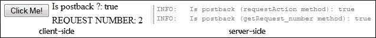

# 第七章：JSF 和 AJAX

JSF 和 AJAX 已经是长期以来的优秀搭档。这种组合的潜力被许多 JSF 扩展（Ajax4Jsf、OmniFaces、PrimeFaces、RichFaces、ICEfaces 等）充分利用，它们提供了许多 AJAX 内置组件，扩展了 AJAX 默认功能，增加了 AJAX 的安全性和可靠性，并为需要操作 AJAX 机制“内部”的开发者提供了更多控制。

默认情况下，JSF 包含一个 JavaScript 库，该库封装了处理 AJAX 请求或响应的 AJAX 方法。此库可以通过以下两种方式加载：

+   使用 `<f:ajax>` 标签，隐式加载内置 AJAX 库。

+   使用 `jsf.ajax.request()`，显式加载 AJAX 库，开发者可以访问 AJAX 代码。这种方法通常用于必须更改默认 AJAX 行为时。这应由具有高度专业知识的开发者执行，因为修改默认 AJAX 行为可能会导致不希望的问题和漏洞。

在本章中，您将学习以下主题：

+   JSF-AJAX 生命周期的简要概述

+   一个简单的 JSF-AJAX 示例

+   `execute`、`render`、`listener` 和 `event` 属性如何工作

+   在客户端监控 AJAX 状态

+   在客户端监控 AJAX 错误

+   在 `<f:ajax>` 标签下分组组件

+   在验证错误后使用 AJAX 更新输入字段

+   混合 AJAX 和流程作用域

+   后台提交和 AJAX 如何协同工作

+   如何确定请求是 AJAX 还是非 AJAX

+   AJAX 和 `<f:param>` 如何工作

+   AJAX 请求的队列控制

+   如何显式加载 `jsf.js`

+   如何编写 AJAX 进度条 / 指示器

# JSF-AJAX 生命周期的简要概述

AJAX 的请求-响应周期以 **部分处理** 和 **部分渲染** 阶段为特征；这意味着 AJAX 部分影响了当前视图。因此，请求不是典型的 JSF 请求，它们遵循由 `javax.faces.context.PartialViewContext` 类指定的不同生命周期。这个类的方法知道如何处理 AJAX 请求，这意味着它们负责解决组件树的部分处理和渲染。

AJAX 请求的核心由 `<f:ajax>` 标签的两个属性表示：`execute` 和 `render`。`execute` 属性指示应在服务器上处理的组件（部分处理），而 `render` 属性指示应在客户端渲染（或重新渲染）的组件（部分渲染）。

在接下来的章节中，您将看到许多这些属性如何工作的示例。

# 一个简单的 JSF-AJAX 示例以开始学习

最简单的 JSF-AJAX 示例可以在几秒钟内编写。让我们考虑一个包含输入文本和按钮的 JSF 表单，该按钮将用户输入发送到服务器。服务器将用户输入（一个字符串）转换为大写，并在输出文本组件中显示给用户。接下来，您可以将此场景 ajax 化，如下面的示例代码所示：

```java
<h:form>
  <h:inputText id="nameInputId" value="#{ajaxBean.name}"/>
  <h:commandButton value="Send" action="#{ajaxBean.ajaxAction()}">
    <f:ajax/>
  </h:commandButton>
  <h:outputText id="nameOutputId" value="#{ajaxBean.name}"/>
</h:form>
```

`<f:ajax>`标签的存在足以将此请求转换为 AJAX 请求。好吧，这个请求确实不是很实用，因为我们没有指定哪些组件应该执行以及哪些组件应该重新渲染。但好处是您不会收到任何错误；JSF 将使用`execute`和`render`属性的默认值，这将要求 JSF 处理触发请求的元素，并重新渲染无内容。

### 注意

当`execute`或`render`属性缺失时，JSF 将处理触发请求的元素，并重新渲染无内容。

添加具有`inputText` ID（`nameInputId`）标签值的`execute`属性将告诉 JSF 将用户输入传递到服务器。这意味着用户输入将在`ajaxAction`方法中可用，并将其转换为大写。您可以在应用程序服务器日志中检查此方法的效果，因为它在客户端不可见，因为`render`属性仍然默认为无。因此，您需要添加`render`属性并指明应重新渲染的组件 ID；在这种情况下，具有 ID `nameOutputId`的输出文本：

```java
<h:form>
  <h:inputText id="nameInputId" value="#{ajaxBean.name}"/>
  <h:commandButton value="Send" action="#{ajaxBean.ajaxAction()}">
    <f:ajax execute ="nameInputId" render="nameOutputId"/>
  </h:commandButton>
  <h:outputText id="nameOutputId" value="#{ajaxBean.name}"/>
</h:form>
```

完成！这是一个简单且功能性的 AJAX 应用程序。您可以在本章的代码包中找到完整的代码，命名为`ch7_1`。

# JSF-AJAX 属性

在本节中，您将看到`<f:ajax>`支持的主要属性。我们从`execute`和`render`开始，继续到`listener`和`event`，最后是`onevent`和`onerror`。

## 执行和渲染属性

在前面的示例中，`execute`和`render`属性影响一个由其 ID 指定的单个组件。当多个组件受到影响时，我们可以指定由空格分隔的 ID 列表，或者我们可以使用以下关键字：

+   `@form`：此关键字指代包含 AJAX 组件的表单中所有组件的 ID。如果它存在于`execute`属性中，则整个`<h:form>`将被提交和处理。在`render`属性的情况下，整个`<h:form>`将被渲染。

+   `@this`：此关键字指代触发请求的元素的 ID（当`execute`缺失时默认）。对于`execute`属性，`@this`将仅提交和处理包含 AJAX 组件的组件，而对于`render`属性，它将仅渲染包含 AJAX 组件的组件。

+   `@none`: 没有组件将被处理/重新渲染。但对于 `execute` 属性，JSF 仍将执行生命周期，包括其阶段监听器；而对于 `render` 属性，JSF 将执行 *Render Response* 阶段，包括触发任何 `preRenderView` 事件。这是 `render` 属性的默认值。

+   `@all`: 这个关键字代表所有组件 ID。对于 `execute`，页面上的所有组件都将被提交和处理——就像一个完整的页面提交。对于 `render` 属性，JSF 将渲染页面上的所有组件；这将更新页面，但允许保留一些 JSF 外部的客户端状态。

根据应用程序的需求，这些关键字和组件 ID 可以混合使用以获得酷炫的 AJAX 请求。例如，通过以下 AJAX 请求：

+   使用以下代码处理并重新渲染当前表单：

    ```java
    <f:ajax execute="@form" render="@form"/>
    ```

+   处理表单，不重新渲染任何内容，按照以下方式：

    ```java
    <f:ajax execute="@form" render="@none"/>
    ```

+   按照以下方式处理触发请求的元素并重新渲染表单：

    ```java
    <f:ajax execute="@this" render="@form"/>
    ```

+   按照以下方式处理表单并重新渲染所有内容：

    ```java
    <f:ajax execute="@form" render="@all"/>
    ```

+   按照以下方式处理表单并重新渲染表单内具有 `nameInputId phoneInputId` ID 的组件：

    ```java
    <f:ajax execute="@form" render="nameInputId phoneInputId"/>
    ```

我们可以继续使用许多其他示例，但我认为你已经明白了这个概念。

### 注意

关键字（`@form`、`@this`、`@all` 和 `@none`）和组件 ID 可以在 `render` 和 `execute` 属性的相同值中混合使用。别忘了用空格将它们分开。

完整的应用程序可以在本章的代码包中找到，命名为 `ch7_2`。

一个特殊情况是重新渲染包含触发请求的 AJAX 元素的表单外的组件。看看以下示例：

```java
<h:message id="msgId" showDetail="true" showSummary="true"
                      for="nameId" style="color: red;"/>      
<h:form>                                  
 <h:inputText id="nameId" value="#{ajaxBean.name}" 
                          validator="nameValidator"/>
 <h:commandButton value="Submit">
  <f:ajax execute="@form" listener="#{ajaxBean.upperCaseName()}" 
          render="@form :msgId :trackRequestId:trackId"/>
 </h:commandButton>           
</h:form> 
<h:form id="trackRequestId">
 Request number: <h:outputText id="trackId" value="#{ajaxBean.request}"/>
</h:form>
```

### 注意

使用 `:` 符号来更新表单外的组件，其中包含触发 AJAX 请求的元素。这个符号表示 `UINamingContainer.getSeparatorChar` 方法返回的默认分隔符。这可以通过 `javax.faces.SEPARATOR_CHAR` 上下文参数来指定。

完整的应用程序可以在本章的代码包中找到，命名为 `ch7_3`。

## 监听器属性

`<f:ajax>` 的另一个重要属性名为 `listener`。此属性指示当客户端动作触发 AJAX 请求时应执行的服务器端方法。例如，你可以使用以下代码来做这件事：

```java
<h:form>
  <h:inputText value="#{ajaxBean.name}"/>
  <h:commandButton value="Send" action="#{ajaxBean.upperCaseName()}">
  <f:ajax execute="@form" render="@form"/>
  </h:commandButton>
</h:form>
```

好吧，使用 `listener` 属性，你可以将前面的代码转换为以下代码：

```java
<h:form>
  <h:inputText value="#{ajaxBean.name}"/>
  <h:commandButton value="Send">
    <f:ajax listener="#{ajaxBean.upperCaseName()}" 
          execute="@form" render="@form"/>          
  </h:commandButton>
</h:form>
```

在这里出现了一个明显的问题。这两个之间有什么区别，为什么我应该使用 `listener` 而不是 `action`？好吧，这两个之间有一些区别，以下是最重要的几个：

+   通过 `action` 属性调用的服务器端方法可以返回表示导航情况（结果）的 `String`，而通过 `listener` 调用的服务器端方法不能提供导航情况。

+   如果客户端在浏览器配置中禁用了 JavaScript，`listener` 属性将不再起作用——服务器端方法将不会被调用。`action` 属性仍然有效。

+   不支持 `action` 属性的组件可以使用 `listener` 代替。

+   通过 `listener` 属性调用的服务器端方法接受一个类型为 `AjaxBehaviorEvent` 的参数，它表示 AJAX 特定的组件行为。在 `action` 属性的情况下不接受。例如，参考以下代码：

    ```java
    <h:form>
      <h:inputText value="#{ajaxBean.name}"/>
      <h:commandButton value="Send">
        <f:ajax listener="#{ajaxBean.upperCaseName}" 
              execute="@form" render="@form"/>          
      </h:commandButton>
    </h:form>
    ...

    public void upperCaseName(AjaxBehaviorEvent event){         
    ...
    }
    ```

### 注意

记住，客户端行为（`ClientBehavior` 接口）负责生成可重用的 JavaScript 代码，这些代码可以添加到 JSF 组件中。AJAX (`<f:ajax>`) 是客户端行为，这意味着它始终作为行为附加到另一个 UI 组件（s）。你可以在第五章（Chapter 5）的“使用客户端行为功能”部分中找到更多关于 `ClientBehavior` 的信息，*JSF Configurations Using XML Files and Annotations – Part 2*。

完整的应用程序可以在本章的代码包中找到，名称为 `ch7_4`。

## 事件属性

每个 AJAX 请求都是由一个表示用户或程序性操作的事件触发的。JSF 根据父组件定义默认事件；根据文档，“对于 `<h:commandButton>` 等`ActionSource`组件，默认事件是 `action`，而对于 `<h:inputText>` 等`EditableValueHolder`组件，默认事件是 `valueChange`”。大多数情况下，默认事件正是你所需要的，但如果你想要为组件显式设置一个事件，可以使用 `event` 属性。此属性的常见值包括 `click`、`focus`、`blur`、`keyup` 和 `mouseover`。

### 注意

不要将这些事件与带有 `on` 前缀的 JavaScript 事件混淆（例如 `onclick`、`onkeyup`、`onblur` 等）。JavaScript 事件位于 AJAX 事件之后；或者换句话说，AJAX 事件基于 JavaScript 事件。例如，AJAX `click` 事件基于 `onclick` JavaScript 事件。

在以下代码中，触发 AJAX 动作的事件是 `keyup`：

```java
<h:form>
  <h:inputText value="#{ajaxBean.name}">
  <f:ajax event="keyup" listener="#{ajaxBean.upperCaseName()}" render="@this"/>
  </h:inputText>            
</h:form>  
```

完整的应用程序可以在本章的代码包中找到，名称为 `ch7_5`。

## onevent 属性 - 在客户端监控 AJAX 状态

在 AJAX 请求期间，JSF 能够调用客户端定义的 JavaScript 方法，并将一个名为 `data` 的对象传递给它，其中包含有关请求当前状态的信息。当请求开始、完成和成功时，调用 JavaScript 函数。

`data` 对象封装了以下属性：

+   `type`: 这个属性给出了 AJAX 调用的类型，`event`

+   `status`: 这个属性返回 `begin`、`complete` 或 `success` 状态（可用于实现不确定进度条）。

    ### 注意

    当`status`属性值为`begin`时，表示 AJAX 请求尚未发送。当它等于`complete`时，表示 AJAX 响应已成功到达客户端，但尚未被处理。如果接收到的响应成功处理（没有错误），则`status`值变为`success`。

+   `source`: 这个属性返回表示 AJAX 事件源的 DOM 元素

+   `responseXML`: 这是以 XML 格式表示的 AJAX 响应

+   `responseText`: 这是以文本格式表示的 AJAX 响应

+   `responseCode`: 这是以 AJAX 响应代码

您需要通过`onevent`属性指示 JavaScript 方法的名称（在`jsf.js`中，表示此属性实现的 JavaScript 方法命名为`addOnEvent`(回调)）：

```java
<h:commandButton value="Submit">
  <f:ajax onevent="ajaxMonitoring" execute="@form"
         listener="#{ajaxBean.upperCaseName()}" render="@form"/>
</h:commandButton>  
```

接下来，`ajaxMonitoring`函数可以使用`data`对象及其属性来完成不同的客户端任务。例如，以下实现向一些`div`标签中填充有关 AJAX 请求的详细信息：

```java
<script type="text/javascript">
  function ajaxMonitoring(data) {              
    document.getElementById("statusId").innerHTML += data.status + " | ";
    document.getElementById("responseCodeId").innerHTML += 
    status.responseCode + "| ";
    if(data.status === "complete") {
      document.getElementById("typeId").innerHTML += data.type;
      document.getElementById("sourceId").innerHTML += data.source;
  ...
</script>
```

在以下图中，您可以看到可能的输出：


完整的应用程序可以在本章的代码包中找到，命名为`ch7_21`。

## onerror 属性 - 在客户端监控 AJAX 错误

在前面的章节中，您看到了如何使用客户端定义的 JavaScript 函数和`data`对象来监控 AJAX 请求的状态。基于同样的技术，我们可以获取有关在 AJAX 请求过程中可能发生的错误的信息。传递的`data`对象封装了以下属性（请注意，这是前面章节中的同一个`data`对象；因此您仍然可以访问这些属性）：`description`、`errorName`和`errorMessage`。

`data.type`属性将为`error`，而`data.status`属性将为以下之一：

+   `serverError`: 这包含错误的 AJAX 请求的响应

+   `malformedXML`: 这是一个 XML 格式错误

+   `httpError`: 这是一个有效的 HTTP 错误

+   `emptyResponse`: 这是一段服务器端代码，没有提供响应

JavaScript 方法的名称通过`onerror`属性指示（在`jsf.js`中，表示此属性实现的 JavaScript 方法命名为`addOnError`（回调））。因此，在此点，我们可以更新前面章节中的应用程序，以在客户端报告错误，如下面的代码所示（请注意，`onevent`和`onerror`调用同一个方法`ajaxMonitoring`；然而这并非强制性的，您也可以使用单独的 JavaScript 方法）：

```java
<script type="text/javascript">
  function ajaxMonitoring(data) {
    document.getElementById("statusId").innerHTML += data.status + " | ";
    if(data.status === "serverError" || data.status === "malformedXML" || 
      data.status === "httpError" || data.status === "emptyResponse"){
      document.getElementById("descriptionId").innerHTML += 
        data.description;
      document.getElementById("errorNameId").innerHTML += data.errorName;
      document.getElementById("errorMessageId").innerHTML += 
        data.errorMessage;
  }
  document.getElementById("responseCodeId").innerHTML += 
       status.responseCode + "| ";
  if (data.status === "complete") {
      document.getElementById("typeId").innerHTML += data.type;
      document.getElementById("sourceId").innerHTML += data.source + 
      "<br/><xmp>" + new XMLSerializer().serializeToString(data.source) + 
      "</xmp>";
      document.getElementById("responseXMLId").innerHTML += 
      data.responseXML + "<br/><xmp>" + new 
      XMLSerializer().serializeToString(data.responseXML) + "</xmp>";
      document.getElementById("responseTextId").innerHTML += "<xmp>" + 
      data.responseText + "</xmp>";
  }
 }
</script>
```

现在，您可以通过添加一个故意的错误来测试此代码，例如调用不存在的服务器端方法，如下面的代码所示：

```java
<h:commandButton value="Submit">
  <f:ajax onevent ="ajaxMonitoring" onerror="ajaxMonitoring" 
         execute="@form" listener="#{ajaxBean.unexistedMethod()}" 
         render="@form"/>
</h:commandButton>
```

下面的屏幕截图显示了可能的输出：


完整的应用程序可以在本章的代码包中找到，命名为 `ch7_6`。

# 在 `<f:ajax>` 标签下分组组件

有时，将多个组件分组在同一个 `<f:ajax>` 标签下可能很有用。例如，以下代码片段将两个 `<h:inputText>` 组件分组在同一个 `<f:ajax>` 标签下（您也可以嵌套其他组件）：

```java
<f:ajax event="click" execute="submitFormId" render="submitFormId">
  <h:form id="submitFormId"> 
    Name:
    <h:inputText id="nameId" value="#{ajaxBean.name}" 
                           validator="nameValidator"/>
    <h:message id="msgNameId" showDetail="true" showSummary="true" 
                           for="nameId" style="color: red;"/>
    Surname:            
    <h:inputText id="surnameId" value="#{ajaxBean.surname}" 
                           validator="nameValidator"/>
    <h:message id="msgSurnameId" showDetail="true" showSummary="true"   
                           for="surnameId" style="color: red;"/>
    </h:form>
</f:ajax>
```

那么，它是如何工作的呢？当您点击任何一个输入组件时，会为输入组件和表单（在我们的例子中是两个请求）发起一个 AJAX 请求，并且表单中的所有组件都会重新渲染。由于 `click` 事件会生成 AJAX 请求/响应，除非您使用 *Tab* 键在每个 `<h:inputText>` 组件中获取焦点，否则您将无法在那些 `<h:inputText>` 中输入键。

### 注意

在 `<f:ajax>` 标签下分组的组件仍然可以使用内部（或本地使用）的 `<f:ajax>` 标签。在这种情况下，效果是累积的。当然，当您使用这种技术时，必须格外小心，因为可能会出现不期望的行为。

完整的应用程序可以在本章的代码包中找到，命名为 `ch7_7`。

# 在验证错误后使用 AJAX 更新输入字段

在验证错误后使用 AJAX 更新输入字段是 JSF 开发者非常古老、众所周知且令人烦恼的问题。当 AJAX 请求在验证阶段失败时，没有内置的方法可以更新输入字段以包含一些有效值，因为 JSF 不允许在验证错误后访问模型值（通常，您希望清除这些字段或提供一些默认值，甚至是一些由同一用户提供的旧值）。当然，JSF 开发者找到了不同的解决方案，或者使用了其他库，如 PrimeFaces 或 OmniFaces，但需要一个 JSF 解决方案。

从 JSF 2.2 开始，如果我们将 `resetValues` 属性设置为 `true`，则应该重新渲染的所有组件（在 `render` 属性中指示的组件）将被重置。理解这一点最简单的方法是通过比较测试。首先，让我们使用没有 `resetValues` 的 AJAX 请求：

```java
<h:form> 
  <h:message id="msgId" showDetail="true" showSummary="true" for="nameId" style="color: red;"/>
  <h:inputText id="nameId" value="#{ajaxBean.name}" 
                          validator="nameValidator"/>
  <h:commandButton value="Submit">
    <f:ajax execute="@form" resetValues="false" 
      listener="#{ajaxBean.upperCaseName()}" render="nameId msgId"/>
  </h:commandButton>
</h:form>
```

假设我们输入字段的合法值是一个字母数字字符串（与 [^a-zA-Z0-9] 模式相关）。在下面的截图中，在左侧，您可以看到插入有效值后的 AJAX 结果，而在右侧，您可以看到插入无效值后的 AJAX 结果：


如您在前面的截图中所见，在右侧，无效的值没有被重置。无效的值被保留，这非常令人烦恼。

接下来，我们继续同样的案例，但添加了 `resetValues` 属性：

```java
<h:form>                      
  <h:message id="msgId" showDetail="true" showSummary="true" for="nameId"
  style="color: red;"/>            
  <h:inputText id="nameId" value="#{ajaxBean.name}" 
                          validator="nameValidator"/>
  <h:commandButton value="Submit">
    <f:ajax execute="@form" resetValues="true" 
       listener="#{ajaxBean.upperCaseName()}" render="nameId msgId"/>
  </h:commandButton>            
</h:form>
```

现在，我们重复测试。在下面的截图中，左侧的提交值是有效的，而右侧的值是无效的：


现在，当提交的值无效时，输入字段会被重置（在这种情况下，会被清除）。

### 注意

从这个例子中，您可能会误解 `resetValues` 的工作原理就像是一个清除（空）字段的动作。实际上，它不是这样！当一个输入字段被重置时，替换无效值的有效值与托管 Bean（渲染器将从 Bean 中获取值）相关。如果托管 Bean 在请求作用域中，替换者（有效值）将是用于初始化相应属性（这可能是一切，而不仅仅是空字符串）的值。但如果托管 Bean 在视图作用域中，那么替换者将是相应属性的当前有效值，这可能是最初的值，或者是用户插入的先前有效值（当然，在服务器端方法中可能已更改或未更改）。

在测试本章代码包中名为 `ch7_8_1` 的完整应用程序时，请记住这个注意事项。默认情况下，此应用程序包含一个请求作用域的托管 Bean，但您可以轻松将其转换为视图作用域以进行更多测试。

除了用于 AJAX 请求的 `resetValues` 属性外，JSF 2.2 还提供了一个名为 `<f:resetValues>` 的标签，用于非 AJAX 请求。基本上，这是一个可以轻松附加到任何 `ActionSource` 实例（例如，`<h:commandButton>`）的动作监听器。其效果将包括重置其 `render` 属性中给出的所有组件（仅使用组件 ID，而不是如 `@form`、`@all` 等关键字）：

```java
<h:commandButton value="Submit" action="#{nonAjaxBean.upperCaseName()}">
  <f:resetValues render="nameId" />
</h:commandButton>
```

完整的应用程序可以在本章的代码包中找到，并命名为 `ch7_8_2`。此标签在所有 JSF 2.2（Mojarra 和 MyFaces）版本中可能不被识别，因此您必须进行测试以确保可以使用它。

## 取消和清除按钮

类型为 **取消**（将表单的字段重置到初始状态或最近的合法状态）和 **清除**（清除表单的字段）的按钮在 Web 应用程序中并不常见，但有时它们对最终用户可能很有用。在实现 **取消**/**清除**按钮时，您需要找到一种方法来跳过 **过程验证** 阶段（这是 **提交** 按钮所需的）。动机很简单：当用户取消/清除表单的值时，我们当然不需要有效的值来完成这些任务；因此，不需要验证。

在非 AJAX 请求中，一种常见的技巧是使用 `immediate="true"` 属性，对于命令组件（例如，`<h:commandButton>`），它将在 **应用请求值** 阶段转移动作的调用。此属性也适用于 AJAX 请求，但 AJAX 为这些任务提供了更好的解决方案。我们不需要使用 `immediate="true"`，而是可以使用 `@this` 关键字。此外，我们可以使用 `resetValues` 功能来简化并加强 **取消**/**清除** 按钮。

现在，让我们看看一些场景。我们将保持简单，因此我们需要一个带有单个输入字段和三个按钮（**提交**、**取消**和**清除**）的表单。验证器将只允许字母数字字符（根据`[^a-zA-Z0-9]`模式）。

### 提交给视图作用域管理器的值

在这种情况下，运行以下代码：

```java
<h:form>                      
  <h:message id="msgId" showDetail="true" showSummary="true" for="nameId" style="color: red;"/>
  <h:inputText id="nameId" value="#{ajaxBean.name}" 
                          validator="nameValidator"/>
  <h:commandButton value="Submit">
    <f:ajax execute="@form" resetValues="true" 
       listener="#{ajaxBean.upperCaseName()}" render="nameId msgId"/>
  </h:commandButton>
  <h:commandButton value="Cancel">
    <f:ajax execute="@this" render="@form"/>
  </h:commandButton>  
  <h:commandButton value="Clear">
    <f:ajax execute="@this" render="@form" 
                          listener="#{ajaxBean.cancelName()}"/>
  </h:commandButton>
</h:form>
```

按下**提交**按钮。如果值无效，你将看到一个特定的错误消息（`<h:message>`），并且`resetValues`将输入字段重置为初始值（空字符串或一些建议）或最近的合法值。

按下**取消**按钮。由于我们使用`execute="@this"`，输入字段将不会在服务器上处理；因此不会发生验证。重新渲染过程对输入字段的效果与`resetValues`相同，但也会清除`<h:message>`标签。

按下**清除**按钮。此按钮也使用`execute="@this"`，但它不是将输入字段重置为`resetValues`，而是清除输入字段和`<h:message>`。为此，在管理器中需要添加一个额外的方法，如下所示：

```java
private String name = "RafaelNadal";
...
public void cancelName() {
  name = "";
}
```

完整的应用程序可以在本章的代码包中找到，命名为`ch7_9_1`。

作为一个小技巧，对于**清除**按钮，你可能想使用占位符如下：

```java
...
<h:inputText id="nameId" value="#{ajaxBean.name}" 
  validator="nameValidator"  f5:placeholder="Enter your name ..."/>
```

### 提交给请求作用域管理器的值

由于提交的值不会在多个 AJAX 请求之间持久化，`resetValues`方法和**取消**按钮将输入字段重置为初始化值（空字符串或建议）。**取消**按钮还将重置`<h:message>`标签。**清除**按钮将清除输入文本和`<h:message>`。当然，在某些情况下（例如使用空字符串进行初始化），**取消**和**清除**按钮将执行相同的功能；因此，你可以去掉其中一个。

完整的应用程序可以在本章的代码包中看到，命名为`ch7_9_2`。

### 注意

如何使用`resetValues`和实现**取消**和**清除**按钮的更多示例可以在本书附带的源代码中找到。使用具有取消/清除功能的输入字段中的`keyup`事件的一组示例包含以下应用：`ch7_9_3`、`ch7_9_4`、`ch7_9_5`和`ch7_9_6`。

似乎一切都很直接，但有一个问题我们必须修复。让我们仔细看看以下代码（其中没有复杂的地方）：

```java
<h:form>
  Name:
  <h:inputText id="nameId" value="#{ajaxBean.name}" 
                          validator="nameValidator"/>
  <h:message id="msgNameId" showDetail="true" showSummary="true" 
                          for="nameId" style="color: red;"/>
  Surname:            
  <h:inputText id="surnameId" value="#{ajaxBean.surname}" 
                          validator="nameValidator"/>
  <h:message id="msgSurnameId" showDetail="true" showSummary="true" 
                          for="surnameId" style="color: red;"/> ..

  <h:commandButton value="Submit">
    <f:ajax execute="@form" 
      listener="#{ajaxBean.upperCaseNameAndSurname()}" 
      render="@form"/>
  </h:commandButton>
  <h:commandButton value="Cancel">
    <f:ajax execute="@this" render="@form"/>
  </h:commandButton>  
  <h:commandButton value="Clear/Reset">
    <f:ajax execute="@this" render="@form" 
          listener="#{ajaxBean.cancelNameAndSurname()}"/>         
  </h:commandButton>
</h:form>
```

让我们关注提交过程。当我们提交一个有效的名字和姓氏时，表单会重新渲染，一切看起来都很正常，但如果一个值（或两个）是无效的，那么输入字段不会重置，并且会显示相应的错误消息。这是正常的，因为 `resetValues` 方法不存在；因此，第一个想法可能是将 `resetValues="true"` 添加到对应于 **提交** 按钮的 `<f:ajax>` 中。然而，这不会按预期工作，因为在无效值的情况下没有任何操作。虽然你可能认为输入字段会重置为无效值，但你可能会惊讶地看到在重新渲染后一切保持不变，无效值仍然存在。原因似乎是在 **提交** 按钮的 `render` 属性中存在 `@form`。如果你用应该重新渲染的组件 ID（`nameId`、`msgNameId`、`surnameId` 和 `msgSurnameId`）替换它，`resetValues` 方法将完美工作。

但是，如果你有很多输入字段，而且不想列出所有组件的 ID，或者你只想在 `render` 属性中使用 `@form` 关键字？在这种情况下，你应该知道无效的输入字段将不会自动重置（`resetValues` 方法无效），并且最终用户应该通过点击 **取消** 或 **清除** 按钮手动取消/清除输入字段。虽然 **取消** 按钮工作正常，但 **清除** 按钮有一个大 **Oops!**，因为 JSF 不会清除未执行（列在 `execute` 属性中）且重新渲染（列在 `render` 属性中）的输入字段，除非你只提交有效值。换句话说，如果名字是有效的，而姓氏不是（或任何涉及无效值的组合），那么在提交和清除后，名字的输入字段不会被清除。

解决这个问题的方法之一可以在 OmniFaces ([`code.google.com/p/omnifaces/`](https://code.google.com/p/omnifaces/)) 上找到，它提供了一个名为 `org.omnifaces.eventlistener.ResetInputAjaxActionListener` 的动作监听器 ([`showcase.omnifaces.org/eventlisteners/ResetInputAjaxActionListener`](http://showcase.omnifaces.org/eventlisteners/ResetInputAjaxActionListener))。这个监听器能够修复 **清除** 按钮和其他同一类的问题：

```java
<h:commandButton value="Clear/Reset">
  <f:ajax execute="@this" render="@form" 
         listener="#{ajaxBean.cancelNameAndSurname()}"/>
  <f:actionListener type="org.omnifaces.eventlistener.
                ResetInputAjaxActionListener"/>
</h:commandButton>
```

完整的应用程序可以在本章的代码包中找到，该代码包命名为 `ch7_9_7`。

# 混合 AJAX 和流程作用域

AJAX 请求通常与视图作用域中的 beans 相关（`@ViewScoped`），这意味着只要当前视图没有被导航情况（或其他原因）销毁，数据就可以在多个 AJAX 请求中持久化（存储）。一个流程被定义为逻辑相关页面/视图的集合；因此，AJAX 无法在流程转换中存活。

为了更好地理解，我们将适应在第三章中开发的*JSF 作用域 – 在管理 Bean 通信中的生命周期和使用*（`ch3_7_3`应用程序，你需要熟悉）以支持`registration.xhtml`视图（流程中的第一页）中的 AJAX 请求。主要思想是编写一个视图范围内的 bean，该 bean 可能填充在流程范围内的 bean 中定义的玩家姓名和姓氏。名为`ViewRegistrationBean`的视图范围内的 bean 将随机生成一个姓名-姓氏对，并将它们作为建议呈现给最终用户。用户可以提供姓名和姓氏，或者他/她可以选择使用建议的姓名和姓氏。因此，流程范围内的 bean 看起来如下所示：

```java
import javax.faces.flow.FlowScoped;
import javax.inject.Named;

@Named
@FlowScoped(value = "registration")
public class RegistrationBean {

  private String playerName ="";
  private String playerSurname="";

  //getters and setters

  public void credentialsUpperCase(){
    playerName = playerName.toUpperCase();
    playerSurname = playerSurname.toUpperCase();
  }

  public String getReturnValue() {
    return "/done";
  }

  public String registrationAction() {
    return "confirm";
  }
}
```

注意，`getReturnValue`方法代表流程返回（退出流程），而`registrationAction`方法在流程中导航到下一页。两者都将破坏当前视图。

接下来，视图范围内的 bean 是使用`@PostConstruct`注解的方法，它将帮助我们查看 AJAX 是否在多个请求中使用了此 bean 的相同实例：

```java
@Named
@ViewScoped
public class ViewRegistrationBean implements Serializable {

  @Inject
  RegistrationBean registrationBean;
  private String playerNameView = "nothing";
  private String playerSurnameView = "nothing";
  private static final Map<Integer, String> myMap = new HashMap<>();
  static {
        myMap.put(1, "Nadal Rafael");
        myMap.put(2, "Federer Roger");
        ...
  }

  @PostConstruct
  public void init() {
    Random r = new Random();
    int key = 1 + r.nextInt(9);
    String player = myMap.get(key);
    String[] fullname = player.split(" ");

    playerNameView = fullname[0];
    playerSurnameView = fullname[1];
    playerNameView = playerNameView.toUpperCase();
    playerSurnameView = playerSurnameView.toUpperCase();
  }

  public String getPlayerNameView() {
    return playerNameView;
  }

  public void setPlayerNameView(String playerNameView) {
    this.playerNameView = playerNameView;
  }

  public String getPlayerSurnameView() {
    return playerSurnameView;
  }

  public void setPlayerSurnameView(String playerSurnameView) {
    this.playerSurnameView = playerSurnameView;
  }

  public void generateCredentials() {
    registrationBean.setPlayerName(playerNameView);
    registrationBean.setPlayerSurname(playerSurnameView);
  }
}
```

我们可以通过在`registration.xhtml`中使用以下代码轻松监控姓名和姓氏的值：

```java
Your registration last credentials (in <b>flow</b>):
<h:outputText id="credentialsFlowId" 
              value="#{registrationBean.playerName} 
                     #{registrationBean.playerSurname}"/>
<hr/>
Random credentials (in <b>view</b>) [as long as we are in this view this value won't change]:
<h:outputText id="credentialsViewId" 
              value="#{viewRegistrationBean.playerNameView} 
                     #{viewRegistrationBean.playerSurnameView}"/>
```

现在，将有两个按钮触发 AJAX 请求。一个按钮将调用服务器端方法`credentialsUpperCase`（来自流程范围内的 bean，`RegistrationBean`），另一个按钮将调用服务器端方法`generateCredentials`（来自视图范围内的 bean，`ViewRegistrationBean`）。在这两种情况下，我们将按照以下方式重新渲染 bean 中的玩家姓名和姓氏：

```java
<h:form>
  Name: <h:inputText value="#{registrationBean.playerName}"/>
  Surname: <h:inputText value="#{registrationBean.playerSurname}"/>
  <h:commandButton value="Register To Tournament (AJAX call a method of a
  flow bean)" action="#{registrationBean.credentialsUpperCase()}">
  <f:ajax execute="@form" 
          render="@form :credentialsFlowId :credentialsViewId"/>
  </h:commandButton>    
  <h:commandButton value="Register To Tournament (AJAX call a method of a
  view bean)" action="#{viewRegistrationBean.generateCredentials()}">
  <f:ajax execute="@this" 
           render="@form :credentialsFlowId :credentialsViewId"/>
  </h:commandButton>  
</h:form>
```

现在，最终用户可以通过两种方式注册比赛：通过手动在输入字段中插入姓名和姓氏并通过按下第一个按钮（结果将是插入的姓名和姓氏的大写形式）注册，或者他/她可以选择使用建议的姓名和姓氏，并通过按下第二个按钮（结果将是随机姓名和姓氏的大写形式）注册。

在这里可以注意到一些重要的事情，如下列所示：

+   通过按下第一个按钮触发 AJAX 请求，将提交的姓名和姓氏放入流程范围（手动输入或从随机建议导入）。

+   通过按下第二个按钮触发 AJAX 请求，将分配建议的姓名和姓氏到流程范围内的 bean 的对应部分。由于我们在多个 AJAX 请求中处于相同的视图，并且`init`方法仅在创建`ViewRegistrationBean`bean 的新实例时调用，因此它不会为每个请求生成新的姓名和姓氏。

+   如果我们退出并重新进入流程，持久化的姓名和姓氏将失去它们的值。当我们退出流程时，我们达到流程作用域的边界，这意味着在再次进入流程时必须创建一个新的`RegistrationBean`实例。此外，此结果将改变当前视图；因此，还需要一个新的`ViewRegistrationBean`实例。

+   当我们在流程中导航到下一页时，提交的姓名和姓氏具有相同的值，因为它们已在流程作用域中持久化；而建议的姓名和姓氏再次随机生成，结果已改变视图，即使我们处于同一流程中，如下截图所示：

现在您已经了解了 AJAX 如何与视图作用域结合使用。完整的应用程序可以在本章的代码包中找到，该代码包命名为`ch7_10`。

# 回发和 AJAX

在整本书中，我们多次提到了回发请求。对于不熟悉它的人，或者只是需要快速提醒的人，让我们说 JSF 识别初始请求和回发请求。

**初始请求**（例如，`HTTP GET`）是浏览器为加载页面发送的第一个请求。您可以通过在浏览器中访问应用程序 URL 或通过跟随链接（可以是应用程序任何页面的链接）来获取此类请求。此外，当`page_A`包含重定向（`faces-redirect=true`）到`page_B`时，初始请求发生在`page_B`（这不适用于转发机制）。此类请求在*恢复视图*阶段和*渲染响应*阶段进行处理。

**回发请求**发生在我们点击按钮/链接提交表单时。与初始请求不同，回发请求会通过所有阶段。

JSF 提供了一个名为`isPostback`的方法，它返回一个布尔值：对于回发请求返回`true`，对于初始请求返回`false`。在代码行中，我们可以：

+   使用以下代码在管理 Bean 中检查初始/回发请求：

    ```java
    FacesContext facesContext = FacesContext.getCurrentInstance();
    logger.log(Level.INFO, "Is postback: {0}", facesContext.isPostback());
    ```

+   使用以下代码在页面中检查初始/回发请求：

    ```java
    Is postback ? <h:outputText value="#{facesContext.postback}"/>
    ```

例如，您可以使用一个简单的应用程序检查 AJAX 的初始/回发请求。JSF 页面如下：

```java
<h:form>
  <h:commandButton value="Click Me!">
    <f:ajax listener="#{ajaxBean.requestAction()}" render=":postbackId"/>
  </h:commandButton>
</h:form>        
<h:panelGrid id="postbackId" columns="1">
  <h:outputText value="Is postback ?: #{facesContext.postback}"/>
  <h:outputText value="REQUEST NUMBER: #{ajaxBean.request_number}"/>
</h:panelGrid>
```

管理 Bean 如下：

```java
@Named
@ViewScoped
public class AjaxBean implements Serializable{

  private static final Logger logger =
         Logger.getLogger(AjaxBean.class.getName());
  private int request_number = 1;

  public int getRequest_number() {
    FacesContext facesContext = FacesContext.getCurrentInstance();
    logger.log(Level.INFO, "Is postback (getRequest_number method): {0}", 
      facesContext.isPostback());
    return request_number;
  }

  public void setRequest_number(int request_number) {
    this.request_number = request_number;
  }

  public void requestAction(){        
    FacesContext facesContext = FacesContext.getCurrentInstance();
    logger.log(Level.INFO, "Is postback (requestAction method): {0}", facesContext.isPostback());
    request_number ++;
  }    
}
```

代码非常简单；因此，我们可以直接跳转到检查初始/回发请求，如下所示：

+   **第一次请求**：通过访问应用程序 URL 来加载应用程序的第一个页面。客户端将初始请求指示如下截图左侧所示，服务器端也以相同的指示，如下截图右侧所示：

+   **第二次请求**：**点击我！**按钮第一次被点击（第二次、第三次等的结果为`true`）。客户端（在浏览器中）如以下截图左侧所示，表明这是一个回发请求，服务器端如同一截图右侧所示：

### 注意

了解请求是初始的还是回发可能会有用。例如，您可能希望在初始请求（例如，初始化任务）时仅完成一次任务，或者每次都完成，除了第一次（例如，显示一条消息，这在由于初始请求而显示页面时并不合适）。

## 回发请求的条件渲染/执行

我们可以使用初始/回发请求检测来有条件地渲染 UI 组件（当然，您也可以用于部分处理）。看看以下代码：

```java
<h:form id="ajaxFormId">
  <h:commandButton id="buttonId" value="Click Me!">  
    <f:ajax listener="#{ajaxBean.requestAction()}" 
      render="#{facesContext.postback eq true ?
  ':postbackId': 'ajaxFormId'}"/>
  </h:commandButton>
  Is postback ? <h:outputText value="#{facesContext.postback}"/>
</h:form>        
<h:panelGrid id="postbackId" columns="1">
  <h:outputText value="REQUEST NUMBER: #{ajaxBean.request_number}"/>
</h:panelGrid>
```

那么，让我们看看它是如何工作的！当页面加载时，我们有一个初始请求（`#{facesContext.postback}`返回`false`），这意味着服务器响应将包含如下代码片段（我们需要关注`<f:ajax>`组件）：

```java
<input id="ajaxFormId:buttonId" type="submit" 
       name="ajaxFormId:buttonId" value="Click Me!"      
       onclick="mojarra.ab(this,event,'action',0,'ajaxFormId');
       return false" />
```

在服务器端，`getRequest_number`方法的日志行也会揭示一个初始请求。此外，请注意，报告的请求号是`1`，这是`request_number`属性的初始值。

接下来，让我们点击一次**点击我！**按钮。现在，AJAX 请求将看起来像以下代码行：

```java
ajaxFormId=ajaxFormId&javax.faces.ViewState=411509096033316844%3A7611114960827713853&javax.faces.source=ajaxFormId%3AbuttonId&javax.faces.partial.event=click&javax.faces.partial.execute=ajaxFormId%3AbuttonId%20ajaxFormId%3AbuttonId&javax.faces.partial.render
=ajaxFormId&javax.faces.behavior.event=action&javax.faces.partial.ajax=true
```

突出的代码提供了重要信息！这是一个回发请求，但`render`属性包含`<h:form>`组件的 ID，而不是`<h:panelGrid>`组件的 ID（正如您可能认为的那样）；这是因为`#{facesContext.postback}`表达式在上一个请求中评估为`false`。所以，在我们的按钮第一次点击时，AJAX 不会重新渲染`<h:panelGrid>`组件。同时，在服务器端，`request_number`属性已成功增加到`2`；然而，对于最终用户来说，它仍然显示为`1`。

现在，这个 AJAX 的服务器响应将包含以下代码：

```java
<input id="ajaxFormId:buttonId" type="submit"
       name="ajaxFormId:buttonId" value="Click Me!"    
       onclick="mojarra.ab(this,event,'action',0,'postbackId');
       return false">
```

注意，`postbackId`，即`<h:panelGrid>`的 ID，存在于响应中。按钮的第二次点击（第二次点击）将生成下一个 AJAX 请求：

```java
ajaxFormId=ajaxFormId&javax.faces.ViewState=270275638491205347%3A7563196939691682163&javax.faces.source=ajaxFormId%3AbuttonId&javax.faces.partial.event=click&javax.faces.partial.execute=ajaxFormId%3AbuttonId%20ajaxFormId%3AbuttonId&javax.faces.partial.render=postbackId&javax.faces.behavior.event=action&javax.faces.partial.ajax=true
```

现在，当 AJAX 请求完成时，`<h:panelGrid>`组件将被重新渲染。`request_number`属性达到值`3`，并将显示在客户端。进一步的 AJAX 请求将是回发请求。

在下面的屏幕截图中，您可以查看初始请求，首先点击按钮，然后从客户端和服务器端进行第二次点击：


了解 AJAX 与初始/回发请求的行为会有所帮助——这不是一个错误。当然，一旦你知道这个*问题*，就有很多解决方案取决于你真正想要实现的目标。

此外，您可以尝试以类似的方式测试`execute`属性。

完整的应用程序可以在本章的代码包中找到，该代码包命名为`ch7_11`。

# 这是一个非 AJAX 请求吗？

JSF 可以通过检查请求头或调用`PartialViewContext.isAjaxRequest`方法来回答这个问题。提供有关请求类型信息的请求头是`Faces-Request`和`X-Requested-With`。对于 AJAX 请求，`Faces-Request`头将具有值`partial/ajax`，而`X-Requested-With`请求类型将具有值`XMLHttpRequest`（在 JSF 2.2 中，`X-Requested-With`似乎不起作用；然而，为了完整性，您可以再次测试它们）。在下面的屏幕截图中，您可以查看典型 JSF 2.2 AJAX 请求的头部：


在一个管理 Bean 中，您可以确定请求的类型，如下面的代码所示：

```java
public void requestTypeAction() {

  FacesContext facesContext = FacesContext.getCurrentInstance();
  ExternalContext externalContext = facesContext.getExternalContext();
  Map<String, String> headers = externalContext.getRequestHeaderMap();
  logger.info(headers.toString());

  //determination method 1       
  PartialViewContext partialViewContext =    
                    facesContext.getPartialViewContext();
  if (partialViewContext != null) {
    if (partialViewContext.isAjaxRequest()) {
         logger.info("THIS IS AN AJAX REQUEST (DETERMINATION 1) ...");
    } else {
           logger.info("THIS IS A NON-AJAX REQUEST(DETERMINATION 1)...");
    }
  }

  //determination method 2
  String request_type_header_FR = headers.get("Faces-Request");
  if (request_type_header_FR != null) {
    if (request_type_header_FR.equals("partial/ajax")) {
         logger.info("THIS IS AN AJAX REQUEST (DETERMINATION 2) ...");
     } else {
           logger.info("THIS IS A NON-AJAX REQUEST(DETERMINATION 2)...");
     }
  }

  //determination method 3
  String request_type_header_XRW = headers.get("X-Requested-With");
  if (request_type_header_XRW != null) {
    if (request_type_header_XRW.equals("XMLHttpRequest")) {
        logger.info("THIS IS AN AJAX REQUEST (DETERMINATION 3) ...");
    } else {
           logger.info("THIS IS A NON-AJAX REQUEST(DETERMINATION 3)...");
    }
  }
}
```

或者，在 JSF 页面上，您可以编写以下代码：

```java
AJAX/NON-AJAX: 
#{facesContext.partialViewContext.ajaxRequest ? 'Yes' : 'No'}
FACES-REQUEST HEADER: #{facesContext.externalContext.requestHeaderMap['Faces-Request']}
X-REQUESTED-WITH HEADER: #{facesContext.externalContext.requestHeaderMap['X-Requested-With']}
```

完整的应用程序可以在本章的代码包中找到，该代码包命名为`ch7_12`。

# AJAX 和<f:param>

`<f:param>`标签可以用来将请求参数传递给一个管理 Bean。由于我们已经在第二章中详细讨论了这个标签，*JSF 中的通信*，我们可以在这里通过一个示例继续使用它，在`<f:ajax>`内部使用它：

```java
<h:form>
  <h:inputText id="nameInputId" value="#{ajaxBean.name}"/>
  <h:commandButton value="Send" action="#{ajaxBean.ajaxAction()}">
    <f:ajax execute ="nameInputId" render="nameOutputId">
      <f:param name="surnameInputId" value="Nadal"/>
    </f:ajax>
  </h:commandButton>
  <h:outputText id="nameOutputId" value="#{ajaxBean.name}"/>
</h:form>
```

请记住，传递的参数在请求参数映射中可用：

```java
FacesContext fc = FacesContext.getCurrentInstance();
  Map<String, String> params = 
             fc.getExternalContext().getRequestParameterMap();
  logger.log(Level.INFO, "Surname: {0}", params.get("surnameInputId"));
```

### 注意

请记住，`<f:param>`只能与按钮和链接一起使用。尝试在输入中添加`<f:param>`将不会起作用。更多详细信息请参阅第二章，*JSF 中的通信*。

完整的应用程序可以在本章的代码包中找到，该代码包命名为`ch7_13`。

# AJAX 请求排队控制

在客户端排队 AJAX 请求是一种常见的做法，旨在确保一次只处理一个请求。这种方法的目的是保护服务器免受压垮，并防止客户端浏览器阻塞或以未定义的顺序接收 AJAX 响应。虽然 AJAX 排队在 JSF 2.0 中可用，但 AJAX 排队控制从 JSF 2.2 开始提供。

为了提供 AJAX 排队控制，JSF 2.2 为`<f:ajax>`标签引入了一个名为`delay`的属性。此属性的值是一个表示毫秒数的字符串（默认为`none`）。在此时间间隔内，只有最新的请求实际上被发送到服务器，其余的请求被忽略。换句话说，JSF 将等待*n*毫秒，直到最新的 AJAX 请求被执行。默认情况下，它不会等待。

下面是一个使用默认`delay`属性和显式延迟 1000 毫秒的示例。为了突出延迟效果，我们构建了一个简单的应用程序，该应用程序在`keyup`事件上发送 AJAX 请求（提交输入文本值），并等待服务器响应建议文本。在下面的屏幕截图中，您可以比较输入的键数，直到服务器响应第一个建议文本。在这两种情况下，这是第一个触发的 AJAX 请求。很明显，在第二种情况下，由于在 1000 毫秒范围内触发，因此没有发送七个请求（按键）。一般来说，每次输入新键时，都会删除之前的 AJAX 请求，只考虑最后一个请求。


完整的应用程序可以在本章的代码包中找到，命名为`ch7_14`。您还可以查看*自定义 jsf.js*部分，在那里您将看到`delay`属性的作用。

### 注意

您可以通过将其值设置为`none`来禁用`delay`属性的效果。这是默认值。

# 显式加载 jsf.js

JSF 使用的 AJAX 机制封装在一个名为`jsf.js`的 JavaScript 文件中。此文件位于`javax.faces`库中。当我们使用`<f:ajax>`时，此文件在幕后自动加载，无需任何明确要求。

然而，可以使用以下任何一种方法显式加载`jsf.js`：

+   使用如下`<h:outputScript>`组件：

    ```java
    <h:outputScript name="jsf.js" library="javax.faces" target="head"/>
    ```

+   使用如下`@ResourceDependency`关键字：

    ```java
    @ResourceDependency(name="jsf.js" library="javax.faces" target="head")
    ```

专注于`<h:outputScript>`，您可以将 AJAX 附加到组件，如下面的示例代码所示：

```java
<h:form prependId="false">             
  <h:outputScript name="jsf.js" library
="javax.faces" target="head"/>
  <h:inputText id="nameInId" value="#{ajaxBean.name}"/>
  <h:outputText id="nameOutId" value="#{ajaxBean.name}"/>
  <h:commandButton id="submit" value="Send" 
                  action="#{ajaxBean.upperCaseAction()}" 
                  onclick="jsf.ajax.request(this, event,       {execute:'nameInId',render:'nameOutId'});
                           return false;" />
</h:form>  
```

在`jsf.js`中定义的`jsf.ajax.request`方法能够处理 AJAX 请求。它接受以下三个参数：

+   `source`：这是触发 AJAX 请求的 DOM 元素（例如`<h:commandButton>`、`<h:commandLink>`等）（这是一个必填参数）

+   `event`：这是一个可选参数，表示触发请求的 DOM 事件

+   `options`：这是一个可选参数，可以包含以下值：`execute`、`render`、`onevent`、`onerror`、`delay`和`params`。

显式加载`jsf.js`文件的完整应用程序可在本章的代码包中找到，命名为`ch7_15`。

## 描述 params 值

虽然`execute`、`render`、`delay`、`onevent`和`onerror`值在前面章节中非常熟悉，但`params`值是新的，所以让我们关注一下。`params`值实际上是一个对象，允许我们向请求中添加补充参数。

例如，以下代码是将 JavaScript JSON 对象发送到管理员的优雅解决方案。代码如下：

```java
<script type="text/javascript">
  var myJSONObject =
    [{
      "name": "Rafael",
      "surname": "Nadal",
      "age": 27,
      "isMarried": false,
      "address": {
                 "city": " Mallorca",
                 "country": "Spain"
                 },
      "websites": ["http://www.rafaelnadal.com", 
                   "http://rafaelnadalfans.com/"]
      },
      ...
      }]
</script>
...
<h:form prependId="false">             
  <h:outputScript name="jsf.js" library="javax.faces" target="head"/>
    Data type (e.g. JSON): <h:inputText id="typeInId" 
                                     value="#{ajaxBean.type}"/>   
  <h:commandButton id="submit" value="Send" 
                  action="#{ajaxBean.processJSONAction()}" 
                  onclick='jsf.ajax.request(this, event, {execute: 
                  "typeInId", render: "typeOutId playersId", params: JSON.stringify(myJSONObject)});
                  return false;' />
  <h:outputText id="typeOutId" value="#{ajaxBean.type}"/>
  <h:dataTable id="playersId" value="#{ajaxBean.players}" var="t">
  ...
  </h:dataTable>
</h:form>
```

在服务器端，`params`值如下在请求参数映射中可用：

```java
FacesContext facesContext = FacesContext.getCurrentInstance();
String json = facesContext.getExternalContext().
              getRequestParameterMap().get("params");
JsonArray personArray;
try (JsonReader reader = Json.createReader(new StringReader(json))) {
     personArray = reader.readArray();
    }
...
```

完整的应用程序可以在本章的代码包中找到，名称为`ch7_16`。

## 非 UICommand 组件和 jsf.ajax.request

`<f:ajax>`标签比`jsf.ajax.request`更受欢迎。这是绝对正常的，因为`<f:ajax>`在*上下文*中更自然，且使用和理解起来更加容易。此外，`<f:ajax>`支持`listener`属性，允许我们在`<f:ajax>`标签嵌套在其他组件而不是`UICommand`时调用服务端方法。默认情况下，`jsf.ajax.request`无法做到这一点！

例如，假设我们有一个表格（`<h:dataTable>`），它显示包含多个网球运动员的`Map`对象（`Map`键是整数类型：`1`、`2`、`3`、... *n*，`Map`值是运动员姓名）：

```java
private Map<Integer, String> myMap = new HashMap<>();
...
myMap.put(1, "Nadal Rafael");
myMap.put(2, "Federer Roger");
...
```

接下来，我们想要添加一个标记为**删除**的列，其中包含每行的删除图标，如下面的截图所示：


我们希望捕获客户端的`onclick`事件，并使用`jsf.ajax.request`为每个图标触发 AJAX 请求。想法是将玩家编号（`1`、`2`、`3`、... *n*）发送到名为`deletePlayerAction`的服务端方法。此方法将从`Map`对象中查找并删除记录，当表格重新渲染时，相应的行将消失。因此，代码可以写成如下：

```java
<h:form prependId="false">
  <h:outputScript name="jsf.js" library="javax.faces" target="head"/>
  <h:dataTable id="playersTableId" 
              value="#{ajaxBean.myMap.entrySet()}" var="t">
    <h:column>
      <f:facet name="header">
        Delete
      </f:facet>
      <h:graphicImage value="./resources/default/imgs/delete.png" 
                     onclick="jsf.ajax.request(this, event, 
                             {execute: '@this', render: 'playersTableId', 
                              params: '#{t.key}'});"/> 
    </h:column>  

  ...
  </h:dataTable>
</h:form>    
```

我们可以使用`params`值发送玩家编号以进行删除；这将通过请求参数映射可用。但这里的大问题是，我们无法调用服务端方法`deletePlayerAction`，因为我们没有`UICommand`组件（如按钮）且`jsf.ajax.request`没有为`options`参数提供`listener`值。

好吧，解决方案来自 JSF 扩展，如 PrimeFaces（检查`<p:remoteCommand>`）、OmniFaces（检查`<o:commandScript>`）或 RichFaces（检查`<a4j:jsfFunction>`），但你也可以通过纯 JSF 解决这个问题。首先，你需要添加一个不可见的`UICommand`组件，例如添加到以下代码片段中的`<h:commandLink>`标签：

```java
<h:form prependId="false">
  <h:commandLink id="commandDeleteId" immediate="true"
                action="#{ajaxBean.deletePlayerAction()}" 
                style='display: none;'/>
  <h:outputScript name="jsf.js" library="javax.faces" target="head"/>
```

接下来，我们将 AJAX 请求绑定到这个`UICommand`组件，如下面的代码片段所示：

```java
<h:graphicImage value="./resources/default/imgs/delete.png" 
                onclick="jsf.ajax.request('commandDeleteId', event, {'javax.faces.behavior.event': 'action', 
                execute: '@this', render: 'playersTableId', params: '#{t.key}'});"/>
```

在此时，当我们点击删除图标时，将执行服务端方法。此方法的代码相当简单，如下所示：

```java
public void deletePlayerAction() {
  FacesContext facesContext = FacesContext.getCurrentInstance();
  String nr = facesContext.getExternalContext().
                   getRequestParameterMap().get("params");

  if(nr!=null){               
    myMap.remove(Integer.valueOf(nr));
  }
}
```

完成！完整的应用程序可以在本章的代码包中找到，名称为`ch7_17`。

当然，正如章节名称所暗示的，这是一个使用`jsf.ajax.request`的示例，但并不是解决此场景的最佳方案。尽管如此，对此问题有简单的解决方案，例如使用与图标结合的`<h:commandLink>`标签并将链接 ajax 化（由 Michael Muller 在[`blog.mueller-bruehl.de/tutorial-web-development/`](http://blog.mueller-bruehl.de/tutorial-web-development/)提出），以下代码片段展示了这种方法：

```java
<h:form id="playersFormId"> 
  <h:dataTable id="playersTableId" 
    value="#{ajaxBean.myMap.entrySet()}" var="t">
  <h:column>
    <f:facet name="header">Delete</f:facet>
    <h:commandLink id="commandDeleteId" immediate="true"
      action="#{ajaxBean.deletePlayerAction(t.key)}">
    <f:ajax render="playersFormId:playersTableId"/>
    <h:graphicImage value=
      "#{resource['default:imgs/delete.png']}"/>
    </h:commandLink>     
  </h:column>
  ...
```

完整的示例可以在本章的代码包中找到，命名为`ch7_18`。

## 定制 jsf.js

明确加载`jsf.js`的最大优点是我们可以通过修改默认代码来自定义 AJAX 机制。首先，我们需要将默认的`jsf.js`文件隔离到单独的位置——你可以在网页文件夹中的`resources/default/js`文件夹中轻松保存它。之后，你可以编辑 JavaScript 文件并执行所需的修改。当然，只有在你真正了解你在做什么的情况下才修改此代码，因为你可能会引起不期望的问题！除非你真的需要，否则不建议修改代码。

例如，我们可以修改 Mojarra 的`jsf.js`代码，以了解 AJAX 队列是如何工作的。更确切地说，为了了解根据`delay`值，请求是如何添加到队列中和从队列中移除的，请执行以下步骤：

1.  在`jsf.js`中找到`enqueue`函数。这个函数被 JSF 调用，用于将 AJAX 请求添加到队列中：

    ```java
    this.enqueue = function enqueue(element) {
      // Queue the request
      queue.push(element);
    };
    ```

1.  修改这个函数以调用一个 JavaScript 自定义函数，并将 AJAX 队列传递给它：

    ```java
    this.enqueue = function enqueue(element) {
      // Queue the request                
      queue.push(element);
      monitorQueue(queue);
    };
    ```

1.  在`dequeue`函数中也做同样的事情。这个函数被 JSF 调用，用于从队列中移除 AJAX 请求：

    ```java
    this.dequeue = function dequeue() {
      ...
      // return the removed element
      try {                    
          return element;
          } finally {
             element = null; // IE 6 leak prevention
         }
      };
    ```

1.  修改这个函数以调用相同的 JavaScript 自定义函数：

    ```java
    this.dequeue = function dequeue() {       
      ...
      monitorQueue(queue);
      // return the removed element
      try {                    
          return element;
          } finally {
             element = null; // IE 6 leak prevention
          }
      };
    ```

到目前为止，每当 AJAX 请求被添加/移除到队列中时，都会调用一个 JavaScript 自定义函数，并将当前队列传递进去。队列中的每个条目都是一个 AJAX 请求；因此，我们可以遍历队列并提取有关每个请求的信息：

```java
<script type="text/javascript">
  function monitorQueue(q) {
    document.getElementById("ajaxqueueId").innerHTML = "";
    if (q.length > 0)
      {
      //<![CDATA[
      var report = "";
      document.getElementById("ajaxqueueId").innerHTML = 
           "<b>TOTAL REQUESTS: </b>" + q.length + "<hr/>";
      for (var i = 0; i < q.length; i++) {
        var request = q[i];
        report += (i + 1) + ".<b>Request Type:</b> " + request.xmlReq + " <b>Source Id:</b> " + request.context.sourceid + "  <b>URL: </b> " + request.url + " <b>Taken Off Queue ?</b>: " + request.fromQueue + "<hr/>";
      }

      document.getElementById("ajaxqueueId").innerHTML += report;
      //]]>
      }
  }
</script>
```

每个请求对象都有一套属性，你可以在以下代码中轻松看到（这是直接从`jsf.js`源代码中提取的）：

```java
var AjaxEngine = function AjaxEngine(context) {

  var req = {};                  // Request Object
  req.url = null;                // Request URL
  req.context = context;         // Context of request and response
  req.context.sourceid = null;   // Source of this request
  req.context.onerror = null;    // Error handler for request
  req.context.onevent = null;    // Event handler for request
  req.xmlReq = null;             // XMLHttpRequest Object
  req.async = true;              // Default - Asynchronous
  req.parameters = {};           // Parameters For GET or POST
  req.queryString = null;        // Encoded Data For GET or POST
  req.method = null;             // GET or POST
  req.status = null;             // Response Status Code From Server
  req.fromQueue = false;          // Indicates if the request was 
                                   taken off the queue
...
```

现在你需要做的就是触发一些 AJAX 请求，并监控`monitorQueue`函数生成的队列报告。正如你可以在以下代码中看到的那样，每个按钮都有一个不同的`delay`值：

```java
<h:body>
  <h:outputScript name="js/jsf.js" library="default" target="head"/> 
  <hr/>
  MONITOR AJAX QUEUE
  <hr/>
  <h:form prependId="false">                                    
    <h:commandButton id="button_1_Id" value="Send 1 (no delay)" 
      action="#{ajaxBean.ajaxAction()}" onclick='jsf.ajax.request(this, 
      event, {execute: "@this", render: "@this"});
      return false;' /> 
    <h:commandButton id="button_2_Id" value="Send 2 (delay:600)" 
      action="#{ajaxBean.ajaxAction()}" onclick='jsf.ajax.request(this, 
      event, {delay: 600, execute: "@this", render: "@this"});
      return false;' />  
    <h:commandButton id="button_3_Id" value="Send 3 (delay:1000)" 
      action="#{ajaxBean.ajaxAction()}" onclick='jsf.ajax.request(this,  
      event, {delay: 1000, execute: "@this", render: "@this"});
      return false;' />  
  </h:form>          
  AJAX QUEUE CONTENT:
  <div id="ajaxqueueId"></div>        
</h:body>
```

如你所见，所有 AJAX 请求都引用了同一个服务器端方法`ajaxAction`。这个方法可以通过为每个请求随机休眠一定数量的毫秒来轻松模拟一些业务逻辑，如下面的代码所示：

```java
public void ajaxAction() {
  Random rnd = new Random();
  int sleep=1000 + rnd.nextInt(4000);
  try {
      //sleep between 1 and 5 seconds
      Thread.sleep(sleep);
  } catch (InterruptedException ex) {
      Logger.getLogger(AjaxBean.class.getName()).
                         log(Level.SEVERE,null, ex);
  };        
}
```

一旦你知道如何监控队列内容，你可以进一步修改它，例如通过仅排队某些请求，改变它们的执行优先级，接受队列中的有限条目等。

完整的应用程序可以在本章的代码包中找到，命名为`ch7_19`。

# AJAX 和进度条/指示器

在本地测试时，AJAX 请求似乎非常快，但在实际的生产环境中，它们不能这么快地解决，因为许多方面都会减慢这个过程（互联网连接速度、并发用户数量等）。

一种常见的做法是使用进度条/指示器来通知用户请求正在处理中，他/她应该等待直到收到 AJAX 响应并相应地渲染。例如，PrimeFaces 为上传任务（`<p:fileUpload>`）提供了一个酷炫的确定进度条，并为任何其他 AJAX 请求提供了一个不确定的进度指示器（检查`<p:ajaxStatus>`）。RichFaces 也有类似的功能。

在下一章中，您将看到如何实现上传任务的进度条。无需编写自定义组件，如`<p:ajaxStatus>`，我们可以通过使用`onevent`属性、`data`对象和一小段 CSS，轻松实现进度指示器，如下面的代码所示：

```java
<script type='text/javascript'>
  function progressIndicator(data) {
  if (data.status === "begin") {
      document.getElementById("progressDivId").style.display = "block";
  }
    if (data.status === "complete") {
      document.getElementById("progressDivId").style.display = "none";
    }
  }
</script>                
...
<h:body>        
  <h:panelGrid columns="2">
    <h:form>
      <h:inputText id="nameInputId" value="#{ajaxBean.name}"/>
      <h:commandButton value="Send" action="#{ajaxBean.ajaxAction()}">
      <f:ajax onevent="progressIndicator" execute ="nameInputId" 
            render="nameOutputId"/>
      </h:commandButton>
      <h:outputText id="nameOutputId" value="#{ajaxBean.name}"/>
    </h:form> 

  <div id="progressDivId" style="display:none;">
    
  </div>
  </h:panelGrid>
</h:body>
```

在下面的屏幕截图中，您可以看到本章代码包中名为`ch7_20`的完整应用程序的运行示例：


# 概述

在本章中，我们介绍了 JSF 2.2 核心的 AJAX 支持。除了使用`render`、`execute`、`listener`和其他属性等常见任务外，您还学习了如何使用 JSF 2.2 流程作用域进行 AJAX，如何使用 JSF 2.2 的`delay`属性，以及如何在验证错误后使用新的 JSF 2.2 `resetValues`属性和`<f:resetValues>`标签更新输入字段。此外，您还看到了如何使用 AJAX 进行回发，如何确定请求是 AJAX 还是非 AJAX，自定义 jsf.js，如何编写进度条/指示器，如何创建**取消**/**清除**按钮，如何监控 AJAX 队列等。

总结来说，JSF 框架（包括主要扩展，如 PrimeFaces、OmniFaces、RichFaces、ICEfaces 等）具有最全面且易于使用的 AJAX 功能。

欢迎您在下一章中，我们将介绍 JSF 2.2 对 HTML5 的支持以及新的上传机制。
