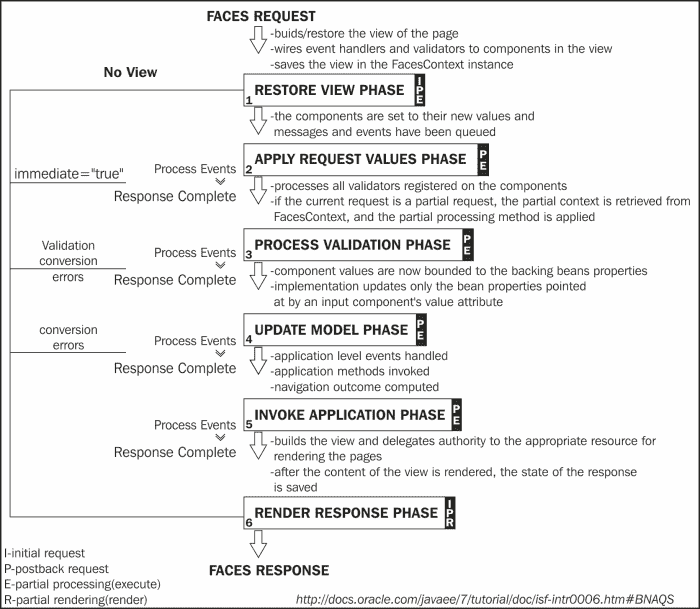

# 附录 A. JSF 生命周期

在 JSF 中，初始请求和回发请求会经过一个 JSF 生命周期。当处理初始请求时，它只执行 *恢复视图* 和 *渲染响应* 阶段，因为没有用户输入或动作需要处理。另一方面，当生命周期处理回发请求时，它会执行所有阶段。

此外，JSF 支持 AJAX 请求。一个 AJAX 请求由两部分组成：部分处理（`execute` 属性）和部分渲染（`render` 属性）。

在下面的图中，您可以查看 JSF 生命周期的不同阶段：

前一个图中的符号 **I**、**P**、**E** 和 **R** 分别代表：

+   **我**：这是为初始请求执行的阶段

+   **P**：这是为回发请求执行的阶段

+   **E**：这是在部分处理时执行的阶段

+   **R**：这是在部分渲染时执行的阶段
