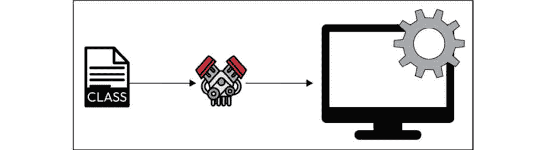
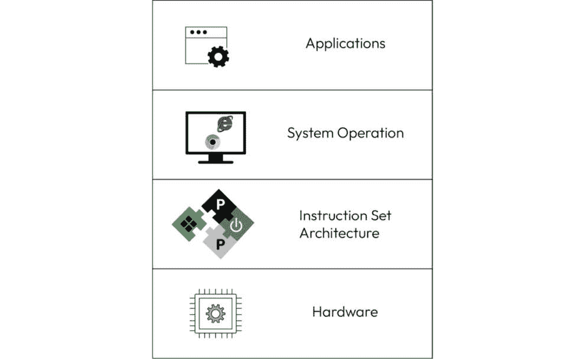
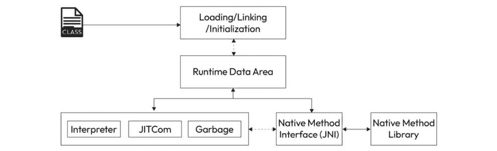

# 4

# 执行引擎

在复杂的 **Java 虚拟机**（**JVM**）的领域中，执行引擎扮演着核心角色，在解释字节码和执行性能优化的 **即时（JIT）编译**中发挥着关键作用。字节码，作为 Java 源代码和 JVM 之间的中介语言，在执行引擎动态将其转换为本地机器码的过程中被解释。JVM 使用的基于栈的执行模型操作一个操作数栈，在解释字节码指令时推入和弹出操作数。尽管字节码解释确保了平台独立性，但由于额外的抽象层，它无法始终提供最佳性能。

为了解决性能挑战，JVM 引入了 JIT 编译。这种战略优化技术识别频繁执行的代码段，或热点，并在运行时动态地将它们编译成本地机器码。通过选择性地优化热点，JVM 平衡了可移植性和性能，显著提高了 Java 应用程序的执行速度。本章深入探讨了字节码解释和 JIT 编译的细微差别，揭示了这些过程如何协同作用，使 JVM 成为 Java 程序的强大且适应性强的运行环境。

在本章中，我们将探讨以下主题：

+   执行的基础

+   系统操作层

+   解码 JVM 执行

+   JIT 编译

+   类加载

# 执行的基础

在我们深入理解将 Java 源代码转换为类文件和字节码的编译过程之后，我们现在关注 JVM 执行的迷人领域。这一关键阶段是魔法发生的地方，因为 JVM 接管了控制权，使我们的 Java 程序得以实现。

当 JVM 接收到包含字节码的编译后的类文件时，执行引擎开始工作。字节码，我们 Java 程序的中介表示，在基于栈的执行模型中被解释。执行引擎动态执行字节码指令，操作操作数栈。这种基于栈的方法允许 JVM 高效地处理指令，将操作数推入和弹出栈。尽管字节码解释确保了平台独立性，但它可能会引入性能考虑，这使我们转向执行旅程中的下一个关键步骤。

当 JVM 程序执行时，几个步骤展开，以使 Java 应用程序得以运行：

+   **加载**：类加载器定位并加载编译后的 Java 类文件（字节码）到 JVM 中。这包括核心 Java 库和任何用户定义的类。

+   **验证**：加载的字节码经过验证过程，以确保其符合 Java 语言规范，防止可能有害的代码被执行。

+   **准备**：为类变量和静态字段分配内存空间，并用默认值初始化它们。

+   **解析**：字节码中的符号引用被解析为具体引用，确保类和方法可以正确链接。

+   **初始化**：执行类的静态块和变量，初始化类以供使用。

+   **执行**：调用 **main()** 方法或指定的入口点，程序开始执行。

在 JVM 中，Java 类文件占据核心地位，一系列复杂的流程展开，为 Java 应用的执行铺平道路。类文件，Java 源代码的编译表示，成为焦点，因为 JVM 的类加载器仔细地定位并加载它到运行环境中。一旦加载，JVM 执行一系列步骤，从验证字节码是否符合语言规范到解析符号引用和初始化类变量。这些步骤的最终结果是转换后的类文件在 JVM 中运行。当 `main()` 方法或指定的入口点被调用时，应用开始其运行时之旅，每一行代码都被动态地解释和执行。类文件、JVM 和运行中的应用之间的协同作用展示了在 JVM 的灵活和自适应环境中执行 Java 程序背后的复杂舞蹈，如下面的图示所示：

图 4.1：在 JVM 中执行类的过程

每次执行 Java 应用时，JVM 都会创建一个独特的运行时环境。然而，需要注意的是，JVM 使用各种技术优化每个运行时的性能。一种值得注意的优化技术是 JIT 编译器。在相同应用的重复执行中，JVM 识别出特定运行时中频繁执行的代码路径，称为热点，并将它们动态编译成本地机器代码。这段编译后的代码存储在同一运行时的内存中，减少了重复解释相同字节码的需要，并显著提高了该特定运行时的执行速度。此外，JVM 实现可能采用缓存机制来存储频繁访问的类和资源，进一步优化每个运行时范围内的应用性能。

总结来说，JVM 在每个运行时优化性能，JIT 编译和缓存机制的好处适用于单个执行实例，确保应用在其特定的运行时环境中高效运行。

尽管有这些优化，但重要的是要注意，当 Java 应用程序停止时，它们会丢失。因此，每次在相同或另一台机器上运行应用程序时，整个优化和编译原生代码的过程都必须再次发生。正在进行的计划，如 Project Leyden ([`openjdk.org/projects/leyden/`](https://openjdk.org/projects/leyden/))，旨在解决这一挑战。Leyden 项目的主要目标是通过让开发者更多地控制应用哪些优化来提高 Java 程序的启动时间、峰值性能时间和整体占用空间。然而，值得注意的是，在项目的当前状态下，这种控制的程度可能有限。

在这个背景下，另一个值得注意的项目是**协调恢复点**（**CRaC**）（[`docs.azul.com/core/crac/crac-introduction`](https://docs.azul.com/core/crac/crac-introduction)），这是一个旨在优化 Java 程序启动时间和资源利用率的 JDK 项目。CRaC 允许您以更短的时间启动 Java 程序，并且需要更少的资源来实现完整的代码速度。它通过在 Java 进程完全预热时对其进行快照（检查点）来实现这一点。然后，它使用该快照从这个捕获的状态启动多个 JVM，利用了原生的 Linux 特性。值得一提的是，像**Open Liberty 的 InstantOn**这样的替代方案也存在，并且两者都是专有技术。此外，CRaC API 被 AWS Lambda SnapStart 使用，展示了这种检查点方法的实际应用。流行的框架，如 Spring、Micronaut 和 Quarkus 也支持 CRaC 检查点，使其成为进一步优化 Java 应用程序性能的有希望的方法。

字节码解释器是 JVM 中的一个关键组件，在执行 Java 程序中起着至关重要的作用。当 Java 应用程序启动时，JVM 加载从先前编译的 Java 源代码生成的字节码，通常打包成一个 JAR 文件。然后，字节码解释器会仔细地逐条解释这些字节码，遵循获取、解码和执行每个指令的逐步过程。

在其核心，字节码解释器遵循平台独立性原则。在配备 JVM 的任何设备上执行相同的字节码，使 Java 应用程序能够在不同的环境中无缝运行，无需修改。这种适应性是 Java 著名的*一次编写，到处运行*哲学的基础，使开发者免于担心底层硬件和操作系统。

在基于栈的模型上操作，解释器通过字节码指令导航，在执行操作时将操作数推入栈中并从中弹出。这种面向栈的方法允许高效的字节码处理，并有助于 Java 应用程序的适应性和快速启动时间。虽然解释代码可能无法与本地编译的对应物相匹配，但字节码解释器通过提供快速启动的敏捷性和定义 Java 在跨平台开发中优势的可移植性来达到平衡。

随着我们从 JVM 的细腻运作过渡到更广阔的视角，我们的旅程现在展开在系统操作的层级之中。系统的基石，硬件层，提供了原始动力，而**指令集架构**（**ISA**）层则是中介语言。在这些之上，操作系统协调资源的和谐，为应用层的光彩夺目铺平道路。当我们探索每一层的意义时，我们揭示了 JVM 如何与硬件协作，通过 ISA 进行通信，与操作系统共舞，并最终在计算交响乐的顶峰展现 Java 应用程序。让我们开始这次层级的探险，以理解系统操作的复杂动态。

# 系统操作层

系统操作层构成了支撑现代计算无缝功能的基本架构。这些层是层级结构，每个层在协调硬件和软件之间的协作中都有其独特的目的。让我们揭示这些层的意义，并理解为什么它们对计算机系统的运行至关重要：

+   **硬件层**：在最低层，硬件层由计算机系统的物理组件组成——处理器、内存、存储设备和输入/输出设备。它为所有更高层次的运作和软件功能提供了基础。

+   **ISA 层**：在硬件层之上是 ISA 层，定义了软件和硬件之间的接口。它包括指令集和架构，这是处理器所理解的。ISA 层充当桥梁，允许软件与底层硬件资源进行通信和利用。

+   **操作系统层**：位于 ISA 层之上，操作系统是应用软件和硬件之间的重要中介。它管理资源，为应用程序提供运行时环境，并促进软件和硬件组件之间的通信。

+   **应用层**：最顶层包括应用软件，这包括旨在满足特定用户需求的程序和工具。这一层与操作系统交互，以高效执行任务并利用硬件资源。

在这个视觉快照中，见证计算层级的分层芭蕾舞。硬件，这个有形的动力源泉，奠定了基础。ISA 层是一个至关重要的桥梁，定义了软件与硬件之间的语言。向上，操作系统扮演着指挥家的角色，协调动态的互动。这张图概括了计算层级的本质，展示了将我们的数字世界带入生机的相互交织的舞蹈：

图 4.2：系统操作层

在复杂的计算编排中，JVM（Java 虚拟机）如同一位优雅的舞者，无缝地连接着系统各层之间的差距。随着我们探索 JVM 与硬件、ISA（指令集架构）和操作系统基础层之间的共生关系，一个引人入胜的故事逐渐展开：

+   **与 ISA 和硬件的交互**：JVM 通过操作系统间接与 ISA 层和硬件交互。它依赖于 ISA 层的指令集来执行字节码，而操作系统代表 JVM 管理硬件资源。

+   **与操作系统的协作**：JVM 与操作系统层紧密合作，利用其服务进行内存管理、文件操作和其他系统相关任务。JVM 抽象了底层硬件和操作系统的差异，为 Java 应用程序提供了一个平台无关的执行环境。

+   **应用程序执行**：JVM 是位于应用程序层内的 Java 应用程序的运行时环境。它解释并执行 Java 字节码，确保 Java 程序能够在各种平台上一致地运行，无需直接关注底层硬件或操作系统的具体细节。

从本质上讲，JVM 作为高级应用程序层与低级系统层之间的重要桥梁，抽象出硬件和操作系统的细节，为 Java 应用程序提供一个标准化和可移植的执行环境。

当我们结束对系统操作层及其复杂舞蹈的探索时，我们发现自己站在一个更深刻的启示的边缘——JVM 细微的执行过程。在此阶段，我们已经了解了抽象、资源管理、互操作性和安全性的重要性，见证了这些支柱如何塑造计算的精髓。我们的旅程推动我们去揭示 JVM 执行之下的层级。请加入我们，在下一节中，我们将深入探讨 JVM 执行的复杂性，解码当 Java 应用程序焕发生机时的魔法。我们探索的连续性承诺将更深入地理解 JVM 与我们所揭示的层级之间的共生关系。

# 解码 JVM 执行

在 JVM 执行的编排中，性能在各个不同的阶段展开，每个阶段都对 Java 应用程序的无缝功能做出贡献。前奏从加载 JVM 开始，其中类加载器勤奋地检索并加载类文件和字节码到内存中，为随后的表演做好准备。

当帷幕升起时，JVM 的执行引擎成为主导，在基于栈的执行模型中动态解释字节码。同时，数据区被细致地初始化，为堆和栈等运行时组件分配内存空间。这场精心编排的舞蹈最终与本地元素集成，无缝地将本地库链接到应用程序的能力中。在下一节中，我们将深入探讨 JVM 执行的复杂性，揭示 Java 应用程序在这个精心调校的交响曲中焕发生命时的魔法。

当 JVM 应用程序执行时，它遵循以下步骤：

1.  前奏从加载 JVM 本身开始。这个关键阶段涉及类加载器定位和加载必要的类文件和字节码到 JVM 内存中。类加载器充当守门人，确保所需的类可供执行。

1.  阶段设定完毕后，JVM 的执行引擎成为焦点。最初，字节码在基于栈的执行模型中解释。随着每条字节码指令的动态执行，应用程序开始成形，JVM 将高级代码转换为可执行指令。

1.  同时，JVM 初始化其数据区，为程序的运行时组件划分内存空间。这包括堆空间，用于分配对象，以及栈空间，用于管理方法调用和局部变量。对数据区的细致组织确保了应用程序生命周期中的高效内存管理。

1.  随着应用程序的加速，JVM 无缝地与本地环境集成。这包括链接本地库并将它们纳入执行。本地集成架起了 Java 与平台特定功能之间的桥梁，增强了应用程序的能力和性能。以下图表显示了该过程的流程：

图 4.3：JVM 执行过程

这个阶段的交响曲封装了 Java 应用程序在 JVM 中的动态执行过程。从初始加载到字节码的解释，对数据区的细致组织，以及与本地元素的完美融合，每个阶段都对 Java 应用程序的和谐性能做出了贡献。在下一节中，我们将深入探讨每个阶段，揭示 JVM 执行的复杂性，并揭开 Java 适应性和跨平台能力的神秘面纱。

在 JVM 执行的复杂交响曲中，我们已经经历了加载、字节码解释、数据区初始化和本地集成等阶段，见证了将 Java 应用带入生命的无缝编排。随着本章的结束，它成为对即将到来的 JIT 编译变革领域的探索的序曲。在下一节中，我们将揭示由 JIT 编译器编排的动态优化，在运行时将字节码转换为本地机器代码，为 Java 应用解锁新的性能维度。随着我们深入探索 JVM 执行的演变交响曲，我们将探讨即时优化和 JIT 编译为 Java 编程世界带来的无与伦比的适应性。加入我们，一起深入了解。

# JIT 编译

JIT 编译是 JVM 的一个关键组件，彻底改变了 Java 应用的执行方式。与传统的前置编译（**AOT**）不同，前置编译是在执行之前将整个代码转换为机器代码，而 JIT 编译是在运行时动态发生的。这种即时转换在执行前将 Java 字节码转换为本地机器代码，优化了性能和适应性，考虑了代码中使用最多且需要优化的部分。这种动态优化过程确保 JVM 专注于代码中最频繁执行的部分，有效地提高了性能和适应性，以适应特定的运行时条件。

JVM 中 JIT 编译的采用源于追求便携性和性能之间的平衡。通过最初解释字节码，然后选择性地将频繁执行的代码路径编译成本地机器代码，JVM 利用了解释和编译方法的优势。这种方法允许 Java 应用保持平台独立性，同时实现与本地编译语言相当的性能。

在 JVM 执行的复杂织锦中，JIT 编译的层级在平衡适应性和性能方面发挥着关键作用。让我们深入了解这些级别，了解它们为什么存在以及它们如何共同增强 Java 应用的执行。

多个即时编译级别的存在使得 JVM 能够在解释的优势和本地机器代码的性能优势之间取得微妙的平衡。解释器提供了灵活性和平台独立性，而 JIT 编译器则优化热点，确保 Java 应用能够动态适应其执行环境。这种自适应编译方法对于在不牺牲 Java 的跨平台性质的情况下实现高性能结果至关重要。在接下来的部分，我们将剖析 JIT 编译的内部工作原理，揭示这些级别如何协作以增强 Java 运行时环境：

+   **解释器级别**: 在解释器级别，JVM 使用解释器动态执行 Java 字节码。这个解释器是平台无关的字节码和底层硬件之间的初始桥梁。当 Java 程序执行时，解释器逐个读取字节码指令，并即时将它们翻译成机器码。虽然这种方法提供了快速启动和平台无关性等优势，但解释过程引入了固有的开销，这可能会影响执行速度。

    解释器本质上是一个快速的执行器，使得 Java 应用程序能够在任何平台上运行，而无需预编译的本地代码。然而，由于执行过程中实时将字节码翻译成机器码，整体性能可能不如预期优化。这就是后续的即时编译级别发挥作用的地方，旨在通过选择性地翻译和优化频繁执行的代码路径（称为热点），将其转换为本地机器代码来提升性能。因此，解释器级别在敏捷性和适应性之间提供了平衡，为更高级的即时编译阶段奠定了基础。

+   **基线即时编译**: 基线即时编译是 JVM 内动态编译过程中的下一级。在字节码的初始解释之后，JVM 识别出频繁执行的特定代码段，称为热点。这些热点是进一步优化以提升整体性能的候选者。这就是基线即时编译器介入的地方。

    在基线即时编译阶段，编译器采用选择性编译，针对已识别的热点而不是整个程序。专注于代码的频繁执行部分，在执行前将其转换为本地机器代码。强调快速编译以实现即时的性能提升，基线即时编译器使用简单且快速的翻译技术，显著优于重复的解释。动态适应是关键，因为编译器持续监控应用程序的执行，识别并选择性地编译热点。这种敏捷的响应确保优化努力集中在最有影响力的区域，与不断演变的运行时行为相一致，并优化即时性能提升。

+   **动态适应**: 基线即时编译中的动态适应指的是编译器对 Java 应用程序运行时行为的演变所做出的敏捷响应。持续监控执行过程，编译器识别出频繁执行的代码段或热点，并将它们选择性地编译成本地机器代码。这种自适应策略确保基线即时编译器将优化努力集中在最有影响力的区域，以实现即时的性能提升。

    动态适应的重要性在于其平衡快速编译和有效性能提升的能力。通过根据运行时行为调整其方法，编译器能够对工作负载的变化做出响应，优化其策略以匹配 Java 程序不断变化的执行模式。它确保基线 JIT 编译（也称为 C1 编译器）保持动态和有效，实时优化在多样化动态工作负载中导航的 Java 应用程序。

    显然，这种动态适应是 AOT 编译代码的主要区别。此类代码总是以相同的方式工作，并且无法适应“当天的用例”，这是 JIT 编译器完美处理的。JIT 编译器根据运行时行为调整其优化策略的能力，使其成为在广泛场景中最大化 Java 应用程序性能的强大工具。

在我们探索 JIT 编译的总结中，我们已经见证了它在动态优化 Java 字节码以提升性能方面的变革力量。从解释器的快速适应性到基线 JIT 编译器的选择性编译能力，JIT 的复杂舞蹈已经展开。随着我们关闭这一章节的帷幕，舞台已经准备好揭示更深层次的奥秘——类加载在 Java 运行时动态中的作用。请加入我们下一部分的内容，我们将揭开类加载的微妙之处，探索如何将类动态加载到 JVM 中成为 Java 可扩展性和动态特性的基石。我们旅程的连续性承诺了一个从 JIT 动态编译编排到类加载幕后奇迹的顺畅过渡。

# 类加载

在这个启发性的部分，我们深入探讨了类加载的复杂世界，这是 Java 动态和可扩展特性的基石。随着我们揭开动态类加载背后的机制，我们将了解 Java 应用程序如何在运行时适应和扩展其功能。我们将探索`ClassLoader`，这位默默无闻的英雄，负责将 Java 类动态加载到 JVM 中。深入了解类加载器层次结构的微妙之处，理解不同的类加载器如何协作构建 Java 应用程序丰富多彩的画卷。从系统类加载器到自定义类加载器，我们将遍历支撑 Java 动态引入新类和扩展其功能的基础层。准备开始一段探索 Java 运行时动态核心的旅程，在这里，类加载的魔法得以展开。

Java 中的类加载领域由两个不同的实体界定：引导类加载器，它是 JVM 的一个组成部分，以及用户定义的类加载器。每个用户定义的类加载器都是`ClassLoader`抽象类的子类的实例化，它使应用程序能够自定义 JVM 动态生成类的方式。这些用户定义的类加载器作为扩展 JVM 创建类的传统手段的渠道，允许将来自典型类路径之外的来源的类纳入其中。

当 JVM 将定位名为*N*的类或接口的二进制表示的任务委托给一个名为 L 的类加载器时，它启动了一个动态过程。类加载器*L*在收到这个请求后，加载与*N*关联的指定的类或接口*C*。这种加载可以直接进行，L 获取二进制表示并指示 JVM 从它实例化*C*。或者，*L*可以选择一种间接加载方法，将任务推迟给另一个类加载器。这种间接加载可能涉及委托的类加载器直接加载*C*，或者使用更进一步的委托层，直到*C*最终被加载。这种灵活性使得 Java 应用程序能够无缝地集成来自不同来源的类，包括通过网络获取的、即时生成的或从加密文件中提取的。因此，用户定义的类加载器的动态特性在塑造 Java 应用程序的可扩展性和适应性方面发挥着关键作用。

理解类加载和创建对于 Java 的可适应性至关重要，它促进了在运行时动态添加类。使用引导类加载器，JVM 检查它是否以前记录了这个加载器作为给定类或接口的启动者。如果已记录，则过程结束，并且已识别的类或接口存在。如果没有，引导类加载器找到一个表示，指示 JVM 从它派生类，然后创建它。

用户定义的类加载器给这个过程引入了一个动态层。JVM 检查用户定义的类加载器是否被记录为已识别的类或接口的启动者。如果已记录并且类或接口存在，则不采取任何进一步行动。否则，JVM 调用类加载器的`loadClass`方法，指示它直接从获取的字节加载和创建类或接口，或者将加载过程委托给另一个类加载器。

类加载和创建的动态性，无论是通过引导类加载器还是用户定义的类加载器，赋予了 Java 应用程序无与伦比的灵活性。这种适应性允许从各种来源集成类，有助于定义 Java 编程语言的扩展性和动态性。我们对类加载的探索构成了理解 Java 在运行时无缝适应和演变的基础，为 Java 运行环境复杂交响乐中的进一步揭示奠定了基础。

# 摘要

在我们探索 JVM 中字节码解释和执行的复杂领域之后，我们发现自己站在一个深刻的交响乐——内存编排的门口。字节码解释器，作为其自身的指挥，为下一章设定了节奏，我们将揭示 JVM 内存管理的细微差别。

在前面的章节中，我们解读了字节码的旅程，其解释以及赋予 Java 应用程序生命力的动态适应。现在，我们的旅程推动我们深入 JVM 内部工作的核心——内存编排。加入我们，在下一章中我们将探讨 JVM 如何分配、利用和释放内存，揭示确保最佳性能和资源效率的艺术。我们探索的连续性承诺对字节码执行与 JVM 内存内精细芭蕾之间的共生关系的更深入理解。

# 问题

回答以下问题以测试你对本章知识的了解：

1.  JVM 中字节码解释器的目的是什么？

    1.  静态代码分析

    1.  动态代码执行

    1.  内存分配

    1.  平台特定的编译

1.  在基线 JIT 编译的背景下，“hotspot”这个术语指的是什么？

    1.  很少执行的代码段

    1.  频繁执行的代码段

    1.  编译错误

    1.  解释型字节码

1.  字节码解释器如何有助于 Java 平台的独立性？

    1.  它执行静态分析

    1.  它在运行时解释字节码

    1.  它依赖于平台特定的编译

    1.  它只在某些操作系统上工作

1.  基线 JIT 编译器在 JVM 优化中的主要角色是什么？

    1.  对所有代码段进行快速编译

    1.  对代码行为的深入分析

    1.  字节码的静态转换

    1.  对频繁执行的代码进行选择性编译

1.  动态适应如何有助于基线 JIT 编译的有效性？

    1.  通过忽略运行时行为

    1.  通过一次性编译整个程序

    1.  通过适应工作负载的变化

    1.  通过优先处理很少执行的代码

# 答案

这里是本章问题的答案：

1.  B. 动态代码执行

1.  B. 频繁执行的代码段

1.  B. 它在运行时解释字节码

1.  D. 对频繁执行的代码进行选择性编译

1.  C. 通过适应工作负载的变化
