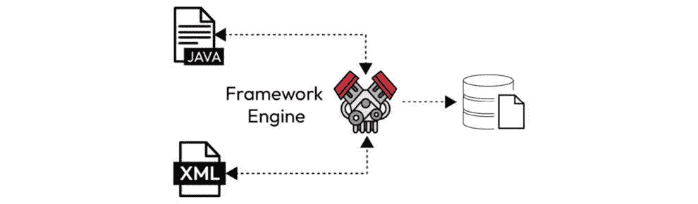

# 9

# Java 框架原则

在复杂的 Java 虚拟机（**JVM**）内部结构中，Java 框架的开发和使用是构建稳健和可扩展应用程序的基石。本章深入探讨了支撑构建 Java 框架艺术的基本原则，全面探索了其中涉及的复杂性。随着架构师和开发者导航软件设计的动态领域，理解框架开发中固有的权衡变得至关重要。本章阐明了框架设计中的关键考虑因素，并揭示了灵活性和性能之间的微妙平衡。通过深入分析和实践例子的结合，读者将深刻理解塑造 Java 框架架构的决定，使他们能够在软件项目中做出明智的选择。

在软件开发中，框架是一个基础结构，它提供了预定义的组件、工具和设计模式，以简化应用程序的开发。Java 中的例子包括 Spring 框架、Hibernate 数据库交互、Struts 网络应用、**JavaServer Faces**（**JSF**）用户界面和 Apache Wicket 网络应用。框架简化了开发，鼓励代码重用，并维护最佳实践。

本探索的关键方面在于检查 Java 框架生态系统中的元数据和注解。这些元素增强了代码的表达性，使开发者能够封装和传达有关类、方法和其他组件的至关重要的信息。通过揭示元数据和注解的复杂性，本章为读者提供了利用这些工具的全面知识，以构建灵活和可扩展的框架。无论是揭示反射的奥秘还是利用注解进行配置和扩展点，本章引导读者在 Java 框架原则的微妙领域中导航。通过理论洞察和实践例子的结合，读者将开始一段揭示框架开发复杂性的旅程，使他们能够在 JVM 内部结构的坚实基础上构建复杂的解决方案。

在本章中，我们将探讨以下主题：

+   我们为什么需要框架？

+   Java 元数据

+   框架采用中的权衡

+   Java 框架原则

# 我们为什么需要框架？

我们将探讨 Java 框架在软件开发中普遍存在和演变的潜在原因。采用框架与既定的软件开发实践无缝对接，它自然地作为对效率、可靠性和可扩展性永恒追求的回应而出现。面对构建复杂和功能丰富的应用程序的挑战，开发者发现框架是一个战略盟友，它提供了一个结构化和标准化的基础，促进了组件的重用和简化了开发流程。

框架广泛使用背后的关键动机是它们能够解决与冗余代码和重复错误相关的挑战。通过封装最佳实践、设计模式和常见功能，框架使开发者能够专注于其应用程序的独特方面，从而提高代码效率并降低错误发生的可能性。它加速了开发周期，并提高了软件产品的整体质量。随着项目的成熟，利用框架的累积影响变得越来越明显，加速了从概念化到部署的过程。

此外，这些可重用组件的演变催生了一个繁荣的基于框架的商业市场。通过认识到简化开发实践的内生价值，公司积极投资并采用 Java 框架来催化他们的软件开发流程。这些框架提高了生产力，并有助于创建强大、可维护和可扩展的应用程序。

在面向商业的软件开发中，可重用组件的概念具有双重意义，既体现在组织内部，也体现在不同公司之间。内部，组织利用内部源力量，营造一个可重用组件得以培养和在不同团队间共享的环境。这种协作方法增强了代码的可重用性，加速了开发周期，并在组织内部培育了知识交流的文化。

同时，Java 框架的更广泛领域超越了组织边界，提供了超越公司特定需求的功能。Java 是集成的关键，无缝地将不同的组件和技术编织在一起。无论是数据库集成、处理 HTTP 请求、实现缓存机制还是促进分布式可观察性，Java 框架已成为确保许多系统之间互操作性和效率不可或缺的工具。

在这个生态系统中，Java 的独特之处在于其多功能性和围绕它的强大开源社区。无数的开源产品和专有解决方案共同构成了一个丰富的工具织锦，帮助软件工程师在他们的开发旅程中。例如，广泛采用的数据库如 MySQL 和 PostgreSQL 可以无缝集成到 Java 应用程序中，确保高效的数据管理。高级缓存解决方案如 Ehcache 通过优化数据检索来提高应用程序性能。分布式可观察性平台如 Prometheus 和 Jaeger 也使开发者能够有效地监控和调试应用程序。这些工具共同构成了 Java 在企业级集成中的强大支柱，使开发者能够快速构建可扩展和高效的解决方案。

可用于 Java 的众多框架，涵盖了数据库集成、HTTP 请求、缓存和分布式可观察性，强调了其在应对各种商业挑战中的适应性和弹性。这种开源和专有工具的结合是软件开发景观协作性质的证明，共享资源和框架加速了创新，并赋予了软件工程师在复杂、互联系统中导航的能力。

随着我们对面向商业软件开发中 Java 框架广阔领域的探索结束，这些工具不仅仅是编码便利，而是推动效率、可靠性和可扩展性的战略资产。可重用组件的双重特性，通过内部源实践在组织边界内蓬勃发展，并通过多才多艺的 Java 框架跨越公司，突显了现代软件工程的动态和协作精神。

在下一节中，我们将深入探讨 Java 中元数据的至关重要领域，这是增强代码表达性和功能性的基石。理解元数据和注解在 Java 框架中的运作对于导航这些工具的复杂架构至关重要。我们将揭示元数据中封装的信息层，探索其在塑造灵活和可扩展框架中的作用。随着我们踏上探索元数据微妙世界的旅程，我们将理论与实践应用在 Java 丰富框架生态系统中的差距连接起来。

# Java 元数据

在 Java 编程的动态环境中，元数据作为一种强大的工具悄然出现，在幕后默默工作，连接着不同的范式，简化了现代软件开发中定义的转换过程。但为什么 Java 中有元数据，它在简化复杂任务中扮演什么角色，尤其是在转换或映射操作等场景中？

在 Java 中，元数据是其核心，是一个关键的促进者，极大地简化了诸如将 Java 实体转换为 XML 文件或数据库等过程的复杂性。其本质在于其降低不同范式之间阻抗的能力，尤其是在导航关系数据库和 Java 对象之间细微空间时的能力。

考虑这样一个场景，Java 遵循其驼峰命名法（例如，`clientId`）与遵循蛇形命名法（例如，`client_id`）的关系数据库协作。这种命名规范的错位可能带来挑战，造成两种范式之间的脱节。这时，元数据——这位默默的英雄，使得 Java 类与数据库之间的无缝通信和关系构建成为可能。通过封装关于数据结构、属性和关系的基本信息，元数据成为协调这些不同世界语法和语义的纽带。

元数据的战略使用不仅仅是一个简单的权宜之计；它是一种旨在提高互操作性、减少开发摩擦并维护软件工程最佳实践的刻意方法。加入我们，我们将揭示 Java 中的元数据层，探索这些无声的促进者在缩小范式之间的距离和促进更紧密、更高效的开发体验方面发挥的关键作用。从关系数据库到 Java 对象，我们将揭示元数据确保数据转换和映射的复杂舞蹈在现代软件开发复杂编排中无缝展开的机制。

欣赏 Java 文件与关系数据库之间的协同作用，由一位无声的影响者——元数据——和谐统一。这个视觉快照捕捉了由元数据促进的无缝通信，超越了 Java 的驼峰命名法和数据库的蛇形命名法之间的命名规范差异。在数据转换和映射的复杂舞蹈中，元数据成为看不见的指挥者，降低阻抗并促进互操作性。此图封装了元数据的关键作用，将潜在的摩擦转化为创建强大和适应性软件解决方案的基础上的流畅交换：


图 9.1：Java 应用程序使用元数据与数据库进行通信

在继续探索 Java 元数据历史的过程中，早期的元数据管理努力依赖于 XML，这在`Person`实体中得到了显著体现，例如，在 Java 代码中定义的实体，接下来的步骤涉及创建一个 XML 文件来阐述这个 Java 类与相应的数据库映射语句之间的复杂关系。这个在运行时动态解释的 XML 文件扮演了双重角色——不仅作为`Person`类与数据库之间关联的蓝图，还作为生成实时元数据的渠道。提供的 XML 片段说明了这个关键链接，概述了属性、表及其相应的映射，标志着 Java 元数据处理能力演变中的一个重要章节。

提供的 Java 代码定义了一个具有三个私有字段`id`、`name`和`age`的`Person`类。该类封装了与个人相关的数据，并为每个属性提供了必要的 getter 和 setter 方法。目的是在 Java 应用程序中以可识别的特征来表示一个人：

```java
public class Person {  private String id;
  private String name;
  private Integer age;
  //getter and setter
}
Person class and its representation in a relational database. The <entity> element denotes the mapping for the Person class, specifying its Java class and name. The <table> element defines the table name in the database associated with this entity:
```

```java
<entity class="entity.Person" name="Person">     <table name="Person"/>
     <attributes>
         <id name="id"/>
         <basic name="name">
             <column name="NAME" length="100"/>
         </basic>
         <basic name="age"/>
     </attributes>
</entity>
```

在`<attributes>`部分，XML 定义了`Person`类的单个属性。`<id>`元素表示主键属性，指定了相应的字段（`id`）。此外，两个`<basic>`元素分别用于`name`和`age`属性，表示简单、非组合属性。嵌套在`name`属性中的`<column>`元素提供了数据库映射的进一步细节，指定了列名（`NAME`）及其最大长度。

此 XML 元数据是一个配置蓝图，建立了 Java 对象与其数据库表示之间的关系。它不仅定义了`Person`类的结构和特征，还指导了元数据的运行时生成，促进了 Java 应用程序与底层数据库之间的无缝交互。这种强大的连接是 Java 元数据处理能力的基本方面，有助于提高 Java 应用程序中数据管理的效率和一致性。

框架如 Spring 和 Jakarta EE 提供了一种更以代码为中心的方法来定义元数据。例如，`@Entity`、`@Table(name = "tutorial")`和`@Column(name = "title")`这样的注解可以作为 XML 配置文件的简化替代方案。以下是一个使用注解的代码示例：

```java
@Entity@Table(name = "tutorial")
public class Tutorial {
    @Id
    @GeneratedValue(strategy = GenerationType.IDENTITY)
    @Column(name = "tutorial_id")
    private Long id;
    @Column(name = "title")
    private String title;
    // Constructors, getters, and setters
}
```

相反，在基于 XML 的配置中，相同的元数据可以定义如下：

```java
<entity class="com.example.Tutorial">    <table name="tutorial"/>
    <attributes>
        <id name="id">
            <generated-value strategy="IDENTITY"/>
            <column name="tutorial_id"/>
        </id>
        <basic name="title">
            <column name="title"/>
        </basic>
    </attributes>
</entity>
```

这两种方法都达到了相同的结果，注解提供了一种更简洁、更以代码为中心的方式来指定元数据，而 XML 则提供了更外部化和可定制的配置选项。

步入无缝数据库集成的视觉叙事，其中 Java 文件与 XML 配置文件之间的协同作用展现得非常紧密。这个引人入胜的图表捕捉了集成过程中的复杂舞蹈，展示了一个代表`Person`类的 Java 文件与为 JPA 制作的 XML 文件无缝和谐地结合。当框架结合这两个实体，Java 和 XML 时，一种共生关系出现，为将数据流线化集成到数据库铺平了道路。这种视觉描述封装了如何通过精心协调 Java 代码和 XML 元数据，框架促进应用程序逻辑与数据库结构之间的无缝桥梁。这是代码和配置之间动态互动的引人注目快照，展示了 Java 框架在编排协调和高效数据库集成方面的强大能力：



图 9.2：Java 应用程序使用元数据与数据库通信

Java 语言及其生态系统的演变向开发者揭示了将生成的元数据与代码分开维护，如传统上使用 XML 文件所做的那样，在直观性和维护的复杂性方面带来了挑战——更新一个字段需要在 Java 类和相应的数据库配置中进行更改，从而导致潜在的不一致和低效。

为了增强开发者的体验并简化这一过程，Java 5 在 2004 年中期推出，通过**Java 规范请求**（**JSR**）*175*引入了 Java 的元数据功能，亲切地称为**Java 注解**。这一创新消除了需要单独配置文件的需求，提供了一个统一解决方案，其中所有必要信息都可以存储在 Java 类中。它简化了开发工作流程，显著提高了代码和相关元数据的可维护性，标志着 Java 元数据处理能力演变中的一个转折点。

在 Java 注解中，开发者可以在两个不同的阶段读取和处理注解：在运行时动态地使用反射，或在构建时利用专用工具，如 Java 注解处理器。

运行时方法，利用反射，涉及在程序执行过程中检查和解释注解。这种方法允许根据代码中注解的存在或值进行动态决策。然而，它带来了运行时性能开销，因为注解在程序执行期间被检查。

另一方面，编译时方法利用注解处理器，这些工具在编译阶段运行。注解处理器在编译实际发生之前分析和操作源代码中的注解元素。这种方法对于在编译时确定的任务有益，如代码生成、验证或资源准备。它具有在开发早期捕捉潜在问题的优势，并有助于更高效和优化的代码。

最终，运行时反射与编译时注解处理的抉择取决于手头任务的特定要求。运行时反射适用于在程序执行期间必须动态做出决策的场景。同时，编译时处理对于可以在编译时解决的问题更为可取，这促进了效率和早期错误检测。

总之，Java 中元数据处理的发展，从基于 XML 的配置过渡到创新的 Java 注解领域，标志着软件开发的一个转型阶段。通过 JSR *175* 引入 Java 生态系统中的注解，简化了元数据与代码的集成，并显著提高了可维护性。在我们探索 Java 注解的领域时，我们发现自己站在一个十字路口，在这里，运行时反射与编译时注解处理之间的选择带来了不同的权衡。潜在的性能影响与运行时反射的动态适应性相平衡，而编译时处理的效率则以静态决策为代价。请加入我们，在下一节中，我们将深入探讨 Java 开发中权衡的微妙世界，探讨在做出关键架构决策时，在灵活性和性能之间保持微妙的平衡。

# 框架采用的权衡

随着开发者进入软件架构领域，决定采用框架引入了许多考虑因素，每个因素都充满了权衡，这些权衡深刻地影响着开发过程。无论是 Java 还是任何其他语言，采用框架都意味着在它提供的便利性和可能带来的潜在缺点之间进行微妙的平衡。

一个关键的权衡在于，由框架带来的快速开发吸引力与它们强加的约束之间的权衡。框架通常可以加速编码过程，提供预构建的组件和既定规范。然而，这种加速可能会以灵活性的代价为代价，因为开发者可能会发现自己被框架规定的结构和范式所限制。

此外，权衡还扩展到采用新框架的学习曲线。虽然框架旨在简化开发，但开发者要成为熟练的专家需要投入时间和精力。这个初始的学习阶段可能被视为一个障碍，尤其是在快速发展的开发环境中。

在本节中，我们将剖析这些权衡，并探讨开发者采用框架时所面临的微妙决策。从加速开发的承诺到潜在的约束和学习曲线，理解所涉及的复杂权衡对于做出明智的架构选择至关重要。请加入我们，我们将探讨在动态的软件开发环境中采用框架的便利性和约束之间的微妙平衡。

在软件开发中，选择采用现有框架还是创建自定义框架构成了一个重大的权衡，每条路径都充满了其考虑因素。选择市场上成熟的框架可以带来即时的优势，例如经过验证的可靠性、社区支持，以及通常丰富的预构建组件。这加速了开发过程，减少了重新发明轮子的需求，并利用了用户社区的集体知识。然而，这里的权衡在于可能需要更多的定制化，以及被所选框架中嵌入的设计选择和观点所限制的风险。

相反，创建自定义框架提供了根据项目独特需求定制解决方案的自由。这种方法提供了无与伦比的灵活性，允许开发者创建一个与项目目标和架构完美契合的框架。然而，这种自由是有代价的——设计、实施和维护定制框架所需的时间和资源投入。此外，缺乏经过验证的记录可能导致不可预见的问题和需要广泛的测试和改进。考虑是否创建*另一个框架*与项目的具体需求和目标相符是至关重要的。虽然它可以在定制方面提供好处，但应该是一个经过深思熟虑的决定，以避免不必要的复杂性和碎片化。

最终，权衡涉及权衡现有框架的即时利益和便利性与创建自定义解决方案的长期优势及潜在陷阱。决策取决于项目需求、时间表、团队的专业知识和软件演变的战略愿景。在利用现有解决方案和定制框架之间取得正确的平衡是一个微妙但至关重要的决策，在软件开发的动态环境中尤为重要。

在软件开发中采用现有框架和创建自定义框架之间的权衡引入了一个关键决策过程。虽然成熟的框架提供了即时的好处和社区支持，但它们可能会限制灵活性。相反，定制框架提供了定制的解决方案，但需要大量的时间和资源。随着我们过渡到下一节“Java 框架原则”，我们将深入了解指导框架设计和开发的基础原则。认识到这些原则如何塑造在利用现有解决方案和定制框架之间进行复杂选择是导航软件开发动态景观的关键。加入我们，我们将揭示支撑有效框架的原则，并阐明它们对开发者决策中固有的权衡的影响。

# Java 框架原则

对于 Java 框架开发中的架构师和开发者来说，对关键原则的细微理解至关重要。首先需要考虑的关键方面是 API 设计，它显著影响了框架的可使用性和采用度。在声明式和命令式 API 设计之间进行选择是至关重要的。声明式 API 强调表达期望的结果，促进可读性和简洁性，而命令式 API 提供了一种逐步的方法，提供了更明确的控制。在这两种方法之间取得正确的平衡对于确保不仅易于使用，而且框架的长期可维护性至关重要。

另一个关键原则是可执行性，其中对反射的仔细考虑变得至关重要。反射可以提供动态能力，允许在运行时检查和操作类、方法和字段。然而，这种灵活性伴随着性能成本。另一方面，框架可以选择避免反射的解决方案，从而在 JVM 内提高效率。此外，允许在 JVM 之外执行 Java 代码的技术，如构建原生镜像，为可执行性原则带来了新的维度。导航这些选择需要理解灵活性、性能和资源效率之间的权衡。

API 设计是 Java 框架开发的一个关键方面，为开发者提供了两种基本风格的选项：声明式和命令式。每种方法都有其权衡之处，而选择它们取决于诸如可读性、表达性和开发者期望的控制水平等因素。

声明式 API 强调表达期望的结果或最终状态，允许开发者指定他们想要实现的目标，而不必规定逐步的过程。这种风格促进了简洁和表达性的代码，使其更易于阅读和理解。在关注高级抽象和需要更直观、类似自然语言的语法来增强代码理解的场景中，声明式 API 特别有益。

另一方面，命令式 API 采用更逐步或程序化的方法，要求开发者明确地定义每个动作和控制流程。虽然这种风格提供了更细粒度的控制，但可能会导致代码更加冗长和模板化。当需要精确控制执行流程时，命令式 API 表现出色，尤其是在开发者需要管理复杂细节或处理复杂的分支逻辑时。

声明式和命令式 API 设计之间的权衡通常关注表达性和控制之间的平衡。声明式 API 因其可读性和简洁性而受到青睐，增强了协作并减轻了开发者的认知负担。然而，它们可能不适合需要细粒度控制的场景。相比之下，命令式 API 提供了更明确的控制，但可能冗长，可能需要更深入地理解底层逻辑。

在选择声明式和命令式 API 设计之间应该根据框架的具体需求和开发团队的首选来决定。找到正确的平衡至关重要，在许多情况下，结合两种风格元素的综合方法可能提供最佳效果，在需要的地方提供表达性和控制。

Java 框架的可执行性包括框架代码在 JVM 中执行时的机制。这一方面涉及到关键的权衡，尤其是在考虑使用反射、避免反射以及探索构建原生图像等选项时。

反射是 Java 中的一个动态特性，允许在运行时检查和操作类、方法和字段。虽然功能强大，但反射伴随着性能成本，由于其动态性质，通常会导致执行时间变慢。此外，反射可能会降低代码的安全性，因为错误可能只有在运行时才会被发现。这里的权衡涉及反射提供的灵活性和便利性与潜在的性能缺点和错误检测的延迟性之间的权衡。

框架可以选择避免反射的方法，依靠更多静态和编译时机制。这促进了性能的提升和早期错误检测，但可能需要更多的显式配置和代码生成。是否放弃反射的决定通常取决于框架的具体需求、期望的性能水平以及动态性和静态分析之间的权衡。

在最近的发展中，构建原生图像的概念已经获得了关注。例如，GraalVM 等技术能够将 Java 代码编译成原生机器代码，绕过了执行时对 JVM 的需求。这种方法在启动时间、减少内存占用和提升整体性能方面提供了潜在的好处。然而，它也引入了与增加构建复杂性、潜在的兼容性问题以及失去 JVM 提供的某些运行时功能相关的权衡。

最终，可执行策略的选择需要对框架的具体要求、性能目标以及灵活性、便利性与反射或原生图像编译相关的开销之间的权衡进行仔细考虑。在保持框架所需动态性和开发便利性的同时，实现最佳性能的平衡至关重要。

的确，在 Java 框架原则和更广泛的软件开发领域，几个基本原则对框架的设计和可用性产生了重大影响。**约定优于配置**是一个关键原则，强调默认约定，当开发者遵循既定模式时，减少了对显式配置的需求。它简化了框架的使用，使其更加直观和用户友好。

组件的创建遵循模块化原则，鼓励开发独立的、可重用的单元，有助于维护性和可扩展性。遵循 Java 标准，如编码规范和设计模式，确保在 Java 生态系统中的一致性和互操作性。

文档和测试在框架的成功中扮演着不可或缺的角色。全面且结构良好的文档使用户能够理解框架的功能，有助于其采用并降低学习曲线。彻底的测试确保了框架的可靠性和健壮性，增强了开发者对框架的信心。

此外，**服务提供者（SP）**方法引入了一种类似插件的架构，允许开发者无缝地扩展或修改框架的行为。这一原则促进了**即插即用（PnP）**效应，使用户能够在不改变其核心代码库的情况下，集成额外的功能或自定义框架。

总体而言，这些原则共同促成了 Java 生态系统中有效且用户友好的框架的创建。它们强调惯例、模块化、遵循标准、稳健的文档、严格的测试以及通过 SPs 的可扩展性，培养了一种全面的框架设计和开发方法。接受这些原则确保框架不仅满足开发者的当前需求，而且在软件开发的动态世界中作为可靠和适应性的工具经受住时间的考验。

# 摘要

在我们探索 Java 框架原则和更广泛的软件开发原则的过程中，我们揭示了一系列考虑因素——从 API 设计和可执行性到契约优于配置以及文档和测试的重要性。这些原则共同指导着创建稳健、用户友好的框架，这些框架与 Java 标准保持一致并拥抱模块化。随着我们过渡到下一章，专注于 Java 反射，我们深入探讨了可执行性的关键方面，揭示了 Java 反射本质中固有的动态能力和潜在权衡。加入我们的探索，我们将导航反射的复杂性，解锁其力量并了解它是如何塑造动态 Java 编程领域的。 

# 问题

回答以下问题以测试你对本章知识的掌握：

1.  在 Java 框架中决定采用声明式 API 设计还是命令式 API 设计时，一个关键考虑因素是什么？

    1.  代码冗余

    1.  编译速度

    1.  内存消耗

    1.  数据库兼容性

1.  哪个原则强调通过依赖既定模式和默认值来减少显式配置的需求？

    1.  并发控制

    1.  契约优于配置

    1.  **依赖注入**（**DI**）

    1.  模块化

1.  为什么全面文档对于一个 Java 框架至关重要？

    1.  为了增加开发复杂性

    1.  为了阻止用户采用该框架

    1.  为了降低用户的学习曲线

    1.  为了限制框架的功能

1.  哪种方法能够实现类似插件式的架构，允许开发者无缝地扩展或修改框架的行为？

    1.  **面向方面**的**编程**（**AOP**）

    1.  **模型-视图-控制器**（**MVC**）

    1.  观察者模式

    1.  SP 方法

# 答案

下面是本章问题的答案：

1.  A. 代码冗余

1.  B. 契约优于配置

1.  C. 为了降低用户的学习曲线

1.  D. SP 方法
