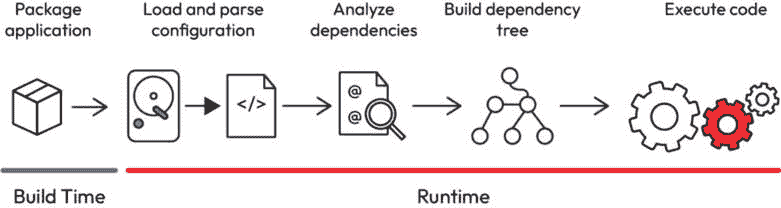

# 10

# 反射

反射 API 是一个强大且多功能的工具，使开发者能够访问 Java 程序的内幕。在本章中，我们将探讨反射的各种功能，如字段访问、方法调用和代理使用。反射允许开发者检查和操作运行时的类和对象，为 JVM 内部提供了动态的入口。在本章中，我们将深入研究反射字段的微妙交互、动态调用方法的复杂性以及代理的战略部署以增强代码的灵活性。让我们一起探索 Java 反射能力的核心，在这里，看似不可改变的事物变得可适应，静态代码的边界被拉伸以适应高级应用程序的动态需求。

在本章中，我们将探讨以下主题：

+   反射概述

+   探索实用的反射

+   代理

# 技术要求

要跟随本章内容，你需要以下要求：

+   Java 21

+   Git

+   Maven

+   任何首选的 IDE

+   本章的 GitHub 仓库位于[`github.com/PacktPublishing/Mastering-the-Java-Virtual-Machine/tree/main/chapter-10`](https://github.com/PacktPublishing/Mastering-the-Java-Virtual-Machine/tree/main/chapter-10)

# 反射概述

反射，Java 编程语言的基本特性，赋予开发者检查和操作类和对象的结构、行为和元数据的能力。这种动态能力可能会打开潘多拉的盒子，让程序员超越静态代码的局限，并响应应用程序不断变化的需求。为什么反射对 Java 开发如此关键？

在 Java 中，反射在实际场景中有着广泛的应用，如框架和库的开发，使开发者能够创建灵活和可扩展的代码。它在**依赖注入**（**DI**）、**对象关系映射**（**ORM**）框架和测试框架中发挥着关键作用，实现了动态类实例化和配置。反射在序列化和反序列化库、GUI 开发工具和 Java 的核心库中也至关重要，有助于动态加载和操作对象和类。虽然它可能不是大多数开发者的日常工具，但反射在特定领域增强了代码的可重用性和适应性，使其成为 Java 生态系统中的宝贵资产。

在其核心，反射在实现内省方面发挥着关键作用，使程序能够检查和适应其结构。当处理必须通用和灵活地操作的框架、库和工具时，它变得特别有价值，这些工具可以动态地适应各种类型和结构。反射促进了类信息、方法签名和字段细节的检索，为那些在运行时对代码库有深入理解至关重要的场景提供了必要的动态性。

此外，反射促进了诸如集成开发环境（IDEs）、调试器和应用程序服务器等工具的发展，为它们提供了分析和操作 Java 代码的手段，这种手段超越了编译时知识的限制。通过提供对类信息的程序化接口并促进动态实例化，反射为复杂的框架和运行时环境奠定了基础。

虽然反射是 Java 的一个独特特性，但其他编程语言中也存在类似的概念。例如，Python、C#和 Ruby 等语言也在不同程度上采用了反射能力。在 Python 中，`inspect`模块允许运行时内省，而 C#则通过反射实现动态类型发现和调用。在更广泛的编程语言背景下理解反射，为开发者提供了一组灵活的技能集，这些技能可以在不同的技术领域中应用。随着我们深入本章，我们将揭示 Java 反射 API 的复杂性，探讨其细微之处和应用，使其成为动态和适应性编程的基石。

虽然 Java 反射 API 赋予了开发者动态能力，但它有一系列权衡，应仔细考虑。理解这些权衡对于做出关于何时利用反射以及何时寻求替代方法的明智决策至关重要：

+   **性能开销**：与反射相关的主要权衡之一是其性能开销。反射操作，如访问字段、调用方法或动态创建实例，通常比它们的非反射对应物要慢。反射涉及运行时类型检查和方法解析，这可能会产生额外的计算成本。因此，在性能关键的应用或快速执行至关重要的场合，过度依赖反射可能会导致性能不佳。

+   **编译时安全性**：反射绕过了 Java 的一些编译时检查。由于反射允许动态访问类、字段和方法，编译器无法在运行时之前捕获某些错误。这种编译时安全性的缺乏增加了运行时异常的可能性，使得代码更容易出错。在使用反射时，开发者必须警惕处理潜在问题，如缺失的类、方法或类型不匹配。

+   **代码可读性和维护性**：反思性代码可能更难以阅读和维护。在反思操作中缺乏显式的类型信息使得代码的自我文档化程度降低，开发者可能更难理解程序的结构和行为。这可能会增加复杂性并降低可维护性，尤其是在反射普遍存在的较大代码库中。

+   **安全担忧**：反射可能会引入安全风险，尤其是在安全至关重要的环境中，如 Web 应用程序。通过动态访问和操作类和方法，反思性代码可能违反访问控制和安全约束。必须仔细考虑和验证，以确保反思操作不会损害应用程序的完整性和安全性。

+   **平台依赖性**：反射可能具有平台依赖性，某些反思操作可能在不同的 JVM 实现上表现不同。它可能在编写可移植和跨平台代码时引入挑战。开发者应谨慎在平台独立性是关键要求的场景中依赖反射。

虽然反射提供了强大的动态代码操作机制，但开发者应该权衡其优势与这些权衡。审慎地使用审查，考虑性能要求、代码可维护性和安全影响等因素，以平衡灵活性和与反思编程相关的潜在缺点。

从框架的角度来看，反射通常与更广泛的过程交织在一起，以动态理解和交互 Java 类和对象的结构。让我们分析框架内的反思过程，考虑以下逐步说明的假设场景：

1.  **框架初始化和反射引擎加载**：这个过程从框架的初始化开始。在这个阶段，框架的核心组件，包括反射引擎，被加载到运行时环境（Ruime）中。反射引擎是框架如何动态交互和操作类与对象的方式。

1.  **代码编译和注解处理**：开发者编写的代码包括注解和与反射相关的元素。此代码经过标准的 Java 编译过程。在编译过程中，Java 编译器读取源代码，处理注解，并生成字节码。

1.  **将类加载到 Ruime 中**：Ruime，作为运行时环境，负责将编译后的类加载到内存中。在这个过程中，Ruime 内部的反射引擎开始了解可用的类及其结构。

1.  **反射引擎读取注解**：现在反射引擎已经了解加载的类，开始在这些类中扫描注解。注解是提供关于代码的额外信息的元数据，在反射框架中扮演着至关重要的角色。反射引擎读取并解释这些注解，以动态理解如何与注解元素交互。

1.  **生成依赖树**：反射引擎根据从注解和其他反射元素收集的信息生成依赖树。这棵树概述了类、方法和字段之间的关系，提供了程序结构的动态蓝图。这棵树作为框架在运行时导航和操作代码的指南。

1.  **动态代码执行**：现在框架可以基于现有的依赖树动态执行代码。这可能包括根据通过反射收集的运行时信息创建类的实例、调用方法或访问字段。框架利用反射能力动态地调整其行为，以响应运行时遇到的具体条件。

当 JVM 初始化时，反射引擎加载，为代码编译芭蕾舞设定舞台。注解，无声的编舞者，引导反射引擎穿越加载的类。在 JVM 内存中，一个依赖树浮现，这是运行时结构的蓝图。这个虚幻的地图成为动态执行的关键，其中框架实时调整。箭头追踪从类加载到执行的流畅路径，封装了反射框架的转化本质。请看这幅对动态能力的图形颂歌：



图 10.1：使用反射的 Java 视角

在本部分结束时，框架内部的反射复杂性就像一场精心编排的表演一样展开。从框架初始化到由反射引擎和注解洞察引导的动态代码执行，描绘了一幅适应性和灵活性的生动画面。现在，我们理解了反射在塑造运行时动态中的作用，我们将无缝过渡到下一部分，其中理论将转化为实践。准备好进行一次动手探索反射 API 的旅程，我们将深入现实场景，展示如何利用反射进行字段访问、方法调用和代理的战略使用。通过实际示例，我们将本章中建立的概念基础与实际应用相结合，让您能够将反射作为强大的工具融入 Java 开发工具箱。准备好见证反射 API 的实际运行，为迄今为止探索的理论结构注入活力！

# 探索实用的反射

在本节动手实践中，我们通过创建一个通用的`Mapper`接口来深入探讨 Java 反射 API 的实际应用。我们的目标是实现将给定类对象动态转换为`Map<String, Object>`以及反向转换的方法。`Mapper`接口作为一个通用解决方案的蓝图，使我们能够在实际场景中运用反射的力量。

让我们从`Mapper`接口开始：

```java
public interface Mapper {    <T> Map<String, Object> toMap(T entity);
    <T> T toEntity(Map<String, Object> map);
}
```

`toMap`方法旨在将类型为`T`的对象转换为映射，其中每个键值对代表一个字段名及其对应的值。相反，`toEntity`方法则逆向这个过程，从给定的映射中重建类型为`T`的对象。

现在，凭借前一部分的理论知识，我们将把反射应用到实践中来实现这些方法。我们的旅程将包括在运行时动态检查类结构、访问字段和创建实例。通过动手编码练习，我们旨在揭示反射的神秘力量，并展示其在构建灵活和适应性解决方案中的实际用途。

因此，系好安全带，准备参加一场引人入胜的研讨会，我们将理论应用于实践，构建一个动态的`Mapper`接口，利用反射的魔力将对象转换为映射，再从映射转换回对象。让我们深入到实用的反射迷人世界，见证代码的实际运行！

在技术不断演变的领域中，不同范式之间的无缝迁移通常需要跨越约定。一个常见的挑战是不同的命名约定，例如 Java 的驼峰命名法和某些数据库的蛇形命名偏好。为了应对这一挑战，我们引入了`Column`注解，允许开发者在对象到映射转换期间定义自定义列名。

让我们更仔细地看看`Column`注解：

```java
@Retention(RetentionPolicy.RUNTIME)@Target(ElementType.FIELD)
public @interface Column {
    String value() default "";
}
```

这个注解适用于字段（`ElementType.FIELD`），带有`value`属性。如果提供，此属性允许开发者指定自定义列名；否则，默认使用字段名。这种灵活性使得 Java 对象和数据库结构之间的映射无缝，适应不同的命名约定。

此外，为了标记一个类可以解析，我们引入了`Entity`注解：

```java
@Retention(RetentionPolicy.RUNTIME)@Target(ElementType.TYPE)
public @interface Entity {
}
```

应用到类级别（`ElementType.TYPE`），此注解表示该类可以执行解析操作。这些注解结合使用，使开发者能够有选择性地注解他们的 Java 类，根据每个类的特定要求定制转换过程。

我们引入`Appends`注解来增强我们的`Mapper`框架中的灵活性和定制化。此注解及其伴随的`Append`注解提供了一种定义实体默认值的方法，丰富了对象到映射的转换过程。

让我们深入探讨这些注解的定义：

```java
@Retention(RetentionPolicy.RUNTIME)@Target(ElementType.TYPE)
public @interface Appends {
    Append[] value();
}
@Retention(RetentionPolicy.RUNTIME)
@Target(ElementType.TYPE)
@Repeatable(Appends.class)
public @interface Append {
    String key();
    String value();
}
```

`Appends`注解应用于类级别（`ElementType.TYPE`），包含一个`Append`注解数组。每个`Append`注解反过来允许开发者指定一个键值对，指示在对象到映射转换过程中要附加的默认值。

`Append`注解被标记为可重复的（`@Repeatable(Appends.class)`），以简化在单个实体上指定多个附加值。

在 Java 开发的动态环境中，无缝地将对象转换为映射以及反之亦然是一个强大的功能，尤其是在导航不同的命名约定或处理数据迁移场景时。在`ReflectionMapper`类中实现`toEntity`方法标志着我们通过反射驱动的映射之旅中的一个关键点。

此方法在对象映射表示和作为完全实现实体重新构成之间架起桥梁。通过 Java 反射的视角，我们开始逐步探索，揭示从属性映射中重建对象的所有细节。以下代码展示了`toEntity`的实现：

```java
@Overridepublic <T> T toEntity(Map<String, Object> map) {
    Objects.requireNonNull(map, "map is required");
    // Step 1: Obtain the fully qualified class name from the map
    T entity = getEntity(map.get(ENTITY_ENTRY).toString());
    // Step 2: Retrieve the class type of the entity
    Class<?> type = entity.getClass();
    // Step 3: Iterate over the declared fields of the class
    for (Field field : type.getDeclaredFields()) {
        // Step 4: Determine the key associated with the field using 
        // @Column annotation 
        String key = Optional.ofNullable(field.getAnnotation(Column.
          class))
                .map(Column::value)
                .filter(Predicate.not(String::isBlank))
                .orElse(field.getName());
        // Step 5: Retrieve the corresponding value from the map
        Optional<Object> value = Optional.ofNullable(map.get(key));
        // Step 6: Set the value in the object using reflection
        value.ifPresent(v -> setValue(entity, field, v));
    }
    // Step 7: Return the reconstructed entity
    return entity;
}
```

`toEntity`方法从映射中重建实体，动态地使用反射映射字段。它确保映射非空，使用提供的类名实例化实体，并遍历字段。键的确定涉及`@Column`注解或字段名。值从映射中检索，并使用反射设置在对象中。该方法返回重建的实体，展示了简洁且动态的对象恢复过程。

这里是解释：

+   **映射验证**：

    ```java
    Objects.requireNonNull(map, "map is required");
    ```

    该方法首先确保输入的`map`实例不为空，如果为空，则抛出带有指定错误信息的`NullPointerException`异常。

+   **实体实例化**：

    ```java
    T entity = getEntity(map.get(ENTITY_ENTRY).toString());
    ```

    使用存储在映射中的完全限定类名，调用`getEntity`方法动态实例化类型为`T`（实体）的对象。

+   **类类型检索**：

    ```java
    Class<?> type = entity.getClass();
    ```

    使用`getClass`方法来获取实体的运行时类。

+   **字段迭代**：

    ```java
    for (Field field : type.getDeclaredFields()) {
    ```

    该方法遍历类的声明字段。

+   **列** **键确定**：

    ```java
    String key = Optional.ofNullable(field.getAnnotation(Column.class))        .map(Column::value)        .filter(Predicate.not(String::isBlank))        .orElse(field.getName());
    ```

    对于每个字段，它确定与之关联的键。如果存在`Column`注解，则使用指定的列名；否则，默认为字段名。

+   **值检索** **和赋值**：

    ```java
    Optional<Object> value = Optional.ofNullable(map.get(key));value.ifPresent(v -> setValue(entity, field, v));
    ```

    它使用确定的关键值从映射中检索相应的值。如果存在值，它利用`setValue`方法通过反射在对象中设置该值。

+   **重建的实体**：

    ```java
    return entity;
    ```

    最后，重建的实体返回，现在根据反射过程填充了映射中的值。

此方法展示了使用反射动态重建对象的过程，考虑了字段到键映射的自定义注解（`@Column`）。它展示了`ReflectionMapper`在对象到映射转换反转过程中适应不同类结构的灵活性。

`ReflectionMapper`类中的`toMap`方法对于探索使用 Java 反射的动态映射至关重要。此方法接受类型为`T`的对象作为输入，并将其动态转换为`Map<String, Object>`实例。让我们逐步揭示此方法的复杂性：

```java
@Overridepublic <T> Map<String, Object> toMap(T entity) {
    Objects.requireNonNull(entity, "entity is required");
    // Step 1: Initialize the map to store key-value pairs
    Map<String, Object> map = new HashMap<>();
    // Step 2: Retrieve the class type of the entity
    Class<?> type = entity.getClass();
    map.put(ENTITY_ENTRY, type.getName());
    // Step 3: Iterate over the declared fields of the class
    for (Field field : type.getDeclaredFields()) {
        // Step 4: Set accessibility to true to allow access to 
        // private fields 
        field.setAccessible(true);
        // Step 5: Check for the presence of the @Column annotation
        Optional<Column> column = Optional.ofNullable(field.
          getAnnotation(Column.class));
        if (column.isPresent()) {
            // Step 6: Determine the key associated with the field 
            // using @Column annotation
            String key = column.map(Column::value)
                    .filter(Predicate.not(String::isBlank))
                    .orElse(field.getName());
            // Step 7: Retrieve the field value using reflection and 
            // add it to the map 
            Object value = getValue(entity, field);
            map.put(key, value);
        }
    }
    // Step 8: Process @Append annotations at the class level and add 
    // default values to the map 
    Append[] appends = type.getAnnotationsByType(Append.class);
    for (Append append : appends) {
        map.put(append.key(), append.value());
    }
    // Step 9: Return the resulting map
    return map;
}
```

+   `toMap`方法利用反射动态将 Java 对象转换为`Map<String, Object>`。它确保输入非空，探索带有`@Column`注解的字段，并映射它们的值。类级别的`@Append`注解贡献默认键值对。此简洁的方法展示了反射在动态对象到映射转换中的效率。

+   **输入验证**：

    ```java
    Objects.requireNonNull(entity, "entity is required");
    ```

    该方法首先确保输入`entity`实例非空，如果它是空的，则抛出带有指定错误消息的`NullPointerException`异常。

+   **映射初始化**：

    ```java
    Map<String, Object> map = new HashMap<>();
    ```

    初始化一个`HashMap`实例以存储表示对象属性的键值对。

+   **类类型检索**：

    ```java
    Class<?> type = entity.getClass();map.put(ENTITY_ENTRY, type.getName());
    ```

    该方法检索实体的运行时类，并使用`ENTITY_ENTRY`键将其完全限定名称存储在映射中。

+   **字段迭代**：

    ```java
    for (Field field : type.getDeclaredFields()) {
    ```

    该方法遍历类的声明字段。

+   **可访问性设置**：

    ```java
    field.setAccessible(true);
    ```

    字段的可访问性设置为`true`，允许访问私有字段。

+   **列** **注解检查**：

    ```java
    Optional<Column> column = Optional.ofNullable(field.getAnnotation(Column.class));if (column.isPresent()) {
    ```

    对于每个字段，它检查是否存在`Column`注解。

+   **列** **键确定**：

    ```java
    String key = column.map(Column::value)        .filter(Predicate.not(String::isBlank))        .orElse(field.getName());
    ```

    如果存在`Column`注解，它确定与字段关联的键。它使用指定的列名或默认为字段名。

+   **值检索** **和赋值**：

    ```java
    Object value = getValue(entity, field);map.put(key, value);
    ```

    它使用`getValue`方法检索字段值，并将键值对添加到映射中。

+   **@Append** **注解处理**：

    ```java
    Append[] appends = type.getAnnotationsByType(Append.class);for (Append append : appends) {    map.put(append.key(), append.value());}
    ```

    它处理类级别的 `@Append` 注解，向映射中添加默认键值对。

+   **结果映射**：

    ```java
    return map;
    ```

    最后，返回的映射表示对象的属性。

这个 `toMap` 方法展示了反射在动态映射对象属性到映射中的适应性。它展示了如何利用注解和字段级细节在 `ReflectionMapper` 类内创建一个灵活和可扩展的映射机制。

在我们探索基于反射的映射技术时，我们将关注两个不同实体 `Pet` 和 `Fruit` 的实际示例。这些实体带有注解，提供了关于 `ReflectionMapper` 动态能力的宝贵见解。让我们深入了解每个实体，检查它们的结构和将指导我们映射之旅的注解：

```java
@Entitypublic class Pet {
    @Column
    private String name;
    @Column
    private int age;
    // Constructors, getters, and setters...
}
```

`Pet` 实体是一个简单的 `@Entity` 注解，表示其符合基于反射的映射资格。每个字段，如 `name` 和 `age`，都带有 `@Column` 标签，表明它们包含在映射过程中。这种简单的结构是理解 `ReflectionMapper` 类如何动态处理对象到映射的转换及其相反过程的绝佳起点。

下一步是具有比之前类更多设置的 `Fruit` 实体：

```java
@Entity@Append(key = "type", value = "Fruit")
@Append(key = "category", value = "Natural")
public class Fruit {
    @Column
    private String name;
    public Fruit(String name) {
        this.name = name;
    }
    @Deprecated
    public Fruit() {
    }
    public String name() {
        return name;
    }
    // Additional methods...
}
```

另一方面，`Fruit` 实体不仅带有 `@Entity` 注解，还在类级别上利用了 `@Append` 注解。这会在映射过程中引入默认键值对（`"type": "Fruit"` 和 `"category": "Natural"`）。该类通过包含已弃用和非弃用的构造函数展示了其灵活性，突显了 `ReflectionMapper` 类如何适应不同的实体结构。

在接下来的章节中，我们将对 `ReflectionMapper` 类的这些实体实例进行操作，揭示反射在处理不同类结构和注解方面的强大功能。通过这种实际应用，我们旨在全面了解如何利用反射实现动态对象到映射的转换和重建。让我们开始 `Pet` 和 `Fruit` 的映射之旅！

为了验证 `ReflectionMapper` 类在我们多样化的实体上的实际应用，我们设计了一个全面的 `MapperTest` 类。这一系列测试展示了映射器无缝将实体转换为映射以及从映射重建实体的能力，展示了反射在动态映射场景中的灵活性和适应性。

```java
class MapperTest {    private Mapper mapper;
    @BeforeEach
    public void setUp() {
        this.mapper = new ReflectionMapper();
    }
    @Test
    public void shouldConvertToMap() {
        // Test for converting Pet entity to map
        Pet ada = Pet.of("Ada", 8);
        Map<String, Object> map = mapper.toMap(ada);
        assertThat(map)
                .isNotNull()
                .isNotEmpty()
                .containsKeys("_entity", "name", "age")
                .containsEntry("name", "Ada")
                .containsEntry("age", 8)
                .containsEntry("_entity", Pet.class.getName());
    }
    @Test
    public void shouldConvertEntity() {
        // Test for converting map to Pet entity
        Map<String, Object> map = Map.of("_entity", Pet.class.
          getName() , "name", "Ada", "age", 8);
        Pet pet = mapper.toEntity(map);
        assertThat(pet).isNotNull()
                .isInstanceOf(Pet.class)
                .matches(p -> p.name().equals("Ada"))
                .matches(p -> p.age() == 8);
    }
    @Test
    public void shouldConvertEntityRepeatable() {
        // Test for converting Fruit entity with repeatable 
        // annotations to map 
        Fruit fruit = new Fruit("Banana");
        Map<String, Object> map = this.mapper.toMap(fruit);
        assertThat(map).isNotNull().isNotEmpty()
                .containsEntry("type", "Fruit")
                .containsEntry("category", "Natural")
                .containsEntry("name", "Banana")
                .containsEntry("_entity", Fruit.class.getName());
    }
}
```

+   **shouldConvertToMap**：

    +   这个测试确保 **ReflectionMapper** 类可以成功地将 **Pet** 实体转换为映射。

    +   它验证生成映射中特定键的存在和相应的值。

+   **shouldConvertEntity**：

    +   在这个测试中，使用 **ReflectionMapper** 将表示 **Pet** 实体的映射转换回原始实体。

    +   断言验证了重构的**Pet**对象的正确性

+   **shouldConvertEntityRepeatable**：

    +   本测试专注于将包含可重复注解的**Fruit**实体转换为映射

    +   它验证了结果映射中是否存在默认键值对和实体特定的值

通过这些测试，我们旨在展示《ReflectionMapper》类如何无缝地处理各种实体、注解和对象到映射的转换，强调反射在动态映射场景中的实际效用。测试开始，揭示反射在实际操作中的能力！

在本节中，我们深入探讨了反射的复杂世界，通过《ReflectionMapper》类展示了其在动态对象到映射转换中的潜力。我们探讨了反射的灵活性和适应性，展示了其在处理各种实体结构和注解方面的能力。随着本段的结束，我们站在另一个迷人领域的门槛上——动态代理。接下来的章节将引领我们进入《MapperRepository》的世界，我们将利用动态代理的强大功能，无缝地在实体及其映射表示之间切换。准备好探索动态和灵活的代理领域，我们将揭示它们在增强反射能力中的作用。

# 代理

Java 中的动态代理是不可缺少的工具，它允许在运行时创建对象，实现一个或多个接口，并拦截方法调用。《MapperRepository》类向我们展示了动态代理的强大功能，其应用在无缝切换实体及其对应的映射表示中变得至关重要。

动态代理在 Java 的运行时能力中是真正的冠军，提供了许多优势，提高了代码的适应性、灵活性和简洁性。它们固有的适应性允许在运行时动态创建代理实例，适应不同的接口，并在对象结构仅在运行时已知的情况下实现无缝集成。拦截方法调用的能力使动态代理能够无缝地注入自定义逻辑，增强功能而不损害核心操作的完整性。这种拦截机制使得`MapperRepository`更加清晰，动态代理成为关键，体现了动态映射领域的适应性和效率：

+   **适应性和灵活性**：动态代理提供了无与伦比的适应性，允许我们在运行时为各种接口创建代理实例。当处理对象或接口的结构在运行时才知道的场景时，这种适应性变得至关重要。在**MapperRepository**的上下文中，动态代理使我们能够在没有先验知识的情况下处理多种实体类型，从而促进更灵活和可扩展的设计。

+   **方法调用的拦截**：动态代理的一个关键优势是它们能够拦截方法调用。这种拦截机制允许在方法执行前后执行操作。在将实体映射到映射和反之亦然的领域中，这种拦截变得至关重要。它使我们能够无缝地注入转换逻辑，增强映射过程，而不改变实体的核心逻辑。

+   **减少样板代码**：动态代理显著减少了样板代码的需求。它们允许我们将跨切面关注点，如日志记录或验证，集中封装在代理中。在**MapperRepository**的上下文中，这导致实体和映射之间的转换代码更简洁、更易于维护和阅读。

    然而，尽管动态代理在 Java 中的使用非常强大，但它的应用并非没有其考虑和权衡。其中一个主要的权衡在于代理动态性带来的性能开销，因为方法调用拦截和代理实例的运行时创建可能会比直接方法调用引入轻微的执行延迟。此外，基于接口的代理的依赖性限制了它们的应用范围，仅限于涉及接口的场景，而在可能更适合基于类的代理的场景中存在局限性。认识到这些权衡至关重要，因为它允许在实现动态代理时做出明智的决定，尤其是在性能敏感的环境中。尽管有这些考虑，动态代理提供的优势，如增强的灵活性和减少样板代码，通常超过了这些权衡，从而强化了它们在动态和适应性 Java 应用程序中的不可或缺作用。

+   **性能开销**：虽然动态代理提供了巨大的灵活性，但它们的动态性引入了性能开销。运行时方法调用拦截和代理实例的创建可能会导致比直接方法调用稍微慢一些的执行。在性能关键场景中应用动态代理时需要仔细考虑。

+   **基于类的代理的限制**: Java 中的动态代理基于接口，限制了它们的应用场景仅限于涉及接口的情况。基于类的代理并不常见，某些场景可能需要替代解决方案或妥协。理解这些限制对于在设计实现时做出明智决策至关重要。

在不断演变的 Java 世界中，`MapperRepository` 作为关键接口，无缝地结合了反射和动态代理的能力。该接口作为对象到映射以及反之亦然的动态世界的门户，利用反射的内在力量在运行时导航和操作实体：

```java
public interface MapperRepository {    <T> T entity(Map<String, Object> map);
    <T> Map<String, Object> map(T entity);
}
```

**接口描述**:

+   **实体**: 此方法接收一个表示对象属性的映射，并在运行时动态地重建一个类型为 **T** 的对象。利用反射，它遍历映射，创建一个动态代理实体，该实体适应提供的映射结构。

+   **映射**: 相反，`map` 方法接受一个类型为 **T** 的实体，并动态生成一个表示其属性的映射。通过反射和动态代理，此方法遍历实体的结构，创建一个封装其属性键值对的映射。

`MapperRepository` 的真正实力在于其与反射的共生关系。在从映射中重建实体时，反射允许动态探索对象的结构，识别字段、方法和注解。这种探索和动态代理使得对各种实体类型的无缝适应成为可能，使 `MapperRepository` 成为动态映射的多功能工具。

在反向旅程中，当将实体转换为映射时，反射在检查对象结构方面发挥着关键作用。通过反射获得的信息指导创建一个准确表示对象属性的映射。动态代理通过拦截方法调用，允许注入自定义逻辑，并提供一种动态的对象到映射转换方法。

随着我们对 `MapperRepository` 中的动态代理和反射的探索之旅展开，我们通过引入 `MapperInvocationHandler` 类进入实现领域。这个实现作为动态代理的 `InvocationHandler` 类，将 `MapperRepository` 中定义的动态映射的抽象领域与底层 `ReflectionMapper` 类提供的具体操作联系起来。让我们深入了解这个处理器的简洁和强大，解锁强大、可定制的动态映射的潜力：

```java
public class MapperInvocationHandler implements InvocationHandler {    private Mapper mapper = new ReflectionMapper();
    @Override
    public Object invoke(Object proxy, Method method, Object[] params) 
      throws Throwable {
        String name = method.getName();
        switch (name) {
            case "entity":
                Map<String, Object> map = (Map<String, Object>) 
                  params[0];
                Objects.requireNonNull(map, "map is required");
                return mapper.toEntity(map);
            case "map":
                Object entity = params[0];
                Objects.requireNonNull(entity, "entity is required");
                return mapper.toMap(entity);
        }
        if(method.isDefault()) {
            return InvocationHandler.invokeDefault(proxy, method, 
              params);
        }
        throw new UnsupportedOperationException("The proxy is not 
          supported for the method: " + method);
    }
}
```

实现 `InvocationHandler` 接口的 `MapperInvocationHandler` 类，充当动态映射的中介。它使用一个 `ReflectionMapper` 实例根据方法调用将映射转换为实体或实体转换为映射。处理程序支持默认方法，并确保动态代理与底层映射逻辑之间的连接顺畅：

+   **动态方法路由**：`invoke` 方法根据方法名称动态路由方法调用。对于 `entity` 方法，它从提供的参数中提取映射并将其委托给 `ReflectionMapper` 进行实体重建。相反，对于 `map` 方法，它提取实体并将其委托给 `ReflectionMapper` 进行映射创建。

+   **处理默认方法**：处理程序考虑了 `MapperRepository` 接口中的默认方法。如果调用默认方法，它将使用 `InvocationHandler.invokeDefault` 优雅地委派调用。

+   **异常处理**：在遇到不支持的方法时，会抛出 `UnsupportedOperationException` 异常，提供关于动态代理在处理某些操作限制的明确反馈。

该实现的一个突出特点是它的可定制性潜力。扩展每个方法案例中的逻辑使其可行，以检查注解参数，从而开启许多定制可能性。这种方法将 `MapperRepository` 转变为一个强大且适应性强的工具，通过反射的视角准备好应对各种映射场景。

在探索 `MapperRepository` 领域内的动态代理和反射时，`MapperInvocationHandler` 成为了一个关键环节，无缝地将抽象映射与具体操作连接起来。其动态方法路由和处理默认方法的能力使其成为动态映射的强大协调者。实现的简单性掩盖了其定制潜力，提供了一种检查注解参数并针对不同场景定制映射过程的方法。随着本章的结束，`MapperInvocationHandler` 是动态代理和反射之间共生关系的证明，展示了它们在创建适应性强、可定制和动态的 Java 映射解决方案中的联合力量。即将到来的实际应用将阐明这种实现如何将抽象概念转化为一个工具集，使开发者能够轻松地导航动态映射的复杂领域。

# 摘要

在我们探索动态代理和反射的过程中，将这些强大的 Java 特性作为`MapperInvocationHandler`整合，标志着我们旅程中的一个关键时刻。动态路由方法调用和通过注解参数进行定制的潜力，凸显了这一实现所包含的灵活性。然而，这仅仅是下一章的序曲，我们将深入探索 Java 注解处理的复杂领域。在动态映射的基础上，注解处理器承诺将进一步提升我们的能力，提供一种结构化和编译时方法来利用代码中的元数据。加入我们，在下一章中，我们将揭示 Java 注解处理的微妙世界，其中编译时反射成为构建高效、健壮和智能处理的 Java 应用程序的基石。

# 问题

回答以下问题以测试你对本章知识的掌握：

1.  在动态代理的上下文中，**MapperInvocationHandler** 类的主要目的是什么？

    1.  处理数据库连接

    1.  动态映射的路径调用方法

    1.  实现复杂业务逻辑

    1.  解析 XML 配置

1.  哪个特性使得动态代理在运行时才知道对象结构的情况下具有适应性？

    1.  方法重载

    1.  基于接口的实现

    1.  动态方法路由

    1.  静态方法调用

1.  **MapperInvocationHandler** 类如何演示在动态映射过程中的可定制性？

    1.  它使用硬编码的值进行方法调用。

    1.  它利用外部库进行映射。

    1.  它检查注解参数并适应映射逻辑。

    1.  它在映射实体中强制执行严格的不可变性。

1.  Java 中反射的主要目的是什么？

    1.  编译时代码优化

    1.  动态探索和操作对象结构

    1.  敏感数据的加密安全

    1.  异步事件处理

1.  在**MapperRepository**接口的上下文中，反射如何有助于动态映射？

    1.  它确保方法调用中的类型安全。

    1.  它提供了一种安全的加密机制。

    1.  它动态路由方法调用。

    1.  它在映射实体中强制执行严格的不可变性。

# 答案

下面是本章问题的答案：

1.  B. 动态映射的路径调用方法

1.  C. 动态方法路由

1.  C. 它检查注解参数并适应映射逻辑。

1.  B. 动态探索和操作对象结构

1.  C. 它动态路由方法调用。
