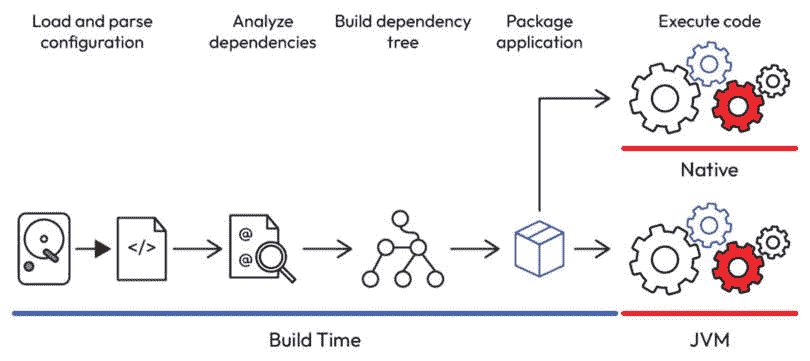

# 第十一章：Java 注解处理器

在 Java 编程的动态环境中，运行时对代码进行内省和分析的能力长期以来一直由反射提供支持。虽然反射提供了一种强大的机制来检查和操作类、字段和方法，但它也伴随着其权衡，例如性能开销和运行时错误的可能性。认识到这些挑战，一个引人注目的替代方案出现了——通过使用 Java 注解处理器将焦点从运行时转移到构建时。

本章深入探讨了 Java 注解处理器的世界，揭示了它们在编译阶段利用元数据方面的作用。通过这样做，开发者可以避免与运行时反射相关的陷阱，了解如何利用注解处理器进行增强的代码生成和操作。通过实际示例和动手探索，你将发现将注解处理器集成到你的开发工作流程中的复杂性，最终使你能够优化你的代码库，平衡灵活性和性能。加入我们，一起探索 Java 注解处理器的全部潜力，并改变你在项目中处理元数据的方法。

在本章中，我们将探讨以下主题：

+   Java 注解处理器概述

+   探索实用的 Java 注解处理器

# 技术要求

对于本章，你需要以下内容：

+   Java 21

+   Git

+   Maven

+   任何首选的 IDE

+   本章的 GitHub 仓库位于 - [`github.com/PacktPublishing/Mastering-the-Java-Virtual-Machine/tree/main/chapter-11`](https://github.com/PacktPublishing/Mastering-the-Java-Virtual-Machine/tree/main/chapter-11)

# Java 注解处理器概述

开发者，在这里我们将深入探讨 Java 注解处理器的功能和重要性。在 Java 不断发展的领域中，高效和优化的代码至关重要，为了实现这一点，理解工具如注解处理器的作用变得至关重要。我们将探讨为什么存在 Java 注解处理器，它们与广泛使用的反射机制有何不同，以及为你的项目做出正确选择时的权衡。

Java 注解处理器作为解决运行时反射带来的某些挑战的有力工具而出现。虽然反射允许在运行时动态检查和操作代码元素，但它伴随着性能开销和运行时错误的可能性。相比之下，注解处理器在编译时运行，提供了一种根据源代码中存在的注解来分析和生成代码的方法。这种从运行时到构建时的转变带来了显著的优势，包括改进的性能、早期错误检测和增强的代码可维护性。

区分 Java 注解处理器和反射对于优化 Java 开发至关重要。反射是一种动态运行时机制，提供了灵活性，但会带来性能成本。相比之下，Java 注解处理器在编译时运行，提供了静态分析以进行优化和早期错误检测。本节探讨了这些差异，使开发者能够根据项目需求做出明智的决定。

让我们深入比较 Java 注解处理器和反射。虽然这两种机制都涉及用于元数据处理注解，但它们的执行时间和对性能的影响使它们有所不同。反射在运行时动态操作，提供了高灵活性，但会带来运行时性能成本。相比之下，注解处理器在编译时使用，允许优化并在代码运行之前捕获错误。

下表简要比较了反射和 Java 注解处理器——Java 开发中的两个关键机制。该比较涵盖了关键方面，如执行时间、灵活性、性能、错误检测、代码生成能力、用例、调试影响和整体可用性。通过对比这些特性，开发者可以深入了解何时利用反射的动态运行时能力，并选择 Java 注解处理器提供的静态、编译时分析。本表旨在作为实用指南，使开发者能够根据项目的具体要求做出明智的决定。

| **特性** | **反射** | **Java 注解处理器** |
| --- | --- | --- |
| 执行时间 | 运行时 | 编译时 |
| 灵活性 | 动态的；允许运行时代码检查 | 静态的，强制在编译时进行分析 |
| 性能 | 可能产生运行时开销 | 由于编译时优化，性能得到提升 |
| 错误检测 | 可能存在运行时错误 | 编译时早期错误检测 |
| 代码生成 | 代码生成能力有限 | 对代码生成和操作提供强大的支持 |
| 用例 | 适用于动态场景，例如框架和库 | 适用于静态分析、代码生成和项目级优化 |
| 调试 | 由于其动态特性，可能使调试复杂化 | 编译时分析有助于更清晰的调试 |
| 可用性 | 基本反射简单易用 | 需要理解注解处理，可能涉及更多设置 |
| 示例 | `Class.forName()`、`Method.invoke()` | Lombok、MapStruct 和 Android 的 Dagger 等框架广泛使用注解处理器 |

表 11.1：比较反射与 Java 注解处理器

此表提供了对反射和 Java 注解处理器在多个方面关键差异的快速概述，帮助开发者根据他们的特定用例选择最合适的方案。

深入探讨 Java 注解处理器与反射之间的权衡，揭示了开发者必须仔细考虑的微妙平衡。反射凭借其动态特性，通过允许运行时代码检查和修改，提供了无与伦比的灵活性。

相比之下，Java 注解处理器在编译阶段运行，采用静态分析方法。虽然这牺牲了一些运行时灵活性，但它引入了几个优点。早期错误检测成为一项显著的好处，因为潜在的问题在代码执行之前就被识别出来，从而降低了运行时错误的可能性。权衡带来的回报在于改进了性能，因为优化可以在编译期间应用，从而实现更高效和流畅的代码执行。此外，注解处理器的静态特性有助于创建更干净、更易于维护的代码库，因为开发者可以在开发过程的早期阶段捕捉并纠正问题。

最终，Java 注解处理器与反射之间的选择取决于项目需求和优先级。寻求动态、灵活方法的开发者可能会选择反射，尽管这会带来相关的运行时成本。与此同时，那些优先考虑早期错误检测、性能优化和可维护性的开发者可能会发现，采用注解处理器的权衡与他们的项目目标更为契合。在运行时灵活性和静态分析之间找到正确的平衡是构建健壮、高效和可维护的 Java 应用程序的关键。

在框架错综复杂的领域中，Java 注解处理器成为了一个颠覆性的创新，与以运行时为中心的反射相比，它为代码分析和生成提供了一种范式转变。此处理器在构建阶段动态运行，为框架提供了一套强大的工具集，用于提高性能、代码优化和系统化项目结构：

+   **加载和解析配置**：在初始步骤中，Java 注解处理器仔细读取注解并在构建时审查项目的配置。这种早期分析不仅识别注解，还扫描类以获取相关元数据，为后续处理步骤奠定基础。

+   **分析依赖关系**：处理器的一个关键优势在于其能够根据加载的类动态分析项目依赖关系。通过审查这些依赖关系，框架获得了对实现无缝功能所需组件的宝贵见解，从而促进更高效和流畅的开发过程。

+   **构建依赖树**：凭借对项目依赖关系的洞察，注解处理器构建了一个全面的依赖树。基于加载的类及其相互依赖关系，这个数据结构经过预处理，使得创建复杂的框架成为可能。这些结构成为框架架构的蓝图，确保类能够协调和优化地运行。

+   **打包应用程序**：在注解处理器勤勉地创建类并考虑了必要的库之后，接下来的步骤是打包应用程序。遵循代码的自然流程，框架编译并生成字节码。这个过程确保了没有反射，增强了应用程序的健壮性，并为创建原生应用程序开辟了道路，如图所示，这有助于创建更高效和自包含的最终产品：



图 11.1：使用 Java 注解处理器的 Java 视角

随着我们对 Java 注解处理器的探索告一段落，其集成提供了一种变革性的代码分析、生成和项目结构的方法变得显而易见。反射的运行时动态性和注解处理器编译时能力的对比揭示了各种权衡，每一种都满足特定的开发需求。我们从一般和框架中心的角度剖析了注解处理，揭示了这一强大工具固有的优势和牺牲。

在了解了早期错误检测的好处、改进的性能以及更干净、可维护的代码之后，您现在更有能力在开发项目中做出决策。在反射的动态能力和注解处理器提供的性能优化之间取得平衡是构建健壮、高效和可维护的 Java 应用程序的关键。

为了巩固您的理解，我们鼓励您深入实践。尝试将 Java 注解处理器融入您的项目中，探索它们的代码生成能力，并亲身体验编译时分析的优势。参与提供的动手实践，解锁 Java 开发旅程中效率和可靠性的新维度。让代码说话，愿您对 Java 注解处理器的探索能引导您在项目中找到创新和优化的解决方案。

# 探索实用的 Java 注解处理器

在这个动手实践环节，我们将深入一个实际练习，以巩固我们关于 Java 注解处理器所探讨的概念。目标是回顾一个之前检查过的示例，该示例使用了反射，使我们能够比较解决方案并展示使用 Java 注解处理器的独特特性和优势。

当前任务涉及将`Map`实例转换为实体实例，反之亦然，遵循提供的接口中概述的规范：

```java
public interface Mapper {    <T> T toEntity(Map<String, Object> map, Class<T> type);
    <T> Map<String, Object> toMap(T entity);
}
```

通过回顾这个熟悉的场景，你将亲身体验注解处理器如何简化编译时的代码生成和操作。在你进行实际练习时，考虑注解处理器与反射相比的权衡、效率和好处。让我们深入代码，探索 Java 注解处理器在这个现实世界示例中的潜力。

我们引入了两个额外的注解来增强我们特定上下文的功能。`Entity`注解声明一个类是可映射的，表明其有资格进行解析过程。当应用于一个类时，此注解通知 Java 注解处理器该类的实例可以无缝地转换为`Map<String, Object>`。添加的注解增强了映射过程的清晰度，确保在编译期间类和注解处理器之间进行有效通信：

```java
@Documented@Target(ElementType.TYPE)
@Retention(RetentionPolicy.RUNTIME)
public @interface Entity {
    String value() default "";
}
```

Java 中的`@Entity`注解有三个注解定义了其行为和特性：`@Documented`、`@Target(ElementType.TYPE)`和`@Retention(RetentionPolicy.RUNTIME)`。`@Documented`注解确保其使用和存在在 JavaDocs 中得到记录。`@Target(ElementType.TYPE)`注解指定`@Entity`注解只能应用于类声明，表明其在类级别上的角色。最后，`@Retention(RetentionPolicy.RUNTIME)`注解表示此注解将在运行时保留，允许进行动态访问和反射，这对于本章讨论的 Java 注解处理器实践至关重要。这些注解共同为`@Entity`注解提供了一个清晰的框架，使其文档齐全、类特定且在运行时易于访问，这对于代码生成和元数据创建至关重要。

与`Entity`注解类似，`Column`注解将定制能力扩展到属性级别。应用于注解类中的字段，它允许开发者在转换过程中覆盖默认属性名称。当处理不同的命名约定时，如驼峰式、蛇形或短横线式，它变得非常宝贵，增强了类对不同范式的适应性：

```java
@Documented@Target(ElementType.FIELD)
@Retention(RetentionPolicy.RUNTIME)
public @interface Column {
    String value() default "";
}
```

我们将启动一个 Maven 项目，该项目无缝地结合了 Java 和 Mustache，使我们能够在构建过程中动态地生成可维护的代码。要将 Mustache 模板集成到我们的 Java 项目中，我们将 Mustache 编译器作为依赖项添加。使用以下依赖项更新 `pom.xml` 文件：

```java
<dependency>    <groupId>com.github.spullara.mustache.java</groupId>
    <artifactId>compiler</artifactId>
    <version>0.9.6</version>
</dependency>
```

Mustache 是一个轻量级且强大的模板引擎，开发者使用它来生成动态内容，同时保持代码逻辑和展示的分离。它提供了一种灵活且结构化的方式来生成文本输出，使其非常适合生成代码、HTML 或其他基于文本的格式。Mustache 模板使用双大括号 `{{variable}}` 来表示占位符。在渲染过程中，这些占位符会被实际值或内容所替换。

在我们的 Maven 项目上下文中，我们正在将 Mustache 集成进来以自动化代码生成。具体来说，我们使用它来在构建过程中创建 Java 类。通过在项目的 `pom.xml` 文件中添加 Mustache 编译器作为依赖项，我们无缝地将 Mustache 集成到我们的 Java 项目中。这种集成使我们能够动态地生成可维护的代码，从而提高效率并减少手动编写重复或模板代码时的人为错误风险。Mustache 模板提供了一种结构化和清晰的方式来定义生成代码的结构，使其更容易维护和适应项目需求的变化。总的来说，Mustache 在我们的 Java 项目中简化了代码生成流程，提高了代码质量和开发者生产力。

在我们利用 Java 注解处理器力量的旅途中，我们现在实现了 `EntityProcessor` 类。通过扩展 `AbstractProcessor`，这个处理器在扫描和处理带有 `@Entity` 注解的类中扮演着至关重要的角色：

```java
@SupportedAnnotationTypes("expert.os.api.Entity")public class EntityProcessor extends AbstractProcessor {
    // Implementation details will be discussed below
}
```

现在，让我们深入到 `process` 方法，这里是魔法发生的地方：

```java
@Overridepublic boolean process(Set<? extends TypeElement> annotations,
                       RoundEnvironment roundEnv) {
    final List<String> entities = new ArrayList<>();
    for (TypeElement annotation : annotations) {
        roundEnv.getElementsAnnotatedWith(annotation)
                .stream().map(e -> new ClassAnalyzer(e, 
                   processingEnv))
                .map(ClassAnalyzer::get)
                .filter(IS_NOT_BLANK).forEach(entities::add);
    }
    // Further processing logic can be added here
    return true;
}
```

在这个方法中，我们开始处理带有 `@Entity` 注解的类。让我们分解关键组件：

1.  **扫描注解元素**：我们首先遍历代表注解类型（**annotations** 参数）的 **TypeElement** 实例集合。

1.  **处理注解元素**：对于每个注解类型，我们使用 **roundEnv.getElementsAnnotatedWith(annotation)** 来检索所有带有指定注解（在这种情况下为 **@Entity**）的程序元素。

1.  **映射到 ClassAnalyzer**：我们将注解元素转换为流，并将每个元素映射到一个 **ClassAnalyzer** 实例。**ClassAnalyzer** 是一个自定义类，用于分析和从注解类中提取信息。

1.  **过滤空白结果**：然后，我们使用 **.map(ClassAnalyzer::get)** 从每个 **ClassAnalyzer** 实例中提取分析结果。之后，我们使用 **.filter(IS_NOT_BLANK)** 从列表中过滤掉任何空白或 null 条目。

1.  **收集结果**：使用**.forEach(entities::add)**将非空结果收集到**entities**列表中。

1.  **进一步处理逻辑**：该方法作为任何附加处理逻辑的基础。开发者可以扩展这部分以包括基于提取实体的自定义操作。

这个`process`方法构成了我们注解处理逻辑的核心。它扫描、分析和从带有`@Entity`注解的类中收集信息，提供了一个灵活且可扩展的机制，用于代码生成和操作。让我们继续我们的探索，深入了解可以集成到这个方法中的附加处理步骤，以适应我们项目的特定需求。

在分析带有`@Entity`注解的实体类的复杂过程中，`ClassAnalyzer`扮演着关键角色。它仔细检查类中的每个字段，并与`FieldAnalyzer`协作进行详细检查：

```java
public class ClassAnalyzer implements Supplier<String> {    private String analyze(TypeElement typeElement) throws IOException {
        // Extracting fields annotated with @Column
        final List<String> fields = processingEnv.getElementUtils()
                .getAllMembers(typeElement).stream()
                .filter(EntityProcessor.IS_FIELD.and(EntityProcessor.
                   HAS_ANNOTATION))
                .map(f -> new FieldAnalyzer(f, processingEnv, 
                   typeElement))
                .map(FieldAnalyzer::get)
                .collect(Collectors.toList());
        // Obtaining metadata for the entity class
        EntityModel metadata = getMetadata(typeElement, fields);
        // Creating the processed class based on metadata
        createClass(entity, metadata);
        // Logging the discovery of fields for the entity class
        LOGGER.info("Found the fields: " + fields + " to the class: " 
          + metadata.getQualified());
        // Returning the qualified name of the entity class
        return metadata.getQualified();
    }
}
```

在这里，代码被更深入地解释：

1.  **字段分析**：**analyze**方法的核心在于从给定的**TypeElement**中提取字段。使用**processingEnv.getElementUtils()**，它检索类的所有成员，并过滤出仅带有**@Column**注解的字段。为每个字段实例化**FieldAnalyzer**，以便进行详细分析。

1.  **FieldAnalyzer 协作**：为每个字段创建**FieldAnalyzer**涉及传递字段（**f**）、处理环境（**processingEnv**）和实体类的类型元素（**typeElement**）。这种与**FieldAnalyzer**的协作努力使得对每个字段进行深入考察成为可能。

1.  **元数据提取**：随后调用**getMetadata**方法以获取实体类的元数据。这些元数据可能包括有关类本身以及分析期间发现的字段的信息。

1.  **类创建**：调用**createClass**方法，表示基于元数据正在生成实体类。这一步对于基于分析过的类的代码生成和操作至关重要。

1.  **记录信息**：通过**LOGGER**实例提供的日志语句，可以提供对发现字段及其与类的关联的可见性。它有助于跟踪和理解分析过程。

1.  **返回语句**：该方法通过返回分析过的实体类的限定名称结束。这些信息可能对进一步处理或报告有用。

`ClassAnalyzer`和`FieldAnalyzer`之间的这种协作交互封装了彻底实体类分析的本质。作为更广泛的注解处理框架的一部分，它为后续操作，如代码生成、元数据提取和日志记录，奠定了基础。随着我们深入本书，我们将揭示分析过程及其对开发工作流程影响的更多复杂性。

在代码生成过程中，工具的选择可以显著影响生成代码的可维护性和灵活性。在实体类生成过程中，一个突出的方法就是利用 Mustache 模板。让我们来探讨利用 Mustache 进行类生成的优点以及为什么它优于手动文本连接：

+   **声明式模板**：Mustache 提供了一种基于声明和模板的代码生成方法。而不是手动连接字符串来构建类，开发者可以使用 Mustache 语法定义模板。这种方法与更直观、更易于维护的表达生成代码结构的方式相一致。

+   **可读性和可维护性**：Mustache 模板增强了生成代码的可读性。通过将模板与实际代码分离，开发者可以专注于类的逻辑结构，而无需陷入复杂的字符串连接。这种分离提高了代码的可维护性，并减少了在手动文本操作中引入错误的可能性。

+   **动态数据绑定**：Mustache 支持动态数据绑定，允许在生成过程中将数据注入到模板中。这种动态特性使得根据不同的输入或分析阶段获得的元数据来调整生成代码成为可能。相比之下，手动连接缺乏这种灵活性。

+   **生成的一致性**：Mustache 模板提供了标准化和一致的代码生成方法。模板可以在不同的实体之间重用，确保生成类的结构一致。这种一致性简化了模板的维护，并促进了统一的代码生成策略。

+   **与 Java 的无缝集成**：Mustache 对 Java 的集成提供了强大的支持。通过将 Mustache 纳入代码生成过程，开发者可以无缝地将 Java 逻辑的强大功能与 Mustache 模板的清晰性结合起来。这种协同作用产生了一个更自然、更富有表现力的生成工作流程。

+   **避免字符串操作陷阱**：用于代码生成的手动字符串连接可能会引入陷阱，如格式错误、拼写错误或代码结构的不当变化。Mustache 通过提供一种高级抽象来消除这些风险，从而减轻了对细致入微的字符串操作的需求。

从本质上讲，利用 Mustache 进行类生成在代码生成方法上引入了一种范式转变。它促进了清晰性、可维护性和灵活性，为手动文本连接的易出错和繁琐特性提供了一个更优越的替代方案。随着我们进一步探索注解处理和代码生成，Mustache 模板的集成将继续展示其在提高我们的开发工作流程效率和可靠性方面的能力。

提供的 Mustache 模板与`EntityModel`结合生成实体类，展示了 Mustache 在代码生成中带来的优雅和清晰。让我们深入探讨这个模板的关键方面：

```java
package {{packageName}};// (Imports and annotations)
public final class {{className}} implements EntityMetadata {
    private final List<FieldMetadata> fields;
    // Constructor and initialization of fields
    // Implementation of EntityMetadata methods
    // ... Other methods ...
}
```

在这个 Mustache 模板中，动态生成一个实现`EntityMetadata`接口的 Java 类。占位符`{{packageName}}`和`{{className}}`将在代码生成过程中被替换。该类包含一个表示实体字段的`FieldMetadata`对象列表，构造函数初始化这些字段。此模板简化了代码生成过程，通过自动化 Java 项目中元数据类的创建，提高了清晰度和可维护性。以下是对模板的更深入解释：

+   **包声明**：**包声明**中的**{{packageName}}**占位符动态注入从**EntityModel**获取的包名。它确保生成的实体类位于正确的包中。

+   **导入和注解**：模板包括必要的导入和注解，例如**import java.util.List;**、**import java.util.Map;**和**@Generated**。**@Generated**注解包含指示生成工具和生成日期的元数据。

+   **类声明**：**{{className}}**占位符注入生成的类名（**EntityModel#getClassName()**）。该类实现了**EntityMetadata**接口，确保遵守指定的契约。

+   **字段初始化**：构造函数使用**FieldMetadata**实例初始化**fields**列表。列表基于**EntityModel**中定义的字段进行填充。这种动态初始化确保生成的类包含每个字段的元数据。

+   **EntityMetadata 实现**：模板实现了**EntityMetadata**接口中定义的各种方法。这些方法提供了有关实体类的信息，例如其名称、类实例、字段和映射。

+   **FieldMetadata 生成**：**{{#fields}}**部分动态为每个字段生成代码。它为每个字段创建相应的**FieldMetadata**实例，并在类实例化过程中将它们添加到**fields**列表中。

+   **日期和生成信息**：**@Generated**注解包含有关生成工具（**EntityMetadata Generator**）和生成日期（**{{now}}**）的信息。这些元数据有助于跟踪类生成的来源和时间。

事实上，Mustache 允许创建一个干净且易于维护的模板，其中占位符与`EntityModel`提供的数据无缝集成。这种以模板驱动的做法提高了生成代码的可读性，并促进了不同实体之间的一致性。随着我们的进展，Mustache 的灵活性将继续闪耀，允许进行进一步的定制和适应特定项目需求。

在注解处理和代码生成的迷人旅程中，当我们把分析过的实体元数据转化为实际的 Java 源代码时，关键的瞬间到来了。这一关键步骤由 `createClass` 方法协调，它无缝地将 `EntityModel` 的信息与 Mustache 模板的表达能力结合起来：

```java
private void createClass(Element entity, EntityModel metadata) throws IOException {    Filer filer = processingEnv.getFiler();
    JavaFileObject fileObject = filer.createSourceFile(metadata.
      getQualified(), entity);
    try (Writer writer = fileObject.openWriter()) {
        template.execute(writer, metadata);
    }
}
```

这个方法，`createClass`，是 Java 注解处理器的一个关键组件，负责动态生成源代码。它接受 `Element`，代表被注解的类（`entity`），以及包含代码生成元数据的 `EntityModel`（`metadata`）。利用来自处理环境的 `Filer`，它为生成的类的指定限定名称创建 `JavaFileObject`。然后，该方法为文件打开一个写入器，并通过传递写入器和元数据来执行 Mustache 模板（`template`）。最终，这个过程确保为带有相应元数据的注解类生成源代码，为 Java 注解处理器的强大和灵活性做出了贡献。在这里，代码被更深入地解释：

1.  **获取 filer**：我们从注解处理环境获取 **Filer** 实例。**Filer** 是我们在构建过程中创建文件的门户。

1.  **创建源文件**：**filer.createSourceFile(metadata.getQualified(), entity)** 这行代码协调创建一个新的源文件。完全限定的名称（**metadata.getQualified()**）为生成的类提供了一个唯一的标识，对原始**实体**的引用确保了生成实体与原始实体之间的连接。

1.  **打开写入器**：当我们编写生成的内容时，代码优雅地打开一个用于新创建源文件的写入器。**try (Writer writer = fileObject.openWriter())** 在其作用域执行完毕后自动关闭写入器。

1.  **Mustache 魔法**：真正的魔法在 **template.execute(writer, metadata)** 这行代码中展开。这行代码触发了 Mustache 引擎来解释模板，将 **EntityModel**（**metadata**）中的数据注入到占位符中。结果是动态生成的实体类。

1.  **自动资源管理 (ARM)**：得益于 Java 的 ARM，打开的写入器会自动关闭，从而减轻资源泄露的风险，有助于编写更干净、更健壮的代码。

这种方法封装了将元数据转化为可触摸代码的炼金术。Mustache 模板充当一个动态蓝图，允许在代码生成过程中保持灵活性和可维护性。随着我们探索的深入，生成的实体类将变得生动起来，反映了元数据分析的丰富性和我们在注解处理冒险中代码生成的效率。

当我们进入注解处理器的测试阶段时，我们发现自己处于依赖管理的十字路口。我们将探讨两种将处理器包含到我们的 Maven 项目中的方法：一种使用`提供的`作用域，另一种在 Maven 编译插件中使用`annotationProcessorPaths`配置。

第一种选择是使用`提供的`作用域：

```java
<dependency>    <groupId>${project.groupId}</groupId>
    <artifactId>processor</artifactId>
    <version>${project.version}</version>
    <scope>provided</scope>
</dependency>
```

这种方法声明处理器依赖于`提供的`作用域。这表示处理器将在编译时可用，但不会包含在最终应用程序中。当处理器功能严格需要编译时而不是运行时，这是一个合适的选择。

第二种选择是利用`annotationProcessorPaths`：

```java
<build>    <plugins>
        <plugin>
            <artifactId>maven-compiler-plugin</artifactId>
            <version>3.11.0</version>
            <configuration>
                <target>${maven.compiler.target}</target>
                <source>${maven.compiler.source}</source>
                <annotationProcessorPaths>
                    <path>
                        <groupId>${project.groupId}</groupId>
                        <artifactId>processor</artifactId>
                        <version>${project.version}</version>
                    </path>
                </annotationProcessorPaths>
            </configuration>
        </plugin>
    </plugins>
</build>
```

或者，我们可以利用 Maven 编译插件中的`annotationProcessorPaths`配置。这种方法提供了与编译器的更直接集成，确保处理器在编译时可用，而不会包含在最终工件中。它提供了对注解处理器在编译工作流程中角色的更明确声明。

请注意，一旦你采用这种方法，请考虑以下内容：

+   当你只想让处理器用于编译而不是作为运行时依赖的一部分时，请使用**提供的**作用域。

+   当你更喜欢以配置为中心的方法时，直接指定编译插件的注解处理器，请使用**annotationProcessorPaths**。

现在，我们将通过注解一个类并观察构建过程中的魔法展开来深入了解我们注解处理器的实际应用示例。

考虑以下带有我们自定义注解的`Animal`类：

```java
@Entity("kind")public class Animal {
    @Id
    private String name;
    @Column
    private String color;
}
```

这个简单的类代表一个动物，通过注释说明了实体名称和关于字段的详细信息。在构建时，得益于我们的注解处理器，基于注解的类及其字段会生成诸如`AnimalEntityMetaData`、`AnimalNameFieldMetaData`和`AnimalColorFieldMetaData`之类的类。

让我们更仔细地看看生成的`AnimalEntityMetaData`类：

```java
@Generated(value = "EntityMetadata Generator", date = "2023-11-23T18:42:27.793291")public final class AnimalEntityMetaData implements EntityMetadata {
    private final List<FieldMetadata> fields;
    public AnimalEntityMetaData() {
        this.fields = new ArrayList<>();
        this.fields.add(new expert.os.example.
          AnimalNameFieldMetaData());
        this.fields.add(new expert.os.example.
          AnimalColorFieldMetaData());
    }
    // ... Rest of the class ...
}
```

这个类作为`Animal`实体的元数据，提供了有关其名称、类、字段等信息。值得注意的是，它包括`Animal`类中每个字段的`FieldMetadata`实例。

在这里，我们将更深入地查看生成的代码：

+   **构造函数初始化**：在构造函数中，FieldMetadata 的实例（如 AnimalNameFieldMetaData 和 AnimalColorFieldMetaData）被添加到字段列表中。这种初始化捕获了 Animal 类中定义的每个字段的元数据。

+   **实体元数据方法的实现**：生成的类实现了在实体元数据接口中定义的方法。这些方法使得检索有关实体名称、类实例、字段等信息成为可能。

+   **代码生成注解**：`@Generated`注解包含了有关生成过程的信息，例如使用的工具（“EntityMetadata Generator”）和生成日期。

在构建时的目标目录中，生成的类被组织起来，展示了代码生成的动态性。原始`Animal`类中的每个字段都贡献于创建相应的元数据类，如下图所示：


图 11.2：构建时生成的类

在这次对注解处理器的实际探索中，我们见证了它们为 Java 开发带来的变革能力。实践代码展示了如何通过添加一些注解，我们可以编排复杂元数据的生成，推动我们的项目达到新的效率和可维护性高度。

被注解的`Animal`类是我们的画布，装饰着诸如`@Entity`和`@Id`之类的自定义注解。随着构建过程的展开，我们的自定义注解处理器在幕后勤奋地工作，制作出一曲元数据类的交响乐：`AnimalEntityMetaData`、`AnimalNameFieldMetaData`和`AnimalColorFieldMetaData`。

在这个过程中，我们揭露了以下内容：

+   **动态元数据生成**：生成的元数据类能够动态地适应被注解类的结构，展示了注解处理器的灵活性和适应性。

+   **高效的代码组织**：通过自动化元数据生成，我们的代码库保持整洁和简洁。样板代码被动态构建的类所取代，促进了更好的组织和可读性。

+   **构建时魔法**：这种魔法发生在构建时。注解处理器提供了一种强大的机制，在应用程序运行之前分析和生成代码，从而提高性能并消除运行时反射成本。

+   **大规模定制**：注解赋予开发者传达意图和定制偏好的能力。我们的注解处理器将这种意图转化为可触摸的元数据，为大规模代码库管理提供了一条强大的途径。

当我们回顾这一实践时，我们只是刚刚触及了注解处理器所能提供的潜力。前方的旅程邀请我们探索更高级的场景，应对现实世界的挑战，并充分利用定制选项的全谱。注解处理器成为代码生成工具，并催化了我们在架构和维护 Java 项目时的范式转变。

# 摘要

在我们通过注解处理器的旅程中结束之际，我们探讨了代码生成的艺术以及它们为 Java 开发带来的优雅。从注解类到动态元数据，我们见证了自动化的变革力量。随着我们过渡到最终的考虑因素，下一章充当指南针，引导我们了解最佳实践、潜在陷阱以及 Java 开发更广泛领域的战略洞察。

我们的探索使我们拥有了有效使用注解处理器的工具。加入我们，在最后一章中，我们将提炼关键见解并规划未来之路。最终的考虑因素概括了我们的注解处理器之旅的精髓，为掌握这些工具和塑造 Java 开发的轨迹提供了路线图。让我们共同踏上这段旅程的最后一段。

# 问题

回答以下问题以测试你对本章知识的了解：

1.  本章中介绍的 Java 注解处理器的主要角色是什么？

    1.  动态代码执行

    1.  运行时代码编译

    1.  元数据分析和代码生成

    1.  用户界面设计

1.  在 Java 注解处理器的上下文中，**@SupportedAnnotationTypes** 注解的目的是什么？

    1.  声明运行时保留

    1.  指示编译器路径

    1.  指定支持的注解

    1.  定义注解继承

1.  在本章中讨论的，使用 Java 注解处理器而不是反射的优势是什么？

    1.  更大的运行时灵活性

    1.  改进性能和早期错误检测

    1.  简化的代码检查

    1.  增强的调试能力

1.  哪个 Maven 范围表示依赖项仅在编译期间可用，而不包含在运行时依赖项中？

    1.  **编译**

    1.  **运行时**

    1.  **提供**

    1.  **注解处理器**

1.  在 Java 注解处理器实践课程中，Mustache 模板的主要目的是什么？

    1.  生成随机代码片段

    1.  创建 JavaDoc 文档

    1.  启用代码连接

    1.  促进可维护的代码生成

1.  哪个 Maven 配置允许直接为编译插件指定注解处理器？

    1.  **<注解路径>**

    1.  **<注解处理器>**

    1.  **<注解处理器路径>**

    1.  **<编译器注解>**

# 答案

这里是本章问题的答案：

1.  C. 元数据分析和代码生成

1.  C. 指定支持的注解

1.  B. 改进性能和早期错误检测

1.  C. **提供**

1.  D. 促进可维护的代码生成

1.  C. **<注解处理器路径>**
