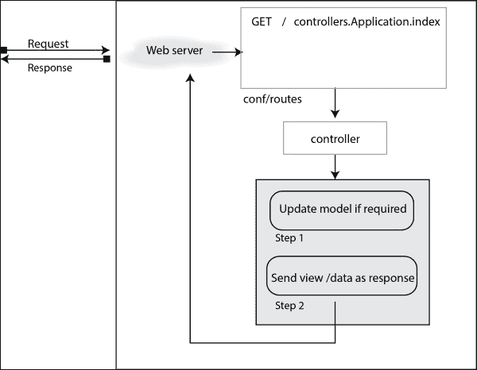

# 第一章. Play 入门

自从 1991 年 8 月首次出现以来，万维网已经取得了飞跃性的增长。它已经从行模式浏览器和静态网站发展到图形浏览器和高度交互式网站，如搜索引擎、在线百货商店、社交网络、游戏等。

复杂的网站或应用程序由一个或多个数据库和大量代码支持。在大多数情况下，此类 Web 应用程序使用框架来简化开发过程。框架提供了一个骨架结构，处理了大多数重复或常见功能。Ruby on Rails、Django、Grails 和 Play 是此类框架的几个例子。

Play 框架是由 Guillaume Bort 在 Zenexity（现在为 Zengularity）工作时开发的。它的第一个完整版本是在 2009 年 10 月发布的 1.0 版。2011 年，Sadek Drobi 加入了 Guillaume Bort，共同开发 Play 2.0，该版本被 Typesafe Stack 2.0 采用。Play 2.0 于 2012 年 3 月 13 日发布。

在本章中，我们将介绍以下主题：

+   选择 Play 的原因

+   创建一个示例 Play 应用程序

+   创建一个 TaskTracker 应用程序

# 探索 Play 的世界

Play 的安装无需麻烦。如果你有 Java JDK 6 或更高版本，要使 Play 运行，你只需安装**Typesafe Activator**或**Simple Build Tool**（**SBT**）即可。

Play 是完全 RESTful 的！**表示性状态转移**（**REST**）是一种架构风格，它依赖于无状态、客户端-服务器和缓存启用通信协议。它是一种轻量级的替代机制，如**远程过程调用**（**RPC**）和 Web 服务（包括 SOAP、WSDL 等）。在这里，无状态意味着客户端状态数据不会存储在服务器上，每个请求都应该包含服务器成功处理所需的所有数据。服务器不依赖于以前的数据来处理当前请求。客户端存储他们的会话状态，服务器可以无状态地服务更多的客户端。Play 构建系统使用**Simple Build Tool**（**SBT**），这是一个用于 Scala 和 Java 的构建工具。它还包含一个插件，允许原生编译 C 和 C++。SBT 使用增量重新编译来减少编译时间，并且可以在触发执行模式下运行，这意味着如果用户指定，所需任务将在用户在任何源文件中保存更改时运行。这个特性特别被 Play 框架利用，因此开发者不需要在开发阶段的每次更改后重新部署。这意味着如果 Play 应用程序在本地机器上从源代码运行，并且你编辑了它的代码，你只需在浏览器中重新加载应用程序即可查看更新后的应用程序。

它提供了一个默认的测试框架以及辅助器和应用程序存根，以简化应用程序的单元和功能测试。**Specs2**是 Play 中使用的默认测试框架。

由于 Play 内置了基于 Scala 的模板引擎，因此可以在模板中使用 Scala 对象（`String`、`List`、`Map`、`Int`、用户定义的对象等）。在 2.0 版本之前，Play 依赖于 Groovy 作为模板引擎，这是不可能的。

它使用 JBoss Netty 作为默认的 Web 服务器，但任何 Play 2 应用程序都可以被打包成 WAR 文件，并在需要时部署在 Servlet 2.5、3.0 和 3.1 容器上。有一个名为 **play2-war-plugin** 的插件（可以在 [`github.com/play2war/play2-war-plugin/`](https://github.com/play2war/play2-war-plugin/) 找到），可以用于为任何给定的 Play2 应用程序生成 WAR 文件。

Play 支持 **模型-视图-控制器**（**MVC**）模式。根据 MVC 模式，应用程序的组件可以分为三类：

+   **模型**：这代表应用程序数据或活动

+   **视图**：这是应用程序中用户可以看到的部分

+   **控制器**：这是负责处理来自终端用户输入的部分

该模式还定义了这些组件应该如何相互交互。让我们以在线商店作为我们的应用程序。在这种情况下，产品、品牌、用户、购物车等可以由每个模型表示。用户可以查看产品的应用程序页面定义在视图中（HTML 页面）。当用户将产品添加到购物车时，事务由控制器处理。视图不知道模型，模型也不知道视图。控制器向模型和视图发送命令。以下图显示了模型、视图和控制器之间的交互：


Play 还预包装了一个易于使用的 Hibernate 层，并且通过添加对各个模块的依赖，可以直接提供 OpenID、Ehcache 和 Web 服务集成。

在本章的后续部分，我们将使用 Play 创建一个简单的应用程序。这主要是针对早期使用 Play 的开发者。

## 一个示例 Play 应用程序

创建新的 Play 应用程序有两种方式：激活器，和不使用激活器。使用激活器创建 Play 项目更简单，因为最简约的应用程序至少需要六个文件。

**Typesafe Activator** 是一个可以用来使用 Typesafe 堆栈创建应用程序的工具。它依赖于使用预定义的模板来创建新项目。设置 Activator 的说明可以在 [`typesafe.com/get-started`](http://typesafe.com/get-started) 找到。

### 使用激活器构建 Play 应用程序

让我们使用激活器和简单的模板来构建一个新的 Play 应用程序：

```java
$ activator new pathtoNewApp/sampleApp just-play-scala

```

然后，使用 `run` 命令运行项目：

```java
sampleApp $ sbt run

```

默认情况下，它通过 `http://localhost:9000` 启动应用程序，使其可访问。

### 注意

`run`命令以开发模式启动项目。在这种模式下，应用程序的源代码会监视变化，如果有任何变化，代码将被重新编译。然后我们可以修改模型、视图或控制器，并通过重新加载浏览器来看到它们在应用程序中的反映。

看一下项目结构。它将类似于这里所示的结构：


如果我们不能使用 Activator，我们可能不得不创建所有这些文件。现在，让我们逐个深入探讨这些文件，看看它们各自的作用。

#### 构建定义

让我们从项目的关键部分开始——其构建定义，在我们的案例中，是`build.sbt`文件。`.sbt`扩展名来源于用于 Play 应用程序的构建工具。我们将为不熟悉 SBT 的人介绍这个概念。构建定义本质上是一个键值对的列表，类似于带有`:=`符号作为赋值操作符的赋值语句。

### 注意

SBT 版本低于 0.13.7 期望在构建定义中两个不同语句之间的分隔符为换行符。

构建文件的包含内容如下：

```java
name := "sampleApp"""

version := "1.0.0"

lazy val root = project.in(file(".")).enablePlugins(PlayScala)
```

在前面的构建定义中，指定了项目的`name`、`version`和`root`的值。另一种指定值的方法是更新现有的值。我们可以使用`+=`符号为单个项目追加值，使用`++=`为序列追加值。例如：

```java
resolvers += Resolver.sonatypeRepo("snapshots")

scalacOptions ++= Seq("-feature", "-language:reflectiveCalls")
```

`resolvers`是依赖项可以从中获取的 URL 列表，而`scalacOptions`是传递给 Scala 编译器的参数列表。

或者，SBT 项目也可以使用`.scala`构建文件。我们的应用程序的结构将是：


`SimpleApp`的`.scala`构建定义如下：

```java
import sbt._
import Keys._
import play.Play.autoImport._
import PlayKeys._

object ApplicationBuild extends Build {

  val appName = "SimpleApp"
  val appVersion = "1.0.0"

  val appDependencies = Seq(
    // Add your project dependencies here
  )

  val main = Project(appName, file(".")).enablePlugins(play.PlayScala).settings(
    version := appVersion,
    libraryDependencies ++= appDependencies
  )

}
```

当我们需要为应用程序/插件定义自定义任务/设置时，`.scala`构建定义非常有用，因为它使用 Scala 代码。`.sbt`定义通常比其对应的`.scala`定义更小、更简单，因此更受欢迎。

如果没有通过启用 PlayScala 插件导入的 Play 设置，SBT 将无法知道我们的项目是一个 Play 应用程序，并且会根据 Play 应用程序的语义进行定义。

那么，这个声明是否足够让 SBT 正确运行 Play 应用程序？

不，还有其他的事情！SBT 允许我们通过插件扩展构建定义。基于 Play 的项目使用 Play SBT 插件，并且 SBT 就是从这个插件中获取所需的设置。为了使 SBT 下载我们的项目将使用的所有插件，它们应该被明确添加。这是通过在`projectRoot/project`目录中的`plugins.sbt`中添加它们来完成的。

让我们来看看`plugins.sbt`文件。文件内容如下：

```java
resolvers += "Typesafe repository" at "http://repo.typesafe.com/typesafe/releases/"

addSbtPlugin("com.typesafe.play" % "sbt-plugin" % "2.3.8")
```

传递给`addSbtPlugin`的参数是插件的 Ivy 模块 ID。当插件不在 Maven 或 Typesafe 仓库上托管时，解析器很有帮助。

`build.properties`文件用于指定 SBT 版本，以避免使用两个或更多不同版本的 SBT 编译的相同构建定义之间的不兼容性问题。

这涵盖了 Play 应用程序的所有与构建相关的文件。

#### 源代码

现在，让我们看看我们项目的源代码。大部分源代码都在`app`文件夹中。通常，模型的代码在`app/models`或`app/com/projectName/models`中，控制器的源代码在`app/controllers`或`app/com/projectName/controllers`中，其中`com.projectName`是包名。视图的代码应该在`app/views`或`app/views`的子文件夹中。

`views/main.scala.html`文件是我们运行应用程序时能看到的那一页。如果这个文件缺失，您可以添加它。如果您想知道为什么文件命名为`main.scala.html`而不是`main.html`，这是因为它是一个 Twirl 模板；它便于使用 Scala 代码与 HTML 结合来定义视图。我们将在第四章*探索视图*中深入探讨这一点。

现在，更新`main.scala.html`的内容如下：

```java
@(title: String)(content: Html)

<!DOCTYPE html>

<html>
    <head>
        <title>@title</title>
    </head>
    <body>
    @content
    </body>
</html>
```

我们可以从 Scala 代码中提供标题和内容来显示这个视图。一个视图可以通过控制器绑定到特定的请求。所以，让我们更新我们的控制器`SampleAppController`的代码，如下所示：

```java
package controllers

import play.api.mvc._
import play.api.templates.Html

object SampleAppController extends Controller {
  def index = Action {
    val content = Html("<div>This is the content for the sample app<div>")
        Ok(views.html.main("Home")(content))
  }
  }
```

### 提示

**下载示例代码**

您可以从[`www.packtpub.com`](http://www.packtpub.com)的账户下载您购买的所有 Packt 书籍的示例代码文件。如果您在其他地方购买了这本书，您可以访问[`www.packtpub.com/support`](http://www.packtpub.com/support)并注册，以便将文件直接通过电子邮件发送给您。

`Action`和`Ok`是由`play.mvc.api`包提供的方法。第二章*定义动作*详细介绍了它们。

保存更改并运行应用程序后，我们将看到截图所示的`http://localhost:9000`上托管的页面：


#### 请求处理过程

让我们看看请求是如何处理的！

应用程序将支持的所有请求必须在`conf/routes`文件中定义。每个路由定义有三个部分。第一部分是请求方法。它可以是`GET`、`POST`、`PUT`和`DELETE`中的任何一个。第二部分是路径，第三部分是返回响应的方法。当在`conf/routes`文件中定义请求时，它在`conf/routes`文件中映射的方法被调用。

例如，路由文件中的一个条目可能是：

```java
GET         /                        controllers.SampleAppController.index
```

这意味着对于`/`路径上的 GET 请求，我们已经将响应映射为从`SampleController.index()`方法返回的那个。

一个示例请求如下：

```java
curl 'http://localhost:9000/' 

```

继续添加更多页面到应用程序中，以便更加熟悉，也许是一个常见问题解答、联系我们或关于我们。

前面代码中解释的 Play 应用程序的请求-响应周期在此处表示：



`public`目录基本上用于提供资源，如样式表、JavaScript 和图像，这些资源与 Play 无关。为了使这些文件可访问，默认情况下也将`public`的路径添加到路由中：

```java
GET         /assets/*file            controllers.Assets.at(path="/public", file)
```

我们将在第三章*构建路由*中详细了解路由。

文件`conf/application.conf`用于设置应用程序级别的配置属性。

`target`目录被 SBT 用于编译、构建或其他过程中生成的文件。

## 创建 TaskTracker 应用程序

让我们创建一个简单的**TaskTracker**应用程序，它允许我们添加待办任务并删除它们。我们将继续修改上一节中构建的`SampleApp`。在这个应用程序中，我们不会使用数据库来存储任务。在 Play 中使用**Anorm**或其他模块持久化模型是可能的；这将在第五章*处理数据*中更详细地讨论。

我们需要一个带有输入框以输入任务的视图。将另一个模板文件`index.scala.html`添加到视图中，使用上一节生成的模板作为样板：

```java
@main("Task Tracker") {

    <h2>Task Tracker</h2>

    <div>
        <form>
        <input type="text" name="taskName" placeholder="Add a new Task" required>

        <input type="submit" value="Add">
        </form>
    </div>

}
```

为了使用模板，我们可以从我们的 Scala 代码中调用其生成的方法，或者通过其名称在其他模板中引用它。当我们想要对所有模板应用更改时，使用主模板会很有帮助。例如，如果我们想为应用程序添加一个样式表，只需在主模板中添加这个样式表即可确保它被添加到所有依赖的视图中。

要在加载时查看此模板的内容，请更新`index`方法为：

```java
package controllers

import play.api.mvc._

object TaskController extends Controller {
  def index = Action {
    Ok(views.html.index())
  }
}
```

注意，我们还将所有`SampleAppController`的实例替换为`TaskController`。

运行应用程序并在浏览器中查看；页面将类似于这个图：


现在，为了处理功能，让我们添加一个名为`Task`的模型，我们将使用它来表示应用程序中的任务。由于我们还想删除功能，我们需要使用唯一的 ID 来标识每个任务，这意味着我们的模型应该有两个属性：一个 ID 和一个名称。`Task`模型将是：

```java
package models

case class Task(id: Int, name: String)

object Task {

  private var taskList: List[Task] = List()

  def all: List[Task] = {
    taskList
  }

  def add(taskName: String) = {
    val newId: Int = taskList.last.id + 1
    taskList = taskList ++ List(Task(newId, taskName))
  }

  def delete(taskId: Int) = {
    taskList = taskList.filterNot(task => task.id == taskId)
  }
}
```

在这个模型中，我们使用一个名为`taskList`的私有变量来跟踪会话中的任务。

在`add`方法中，每当添加一个新任务时，我们将其追加到这个列表中。而不是保持另一个变量来计数 ID，我选择递增列表中最后一个元素的 ID。

在`delete`方法中，我们简单地过滤掉具有给定 ID 的任务，而`all`方法返回这个会话的列表。

现在，我们需要在我们的控制器中调用这些方法，然后将它们绑定到一个请求路由。现在，以这种方式更新控制器：

```java
import models.Task
import play.api.mvc._

object TaskController extends Controller {

  def index = Action {
    Redirect(routes.TaskController.tasks)
  }

  def tasks = Action {
    Ok(views.html.index(Task.all))
  }

  def newTask = Action(parse.urlFormEncoded) {
    implicit request =>
      Task.add(request.body.get("taskName").get.head)
      Redirect(routes.TaskController.index)
  }

  def deleteTask(id: Int) = Action {
    Task.delete(id)
    Ok
  }

}
```

在前面的代码中，`routes`指的是可以用来访问在`conf/routes`中定义的应用程序路由的辅助工具。现在尝试运行应用程序！

它将抛出一个编译错误，指出`values tasks`不是`controllers.ReverseTaskController`的成员。这是因为我们还没有更新路由。

### 添加一个新任务

现在，让我们绑定获取任务和添加新任务的行动：

```java
GET           /                    controllers.TaskController.index

# Tasks
GET           /tasks               controllers.TaskController.tasks
POST          /tasks               controllers.TaskController.newTask
```

我们将完成我们应用程序的视图，以便它可以促进以下功能：

`接受并渲染 List[Task]`

```java
@(tasks: List[Task])

@main("Task Tracker") {

    <h2>Task Tracker</h2>
    <div>
        <form action="@routes.TaskController.newTask()" method="post">
            <input type="text" name="taskName" placeholder="Add a new Task" required>
            <input type="submit" value="Add">
        </form>
    </div>
    <div>
        <ul>
        @tasks.map { task =>
            <li>
                @task.name
            </li>
        }
        </ul>
    </div>
}
```

我们现在在视图中添加了一个表单，它接受一个名为`taskName`的文本输入，并将此数据提交给`TaskController.newTask`方法。

### 注意

注意，我们现在为这个模板添加了一个`tasks`参数，并在视图中显示它。Scala 元素和预定义模板在视图中以`@`twirl 符号开头。

现在，当运行应用程序时，我们将能够添加任务以及查看现有的任务，如下所示：


### 删除任务

我们的应用程序中剩下的唯一功能是删除任务。更新索引模板，以便每个`<li>`元素都有一个按钮，点击该按钮将向服务器发送删除请求：

```java
            <li>
                @task.name <button onclick="deleteTask ( @task.id) ;">Remove</button>
            </li>
```

然后，我们需要更新路由文件以映射删除操作：

```java
DELETE        /tasks/:id         controllers.TaskController.deleteTask (id: Int).
```

我们还需要在我们的视图中定义`deleteTask`。为此，我们可以简单地添加一个脚本：

```java
    <script>
    function deleteTask ( id ) {
        var req = new XMLHttpRequest ( ) ;
        req.open ( "delete", "/tasks/" + id ) ;
        req.onload = function ( e ) {
            if ( req.status = 200 ) {
                document.location.reload ( true ) ;
            }
        } ;
        req.send ( ) ;

    }
    </script>
```

### 注意

理想情况下，我们不应该在窗口的全局命名空间中定义 JavaScript 方法。在这个例子中已经这样做，以保持简单，但不建议用于任何实时应用程序。

现在，当我们运行应用程序时，我们可以添加任务以及删除它们，如下所示：


我将美化应用程序的任务留给你。在公共目录中添加一个样式表，并在主模板中声明它。例如，如果`taskTracker.css`文件位于`public/stylesheets`，则`main.scala.html`文件中的链接将是：

```java
<link rel="stylesheet" media="screen" href="@routes.Assets.at("stylesheets/taskTracker.css")">
```

# 摘要

本章介绍了 Play 框架的基本概念。在本章中，我们学习了如何使用 Play 框架构建简单的应用程序。我们了解了其项目结构，以了解框架如何通过构建文件插入所需的设置。我们还讨论了此类应用程序的各个部分：模型、路由、视图、控制器等。

在下一章中，我们将详细介绍操作。
