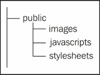

# 第三章。构建路由

在本章中，我们将介绍以下主题：

+   定义应用程序支持的服务

+   接收到的请求流程

+   配置路由

+   处理资产

# Play 路由简介

所有支持的路由都指定在单个文件中：`routes`（默认）。这使得确定哪个是理想的变得更容易。

如果编译过程中出现错误，`routes` 文件将编译失败。

然而，`routes` 文件不是一个 Scala 对象。那么编译器是如何知道如何处理 `routes` 文件的？为了找出答案，让我们执行以下步骤：

1.  让我们创建一个显示 *Hello, World!* 页面的项目。现在，将主页 `index.scala.html` 定义如下：

    ```java
    <!DOCTYPE html>
    <html>
        <head>
            <title>Home</title>
        </head>
        <body>
            <h1>Hello, World!</h1>
        </body>
    </html>
    ```

1.  我们将在我们的控制器中以这种方式使用它：

    ```java
    package controllers

    import play.api.mvc._
    object AppController extends Controller {

      def index = Action {
        Ok(views.html.index())
      }

    }
    ```

1.  我们只需要在 `routes` 文件中添加一个条目就可以查看我们的页面：

    ```java
    # Home page
    GET           /                    controllers.AppController.index
    ```

1.  现在编译项目。你会注意到在 `HelloWorld/target/scala-2.10/src_managed/main` 目录中现在有一个 `routes_routing.scala` 文件。文件的内容将类似于以下代码片段：

    ```java
    import play.core._
    import play.core.Router._
    import play.core.j._

    import play.api.mvc._

    import Router.queryString

    object Routes extends Router.Routes {

    private var _prefix = "/"

    def setPrefix(prefix: String) {
      _prefix = prefix
      List[(String,Routes)]().foreach {
        case (p, router) => router.setPrefix(prefix + (if(prefix.endsWith("/")) "" else "/") + p)
      }
    }

    def prefix = _prefix

    lazy val defaultPrefix = { if(Routes.prefix.endsWith("/")) "" else "/" }

    // @LINE:5
    private[this] lazy val controllers_AppController_index0 = Route("GET", PathPattern(List(StaticPart(Routes.prefix))))

    def documentation = List(("""GET""", prefix,"""controllers.AppController.index""")).foldLeft(List.empty[(String,String,String)]) { (s,e) => e.asInstanceOf[Any] match {
      case r @ (_,_,_) => s :+ r.asInstanceOf[(String,String,String)]
      case l => s ++ l.asInstanceOf[List[(String,String,String)]]
    }}

    def routes:PartialFunction[RequestHeader,Handler] = {

    // @LINE:5
    case controllers_AppController_index0(params) => {
       call {
            invokeHandler(controllers.AppController.index, HandlerDef(this, "controllers.AppController", "index", Nil,"GET", """ Routes
     This file defines all application routes (Higher priority routes first)
     ~~~~
     Home page""", Routes.prefix + """"""))
       }
    }

    }

    }
    ```

因此，Play 从 `routes` 文件生成 Scala 代码。使用路由文件创建了一个 `routes` 部分函数。`call` 方法接受一个返回处理器的函数，并定义传递给它的参数。它被定义为处理 0 到 21 个参数。

`invokeHandler` 方法定义如下：

```java
def invokeHandlerT(implicit d: HandlerInvoker[T]): Handler = {
      d.call(call, handler) match {
        case javaAction: play.core.j.JavaAction => new play.core.j.JavaAction with RequestTaggingHandler {
          def invocation = javaAction.invocation
          val annotations = javaAction.annotations
          val parser = javaAction.annotations.parser
          def tagRequest(rh: RequestHeader) = doTagRequest(rh, handler)
        }
        case action: EssentialAction => new EssentialAction with RequestTaggingHandler {
          def apply(rh: RequestHeader) = action(rh)
          def tagRequest(rh: RequestHeader) = doTagRequest(rh, handler)
        }
        case ws @ WebSocket(f) => {
          WebSocketws.FRAMES_TYPE))(ws.frameFormatter)
        }
        case handler => handler
      }
```

`d.call`（调用和处理）的结果与预定义的 `play.core.j.JavaAction`、`EssentialAction` 和 `WebSocket` 类型（所有这些都扩展了处理器特质）相匹配，并返回其结果。

`HandlerDef` 是一个类，其定义如下：

```java
case class HandlerDef(ref: AnyRef, routerPackage: String, controller: String, method: String, parameterTypes: Seq[Class[_]], verb: String, comments: String, path: String)
```

## 自动生成 `routes_routing.scala`

让我们看看 `routes_routing.scala` 文件是如何生成的。

Play 利用 **Simple Build Tool**（**SBT**）提供的功能添加一个源生成任务。源生成任务应在 `sourceManaged` 的子目录中生成源，并返回生成的文件序列。

SBT 文档可以在 [`www.scala-sbt.org/0.13.2/docs/Howto/generatefiles.html`](http://www.scala-sbt.org/0.13.2/docs/Howto/generatefiles.html) 找到。

使用情况可以在 `PlaySettings.scala` 中看到，如下所示：

```java
sourceGenerators in Compile <+= (state, confDirectory, sourceManaged in Compile, routesImport, generateReverseRouter, generateRefReverseRouter, namespaceReverseRouter) map {     
  (s, cd, sm, ri, grr, grrr, nrr) => RouteFiles(s, Seq(cd), sm, ri, grr, grrr, nrr)    
},
```

`RouteFiles` 定义在 `PlaySourceGenerators` 特质中，该特质处理路由和视图的 Scala 代码生成。是的，甚至视图也被转换成 Scala 代码。例如，`HelloWorld` 项目在 `HelloWorld/target/scala-2.10/src_managed/main/views/html` 中有一个 `index.template.scala` 文件。

`RouteFiles` 的定义调用了 `RoutesCompiler.compile` 方法，然后返回源将生成的文件路径。`compile` 方法使用 `RouteFileParser` 解析文件，然后使用 `generateRouter` 方法生成 Scala 代码。

# 反向路由

Play 提供了一种使用 Scala 方法进行 HTTP 调用的功能。对于每个定义的路由，`routes_ReverseRouting.scala`文件中都会生成一个等效的 Scala 方法。这在从 Scala 代码（例如视图）内部进行请求时非常方便。

```java
 @(tasks: List[Task], taskForm: Form[String])

@import helper._

@main("Task Tracker") {

    <h2>Task Tracker</h2>

    <div>
    @form(routes.TaskController.newTask) {

        @taskForm.globalError.map { error =>
            <p class="error">
                @error.message
            </p>
        }
        <form>
            <input type="text" name="taskName" placeholder="Add a new Task" required>

            <input type="submit" value="Add">
        </form>
    }
    </div>
    <div>
        <ul>
        @tasks.map { task =>
            <li>
                @form(routes.TaskController.deleteTask(task.id)) {
                  @task.name <input type="submit" value="Remove">
                }
            </li>
        }
        </ul>
    </div>

}
```

`routes_reverseRouting.scala`文件的内容可能类似于以下内容：

```java
import Routes.{prefix => _prefix, defaultPrefix => _defaultPrefix}
import play.core._
import play.core.Router._
import play.core.j._

import play.api.mvc._

import Router.queryString

// @LINE:5
package controllers {

// @LINE:5
class ReverseAppController {

// @LINE:5
def index(): Call = {
   Call("GET", _prefix)
}

}

}

// @LINE:5
package controllers.javascript {

// @LINE:5
class ReverseAppController {

// @LINE:5
def index : JavascriptReverseRoute = JavascriptReverseRoute(
  "controllers.AppController.index",
   """
      function() {
      return _wA({method:"GET", url:"""" + _prefix + """"})
      }
   """
)

}

}

// @LINE:5
package controllers.ref {

// @LINE:5
class ReverseAppController {

// @LINE:5
def index(): play.api.mvc.HandlerRef[_] = new play.api.mvc.HandlerRef(
    controllers.AppController.index(), HandlerDef(this, "controllers.AppController", "index", Seq(), "GET", """ Routes
 This file defines all application routes (Higher priority routes first)
 ~~~~
 Home page""", _prefix + """""")
)

}

}
```

反向路由返回一个调用。调用描述了一个 HTTP 请求，可以用来创建链接或填充和重定向数据。它定义如下：

```java
case class Call(method: String, url: String) extends play.mvc.Call {

    //Transform this call to an absolute URL.
    def absoluteURL(secure: Boolean = false)(implicit request: RequestHeader) = {
      "http" + (if (secure) "s" else "") + "://" + request.host + this.url
    }

    // Transform this call to an WebSocket URL.
    def webSocketURL(secure: Boolean = false)(implicit request: RequestHeader) = {
      "ws" + (if (secure) "s" else "") + "://" + request.host + this.url
    }

    override def toString = url

  }
```

## JavaScript 反向路由

在`routes_reverseRouting.scala`中，还有一个返回`JavascriptReverseRoute`的方法。当我们希望发送请求时，可以在 JavaScript 代码中使用它。然而，在此之前，我们需要定义一个 JavaScript 路由器。我们可以通过定义一个动作并为它添加一个路由来实现，如下例所示：

```java
def javascriptRoutes = Action { implicit request =>
    Ok(
      Routes.javascriptRouter("jsRouter")(
        routes.javascript.index
      )
    ).as("text/javascript")
  }
```

然后，我们可以以这种方式将其包含在路由文件中：

```java
GET /javascriptRoutes  controllers.AppController.javascriptRoutes
```

接下来，我们可以在视图中如下引用它：

```java
<script type="text/javascript" src="img/@routes.AppController.javascriptRoutes"></script>
```

完成此操作后，在我们的 JavaScript 脚本中可以使用路由器向服务器发送请求，如下所示：

```java
jsRouter.controllers.AppController.index.ajax({
  success: function(data) {
    console.log("redirect successful");
  } ,
  error:function(e){
    console.log("something terrible happened" + e);
  }
});
```

# 资产

任何 Web 应用程序都需要样式表或其他资源，如图像、脚本等。在非 Play 应用程序中，我们会通过确定文件的相对位置来引用这些资源。例如，假设我们的应用程序有一个`webapp`文件夹，其中包含`index.html`，我们需要添加一个位于`webapp/styles`的`homePage.css`样式表。现在，`index.html`中的引用可能类似于以下内容：

```java
<link rel="stylesheet" href="styles/homePage.css" />
```

这样的相对路径可能会变得非常混乱，有时难以管理。在 Play 应用程序中，资源放置在 public 目录中，可以通过请求访问。建议您将 public 目录分为三个子目录，用于图像、CSS 样式表和 JavaScript 文件，以保持一致性，如下图所示：



此外，Play 默认提供资产控制器来支持请求，可以访问资源（资产）。在大多数 Play 应用程序中，路由文件中也提供了一个资产路由，如下所示：

```java
GET           /assets/*file        controllers.Assets.at(path="/public", file)
```

此路由提供了对资源（如样式表、脚本等）的访问。文件是路径`/public`之后的剩余部分，这是访问所必需的。例如，要获取`homePage.css`样式表，我们需要向`/assets/stylesheets/homePage.css`发送 GET 请求。以`/assets/`开头的是文件路径。

在视图中，我们需要使用`routes`辅助工具。因此，如果我们想在某个视图中添加样式表，我们可以如下引用它：

```java
<link rel="stylesheet" href="@routes.Assets.at("stylesheets/homePage.css")" />
```

类似地，我们将如下引用 JavaScript 脚本：

```java
<script src="img/@routes.Assets.at("javascripts/slider.js")" type="text/javascript"></script>
```

还可以指定图像、样式表或脚本的单独路径，以便请求路径更短，如下所示：

```java
GET           /styles/*file        controllers.Assets.at(path="/public/styles", file)

GET           /images/*file        controllers.Assets.at(path="/public/images", file)
```

动作`at`定义如下：

```java
  def at(path: String, file: String, aggressiveCaching: Boolean = false): Action[AnyContent] = Action.async {
    implicit request =>

      import Implicits.trampoline
      val pendingResult: Future[Result] = for {
        Some(name) <- Future.successful(resourceNameAt(path, file))
        (assetInfo, gzipRequested) <- assetInfoForRequest(request, name)
      } yield {
        val stream = assetInfo.url(gzipRequested).openStream()
        Try(stream.available -> Enumerator.fromStream(stream)(Implicits.defaultExecutionContext)).map {
          case (length, resourceData) =>
            maybeNotModified(request, assetInfo, aggressiveCaching).getOrElse {
              cacheableResult(
                assetInfo,
                aggressiveCaching,
                result(file, length, assetInfo.mimeType, resourceData, gzipRequested, assetInfo.gzipUrl.isDefined)
              )
            }
        }.getOrElse(NotFound)
      }

      pendingResult.recover {
        case e: InvalidUriEncodingException =>
          Logger.debug(s"Invalid URI encoding for $file at $path", e)
          BadRequest
        case e: Throwable =>
          Logger.debug(s"Unforseen error for $file at $path", e)
          NotFound
      }
  }
```

### 注意

如果文件有可用的 *gzip* 版本，资产控制器将提供该版本。gzip 版本是指通过使用 gzip 压缩文件而获得的文件版本。它将 `.gz` 扩展名添加到文件名中。

除了资源之外，`AssetController` 还添加了 `etag` 头部。

`etag` 缩写用于实体标签。这是请求资源的唯一标识符，通常是资源或其最后修改时间戳的哈希。

## 客户端库

大多数应用程序中的视图依赖于第三方库。在 Play 中，我们可以使用 **webJars** 和 **npm** 定义位于这些库中的依赖项。

Play 从 WebJar 依赖以及 `npm` 包中提取资产到公共资产目录内的 `lib` 目录。我们可以在定义具有对那里现有文件依赖的资产时引用这些资产。例如，如果我们的视图依赖于 `d3.js`，那么我们使用以下方式：

```java
<script src="img/@routes.Assets.at("lib/d3/d3.v3.min.js")" charset="utf-8"></script>
```

### 注意

WebJars 是用于网络应用程序客户端开发的库的 JAR 文件。

`npm` 是 node packaged modules 的缩写。它是 Node.js 的包管理器。它允许开发人员通过命令行安装已注册的模块。

要使用 WebJar，我们需要像在其他模块中一样定义我们项目对该模块的依赖，如下所示：

```java
libraryDependencies+="org.webjars" % "d3js" % "3.4.6-1"  
```

要包含 npm 包，我们需要将 `package.json` 文件放置在项目根目录中。`package.json` 文件将类似于以下内容：

```java
{
  "name": "myApp",
  "version": "1.0.0",
  "dependencies": {
  },
  "devDependencies": {
    "grunt": "~0.4.1",
    "grunt-contrib-concat": "~0.1.3",
    "grunt-contrib-cssmin": "~0.5.0",
    "grunt-contrib-clean": "~0.4.0",
    "grunt-contrib-less": "~0.7.0"
  },
  "engines": {
    "node": ">=0.8.0"
  }
}
```

# 配置路由定义

Play 支持静态和动态请求路径。如果请求路径无法与定义的任何路由匹配，则在运行时抛出 `Action not found` 错误，该错误使用 `devNotFound.scala.html` 默认模板渲染。

## 动态路径

动态路径是可以用于多个请求的路径，它们可能或可能不会产生相似响应。例如，默认的资产路径是一个用于提供资源的路径：

```java
GET           /assets/*file        controllers.Assets.at(path="/public", file)
```

`*` 符号表示 `/assets/` 之后直到找到空格的所有内容都是 `file` 变量的值。

当我们需要添加一个或多个变量时，让我们看看另一种使路径动态化的方法。例如，要通过 `userId` 获取用户详情，我们使用以下代码：

```java
GET           /api/user/:userId    controllers.UserController.getUser(userId)
```

默认情况下，路径中出现的所有变量都是 `String` 类型。如果需要转换，则应明确指定类型。因此，如果 `getUser` 方法需要一个长参数，我们只需以这种方式指定它：

```java
GET           /api/user/:userId    controllers.UserController.getUser(userId:Long)
```

使用 `userId` 的 `:` 前缀意味着 `userId` 变量正好是一个 URI 部分。资产路径使用 *任何后缀指示符* 作为相对文件路径，这是访问任何文件所必需的。

路径不以变量结尾并不是必需的；例如，`/api/user/:userId/album` 可以作为一个有效的路径来获取用户存储的所有专辑。

同一个路径中也可以使用多个变量。假设我们想要获取一个特定的专辑，我们可以使用 `/api/user/:userId/album/:albumId`。

### 注意

我们可以在路径中指定的变量最大数量是 21，因为这是在 `routes_routing.scala` 中使用的 `call` 方法定义可以处理的最大的数量。此外，请求路径变得复杂，最终包含太多的变量。通常，将此类参数的数量保持在五个以下是一个好的做法。

Play 还支持使用正则表达式来匹配变量。例如，假设我们想要限制一个字符串变量只包含字母，例如地区代码；在这种情况下，我们的路由可以定义为如下：

```java
GET           /api/region/$regionId<[a-zA-Z]{2}>/user       controllers.UserController.getUserByRegion(regionId)
```

注意，当我们为路由中的变量指定正则表达式时，它是以 `$` 符号开头，而不是在定义路由时使用的 `:` 符号。

前面的路由定义通过正则表达式限制了请求。例如：

+   `/api/region/IN/user` 是一个有效的路径

+   `/api/region/CABT/user` 和 `/api/region/99/user` 是无效的

### 注意

路由的优先级顺序由其在 `routes` 文件中的位置定义。路由器返回给定路径的第一个匹配的路由。如果相同的请求类型和路由映射到两个不同的动作，编译器不会抛出错误或警告。一些 IDE 在出现重复的路由定义时会给出提示，但确保这种情况不发生完全是开发者的责任。

此表总结了定义动态路径的不同方法：

| Sr.no. | Purpose | Special characters | Example usage(s) |
| --- | --- | --- | --- |
| 1 | URI 路径分隔符是变量的一部分 | `*` | `/assets/*file` |
| 2 | 单个或多个变量 | `:` | `/api/user/:userId` `/api/user/:userId/album` `/api/user/:userId/album/:albumId` |
| 3 | 变量的正则表达式模式 | `$` | `/api/region/$regionId<[a-zA-Z]{2}>/user` |

## 静态路径

静态请求路径是固定和不变的。它们不支持请求路径中的参数。此类请求所需的所有数据都应该通过请求参数或请求体发送。例如，用于登录或注销的动作如下所示：

```java
GET           /login               controllers.Application.login
```

那么 Play 是否也会搜索特定的字符来识别路径的类型？

是的，特殊字符被 `RoutesFileParser` 用于识别路径是静态的还是动态的。路径被定义为如下：

```java
    def singleComponentPathPart: Parser[DynamicPart] = (":" ~> identifier) ^^ {
      case name => DynamicPart(name, """[^/]+""", encode = true)
    }

    def multipleComponentsPathPart: Parser[DynamicPart] = ("*" ~> identifier) ^^ {
      case name => DynamicPart(name, """.+""", encode = false)
    }

    def regexComponentPathPart: Parser[DynamicPart] = "$" ~> identifier ~ ("<" ~> (not(">") ~> """[^\s]""".r +) <~ ">" ^^ { case c => c.mkString }) ^^ {
      case name ~ regex => DynamicPart(name, regex, encode = false)
    }

    def staticPathPart: Parser[StaticPart] = (not(":") ~> not("*") ~> not("$") ~> """[^\s]""".r +) ^^ {
      case chars => StaticPart(chars.mkString)
    }
```

在识别路径的方法中，`~>`, `not`, 和 `^^` 方法来自 `scala.util.parsing.combinator.{Parser, RegexParsers}`。`DynamicPart` 和 `StaticPart` 是为了捕获 URL 的部分而定义的，这样就可以更简单地传递值到相应的动作。它们被定义为如下：

```java
trait PathPart

case class DynamicPart(name: String, constraint: String, encode: Boolean) extends PathPart with Positional {
  override def toString = """DynamicPart("""" + name + "\", \"\"\"" + constraint + "\"\"\"," + encode + ")" //"
}

case class StaticPart(value: String) extends PathPart {
  override def toString = """StaticPart("""" + value + """")"""
}

case class PathPattern(parts: Seq[PathPart]) {
  def has(key: String): Boolean = parts.exists {
    case DynamicPart(name, _, _) if name == key => true
    case _ => false
  }

  override def toString = parts.map {
    case DynamicPart(name, constraint, encode) => "$" + name + "<" + constraint + ">"
    case StaticPart(path) => path
  }.mkString

}
```

# 配置请求参数

许多应用程序在 RESTful HTTP GET 请求中使用了额外的参数来获取所需的信息。Play 也支持配置这些请求参数。

假设我们有一个按用户名搜索用户的需求，我们可以这样定义：

```java
GET           /api/search/user    controllers.UserController.search(name)
```

因此，我们不需要在操作中从请求中获取参数。我们可以让 Play 处理从请求中获取参数并将其传递给操作。

当请求参数是可选的时，我们该怎么办？例如，如果我们允许通过用户名搜索用户，其中`lastName`是可选的，会发生什么。

我们可以将`Option`指定为该请求参数的类型。因此，路由定义将与以下类似：

```java
GET           /api/search/user    controllers.UserController.search(firstName:String, lastName:Option[String])
```

此外，我们还可以指定请求参数的默认值（如果有的话）。假设我们还有一个用于搜索请求的限制参数。在这种情况下，如果我们希望将默认值设置为`10`，则路由定义如下：

```java
GET           /api/search/user    controllers.UserController.search(firstName:String, lastName:Option[String], limit:Int ?= 10)
```

# 故障排除

该应用程序按预期工作，但当代码添加到一个或多个基本包中时，反向路由不起作用。

路由已编译，因此当你对控制器进行更改时，项目应该重新编译。在这种情况下，运行`clean`命令然后编译项目。最好查看生成的路由文件是否反映了所做的更改。如果没有，删除目标目录并编译项目。

# 摘要

在本章中，我们看到了路由在 Play 应用程序中扮演的基本角色。此外，我们还看到了 Play 提供的各种默认方法，以简化路由过程，例如资产、反向路由等。

在下一章中，我们将看到如何在 Play 应用程序中定义视图，并揭示其工作原理。此外，从模板机制，以及构建和使用表单以及国际化等内部细节都将被详细阐述。
