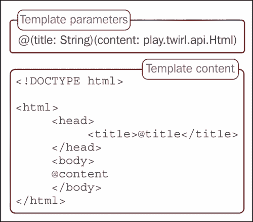
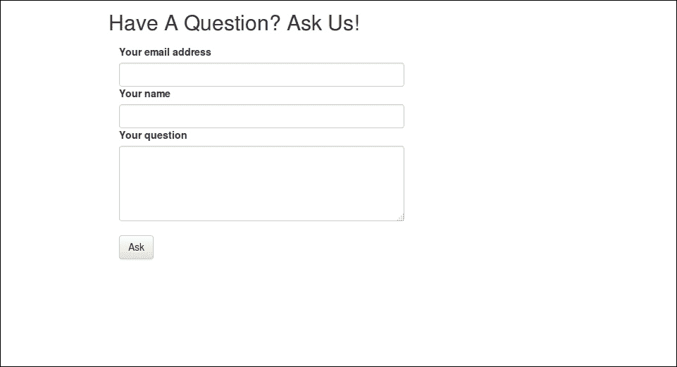
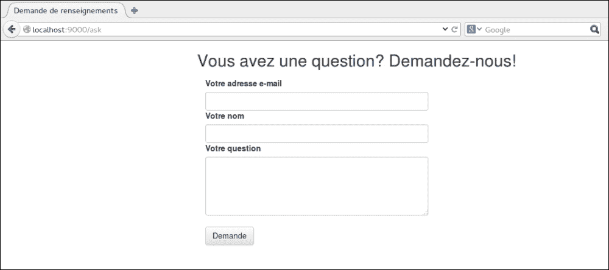
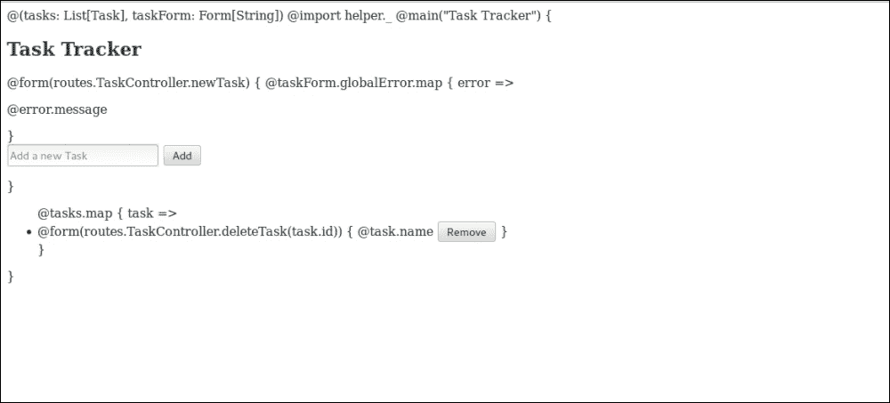

# 第四章 探索视图

**视图**是应用程序的一个基本组成部分，或者在交互最小的情况下，它们是展示应用程序功能的方式。它们有增加或完全阻止最终用户数量的能力。增强用户体验的视图总是比那些像迷宫一样复杂、用户难以完成简单任务的视图更受欢迎。它们是应用程序成功与否的决定性因素。

在本章中，我们将涵盖以下主题：

+   使用 Twirl 构建视图

+   生成表单

+   国际化

+   模板内部（涵盖 Twirl 的工作基本原理）

# 深入 Scala 模板

**Twirl**模板由参数和内容组成。以下图显示了名为`login.scala.html`的登录页面模板的组件：



### 注意

参数必须首先声明，因为它们被用作生成模板对象的`apply`方法的参数。例如，对于前面代码中显示的`main.scala.html`模板，`apply`方法将是：

```java
def apply/*1.2*/(title: String)(content:play.api.twirl.Html):play.api.templates.HtmlFormat.Appendable = {...}
```

模板内容可以是 HTML，也可以是 Scala 代码。

例如，让我们看看一些与 Play 捆绑在一起的`defaultpages`（通过`views.html.defaultpages`对象访问）中的`defaultpages`。对于此操作，默认视图未实现；`todo.scala.html`没有模板参数，其内容是纯 HTML。它定义如下：

```java
<!DOCTYPE html>
<html>
  <head>
    <title>TODO</title>
    <link rel="shortcut icon" href="data:image/png;base64,iVBORw..">
    <style>
    ...
    </style>

  </head>
  <body>
    <h1>TODO</h1>

    <p id="detail">
      Action not implemented yet.
    </p>

  </body>
</html>
```

类似地，未授权的默认视图`unauthorized.scala.html`也是一个静态页面。

现在，让我们检查开发模式下找不到操作视图`devNotFound.scala.html`的定义：

```java
@(request:play.api.mvc.RequestHeader, router:Option[play.core.Router.Routes])

<!DOCTYPE html>
<html>
  <head>
    <title>Action not found</title>
    <link rel="shortcut icon" href="data:image/png;base64,iVBORw..">
  </head>
  <body>
    <h1>Action not found</h1>

    <p id="detail">
      For request '@request'
    </p>

    @router match {

      case Some(routes) => {

        <h2>
          These routes have been tried, in this order:
        </h2>

                <div>
 @routes.documentation.zipWithIndex.map { r =>
 <pre><span class="line">@(r._2 + 1)</span><span class="route"><span class="verb">@r._1._1</span><span class="path">@r._1._2</span><span class="call">@r._1._3</span></span></pre>
 }
	             </div>

      }

      case None => {
        <h2>
          No router defined.
        </h2>
      }

        }

  </body>
</html>
```

在模板片段中，已排除样式组件，以专注于使用的 Scala 代码。

如果定义了路由文件，则它将以预格式化的块列出所有可用路由。可以调用为模板参数类型定义的方法，即使在模板内部也可以。例如，如果`books: Seq[String]`是参数之一，我们可以在模板内部调用`@books.length`或`@books.map{...}`等。

此外，Twirl 模板可以用于另一个模板中。这允许我们有可重用的视图块。例如，假设我们有一个主模板，它被所有其他视图使用，应用程序的主题（包括页眉、页脚、基本布局等）可以通过调整主模板来更新。考虑以下定义的模板`main.scala.html`：

```java
@(title: String)(content: play.twirl.api.Html)

<!DOCTYPE html>

<html>
    <head>
      <title>@title</title>
    </head>
    <body>
    <header>brand name</header>
    @content
    <footer>Copyright 2013</footer>
    </body>
</html>
```

重复使用此模板将像以下这样简单：

```java
@main("locate us"){
  <div>
    company address
  </div>
}
```

另一个例子是将*小部件*定义为模板。这些小部件模板可以在应用程序的多个视图中使用。同样，我们也可以在我们的模板中定义代码块。

## 构建视图

让我们构建一个视图，这在今天的 Web 应用中很常见。一个用户被要求选择他们想要登录的账户的视图，例如 Google、Facebook 等，提供了一个提供者列表，默认情况下，第一个提供者应该被选中。

考虑到在支持的第三方认证列表中，`otherAuth`作为模板参数传递。`otherAuth`的类型是`Seq[ThirdPartyAuth]`，其中`ThirdyPartyAuth`是一个案例类，用于表示任何第三方认证 API。

因此，这是以下完成的：

```java
<div>
    <p>
      Please select the account you wish to use

      @for(auth <- otherAuth) {
        <input type="radio" name="account" value="@auth.id"> @auth.name
    <br/>
        }
    </p>
</div>
```

在这个片段中，我们使用了`for`循环遍历所有受支持的第三方认证。在模板中，我们可以使用两个 Scala 函数，`for`和`if`，以及模板内部定义的和基于模板参数类型定义的函数。

现在剩下的唯一重要部分是设置默认值。我们可以通过使用 Twirl 提供的`defining`方法之一来实现这一点。让我们创建一个变量来检查提供者是否是第一个。然后我们可以为两种可能性提供不同的标记。如果我们修改我们的代码以适应这一点，我们将得到以下代码：

```java
<div>
    <p>
        Please select the account you wish to use

        @for(auth <- otherAuth) {
            @defining(auth.id == otherAuth.head.id) { isChecked =>
                @if(isChecked) {
                    <input type="radio" name="account" value="@auth.id" checked="checked"> @auth.name
                    } else {
                    <input type="radio" name="account" value="@auth.id"> @auth.name
                    }
            }
        <br/>
        }
    </p>
</div>
```

# 生成表单

在需要从用户那里获取输入的情况下，表单很重要，例如在注册、登录、搜索等情况。

Play 提供了生成表单的辅助工具和将表单数据转换为 Scala 对象的包装类。

现在，我们将使用 Play 提供的表单助手构建一个用户注册表单：

```java
@helper.form(action = routes.Application.newUser) {
  <label>Email Id
  <input type="email" name="email" tabindex="1" required="required">
        </label>

        <label>Password
          <input type="password" name="password" tabindex="2" required="required">
        </label>

        <input type="submit" value="Register" type="button">
    }
```

在这里，`@helper.form`是 Play 提供的一个模板，定义如下：

```java
@(action: play.api.mvc.Call, args: (Symbol,String)*)(body: => Html)

<form action="@action.url" method="@action.method" @toHtmlArgs(args.toMap)>
  @body
</form>
```

我们还可以为`form`元素提供其他参数，作为`Symbol`和`String`的元组。`Symbol`组件将成为参数，其对应的`String`组件将以以下方式设置为它的值：

```java
@helper.form(action = routes.Application.newUser, 'enctype -> "multipart/form-data")
```

生成的 HTML 现在如下所示：

```java
<form action="/register" method="POST" enctype="multipart/form-data">...</form>
```

这是因为定义了以下`toHtmlArgs`辅助方法：

```java
def toHtmlArgs(args: Map[Symbol, Any]) = play.twirl.api.Html(args.map({
  case (s, None) => s.name
  case (s, v) => s.name + "=\"" + play.twirl.api.HtmlFormat.escape(v.toString).body + "\""
}).mkString(" "))
```

现在，当我们尝试注册用户时，动作内的请求体将是：

```java
AnyContentAsFormUrlEncoded(Map(email -> ArrayBuffer(testUser@app.com), password -> ArrayBuffer(password)))
```

如果指定了`enctype`参数，并且请求被解析为`multipartformdata`，则请求体将如下所示：

```java
MultipartFormData(Map(password -> List(password), email -> List(testUser@app.com)),List(),List(),List())
```

我们不需要定义自定义方法来接受一个映射，以便它产生相应的模型，我们可以使用`play.api.data.Form`表单数据助手对象。

表单对象有助于以下：

+   将表单数据映射到用户定义的模型（如案例类）或元组

+   验证输入的数据是否满足所需的约束。这可以针对所有字段集体进行，也可以针对每个字段独立进行，或者两者都进行。

+   填写默认值。

我们可能需要将表单数据转换为凭据；在这种情况下，类定义如下：

```java
case class Credentials(loginId: String, password: String)
```

我们可以将注册视图更新为使用表单对象，如下所示：

```java
@import models.Credentials

@(registerForm: Form[Credentials])(implicit flash: Flash)

@main("Register") {
    <div id="signup" class="form">
    @helper.form(action = routes.Application.newUser, 'enctype -> "multipart/form-data") {
        <hr/>
        <div>

            <label>Email Id
              <input type="email" name="loginId" tabindex="1" required="required">
            </label>

            <label>Password
              <input type="password" name="password" tabindex="2" required="required">
            </label>

        </div>
        <input type="submit" value="Register">
        <hr/>
          Existing User?<a href="@routes.Application.login()">Login</a>
        <hr/>
    }
    </div>
}
```

现在我们定义一个表单，它从具有 `loginId` 和 `password` 字段的表单创建一个凭据对象：

```java
val signupForm = Form(
    mapping(
      "loginId" -> email,
      "password" -> nonEmptyText
    )(Credentials.apply)(Credentials.unapply)
```

现在我们定义以下操作：

```java
  def register = Action {
    implicit request =>
      Ok(views.html.register(signupForm)).withNewSession
  }

  def newUser = Action(parse.multipartFormData) {
    implicit request =>
      signupForm.bindFromRequest().fold(
        formWithErrors => BadRequest(views.html.register(formWithErrors)),
        credentials => Ok
      )
  }
```

`register` 和 `newUser` 方法分别映射到 `GET /register` 和 `POST /register`。我们将表单传递到视图中，以便在表单验证出错时，它们会与表单字段一起在视图中显示。我们将在下一节中详细看到这一点。

让我们看看它是如何工作的。当我们填写表单并提交时，调用将转到 `newUser` 动作。`signupForm` 是一个表单，定义如下：

```java
case class FormT { … }
```

我们使用了在其伴随对象中定义的构造函数：

```java
def applyT: Form[T] = Form(mapping, Map.empty, Nil, None)
```

`mapping` 方法可以接受最多 18 个参数。也可以使用 `tuple` 方法来定义表单，这会依次调用 `mapping` 方法：

```java
def tupleA1, A2, a2: (String, Mapping[A2])): Mapping[(A1, A2)] = mapping(a1, a2)((a1: A1, a2: A2) => (a1, a2))((t: (A1, A2)) => Some(t))
```

使用这个方法，而不是为 `signupForm` 映射，你将得到以下代码：

```java
val signupForm = Form(
    tuple(
      "loginId" -> email,
      "password" -> nonEmptyText
    ) 
  )
```

### 注意

在使用映射和元组定义表单时，我们使用的 `email` 和 `nonEmptyText` 术语是预定义约束，并且也在 `Form` 对象中定义。下一节将详细讨论它们。

当定义只有一个字段的表单时，我们可以使用 `single` 方法，因为元组没有为单个字段定义，如下所示：

```java
def singleA1): Mapping[(A1)] = mapping(a1)((a1: A1) => (a1))((t: (A1)) => Some(t))
```

在我们的操作中调用的方法是 `signupForm.bindRequestFrom`。`bindRequestFrom` 方法接受一个隐式请求，并用请求中的表单数据填充表单。

一旦我们填写了表单，我们需要检查它是否有任何错误。这就是 `fold` 方法派上用场的地方，如下定义：

```java
def foldR: R = value match {
  case Some(v) if errors.isEmpty => success(v)
  case _ => hasErrors(this)
}
```

变量 `errors` 和 `value` 来自表单构造函数。错误类型是 `Seq[FormError]`，而值的类型是 `Option[T]`。

然后，如果表单有错误，我们将 `fold` 的结果映射到 `BadRequest(formWithErrors)`；如果没有错误，我们可以继续处理通过表单提交的数据。

## 在数据上添加约束

限制用户输入的表单数据，通常需要遵循一个或多个规则。例如，检查姓名字段数据是否不包含数字，年龄是否小于 18 岁，如果使用过期卡完成交易等情况。Play 提供了默认约束，可用于验证字段数据。使用这些约束，我们可以轻松定义表单，并在某些方面限制字段数据，如下所示：

```java
mapping(
    "userName" -> nonEmptyText,
    "emailId" -> email,
    "password" -> nonEmptyText(minLength=8,maxLength=15)
    )
```

默认约束可以大致分为两类：定义简单 `Mapping[T]` 的那些，以及消耗 `Mapping[T]` 并产生 `Mapping[KT]` 的那些，如下所示：

```java
mapping(
    "userName" -> nonEmptyText,
    "interests" -> list(nonEmptyText)
    )
```

在此示例中，`Mapping[String]` 转换为 `Mapping[List[String]]`。

还有两种不属于上述任一类的约束。它们是 `ignored` 和 `checked`。

当我们需要将该字段的用户数据进行映射时，可以使用`ignored`约束。例如，登录时间或登出时间等字段应由应用程序填写，而不是用户。我们可以这样使用`mapping`：

```java
mapping(
    "loginId" -> email,
    "password" -> nonEmptyText,
    "loginTime" -> ignored(System.currentTimeMillis())
    )
```

当我们需要确保用户已选中特定的复选框时，可以使用`checked`约束。例如，在`signupForm`中接受组织的条款和条件等，我们可以这样定义：

```java
mapping(
    "loginId" -> email,
    "password" -> nonEmptyText,
    "agree" -> checked("agreeTerms")
    )
```

第一类约束列在此表中：

| 约束 | 结果 | 额外属性及其默认值（如有） |
| --- | --- | --- |
| `text` | `Mapping[String]` | `minLength`: 0, `maxLength`: `Int.MaxValue` |
| `nonEmptyText` | `Mapping[String]` | `minLength`: 0, `maxLength`: `Int.MaxValue` |
| `number` | `Mapping[Int]` | `min`: `Int.MinValue`, `max`: `Int.MaxValue`, `strict`: `false` |
| `longNumber` | `Mapping[Long]` | `min`: `Long.MinValue`, `max`: `Long.MaxValue`, strict: `false` |
| `bigDecimal` | `Mapping[BigDecimal]` | precision, scale |
| `date` | `Mapping[java.util.Date]` | pattern, `timeZone`: `java.util.TimeZone.getDefault` |
| `sqlDate` | `Mapping[java.sql.Date]` | pattern, `timeZone`: `java.util.TimeZone.getDefault` |
| `jodaDate` | `Mapping[org.joda.time.DateTime]` | pattern, `timeZone`: `org.joda.time.DateTimeZone.getDefault` |
| `jodaLocalDate` | `Mapping[org.joda.time.LocalDate]` | pattern |
| `email` | `Mapping[String]` | |
| `boolean` | `Mapping[Boolean]` | |

此表列出了第二类中包含的约束：

| 约束 | 结果 | 必需的参数及其类型 |
| --- | --- | --- |
| `optional` | `Mapping[Option[A]]` | `mapping`: `Mapping[A]` |
| `default` | `Mapping[A]` | `mapping`: `Mapping[A]`, value: `A` |
| `list` | `Mapping[List[A]]` | `mapping`: `Mapping[A]` |
| `seq` | `Mapping[Seq[A]]` | `mapping`: `Mapping[A]` |
| `set` | `Mapping[Seq[A]]` | `mapping`: `Mapping[A]` |

除了这些字段约束外，我们还可以使用`verifying`方法在字段上定义临时的和/或自定义约束。

可能会出现应用程序允许用户选择他们的`userName`的情况，该用户名只能由数字和字母组成。为了确保此规则不被违反，我们可以定义一个临时的约束：

```java
mapping(
"userName" ->  nonEmptyText(minLength=5) verifying pattern("""[A-Za-z0-9]*""".r, error = "only digits and alphabet are allowed in userName"
)
```

或者，我们可以使用`Constraint`案例类定义一个自定义约束：

```java
val validUserName = """[A-Za-z0-9]*""".r
val userNameCheckConstraint: Constraint[String] = Constraint("contraints.userName")({
    text =>
      val error = text match {
        case validUserName() => Nil
        case _ => Seq(ValidationError("only digits and alphabet are allowed in userName"))
      }
      if (error.isEmpty) Valid else Invalid(error)
  })

val userNameCheck: Mapping[String] = nonEmptyText(minLength = 5).verifying(passwordCheckConstraint)
```

我们可以在表单定义中使用此功能：

```java
mapping(
"userName" ->  userNameCheck
)
```

注意，`nonEmpty`, `minLength`, `maxLength`, `min`, `max`, `pattern`, 和 `email` 是预定义的约束。它们定义在`play.api.data.validation`特质中。在定义自定义约束时，可以使用可用的约束作为参考。

## 处理错误

当表单提交中一个或多个约束被违反时，会发生什么？`bindFromRequest`方法创建一个包含错误的表单，我们之前称之为`formWithErrors`。

对于每个违反的约束，都会保存一个错误。错误由`FormError`表示，其定义如下：

```java
case class FormError(key: String, messages: Seq[String], args: Seq[Any] = Nil)
```

`key`是违反约束的字段名称，`message`是对应的错误信息，`args`是消息中使用的任何参数。在多个字段中定义约束的情况下，`key`是一个空字符串，此类错误被称为`globalErrors`。

可以通过定义的`errors`方法访问特定字段的表单错误：

```java
def errors(key: String): Seq[FormError] = errors.filter(_.key == key)
```

例如：

```java
registerForm.errors("userName")
```

或者，为了只访问第一个错误，我们可以使用`error`方法。它定义如下：

```java
def error(key: String): Option[FormError] = errors.find(_.key == key)
```

那么，我们如何访问`globalErrors`（即由多个字段一起定义的约束错误）？

我们可以使用表单的`globalErrors`方法，它定义如下：

```java
def globalErrors: Seq[FormError] = errors.filter(_.key.isEmpty)
```

如果我们只想获取第一个`globalError`方法，我们可以使用`globalError`方法。它定义如下：

```java
def globalError: Option[FormError] = globalErrors.headOption
```

当我们使用表单字段助手时，字段特定的错误会被映射到字段，并在存在时显示。然而，如果我们不使用表单助手，我们需要显示错误，如下所示：

```java
<label>Password
  <input type="password" name="password" tabindex="2" required="required">
</label>
@registerForm.errors("password").map{ er => <p>@er.message</p>}
```

需要显式地将`globalErrors`方法添加到视图中，如下所示：

```java
@registerForm.globalErrors.map{ er => <p>@er.message</p>}
```

## 表单字段助手

在上一个示例中，我们使用了`form`字段的 HTML 代码，但也可以使用 Play 提供的`form`字段助手来完成这项工作。我们可以更新我们的`view,@import models.Credentials`，如下所示：

```java
@(registerForm: Form[Credentials])(implicit flash: Flash) 

@main("Register") { 
  @helper.form(action = routes.Application.newUser, 'enctype -> "multipart/form-data") { 
    @registerForm.globalErrors.map { error => 
      <p class="error"> 
        @error.message 
      </p> 
    } 

    @helper.inputText(registerForm("loginId"), 'tabindex -> "1", '_label -> "Email ID", 
    'type -> "email", 'required -> "required", '_help -> "A valid email Id") 

    @helper.inputPassword(registerForm("password"), 'tabindex -> "2", 
    'required -> "required", '_help -> "preferable min.length=8") 

    <input type="submit" value="Register"> 
    <hr/> 
    Existing User?<a href="@routes.Application.login()">Login</a> 
    } 
}
```

让我们看看它是如何工作的。助手`inputText`是一个如下定义的视图：

```java
@(field: play.api.data.Field, args: (Symbol,Any)*)(implicit handler: FieldConstructor, lang: play.api.i18n.Lang)

@inputType = @{ args.toMap.get('type).map(_.toString).getOrElse("text") }

@input(field, args.filter(_._1 != 'type):_*) { (id, name, value, htmlArgs) =>
    <input type="@inputType" id="@id" name="@name" value="@value" @toHtmlArgs(htmlArgs)/>
}
```

它使用内部输入助手，这同样也是一个视图，可以定义如下：

```java
@(field: play.api.data.Field, args: (Symbol, Any)* )(inputDef: (String, String, Option[String], Map[Symbol,Any]) => Html)(implicit handler: FieldConstructor, lang: play.api.i18n.Lang)

@id = @{ args.toMap.get('id).map(_.toString).getOrElse(field.id) }

@handler(
    FieldElements(
        id,
        field,
        inputDef(id, field.name, field.value, args.filter(arg => !arg._1.name.startsWith("_") && arg._1 != 'id).toMap),
        args.toMap,
        lang
    )
)
```

两个`form`字段助手都使用隐式的`FieldConstructor`。这个字段构造器负责渲染 HTML。默认情况下，`defaultFieldConstructor`被转发。它定义如下：

```java
@(elements: FieldElements)

<dl class="@elements.args.get('_class) @if(elements.hasErrors) {error}" id="@elements.args.get('_id).getOrElse(elements.id + "_field")">
    @if(elements.hasName) {
    <dt>@elements.name(elements.lang)</dt>
    } else {
    <dt><label for="@elements.id">@elements.label(elements.lang)</label></dt>
    }
    <dd>@elements.input</dd>
    @elements.errors(elements.lang).map { error =>
        <dd class="error">@error</dd>
    }
    @elements.infos(elements.lang).map { info =>
        <dd class="info">@info</dd>
    }
</dl>
```

因此，如果我们想更改`form`字段的布局，我们可以定义一个自定义的`FieldConstructor`并将其传递给`form`字段助手，如下所示：

```java
@input(contactForm("name"), '_label -> "Name", '_class -> "form-group", '_size -> "100") { (id, name, value, htmlArgs) =>
  <input class="form-control" type="text" id="@id" name="@name" value="@value" @toHtmlArgs(htmlArgs)/>
}
```

本节试图解释表单助手是如何工作的；更多示例，请参阅 Play 框架文档[`www.playframework.com/documentation/2.3.x/ScalaForms`](http://www.playframework.com/documentation/2.3.x/ScalaForms)。

# 国际化

由于互联网的广泛覆盖，现在可以与来自不同地区的人们进行沟通和互动。一个只使用一种特定语言与用户沟通的应用程序，通过仅使用该语言来限制其用户基础。国际化本地化可以通过消除由于仅使用特定语言而产生的障碍，来满足来自各个地区的用户群体。

现在，让我们构建一个简单的视图，它允许我们提出一个问题。`views/index.scala.html`视图文件将类似于以下内容：

```java
@(enquiryForm: Form[(String, Option[String], String)]) 

@import helper._ 

@main("Enquiry") { 

    <div> 
        <h2>Have a question? Ask Us</h2> 

        @form(routes.AppController.enquire) { 

            @enquiryForm.globalError.map { error => 
                <p> 
                    @error.message 
                </p> 
            } 

            <label for="emailId">Your email address 
                <input type="email" id="emailId" name="emailId" required> 
            </label> 

            <label for="userName">Your name 
                <input type="text" class="form-control" id="userName" name="userName"> 
            </label> 

            <label for="question">Your question 
                <textarea rows="4" id="question" name="question"></textarea> 
            </label> 

            <br/> 
            <button type="submit">Ask</button> 
        } 
    </div> 
}
```

这里，`AppController`是一个控制器，定义如下：

```java
package controllers

import play.api.mvc._
import play.api.data.Form
import play.api.data.Forms._

object AppController extends Controller {

  val enquiryForm = Form(
    tuple(
      "emailId" -> email,
      "userName" -> optional(text),
      "question" -> nonEmptyText)
  )

  def index = Action {
    implicit request =>
      Redirect(routes.AppController.askUs)
  }

  def askUs = Action {
    implicit request =>
      Ok(views.html.index(enquiryForm))
  }

  def enquire = Action {
    implicit request =>
      enquiryForm.bindFromRequest.fold(
        errors => BadRequest(views.html.index(errors)),
        query => {
          println(query.toString)
          Redirect(routes.AppController.askUs)
        }
      )
  }

}
```

主模板`views/main.scala.html`定义如下：

```java
@(title: String)(content: Html) 
<!DOCTYPE html> 

<html> 
    <head> 
        <title>@title</title> 
    </head> 
    <body> 
    @content 
    </body> 
</html> 
```

应用程序的路线如下定义：

```java
# Home page
GET         /                    controllers.AppController.index

# Other
GET         /ask                 controllers.AppController.askUs
POST        /enquire             controllers.AppController.enquire
```

现在我们启动应用程序时，借助一点样式（CSS 样式），我们的视图看起来类似于以下这样：



## 支持多语言视图

我们可能希望我们的应用程序同时提供英语和法语。因此，为不同的语言提供不同的视图是一个坏主意。这意味着每次添加对一种语言的支持时，我们都需要在我们的应用程序中以这种特定语言定义所有视图。使用 Play 的*i18n*支持，支持另一种语言可以简单到只需添加一个包含翻译的文件。

首先，我们需要在`conf/application.conf`中指定应用程序支持的语言。请注意，这是默认`conf/application.conf`中的注释代码，表示以下内容：

```java
# The application languages
# ~~~~~
# application.langs="en"
```

应指定语言的方式是其 ISO 639-2 代码，可选地后跟 ISO 3166-1 alpha-2 国家代码。您还可以包括法语，如下所示：

```java
application.langs="en,fr"
```

在 Play 中，用于在特定语言中渲染内容的翻译被称为消息。对于每种语言，我们需要提供一个`conf/messages.lang-code`文件。如果我们希望有通用内容，我们应该在`conf/messages`中定义它；这对于名称、品牌等非常有用。

让我们创建一个名为`conf/messages.en`的英语`messages`文件：

```java
enquiry.title = Enquiry
enquiry.askUs=Have A Question? Ask Us!
enquiry.user.email=Your email address
enquiry.user.name=Your name
enquiry.question=Your question
enquiry.submit=Ask
```

现在我们需要更新我们的视图以使用这些消息，形式为`@(enquiryForm: Form[(String, Option[String], String)])(implicit lang: Lang)`：

```java
@import helper._ 

@main(Messages("enquiry.title")) { 

    <div> 
        <h2>@Messages("enquiry.askUs")</h2> 

        @form(routes.AppController.enquire) { 

            @enquiryForm.globalError.map { error => 
                <p> 
                    @error.message 
                </p> 
            } 

            <label for="emailId">@Messages("enquiry.user.email") 
                <input type="email" id="emailId" name="emailId" required> 
            </label> 

            <label for="userName">@Messages("enquiry.user.name") 
                <input type="text" class="form-control" id="userName" name="userName"> 
            </label> 

            <label for="question">@Messages("enquiry.question") 
                <textarea rows="4" id="question" name="question"></textarea> 
            </label> 

            <br/> 
            <button type="submit">@Messages("enquiry.submit")</button> 
        } 
    </div>
}
```

现在，让我们添加法语`messages`文件，`conf/messages.fr`：

```java
enquiry.title = Demande de renseignements
enquiry.askUs = Vous avez une question? Demandez-nous!
enquiry.user.email = Votre adresse e-mail
enquiry.user.name = Votre nom
enquiry.question = Votre question
enquiry.submit = Demandez
```

修改您的浏览器设置，以便将法语（fr）设置为首选语言并运行应用程序。您应该能够看到法语查询视图：



我们还可以在导入`play.api.i18n`之后在 Scala 代码中使用这些消息：

```java
val title = Messages("enquiry.title")
```

## 理解国际化

当我们在代码中使用`Messages`（单词）时，它调用`play.api.i18n.Messages`对象的`apply`方法。`apply`方法定义如下：

```java
def apply(key: String, args: Any*)(implicit lang: Lang): String = {
    Play.maybeApplication.flatMap { app =>
      app.plugin[MessagesPlugin].map(_.api.translate(key, args)).getOrElse(throw new Exception("this plugin was not registered or disabled"))
    }.getOrElse(noMatch(key, args))
  }
```

Play 有一个内部插件，称为`MessagesPlugin`，定义如下：

```java
class MessagesPlugin(app: Application) extends Plugin {

  import scala.collection.JavaConverters._

  import scalax.file._
  import scalax.io.JavaConverters._

  private def loadMessages(file: String): Map[String, String] = {
    app.classloader.getResources(file).asScala.toList.reverse.map { messageFile =>
      new Messages.MessagesParser(messageFile.asInput, messageFile.toString).parse.map { message =>
        message.key -> message.pattern
      }.toMap
    }.foldLeft(Map.empty[String, String]) { _ ++ _ }
  }

  private lazy val messages = {
    MessagesApi {
      Lang.availables(app).map(_.code).map { lang =>
        (lang, loadMessages("messages." + lang))
      }.toMap + ("default" -> loadMessages("messages"))
    }
  }

  //The underlying internationalization API.
  def api = messages

  //Loads all configuration and message files defined in the classpath.
  override def onStart() {
    messages
  }

}
```

此插件负责加载所有消息并生成一个`MessagesApi`对象，该对象随后用于获取消息的值。因此，当我们提到一个消息时，它就是从这个`MessagesApi`实例中获取的。`MessagesApi`的定义如下：

```java
case class MessagesApi(messages: Map[String, Map[String, String]]) {

  import java.text._

  //Translates a message.
  def translate(key: String, args: Seq[Any])(implicit lang: Lang): Option[String] = {
    val langsToTry: List[Lang] =
      List(lang, Lang(lang.language, ""), Lang("default", ""), Lang("default.play", ""))
    val pattern: Option[String] =
      langsToTry.foldLeft[Option[String]](None)((res, lang) =>
        res.orElse(messages.get(lang.code).flatMap(_.get(key))))
    pattern.map(pattern =>
      new MessageFormat(pattern, lang.toLocale).format(args.map(_.asInstanceOf[java.lang.Object]).toArray))
  }

  //Check if a message key is defined.
  def isDefinedAt(key: String)(implicit lang: Lang): Boolean = {
    val langsToTry: List[Lang] = List(lang, Lang(lang.language, ""), Lang("default", ""), Lang("default.play", ""))

    langsToTry.foldLeftBoolean({ (acc, lang) =>
      acc || messages.get(lang.code).map(_.isDefinedAt(key)).getOrElse(false)
    })
  }

}
```

### 注意

隐式的`lang`参数是获取接受语言消息的关键。

# Play 中的 Scala 模板

Play 支持在视图中使用 Scala 代码，并提供了一些辅助方法来简化定义视图的过程。

我们已经创建了不同的视图。让我们看看它们是如何实际渲染的。考虑我们在第一章中看到的任务跟踪器应用程序的视图，*Play 入门*。

```java
@(tasks: List[Task], taskForm: Form[String])

@import helper._

@main("Task Tracker") {

    <h2>Task Tracker</h2>

    <div>
    @form(routes.TaskController.newTask) {

        @taskForm.globalError.map { error =>
            <p class="error">
                @error.message
            </p>
        }
        <form>
            <input type="text" name="taskName" placeholder="Add a new Task" required>

            <input type="submit" value="Add">
        </form>
    }
    </div>
    <div>
        <ul>
        @tasks.map { task =>
            <li>
                @form(routes.TaskController.deleteTask(task.id)) {
                  @task.name <input type="submit" value="Remove">
                }
            </li>
        }
        </ul>
    </div>

}
```

视图包含 Scala 代码和 HTML，那么它是如何正确渲染的呢？

在浏览器中打开任务跟踪器视图，而不运行 Play 应用程序。浏览器将页面渲染如下：



现在看看当你运行 Play 应用程序时，它如何以不同的方式渲染！

当 Play 应用程序编译时，会生成与路由相关的文件（`routes_reverseRouting.scala`和`routes_routing.scala`，`controllers/routes.java`）和 Scala 视图。路由相关的文件是通过**路由编译器**生成的，而 Scala 视图是通过**模板编译器**生成的。Play 的 Scala 模板引擎已被提取出来，以方便在独立于 Play 的项目中使用。Play 的 Scala 模板引擎现在作为 Twirl 提供。根据[`github.com/spray/twirl`](https://github.com/spray/twirl)，选择 Twirl 作为名称的原因是：

> *作为“Play 框架 Scala 模板引擎”这个相对繁琐的名称的替代，我们寻找一个更短且带有“冲击力”的名称，并喜欢将 Twirl 作为对模板语言“魔法”字符@的参考，该字符有时也被称为“twirl”。*

## 理解 Twirl 的工作原理

Play 的插件通过依赖**SbtTwirl**来定义；我们可以在插件定义中看到这一点：

```java
object Play
  extends AutoPlugin
  with PlayExceptions
  with PlayReloader
  with PlayCommands
  with PlayRun
  with play.PlaySettings
  with PlayPositionMapper
  with PlaySourceGenerators {

  override def requires = SbtTwirl && SbtJsTask && SbtWebDriver

  val autoImport = play.PlayImport

  override def projectSettings =
    packageArchetype.java_server ++
      defaultSettings ++
      intellijCommandSettings ++
      Seq(testListeners += testListener) ++
      Seq(
        scalacOptions ++= Seq("-deprecation", "-unchecked", "-encoding", "utf8"),
        javacOptions in Compile ++= Seq("-encoding", "utf8", "-g")
      )
}
```

此外，还有一些使用**TwirlKeys**在`defaultSettings`中定义的 SBT 键。TwirlKeys 公开了一些键，可以用来根据我们的要求自定义 Twirl。使用 TwirlKeys 公开的键包括：

+   `twirlVersion`: 这是用于 twirl-api 依赖的 Twirl 版本（`SettingKey[String]`）。

+   `templateFormats`: 这定义了 Twirl 模板格式（`SettingKey[Map[String, String]]`）。默认可用的格式有`html`、`txt`、`xml`和`js`。

+   `templateImports`: 这包括用于 Twirl 模板的额外导入（`SettingKey[Seq[String]]`）。默认值是一个空序列。

+   `useOldParser`: 这使用原始的 Play 模板解析器（`SettingKey[Boolean]`）；默认值为 false。

+   `sourceEncoding`: 这包括模板文件和生成的 Scala 文件的源编码（`TaskKey[String]`）。如果 Scala 编译器选项中没有指定编码，则使用 UTF-8 编码。

+   `compileTemplates`: 这将 Twirl 模板编译成 Scala 源文件（`TaskKey[Seq[File]]`）。

要理解这个任务，让我们看看 Twirl 插件中如何定义`twirlSettings`：

```java
  def twirlSettings: Seq[Setting[_]] = Seq(
    includeFilter in compileTemplates := "*.scala.*",
    excludeFilter in compileTemplates := HiddenFileFilter,
    sourceDirectories in compileTemplates := Seq(sourceDirectory.value / "twirl"),

    sources in compileTemplates <<= Defaults.collectFiles(
      sourceDirectories in compileTemplates,
      includeFilter in compileTemplates,
      excludeFilter in compileTemplates
    ),

    watchSources in Defaults.ConfigGlobal <++= sources in compileTemplates,

    target in compileTemplates := crossTarget.value / "twirl" / Defaults.nameForSrc(configuration.value.name),

    compileTemplates := compileTemplatesTask.value,

    sourceGenerators <+= compileTemplates,
    managedSourceDirectories <+= target in compileTemplates
  )
```

`compileTemplates`设置从`compileTemplatesTask.value`获取其值。`compileTemplatesTask`反过来返回`TemplateCompiler.compile`方法的结果，如下所示：

```java
  def compileTemplatesTask = Def.task {
    TemplateCompiler.compile(
      (sourceDirectories in compileTemplates).value,
      (target in compileTemplates).value,
      templateFormats.value,
      templateImports.value,
      (includeFilter in compileTemplates).value,
      (excludeFilter in compileTemplates).value,
      Codec(sourceEncoding.value),
      useOldParser.value,
      streams.value.log
    )
  }

...
}
```

`TemplateCompiler.compile`的定义如下：

```java
  def compile(
    sourceDirectories: Seq[File],
    targetDirectory: File,
    templateFormats: Map[String, String],
    templateImports: Seq[String],
    includeFilter: FileFilter,
    excludeFilter: FileFilter,
    codec: Codec,
    useOldParser: Boolean,
    log: Logger) = {

    try {
      syncGenerated(targetDirectory, codec)
      val templates = collectTemplates(sourceDirectories, templateFormats, includeFilter, excludeFilter)
      for ((template, sourceDirectory, extension, format) <- templates) {
        val imports = formatImports(templateImports, extension)
        TwirlCompiler.compile(template, sourceDirectory, targetDirectory, format, imports, codec, inclusiveDot = false, useOldParser = useOldParser)
      }
      generatedFiles(targetDirectory).map(_.getAbsoluteFile)
    } catch handleError(log, codec)
  }
```

如果项目内不存在，`compile` 方法将在项目中创建 `target/scala-scalaVersion/src_managed` 目录。如果已存在，则通过 `cleanUp` 方法删除所有匹配 `"*.template.scala"` 模式的文件。之后，`collectTemplates` 方法通过搜索名称匹配 `"*.scala.*"` 模式且以受支持扩展名结尾的文件来获取 `Seq[(File, String, TemplateType)]`。

然后，`collectTemplates` 的结果中的每个对象都作为 `TwirlCompiler.compile` 的参数传递。

`TwirlCompiler.compile` 负责解析和生成 Scala 模板，其定义如下：

```java
def compile(source: File, sourceDirectory: File, generatedDirectory: File,
formatterType: String, additionalImports: String = "", logRecompilation: (File, File) => Unit = (_, _) => ()) = {
    val resultType = formatterType + ".Appendable"
    val (templateName, generatedSource) = generatedFile(source, sourceDirectory, generatedDirectory)
    if (generatedSource.needRecompilation(additionalImports)) {
      logRecompilation(source, generatedSource.file)
      val generated = parseAndGenerateCode(templateName, Path(source).byteArray, source.getAbsolutePath, resultType, formatterType, additionalImports)

      Path(generatedSource.file).write(generated.toString)

      Some(generatedSource.file)
    } else {
      None
    }
  }
```

`parseAndGenerateCode` 方法获取解析器并解析文件。生成的解析 `Template`（内部对象）随后传递给 `generateFinalCode` 方法。`generateFinalCode` 方法负责生成代码。内部，它使用 `generateCode` 方法，其定义如下：

```java
def generateCode(packageName: String, name: String, root: Template, resultType: String, formatterType: String, additionalImports: String) = {
  val extra = TemplateAsFunctionCompiler.getFunctionMapping(
    root.params.str,
    resultType)

    val generated = {
      Nil :+ """
package """ :+ packageName :+ """

import twirl.api._
import TemplateMagic._

  """ :+ additionalImports :+ """
/*""" :+ root.comment.map(_.msg).getOrElse("") :+ """*/
object """ :+ name :+ """ extends BaseScalaTemplate[""" :+ resultType :+ """,Format[""" :+ resultType :+ """]](""" :+ formatterType :+ """) with """ :+ extra._3 :+ """ {

    /*""" :+ root.comment.map(_.msg).getOrElse("") :+ """*/
    def apply""" :+ Source(root.params.str, root.params.pos) :+ """:""" :+ resultType :+ """ = {
        _display_ {""" :+ templateCode(root, resultType) :+ """}
    }

  """ :+ extra._1 :+ """

  """ :+ extra._2 :+ """

    def ref: this.type = this

}"""
    }
    generated
  }
```

`parseAndGenerateCode` 的结果写入其对应的文件。

让我们看看我们将要使用我们生成的文件的地方！

考虑到定义在第一章中的视图，*Play 入门*；生成的 Scala 模板类似于以下内容：

```java
package views.html

import play.templates._
import play.templates.TemplateMagic._

import play.api.templates._
import play.api.templates.PlayMagic._
import models._
import controllers._
import play.api.i18n._
import play.api.mvc._
import play.api.data._
import views.html._
/**/
object index extends BaseScalaTemplate[play.api.templates.HtmlFormat.Appendable,Format[play.api.templates.HtmlFormat.Appendable]](play.api.templates.HtmlFormat) with play.api.templates.Template2[List[Task],Form[String],play.api.templates.HtmlFormat.Appendable] {

    /**/
    def apply/*1.2*/(tasks: List[Task], taskForm: Form[String]):play.api.templates.HtmlFormat.Appendable = {
      _display_ {import helper._

SeqAny,format.raw/*4.1*/("""
"""),_display_(SeqAny/*5.22*/ {_display_(SeqAny,_display_(SeqAny/*10.41*/ {_display_(SeqAny,_display_(SeqAny,_display_(SeqAny),format.raw/*14.31*/("""
            </p>
        """)))})),format.raw/*16.10*/("""
        <form>
            <input type="text" name="taskName" placeholder="Add a new Task" required>

            <input type="submit" value="Add">
        </form>
        """)))})),format.raw/*22.6*/("""
    </div>
    <div>
        <ul>
        """),_display_(SeqAny,_display_(SeqAny)/*28.65*/ {_display_(SeqAny,_display_(SeqAny),format.raw/*29.31*/(""" <input type="submit" value="Remove">
                """)))})),format.raw/*30.18*/("""
            </li>
        """)))})),format.raw/*32.10*/("""
        </ul>
    </div>

""")))})))}
    }

    def render(tasks:List[Task],taskForm:Form[String]): play.api.templates.HtmlFormat.Appendable = apply(tasks,taskForm)

    def f:((List[Task],Form[String]) => play.api.templates.HtmlFormat.Appendable) = (tasks,taskForm) => apply(tasks,taskForm)

    def ref: this.type = this

}
                /*
                    -- GENERATED --
                    DATE: Timestamp
                    SOURCE: /TaskTracker/app/views/index.scala.html
                    HASH: ff7c2a525ebc63755f098d4ef80a8c0147eb7778
                    MATRIX: 573->1|726->44|754->63|790->65|818->85|857->87|936->131|980->166|1020->168|1067->179|1084->187|1109->203|1158->214|1242->262|1256->267|1286->275|1345->302|1546->472|1626->516|1640->521|1653->525|1701->535|1772->570|1828->617|1868->619|1926->641|1939->645|1966->650|2053->705|2113->733
                    LINES: 19->1|23->1|25->4|26->5|26->5|26->5|31->10|31->10|31->10|33->12|33->12|33->12|33->12|35->14|35->14|35->14|37->16|43->22|47->26|47->26|47->26|47->26|49->28|49->28|49->28|50->29|50->29|50->29|51->30|53->32
                    -- GENERATED --
*/
```

因此，当我们以 `views.html.index(Task.all, taskForm)` 的方式在控制器中引用此视图时，我们正在调用生成的模板对象 index 的 `apply` 方法。

# 故障排除

在使用 Play 视图时，我们可能会遇到以下一些问题：

+   当你点击 **提交** 时，表单没有提交，并且没有使用 `globalErrors` 显示错误。

    可能存在一种情况，某个特定字段缺失或字段名称有误。它不会在 `globalErrors` 中显示，但如果尝试显示单个字段的错误，`error.required` 将会显示缺失的字段。

+   我们是否需要为应用程序的视图使用 Twirl 模板？

    不，Play 不会强迫开发者为视图使用 Twirl 模板。他们可以自由地以他们认为简单或舒适的方式设计视图。例如，这可以通过使用 Handlebars、Google Closure 模板等方式完成。

+   这是否以任何方式影响了应用程序的性能？

    不，除非你的视图定义没有性能缺陷，否则将其插入 Play 应用程序不会影响性能。有一些项目使用 Play 服务器作为它们的原生 Android 和 iOS 应用程序。

+   Play 是否支持其他模板库？

    不，但有一些 Play 插件可以帮助使用其他可用的模板机制或库。由于它们是由个人或其他组织开发的，所以在使用之前请检查它们的许可协议。

+   尽管应用程序的语言配置已经更新，并添加了各种语言的消息，但视图只以英语渲染。在运行时没有抛出错误，但仍然没有达到预期的效果。

    为了让 Play 从请求中确定使用的语言，要求请求必须是隐式的。确保应用程序中定义的所有操作都使用隐式请求。

    另一种可能性是 Accept-Language 头可能缺失。这可以通过更新浏览器设置来添加。

+   当访问一个在语言资源中没有映射的消息时，会发生编译错误吗？

    不，如果访问了一个未定义的消息，将会发生编译错误。如果需要，您可以实现这个机制，或者如果可用并且满足您的要求，可以使用开源插件中的某些功能。

# 摘要

在本章中，我们看到了如何使用 Twirl 和 Play 提供的各种辅助方法来创建视图。我们构建了不同类型的视图：可重用的模板或小部件和表单。我们还看到了如何使用内置的 i18n API 在我们的 Play 应用程序中支持多种语言。

在下一章中，我们将介绍如何在 Play 中处理数据事务，并深入了解如何有效地设计您的模型。
