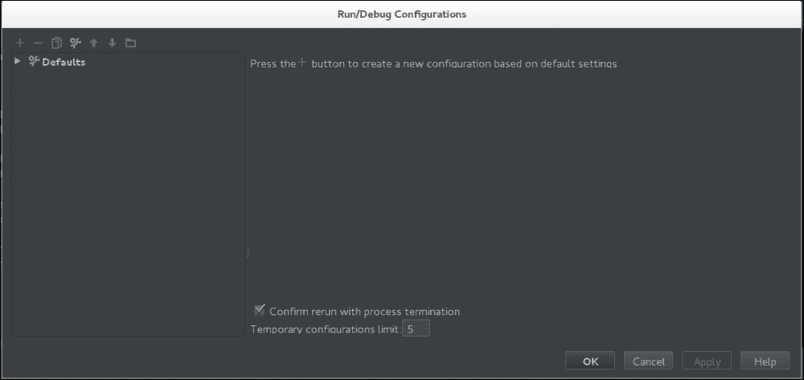
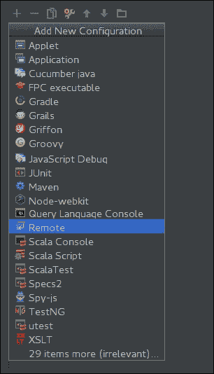
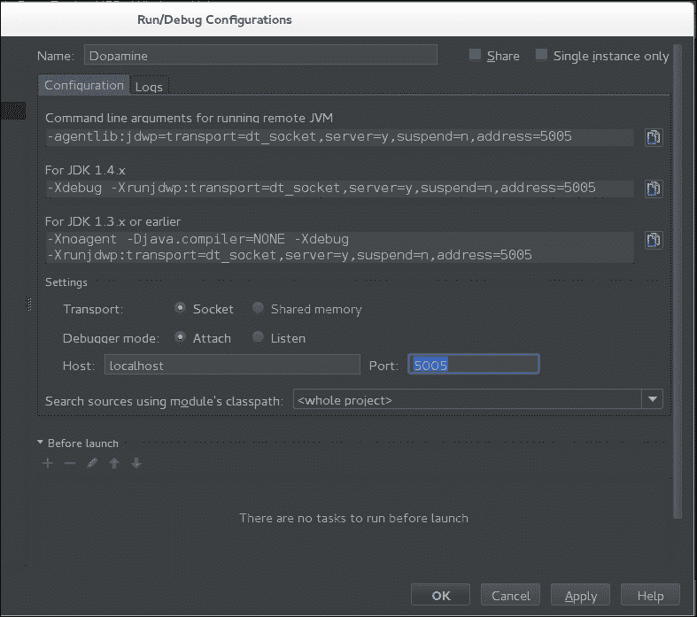
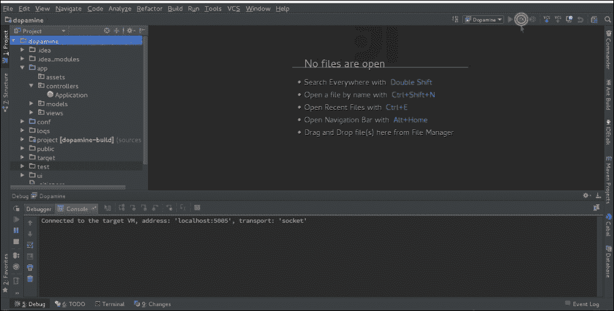

# 第十章：调试和日志记录

调试和日志记录是开发者可以使用以识别 bug 或应用程序意外行为的根本原因的工具。

调试的目的是找到我们代码中的缺陷或痛点，这是导致问题的原因。日志记录为我们提供了关于应用程序状态及其处理各个阶段的信息。在本章中，我们将涵盖以下主题：

+   调试 Play 应用程序

+   配置日志记录

+   在 Scala 控制台中实验

# 调试 Play 应用程序

可以使用**Java 平台调试架构**（**JPDA**）传输来调试应用程序。根据 Oracle 文档（参考[`docs.oracle.com/javase/7/docs/technotes/guides/jpda/conninv.html`](http://docs.oracle.com/javase/7/docs/technotes/guides/jpda/conninv.html)）：

> *JPDA 传输是调试器与被调试的虚拟机（以下简称目标 VM）之间通信的方法。通信是面向连接的 - 一方作为服务器，监听连接。另一方作为客户端并连接到服务器。JPDA 允许调试器应用程序或目标 VM 充当服务器。*

我们可以使用以下任意一个命令以调试模式启动控制台：

+   通过使用`play`：

    ```java
    play debug

    ```

+   通过使用`activator`：

    ```java
    activator -jvm-debug <port>

    ```

+   通过使用`sbt`：

    ```java
    sbt -jvm-debug <port>

    ```

所有这些命令只是用于通过调用选项启动目标 VM 的调试模式的包装器：

```java
-Xdebug -Xrunjdwp:transport=dt_socket,server=y,suspend=n,address=<port>

```

### 注意

`play`命令使用`JPDA_PORT`或环境变量`9999`作为端口号。在将`JPDA_PORT`设置为所需的端口号后，目标虚拟机将监听该端口。

## 配置 IDE 进行调试

一旦我们以调试模式启动控制台，我们就可以在应用程序运行时连接我们的 IDE 并对其进行调试。如果你熟悉如何进行此操作，你可以跳过本节。

配置 IDE 的过程将与所有 IDE 中使用的过程类似。让我们通过以下步骤看看如何在**IntelliJ Idea**中完成它：

1.  从**运行**菜单中选择**编辑配置…**，将弹出一个对话框。它将类似于以下截图：

1.  点击**+**，将显示一个类似于以下截图的菜单：

1.  选择**远程**并更新**名称**和**端口**字段：

1.  然后，点击 IDE 右上角现在可见的绿色虫子图标，我们就可以开始调试应用程序了：

# 在 Scala 控制台中实验

当你在 Scala 项目中工作时，Scala 控制台非常方便。同样的控制台也适用于我们的 Play 应用程序的控制台。我们只需要在我们的应用程序控制台中执行`console`命令即可获得 Scala 控制台：

```java
[app]$ console
[info] Compiling 3 Scala sources to /home/app/target/scala-2.10/classes...
[info] Starting scala interpreter...
[info]
Welcome to Scala version 2.10.4 (Java HotSpot(TM) 64-Bit Server VM, Java 1.7.0_60).
Type in expressions to have them evaluated.
Type :help for more information.

scala>

```

然而，我们只能从**模型**或**工具**中调用方法。如果这些包内的类或对象使用`Play.application.configuration`或尝试从数据库或其他 Play 工具获取数据，我们将无法实例化它们。这是因为大多数 Play 组件都需要访问当前运行的 Play 应用程序的实例。导入`play.api.Play.current`使得这成为可能，但并不完全；我们仍然需要一个正在运行的应用程序，这将标记为当前应用程序。

让我们在 Scala 控制台创建一个应用程序并启动它，然后导入`play.api.Play.current`：

```java
scala> :pas
// Entering paste mode (ctrl-D to finish)

import play.api.Play

val application = new DefaultApplication(new java.io.File("."), this.getClass.getClassLoader, None, Mode.Dev)
Play.start(application)

import play.api.Play.current

```

一旦我们退出粘贴模式，代码将被解释，应用程序将被启动。我们可以从以下输出中看到这一点：

```java
// Exiting paste mode, now interpreting.

SLF4J: Class path contains multiple SLF4J bindings.
SLF4J: Found binding in [jar:file:/home/.ivy2/cache/ch.qos.logback/logback-classic/jars/logback-classic-1.1.1.jar!/org/slf4j/impl/StaticLoggerBinder.class]
SLF4J: Found binding in [jar:file:/home/.ivy2/cache/org.slf4j/slf4j-log4j12/jars/slf4j-log4j12-1.7.2.jar!/org/slf4j/impl/StaticLoggerBinder.class]
SLF4J: See http://www.slf4j.org/codes.html#multiple_bindings for an explanation.
SLF4J: Actual binding is of type [ch.qos.logback.classic.util.ContextSelectorStaticBinder]
[info] play - Application started (Dev)
import play.api.Play
application: play.api.DefaultApplication = play.api.DefaultApplication@29600952
import play.api.Play.current

scala>

```

现在，我们可以查看配置，查看或修改数据，等等。例如，让我们尝试获取应用程序的配置：

```java
scala> Play.application.configuration
res7: play.api.Configuration = Configuration(Config(SimpleConfigObject({"akka":{"actor":{"creation-timeout":"20s","debug":{"autoreceive":"off","event-stream":"off","fsm":"off","lifecycle":"off","receive":"off","router-misconfiguration":"off","unhandled":"off"},"default-dispatcher":{"attempt-teamwork":"on","default-executor":{"fallback":"fork-join-executor"},"executor":"default-executor","fork-join-executor":{"parallelism-factor":3,"parallelism-max":64,"parallelism-min":8},"mailbox-requirement":"","shutdown-timeout":"1s","thread-pool-executor":{"allow-core-timeout":"on","core-pool-size-factor":3,"core-pool-size-max":64,"core-pool-size-min":8,"keep-alive-time":"60s","max-pool-size-factor":3,"max-pool-size-max":64,"max-pool-size-min":8,"task-queue-size":-1,"task-queue-type":"linked"},"thro...

```

很好，不是吗？然而，如果我们想要为不同的输入调用动作并检查结果，这还不够。在这种情况下，我们不应该使用`console`命令，而应该使用`test:console`命令：

```java
[app] $ test:console
[info] Starting scala interpreter...
[info]
Welcome to Scala version 2.10.4 (Java HotSpot(TM) 64-Bit Server VM, Java 1.7.0_60).
Type in expressions to have them evaluated.
Type :help for more information.

scala> :pas
// Entering paste mode (ctrl-D to finish)

import play.api.test.Helpers._
import play.api.test._
import play.api.Play

val application = FakeApplication()
Play.start(application)

import play.api.Play.current
// Exiting paste mode, now interpreting.
…

```

现在，从这个 Scala 控制台，我们可以查看配置、修改数据，以及调用一个动作：

```java
scala> Play.application.configuration
res0: play.api.Configuration = Configuration(Config(SimpleConfigObject({"akka":{"actor":{"creation-timeout":"20s","debug":{"autoreceive":"off","event-stream":"off","fsm":"off","lifecycle":"off","receive":"off","router-misconfiguration":"off","unhandled":"off"},"default-dispatcher":{"attempt-teamwork":"on","default-executor":{"fallback":"fork-join-executor"},"executor":"default-executor","fork-join-executor":{"parallelism-factor":3,"parallelism-max":64,"parallelism-min":8},"mailbox-requirement":"","shutdown-timeout":"1s","thread-pool-executor":{"allow-core-timeout":"on","core-pool-size-factor":3,"core-pool-size-max":64,"core-pool-size-min":8,"keep-alive-time":"60s","max-pool-size-factor":3,"max-pool-size-max":64,"max-pool-size-min":8,"task-queue-size":-1,"task-queue-type":"linked"},"thro...

scala> controllers.Application.index("John").apply(FakeRequest())
res1: scala.concurrent.Future[play.api.mvc.Result] = scala.concurrent.impl.Promise$KeptPromise@6fbd57ac

scala> contentAsString(res1)
res2: String = Hello John

```

### 提示

使用`test:console`而不是`console`；当你决定检查一个动作时，你不需要切换。

# 日志记录

日志是记录应用程序中事件发生的时间和原因的行为。如果处理得当，日志非常有用；否则，它们只是噪音。通过审查日志输出，你有可能确定事件的原因。

日志不仅有助于处理应用程序错误，还可以保护应用程序免受误用和恶意攻击，以及了解业务的不同方面。

# Play 的日志 API

Play 通过`play.api.Logger`公开日志 API。让我们看看它的类和对象定义：

```java
class Logger(val logger: Slf4jLogger) extends LoggerLike

object Logger extends LoggerLike {

  ...
  val logger = LoggerFactory.getLogger("application")

  def apply(name: String): Logger = new Logger(LoggerFactory.getLogger(name))

  def applyT: Logger = new Logger(LoggerFactory.getLogger(clazz))

  ...

}
```

`LoggerLike`特质只是`Slf4jLogger`的一个包装。默认情况下，所有应用程序日志都映射到带有应用程序名称的`Logger`，而与 Play 相关的日志则映射到带有 Play 名称的`Logger`。

在导入`play.api.Logger`之后，我们可以使用默认的日志记录器或以这种方式定义一个自定义的日志记录器：

+   通过使用默认的日志记录器：

    ```java
    import play.api.Logger
    object Task{
      def delete(id:Long) = {
        logger.debug(s"deleting task with id $id")
        ...
      }
    }
    ```

+   通过使用具有其类名的日志记录器：

    ```java
    import play.api.Logger
    object Task{
      private lazy val taskLogger = Logger(getClass)
      def delete(id:Long) = {
        taskLogger.debug(s"deleting task with id $id")
        ...
      }
    }
    ```

+   通过使用具有自定义名称的日志记录器：

    ```java
    import play.api.Logger
    object Task{
      private lazy val taskLogger = Logger("application.model")
      def delete(id:Long) = {
        taskLogger.debug(s"deleting task with id $id")
        ...
      }
    }
    ```

### 注意

`Logger`支持的方法在 API 中进行了文档说明，请参阅[`www.playframework.com/documentation/2.3.x/api/scala/index.html#play.api.Logger`](https://www.playframework.com/documentation/2.3.x/api/scala/index.html#play.api.Logger)。

# Play 的日志配置

Play 框架使用`Logback`作为日志引擎。默认配置如下：

```java
<configuration>

  <conversionRule conversionWord="coloredLevel" converterClass="play.api.Logger$ColoredLevel" />

  <appender name="FILE" class="ch.qos.logback.core.FileAppender">
     <file>${application.home}/logs/application.log</file>
     <encoder>
       <pattern>%date - [%level] - from %logger in %thread %n%message%n%xException%n</pattern>
     </encoder>
   </appender>

  <appender name="STDOUT" class="ch.qos.logback.core.ConsoleAppender">
    <encoder>
      <pattern>%coloredLevel %logger{15} - %message%n%xException{5}</pattern>
    </encoder>
  </appender>

  <logger name="play" level="INFO" />
  <logger name="application" level="DEBUG" />

  <!-- Off these ones as they are annoying, and anyway we manage configuration ourself -->
  <logger name="com.avaje.ebean.config.PropertyMapLoader" level="OFF" />
  <logger name="com.avaje.ebeaninternal.server.core.XmlConfigLoader" level="OFF" />
  <logger name="com.avaje.ebeaninternal.server.lib.BackgroundThread" level="OFF" />
  <logger name="com.gargoylesoftware.htmlunit.javascript" level="OFF" />

  <root level="ERROR">
    <appender-ref ref="STDOUT" />
    <appender-ref ref="FILE" />
  </root>

</configuration>
```

此配置将日志写入`projectHome/logs/application.log`。因此，会生成一个巨大的文件。我们可以通过提供自定义的`logger.xml`来修改此配置。

自定义日志文件配置可以以两种方式设置：

+   通过将配置保存到`conf/application-logger.xml`或`conf/logger.xml`。尽管当两者都存在时，使用任一文件名，如`application-logger.xml`或`logger.xml`都有效，但`logger.xml`的设置不会被应用。

+   通过指定系统属性来指定文件。此方法比其他选项具有更高的优先级。

有三个属性：

+   `logger.resource`: 此属性设置类路径内的文件

+   `logger.file`: 此属性通过绝对路径设置文件

+   `logger.url`: 此属性通过以下方式使用 URL 设置文件：

    ```java
    [app]$ start -Dlogger.url=http://serverPath/conf/appName/logger.xml

    ```

配置日志的另一个重要方面是通过设置所需的日志级别。我们将在下一节中讨论这一点。

## 日志级别

日志级别可以在`conf/application.conf`中设置。默认值如下：

```java
# Root logger:
logger.root=ERROR

# Logger used by the framework:
logger.play=INFO

# Logger provided to your application:
logger.application=DEBUG
```

我们还可以这样设置属于特定包和第三方库的类的日志级别：

```java
logger.com.apache.cassandra = DEBUG
```

支持的日志级别按严重程度递减的顺序如下：

+   `ERROR`

+   `WARN`

+   `INFO`

+   `DEBUG`

+   `TRACE`

如果我们希望关闭某些类或包的日志记录，可以将日志级别设置为`OFF`。这将禁用特定记录器的日志记录。

### 注意

一些库对日志库有传递性依赖。在定义依赖时最好排除这些日志包。可以按照以下方式操作：

```java
"orgName" % "packageName" % "version" excludeAll(
 ExclusionRule(organization = "org.slf4j"),
 ExclusionRule(organization = "ch.qos.logback"))

```

# 摘要

在本章中，我们讨论了如何在 IDE 中配置 Play 应用的调试。我们还介绍了如何在 Scala 控制台中启动 Play 应用。本章还涵盖了 Play 框架提供的日志 API 以及自定义日志格式。

许多 Web 应用利用第三方 API，要么是为了避免重写现有代码，要么是为了使用户更容易采用他们的应用。在下一章中，我们将探讨开发者如何在 Play 应用中使用现有的外部 API。
