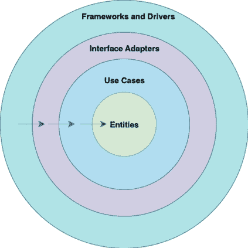

# 第二章：使用 Spring 暴露 RESTful API

为了实现 REST API，在本书的大部分章节中，我们将使用 **Spring Boot**。由于它是一个知名且流行的框架，你很可能熟悉它或之前使用过它。

然而，通用的 API 设计原则很容易转移到其他 Java 技术。你将了解我们如何将这些原则应用到其他技术中，请参阅*第十一章*。

在本章中，我们将讨论设计 RESTful API 的过程。我们还将专注于使用 Spring 框架（构建 RESTful API 的流行选择）的实际 API 实现。到本章结束时，你将具备根据最佳实践设计和创建 RESTful API 的知识。

在本章中，我们将涵盖以下主题：

+   设计产品 API

+   使用 Spring Boot 实现 API

# 技术要求

在本章中，我们将实现一个示例产品 API。为了能够跟随并使用书中打印的代码示例，你应该具备以下条件：

+   对 Java 语言和平台有中级知识

+   至少对 Spring Boot 或类似框架有基本了解

+   Java 21 和 Maven 3.9.0 已安装

+   推荐对调用 REST API 的工具（如 `curl`）有基本了解

在本章中，我们将应用 REST 原则来创建我们的 API；你可以在 GitHub 上找到本章的代码，网址为 [`github.com/PacktPublishing/Mastering-RESTful-Web-Services-with-Java/tree/main/chapter2`](https://github.com/PacktPublishing/Mastering-RESTful-Web-Services-with-Java/tree/main/chapter2)。

# 设计产品 API

我们将开发的产品 API 是用于管理产品的 API。我们的 API 将提供各种操作，这些操作将在设计阶段详细说明。

在开始编写代码之前，花足够的时间正确设计 API 可以在以后节省大量时间，防止昂贵的和风险大的重构。

设计阶段应包括以下内容：

+   **定义需求**：了解用例和谁将使用 API 对于创建包含所需一切且不包含多余内容的 API 至关重要。对需求有良好的理解可以使你尽可能长时间避免破坏性更改。在第 *5 章* 中，我们将讨论你如何演进你的 API 并确保向后兼容性。

+   **识别资源**：资源通常是领域实体，如用户或产品。多个实体之间的关系通常通过分层 URI 结构表示。

+   **定义资源结构**：在识别资源之后，有必要定义资源字段和关系。

+   **设计端点**：在定义了资源和域之后，下一步是确定应该公开哪些端点，如何公开它们，以及应该使用哪些 HTTP 方法来达到什么目的。

+   **错误处理**：具有标准错误代码的清晰错误响应有助于客户端正确地响应错误。

+   **安全性**：防止恶意行为者访问他们未经授权的资源是至关重要的。你将在*第七章*中了解更多关于 API 安全性的内容。


端点是一个特定的 URI，它使客户端能够通过 API 与服务器交互以执行特定功能。它代表了一个可以使用唯一路径和相应的 HTTP 方法执行的操作。

根据这些设计步骤，您可以直接使用 Java 在代码中实现 API。这被称为**先代码**方法，通常代表通往工作 API 的最快途径。

一种称为**先规范**的不同方法将在*第三章*中解释。

## 定义需求

API 需求可以分为功能性和非功能性：

+   **功能性需求**：这些描述了软件必须执行的具体功能和特性。例如，数据验证、数据处理和系统交互。

+   **非功能性需求**：这些也被称为质量属性或软件质量要求，它们指定了软件必须具备的品质或特性。例如，包括性能（响应时间和吞吐量）、可靠性、安全性、可伸缩性、可用性和可维护性。

在本章中，我们只关注功能性需求。我们将在*第七章和第十章*中了解到一些非功能性需求。

如前所述，我们的示例 REST API 将是一个产品 API，并将具有以下要求：

+   **产品创建**：API 应该允许用户通过提供必要的信息（如 SKU（库存单位，在本书中是指唯一的商品 ID）、名称、描述和价格）来创建新产品

+   **产品检索**：用户应该能够检索有关系统中所有产品的信息

+   **产品详情**：API 应该提供端点以检索有关特定产品的详细信息，该产品通过其 SKU（库存单位，在本书中是指唯一的商品 ID）进行标识

+   **产品更新**：用户应该能够更新现有产品信息，例如名称、描述或价格

+   **产品描述更新**：API 应该提供一个端点以仅更新描述

+   **产品删除**：API 应该允许用户通过其 SKU 从系统中删除产品

+   **唯一的 SKU 约束**：API 应该强制执行约束以确保每个产品都有一个唯一的 SKU，防止具有相同标识符的重复产品

既然我们已经确定了需求，下一步就是确定我们的资源。

## 识别资源

REST API 可以有一个或多个资源，也可以有一个分层 URI 结构。分层 URI 结构是一种在 URL 分层中组织资源的方式，反映了这些资源之间的关系。在分层 URI 结构中，资源以树状格式排列，其中 URL 的每个部分代表层次结构的一个级别。


URI 还是 URL？

在 REST API 的上下文中，我们经常互换使用缩写**URI**（代表**统一资源标识符**）和**URL**（代表**统一资源定位符**）。为了精确起见，URL 是 URI 的一个子集。URI 的第二个子集称为**URNs**（代表**统一资源名称**）。与 URN 相比，URL 的优势在于，除了是资源的唯一标识符外，它还包含可用于定位和访问资源的信息：协议、主机名和路径。URL 的路径部分支持类似于从文件系统路径中知道的一系列文件夹和文件名的分层结构。

让我们以下列为例：

```java
[`example.com/blog/posts/12`](https://example.com/blog/posts/12 ) 
```

在这个 URI 中，我们有以下内容：

+   [`example.com`](https://example.com)是基本 URL

+   `/blog`代表顶级资源，表示我们正在访问网站的博客部分

+   `/posts`是`/blog`资源下的子资源，代表一系列博客文章

+   `/12`是一个通过其唯一标识符识别的具体博客文章

在我们的案例中，我们只有一个资源，那就是产品，所以我们只有`/products`。


资源应该是名词；它们不应该是动词。例如，不应使用`/products/create`；相反，应使用与此动作对应的 HTTP 方法。这对于遵守 Richardson 成熟度模型的第 2 级至关重要。

在英语中，许多动词也可以用作名词，例如，`/products/quote`。当我们向这个资源发送`POST`请求时，意味着*创建报价*。句子的动词部分由正确的 HTTP 方法表示。

资源映射到业务实体，API 通常与同一类型的多个实体一起工作。当创建或列出特定类型的资源（实体）时，我们正在处理一个对象集合。对于集合资源，我们使用名词的复数形式——例如，`products`而不是`product`，因为我们希望支持对产品集合的操作。


RFC 3986 定义 URI 为一个字符序列，用于标识一个抽象或物理资源。根据 RFC 1738，URL 是 URI 的一种特定类型，表示可通过互联网访问的资源的位置。因此，URI 可以进一步分类为定位符、名称或两者兼具，其中术语 URL 指的是 URI 的子集。这意味着所有 URL 都是 URI，但并非所有 URI 都是 URL。RFC 2141 进一步定义 URN 为另一种 URI 类型，以持久、位置无关的方式命名资源。

现在我们已经确定了资源，下一步是定义资源结构。

## 定义资源结构

在确定资源后，我们应该确定资源的属性以及 API 中任何重要的关系。属性代表与资源相关的数据字段。考虑数据类型、约束以及每个资源所需的或可选的属性。关系表示资源之间的关系以及它们是否有层次或嵌套关系。例如，一个用户可能有多个与之关联的订单，或者一个产品可能属于特定的类别。

在我们的案例中，我们只有一个资源，即产品，它应该具有以下属性：

+   `名称`：产品的名称

+   `SKU`：产品的唯一键

+   `描述`：产品的描述

+   `价格`：产品的价格

我们也可以在这一步定义这些属性的规则：

+   `名称`：必填字段，长度在 3 到 255 个字符之间的字符串

+   `SKU`：必填字段，格式为 AA99999

+   `描述`：必填字段，长度在 10 到 255 个字符之间的字符串

+   `价格`：必填字段，值必须大于 0

在这一步之后，我们可以设计端点。

## 设计端点

在讨论 HTTP 方法和 HTTP 状态码之前，我们应该回顾一步，了解它是如何开始的。

我们将要分享的 HTTP 方法和原则遵循上一章中提到的微软的指南。任何 REST 指南都应该遵守互联网标准 RFC 9110，即 RFC 2616 的更新版本。**RFC**代表**请求评论**。RFC 指定了 HTTP、TCP、IP、SMTP 以及许多其他重要的互联网协议。Fielding 的论文，题为《架构风格和网络软件架构设计》是 RFC 2616 的重要来源，定义了 HTTP/1.1 协议。

### HTTP 方法（动词）

HTTP 定义了几个方法（也称为动词），用于指示对资源要执行的操作。在 RESTful API 中最常用的 HTTP 方法是以下这些：

+   `GET`：`GET` 方法请求用于检索资源表示，它们不应改变服务器状态。它们是安全的和幂等的，这意味着它们对服务器没有副作用，并且可以重复执行而不改变服务器状态。（想想 Java 中 `Map` 的 `get` 方法。）

+   `POST`：`POST` 方法请求用于创建新资源或通常提交数据由服务器处理。它们是非幂等的，这意味着每个请求都是唯一的，并且可能对服务器有副作用。（想想 Java 中的 `++` 操作符；如果多次评估，结果将不同。） 

+   `PUT`：这些请求通常用于创建或更新资源的整个表示。它们是幂等的，这意味着发送相同的请求多次应该与发送一次的效果相同。（想想 Java 中 `Map` 的 `put` 方法。）

+   `PATCH`：这与 `PUT` 类似，但用于对资源应用部分修改。它通常用于只想更新资源的一定字段。（想想 Java Bean/POJO 的 setter 方法。）

+   `DELETE`：此方法用于从服务器删除资源。方法是幂等的，这意味着发送相同的请求多次应该导致服务器上相同的状态。

### HTTP 状态码

HTTP 状态码是服务器在收到请求后发送给客户端的三位数。它们表示请求的结果，并提供有关服务器或请求资源状态的信息。所有 HTTP 状态码都被分为以下类别：

+   `1xx 信息性`：这表示请求已被接收并正在处理。

+   `2xx 成功`：这表示请求已被接收、理解并成功处理。

+   `3xx 重定向`：这表示需要进一步的操作来完成请求。客户端可能需要重定向到不同的 URI。

+   `4xx 客户端错误`：这表示客户端请求中存在错误。

+   `5xx 服务器错误`：这表示在处理请求时服务器端出现错误。

现在我们已经了解了 HTTP 方法和服务状态，我们可以定义 API 端点。

### 定义我们 API 的端点

让我们定义上一步中确定的资源的端点。我们将使用 `products` 资源上的 HTTP 方法来确保我们可以执行需求阶段概述的所有必要操作。

#### GET /products

此端点将负责返回产品列表。我们应该返回带有产品的 `200 (ok)` HTTP 状态。

#### PUT /products/{id}

此端点将负责创建或更新产品。`PUT` 是幂等的，因此我们可以多次调用它，结果将相同。在成功的情况下，如果产品不存在，我们应该返回 `201 (created)`，如果产品已存在，则返回 `200`。

如果产品将在未来作为异步任务处理，我们可以返回 `202 (已接受)`，但这在这里不是情况。

如果我们决定使用 `POST` 方法，我们需要在抛出异常（这个异常可能是 `409 (冲突)`）如果产品已经存在，或者创建另一个产品之间做出选择。在我们的情况下，因为 SKU 不是由应用程序生成的，它是一个传递给 API 的属性，我们不能有两个具有相同 SKU 的产品，所以我们需要返回 `409` 并有一个负责更新资源的另一个端点，因为这是一个要求。而不是这样做，我们可以使用 `PUT` 方法，它可以创建或更新资源。

根据 RFC 9110，第 9.3.4 节，“POST 和 PUT 方法之间的基本区别在于对所包含表示的不同意图。POST 请求中的目标资源旨在根据资源自身的语义处理所包含的表示，而 PUT 请求中的所包含的表示被定义为替换目标资源的状态。因此，PUT 的意图是幂等的，并且对中间代理可见，尽管确切的效果只有原始服务器才知道”。

正确解释 PUT 请求假设用户代理知道所需的哪个目标资源。为了获得更好的洞察，请参阅 [`www.rfceditor.org/rfc/rfc9110.html#section-9.3.4`](https://www.rfceditor.org/rfc/rfc9110.html#section-9.3.4) 。

#### DELETE /products/{id}

此端点应删除产品。如果产品被删除，我们可以返回 `204 (无内容)`。即使产品不存在，我们也可以返回 `204`，因为该方法具有幂等性，意味着发送相同的请求多次应该在服务器上产生相同的状态。

#### PATCH /products/{id}

应使用此端点来更新产品的描述。由于这是一个资源的部分更新，建议使用 `PATCH`。`PATCH` 方法在 RFC 5789 中被引入，作为不需要幂等的部分更新。如果产品不存在，我们可以返回 `404 (未找到)` 错误。在成功的情况下，我们可以返回更新后的产品数据和 `200` HTTP 状态码。

#### GET /products/{id}

此端点负责通过 ID 返回单个产品的详细信息。如果产品不存在，我们可以返回 `404 (未找到)` 错误。

在成功的情况下，我们应该返回产品表示和 `200` HTTP 状态码。

现在我们已经定义了我们的端点，让我们看看我们可能会遇到的可能错误以及我们如何有效地为它们做准备。

## 错误处理

通过定义可能的错误来准备常见问题可以帮助我们实现更可靠的 API。我们已经在之前的步骤中讨论了一些错误；然而，让我们深入探讨并看看 `4xx` 范围内最常见的 HTTP 状态码。

`4xx`范围内的最常见 HTTP 状态码，表示客户端错误，如下所示：

+   `400 请求错误`：此状态码表示服务器无法理解客户端的请求，因为请求语法无效或请求消息格式不正确。

+   `401 未授权`：此状态码表示客户端需要验证自身才能访问请求的资源。通常发生在客户端未能提供适当的认证凭据或访问令牌时。

+   `403 禁止访问`：此状态码表示客户端已通过认证，但没有权限访问请求的资源。可能是因为权限不足或服务器施加的访问控制限制。

+   `404 未找到`：此状态码表示服务器找不到请求的资源。它通常用于表示客户端提供的 URI 不对应于服务器上的任何已知资源。

+   `405 方法不允许`：此状态码表示客户端使用的 HTTP 方法不支持请求的资源。例如，尝试对一个只支持`GET`请求的资源使用`POST`请求将导致`405 方法不允许`响应。

+   `409 冲突`：此状态码表示由于与资源的当前状态冲突，请求无法完成。通常发生在客户端尝试创建或更新资源，但服务器检测到与资源当前状态的冲突；例如，当两个请求同时尝试更新同一产品的详细信息时，如果由于版本不匹配，一个请求的更改与另一个请求冲突，则可能会返回`409`状态码。

+   `422 无法处理实体`：此状态码表示服务器理解了请求，但由于请求负载中的语义错误或验证失败而无法处理它。它通常用于指示请求数据中的验证错误，例如，尝试购买缺货的产品。

+   `429 请求过多`：此状态码表示客户端在特定时间段内超过了服务器对允许请求数量的限制或配额。它通常用于通过限制单个客户端或 IP 地址的请求速率来防止滥用或过度使用服务器资源。此错误通常由使用速率限制策略的 API 网关处理，正如我们将在*第六章*中介绍的那样。

在我们的 API 实现中，我们应该能够处理一些错误：

+   当产品不存在时，我们应该返回`404 未找到`

+   当有效载荷不符合要求时，例如，如果产品价格提供了负数，我们应该返回带有详细信息的`400 Bad Request`

一些错误条件（例如，导致`405 方法不允许`的不支持的方法）由框架自动处理。

与安全相关的 `401` 和 `403` HTTP 状态码将在 *第七章* 中介绍。

在接下来的章节中，我们将把安全和文档作为单独的主题进行讨论，并直接解决它们。然而，对于本章所代表的开发迭代，我们已经完成了设计阶段。向前推进，我们将专注于实现我们的产品 API，并确保我们能够满足我们定义的要求。

# 使用 Spring Boot 实现 API

Spring Boot 是最受欢迎的用于微服务应用的 Java 框架。它提供了嵌入式 Servlet 容器，如 **Tomcat**、**Jetty** 和 **Undertow**。嵌入容器允许您将应用程序打包为可执行的 JAR 文件，可以直接运行，无需将应用程序部署到单独的应用服务器。我们将使用 Tomcat，因为它是默认的。

我们的应用程序将提供一些端点并使用 SQL 数据库。我们将使用 **H2**，这是一个轻量级和开源的数据库。它既可以作为内存数据库，也可以作为文件系统数据库，这使得它在开发环境中易于使用，无需额外的基础设施。

我们将使用 Spring Data 依赖项来集成持久层，但由于这不是本书的重点，我们不会深入探讨。我们推荐由 Otávio Santana 和 Karina Varela 编写的书籍《Java 应用程序持久化最佳实践》，Packt 出版，该书更多地讨论了持久层。要添加 Spring Data 依赖项，请在您的 `pom.xml` 文件中包含以下条目：

```java
<dependency>
    <groupId>org.springframework.boot</groupId>
    <artifactId>spring-boot-starter-data-jpa</artifactId>
</dependency> 
```

由于我们的 API 是一个 Web 应用程序，我们还将使用 Spring Web 来创建我们的 REST 端点，并使用 Bean Validation 来验证用户输入，我们将在本章后面讨论这一点。我们将使用 **清洁架构**（[`blog.cleancoder.com/uncle-bob/2012/08/13/the-clean-architecture.html`](https://blog.cleancoder.com/uncle-bob/2012/08/13/the-clean-architecture.html)）设计我们的 API。

清洁架构是由 Robert C. Martin 创建的，他受到了其他知名架构的影响，例如 Jeffrey Palermo 的洋葱架构和 Alistair Cockburn 的六边形架构（也称为端口和适配器）。

清洁架构与其他这些架构有相似的目标：通过将软件划分为层来分离关注点。清洁架构的关键区别在于其对层的清晰定义。虽然其他架构提供了不太精确的层定义，但清洁架构明确地定义了四个层，每个层都有特定的角色和责任。

我们将使用清洁架构，因为其多层结构允许清晰的关注点分离，从而促进更好的组织和可理解性。*图 2.1*显示了清洁架构定义的层：



图 2.1 – 清洁架构层

让我们逐一分析这些层：

+   **实体**：这一层包含应用程序的业务实体或域对象。

+   **用例**：这一层包含特定于应用程序的业务逻辑或用例。这一层从用户可以执行的动作或操作的角度来表示应用程序的行为。

+   **接口适配器**：这一层负责将应用程序的内部表示适配到外部接口，如**用户界面**（**UIs**）、REST API、数据库或第三方服务。

+   **框架和驱动程序**：这一层包括处理外部关注点（如 UI 渲染、数据库访问、Web 服务器和外部 API）的库、框架和基础设施代码。

在我们的应用程序中，我们将只使用三个层：实体、用例和接口适配器。这是因为对于我们的应用程序，我们决定我们不想完全从 Spring 框架中解耦。在我们的情况下，我们更喜欢直接访问 Spring 框架提供的许多有用功能。我们接受与框架的耦合，同时减少创建一个层来将其分离的复杂性。

层的定义旨在实现松散耦合、易于维护和可重用。罗伯特·C·马丁说，我们可以有更多的层，这些层只是示意图。分层架构的主要原则是确保依赖关系只在一个方向上跨越边界；内层不应依赖于外层。

既然我们已经定义了架构和所用的技术，让我们构建我们的产品 API。

## 创建我们产品 API 的端点

如前所述，为了创建我们的产品 API，我们将使用 Spring Boot。我们建议使用最新的 Spring 和 Java（JDK）版本；我们将使用以下版本：

+   Java 21

+   Spring Boot 3.2.5

在开始创建我们的 API 之前，我们将定义一个包含所有预期端点的接口：

```java
public interface ProductsApi {
    ResponseEntity<ProductOutput> createOrUpdateProduct(String productId,
        @Valid ProductInput productInput);
    ResponseEntity<Void> deleteProduct(String productId);
    ResponseEntity<ProductOutput> editProductDescription(String productId,
        @Valid ProductDescriptionInput input);
    ResponseEntity<ProductOutput> getProductById(String productId);
    ResponseEntity<List<ProductOutput>> getProducts();
} 
```

这个“`ProductsAPI`”接口包含了在设计步骤中定义的所有预期端点。

由于我们遵循了清洁架构指南，我们为输入和输出定义了三个**数据传输对象**（**DTOs**）：`ProductOutput`、`ProductInput`和`ProductDescriptionInput`。利用这些 DTO，我们可以修改它们而不会影响我们的域类。

为了创建我们的产品 API，我们需要定义一个 Spring 控制器。这个类将由 Spring 管理，以处理对端点的请求。我们的 API 类将实现`ProductsApi`接口，并且我们需要添加两个注解，`@RestController`和`@RequestMapping("/api/products")`：

```java
@RestController
@RequestMapping("/api/products")
public class ProductsApiController implements ProductsApi {
    private final ProductsQueryUseCase productsQueryUseCase;
    private final ProductsCommandUseCase productsCommandUseCase;
    private final ProductMapper productMapper;
    public ProductsApiController(
        ProductsQueryUseCase productsQueryUseCase,
        ProductsCommandUseCase productsCommandUseCase,
        ProductMapper productMapper) {
    this.productsQueryUseCase = productsQueryUseCase;
    this.productsCommandUseCase = productsCommandUseCase;
    this.productMapper = productMapper;
    }
  ...
} 
```

`@RestController`用于创建由 Spring 管理的 bean。这个控制器将处理由`@RequestMapping("/api/products")`注解映射的端点请求，这意味着所有 URI 匹配`/api/products`模式的请求都将由我们的控制器处理。


使用`@RestController`推荐用于使用 Spring 框架创建 RESTful API。它是`@Controller`和`@ResponseBody`注解的组合的快捷方式。

`ProductsQueryUseCase`和`ProductsCommandUseCase`是我们用例的实现。我们正在使用**命令查询责任分离**（**CQRS**）模式来分离查询和命令责任。该模式在软件架构中常用，用于将读取数据（查询）的责任与写入数据（命令）的责任分开。

CQRS 在读取和写入操作具有不同特性或性能要求的系统中很有用。它促进了关注点的清晰分离，从而导致了更易于维护和可扩展的架构。通过分离这些责任，我们可以在以后决定将 API 拆分为两个微服务并分别对其进行扩展。

`ProductMapper`类使用`MapStruct`库将一个对象转换成另一个对象；在我们的案例中，我们正在将领域数据映射到我们的 DTO。让我们看看我们如何实现它：

```java
@Mapper(componentModel = "spring")
public interface ProductMapper {
    ProductOutput toProductOutput(Product product);
} 
```

`ProductMapper`的实现是在编译阶段生成的。

## 实现产品 API 端点

在本节中，我们将实现`ProductsApiController`类。这包括添加我们在前几节中定义的所有端点，使我们的 API 能够实现创建、检索、更新和删除产品的全部功能。

### 创建或更新产品端点

要实现此端点，我们需要使用 Spring 注解。对于创建操作，建议使用`@PutMapping`或`@PostMapping`：

```java
 @PutMapping(value = "/{productId}")
    @Override
    public ResponseEntity<ProductOutput> createOrUpdateProduct(
        @PathVariable("productId") @ValidSku String productId,
        @Valid @RequestBody ProductInput productInput) {
        final var product = productsCommandUseCase.createProduct(
            productInput.toProduct(productId));
        HttpStatus status = product.isNewProduct() ? HttpStatus.CREATED :
            HttpStatus.OK;
        return ResponseEntity.status(status)
              .body(productMapper.toProductOutput(product.product()));
     } 
```

在我们的案例中，我们决定使用`PUT`注解；这个决定是因为我们的方法是幂等的，因此我们可以使用这个方法来更新或创建产品。一个要求是不允许两个产品具有相同的 SKU；在我们的案例中，如果产品不存在，我们可以更新或创建产品。

然后，我们有两个输入注解，`@Valid`和`@RequestBody`。`@Valid`注解将在*Bean Validation*部分进行讨论。`@RequestBody`表示我们应该通过将输入传递到请求体中来发送输入。

遵循最佳实践，此方法可以返回`200 (ok)`或`201 (created)`，具体取决于产品是否已存在。

所有 API 调用示例都将使用`curl`命令进行演示，但您也可以轻松地使用各种工具，如**Postman**或**UseBruno**，直接从您的 IDE 或使用您选择的任何其他 API 测试工具执行相同的请求。

要调用此端点，我们可以使用以下请求：

```java
 curl -X 'PUT' \
  'http://localhost:8080/api/products/AK21101' \
  -H 'accept: application/json' \
  -H 'Content-Type: application/json' \
  -d '{
  "name": "Keyboard",
  "description": "Ergonomic Keyboard",
  "price": 60
}' 
```

我们将收到以下输出：

```java
HTTP/1.1 201
Content-Type: application/json
{
  "name": "Keyboard",
  "sku": "AK21101",
  "description": "Ergonomic Keyboard",
  "price": 60.00
} 
```

### 获取所有产品端点

要返回所有产品，我们需要使用 HTTP `GET`方法：

```java
@GetMapping
@Override
public ResponseEntity<List<ProductOutput>> getProducts() {
    final var products = productsQueryUseCase.getAllProducts()
          .stream()
          .map(productMapper::toProductOutput)
          .toList();
    return ResponseEntity.status(HttpStatus.OK)
                .body(products);
} 
```

要调用此端点，我们可以使用以下请求：

```java
curl -X 'GET' \
  'http://localhost:8080/api/products' \
  -H 'accept: application/json' 
```

我们将收到以下输出：

```java
HTTP/1.1 200
Content-Type: application/json
[
  {
    "name": "Keyboard",
    "sku": "AK21101",
    "description": "Ergonomic Keyboard",
    "price": 60.00
  }
] 
```

### 通过 ID 获取产品端点

要通过 ID 返回产品，我们需要使用 HTTP `GET`方法并将 ID 作为路径参数传递：

```java
@GetMapping(value = "/{productId}")
@Override
public ResponseEntity<ProductOutput> getProductById(@PathVariable("productId") String productId) {
    final var product = productsQueryUseCase.getProductById(productId);
    return ResponseEntity.status(HttpStatus.OK)
            .body(productMapper.toProductOutput(product));
} 
```

此端点使用`@PathVariable("productId")`注解，并期望在 URI 中具有此值。我们还需要将此路径变量 ID 添加到`@GetMapping`映射注解中。

在成功的情况下，我们应该返回 HTTP 状态码`200`并返回产品内容。否则，我们可以返回`404`，表示产品不存在。我们将在下一节中看到如何处理错误。

调用此端点，我们可以使用以下请求：

```java
 curl -X 'GET' \
  'http://localhost:8080/api/products/AK21101' \
  -H 'accept: application/json' 
```

我们将收到以下输出：

```java
HTTP/1.1 200
Content-Type: application/json
{
  "name": "Keyboard",
  "sku": "AK21101",
  "description": "Ergonomic Keyboard",
  "price": 60.00
} 
```

### 通过 ID 删除产品端点

通过 ID 删除产品与通过 ID 获取产品非常相似，主要区别在于 HTTP 方法；在这种情况下，我们应该使用`DELETE`方法：

```java
@DeleteMapping(value = "/{productId}")
@Override
public ResponseEntity<Void> deleteProduct(@PathVariable("productId") String productId) {
    productsCommandUseCase.deleteProduct(productId);
    return ResponseEntity.noContent().build();
} 
```

此方法与上一个方法非常相似。主要区别在于`@DeleteMapping`注解和`return`。在这种情况下，我们返回`204 (no content)` HTTP 状态。这意味着我们没有提供任何内容，请求已成功完成。

`DELETE`方法是幂等的；因此，无论产品是否存在，我们都可以返回`204`。由于预期的行为将相同，数据库中的产品将不存在。

调用此端点，我们可以使用以下请求：

```java
 curl -X 'DELETE' \
  'http://localhost:8080/api/products/AK21101' \
  -H 'accept: */*' 
```

我们将收到以下输出：

```java
HTTP/1.1 204 
```

### 通过 ID 更新产品描述端点

更新产品描述的端点通过 ID 与检索产品的端点非常相似。在这种情况下，我们将使用`PATCH`方法，因为它是一个部分更新，所以客户端将只传递包含更改内容的主体：

```java
@PatchMapping(value = "/{productId}")
@Override
public ResponseEntity<ProductOutput> editProductDescription(@PathVariable("productId") String productId,
@RequestBody @Valid ProductDescriptionInput input) {
    final var product = productsCommandUseCase.updateProductDescription(
        productId, input.description());
    return ResponseEntity.status(HttpStatus.OK)
            .body(productMapper.toProductOutput(product));
} 
```

此方法接收产品 ID 作为`@PathVariable`，并使用`@PatchMapping`注解将其映射到`PATCH`方法。此方法还有一个类型为`ProductDescriptionInput`的输入参数，带有`@RequestBody`和`@Valid`注解。输入参数表示包含客户希望更改的产品描述的请求体。

调用此端点，我们可以使用以下请求：

```java
 curl -X 'PATCH' \
  'http://localhost:8080/api/products/AK21101' \
  -H 'accept: application/json' \
  -H 'Content-Type: application/json' \
  -d '{
  "description": "Ergonomic Keyboard 2.0"
}' 
```

我们将收到以下输出：

```java
HTTP/1.1 200
Content-Type: application/json
{
  "name": "Keyboard",
  "sku": "AK21101",
  "description": "Ergonomic Keyboard 2.0",
  "price": 60.00
} 
```

在设置好我们的端点后，我们的 API 类现在就完整了。

您可以通过以下链接访问完整代码：[`github.com/PacktPublishing/Mastering-RESTful-Web-Services-with-Java/blob/main/chapter2/product-api/src/main/java/com/packt/productapi/adapter/inbound/rest/ProductsApiController.java`](https://github.com/PacktPublishing/Mastering-RESTful-Web-Services-with-Java/blob/main/chapter2/product-api/src/main/java/com/packt/productapi/adapter/inbound/rest/ProductsApiController.java) .

我们的 API 代码已完成；现在我们可以调用端点并测试它们。然而，如果产品不存在，或者我们发送了无效数据，会发生什么？我们需要涵盖负面情况。

## 异常处理

异常处理是实现中响应程序执行期间发生的错误或异常情况的部分。

在 RESTful API 中，可能会发生许多类型的错误，通常属于 HTTP 状态码的 `4xx` 或 `5xx` 组。`5xx` 状态码表示服务器应用程序中存在错误。它们可能是由服务器端的外部因素（例如，数据库服务器的不可用）或应用程序中的错误（例如，`NullPointerException`）引起的。另一方面，`4xx` 状态码表示由客户端引起的错误。例如，当客户端尝试使用 API 不期望的 HTTP 方法时，Spring 框架会自动生成 `405 (Method Not Allowed)`。

Spring 和 Java 提供了许多处理异常的方法。我们可以在每个端点中创建一个 `try-catch` 块并逐个处理它们；我们也可以为每个控制器有一个自定义的 `ExceptionHandler`，或者有一个全局异常处理器。

我们将在我们的 API 中实现全局异常处理。这种方法有助于防止代码重复，并确保所有端点之间的一致行为，特别是如果 API 公开了多个资源。

Spring 框架支持 `HTTP APIs 的 Problem Details` 规范，RFC 9457。这个 RFC 是一个基于 RFC 7807 的更新标准，其主要目标是通过对五个字段进行定义，提供有关 HTTP API 中错误的详细信息：

+   `类型`：这应该包含一个标识问题类型的 URI

+   `状态`：这表示 HTTP 状态码

+   `标题`：标题是对问题的简洁总结

+   `详细信息`：此字段应包含有关问题的更详细信息

+   `实例`：这应包含一个标识端点调用的 URI

在春季，我们可以通过扩展 `ResponseEntityExceptionHandler` 类或启用 `spring.mvc.problemdetails.enabled` 属性来遵循 RFC 指南。我们将扩展 `ResponseEntityExceptionHandler` 类，它为 `ProblemDetail` 类提供了 RFC 9457 定义的五个元素。我们还可以添加一些扩展，我们将这样做以在 `400 (Bad Request)` 中提供更好的响应错误：

```java
@ControllerAdvice
public class GlobalExceptionHandler extends ResponseEntityExceptionHandler {
    @ExceptionHandler(EntityNotFoundException.class)
    public ResponseEntity<Object> handleNotFound(
        EntityNotFoundException exception, WebRequest request) {
        ProblemDetail problemDetail = ProblemDetail.forStatusAndDetail(
            HttpStatus.NOT_FOUND, exception.getMessage());
        return this.handleExceptionInternal(exception, problemDetail,
            new HttpHeaders(), HttpStatus.NOT_FOUND, request);
    }
    @ExceptionHandler(ConstraintViolationException.class)
    public ResponseEntity<Object> handleBadRequestDueToBeanValidation(
        ConstraintViolationException ex, WebRequest request) {
        final Set<String> errors = ex.getConstraintViolations().stream()
                .map(e -> ((PathImpl) e.getPropertyPath())
                           .getLeafNode() + ": " + e.getMessage())
                .collect(Collectors.toSet());
        ProblemDetail problemDetail = ProblemDetail.forStatusAndDetail(
            HttpStatus.BAD_REQUEST, "Invalid request content.");
        problemDetail.setProperty("errors", errors);
        return this.handleExceptionInternal(ex, problemDetail,
            new HttpHeaders(), HttpStatus.BAD_REQUEST, request);
    }
    @Override
    protected ResponseEntity<Object> handleMethodArgumentNotValid(
        MethodArgumentNotValidException ex, HttpHeaders headers,
        HttpStatusCode status, WebRequest request) {
        final List<String> errors = new ArrayList<>();
        for (final FieldError error :
            ex.getBindingResult().getFieldErrors()) {
                errors.add(
                    error.getField() + ": " + error.getDefaultMessage());
        }
        for (final ObjectError error :
            ex.getBindingResult().getGlobalErrors()) {
                errors.add(
                error.getObjectName() + ": " + error.getDefaultMessage());
        }
        ProblemDetail problemDetail = ex.getBody();
        problemDetail.setProperty("errors", errors);
        return handleExceptionInternal(ex, problemDetail, headers, status,
            request);
    }
} 
```

我们的 `GlobalExceptionHandler` 扩展了 `ResponseEntityExceptionHandler` Spring 类，它提供了 `handleMethodArgumentNotValid` 方法；我们正在重写此方法并更新 `ProblemDetail` 类，以便在 `400 (Bad Request)` 的情况下提供关于错误输入数据的清晰信息。这种错误可以在用户未发送正确输入时通过 Bean Validation 检测到。

我们的这个类还有两个自定义的 `ExceptionHandler`：第一个用于处理我们的自定义异常 `EntityNotFoundException`，第二个用于处理 `ConstraintViolationException`，这可能是由于 `PathVariable` 的验证引起的。

多亏了我们的 `GlobalExceptionHandler`，每当抛出 `EntityNotFoundException` 异常时，客户端将收到一个 **404** 错误。

通过创建这个类，我们已经实现了全局异常处理，并定义了一个一致和标准化的错误格式，这使得 API 的客户端能够更容易地理解和处理不同端点上的错误。此外，它还提供了更多的清晰度，帮助客户端理解错误的本质以及如何解决它。这提高了开发者的体验，并减少了诊断和修复问题所需的时间。

现在我们已经有了异常处理器，我们需要确保用户不会发送无效的输入。让我们看看如何使用 Bean Validation 来实现这一点。

## Bean Validation

Bean Validation 是基于 Java 规范请求（**JSRs**）380、349 和 303 的 Java 规范。这些请求提供了一种标准化的方法来验证 Java Bean。Bean Validation 对于验证用户请求非常有用，它提供了一些预定义的规则以及创建自定义 Bean Validation 的方法，这使得在 Java 应用程序中强制数据完整性和验证输入数据变得更加容易。

Bean Validation 可以通过以下各种注解来应用：

+   `@NotNull` : 指定被注解的元素不能为 null

+   `@Size` : 指定字符串、集合、映射或数组的大小约束

+   `@Min` : 指定数值元素的最小值

+   `@Max` : 指定数值元素的最大值

+   `@DecimalMin` : 指定具有小数精度的数值元素的最小值

+   `@DecimalMax` : 指定具有小数精度的数值元素的最大值

+   `@Digits` : 指定数值元素的精确或最大位数

+   `@Pattern` : 指定被注解的元素必须匹配的正则表达式模式

+   `@Email` : 指定被注解的元素必须是一个格式良好的电子邮件地址

+   `@NotBlank` : 指定被注解的字符串不能为空或空字符串，并且必须包含至少一个非空白字符

+   `@NotEmpty` : 指定被注解的字符串不能为空或空字符串

+   `@Positive` : 指定被注解的数值元素必须是正数（大于 0）

+   `@Negative` : 指定被注解的数值元素必须是负数（小于 0）

+   `@PositiveOrZero` : 指定被注解的数值元素必须是正数或 0

+   `@NegativeOrZero` : 指定被注解的数值元素必须是负数或 0

+   `@Past` : 指定被注解的日期或时间必须是过去

+   `@PastOrPresent` : 指定被注解的日期或时间必须是过去或现在

+   `@Future` : 指定被注解的日期或时间必须是未来

+   `@FutureOrPresent` : 指定被注解的日期或时间必须是未来或现在

除了这些，Bean Validation 规范还提供了`@Valid`注解，该注解用于触发嵌套对象或集合内元素的有效性验证。当应用于表示复杂对象或对象集合的字段或参数时，`@Valid`告诉 Bean Validation 框架根据其验证约束来验证嵌套对象。

让我们为我们的 SKU 字段实现自定义的 Bean Validation，并在我们的请求中应用所讨论的注解。

我们的 API 有一个 SKU 字段，该字段在需求阶段应遵循指定的模式（AA99999）。我们可以通过创建自定义的 Bean Validation 规则来防止客户端使用无效的 SKU。

我们可以使用以下代码：

```java
@Constraint(validatedBy = {})
@NotNull
@Pattern(regexp = "[A-Za-z]{2}[0-9]{5}",
    message = "SKU must follow the pattern AA99999")
@Target({PARAMETER, FIELD})
@Retention(RetentionPolicy.RUNTIME)
public @interface ValidSku {
    String message() default "Invalid SKU";
    Class<?>[] groups() default {};
    Class<? extends Payload>[] payload() default {};
} 
```

此代码创建了一个名为`@ValidSku`的新注解，并检查字段是否遵循特定的模式：两个字母字符后跟五个数字（例如，`AA12345`）。如果注解的字段不匹配定义的模式，将生成一个验证错误消息，`SKU 必须遵循模式 AA99999`。

`ValidSku`注解被设计为应用于字段和参数，如`@Target`注解所示。它还指示验证约束应在运行时保留以供反射使用。此注解简化了 Java 应用程序中验证 SKU 的过程，增强了数据完整性并确保符合特定的 SKU 格式要求。

`ValidSku`还使用`@NotNull`注解验证字段是否不为空。

在创建我们的注解后，我们可以通过向我们的`PathVariable`添加`@ValidSku`来更新我们的 API。我们还应该向我们的`ProductsApiController`添加 Spring 的`@Validated`注解。验证方法注解非常重要，而不仅仅是字段：

```java
public interface ProductsApi {
    ResponseEntity<ProductOutput> createOrUpdateProduct(
        @ValidSku String productId, @Valid ProductInput productInput);
    ResponseEntity<Void> deleteProduct(@ValidSku String productId);
    ResponseEntity<ProductOutput> editProductDescription(
        @ValidSku String productId, @Valid ProductDescriptionInput input);
    ResponseEntity<ProductOutput> getProductById(
        @ValidSku String productId);
    ResponseEntity<List<ProductOutput>> getProducts();
} 
```

现在我们已经创建了 SKU 验证和`ExceptionHandler`，我们可以通过传递错误的 SKU 来测试它，以检查结果：

```java
 curl -X 'PUT' \
  'http://localhost:8080/api/products/AAAA' \
  -H 'accept: application/json' \
  -H 'Content-Type: application/json' \
  -d '{
  "name": "Keyboard",
  "description": "Ergonomic Keyboard",
  "price": 60
}' 
```

我们将收到以下输出：

```java
HTTP/1.1 400
Content-Type: application/json
{
  "type": "about:blank",
  "title": "Bad Request",
  "status": 400,
  "detail": "Invalid request content.",
  "instance": "/api/products/123",
  "errors": [
    "productId: SKU must follow the pattern AA99999"
  ]
} 
```

我们的结果遵循 RFC 9457 标准，我们还有一个额外的字段来详细说明 Bean Validation 的错误。

现在，我们可以通过添加 Bean Validation 注解来增强我们的`ProductInput`和`ProductDescriptionInput`类，以确保输入有效。对于`ProductInput`类，我们可以使用以下注解：

```java
public record ProductInput(
    @NotBlank
    @Size(min = 3, max = 255)
    @JsonProperty("name")
    String name,
    @NotBlank
    @Size(min = 10, max = 255)
    @JsonProperty("description")
    String description,
    @NotNull
    @Positive
    @JsonProperty("price")
    BigDecimal price) {
} 
```

通过添加这些注解，我们保证输入符合我们 API 的预期。有了这些注解，我们提供了一个更安全的 API，因为我们控制用户输入并确保数据完整性。

我们的代码保证了以下行为：

+   名称不应为空，且长度应在 3 到 255 个字符之间。

+   描述不应为空，且长度应在 10 到 255 个字符之间。

+   价格不应为空，且应为正数。

如果 API 的用户不遵守这些规则，客户端将收到一个`400`错误，错误信息是我们通过 Bean Validation 定义的。

验证豆（Bean Validation）允许我们的 API 在发生验证错误时向客户端提供标准化的反馈，这对于维护数据完整性至关重要。它确保无效或格式不正确的数据不会被处理，从而显著降低了应用程序内部数据损坏或状态不一致的风险。

# 摘要

在本章中，我们涵盖了创建 RESTful API 所必需的许多主题。你学习了如何遵循最佳实践使用 HTTP 方法和 HTTP 状态码来设计和实现 RESTful API，以及如何应用 Bean Validation 来保证数据完整性。不仅如此，你还学习了如何使用 Spring 框架来处理异常。

在下一章中，我们将看到如何为我们的 API 创建定义良好的文档，以便客户端可以使用。

# 进一步阅读

+   *Jakarta Bean Validation 规范*（版本 3.0）：[`jakarta.ee/specifications/bean-validation/3.0/jakarta-bean-validation-spec-3.0.html`](https://jakarta.ee/specifications/bean-validation/3.0/jakarta-bean-validation-spec-3.0.html)

+   *RFC 9110* : [`www.rfc-editor.org/rfc/rfc9110.html`](https://www.rfc-editor.org/rfc/rfc9110.html)

+   *RFC 9457* : [`www.rfc-editor.org/rfc/rfc9457.html`](https://www.rfc-editor.org/rfc/rfc9457.html)
