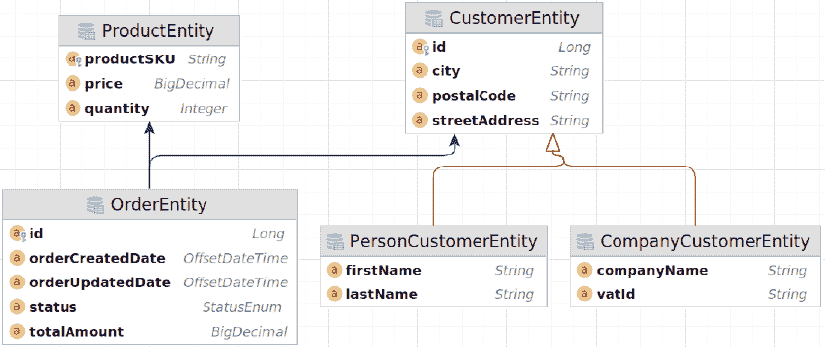
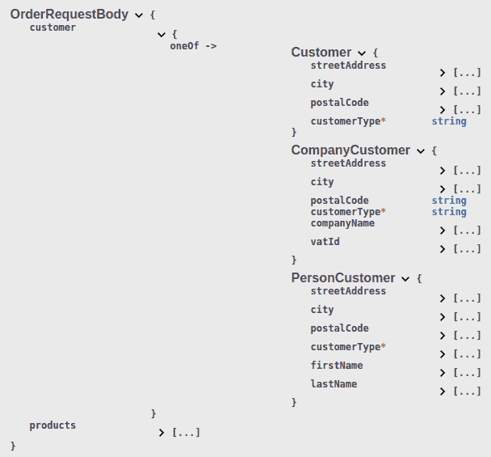
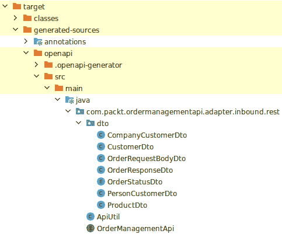
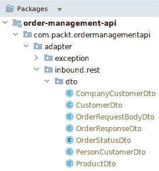
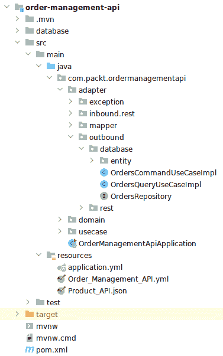
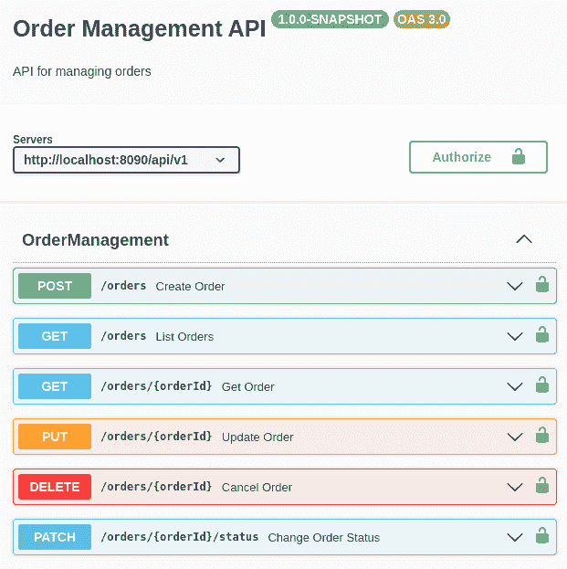
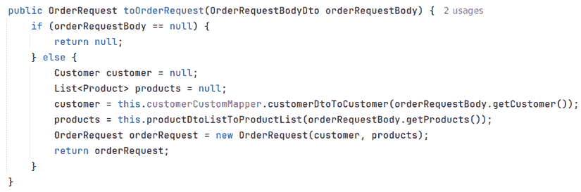
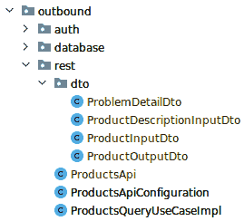

# 4

# 使用 OpenAPI 生成代码

在本章中，我们将开始开发一个全新的 API，称为订单管理，该 API 将与在*第二章*中开发的 Product API 以及在第*第三章*中演化的 API 进行交互。

在上一章中，产品 API 是按照*代码优先*的方法开发的，即在文档之前实现 API。

在本章中，我们将采用*规范优先*的方法，也称为 API-first，即首先完成整个 API 的规范，然后实现 API。

首先，我们将为订单管理 API 构建 OpenAPI 规范，声明其路径、方法和请求及响应模式（其中一些使用多态）。

然后，我们将使用 OpenAPI 工具从 API 规范生成 Java 代码存根。此生成的代码加快了实现过程，减少了样板代码的手动维护，最重要的是，使得在 API 规范和服务实现之间保持一致性更容易，以便于未来的更改。

接下来，我们将介绍服务的包结构和 API 构建的代码实现要点，将其交付为可工作的状态。

最后，我们将探讨在订单管理和产品 API 之间建立通信，通过调用外部 API 并根据接收到的条件相应地做出响应，以验证在此服务中创建的订单中将要注册的产品。

到本章结束时，您将构建出开始设计、开发和集成规范优先 API 所需的所有知识，这将极大地增强您的实力，并以令人难以置信的方式加快您的设计和开发阶段。

在本章中，我们将涵盖以下主题：

+   订单管理 API 规范

+   从规范生成代码

+   订单管理 API 的包结构

+   实现订单管理 API 控制器

+   与产品 API 通信

# 技术要求

在本章中，我们将实现一个示例订单管理 API。为了能够跟随本书中的代码示例进行操作，您应该具备以下条件：

+   对 Java 语言和平台有中级知识

+   至少需要了解 Spring Boot 或类似框架的基本知识

+   已安装 Java 21 和 Maven 3.9.0

在本章中，我们将应用 API-first REST 原则来创建我们的 API；您可以在 GitHub 上找到本章的代码，网址为[`github.com/PacktPublishing/Mastering-RESTful-Web-Services-with-Java/tree/main/chapter4`](https://github.com/PacktPublishing/Mastering-RESTful-Web-Services-with-Java/tree/main/chapter4)。

# 规范订单管理 API

在本节中，您将开发订单管理 API 的操作和数据结构的规范。订单管理 API 作为我们在本书中构建的项目的一部分，将处理由产品 API 管理的产品的订单。

如前一章所述，*规范优先*意味着在 API 的实际实现之前创建一个抽象的 API 规范。您不是从编程语言中的可执行代码开始，而是首先定义 API 的结构、行为和功能。这就是为什么这也被称为 API 优先开发。

在*第一章*中，我们探讨了在设计 RESTful API 时应考虑的许多关键原则。让我们看看如何使用 API 优先的方法应用这些原则。

## 在 API 优先开发中实施 HTTP 原则

当采用 API 优先的方法时，从设计阶段开始就考虑 HTTP 术语至关重要。让我们看看一些原则：

+   **首先定义 API 合约**：使用 OpenAPI/Swagger 等工具定义您的 API 结构，包括端点、请求/响应格式和数据模型。此合约作为开发者的蓝图，有助于确保一致性和清晰性。在下一节中，我们将使用 OpenAPI 规范文件为订单管理 API 构建 API 合约。

+   **一致使用 HTTP 方法和状态码**：遵循如*第二章*中看到的 HTTP 方法和状态码的约定。例如，使用`GET`检索资源，`POST`创建，`PUT`更新，`DELETE`删除资源。使用适当的状态码来传达请求的结果。这些也应在规范文件中描述。

+   **强调资源建模**：关注准确地将您的领域建模为资源。这包括识别关键实体及其关系，通过可以使用 HTTP 方法访问的 URL 来识别它们。例如，在我们的订单管理 API 中，资源是`Customers`、`Products`和`Orders`。

+   **规划版本控制**：实施版本控制策略以处理 API 的演变。这可以通过 URL 路径版本控制（例如，`/v2/books`）和标准或自定义请求头来完成。版本控制支持向后兼容性和随着 API 的增长和变化而平稳过渡。这将在我们的规范文件的通用 API 元数据中定义。

+   **考虑安全性**：定义认证和授权机制，例如 OAuth、API 密钥或 JSON Web Tokens (JWTs)，以保护您的 API。我们将简要介绍如何将安全方案添加到我们的规范中，您将学习如何在*第七章*中深入实现它。

现在我们对通过此定义要实现的原则有了更清晰的了解，让我们开始编写规范本身。

## 设计 OpenAPI 规范

我们将使用 YAML 语法编写订单管理 API 规范。您可以使用您个人偏好的任何编辑器来跟随：您可以使用在线 Swagger 编辑器 [`editor.swagger.io/`](https://editor.swagger.io/)，或者如果您使用 JetBrains IntelliJ 或 Microsoft VS Code 等 IDE 工作，您可以使用插件来获得类似 Swagger 网站的经验，并在 IDE 内部编写规范时验证您的规范。

我们将创建的完整规范可在 GitHub 上找到，链接为 [`github.com/PacktPublishing/Mastering-RESTful-Web-Services-with-Java/tree/main/chapter4`](https://github.com/PacktPublishing/Mastering-RESTful-Web-Services-with-Java/tree/main/chapter4)。

让我们从定义 API 的公共元数据开始编写规范文件。

### 公共 API 元数据

我们将首先使用 API 的元数据定义规范的最高层上下文，包括 API 的标题、描述和版本。此外，我们在这里描述应用程序将运行的服务器。在我们的案例中，因为我们想本地运行它，所以我们将使用 `localhost` 进行测试目的：

```java
openapi: 3.0.0
info:
  title: Order Management API
  description: API for managing orders
  version: 1.0.0-SNAPSHOT
servers:
  - url: http://localhost:8080/api/v1 
```

### 订单管理 API 路径

此 API 将有三个路径：

+   `/orders` 使用 `POST` 和 `GET` 方法分别用于创建和检索订单

+   `/orders/{orderId}` 使用 `GET`、`PUT` 和 `DELETE` 方法分别用于访问、编辑和删除特定订单

+   `/orders/{orderId}/status` 使用 `PATCH` 方法来更改现有订单的状态

#### `/orders` 路径的方法

让我们先定义 `POST` 方法及其请求和响应。记住，`$ref` 符号用于引用规范文档中单独部分的规范定义。这允许规范可重用，并且使 `paths` 部分更短、更易读：

```java
paths:
  /orders:
    post:
      tags:
        - OrderManagement
      summary: Create Order
      description: Creates a new order
      requestBody:
        required: true
        content:
          application/json:
            schema:
              $ref: '#/components/schemas/OrderRequestBody'
      responses:
        '201':
          description: Created
          content:
            application/json:
              schema:
                $ref: '#/components/schemas/OrderResponse'
        '400':
          description: Bad Request 
```

在这个 `POST` 定义中，我们定义了当控制器接收到带有 `/orders` 路径的 `POST` 请求时，请求应包含 `OrderRequestBody` 规范定义中的主体。如果一切顺利，API 将以 `201 Created` HTTP 状态码响应，主体由 `OrderResponse` 规范定义。如果请求主体不匹配 `OrderRequestBody`，API 将以 `400 Bad Request` HTTP 响应代码响应。我们将在本章后面定义请求和响应主体。

此外，为了帮助 OpenAPI 生成器命名从我们的规范中生成的类，我们在每个方法操作中指定了一个标签。在这种情况下，标签将被命名为 `OrderManagement`。如果我们省略标签，生成的类将被命名为 `DefaultApi`。我们将在配置生成器并开始从规范生成代码的 *从规范生成代码* 部分详细说明这一点。

接下来，我们将为 `/orders` 路径端点定义 `GET` 方法：

```java
get:
  tags:
    - OrderManagement
  summary: List Orders
  description: Retrieves a list of orders
  responses:
    '200':
      description: OK
      content:
        application/json:
          schema:
            type: array
            items:
              $ref: '#/components/schemas/OrderResponse' 
```

这是一个 `GET` 方法，当调用时，它返回订单列表（如果有），HTTP 状态为 `200`，以及一个包含系统中所有订单的对象数组 `OrderResponse`。如果没有订单，返回的列表仍然为空，HTTP 状态为 `200`，这意味着请求已成功完成。

我们将在下一个路径中指定一个端点来检索系统中的单个订单。

#### /orders/{orderId} 路径的方法

现在，我们将定义另一个路径来访问特定的订单，并且我们将为这个路径定义一个 `GET`、一个 `PUT` 和一个 `DELETE` 方法，从 `GET` 方法开始：

```java
/orders/{orderId}:
  get:
    tags:
      - OrderManagement
    summary: Get Order
    description: Retrieves a single order by its ID
    parameters:
      - name: orderId
        in: path
        required: true
        description: The ID of the order to retrieve
        schema:
         type: string
    example: 123456
    responses:
      '200':
        description: OK
        content:
          application/json:
            schema:
              $ref: '#/components/schemas/OrderResponse'
      '404':
        description: Not Found 
```

在 `GET` 方法中，我们正在定义一个路径来从单个订单中检索数据。在这里，我们正在路径中接收一个参数，以便能够从特定的订单中获取数据，该订单定义为 `/orders/{orderId}` 路径，包含在 `{orderId}` 占位符中的订单 ID。我们还需要在 `parameters` 下定义该参数，在 `in: path` 标志下。这就是我们指定 `orderId` 是要接收的参数的地方。

在成功的情况下，将返回一个包含订单本身的 `OrderResponse` 对象，HTTP 响应状态为 `200 OK`。如果没有给定 ID 的订单，将返回 `404 Not Found` HTTP 状态。

现在，让我们看看 `PUT` 方法：

```java
 put:
    tags:
      - OrderManagement
    summary: Update Order
    description: Updates an existing order
    parameters:
      - name: orderId
        in: path
        required: true
        description: The ID of the order to be updated
        schema:
          type: string
    example: 123456
    requestBody:
      required: true
      content:
        application/json:
          schema:
            $ref: '#/components/schemas/OrderRequestBody'
    responses:
      '200':
        description: OK
        content:
          application/json:
            schema:
              $ref: '#/components/schemas/OrderResponse'
      '400':
        description: Bad Request
      '404':
        description: Not Found 
```

与 `GET` 方法类似，使用 `PUT` 方法，我们正在定义一个更新单个订单的操作。请注意，我们在这里展示的方法与构建 Product API 时采用的方法不同，在那里我们使用了 `PUT` 方法来创建实体。在订单管理 API 中，我们使用一个单独的 `POST` 方法（请求中不带 ID）来创建订单。

`PUT` 是一个幂等方法，这意味着它可以多次调用（使用相同的订单 ID）而不会影响结果。另一方面，`POST` 不是幂等的，所以每次调用它都会在我们的服务中创建一个新的订单。

对于 `PUT` 方法，我们在 `/orders/{orderId}` 路径中接收订单 ID，通过在参数列表中定义的 `orderId` 参数和 `OrderRequestBody` 接收订单 ID，这与在 `POST` 方法中看到的方式相同，包含要更新的订单的所有详细信息。

如果操作成功，它将返回一个 `200 OK` HTTP 状态码和包含持久化订单详细信息的 `OrderResponse`。如果找不到订单，将返回 `404 Not Found`。如果请求格式错误，将返回 `400 Bad Request`。

最后，让我们看看用于取消特定订单的 `DELETE` 方法：

```java
delete:
  tags:
    - OrderManagement
  summary: Cancel Order
  description: Cancels an existing order
  parameters:
    - name: orderId
      in: path
      description: ID of the order to be cancelled
      required: true
      schema:
        type: string
   example: 123456
responses:
  '204':
    description: No Content
  '403':
    description: Forbidden
  '404':
    description: Not Found 
```

在这个方法中，我们需要传递一个名为 `orderId` 的参数，它是要取消的订单的 ID，这与我们在 `GET` 和 `PUT` 方法中所做的方式相同。

如果操作成功，将向调用者返回一个 `204 No Content` HTTP 状态码，因为没有响应体。如果没有指定 ID 的订单，将返回 `404 Not Found`。

#### /orders/{orderId}/status 的方法

最后，让我们看看最后一个定义的端点路径，使用 `PATCH` 方法来更改订单的状态：

```java
/orders/{orderId}/status:
  patch:
    tags:
      - OrderManagement
    summary: Change Order Status
    description: Change an Order Status
    parameters:
      - name: orderId
        in: path
        required: true
        description: The ID of the order to be updated
        schema:
          type: string
    example: 123456
    requestBody:
      required: true
      content:
        application/json:
          schema:
            $ref: '#/components/schemas/OrderStatus'
    responses:
      '200':
        description: OK
        content:
          application/json:
            schema:
              $ref: '#/components/schemas/OrderResponse'
      '404':
        description: Not Found 
```

此端点的目标是更新订单的状态。在现实世界的生产环境中，订单的状态取决于由其他服务在业务逻辑中定义的外部情况，例如，由支付提供商验证的支付批准、仓库中物品的可用性，甚至欺诈检测；有一个方法来通过外部调用更改订单的状态是很重要的，而这个端点正是为了完成这个任务。

注意，此请求的正文是通过引用来定义的，使用 `$ref` 指向下一节将要定义的 `OrderStatus` 架构。这展示了规范优先设计的可重用性，其中你定义一个可重用的架构，可以在 OpenAPI 架构定义文件中的多个路径定义、参数和端点中引用，从而消除重复定义的需要。下一节将涵盖这个主题。

现在，我们将定义用于请求和响应正文以及作为我们刚刚定义的操作参数的架构。

## 定义 API 架构

现在我们已经完成了定义识别我们 API 资源路径的路径，我们将定义我们在上一节中定义的操作中使用的架构。这些架构描述了这些操作的请求和响应正文的结构，也可以像之前看到的那样用作操作的参数。



图 4.1：从定义的 API 架构生成的实体-关系图

在前面的图中，你可以看到将要由我们即将编写的架构定义扩展而创建的实体之间的关系。这就是为什么它们在名称定义上有所不同。这样，你可以从 OpenAPI 架构中定义整个实体结构，从而加强 API 优先原则。

架构定义位于 OpenAPI 规范的 `components` 部分下。

OpenAPI 架构使用一种支持定义 JSON 数据的复杂结构和结构之间关系的语言。架构位于 `schemas` 部分的条目中，首先是 `Product` 和 `Customer`：

```java
components:
  schemas:
    Product:
      type: object
      properties:
        productSKU:
          type: string
        quantity:
          type: integer
    Customer:
      type: object
      properties:
        customerType:
          type: string
        streetAddress:
          type: string
        city:
          type: string
        postalCode:
          type: string
      discriminator:
        propertyName: customerType
        mapping:
          person: '#/components/schemas/PersonCustomer'
          company: '#/components/schemas/CompanyCustomer' 
```

`Product` 是我们规范中最简单的架构。它仅仅定义了其类型是一个具有两个属性的 JSON 对象：`productSKU` 类型为 `string`，它将成为我们产品的 ID，以及 `quantity` 类型为 `integer`，它将表示该产品的可用性。

转到 `Customer` 架构，它是一个包含四个属性的对象：`customerType`、`streetAddress`、`city` 和 `postalCode`。所有属性都是 `string` 类型。但在这里，我们也开始引入继承和多态性的概念。

`Customer` 架构将作为一个父（基础）架构，它将由另外两个架构扩展——`PersonCustomer` 和 `CompanyCustomer`——这两个架构我们将在后面介绍。这种设置展示了继承，有一个父架构和两个子架构，以及多态性，允许 `Customer` 代表 `PersonCustomer` 或 `CompanyCustomer`。

正是在这里，`discriminator` 属性开始发挥作用。当 JSON 解析器尝试在从 JSON 加载并转换为运行时对象的过程中反序列化 JSON 数据时，`discriminator` 属性被用来指示它正在从哪个子架构继承。在我们的例子中，判别器将是 `customerType` 属性。这个属性将定义 `Customer` 是 `PersonCustomer` 类型还是 `CompanyCustomer` 类型。

当你下订单时，这个属性会被使用，作为之前定义的 `POST` 请求体的一部分。有了判别器，单个端点可以接受两个不同的体，一个包含 `Customer` 类型为 `PersonCustomer` 的个人客户，另一个包含 `Customer` 类型为 `CompanyCustomer` 的公司。

现在，让我们定义子架构 `PersonCustomer` 和 `CompanyCustomer`，并将它们与父 `Customer` 架构相关联：

```java
PersonCustomer:
  type: object
  allOf:
    - $ref: '#/components/schemas/Customer'
  properties:
    firstName:
      type: string
    lastName:
      type: string
CompanyCustomer:
  type: object
  allOf:
    - $ref: '#/components/schemas/Customer'
  properties:
    companyName:
      type: string
    vatId:
      type: string 
```

这两个架构定义看起来很相似；它们都使用了 `allOf` 关键字，该关键字引用 `Customer` 架构。它定义子架构应该包含（继承）`Customer` 架构的所有属性。

由于我们在规范中实现了层次结构，让我们简要地看看如何使用 `OrderRequestBody` 创建新订单，该 `OrderRequestBody` 将用于 `POST` 和 `PUT` 方法来创建和更新应用程序中的资源。



图 4.2 – OpenAPI Swagger UI 中的 OrderRequestBody 架构

`POST` 方法期望在请求体中包含 `OrderRequestBody`。由于我们在定义中使用了 `discriminator`，因此在这里我们需要在请求中选择一个体，如前图中的 `oneOf->` 所指定：`PersonCustomer`、`CompanyCustomer` 或 `Customer`。`customerType` 字段的值需要是 `person`、`company` 或 `customer` 中的一个，以匹配定义的体之一。单独使用 `Customer` 不被鼓励，因为它没有从层次结构和多态性中受益，但重要的是要知道，如果需要，你也可以单独使用它，而不需要 `PersonCustomer` 或 `CompanyCustomer` 的额外字段。

然后，你可以添加这些每个对应的字段，所以如果是一个公司，你将在请求体中拥有`vatId`和`companyName`等字段，如果是个人，你将在请求中拥有`firstName`和`lastName`等字段。在`Customer`规范中提到的字段对两种客户类型都是通用的。

为了完成我们 API 规范中的模式部分，我们将定义由订单管理 API 使用的请求和响应体：

```java
OrderRequestBody:
  type: object
  properties:
    customer:
      $ref: '#/components/schemas/Customer'
    products:
      type: array
      items:
        $ref: '#/components/schemas/Product'
OrderResponse:
  type: object
  properties:
    id:
      type: string
    customer:
      $ref: '#/components/schemas/Customer'
    products:
      type: array
      items:
        $ref: '#/components/schemas/Product'
    totalAmount:
      type: number
    orderCreatedDate:
      type: string
      format: date-time
    orderUpdatedDate:
      type: string
      format: date-time
    status:
      $ref: '#/components/schemas/Status'
OrderStatus:
  type: object
  properties:
    status:
      $ref: '#/components/schemas/Status'
Status:
  type: string
  enum: [ Pending, Approved, Cancelled ] 
```

在`OrderRequestBody`对象定义中，有两个属性——一个是上面定义的`Customer`类型，使用`$ref`来引用其定义，以及`products`属性，它是一个 JSON 数组，将在`OrderRequestBody`中表示一个`Product` JSON 对象的列表。

在响应模式定义中，`OrderResponse`包含一个`Product` JSON 对象的数组，包含特定订单的每个产品，`customer`属性引用`Customer`模式并返回此订单的客户数据，`orderCreatedDate`和`orderUpdatedDate`属性包含订单创建和更新的日期和时间（如果有），以及`status`属性，它引用定义的`OrderStatus`，该`OrderStatus`引用`Status` `enum`，包含订单的所有可能状态：`Pending`、`Approved`或`Cancelled`。由于我们可以在规范中的任何地方重用这些定义，因此`OrderStatus`模式也在订单状态更改端点作为请求体定义中引用，以允许请求中的值。


在 API 之间共享模式

使用 Java 和其他编程语言，我们习惯于定义可重用的库以避免在多个项目中重复相同的代码。OpenAPI 规范也可以引用外部文件，因此可以在多个 API 之间共享公共部分。

然而，你应该意识到这种方法会在 API 之间创建耦合。如果公共部分发生变化，可能会导致意外的不一致。因此，建议尽量保持单个 API 规范的自包含。如果你想要重用模式，你应该确保它们非常稳定。

这样的一个例子可能是用于报告错误的结构。但在我们的示例 API 中，我们使用基于 RFC 7807 互联网标准的`ProblemDetail`模式。这样，我们避免了维护共享模式。

## 定义安全方案

除了模式之外，OpenAPI 规范的组件部分也可以用来指定我们 API 的安全相关要求。在这里，我们将指定要使用的身份验证机制：OpenID Connect 配合 JWT。你将在*第七章*中了解更多关于安全的信息。

```java
securitySchemes:
  JWTAuth:
    type: http
    scheme: bearer
    bearerFormat: JWT 
```

`securitySchemes`定义了一个名为`JWTAuth`的安全方案，并将其全局应用于 API 中的所有操作。以下是其组件及其影响的分析：

+   `JWTAuth`：这是安全方案的标识符。

+   `type: http`：这指定了安全方案是基于 HTTP 的。

+   `scheme: bearer`：这表示该方案使用携带令牌。

+   `bearerFormat: JWT`：这指定了携带令牌的格式为 JWT。

在定义了所有这些之后，我们可以从`components`关键字移开，了解这个定义中的最后一个关键字，即`security`关键字：

```java
security:
  - JWTAuth: [] 
```

这个安全定义处于根级别，它表明在 JWT 中访问 API 不需要特定的作用域或权限。因此，所有 API 调用都必须在授权头中提供有效的 JWT，但令牌本身不需要指定任何特定的作用域。

如果你不想使用 JWT 进行认证，可以考虑使用会话状态 ID 作为替代方案。在 JWT 出现之前，它们被广泛使用，并且由于许多原因，JWT 取代了会话状态 ID。

在查看如何使用会话状态 ID 之前，让我们看看 JWT 成为微服务首选认证方法的关键原因：

+   **无状态**：JWT 是无状态的，这意味着它们不需要服务器维护会话状态。这对微服务有益，因为微服务被设计成无状态和可扩展的。

+   **可扩展性**：由于 JWT 是自包含的，并且不需要服务器端存储，与需要集中式会话存储的会话状态 ID 相比，它们在分布式系统中具有更高的可扩展性。

+   **去中心化认证**：JWT 可以被任何拥有公钥的服务验证，允许在多个微服务之间进行去中心化认证，而无需中央会话存储。

+   **互操作性**：JWT 是一个标准（RFC 7519），并且在不同的平台和语言中得到广泛支持，这使得它们适合异构微服务环境。

+   **安全性**：JWT 可以进行签名和可选加密，提供完整性和机密性。它们还可以包含提供有关用户或会话的额外上下文的声明。

但在特定情况下，例如处理遗留服务和与已使用会话状态 ID 的现有服务的集成时，这种方法可能是必要的。

会话状态 ID 涉及在服务器端维护会话，其中每个会话由一个唯一的会话 ID 标识。这个会话 ID 存储在客户端，通常在 cookie 中，并随每个请求发送到服务器。然后服务器验证会话 ID 并检索相关的会话数据。

会话状态 ID 的一些优点是服务器对会话拥有完全控制权，包括在任何时候使会话失效的能力，并且与 JWT 相比，无需处理令牌过期和续订。

另一方面，它需要在服务器上维护会话状态，这在分布式环境中可能具有挑战性，并且与无状态的 JWT 不同，会话状态 ID 需要服务器维护状态。

下面是一个示例，说明您如何在 OpenAPI 架构中定义会话状态 ID：

```java
components:
  securitySchemes:
    SessionIDAuth:
      type: apiKey
      in: cookie
      name: SESSIONID
security:
  - SessionIDAuth: [] 
```

在此示例中，`SessionIDAuth` 安全方案指定会话 ID 将以名为 `SESSIONID` 的 cookie 发送。然后服务器将验证此会话 ID 以验证用户身份。

在我们的服务中，我们不会涵盖会话状态 ID，因为它们破坏了无状态目标 RESTful 微服务，并且有了上面解释的所有 JWT 优点，但了解如何使用它们以规范优先的方法是很好的。

此外，如前所述，我们将更深入地探讨第 *7 章* 的安全主题。

这样，我们就完成了规范。您可以将文件保存为表示您的 API 的名称，并以 `.yml` 扩展名结尾（YAML 的简称）。在我们的示例中，文件将命名为 `Order_Management_API.yml`。

如前所述，您可以在 GitHub 仓库中查看完整文件，网址为 [`github.com/PacktPublishing/Mastering-RESTful-Web-Services-with-Java/tree/main/chapter4`](https://github.com/PacktPublishing/Mastering-RESTful-Web-Services-with-Java/tree/main/chapter4)。

接下来，我们将使用 `openapi-generator-maven-plugin` 从此规范生成代码。让我们看看如何操作。

# 从规范生成代码

为了从规范生成代码，应用程序需要为此做好准备。在本节中，您将配置一个插件，并从我们在规范文件中指定的内容生成代码。

以下 XML 片段配置了 `openapi-generator-maven-plugin`，这是为我们的 Maven 项目设计的，专门用于从上一节中定义的 OpenAPI 规范生成基于 Spring 的 Java 代码。此插件简化了 API 端点、模型和配置类的自动创建。

我们将在项目中的 `pom.xml` 文件中配置插件。您可以参考 GitHub 仓库以查看完整文件，但在这里我们将关注实现我们目标的具体更改。现在让我们看看这个配置：

```java
<plugin>
    <groupId>org.openapitools</groupId>
    <artifactId>openapi-generator-maven-plugin</artifactId>
    <version>7.5.0</version>
    <executions>
        <execution>
            <goals>
                <goal>generate</goal>
            </goals>
            <configuration>
                <inputSpec>${project.basedir}/your_spec_API.yml
                </inputSpec>
                <generatorName>spring</generatorName>
                <apiPackage>[package where generated code is added]
                </apiPackage>
                <modelPackage>[new package where DTOs are added]
                </modelPackage>
                <modelNameSuffix>Dto</modelNameSuffix>
                <configOptions>
                   <documentationProvider>springdoc
                   </documentationProvider>
                    <interfaceOnly>true</interfaceOnly>
                    <oas3>true</oas3>
                    <openApiNullable>false</openApiNullable>
                    <serializableModel>true</serializableModel>
                    <useBeanValidation>true</useBeanValidation>
                    <useSpringBoot3>true</useSpringBoot3>
                    <useTags>true</useTags>
                </configOptions>
            </configuration>
        </execution>
    </executions>
</plugin> 
```

下面是其关键组件的分解：

+   **插件识别**：`groupId` 和 `artifactId` 在 Maven 生态系统中标识插件：

    ```java
    <groupId>org.openapitools</groupId>
    <artifactId>openapi-generator-maven-plugin</artifactId> 
    ```

+   **插件版本**：指定要使用的插件版本，确保兼容性并访问此版本中可用的特定功能：

    ```java
    <version>7.5.0</version> 
    ```

+   **执行配置**：`executions` 块定义了插件何时以及如何运行。名为 `generate` 的目标触发代码生成过程：

    ```java
    <goals>
        <goal>generate</goal>
    </goals> 
    ```

+   **规范输入** : `inputSpec` 配置指向 OpenAPI 规范文件。此路径相对于项目的基本目录，表示插件应在何处查找上一节中详细说明的 API 定义：

    ```java
    <inputSpec>${project.basedir}/src/main/resources/Order_Management_API.yml</inputSpec> 
    ```

+   **生成器配置** : `generatorName` 指定生成的代码应针对 Spring 进行定制，这会影响输出中使用的结构和注解：

    ```java
    <generatorName>spring</generatorName> 
    ```

+   **包名** : `apiPackage` 和 `modelPackage` 配置分别定义了生成的 API 接口（API 操作）和模型类（数据结构）的 Java 包名。这有助于在项目结构中组织生成的代码。此外，通过 `modelNameSuffix` 添加的后缀有助于生成具有此后缀名称的 DTO：

    ```java
    <apiPackage>com.packt.ordermanagementapi.adapter.inbound.rest
    </apiPackage>
    <modelPackage>com.packt.ordermanagementapi.adapter.inbound.rest.dto
    </modelPackage>
    <modelNameSuffix>Dto</modelNameSuffix> 
    ```

+   **附加选项** : `configOptions` 部分提供了对生成的代码的进一步自定义。让我们简要描述我们在这里使用的每个选项及其功能：

    +   `documentationProvider` : 这指定了要使用的文档提供程序。在这种情况下，使用 `springdoc` 生成 API 文档。

    +   `interfaceOnly` : 当设置为 `true` 时，仅生成 API 的接口，而不生成任何实现。

    +   `oas3` : 这表示正在使用 OpenAPI 3.0 规范。

    +   `openApiNullable` : 当设置为 `false` 时，生成器将不会为可选字段使用 `@Nullable` 注解。

    +   `serializableModel` : 当设置为 `true` 时，生成的模型将实现 `Serializable` 接口。

    +   `useBeanValidation` : 当设置为 `true` 时，生成的模型将包括用于 bean 验证的注解（例如，`@NotNull`，`@Size`）。

    +   `useSpringBoot3` : 当设置为 `true` 时，生成器将生成与 Spring Boot 3 兼容的代码。

    +   `useTags` : 当设置为 `true` 时，生成器将使用 OpenAPI 规范中定义的标签来分组 API 操作。

    ```java
    <configOptions>
       <documentationProvider>springdoc</documentationProvider>
        <interfaceOnly>true</interfaceOnly>
        <oas3>true</oas3>
        <openApiNullable>false</openApiNullable>
        <serializableModel>true</serializableModel>
        <useBeanValidation>true</useBeanValidation>
        <useSpringBoot3>true</useSpringBoot3>
        <useTags>true</useTags>
    </configOptions> 
    ```

有了这些，我们已经覆盖了 `pom.xml` 文件中插件配置的各个方面。

接下来，让我们执行构建并生成实现：

```java
mvn clean install 
```

如果你的构建成功，你会注意到在你的目标文件夹中生成了 DTO 和接口。



图 4.3 – 在目标文件夹中生成的实现

如果你使用 IntelliJ IDEA，切换到 **包** 视图，这样你就可以看到生成的源代码以及项目的结构，并与生成的源代码和你的实现无缝工作，如下面的截图所示：



图 4.4 – 与项目结构一起生成的实现

通过在`target`文件夹中生成代码，我们清楚地将其与`src`文件夹中手动编写的代码分开。生成的代码不应存储在版本控制系统（Git 或其他）中，以避免与应从中生成的源规范不一致。相反，每次 Maven 构建都会生成新的代码。

让我们看看生成的`PersonCustomerDto`类中的结果：

```java
@Generated(value = "org.openapitools.codegen.languages.SpringCodegen", date = "2024-07-21T20:59:33.440034506-03:00[America/Sao_Paulo]", comments = "Generator version: 7.5.0")
public class PersonCustomerDto extends CustomerDto implements Serializable {
  private static final long serialVersionUID = 1L;
  private String firstName;
  private String lastName;
  public PersonCustomerDto firstName(String firstName) {
    this.firstName = firstName;
    return this;
  }
...getters and setters omitted for brevity 
```

在这里，我们可以看到，对于规范模式中指定的每个字段，都生成了一个相应的 Java 类字段，包括与其他模式的关系，例如从`Customer`模式继承，这证明了如果我们正确地在规范文件中定义关系，我们也可以使用 API-first 方法来建模面向对象编程概念。其他类看起来很相似，每个类都是根据其自己的模式定义生成的。

在继续实现 API 规范中列出的操作之前，让我们看看我们的 API 路径和方法是如何被转换的。例如，让我们看看`DELETE`方法：

```java
/**
 * DELETE /orders : Cancel Order
 * Cancels an existing order
 *
 * @param orderId ID of the order to cancel (required)
 * @return No Content (status code 204)
 *         or Not Found (status code 404)
 */
@Operation(
    operationId = "ordersDelete",
    summary = "Cancel Order",
    description = "Cancels an existing order",
    tags = { "OrderManagement" },
    responses = {
        @ApiResponse(responseCode = "204", description = "No Content"),
        @ApiResponse(responseCode = "404", description = "Not Found")
    },
    security = {
        @SecurityRequirement(name = "JWTAuth")
    }
)
@RequestMapping(
    method = RequestMethod.DELETE,
    value = "/orders"
)
default ResponseEntity<Void> ordersDelete(
    @NotNull @Parameter(name = "orderId",
        description = "ID of the order to cancel", required = true,
        in = ParameterIn.QUERY) @Valid @RequestParam(value = "orderId",
        required = true) String orderId
) {
    return new ResponseEntity<>(HttpStatus.NOT_IMPLEMENTED);
} 
```

在这里，我们可以看到生成的默认实现代码没有任何作用；它只返回一个状态为`NOT_IMPLEMENTED`的响应实体。如果我们尝试使用这个默认代码调用 API，客户端会看到一个`501 Not Implemented`的 HTTP 状态。

默认实现预期将被实际实现所覆盖。路径、其参数和响应已经定义和文档化。运行中的 API 应用程序的 API 文档可以通过 Swagger UI 界面访问，或者通过自动生成的`/v3/api-docs`路径下载 OpenAPI JSON 定义，就像我们在*第二章*中开发的先定义 API 一样。

请记住，您需要将`springdoc-openapi-starter-webmvc-ui`依赖项添加到您的`pom.xml`文件中，以便能够使用 Swagger UI 图形界面。请参考*第四章*的 GitHub 仓库以获取运行项目所需的完整依赖项列表。

这就是为什么先定义规范的方法很方便，因为一旦设计被定义，开发者就可以专注于实现，而消费者甚至可以在实际开发完成之前就开始与系统进行集成。

现在我们已经生成了规范，让我们概述一下这个服务的包结构。

# 订单管理 API 的包结构

让我们看看订单管理 API 的包结构是什么样的：



图 4.5 – 实现的订单管理 API 的包结构

在这里，我们可以看到订单管理 API 遵循与*第二章*中描述的相同架构方法，遵循清洁架构的原则。让我们看看包含的包：

+   `adapter` : 这个包包含以下四个子包：

    +   `exception` : 这包含所有类异常和异常处理器。

    +   `inbound.rest` : 这负责处理所有输入、转换和由规范生成的数据。

    +   `mapper` : 这包含所有对象之间的映射转换，例如从 `OrderRequestBodyDto` 到 `toOrderRequest` 的转换，以及自定义定义的映射器。

    +   `outbound` : 这个包包含所有与外部服务交互的元素，如数据库和其他服务。在这个服务中，我们将有两个子包：

        +   `outbound.database` : 这包含所有将与数据库本身交互的元素，包含如 `createOrder` 和 `updateOrderStatus` 等操作的用例实现，以及仓库也在这里。它包含一个内部的包。

        +   `outbound.database.entity` : 这包含服务中声明的表和与数据库交互的所有定义的实体。

+   `outbound.rest` : 这个包包含所有通过 REST 调用与外部服务交互所需的元素。在这个服务中，我们有与在 *第二章* 中创建的产品 API 交互所需的元素。

+   `domain` : 这个包包含定义每个由该服务包含的域的基础结构的 POJOs。其结构将主要继承自实体，但它们本身不是实体（那些在 `adapter.outbound.database.entity` 包中定义），因此它包含来自 `Order`、`Customer`（也包括 `PersonCustomer` 和 `CompanyCustomer`）以及 `Product` 定义，以及 `StatusEnum` 定义。

+   `usecase` : 这包含用例的接口定义，包含将要实现的动作。在这个服务中，我们有两个用例：

+   `OrdersCommandUseCase` : 这包含如 `createOrder` 和 `updateOrder` 等动作的定义，这些动作由 `adapter.outbound.database` 中的 `OrdersCommandUseCaseImpl` 类实现。

+   `OrdersQueryUseCase` : 这包含通过查询与数据库发生的动作的定义，并由 `adapter.inbound.rest` 包中的 `OrdersQueryUseCaseImpl` 实现。

既然我们已经了解了服务的包结构，让我们跳入控制器的实现本身。

# 实现订单管理 API 控制器

订单管理 API 将遵循与产品 API 相同的架构和包结构，因此控制器将在 `adapter.inbound.rest` 包内创建。

第一步是创建 `OrderManagementApiController` 类，实现 `OrderManagementApi` 接口的方法。以下是代码的示例：

```java
@Controller
public class OrderManagementApiController implements OrderManagementApi {
    @Override
    public ResponseEntity<List<OrderResponse>> ordersGet() {
        //Add your own concrete implementation
        return OrderManagementApi.super.ordersGet();
    }
    @Override
    public ResponseEntity<Void> ordersDelete(String orderId) {
        //Add your own concrete implementation
        return OrderManagementApi.super.ordersDelete(orderId);
    }
    @Override
    public ResponseEntity<OrderResponse> ordersOrderIdGet(String orderId)
    {
        //Add your own concrete implementation
        return OrderManagementApi.super.ordersOrderIdGet(orderId);
    }
    @Override
    public ResponseEntity<OrderResponse> ordersOrderIdPut(String orderId,
        OrderRequestBody orderRequestBody) {
        //Add your own concrete implementation
        return OrderManagementApi
            .super.ordersOrderIdPut(orderId, orderRequestBody);
    }
    @Override
    public ResponseEntity<OrderResponse> ordersPost(
        OrderRequestBody orderRequestBody) {
        //Add your own concrete implementation
        return OrderManagementApi.super.ordersPost(orderRequestBody);
    }
} 
```

在前面的代码片段中，还没有具体的实现，但我们正在定义在规范文件中指定并在`OrderManagementApi`接口中生成的先前方法。如果我们保留`super`调用（调用父接口的默认实现），服务器将返回`501 Not Implemented` HTTP 状态码给调用者。当您想部分部署应用程序并让用户知道此功能尚不可用时，这可能很有用。

OpenAPI 规范文件中的所有定义都作为 API 的文档。如果您将规范粘贴到在线[editor.swagger.io](https://www.editor.swagger.io)工具中，或者运行应用程序并使用浏览器在 URL[`localhost:8080/swagger-ui/index.html`](http://localhost:8080/swagger-ui/index.html)打开 Swagger UI，您将能够看到迄今为止定义的每个操作和模式。这份文档代表了 API 合约，描述了所有可用的资源、与它们交互的方法，以及 API 预期接收和返回的数据。



图 4.6 – 来自订单管理 API 规范的 Swagger UI

这是实现我们 API 规范中定义的操作的第一步。

为了简洁起见，我们在这里不会查看实现过程的每一步，因为本章的目标是向您展示如何从规范中生成代码，正如我们在前面的章节中看到的那样。您可以自由地参考 GitHub 仓库中*第四章*的源代码，以深入了解实现细节，因为这将比本节中将要描述的深入得多。

这就是实现后的控制器看起来像什么：

```java
@RestController
public class OrderManagementApiController implements OrderManagementApi {
    private final OrdersCommandUseCase ordersCommandUseCase;
    private final OrdersQueryUseCase ordersQueryUseCase;
    private final OrderMapper orderMapper;
    public OrderManagementApiController(
    OrdersCommandUseCase ordersCommandUseCase,
    OrdersQueryUseCase ordersQueryUseCase,
    OrderMapper orderMapper) {
        this.ordersCommandUseCase = ordersCommandUseCase;
        this.ordersQueryUseCase = ordersQueryUseCase;
        this.orderMapper = orderMapper;
    }
    @Override
    public ResponseEntity<List<OrderResponseDto>> ordersGet() {
        final var orders = ordersQueryUseCase.getAllOrders()
            .stream()
            .map(orderMapper::toOrderResponse)
            .toList();
        return ResponseEntity.status(HttpStatus.OK)
            .body(orders);
    }
    @Override
    public ResponseEntity<OrderResponseDto> ordersOrderIdGet(
        String orderId) {
        final var order = ordersQueryUseCase.getOrder(orderId);
        return ResponseEntity.status(HttpStatus.OK)
            body(orderMapper.toOrderResponse(order));
    }
    @Override
    public ResponseEntity<OrderResponseDto> ordersPost(
        OrderRequestBodyDto orderRequestBody) {
        final var order = ordersCommandUseCase.createOrder(
           orderMapper.toOrderRequest(orderRequestBody));
        return ResponseEntity.status(HttpStatus.CREATED).body(
            orderMapper.toOrderResponse(order));
    }
    @Override
    public ResponseEntity<OrderResponseDto> ordersOrderIdStatusPatch(
        String orderId, OrderStatusDto orderStatus) {
        final var order = ordersCommandUseCase.updateOrderStatus(orderId,
            StatusEnum.valueOf(orderStatus.getStatus().name()));
        return ResponseEntity.status(HttpStatus.OK).body(
            orderMapper.toOrderResponse(order));
    }
    @Override
    public ResponseEntity<OrderResponseDto> ordersOrderIdPut(
        String orderId, OrderRequestBodyDto orderRequestBody) {
        var orderRequest = orderMapper.toOrderRequest(orderRequestBody);
        final var order = ordersCommandUseCase.updateOrder(
            orderId, orderRequest);
        return ResponseEntity.status(HttpStatus.OK).body(
            orderMapper.toOrderResponse(order));
    }
    @Override
    public ResponseEntity<Void> ordersOrderIdDelete(String orderId) {
        ordersCommandUseCase.deleteOrder(orderId);
        return ResponseEntity.noContent().build();
    }
} 
```

通过查看控制器的实现，我们可以注意到一些与在产品 API 中实现的模式相似，特别是使用用例和映射器的使用。

但与产品 API 不同，在这里我们覆盖了`OpenManagementAPI`接口的生成代码，其中定义了所有路径和操作。与代码优先的方法不同，之前在 OpenAPI 规范中已经定义的文档在这里不需要手动重复，因为它包含在生成的`OpenManagementAPI`中。这就是规范优先（API 优先）实现的力量。

在这个控制器中，我们注入了三个主要接口，用于处理所有业务逻辑、持久性和数据层转换：

+   `OrdersCommandUseCase`

+   `OrdersQueryUseCase`

+   `OrderMapper`

让我们首先关注这个服务的用例实现，即`OrdersCommandUseCase`和`OrdersQueryUseCase`，以及它们在订单管理 API 中的作用，从`OrdersCommandUseCaseImpl`开始。

### 实现 OrdersCommandUseCase

让我们从使用`OrdersCommandUseCaseImpl`类实现`OrdersCommandUseCase`开始：

```java
@Transactional
@Service
public class OrdersCommandUseCaseImpl
       implements OrdersCommandUseCase {
    private final OrdersRepository ordersRepository;
    private final OrderMapper orderMapper;
    private final ProductsApi productsApi;
    public OrdersCommandUseCaseImpl(OrdersRepository ordersRepository,
                                    OrderMapper orderMapper,
                                    ProductsApi productsApi) {
        this.ordersRepository = ordersRepository;
        this.orderMapper = orderMapper;
        this.productsApi = productsApi;
    }
    @Override
    public Order createOrder(OrderRequest orderRequest) {
        BigDecimal total = getProductPrice(orderRequest);
        Order order = orderMapper.toOrder(orderRequest);
        order.setTotalAmount(total);
        return ordersRepository.save(OrderEntity.fromOrder(order, null));
    }
    @Override
    public Order updateOrder(String orderId, OrderRequest orderRequest) {
        Optional<OrderEntity> optionalOrderEntity
                = ordersRepository.findById(orderId);
        if (optionalOrderEntity.isPresent()) {
            BigDecimal total = getProductPrice(orderRequest);
            Order order = orderMapper.toOrder(orderRequest);
            order.setTotalAmount(total);
            return ordersRepository
                .save(OrderEntity.fromOrder(order, 
                    optionalOrderEntity.get()));
        }
        throw new EntityNotFoundException("Order not found with id " + 
        orderId);
    }
    private BigDecimal getProductPrice(OrderRequest orderRequest) {
        return orderRequest.products().stream().map(orderProduct -> {
            ProductOutputDto catalogueProduct =
                productsApi.getProductById(orderProduct.getProductSKU());
            return catalogueProduct
                .getPrice()
                .multiply(BigDecimal.valueOf(
                    orderProduct.getQuantity()));
        }).reduce(BigDecimal.ZERO, BigDecimal::add);
    }
    @Override
    public Order updateOrderStatus(String orderId, StatusEnum status) {
        Optional<OrderEntity> optionalOrderEntity = ordersRepository.findById(orderId);
        if (optionalOrderEntity.isPresent()) {
            return ordersRepository
                .save(OrderEntity
                    .updateOrderStatus(optionalOrderEntity.get(),
                                       status));
        }
        throw new EntityNotFoundException("Order not found with id " +
        orderId);
    }
    @Override
    public void deleteOrder(String orderId) {
        ordersRepository.deleteById(orderId);
    }
} 
```

如前所述，在包结构中，`OrdersCommandUseCaseImpl`类包含了服务本身的业务逻辑、操作以及与其他组件（如仓库和映射器）以及其他服务（如产品 API）的交互，正如我们将在*与产品 API 通信*部分详细看到的那样。这就是为什么这个类被 Spring 的`@Service`注解标注，表示它是一个 Bean 的`Service`类型。

### 实现 OrdersQueryUseCase

转到`OrdersQueryUseCase`的实现，我们将有`OrdersQueryUseCaseImpl`：

```java
@Service
public class OrdersQueryUseCaseImpl implements OrdersQueryUseCase {
    private final OrdersRepository ordersRepository;
    public OrdersQueryUseCaseImpl(OrdersRepository ordersRepository) {
        this.ordersRepository = ordersRepository;
    }
    @Override
    public List<? extends Order> getAllOrders() {
        return ordersRepository.findAll();
    }
    @Override
    public Order getOrder(String orderId) {
        return ordersRepository.findById(orderId)
           .orElseThrow(
               () -> new EntityNotFoundException(
                   "Order not found with id " + orderId)
               );
    }
} 
```

在`OrdersQueryUseCaseImpl`中，我们的实现要小得多，因为这里的重点是与数据库的交互。任何你可能会有的自定义查询或请求都直接进入这个类。

### 使用 MapStruct 配置 OrderMapper

最后，有`OrderMapper`接口。与用例类不同，我们在这里没有实现任何类；相反，我们定义了一个接口，其中包含了我们想在项目中拥有的映射。由于本项目使用 MapStruct 进行对象映射，我们在该接口内定义映射，并将任何自定义映射单独定义。


**MapStruct**

MapStruct 是一个代码生成器，通过依赖约定优于配置的策略简化了 Java bean 类型之间的映射过程。这就是我们定义这个接口的原因；它包含了 MapStruct 生成映射代码所需的配置。此外，我们还将为基本生成的映射代码不足以应对的情况定义一个自定义映射。

让我们从接口定义开始：

```java
@Mapper(uses = CustomerCustomMapper.class, componentModel = "spring")
public interface OrderMapper {
    Order toOrder(OrderRequest orderRequestBody);
    @Mapping(target = "customer", source = "customer",
        qualifiedByName = "customerDtoToCustomer")
    OrderRequest toOrderRequest(OrderRequestBodyDto orderRequestBody);
    @Mapping(target = "customer", source = "customer",
        qualifiedByName = "customerToCustomerDto")
    OrderResponseDto toOrderResponse(Order order);
} 
```

这就是`OrderMapper`接口的样子。我们正在定义 MapStruct 要执行映射操作，例如`toOrderRequest`操作，这是一个从`OrderRequestBodyDto`对象到`OrderRequest`对象的映射。

使用`Mapstruct`进行简单映射很简单，但当事情变得复杂时，就需要引入一个自定义映射实现。这就是`CustomerCustomMapper`类进入我们的映射定义的地方。

要使用 MapStruct 的定制映射，你需要创建一个自定义映射类，并告诉接口使用它。

在这里，我们在类级别的`@Mapper`注解的`uses`属性中添加了`CustomerCustomMapper`类。这样，MapStruct 就知道有一个自定义实现映射器需要引用。

这种方法允许根据你的需求进行部分或完整的对象映射。在这种情况下，我们将通过使用 MapStruct 生成的映射的部分来执行部分映射，并应用自定义映射来处理简单映射无法正确处理的特定复杂对象。

对于每个映射操作，例如`toOrder`、`toOrderRequest`和`toOrderResponse`，如果您有一个自定义映射，它改变了 MapStruct 的默认映射行为，您需要在该方法级别使用`@Mapping`注解来告诉 MapStruct 您有一个自定义映射。

在我们的自定义映射示例中，`target`和`source`属性都指定了接收参数（`toOrderRequest`方法中的`orderRequestBody`和`toOrderResponse`方法中的`order`）中的`customer`属性将以自定义方式映射，需要引用由`CustomerCustomMapper`类实现的自定义映射器实现。

最后，`qualifiedByName`属性告诉 MapStruct 要引用哪个方法进行映射到自定义映射器，该映射器由`@Named`注解标识。

由于引入了复杂性和多态性，以区分具有继承的不同类型的客户，因此需要这个自定义映射。

因此，让我们看看这个自定义映射规范：

```java
@Component
public class CustomerCustomMapper {
    @Named("customerDtoToCustomer")
    public Customer customerDtoToCustomer(CustomerDto customerDto) {
        if (customerDto == null) {
            return null;
        }
        Customer customer = switch (customerDto.getCustomerType()) {
            case "person" -> {
                PersonCustomer personCustomer = new PersonCustomer();
                var personCustomerDto = (PersonCustomerDto) customerDto;
                personCustomer.setFirstName(
                    personCustomerDto.getFirstName());
                personCustomer.setLastName(
                    personCustomerDto.getLastName());
                yield personCustomer;
            }
            case "company" -> {
                CompanyCustomer companyCustomer = new CompanyCustomer();
                var companyCustomerDto = (CompanyCustomerDto) customerDto;
                companyCustomer.setCompanyName(
                    companyCustomerDto.getCompanyName());
                companyCustomer.setVatId(companyCustomerDto.getVatId());
                yield companyCustomer;
            }
            default -> new Customer();
        };
        customer.setStreetAddress(customerDto.getStreetAddress());
        customer.setCity(customerDto.getCity());
        customer.setPostalCode(customerDto.getPostalCode());
        return customer;
    }
    @Named("customerToCustomerDto")
    public CustomerDto customerToCustomerDto(Customer customer) {
        if (customer == null) {
            return null;
        }
        CustomerDto customerDto = switch (customer) {
            case PersonCustomerEntity personCustomer -> {
                PersonCustomerDto personCustomerDto = new 
                PersonCustomerDto();
                personCustomerDto.setFirstName(
                    personCustomer.getFirstName());
                personCustomerDto.setLastName(
                    personCustomer.getLastName());
                personCustomerDto.setCustomerType("person");
                yield personCustomerDto;
            }
            case CompanyCustomerEntity companyCustomer -> {
                CompanyCustomerDto companyCustomerDto = new 
                CompanyCustomerDto();
                companyCustomerDto.setCompanyName(companyCustomer.
                getCompanyName());
                companyCustomerDto.setVatId(companyCustomer.getVatId());
                companyCustomerDto.setCustomerType("company");
                yield companyCustomerDto;
            }
            default -> new CustomerDto();
        };
        customerDto.setStreetAddress(customer.getStreetAddress());
        customerDto.setCity(customer.getCity());
        customerDto.setPostalCode(customer.getPostalCode());
        return customerDto;
    }
} 
```

由于这是一个 MapStruct 组件，它被注解为`@Component`，因此它可以作为一个 Bean 在 Spring 上下文中创建，并在构建过程中被映射生成器检测到。

但其关键方面是前面提到的`@Named`方法级注解。它指定了我们在`qualifiedByName` MapStruct 接口中提到的唯一限定符。`customer`对象是`CustomerCustomMapper`实现中唯一被自定义映射的对象。

使用 MapStruct 生成项目时，它将生成`OrderMapper`接口中指定的映射，但它将调用这个自定义映射实现，正如我们可以在以下屏幕截图中的生成代码片段中看到：



图 4.7 – 生成映射到 OrderRequest 调用客户自定义映射

您可以在构建项目后，在`target`文件夹中的`classes`文件夹内的`mapper`包中找到前一个屏幕截图中的生成代码，其中`OrderMapper`接口和`CustomerCustomMapper`类也被定义。但如果您在 IntelliJ 中使用**包**视图，生成的类将自动显示在`mapper`包中，与您之前在本章中看到的自己的实现类一起。

现在，让我们看看订单管理 API 如何与产品 API 通信以验证接收到的订单中的产品。

# 使用产品 API 进行通信

为了验证订单中的产品是否存在，订单管理 API 通过 API 调用验证插入的产品 SKU 与产品 API，无论是在创建新订单时还是在订单更新包含将新产品插入订单时。

在现实世界的生产应用中，Product API 可能需要验证库存中是否有足够的产品可以添加到订单中，并在没有足够产品时正确响应。为了展示如何创建 API 的目的，我们将展示如何验证订单中的产品是否存在于 Product API 服务数据中，并检索它们的定价以添加到我们的订单中。如果找不到产品，订单管理 API 将返回一个带有`404 Not Found` HTTP 状态码和错误消息`Product not found`的正确消息，解释说由于该产品不存在，无法下订单，需要在 Product API 中创建它。

为了进行这个调用，我们将从 Product API 规范生成客户端。由于本章是关于生成代码的，为什么不生成从 Product API 本身检索数据的客户端呢？

你在前面的部分中看到了，在`OrdersCommandUseCaseImpl`实现中，`updateProductPrice`方法。这个私有方法使用`productsQueryUseCase.getProductById`通过生成的客户端检索产品的数据，并根据它包含的产品计算订单的总价值。

要生成这个客户端，我们需要更新我们的生成器插件，向其中添加 Product API 规范，并生成一个新的构建。

让我们从更新 OpenAPI 生成器插件开始。我们将在本章开头创建的第一个执行下面添加第二个执行。它看起来是这样的：

```java
<execution>
    <id>generate-client</id>
    <goals>
        <goal>generate</goal>
    </goals>
    <configuration>
        <inputSpec>.../src/main/resources/Product_API.json</inputSpec>
        <generatorName>java</generatorName>
        <library>restclient</library>
        <apiPackage>[package where generated code is added]</apiPackage>
        <modelPackage>[new package where DTOs are added]</modelPackage>
        <modelNameSuffix>Dto</modelNameSuffix>
        <generateApiTests>false</generateApiTests>
        <generateModelTests>false</generateModelTests>
        <configOptions>
            <interfaceOnly>true</interfaceOnly>
            <useJakartaEe>true</useJakartaEe>
            <openApiNullable>false</openApiNullable>
        </configOptions>
    </configuration>
</execution> 
```

这里的配置与我们在使用订单管理 API 规范的第一个生成器中做的类似，在*从规范生成代码*部分，但现在我们将指向 Product API 规范。现在我们将详细说明只有几个差异，就像我们对第一个生成器所做的那样，让我们逐一查看每个项目：

+   `<execution>`：这定义了插件的特定执行。每个执行都可以有自己的配置和目标。在这里，我们添加了一个新的。

+   `<id>`：这是这个执行的唯一标识符。在这种情况下，它是`generate-client`。在前一个执行中，我们使用`generate-server`作为 ID。

+   `<goals>`：这指定了要执行的目标。在这里，目标是`generate`，它触发了代码生成过程。

+   `<configuration>`：这包含了这个执行的配置选项。

+   `<inputSpec>`：这指定了 OpenAPI 规范文件的路径。在这里，它是`${project.basedir}/src/main/resources/Product_API.json`，这是 Product API 规范包含在这个服务中的位置。规范是 JSON 格式，我们可以使用 Product API Swagger UI 下载。

+   `<generatorName>`：这定义了要使用的生成器。在这种情况下，它是`java`，表示将生成 Java 客户端代码。

+   `<library>` : 这指定了用于生成代码的库。在这里，它是 `restclient` ，它生成一个 REST 客户端。

+   `<apiPackage>` : 这定义了生成 API 类的包。在这里，它是 `com.packt.ordermanagementapi.adapter.outbound.rest` 。

+   `<modelPackage>` : 这定义了生成模型类的包。在这里，它是 `com.packt.ordermanagementapi.adapter.outbound.rest.dto` 。

+   `<modelNameSuffix>` : 这将为生成的模型类名称添加后缀。在这里，它是 `Dto` 。

+   `<generateApiTests>` : 当设置为 `false` 时，不会生成 API 测试类。

+   `<generateModelTests>` : 当设置为 `false` 时，不会生成模型测试类。

+   `<configOptions>` : 这包含生成器的附加配置选项。

+   `<interfaceOnly>` : 当设置为 `true` 时，将仅生成 API 的接口，而不生成任何实现。

+   `<useJakartaEe>` : 当设置为 `true` 时，生成的代码将使用 Jakarta EE 而不是 Java EE。

+   `<openApiNullable>` : 当设置为 `false` 时，生成器将不会为可选字段使用 `@Nullable` 注解。

在将插件配置好并指向产品 API 规范后，我们可以继续生成一个新的构建，该构建将从规范生成 REST 客户端，以及所需的 DTO。同样，我们将运行 Maven 命令：

```java
mvn clean install 
```

在构建成功后，这将在插件中配置的指定包中生成 DTO 和 API 类，如下面的截图所示：



图 4.8 – 生成的产品 API 客户端和 DTO 类

这种方法非常强大，因为我们已经有了我们 API 将要消费的服务的规范。这可以通过快速为你生成代码和客户端来节省数小时的开发时间。

你可以想象一个替代方案，其中客户端代码将由提供（产品）API 的服务生成作为一个模块，而感兴趣的客户端只需将代码作为 JAR 文件形式的库来使用。

这可能看起来让消费者的生活变得更简单，但它有严重的缺点。它将迫使消费者与 JAR 文件内使用的库（及其特定版本）兼容。它不支持非 Java 消费者。

微服务架构的一个优点是服务之间的松散耦合。依赖于 JAR 文件来消费不同微服务的 API 会导致不希望的耦合，并违背了使应用程序分布化的目的。

如果你注意到了我们在上一节查看 `OrdersCommandUseCaseImpl` 类时，有一个使用此生成的产品 API 客户端的私有方法，名为 `updateProductPrice`。让我们看看它是如何工作的，以及如何在订单管理 API 中充分利用它：

```java
 private void updateProductPrice(List<Product> products) {
        products.forEach(orderProduct -> {
            ProductDetails catalogueProduct = productsQueryUseCase.
            getProductById(orderProduct.getProductSKU());
            orderProduct.setPrice(catalogueProduct.price());
        });
    } 
```

在这里，`productsQueryUseCase` 被注入到 `OrdersCommandUseCaseImpl` 中，处理所有对外部产品 API 的相关调用。在 `updateProductPrice` 方法中，对订单请求中的每个产品，都会调用 `ProductsQueryUseCase` 中的 `getProductById` 方法，传递唯一的商品标识符（产品 SKU）以检索产品详情。

我们的目标是验证这些产品是否存在于产品 API 中，并获取它们的值以添加到订单总额中。

如果找到产品，它将被返回并分配给名为 `catalogueProduct` 的 `ProductDetails` 变量，并且单个产品的价格将被设置在产品列表中。

如果订单中的任何产品在产品 API 中找不到，则此外部 API 调用将返回 `404 Not Found`，并被应用程序的 `GlobalExceptionHandler` 捕获，中断订单创建。这是预期的行为，因为我们不希望允许创建任何不存在产品的订单。

如果你对插件生成的代码以及如何构建 REST 客户端感兴趣，我们鼓励你按照这些步骤生成自己的代码以查看其实际效果。你也可以始终参考本书官方仓库中的章节代码，网址为 [`github.com/PacktPublishing/Mastering-RESTful-Web-Services-with-Java/tree/main/chapter4`](https://github.com/PacktPublishing/Mastering-RESTful-Web-Services-with-Java/tree/main/chapter4) 。

# 摘要

在本章中，你了解了规范优先（API-first）、代码优先开发之间的主要区别。我们从头开始详细开发了一个 OpenAPI 规范，逐部分介绍了其结构，创建了带有参数的路径和方法，定义了用于请求、响应和作为参数的 DTO 生成模式，并定义了一个安全方案。

然后，我们使用 Maven 的 OpenAPI 代码生成器插件配置了订单管理 API 服务，并查看每个必要的参数以确保代码按预期正确生成，并使用 OpenAPI 插件成功构建。

之后，我们开始查看生成的代码，它的位置以及如何与自己的代码实现一起查看。

我们概述了项目的架构包结构以及结构中每个包的目标。

接着，我们实现了我们的控制器，使用规范生成的接口，最初是通过覆盖方法，然后通过创建一个具有所有预期功能的实际工作实现，深入代码。

最后，我们学习了如何通过向 OpenAPI 插件添加新的执行来扩展我们的代码生成器，并生成了一个用于调用产品 API 的 REST 客户端。

我们使用了生成的产品 API 客户端来调用和验证订单创建或更新流程中的产品，检查它是否存在于产品 API 中，并计算订单总额。如果任何产品未找到，它将直接终止订单的创建或更新。

在下一章中，你将了解到一些高级 API 概念——如何处理超时、重试等，这些概念可以在产品 API 在订单管理 API 的某个请求不可用时使用，以及如何正确处理这种情况。
