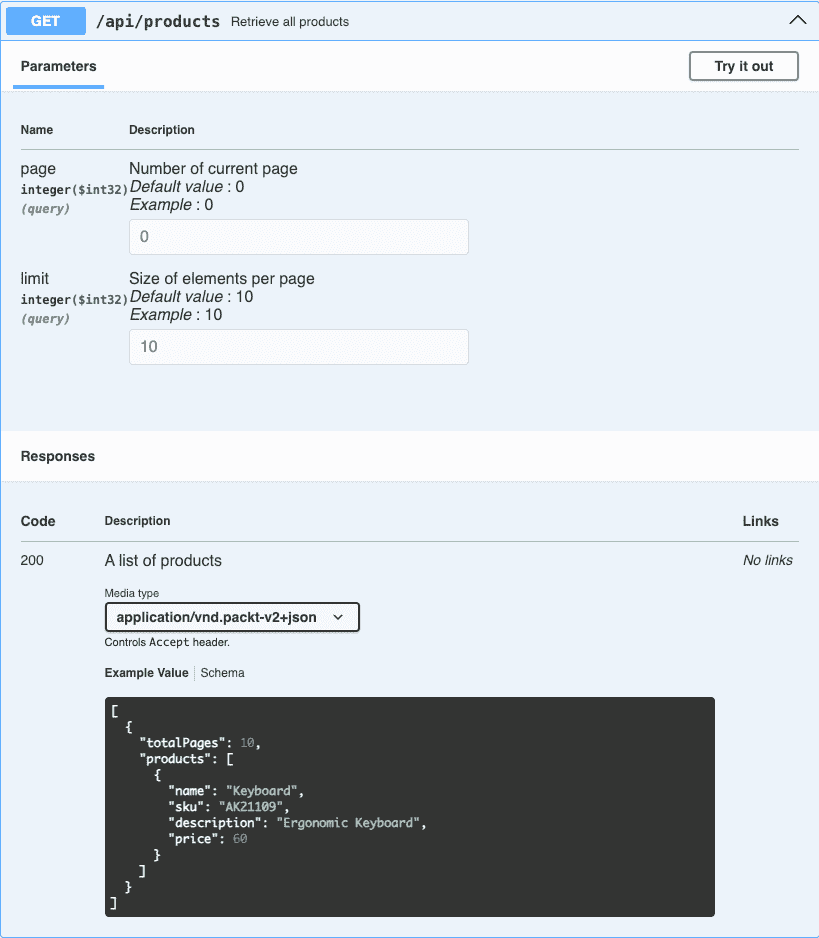
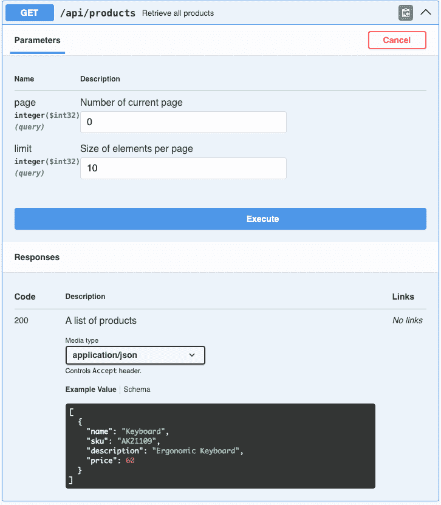
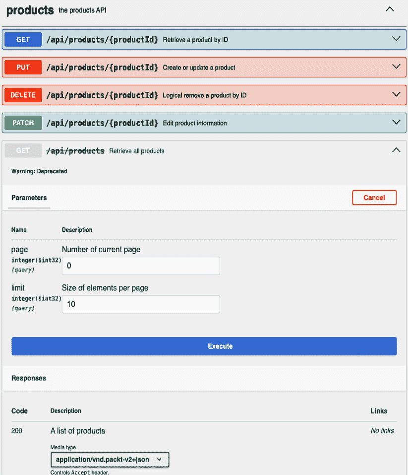

# 第五章：管理 API 演变

随着业务需求的变化和新功能的引入，更新 API 是一个频繁且必要的流程。然而，为了避免破坏现有的客户端集成，这需要谨慎的决策。即使是 API 结构、行为或响应格式的微小更改，也可能对依赖于稳定、可预测界面的消费者产生重大影响。

在本章中，我们将向您展示如何在确保向后兼容性的同时演变您的 API。我们还将讨论在必要时进行破坏性变更时对 API 进行版本控制的策略，以我们产品 API 为例。

我们将在本章开始时探讨可以应用于 RESTful API 的不同**版本控制策略**。**版本控制**是 API 设计的关键方面，因为它确保您的应用程序可以在不破坏现有客户端集成的情况下随时间演变。我们将检查几种版本控制技术，如 URL 版本控制、查询参数版本控制、HTTP 头版本控制以及内容协商，同时讨论每种方法所面临的挑战，包括维护、兼容性和复杂性。

接下来，我们将对我们的现有产品 API 进行一次破坏性变更，这将需要我们实施一个版本控制策略。通过演变我们的 API，我们将确保使用早期版本的客户端不受影响，同时为采用最新版本的客户端启用新功能。这个过程突出了向后兼容性和最小化对用户干扰的重要性，即使 API 持续演变。

最后，我们将探讨管理 API 演变过程中的最佳实践。我们将讨论如何优雅地弃用旧版本，与客户端有效沟通变更，以及在不增加不必要复杂性的情况下维护 API 的多个版本。到本章结束时，您将深入了解如何实施支持 API 长期增长和稳定的版本控制策略。

在本章中，我们将涵盖以下主题：

+   版本控制策略

+   在产品 API 中实现版本控制

+   管理 API 演变

# 技术要求

在本章中，我们将演变我们的产品 API。为了能够跟随并使用书中打印的代码示例，您应该拥有在*第二章*中创建的产品 API 代码。

您可以在 GitHub 上访问本章的代码：[`github.com/PacktPublishing/Mastering-RESTful-Web-Services-with-Java/tree/main/chapter5`](https://github.com/PacktPublishing/Mastering-RESTful-Web-Services-with-Java/tree/main/chapter5)。

# 版本控制策略

版本控制是指通过为 API 生命周期的不同阶段分配不同的版本号来管理应用程序随时间的变化。它确保 API 的更新（如新功能或破坏性变更）可以引入，而不会破坏依赖于早期版本的现有客户端。

随着软件系统架构从单体架构转向分布式系统，版本控制对 REST API 变得至关重要。在单体架构中，服务的消费者和提供者通常位于同一应用程序中，可以对通信的两端进行直接控制。当进行更改时，它们会统一应用于整个系统，确保消费者始终与提供者保持同步。因此，在单体应用程序中接口的版本控制不是必要的，因为消费者与提供者紧密耦合，更新同时部署而不会引起兼容性问题。

然而，随着分布式系统的兴起和 REST API 的采用，这些 API 服务于多个独立的客户端（如网页浏览器、移动应用和第三方服务），情况发生了巨大变化。REST API 将服务暴露给外部世界，不同客户端可能同时使用 API 的不同版本。这引入了一个挑战——如何更新 API 以引入新功能或修复问题，同时又不破坏现有客户端的功能？版本控制通过允许 API 的多个版本共存，确保向后兼容性，并使 API 能够随着时间的推移而演进，同时仍然支持旧客户端。

让我们看看如何应用版本控制策略来解决这个问题。

在探索版本控制策略之前，区分向后兼容的变更和破坏性变更至关重要。理解这种区别非常重要，因为对于破坏性变更，更新 API 版本是必要的，以确保现有客户端可以继续平稳地使用 API。

**破坏性变更**是指那些会中断现有客户端与 API 交互的修改。这些变更通常需要一个新的 API 版本来防止破坏当前的集成。以下是一些破坏性变更的例子：

+   **删除端点**：删除客户端依赖的现有 API 端点

+   **更改响应数据结构**：更改响应数据的格式，例如在 JSON 响应中重命名或删除字段

+   **修改必需参数**：更改端点的必需参数，这可能导致现有请求失败

+   **更改认证方法**：更改或删除现有的认证机制或安全协议

+   **改变端点行为**：修改端点的行为，使其不再像之前那样执行

相比之下，**向后兼容的变更**增强了或扩展了 API，而不会破坏现有客户端。以下是一些向后兼容变更的例子：

+   **添加新的可选字段**：向响应负载中引入新的字段，这些字段对于现有客户端不是必需的

+   **添加新的端点**：创建新的 API 端点，提供额外的功能，而不会影响现有的端点

+   **扩展响应数据**：向响应数据中添加额外的信息，而不会改变现有的结构

+   **添加新的查询参数**：向现有端点引入可选的查询参数，以提供额外的过滤或功能

+   **增强文档**：改进或扩展 API 文档，以提供更多细节而不改变 API 本身

现在我们已经了解了使用版本控制进行重大变更的需求，让我们来探讨各种版本控制策略，以及它们的优缺点。最常见的方法包括以下几种：

+   URL 路径版本控制

+   查询参数版本控制

+   HTTP 头版本控制

+   内容协商

让我们深入探讨每种版本控制策略，并了解何时使用一种策略而不是另一种策略。

## URL 路径版本控制

URL 路径版本控制是 REST API 版本控制中最常见且最直接的方法之一。许多公司，如 X、Google、GitLab 等，都使用这种方法。在这种策略中，版本号直接包含在 API 的 URL 路径中，例如`https://api.product.com/v1/products.`。

这种方法使得开发者和客户端都能轻松地识别和访问 API 的具体版本，而不会产生任何歧义。通过在 URL 路径中嵌入版本号，API 消费者可以明确地请求所需的版本，确保任何集成在 API 演变过程中都能保持稳定。此外，服务器可以轻松地将传入的请求路由到正确的代码库版本，简化维护和部署。

URL 路径版本控制为 API 管理提供了几个明显的优势。其主要好处之一是版本号直接显示在 URI 中，使得访问的 API 版本一目了然。此外，URL 版本控制与 HTTP 缓存机制很好地集成，因为 API 的不同版本被视为不同的资源，允许对每个版本进行有效且独立的缓存。它还促进了书签和分享，使用户能够轻松保存和引用特定版本的端点，确保交互的一致性。

然而，URL 版本控制也存在一些缺点。随着时间的推移，维护多个版本可能会导致 URI 杂乱无章，尤其是在同时维护多个 API 版本的情况下。此外，一旦版本嵌入到 URL 路径中，它就成为 API 公共契约的一部分。此外，管理众多 URL 相关的开销可能会增加开发和文档流程的复杂性。

当实现新功能时，破坏性更改通常只会影响少数特定的端点，而不是整个 API。如果您更新未更改的端点的版本号，这可能会给客户端和维护者造成不必要的混淆。这种方法使得理解不同版本的各个端点应该如何一起使用变得更加困难，可能会使集成过程复杂化，并阻碍 API 的整体清晰度。

使用 URL 路径进行版本控制非常适合许多场景，尤其是在清晰和明确的版本控制至关重要时。对于稳定、预期变化最小且不会引入破坏性修改的 API 来说，这是一个极佳的选择。URL 路径版本控制提供了一种简单的方法来管理不同的版本，使得跟踪和维护随着时间演变的 API 变得更加容易。

## 查询参数版本控制

查询参数版本控制涉及在 URL 中将 API 版本指定为查询参数，例如 `https://api.product.com/products?version=1`。这种方法在微软的指南中通常被推荐。这种策略使得在不修改 URL 路径的情况下实施和引入新版本变得更加容易。这在您希望保持一致的端点路径结构的同时，仍然提供特定版本的功能时尤其有用。它还允许在不创建大量 URL 路径的情况下进行版本控制。

然而，它也有一些缺点。客户端必须在每次请求中都包含版本参数，这增加了请求构建的额外步骤。此外，API 服务器必须根据查询参数处理版本逻辑，这可能会使实现复杂化并增加处理开销。此外，版本信息在 URL 中不太明显，这使得快速识别正在访问哪个版本变得更加困难。这种不明确性可能会导致混淆，尤其是在版本化影响 API 功能的关键部分时。

另一个关注点是查询参数版本控制如何与缓存交互。由于版本信息嵌入在查询字符串中而不是 URL 路径中，缓存机制可能无法有效地处理它。这可能导致不同版本的 API 缓存方式复杂化，可能会影响依赖于缓存来提高响应时间的客户端的性能和效率。

## HTTP 头版本控制

HTTP 头版本控制涉及在请求的 HTTP 头中指定 API 版本。这种方法允许客户端通过在其请求中包含一个自定义头，如 `X-API-Version`，来指示他们希望使用哪个版本的 API。GitHub 就是使用 HTTP 头的一个例子：

```java
curl --header "X-GitHub-Api-Version:2022-11-28" https://api.github.com/zen 
```

这种策略保持了 URL 的整洁，避免了在 URL 中添加版本信息。它还提供了一种灵活且不那么侵入性的版本管理方式，因为它不会更改端点路径或查询字符串。此外，HTTP 头版本控制可以促进版本之间的平稳过渡，因为版本信息与资源标识符 URL 分离，减少了与破坏性变更相关的风险。

然而，HTTP 头版本控制带来了一些挑战。与 URL 版本控制不同，版本信息并不直接体现在 URL 中，这可能会使调试和文档编写变得更加复杂。这种缺乏可见性可能会阻碍开发者和客户在故障排除或理解 API 版本时的工作。

此外，自定义头可能导致不同 API 之间实现实践的不一致。当 API 使用自定义头时，建立统一标准变得具有挑战性，这可能会让开发者和用户都感到困惑。例如，一个 API 可能使用`X-Api-Version`，而另一个 API 可能使用`X-Version`，这会导致歧义和潜在的集成问题。自 2012 年引入 RFC 6648 以来，使用`X-`前缀作为自定义头已被弃用。作为替代，内容协商策略利用现有头，避免需要自定义头，并确保更好地遵循标准实践。

## 内容协商

内容协商是处理 RESTful API 版本控制的技术之一，允许客户端通过 HTTP 头来指定 API 版本，而不是通过 URL 路径。其理念是让客户端通过发送特定的`Accept`头来请求特定的 API 版本。例如，一个客户端可能通过发送以下请求来请求 API 的 1.0 版本，格式为 JSON：

```java
curl -X GET https://api.myproduct.com/resource \ -H "Accept: application/vnd.myapi.v1+json" 
```

这种通过内容协商进行 API 版本控制的技巧与 HTTP 头版本控制密切相关，因为这两种策略都依赖于 HTTP 头来指定版本。关键区别在于内容协商避免了创建自定义 HTTP 头，遵循 RFC 6648，该规范不鼓励使用自定义头。相反，这种方法使用标准头，如`Accept`和`Content-Type`，来指定响应的格式和版本，从而促进了一种更干净、更标准化的方法。

这种策略被像阿迪达斯和 Mambu 这样的大型组织广泛采用。内容协商策略与 REST 标准保持一致，因为它遵循内容协商原则，即客户端和服务器通过头信息来协商表示格式和版本，保持接口的灵活性和符合 RESTful 最佳实践。

由于我们的 API 已经实现，我们将采用内容协商策略以实现无缝演进，允许引入新功能而不会干扰现有客户端或造成破坏性变更。

# 在产品 API 中实现版本控制

由于我们的产品 API 已经被其他应用程序使用，在继续演进 API 以满足新需求的同时保持稳定性至关重要。在 API 开发中，一个挑战是在增强需求的同时不破坏现有消费者。在本节中，我们将探讨如何在产品 API 中实现版本控制，以处理变更而不对客户端造成破坏性影响。

产品 API 目前返回不带分页的产品完整列表。为了提高性能和可扩展性，我们决定在产品列表响应中引入分页。这种修改将改变当前的行为，可能会干扰依赖于现有输出的用户。为了防止对其工作流程造成任何影响，我们将实施版本控制策略。这种方法将使我们能够支持未来客户端的新分页格式，同时保持对现有消费者的向后兼容性，确保 API 可以在不中断服务的情况下演进。

如前所述，我们将使用内容协商策略将分页引入我们的产品 API，而不会破坏现有的功能。这种策略将使我们能够在客户端通过请求头指定他们偏好的版本的同时，使 API 得以演进。通过利用内容协商，我们可以提供原始的产品列表格式和新的分页版本，确保向后兼容性，并给客户端在如何消费 API 方面提供灵活性。这种方法确保了现有用户的平稳过渡，同时满足了新的需求。

## 更新我们的产品 API

让我们通过向我们的列表端点添加新功能来增强我们的 API，同时保持向后兼容性。

在我们当前的 API 中，我们有以下代码：

```java
@GetMapping
@Override
public ResponseEntity<List<ProductOutput>> getProducts() {
    final var products = productsQueryUseCase.getAllProducts()
        .stream()
        .map(productMapper::toProductOutput)
        .toList();
    return ResponseEntity.status(HttpStatus.OK)
        .body(products);
} 
```

让我们创建另一种方法来处理我们 API 的版本 2，这将包括对分页的支持。为了实现这一点，我们将添加两个`RequestParam`注解：一个用于指定当前页，另一个用于定义每页结果的数量限制。


**设计策略以防止向后不兼容的更改**

在我们的示例中添加分页而不造成破坏性更改是不可能的，因为响应是一个包含产品的 JSON 数组，因此没有地方放置适用于所有返回产品的分页信息（总页数）。防止这种情况的一个技巧是，而不是在顶层使用 JSON 数组，即使它只有一个属性，也要将列表（JSON 数组）包裹在一个 JSON 对象中。这种最小的额外开销将使我们能够在不引入破坏性更改的情况下演进 API。我们只需添加可选的分页请求参数，并将分页信息添加到响应根级别的对象中。

你可以在以下代码中看到这些`RequestParam`注解：

```java
@GetMapping(produces = "application/vnd.packt-v2+json")
@Override
public ResponseEntity<PaginatedProducts> getProductsV2(@RequestParam(
    value = "page", defaultValue = "0") Integer page, @RequestParam(
    value = "limit", defaultValue = "10") Integer limit) {
        final var products = productsQueryUseCase.getAllProducts(
            PageRequest.of(page, limit));
    int totalPages = products.getTotalPages();
    List<ProductOutput> output = products.stream()
        .map(productMapper::toProductOutput)
        .toList();
    return ResponseEntity.status(HttpStatus.OK)
        .body(new PaginatedProducts(totalPages, output));
} 
```

通过添加`produces = "application/vnd.packt-v2+json"`，我们使 Spring 能够将任何将`Accept`头设置为`application/vnd.packt-v2+json`的请求路由到适当的端点。这允许客户端通过在他们的 API 请求中指定`Accept`头来接收针对他们版本的定制响应。

我们还更新了 API 响应，以返回一个`PaginatedProducts`类，该类现在包括`totalPages`属性，如下面的代码所示。这个添加对于客户端确定是否有更多资源可用至关重要：

```java
public record PaginatedProducts(@Schema(name = "totalPages",
    example = "10") Integer totalPages, List<ProductOutput> products) {} 
```

我们选择修改响应体以包含此信息，尽管可以使用其他策略达到相同的目标，我们将在*第六章*中探讨。

随着新增了这个新的端点（`getProductsV2`），我们需要更新`ProductsQueryUseCase`类以包含必要的实现代码。在下面的示例中，`getAllProducts`方法现在从 Spring 接受一个`Pageable`对象，该对象处理分页细节。该方法返回一个包含产品列表以及如总页数等元数据的`Page`对象：

```java
public interface ProductsQueryUseCase {
    Product getProductById(String productId);
    Page<? extends Product> getAllProducts(Pageable pageRequest);
} 
```

此外，添加此端点需要我们更改`ProductsApi`接口，并添加端点的定义和文档，如下面的代码块所示：

```java
public interface ProductsApi {
....
@Operation(
        operationId = "getProducts_v2",
        summary = "Retrieve all products",
        responses = {
            @ApiResponse(responseCode = "200",
                description = "A list of products", content = {
                    @Content(mediaType = "application/json",
                        array = @ArraySchema(schema = @Schema(
                            implementation = PaginatedProducts.class)))
                })
        }
)
ResponseEntity<PaginatedProducts> getProductsV2(
     @Parameter(name = "page", description = "Number of current page",
        required = false, in = ParameterIn.QUERY, example = "0")
        Integer page,
        @Parameter(name = "limit",
            description = "Size of elements per page", required = false,
            in = ParameterIn.QUERY, example = "10") Integer limit);
....
} 
```

现在我们有了文档代码，让我们看看我们的 Swagger 文档看起来像什么：



图 5.1 – Swagger UI

*图 5.1* 展示了我们的 API，展示了当媒体类型为`application/vnd.packt-v2+json`时的`/api/products`端点及其新的响应格式。

通过将媒体类型切换到`application/json`，如*图 5.2* 所示，API 将响应更改为其之前的行性行为：



图 5.2 – Swagger UI

如所示，API 通过为旧客户端提供原始输出来保持向后兼容性。然而，我们的文档仍然强制执行参数，尽管它们没有被使用。不幸的是，OpenAPI 3.x 不支持根据内容类型变化参数。


注意

预计到 2024 年底发布的 OpenAPI 4.x 将解决根据内容类型支持不同查询参数的限制。由于我们目前使用的是 3.x，这个特性在我们的实现中不受支持。

在实现了新版本后，现在是时候验证我们的更改并确保一切按预期工作。

## 测试和验证我们的产品 API

现在我们已经使产品 API 能够支持多个版本，是时候测试和验证功能了。我们希望确保 API 的每个版本都按预期行为，提供正确的响应，而不破坏任何现有功能。为了实现这一点，我们可以使用 Swagger 进行图形界面，或者我们可以直接通过命令行使用`curl`命令与 API 交互。通过测试原始和更新版本，我们可以确认 API 正确处理了不同的版本。

要使用 API 的第一个版本检索产品列表，您可以执行以下`curl`命令：

```java
curl -X 'GET' 'http://localhost:8080/api/products' -H 'accept: application/json' 
```

此命令向 API 发送请求，但不指定产品 API 的版本。预期结果是原始格式的产品列表，不进行分页：

```java
[
  {
    "name": "Keyboard",
    "sku": "AK21109",
    "description": "Ergonomic Keyboard",
    "price": 60
  },
  {
    "name": "Keyboard 08",
    "sku": "AK21108",
    "description": "Ergonomic Keyboard",
    "price": 60
  },
  {
    "name": "Keyboard 07",
    "sku": "AK21107",
    "description": "Ergonomic Keyboard",
    "price": 60
  }
] 
```

现在，让我们尝试使用相同的请求传递页码和限制，使用以下`curl`命令：

```java
curl -X 'GET' 'http://localhost:8080/api/products?page=0&limit=2' -H 'accept: application/json' 
```

即使我们已经指定了两个项目的限制，输出也将保持不变。这是因为我们 API 的第一个版本没有设计来处理分页查询参数。因此，API 忽略这些参数，并返回完整的产品列表，遵循版本 1 中定义的行为。

我们第一个版本的代码将返回所有可用元素。我们通过传递 Spring 的`Pageable`对象实现了第二个版本。为了遵循**不要重复自己**（**DRY**）原则，我们必须更新版本 1 中的代码，其中默认返回所有项目，我们必须将大小设置为最大可能值。这确保了第一个版本继续按预期工作，而没有引入分页。

```java
@GetMapping
@Override
public ResponseEntity<List<ProductOutput>> getProducts() {
    final var products = productsQueryUseCase.getAllProducts(
        `PageRequest.ofSize(Integer.MAX_VALUE))`
            .stream()
            .map(productMapper::toProductOutput)
            .toList();
    return ResponseEntity.status(HttpStatus.OK)
        .body(products);
} 
```

现在我们已经确认了 API 对先前版本的功能按预期工作，让我们继续测试最新版本。为此，我们将使用此处显示的`curl`命令来验证更新后 API 的行为：

```java
curl -X 'GET' 'http://localhost:8080/api/products?page=0&limit=2' -H 'accept: application/vnd.packt-v2+json' 
```

与前一个命令相比，此命令的关键区别在于`Accept`头，我们指定了`application/vnd.packt-v2+json`。通过这样做，Spring 框架将请求路由到我们 API 的版本 2 端点。预期输出是分页的产品列表，反映了版本 2 中引入的新行为：

```java
{
  "totalPages": 2,
  "products": [
    {
      "name": "Keyboard",
      "sku": "AK21109",
      "description": "Ergonomic Keyboard",
      "price": 60
    },
    {
      "name": "Keyboard 08",
      "sku": "AK21108",
      "description": "Ergonomic Keyboard",
      "price": 60
    }
  ]
} 
```

如我们从输出中看到的，响应中只包含两个项目，`totalPages`字段反映了分页，根据我们提供的限制参数调整结果。这表明最新版本按预期处理了分页。

现在我们已经确认了版本 1 和版本 2 的预期行为，让我们探索当我们尝试访问一个不存在的版本（让我们称它为版本 3）时会发生什么。

要做到这一点，我们可以执行以下`curl`命令并观察结果：

```java
curl -X 'GET' 'http://localhost:8080/api/products?page=0&limit=2' -H 'accept: application/vnd.packt-v3+json' 
```

执行后，输出将与版本 1 相同：

```java
[
  {
    "name": "Keyboard",
    "sku": "AK21109",
    "description": "Ergonomic Keyboard",
    "price": 60
  },
  {
    "name": "Keyboard 08",
    "sku": "AK21108",
    "description": "Ergonomic Keyboard",
    "price": 60
  },
  {
    "name": "Keyboard 07",
    "sku": "AK21107",
    "description": "Ergonomic Keyboard",
    "price": 60
  }
] 
```

这种行为可能并不理想，因为它可能会误导客户端认为存在版本 3。这是因为 Spring 框架默认允许两种媒体类型：`application/json`和`application/*+json`。因此，任何带有`application/*+json`媒体类型的请求都将由默认方法处理，除非显式映射到不同的版本，就像我们的第二个版本那样。因此，如果没有特定的处理，对版本 3 的请求可能仍然被路由到默认版本，从而给出意外的响应。

为了解决这个问题，我们可以将我们的端点从版本 1 更新，并强制它只接受`application/json`，如下面的代码所示：

```java
@GetMapping(**produces =** **MediaType****.****APPLICATION_JSON_VALUE**)
@Override
public ResponseEntity<List<ProductOutput>> getProducts() {
    final var products = productsQueryUseCase.getAllProducts(
        PageRequest.ofSize(Integer.MAX_VALUE))
            .stream()
            .map(productMapper::toProductOutput)
            .toList();
    return ResponseEntity.status(HttpStatus.OK)
            .body(products);
} 
```

在应用此解决方案后，当我们使用`curl`命令并指定`application/vnd.packt-v3+json`媒体类型时，我们会遇到如下错误：

```java
{
  "type": "about:blank",
  "title": "Not Acceptable",
  "status": 406,
  "detail": "Acceptable representations: [application/json,
    application/vnd.packt-v2+json].",
  "instance": "/api/products"
} 
```

这个错误响应帮助客户端轻松地识别端点的可用版本。当请求不支持的版本时，返回清晰的错误，我们提供即时反馈，引导客户端向正确的版本过渡，从而提高 API 的整体可用性。

现在我们已经测试了我们的解决方案，并确认它保持了版本 1 的预期行为，同时引入了版本 2 的新功能，并为不正确的版本返回`406 Not Acceptable`错误，我们可以将我们的重点转移到有效管理这些版本上，因为 API 仍在演变。让我们探讨如何随着 API 的增长和适应未来需求来处理版本控制。

# 管理 API 演变

管理 API 的演变是长期 API 维护的关键方面。随着应用程序的增长和客户需求的变化，API 必须适应并引入新功能，同时确保现有服务的稳定性和连续性。有效管理 API 演变涉及规划变更、与 API 消费者进行清晰沟通，并实施避免破坏现有功能同时以结构化和可预测的方式引入改进的策略。

要成功管理 API 演变，我们应该考虑以下子节中描述的关键实践。

## 避免引入破坏性变更

如我们之前讨论的，使 API 演变最佳的方法是确保新更改不会通过保持向后兼容性来干扰现有客户端。这最小化了潜在的服务中断，并为用户提供平稳的过渡。

要实现这一点，明确区分破坏性变更和非破坏性变更至关重要。在引入破坏性变更时，应用版本控制对于保持当前功能的完整性同时允许新功能共存至关重要。

## 在你的 API 中定义和应用版本控制策略

当需要实施重大变更时，应用版本控制策略是至关重要的。有多种方法可以对 API 进行版本控制，正如之前讨论的，保持版本控制的连贯性对于确保客户能够轻松理解和交互 API 至关重要。一个清晰且可预测的版本控制策略可以提升用户体验，使客户更易于导航和集成 API。

拥有一个明确定义的 REST 指南，概述如何在所有 API 中一致地实施版本控制策略，如第一章中所述，这是关键，并建立一个独特的版本控制策略为 API 消费者提供了许多好处，包括改进的可使用性和透明度。

## 更新并通知客户关于新版本和截止日期

在多个 API 版本并存的情况下，建立明确的迁移指南和弃用时间表是必不可少的。提供有关如何在不同版本之间过渡的详细信息有助于客户理解流程并为变化做好准备。这种透明度对于平稳迁移和最小化潜在中断至关重要。

维护一个最新的变更日志同样重要。它为客户提供了对最近更新、错误修复和新功能的全面了解，确保他们了解任何修改。一个良好的变更日志有助于客户有效地适应变化，并促进积极的用户体验。

## 语义版本控制

语义版本控制（https://semver.org/）是一个广泛采用的系统，它清楚地传达了 API 中变化的范围和影响。它使用三部分格式：`MAJOR.MINOR.PATCH`。例如，主版本变更（例如，从 1.x 到 2.0.0）会通知客户已引入重大变更，给他们时间来适应。相比之下，次要和补丁更新（例如，1.1.0 或 1.0.1）向客户保证已进行改进或错误修复，而不影响兼容性。这种结构化方法允许开发者快速评估更新的性质，最小化破坏现有功能的风险。

通过实施语义版本控制，我们可以提供清晰的指南和全面的变更日志，以保持客户对更新的了解。这种结构化方法有助于客户理解每个版本变更的重要性，使他们更容易为可能需要采取行动的重大更新做好准备。

对于次要或补丁更新，客户会被告知新功能或错误修复，而无需立即升级的压力。这种平衡确保客户保持了解，并可以在方便的时候选择更新，保持平滑和灵活的用户体验。

## 标记旧端点为弃用

作为 API 演变过程的一部分，明确标记计划弃用的端点是重要的，以给客户足够的时间过渡到新版本。弃用旧端点有助于向客户发出更新所需的信号。

OpenAPI 提供了一种标记任何端点为弃用的方式，这在 Swagger UI 中得到反映。这可以通过以下代码轻松完成：

```java
@Operation(
    deprecated = true,
    ....
) 
```

当我们在 Swagger UI 中添加 `deprecated` 属性并查看时，输出将类似于 *图 5.3*。然而，我们选择在此处不使用此属性，因为 OpenAPI 3.x 目前不支持基于内容协商的版本控制的弃用端点。



图 5.3 – Swagger UI：监控已弃用端点的使用情况

监控已弃用端点的使用情况对于确保在淘汰 API 的旧版本时平稳过渡至关重要。通过跟踪对这些端点的请求，您可以确定仍在使用过时功能的有多少客户，并评估他们迁移到新版本的过程。这有助于您在何时正式移除旧版本时做出明智的决定，避免对客户运营造成意外中断。此外，它还提供了关于哪些客户在过渡期间可能需要额外支持或沟通的见解。

监控工具，如 Grafana、New Relic、Datadog 和 Splunk，不仅有助于顺利的弃用过程，还有助于确认新 API 版本的采用。这些洞察使您能够设定实际的时间表来弃用端点，确保其移除不会干扰客户，并增强对 API 开发的信任和可靠性。

## 移除旧端点

一旦您设定了最后期限，与您的客户进行了沟通，并提供了升级到最新版本的明确说明，下一步就是移除已弃用的端点。但在最终确定移除之前，验证客户是否已成功迁移到最新版本至关重要。这个过程不仅涉及删除旧代码，还要确保与这些端点相关的所有引用和依赖关系都得到彻底清理。

通过应用这些原则，您可以平稳有效地管理 API 的演变，最小化干扰现有客户的风险，同时为他们提供必要的工具和信息，以便无缝适应。

建立一个明确的版本控制策略，使用语义版本控制，并正确地弃用旧端点，可以让您的 API 在最小干扰的情况下增长。这种方法确保您的客户有足够的时间过渡，同时您继续改进和扩展 API 的功能。最终，它促进了长期稳定性，并通过允许 API 随时间可持续地发展来提高开发者体验。

# 摘要

在本章中，我们探讨了 REST API 的各种版本控制策略，并学习了如何在保持兼容性的同时演进我们的 API，并确保平滑过渡到新版本。我们还应用了内容协商版本控制到当前的 API 中，特别关注实现分页。

在下一章中，我们将深入探讨更高级的主题，包括增强的分页技术、过滤、文件上传以及更多功能，以进一步精炼您的 API。
