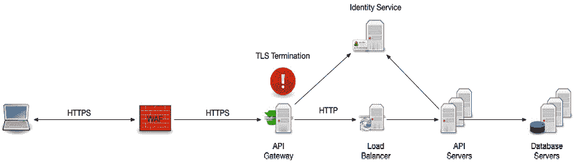
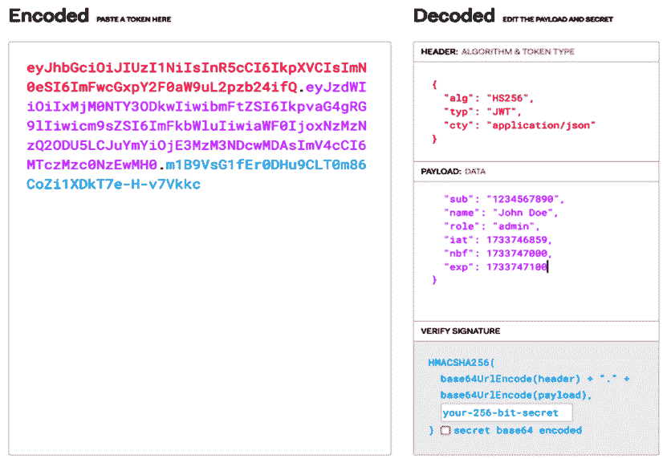

# 7

# 保护你的 RESTful API

欢迎来到本书的这一部分，它讨论的是软件安全，这是在更广泛的网络安全领域内，而你作为软件工程师，对此负有最大的责任。这可能与你所读过的内容有些不同，因为人们并不总是将其视为软件工程师的核心责任。这是一个令人遗憾的误解。随着我们社会的数字化，软件安全不再是网络安全专家的专属领域；它是软件开发的一个组成部分，并且应该在开发的各个层面都是一个主要关注点。

理解安全性可能很复杂，所以让我们从一个心理图像开始。隐喻有助于简化抽象概念，而在网络安全中最常见的隐喻之一就是洋葱。如果你之前阅读过关于安全性的内容，你很可能遇到过这个想法：安全性是分层的，就像洋葱一样，每一层都增加了一道防护屏障。

虽然这个隐喻很有用，但它也有其缺陷。它暗示每一层都是统一的，而实际上，网络安全防御差异很大。一个更准确的比较是受到围攻的堡垒，其中不同的防御层对不同的威胁做出反应。远程大炮针对远距离的攻击者，墙壁阻挡入侵者，而肉搏战是最后的防线。同样，在安全性中，每一层都发挥着独特的作用，使用不同的工具和技术来对抗特定的风险。

但这对你们这些软件工程师来说意味着什么呢？安全性不仅仅是保护系统——它是保护用户数据、确保可靠性和防止代价高昂的安全漏洞，这些漏洞可能会损害公司的声誉和底线。你的代码中的漏洞可能被利用来窃取敏感信息、中断服务，甚至破坏整个网络。作为软件工程师，我们是第一道防线。编写安全代码、执行适当的访问控制和了解常见的攻击向量不是可选技能——这是基本责任。在本章中，我们将探讨你负责的安全层以及如何有效地将安全性集成到你的开发过程中。

本章将涵盖以下主题：

+   HTTP API 调用的解剖结构

+   认证

+   OWASP API 安全性 Top 10 概述

+   理解常见漏洞和暴露

+   管理 CVE 的策略

# HTTP API 调用的解剖结构

今天，几乎所有 API 调用都是通过 HTTP 进行的。那么，让我们看看在这样一个调用中会发生什么，以及参与其中的许多组件。

图 7.1 – 通过 HTTP 进行典型安全 API 调用

## 加密通信

尽管这个协议被称为 HTTP，我们通常说它是一个 HTTP 调用或 HTTP 连接，但事实是，所有现代 API 调用都是通过 HTTPS 进行的。

结尾的“ *S* ”代表“ *secure* ”，表示 HTTP 通信使用**传输层安全**（**TLS**）进行加密。TLS 在传输层（OSI 模型的第 4 层）运行，加密客户端和服务器之间的数据，以防止窃听和篡改。在 HTTP 调用中使用 TLS 确保只有预期的接收者才能正确读取消息，实际上消除了中间人攻击，因为即使消息被截获，也无法解密和读取。

因此，HTTPS 调用将强制执行以下操作：

+   **数据机密性**：所有通过网络传输的数据都是加密的，没有正确的密钥集，数据将没有意义

+   **数据完整性**：确保数据在传输过程中未被更改

+   **服务器身份验证**：验证服务器对客户端的身份

HTTPS（HTTP over TLS）通信的所有三个功能都是通过使用加密算法来执行加密、创建传输数据的数字签名和安全的摘要（散列）来实现的。加密算法的使用方式以及它们的输入和输出如何在网络上传输是由所使用的特定 TLS 协议版本指定的。

根据当前的科学技术知识和计算能力，过去使用的某些算法和协议被认为是脆弱的。被认为安全的算法集不断演变。今天已经有一些算法，预计在达到量子计算时代时仍将保持安全。

在实现 API 的 HTTPS 时，始终使用强大的加密算法和协议。避免使用已弃用的协议，如 SSL 和旧版本的 TLS。加密算法不断演变，旧算法由于容易被破解而变得过时。创建并执行一个政策，定期审查您的加密选择并更新您的 TLS 证书。我们将在稍后讨论这个问题。

在现代组织（中大型及以上），软件工程师不太可能负责任何 TLS 实现，但了解 HTTPS 的工作原理及其影响是很重要的。

HTTPS 通信中使用的必要元素是公钥加密。公钥私钥对中的公钥部分是 TLS 证书的一部分。TLS 证书从颁发到过期或失效都有一个生命周期。因此，我们需要管理这些证书。

### 管理您的 HTTPS 证书

使用 HTTPS/TLS 加密的一个后果是需要进行证书管理。管理安全证书是任何基于 API 的应用程序的一个复杂且关键的部分。有效的证书管理涉及处理续订和到期，并确保证书配置正确，以防止服务中断。此外，用于证书生命周期管理的自动化工具可以帮助简化合规性，特别是在 API 或外部服务之间频繁通信的环境中。这是一个如此重大的问题，以至于许多团体都试图创建机制来减轻它。Let’s Encrypt（[`letsencrypt.org/`](https://letsencrypt.org/)）取得了巨大的成功，甚至在一些大型企业中也被使用。大多数云服务提供商也提供某种形式的自动证书管理，例如 AWS 证书管理器（[`aws.amazon.com/certificate-manager/`](https://aws.amazon.com/certificate-manager/)）。

## 第一道防线——Web 应用防火墙（WAF）

WAF（Web 应用防火墙）在客户端和服务器之间充当屏障，过滤掉恶意流量，并提供针对常见网络攻击（如 SQL 注入和**跨站脚本攻击**（**XSS**））的第一层保护。这通常不由软件工程师控制，但了解它很重要，因为 WAF 可能会对 HTTP 流量造成一些干扰。

这些是 WAF 的功能：

+   **流量监控**：检查可疑模式

+   **基于规则的过滤**：根据预定义的安全规则阻止流量

+   **异常检测**：识别可能表明攻击的不寻常行为

### 最佳实践

定期更新 WAF 规则对于确保其能够适应新的和新兴的威胁至关重要。此外，根据应用程序的具体需求和架构定制这些规则也很重要，以确保最佳保护。持续监控 WAF 日志可以提供有价值的见解，有助于识别模式、异常或潜在的攻击，从而实现主动防御。

## API 网关

API 网关通常是所有客户端请求的入口点，处理诸如请求路由、组合和协议转换等任务。在安全方面，API 网关经常执行许多重要任务：

+   **TLS 终止**：解密传入的 HTTPS 流量

+   **身份验证**：验证凭证和权限

+   **速率限制和节流**：控制请求数量以防止滥用

### **好处**

API 网关集中管理安全策略，允许对所有服务的一致执行。它通过提供一个单一入口点来简化客户端与 API 的交互，该入口点管理诸如路由和身份验证等任务。此外，它通过启用缓存和负载均衡来提高性能，确保高效资源利用和改进响应时间。

## 负载均衡器

负载均衡器通过将进入的网络流量分配到多个服务器上来确保可用性和可靠性。虽然它们不直接参与安全逻辑，但以下方式有助于整体安全：

+   **健康监控**：从池中移除不健康的服务器。

+   **TLS 终止**：如果 API 网关不存在，处理 TLS 加密以减少服务器负载和系统复杂性。

+   **缓解拒绝服务（DoS）攻击**：通过分配负载有助于缓解 DoS 攻击。这通常是 DoS 攻击的最后一招。预计 WAF 和 API 网关会在这个阶段最大限度地减少攻击的影响。

## 解密通话的时机——TLS 终止

如果一个安全通话被加密，它需要在某个时刻被解密，以便其内容可以被解释和处理。这被称为**TLS 终止**。它指的是解密 HTTPS 连接并将其转换回明文 HTTP 通信的过程。这通常发生在网络的边缘，例如在 API 网关、负载均衡器或反向代理服务器内部。通过在单个点终止 TLS 加密，组织可以将与加密和解密相关的计算开销从后端服务器卸载。这个过程通常在 API 调用的生命周期中只发生一次，确保数据在穿越不安全网络时保持加密状态，但可以在受信任的内部网络中更有效地处理。TLS 终止提高了性能，简化了证书管理，同时不会损害通过公共通道传输的数据的安全性。了解 TLS 终止发生的时间很重要，尤其是在调试 API 时遇到一些问题时。

我们迄今为止简要讨论的所有安全元素无疑是至关重要的，但在现代中型和大型组织中，它们通常不是软件工程师的直接责任。其他专业人员负责它们，因此它们不是本章的重点。相比之下，以下安全元素在很大程度上是软件工程师的责任，我们都应该对它们有清晰的理解。

正如我们讨论的那样，确保 API 通信的安全性是一个多层次的流程，涉及各种工具和技术，每个层次都在保护传输中的数据方面发挥着独特的作用。从 HTTPS 和 TLS 提供的加密到 WAF 的过滤和监控能力，每一层都对抵御网络威胁的强大防御做出了贡献。TLS 终止和证书管理进一步强调了在现代 API 生态系统中维护性能和安全的必要性。

虽然这些责任通常由大型组织中的专门团队负责，但对于软件工程师来说，了解这些组件的工作原理及其影响是至关重要的。拥有这些基础知识可以更好地与安全团队和 DevOps 工程师合作，有效地解决出现的问题，并在设计和开发过程中做出更好的决策。随着安全威胁的不断演变，保持对这些实践的认识确保 API 保持弹性和可靠性，为任何应用程序形成一个安全的骨干。

# 认证

认证是验证试图访问您的 API 的用户、设备或其他实体的身份的基础过程。认证是安全性的关键要素，因为它确保只有合法和公认的各方才能与您的服务交互。如果没有适当的认证机制，API 就会容易受到未经授权的访问、数据泄露和可能损害系统完整性和用户数据的恶意活动的威胁。

认证的主要目标是确立请求访问的客户端的身份。通过确认这一点，API 可以实施访问控制、应用速率限制，并在适当的情况下提供个性化体验。此外，强大的认证机制对于遵守法律和监管要求至关重要，例如 GDPR、HIPAA、LGPD 和其他数据保护法。

可以根据所需的安全级别、应用程序的性质和用户体验考虑因素采用不同的认证方法。接下来，我们将分解一些最常见的方法。

## 基于密码的认证

基于密码的认证是最传统的，仍然是认证方法中最广泛使用的一种。用户提供用户名和密码，然后这些信息与服务器上存储的凭证进行验证。根据其本质，这种方法主要用于个人与系统进行认证时。几乎从未在任何形式的机器到机器交互中使用。

### 工作原理

当用户尝试登录时，他们会将他们的凭证，通常是用户名和密码，发送到安全服务 API。在收到凭证后，服务器将密码进行散列，并将其与数据库中存储的散列进行比较。如果凭证匹配，用户就成功认证，服务器生成一个认证令牌，例如会话 cookie 或**JSON Web Token**（**JWT**），以方便未来的请求而无需重复提交凭证。

### 安全考虑

密码永远不应该以明文形式存储；相反，它们必须始终使用安全的算法进行散列。散列过程的效果取决于所使用的算法。两种现代且广泛使用的算法是*Bcrypt*和*Argon2*。关于散列算法的深入讨论不在此章的范围之内，但强烈建议查看它们是如何工作的。

另一个需要考虑的是暴力攻击。在一定的失败登录尝试次数后，实施账户锁定机制很重要。此外，应要求用户通过强制执行包括最小长度要求、使用特殊字符以及避免常见或容易被猜到的单词的密码策略来创建强密码。

这里是基于密码的身份验证的优点：

+   实现简单

+   用户容易理解

这里是 JWT 的缺点：

+   密码很容易被盗或猜测，尤其是如果它们很弱的话

+   它需要强大的安全措施，如速率限制和密码重置

+   在不同服务之间重复使用密码会使账户更加脆弱

## 基于令牌的身份验证

基于令牌的身份验证依赖于使用令牌——客户端和服务器之间传递的小数据片段，以验证身份。广泛采用的令牌格式是 JWT，这是我们将会讨论的格式。

理解 JWT 的工作原理很重要，特别是了解令牌的有效期。

### JWT 的生命周期和利用

用户使用其凭据登录，服务器生成一个包含有关用户编码信息的令牌（通常是 JWT）。

服务器将创建并签名 JWT，确保其完整性，并将其发送回客户端。签名和创建 JWT 的内部机制超出了本书的范围。有关更完整的讨论，请参阅这篇文章：[`www.freecodecamp.org/news/how-to-sign-and-validate-json-web-tokens/`](https://www.freecodecamp.org/news/how-to-sign-and-validate-json-web-tokens/)。

从那一刻起，客户端将把 JWT 包含在所有未来的 API 请求的头部中，通常是在 API 开发团队定义的预定义头部中。

服务器在每次请求时验证令牌，无需再次检查用户凭据。

一个重要的理解点是，所有令牌（JWT 或其他）都必须是临时的。它们必须在明确和定义良好的间隔内过期。作为 API 层工作的软件工程师，你通常不需要做任何特别的事情来处理这个问题，但前端应用程序将不得不定义令牌更新策略，你可能需要协作和支持这样的任务。

### JWT 的结构

JWT 是一个遵循良好定义结构的加密记录。因此，让我们看看 JWT 内部的结构，并讨论其结构。

可以在[`jwt.io/#debugger-io`](https://jwt.io/#debugger-io)找到查看和操作 JWT 的好工具。

图 7.2 – 示例 JWT

JWT 由三个不同的部分组成，由点分隔：标题、有效载荷和签名。作为一名 API 开发者，你的重点将放在有效载荷上，因为它包含关于用户（例如，用户 ID、权限）的声明（字段）。签名确保令牌没有被篡改。

解密后，JWT 内部的数据看起来像这样：

| **部分** | **字段** | **描述** | **示例值** |
| --- | --- | --- | --- |
| 标题 | `alg` | 用于签名或加密令牌的算法 | `"HS256"` |
| 标题 | `typ` | 令牌类型 | `"JWT"` |
| 标题 | `cty` | JWT 有效载荷的内容类型 | `"JWT"` 或 `"application/json"` |
| 标题 | `kid` | 用于标识签名中使用的密钥的密钥 ID | `"abc123"` |
| 有效载荷 | `iss` | 令牌的发行者 | `"auth.example.com"` |
| 有效载荷 | `sub` | 令牌的主题（通常是用户 ID） | `"1234567890"` |
| 有效载荷 | `aud` | 令牌的目标受众 | `"example.com"` |
| 有效载荷 | `exp` | 过期时间（Unix 时间） | `1516239022` |
| 有效载荷 | `nbf` | 在此时间之前无效（Unix 时间） | `1516239022` |
| 有效载荷 | `iat` | 发布时间（Unix 时间） | `1516239022` |
| 有效载荷 | `jti` | JWT ID；令牌的唯一标识符 | `"unique-token-id-123"` |
| 有效载荷 | `name` | 用户的完整姓名 | `"John Doe"` |
| 有效载荷 | `email` | 用户的电子邮件地址 | `"john.doe@example.com"` |
| 有效载荷 | `role` | 分配给用户的角色或权限 | `"admin"` 或 `["admin", "user"]` |
| 签名 | N/A | 用于验证令牌完整性的数字签名 | （加密操作的结果） |

表 7.1 – JWT 的一个示例

标题可以根据每个组织的需要自定义。但至少，你应该看到 `"alg"` 和 `"typ"` 条目存在。

有效载荷也主要由组织定义。有效载荷中的每个条目都称为 **声明**，用于识别用户、他们的角色、唯一信息以及任何其他 API 可以用来最佳控制数据访问的数据元素。

应特别关注基于时间的三个声明 – `exp`、`nbf` 和 `iat`。它们对于验证 JWT 在 API 执行时的有效性至关重要。理想情况下，它们不应被省略，尽管 `"nbf"` 有时未定义。在这种情况下，假设 JWT 从创建的那一刻起就是有效的（`"iat"`）。

通常，对于声明有三种分类：

+   **注册声明**：在行业中广泛使用的预定义声明，例如 `iss`、`exp` 和 `sub`

+   **公共声明**：使用 JWT 的各方同意的自定义声明

+   **私有声明**：在特定于您应用程序的上下文中使用的自定义声明

### 无状态

基于令牌的身份验证的一个关键好处是服务器不需要存储会话状态验证信息。所有必要的信息都包含在令牌本身中，并在每次调用中发送。

通常，需要在服务器端存储会话状态，但不应存储凭据或用户标识，而只应存储用于令牌的引用。

### 安全考虑

JWT 是通用安全策略的一部分，因此应被视为需要保护的数据。因此，以下是关于 JWT 的一些具体安全考虑：

+   总是使用 HTTPS 来传输令牌，因为令牌容易在明文中被截获

+   设置令牌过期时间以限制漏洞窗口

+   使用短期令牌和刷新令牌以最小化令牌被盗的风险

+   在客户端安全地存储令牌，如果可能的话，避免本地存储

JWT 策略的优势如下：

+   无状态认证在分布式系统中具有良好的扩展性

+   无需在服务器上存储会话信息

+   它允许使用令牌声明进行细粒度的访问权限控制

以下是其中的一些缺点：

+   如果令牌被盗，可以用来冒充用户

+   管理令牌过期和安全的刷新周期将增加应用程序的复杂性，包括前端和后端

### 注意事项

有时会出现一个问题，即 JWT 膨胀，组织不断向 JWT 中添加更多的声明或长列表的值，以至于 JWT 的大小超过了服务器上定义的限制。即使 JWT 规范没有定义上限，也要记住，令牌将作为 HTTP 头的一部分发送，并且它们始终有一个上限。如果你开始收到**HTTP 413 Content Too Large**错误，一个可能的原因可能是你的 JWT 大小。

总结来说，使用 JWT 来管理认证和授权是一种经过验证的策略，它得到了良好的行业支持，并依赖于可靠的技术。然而，其有效性的大部分归因于它在应用程序中的使用方式。作为软件工程师，确保实施良好的和有效的策略是你的责任。

## 多因素认证

**多因素认证**（**MFA**）通过要求用户提供多种身份验证形式来增加一层额外的安全防护。这通常包括他们知道的信息（例如，密码）、他们拥有的物品（例如，手机或安全令牌），或者他们自身的特征（例如，指纹或面部识别）。这主要是一种客户端策略，对 API 开发的影响很小，但对于后端工程师理解其基本概念来说非常重要。

MFA 是认证对话的一部分，因此，在用户成功输入密码后，他们会收到提示提供第二个因素，例如由手机应用（例如，Google Authenticator）生成的代码或通过短信发送的代码。然后服务器在授予访问权限之前验证第二个因素，通常是通过生成一个 JWT 供客户端在访问 API 时使用。

### MFA 可以使用什么？

一般而言，有三种类型的 MFA：

+   **你知道的某物**：密码、PIN 码或安全问题的答案

+   **你拥有的某物**：生成临时密码的物理设备，如手机或硬件令牌

+   **你是的某物**：指纹、面部识别或虹膜扫描等生物识别数据

### 安全考虑

让我们看看在使用 MFA 时我们应该考虑哪些安全因素：

+   即使密码被盗，MFA 也极大地降低了账户被破坏的可能性。

+   **基于时间的单次密码**（**TOTPs**）常用于 MFA。确保这些令牌正确的时间同步，并在短时间内过期。

+   基于短信的 MFA 容易受到 SIM 卡交换的影响，应尽可能避免。改用基于应用程序的身份验证器或硬件令牌。

让我们来看看多因素认证（MFA）的优势：

+   它通过要求多种验证形式显著增强了安全性

+   它可以防止常见的攻击，如密码钓鱼和暴力攻击

让我们看看一些缺点：

+   它可能对用户来说很麻烦，尤其是在需要频繁登录的环境中

+   它需要支持第二因素的基础设施，例如维护短信网关或与身份验证器应用程序集成

## 生物识别认证

生物识别认证使用指纹、面部识别或语音等物理特征来验证用户的身份。随着移动设备和笔记本电脑上生物识别传感器的日益普及，它正成为一种更常见的认证方法。

让我们看看它是如何工作的：

1.  用户的生物识别数据（指纹、面部扫描等）在设备上安全捕获和存储。

1.  当用户尝试进行身份验证时，API 会将捕获的数据与存储的生物识别模板进行比较，以验证其身份。

这里有一些常见的生物识别认证方法：

+   **指纹扫描**：在移动设备上广泛使用

+   **面部识别**：集成在许多智能手机和笔记本电脑中

+   **语音识别**：有时用于电话身份验证

让我们看看一些安全考虑因素：

+   生物识别数据对每个用户都是唯一的，这使得伪造变得困难

+   将生物识别数据本地存储，而不是在服务器上，以防止大规模泄露

+   确保生物识别系统在生物识别失败的情况下（例如，受伤或硬件故障）有后备选项（例如密码）

这些是生物识别认证的一些优势：

+   它提供了高级别的安全性

+   它对用户来说很方便——无需记住密码

这里有一些缺点：

+   生物识别数据是不可逆的——一旦泄露，就无法更改

+   在收集和存储生物识别数据方面存在潜在的隐私问题

+   在某些条件下（例如，湿指纹或面部识别的照明不良）可靠性较低

选择合适的认证方法取决于应用程序的需求以及它处理的数据的敏感性。虽然基于密码的认证仍然很普遍，但更安全的方法，如基于令牌的认证、多因素认证（MFA）和生物识别认证，正在迅速获得认可。结合这些方法，例如使用 JWT 与 MFA 结合，可以为 API 提供强大且灵活的认证机制，确保用户和数据的安全。

# 授权

一旦通过认证保护了 API 免受未知用户的影响，下一步就是应用授权机制。这是系统确定已认证实体（用户、设备或服务）是否有权访问特定资源或执行特定操作的地方。虽然认证验证身份，但授权管理访问，确保已认证实体只能访问他们被授予权限的资源和服务。

在 API 安全中，适当的授权对于执行业务规则、保护敏感数据以及确保每个用户或服务只执行他们被允许的操作和访问信息至关重要。因此，让我们看看我们可以使用的不同技术来实现授权。

### 基于角色的访问控制

最常见的授权机制之一是**基于角色的访问控制**（**RBAC**）。RBAC 通过将预定义的角色分配给用户或实体，并将权限与这些角色关联来实现。每个角色都被授予访问特定 API 端点或功能，具体取决于应用程序的安全要求。

让我们看看 RBAC 是如何工作的：

+   用户被分配一个或多个角色，例如管理员、用户或编辑。

+   API 端点或资源通过角色检查来保护。例如，只有具有管理员角色的用户可能有权访问/admin 端点。

+   当发起 API 请求时，服务器会检查用户分配的角色与请求的资源所需的角色的匹配情况。

这些是 RBAC 的一些优点：

+   它通过将权限分组到角色中来简化权限管理。

+   它易于实现和扩展，尤其是在企业应用程序中，角色可以集中定义

+   它被许多解决方案完全支持，例如 JWT 中的声明

这里有一些缺点：

+   在需要细粒度访问控制的复杂系统中，它可能不够灵活，可能导致角色爆炸或数据泄露。

+   它可能在复杂系统中导致意外的暴露，因为角色可能不一致或不兼容。

### 基于属性的访问控制

**基于属性的访问控制**（**ABAC**）通过使用属性（用户属性、环境属性、资源属性等）来确定访问权限，比 RBAC 提供了更细粒度的控制。属性是描述实体或动作的元数据，并针对策略进行评估，以决定是否允许访问。

让我们看看 ABAC 是如何工作的：

+   策略被编写来定义授予访问权限的条件。

+   考虑到用户角色、请求时间、资源类型或位置等属性。

+   访问决策是根据属性和策略的实时评估动态做出的。

这些是使用 ABAC 的一些优点：

+   它通过允许基于动态条件的细粒度控制来提供灵活性。

+   它适用于 RBAC 难以管理的复杂系统。

下面是一些缺点：

+   相比 RBAC，实现和管理更为复杂。

+   由于实时策略评估，可能会导致性能开销。

+   由于属性管理不当，可能会导致意外的安全问题。例如，员工在公司内更换职位，但系统仍然允许他们查看之前工作的数据。

### OAuth 2.0

OAuth 2.0 是 API 中最广泛使用的授权框架之一。它允许用户授予第三方应用程序对其资源的有限访问权限，而无需暴露其凭据。OAuth 2.0 通常用于委派 API 访问，并为网络、移动和云应用程序之间的授权提供了一种标准化的方法。

让我们看看 OAuth 2.0 是如何工作的：

1.  用户通过身份提供者（例如，Google、Facebook）进行身份验证，并授予第三方应用程序权限。

1.  第三方应用程序接收访问令牌，并代表用户使用该令牌进行授权的 API 请求。

1.  访问令牌包含作用域，这些作用域定义了第三方应用程序的访问级别（例如，只读、写入）。

让我们看看一些安全考虑因素：

+   总是使用 HTTPS 来传输 OAuth 令牌。

+   使用短期访问令牌和刷新令牌以最小化令牌被盗的风险。

+   实施令牌撤销机制，在必要时使令牌失效。

这里是使用 OAuth2.0 的优点：

+   它允许委派访问，而无需共享用户凭据。

+   它已被广泛采用，为许多服务提供了标准化。

下面是一些缺点：

+   它需要实现安全的令牌存储和传输机制。

+   它可能会增加复杂性，尤其是在管理刷新令牌和令牌过期时。

### JWT 用于授权

在*身份验证*部分讨论的 JWT 在授权中也发挥着关键作用。在身份验证之后，可以颁发包含指定用户角色或权限的声明的 JWT。然后，API 可以使用这些声明来执行访问控制。

让我们看看 JWT 授权是如何工作的：

1.  用户经过身份验证，并颁发包含用户角色或权限等声明的 JWT。

1.  客户端在未来的 API 请求中在授权头中包含 JWT。

1.  服务器解码 JWT 并检查声明，以确定用户是否有权访问请求的资源。

JWT 允许无状态授权，这意味着服务器不需要维护会话状态，因为必要的授权信息已经嵌入在令牌本身中。

让我们看看使用 JWT 授权的一些优点：

+   通过消除服务器端会话存储的需求，它在分布式系统中具有良好的可扩展性

+   它通过在 JWT 中使用声明来实现细粒度控制

至于缺点，它需要仔细管理令牌过期和吊销，以防止未经授权的访问。这是 JWT 和其他基于属性的授权的最大缺点。确保 JWT 中的声明反映了此用户的实际角色非常重要。再次提到，员工在公司中更换职位的情况可能会引起数据访问违规。

### 细粒度访问控制

在某些系统中，所需访问控制级别超出了 RBAC 或甚至 ABAC 的基本功能。**细粒度访问控制**（**FGAC**）允许根据用户身份、资源所有权和上下文数据等属性，对资源访问进行更细致的控制。

这些 FGAC 级别通常出现在复杂的商业领域；医疗保健和金融是两个非常常见的案例。医疗保健作为一个高度监管的行业，有许多不同的规则需要应用于任何数据访问。

这里有一些 FGAC 的例子：

+   用户只能访问他们自己的个人资料数据，不能访问其他用户的资料数据

+   服务只能修改它创建的资源

+   基于位置、一天中的时间或其他上下文信息，可能会限制对敏感资源的访问

+   在一个医疗保健保险系统中，客户可以看到他们账户的所有付款，但只能看到他们自己的索赔付款和其他他们依法允许的受抚养人的索赔付款

让我们更仔细地看看最后一个例子，因为它说明了 FGAC 的挑战。

*案例*：客户需要在其健康保险政策中保留前配偶一段时间。在这段时间内，主要客户无法看到配偶的任何医疗信息，但可以看到与治疗相关的费用。在这个案例中存在几个挑战。我们在哪里寻找保留配偶在政策中的强制时间？我们如何在家庭请求中隔离配偶的数据？我们如何允许某些财务数据被暴露，但不暴露医疗信息？

这些问题并不简单，回答它们可能会使该系统部分比原本更复杂。

此案例需要仔细的设计和政策执行。它可能会增加应用程序的复杂性，尤其是在大型系统中。

### API 授权的最佳实践

总结来说，以下是一些确保您的 API 尽可能安全的指南：

+   **使用最小权限原则**：仅授予用户和服务执行其任务所需的最小权限

+   **实施分层授权机制**：结合 RBAC 与 ABAC 或 OAuth 以实现更灵活和安全的访问控制

+   **定期审计权限**：定期审查和更新角色、权限和访问策略，以确保它们与当前业务需求保持一致

+   **安全令牌**：始终使用安全的存储和传输方法来处理令牌（例如，OAuth 令牌、JWTs）以防止未经授权的访问

当设计和实施得当，授权确保您的 API 保持安全、响应，并符合监管要求。通过选择正确的授权策略——无论是 RBAC、ABAC、OAuth 还是基于 JWT 的——您可以根据系统特定需求定制访问控制，同时保护数据并确保用户只能执行他们有权执行的操作。

# OWASP API 安全 Top 10 概述

**OWASP**代表**开放网络应用安全项目**，这是一个专注于网络应用安全的非营利组织。他们在记录已知安全问题和帮助开发者和组织确保网络应用安全方面做得非常出色。其主要贡献之一是**OWASP API 安全 Top 10**，它确定了 API 最关键的安全风险。

OWASP 是所有软件工程师的重要资源，你应该定期查看发布的关注列表和新安全白皮书。

最新列表于 2023 年发布，可在以下链接找到：[`owasp.org/API-Security/editions/2023/en/0x11-t10/`](https://owasp.org/API-Security/editions/2023/en/0x11-t10/)。

+   API1:2023 - 破坏对象级别授权

+   API2:2023 - 破坏认证

+   API3:2023 - 破坏对象属性级别授权

+   API4:2023 - 无限制资源消耗

+   API5:2023 - 破坏功能级别授权

+   API6:2023 - 无限制访问敏感业务流程

+   API7:2023 - 服务器端请求伪造

+   API8:2023 - 安全配置错误

+   API9:2023 - 不当的库存管理

+   API10:2023 - 不安全地使用 API

如您所见，所有顶级 OWASP 关注点都是我们迄今为止在本章中讨论的主题。随着 OWASP 列表的演变，熟悉 OWASP 列表非常重要，因此请经常访问之前提供的链接中的 OWASP Top Ten API 安全风险。

# 理解常见漏洞和暴露

“我们的社会依赖于软件”这个说法并不新鲜，它描述了大多数现代社会，因此，软件安全已经成为全球政府和组织的一个核心关注点。网络威胁正在以前所未有的速度发展，软件中的漏洞可能导致重大的经济损失、声誉损害和法律后果。就在本章撰写的那一周，历史上最大的 DDoS 攻击针对了 Cloudflare（你可以在这里找到详细讨论：[`www.linkedin.com/pulse/cloudflare-mitigates-historic-world-record-56-tbps-hoccc/`](https://www.linkedin.com/pulse/cloudflare-mitigates-historic-world-record-56-tbps-hoccc/)）。据推测，这次攻击的规模是通过利用许多物联网设备的漏洞实现的，但详细情况仍在调查中。因此，对于 Java 软件工程师来说，理解和管理工作中的这些漏洞对于开发安全且稳健的应用程序至关重要。

软件安全的一个基本方面是识别和缓解已知的漏洞，通常被称为**通用漏洞和暴露**（**CVEs**）。本章旨在从专业 Java 软件工程师的角度深入探讨 CVEs。我们将深入研究 CVEs 的定义、用于发现和记录它们的机制以及它们的结构组成。此外，我们将突出跟踪 CVEs 的最佳资源，并讨论帮助识别这些漏洞的软件扫描器。

此外，我们将探讨管理 CVE 的有效策略，包括持续依赖升级、依赖管理实践、主动依赖更新和基于扫描报告的响应式升级。通过理解和实施这些策略，软件工程师可以增强其应用程序的安全态势，并为更安全的数字生态系统做出贡献。

### 什么是 CVE？

CVE 系统是一种标准化的方法，用于识别和编目软件和固件中的安全漏洞和暴露。由 MITRE 公司管理，CVE 为每个公开的漏洞提供一个唯一的标识符，允许在各种安全工具、数据库和通信中保持一致的引用。CVE 条目通常包括一个识别号、对漏洞的简要描述以及相关警告、报告和补丁的引用。

对于 Java 软件工程师来说，CVE 尤其重要，因为 Java 库和框架的使用非常普遍，如果管理不当，可能会将漏洞引入应用程序。了解 CVE 使开发者能够做到以下几点：

+   **识别漏洞**：识别他们使用的库和组件中已知的网络安全问题

+   **评估影响**：评估漏洞对其应用程序可能产生的影响

+   **实施缓解措施**：应用补丁或更新以及时解决漏洞

+   **维护合规性**：通过管理已知漏洞来遵守安全政策和监管要求

### 如何发现和记录 CVE？

漏洞的发现是一个涉及安全研究人员、开发人员和自动化工具的协作过程。以下是一些常见的发现漏洞的机制：

+   **安全研究**：安全专业人士和研究人员积极分析软件以识别潜在漏洞。此过程可能涉及以下内容：

    +   **代码审计**：手动审查源代码以查找不安全的编码实践

    +   **渗透测试**：模拟攻击以发现运行中的应用程序的弱点

    +   **模糊测试**：向程序提供无效或随机数据以触发意外行为

+   **漏洞赏金计划**：许多组织提供漏洞赏金计划，激励独立研究人员发现并报告漏洞。这些计划有助于发现内部团队可能错过的潜在问题。

+   **自动化扫描工具**：如静态代码分析器和**动态应用程序安全测试**（**DAST**）工具之类的工具自动扫描代码库和运行中的应用程序以查找已知漏洞模式。

+   **用户和开发者报告**：最终用户和开发者在常规使用或开发活动中可能会遇到安全问题，并将它们报告给维护者或安全团队。

### 文档处理流程

一旦发现漏洞，记录它涉及以下步骤：

+   **漏洞披露**：发现者按照负责任的披露实践向软件供应商或维护者报告漏洞，以便在公开披露之前有时间修复。

+   **CVE 分配**：授权的**CVE 编号机构**（**CNA**）为漏洞分配一个唯一的 CVE 标识符。此标识符允许一致的跟踪和引用。

+   **描述和分析**：创建漏洞的详细描述，包括以下内容：

    +   **摘要**：对问题的简要概述

    +   **技术细节**：关于漏洞的深入信息，包括受影响的版本和组件

    +   **影响评估**：如果漏洞被利用，潜在的风险和后果

+   **发布**：CVE 条目发布在 CVE 数据库中，并与各种安全数据库（如**国家漏洞数据库**（**NVD**））共享。供应商也可能发布安全公告和补丁。

### CVE 的结构

CVE 条目由几个关键组件组成，这些组件提供了有关漏洞的基本信息：

+   **CVE 标识符**：格式为 CVE-YYYY-NNNN 的唯一标识符，其中 YYYY 是 CVE ID 分配或公开的年份，NNNN 是顺序号，例如 CVE-2023-12345。

+   **描述**：对漏洞的简洁总结，包括以下内容：

    +   **漏洞类型** : 例如缓冲区溢出或注入漏洞

    +   **受影响的产品** : 受影响的特定软件、版本和组件

    +   **影响** : 利用漏洞可能产生的潜在影响，如未经授权的访问或拒绝服务

+   **参考** : 链接到其他信息，包括以下内容：

    +   **供应商警告** : 软件供应商的官方声明或补丁

    +   **安全公告** : 安全组织的报告

    +   **技术分析** : 分析漏洞的深入文章或报告

+   最后，当导入到 NVD 时，会添加额外的元数据（如果有的话）：

    +   **CVSS 评分** : **通用漏洞评分系统**（**CVSS**）提供了对漏洞严重性的定量度量。

    +   **影响度量** : 关于机密性、完整性和可用性影响的详细信息。

    +   **受影响配置** : 易受攻击的特定环境或配置。

您需要理解，记录 CVE 是一个过程，并且可能已经识别出影响您代码的 CVE，但目前还没有解决方案。

### 跟踪 CVE 的最佳资源

了解最新的漏洞信息对于主动安全管理工作至关重要。以下是一些跟踪 CVE 的最佳资源。您应该将它们都加入书签，并熟悉它们的结构和搜索功能：

NVD

由**国家标准与技术研究院**（**NIST**）管理，NVD 提供了关于 CVE 的全面信息，包括详细分析、CVSS 评分和影响度量。它是 CVE 的主要资源：

[`nvd.nist.gov/`](https://nvd.nist.gov/ )

MITRE CVE 列表

官方的 CVE 列表由 MITRE 维护。它提供了关于每个 CVE 的基本信息，包括描述和参考。通常，这里的信息比 NVD 更容易导航：

[CVE 信息](https://cve.mitre.org/ )

供应商的安全警告

软件供应商通常会发布自己的安全警告和补丁。监控这些来源确保您能够及时收到特定供应商的信息。有许多这样的资源，但对于 Java 软件工程师来说，Oracle 和 Apache 是其中最重要的两个：

+   **Oracle Java SE 关键补丁更新** : [`www.oracle.com/security-alerts/`](https://www.oracle.com/security-alerts/ )

+   **Apache 安全** : [`apache.org/security/`](https://apache.org/security/ )

+   **VulDB** : [`vuldb.com/`](https://vuldb.com/ )

这些数据库从各种来源汇总漏洞信息，并经常提供额外的背景和分析。并非所有当前漏洞都可在其中找到。

### 帮助识别 CVE 的软件扫描器

软件扫描器是设计用来自动检测代码库、应用程序或系统中的漏洞的工具。对于 Java 开发者来说，这些工具在识别与依赖项和代码相关的 CVEs 方面非常有价值。它们以几种不同的形式工作，并且根据项目不同，你可能需要使用多个工具来覆盖你的代码。

+   **静态应用程序安全测试（SAST）工具**：这些工具在不执行代码的情况下分析源代码以查找安全漏洞。例如，SonarQube 和 Checkmarx。

+   **软件组成分析（SCA）**：这些工具识别应用程序中的开源组件和依赖项，并检查已知漏洞。例如，OWASP Dependency-Check、Snyk、Black Duck 和 WhiteSource。

+   **动态应用程序安全测试（DAST）**：这些工具通过模拟攻击来分析运行中的应用程序以检测漏洞。例如，OWASP ZAP 和 Burp Suite。

这些工具的工作原理

由于 CVEs 是与外部依赖项相关的安全问题，扫描器如何查看你的代码并找到问题呢？

首先，扫描器分析项目文件，例如 Maven 的`pom.xml`和 Gradle 的`build.gradle`，以识别所有直接和间接依赖项。然后，它提取每个依赖项的版本号，并将它们与包含 CVE 信息的漏洞数据库进行比较。基于这种比较，扫描器生成一份详细的报告，突出显示任何有漏洞的依赖项，并根据 CVSS 评分将它们按严重程度分类。此外，它还提供升级建议，建议解决已识别漏洞的版本。

下一步是将依赖项扫描器集成到开发工作流程中。一些扫描器为**集成开发环境（IDE）**（例如 Eclipse 和 IntelliJ IDEA）提供插件，允许开发者在编码环境中直接检测漏洞。此外，扫描器可以集成到**持续集成/持续部署（CI/CD）**管道中，在构建过程中自动检测漏洞。为了增强安全监控，它们还可以配置为在发现新的漏洞时发送自动警报。通过在开发周期的早期阶段识别和解决安全问题，这些集成增强了敏捷性，并有助于缩短**软件开发生命周期（SDLC）**，减少由后期安全修复引起的延迟。

Java 流行的扫描器

在印刷格式中发布软件工具列表总是有点危险，因为一些项目可能会随着时间的推移而消失或过时，但截至 2025 年 4 月，这些是目前在 Java 项目中识别漏洞最广泛使用的工具：

+   **OWASP Dependency-Check**：这是一个开源工具，它识别项目的依赖项并检查是否存在与扫描的依赖项相关的已知、公开披露的漏洞（CVEs）。它支持使用 Maven、Gradle 和 Ant 的项目，并且可以集成到大多数构建工具和 CI/CD 解决方案中。

+   **Snyk**：这是一个商业工具，为开源依赖项提供漏洞扫描和修复。它提供实时扫描，允许持续监控依赖项。它还自动在拉取请求中提出代码修复建议。插件适用于大多数流行的 IDE（如 IntelliJ 和 VS Code）。

+   **Black Duck**：这是一个全面的 SCA 工具，用于扫描开源漏洞和许可证合规性。它强制执行有关在系统中使用开源组件的政策，并生成漏洞和风险的深入分析。

# 管理 CVEs 的策略

所有这些工具都非常重要，并且是管理项目中 CVEs 的关键部分。但如何管理这项工作量，需要考虑哪些因素？

有效管理 CVEs 不仅涉及检测，还包括战略规划和减轻风险的流程。

一个重要的理解点是编写安全软件的成本很高，特别是管理 CVEs 已经成为软件安全中困难和昂贵的部分。团队将 15%到 20%的产能分配给安全是很常见的。

考虑到这一点，让我们看看一些有助于 Java 开发者维护安全应用的策略。

## 持续升级依赖项

定期将依赖项更新到最新版本确保应用程序能够从库维护者做出的安全补丁和改进中受益。

这是一种对 CVEs 的积极应对方法。通过始终保持依赖项更新，你确保任何安全更新都将尽快在代码中实施和使用。

实施持续升级有多种方式：

+   **自动更新**：使用 Dependabot 等工具自动创建依赖项更新的拉取请求

+   **定期维护计划**：建立常规（例如，每周或每月）来审查和更新依赖项

+   **测试**：实施全面的自动化测试以确保更新不会引入回归

+   **监控发布说明**：跟踪依赖项的发布说明以获取任何安全相关的更新

这些是持续升级的好处：

+   **安全性**：它减少了暴露于已知漏洞的时间窗口

+   **功能增强**：它提供了访问新功能和性能改进的途径

+   **社区支持**：它与社区支持的活跃版本保持一致

### 成本和需求

这种方法的主要成本是必须投入在保持代码库当前的时间。记住，你将更改代码中的依赖项，你调用的 API 可能已经改变，有时是以不明显的方式改变，迫使你和你的团队重构那些本来不需要任何更改的代码部分。

要能够频繁地进行如此多的潜在破坏性更改，必须有一套全面的自动化测试，这样开发团队能够有信心首先进行这些更改。

将工具添加并集成到您组织使用的特定票务系统中的时间是需要考虑的另一个成本。对于测试覆盖不足和自动化构建管道不足的遗留代码库，初始投资可能相当大。

## 依赖管理

既然我们知道 CVE 是由我们作为软件工程师添加到代码库中的依赖项引起的，我们该如何限制我们对它们的暴露？

显然，一个适当的依赖项管理策略对于控制应用程序的质量、安全性和性能至关重要。这里的目的是尽可能防止暴露于 CVE。

有时候，软件工程师在没有分析后果的情况下将依赖项添加到项目中。说实话，这种情况比我们愿意承认的更常见！制定一项政策，要求验证新依赖项的需求并讨论更安全和维护得更好的替代方案，可以显著帮助解决安全漏洞。为了避免引入不必要的风险，在添加和管理依赖项时遵循以下最佳实践非常重要：

+   **最小化依赖**：仅包含必要的依赖项以减少攻击面。引入新的依赖项必须与团队讨论，并识别其影响。

+   **版本锁定**：指定依赖项的确切版本以确保构建的一致性。避免依赖“最新”版本。

+   **使用可信来源**：从信誉良好的仓库（例如，Maven Central）检索依赖项。选择那些积极维护且拥有良好安全更新历史的包和库。

+   **传递依赖项控制**：监控和管理由直接依赖项引入的传递依赖项。

**许可证合规性**：确保依赖项的许可证与您的项目兼容。

## 积极的依赖项升级

尽管我们可能希望避免依赖项，但几乎不可能在没有它们的情况下构建现代 API 系统。因此，在漏洞披露或它们过时之前积极升级依赖项是保持您的系统 CVE-free 的好方法。为了实现这一点，有必要做以下事情：

+   **保持信息更新**：订阅邮件列表并监控依赖项维护者的更新。

+   **运行 beta 测试**：在完全集成之前在受控环境中测试新版本

+   **为依赖项做出贡献**：参与您使用最多的开源项目，以了解即将到来的变化

+   **自动化扫描**：使用工具来通知您有关依赖项新版本的发布

通过执行所有这些操作，您可以领先于大多数 CVEs，这降低了受到新漏洞影响的可能性。作为次要收益，这些策略消除了可能需要大量重构您自己的代码以及所有新版本的性能改进和优化的依赖项版本的大跳跃。

缺点是成本。实施这些主动政策可能会造成频繁的中断，这可能很难向业务所有者和投资者证明其合理性，因为所有的工作都没有创造新的功能。

## 基于扫描结果的反应性升级

这是在扫描器或安全警报中的漏洞报告响应下升级依赖项的过程。这可能是开发团队使用最普遍的过程。为了有效地根据扫描结果管理升级，团队应遵循以下步骤：

+   **定期扫描**：使用自动化扫描器检测依赖项中的漏洞

+   **评估严重性**：根据严重性和影响优先处理漏洞

+   **计划修复**：安排升级或为受影响的依赖项应用补丁

+   **验证**：在升级后测试应用程序以确保功能完好

+   **文档记录**：记录发现的漏洞和采取的行动

+   **风险管理**：平衡升级的紧迫性与对应用程序可能产生的影响

+   **沟通**：与利益相关者协调以安排必要的更新

+   **回退计划**：在升级引入问题时制定策略

这个过程本身并没有固有的负面因素，但存在需要理解的风险。

同时缓解太多的 CVEs 是很常见的情况。当团队决定推迟安全任务时，它们可能会在发布前积累。这是一个非常普遍的情况，可能会对发布造成重要延误。

# 摘要

网络安全领域的不断演变要求 Java 软件工程师在管理其应用程序中的漏洞时保持警惕和主动。CVEs 在识别和传达已知的安全问题中发挥着关键作用，了解如何查找、记录和修复它们是至关重要的。

通过利用漏洞扫描器等工具以及实施基于扫描报告的持续依赖项升级、主动更新和反应性措施，开发者可以显著提高其应用程序的安全态势。有效的依赖项管理通过控制集成到软件中的组件进一步降低风险。

通过使用 NVD 和供应商通告等信誉良好的来源来保持信息更新，确保开发者了解最新的威胁并能够迅速采取行动。将安全实践整合到开发生命周期中，将安全从被动反应转变为软件开发中的主动基石。

总结来说，管理 CVE 是一个多方面的过程，需要勤奋、战略规划和合适的工具。通过采用这些实践，Java 软件工程师可以为创建更安全的应用程序做出贡献，保护他们的组织和依赖其软件的最终用户。在下一章中，我们将探讨生成式 AI 如何革命性地改变我们编写 API 测试的方式，提供见解和技术。
