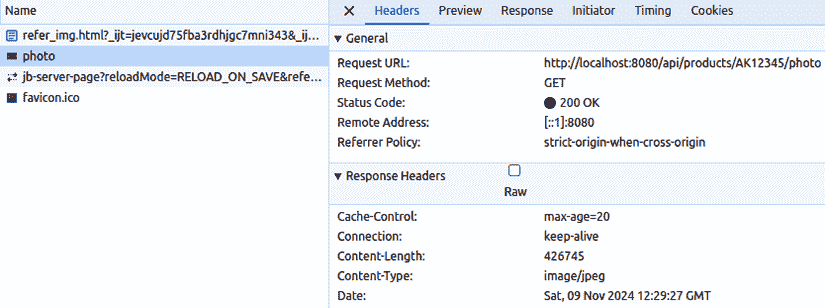
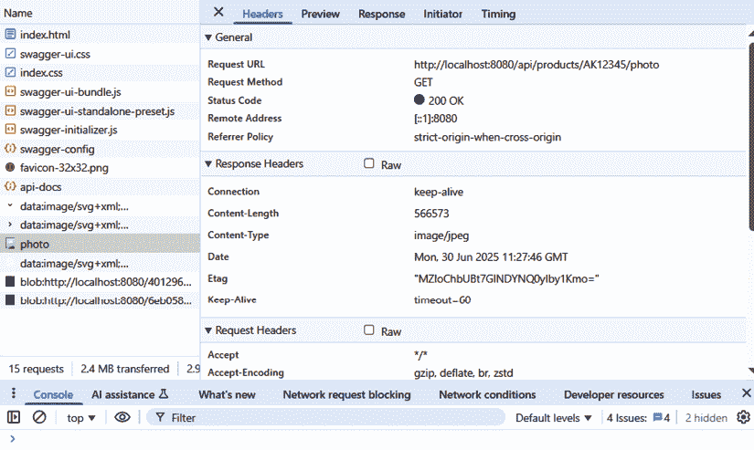
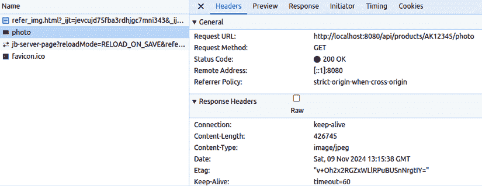
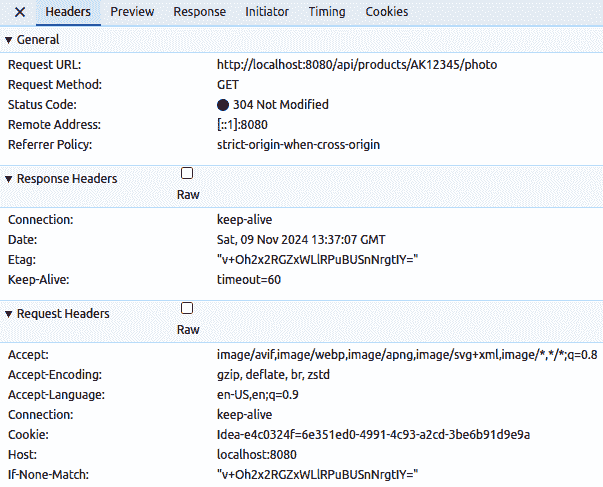
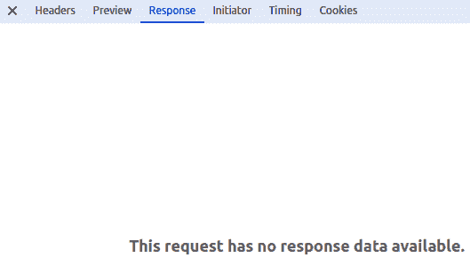
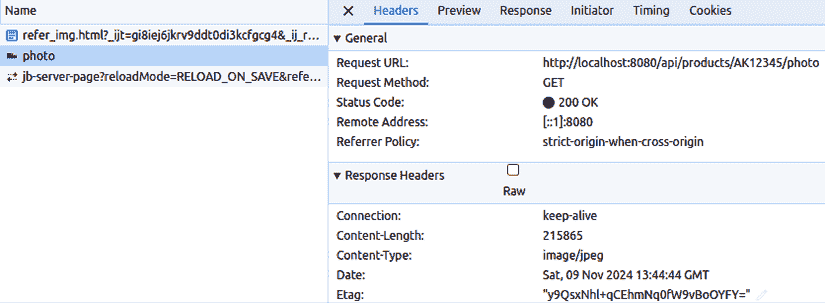
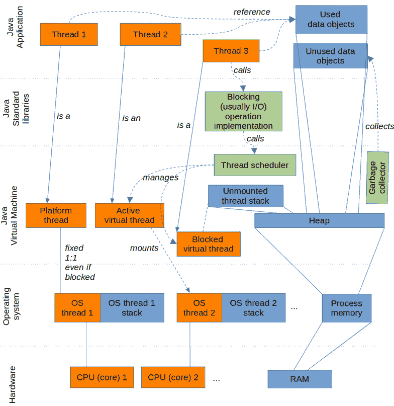
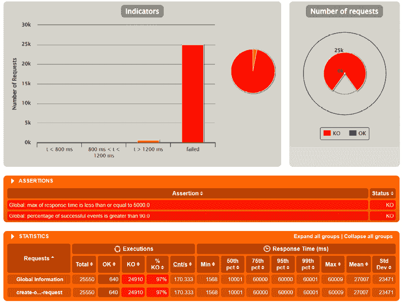
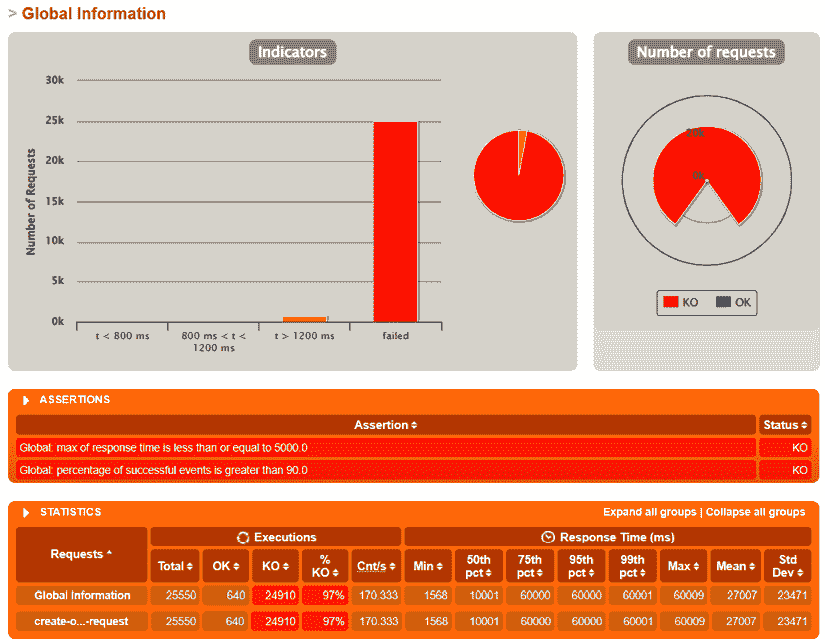
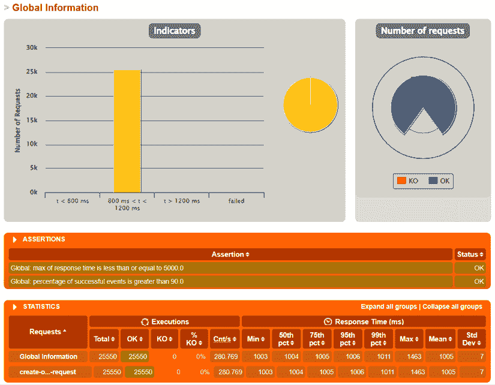

# 10

# 扩展和性能优化技术

*第九章*介绍了如定量测量等技能，以观察通过 API 连接的系统在运行时的行为。

那一章为本章关于**性能**和**可伸缩性**提供了良好的基础，这两个非功能性需求与时间、大小以及软件系统和它们处理的数据的其他定量方面密切相关。

我们将首先解释开发者需要了解的性能和可伸缩性的一般知识。然后，我们将深入具体细节，描述提高性能和可伸缩性的最常见策略和技术。我们将使用我们的商品和订单管理 API 演示一些这些技术。

我们强调 Java **虚拟线程**在 API 开发环境中提高应用吞吐量、改善 CPU 使用效率的潜力。

我们还表明，为了支持性能和可伸缩性，您的 API 应该准备好与专门的基础设施组件一起工作。

最后，我们将展示如何通过负载测试帮助您避免在应用程序开始接收生产负载时出现不愉快的惊喜。通过性能测试，开发者可以获取对针对优化努力至关重要的信息。

到本章结束时，您将了解如何从分析阶段开始，通过适当的 API 设计，到由负载测试发现触发的后续优化，来防止性能和可伸缩性问题。

本章涵盖了以下主题：

+   理解 API 开发中的性能和可伸缩性

+   应用性能优化策略

+   使用虚拟线程提高吞吐量

+   使用基础设施支持

+   设计和执行有效的负载测试

# 技术要求

为了展示本章中描述的一些技术，我们将使用前几章中开发的商品和订单管理 API 的示例代码。本章对代码所做的更改可以在以下存储库中找到：[`github.com/PacktPublishing/Mastering-RESTful-Web-Services-with-Java/tree/main/chapter10`](https://github.com/PacktPublishing/Mastering-RESTful-Web-Services-with-Java/tree/main/chapter10)。

# 理解 API 开发中的性能和可伸缩性

计算中的性能指的是系统或应用程序在给定工作负载下执行任务的效率。效率有两个方面：

+   **处理速度**：这主要是在响应时间（延迟）和吞吐量（系统在单位时间内可以处理多少操作或数据）的术语下进行衡量的。

+   **资源消耗**：这指的是完成工作所需资源的数量，例如 CPU、内存和网络带宽利用率。

统计学是性能测量的一个重要组成部分，因为在系统处理大量不同请求时，涉及不同数据量的情况下，测量性能是有意义的。因此，满足一个请求所需的时间和资源不可避免地会波动，并取决于许多因素，使得性能特性的实际测量值在本质上几乎是随机的。

通常使用平均值来计算吞吐量是足够的。对于响应时间，平均值不太有用，因为它不能很好地捕捉用户对响应速度的感知。最大值通常特别有趣，因为它可以指示潜在问题，例如超时错误的发生。此外，超过合理限制的响应时间会阻碍用户继续使用应用程序。

比极值更有用的是百分位数。如果我们按最短到最长的顺序对所有响应时间进行排名，那么例如，95 百分位数是 95%的测量时间都更短的时间点。换句话说，随机选择的一个请求耗时更长的概率只有 5%。

可扩展性指的是系统在保持用户期望的性能限制内处理不断增加的负载（用户数量增加、数据量更高或额外的事务）的能力。你可以看到，如果不考虑性能，我们无法谈论可扩展性。

可扩展性是推动从单体架构迁移到分布式（微服务）架构的主要动机之一。我们可以假设我们的示例产品 API 将需要处理比订单管理 API 显著更多的请求，因为不是浏览的每个产品都会被购买。我们可以扩展产品 API 的部署，使用比订单管理 API 更多的服务实例。

在 RESTful API 中，我们感兴趣的任务是 HTTP 请求的响应时间和吞吐量。执行 HTTP 请求所需的时间和计算资源由两部分组成：

+   API 技术本身所需的处理，例如数据的序列化和反序列化、网络传输和协议开销

+   提供 API 的服务内部的处理（例如执行算法、访问数据库和下游 API 调用），这通常受 API 请求和响应负载设计的影响，例如一个请求中处理的数据量、执行并发处理和数据流的可能性以及响应的可缓存性。

在设计 API 时，你通常关注功能需求，因为应用程序应该做什么是用户心中的首要任务。应用程序预期如何表现和应对增加的流量通常被认为是显而易见或隐含的。

预测实际负载、负载随时间的变化以及系统哪些部分会受到最大影响也很困难。唐纳德·克努特（Donald Knuth）著名的说法“*过早优化是万恶之源*”警告我们，我们不应该试图优化一切。

另一方面，性能和可扩展性考虑应该是设计过程的一部分，你通常可以通过对 API 进行一些简单的调整来预防很多问题。理想情况下，你应该设计 API 以尽可能简单的方式满足功能需求，同时为未来的扩展和优化留出空间。

当有疑问时，让 REST 原则引导你走向更灵活和标准的解决方案，这可能会支持性能和可扩展性要求：

+   使用基于反映业务域的资源结构的 URL

+   使用正确的 HTTP 方法，并为 `GET`、`PUT` 和 `DELETE` 提供相应的幂等性支持

+   使用正确的 HTTP 头部和状态码

+   使用清晰定义的参数，让客户端选择真正需要的数据和操作

+   为数据使用适当的 `Content-Type` 和 `Content-Encoding`（特别是对于大型二进制文档）

解释了性能和可扩展性在 API 开发中的含义后，我们可以继续描述那些当适当应用时，可以对使用 API 集成的应用程序的性能和可扩展性产生最大影响的策略。

# 应用性能优化和可扩展性改进策略

如果你检测到你的 API 存在或即将出现性能或可扩展性问题，你应该具备解决问题的工具。让我们在接下来的部分中更详细地看看一些优化性能的策略和技术。

## 了解性能要求

如前文所述，性能要求通常是由用户和客户隐含的，而不是明确指定的。

对于某些应用程序，性能可能不是关键因素，但如果我们以大多数电子商务网站为例，响应时间达到几秒的应用程序相当于根本不起作用的应用程序，因为它会立即阻止潜在客户购买。

因此，有必要至少包括一些关于要开发的系统的粗略性能预期。如果你可以更加严格，你应该要求客户定义**服务级别协议**（**SLAs**），指定每个操作的最多响应时间或请求处理的数量。SLAs 可能会因高峰时段和非高峰时段而有所不同。请记住，要记录大型数据对象的大小限制、大量并发用户及其地理分布。

收集的性能需求可以用来设计负载测试。负载测试将显示系统是否能够处理预期的负载，如果不能，哪些部分是瓶颈。关于用户地理位置分布和他们网络连接质量的信息应被用来在负载测试环境中添加模拟的网络延迟。

为了正确设计系统，了解系统是否应该优化响应时间（具有人类交互的系统）或吞吐量（批量处理）非常重要。为了实现更好的（感知）响应时间，可能有必要拆分 API 请求，使得一个请求只执行基本操作，只传递基本数据。这样，用户体验得到改善，而那些非基本请求可以稍后开始，或者运行更长的时间。

相反，将多个操作或数据项组合在一个请求中可能会通过减少 API 开销来提高吞吐量。然而，你必须确保请求不会变得太大，以至于因为超时而失败。

在许多情况下，你无法精确地估计或模拟负载和环境属性，因此你必须对生产中开始出现的性能问题做出反应。为了支持这一点，你的 API 应该准备好在不破坏现有客户端的情况下进行演变，这是第五章的主题。

## 只提供真正需要的内容

安全性，另一个非功能性需求，通常被认为与性能相冲突，但在许多情况下，它们的解决方案实际上可以重叠。限制我们在 API 中传输的数据量对安全性有益，也可能对性能有益，因为时间和资源不会浪费在 API 客户端不需要的项目上。

你应该识别那些大或需要很长时间才能获取的昂贵项目。如果一个昂贵项目不是所有请求都使用，你可以做以下任何一项：

+   向 API 端点添加一个参数，仅在客户端请求时才返回昂贵项目

+   为昂贵项目创建一个单独的端点（资源）

例如，如果我们的产品 API 存储产品的照片，我们就不需要在每个产品请求中返回照片。相反，我们可以返回一个图像 ID 列表，并为产品资源定义一个子资源，通过图像 ID 返回图像。

一个常见的错误是将 API 资源设计成数据库实体的副本。一些开发者甚至可能被诱惑直接在 API 中使用 JPA 实体类，而不定义单独的 API DTOs，这是一种明显的反模式。

应特别关注定义 JPA 实体之间关系的字段。在没有充分理由的情况下暴露由跟随关系产生的整个对象图，通常会导致 API 膨胀，并带来性能（除了安全和可维护性）问题。

例如，假设在某个时刻，我们扩展了我们的 Product API 服务的数据库模式，增加了包含有关库存可用性、位置、历史价格等信息的外部数据库表和 JPA 实体。这些额外的数据库表可以通过外键与产品表相关联，JPA 模型可以包含映射到相应 SQL 连接的关系。将所有额外信息自动包含在 Product API 资源的 JSON 表示中是错误的，除非在业务分析确认所有可能的读取产品的用例都将始终需要完整的数据集的情况下。相反，为了支持需要访问相关实体的用例，API 仅在设置参数或通过单独的端点时才发送额外的数据。

## 维护无状态

无状态（如*第一章*所述）是 REST 架构的关键原则之一。执行操作所需的所有输入数据都应该包含在 URL 路径和请求体中。请求处理不应依赖于某些隐含的会话数据。

无状态对于性能和可扩展性很重要，因为它允许 API 提供服务的服务进行水平扩展。负载均衡器（在即将到来的关于基础设施组件的部分中简要介绍）可以将任何请求路由到任何服务实例进行处理，因为实例不需要记住会话状态（属于同一用户旅程的先前请求的历史）。避免会话状态还可以帮助减少内存消耗。

当然，应用程序可能需要支持类似会话的用户体验。例如，你可能希望让用户逐个创建订单产品，因此应用程序需要记住一个不完整的订单，这在大多数电子商务网站上通常表示为购物车。为了满足这一要求，你有两个主要选项：

+   使用 JavaScript 代码、本地存储等在客户端（网页浏览器）上维护会话状态。

+   将购物车定义为后端服务的一等实体。这意味着为新的实体创建一个由 URL 标识的 RESTful 资源，并使用标准的 HTTP 方法来操作它。这使得存储在后端的数据是显式的，而不是一个没有明确结构且难以管理的隐含会话。

## 限制大型集合

当你的 API 传输一个项目集合（通常表示为 JSON 列表）时，你应该尝试找出集合中预期的项目数量。

如果项目的数量经常超过合理的限制，您应该考虑为集合实现分页解决方案（参见*第六章*）。集合中的项目数量和每页需要引入分页的项目数量取决于 API 操作的成本。对于快速检索的小项目，数量可以更高。

您还应该考虑在客户端同时处理多大的集合是有意义的。如果项目在屏幕上显示，用户通常一次只能看到几个项目。您可以将您的分页策略基于这个数字。

除了分页之外，您还可以通过确保查询足够具体来限制返回的项目数量。例如，在基于子串的搜索中，您可以强制执行一个规则，即搜索字符串必须至少有三个字符长，这有助于缩小结果并提高效率。

或者，在完整数据检索之前，您可以先执行一个更便宜的数据库查询，只返回匹配项的数量，如果它超过一定限制，您就可以停止并返回一个请求，要求客户端提供更具体的查询。在性能优化的背景下，更便宜意味着花费更少的时间和资源。

在决定集合大小限制时，您还应该考虑 API 操作需要访问的数据源的性质。在分布式（微服务）架构中，您通常需要调用另一个 API 来满足 API 请求。

如果您需要通过单独的 API 调用获取集合中每个项目的某些详细信息，您可以通过并行执行多个此类 API 调用来尝试缩短响应时间。但是，您应该限制并行 API 调用的数量，以避免压倒 API。本章后面的“*使用虚拟线程提高吞吐量*”部分可能有助于实现并发 API 调用。

另一个选择是检查您服务需要调用的 API 是否支持（或可以被修改为支持）批量操作，例如在一次请求中获取一系列 ID 的详细信息。但您必须对请求的大小保持合理，因为过大的请求可能会花费太长时间，并在客户端到服务器以及返回的路径上的各个点遇到超时。

+   例如，订单管理 API 为每个产品调用产品 API 以获取其价格。我们可以优化这个集成，使产品 API 提供一个批量“获取多个产品”端点。该 API 将产品 ID 列表作为其输入，并一次性返回所有产品的价格。

## 优化大型对象

我们已经提到，试图优化一切并不明智。帕累托法则表明，大多数（大约 80%）的性能问题是由 API 组成中的少数（大约 20%）的项目引起的。

一个相对常见的情况是，API 的一个小部分负责大部分的字节传输和时间消耗，当你想要传输内部结构对 API 不重要的大型数据块时，这种情况尤为明显，例如照片、视频或文档，这些通常使用二进制格式编码。这些项目对网络传输量、内存消耗和响应时间有显著影响。

避免在结构化（JSON）有效载荷中包含大型（二进制）对象是一种良好的做法。相反，你可以为大型对象定义单独的资源（端点）。这有以下优点：

+   有效载荷可以使用适合大型对象格式的编码。尝试在 JSON 中嵌入二进制数据通常会导致使用效率低下的编码，如 BASE64。

+   如果无法避免大型数据对象的基于文本的编码，可以通过结合压缩（如 gzip）来提高网络传输的效率。

+   大型对象可以独立于其他数据进行缓存。考虑到对象的大小，以及大型对象可能比结构化数据更改频率低，这是有意义的。

在可能的情况下，你也应该尝试限制大型对象的大小。当在客户端设备上显示图像时，通过在服务器上将图像缩放到较低的分辨率可以提高性能。

你可以在一开始就限制大型对象的大小。如果你的应用程序允许用户上传文件，你应该考虑限制上传文件的大小。

在我们的示例产品 API 中，我们在*第六章*的“通过 REST API 上传和下载文件”部分实现了一个单独的端点用于产品图片。

在那个示例代码中，我们使用`MultipartFile`类的方法来获取文件内容作为字节数组。我们还在用于下载文件的方法中返回字节数组。这种方法允许我们的代码保持简单，但缺点是整个文件一次性存储在堆内存中，尽管我们没有进行需要整个文件在内存中的处理。

我们可以通过使用`InputStream` / `OutputStream`而不是字节数组来优化内存使用。或者我们可以使用像 WebFlux 这样的响应式框架（更多内容请参阅*第十一章*）。然而，我们必须走到底，也就是说，也要使用支持流式访问的方法来持久化内容。

## 缓存

缓存可能是最受欢迎的性能改进策略。然而，缓存并非万能，设计正确的缓存设置并不容易，因此在采用此策略之前，你应该确保你已经考虑了通过应用适当的 API 设计来提高性能的选项，如前几节所述。

缓存涉及权衡：它以额外的内存来存储缓存数据以及缓存数据过时可能导致的潜在不一致性的风险为代价，提供了更短的响应时间。

缓存与缓存失效的挑战紧密相关——确定缓存中数据项何时应该被移除。这可能是因为缓存的数据已经过时，或者为了在不太可能再次访问缓存项时释放内存。缓存失效被认为是计算中最难的问题之一。检测需要从缓存中移除的项目最常见的两种方法如下：

+   *最近最少使用*，基于假设最近长时间未使用的资源不太可能再次被使用

+   *最少使用*，基于假设经常使用的资源可能会再次被使用

为了加快 API 的操作，我们可以考虑在 API 的消费者（客户端）端（缓存 HTTP 响应）和提供者（服务器）端（缓存执行操作和返回结果所需的数据）进行缓存。

在提供者（服务器）端进行缓存可以采取多种形式：可以是数据库中的数据，昂贵的计算结果，或者下游 API 调用的半处理结果。在服务提供者端进行缓存并不仅限于 API 实现，因此，它超出了本书的范围。对于详细指导，您可以参考 Ahmet Meric 的《精通 Spring Boot 3.0》，它涵盖了基于 Spring 的应用程序中的更广泛的缓存策略。对于使用 JPA/Hibernate 的数据库访问，建议了解一级和二级缓存的概念。对于 Spring 组件级别的通用缓存，您应该了解 Spring Cache（[`docs.spring.io/spring-boot/reference/io/caching.html`](https://docs.spring.io/spring-boot/reference/io/caching.html)）和`@Cacheable`注解。

为了支持数据的缓存能力，产生数据的操作应该是无状态的，这意味着如果输入相同，我们应该得到相同的数据输出。这使我们能够在多个服务实例或使用分布式缓存（如 Hazelcast 或 Redis）的多个服务之间共享缓存数据。这样，一个服务实例放入缓存中的数据可以被需要相同数据的另一个实例重用。

### 客户端缓存

现在，让我们专注于客户端缓存。由于客户端无法访问服务的实现细节，它必须使用一些提示来决定对于哪些 API 响应以及缓存响应可以使用多长时间，而不是再次调用 API。记住，客户端缓存不必在最终客户端完成；它也可以由位于服务器和最终客户端之间的代理服务器完成。

在我们深入了解缓存控制之前，验证 API 所包含的资源（端点）的结构和粒度非常重要。考虑将很少更改的数据项（它们是缓存的好候选）放置在与经常更改的其他项目分开的资源中。只有这样，缓存才能与数据的修改模式很好地对齐。

使用 `GET` 方法的请求默认被认为是可缓存的。这个规则被大多数网络浏览器所使用；因此，当页面内容变化速度超过浏览器预期时，用户有时需要强制浏览器重新加载网页（例如，在 Windows 操作系统上按 *Ctrl* + *F5*）。

相反，用于在服务器上修改数据的 `PUT`、`PATCH` 和 `DELETE` 方法，如果没有联系服务器就无法实现，因此它们不适合缓存。

`POST` 方法可以用来修改服务器上的数据，例如在我们的示例订单管理 API 中创建新的订单。它也可以用于只读操作，通常用于复杂的查询，当你想使用请求体而不是将操作输入放在 URL 或请求标头中时。

不论使用哪种 HTTP 方法，都可以通过标准 HTTP 响应标头来实现更详细的缓存控制：

+   `Cache-Control`：支持对谁（代理或终端客户端）可以缓存带有相同 URL 的响应以及何时（基于验证请求，持续多长时间）的详细指定。

+   `ETag`：简称为“实体标签”，一个可以用来检查资源是否已更改的值（与后续对同一 URL 的请求中的 `If-None-Match` 请求标头结合使用）。

旧标头（`Expires`、`Last-Modified`、`Pragma`），尽管为了向后兼容仍然得到支持，但已被 `Cache-Control` 标头取代。

### 示例 - 缓存产品照片

我们将通过在*第六章*中创建的产品照片下载端点上的标准 HTTP 标头来演示客户端缓存。

照片是相对较大的数据对象，预计不会非常频繁地更改，因此它们是缓存的好候选。

首先，我们将使用 `Cache-Control` 标头来指定客户端可以在缓存中存储照片的时间。在 `ProductsApiController` 类中，我们将修改 `downloadProductPhoto` 方法体以包含该标头，指定 20 秒作为缓存图像的时间：

```java
return ResponseEntity.ok()
    .contentType(
        MediaType.valueOf(photo.getPhotoContentType()))
    .cacheControl(
        CacheControl.maxAge(20, TimeUnit.SECONDS))
    .body(photo.getPhoto()); 
```

现在，我们可以启动产品 API 应用程序，通过调用 `PUT` 端点来添加一个测试产品和其图像：

```java
curl -v -X PUT http://localhost:8080/api/products/AK12345 -d '{"name":"testprod235","description":"test description","price":123.45}' -H 'Content-Type: application/json'
curl -v -F "file=@/home/mv/Documents/image.jpeg" -X PUT http://localhost:8080/api/products/AK12345/photo 
```

请注意，缓存标头告诉客户端它可以将其资源存储在缓存中，但客户端不需要这样做。简单的客户端可能会完全忽略缓存标头。

我们将使用网络浏览器，因为它理解并支持缓存头；然而，它不会从缓存中加载`main`资源（在地址栏中输入的 URL 对应的资源）。这就是为什么我们将创建一个名为`refer_img.html`的 HTML 文件，并将其用作`main`资源，在 HTML 文件中我们将引用我们想要下载或缓存的图片：

```java
 
```

现在，我们可以打开一个新的浏览器标签页并打开开发者工具（在 Windows/Linux 上按*F12*或在 Mac 上按*Option* + *⌘* + *I*）。在开发者工具中，我们切换到**网络**标签。

我们将通过在浏览器窗口中拖放文件来打开`refer_img.html`文件。当 HTML 文件首次打开时，浏览器必须发出 HTTP 请求以下载图片：



图 10.1 – 下载缓存中尚不可用的新资源

我们可以看到响应头，包括**Cache-Control:** **max-age=20**。

如果我们在 20 秒内重新加载页面，我们应该看到以下内容：



图 10.2 – 浏览器使用缓存资源

**状态码**旁边的文本和在**请求头**部分的警告表明这次没有进行真正的网络传输，而是显示了缓存的图片。在**响应头**部分，我们可以看到访问时间（**Date**头）与之前相同，因为头部也被缓存了。

如果我们在 20 秒后重新加载页面，图片将新鲜地从服务器下载，并且我们会看到**Date**头部的值是一个新的时间。

让我们通过`ETag`头使缓存更复杂。为了使头部的值仅在图片更改时改变，我们将计算实体标签作为图片字节的哈希值。以下方法使用 SHA-1 算法计算哈希，并使用 Base64 编码将其转换为可打印的字符串：

```java
private String getHashString(byte[] bytes) {
    try {
        MessageDigest md =
            MessageDigest.getInstance("SHA-1");
        return Base64.getEncoder().encodeToString(
            md.digest(bytes));
    } catch (NoSuchAlgorithmException e) {
        throw new RuntimeException(e);
    }
} 
```

现在，我们可以将控制器方法更改为使用`ETag`头：

```java
 return ResponseEntity.ok()
           .contentType(MediaType.valueOf(
               photo.getPhotoContentType()))
           .eTag(getHashString(photo.getPhoto()))
           .body(photo.getPhoto()); 
```

在重新启动应用程序后，我们可以再次开始测试。页面的第一次加载将正常下载图片：



图 10.3 – 浏览器下载带有新 ETag 的资源

**响应头**部分包含计算出的哈希字符串的**Etag**头。

之后，无论我们等待多久，当我们重新加载页面时，我们会看到以下内容：



图 10.4 – 当 ETag 值匹配时，服务器响应“304 Not Modified”

**Date**头部是新鲜的，这意味着浏览器确实向服务器发送了真实请求。然而，**状态码**是**304 – Not Modified**，没有内容被发送回来。



图 10.5 – “304 Not Modified”响应不返回任何内容

这是因为当浏览器发出请求时，它发送了包含之前请求中得到的`ETag`值的`If-None-Match`请求头。Spring 框架自动将值与新计算出的值进行比较，如果它们匹配，则在响应中返回`304`状态码。

让我们检查当我们上传新图像时会发生什么：

```java
curl -v -F "file=@/home/mv/Documents/image2.jpeg" -X PUT http://localhost:8080/api/products/AK12345/photo 
```

在页面下次重新加载时，我们得到以下内容：



图 10.6 – 当 ETag 不匹配时，服务器返回“200 OK”和完整内容

由于**Etag**值已更改，返回了完整内容，状态码为**200 OK**。

## 命令查询责任分离（CQRS）

**命令查询责任分离**（**CQRS**）模式旨在分离读和写操作，提高应用程序的性能和可伸缩性。通过将数据修改（命令）与数据检索（查询）分离，每个操作都可以独立优化。这种分离在需要不同可伸缩策略的读和写操作的应用程序中特别有用。

例如，一个高读流量的应用程序可以在不影响写性能的情况下扩展读操作。这防止了在资源密集型的写过程发生时读操作变慢。在我们的例子中，*第二章* ，我们在单个应用程序中应用了 CQRS 原则，但在实践中，CQRS 通常涉及部署两个独立的应用程序：一个处理读操作，另一个处理写操作。

通过分离读和写责任，CQRS 通过消除这些操作之间的依赖关系，实现独立扩展，从而提高应用程序的性能。为了确保两个应用程序共享相同的 API 端点，可以使用网关根据正在执行的操作将流量重定向到正确的应用程序。

### 不需要回显请求数据

当实现 POST 或 PUT 端点时，常用的约定是在 HTTP 响应体中返回创建或更新的实体。我们甚至在我们的书中使用这个模式。这个模式通常与数据模型的复用相关：我们已经有了一个用于请求和 GET 响应中的实体的模型，为什么不用它来处理 POST 和 PUT 响应呢？

HTTP 协议或 REST 架构中没有告诉我们需要在 POST 或 PUT 请求中回显我们得到的内容。相反，有一些反对它的论点：

+   浪费网络带宽并增加响应时间，尤其是对于大型实体。

+   客户端已经有了数据，因为它刚刚在请求中发送了它们。

+   它可能导致客户端产生错误假设，即返回的数据总是最新的，但如果在并行执行对同一实体的其他请求，这可能并不成立。

即使服务器上生成了一些额外的信息，为什么我们会自动假设客户端需要修改的部分或整个实体数据？这违反了单一职责原则：POST 或 PUT 操作预期执行创建/更新。如果客户端需要读取数据，它可以发送 GET 请求。读取和写入操作的不同模型也是应用本章先前解释的 CQRS 原则的自然结果。

## 异步处理

HTTP，RESTful Web 服务的核心，围绕同步请求-响应通信风格构建，使其易于理解和实现。当谈论异步 API 时，我们通常想到基于消息代理的系统，使用除 HTTP 之外的协议。基于消息的通信是本章第一部分中提到的 RESTful Web 服务的主要替代方案之一。然而，HTTP 也可以支持异步处理。

如果要通过 REST API 公开的操作涉及耗时较长的处理，在返回响应之前等待处理完成会阻塞 API 客户端，使 API 看起来无响应，并可能导致超时。可以通过在读取请求后立即返回响应并将输入数据保存到可靠存储中，来提高此类 API 的响应性。

在这种情况下，标准的响应状态码是`202 - 已接受`。长时间运行的处理可以异步继续，而不会阻塞客户端。可以提供一个单独的 API 端点供客户端轮询处理状态，并在完成后接收其结果。

例如，假设我们想要改进示例产品 API 的图片上传端点，使其将图片缩放到标准尺寸或对其进行其他图形增强。这种处理可能耗时较长。在这种情况下，我们可以决定将上传端点更改为异步端点。我们将存储未处理的图片并返回`202`状态码。图片增强将异步完成，并提供一个`GET`端点以检查图片是否已准备好使用。

在解释了如何通过分析、设计和 HTTP 标准层面的通用方法确保性能和可伸缩性之后，在下一节中，我们将更多地转向实现层面，并关注 Java 平台当前版本的一个特别相关的特性，即与使用 API 进行通信的应用程序的性能和可伸缩性。

# 使用虚拟线程提高吞吐量

虚拟线程是 Java 的一个特性（自 Java 21 起为 final），与并发处理性能相关，这是一个与 API 实现高度相关的主题。所有服务器端应用都是并发的，因为它们必须处理并发传入的请求。然而，在使用 Spring Boot 等 Java 服务器端框架的情况下，代码可以仅关注一个请求，使用所谓的“每个请求一个线程”模型。更高级的应用可能需要每个请求多个线程。我们将在以下小节中探讨这两种并发用法。

## 线程垃圾收集器

在进行更精确和详细的描述之前，让我们用一个简单的比喻来解释虚拟线程的概念，即使对于可能觉得线程和并发难以理解的开发者来说也是如此。所有 Java 开发者都必须理解垃圾收集的概念，这是 Java 虚拟机提供的一种抽象，可以解放开发者从分配和释放内存的责任。

当然，你仍然可能会遇到`OutOfMemoryError`，但如果你的应用以典型方式使用对象，那么在某个时刻，不再使用的对象不会被任何其他对象引用，因此运行时可以自动检测这些对象，从而释放并重用它们所占据的内存。这种抽象自 Java 的第一个版本以来就被程序员使用，简化了代码，并防止了许多与直接内存访问和分配相关的难以检测的错误，这些错误在 C 或其他没有垃圾收集器的语言编程中是众所周知的。

类似于垃圾收集器对内存的处理，虚拟线程提供了（几乎）无限数量的线程的错觉。实际上发生的情况是，在一个典型的应用中，每个传入的网络请求使用一个线程（更多内容将在下一节中介绍），JVM 与标准库一起可以自动检测平台线程会因为等待（例如，I/O）而被阻塞。为了防止这种情况，虚拟线程的状态被移动到堆中，平台线程被重用来处理其他请求。

对于大多数应用来说，依赖虚拟线程来高效利用平台线程，而不是直接使用平台线程，很可能会依赖于垃圾收集器在每个请求结束时清理内存对象。



图 10.7 – 虚拟线程工作原理的说明，分为层

## 每个请求一个线程模型

我们的示例 API 使用 Spring Web 实现，这是一个采用“每个请求一个线程”模型的框架。这意味着对于每个 HTTP 请求，框架所使用的 Web 服务器都会分配一个专用的 Java 线程，并在该线程中调用与请求路径和方法匹配的控制方法。

线程每请求模型的优势在于它允许使用经典的命令式编程风格，其中包含按照源代码中出现的顺序执行的代码块。这种代码风格易于阅读和理解。它也易于调试，因为当执行保持在单个线程内时，调试工具中显示的调用栈是完整的，让开发者能够很好地跟踪所有代码级别的函数调用。

然而，没有虚拟线程的线程每请求模型的可扩展性有限，因为操作系统提供的线程（所谓的平台线程）是一种昂贵的资源。每个平台线程都占用相当大的内存，因此 JVM 可以使用的平台线程数量是有限的。使用平台线程的 Web 服务器必须从有限的线程池中获取一个线程来处理传入的请求。如果池中没有剩余的线程，请求将等待直到有线程可用。

控制器方法和从控制器方法调用的任何方法（让我们称其为处理代码）会保留专用线程，直到控制器方法返回或抛出异常，将执行权交回 Spring Web 框架。处理代码中包含阻塞操作是很常见的情况。阻塞操作阻止 CPU 执行有用的工作，因为它在等待所需数据时停止执行。

为了说明这一点，让我们看看订单管理 API 的“创建订单”操作的执行。

首先让我们看看 `OrderManagementApiController.java` :

```java
 public ResponseEntity<OrderResponseDto> ordersPost(
        OrderRequestBodyDto orderRequestBody) {
            // ^ involves deserialization from JSON (CPU usage)
            final var order = ordersCommandUseCase.createOrder(
                orderMapper.toOrderRequest(orderRequestBody));
            return ResponseEntity.status(HttpStatus.CREATED)
            .body(orderMapper.toOrderResponse(order));
            // ^ involves serialization to JSON (CPU usage)
        } 
```

接下来，让我们看看 `OrdersCommandUseCaseImpl.java` :

```java
 public Order createOrder(OrderRequest orderRequest) {
        updateProductPrice(orderRequest.products());
            // ^ involves I/O
        Order order = orderMapper.toOrder(orderRequest);
        return ordersRepository.save(// involves I/O
            OrderEntity.fromOrder(order, null));
        }
    private void updateProductPrice(List<Product> products) {
        products.forEach(orderProduct -> {
            ProductDetails catalogueProduct =
            productsQueryUseCase.getProductById(
                // ^ involves I/O
                orderProduct.getProductSKU());
            orderProduct.setPrice(
                catalogueProduct.price());
        });
    } 
```

阻塞操作（通常由网络 I/O 通信的需求引起）可能会对性能产生灾难性的影响，因为在许多应用程序中，它们比周围的非阻塞（CPU 密集型）操作慢几个数量级。通信是分布式应用程序（微服务）处理过程中的一个基本部分。重要的是要理解，在远程 API（或从复杂的数据库查询）传输数据所需的时间通常是数百毫秒到数秒。相比之下，一旦所有数据都可用，执行大多数企业应用程序的业务逻辑所需的 CPU 处理时间要短得多——即使我们考虑更复杂的操作，如 JSON 解析和序列化——它以微秒计。

这意味着在线程每请求模型下，被输入/输出操作阻塞的 CPU 无法用于服务其他请求；在一个负载很重的服务中，超过 99%的时间 CPU 将是空闲的。

解决这个问题的方法之一是使用响应式编程框架（关于这一点将在*第十一章*中详细介绍），但这意味着放弃之前描述的具有优势的线程每请求模型：易于理解和调试的代码。

虚拟线程很聪明，因为它们允许开发者保持按请求分配线程的模型，同时允许高效地使用平台线程。当一个虚拟线程需要使用 CPU 时，它会被挂载到一个平台线程（也称为 *载体线程*）上。当一个虚拟线程遇到阻塞操作时，其执行状态会被存储在堆内存中，其载体线程被释放，以便它可以用来执行另一个虚拟线程。当阻塞操作完成时，虚拟线程可以挂载任何可用的载体线程（可能不同于它之前阻塞时使用的那个），从堆中恢复其状态，并继续执行。

与平台线程相比，虚拟线程成本低廉，因此应用程序可以使用数百万个虚拟线程。一个 HTTP 服务器和应用框架可以为每个传入请求提供一个新的虚拟线程，无论有多少请求正在等待 I/O 操作。

要使用虚拟线程来处理传入请求，你只需要配置框架以启用该功能。在 Spring Boot 3.2 或更高版本和 Java 21 或更高版本中，你可以使用以下配置属性：

```java
spring.threads.virtual.enabled=true 
```

你可以继续使用包含阻塞操作的代码风格，知道阻塞的线程将是虚拟线程，CPU 将会被高效地使用。

除了使用按请求分配线程的模型来处理许多传入请求外，一个应用程序可能需要显式地并行执行多个操作来处理单个传入请求。

## 单个请求内的并行处理

在集成密集型应用程序的上下文中，一个常见的情况是在处理请求时需要调用多个独立的远程 API 来优化延迟。

想象一个报价 API，它调用多个供应商的 API，比较他们的价格，并返回最佳报价。

Java 提供了 `ExecutorService` 类这样的有用抽象。每个应该并行执行的操作都是一个提交给 `ExecutorService` 的任务。

当创建 `ExecutorService` 类时，你指定它应该使用什么策略来管理执行任务的线程。如果没有虚拟线程，典型的策略将是使用固定大小的线程池。线程池允许一定数量的并行任务，但数量是有限的，因为平台线程的数量是有限的。

使用虚拟线程，我们可以让 `ExecutorService` 为每个任务使用一个新的虚拟线程，而不需要线程池，也不需要指定该池的大小：

```java
try (ExecutorService es = Executors.newVirtualThreadPerTaskExecutor()) {
    es.submit(()-> { /* task 1 */ });
    es.submit(()-> { /* task 2 */ });
    // ...
}; 
```

我们简要解释了，简而言之，虚拟线程通过最小化空闲线程并确保更多时间用于执行有用操作来提高 CPU 效率。这种直接效果是吞吐量的增加（单位时间内完成的工作量）。然而，吞吐量和响应时间通常是相关的。增加的吞吐量意味着给定的 CPU 功率可以处理更高的负载，而无需某些请求等待线程变得可用。因此，响应时间也可以得到改善。

到目前为止，我们讨论了可以在单个服务内应用的方式来提高性能和可伸缩性。然而，位于通过 API 连接的各个组件之间的基础设施组件通常也参与实现整个分布式系统（应用程序）的满意性能和可伸缩性。下一节将简要介绍这些基础设施组件。

## 虚拟线程固定

在某些情况下，执行阻塞操作的虚拟线程无法释放平台线程以供其他虚拟线程使用。使用官方术语描述这种情况，我们说虚拟线程无法从其载体卸载，因为虚拟线程被固定在载体线程上。

截至 Java 21，线程固定可以发生在两种情况下。

虚拟线程固定的第一个情况是当虚拟线程正在执行本地代码。这是不可避免的，因为 JVM 无法安全地从非 Java 代码中移除平台线程。

第二种情况是当虚拟线程在同步块或方法内运行代码。这是 JVM 内部对虚拟线程支持实现的一个限制。如果你的应用程序代码或其依赖项（如 Web 服务器或库）使用 Java 同步结构，这可能会限制虚拟线程的性能，与预期相比。在某些情况下，甚至可能导致死锁，其中所有可用的平台线程都被固定线程阻塞，等待同步锁。

这意味着你不应该盲目地开启虚拟线程。建议你在应用程序中启用和禁用虚拟线程的情况下进行性能测试。你应该了解你的应用程序依赖项，并尝试使用它们的最新版本。记住，Spring Boot 默认使用嵌入式 Tomcat 作为 Web 服务器（servlet 容器），但它也支持切换到其他 Web 服务器。

由于同步结构引起的虚拟线程的固定问题在 Java 24 中已被消除。因此，即使你使用的 Java 版本支持你应用程序需要的所有功能，尽快升级到新版本的 Java 也是一个好主意，以获取对使用的 Java 功能的实现进行的修复和改进。Java/OpenJDK 的新版本还带来了工具改进，可以帮助诊断和修复各种性能问题，可能包括虚拟线程固定问题。

# 使用基础设施支持

理想情况下，你希望设计和实现你的 API，以便它们可以在不依赖于特定基础设施设置的情况下良好工作。然而，软件开发者应该意识到，他们开发的服务之外的外部组件可以用来增强系统的性能和可伸缩性。

存在几种类型的基础设施组件：

+   **负载均衡器**：一个组件将请求分配给多个提供相同 API 的服务实例。负载均衡器对于水平扩展是不可避免的。

+   **代理**：一个同时是 HTTP 服务器和客户端的组件。它接收一个请求，通过向实际提供 API 的服务发送另一个请求来满足它。代理允许我们在客户端和服务器之间添加各种功能，其中缓存对于性能来说是最重要的：

    +   一个接收带有公共 URL 的请求并将其转换为私有网络内的请求的代理被称为**反向代理**。

    +   结合不同功能支持 API 的代理也被称为**API 网关**。

+   **内容分发网络（CDN）**：这是一个地理分布的代理网络，客户端可以通过附近的代理访问 URL，从而缩短响应时间。

这里提到的组件通常结合性能和安全问题。一个重叠明显的例子是防御**拒绝服务**（**DoS**）和**分布式拒绝服务**（**DDoS**）攻击。这涉及到限制来自单一来源的过多流量，以确保服务对所有客户端都可用。

从这个意义上说，嵌入 API 提供服务的架构可能包含多个组件，这些组件通常超出了 API 开发者的控制。这也是为什么 API 设计的最佳方法是要遵循 HTTP 和其他互联网标准（RFCs）定义的标准。这将确保你的 API 与周围的基础设施良好工作。

我们已经讨论了几个可能出现的性能和可伸缩性问题，以及解决它们的方法。然而，在本章的最后部分，展示如何检查特定服务在特定负载下的性能是至关重要的，因为只有通过这种方式，才能检测并针对实际问题进行解决。

# 设计和执行有效的负载测试

*第八章* 解释了各种可以用来确保 API 正确性的测试，这意味着这些测试检查 API 及其背后的服务是否按照`预期`处理输入数据，并以预期的输出数据响应。它们关注输入和输出数据的详细属性的确切值及其语义，以验证应用程序的功能需求。为此，它们尝试不同的测试数据组合，以覆盖最常见的用例以及负面场景和边缘情况。

在性能和可扩展性的背景下，我们从不同的角度测试应用程序。而不是按功能需求对测试用例进行分类并检查确切的数据值，我们通常尝试一组较小的用例，这些用例以它们对应用程序施加的预期负载为特征。

然而，发送到应用程序的相同或非常相似的请求的重复次数将显著增加。时间方面非常重要，因此请求的频率模拟了真实流量，包括负载波动。发送多个并发请求以模拟许多用户同时使用应用程序。

与其他类型的测试相比，负载测试中的这些差异意味着尽管可以使用相同的工具进行两者，但使用专门从事负载测试的工具进行负载测试更容易、更高效，并且提供更准确的结果，并以适当的形式呈现。

## 示例 - 对订单管理 API 进行负载测试

我们将使用名为 Gatling 的工具（其文档可在[`docs.gatling.io/`](https://docs.gatling.io/) 获取）对我们的示例订单管理 API 进行负载测试。Gatling 与 Java 集成得很好，因此我们可以将负载测试包含在我们的 Java 源代码中，并通过 Maven 插件运行它，而无需安装单独的程序。

首先，我们将添加 Gatling 依赖项（带有`test`范围）到`pom.xml`文件中：

```java
 <dependency>
            <groupId>io.gatling</groupId>
            <artifactId>gatling-app</artifactId>
            <version>3.7.2</version>
            <scope>test</scope>
        </dependency>
        <dependency>
            <groupId>io.gatling.highcharts</groupId>
            <artifactId>gatling-charts-highcharts</artifactId>
            <version>3.7.2</version>
            <scope>test</scope>
        </dependency> 
```

然后，我们可以开始编写测试类，也称为 Gatling 模拟。我们的模拟将尝试通过订单管理 API 创建许多新订单：

`public class CreateOrderSimulation extends Simulation {`

测试的最高级别位于类构造函数中：

```java
public CreateOrderSimulation() {
    setUp(POST_SCENARIO_BUILDER.injectOpen(
        rampUsersPerSec(10).to(300)
        .during(Duration.ofSeconds(10)),
        constantUsersPerSec(300)
        .during(Duration.ofSeconds(80)))
    .protocols(HTTP_PROTOCOL_BUILDER))
    .assertions(
        global().responseTime().max().lte(5000),
        global().successfulRequests().percent().gt(90d));
} 
```

代码引用了`HTTP_PROTOCOL_BUILDER`和`POST_SCENARIO_BUILDER`常量，这些常量描述了应该发送到测试 API 的请求。`injectOpen`方法指定了请求的时机和并行化：

+   在模拟的前 10 秒内，用户（请求）的速率从每秒 10 个增长到每秒 300 个。

+   在接下来的 80 秒内，请求的速率保持恒定，每秒 300 个。

最后，我们可以看到测试断言，预期最大响应时间为 5,000 毫秒，并且超过 90%的请求应该成功。

为了使性能差异更明显，我们将修改产品 API（订单管理 API 所依赖的 API）的代码，在`ProductsQueryUseCaseImpl`类的`getProductById`方法中添加 1 秒的人工延迟：

```java
 try {
            TimeUnit.SECONDS.sleep(1);
        } catch (InterruptedException e) {
            throw new RuntimeException(e);
        } 
```

现在，我们可以启动产品 API 应用程序。我们的测试订单包含产品 ID AK21101，因此我们需要使用产品 API 来创建它。我们可以使用 Swagger UI，`curl`命令，或者如果我们使用 IntelliJ IDEA，我们可以使用一个简单的文本文件，具有`.http`扩展名来发送 HTTP 请求：

```java
PUT http://localhost:8080/api/products/AK21101
Content-Type: application/json
{
    "name": "Keyboard",
    "description": "Ergonomic Keyboard",
    "price": 60
} 
```

接下来，我们禁用这两个配置属性并使用`#`字符注释掉它们来启动产品管理 API：

```java
 hikari:
#       maximum-pool-size: 500
threads:
    virtual:
#       enabled: true 
```

通过运行以下 Maven 命令启动负载测试：

```java
mvn gatling:test 
```

在测试运行过程中，我们可以观察到当负载达到一定点后，许多请求失败（`KO`计数，表示`not OK`，正在增长）。

整个测试失败，因为响应时间和成功请求的百分比都没有满足。

测试的详细图形可视化可以在`target/gatling`目录中找到：



图 10.8 – 由于服务无法处理负载，大多数请求失败

现在，让我们尝试通过在订单管理 API 中启用虚拟线程来提高性能：

```java
threads:
    virtual:
        enabled: true 
```

在重新启动应用程序和 Gatling 测试后，我们得到了不同的结果。



图 10.9 – 启用虚拟线程揭示了数据库连接池的瓶颈

成功响应的数量略有增加，但仍然，大多数都失败了。

查看订单管理 API 应用程序的控制台日志输出，我们发现许多以下错误的重复：

```java
java.sql.SQLTransientConnectionException: HikariPool-1 - Connection is not available, request timed out after 30000ms. 
```

通过启用虚拟线程，我们消除了线程池对应用程序能够并行处理请求数量的限制。然而，应用程序的另一个部分现在已成为瓶颈，即数据库连接池。

Hikari 连接池的默认限制是 10 个数据库连接，考虑到产品 API 的 1 秒延迟，这很快就会被耗尽。订单管理 API 必须等待直到它可以完成数据库事务并释放连接。为了消除瓶颈，我们将最大连接数设置为`500`：

```java
hikari:
    maximum-pool-size: 500 
```

注意，这只是一个简单的例子，目的是使虚拟线程的影响非常明显。在实际应用程序中，如此高的连接数可能会引起数据库问题，我们可能不得不使用不同的解决方案，例如只在从产品 API 获取价格后开始事务，或者修复产品 API 的长时间响应。

在这个更改之后，我们可以重新启动订单管理 API 和 Gatling 测试。

现在，最终，我们的测试通过了，结果非常令人满意：



图 10.10 – 使用虚拟线程的服务可以处理高频率的请求

所有请求都正常，所有从产品 API 返回的响应时间都非常接近 1 秒。

# 摘要

在本章中，我们学习了在 RESTful API 的背景下性能和可扩展性的具体细节。我们探讨了各种设计方法和技巧来提高这两个非功能性要求。我们看到了一个使用缓存头来减少客户端和服务器之间网络流量体积的例子。我们深入探讨了虚拟线程，这是新 Java 版本中高度相关的性能特性。最后，我们通过负载测试验证了预期性能改进的实现。在下一章中，我们将展示本书中描述的原则如何应用于 Spring Boot 之外的 Java 后端框架，以及如何通过使用社区驱动的标准来使你的应用更具未来性和供应商中立性。
