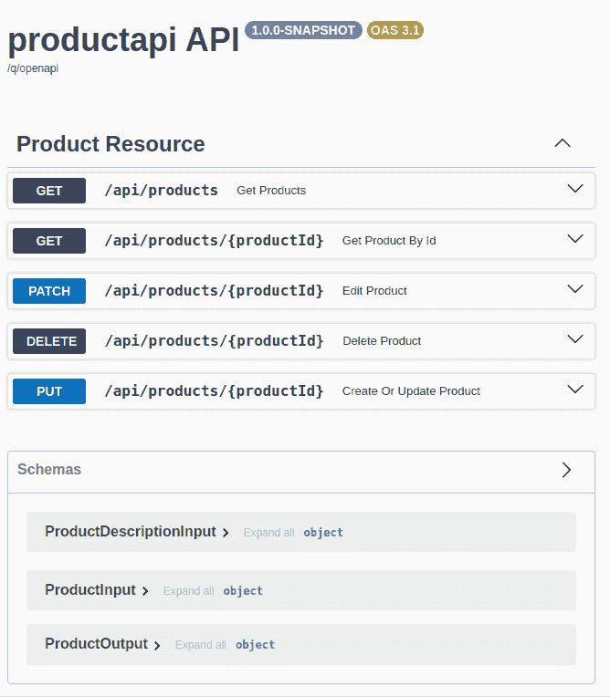
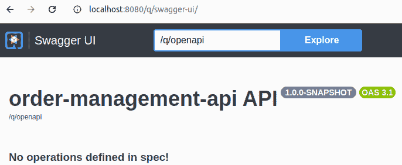
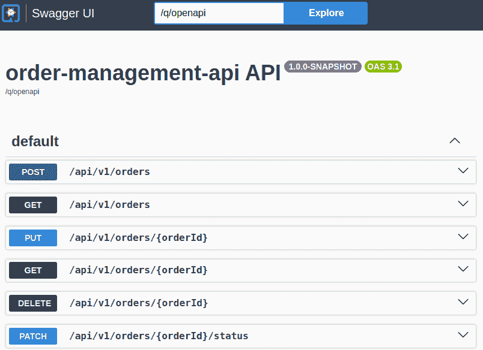
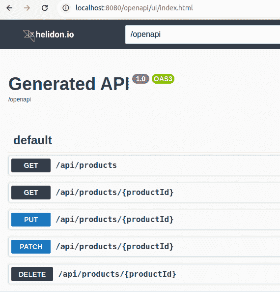

# 11

# 构建 RESTful API 的替代 Java 框架

到本章为止，我们一直使用 Spring Boot 框架来演示真实代码中的 API 实现。通过使用非常流行的 Spring Boot，我们试图使本书对尽可能多的读者来说既可读又实用。

现在是时候解释为什么以及如何使用其他 Java 框架来实现 RESTful 网络服务了。

您将看到相同的设计原则和类似的代码结构仍然适用，因此您可以使用其他章节中的概念，以适应您可能想要用于特定情况的任何框架。

首先，我们将解释 jakarta EE 和 MicroProfile 等标准如何帮助您在众多框架和实现堆栈中不迷失方向，这些框架和实现堆栈可用于构建您的应用程序。我们将简要提及使用大多数当前框架中可用的反应式编程的可能性。

当前选择实现技术是历史上创新方法的历史结果，旨在帮助开发者创建满足当前架构和部署偏好的应用程序。我们将从 Java EE 逐步引导您到 Quarkus 和 MicroProfile 规范等框架。

为了提供详细的视角，我们将通过与我们之前章节中 Spring Boot 实现相比的 Quarkus 和 Helidon 框架的示例 API 实现中的相似性和差异性来展示。

这导致了以下章节列表：

+   理解标准的好处

+   选择命令式或反应式

+   Java EE 和 Jakarta EE

+   Spring 框架和 Spring Boot

+   新的微服务框架和 MicroProfile

+   使用 Quarkus 的示例实现

+   使用 Helidon 的示例实现

# 技术要求

在本章中，我们将演示除了 Spring Boot（在前面章节中使用）之外的其他框架的使用。然而，必要的依赖项将在项目构建过程中自动下载，基于 Maven `pom.xml` 文件，因此先决条件保持不变：

+   对 Java 语言和平台有中级了解

+   至少对 Spring Boot 或类似框架有基本了解

+   安装了 Java 21 和 Maven 3.9.x（或者，您可以使用示例代码中包含的 `mvnw` 命令，这将下载正确的 Maven 版本）

您可以在 GitHub 上访问本章的代码：[`github.com/PacktPublishing/Mastering-RESTful-Web-Services-with-Java/tree/main/chapter11`](https://github.com/PacktPublishing/Mastering-RESTful-Web-Services-with-Java/tree/main/chapter11)。

# 理解标准的好处

Java 是一种多才多艺的语言，拥有庞大的开源和商业框架和库生态系统。因此，您可以选择的选项比您能够完全评估的要多。

你甚至可以尝试实现自己的 HTTP 服务器或客户端和自定义框架，尽管除了教育目的之外不推荐这样做，因为使其生产就绪和维护所需的细节捕捉成本极高。

选择一个框架或任何你的软件将依赖的组件是困难的。这涉及到预测你的软件将需要的未来功能和框架（依赖）的未来发展和支持。

例如，基于 Java 企业版标准的应用程序需要部署到应用程序服务器。后来，频繁部署新应用程序版本、云部署和可伸缩性要求可能需要更快的启动时间、更小的容器大小，以及取消对应用程序服务器的依赖。或者，运维团队有经验的应用程序服务器版本可能已经过时，这将限制可以使用的 Java 版本。

一种常见的方法是在拥有大量用户和开发者的框架之间进行选择。但我们也希望新的创新框架进入市场，尽管它们的社区自然会从很小开始。

幸运的是，已经创建了供应商中立的规范和标准，以防止 Java 社区因互不兼容的框架而分裂。通过选择符合标准的框架，你可以保留切换到同一标准的不同实现的选择。如果开发者熟悉标准，即使没有特定于提供的框架的经验，他们也会更容易开始工作。

因此，在接下来的章节中，我们不仅关注单个框架，还关注它们支持的标准（规范）。

# 选择命令式或响应式

在前面的章节中，我们使用了 Spring Web 框架的命令式编程风格。

命令式编程风格通过一个简单的 Java 方法来模拟 API 操作，该方法将 HTTP 请求中的数据作为参数，并返回一个将用于生成 HTTP 响应的结果对象。方法体由按代码中出现的顺序顺序执行的语句组成，使用一个 Java 线程。

在下面的代码片段中，我们可以看到`statement1`、`statement2`等语句，这些语句将在一个线程中依次执行，访问相同的变量作用域和相同的调用栈。

```java
@GetMapping // or other similar annotation
ResultType operationName(InputType1 input1,
                         InputType2 input2...) {
    statement1;
    statement2;
    ...
    return ...;
} 
```

一个类似的代码片段显示了当结果包含多个实体时具有相同的结构。这次，结果类型是一个众所周知的 Java 集合（`List`）。

```java
@GetMapping // or other similar annotation
List<ResultType> collectionReturningOperationName(
                 InputType1 input1, InputType2 input2...) {
    statement1;
    statement2;
    ...
    return ...;
} 
```

这种风格被称为*命令式*，因为程序被理解为一系列命令的序列，明确告诉计算机按何种顺序执行哪些步骤。在这个模型中，数据只是命令的参数。

除了“经典”的命令式风格外，在大多数现代框架中，您还可以选择使用反应式风格。例如，在 Spring 框架家族中，您可以使用*Spring WebFlux*。

反应式编程风格建立在异步处理数据流的思想之上。程序执行被理解为由数据流驱动。程序通过一系列函数（数据转换）对传入的数据项做出反应。

使用反应式风格处理单个请求的步骤是异步执行的，并且通常在不同的 Java 线程之间跳跃。

已创建了几个库来支持 Java 中的反应式编程，其中包括*RxJava*和*Project Reactor*。它们都基于可观察的设计模式共享共同特性。它们的接口在反应式流规范中得到了标准化（[`www.reactive-streams.org/`](https://www.reactive-streams.org/)）。从 Java 版本 9 开始，反应式流规范中的接口已成为标准 Java API 的一部分，作为嵌入在`java.util.concurrent.Flow`类中的接口。

现在我们将前面的示例与使用 Spring WebFlux 的类似代码进行比较：

```java
@GetMapping // or other similar annotation
Mono<ResultType> operationName(InputType1 input1, InputType2 input2...) {
    return reactiveDataSource()
        .map (item -> transformation 1)
        .map (transformation 2...);
}
@GetMapping // or other similar annotation
Flux<ResultType> collectionReturningOperationName(InputType1 input1,
                                                  InputType2 input2...) {
    return reactiveDataSource()
        .map (item -> transformation 1)
        .map (transformation 2...);
} 
```

使用反应式风格，处理程序方法返回一个特殊反应类型。对于 WebFlux（使用 Project Reactor 库作为反应式流实现），结果类型将是`Mono`（最多一个数据项）或`Flux`（一个可以包含任何数量项的集合的反应式类似物）。

反应式处理程序方法在甚至第一个请求开始处理之前就被调用并返回。它仅用于声明式地构建每个请求应执行的异步转换的管道。实际的请求处理由反应式框架控制，具体取决于可处理的数据的可用性。

通过将处理分解为单独的异步步骤（转换函数），反应式编程风格允许框架在数据可用时及时使用计算资源。

为了使反应式框架高效，期望管道步骤（即前面示例中 map 函数的参数函数）是非阻塞的：它们不应包含同步等待输入/输出完成的语句。在 WebFlux 的传入 API 请求层（`Controller`类）上使用反应式编程风格并不构成正确的反应式实现。相反，一个反应式程序应该在所有层，包括数据库访问和下游 API 调用中都是反应式的。

反应式编程范式使得开发极其可扩展的服务和系统成为可能。在其他特性中，反应式流增强了实现单个处理步骤的代码部分之间的通信：

+   预期会发生故障，并且也可以通过响应式进行处理；响应式流为此有一个单独的错误通道。这与普通的 Java 流不同，在 Java 流中，故障（Java 异常）会中断整个管道，不允许在没有显式捕获子句的情况下继续处理。

+   数据消费者可以通过所谓的背压来控制生产者发送给他们的数据速率。

另一方面，在响应式编程中，我们必须付出将实现代码分解成小型的非阻塞函数的代价，这些函数能够在不同的线程上运行。由于响应式编程具有异步和多线程的特性，以及需要遵守避免阻塞输入/输出的纪律，因此它增加了复杂性。它给开发者带来了更大的认知负担，因为他们需要能够在管道声明和运行时执行之间进行转换。跨越多个线程的请求处理使得调试更加困难，因为导致特定执行点的步骤与当前线程的堆栈跟踪不一致。因此，建议确保正在开发的应用程序确实需要能够证明增加复杂性的可扩展性水平。

如果你唯一需要解决的问题是以高效的方式使用线程，以便 CPU 核心不会空闲等待阻塞操作，那么可以使用目前可用的 Java 版本来实现，而无需承担引入响应式编程的成本。这一点在*第十章*中，*通过虚拟线程提高吞吐量*这一节中已经解释过。

为了总结选择后端框架的命令式与响应式选项的标准，尝试回答以下问题。你的答案越接近“是”，就越有可能使用响应式实现：

+   可扩展性是否是你在优化的功能中的首要考虑？

+   团队是否准备好接受响应式编程带来的认知负担增加？

+   你是否需要高级流控制功能，如背压？

+   是否*不能*使用虚拟线程？

+   你的应用程序的所有层（数据库访问、下游 API 调用等）都可以是响应式的吗？

在接下来的几节中，我们将探讨各种 Java 服务器端实现框架，按相关标准分组，并简要介绍一些历史背景。在我们进入下一节之前，这里有一个表格，提供了主要 Java 标准和它们相关的服务器端框架实现的按时间顺序概述。

| **标准** | **年份** | **实现** |
| --- | --- | --- |
| Java 2 EE | 1999 |  |
|  | 2000 |  |
|  | 2001 |  |
|  | 2002 |  |
|  | 2003 |  |
|  | 2004 | Spring Framework 1.0 |
|  | 2005 |  |
|  | 2006 |  |
|  | 2007 |  |
|  | 2008 |  |
| JAX-RS in Java EE 6 | 2009 |  |
|  | 2010 |  |
|  | 2011 |  |
|  | 2012 |  |
|  | 2013 |  |
|  | 2014 | Spring Boot 1.0 |
|  | 2015 |  |
| MicroProfile 1.0 | 2016 |  |
| Java EE 8 | 2017 |  |
|  | 2018 | Micronaut 1.0 |
|  | 2019 | Helidon 1.0, Quarkus 1.0 |
| Jakarta EE 9 | 2020 |  |
|  | 2021 |  |
| Jakarta EE 10 | 2022 |  |
|  | 2023 |  |
| MicroProfile 7.0 | 2024 |  |
| Jakarta EE 11 | 2025 |  |

表 11.1 – 标准和框架的时间线

# Java EE 和 Jakarta EE

Java 语言和平台可以用来开发各种类型的应用程序；然而，Java 最成功和最受欢迎的领域是服务器端（后端）应用程序。

**Java Enterprise Edition (Java EE**) 是一组标准 API，它扩展了 **Java Standard Edition** (Java SE，通常简称为“Java”，由各种基于 OpenJDK 项目构建的产品实现) 以支持服务器端应用程序的开发。

## 从 Java 2 Platform, Enterprise Edition 到 Jakarta EE

Java EE 以 Java 2 Platform, Enterprise Edition (J2EE) 的名称开始，与 Sun Microsystems 发布的 Java (SE) 版本 2 一起。Java 商标和 Java EE 转移给了 Oracle，后者在 2010 年收购了 Sun Microsystems。Java EE 的最后一个版本是 Java EE 8，于 2017 年发布。

在 Java EE 8 之后，Java EE 代码和文档捐赠给了 Eclipse 基金会，规范从版本 9 开始命名为 *Jakarta EE* ([`jakarta.ee/`](https://jakarta.ee/) )。相应的 Java 包从 `javax.*` 重命名为 `jakarta.*` 。

## JEE 容器的类型

Jakarta EE 规范的实现被称为 *Jakarta EE 容器*（也称为应用服务器），Jakarta EE 应用程序可以以 **Web 归档 (WAR**) 或 **企业应用程序归档 (EAR**) 的形式部署到其中。有各种商业和开源实现。

应用服务器可以是完整的 Jakarta EE 容器（例如，WebSphere、OpenLiberty、JBoss、GlassFish、Payara 或 TomEE），或者它只能是一个仅支持 Jakarta EE API 子集的 *servlet (web) 容器*（例如，Jetty 或 Apache Tomcat）。*Servlet API* 是 Jakarta EE 应用程序服务 HTTP 请求的标准方式。

## 从 Servlet API 到声明式端点处理方法

**Servlet API** 模拟了 HTTP 服务器如何看待通信：主要对象是 HTTP 请求和响应，封装了所有细节，如 HTTP 方法、URI 路径、头信息和请求参数。处理方法必须显式（命令式）实现读取它感兴趣的请求项并将其设置在响应中的逻辑。有效负载作为 Java I/O 流访问。处理方法必须在字节流和结构化数据对象（模型类）之间进行转换。

另一个 Jakarta EE API 规范，**Jakarta RESTful Web Services（JAX-RS）**，基于 Servlet API 构建，通过提供一个声明式编程模型来简化 RESTful Web 服务的实现，在该模型中，开发者只需实现带有相应资源路径和 HTTP 方法注解的处理方法。JAX-RS 实现会自动将 HTTP 请求调度到匹配的处理方法。它还会反序列化请求体并序列化响应。在 Jakarta EE 中，JAX-RS 就像 Spring 生态系统中的 Spring Web MVC。

由于处理类提供 REST 资源，惯例是将它们称为“资源”，例如，一个提供操作产品的方法的类可以命名为`ProductResource`。资源路径由`@Path`注解指定，并且有用于指定 HTTP 方法的注解：`@GET`、`@POST`、`@PUT`等。你可以看到资源类就像 Spring Web 中的控制器类。

# Spring 框架和 Spring Boot

早期版本的 Java EE（最著名的是**企业 JavaBeans**）因对开发者来说难以使用且需要大量样板代码而臭名昭著。JAX-RS（如上所述）和 CDI（依赖注入标准）直到 2009 年发布的 Java EE 第 6 版才加入 Java EE。

那种情况促使**Spring 框架**（[`spring.io/`](https://spring.io/)）的创建，其 1.0 版本于 2004 年发布。在众多特性和模块中，它提供了对依赖注入、面向方面编程和 Spring Web MVC 的支持，该模块通过控制器类实现 Web 服务的实现。

由于开发者体验的改进，包含**Spring Web MVC**（通常简称为**Spring Web**）和许多其他模块的 Spring 框架已经变得非常流行，并且是目前开发服务器端 Java 应用程序最常用的框架。

将应用程序部署到单独的软件产品，即 Java EE 容器，被视为开发者不必要的额外步骤。应用服务器的升级需要组织协调，这导致它们变得复杂且缓慢，阻碍了技术现代化，包括对新 Java（SE）版本的升级。

为了防止一个应用程序的 CPU 和内存使用或特定扩展影响其他应用程序，通常的做法是为每个应用程序使用单独的应用服务器实例。

*Spring Boot*，首次发布于 2014 年，带来了开发可以直接运行而无需单独应用服务器的独立 Spring 应用程序的可能性。该应用程序可以打包为一个简单的**Java 归档（JAR）**文件，其中包含一个嵌入的 Web 服务器（默认为 Tomcat）。简化部署，以及其他如易于配置和合理的默认值等特性，使得 Spring Boot 非常适合开发微服务。

虽然 Spring 框架和 Spring Boot 已成为后端 Java 开发的既定标准，但重要的是要理解 Spring Web 和许多其他 Spring 模块只是 Java/Jakarta EE 之上的一个层。当使用 Spring Web 时，你不仅使用 Spring 特定的抽象，还直接使用 Java/Jakarta EE 功能：Servlet API、Java Bean 验证 API 等。通过使用特定的 Spring 版本，你自动依赖于特定的 Java/Jakarta EE 版本。

# 新的微服务框架和 MicroProfile

由于其悠久的历史，Jakarta EE 和 Spring Boot 是最成熟和最知名的 Java 服务器端应用框架，为许多开发者提供了可靠性和稳定性。然而，在 2018-2019 年左右，新的框架如 *Micronaut*、*Helidon* 和 *Quarkus* 逐渐出现，它们不受向后兼容性的限制，可以选择创新的应用开发方法，更好地满足微服务和云部署的当前挑战。

高度可扩展的云原生应用需要能够做到以下事项：

+   快速启动新的服务实例以适应更高的负载（扩展）或失败后的重启

+   尽可能少地使用 CPU、内存和网络资源，以优化云服务成本

这样的应用应具备以下特点：

+   小的应用程序可执行代码大小，以最小化将应用程序传输到新服务实例应运行的云节点所需的时间延迟和网络流量

+   短的服务启动时间（服务在能够处理请求之前准备的时间）

+   小而稳定的内存消耗（即使服务在启动时需要更多内存，也只需要更大、更昂贵的云计算实例）

新的微服务框架通过以下功能来解决这些挑战：

+   限制库依赖项的数量和复杂性

+   在应用程序构建期间用静态代码生成替换应用程序启动期间的动态处理（应用程序配置、依赖注入和面向切面编程）

+   避免使用反射、动态类加载或动态（代理）类创建

结果应用程序非常适合进行预编译到平台原生代码（使用 **GraalVM** – see [`www.graalvm.org/`](https://www.graalvm.org/) )

另一方面，新框架的出现带来了如何避免 Java 后端开发者社区碎片化的问题，以及如何克服由于缺乏熟悉其编程模型的开发者而导致的框架采用障碍的问题。

Micronaut 框架试图通过提供类似的抽象（控制器）、支持许多 Spring 注解以及其他兼容性功能来帮助从 Spring 和 Spring Boot 过渡，从而使过渡过程更加顺畅。

所有新的框架在某种程度上都试图利用 Java/Jakarta EE 标准周围的经验和广泛社区潜力。由于它们的轻量级特性，它们选择仅实现 Jakarta EE 规范的部分内容。相比之下，它们确实实现了分布式云原生应用所需的附加功能，例如声明式 REST 客户端、可观察性、容错性等，这些功能在 Jakarta EE 中并未标准化。

许多上述功能已在**MicroProfile**规范（[`microprofile.io/`](https://microprofile.io/)）中标准化，其 1.0 版本于 2016 年创建。在其创建后不久，MicroProfile 项目加入了 Eclipse 基金会。本书撰写时，可用的最新 MicroProfile 版本是 7.0，它与 Jakarta EE 的 10.0 版本保持一致。

与 MicroProfile 重叠的 Jakarta EE 子集被称为**Core Profile**。在本书的上下文中，Core Profile 中最有趣的部分是 Jakarta RESTful Web Services、Jakarta JSON Binding 和 Jakarta JSON Processing。Core Profile 还包含名为 Jakarta CDI Lite 的轻量级依赖注入框架、Jakarta Interceptors 以及显然是作为公共依赖的 Jakarta Annotations。

MicroProfile 7.0 通过以下模块扩展了 Core Profile，这些模块对于 API 和微服务实现非常相关：

+   **OpenAPI**：从代码生成 OpenAPI 规范，对于代码优先方法，我们在*第三章*中展示了其 Spring 替代方案

+   **REST 客户端**：用于使用代码优先方法消费 REST API（我们在*第四章*中使用了规范优先方法，并生成了客户端代码）

+   **容错性**：也称为弹性，在*第六章*中讨论

+   **JWT**身份验证：API 安全性的重要部分，在*第七章*中讨论

+   **遥测**：提供可观察性，我们使用 Spring 展示了这一方面，在*第九章*中

+   **健康**：由 Kubernetes 等编排器用于探测服务实例的健康状况和准备就绪状态，这是 Spring Boot 中 Actuator 提供的一项功能，我们将在*第十二章*中使用 Spring 展示这一点

+   **配置**：灵活的配置选项，云原生服务的一个常见要求

在列出 MicroProfile 规范涵盖的抽象概念之后，在接下来的章节中，我们将展示使用两个完全实现 MicroProfile 规范的框架（*Quarkus*和*Helidon*）的 API 实现的小示例。

# 使用 Quarkus 的示例实现

**Quarkus** ([`quarkus.io/`](https://quarkus.io/)) 是一个提供优化启动时间和内存使用的框架。Quarkus 以多种方式简化了部署到 Kubernetes 和云的过程。尽管相对较新，但由于其卓越的开发者体验，它已被迅速采用于许多企业级应用开发项目中。

在其他特性中，Quarkus 以其*开发模式（dev mode）*而自豪，该模式检测 Java 源文件或资源文件（例如，配置属性）中的更改，自动重新编译它们，并在可能的情况下将它们应用到正在运行的应用程序（执行所谓的热部署）而不需要显式重启。在开发模式下，开发者可以快速获得反馈，而不会因为长时间的应用程序重建和重启而失去对代码的关注。

我们将从实现产品 API 开始我们的 Quarkus 示例，就像我们在*第二章*中使用 Spring Boot 所做的那样。

## 暴露产品 API

我们将使用与*第二章*中相同的方式设计端点：

+   `GET /products` 用于列出所有产品

+   `PUT /products/{id}` 用于创建或更新一个产品

+   `DELETE /products/{id}` 用于删除一个产品

+   `PATCH /products/{id}` 仅用于更新产品描述

+   `GET /products/{id}` 用于获取一个产品的数据。

我们将使用相同的 Clean Architecture 结构，因此对于暴露 REST API，我们将关注`*.adapter.inbound.rest`包。包中的主要类是资源类。

### 资源类

根据 Jakarta REST 术语，处理 REST 资源端点的类命名为`ProductResource`。资源端点的基 URL 路径使用`@Path`注解指定：

```java
@Path("/api/products")
public class ProductResource { 
```

每个端点都由一个处理方法实现。让我们从`createOrUpdateProduct`操作开始：

```java
 @PUT
    @Path("{productId}")
    @Consumes(MediaType.APPLICATION_JSON)
    @Produces(MediaType.APPLICATION_JSON)
    public Response createOrUpdateProduct(
        @PathParam("productId") @ValidSku String productId,
        @Valid ProductInput productInput) { 
```

方法和其参数上有多个注解：

+   `@PUT` : HTTP 方法

+   `@Path` : 端点相对路径

+   `@Consumes` : 预期的请求内容类型

+   `@Produces` : 响应内容类型

+   `@PathParam` : 绑定到 URL 路径参数的参数

内置的`@Valid`和自定义的`@ValidSku` Bean 验证注解的使用方式与 Spring Boot 相同。

`Response`方法的返回类型，类似于 Spring Boot 中的`ResponseEntity`，允许方法体动态决定 HTTP 响应代码和额外的响应头。

列出所有产品的操作方法相当简单；所需的唯一注解是 HTTP 方法，并且方法直接返回 HTTP 响应体：

```java
 @GET
    @Produces(MediaType.APPLICATION_JSON)
    public List<ProductOutput> getProducts() { 
```

通过 ID 获取一个产品的操作方法类似，但除此之外，它还需要`productId`路径参数：

```java
 @GET
    @Produces(MediaType.APPLICATION_JSON)
    @Path("{productId}")
    public ProductOutput getProductById(
        @PathParam("productId") @ValidSku String productId) { 
```

更新产品描述的方法如下：

```java
 @PATCH
    @Path("{productId}")
    public ProductOutput editProduct(
        @PathParam("productId") @ValidSku String productId,
        @Valid ProductDescriptionInput input) { 
```

最后，删除一个产品的操作方法：

```java
 @DELETE
    @Path("{productId}")
    public Response deleteProduct(
        @PathParam("productId") @ValidSku String productId) { 
```


**遵循标准**

请注意，在资源类中，我们故意决定只使用以 `jakarta.` 前缀开始的包中的注解，以便我们的代码符合 MicroProfile 规范。我们可以使用 Quarkus 支持的其他注解（在某些教程中推荐）——例如，使用 `org.jboss.resteasy.RestPath` 而不是 `jakarta.ws.rs.PathParam`——并且我们可以省略指定参数名称（`"productId"`），因为它可以从方法参数名称中推断出来。然而，这将使代码变得特定于 Quarkus。正如本章前面所述的原因，即使这意味着牺牲一些特定实现可能提供的便利，使用标准化 API 也是有意义的。

包的其余部分（DTOs、mappers 和 ValidSku 注解）是框架无关的，因此代码与 Spring Boot 相同。

为了通过将异常映射到正确的 HTTP 响应来处理异常，MicroProfile 支持以下章节中描述的 ExceptionMapper 接口。

### 异常映射器

对于我们的示例 API，我们希望为两种异常类型定义映射：

+   `EntityNotFoundException`，表示未找到具有给定 ID 的产品

+   `ValidationException`，表示某些输入不符合 Bean 验证注解

两个映射类相似，所以我们只需展示其中的第一个：

```java
package com.packt.productapi.adapter.exception;
import com.packt.productapi.adapter.inbound.rest.dto.ProblemDetail;
import jakarta.ws.rs.core.Response;
import jakarta.ws.rs.ext.ExceptionMapper;
import jakarta.ws.rs.ext.Provider;
@Provider
public class NotFoundExceptionMapper implements ExceptionMapper<EntityNotFoundException> {
    @Override
    public Response toResponse(EntityNotFoundException
                               entityNotFoundException) {
        return Response.status(Response.Status.NOT_FOUND)
                .entity(new ProblemDetail(
                        Response.Status.NOT_FOUND.getReasonPhrase(),
                        Response.Status.NOT_FOUND.getStatusCode(),
                        entityNotFoundException.getMessage()))
                .build();
    }
} 
```

可以看到，`ProblemDetail` DTO 是在我们的代码中定义的，因为它不是由 Jakarta REST 提供的。

在以下章节中，我们将简要介绍我们应用程序的其余部分并测试 REST API。

### 完成并测试 Quarkus 应用程序

使用 Clean Architecture 解耦通信层的 `domain` 和 `usecase` 包中的类，在从 Spring Boot 切换到 Quarkus 时不需要更改。

要创建一个可工作的 Quarkus 应用程序，我们需要实现持久性。我们使用 Jakarta Persistence 将数据库表映射到实体类。然而，为了能够使用 Repository 模式（就像我们使用 Spring Data 一样）访问数据库，我们必须使用 Panache，这是 Quarkus 特有的模块。

在 MicroProfile 中，持久性的仓库模式没有标准化；然而，在 Jakarta EE 11 中有新的 Jakarta Data 规范。

为了将我们应用程序的组件连接起来，我们使用 Jakarta Contexts and Dependency Injection (CDI) 功能的依赖注入，这些功能由 MicroProfile 支持（`@ApplicationScoped` 和 `@Inject` 注解）。

由于持久性和依赖注入不是特定于 RESTful Web 服务实现的，我们不会详细解释如何使用它们与 Quarkus、MicroProfile 或 Jakarta EE。

当我们完成应用程序代码后，我们可以使用方便的 Quarkus 开发模式启动应用程序：

```java
./mvnw compile quarkus:dev 
```

然后，我们可以使用 `curl` 命令尝试 API 端点，使用 `PUT` 方法创建产品：

```java
curl -v -X PUT http://localhost:8080/api/products/AK12345 -d '{"name":"testprod235","description":"test description","price":123.45}' -H 'Content-Type: application/json' 
```

我们列出所有产品：

```java
curl -v http://localhost:8080/api/products/ 
```

在下一章中，我们将获取我们刚刚创建的 API 的 OpenAPI 标准文档。

## 从代码中获取 API 规范

在*第三章*中，我们看到了如何为 Spring Boot 应用生成一个与实现无关的 API 规范。

由于 MicroProfile OpenAPI 规范，对于 MicroProfile 应用程序，也提供了类似的代码优先方法。

我们将在 Quarkus 应用的`pom.xml`文件中添加一个依赖项：

```java
<dependency>
<groupId>io.quarkus</groupId>
<artifactId>quarkus-smallrye-openapi</artifactId>
</dependency> 
```

现在，我们可以通过在网页浏览器中打开[`localhost:8080/q/swagger-ui/`](http://localhost:8080/q/swagger-ui/) URL 来进入 Swagger UI。



图 11.1 – 由 Quarkus 应用生成的 Swagger UI

可以使用[`localhost:8080/q/openapi`](http://localhost:8080/q/openapi) URL 下载 OpenAPI 规范（YAML 格式）。

我们展示了如何使用代码优先的方法使用 Quarkus 创建和记录 Product API。在下一章中，您将看到，即使使用 Quarkus，我们也可以使用 Java 代码生成从 OpenAPI 创建 API 规范。

## 从 OpenAPI 生成 MicroProfile 代码

我们将创建一个 Order Management API 的存根（不是完整的实现），该 API 在*第四章*中使用 Spring Boot 实现。

我们将使用与*第四章*中相同的`Order_Management_API.yml`规范文件。

`pom.xml`文件包含与*暴露 Product API*部分相同的 Quarkus 依赖项。此外，我们添加了插件配置以生成代码：

```java
<plugin>
    <groupId>org.openapitools</groupId>
    <artifactId>openapi-generator-maven-plugin</artifactId>
...
            <configuration>
                <inputSpec>${project.basedir}/
                  src/main/resources/Order_Management_API.yml</inputSpec>
                <generatorName>jaxrs-spec</generatorName>
                <apiPackage>
                    com.packt.ordermanagementapi.adapter.inbound.rest
                </apiPackage>
                <modelPackage>
                    com.packt.ordermanagementapi.adapter.inbound.rest.dto
                </modelPackage>
                <modelNameSuffix>Dto</modelNameSuffix>
                <configOptions>
                    <useJakartaEe>true</useJakartaEe>
                    <interfaceOnly>true</interfaceOnly>
                    <useSwaggerAnnotations>false
... 
```

一些配置参数与 Spring 相同：包名、模型名后缀。生成器的名称不同；我们使用符合 JAX-RS 规范的生成器。我们使用`useJakartaEe`标志，因为当前版本的规范要求使用`jakarta`而不是`javax`作为包前缀。

我们使用`interfaceOnly`标志，因为我们希望我们手动编写的类实现生成的接口。这样，如果我们的实现与生成的接口不匹配，编译器会自动报告。

现在，我们可以运行 Maven 的`compile`目标：

```java
./mvnw clean compile 
```

我们可以在`target/generated-sources/openapi`目录中看到生成的源代码。

如果我们现在尝试运行 Quarkus 应用程序，并在[`localhost:8080/q/swagger-ui/`](http://localhost:8080/q/swagger-ui/)打开 Swagger UI，我们会看到没有暴露任何 REST 端点（操作）：



图 11.2 – 显示无操作的 Swagger UI

我们需要提供一个生成接口的实现。在这样做之前，我们需要添加一个额外的插件，以便从我们手动编写的代码中访问生成的源代码：

```java
<plugin>
    <groupId>org.codehaus.mojo</groupId>
    <artifactId>build-helper-maven-plugin</artifactId>
    <executions>
        <execution>
            <phase>generate-sources</phase>
            <goals>
                <goal>add-source</goal>
            </goals>
            <configuration>
                <sources>${basedir}/target/
                         generated-sources/openapi/src</sources>
            </configuration>
        </execution>
    </executions>
</plugin> 
```

只为了演示这个概念，我们将创建一个生成的接口的存根实现：

```java
public class OrderResource implements OrdersApi {
    @Override
    public OrderResponseDto ordersPost(OrderRequestBodyDto
                                       orderRequestBodyDto) {
        return null;
    }
    @Override
    public List<OrderResponseDto> ordersGet() {
        return List.of(new OrderResponseDto().id("1"));
    }
... 
```

再次打开 Swagger UI 显示，操作现在可用。

 图 11.3 – 订单管理 API 的 Swagger UI

我们可以通过发送带有正文的 POST 请求来测试它。响应将为空（因为我们的实现尚未完成），但成功（HTTP 2xx 状态码）。

```java
{
  "customer":  {
    "customerType": "person",
    "firstName": "John",
    "lastName": "Doe",
    "streetAddress": "1234, Rest Street",
    "city": "Javatown",
    "postalCode": "12345"
  },
  "products": [
    {
      "productSKU": "AK12345",
      "quantity": 1
    }
  ]
} 
```

在本章的最后部分，我们将看到与我们在 Quarkus 中使用的类似代码也可以与另一个框架，Helidon，一起工作。

# 使用 Helidon 的示例实现

由于我们只使用了 MicroProfile 注解，因此与 Quarkus 一起使用的相同的 `ProductResource` 类代码也可以在 Helidon 中使用。

与在 Quarkus 中使用的基于 Panache 存储库的数据持久性实现不同，我们直接使用 **Jakarta Persistence (JPA)** 规范的 `EntityManager` 接口。

显然，与 Quarkus 的实现相比，我们不得不在 `pom.xml` 文件中放入不同的依赖项，我们也使用了不同的配置文件。

应用程序是用以下 Maven 命令构建的：

```java
./mvnw package 
```

然后，我们可以启动应用程序 JAR 文件：

```java
java -jar target/product-api-helidon.jar 
```

当然，运行中的应用程序的 API 将以与其他实现相同的方式表现，因此可以使用相同的 `curl` 命令进行测试。

多亏了 MicroProfile OpenAPI 兼容性和 Helidon OpenAPI UI 模块，当这些依赖项在我们的 `pom.xml` 文件中时，我们可以在网页浏览器中看到 REST API 的文档，网址为 [`localhost:8080/openapi/ui`](http://localhost:8080/openapi/ui)。



图 11.5 – 由 Helidon 生成的 OpenAPI UI

我们可以看到，使用 MicroProfile 标准功能，当我们从 Quarkus 切换到 Helidon 时，我们得到相同的结果。

# 摘要

在本章中，我们从高层次的角度总结了可以用来实现暴露 REST API 的 Java 服务的不同框架。通过历史概述，我们解释了推动这些框架创建的不同目标和功能。我们解释了供应商中立标准如何帮助防止开发者社区碎片化和锁定到特定的实现技术。通过在我们的示例 API 中实现两个 MicroProfile 兼容框架（Quarkus 和 Helidon）的部分，我们证明了我们在前几章中讨论的各种 REST API 设计原则可以应用于任何框架，并导致具有相同基本结构的应用程序代码。
