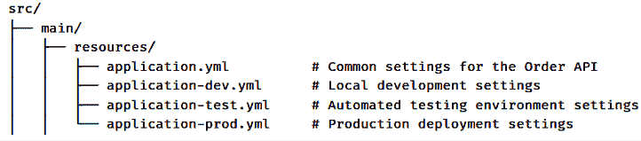
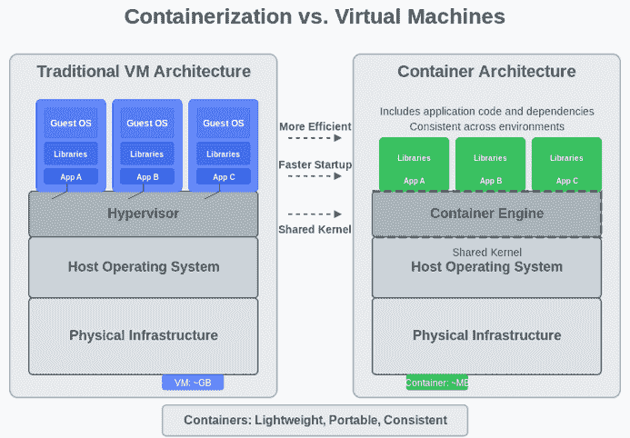
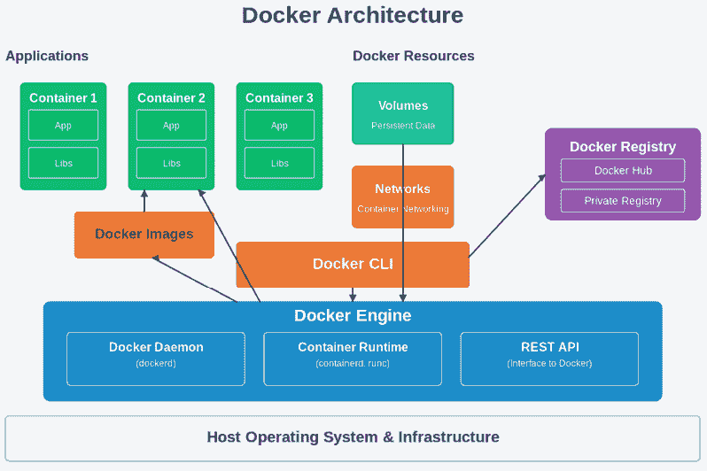
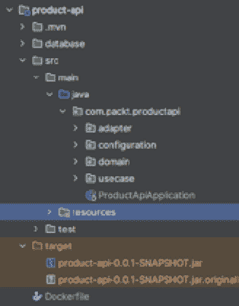

# 第十二章：部署 API

在我们掌握 Java RESTful API 的旅程中，我们已经探索了开发的各种关键方面。从编写高效的代码到实施稳健的设计原则和遵循行业最佳实践，我们为创建高质量的 API 奠定了坚实的基础。然而，交付生产就绪软件的道路并不仅限于开发本身。

虽然我们对 API 开发的积累知识非常有价值，但它仅代表完整软件交付生命周期的一部分。开发与生产部署之间的关键桥梁仍需跨越。这一最终阶段——部署过程——将我们精心打造的 API 转化为一个生产就绪的服务，为最终用户提供真实的价值。

为了这个目的，我们将涵盖以下主题：

+   准备 API 进行部署

+   容器化

+   **平台即服务**（**PaaS**）

+   部署最佳实践和模式

+   实际示例贯穿始终

# 准备 API 进行部署

在将您的 RESTful API 部署到生产环境之前，您需要完成几个重要的准备步骤。这些准备确保您的 API 将在生产环境中正常运行、安全可靠。

在本节中，我们将介绍使您的 Java API 为部署做好准备的一些关键要素。首先，我们将检查配置管理——如何构建您的应用程序设置以在不同环境中工作而无需更改代码。然后，我们将讨论实施健康检查，以监控 API 的状态并帮助维护系统可靠性。

这些准备步骤构成了成功部署流程的基础。它们有助于防止常见问题，并为您的 API 在生产环境中提供一个稳定的平台。通过遵循这些实践，您将减少部署问题，并使您的 API 在扩展时更容易维护。

现在，让我们详细探讨这些准备元素，从有效的配置管理开始。

## 配置管理

在现代 RESTful API 开发中，适当的配置管理对于维护灵活、安全和可维护的应用至关重要。在本节中，我们将探讨配置管理的各个方面及其益处。

### 外部化配置

外部化配置将应用程序的核心功能与其配置设置分离，避免了在代码中放置硬编码配置的必要性。这种方法允许您在不更改代码的情况下修改应用程序设置。通过将配置数据保留在代码库之外，您可以轻松调整特定于环境的设置，例如数据库 URL、安全密钥或 API 端点，而无需重新编译或重新部署您的应用程序。

例如，使用 Spring Boot，您可以通过在外部`Properties`或 YAML 文件中定义属性来外部化配置，而不是在 Java 代码中硬编码它们。要在 Spring Boot 应用程序中外部化配置并将其绑定到 Java 类，请按照以下步骤操作：

1.  创建一个外部配置文件（`application.yml`）：

    ```java
    server:
        port: 8080
    spring:
        datasource:
            url: jdbc:postgresql://localhost:5432/mydatabase
            username: myuser
            password: mypassword
    api:
        timeout: 30 
    ```

1.  使用`application.yml`中的应用程序配置：

    ```java
    @Configuration
    @ConfigurationProperties(prefix = "api")
    public class ApiProperties {
      @NotNull(message = "Timeout value is required")
      @Min(value = 1, message = "Timeout must be at least 1 second")
      private Integer timeout;
      // Getter and Setter
      public Integer getTimeout() {
        return timeout;
      }
      public void setTimeout(Integer timeout) {
        this.timeout = timeout;
      }
    } 
    ```

在这个例子中，API 超时设置在`application.yml`文件中进行了外部化。`ApiProperties`类绑定到`"api"`部分，确保对配置文件的任何更改（如调整超时）都将生效，而无需修改应用程序代码。

这种方法在部署期间促进了灵活性和敏捷性，使得可以根据部署环境快速调整配置值。

#### 外部化配置的好处

将配置与您的应用程序代码分离是现代软件架构中的基础最佳实践，尤其是对于必须在各种环境中运行的 RESTful API。通过外部化配置，开发团队在应用程序的部署、安全性和维护整个生命周期中获得了巨大的灵活性。这种方法从根本上改变了我们管理应用程序设置的方式，从源代码中嵌入的硬编码值转变为动态的、特定于环境的变量，这些变量可以在不重新编译的情况下进行修改。这种方法的战略优势贯穿于您的开发和运营流程的多个维度：

+   **环境独立性**：开发者可以在不更改代码的情况下无缝地在不同环境之间进行切换。例如，您的订单 API 可以在开发期间连接到包含样本产品的测试产品目录，但在部署到生产环境时自动切换到包含真实库存的生产目录。这允许开发者使用测试数据本地创建和测试订单，而不会影响真实库存或向实际客户发送通知。

+   **简化维护**：运维团队获得在不需开发者干预的情况下修改应用程序行为的能力。例如，当您的产品 API 因新的高分辨率图片需要将产品图片缓存大小从 100 MB 增加到 500 MB 时，运维人员可以简单地更新外部化配置值，而不是请求代码更改和重新部署。同样，您的订单 API 中第三方物流提供商集成的超时设置可以根据其性能特征进行调整，而不需要开发团队的参与。

+   **增强安全性**：通过从源代码中移除敏感凭证，安全性得到了显著增强。例如，你可以在你的订单 API 代码中（它会在提交历史中保持可见）避免像这样硬编码支付网关 API 密钥 `paymentGateway.setApiKey("sk_live_51MlkA...")`，而是使用 `paymentGateway.setApiKey(environment.getProperty("payment.api.key"))` 并在环境变量中安全地存储实际密钥。这允许开发环境和生产环境使用不同的密钥，而不会暴露敏感凭证。

+   **更简单的 DevOps 集成**：外部化配置使持续集成和部署管道更加强大。例如，你可以使用不同的设置将相同的订单 API Docker 容器部署到测试和生产环境：

    ```java
    docker run -e "SPRING_PROFILES_ACTIVE=production" -e "PRODUCT_API_URL=https://product-api.example.com/v1"https://product-api.example.com/v1" -e "INVENTORY_CHECK_ENABLED=true" order-api-image. 
    ```

在测试环境中，你可能将 `INVENTORY_CHECK_ENABLED=false` 设置为跳过实际的库存验证，而在生产环境中启用它以防止缺货产品的订单。

正如我们所见，外部化配置为构建健壮、可维护和安全的 RESTful API 提供了关键优势。通过将配置与代码解耦，我们获得了在各个环境中部署、简化操作更新、增强安全性和简化 DevOps 流程的灵活性。现在让我们看看如何处理基于配置文件的配置，这将允许开发者具有灵活性和自动选择每个环境特定配置集的能力。

### 基于配置文件

当你在不同的环境中部署 RESTful API——从开发者的本地机器到测试服务器，最终到生产环境——管理特定环境的设置成为一个关键挑战。基于配置文件的配置提供了一个优雅的解决方案，它通过允许 API 根据其运行位置调整其行为，直接解决了部署复杂性，而无需更改任何代码行。

对于你的订单 API 和产品 API，这种方法意味着你可以在保持单一代码库和部署工件的同时，根据目标环境自动调整关键设置，如数据库连接、外部服务端点、安全参数和功能开关。这种能力简化了你的 CI/CD 管道，并大大减少了与配置相关的部署故障。

#### 常见配置文件

假设你的订单 API 需要在不同的环境中使用不同的数据库连接和行为设置。你可以按照以下方式结构化你的配置文件：

+   **开发**：在开发环境（通常称为“开发”配置文件）中，开发者专注于在本地或共享开发服务器上编写和测试代码。这个软件生命周期阶段通常看到非常频繁的代码更改、持续的实验和快速部署。由于可靠性尚未成为关键，开发者通常使用轻量级数据库，如 H2 或其他嵌入式选项，并可能依赖模拟服务来替代外部依赖。启用了详尽的日志记录，以便可以快速诊断任何问题，并提高调试功能以获得对代码的更深入了解。由于没有涉及实际客户数据且不处理真实交易，这个阶段对业务的风险最小。一个实际的订单 API 示例可能包括运行内存数据库以加快本地测试，调用本地运行的产品 API 实例，并模拟支付和物流服务以加快速度，而无需等待真实集成。

+   **测试**：当需要验证所有组件无缝协作时，与“测试”配置文件对齐的测试环境就发挥作用了。这个环境通常比开发环境更稳定，因为变更引入的频率较低，且通常更加精细。它通过利用类似真实世界条件的数据库和外部服务配置来更接近生产环境，同时仍然使用测试数据。在整个这个阶段，团队执行集成测试、自动化用户界面测试、性能验证和其他检查，以确保系统按预期运行。在这里，订单 API 可能连接到一个专用的测试 MySQL 版本来管理订单，调用产品 API 的测试实例，并通过测试物流服务端点生成物流标签。为了防止实际收费，支付通常由模拟网关处理。这个受控环境允许质量保证团队和自动化管道验证完整的工作流程，而不会危及真实客户数据或产生不必要的成本。

+   **生产环境**：一旦应用程序通过了所有必要的检查，它就会升级到生产环境——通常被称为“prod”配置文件。在这个实时环境中，您的 API 为真实用户提供服务并处理现实世界的交互。上线时间、安全和性能变得至关重要。在这里运行的代码经过彻底测试，并且通常更改频率较低，因为稳定性比快速迭代更重要。生产环境中的订单 API 将连接到强大、安全且通常集群化的数据库，这些数据库旨在处理大规模交易，同时与真实的第三方服务（如真实支付提供商和运输承运人）集成。日志被精心管理，以收集必要的信息，同时不会对性能产生不利影响。鉴于高风险和真实客户数据，异步订单履行通常被采用，以确保在重负载下可靠的处理。这个环境需要密切监控和对任何问题的快速响应，以保持无缝的客户体验。

我们可以在 Spring Boot 中表达这种结构。为了利用这种方法，我们需要组织每个环境中使用的所有变量，这些变量以文件的环境名称后缀命名，如下所示：



图 12.1 – 基于 Spring 配置文件的文件结构

#### 部署期间激活配置文件

当您将订单 API 部署到不同的环境时，您可以通过环境变量或命令行参数激活适当的配置文件：

+   **本地开发** :

    ```java
    # Developer's local machine
    java -jar order-api.jar --spring.profiles.active=dev 
    ```

+   **自动化测试环境** :

    ```java
    # In your CI/CD pipeline's test stage
    export SPRING_PROFILES_ACTIVE=test
    java -jar order-api.jar 
    ```

+   **使用 Docker 进行生产部署** :

    ```java
    # In your production deployment script
    docker run -e "SPRING_PROFILES_ACTIVE=prod" -p 8080:8080 order-api:latest 
    ```

这种方法确保当您的订单 API 部署到生产环境时，它会自动连接到生产数据库，使用实时支付网关，与生产产品 API 实例通信，并应用适当的性能和安全设置——所有这些都不需要任何代码更改或手动配置步骤。

基于配置文件的配置直接解决了在多个环境中部署相同 API 的挑战，使您的部署过程更加可靠、可维护，并能够适应不断变化的基础设施需求。

### 环境变量

环境变量提供了一种安全且灵活的方式来管理配置值，特别是对于敏感数据。当您部署 API 时，您可以将敏感配置，如数据库凭据、API 密钥和服务端点，作为服务器上的环境变量设置。这种方法将关键信息从代码库中移除，同时在运行时使应用程序能够访问这些信息。

在 Spring Boot 应用程序中，利用环境变量的最优雅方式是通过`application.yml`文件，您可以直接在配置中引用这些变量：

```java
# application.yml
spring:
    datasource:
        url:      ${DB_URL:jdbc:mysql://localhost:3306/orderdb}
    username: ${DB_USERNAME:dev_user}
    password: ${DB_PASSWORD:dev_password}
payment:
    gateway:
        api-key: ${PAYMENT_API_KEY:sandbox_key}
        timeout: ${PAYMENT_TIMEOUT:30}
product-service:
    url: ${PRODUCT_SERVICE_URL:http://localhost:8081/api/products}
    cache-size: ${PRODUCT_CACHE_SIZE:100} 
```

在审查我们的示例时，您可能已经注意到，基于配置文件和环境变量部分都使用了`application.yml`文件，但它们代表了不同的配置管理方法。在外部化配置示例中，我们专注于为不同的环境（如`application-dev.yml`和`application-prod.yml`）创建单独的物理配置文件，Spring Boot 根据活动配置文件加载这些文件。相比之下，环境变量方法在单个配置文件中使用占位符语法`${VARIABLE_NAME:default_value}`，在运行时动态注入值。这种区别很重要：基于文件的外部化需要为每个环境管理完整的配置文件，并在部署应用程序时部署正确的文件，而环境变量允许您维护单个配置模板，其中仅在运行时通过您的部署平台覆盖特定值。环境变量方法在容器化环境（如 Docker 和云平台）中提供了更大的灵活性，简化了秘密管理集成，并允许在不替换整个文件的情况下进行细粒度的配置更新。许多生产系统同时利用这两种模式——使用特定配置文件的文件来处理环境之间的实质性配置差异，同时使用环境变量来处理敏感凭证和经常更改的值。这种混合方法使开发团队能够在统一框架内处理结构配置差异和动态值注入。

## 健康检查实施

健康检查对于监控您的 API 的运行状态至关重要。它们允许您验证在检查点之后，您的应用程序正在运行并准备好响应请求。实施健康检查可以帮助您在问题影响用户之前发现它们，从而实现主动维护和快速恢复。

考虑这个真实场景：一家电子商务公司在周五下午部署了其订单管理 API 的新版本。部署看起来很成功——所有服务都启动无误，初步的手动测试也通过了。然而，到了周一早上，客户服务团队收到了大量关于订单缺失和库存差异的投诉。调查发现，尽管 API 在技术上正在运行，但由于配置问题，它无法正确连接到产品库存数据库。

在没有适当的健康检查的情况下，尽管存在这种关键故障，部署仍被视为成功。健康检查充当您应用程序的生命体征监控系统——就像医生检查您的脉搏、血压和体温以评估您的整体健康状况一样。对于容器化应用程序尤其如此，这些检查至关重要，因为它们会告知编排工具您的容器是否应该接收流量、重启或完全替换。一个设计良好的健康检查系统可以区分暂时性故障和严重故障，防止不必要的重启，同时确保真正的问题得到及时解决。

对于我们的订单管理和产品 API，实施全面的健康检查意味着我们可以自信地自动化部署，因为我们知道我们的监控将捕获可能否则未被检测到的问题，直到客户受到影响。让我们探讨如何在我们的应用程序中实施这些关键的安全措施。

### 案例场景：周末系统维护

想象以下场景：您的团队在周六早上进行常规数据库维护。维护完成后，所有服务似乎都正常重启。然而，如果没有适当的健康检查，您可能直到周一才会发现，尽管应用程序正在运行，但它无法正确连接到数据库。这会导致订单丢失和客户不满。

通过有效的健康检查，您会立即知道维护后数据库连接是否已正确恢复，这样您就可以在这些问题影响业务运营之前修复它们。

### 使用 Spring Boot Actuator 实现基本健康检查

对于我们的订单管理和产品 API，让我们实施一个简单但有效的健康检查系统：

```java
<dependency>
    <groupId>org.springframework.boot</groupId>
    <artifactId>spring-boot-starter-actuator</artifactId>
</dependency> 
```

将此依赖项添加到您的项目中后，Spring Boot 会自动公开一个`/actuator/health`端点，该端点返回应用程序的状态。

### 订单管理的自定义健康指标

让我们为我们的订单存储库创建一个简单的健康检查：

```java
@Component
public class OrderRepositoryHealthIndicator implements HealthIndicator {
    private final OrderRepository orderRepository;
    public OrderRepositoryHealthIndicator(OrderRepository orderRepository) {
        this.orderRepository = orderRepository;
    }
    @Override
    public Health health() {
        try {
            // Simple query to check database connectivity
            orderRepository.count();
            return Health.up().build();
        } catch (Exception e) {
            return Health.down()
                    .withDetail("error", e.getMessage())
                    .build();
        }
    }
} 
```

类似地，为产品创建一个健康检查：

```java
@Component
public class ProductRepositoryHealthIndicator implements HealthIndicator {
    private final ProductRepository productRepository;

    // Similar implementation to check product repository connectivity
} 
```

### 多级健康检查

对于我们的订单管理和产品 API，实施多级健康检查有助于区分不同的操作状态。

#### 活跃性检查

活跃性检查回答一个简单的问题：“应用程序是否正在运行？”这些检查应该是轻量级的，并避免依赖于外部系统：

```java
@Component
public class LivenessHealthIndicator implements HealthIndicator {

    @Override
    public Health health () {
        // Simple check to verify application is running
        // Should always succeed unless the application is truly dead
        return Health.up().build();
    }
} 
```

在您的`application.yml`文件中配置此内容：

```java
management:
  endpoint:
    health:
      group:
        liveness:
          include: livenessState,diskSpace 
```

#### 准备就绪检查

准备就绪检查回答：“应用程序能否接受和处理请求？”这些检查应验证外部依赖项：

```java
@Component
public class ReadinessHealthIndicator implements ReadinessIndicator {
    private final OrderRepositoryHealthIndicator orderRepoHealth;
    private final ProductRepositoryHealthIndicator productRepoHealth;

    public ReadinessHealthIndicator(
            OrderRepositoryHealthIndicator orderRepoHealth,
            ProductRepositoryHealthIndicator productRepoHealth) {
        this.orderRepoHealth = orderRepoHealth;
        this.productRepoHealth = productRepoHealth;
    }

    @Override
    public Health health() {
        Health orderHealth = orderRepoHealth.health();
        Health productHealth = productRepoHealth.health();

        if (Status.UP.equals(orderHealth.getStatus()) &&
            Status.UP.equals(productHealth.getStatus())) {
            return Health.up().build();
        }

        return Health.down()
                .withDetail("orderRepository", orderHealth.getStatus())
                .withDetail("productRepository",productHealth.getStatus())
                .build();
    }
} 
```

在`application.yml`中配置此内容：

```java
management:
  endpoint:
    health:
      group:
        readiness:
          include: readinessState,db,orderRepository,productRepository 
```

#### 组件健康检查

组件健康检查提供了您系统特定部分的详细状态：

```java
@Component
public class InventoryHealthIndicator implements HealthIndicator {

    private final ProductService productService;

    public InventoryHealthIndicator(ProductService productService) {
        this.productService = productService;
    }

    @Override
    public Health health() {
        try {
            // Check if inventory system is functioning
            boolean inventoryStatus = productService.
                checkInventoryStatus();
            if (inventoryStatus) {
                return Health.up()
                        .withDetail("inventorySystem", "operational")
                        .withDetail("lastSyncTime", new Date())
                        .build();
            } else {
                return Health.down()
                        .withDetail("inventorySystem", "degraded")
                        .build();
            }
        } catch (Exception e) {
            return Health.down()
                    .withDetail("inventorySystem", "error")
                    .withDetail("message", e.getMessage())
                    .build();
        }
    }
} 
```

### 多级健康检查的实际应用

定义了这些级别后，您可以使用它们用于不同的目的：

+   **活跃性检查**：由 Docker 用于确定容器是否应该重启

+   **就绪性检查**：用于确定 API 是否可以接收流量

+   **组件检查**：由操作员用于诊断特定系统问题

更新您的 Docker Compose 配置以使用这些特定的端点：

```java
version: ‘3’
services:
  order-api:
    build: .
    ports:
      - “8080:8080”
    healthcheck:
      test: [“CMD”, “curl”, “-f”, 
             “http://localhost:8080/actuator/health/liveness”]
      interval: 30s
      timeout: 10s
      retries: 3
      start_period: 40s
    depends_on:
      database:
        condition: service_healthy 
```

#### 在 application.properties 中进行基本配置

配置健康检查端点：

```java
# Enable health endpoint
management.endpoints.web.exposure.include=health,info
# Show health details
management.endpoint.health.show-details=when_authorized
# Enable health groups
management.endpoint.health.group.liveness.include=livenessState
management.endpoint.health.group.readiness.include=readinessState,db,orderRepository,productRepository 
```

虽然健康检查提供了对应用程序操作状态的必要可见性，但当它们与现代部署方法集成时，它们变得更加强大。现在我们已经为我们的订单管理和产品 API 建立了稳健的健康监控，下一步合乎逻辑的步骤是以一种可以利用这些健康检查的有效方式打包我们的应用程序。

容器化是我们健康检查策略的完美补充。通过将我们的应用程序及其依赖项封装在轻量级、可移植的容器中，我们可以在不同环境中确保一致的行为，同时充分利用我们的监控能力。Docker 容器可以根据我们的健康检查结果自动重启，为服务中断提供第一道防线。

在下一节中，我们将探讨如何使用 Docker 容器化我们的订单管理和产品 API，创建一个确保我们的应用程序在任何环境中可靠运行的部署管道。我们将看到我们的健康检查如何与 Docker 内置的监控无缝集成，创建一个可以自动检测和从许多常见故障场景中恢复的自愈系统。

# 容器化

**容器化**通过提供一种打包应用程序及其所有依赖项的方法，彻底改变了应用程序的部署方式。这确保了应用程序在不同环境中的一致运行，无论是开发、测试还是生产。与传统**虚拟机**（**VMs**）不同，容器共享宿主操作系统的内核，使它们轻量级且高效。

容器化彻底改变了我们在现代软件开发中部署和管理 API 的方式。其核心是，容器化是将应用程序及其所有依赖项——库、配置文件和运行时环境——打包成一个标准化的、自包含的单元，称为**容器**。这种方法解决了软件部署中最持久的挑战之一：“在我的机器上它运行正常，为什么在生产环境中不工作？”

这个过程有几个关键优势：

+   **可移植性**：应用程序可以在各种环境中无缝移动而无需修改

+   **可伸缩性**：容器可以根据需求快速扩展或缩减

+   **隔离**：每个容器独立运行，防止应用程序之间的冲突

+   **资源效率**：容器共享操作系统资源，比虚拟机更轻量级

+   **一致性**：开发人员和运维团队使用相同的环境

+   **快速部署**：新版本可以在几秒钟内部署，而不是几个小时或几天

+   **自愈**：失败的容器可以根据健康检查自动重启



图 12.2 – 容器化与虚拟机

### 容器的工作原理

容器将应用程序及其依赖项封装成一个单一单元，可以在任何地方执行，为各种系统提供一致的环境。它们通过利用宿主操作系统的内核同时保持与其他容器的隔离来实现这一点。这种隔离是通过 Linux 操作系统的命名空间和**控制组**（**cgroups**）实现的，它们提供以下功能：

+   **命名空间**：这些为容器创建单独的环境。每个容器都有自己的文件系统、**进程 ID**（**PID**）空间、用户 ID 和网络接口，防止它们相互干扰。

+   **控制组（cgroups）**：这些限制并优先处理容器的资源使用（CPU、内存和磁盘 I/O），确保没有单个容器可以垄断系统资源。

### 容器的层

容器是由镜像构建的，这些镜像由一系列层组成。每一层代表对基础镜像的更改或添加。这种分层架构提供了以下优势：

+   **共享层**：多个容器可以共享相同的底层层，减少磁盘空间使用并加快部署

+   **版本控制**：每个层都可以进行版本控制，允许轻松回滚到应用程序的先前版本

+   **高效构建**：当构建新的镜像时，Docker 使用缓存机制仅重建已更改的层，从而实现更快的构建时间

### 常见的容器化工具

可用于容器化的工具有多种，每种工具都有其独特的功能和优势。以下是一些最常见的工具：

+   **Docker**：目前最受欢迎的容器化平台，Docker 提供了一套全面的工具，用于构建、管理和运行容器。它简化了整个容器生命周期，并拥有庞大的社区支持和资源生态系统。

+   **Kubernetes**：虽然 Kubernetes 本身不是容器化工具，但它是一个强大的编排平台，可以大规模管理容器化应用程序，自动化应用程序的部署、扩展和操作。

+   **OpenShift**：基于 Kubernetes，OpenShift 为企业环境添加了额外的功能和工具，为开发者提供 PaaS 体验。

+   **Podman**：Docker 的替代品，允许在不需要守护进程的情况下进行容器管理。Podman 提供了与 Docker 类似的命令行界面，使用户过渡变得容易。

+   **Rancher**：一个完整的容器管理平台，使得部署和管理多个 Kubernetes 集群变得容易。

对于本章，我们将主要关注 Docker，因为它是目前最广泛采用的容器化解决方案。其易用性、广泛的文档和活跃的社区使其成为希望在其项目中实现容器化的开发人员的理想选择。

Docker 镜像的典型结构如下：

+   **基础层**：镜像的基础，例如操作系统或运行时

+   **应用层**：在基础层之上添加的实际应用程序代码和依赖项

+   **配置层**：在 Dockerfile 中指定的任何附加配置或环境变量

#### Docker 架构

要完全理解容器化，我们必须探索最广泛使用的容器化平台 Docker 的架构。Docker 在客户端-服务器架构上运行，该架构由几个关键组件组成：

+   **Docker 引擎**：这是允许用户构建、运行和管理容器的核心组件。它包括在后台运行的 **Docker 守护进程**（ **dockerd** ），它管理镜像、容器、网络和存储，以及 Docker 的 **命令行界面**（ **CLI** ），它允许用户与 Docker 守护进程交互。

+   **Docker 组件**：

    +   **镜像**：用于创建容器的不可变模板

    +   **容器**：Docker 镜像的运行实例

    +   **卷**：容器的持久化存储

    +   **网络**：使容器和外部服务之间能够通信

    +   **注册表**：用于存储和分发 Docker 镜像的仓库，例如 Docker Hub

+   **Docker 工作流程**：工作流程从开发人员创建 Dockerfile 开始，该文件定义了应用程序环境。Docker 引擎从这个 Dockerfile 构建一个镜像，然后将其存储在注册表中。从镜像实例化一个容器，容器运行并提供应用程序服务。



图 12.3 – Docker 架构

*图 12.3* 中的图示展示了我们刚刚描述的 Docker 架构，展示了各种组件如何相互作用以创建我们的容器运行的环境。理解这个架构对于我们进一步将订单管理 API 容器化至关重要。该图显示了 Docker 的分层结构，从底部的宿主操作系统到顶部的单个容器，突出了 Docker 如何高效地管理资源，同时为应用程序提供隔离。让我们通过下一个主题中描述的方法，实现一个基于提供 **JRE (Java 运行时环境**) 的镜像创建 Docker 容器的示例。

## 示例：将 RESTful API 容器化

为了说明容器化过程，让我们考虑一个基于类似以下 GitHub 仓库的 RESTful API 的实际示例：*RESTful API 书籍示例*。此示例将指导你完成创建 Java/Maven 基础 RESTful API 的 Docker 容器的步骤。

### 第 1 步：项目结构

首先，确保你的项目结构正确。基于 Java/Maven 的 RESTful API 的典型结构可能如下所示：



图 12.4 – product-api 目录结构

关于结构，以下是一些关键点：

+   包含 JAR 文件的 `target/` 文件夹

+   在 `src/main/java/` 下的主要源结构

+   根目录下的 Dockerfile

在接下来的步骤中，我们将创建 Dockerfile 并运行需要我们在此处展示的 *图 12.4* 中的结构的命令。

### 第 2 步：创建 Dockerfile

在你的项目目录根目录下，创建一个名为 `Dockerfile` 的文件，内容如下：

```java
 # Use an official OpenJDK runtime as a base image
FROM openjdk:21-jdk-slim
 # Set the working directory inside the container
WORKDIR /app
 # Copy the Maven build artifact into the container
COPY target/product-api-0.0.1-SNAPSHOT.jar app.jar
 # Expose the application port
EXPOSE 8080
 # Define the command to run the application
ENTRYPOINT ["java", "-jar", "app.jar"] 
```

### 第 3 步：构建 Docker 镜像

在构建镜像之前，确保你的项目已正确打包。如果你使用 Maven，可以通过运行以下命令来构建 JAR 文件：

```java
mvn clean package 
```

构建完成后，你可以使用以下命令创建 Docker 镜像：

```java
docker build -t my-restful-api . 
```

`-t` 标志将镜像标记为 `my-restful-api` 名称。

### 第 4 步：运行 Docker 容器

现在你已经构建了 Docker 镜像，你可以从它运行一个容器：

```java
docker run -d -p 8080:8080 --name restful-api-container my-restful-api 
```

让我们分解这个命令：

+   `-d` 以分离模式（在后台）运行容器

+   `-p 8080:8080` 将主机上的端口 `8080` 映射到容器中的端口 `8080`

+   `--name restful-api-container` 为容器分配一个名称，以便更容易管理

### 第 5 步：测试 API

容器启动后，你可以通过向其发送请求来测试 API。打开你的网页浏览器或使用 `curl` 或 Postman 等工具发送请求：

```java
curl http://localhost:8080/api/endpoint 
```

将 `/api/endpoint` 替换为你想要测试的实际端点。如果一切设置正确，你应该会收到来自你的 API 的响应。

### 容器部署的最佳实践

为了确保有效的容器部署，遵循最佳实践至关重要：

+   **优化镜像大小**：使用轻量级的基础镜像，如 `alpine` 或 `openjdk:21-slim`，以最小化最终镜像大小

+   **最小化层**：在 Dockerfile 中将多个命令合并为一个 `RUN` 命令，以减少镜像中的层数

+   **使用多阶段构建**：在一个阶段构建应用程序，并将必要的工件复制到最终镜像中，以减少整体大小

+   **实现健康检查**：使用 Docker 的 `HEALTHCHECK` 功能来确保容器化应用程序正常运行

+   **确保镜像安全**：使用 Trivy 或 Docker Scout 等工具定期扫描镜像以查找漏洞，以维护安全标准

### 挑战和考虑因素

虽然 Docker 简化了部署，但也带来了需要解决的问题：

+   **安全漏洞**：镜像可能包含需要主动管理的漏洞。

+   **网络复杂性**：理解和配置容器网络可能很复杂，需要周密规划。

+   **存储管理**：在容器化环境中，正确管理持久数据可能带来挑战。

+   **监控和日志记录**：集成监控和日志记录解决方案对于保持对容器性能的可见性至关重要。

+   **云特定要求**：每个云提供商对容器编排的实现方式不同，拥有独特的服务和配置。仅就 AWS 生态系统而言，有效的容器部署需要熟悉多个相互关联的服务，如 ECR、ECS/EKS、IAM 角色、VPC 网络和负载均衡。虽然本章介绍了容器化的基础知识，但针对特定提供商的部署工作流的全面覆盖将超出我们的范围。前面的示例提供了一个实用的起点，但生产部署通常需要更深入的平台特定知识和专业技能。组织通常开发专门的 DevOps 团队，专注于这些部署管道和基础设施管理问题。

容器化技术使得现代的、可扩展的以及可移植的 API 部署成为可能。通过理解 Docker 的架构、镜像生命周期和最佳实践，开发者可以高效地在云和本地环境中部署 RESTful API。这种基础性知识使你具备应对现代部署策略复杂性的技能。

在下一节中，我们将使用 AWS Elastic Beanstalk 探索**平台即服务**（**PaaS**），这是一个用于部署和管理容器化应用程序的企业级平台。

# PaaS

PaaS 代表了一种云计算模型，它为开发者提供了一个完整的平台——包括硬件、软件和基础设施——以便在不涉及构建和维护通常与这些过程相关的基础设施复杂性的情况下开发、部署和管理应用程序。

在云计算服务的这一演变过程中，PaaS 位于仅提供基本计算基础设施的**基础设施即服务**（**IaaS**）和提供现成应用程序的**软件即服务**（**SaaS**）之间。这种便利性使得 PaaS 对于专注于创建和部署应用程序而不是管理服务器和基础设施的开发团队尤其有价值。

## PaaS 的关键组件

一个典型的 PaaS 服务包括以下内容：

+   **运行时环境**：预配置的平台，你的应用程序在此运行

+   **开发工具**：集成开发环境、调试工具和版本控制系统

+   **中间件**：数据库管理系统、应用服务器和消息队列

+   **操作系统**：由提供商管理，并定期更新以保障安全

+   **网络基础设施**：负载均衡器、防火墙和安全功能

+   **扩展能力**：自动或手动扩展选项以处理流量波动

## PaaS 在 API 部署中的优势

对于 RESTful API 开发者，PaaS 提供了几个重要的优势：

+   **减少的开发时间**：通过消除基础设施设置和管理任务，开发者可以专注于 API 开发，显著缩短上市时间

+   **简化的部署管道**：大多数 PaaS 提供商提供集成的 CI/CD 功能或与流行的 CI/CD 工具的无缝集成，简化了部署过程

+   **内置的可扩展性**：API 可以水平或垂直扩展，配置最小化，适应流量高峰而不会降低性能

+   **增强的安全性**：PaaS 提供商实施强大的安全措施，包括定期更新、加密和合规认证，减轻了开发团队的安全负担

+   **全球可用性**：领先的 PaaS 提供商在全球运营数据中心，使得 API 的部署更靠近终端用户，从而提高性能

## Java 应用程序的常见 PaaS 提供商

几个 PaaS 提供商为基于 Java/Maven 的 RESTful API 提供出色的支持：

+   **AWS Elastic Beanstalk**：亚马逊的 PaaS 解决方案，简化了在 AWS 基础设施上部署 Java 应用程序的过程

+   **Microsoft Azure App Service**：提供构建、部署和扩展 Java Web 应用程序的托管平台

+   **Google App Engine**：谷歌的 PaaS 服务，针对 Java 应用程序提供特定支持

+   **Heroku**：支持多种编程语言（包括 Java）的云平台

+   **Red Hat OpenShift**：一个具有强大 Java 支持的 Kubernetes 企业平台

## PaaS 与传统的部署方式比较

与传统的本地部署或基本 IaaS 解决方案相比，PaaS 提供以下优势：

| **功能** | **传统部署** | **PaaS** |
| --- | --- | --- |
| 基础设施管理 | 手动，耗时 | 自动，最小化努力 |
| 扩展 | 复杂，需要规划 | 简单，通常自动 |
| 更新和补丁 | 手动过程 | 由提供商管理 |
| 开发重点 | 代码和基础设施之间的分割 | 主要在应用代码上 |
| 上市时间 | 较长 | 显著缩短 |
| 初始成本 | 高 | 低 |

表 12.1 – 传统部署与 PaaS 对比

## 选择 PaaS 时的考虑因素

虽然 PaaS 提供了许多好处，但在采用之前，开发者应考虑几个因素：

+   **供应商锁定**：依赖供应商特定的功能可能会使未来的迁移复杂化。这一考虑因素至关重要，因为许多 PaaS 供应商提供专有服务和工具，这些服务和工具可以显著提高您的 API 开发效率——但代价不菲。例如，如果您与 AWS Elastic Beanstalk 的特定部署机制或 Azure App Service 的内置身份验证功能深度集成，您可能会发现您的应用程序变得与该平台紧密耦合。如果业务需求发生变化或定价结构变得不利，迁移到另一个供应商可能需要大量的代码重构和架构变更。为了降低这种风险，考虑实现针对特定供应商服务的抽象层，并维护基础设施即代码，以便适应不同的环境。

+   **定制限制**：对底层基础设施的控制较少可能会影响特定的优化需求。这对于具有独特性能配置文件或安全要求的 API 尤其相关。虽然 PaaS 平台自动处理大多数基础设施问题，但这种便利性伴随着灵活性的降低。例如，如果您的订单管理 API 需要特定的数据库配置来高效处理复杂的库存查询，或者需要自定义网络设置以与旧系统交互，PaaS 解决方案可能不允许这些细粒度的调整。组织应仔细评估其 API 需求是否在 PaaS 平台允许的参数范围内，或者是否需要通过 IaaS 或容器编排来获得更多控制。

+   **合规要求**：确保 PaaS 供应商符合您所在行业的监管标准对于许多行业来说是不可协商的。对于一个处理客户信息和支付数据的订单管理系统，遵守 PCI DSS、GDPR 或 HIPAA 等标准可能是强制性的。并非所有 PaaS 供应商都提供相同级别的合规认证或安全控制。一些可能提供全面的合规文档和内置控制，而另一些可能将更多责任留给开发者。在将您的业务关键 API 提交给其平台之前，彻底调查供应商的合规服务、数据驻留选项和安全实践。

+   **成本结构**：了解定价模型对于避免随着 API 使用量的增长而出现意外费用至关重要。PaaS 平台通常根据资源消耗——CPU 使用率、内存分配、存储和数据传输——来收费。对于可能经历季节性波动的订单管理 API（例如假日购物期间），成本可能会大幅波动。一些提供商提供自动扩展功能，可以根据需求自动调整资源，这可能是高效的，但如果配置不当，也可能非常昂贵。仔细分析定价结构，设置资源使用的监控和警报，并考虑实施成本优化策略，如非生产环境中的资源调度。

+   **性能需求**：评估 PaaS 是否能够满足您的特定性能要求对于维持用户满意度至关重要。在高峰期间，您的订单管理 API 可能需要处理数千个并发请求，同时保持库存检查和订单处理的低延迟。不同的 PaaS 提供商提供不同级别的性能能力，从基本的共享环境到专用的 premium 级别。考虑以下方面：数据中心的地域分布（以减少全球客户的延迟）、可用的实例大小、数据库性能选项和缓存能力。在完全承诺于某个提供商之前，对所选平台进行负载测试，以验证其是否能够处理您预期的流量模式。

通过在您特定的 API 需求背景下彻底评估这些考虑因素，您可以做出明智的决定，关于 PaaS 是否是您项目的正确方法，如果是的话，哪个提供商最适合您的需求。

经过仔细评估我们刚才讨论的考虑因素——供应商锁定、定制限制、合规要求、成本结构和性能需求——我们选择了 AWS Elastic Beanstalk 作为我们的实际示例。这个选择在抽象和控制之间提供了极佳的平衡，使其非常适合演示我们的订单管理和产品 API 的 PaaS 部署。

此外，我对 AWS 的深入了解使我能够分享超越理论实现的实用见解，帮助您导航在部署自己的订单管理 API 时可能出现的潜在挑战。

现在我们来详细说明如何在 AWS Elastic Beanstalk 上部署我们的 Java RESTful API，展示这些考虑因素如何转化为实际实施决策。

## 实际示例：在 AWS Elastic Beanstalk 上部署 RESTful API

让我们详细说明如何在 AWS Elastic Beanstalk 上部署一个 Java RESTful API。此示例假设您有一个准备就绪的 Spring Boot 应用程序等待部署。

第一步涉及准备您的应用程序。首先，确保您的应用程序已正确打包：

```java
# Build your application with Maven
mvn clean package 
```

这将在目标目录中创建一个 JAR 文件。对于 Elastic Beanstalk 部署，此 JAR 应该是一个包含嵌入式服务器的自包含文件。

接下来，您需要设置 AWS **Elastic Beanstalk**（**EB**）环境。安装 AWS CLI 和 EB CLI：

```java
pip install awscli awsebcli 
```

然后，在您的项目中初始化 EB CLI。导航到您的项目根目录并运行以下命令：

```java
eb init 
```

这将启动一个交互式设置，您需要执行以下操作：

+   选择区域

+   创建或选择 AWS 凭证配置文件

+   输入应用程序名称

+   选择 Java 作为平台

+   选择 Java 版本

+   设置实例访问的 SSH（可选）

+   要创建环境，请使用以下命令：

```java
eb create my-api-environment 
```

此命令会触发几个过程：

+   创建一个名为`my-api-environment`的环境

+   设置必要的 AWS 资源（EC2 实例、负载均衡器等）

+   部署您的应用程序

+   配置健康监控

在创建过程中，您还可以指定以下内容：

+   环境类型（负载均衡或单实例）

+   实例类型

+   用于 SSH 访问的 EC2 密钥对

+   VPC 设置

下一步是应用程序配置。在您的项目根目录中创建一个名为`.ebextensions/java-options.config`的文件：

```java
option_settings:
    aws:elasticbeanstalk:application:environment:
        SPRING_PROFILES_ACTIVE: production
        API_TIMEOUT: 30
        LOGGING_LEVEL_ROOT: INFO
    aws:elasticbeanstalk:container:java:
        JVM Options: -Xms256m -Xmx1024m
    aws:autoscaling:asg:
        MinSize: 2
        MaxSize: 4
    aws:elasticbeanstalk:environment:
        ServiceRole: aws-elasticbeanstalk-service-role 
```

此配置设置以下内容：

+   应用程序的环境变量

+   JVM 内存设置

+   自动扩展参数

+   环境服务角色

在对您的应用程序进行更改后，使用以下命令部署更新：

```java
mvn clean package
eb deploy 
```

EB CLI 将自动上传新版本并执行滚动更新。

最后，您需要监控您的应用程序。通过以下方式访问监控数据：

```java
eb health 
```

或者通过 AWS 管理控制台查看详细的指标和日志：

1.  导航到 Elastic Beanstalk。

1.  选择您的环境。

1.  点击**监控**选项卡。

1.  通过**日志**部分查看日志。

### AWS Elastic Beanstalk（EB）的优势和劣势

AWS Elastic Beanstalk 是一种服务，通过为您处理基础设施工作，使部署应用程序变得更加容易。当您上传代码时，Elastic Beanstalk 会自动设置服务器、负载均衡器和监控，而无需您手动配置这些组件。

这种方法介于两个极端之间：完全托管的服务，您几乎没有控制权，以及需要深入了解基础设施知识的手动服务器管理。Elastic Beanstalk 提供了一个平衡的解决方案，您可以专注于编写代码，同时当需要时仍可访问 AWS 功能。

然而，就像任何部署选项一样，Elastic Beanstalk 既有优点也有缺点。一些团队发现它非常适合他们的需求，而其他团队则发现它不符合他们的特定要求。了解这些优缺点将帮助您决定 Elastic Beanstalk 是否是您 RESTful API 项目的正确选择。

让我们探索 Elastic Beanstalk 的用途及其在 API 部署中可能存在的不足之处。

这里是优势：

+   **简化操作**：Elastic Beanstalk 将基础设施复杂性抽象化，自动处理配置、负载均衡、自动扩展和监控。这允许开发者专注于应用程序代码，而不是基础设施管理。

+   **集成开发工作流程**：EB CLI 为部署提供了一种简化的工作流程，使得您可以直接从开发环境轻松推送更新、监控健康状态和管理环境。

+   **AWS 服务集成**：Elastic Beanstalk 与以下 AWS 服务无缝集成：

    +   RDS 用于数据库管理

    +   CloudWatch 用于监控和警报

    +   S3 用于存储

    +   IAM 用于安全

    +   CloudFormation 用于基础设施定义

+   **平台灵活性**：虽然抽象化了复杂性，但 Elastic Beanstalk 仍然允许通过配置文件（`.ebextensions`）进行自定义，从而实现对环境的精细控制。

+   **版本控制和回滚**：平台维护已部署应用程序的版本，如果出现问题，可以轻松回滚到先前版本。

+   **成本管理**：您只需为底层资源（如 EC2 实例、负载均衡器等）付费，Elastic Beanstalk 本身无需额外费用。

现在，让我们看看其缺点：

+   **某些方面的控制有限**：虽然 Elastic Beanstalk 提供了自定义选项，但与直接 EC2 或基于容器的部署相比，您对某些基础设施方面的控制较少。

+   **部署延迟**：配置和部署过程可能需要几分钟，这可能比 ECS 或 EKS 等更专注于容器的服务要慢。

+   **冷启动**：新环境创建可能需要 5 到 10 分钟，因此对于临时或快速测试环境创建不太合适。

+   **配置复杂性**：随着应用程序变得更加复杂，管理 `.ebextensions` 文件可能会变得具有挑战性，可能导致配置漂移或不一致。

+   **供应商锁定风险**：对 Elastic Beanstalk 特定配置的重度依赖可能会使得将来迁移到其他平台变得具有挑战性。

+   **自定义容器限制**：虽然支持 Docker，但与 ECS 或 EKS 等专用容器服务相比，Elastic Beanstalk 在容器编排方面提供的灵活性较低。

+   **调试挑战**：当出现问题时，抽象层有时会使故障排除变得更加困难，需要更深入的了解 AWS 来诊断问题。

#### 选择 Elastic Beanstalk 的时机

Elastic Beanstalk 特别适合以下场景：

+   新接触 AWS 或云部署的团队

+   具有标准基础设施要求的应用程序

+   需要快速初始部署的项目

+   具有可预测扩展模式的 API

+   开发和测试环境

+   小型到中型开发团队

对于更复杂的架构、具有定制要求的微服务，或者需要精细粒度基础设施控制的应用程序，ECS、EKS 或直接 EC2 管理之类的解决方案可能更为合适。

## Elastic Beanstalk 部署的最佳实践

为了最大化 Elastic Beanstalk 的益处同时缓解其局限性，请遵循以下最佳实践：

+   **使用环境特定的配置文件**：为开发、预发布和生产环境维护单独的配置文件对于确保部署管道中的一致性和可靠性至关重要。当您的订单管理 API 在这些环境中移动时，会遇到不同的基础设施要求、安全需求和性能预期。通过创建环境特定的配置，您可以防止诸如在生产环境中暴露开发调试工具或在低层开发环境中过度使用生产规模资源等问题。这种做法也有助于简化故障排除，因为您可以确定问题是否特定于环境或固有的应用程序代码。

+   **实施蓝绿部署**：使用 Elastic Beanstalk 的**交换 URL**功能进行蓝绿部署允许您维护两个相同的生产环境，在切换流量之前先将新代码部署到非活动环境。这种方法对于您的订单管理 API 非常有价值，因为它消除了部署期间的停机时间——客户可以不间断地继续下订单。它还提供了一个即时回滚机制；如果在部署后发现关键问题，您可以立即切换回先前的环境。对于高可用性应用程序来说，这种做法尤为重要，因为即使是几分钟的停机时间也可能导致收入损失或损害客户信任。

+   **自动化部署**：通过 AWS CodePipeline 和 CodeBuild 与 CI/CD 管道集成，将您的部署过程从易出错的手动步骤转变为一致、可重复的工作流程。对于订单管理 API，这种自动化确保每次部署都遵循相同的测试、验证和部署序列。这减少了人为错误，在生产部署前强制执行质量关卡，并创建所有更改的审计记录。自动化部署还允许更频繁、更小的更新，降低每次部署的风险，同时允许您的团队更快地交付新功能和修复。

+   **监控资源使用情况**：设置 CloudWatch 警报以在资源消耗异常时发出警报，可以在问题影响客户之前提供早期预警。您的订单管理 API 的资源需求会随着业务周期波动——假日购物期间可能比正常情况下产生显著更高的订单量。如果没有适当的监控，这些峰值可能导致性能下降甚至中断。CloudWatch 警报允许您检测到趋势，例如逐渐增加的内存使用（可能表明内存泄漏）或特定操作期间的 CPU 峰值。这种做法使您能够做出主动的扩展决策，并帮助识别应用程序中的优化机会。

+   **实施适当的健康检查**：为您的 API 设计全面的健康检查端点不仅限于确认应用程序正在运行，它还验证了所有关键组件是否正常工作。对于一个订单管理系统来说，这可能包括检查数据库连接性、验证库存服务是否响应，以及确保支付处理系统可用。设计良好的健康检查允许 Elastic Beanstalk 在何时替换失败的实例以及何时将流量路由到健康的实例时做出准确的决策。这种做法直接影响可用性和弹性，防止了技术上“运行”但功能受损的实例继续接收客户流量。

+   **版本控制配置**：将`.ebextensions`文件保存在您的源代码存储库中确保了配置的一致性，并提供了与代码更改一起的基础设施更改的历史记录。这种做法防止了环境之间的配置漂移，并使得将应用程序问题与特定的基础设施更改相关联成为可能。对于您的订单管理 API 来说，这意味着您可以轻松地追踪订单处理问题是否在代码更改或基础设施配置更改之后开始。这也有助于简化合规性审计，因为它提供了关于您的基础设施如何随时间演变的清晰文档。

+   **使用 Elastic Beanstalk 环境属性**：利用环境属性进行配置而不是硬编码值，可以使您在不重新部署的情况下更改应用程序的行为。这在您需要在高流量期间调整节流限制、修改集成端点或暂时禁用功能时尤其有价值。环境属性还可以通过将敏感信息（如 API 密钥或数据库凭据）从源代码中排除来提高安全性。这种做法增加了操作灵活性，同时保持安全性并减少快速代码部署以进行配置更改的需求。

+   **定期数据库备份**：为您的订单管理 API 使用的 RDS 实例实施定期的自动备份可以防止数据丢失和损坏。订单历史、客户信息和库存数据是您业务的命脉——丢失这些数据可能是灾难性的。具有适当保留策略的定期备份确保您可以从数据库故障、意外数据删除甚至恶意攻击中恢复。这种做法还支持可能要求采取特定数据保护措施和保留期的合规性要求。

+   **安全组管理**：仔细配置安全组，仅允许必要的入站流量，为您的订单管理 API 形成了一个关键的安全边界。通过仅限制对所需端口和源 IP 范围的网络访问，您可以显著减少潜在入侵者可用的攻击面。例如，您的数据库应仅接受来自应用程序服务器的连接，而不是来自公共互联网。这种做法有助于防止未经授权访问敏感的客户和订单数据，同时确保合法流量顺畅流动。

+   **日志轮转和管理**：配置适当的日志轮转可以防止可能影响应用程序可用性的存储问题。如果没有适当的轮转，高流量期间的日志可能会消耗所有可用存储，可能导致您的订单管理 API 服务器崩溃。良好的日志管理还能在调查订单处理问题或性能问题时提供有价值的故障排除信息。这种做法在运营洞察的需求与资源限制之间取得平衡，确保您在不会影响稳定性的情况下保持对应用程序行为的可见性。

## PaaS 的演变和未来趋势

随着云计算技术的快速发展和企业需求的日益复杂化，PaaS 领域正在经历一场变革性的演变，这将为 Java RESTful API 在数字生态系统中的开发、部署和管理带来革命性的变化：

+   **基于 Kubernetes 的 PaaS**：提供商越来越多地提供基于 Kubernetes 的 PaaS 解决方案，这些解决方案结合了传统 PaaS 的简单性和容器编排的灵活性。

+   **无服务器 PaaS**：PaaS 和无服务器计算之间的界限正在模糊，许多平台现在提供结合两者最佳特性的混合模型。

+   **边缘计算集成**：PaaS 提供商正在扩展到边缘位置，使 RESTful API 能够更靠近最终用户部署，从而降低延迟。

+   **AI 驱动的操作**：机器学习正在被整合到 PaaS 产品中，以提供预测性扩展、异常检测和自动化优化。

随着这些趋势的发展，Java 开发者应了解 PaaS 产品如何演变，以利用新的功能，从而增强 API 部署和性能。

# 摘要

在本章中，我们介绍了部署 Java RESTful API 的基础知识，从准备到配置管理、健康检查，再到使用 Docker 容器化和通过 AWS Elastic Beanstalk 的平台服务。这些方法提供了将 API 从开发转移到生产的实用途径。

这里介绍的部署方法故意设计得简单直接，适合寻求快速实施功能部署工作流程的个人开发者或小型团队。它们为那些刚开始 API 部署的新手提供了一个坚实的起点。

在涉及更大结构和团队开发的环境中，可能需要实施更复杂的部署流程，这需要更好地理解 DevOps 文化和实施 CI/CD 的管道。然而，这将需要对所有概念和技术进行研究，这些概念和技术将为实现这一目标铺平道路。可能需要专门为此主题编写一本新书。

随着您的应用程序规模扩大和组织需求增长，您可能需要采用更复杂的部署策略——包括自动化测试管道、审批工作流程、增强的安全扫描、云基础设施和全面的监控解决方案。这些高级实践建立在本章建立的基础之上。我们的目标是为您提供实用的、可实施的知识，以成功部署您的 Java RESTful API，为您在需求演变过程中继续探索部署实践提供一个跳板。


[packtpub.com](http://packtpub.com)

订阅我们的在线数字图书馆，全面访问超过 7000 本书籍和视频，以及领先的行业工具，帮助您规划个人发展并推进您的职业生涯。更多信息，请访问我们的网站。

# 为什么订阅？

+   通过来自 4000 多名行业专业人士的实用电子书和视频，节省学习时间，增加编码时间

+   通过为您量身定制的技能计划提高您的学习效果

+   每月免费获得一本电子书或视频

+   全文可搜索，便于快速获取关键信息

+   复制粘贴、打印和收藏内容

在 [www.packtpub.com](http://www.packtpub.com) ，您还可以阅读一系列免费的技术文章，订阅各种免费通讯，并享受 Packt 书籍和电子书的独家折扣和优惠。

# 您可能还会喜欢的其他书籍

如果您喜欢这本书，您可能对 Packt 出版的以下其他书籍也感兴趣：


**Spring 软件架构**

Wanderson Xesquevixos

ISBN: 978-1-83588-060-9

+   将复杂的企业需求转化为清晰且可实施的设计

+   使用常见的架构风格设计弹性系统

+   按照最佳实践将单体应用程序转换为微服务

+   使用 Kafka 实现事件驱动架构

+   监控、追踪并确保稳健的测试、安全和性能

+   使用模式、缓存和数据库策略识别瓶颈并优化性能

+   使用 CI/CD 管道自动化开发工作流程，使用 Jenkins 将应用程序部署到 Kubernetes


**Spring 系统设计实践**

Rodrigo Santiago

ISBN: 978-1-80324-901-8

+   实施微服务以实现可扩展、健壮的 Web 系统

+   将业务目标分解为结构良好的产品需求

+   权衡异步服务与同步服务以及 SQL 与 NoSQL 存储之间的权衡

+   通过采用测试驱动开发加速服务开发和可靠性

+   识别并消除隐藏的性能瓶颈，以最大化速度和效率

+   在分布式环境中实现实时处理和响应能力

# Packt 正在寻找像您这样的作者

如果您有兴趣成为 Packt 的作者，请访问[authors.packtpub.com](http://authors.packtpub.com)并今天申请。我们已经与成千上万的开发者和技术专业人士合作，就像您一样，帮助他们将见解分享给全球技术社区。您可以提交一般申请，申请我们正在招募作者的特定热门话题，或者提交您自己的想法。

# 分享您的想法

您已经完成了《精通 Java RESTful Web 服务》，我们非常乐意听到您的想法！扫描下面的二维码直接转到该书的亚马逊评论页面并分享您的反馈或在该购买网站上留下评论。

[`packt.link/r/1835466109`](https://packt.link/r/1835466109)

您的评论对我们和整个技术社区都很重要，并将帮助我们确保我们提供高质量的内容。

# 分享您的想法

您已经完成了《精通 Java RESTful Web 服务》，我们非常乐意听到您的想法！如果您在亚马逊购买了这本书，请[点击此处直接转到该书的亚马逊评论页面](https://packt.link/r/1835466109)并分享您的反馈或在该购买网站上留下评论。

您的评论对我们和整个技术社区都很重要，并将帮助我们确保我们提供高质量的内容。
