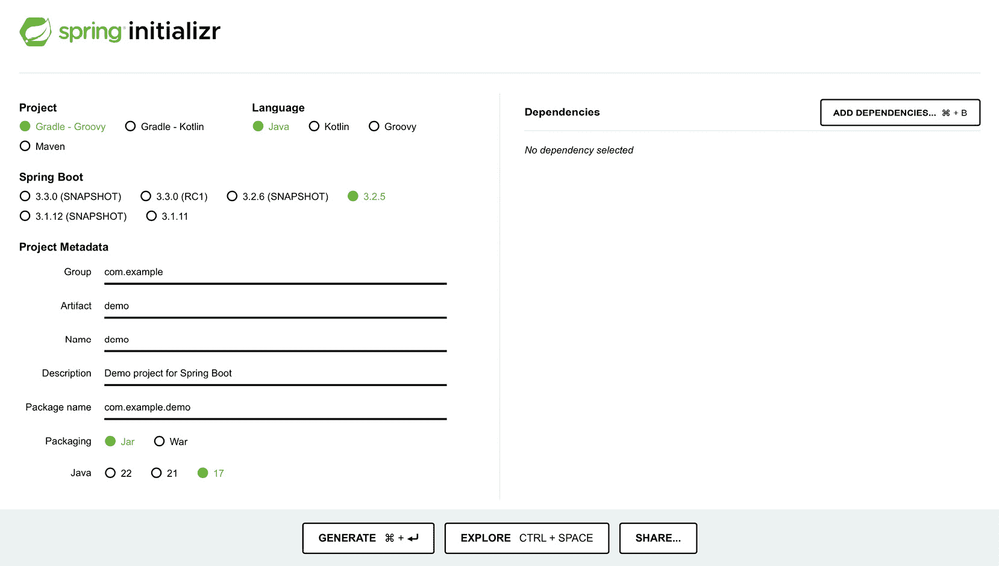
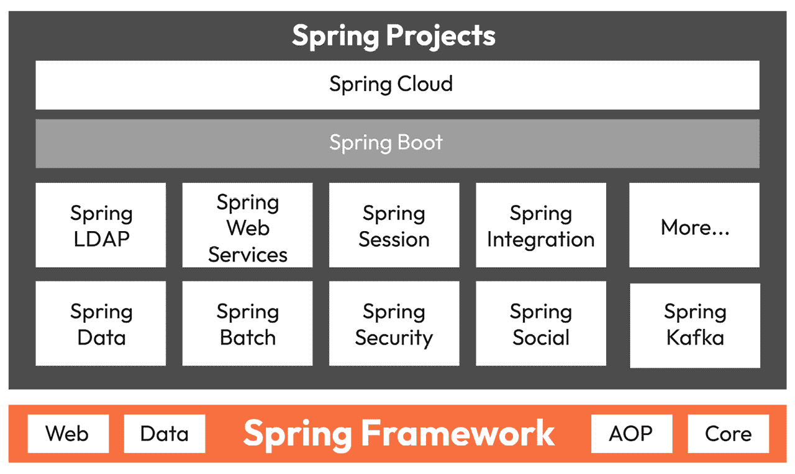

# 1

# 高级 Spring Boot 概念介绍

欢迎来到掌握 Spring Boot 3.0 项目指南之旅。这本书不是一本手册；相反，它充当你探索现代 Java 开发复杂世界的路线图。Spring Boot 不是一个新来者，而是一个成熟的框架，多年来一直在简化 Java 开发。但在 3.0 版本中，Spring Boot 使开发过程变得更加无缝和方便使用。Java 17 是与 Spring Boot 3.0 一起所需的最低 Java 版本，Java 19 也支持这些版本之一，这确保了开发者能够利用 Java 的最新特性和改进。Spring Boot 3.0 提出了 AppStartup – 一个在应用程序启动的不同阶段注册回调的功能，有助于资源初始化和配置错误检查等任务。除此之外，Spring Boot 3.0 还引入了一种新的依赖解析算法，有助于提高启动速度并降低内存占用，因此可以更有效地处理更复杂的项目。

当您完成这本书的阅读时，您将不仅熟悉，而且熟练、高效，最重要的是，能够在实际场景中有效地实施 Spring Boot。

那么，您在本章中可以期待什么？我们将深入探讨为什么 Spring Boot 是项目首选框架的原因。我们将探讨其优势和 Spring Boot 3.0 的新特性。本章为更有效地使用 Spring Boot 3.0 打下基础，确保您能够自信且熟练地应对复杂项目。让我们开始吧！

在本章中，我们将涵盖以下主要主题：

+   为什么要在高级项目中使用 Spring Boot？

+   对即将介绍内容的简要概述

# 技术要求

本章没有技术要求。本章包含的代码块用于解释某些概念，并不打算执行。

# 为什么要在高级项目中使用 Spring Boot？

欢迎来到您探索 Spring Boot 3.0 世界之旅的开始！在本节中，我们将讨论 Spring Boot 在创建最复杂的软件项目方面的潜力。我们将详细阐述为什么 Spring Boot 不仅仅是一个框架，而且更加复杂。它将是您在处理软件开发复杂挑战时的最佳伙伴。

## 现代软件开发复杂性

首先，让我们明确现代软件开发的复杂性。正如您所知，在软件项目中会出现许多不同的挑战。当我们有一个任务或项目时，我们需要考虑可扩展性、数据安全、在云环境中编排服务等等。在以前，开发者负责代码质量和性能。但现在，我们需要考虑和覆盖整个栈。

看看现代应用程序。它们必须适应用户需求的演变动态，必须利用云原生能力和尖端技术，并且必须始终保持安全。在确保为用户提供响应和可靠体验的同时完成所有这些，并不容易。

我能感觉到你眼中的担忧。不必害怕；我们有一个完美的工具来克服所有这些困难。这是一个帮助我们穿越这个复杂景观的工具。这是一个简化开发并使开发者能够克服所提到的挑战的框架。这个工具就是 Spring Boot – 它的好处使其成为未来项目的有力候选者。

让我们深入探讨为什么 Spring Boot 成为了处理高级软件项目的首选框架。

## Spring Boot 的优势

本节包含 Spring Boot 的各种优势。我们将逐一介绍这些优势，并讨论它们如何使我们的生活变得更轻松，以及我们如何使用它们。

### 优势 1 – 快速开发

在软件开发的世界里，时间是最宝贵的资源。我们应该尽快将我们的产品推向市场，因为市场竞争非常激烈。Spring Boot 提供了流线化的开发体验，使其成为许多开发者的优秀选择。它消除了样板配置的需求，使您能够专注于编写业务逻辑。借助 Spring Boot 的自动配置和启动依赖项，您可以在几分钟内而不是几小时内设置好项目。仅此一项功能就节省了大量时间和精力，使开发者能够专注于他们最擅长的事情——编写代码。正如您在*图 1**.1*中看到的那样，在 Spring Initializr 中只需单击一下即可开始开发。



图 1.1：Spring Initializr 页面

想象一下快速开发的好处。这意味着您可以更快地交付，更快地获得利益相关者的反馈，并迅速实施新的变更请求。Spring Boot 使您能够在竞争激烈的市场中保持敏捷和响应。

### 优势 2 – 微服务就绪

如您所知，微服务架构是新时代的产物。即使我们为一个小型初创想法设计**最小可行产品**（**MVP**），我们也是在考虑微服务结构，包括异步通信的可扩展性、使其独立部署，并确保灵活性。那么，哪个框架能帮助我们实现这一点呢？是的，Spring Boot！

关于微服务的可扩展性优势，我们可以根据需要扩展我们应用程序的各个组件，优化资源使用。Spring Boot 对构建微服务的支持简化了这一过程，使您能够专注于开发每个服务的核心功能。

### 优势 3 – 流线化配置

每个在更大或更复杂的项目上工作过的开发者都会面临配置管理的噩梦。传统方法通常会使 XML 文件、属性文件和环境特定设置变得混乱。

Spring Boot 遵循“约定优于配置”的哲学，提供合理的默认值，并提供自动设置，从而简化了设置的管理。

你是否想过一个世界，在那里你花在配置文件调整上的时间更少，而花在真正编写代码上的时间更多？使用 Spring Boot，配置的简单性将导致更干净、更易于维护的代码。你可以通过遵循最佳实践和避免不必要的样板代码来专注于应用程序的实际功能，从而实现这一点。

请参阅以下示例 XML 配置：

```java
<beans 

       xsi:schemaLocation="http://www.springframework.org/schema/beans
                           http://www.springframework.org/schema/beans/spring-beans.xsd">
    <!-- Bean Definition -->
    <bean id="myBean" class="com.example.MyBean">
        <property name="propertyName" value="value"/>
    </bean>
    <!-- Data Source Configuration -->
    <bean id="dataSource" class="org.springframework.jdbc.datasource.DriverManagerDataSource">
        <property name="driverClassName" value="com.mysql.jdbc.Driver"/>
        <property name="url" value="jdbc:mysql://localhost:3306/mydb"/>
        <property name="username" value="user"/>
        <property name="password" value="password"/>
    </bean>
</beans>
```

在 XML 配置中引入服务或 Bean 是复杂且难以管理的，正如你在之前的 XML 文件中看到的。在你编写服务之后，你还需要在 XML 文件中对其进行配置。

现在，我们将看到在 Spring Boot 中这有多简单。你可以用简单的 `@Service` 注解来编写你的类，它就变成了一个 Bean：

```java
@Service
public class MyBean {
    private String propertyName = "value";
    // ...
}
```

以下是一个应用程序属性文件。在之前的 XML 配置中，你看到很难看到和管理数据源属性。但在 Spring Boot 中，我们可以通过以下方式在 YAML 或属性文件中定义数据源：

```java
spring.datasource.url=jdbc:mysql://localhost:3306/mydb
spring.datasource.username=user
spring.datasource.password=password
spring.datasource.driver-class-name=com.mysql.jdbc.Driver
```

你可以看到，让我们的代码更易于阅读和管理是多么简单。

它还通过简化的配置促进了开发团队之间的协作。当每个人都使用相同的约定并依赖于 Spring Boot 提供的自动配置时，它减少了理解和工作在彼此代码上所需的时间。这意味着在做事上的一致性，除了最小化由配置引起的问题风险外，还促进了效率。

### 优势 4 – 广泛的生态系统

如果我们都能只编写代码而不需要任何集成，那将是非常棒的。但正如我们在本章引言中所说的，我们有时要处理复杂的项目，而所有复杂的项目都需要数据库、组件间的消息传递以及与外部服务的交互。因此，多亏了 Spring 生态系统，我们可以通过使用 Spring 的库和项目来实现这些功能。

正如你在 *图 1.2* 中所见，Spring 不仅仅是一个框架，而是一个生态系统，每个组件都准备好与其他组件顺畅地通信。



图 1.2：Spring 生态系统

我希望花更多的时间来探讨 Spring Boot 的生态系统，它提供了许多工具和集成，可以全面解决这些挑战。以下是 Spring Boot 生态系统成为宝贵资产的原因：

+   **支持多种数据库**：Spring Boot 最重要的特性之一是它使 SQL 以及 NoSQL 数据库（如 MySQL 和 MongoDB）的数据访问和管理变得更加容易。其配置能力简化了两种数据库之间的切换，只需更改对象的注解和属性文件中的**Java 持久化 API**（**JPA**）数据源即可。

+   **消息解决方案**：通过您的应用程序支持异步通信或事件驱动架构，Spring Boot 与 Apache Kafka 和 RabbitMQ 等工具的兼容性，在高效消息队列以及有效事件流方面提供了很大帮助。

+   **Spring Cloud 微服务支持**：Spring Boot 提供了一个 Spring Cloud 扩展，它提供了一套工具，使开发者能够快速构建和操作微服务，以便作为应用程序运行。它通过声明性编程模型帮助进行服务发现、负载均衡和分布式配置。

+   **云服务集成**：在当前的云计算领域，Spring Boot 提供了与该领域主要玩家的集成能力，包括**亚马逊网络服务**（**AWS**）、Azure 和谷歌云。这使您能够利用这些云提供商提供的资源和服务，包括存储、计算和机器学习，以增强您应用程序的功能和能力。

+   **安全和身份验证**：Spring Boot 生态系统提供了强大的安全库，这些库支持易于配置的安全身份验证和授权。无论您是想实现 OAuth 2.0 或 JWT 身份验证，还是希望根据角色应用访问控制，Spring Boot 都能满足这些需求。

+   **应用程序监控和管理**：正确地监控和管理应用程序对于保持软件应用程序处于健康状态至关重要。Spring Boot Actuator 作为 Spring Boot 的关联子项目，提供了内置的指标收集、健康检查功能和管理端点支持，将其功能添加到您的服务中并不困难。

+   **第三方集成**：除了核心功能外，Spring Boot 还提供了与一系列第三方库和框架的平滑集成。无论您是想集成特定的技术栈或专用库，通常您都会找到适合情况的 Spring Boot 扩展或集成。

通过使用 Spring Boot 的广泛生态系统，可以使软件开发过程更快，在各个集成级别遇到的障碍更少，并且可以访问广泛的工具和资源。Spring Boot 提供的生态系统在增强软件开发过程中的灵活性和多功能性方面非常出色，尤其是在软件开发的动态环境中。

### 优势 5 – 云原生能力

现在，让我们看看 Spring Boot 如何最好地融入云原生开发。当我们谈论云原生时，实际上我们指的是为云环境（如 AWS、Azure 和 Google Cloud）设计的应用程序。Spring Boot 为这些环境中的应用程序提供了诸如可扩展性和弹性等优秀特性，这意味着我们的应用程序将根据需求水平扩展或收缩，同时我们还能访问多个托管服务。

想要用 Spring Boot 构建你的应用程序并在云上部署它吗？好消息是 Spring Boot 封装了所有配置细节，因此使得在云上的部署过程变得非常简单。它被设计成与云环境无缝工作。这意味着你可以轻松地将你的应用程序绑定到提供商提供的各种云服务。这些服务可能包括数据库和存储解决方案，甚至到身份管理系统。

使用 Spring Boot 进行云原生应用程序开发的一个优势是适应性。无论你选择公共云、私有云，还是两者的混合——我们称之为混合环境——Spring Boot 都提供了一个简化的体验。你永远不会担心与手动配置相关的复杂性。Spring Boot 中的云原生能力使你能够充分利用今天云计算提供的各种能力。

这意味着根据特定时间点的某种持续情况进行应用程序的扩展或缩减。例如，你想要创建一个应用程序，当其用户突然增加时，它会自动扩展其资源——这将涉及 Spring Boot 的云原生开发和在 Cloud Foundry 上的部署。在这种情况下，Spring Boot 是桥梁，因为它负责你的应用程序，并确保它在云环境中充分利用所提供的一切，保持功能完整。它将使你的开发过程高效且有效，并确保你开发的应用程序在部署时更具弹性。

### 优势 6 - 测试变得简单

现在，我们将讨论测试在软件开发中的重要性以及 Spring Boot 如何帮助这一庞大的过程。正如你所知，为了确保我们的软件可靠且按预期行为，进行充分的测试非常重要。我相信你将非常熟悉为什么测试如此重要——我们必须在软件上线之前捕捉到错误和问题。

Spring Boot 真正促进了测试，并拥有许多工具和约定来实现这一点。这不仅确保了长期节省时间，还为我们的用户提供了更好的产品。Spring Boot 完美地适合这种“先测试”的方法，这种方法推动我们在开发的每一步都考虑测试，而不是事后才考虑。

那么，Spring Boot 是如何帮助我们进行测试的呢？它的一大优点是它的灵活性，因此它不会引入各种测试框架，这可能会产生兼容性问题。无论你更喜欢 JUnit、TestNG 还是其他任何流行的测试工具，使用 Spring Boot，这些工具都可以轻松集成到工作流程中。这样，你可以选择你感到舒适的工具，Spring Boot 不会限制你的选择。

此外，Spring Boot 不会限制你只进行一种类型的测试。它允许你编写不同类型的测试——从验证一小段代码正确性的单元测试，到验证应用程序不同部分之间良好通信的集成测试，甚至模拟用户如何通过应用程序的端到端测试。这里的想法是为你提供所有这些工具和灵活性，以便在深度上测试你的应用程序的任何级别。

简而言之，Spring Boot 为你提供了使测试高效和有效的所有工具。它就像一个工具箱，每个工具都是为了解决特定的测试需求而设计的，使你的软件更加健壮和可靠。记住，良好的测试是高质量软件开发的关键要素之一，Spring Boot 将引导你通过这一过程。

### 优势 7 – 活跃的开发

让我们讨论一下 Spring Boot 及其在技术快速发展的世界中的兼容性。

在软件开发中，由于技术的快速发展，跟上时代步伐至关重要。这就是 Spring Boot 发挥作用的地方，作为一个随着时间不断发展的动态框架。此外，它正由一个致力于添加新功能以及最大化安全应用的社区积极开发。借助 Spring Boot，你可以与最新的技术趋势互动，例如新的 Java 版本或容器化技术，而无需每次都从头开始。这个框架随着行业的发展而不断变化，以保持你的开发之旅与时俱进，甚至更接近你项目构建的现代进步性基础。在技术世界中，一切都在不断变化，Spring Boot 作为一个实用的最新指南，帮助你保持领先。

### 优势 8 – 社区驱动的插件

让我们了解 Spring Boot 的社区。它就像一个大家庭，每个人都有一个共同的目标。来自世界各地的人们为 Spring Boot 创建了大量的附加组件和扩展，使其变得更好。这就像拥有一个巨大的工具箱，其中每个工作都有理想的工具。

在这个工具箱中，有插件来满足每个目的。需要连接数据库或建立消息系统？有相应的插件。想要让你的应用程序更安全或更容易部署？也有相应的插件。最好的部分是？这些插件已经经过很多人的试用和测试，因此它们已经得到了完善。

使用这些详尽、由社区制作的插件意味着你不必每次都从头开始，可以避免浪费时间制作已经存在的东西。有了这些插件，你能够更快地构建，并加入全球开发者团队，分享他们的知识和工具。这样，所有开发者都能更快地构建更酷的东西。

在讨论了 Spring Boot 的基础优势之后，我们现在将开始学习它的最新版本。

## 迎接新时代——Spring Boot 3.0 的创新

Spring Boot 3.0 标志着高级 Java 应用程序开发故事的一个重要部分。让我们探索这个新主题包含的内容。

### Java 17 基线

将 Spring Boot 3.0 与 Java 17 对齐，为你带来 Java 宇宙的最新发展。通常，像密封类和 Java 17 中的新 API 等特性，以及其他一些特性，可以提高代码的可读性和可维护性。使用 Java 17 与 Spring Boot 一起意味着使用一个不仅是最新的版本，而且还有 Java 的扩展支持的版本。这为你提供了更干净的代码以及更好的性能，同时走在技术的前沿。使用 Java 17，引入了许多新特性——以下是一个使用密封类的简单示例：

```java
public sealed class Animal permits Dog, Cat, Rabbit {
    // class body
}
final class Dog extends Animal {
    // class body
}
final class Cat extends Animal {
    // class body
}
final class Rabbit extends Animal {
    // class body
}
```

这个功能允许你控制哪些类或接口可以扩展或实现特定的类或接口。这个功能特别有用，可以维护代码完整性并防止意外的子类。

### GraalVM 支持

在 Spring Boot 3.0 中，GraalVM 的支持是一个重要的特性，尤其是对于云原生解决方案。当我们有一个开发无服务器项目的任务时，Java 通常不是首选选项。这是因为 Java 项目在启动时需要更多的时间，并且比其他开发语言消耗更多的内存。但是，GraalVM 支持帮助 Spring Boot 减少内存使用并缩短启动时间。对于微服务和无服务器架构，这意味着达到一种效率水平，允许更快地扩展和优化资源利用。

### 使用 Micrometer 进行可观察性

让我们谈谈 Spring Boot 3.0 中的一个令人兴奋的功能——Micrometer 的集成。想象一下，Micrometer 是一个工具，它通过查看日志、指标和跟踪，让我们了解应用程序内部正在发生的事情。有了 Micrometer 跟踪，Micrometer 工具在 Spring Boot 中变得更加有用。现在我们能够更有效地记录应用程序指标，并执行更有效的操作跟踪。这就像有了更高级的方式来检查我们的应用程序在当前技术下的执行情况，比我们过去依赖的老方法好得多，尤其是在我们处理由编译的本地代码构建的应用程序时。

### Jakarta EE 10 兼容性

我将尝试解释 Spring Boot 3.0 中向 Jakarta EE 10 的过渡。所以，这就像在出发前更新你的 GPS 到最新的地图和功能一样。以类似的方式，转向 Jakarta EE 10 使我们能够利用企业 Java 中可用的最新工具和标准。这样，我们就能确保所有构建的应用程序都使用现代标准，并且具有前瞻性。这次更新不仅使我们的应用程序保持最新，还使我们能够与其他符合新标准的更先进的技术一起工作。所以，这无外乎是我们开发旅程中的飞跃。

### 简化的 MVC 框架

Spring Boot 3.0 中的 MVC 框架更新改进了我们的通信管理方式，尤其是 API 错误处理。对 RFC7807 ([`datatracker.ietf.org/doc/html/rfc7807`](https://datatracker.ietf.org/doc/html/rfc7807)) 的支持意味着我们的应用程序可以在一个地方处理异常。以下代码示例说明了如何在同一处处理异常：

```java
@RestControllerAdvice
public class GlobalExceptionHandler extends ResponseEntityExceptionHandler {
  @ExceptionHandler(Exception.class)
  public ResponseEntity<ProblemDetail> handleException(Exception ex, WebRequest request) {
    ProblemDetail problemDetail = new ProblemDetail();
    problemDetail.setTitle("Internal Server Error");
    problemDetail.setDetail(ex.getMessage());
    problemDetail.setStatus(HttpStatus.INTERNAL_SERVER_ERROR.value());
    return new ResponseEntity<>(problemDetail, HttpStatus.INTERNAL_SERVER_ERROR);
  }
  @ExceptionHandler(ResourceNotFoundException.class)
  public ResponseEntity<ProblemDetail> handleResourceNotFoundException(ResourceNotFoundException ex, WebRequest request) {
    ProblemDetail problemDetail = new ProblemDetail();
    problemDetail.setTitle("Resource Not Found");
    problemDetail.setDetail(ex.getMessage());
    problemDetail.setStatus(HttpStatus.NOT_FOUND.value());
    return new ResponseEntity<>(problemDetail, HttpStatus.NOT_FOUND);
  }
  // other exception handlers
}
```

在这个例子中，`GlobalExceptionHandler` 是一个 `@ControllerAdvice` 类，它处理应用程序抛出的所有异常。它为应用程序可能抛出的每种异常类型都有一个 `@ExceptionHandler` 方法。每个 `@ExceptionHandler` 方法返回一个包含 `ProblemDetail` 对象作为正文和适当的 HTTP 状态码的 `ResponseEntity`。`ProblemDetail` 对象包含错误的详细信息，包括标题、详细信息和状态码。

### 增强的 Kotlin 支持

Kotlin 在开发者中越来越受欢迎。如果你对 Kotlin 更有信心，Spring Boot 3.0 现在提供了增强的 Kotlin 支持。这种支持扩大了 Spring 社区。

## 总结——为什么 Spring Boot 3.0 是你的高级项目盟友

在前面的章节中，我们看到了 Spring Boot 如何通过其快速开发成为开发大型和高级软件项目的强大工具。有了 Spring Boot，我们谈论的是通过其“约定优于配置”的设置大幅减少开发时间和努力。这意味着什么？有更多的时间用于开发，更少的时间用于设置和配置。

好吧，现在让我们谈谈它如何适应微服务。Spring Boot 不仅是一种促进开发的方式，还可以使你的应用程序更可扩展和高效。随着新的微服务架构的兴起，这变得至关重要。它允许你将应用程序分解为更小、更易于管理和完全独立的实体，这些实体作为一个整体完美协作。

我们讨论的另一个方面是处理简化的配置。Spring Boot 的自动配置功能取代了手动配置的处理，这可能非常无聊。这对于处理配置可能增长的大型项目来说非常关键，因为这是一个非常复杂且耗时的任务。

我们还简要介绍了 Spring Boot 提供的生态系统。这个生态系统提供了一系列插件和工具。这个环境将你需要的所有构建、测试和部署高标准应用程序的工具都放在了你的指尖。

云原生能力使 Spring Boot 成为无服务器应用程序开发的框架选择。鉴于越来越多的迁移趋势是向云环境，这种能力变得更加关键。

最后，一切都关乎于社区的不断发展和支持。一个活跃的社区和持续的发展使 Spring Boot 与最新的技术和趋势保持一致。这使得这款软件成为处理复杂项目的持久和未来证明的选择。

现在是时候用 Spring Boot 3.0 来提升你的开发叙事了。

随着我们在这本书中的进展，我们将更深入地探索 Spring Boot 的世界。我们将研究各种架构模式、响应式编程、数据管理、测试、安全、容器化和事件驱动系统。在每一章中，你将获得实践经验，并更接近你在现实世界项目中的成功。

# 对即将发生的事情的简要概述

本节将概述本书剩余部分我们将讨论的内容。这将照亮你的道路，并给你一个关于接下来章节内容的预览。

## 第二章，微服务的关键架构模式——领域驱动设计（DDD）、CQRS 和事件溯源

本章深入探讨了微服务的关键模式。在一个微服务系统中，你可能会有很多微服务，这取决于应用程序的大小；例如，Netflix 有超过 1,000 个微服务。因此，我们需要一个优秀的模式来管理这些微服务，并正确地维护它们。没有它，我们就失去了对它们的控制，整个系统变成了一堆垃圾。

第一部分是 **领域驱动设计**（**DDD**）。DDD 是关于根据业务需求构建软件。每个微服务只对业务的一个小部分负责。在 DDD 中，我们有两个主要部分，即战略部分和战术部分。在战略部分，我们审视业务的宏观图景。我们关注的细节是战术部分。在这里，我们将详细探讨关于业务每个部分的全部知识。

接下来是 **CQRS**。它是 **Command Query Responsibility Segregation** 的缩写。我喜欢这个名字。对于一个简单想法来说，这个名字太华丽了。我们分离了读取数据和写入数据。把它想象成两个工具——一个用来提问，另一个用来下达命令。这种分离使得我们的软件运行得更顺畅、更快。这对于需要管理大量数据的复杂系统来说非常棒。

接下来，我们有事件溯源。这是将我们对软件所做的所有更改记录为事件。每当交易方发生变化时，我们都会在日记中记录下来。因此，日记记录了过去发生的事情。我们还可以深入了解我们的对象的历史。事件溯源的相关性在于，在任何时候都可能需要保留过去的数据。

最后，我们快速浏览了微服务中的其他模式。这部分仅仅提出了一些构建软件的其他想法。我们不会在这里深入细节，但了解这些其他模式是很好的。它们就像工具箱中的不同工具。了解更多的工具使我们更好地构建软件。

在本章中，我们将通过示例介绍这些模式。我们将看到它们如何在真实软件中得到应用。这有助于我们更好地理解为什么这些模式很重要，以及如何稳妥地使用它们。

每个这样的模式都是朝着制作更好的软件迈出的一步。我们将学习如何使用 DDD、CQRS 和事件溯源。这些将帮助我们编写强大、智能和有用的软件，并解决真实业务问题。本章全部关于学习这些基本技能。

## 第三章，反应式 REST 开发和异步系统

*第三章* 打开了 Spring Boot 3.0 中反应式编程的动态世界。在这里，我们学习如何构建快速响应的软件。这是关于制作能够处理多个并发或同时请求的应用程序。

我们从反应式编程的介绍开始。这是一种全新的编写软件的方式。在以前，我们的应用程序一次只能做一件事。有了反应式编程，它们可以同时处理许多任务，流畅且无需等待。就像一个杂技演员轻松地同时抛接多个球一样。

构建反应式 REST API 是我们的下一个目标。将 REST API 想象成服务员接受订单并将食物端上桌：一个服务员，一个订单。一个反应式 REST API 就像一个超级服务员，即使在餐厅非常繁忙的时候也能同时处理多个订单。这对于你有很多用户，他们同时需要快速服务的情况非常棒。

接下来，我们探索异步系统和背压。异步意味着在不同的时间做事情，而不是严格的顺序。这就像有一个你可以按任何顺序完成任务的任务清单。背压是一种管理工作的方式，这样我们就不会感到不知所措。就像有一个聪明的系统，知道何时说“请稍等”，以确保一切都能正确完成，而不会崩溃或减慢速度。

到*第三章*结束时，我们不仅会讨论这些想法，还会通过真实示例看到它们的应用。我们将了解为什么在当今快节奏的世界中，响应式编程是必不可少的。我们将学习如何使用这些新工具使我们的软件强大、智能和有帮助。我们还将看到它们如何解决当今商业中的实际问题。这一章充满了现代软件开发者必备的技能。

## 第四章，Spring 数据：SQL、NoSQL、缓存抽象和批量处理

*第四章* 将介绍如何在 Spring Boot 3.0 应用程序中管理数据。这是一章将理论与处理各种类型数据的实际步骤相结合的章节。

我们从 Spring Data 的介绍开始。这是 Spring Boot 最重要的组件之一。我们可以用它来编排数据。Spring Data 就像一座桥梁，连接着你的应用程序和数据库的世界。我们将看到 Spring Data 如何轻松地与数据库通信。

然后，我们将探讨 Spring Data 如何与 SQL 数据库连接。SQL 数据库将数据存储在表中，当你有清晰的数据结构时，它们非常出色。它们可靠且强大。使用 Spring Boot，使用这些数据库变得更容易。你可以设置关系并有效地存储你的数据。

接下来，我们将关注点转向 NoSQL 数据库。这些数据库与 SQL 数据库不同。它们更像是一个灵活的储藏室，你可以将数据放入其中，而不需要严格的布局。Spring Boot 支持各种 NoSQL 数据库，例如 MongoDB、Neo4j 和 Cassandra。当你的数据不适合整齐地放入表格中，你需要更多灵活性时，这些数据库非常出色。

我们还将讨论 Spring Boot 的缓存抽象。缓存是将数据的副本存储在临时存储区域中，以便你可以更快地访问它。这就像将你常用的工具放在工作台上以便快速访问一样。Spring 的缓存抽象让你可以智能地管理这种缓存，通过记住频繁使用的数据来提高应用程序的性能。

然后，我们将介绍 Spring Batch 的批量处理。这是当你需要一次性处理大量数据时使用的。想象一下，就像工厂的装配线，高效地处理大量任务。Spring Batch 是一个用于开发健壮批量应用的框架。它用于大规模数据迁移和处理，非常适合处理发送数千封电子邮件或处理大型数据集等大型工作。

最后，我们将讨论数据迁移和一致性。当你将数据从一个地方移动到另一个地方时，你想要确保在这个过程中没有任何东西丢失或改变。我们将学习在迁移过程中保持数据安全和一致性的策略。这就像搬家时没有丢失任何你的物品。

在本章中，我们将这些概念与实际示例联系起来，展示 Spring Boot 3.0 如何使这些任务变得更容易。到第四章结束时，你将了解如何在 Spring Boot 应用中管理和处理数据，确保它们快速、可靠和安全。

## 第五章，保护你的 Spring Boot 应用

在第五章中，我们将处理一些极其重要的事情——保护我们的 Spring Boot 应用。到目前为止，我们已经学到了很多好的实践。有了这些信息，我们已经构建了一个可维护、健壮的应用。所有部分都运行得非常顺畅。但现在，我们应该保持这个领域的安全。

首先，我们将深入探讨在 Spring Boot 3.0 的世界中什么是安全的。安全不仅仅是一个锦上添花的东西；它是一个必须品。我们将探讨 Spring Boot 如何帮助我们建立强大的防御来对抗黑客。

然后，是时候进入 Oauth 2.0 和 JWT 了。安全不仅仅重要，因为它可以防止攻击；它还确保每个用户的数据都是隔离的。它确保只有拥有正确通行证的正确的人才能进入。

接下来是角色基于访问控制。这关乎为谁可以在你的应用中走到哪里设定规则。就像决定谁可以得到前门钥匙，谁只能进入车库。

我们不会忘记关于响应式应用的内容。它们需要能够跟上它们快速节奏的安全措施。这有点像一位超级擅长多任务处理的保安。

Spring 安全过滤器就像是你的应用的保安。他们在让人进入之前会检查每个人。我们将学习如何设置这些过滤器来检查门口的身份证。

到了本章结束时，你将感觉自己像一位安全专家。你会知道如何使用所有这些工具来确保你的 Spring Boot 应用像堡垒一样安全。我们将通过示例和测试我们的安全措施，确保它是顶级的。所以，让我们做好准备，把我们的 Spring Boot 应用锁得严严实实！

## 第六章，高级测试策略

让我们深入到第六章，在那里我们将真正在 Spring Boot 中进行测试。测试不仅仅是一个需要勾选的复选框；它是确保我们的应用在现实面前不会崩溃的关键。在 Spring Boot 中，测试可以是一次相当刺激的旅程！

我们首先介绍测试领域的两大巨头：单元测试和集成测试。将单元测试想象成检查拼图的单个碎片，确保每个碎片都切割得恰到好处。集成测试呢？它关乎验证所有碎片是否能够组合在一起形成完整的画面。两者都极其重要，原因各不相同，我们将会看到原因所在。

接下来，我们将解决测试响应式组件的问题。如果你在 Spring Boot 中玩过响应式编程，你会知道它就像玩杂技一样——同时发生很多事情，你必须确保所有的事情都保持在空中。本节将确保你的响应式组件在压力之下不会掉链子。

然后，是安全测试的广阔而危险的世界。我们不仅要确保应用程序能正常工作，还要确保它像诺克斯堡一样坚不可摧。我们将深入探讨如何测试你的 Spring Boot 应用程序以抵御黑客，涵盖从谁被允许进入到谁被拒之门外的所有内容。

最后，我们将讨论 Spring Boot 世界的**测试驱动开发**（**TDD**）。TDD 就像在烤蛋糕之前先写好食谱。这听起来可能有些反直觉，但它是一个变革者。我们首先编写测试，然后编写代码，最终得到的东西不仅美味，而且可靠。

到本章结束时，你不仅将了解在 Spring Boot 中测试的“如何”，还将了解“为什么”。这是确保你的应用程序不仅今天能工作，而且明天、下周和明年都能继续工作。准备好提升你的测试技能吧！

## 第七章，Spring Boot 3.0 的容器化和编排功能

在 *第七章* 中，我们将学习如何让我们的 Spring Boot 3.0 应用程序准备好旅行和工作在任何地方。这是关于使用像容器和编排器这样的酷工具。

首先，我们将讨论容器化的含义。这就像把你的应用程序打包在箱子里，让它能在任何电脑或服务器上运行，就像那样！

Spring Boot 有特殊的功能来帮助这一点。它拥有你确保应用程序在这些容器中打包得很好的所有东西。

然后，我们将深入了解 Spring Boot 与 Docker 的协同工作方式。Docker 就像为我们的应用程序提供的特殊公交车。它确保无论它们去哪里，都能平稳运行。

我们还将了解 Kubernetes。把它想象成公交车的老大。它组织我们所有的应用程序容器，并确保它们都能正确地协同工作。

最后，我们将探索 Spring Boot Actuator。这是我们应用程序的健康检查工具。它显示我们的应用程序在运行后表现如何。

到本章结束时，我们将能够打包我们的应用程序，让它们在任何我们喜欢的地方运行。我们将感觉自己像是我们应用程序的旅行代理人！

## 第八章，探索使用 Kafka 的事件驱动系统

*第八章* 将教会我们如何使用 Kafka 和 Spring Boot 应用程序构建事件驱动系统。这就像在我们的应用程序内设置一个强大的邮件服务，邮件永远不会消失。

首先，我们将了解事件驱动架构。这是一种构建应用程序的方式，其中不同的部分通过事件相互通信。就像应用程序的一部分向另一部分发送“嘿，发生了什么事！”的笔记一样。

接下来，我们将看到 Kafka 如何帮助我们的 Spring Boot 应用程序发送和接收这些笔记。Kafka 就像我们应用程序消息的邮局。它确保我们的应用程序的所有部分都能在正确的时间收到正确的消息。

然后，我们将实际使用 Spring Boot 构建一个事件驱动的应用程序。我们将使用 Spring Boot 的消息工具来确保我们的应用程序部分可以通过事件进行通信。

最后，我们将学习如何关注所有这些消息。我们将介绍如何监视我们的应用程序，并在出现问题时进行修复。这就像是一个侦探，寻找线索来解决任何消息谜团。

到了*第八章*结束时，我们将成为事件驱动的专家，准备好创建超级响应和最新的应用程序。

## 第九章，提高生产力和开发简化

*第九章*是我们真正深入探索 Spring Boot 提供的最酷工具的地方，所有这些工具都是为了使我们的开发者生活变得更加容易。

首先，我们有**面向切面的编程**，或**AOP**。它就像拥有一个魔杖，让我们可以整洁地收起所有重复的部分。因此，我们可以保持代码的整洁，专注于独特的东西。

然后，我们将轻松地通过 Feign 客户端浏览 HTTP API。它就像有一个翻译器，让我们的应用程序能够与其他应用程序聊天，而不需要任何麻烦。

我们还将掌握自动配置的艺术。这是 Spring Boot 给我们一个先发优势的方式，就像一辆车，当我们上车时，座椅和后视镜会自动调整到我们喜欢的位置。

我们以一些关于最佳实践和要避免的陷阱的实用建议结束。这是关于用我们的代码明智行事，向他人学习，并避免那些狡猾的陷阱。

当我们结束这一章时，我们将更聪明、更快地编码，并且信心满满。我们将成为像生产力忍者一样，轻松地穿越开发丛林。

# 摘要

这一章全是关于跳入 Spring Boot 3.0。将 Spring Boot 视为一个使 Java 工作变得容易得多的工具，尤其是在处理大型、复杂项目时。我们看到了它是如何帮助加快项目设置的速度，并简化处理大任务的流程。

下面是我们学到的：

+   **快速设置**: Spring Boot 使启动新项目变得容易，允许开发者以最小的麻烦专注于开发有趣的部分

+   **微服务**: 简单来说，这是一个将大项目（们）拆分成小部分的高级术语，这样事情就更容易管理

+   **用户友好**: Spring Boot 的自动配置功能帮助开发者绕过手动设置过程

+   **丰富的工具**: 它就像编程的瑞士军刀，提供了管理数据库和安全的工具

+   **云就绪**: 与在云中运行的项目一起工作真是太棒了

+   **测试变得简单**: 测试你的工作非常重要，Spring Boot 使它变得更简单

+   **社区和更新**：有如此多的用户在致力于 Spring Boot 的开发，使其不断变得更好

从现在开始，在下一章中，我们将学习微服务架构、DDD、CQRS 和事件溯源。我们将了解微服务设计模式为何重要，以及如何为我们的项目选择正确的模式。

# 第二部分：架构模式和响应式编程

在这部分，我们将深入研究塑造现代软件开发创新的框架，重点关注架构模式和响应式编程。在*第二章*中，你将探索诸如领域驱动设计、命令查询责任分离和事件溯源等关键概念。然后，在*第三章*中，你将掌握响应式 REST 开发和异步系统的复杂性。这些章节旨在为你提供构建响应性和高效应用程序的技能。

本部分包含以下章节：

+   *第二章*，*微服务中的关键架构模式 – DDD、CQRS 和事件溯源*

+   *第三章*，*响应式 REST 开发和异步系统*
