# 第二章：微服务中的关键架构模式——领域驱动设计（DDD）、命令查询责任分离（CQRS）和事件溯源

这章全部关于欣赏微服务的骨架——那些使我们的软件设计强大、可扩展和有效的中心模式。

首先，我们将深入探讨领域驱动设计的世界。这是一种将业务关注点适应任何给定软件项目的方法。它类似于确保我们的软件与它试图解决的商业挑战使用相同的语言。

接下来是命令查询责任分离。这是一种将我们如何操作数据分为两部分的不错方式——一个用于更新，另一个用于检索。它以更干净、更高效的方式划分了我们的软件职责。

接下来是事件溯源。我们在这里记录每个更改作为一个事件序列。它就像一个详细记录了所发生一切的清单——这对于回顾我们的数据和选择的历史可以非常强大。

随着我们进入本章，我们将了解架构模式为何重要，以及如何正确地应用它们来构建我们的微服务。我们将不仅学习什么是架构模式，还将学习它们的实际应用。在本章中，我们将涵盖以下主要主题：

+   微服务架构模式简介

+   **领域驱动** **设计** （**DDD**）

+   **命令查询责任** **分离** （**CQRS**）

+   事件溯源

+   其他架构模式的简要概述

# 技术要求

为了更好地理解本章，以下领域的知识将有所帮助：

+   **对微服务架构原则的深入了解**：掌握支撑微服务的基础概念

+   **熟悉软件设计模式**：了解解决软件设计问题的常见模式

+   **基本编程概念**：掌握编程的基本原则

+   **对分布式系统的理解**：了解分布式系统的工作原理及其挑战

+   **微服务目的和实现的知识**：了解微服务为何被使用，如何实现，以及它们的优点

+   **掌握微服务通信和操作**：了解微服务如何相互通信并在更大的系统中操作

# 微服务架构模式简介

好的，所以在这个部分，我们将探讨如何将设计模式应用到微服务中。为了真正理解这个主题，让我们首先回顾一些子标题，以帮助构建整体图景。

## 我们为什么一开始就需要一个建筑设计呢？

简而言之，架构模式是经验证明的平衡解决方案，用于解决软件架构中的一些常见问题。这些模式从硬件限制到高可用性和最小化商业风险等问题都有所涉及。

一个显著的优势是，它们提供了解决软件问题的方法，因为大多数基本架构设计问题已经过测试。它们通过简化创建紧密连接和通信的模块的过程，这些模块以最小的耦合协同工作。这也通过根据实际需要调整结构，有助于使整个系统更容易理解和维护。

另一个巨大的优势是，设计模式有助于提高开发者和设计师之间沟通的有效性。当进行系统设计时，如果开发人员或设计师通过模式名称进行引用，那么每个人都能立即知道他们所讨论的一般高级设计。

## 设计模式是什么？

**设计模式**基本上是开发者用来解决软件设计中常见问题的模板。每个模式都展示了一种典型的解决方案，你可以根据自己项目的需求进行定制。例如，如果你经常需要以某种方式结构化程序，设计模式可以为你提供一个经过验证的方法，根据需要对其进行修改。

## 微服务是什么？

**微服务**是一种架构风格，你基本上是将应用程序拆分成许多小型、独立的微服务。每个服务专注于做一件特定的事情，并通过简单的协议与其他服务进行通信。最大的好处是团队可以在不影响应用程序其他部分的情况下，独立地工作在自己的服务上。

这种方法允许团队专注于他们的特定任务，而不必担心更改可能会对应用程序的其他部分产生什么影响。他们可以快速迭代代码和功能，而无需在整个代码库中进行广泛的协调和测试。如果做得正确，微服务可以使开发过程更高效，因为团队对自己的服务拥有自主权。

这种分离也使得应用程序更具有可扩展性和弹性。由于每个服务都是独立的，团队可以更新他们的代码并部署新版本，而不会影响其他服务。如果一个服务出现故障或需要离线进行维护，它不会使整个应用程序崩溃。公司能够在某些部分暂时不可用的情况下，保持软件的平稳运行。

此外，模块化设计意味着应用程序可以变得非常大，而不会变得过于混乱和复杂。新功能不需要对整个代码库进行更改。团队可以简单地构建额外的服务来处理新的功能。有了微服务，公司可以非常快速地构建软件，因为团队不会因为等待代码审查和部署而相互拖慢进度。

代价是保持服务分离需要更多前期工作。管理独立部分之间的通信有额外的复杂性。然而，对于大型应用程序，微服务通过实现快速、可靠的规模化开发，提供了超过初始成本的益处。

## 微服务的原则是什么？

微服务背后的六个主要原则是自主性、松耦合、重用、容错性、可组合性和可发现性。让我更详细地解释一下每一个：

+   **自主性**意味着每个微服务都是独立的，并控制自己的运行时和数据库。这使得它更快、更可靠，因为它不依赖于其他服务。只要它保持无状态，它也可以轻松扩展。

+   **松耦合**意味着服务之间依赖性不大。通过使用标准化的 API，一个服务可以改变而不影响其他服务。这允许有更多的灵活性和随时间的演变。它也使得开发和修复更快。

+   **重用**仍然很重要，但在业务中更具体的应用领域。团队可以决定如何根据每个新的用例来调整服务。这种有指导的重用方法比僵化的预定模型更好。

+   **容错性**意味着即使另一个服务失败，每个服务也可以继续工作。像断路器这样的东西可以阻止单个故障扩散。这保持了整个系统的可靠性。

+   **可组合性**意味着服务可以以不同的组合方式提供价值。多个服务协同工作成为构建应用程序的新方式。

+   **可发现性**意味着每个服务都清楚地传达它解决的业务问题和如何使用其技术接口。这使得开发者能够理解微服务的功能以及如何消费它发布的事件。

总结来说，这六个原则：自主性、松耦合、重用、容错性、可组合性和可发现性，构成了微服务架构的基础。

## 微服务设计模式

到目前为止，我们已经讨论了为什么我们需要架构设计，什么是设计模式以及微服务的原则。在本节中，我们的重点是微服务设计模式。也就是说，如前所述，设计模式以这种方式帮助解决微服务架构的特定挑战，并有助于降低微服务的失败风险——但前提是我们清楚地理解它们。

接下来的问题是那些设计模式究竟是什么。好吧，我想分享一个图表，它展示了微服务架构中设计模式的全貌。它并不涵盖所有设计模式，但涵盖了最常见的模式。

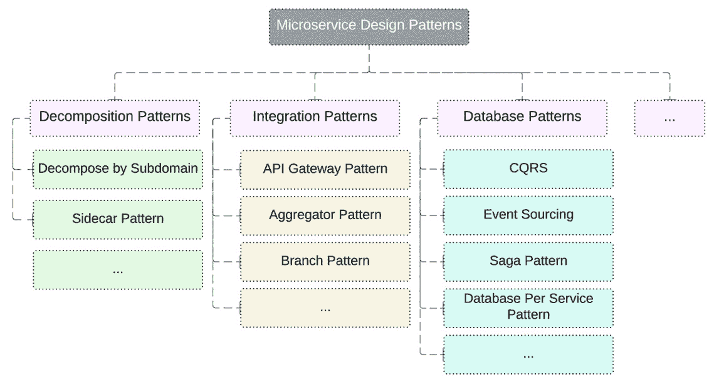

图 2.1：常见的微服务设计模式

在前面的章节中，我们讨论了微服务架构以及在设计微服务时拥有良好定义模式的重要性。基于存在许多移动部件的事实，微服务可能会很快变得复杂；设计模式有助于处理一些特定问题，同时降低失败的风险。在本节中，我们想稍微深入探讨一些最常见且值得了解的微服务设计模式。

我们将讨论一些最常见的微服务设计模式，并对每个模式进行一些解释。

### 聚合设计模式

当你需要在一个页面或界面上显示来自多个微服务的多个数据时，聚合模式非常有用。例如，如果你有一个仪表板，它从不同的服务中拉取各种指标和状态，聚合模式允许你高效地将这些数据收集在一个地方。

### API 网关设计模式

API 网关充当微服务的单一入口点或“前门”。所有请求都必须通过 API 网关，它处理身份验证、授权、监控并将请求路由到适当的服务。与直接暴露服务相比，这提供了一层额外的安全保护。

### Saga 设计模式

当你的业务流程涉及多个服务，并且步骤必须以事务方式执行时， Saga 模式非常有用。例如，当在社交资料上发布照片时，Saga 模式可以协调以可靠的方式保存照片、更新资料和通知关注者，即使某些服务失败。

总结来说，如今有如此多的不同微服务设计模式。决定哪些可能最适合你的特定项目可能会很困难。但我发现，很多时候，你可以根据你试图达成的目标同时使用几个不同的模式。

例如，假设你有一个包含多个独立服务的项目，所有这些服务都需要访问同一个数据库。在这种情况下，使用网关模式来访问数据库可能是有意义的，这样可以避免每个服务都直接连接。这样，你可以通过单个服务来整合数据库连接。

然而，同时，你的某些服务可能在与它们之间的客户端/服务器模式中工作得非常好。也许一个服务作为服务器向其他作为客户端的服务提供数据。因此，在这个架构部分，客户端/服务器可能是一个很好的选择。

重要的是要考虑每个单独的服务或服务组的目标和需求。哪些模式能帮助你实现松散耦合、可扩展性、容错性等目标？只要你能清楚地解释你为什么选择了这些模式，以及它们如何帮助解决特定的目标，那么在一个项目中使用多个模式是完全合理的。模式是为了服务于你的设计——而不是反过来。

在讨论了各种微服务设计模式和它们在特定架构挑战中的应用之后，我们将进入下一部分。在这里，我们将探索 DDD，这将帮助我们了解每个微服务如何负责特定领域的操作。

# 探索 DDD

我们将以一种易于理解的方式为你分解 DDD。现在，如果你之前从未听说过 DDD，请不要担心——它主要用于需要六个月或更长时间才能完成的大型项目。但即使你只是做些小项目，学习基础知识仍然是有帮助的。

DDD 的核心是围绕你的软件试图解决的特定问题或“领域”来结构化你的代码。用更简单的话说，就是组织你的代码以匹配你的应用程序实际上关注的内容。

首先，我们将讨论一些基本术语，如领域和 DDD，然后稍后我们将探讨如何实现 DDD。最后，我们将讨论一个现实世界的例子。

## 什么是领域？

**领域**指的是你的应用程序关注的主题或领域。例如，如果你正在构建一个订单应用程序，领域可能很可能是在线购物或订单处理。真正理解领域也很重要，因为一家公司可能同时在工作多个领域，如购物、配送、运输、维修——你懂的。

有时候一个领域可能看起来太宽泛，例如，“食品”就是一个例子。在这些情况下，你应该指定你正在处理的该行业的确切部分。现在对于非常大的领域模型，你可以将它们分解成更小的*边界上下文*，以便更容易管理。例如，在一家食品公司内部，可能有针对销售团队和配送团队的单独上下文，每个上下文都有自己的专家。

这些领域专家与开发者紧密合作，确保功能的实现。将领域划分为边界上下文简化了工作并保持了组织性。

总结来说，DDD 是一种通过关注领域和上下文来开发复杂软件的方法，确保你的代码与你要解决的问题的具体性相匹配。

## 什么是 DDD？

现在我们将讨论 DDD。DDD 的核心是将你的代码与业务领域的核心概念或上下文深度链接。目标是帮助通过促进领域专家和开发者之间的有效协作来处理复杂场景，这样误解的空间就会更小。

DDD 在具有许多动态部分的大项目中特别出色，在这些项目中，你需要专家的意见，并且每个人都必须共同努力。但对于你可以独立管理的小型个人项目来说，可能就有些过度了。成功协作的关键是沟通。使用 DDD，开发人员和专家（如架构和领域专家）在讨论事情、构建领域模型和编写代码时共享一种共同的语言。这有助于加快反馈循环。

但你必须小心。如果你不持续丰富和定义这种共享语言，团队内部可能会开始形成不同的语言。然后，有效的沟通就会告吹——这会导致不准确和混淆。例如，“客户端”一词在一个上下文中可能指用户，而在另一个上下文中可能指系统服务。因此，清楚地定义每一件事的含义非常重要。

此外，每个领域都应该有自己的定制语言以避免冲突。我们还将想要在领域之间建立边界，以防止交叉污染。保护领域的一种方法是通过 **反腐败层**。这一层充当不同领域模型之间的翻译者，使用适配器、外观或翻译者等模式来帮助领域之间进行通信而不相互污染。这有助于解释 DDD 是什么。

## 如何定义 DDD 结构？

在本节中，我们将分解一个在线购物应用程序的 DDD 结构示例，我们将在本节稍后讨论。我们需要关注几个关键层以确保我们的应用程序顺利运行：

+   首先是 **UI 层**。这是当客户在手机或电脑上浏览时看到的。它显示产品，并允许他们添加商品到购物车并结账。它接收用户输入并将其发送到下一层。

+   下一个层是 **应用层**。现在这一层没有实际的业务逻辑，它只是引导用户通过 UI 流程并与其他系统进行通信。它组织所有对象并确保任务以正确的顺序完成。

+   现在我们来到 **领域层**，这是整个操作的灵魂和核心。这一层拥有使业务运转的核心概念。它包括用户、产品、订单等与应用程序主要功能相关的一切。每个实体都有自己的唯一标识符，这样无论其他什么发生变化，都可以追踪。

    这里的服务也有预定义的行为，每个人都能够理解。领域层独立存在，不依赖于其他层，但它们都可以依赖于领域层，因为领域层已经锁定了所有重要的业务规则。

+   最后，我们还有**基础设施层**。这一层促进了所有其他层之间的通信。它还提供诸如库之类的工具，以帮助 UI 顺利工作。但事实上，它没有任何业务逻辑——它只是支持幕后技术功能。

因此，总的来说——UI 层与用户交流，应用层管理任务，领域层处理核心业务功能，基础设施层帮助它们无缝协作。确保每一层都专注于你的应用架构。

*图 2.2*帮助你从视觉上理解不同层之间的关系：

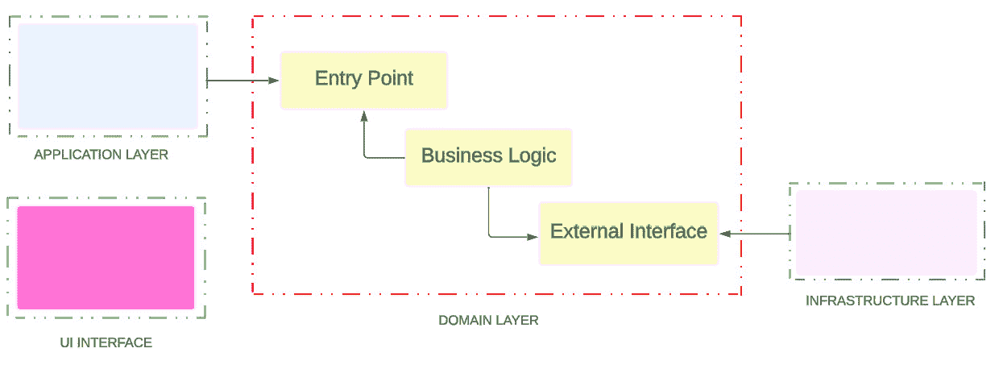

图 2.2：DDD 层之间的关系

现在，我们将通过遵循 DDD 结构来通过一个示例来了解它，使其在我们心中清晰易懂——我们将通过一个在线商店的真实世界示例来分解微服务。

我们都知道现在网上购物非常流行，所以让我来介绍一下如何使用领域驱动设计来构建一个电子商务网站：

+   首先，你需要有一个**用户服务**。这个服务处理所有账户详情——登录、个人资料、地址、支付信息以及所有相关细节。

+   接下来是**产品服务**。这个服务负责产品目录——跟踪库存水平、产品详情、描述——你可以购买的所有物品的信息。

+   然后我们有**订单服务**。正如你可能猜到的，这个服务在人们结账时创建订单。它还使用不同的方式处理支付，例如信用卡或 PayPal。当然，它还会将订单发送给客户。

+   接下来是**支付服务**。现在这个服务专门关注处理来自不同来源的支付，例如 Visa、Mastercard 或数字钱包。它与支付网关进行交互。

+   **评论服务**管理所有客户留下的评论、评分和反馈——人们在购买之前应该能看到其他人对这个产品的看法，对吧？

+   最后，我们有**通知服务**。这个服务会发送电子邮件或推送通知，让客户了解他们的订单、销售、新产品——你叫什么名字——让每个人都能跟上进度！

*图 2.3*展示了按照 DDD 方法这些微服务：


图 2.3：项目在 DDD 结构中的服务

因此，总的来说，这些是按照 DDD 方法可能使用的在线商店的主要微服务。

我们现在对 DDD 方法有了很好的理解。我们按业务领域划分微服务。接下来，我们将探索 CQRS——正如你可以从其名称中理解的那样，我们再次将微服务划分，但方式不同。

# 了解 CQRS

在本节中，我们将讨论 CQRS，这是一个出色的软件架构模式！CQRS 基于在系统中分离命令和查询的责任。这意味着我们垂直切割我们的应用程序逻辑。

通过分离命令和查询，我们的系统变得非常高效。命令专注于数据变更，而不必担心查询。查询只关注读取数据，而不影响命令。系统的每个部分都针对其单一目的进行优化。这就像分割并征服，使一切更快！

在本节中，我们将讨论 CQRS 的背景，包括其优点和缺点。稍后，我们将看到一个真实场景以及 CQRS 如何帮助解决实际问题。

## CQRS 的背景是什么？

你可能会想，“我为什么要关心 CQRS？”简单的答案是效率和简单性。当我们把应用程序分成命令和查询部分时，我们可以轻松地分别优化每一部分。

让我们谈谈这两个主要组件：

+   命令端全部关于动作——创建、更新和删除数据。正如我们所见，这些都是我们应用程序的“执行者”操作。

+   另一方面，查询端是“查看者”或“读者”。它获取数据，但不改变数据的状态。

因此，有了这样的清晰分离，你可以看到根据它们的需求优化和扩展命令和查询是多么容易。

然而，我们必须记住，CQRS 并不是万能的解决方案。如果我们的系统中的其他所有架构设计都有不平衡的命令和查询操作，那么我们应该选择这种设计。否则，它将增加我们应用程序的复杂性。

总结来说，CQRS 全部关于将你的应用程序分成两部分——一部分用于命令（执行）和另一部分用于查询（查看）。这种分离可以导致更高效、可维护和可扩展的应用程序。但请记住，评估 CQRS 是否符合你项目的需求是至关重要的。现在，在下一节中，我们将看到在解决方案中实施 CQRS 时的最佳实践和常见错误。

## 最佳实践和常见陷阱是什么？

与所有其他架构设计模式一样，在实施此架构设计时，我们需要遵循一些最佳实践，并考虑一些常见的错误。

让我们从最佳实践开始：

+   **从简单开始**：从简单的方法开始。你不需要一开始就把你应用程序的每一部分都分成命令和查询。你仍然处于微服务领域，并且可以单独确定每个服务的需求。

+   **保持沟通清晰**：确保命令和查询端之间的沟通定义良好。这与下一项有关，因为如果你设计好数据库，你可以在命令和查询端之间建立清晰的沟通。

+   **优化数据库设计**：设计数据库以适应 CQRS 的分割特性。请仔细考虑这个设计，这不仅仅是创建一个表——在这个数据库设计中，代码的一侧插入数据，另一侧代码将查看它。你需要比其他设计模式更加关注这个数据库设计。

+   **定期测试和改进**：持续测试和改进你的实现。这是所有实现不可避免的一步。只有当我们测试了它们，我们才能对我们的设计感到舒适。

在实施 CQRS 时，有一些错误是我们想要避免的：

+   **过度复杂化**：你需要确保你的系统是可管理的，并且正在做它需要做的事情，不多也不少。

+   **误判规模**：在一个实际上并不需要 CQRS 的系统中实施 CQRS 就像用 18 轮卡车去杂货店一样。在评估你的应用程序是否真正从 CQRS 中受益时，你必须非常小心。

+   **忽视业务逻辑分离**：你必须严格区分我们的命令和查询责任。你需要检查我们创建的每个 pull request 和每次代码审查，因为如果它们被混淆，应用程序可能会很快变成垃圾。

+   **低估学习曲线**：你必须认识到 CQRS 对你的团队来说需要一段学习曲线。你需要学习工具，让新加入的人能够了解我们的系统。

通过遵循这些最佳实践并避免常见陷阱，你可以使你的 CQRS 实现成功。这关乎找到那个甜蜜点，使你的系统既高效又不过度复杂化。记住，目标是创建一个像经过精心调校的汽车一样平滑高效的系统，随时准备带你去你需要去的地方。

## CQRS 设计模式的优点是什么？

使用 CQRS，你将获得一些非常棒的功能，包括以下内容：

+   **独立扩展** – CQRS 允许读取和写入工作负载分别扩展，这意味着更少的减速。

+   **优化模式** – 读取端可以有一个针对查询完美优化的模式，而写入端则专注于更新。使用 CQRS，你可以通过添加更多实例或资源来扩展命令端（写入操作），而不必增加查询端的负载，同时写入端专注于更新。

+   **安全性** – 确保只有正确的人对数据进行写入要容易得多。

+   **关注点分离** – 分割读取和写入意味着模型更容易维护和适应。大多数复杂业务逻辑都放在写入模型中，而读取则是简单而甜蜜的。

将这些模式结合起来，在增加复杂实现成本的同时最大化性能。但它确保你的领域模型和数据能够适应任何未来的变化！

到目前为止，我们已经学习了 CQRS，它的好处、最佳实践和常见陷阱。但 CQRS 有一个孪生兄弟，它们通常一起使用——即事件溯源。在下一节中，我们将学习事件溯源的核心概念以及它是如何与 CQRS 协同工作的。

# 理解事件溯源

在本节中，我们将讨论事件溯源。我们还将检查**事件驱动架构**（**EDA**），并分析 EDA 与事件溯源之间的区别。此外，我们之前提到了 CQRS，但在这个章节中，我们将学习 CQRS 在整个架构中的位置，我将用简单易懂的方式解释这一切。

## 事件驱动架构

在本节中，我们将分解 EDA 中的几个关键概念。*图 2*.*4*展示了该架构中事件和命令的一些基本示例。

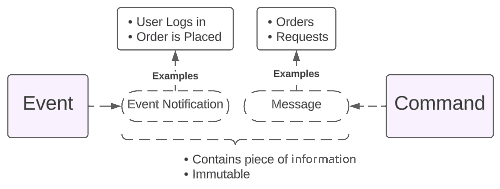

图 2.4：事件和命令的示例

首先，我们有**事件**。事件基本上是发生的事情——例如用户登录或订单被下。然后我们有**命令**。命令就像订单或请求，告诉其他事物去做某事。

事件可以以事件通知的形式进行通信，命令以消息的形式。它们非常相似——它们都包含信息。有时事件通知也被称为消息。在实践中，人们通常只称它们为事件。但从技术上讲，事件是发生的事情，而不是关于它的通知。事件与命令不同，命令更多地关于意图。但在这个章节中，我们将简单地称它们为事件以保持简单。这些事件可以包含关于发生的事情的数据，或者只是通知。它们是不可变的，这意味着一旦创建就不能更改。EDA 围绕这些事件展开。关于它是否只是事件或包括其他消息也存在一些争议。但到目前为止，只需关注通过系统流动的事件即可。

好的，所以在 EDA 中，通常有三个主要**组件**，如上图所示：

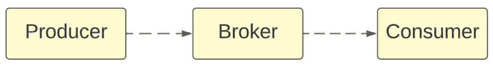

图 2.5：EDA 组件

首先，**生产者**创建事件。然后**代理**将事件重定向到正确的**消费者**，消费者根据事件采取相应的行动。

## 什么是事件溯源？

在本节中，我们将讨论事件溯源以及它如何有助于跟踪应用程序中的更改。基本上，除了保存最终状态外，您还可以将每个发生的变化记录为事件。这些事件存储在称为**事件日志**的东西中，它们按顺序排列，以便您可以查看完整的历史记录。通过从头到尾阅读事件日志，您可以实际上重建应用程序的整个状态！这就是人们所说的**事件溯源**。

让我们现在通过一个示例事件日志架构，然后简要谈谈事件溯源的主要功能之一——并行处理。

### 事件日志模式示例

再次以电子商务商店为例。假设您想跟踪所有产品的库存水平。嗯，您可以有`ProductAdded`事件，该事件存储产品 ID 和每次补货时添加了多少产品。当有人购买东西时，您会记录一个带有 ID 和数量的`ProductPurchased`事件。通过按顺序重新播放所有这些事件，您可以始终知道当前的库存水平，无论发生什么。事件溯源对于需要随时间变化的全部变更审计跟踪的任何事物都非常有用。如果您希望您的应用具有那种类型的历史数据，这绝对值得一试。

*图 2.6*展示了事件日志如何排序库存。

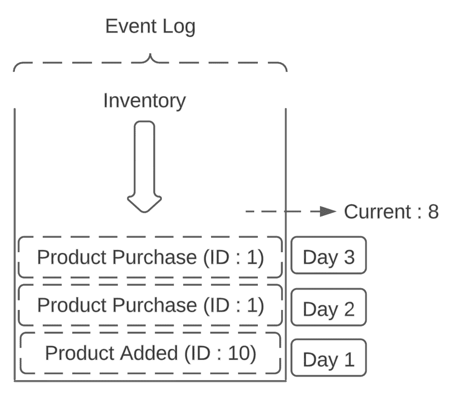

图 2.6：事件日志——详细示例

现在让我快速为您分解一下。首先，我们在我们的库存中添加一些产品——比如说我们添加了 10 个产品。后来，一些客户开始购买这些产品。我们得到了一个关于一个产品的购买事件，然后又得到了另一个关于另一个产品的购买事件。现在这里有个有趣的部分——我们可以在任何时间查看我们的事件日志，并找出我们当前的库存是什么！我们知道我们开始时有 10 个产品。然后我们有两个购买事件，这意味着我们现在必须有 8 个产品了。

事件溯源的关键之处在于我们可以在任何时候将库存重置为零。我们可以删除我们有多少产品。但只要我们有那个事件日志，我们就可以随时回去重新计算我们应该有多少产品，基于所有的事件！

总结来说，事件溯源使用事件日志来跟踪所有发生的事情，这样您就可以随时回到过去，查看数据在任何时刻的样子，并检查数据的先前状态。例如，假设在第一天您向库存中添加了 10 个产品。第二天，有人购买了一个产品。第三天，另一个人又购买了一个产品。使用事件溯源，您可以回顾并确切地看到第二天或甚至第一天库存的样子。这对于调试或在其他地方复制数据非常有用。您所要做的就是重新播放事件日志——无需手动从头开始设置一切。

### 并行处理

并行处理是事件溯源的一个非常有用的功能，当您有多个应用或服务从相同的数据源读取时。而不是每个应用都必须等待它们的轮次来读取东西，它们可以并行地同时读取。如果您有远多于写入者的读取者，这非常完美。

假设您有一个跟踪您系统中所有发生的事件的日志。而不是一个应用读取日志然后下一个应用读取，它们可以同时读取，如下所示：

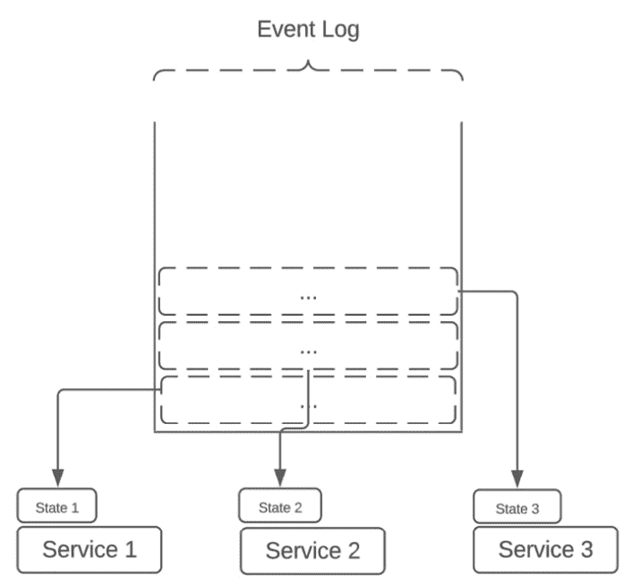

图 2.7：并行处理功能

只要日志中的数据不发生变化，就可以进行大量的并行读取，没有问题。这非常关键，因为它意味着每个应用程序都可以独立地从日志中获取它所需的内容，并执行自己的处理，而不会干扰其他应用程序。它们可以并行处理。只要日志只添加新事件而不修改旧事件，一切都会保持一致。

因此，并行读取是最大化吞吐量和充分利用所有资源的一种很好的方法。

## 事件驱动架构和 Event Sourcing 之间的区别

EDA 是关于组件通过事件进行通信的。当系统中发生重要事件时，它会发出一个事件。其他组件可以订阅这些事件并相应地做出反应。这种松散耦合使得 EDA 对于可扩展性和实时响应性非常出色。你在微服务、消息系统和物联网应用程序中经常看到它。

在 Event Sourcing 中，除了存储当前数据状态外，它还存储了随时间变化而改变数据的所有事件的日志。因此，当前状态是通过重新播放所有这些过去的事件来重建的。这对于审计、拥有不同的版本和分析历史数据非常有用。Event Sourcing 还与 CQRS（将读取和写入分离）很好地协同工作。写入端存储事件，而读取端针对查询进行了优化。

虽然 EDA 和 Event Sourcing 都涉及事件，但它们关注的重点不同。EDA 更多的是关于组件如何通过事件进行通信。Event Sourcing 是关于将事件日志持久化以表示随时间变化的状态变化，从而受益于包括审计和版本在内的东西。你可以将 Event Sourcing 作为事件驱动系统的一部分，但它们各自解决自己的问题。

## Event Sourcing 模式的真实世界示例

在 Event Sourcing 中，每一个变化都是按顺序记录下来的，这样我们就可以始终回顾并看到事物是如何随着时间线而变化的。我们可以通过一个名叫莎拉的人的故事来更好地理解这一点，以及她如何与一个在线平台互动。她的活动，比如发布状态或添加联系信息，都被记录为一系列事件。每个事件都是交易的一部分，并有一个唯一的序列 ID，确保每个变化都能追踪到时间顺序。在我们的下一个示例中，每个事件都保持为 **JavaScript 对象表示法**（**JSON**）格式。

这里是莎拉操作创建的事件列表：

1.  **事件 1 – 账户创建** – 旅程始于莎拉创建她的账户：

    ```java
      {
        "event": "Account Created",
        "transactionId": "tx200",
        "sequenceId": 1,
        "date": "2023-03-01",
        "userId": "user123",
        "details": {
          "name": "Sarah",
          "email": "sarah@example.com"
        }
      }
    ```

1.  **事件 2 – 电子邮件更新** – 稍后，莎拉更新了她的电子邮件地址：

    ```java
      {
        "event": "Email Updated",
        "transactionId": "tx200",
        "sequenceId": 2,
        "date": "2023-03-05",
        "userId": "user123",
        "details": {
          "newEmail": "s.new@example.com"
        }
      }
    ```

1.  **事件 3 – 添加邮寄地址** – 然后，莎拉在她的个人资料中添加了一个邮寄地址：

    ```java
      {
        "event": "Address Added",
        "transactionId": "tx200",
        "sequenceId": 3,
        "date": "2023-03-10",
        "userId": "user123",
        "details": {
          "address": "123 Main St, Anytown, USA"
        }
      }
    ```

1.  **事件 4 – 更新姓名** – 之后，她决定更新个人资料中的姓名：

    ```java
      {
        "event": "Name Updated",
        "transactionId": "tx200",
        "sequenceId": 4,
        "date": "2023-03-15",
        "userId": "user123",
        "details": {
          "name": "Sarah N."
        }
      }
    ```

1.  **事件 5 – 添加电话号码** – 最后，莎拉添加了她的电话号码：

    ```java
      {
        "event": "Phone Number Added",
        "transactionId": "tx200",
        "sequenceId": 5,
        "date": "2023-03-20",
        "userId": "user123",
        "details": {
          "phoneNumber": "555-1234"
        }
      }
    ```

当我们按照事件记录的顺序处理这些事件时，我们能够重建 Sarah 的个人资料在任何时间点的当前状态。每个事件都是不可变的，所以一旦事件被记录，就不能更改。这个账户提供了关于 Sarah 个人资料随时间变化的非常清晰和全面的历史记录。

总之，事件溯源提供了一个非常强大的框架，用于记录和管理系统状态的变化。它在需要详细审计跟踪和历史数据分析的场景中表现出色。事件溯源将每个更改记录为一个独立的事件，提供了数据演化的强大概览，使系统不仅能够展示当前状态，还能够回顾和分析过去的状态。因此，这是一种对复杂系统非常有价值的方法，其中理解数据的旅程与系统本身一样重要。

# 事件溯源与 CQRS 的关系

我们在 *事件溯源* 部分的开头提到，我们将发现 CQRS 如何融入更大的图景，所以现在让我们结合在前几节中学到的所有概念。好的！基本上，在 CQRS 中，你写入数据的方式与读取数据的方式不同。在过去，你可能只是使用一个数据库来处理所有事情。你可以执行诸如插入数据然后立即从同一位置获取数据等操作，如果你只是进行基本的创建、读取、更新和删除操作，这工作得很好。但有时你可能想分别扩展写入和读取的量。或者你可能需要为读取和写入提供不同的数据视图。这就是 CQRS 发挥作用的地方。

*图 2**.8* 展示了命令和查询如何与数据库交互：

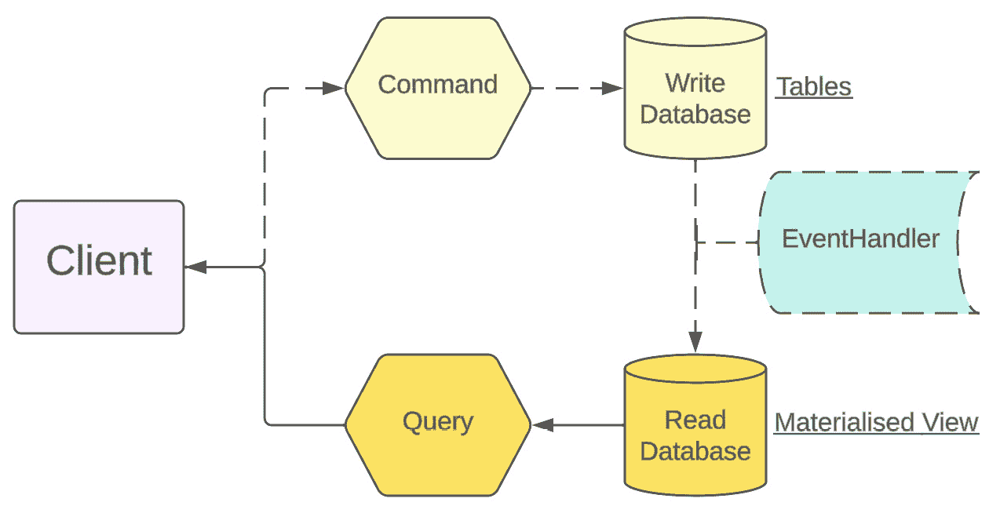

图 2.8：CQRS 模式的表示

基本的想法是，你将数据写入的方式与查询或获取数据的方式分开。因此，你可以写入一个针对插入速度优化的数据库，然后设置一个单独的数据库，专门用于读取，在那里你可以结合来自其他服务的多个数据源，以提供定制的信息视图。将写入和读取分开，使你能够根据具体需求独立扩展。它还允许你以不同的方式对数据进行转换，以适应不同的用途。

因此，假设我们有一些服务——我们有一个支付服务、运输服务和订单服务。每个服务都在使用事件日志跟踪其流程部分的情况。

支付服务知道哪些支付成功，哪些失败。运输服务知道所有交付的位置。订单服务拥有每个用户的完整订单历史。

现在我们想要创建一个页面，让用户在一个地方查看他们所有的历史订单。嗯，为了做到这一点，我们的订单回顾功能将使用所有三个服务来在一个地方显示所有历史订单。它将向支付服务请求支付信息，向运输服务请求运输状态，以及向订单服务请求基本订单详情。

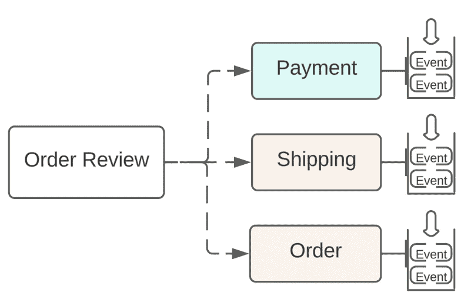

图 2.9：放大服务端

然后，它将所有这些数据合并成一个整洁的页面，让用户能够在一个地方看到他们订单历史的全貌。即使每个服务独立使用事件处理自己的部分，我们仍然可以将它们全部结合起来，为用户提供一个统一的视图！

使用 CQRS 的主要好处是它允许你在不同的系统中分离读取和写入。这允许你独立扩展它们。如果你有更多的读取而不是写入，或者相反，你可以独立扩展这些部分。你也可以有不同的逻辑——你可以在写入时进行额外的处理，或者在你读取时添加额外的层或功能。你也可以从不同的系统中获取信息。

最后，让我们看看事件溯源和 CQRS 模式在更大图景中是如何协同工作的：

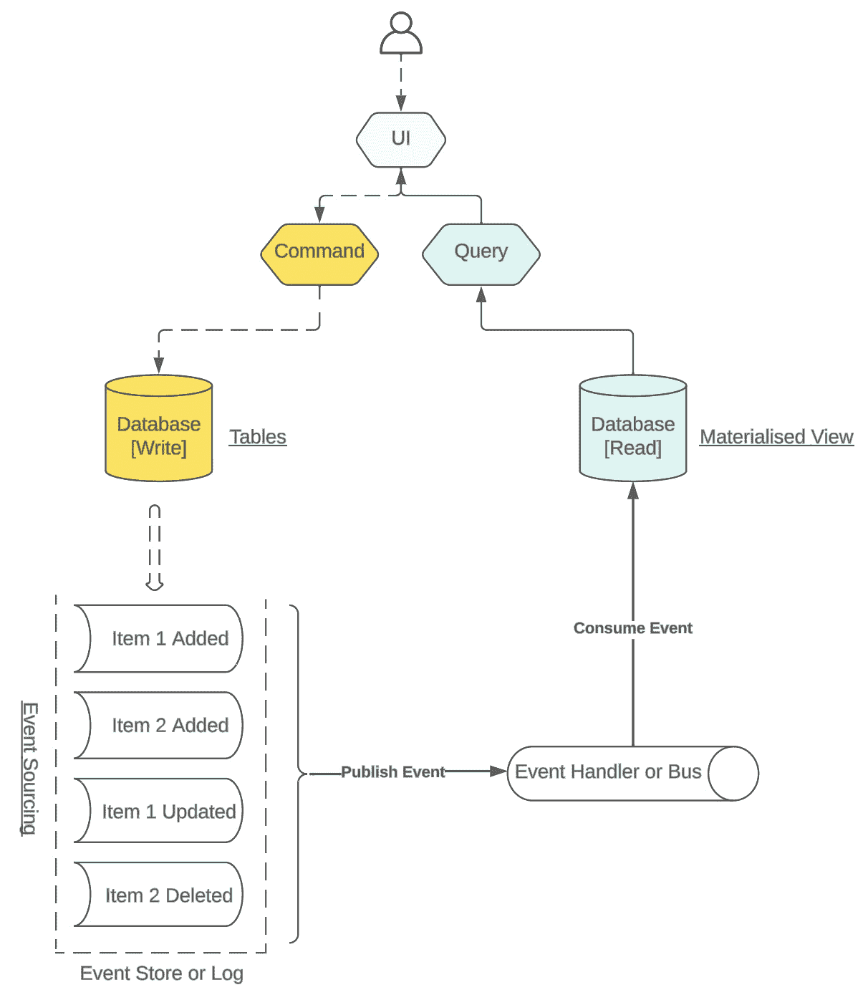

图 2.10：带有 CQRS 的事件溯源模式

让我们一起通过这个图表来了解一下：

+   **UI**: 用户界面

    首先，用户界面就像我们办公室的前台。这是您，用户，进行交互的地方。您可以下达指令（命令）或请求信息（查询）。

+   **命令**: 完成任务

    通过用户界面下达命令就像发送请求去完成某事——比如添加一个新文件或更新一个现有文件。这个命令被系统接收，执行其魔法，并更新我们的“写入”数据库，我们在那里跟踪所有这些变化。

+   **查询**: 请求信息

    现在如果你感兴趣的是信息，那就是一个查询。这就像在办公室里请求某人帮你拿出一个文件。这个信息是从专门为读取目的设计的另一个数据库中提取的。它更快、更干净，有点像每次都准备好一套文件供查看。

+   **事件溯源**: 详细记录

    现在，到了有趣的部分。在事件溯源中，系统会保留每个单独变化的详细日志，而不是只保留最新的更新——更像是每个单独动作的日记条目。每个这样的动作，添加或移除某些东西，都被记录为一个事件。

+   **事件存储或日志**: 系统的记忆

    日志或事件存储实际上是系统的记忆。它保存了所有这些事件记录。如果需要，可以滚动查看这个日志，查看其完整的历史变化，甚至可以回放它们来了解系统是如何到达当前状态的。

+   **发布事件**：传播新闻

    在成功处理命令后，系统不仅更新数据库，还广播一个事件。它就像是对全世界喊出刚刚发生了什么变化的公告。

+   **事件处理器或总线**：信使

    事件总线或处理器与办公室信使没有区别。它捕获事件并将消息传递到所有相关的地方，以便读取数据库更新为最新信息。

+   **数据库（读取）**：优化快速访问

    读取数据库的存在是为了使信息访问快速且容易。它与写入数据库不同，并且被设置成能够让您迅速且毫不犹豫地获取信息。

+   **物化视图**：准备就绪的信息

    最后，我们带来了物化视图。它是数据的快照，本质上已经准备并优化了您的查询。把它想象成一个总结报告，随时可用。

*图 2.10* 展示了一个智能且高效的系统，其中任务被巧妙地分配给所有其他便于管理和执行对数据仓库查询以及数据仓库本身的资源。在一侧，您有改变事物的命令，在另一侧，您有获取信息的查询。在事件源中，每个变化的完整历史都有记录。它就像是一个运行顺畅、高效、有组织且透明的公司办公室工作流程，在这个过程中没有任何东西被放置不当或丢失。

# 事件源模式下的 CQRS 的真实世界示例

在本节中，我将提供一个使用 CQRS 和事件源的真实世界银行系统示例图。我们将关注银行账户方面。以一个涉及开设账户、存钱、处理交易和关闭账户的银行为例。为了充分执行这些任务，银行实施了一个基于 CQRS 和事件源的系统。

以下图显示了系统的工作方式：

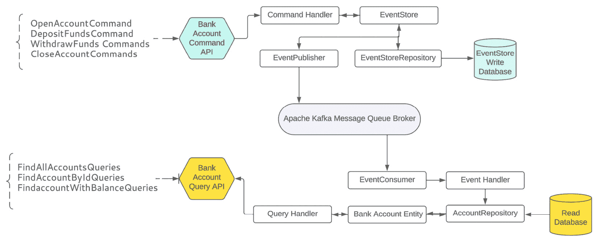

图 2.11：使用事件源模式的 CQRS 模式的银行示例

让我们用简单的话来分解这个图：

+   `OpenAccountCommand`就像走进银行并说，“我想开设一个新账户。”这些命令是**银行账户命令 API**的一部分，这只是说这个系统理解并处理您要求银行做的事情的一种花哨的说法。

+   **命令处理器**：这可以被认为是银行员工，他们接受您的请求并启动流程。处理器确保执行您命令所需的所有步骤。

+   **事件存储**：用户所做的每一件事（例如开设账户）都会以*事件*的形式存储在一个称为*事件存储*的特殊数据库中。它就像一本详尽的日记，记录了所有发生的事情。

+   **事件发布者**：这是银行中的一个扩音器，它会告诉每个人刚刚发生了什么。例如，当你开设账户时，事件发布者就会告诉整个系统，“嘿，一个新的账户*被开设了！”*

+   **Apache Kafka 消息队列代理**：Apache Kafka 就像银行的邮件系统，确保消息（事件）被发送到正确的部门。它非常高效，即使银行非常繁忙，每一条消息都能被传递。

+   **事件消费者**：这个系统组件是一个监听器。它监听任何与之相关的公告（事件）。

+   **事件处理器**：如果事件消费者就像是在听公告的员工，那么事件处理器就是那个实际接收信息并相应更新银行记录的员工。

+   `FindAllAccountsQueries`。

+   **查询处理器**：这与接受你的查询并为你查找信息的客户服务代表非常相似。

+   **读取数据库**：这是一个独立的数据库，银行在这里保存可以读取的信息——例如，你的账户余额，甚至所有账户的列表。它组织得很好，任何形式的信息都可以轻松快速地获取。

上述图表基本上只是详细说明了银行系统中两个不同的过程——一个是执行事务（例如，开设账户的过程）另一个是查询事务（例如，查询你账户中的金额）。它们协同工作但又是独立的，使得整个银行系统运行得既顺畅又高效。执行部分将发生的一切记录为事件并记住所有信息，而查询部分则使用简化的数据库来快速回答你的问题。

到目前为止，我们已经了解了一些在微服务架构中常用的架构设计。在下一节中，我们将简要讨论一些其他架构设计。

# 其他架构模式的简要概述

在本节中，我们将提到一些额外的架构模式。使用模式有助于提高开发效率和生产率。它还有助于优化成本和提高规划——基本上，它使一切变得更简单。

有许多不同的企业模式可供选择。为了帮助您为项目选择正确的模式，我已经汇总了一些模式的摘要。

## 面向服务的架构（SOA）设计模式

面向服务的架构模式有点像用乐高积木构建软件。你将整个程序分解成更小的可重用组件，称为**服务**。

每个服务都有自己的特定任务。它可以独立工作，不需要整个程序。但这些服务会互相交流，以完成所有工作。

这有点像如果你有一个大项目，然后把它分成不同的部分供不同的人处理。每个人只关注他们自己的部分，而不担心其他人正在做什么。最后，所有部分都会汇集在一起。

这使得软件更加灵活，并且以后更容易更改。就像乐高积木一样，你可以使用相同的部件来构建很多不同的东西，而不必总是从头开始。交换东西更容易。

在*图 2.12*中，我们可以看到 SOA 的一般设计：

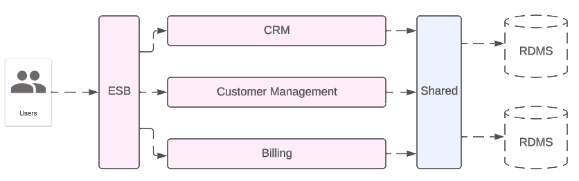

图 2.12：SOA 设计模式的示例

如我们所见，在服务和用户之间有一个**事件服务总线（ESB**）。它将任务在服务之间进行委派。在服务和数据库系统之间有一个**共享**层。通过这一层，所有服务都可以访问它们所需的所有数据，即使这些数据不是由该服务创建的。

因此，总的来说，这个模式将程序分解成更小的通信服务，就像将项目分解成部分或使用可重复使用的积木来构建一样。随着时间的推移，这使得软件更容易使用。

## 电路断路器模式

电路断路器模式完全是关于构建能够处理问题而不会崩溃的软件。代码中的断路器与电路中的断路器工作方式相似。如今，许多程序都依赖于许多不同的部分在网络中协同工作，对吧？但有时其中一个部分可能会崩溃。使用电路断路器模式，你的程序会持续检查不同的部分是否正在正常通信。如果它注意到同一个部分反复出现错误，它将暂时阻止对该部分的任何更多请求。这可以防止整个系统因为一个小故障而超负荷运行。而不是让一切停滞不前，程序可以在那个问题部分整理好之前继续运行。对于创建既能弯曲又不会断裂的软件来说，这非常方便！

为了更好地理解这个模式，请参阅*图 2.13*：

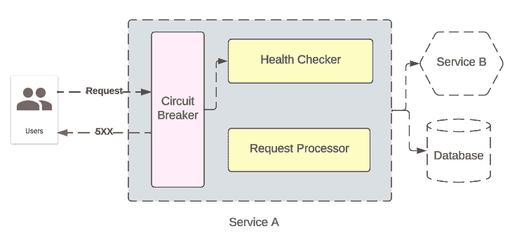

图 2.13：电路断路器模式的示例

在电路断路器模式中，如我们的图所示，**服务 A**是负责处理用户请求的主要服务，并有一些关键内部组件，如**健康检查器**和**请求处理器**，负责监控系统的健康状态以及它与用户的交互。这个**服务 A**由关键玩家**电路断路器**所中介，它监视失败的请求，一旦达到一定数量，就会像真正的电路断路器一样跳闸，停止任何进一步的请求，以防止系统过载，从而允许恢复时间。

这种机制不仅旨在保护**服务 A**，而且也是一种保护外部依赖（如**服务 B**和数据库）免受压垮的方法。这是一个安全措施，有助于使系统稳定，从而防止构成微服务架构的其他服务像多米诺骨牌一样倒塌。

## 分层设计模式

分层设计模式是程序员以有组织的方式结构化代码的一种方法。基本上，它所做的就是将软件分解成不同的层级，每个层级都有自己的特定任务。

层级是层层叠放的，较低层级为较高层级提供服务。因此，最底层的重点将放在数据访问或硬件接口等方面。然后，下一层级可以使用这些较低层级的服务来完成诸如业务逻辑等任务，而顶层则更多地关注接口，例如用户界面。

通过这种方式将一切分开，使得代码更容易管理和维护。程序员可以在单个层级上工作，而不必过多担心其他部分。由于每个层级都有一个明确的目的，因此代码的重用也更容易。如果你需要更新数据的存储方式，你只需更改底层而不是在整个程序中挖掘。

总体而言，它促进了一种逻辑结构，其中每个新构建的层级都依赖于下面的工作。这种分层设置有助于将大型和复杂的软件系统组织成可理解和可管理的块。

在下面的**图 2.14**中，我们可以看到分层设计模式的整体样子：

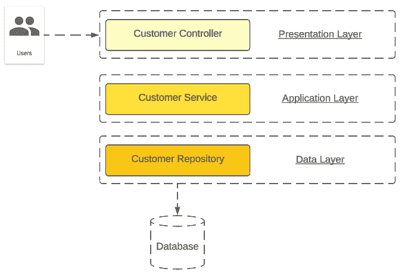

图 2.14：分层设计模式的示例

如图中所示，每一层都是相互隔离的，它们不能跳过一层直接与另一层通信。因此，通过这种设计，你可以将用户交互保持在控制器层，执行业务逻辑在应用层，并将数据库操作保持在数据层。

## MVC 设计模式

**MVC**代表**模型-视图-控制器**，基本上将一切分为三个部分。这是构建 Web 和移动应用的一种非常常见的设计模式！

模型是存储所有重要内容的地方，例如用户账户、帖子、产品——你叫什么名字！这是应用程序的核心数据和逻辑。

视图是用户在屏幕上看到的内容——例如 HTML、CSS，如果是单页应用，可能还有模板。它渲染模型数据，以便用户可以查看。

然后我们有了控制器！它处理用户所做的所有操作，包括点击、表单和 API 调用。当发生某些事情时，控制器会找出原因，如果需要，更新模型，并告诉视图进行更改。

通过这样分离代码，随着时间的推移，代码保持超级干净和有序。你可以调整一部分而不太影响其他部分。此外，它还提供了灵活性，可以重新使用或替换其中的部分。

*图 2.15* 展示了一个 MVC 设计的示例，接下来我们将讨论请求如何返回视图：

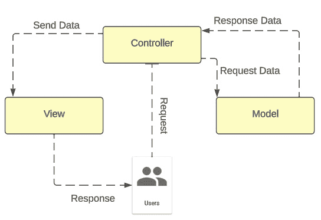

图 2.15：MVC 设计模式的示例

在前面的图中，我们可以看到一个与之前分层架构设计模式非常相似的图。然而，在这里，我们没有应用层。业务逻辑在控制器和模型层之间划分。当用户发起请求，并在应用业务逻辑之后，控制器返回一个视图，这可能是一个网页或 JSON 对象。

总结来说，MVC 是构建用户界面的最佳模式，它使应用程序开发变得非常容易，并且可以长期维护和有序。

## Saga 设计模式

Saga 设计模式对于构建分布式系统来说非常酷！它有助于管理长事务，并保持不同服务之间的数据一致性。当你在多个服务中分散多个相关步骤时，维护原子性和一致性是困难的。但 Saga 为你解决了这个问题！

当你有一个由许多微服务组成的大型分布式系统时，Saga 模式是完美的。有时你需要一个涉及多个步骤的业务事务，这些步骤发生在不同的服务中。没问题！使用 Saga，你可以将事务分解为一系列较小的交易，每个交易都完全包含在单个服务中。它协调所有数据流，确保每个请求最终正确对齐，而不需要复杂的分布式事务。分布式事务可能很复杂且难以扩展，但 Saga 避免了所有这些，以确保顺利航行。

如*图 2.16* 所示，Saga 设计模式是一种处理复杂、多服务交易的技术，例如电子商务环境中的订单、支付和运输服务：

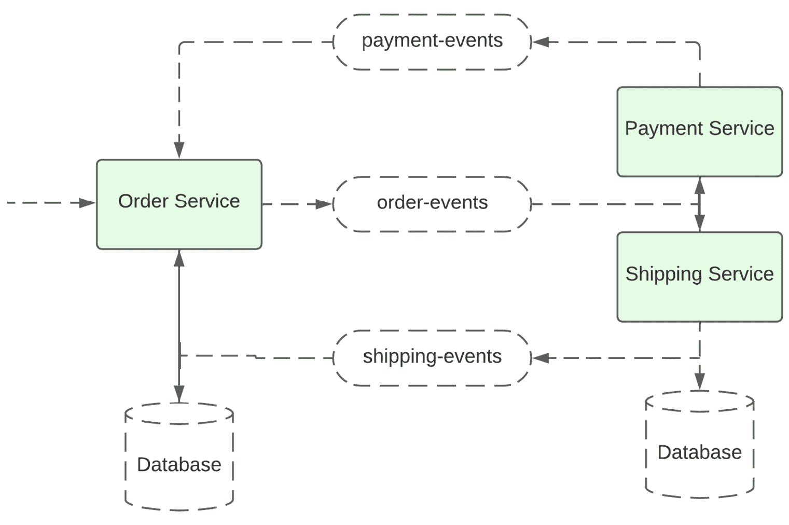

图 2.16：Saga 设计模式的示例

让我们分解前面的图。订单服务启动一个多步骤事务，每个步骤都由不同的服务处理。它们通过事件流进行通信，确保事务的每个步骤按顺序发生。如果任何步骤出现问题，应采取特殊措施（需要一些抽象来说明发生了什么，但图上未显示）来*撤销*确保一切*恢复*的先前步骤。每个服务都有自己的数据库，因此它们可以独立操作，而 Saga 模式确保整个事务要么完全成功，要么在出现任何问题时得到适当的补偿。这对于管理系统中不同服务必须无缝协作的复杂事务至关重要。

# 摘要

让我们回顾一下本章学到的内容，并展望接下来我们将要讨论的内容。以下是我们的学习成果：

+   **DDD**：确保我们的软件开发工作与特定业务需求正确对齐的策略。这种方法指导我们创建真正服务于其预期目的的软件。

+   **CQRS**：我们学会了有效地管理数据，将更改数据的操作（命令）与检索它们的操作（查询）分开。这种分离旨在提高我们系统的性能和可靠性，使其在实际用例场景中更具可行性。

+   **事件溯源**：这种模式涉及将系统中的每次更改都记录为事件。当你跟踪随时间的变化时，它特别出色，并且是理解整个生命周期中决策和行动历史的基本构建块，这对于系统的操作至关重要。

+   **设计架构的好处**：我们学会了如何构建健壮、高效且与业务对齐的系统，如何构建软件以更好地管理数据，以及如何共享现代商业应用程序预期的功能和非功能需求。

现在我们期待着阅读*第三章*，我们将学习如何使用 Spring Boot 构建响应式的 REST API，并深入探讨异步系统和背压原理。本章重点介绍设计网络应用程序的高级原理和概念，考虑到我们从*第一章*和*第二章*中获得的软件架构理解，以便开发既响应又高效的应用程序。
