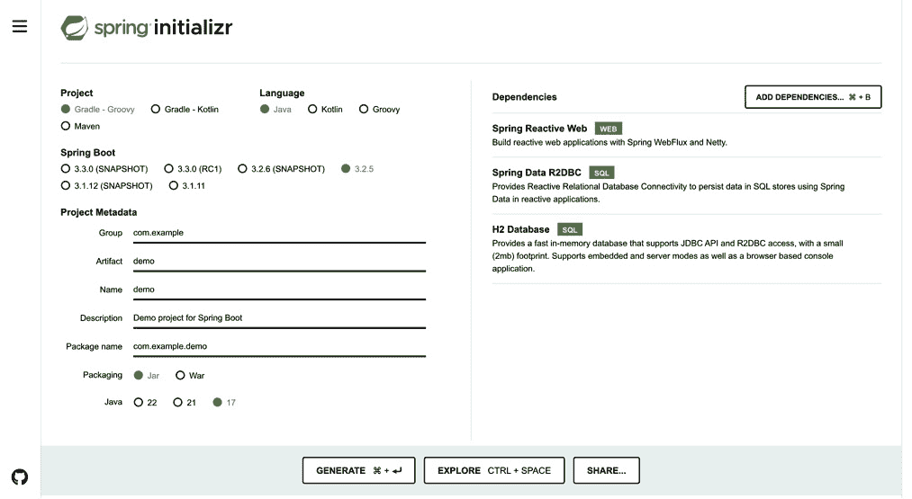

# 3

# 反应式 REST 开发和异步系统

到目前为止，我们已经利用微服务和 **Spring Boot 3.0** 的功能构建了我们的理论基础。现在，是时候动手实践了。我们将学习并使用 Spring Boot 3.0 进行反应式编程。我们将回顾说明并构建我们的第一个反应式 REST 应用程序。我们还将讨论 **背压**以及它如何帮助我们的应用程序。

在本章中，我们将涵盖以下主要主题：

+   反应式编程基础知识介绍

+   构建反应式 REST API

+   异步系统和背压

# 技术要求

对于本章，我们需要以下内容：

+   `JAVA_HOME` 环境变量设置为 JDK 17 目录，并且您的 PATH 包含 JDK 17 的 bin 目录

+   一个现代的 **集成开发环境**（**IDE**）：我推荐 IntelliJ IDEA：

    +   **下载 IntelliJ IDEA**: 访问 JetBrains 网站，选择您喜欢的版本（社区版或终极版）。

    +   **运行安装程序**：下载后，运行安装程序并按照说明操作。选择适合您需求的设置和插件。

    +   **启动 IntelliJ IDEA**：安装后，打开 IntelliJ IDEA 并根据需要进一步配置它，熟悉其界面。*   **GitHub 仓库**：

    +   *构建反应式 REST API*部分的代码可在[`github.com/PacktPublishing/Mastering-Spring-Boot-3.0/tree/main/Chapter-3-Building_Reactive_REST_API`](https://github.com/PacktPublishing/Mastering-Spring-Boot-3.0/tree/main/Chapter-3-Building_Reactive_REST_API)找到

    +   *异步系统和背压*部分的代码可在[`github.com/PacktPublishing/Mastering-Spring-Boot-3.0/tree/main/Chapter-3-Implement_back-pressure`](https://github.com/PacktPublishing/Mastering-Spring-Boot-3.0/tree/main/Chapter-3-Implement_back-pressure)找到

    +   请下载或克隆代码，并按照这些仓库的内容进行操作*   **Curl 安装：**

    +   请从[`curl.se/download.html`](https://curl.se/download.html)下载您操作系统的安装包

    +   按照说明在您的本地机器上安装它

# 反应式编程简介

谈到响应式编程的基础，首先，我想说的是，没有任何解决方案/方法可以满足每一个需求。因此，项目有不同的问题，根据问题，有不同的解决方案。其中之一是**响应式编程方法**。在这里，我们将学习如何使我们的应用程序在面对处理大量请求和提供快速响应等特定要求时更加响应迅速、高效和健壮。随着我们深入概念和实践，您将看到这种方法如何从根本上改变您能构建的应用程序的本质——使它们完全准备好应对实时用户期望和高数据吞吐量带来的挑战。在下一节中，我们将探讨响应式编程的一些基础知识。

## 介绍响应式编程基础知识

让我们从响应式编程是什么开始。为了理解它，我们首先需要定义其核心术语。

### 接受新的范式——异步性和响应性

响应式编程引入了一种创新的软件开发方法；它是异步响应。传统的编程事件一个接一个地执行，而在响应式编程中，许多事件是并行发生的。异步性使得您的应用程序不会浪费时间等待，并继续处理其他任务。这使得它显著更快、更响应。

### 响应式的本质——数据流和传播

在其核心，响应式编程实际上关乎**数据流**和对这些流中变化的响应。想象一下，数据流就像一条始终向前移动和变化的信息传送带。任何用户输入、消息或实时数据都可能属于这个流。在响应式编程中，您使用称为**可观察者**的概念来处理这些流。

可观察者就像信使，当新数据到达时，它会通知应用程序的各个部分。随着数据通过这些流流动，它们可以被转换、组合或响应。我们将在以下章节中看到这些概念的应用。当新数据到达或数据状态发生变化时，应用程序的相关部分会立即更新。这被称为变化的传播，它始终确保您的应用程序反映当前的事态，并根据需要调整和响应。

在响应式编程中，不仅关乎如何有效地处理数据，还关乎让您的应用程序感觉生动且交互式。我们正在处理的应用程序可能是一个新闻实时流、社交媒体更新或实时控制系统——响应式编程可以帮助您构建能够跟上当今信息节奏的软件。

在本文的后面部分，我将解释术语，深入探讨一些好处，然后展示如何使用 Spring Boot 3.0 等工具使构建这些反应式系统更加容易。所以，无论你是这个概念的新手，还是希望通过更好地理解反应式编程来提高自己的技能，它都是你开发者工具箱中的一个强大多用途工具。那么，让我们继续前进，我将通过这种新颖的方法向你展示我们如何革命性地思考并构建软件。

## 对比范式 - 反应式编程与传统编程

为了使其更清晰，我们可以将反应式编程与传统开发方式进行比较。在学习软件开发时，我们首先理解流程算法。我们都很清楚传统方式，因此，这种比较将帮助我们理解新方式。让我们分析从传统到反应式编程的转变，了解它是如何改变我们的代码行为以及我们的应用程序性能的。

在传统编程中，操作通常逐个处理。这被称为**阻塞**。假设你在一个购物中心，在你挑选好商品后，你加入了一个收银台前的付款队列。收银员在当前顾客完成付款后才会接受下一位顾客。这种流程就是传统编程的工作方式。当顾客很多时，解决方案是开设新的收银台。这种方法也是可扩展的，但你需要增加服务器的数量来处理大量的顾客。

反应式编程引入了一个非阻塞模型。在这种方法中，任务在必要的资源可用时立即处理，同时应用程序可以在其间继续做其他事情。在我们的前一个例子中，收银员不必排队等待，可以同时处理多个顾客。当一个顾客试图找到信用卡时，收银员可以扫描下一位顾客的商品。当下一位顾客试图把商品放入袋子时，收银员可以从另一位顾客那里收取付款。在反应式编程中，这些过程不会混淆。在用户期望快速响应的应用程序的世界中，这种处理多个任务的变化至关重要。

总结来说，从传统到反应式编程的转变完全是关于让你的应用程序更加响应、高效和适应。在下一节中，我们将探讨有助于我们理解反应式编程的术语。

## 探索反应式编程的词汇表

为了更好地理解反应式编程，我们需要学习其基本词汇。本节将用简单的英语定义术语，这将使你能够舒适地使用反应性的语言。我们将解码以下列表中你可能会遇到的一些最常见的术语：

+   **可观察对象**：在最简单的意义上，你可以将可观察对象想象成出版者。你也可以将其想象成发送最新新闻/信息的新闻广播者。在编程术语中，它是你想要处理的数据或事件的流。它可以是从网页上的点击到通过网络传入的数据的任何数量的事物。

+   **观察者**：如果可观察对象是发送事件的广播者，那么观察者就是订阅并当事件发生时被通知的听众或观众。它是你的代码中“观察”或“监视”可观察对象并对其发出的数据或事件做出反应的部分。每当有新数据到达时，观察者会通过更新用户界面、处理数据或执行任何其他必要的任务来做出响应。

+   **订阅**：这是可观察对象和观察者之间的联系。当观察者订阅可观察对象时，它开始接收来自它的更新。可以将其想象成订阅通讯或关注社交媒体上的某人——你实际上是在说：“我对你说的话感兴趣。”

+   **主题**：主题是一种特殊的可观察对象，它可以充当可观察对象或观察者。它允许值和事件被发出并传递给观察者，同时也可以通过成为观察者来监听可观察对象。可以将其想象成一个团队，你是经理，你提供更新并倾听团队中的人。

+   **背压**：想象一下在饮水机边喝水，水流得太快。背压就是能够控制这种流动，这样你就可以舒适地喝水而不会被淹没。在编程环境中，背压代表的是控制两个交互组件之间数据流动速率的能力，以便通信通道的接收端不会因为无法处理的数据而超负荷。这确保了应用程序在尽可能处理数据的同时不会变得无响应，并保持稳定。

+   **异步操作**：在同步世界中，通常认为一个任务必须完成，另一个任务才能开始。然而，在异步操作中，多个任务可以同时运行。这类似于厨房的性质，厨师可以在等待汤煮沸的同时切菜和准备沙拉。在编程术语中，这意味着你的应用程序可以在处理用户输入的同时执行计算和加载数据，而不是等待每个过程完成后再进行下一个过程。

在您开始使用 Android 进行响应式编程之前，这些基本术语与学习驾驶规则一样重要。它们是掌握响应式编程的核心，并将在您开始开发应用程序时导航响应式高速公路时，不仅帮助您了解概念，还能帮助您获得其原则的情境知识。随着您对这些概念深入了解，您将意识到它们不仅仅是理论概念，而且是实用的工具，将赋予您作为开发者的能力，以创建对用户来说既吸引人又强大的软件。在了解所有响应式编程的基本术语后，我们将关注如何决定使用这种方法而不是传统方式。

## 识别响应式编程的机会

当涉及到将响应式编程集成到您的项目中时，我们应该知道何时何地应用它以提升我们的应用程序性能和用户体验。让我们探讨选择响应式的理想场景以及如何评估它是否符合您的特定需求。

以下是一些理想的响应式编程场景，表明何时从传统编程转向响应式编程：

+   **实时用户界面**：如果您的应用程序显示实时更新（例如，实时体育比分、股票行情、社交媒体动态等），那么响应式编程对这个应用程序来说是一个相当好的提升。它负责保持用户界面的快速速度，并立即正确地响应变化。

+   **复杂的网络应用程序**：响应式编程在管理需要重复调用网络的程序方面证明是有益的，例如聊天应用或在线游戏。使用响应式编程，通信得到妥善管理以及优化，即使在重负载期间，也能保持良好的数据流。

+   **微服务架构**：响应式编程为围绕微服务架构构建的系统提供了两个关键的性能和弹性优势。广泛地说，每个服务都可以独立以及异步地处理请求，这提供了更高的响应性和容错性。

+   **物联网和数据流**：考虑数据在响应式系统中从设备或传感器连续流出的场景。异步响应式编程将实现良好的流管理，这允许实时流处理以及对传入数据的响应，这是物联网应用或甚至在数据分析环境中的基本用例。

在更清楚地理解上述场景后，您将更有能力判断响应式编程是否是您应用程序的最佳方法。这一切都围绕着将应用程序的需求和挑战与响应式编程带来的优势相匹配。

要评估响应式需求，请参考以下列表：

+   **性能要求**：考虑你的应用程序的响应性和速度要求。如果你的用户期望应用程序快速响应并且比静态页面更具交互性，那么反应式编程是必要的。

+   **数据量与速度**：估计你的应用程序需要处理的数据量和速度程度。在涉及大量数据或高速数据流的应用中，反应性可能引入所需的鲁棒性和速度。

+   **操作复杂性**：审查你的应用程序正在执行的操作的复杂性。无论是复杂的异步任务处理还是复杂的用户交互动态，你的反应式应用程序将提供更有效的解决方案。

+   **资源限制**：考虑可用的硬件和资源。与资源使用相关的反应式编程，与传统编程相比，可能更合理地进行优化，因此它是适用于资源受限环境的适当范例。

我们可以根据这些实例决定是否使用反应式编程。记住，整个目的不是使用最新和最伟大的技术，而是为你的用户提供更好的体验，并为你的团队创建一个更易于管理的代码库。考虑在考虑这些因素和场景的情况下，反应式编程是否是你下一个项目的合适选择。在下一节中，我们将看到哪些行业最有可能选择使用反应式方法，我们还将看到反应式编程在现实世界中的应用。

## 从实践中学习——反应式编程在行动

我们现在知道在项目中何时可能需要使用反应式编程。虽然我们可能不知道每个公司的确切技术栈，但我们可以通过识别反应式编程可能发挥作用的场景，并从其应用已得到证实的案例中汲取灵感，来稍微强迫我们的大脑做出一些预测。以下是一些很可能使用反应式编程的平台：

+   **如 Netflix 等流媒体平台**：如果你正在以高质量流式传输媒体，这意味着你拥有庞大的数据量。数百万客户端期望同时获得平滑、不间断的服务。为了处理这个数据流并提供不间断的服务，大多数媒体服务在其项目中使用反应式编程方法。

+   **如领英和推特等社交媒体平台**：当我们谈论社交媒体时，你可以想象他们拥有的流有多大。再次，数百万用户同时发布、阅读和收听。不可计数的用户交互和即时内容交付是这些项目的需求。因此，再次，最好的解决方案是反应式编程，因为这些需求与反应式编程的原则非常吻合。

我们通过考虑他们的需求，假设一些公司正在使用响应式编程。然而，一些组织已经公开分享了他们成功采用响应式编程的经验：

+   **Booking.com**：以其全球住宿预订平台而闻名，Booking.com 实施了 Spring WebFlux，增强了其提供响应和高效服务的能力。

+   **The Guardian**：这家国际新闻机构利用 Akka 和 Play 框架来管理其实时新闻更新和高流量，确保用户能够立即访问最新故事。

+   **Patreon**：这个会员平台使用 RxJava 来处理复杂的金融交易和用户交互，展示了响应式编程在管理复杂、数据密集型任务方面的能力。

这些实际应用反映了响应式编程在各个行业中的实现方式。虽然它们使用不同的框架来处理需求，但在下一节中，我们将关注 Spring Boot 3.0 如何帮助我们实现响应式编程。

## 利用 Spring Boot 3.0 进行响应式解决方案

当我们提到 Spring Boot 时，突然在我们脑海中浮现出的词是“简单”。对于响应式编程来说，也是如此。在本节中，首先，我们将回顾 Spring Boot 3.0 的关键概念，这些概念可以帮助我们在参与响应式编程时使用。稍后，我们将看到 Spring Boot 为此方法使用了哪些库。

### 简化响应式开发 – Spring Boot 3.0 中的工具和功能

正如我们所见，Spring Boot 3.0 通过使其更快、更易于创建健壮的应用程序来简化整个开发过程。以下是它是如何增强响应式编程的：

+   **Auto-configuration**：Spring Boot 3.0 根据你添加的依赖项自动配置你的应用程序，减少了手动设置的需求，让你可以专注于编写业务逻辑。

+   **Standalone**：它允许你创建“只需运行”的独立应用程序，简化了部署和测试。你不需要外部服务器或容器；你的应用程序可以作为简单的可执行文件运行。

+   **Opinionated defaults**：Spring Boot 为项目配置提供了合理的默认值。这意味着你花费在配置上的时间更少，有更多时间按照最佳实践构建你的应用程序。

+   **社区和扩展**：我们可以从庞大的 Spring 社区中获得帮助，并找到现成的扩展，这样我们就可以轻松地将额外的功能集成到我们的应用程序中，从安全到数据访问，无需重新发明轮子。

这些是常见的 Spring Boot 功能，它们不是针对响应式编程的特定工具。但它们帮助我们实现响应式方法，因为它们通过降低入门门槛和减少样板代码来帮助我们使用其他框架。

### 响应式编程的构建块——深入了解 WebFlux 和 Project Reactor

Spring Boot 3.0 中用于响应式能力的库是 WebFlux 和 Project Reactor。我们将讨论这些组件，这将为我们在这里构建响应式应用程序提供一个坚实的基础：

+   **WebFlux**：这是 Spring 的响应式 Web 框架。它被设计用于创建非阻塞、异步的 Web 应用程序，能够有效地服务于大量并发用户。它被设计用于与所有响应式库一起工作，并提供构建完全响应式 REST 应用程序所需的一切。

+   `0`到`N`个元素的数据流称为 Flux 和 Mono。通过 Project Reactor，你获得了一个强大的工具集来构建、转换和消费响应式数据流。

WebFlux 和 Project Reactor 共同构成了 Spring Boot 中完整响应式编程的骨架。它们提供了一种高度简化的数据处理和事件处理方式，为你提供了一个统一模型，你可以在其上构建响应性和健壮的应用程序。实现了实时数据或高负载应用程序可以利用这些工具提供的容量。

## 总结与展望

当我们总结这一节关于响应式编程的内容时，让我总结一下我们学到了什么。首先，我们讨论了响应式编程的“是什么”、“为什么”和“如何”，了解了术语，并对一些实际应用进行了调查。我们了解到，响应式编程不仅仅是一套技术，实际上是一种关于软件开发的思想方式，你的首要任务是保持响应性，然后是健壮性，其重点是提供出色的用户体验。最后，我们提到了如何在 Spring Boot 3.0 中使用它。现在，是我们动手实践的时候了。我们现在拥有了响应式编程的知识，下一步是通过实践本身来应用这些知识。

记住，然而，随着你的前进，掌握响应式编程的过程是一个持久的旅程。这是终身持续学习、实验和抓住每一个机会实现成长的过程之一。所以，享受使用它提供的机遇来使你的应用程序更加动态、更加健壮和更加用户友好吧。祝你在响应式世界中的所有成功！

# 构建响应式 REST API

是的，现在我们开始用 Spring Boot 3.0 编写响应式世界的第一段代码了。我们将开发一个 REST API。众所周知，REST 是应用中最常用的传输协议。通过这个协议，我们可以开发平台和语言无关的应用程序。因为我们可以在 Java、Python、C#等多种语言中使用 REST，多亏了这个协议，每个应用程序都可以轻松地相互交互。这就是为什么我选择了这个示例中的 REST API 开发。

首先，我们将启动我们的 Spring Boot 3.0 项目。我们将逐步介绍每个组件，并了解我们为什么要使用它们。所以，让我们卷起袖子，开始这段进入反应式世界的旅程。

## 设置开发环境

这是第一步——我们需要确保我们已经在本地机器上准备好了一切。我们已经在 *技术要求* 部分中提到了基本步骤。在这里，我们将进行快速检查并启动我们的项目。

### 工具和依赖项

为了开始开发，我们需要一个 IDE。您可以选择您喜欢的 IDE。Java 开发者中流行的选择包括 IntelliJ IDEA、Eclipse 和 Visual Studio Code。如果 IDE 支持 Spring Boot，它将使您的生活更加轻松，通过有用的插件和内置功能简化编码体验。

接下来，Java 是我们开发环境中最重要的一部分。Spring Boot 3.0 至少需要 Java 11，但我们将使用 Java 17。所以，请确保您的开发机器上已安装 Java 17。

**Spring Initializr** 是我们的下一个目的地；我们之前在 *第一章* 中提到过它。这是一个启动 Spring Boot 项目的非常方便的工具。它可以通过网页界面或直接通过您的 IDE 访问，并允许您生成具有所需依赖项、打包方式和 Java 版本的工程，所有这些都已准备好导入到您的 IDE 中。

### 创建一个新的 Spring Boot 项目

让我们从访问 Spring Initializr ([`start.spring.io`](https://start.spring.io)) 网站或通过您的 IDE 访问它开始。我们将选择 Spring Boot 版本 3.2.5，因为它是 Spring Boot 3.0 的最新稳定版本，Java 版本将是 17。当您访问链接时，您将看到一个类似于 *图 3.1* 的屏幕：



图 3.1：Spring Initializr 窗口的截图

如您所见，图中的是一个 **Spring Initializr** 示例项目。至于项目元数据，请填写相关的详细信息，例如 **Group**、**Artifact**、**Name** 和 **Description** 以个性化您的项目。对于依赖项，请选择以下键：

+   **Spring Reactive Web**：这是 WebFlux，也是本项目最重要的依赖项，因为我们的示例将是一个反应式应用程序。

+   **Spring Data R2DBC**：我们需要这个来在反应式应用程序中连接关系型数据库。

+   **H2 数据库**：在我们的示例项目中，我们将使用嵌入式数据库以减少对我们另一个数据库服务器的依赖。

一旦您做出了所有选择，请点击 **生成** 按钮以获取准备构建的项目。这将下载一个包含 Gradle 项目的 ZIP 文件，具体取决于您的偏好。解压缩并将其导入到您选择的 IDE 中。现在您已经准备好深入实际的编码了！

现在，我们已经完成了第一个重要步骤。我们在本地机器上运行了一个 Spring Boot 3.0 应用。在下一节中，我们将逐步构建它。

定义响应式数据模型

数据模型是项目的关键点。因为数据模型是应用架构设计的最小部分，我们将决定数据如何被结构化、存储和访问。在我们的示例项目中，我们将有一个`User`实体。我们将看到如何创建它，并讨论它，强调 Java 中记录的简洁性和强大，以及`@Table`和`@Id`等注解在将这些结构链接到数据库中的重要性。

### 创建用户记录

这是一个具有 ID、姓名和电子邮件的简单`User`实体。在 Java 中，我们可能会将其定义为一个类，但利用 Java 记录的优势，我们将以记录的形式引入它：

```java
@Table("users")
public record User(@Id Long id, String name, String email) {}
```

这一行代码封装了我们`User`实体的一切：其字段是不可变的，它配备了必要的如`equals()`和`hashCode()`等方法，并且已经准备好与我们的数据库进行交互。让我们来分解一下这些细节。

### 理解记录与类之间的区别

初看之下，你可以看到记录与类之间一个主要的不同点；那就是简洁性。但在未看到的方面还有一些其他的不同。这就是为什么在现代 Java 应用中，记录通常比传统类更受欢迎的原因：

+   **不可变性**：记录的字段是最终的。这种不可变特性在需要线程安全和可预测性的响应式应用中是一大优势。

+   `equals()`、`hashCode()`和`toString()`方法减少了重复代码，使你的模型更加精简和专注。

+   **清晰性**：记录的结构使其所代表的内容一目了然，从而促进了一个更容易理解和维护的代码库。

现在，我们已经清楚为什么选择`record`而不是`class`。接下来，让我们学习下一节代码片段中的注解。

### 理解@Table 和@Id 注解

当我们将记录连接到数据库时，诸如`@Table`和`@Id`这样的注解就派上用场，尤其是在使用 Spring Data JPA 或 R2DBC 进行关系型数据库操作时：

+   `@Table`：这个注解指定了与该实体关联的数据库表名。在我们的例子中，`@Table("users")`表示`User`记录对应于数据库中名为`users`的表。这是 ORM 框架用来将记录映射到正确数据库表的关键信息。

+   `@Id`：每个表都需要一个主键，`@Id`注解可以帮助你标记实体中的哪个字段是主键。在`User`记录中，将`id`字段注解为`@Id`告诉 ORM 框架该字段唯一标识每个用户，应在数据库表中作为主键处理。

总之，定义我们的数据模型是一个重要的步骤。通过使用`@Table`和`@Id`等注解，我们使我们的模型准备好与数据库进行高效交互。这种方法使我们的代码更干净、更易于维护。在下一节中，我们将处理数据库操作部分。

## 实现仓库层

在我们的反应式用户管理服务中，建立一个结构良好的仓库层至关重要。这一层将在应用程序的业务逻辑和数据库之间进行协调，处理所有数据交互。在本节中，我们将深入探讨为什么 H2 数据库是开发目的的首选，如何配置它，以及使用`R2dbcRepository`实现反应式仓库的重要性。

### 选择 H2 数据库

在开发应用程序时，H2 数据库是一个不错的选择，因为它简单易用。它是一个轻量级和内存数据库，无需安装或设置，非常适合测试和开发。数据库与你的应用程序一起启动和停止，允许快速测试而不影响任何实时数据库。此外，H2 数据库与 SQL 兼容，如果需要，可以轻松切换到更持久的数据库。

### 配置应用程序属性和模式

要将 H2 数据库集成到你的 Spring Boot 应用程序中，你需要配置`application.properties`文件。以下是一个基本设置：

```java
# Enable H2 Console
spring.h2.console.enabled=true
# Database Configuration for H2
spring.r2dbc.url=r2dbc:h2:mem:///testdb
spring.r2dbc.username=sa
spring.r2dbc.password=
# Schema Generation
spring.sql.init.mode=always
spring.sql.init.platform=h2
```

此外，我们还需要在资源目录中的`schema.sql`文件中定义我们的数据库模式和初始数据。此 SQL 脚本在应用程序启动时自动执行，设置数据库模式。

### 反应式仓库简介

在传统的 Spring 应用程序中，你可能熟悉 JPA 和`CrudRepository`接口来管理数据操作。然而，在反应式世界中，我们使用`ReactiveCrudRepository`或`R2dbcRepository`。这些接口旨在与反应式类型，如`Mono`和`Flux`一起工作。通过使用这些接口，我们将确保所有数据操作都是非阻塞的，并支持背压。这种对反应式类型的转变使得我们的应用程序能够异步和高效地处理操作。

### 理解 R2dbcRepository

`ReactiveCrudRepository`提供了所有标准的`Mono`用于单个结果或`Flux`用于多个结果。这有助于我们与反应式基础设施无缝集成。

### 创建用户仓库

现在，让我们为用户实体定义一个仓库。利用`R2dbcRepository`接口，你可以创建一个扩展其功能的自定义仓库。以下是一个简单的`UserRepository`示例：

```java
public interface UserRepository extends R2dbcRepository<User, String> {
    Mono<User> findByEmail(String email);
}
```

在这个片段中，`UserRepository` 扩展了 `R2dbcRepository`。`findByEmail` 方法是一个自定义查询方法，它返回 `Mono<User>`。此方法在响应式包装器中返回单个用户结果。此方法可能用于检查唯一电子邮件约束或检索用户信息。

通过这些简单的代码行，我们可以实现数据访问层。通过选择 H2 数据库进行开发，我们简化了我们的设置过程，并使我们的开发周期更快、更灵活。在我们继续构建用户管理服务时，请记住，从数据模型到数据访问层，每一层都是我们响应式应用程序的一部分。现在，我们将看看我们如何将用户和数据访问层与控制器层连接起来。

## 构建响应式 REST 控制器

控制器层是我们与外部世界交互的地方。我们的应用程序将处理传入的 HTTP 请求并以响应式的方式做出响应。让我们深入了解响应式控制器的工作方式，并逐步实现基本的 CRUD 操作。

### 控制器结构概述

在 Spring Boot 应用程序中，控制器是我们 API 的守门人。它将传入的请求导航到适当的服务或操作。在响应式环境中，这些控制器被设计为与非阻塞操作一起工作，并有效地处理数据流。`@RestController` 注解是 RESTful 控制器的默认注解。在创建控制器时，对于响应式并没有特定的更改。

下面是我们响应式 `UserController` 的基本结构：

```java
@RestController
@RequestMapping("/users")
public class UserController {
    private final UserRepository userRepository;
    public UserController(UserRepository userRepository) {
        this.userRepository = userRepository;
    }
    // ... CRUD operations
}
```

在这个类中，`@RestController` 将其标记为控制器，其中每个方法都返回一个域对象，客户端以 JSON 对象的形式接收它。`@RequestMapping("/users")` 为控制器中的所有路由设置基本路径。我们还注入 `UserRepository` 以响应式地与数据库交互。

### 实现 CRUD 操作

CRUD 操作构成了大多数 API 的核心功能，允许客户端创建、读取、更新和删除资源。以下是这些操作在 `UserController` 中如何以响应式方式实现的：

+   **创建 (POST)**：我们始终使用 HTTP POST 调用来创建新记录：

    ```java
        @PostMapping
        public Mono<User> createUser(@RequestBody User user) {
            return userRepository.save(user);
        }
    ```

    `createUser` 方法处理对 `/users` 的 POST 请求，将新用户保存到数据库中。注意返回类型是 `Mono<User>`，表示这是一个单个异步操作。

+   **列出所有用户 (GET)**：此方法用于列出或从应用程序中读取数据：

    ```java
        @GetMapping
        public Flux<User> getAllUsers() {
            return userRepository.findAll();
        }
    `getUserById` fetches a single user based on the provided ID. It’s a typical example of a read operation in a REST API, returning `Mono<User>` as it expects at most one result.
    ```

+   **删除 (DELETE)**：当我们想要在我们的应用程序中删除记录时，我们始终使用此方法：

    ```java
        @DeleteMapping("/{id}")
        public Mono<Void> deleteUser(@PathVariable String id) {
            return userRepository.deleteById(id);
        }
    ```

    `deleteUser` 方法处理根据其 ID 删除用户。`Mono<Void>` 返回类型表示一个将完成而不发出任何数据（void）的操作。

使用这个响应式 REST 控制器，我们确保每个操作都是非阻塞和可扩展的。这将允许我们的 API 处理大量并发用户和操作。正如你所注意到的，每个 CRUD 操作都返回 Mono 或 Flux（单个项或流）。这些方法是基本操作，现在我们将在下一节看到一个稍微复杂一些的示例。

## 添加高级 Mono 操作

创建一个响应式 REST API 不仅涉及实现基本的 CRUD 操作。它还关乎增强功能，以高效有效地处理现实世界场景。现在，假设我们有一个业务需求，在创建新用户时检查用户的电子邮件唯一性。让我们通过使用高级 Mono 操作来丰富 `createUser` 方法，以确保电子邮件唯一性并提供更稳健的错误处理策略。

为了检查电子邮件唯一性，我们需要使用几个响应式操作符和错误处理。

下面是高级的 `createUser` 方法：

```java
@PostMapping
public Mono<ResponseEntity<User>> createUser(@RequestBody User user) {
    return userRepository.findByEmail(user.email())
            .flatMap(existingUser -> Mono.error(new EmailUniquenessException("Email already exists!")))
            .then(userRepository.save(user)) // Save the new user if the email doesn't exist
            .map(ResponseEntity::ok) // Map the saved user to a ResponseEntity
            .doOnNext(savedUser -> System.out.println("New user created: " + savedUser)) // Logging or further action
            .onErrorResume(e -> { // Handling errors, such as email uniqueness violation
                System.out.println("An exception has occurred: " + e.getMessage());
                if (e instanceof EmailUniquenessException) {
                    return Mono.just(ResponseEntity
                            .status(HttpStatus.CONFLICT).build());
                } else {
                    return Mono.just(ResponseEntity
                            .status(HttpStatus.INTERNAL_SERVER_ERROR)
                            .build());
                }
            });
}
```

让我们了解这个代码片段中的响应式方法：

+   `flatMap()`: 对于映射和扁平化非常有用，`flatMap()` 允许你链式调用异步操作，使其非常适合检查条件或转换数据。在这个示例中，这个操作符用于检查电子邮件是否已存在。如果找到电子邮件，它将抛出一个自定义的 `EmailUniquenessException`。这确保了系统中每个电子邮件都是唯一的，并为错误处理提供了清晰的路径。

+   `then()`: 这用于在之前的操作完成后链式调用另一个 `Mono`。在我们的例子中，在确保电子邮件不存在后，`then()` 用于保存新用户。它有效地链式调用用户保存操作，确保只有在电子邮件唯一性检查通过的情况下才会发生。

+   `map()`: 这将转换流中的数据，通常用于将一种类型转换为另一种类型或将其包装在另一个对象中。在我们的例子中，一旦用户被保存，`map()` 将保存的用户转换为带有 `OK` 状态的 `ResponseEntity`，准备返回给客户端。

+   `doOnNext()`: 这执行副作用，如日志记录或度量收集，而不改变流。在我们的例子中，这个操作符用于日志记录或任何其他你希望在创建新用户后执行的侧操作。这是一种进入流并执行操作而不改变数据流的方式。

+   `onErrorResume()`: 这提供了一种从错误中恢复的方法，允许你使用一个替代的 `Mono` 继续数据流。这对于错误处理至关重要；这个操作符捕获异常，并允许你提供一个替代的 `Mono`。在 `EmailUniquenessException` 的情况下，它返回带有冲突状态的 `ResponseEntity`，表示电子邮件已被使用。

将这些高级`Mono`操作添加到`createUser`方法中，将其从简单的保存功能转变为更复杂、适用于现实世界的操作。这种方法确保了通过电子邮件唯一性检查的数据完整性。它还向客户端提供了关于其请求结果（无论成功还是出错）的更清晰的通信。现在，是时候运行应用程序并看看它在用户眼中的样子了。

## 使用 Gradle 和 Java 17 运行 Spring Boot 应用程序

当您的反应式 REST API 已经就绪并准备好展示其能力时，是时候使用 Gradle 和 Java 17 运行应用程序了。以下是您可以在短时间内使应用程序启动运行的方法。

要使用 Gradle 运行 Spring Boot 应用程序，请按照以下步骤操作：

1.  打开终端或命令提示符，并将目录更改为包含`build.gradle`文件的项目的根目录。

1.  执行运行命令 – 使用以下命令启动您的应用程序：

    ```java
       ./gradlew bootRun
    ```

此命令启动 Gradle 构建过程，编译您的 Java 代码，并启动 Spring Boot 附带的嵌入式服务器（通常是 Tomcat）。

执行运行命令后，请关注控制台中的日志消息。Spring Boot 提供了详细的日志，可以帮助您了解幕后发生的事情。以下是需要关注的关键点：

+   **构建成功**：Gradle 成功构建应用程序的指示

+   **应用程序启动**：与应用程序上下文、bean 和嵌入式服务器启动相关的消息

+   **运行应用程序**：一个类似于“应用程序在 *X* 秒内启动”的日志条目表明您的应用程序正在运行

默认情况下，您的应用程序将在`http://localhost:8080`处可用。如果需要不同的端口或上下文路径，可以在`application.properties`或`application.yml`文件中进行更改。

现在我们的应用程序已经启动并运行，测试其功能很重要。使用 cURL 命令或其他您用于进行 API 调用的工具与 API 中的某些端点进行交互。这种交互将验证您的应用程序是否正在运行（即，处理来自用户的请求并按要求响应）。

现在，我们的应用程序正在本地机器上运行。我们可以在嵌入式数据库中创建、列出和删除用户。此外，我们还可以测试其反应式能力。

在下一节中，我们将测试其功能，看看反应式方法如何帮助我们处理并发请求。

测试是应用程序开发不可或缺的一部分。我们需要确保每个组件按预期工作，整个系统运行顺畅。我们将在*第六章*中介绍单元测试部分。然而，单元测试并不是测试我们应用程序的唯一方式。我们可以手动测试反应式 REST API 的端点以验证其功能。我们将在本节中看到如何进行此操作。

cURL 是一个多功能的命令行工具，用于通过 URL 传输数据。它是手动测试 HTTP 端点的绝佳选择。通过执行 cURL 命令，你可以模拟客户端对应用的请求并观察响应，确保应用中的每个部分都按预期反应。

这里是用于测试用户管理服务各种端点的 cURL 脚本及其预期输出，包括电子邮件唯一性违规的场景：

+   `POST /users`**)**: 创建新用户的步骤如下：

    +   **创建新用户**：我们将使用以下 cURL 命令创建单个用户：

        ```java
        409 (conflict).
        ```

    +   `GET /users`**)**: 此命令将列出系统中的所有用户：

        ```java
        GET /users/{id}): This command will gather just one user:

        ```

        DELETE /users/{id}1:

        ```java
        204 (no content), indicating successful deletion.
        ```

        ```java

        ```

    通过这些手动测试，我们确保应用在各种场景下都能正常工作并按预期行事。此外，我们还可以测试电子邮件唯一性的边缘情况。

    ## 结论

    随着我们进入本节的结尾，让我们回顾一下我们的旅程。我们学习了如何使用 Spring Boot 3.0 构建反应式 REST API——这不仅仅是关于编码；这是选择一种现代的构建应用的方式。因此，在学习反应式编程的过程中，你学会了如何创建更快、更坚韧的服务，以及处理更大负载的能力。你经历了设置、创建数据模型、创建一个用于反应式存储数据的地方，以及创建一个可以执行许多操作的 REST 控制器。最后，我们进行了一个反应式 API 示例的工作。

    反应式编程是一个巨大的转变。在其中，重点是永不停止且异步的数据。如果你学会了它，你就准备好应对现代软件的需求了。这些是快速反应、良好性能和优秀用户体验。反应式编程使系统在压力下工作得更好，合理利用资源，并且更自然地管理同时处理许多任务。

    持续应用你所学习的关于反应式原则和技术。一开始可能会有些挑战，但绝对值得。拥抱反应式方式，你将创建出既强大又高效、健壮的系统。

    但这还不是全部。在下一节中，你将了解所有关于异步系统和背压的内容。我们将探讨如何保持大量数据的管理，以确保你的应用保持稳定和快速。在我们的高数据世界中，理解背压是关键，因为我们对速度和可靠性有很高的期望。

    不要忘记使用最终确定的项目来获得第一手经验。查看 GitHub 仓库以获取完整代码，了解整个系统的运作方式，并从这里开始你的工作。

    # 异步系统和背压

    在竞争激烈的世界中，异步通信已成为现代 Web 应用的关键元素，因为它承诺了效率和可扩展性。当我们使用“异步”这个词时，就会想到反应式系统。正如我们已经知道的，异步系统的需求来自于处理大量数据流的必要性。因此，系统应该处理这些流并保护自己免于耗尽。在这个时候，背压的作用就显现出来了。

    在本节中，我们将发现什么是背压以及我们如何在当前的示例项目中实现它。

    ## 深入了解背压

    我们被告知背压是一种救命机制，但我们需要澄清这一点。在本节中，我们将讨论什么是背压，为什么我们需要它，以及它是如何保护我们的系统的。

    ### 什么是背压？

    想象一下这样的情况：有一个高速传送带将产品运送到包装工那里。如果包装工跟不上速度，产品就会堆积起来，产品可能会损坏或丢失。背压是一种基于包装工能力控制产品流动的方法。这就像给包装工一个“停止”按钮，以防止过度负载的情况发生。

    在反应式流中，背压是一个关键概念。它允许数据消费者（订阅者）与数据生产者（发布者）就一次可以处理的数据量进行通信。这防止了过度负载的情况发生，并确保数据流平稳且可管理。

    ### 为什么背压是必要的？

    我们将其定义为“停止”按钮，所以你可以想象如果没有它可能会造成的灾难。因此，没有背压，系统可能会遇到以下一些关键问题：

    +   **内存溢出**：当传入的数据流比应用能够处理的速度快时，服务器可能会耗尽内存

    +   **性能低下**：当系统努力管理不规则的数据流时，整体性能可能会下降，导致响应时间变慢，用户体验变差

    +   **系统崩溃**：在极端情况下，例如我们的应用出现意外的高需求时，系统可能会崩溃

    背压不仅仅是一个锦上添花的特性。如果我们需要管理不可预测的数据流，它对于系统来说是不可避免的必需品。在下一节中，我们将讨论如何在 Spring 世界中使用它。

    ### Project Reactor 中的背压

    Project Reactor 是 Spring 生态系统中进行反应式编程的基础库。它使用反应式流规范实现背压。这意味着确保程序中发送数据的部分以受控的方式发送，基于接收数据的部分可以处理的内容。

    在 Reactor 中，作为一个 Flux 或 Mono 通常发送数据（数据序列），它不会一次性发送所有数据。在这个模式中，接收数据的部分（订阅者）只会请求它能一次性处理的数据量。这种请求是通过一个名为 request(n)的方法来完成的。以下是它是如何工作的：

    +   **Request(n)** 订阅者可以请求特定数量的项目。通过这种方式，订阅者通知生产者其当前的处理能力。

    +   **动态调整**：随着订阅者处理数据，它可以根据当前的负载、处理速度和其他因素动态调整其请求。

    +   **传播背压**：背压不仅仅是存在于一个生产者和一个消费者之间，而是在整个系统中用来保持平衡。

    使用 Project Reactor，开发者可以构建可靠且稳定的应用程序，其中数据将以最佳方式处理，不会过载系统。每个组件只处理它能处理的数据集，因此有助于构建平衡的系统。

    在我们进行项目工作时，我们将看到这些想法如何转化为代码，以及在实际应用中它们会简化成什么样子。

    我们将探讨不同的策略，查看日志和数据，并观察背压，以保持系统的平衡。记住，理解背压是关于构建能够很好地处理数据并保持稳定和快速的系统。

    ## 在项目中实现背压

    背压就像数据发送者和接收者之间的舞蹈。它确保数据不会过快或过慢。我们的目标是保持数据流的平滑，防止过多的数据造成问题。让我们看看我们如何判断接收者接收了过多的数据，我们能做些什么，以及它是如何工作的。

    ### 检测过载的消费者

    在理想情况下，数据会从发送者平滑地移动到接收者。但有时，接收者接收到的数据超过了它们能处理的能力。我们应该检测这种情况并相应地实施解决方案。在监控应用程序性能时，我们可以观察到一些信号，如下所示：

    +   **观察延迟和吞吐量**：如果数据处理时间变长或随着时间的推移处理的数据量减少，我们可以判断出有问题

    +   **错误率和模式**：大量的错误或某些类型的错误也可能表明数据过多

    +   **资源利用率**：如果消费者使用了过多的计算机功率或内存，它可能接收了过多的数据

    现在我们已经知道了如何检测是否需要背压，在下一节中，我们将探讨处理背压的策略。

    ### 处理背压的策略

    一旦我们知道我们的消费者正在努力，我们该如何处理？我们可以引入这里提到的不同方法中的一些：

    +   **缓冲**：暂时持有数据，直到消费者准备好。如果过载是短暂的或间歇性的，这种策略效果很好。

    +   **丢弃数据**：在某些情况下，尤其是实时数据，可能可以接受丢弃一些数据以跟上流程。

    +   **批处理**：将数据累积到更大、更不频繁的批次中可以减少开销，并允许消费者赶上。

    +   **速率限制**：限制生产者发送数据的速率以匹配消费者的容量。

    在学习了处理背压的策略之后，我们将在下一节中在我们的应用程序中实现背压。

    ### 在项目中实现背压

    现在，让我们增强我们的 Spring Boot 项目以包括背压处理。我们将关注一个典型场景：消费者是请求大量数据的客户端应用程序的 RESTful 服务。让我们看看如何一步一步实现它：

    1.  **定义一个日志记录器**：设置一个日志实例来观察背压如何影响数据流：

        ```java
            private static final Logger log = LoggerFactory.getLogger(UserController.class);
        ```

    1.  记录更多详细信息的 `getAllUsers` 端点：

        ```java
        @GetMapping
            public Flux<User> getAllUsers() {
                long start = System.currentTimeMillis();
                return userRepository.findAll()
                        .doOnSubscribe(subscription -> log.debug("Subscribed to User stream!"))
                        .doOnNext(user -> log.debug("Processed User: {} in {} ms", user.name(), System.currentTimeMillis() - start))
                        .doOnComplete(() -> log.info("Finished streaming users for getAllUsers in {} ms", System.currentTimeMillis() - start));
            }
        ```

    1.  `/stream` **端点**: 实现一个新端点，通过 Project Reactor 内置机制引入背压：

        ```java
           @GetMapping("/stream")
            public Flux<User> streamUsers() {
                long start = System.currentTimeMillis();
                return userRepository.findAll()
                        .onBackpressureBuffer()  // Buffer strategy for back-pressure
                        .doOnNext(user -> log.debug("Processed User: {} in {} ms", user.name(), System.currentTimeMillis() - start))
                        .doOnError(error -> log.error("Error streaming users", error))
                        .doOnComplete(() -> log.info("Finished streaming users for streamUsers in {} ms", System.currentTimeMillis() - start));
            }
        ```

        在我们的项目中引入这些更改后，我们可以进行一个小型负载测试。

    1.  首先，我使用以下 bash 脚本在系统上创建负载：

        ```java
        #!/bin/bash
        # A simple script to create load by sending multiple concurrent requests to the server.
        # Define the number of requests
        REQUESTS=300
        # The endpoint to test
        URL="http://localhost:8080/users/stream"
        for i in $(seq 1 $REQUESTS)
        do
           curl "$URL" &  # The ampersand at the end sends the request in the background, allowing for concurrency
        done
        wait # Wait for all background jobs to finish
        echo "All requests sent."
        ```

        此 bash 脚本将创建 300 个并发请求到脚本中提到的 URL。我们也可以使用相同的脚本为 `URL="http://localhost:8080/users"`，并比较响应时间和系统负载。

    使用 cURL 命令在 `/getAllUsers` 和 `/streamUsers` 端点上创建负载的日志显示了系统在压力下的表现，并提供了关于背压和异步处理如何工作的见解。让我们分析差异以及它们可能表明的内容。

    #### `getAllUsers` 端点日志

    `/getAllUsers` 端点非常快速地发送所有用户数据，并且不控制数据流。最初，它很快（每个请求大约 226 毫秒）。但是当更多人使用它时，每个请求所需的时间会更长——甚至可能翻倍。这种情况发生在系统非常繁忙且不控制传入请求时。它们继续接受更多的工作，但随着系统变得更加繁忙，每个任务所需的时间会更长。

    #### `streamUsers` 端点日志

    `/streamUsers` 端点有一种管理数据的方式称为背压，使用 `.onBackpressureBuffer()`。一开始，它稳定地处理请求。随着它变得更加繁忙，每个请求的时间会增加——比 `/getAllUsers` 端点慢，但它仍在增加。这种较慢的增加是系统正在控制数据流的迹象。它正在调整以处理它能够处理的内容，而不会过于超负荷。

    ## 观察和结论

    我们的本地区域测试即使在没有性能监控工具的情况下也能告诉我们信息。您可以在本地服务器上查看两个端点的日志。以下是日志的观察结果：

    +   **初始性能**：两个端点在处理流式用户时都以相似的处理时间开始。这表明在正常条件下，两个端点几乎以相同的方式工作。

    +   `/getAllUsers`端点响应更快。这体现在它更快地达到饱和状态。`/streamUsers`端点显示了时间逐渐增加，这表明背压允许系统更优雅地处理负载。

    +   **系统压力**：这是在负载下我们看到响应时间增加的情况。在现实场景中，这是一个绝对信号，表明我们需要应用性能优化，例如改进数据库访问、增加服务器资源或进一步细化背压策略。

    日志让我们对系统在大量压力下的工作情况有了很好的了解，并表明背压在`/streamUsers`中有所帮助。然而，要真正理解和改进系统，你需要更多详细的信息。当系统繁忙时，响应时间的缓慢增加是系统正在挣扎的常见迹象。这时，你可能需要做出重大改变或微调系统。

    通过谨慎使用和监控背压，我们使我们的项目更加稳定和高效。我们学到了很多关于数据如何移动和控制的知识。记住，背压不是一个简单的解决方案。它需要仔细思考和调整，以满足应用程序不断变化的需求。但凭借我们所学的知识，我们准备好确保你的应用程序能够很好地处理数据。

    # 摘要

    在*第三章*中，我们深入探讨了 Spring Boot 3.0 带来的向响应式编程范式转变。从对响应式编程核心和基础的理解出发，到证明这些范式的重要性，以使应用程序更加响应迅速、高效和健壮。

    下面是我们所涵盖的内容：

    +   **过渡到响应式编程**：我们通过转向非阻塞模型，以异步方式解决问题，从而对比了响应式编程和传统编程，以实现更快和更响应的应用程序。

    +   **构建响应式 REST API**：我们涵盖了构建响应式 REST API 的基本要素，理解异步系统以及背压的概念，以有效地执行数据流。

    +   **成功设置**：本章详细介绍了如何设置您的开发环境，从安装 Java 17 和 IntelliJ IDEA，一直到如何创建响应式数据模型，如何实现仓库层，以及如何使用 Spring Boot 3.0 构建响应式 REST 控制器。

    在*第四章*的后续内容中，我们将使用 Spring Data 来管理数据，我将探讨 SQL 数据库以及 NoSQL 数据库。我们还将讨论数据迁移以及数据一致性，确保您的应用程序依然健壮且运行顺畅。下一章将包括*使用 SQL 数据库的 Spring Data*、*Spring Boot 中的 NoSQL 数据库*以及*数据迁移和一致性*部分。下一章将深入探讨 Spring 生态系统内部的数据管理问题，并为您准备应对各种数据库的挑战。

    随着我们从仅仅理解软件开发中的任何反应式范式过渡到真正掌握 Spring Boot 3.0 的强大功能来简化并增强这些流程，请务必记住本章所学的内容。敬请期待下一章中更多有见地的讨论和实用指南。

# 第三部分：数据管理、测试和安全

本部分讨论软件开发的关键组件：数据管理、测试和安全。从*第四章*开始，您将深入了解 Spring Data，探索 SQL、NoSQL 和缓存技术。*第五章*专注于保护您的 Spring Boot 应用程序，确保它们能够抵御未经授权的访问。最后，*第六章*介绍了高级测试策略，有助于验证和提升软件的可靠性。本部分对于创建全面、安全且高效管理的应用程序至关重要。

本部分包含以下章节：

+   *第四章*, *Spring 数据：SQL、NoSQL、缓存抽象和批处理*

+   *第五章*, *保护您的 Spring Boot 应用程序*

+   *第六章*, *高级测试策略*
