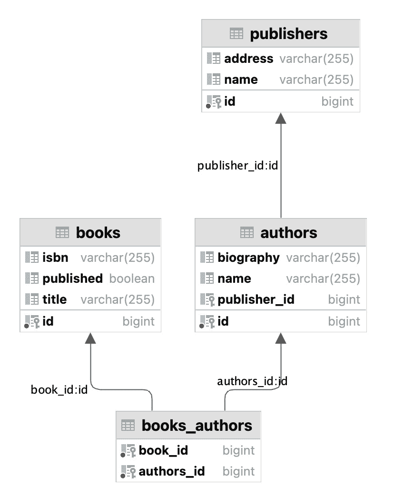
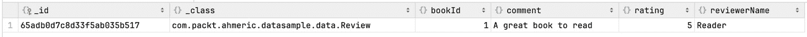
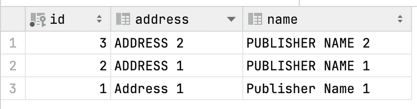

# 第四章：Spring Data：SQL、NoSQL、缓存抽象和批处理

欢迎来到*第四章*。在这里，我们将更深入地了解 Spring Data 方法。在本章中，我们想要了解 Spring Data 方法如何为我们工作。Spring Data 是 Spring Boot 生态系统中的关键部分。这将帮助您清楚地了解如何在 Spring Boot 3.0 中处理不同类型的数据库。

为什么本章很重要？在软件开发中，我们如何管理数据非常重要，而不仅仅是存储数据。本书的这一部分不仅关于研究 Spring Data 的各个部分，而且还关于将它们应用于实际场景。在本章中，我们将看到如何配置和使用 Spring Data，这对于数据管理活动非常有帮助。您将学习如何处理存储在 SQL 数据库中的结构化数据以及存储在 NoSQL 数据库中的非结构化数据，这对于各种类型的数据都是理想的。此外，我们将介绍缓存抽象是什么以及为什么它有助于使您的应用程序运行更快。另一个非常重要的主题是批处理，以及如何一次性处理大量数据。更进一步，您将学习如何安全地更改和更新数据的重要技术。

了解如何处理数据，无论是简单还是复杂，都是关键，并将有助于提高软件编程技能。在本章结束时，您不仅将了解理论，还将能够在实际项目中亲自动手，应用这些技能。我们将使用一个真实的项目，一个在线书店管理系统，向您展示事物是如何运作的。

在本章结束时，您将对 Spring Data 的理论和实践应用有很好的掌握。这对于任何开发者来说都是必不可少的，无论被视为经验丰富还是初出茅庐。

让我们开始吧。我们将看到 Spring Data 如何帮助您改变在项目中管理数据的方式。我们将把理论转化为实际技能，并帮助您作为开发者成长。

在本章中，我们将重点关注以下主要主题：

+   Spring Data 简介

+   使用 Spring Data 与 SQL 数据库

+   Spring Boot 中的 NoSQL 数据库

+   Spring Boot 缓存抽象

+   Spring Boot 批处理

+   数据迁移和一致性

# 技术要求

对于本章，我们将在本地机器上需要一些安装：

+   Docker Desktop

+   GitHub 仓库：您可以在以下位置克隆与*第四章*相关的所有仓库：[`github.com/PacktPublishing/Mastering-Spring-Boot-3.0/`](https://github.com/PacktPublishing/Mastering-Spring-Boot-3.0/)

下面是安装 Docker Desktop 的步骤：

1.  访问 Docker Desktop 网站：[`docs.docker.com/desktop/`](https://docs.docker.com/desktop/)

1.  按照**安装 Docker Desktop**菜单下的说明操作。它适用于各种操作系统，并提供了一个简单的安装过程。

# Spring Data 简介

在本节中，我们将探讨 Spring Data 的一般基本概念及其用途。我们还将检查它们在我们案例研究项目——在线书店管理系统中的应用。

**Spring Data**是 Spring 框架的一部分，它可以尽可能简化我们应用程序与数据的交互。其主要优点和最大优势是简化数据库操作的能力。这意味着您可以用更少的代码和复杂性执行查询数据库或更新记录等任务。

理解 Spring Data 将有助于您在有效处理数据方面提升技能——这是软件开发的关键因素之一。无论是小型应用程序还是复杂的企业系统，在数据层上实施有效的基于角色的访问对整个系统的性能和维护都起着重要作用。

在本章中，我们将展示 Spring Data 的主要特性以及它如何帮助您简化工作。了解这些概念将帮助您在软件项目中管理数据，从而使开发过程更加容易，并加快其流程。

因此，让我们带着 Spring Data 踏上这段有趣的旅程。这将是一次实用且富有信息性的旅程，到结束时，您将肯定能够熟练地使用 Spring Data 来管理自己的应用程序中的数据。

## 理解 Spring Data 的基本知识和好处

在本节中，我们将关注 Spring Data 的基础知识。我们首先将了解其核心概念和每个开发者都至关重要的好处。从那里，我们将进入设置 Spring Boot 项目并定义一些关键的 JPA 实体。通过采取这些小步骤，我们将逐步建立起 Spring Data 的坚实基础，这将使后续的应用程序更加高级。

我们将从 Spring Data 在 Spring Boot 生态系统中的强大工具以及它为何对您的项目有益开始。然后，我们将继续探讨设置项目并深入了解 Java 持久化 API（**JPA**）实体的实际部分。

在深入技术设置之前，让我们首先了解在项目中使用 Spring Data 的核心原则和优势。

### 探索 Spring Data 的核心概念

Spring Data 旨在简化 Java 应用程序与数据库的交互。以下是其一些基本概念：

+   **数据访问简化**：Spring Data 简化了数据访问操作。您不再需要为常见的数据库交互编写样板代码。我们将看到如何在不编写任何代码的情况下执行**创建、读取、更新和删除**（**CRUD**）操作。这将使我们的代码更易于阅读和管理。

+   **仓库抽象**：Spring Data 的一个关键特性是其仓库抽象。这使我们能够将数据库操作像函数一样在我们的框架中使用。如果我们不知道如何在特定数据库中编写查询，我们不需要担心。这种抽象使得它对所有支持的数据库都一样工作。它抽象了数据层，这意味着你可以更多地关注业务逻辑，而不是数据库的复杂性。

+   **支持多种数据库类型**：Spring Data 支持广泛的数据库类型，包括 SQL 和 NoSQL 选项。这种多功能性使其成为可能需要不同数据库技术的项目的宝贵工具。

### 使用 Spring Data 的好处

现在，让我们看看为什么 Spring Data 对你的开发过程有益：

+   **提高效率和生产力**：Spring Data 不仅减少了数据库操作中的样板代码，而且以最佳实践和高效的方式执行这些操作。在旧结构中，我们经常处理未关闭的连接问题。Spring Data 有效地管理所有连接池问题。

+   **易于学习和使用**：Spring Data 被设计成用户友好。只需翻几页，你就会明白我的意思。开发者可以快速学习如何使用它，并将其应用到他们的项目中。它与 Spring 生态系统的集成也意味着它可以与其他 Spring 技术无缝工作。

+   **提高代码质量和可维护性**：通过减少代码冗余和更干净的数据处理方法，Spring Data 提升了代码的整体质量。这使得你的应用程序在长期内更容易维护和更新。

随着我们逐步完成 Spring Boot 应用程序的设置和使用，你会更好地理解这些优势和概念。现在，我们已经对 Spring Data 是什么以及为什么它有优势有了基本了解，让我们继续设置我们的项目并定义我们的 JPA 实体。

## 设置你的 Spring Boot 项目

首先，让我们设置一个 Spring Boot 项目。这是任何 Spring 应用程序的起点。你可以遵循与 *第三章* 中相同的步骤。或者，你可以直接克隆 *技术要求* 部分提供的 Git 仓库。

在创建应用程序时，你需要以下基本依赖项：

```java
implementation 'org.springframework.boot:spring-boot-starter-data-jpa'
compileOnly 'org.projectlombok:lombok'
annotationProcessor 'org.projectlombok:lombok'
```

这个名为 Lombok 的库通常用于消除像 `getId` 和 `setId` 方法这样的样板代码。

通过这些步骤，你的 Spring Boot 项目就准备好了。现在，让我们定义一些 JPA 实体。

### 定义 JPA 实体：书籍、作者和出版社

在一个书店应用程序中，我们处理书籍、作者和出版社。让我们将它们定义为 JPA 实体。我们将创建以下三个类。你可以在 `model` 包下的仓库中看到它们：

```java
@Entity
@Table(name = "books")
@Data
public class Book {
    @Id @GeneratedValue
    private Long id;
    private String title;
    private String isbn;
}
@Entity
@Table(name = "publishers")
@Data
public class Publisher {
    @Id @GeneratedValue
    private Long id;
    private String name;
    private String address;
}
@Entity
@Table(name = "authors")
@Data
public class Author {
    @Id @GeneratedValue
    private Long id;
    private String name;
    private String biography;
}
```

每个 `Book`、`Author` 和 `Publisher` 实体都代表了我们书店系统的一个关键部分。通过使用 `@Data` 注解，我们简化了我们的代码。

### 理解 Spring Data 中仓库的作用

在定义我们的实体之后，我们需要创建仓库。Spring Data 中的**仓库**帮助我们轻松地与数据库交互。

为了为每个实体（`Book`、`Author`、`Publisher`）创建一个仓库，创建一个扩展 `JpaRepository` 的接口。此接口提供了常见数据库操作的方法。

对于 `Book`，它可能看起来像这样：

```java
public interface BookRepository extends JpaRepository<Book, Long> {}
```

这些仓库提供了一些通用的方法来保存、查找、删除和更新实体。例如，要查找所有书籍，你可以使用 `bookRepository.findAll()`。

这个设置将成为我们即将构建的 Spring Boot 应用程序的基础。到目前为止，你应该有一个包含实体和仓库的基本项目准备就绪。

现在，我们已经设置了一个带有 Spring Data 依赖项的 Spring Boot 项目，并定义了基本的 JPA 实体和仓库。这是我们使用 Spring Data 的工作基础。我们尚未连接到数据库。

在下一节中，我们将深入探讨如何使用 Spring Data 与 SQL 数据库。我们将查看在项目中使用 Spring Data 的简单有效的方法。

# 使用 Spring Data 与 SQL 数据库

对于处理 Spring Data 的开发者来说，了解其与 SQL 数据库的关系非常重要。**SQL 数据库**以其对数据管理的结构化方法而闻名。它们在各种应用程序中得到广泛应用。我们将在我们的在线书店管理系统中使用它们。

在本节中，我们将探讨 Spring Data JPA 如何与 SQL 数据库接口，重点关注 PostgreSQL 配置和复杂实体关系的创建。

## 使用 Docker 将 PostgreSQL 集成到 Spring Boot 中

首先，我们需要在我们的本地机器上有一个运行中的 PostgreSQL 服务器。最简单的方法是使用 Docker 容器。**Docker** 是一个简化应用程序及其依赖项设置和部署的工具。让我们看看如何使用 Docker 设置 PostgreSQL 并配置你的 Spring Boot 应用程序以连接到它。

### 使用 Docker 设置 PostgreSQL

使用 Docker，你可以轻松地安装和运行 PostgreSQL 数据库。这种方法为你的数据库提供了一个一致且隔离的环境，无论你的本地设置如何。

你已经按照 *技术要求* 部分的说明安装了 Docker Desktop。我们将使用一个 `Docker Compose` 文件，该文件也可以在 GitHub 仓库的根目录中找到。以下是一个使用 `Docker` `Compose` 文件的示例：

```java
    version: '3.1'
    services:
      db:
        image: postgres
        restart: always
        environment:
          POSTGRES_PASSWORD: yourpassword
          POSTGRES_DB: bookstore
        ports:
          - "5432:5432"
```

这将设置一个名为 `bookstore` 的数据库的 PostgreSQL 服务器。将 `yourpassword` 替换为你选择的密码。将此文件保存为 `docker-compose.yml` 在根源文件夹中。

在你的 `docker-compose.yml` 文件所在的目录中运行 `docker-compose up` 命令。此命令将下载 PostgreSQL 镜像并启动数据库服务器。

### 配置 Spring Boot 以连接到 PostgreSQL

现在 PostgreSQL 在 Docker 容器中运行，让我们配置我们的 Spring Boot 应用程序以连接到它：

1.  更新`application.properties`：打开您的 Spring Boot 项目中的`application.properties`文件。添加以下属性以配置到 PostgreSQL 服务器的连接：

    ```java
        spring.datasource.url=jdbc:postgresql://localhost:5432/bookstore
        spring.datasource.username=postgres
        spring.datasource.password=yourpassword
        spring.jpa.hibernate.ddl-auto=update
    ```

    确保将`yourpassword`替换为您在`Docker Compose`文件中设置的密码。`spring.jpa.hibernate.ddl-auto=update`属性有助于根据您的实体类管理数据库模式。

1.  验证连接：运行您的 Spring Boot 应用程序。在这个阶段，我们只能看到应用程序是否能够正确启动。在*在线书店实现实际 CRUD 操作*部分，我们将介绍 REST 控制器以验证它是否成功连接到 PostgreSQL 数据库。

通过这些步骤，您已成功将 PostgreSQL 数据库集成到您的 Spring Boot 应用程序中，使用 Docker。这种设置不仅简化了初始配置，还确保了开发和测试环境中数据库的一致性。现在，我们将更进一步，在下一节介绍对象之间的高级实体关系。

## 开发实体之间的复杂关系

在本节中，我们将专注于开发我们实体之间的复杂关系：`Book`、`Author`和`Publisher`。我们将使用 Spring Data 的注解驱动方法来链接这些实体，反映我们数据库设计中的现实世界联系。

在我们的书店应用程序中，我们创建了基本对象。现在，我们将把它们连接起来。让我们从`书籍`到`作者`的连接开始。

每本书可以有一个或多个作者，形成一个多对多关系。

这是我们在`Book`记录中表示它的方法：

```java
    @ManyToMany
    private List<Author> authors;
```

`@ManyToMany`注解表示每本书可以与多个作者相关联。这种关系是双向的，这意味着作者也可以与多本书相关联。在多对多关系中，你需要一个新的交叉表来链接这些表。这是数据库设计的一部分，因此我们将提及此功能，以免您在查看数据库中的表时感到惊讶。

现在，我们将把`作者`与`出版社`关联起来。一个作者可能关联到一个出版社。这是一个多对一的关系，因为多个作者可以被同一个出版社出版：

```java
    @ManyToOne
    private Publisher publisher;
```

这里的`@ManyToOne`注解表示每个作者都与一个出版社相关联，而一个出版社可以有多个作者。

`出版社`实体保持简单，因为它在此上下文中不需要建立新的关系。

在*图 4**.1*中，我们可以看到表及其之间的关系：



图 4.1 – 表的数据库图

图表中您可以看到的表是在我们启动应用程序时由 Spring Data 库生成的。您可以看到有一个额外的表叫做 `books_authors`。这个表用于 `books` 和 `authors` 表之间的多对多关系。

通过这种实现，我们在应用程序中应用了书籍、作者和出版社之间的现实世界联系。

在我们总结本节关于实体关系的内容时，我们在在线书店管理系统中定义了复杂的数据结构。接下来，我们将看到这些关系在实际场景中的工作方式。

## 在在线书店中实现实用的 CRUD 操作

在我们建立了复杂的实体关系后，让我们看看这些关系如何在在线书店管理系统中实际实现。我们将通过 REST 端点介绍 **创建、读取、更新、删除** （**CRUD**）操作，展示控制器如何与 PostgreSQL 数据库交互。

首先，我们将创建控制器类。让我们回顾一下 `book` 对象。您可以对 `Author` 和 `Publisher` 对象进行类似的修改。或者，您可以查看 GitHub 仓库 ([`github.com/PacktPublishing/Mastering-Spring-Boot-3.0/tree/main/Chapter-4-1-intorduction-spring-data/src/main/java/com/packt/ahmeric/bookstore/data`](https://github.com/PacktPublishing/Mastering-Spring-Boot-3.0/tree/main/Chapter-4-1-intorduction-spring-data/src/main/java/com/packt/ahmeric/bookstore/data)) 以获取所有三个对象的最新实现。

### 开发 CRUD 端点

现在，我们将动手操作，使这些对象可以从外部访问。首先，我们需要一个 `Repository` 类来管理实体。这是一个用于 `book` 对象的基本仓库类：

```java
@Repository
public interface BookRepository extends JpaRepository<Book, Long> { }
```

这个单行类将帮助我们使用许多常用方法，例如 `findAll()`、`save(book)` 和 `findById(id)`。这就是 Spring Data 的力量。

为了创建一个处理与书籍相关的请求的控制器类，我们引入了 `BookController` 类来处理书籍相关的操作。这个控制器将管理添加新书、检索书籍详情、更新书籍信息和删除书籍等操作。

因此，让我们引入一个新的类名为 `BookController`：

```java
@RestController
@RequestMapping("/books")
@RequiredArgsConstructor
public class BookController {
    private final BookRepository bookRepository;
    @PostMapping
    @CacheEvict(value = "books", allEntries = true) // Invalidate the entire books cache
    public ResponseEntity<Book> addBook(@RequestBody Book book) {
        Book savedBook = bookRepository.save(book);
        return ResponseEntity.ok(savedBook);
    }
    @GetMapping("/{id}")
    public ResponseEntity<Book> getBook(@PathVariable Long id) {
        Optional<Book> book = bookRepository.findById(id);
        return book.map(ResponseEntity::ok).orElseGet(() -> ResponseEntity.notFound().build());
    }
}
```

在这个简单的类中，您可以看到类名上方的新注解 – `@RestController` 和 `@RequestMapping`。如您所记，我们在 *第三章* 中使用过它们。但这里有一个新的注解：`@RequiredArgsConstructor`。这个注解也属于 Lombok。这个注解将在编译时创建一个构造函数，因此我们有一个没有样板代码行的清晰类。

在这个示例代码中，我们有两个端点用于创建书籍和通过 ID 获取书籍。这些是接受和返回 JSON 数据的 REST 端点。您可以看到我们正在使用来自`bookRepository`的默认方法，例如`findById()`和`save()`。我们并没有在我们的`Repository`类中编写它们。它们来自`JpaRepository`扩展。Spring Data JPA 仓库与 Hibernate 结合，有效地管理底层的 SQL 查询和事务，抽象复杂性并确保数据处理的顺畅。因此，我们甚至不需要写一行代码来在数据库中保存实体。我们只使用`save()`方法。

您可以在 GitHub 仓库中看到其他用于删除和查找所有更新的端点。如果您愿意，可以类似地创建`AuthorController`和`PublisherController`来管理作者和出版商。

正如我们介绍的表之间的关系，当我们添加带有其作者的书籍时，`books_authors`表将相应更新。

让我们进行一些 curl 请求来查看它是如何工作的。

### 使用 curl 请求进行实际操作演练

使用以下命令运行 Spring Boot 应用程序：

```java
./gradlew bootRun
```

现在，我们将按顺序运行以下请求：

1.  创建出版商：

    ```java
    curl -X POST --location "http://localhost:8080/publishers" -H "Content-Type: application/json" -d "{\"name\": \"Publisher Name\", \"address\": \"Address of the publisher\"}"
    ```

    这是响应：

    ```java
    {
      "id": 1,
      "name": "Publisher Name",
      "address": "Address of the publisher"
    }
    ```

1.  创建作者：

    ```java
    curl -X POST --location "http://localhost:8080/authors"
        -H "Content-Type: application/json"
        -d "{\"name\": \"Author Name\",
            \"biography\": \"A long story\",
            \"publisher\": {\"id\": 1}}"
    ```

1.  创建书籍：

    ```java
    curl -X POST --location "http://localhost:8080/books"-H "Content-Type: application/json" -d "{\"title\": \"Book title\",\"isbn\": \"12345\",\"authors\": [{\"id\": 1}]}"
    ```

如您所见，我们使用了链接对象的`id`。例如，当我们创建一个作者时，我们使用 ID 为 1 的出版商将作者链接起来。

在这个实际实施阶段，我们已经建立了如何在我们的控制器中创建功能端点来管理在线书店中的书籍、作者和出版商。这些端点与 PostgreSQL 数据库无缝交互，展示了在真实应用程序中使用 Spring Data 的强大和高效。

在掌握这一部分内容后，我们准备好学习我们旅程的下一步——将 NoSQL 数据库集成到 Spring Boot 中，并进一步扩展其数据管理功能。

# Spring Boot 中的 NoSQL 数据库

在研究了结构化 SQL 数据库之后，我们现在将深入研究 NoSQL 数据库。我们将看到它们比 SQL 数据库更加灵活。在本节中，我们将看到在 Spring Boot 3.0 中实现 NoSQL 数据库是多么容易。我们将在我们的书店管理系统应用程序中实现这个数据库连接。

## 探索 Spring Boot 中 NoSQL 数据库的集成

在我们的 Spring Boot 之旅的这个阶段，我们将转换方向，研究 NoSQL 数据库的集成，这是现代应用程序堆栈的一个基本组成部分。与传统的 SQL 数据库不同，**NoSQL 数据库**如 MongoDB 提供了一种不同的数据管理风格，因此它们适用于这种情况。在这里，我们将不仅了解这些好处，而且还将学习如何在现实世界的应用程序中有效地实现它们。

NoSQL 数据库因其能够灵活处理不同数据类型而备受赞誉，这些数据类型大多是未结构化或半结构化的。这种灵活性为面临多样化数据需求或甚至不断变化的数据结构的开发者提供了巨大的优势。在 NoSQL 的世界中，MongoDB 被视为面向文档的，这使得它成为需要可扩展和敏捷数据存储平台的应用程序的最佳数据存储选项之一。

关于将 NoSQL 数据库与 Spring Boot 集成的过程，整个过程得到了简化，并且非常容易完成。Spring Boot 与 MongoDB 等 NoSQL 数据库的良好集成方式实际上允许开发者将其直接插入到他们的应用程序中，而无需进行烦人的配置。这种集成开辟了应用程序开发的新天地，其前景围绕着构建更动态、可扩展和高效应用程序的潜力。

那种协同效应的最好之处在于在 Spring Boot 中使用 NoSQL 数据库。Spring Boot 的哲学是简化应用程序的开发，这与 NoSQL 的本质相辅相成，带来了可扩展性和灵活性。这种组合对于开发不仅涉及处理复杂数据结构，而且必须适应数据需求变化的应用程序尤其有效。

在我们的在线书店管理系统背景下，集成如 MongoDB 这样的 NoSQL 数据库不仅将为应用程序的功能增加大量价值，还将展示如何将这些最先进的技术家族结合起来的实际例子。我们可以使用 MongoDB 来集成用户评论或个性化推荐等功能，这些功能利用了由 NoSQL 数据库提供的灵活的数据建模。

当我们深入研究如何将 NoSQL 数据库集成到 Spring Boot 中时，我们不仅又获得了一个可用的工具，而且对各种数据库的工作原理有了更多的了解，这样我们就可以开发出更强大、更灵活且性能更快的应用程序。在这个适应和随着现代技术进步而发展的能力仍然是成功关键因素之一的领域中，这种知识是无价的。在接下来的章节中，我们将逐步在我们的项目中实现 MongoDB。

## 设置和配置 MongoDB

我们需要在本地机器上运行 MongoDB，就像在上一节中为 PostgreSQL 所做的那样。与 PostgreSQL 类似，MongoDB 可以在 Docker 容器中设置，确保数据库环境独立且一致。

您可以在此处看到我们 `docker-compose.yml` 文件的增强版本：

```java
version: '3.1'
services:
  db:
    image: postgres
    restart: always
    environment:
      POSTGRES_PASSWORD: yourpassword
      POSTGRES_DB: bookstore
    ports:
      - "5432:5432"
  mongodb:
    image: mongo
    restart: always
    ports:
      - "27017:27017"
    environment:
      MONGO_INITDB_DATABASE: bookstore
```

您也可以在 GitHub 仓库中找到相同的文件。您可以通过运行 `docker-compose up` 命令同时运行 MongoDB 和 PostgreSQL。

运行 MongoDB 实例后，我们需要更新我们资源文件夹中的 `application.properties` 文件。

这条单独的配置行将在 Spring Boot 应用程序和 MongoDB 之间创建一个连接：

```java
spring.data.mongodb.uri=mongodb://localhost:27017/bookstore
```

通过这个简单的配置更新，我们就可以将 MongoDB 连接到我们的本地机器。在下一节中，我们将介绍一个新的对象，并查看我们的应用程序如何与 MongoDB 一起工作。

## 构建 `Review` 对象及其仓库

正如我们对 `Book`、`Author` 和 `Publisher` 对象所做的那样，我们需要引入一个新的对象，称为 `Review.class`。您也可以在 GitHub 仓库的 `data` 包下查看它：

```java
@Document(collection = "reviews")
@Data
public class Review {
    @Id
    private String id;
    private Long bookId;
    private String reviewerName;
    private String comment;
    private int rating;
}
```

您可以看到与其他数据对象的不同之处。这里有一个新的注解叫做 `@Document`。这个注解指的是这个对象的集合。所以，我们在这个对象中放入的任何内容都将写入 `reviews` 集合。我们刚刚介绍了一些评论可能需要的基字段。

现在，我们还需要一个仓库来管理这个文档在 MongoDB 中的数据。让我们在 `repositories` 包下引入 `ReviewRepository` 类：

```java
public interface ReviewRepository extends MongoRepository<Review, String> { }
```

就这样！现在，我们可以在我们想要的地方管理数据。我们正在扩展 `MongoRepository` 而不是 JPA 仓库接口。这是 `BookRepository` 和 `AuthorRepository` 之间的唯一区别。因此，现在我们有了所有的 CRUD 功能，如 `findById()` 和 `save()`。此外，这可以针对更复杂的企业需求进行定制。我们可以在下一节开始实现 `Review` 对象的控制器。

## 在在线书店中实现混合数据模型

我们的项目现在已经演变成一个混合模型，集成了 SQL（PostgreSQL）和 NoSQL（MongoDB）数据库。因此，让我们将 `review` 对象暴露给 REST 世界，这样我们就可以在 MongoDB 中创建和读取评论。

我们需要在控制器包中创建一个新的控制器类：

```java
@RestController
@RequestMapping("/reviews")
@RequiredArgsConstructor
public class ReviewController {
    private final ReviewRepository reviewRepository;
    @PostMapping
    public ResponseEntity<Review> addReview(@RequestBody Review review) {
        Review savedReview = reviewRepository.save(review);
        return ResponseEntity.ok(savedReview);
    }
    @GetMapping("/{id}")
    public ResponseEntity<Review> getReview(@PathVariable String id) {
        Optional<Review> review = reviewRepository.findById(id);
        return review.map(ResponseEntity::ok).orElseGet(() -> ResponseEntity.notFound().build());
    }
}
```

如您所见，`BookController` 类和 `ReviewController` 类之间没有区别，因为我们已经将数据库层从仓库级别隔离出来。这两个端点暴露了 `GET` `review` 和 `POST` `review` 端点。您可以引入其余的 CRUD 端点，或者查看 GitHub 仓库。

让我们进行一些 `curl` 请求来查看它是如何工作的：

```java
curl -X POST --location "http://localhost:8080/reviews"
    -H "Content-Type: application/json"
    -d "{\"bookId\": 1, \"reviewerName\": \"Reader\", \"comment\": \"A great book to read\", \"rating\": 5}"
```

响应将如下：

```java
{
  "id": "65adb0d7c8d33f5ab035b517",
  "bookId": 1,
  "reviewerName": "Reader",
  "comment": "A great book to read",
  "rating": 5
}
```

记录的 `id` 由 `Review` 类中的 `@Id` 注解生成。

这是在 MongoDB 中的样子：



图 4.2 – MongoDB 数据视图

在这个图中，我们可以看到 MongoDB 如何在 `_class` 属性中标记我们的对象。在 Spring Boot 上下文中，对 NoSQL 数据库（以 MongoDB 为重点）的这种探索，扩大了我们对于在现代应用程序中管理多种数据类型的理解。通过在在线书店管理系统中实现 MongoDB，我们不仅丰富了应用程序的新功能，还拥抱了混合数据库方法的优点。

在我们总结本节内容时，我们通过 Spring Boot 的数据景观之旅仍在继续。接下来，我们将深入研究 Spring Boot 中的缓存抽象，我们将探讨优化应用程序性能的策略。从 NoSQL 数据库到缓存技术这一进展，体现了 Spring Boot 应用程序中数据管理的全面性。

# Spring Boot 缓存抽象

在本节中，我们将深入研究 Spring Boot 中的缓存抽象。这是最大化应用程序性能的重要辅助组件之一。我们将了解缓存抽象是什么，如何进行其设置，以及最后如何在我们的应用程序中使用它。我们将使用我们的在线书店管理系统来展示这一点。

由于缓存抽象位于您的缓存系统之上，它能够记住重复使用的信息，从而提高应用程序的执行速度。这就像把您常用的工具放在桌子上一样，这样您就不必每次都去寻找它们。这带来了时间上的节省，因为您的应用程序不必反复从数据库等慢速来源中获取这些信息。

现在我们来看看如何将缓存抽象添加到您的 Spring Boot 应用程序中，这将使您的应用程序运行更加顺畅。在上面的上下文中，缓存是可以用来快速显示不经常更改的书籍详情或用户评论的。

到这部分结束时，您将了解如何通过缓存使您的 Spring Boot 应用程序更快。这是您武器库中一个非常好的技能，用于开发更好、更快的应用程序。

## 理解缓存抽象

因此，让我们深入了解 Spring Boot 中的缓存抽象以及为什么它对应用程序的性能来说就像是一种超级能力。**缓存抽象**只是在某个特殊的内存空间中存储应用程序在任意应用程序中大量使用的一些信息。这样，应用程序就不必反复请求相同的信息——这可能会非常令人沮丧。

在 Spring Boot 中使用缓存抽象非常简单，并且能带来巨大的收益。例如，在我们的在线书店应用程序中，我们可以使用缓存来记住书籍的详情。通常情况下，每当有人想要查看一本书时，应用程序都必须从数据库中请求信息。有了缓存，当应用程序请求一本书的详情后，它会*记住*这些信息。因此，下次有人想查看那本书时，应用程序可以非常快速地显示详情，而无需再次回到数据库。这有助于使您的应用程序运行得更快，减少数据库的负载，并为您的用户提供更好的体验。

在本节的下一部分，我们将探讨如何在 Spring Boot 3.0 中轻松设置缓存以及它可以在您的应用程序中带来哪些不同。我们将通过一些实际步骤来展示如何在书店应用程序中集成缓存，以展示它如何加快那些不经常变化的功能的速度。如果您想构建高效且用户友好的应用程序，这是关键技术之一。

## 在应用程序中配置和使用缓存抽象

在本节中，我们将看到如何在 Spring Boot 3.0 中轻松实现缓存抽象，特别是在我们的书店应用程序中。缓存抽象不仅关乎性能提升，还关乎简化我们处理应用程序中频繁访问的数据。在 Spring Boot 3.0 中，这达到了前所未有的简单程度。

根据我们的书店应用程序条款，有效地使用缓存抽象意味着经常引用的数据，如书籍详情，可以在不反复击中数据库的情况下获得。从两个角度来看，这很重要：减少等待时间和减少服务器负载。

让我们看看在 Spring Boot 3.0 中实现缓存有多简单。启用项目中的缓存只需要两个简单的步骤：

1.  首先，我们需要将库添加到 `build.gradle` 文件中：

    ```java
    implementation 'org.springframework.boot:spring-boot-starter-cache'
    ```

1.  接下来，我们将在主类上添加 `@EnableCaching`：

    ```java
    @SpringBootApplication
    @EnableCaching
    public class BookstoreApplication {
        public static void main(String[] args) {
            SpringApplication.run(BookstoreApplication.class, args);
        }
    }
    ```

就这样！我们现在可以在需要的地方使用缓存了。

让我们看看如何在书店应用程序的 `BookController` 类中实现缓存。控制器已经具有几个端点——用于添加、获取、更新和删除书籍。我们将专注于集成 Spring Boot 的缓存能力以优化这些操作。

### 使用 @CacheEvict 添加、更新和删除书籍

当添加新书或更新现有书籍时，确保我们的缓存反映了这些更改至关重要。在这里使用 `@CacheEvict` 注解来使缓存失效。这意味着缓存数据被删除或更新，确保后续请求获取最新的数据。

它们看起来是这样的：

```java
@PutMapping("/{id}")
@CacheEvict(value = "books", allEntries = true)
public ResponseEntity<Book> updateBook(@PathVariable Long id, @RequestBody Book book) {...}
@PostMapping
@CacheEvict(value = "books", allEntries = true) // Invalidate the entire books cache
public ResponseEntity<Book> addBook(@RequestBody Book book) {...}
```

在 `addBook` 和 `updateBook` 方法中，`@CacheEvict(value = "books", allEntries = true)` 有效地清除了与书籍相关的所有条目的缓存。这种方法保证了缓存不会提供过时的信息。

类似地，当一本书被删除时，我们使用 `@CacheEvict(value = "books", key = "#id")` 来仅删除该特定书籍的缓存条目。这种有针对性的方法有助于我们保持缓存准确性，而不会影响其他缓存数据。

### 使用缓存进行高效检索

尽管提供的代码中没有明确显示，但获取操作（如 `getAllBooks` 或 `getBook`）可以使用 `@Cacheable` 进行优化。这个注解确保方法调用的结果被存储在缓存中，使得后续对相同数据的请求更快、更高效。

此外，我们还可以在存储库级别实现此功能。例如，我们可以引入一个查询并使其可缓存：

```java
    @Override
    @Cacheable( "books")
    Optional<Book> findById(Long id);
```

我们不需要某个分析器来看到差异；只需运行应用程序，看看你将如何获得对第二次调用的更快响应。

总结来说，Spring Boot 3.0 中的缓存抽象是优化数据检索过程的一种强大且简单直接的方法。我们看到了在书店应用程序中实现它的简便性。通过利用缓存控制注解，如`@CacheEvict`和`@Cacheable`，我们确保我们的应用保持响应性和高效性，并始终保持数据的准确性。

## 总之

在总结我们对 Spring Boot 中缓存抽象的探索时，我们了解到它在提升应用性能时为我们提供了显著的优点。我们注意到，缓存可以极大地提高数据的快速访问，尤其是像我们在线书店管理系统中的书籍详情这样的简单重复信息检索。我们从缓存抽象的实现中学习到，它不仅极大地减轻了数据库的负载，还提供了流畅、快捷的用户体验。

这次对缓存抽象的游览为我们提供了在当今快速发展的技术环境中绝对必要的实用工具。很明显，正确理解和使用缓存是开发 Spring Boot 中高效和响应性应用的重要关键。

接下来，我们将进入 Spring Boot 批处理的世界。我们将深入了解如何高效地处理大量数据，这对于旨在处理大量记录的应用程序来说是常见的。批处理是我们工具箱中的另一个关键工具，帮助我们从各个方面管理大规模数据，同时确保我们的应用能够很好地处理复杂任务，而不会被压垮。

# Spring Boot 批处理

现在，让我们看看 Spring Boot 最重要的功能之一：批处理。我们将探讨如何使用 Spring Boot 有效地管理和处理大量数据。当你的应用程序需要处理像导入大型数据集或一次性对大量记录执行操作这样的任务时，批处理尤为重要。

在本指南的这一部分，我们将涵盖三个主要领域。首先，让我们讨论 Spring Boot 中的批处理，为什么它在我们的讨论一开始就如此关键，以及它如何成为任何企业或与大量数据操作相关的应用的变革者。接下来，我们将详细介绍批作业的设置和执行——这是高效处理大规模数据任务的关键方面。

最后，但也是最有意思的，我们将探讨如何在我们的在线书店项目中实际实现批处理。想象一下，如果必须将数千本书或出版商详情上传到系统中将有多么不切实际——批处理将使这项任务变得极其可行。如果你将这些概念应用到书店中，你将真正感受到批处理在现实应用程序（如批量导入书籍）中的工作方式。

到本节结束时，你将牢固掌握 Spring Boot 中的批处理，并能够有效地在实际用例中运用它。这是需要了解的关键内容，尤其是在开发需要为多种目的进行高吞吐量数据管理的 Web 应用程序时。让我们开始吧，看看批处理如何增强我们的 Spring Boot 应用程序的功能。

## 理解 Spring Boot 中批处理的作用

**批处理**是一种轻量级且非常有效的处理大量数据的方法。它有点像在你的应用程序中有一个超级高效的装配线，其中大数据任务被分解并分批处理，特别是如果你的应用程序需要一次性处理数千条记录的重型工作。

Spring Boot 中的批处理将使管理此类大规模数据操作成为可能。它有助于组织、执行和自动化许多现代应用程序所需的批量数据处理。大多数批处理作业是连续过程，而不是一次性过程。记住，我们必须每周或每天向我们的平台引入新书、出版商和作者。批处理过程将自动以简单的方式为我们处理这些任务。

你将了解 Spring Boot 中批处理的重要性；你将能够处理涉及处理大量数据集并执行它们的场景，而系统不会受到影响。这对于从事数据密集型应用程序开发的开发者来说是一项必备技能，以确保你的应用程序能够处理大型任务而不会显得力不从心。随着我们的深入，你将开始看到批处理是如何实现的，以及它可能对你的应用程序的性能和效率产生的影响。

## 实现 Spring Batch

在所有这些理论信息之后，我们必须亲自动手实践，以更好地学习。

在本节中，我们将学习如何在 Spring Boot 3.0 中设置批处理过程。我们将介绍一个独立的批处理仓库应用程序，逐步向您展示如何处理诸如为我们的在线书店进行批量书籍导入等任务。

### 创建批处理应用程序

我们将首先设置一个新的 Spring Boot 项目，专门用于批处理。我们可以在项目中使用以下依赖项：

```java
dependencies {
    implementation 'org.springframework.boot:spring-boot-starter-data-jpa'
    implementation 'org.springframework.boot:spring-boot-starter-batch'
    compileOnly 'org.projectlombok:lombok'
    runtimeOnly 'org.postgresql:postgresql'
    annotationProcessor 'org.projectlombok:lombok'
    testImplementation 'org.springframework.boot:spring-boot-starter-test'
}
```

我们还添加了 PostgreSQL 依赖项，因为我们希望将大量数据导入 PostgreSQL 数据库。

### 介绍 Publisher 类

我们需要再次添加`Publisher`类，因为它位于`data`包下：

```java
@Entity
@Table(name = "publishers")
@Data
public class Publisher {
    @Id @GeneratedValue
    private Long id;
    private String name;
    private String address;
}
```

我们将在批量处理中处理`Publisher`对象。因此，我们需要与我们在项目中使用的完全相同的对象。

### 配置批量作业

让我们在我们的应用程序中定义一个批量作业。这包括指定作业将采取的步骤，例如读取数据、处理数据，然后将结果写入。创建一个名为`config`的包，并创建一个`BatchConfig.java`文件。我们需要做的所有事情都将在这个文件中完成。

首先，我们需要了解这里的流程。我们的示例代码将有一个作业，但根据需求，我们可以定义多个作业。

这就是作业的样子：

```java
  @Bean
    public Job importPublisherJob(JobRepository jobRepository, Step step1) {
        return new JobBuilder("importPublisherJob", jobRepository)
                .incrementer(new RunIdIncrementer())
                .start(step1)
                .build();
    }
```

如您所见，我们只有一个作业仓库和步骤。在我们的例子中，我们有一个步骤，但根据需求，我们可能有多个步骤。

让我们看看`Step`函数，因为它将向我们解释如何构建一个步骤：

```java
@Bean
public Step step1(JobRepository jobRepository,
                  PlatformTransactionManager transactionManager,
                  ItemReader<Publisher> reader,
                  ItemProcessor<Publisher, Publisher> processor,
                  ItemWriter<Publisher> writer) {
    StepBuilder stepBuilder = new StepBuilder("step1",jobRepository);
    return stepBuilder.<Publisher, Publisher >chunk(10, transactionManager)
            .reader(reader)
            .processor(processor)
            .writer(writer)
            .build();
}
```

如您所见，一个步骤有一个`reader`、`processor`和`writer`方法。这些方法的函数在它们的名称中是隐含的。这些函数基本上读取数据，如果需要，处理数据，对它进行一些处理，如设置`地址`和`名称`值，然后将其写入仓库。让我们在下一节逐一查看它们。

### 读取、处理和写入数据

对于批量作业中的每个步骤，定义应用程序将如何读取、处理和写入数据。

在前面的代码示例中，您可以了解如何从**逗号分隔值**（**CSV**）文件中读取发布者数据，将其处理以映射到您的发布者实体，然后将它写入数据库。

```java
@Bean
public FlatFileItemReader<Publisher> reader() {
    return new FlatFileItemReaderBuilder<Publisher>()
            .name("bookItemReader")
            .resource(new ClassPathResource("publishers.csv"))
            .delimited()
            .names(new String[]{"name", "address"})
            .fieldSetMapper(new BeanWrapperFieldSetMapper<>() {{
                setTargetType(Publisher.class);
            }}).linesToSkip(1)
            .build();
}
```

在`reader`中，我们定义了读取数据的位置以及如何解析数据。我们还将数据映射到我们的实体对象，在`processor`函数中，我们可以将其转换为所需的对象或对象。

```java
@Bean
public ItemProcessor<Publisher, Publisher> processor() {
    return publisher -> {
        publisher.setAddress(publisher.getAddress().toUpperCase());
        publisher.setName(publisher.getName().toUpperCase());
        return publisher;
    };
}
```

这里是`processor`函数。我们可以在该函数中完成所有的处理步骤。例如，我已经将文本转换为大写。

```java
@Bean
public JpaItemWriter<Publisher> writer() {
    JpaItemWriter<Publisher> writer = new JpaItemWriter<>();
    writer.setEntityManagerFactory(entityManagerFactory);
    return writer;
}
```

最后，这是`writer`对象；它从处理器获取处理后的数据并将其写入数据库。在下一步中，我们将执行我们的应用程序并讨论输出。

## 执行批量作业

一旦设置批量作业，它就会在事件或计划触发时运行。这有助于触发作业以启动对大数据集的处理和操作，这是一个非常高效的作业任务管理过程。

您可以在`Resources`文件夹中创建一个简单的 CSV 文件。我们可以将其命名为`publishers.csv`。这个名字应该与`reader`函数中的文件名匹配。示例数据如下：

`名称，地址`

`发布者名称` `1,地址 1`

`发布者名称` `2,地址 2`

您可以写尽可能多的行。我们可以运行我们的书店批量应用程序。我们将看到这些值已经被导入我们的 PostgreSQL 数据库作为处理后的数据（见*图 4**.3*）。



图 4.3 – 批量操作后的发布者表

如我们在*图 4**.3*中看到的那样，在导入时值被转换为大写。

通过这样的批量处理，这可以正确地管理将通过我们的在线书店应用程序处理的大量数据任务。这也使得我们的数据处理高效，并且随着应用程序的运行，可以扩展以管理数据库中的大规模数据操作。

总结我们对 Spring Boot 3.0 中批量处理的探索，我们获得了关于高效处理大量数据集的宝贵见解。我们看到了如何将庞大的数据任务分解成可管理的块，这不仅简化了过程，而且有助于提高应用程序的性能。在我们的在线书店的背景下，批量处理已经证明了在管理大量数据，如批量出版商导入时，这一功能的重要性。

在这次旅程中，我们了解到批量处理不仅是一个技术需求，而且也是处理 Spring Boot 中智能密集型操作的重要战略方式。当与需要将处理大量数据作为其业务工作负载一部分的应用程序一起工作时，这种洞察力变得尤为重要，这些数据在后台定期和规律性地处理。

现在，随着我们进入下一部分，我们准备深入探讨数据迁移和一致性。我们已经看到了一些强大的策略，这些策略可以在不留下任何缝隙的情况下保持和演进我们应用程序的数据结构。确保我们应用程序处理数据不仅保持高效，而且随着时间的推移更加可靠和坚固，这是一个重要的方面。因此，让我们继续前进，准备好迎接新的挑战，从而加强我们对 Spring Boot 这些高级功能的掌握。

# 数据迁移和一致性

在这个关键部分，我们将探讨使用 Spring Boot 进行数据迁移和一致性。我们将讨论如何在不影响精度或造成问题的前提下，实际上迁移甚至修改我们应用程序中的关键数据。我们将详细介绍一些数据迁移的策略，并特别关注像 Liquibase 这样的工具，它能够实现此类过程的管理甚至自动化。

在此之前，我们将从数据迁移策略的介绍开始，并探讨为什么这些策略对于保持应用程序健康至关重要。然后，我们将继续使用 Liquibase 作为核心工具的实践步骤进行数据迁移实施。具体来说，我们将了解如何将 Liquibase 集成到项目中，并使用它来管理数据库变更。

这些策略将在我们的在线书店中得到实际应用。我们将看到如何通过应用数据迁移和一致性技术来添加新功能，这些技术可以保持现有数据的一致性和可靠性。让我们开始，解锁管理数据变更平稳高效的能力。

## 探索数据迁移策略和工具，如 Liquibase

在本节中，我们将深入探讨 **数据迁移策略**。我们将关注理解其重要性以及工具如 Liquibase 的重要性。**数据迁移**涉及将数据从一个系统移动到另一个系统，或从一个数据库版本移动到另一个版本，以安全、高效和可靠的方式进行。这是一个至关重要的过程，尤其是在更新或改进您的应用程序时。

**Liquibase** 是一个关键工具，就像一位熟练的建筑师，为您的数据迁移提供支持。它帮助管理数据库版本，跟踪变更，并在不同的环境中一致地应用这些变更。此工具使用简单的格式来定义数据库变更，使得跟踪和实施变更变得更加容易。

如果我们理解和应用了像 Liquibase 这样的数据迁移工具的策略，那么我们将能够非常有效地处理我们应用程序需求的变化。

当我们结束本节时，我们正准备深入到确保数据一致性的世界，这基于我们对迁移及其发生方式的理解。接下来的主题将关注在数据变更过程中维护数据完整性的技术，如前一个主题所述。请继续关注，我们将继续在 Spring Boot 应用程序数据管理错综复杂的领域中导航。

## 使用 Liquibase 实施数据迁移的实用步骤

当涉及到更新或更改您应用程序的数据库时，数据迁移是一个关键步骤。在本节中，我们将介绍实施数据迁移的实际步骤。我们将使用 Liquibase。我们将看到它是一个强大的工具，有助于管理数据库变更。

### 将 Liquibase 集成到您的项目中

第一步是将 Liquibase 添加到您的项目中。您可以打开您的书店应用程序，或者您可以在您的 Spring Boot 应用程序中遵循以下步骤来实施 Liquibase。由于我们从一开始就使用 Gradle，我们需要在 `build.gradle` 文件中添加一个依赖项：

```java
implementation 'org.liquibase:liquibase-core'
```

这将导入您项目所需的所有库。

### 设置 Liquibase 配置

接下来，您需要在您的应用程序中配置 Liquibase。这包括指定数据库连接属性和变更日志文件的路径，该文件将包含您想要应用的所有数据库变更。在我们的应用程序中，我们将按照以下方式更新 `application.properties` 文件：

```java
spring.liquibase.change-log=classpath:/db/changelog/db.changelog-master.yaml
```

由于我们已经在此处添加了数据库连接设置，我只是在提及与 Liquibase 相关的行。

### 创建 Liquibase 变更日志

Liquibase 的变更日志文件是您定义数据库变更的地方，例如创建新表、添加列或修改现有结构。变更以 XML、JSON、YAML 或 SQL 格式编写。以下是我们以 YAML 格式提供的示例：

```java
databaseChangeLog:
  - includeAll:
      path: db/changelog/changes/
```

这里，我们使用了`includeAll`方法。这意味着检查路径，按字母顺序排序文件，并逐个执行它们。还有另一种方法，我们可以用`include`定义每个文件，Liquibase 将遵循此文件中的顺序，而不是文件夹中的文件。

### 执行迁移

一旦创建变更日志文件，Liquibase 就有能力在您的数据库上执行这些变更。这可以在应用程序启动时自动完成，或者通过手动运行 Liquibase 命令来完成。当执行发生时，变更日志被 Liquibase 读取，然后，按照`databaseChangeLog`中定义的顺序或数据库中的字母顺序，逐个执行变更。

按照这些步骤进行，将使你能够有效地在你的数据库项目中处理此类变更，并保持控制，从而降低在迁移过程中犯错的概率。当我们有随着时间的推移而演化的应用程序时——比如我们的在线书店——这种方法的这种做法变得至关重要，因为数据完整性和一致性至关重要。

接下来，我们将探讨如何在我们的书店应用程序中使用 Liquibase。

## 在在线书店中实施迁移策略

现在，让我们将我们关于数据迁移策略的知识应用到我们的在线书店项目中。这种实际实施将侧重于在整个过程中集成新功能和维护数据一致性。假设我们有一个新的需求，需要在`books`表中添加一个`published`列。我们需要在不破坏数据且不手动接触数据库服务器的情况下处理这个需求。当我们需要在另一个平台上运行我们的应用程序时，我们需要确保我们不需要手动处理数据结构；它将由应用程序处理。

### 设置 Liquibase 进行迁移

我们已经在我们的书店应用程序中介绍了 Liquibase 的依赖和配置。现在，我们将介绍一个变更日志文件。

让我们在`resources/db/changelog/`目录下创建一个名为`changes`的文件夹。这是 Liquibase 监听的文件夹。然后创建一个名为`001-add-published-column.yaml`的文件。命名很重要，有两个原因：正如我们之前提到的，Liquibase 将按字母顺序排序文件并相应地执行它们。我们需要保持这种排序的一致性，并且最新的变更始终需要放在列表的末尾。第二个原因是，当我们读取文件名时，我们需要理解它包含的内容。否则，当我们需要跟踪某些变更时，找到特定文件需要花费很长时间。

这里是一个示例 YAML 文件，用于向`books`表添加一个`published`列：

```java
databaseChangeLog:
  - changeSet:
      id: 1
      author: ahmeric
      changes:
        - addColumn:
            tableName: books
            columns:
              - column:
                  name: published
                  type: boolean
                  defaultValue: false
```

在阅读内容时，你可以理解所有这些字段的意义。在这里，`author`是实现此变更的开发者的名字。它基本上添加了一个名为`published`的新列，默认值是`false`。

这足以更改数据库中的表，但我们还需要通过更新我们的`Book`实体来确保它在我们的应用程序中保持对齐：

```java
@Entity
@Table(name = "books")
@Data
public class Book {
    @Id @GeneratedValue
    private Long id;
    private String title;
    private String isbn;
    @ManyToMany
    private List<Author> authors;
    private Boolean published;
}
```

因此，当我们检索或保存数据时，我们将相应地管理数据库表。

### 执行迁移

准备好更改日志后，我们运行 Liquibase 来应用这些更改。此过程将在我们的数据库中的书籍表中创建新列，而不会干扰现有数据。这是经过仔细考虑的，以确保书店的用户不会出现停机或服务中断。

当你检查你的数据库时，你会看到新列已经被创建，正如你在*图 4.4*中可以看到的那样：


图 4.4 – 更新的书籍表

在我们进行这些更改的同时，我们持续确保数据一致性得到维护。这涉及到检查新数据是否与现有数据结构一致，并遵循所有完整性规则。

我们现在已经了解到，我们应该谨慎处理我们在线书店的新功能添加。仔细的数据迁移有助于新列顺利添加到`books`表中，从而保持数据的一致性和可靠性。这对于保持书店的时效性和对用户的有效性至关重要。

在本节中，我们获得了在应用开发中所需管理数据的知识和技能。这使我们为未来的挑战做好准备，因此有助于我们的应用程序在数字世界中保持相关性。

如 Liquibase 之类的工具使我们能够安全有效地更改我们的数据库。这对于在不损害现有功能的情况下更新我们的应用程序非常重要。

这些想法已经应用于在线书店，展示了理论如何在现实生活中得到实践。它使我们的应用在增长的同时保持准确性和可靠性。

这一部分信息量很大，并为我们提供了必要的技能和知识。这些对于任何 Spring Boot 应用程序开发者来说都是至关重要的。继续前进，这些关于数据管理的课程将证明是一个坚实的基础。它们将指导你开发不仅功能性强，而且数据结构坚固的应用程序。

# 摘要

随着我们进入本章的结尾，让我们回顾一下我们收集到的关键学习和见解。本章深入探讨了使用 Spring Boot 3.0 的数据管理世界，涵盖了任何接触此强大框架任何方面的开发者都至关重要的广泛主题。你现在应该已经掌握了 Spring Boot 中的数据管理功能，因为它们是构建健壮、高效和可扩展应用程序的基础。在本章完成后获得的技能不仅对后端开发至关重要，而且在应对现代应用开发带来的复杂性和不确定性时也非常有用。

下面是我们所涵盖的内容：

+   **Spring Data 简介**: 我们从 Spring Data 的基础开始，了解这种数据访问技术如何简化 Spring 应用程序中的数据访问。

+   **Spring Data 中的 SQL 数据库**: 我们还涉及了数据库集成，包括 PostgreSQL，以及设置简单数据源和包含多个数据源的数据源，以及如何处理复杂的关系实体。

+   **Spring Boot 中的 NoSQL 数据库**: 本章引导我们了解 NoSQL 数据库的集成，特别是 MongoDB，指出它们提供的灵活性和扩展选项。

+   **数据迁移和一致性**: 我们深入探讨了数据迁移的策略，提到了 Liquibase 等工具，这些工具在确保数据完整性在转换过程中不被丢失时非常有用。

+   **Spring Boot 中的缓存抽象**: 这个主题真正让我们了解了缓存抽象，并提出了在寻求提高应用程序性能时其重要性。

+   **Spring Boot 中的批处理**: 我们探讨了批处理的概念，这在有效处理大量数据集时非常重要。

+   **实际应用**: 我们在关于在线书店管理系统的真实项目中实际应用了这些概念，展示了在 Spring Boot 中描述的数据管理策略的具体实现。

随着本章的结束，请记住，学习路径和 Spring Boot 的掌握是一个持续的过程。技术变化相当频繁，跟上这些变化将大大有助于在开发应用程序方面变得有效。继续探索，继续编码，让本章的知识成为构建更复杂、更高效的 Spring Boot 应用程序的垫脚石。

在*第五章*中，我们将学习高级测试策略。这些知识将帮助我们有效地进行应用测试时获得信心。我们将了解单元测试和集成测试之间的差异，测试应用反应式组件，以及确保应用功能的安全性。除此之外，实现将展示对 Spring Boot 生态系统中的**测试驱动开发**（**TDD**）的广泛理解。
